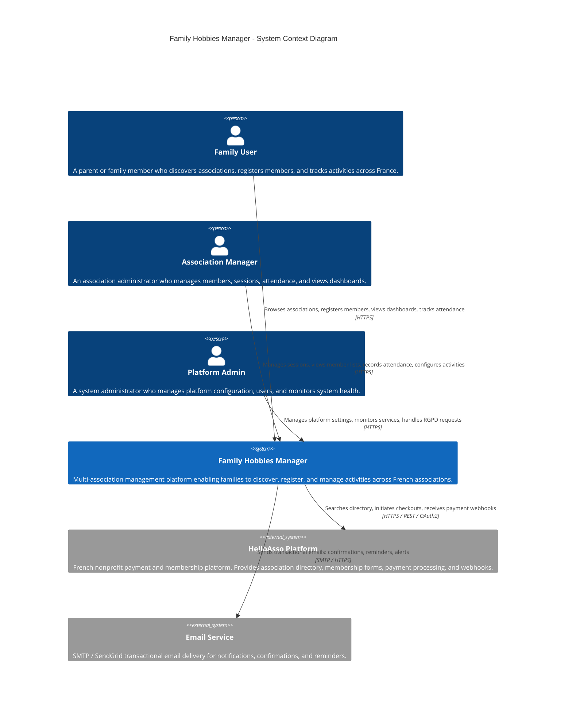
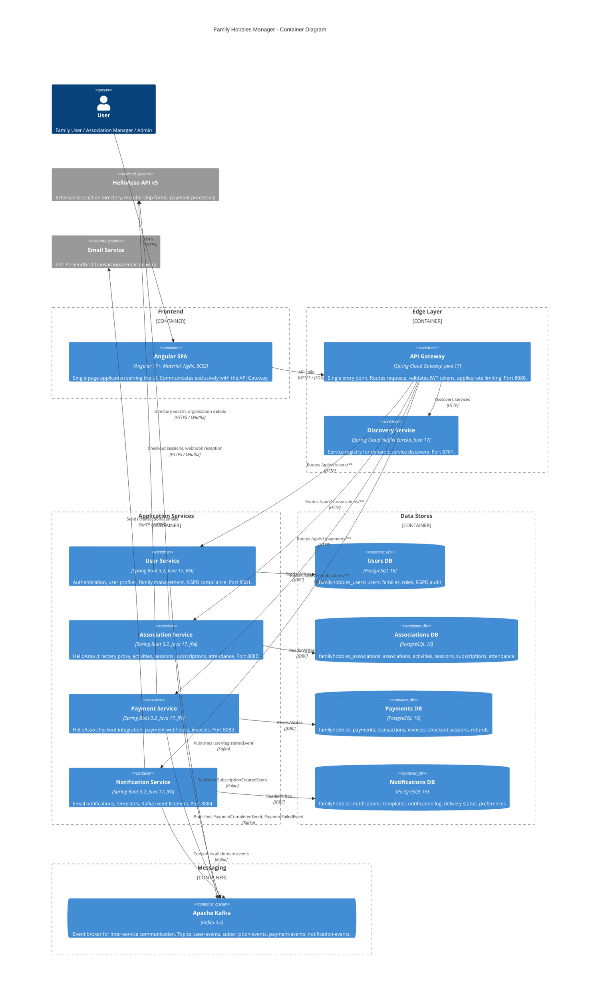
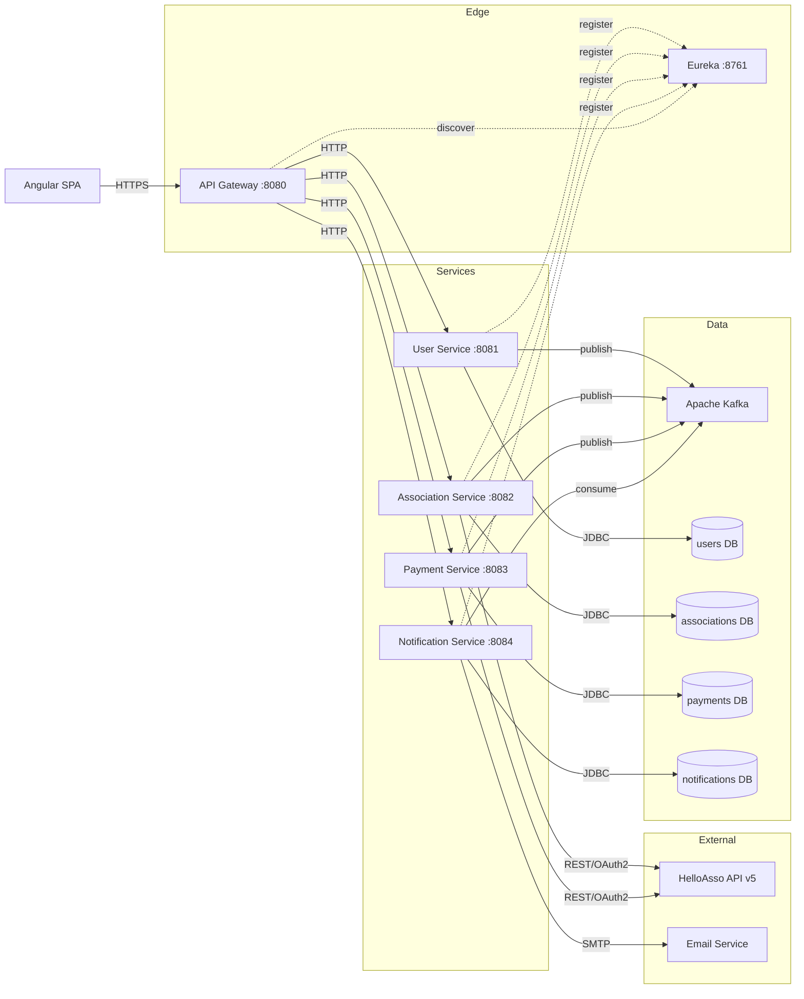

# 00 - System Overview

> **Family Hobbies Manager** -- Multi-Association Management Platform
> Architecture Document Series | Document 0 of 12

---

## Table of Contents

1. [Executive Summary](#1-executive-summary)
2. [Enterprise Stack Alignment](#2-enterprise-stack-alignment)
3. [C4 Context Diagram](#3-c4-context-diagram)
4. [C4 Container Diagram](#4-c4-container-diagram)
5. [Technology Stack Summary](#5-technology-stack-summary)
6. [Architecture Principles](#6-architecture-principles)
7. [Service Landscape](#7-service-landscape)
8. [Document Index](#8-document-index)

---

## 1. Executive Summary

**Family Hobbies Manager** is a portfolio fullstack application built to demonstrate production-grade
competencies aligned with enterprise technology requirements. The platform enables French families to
discover associations (sport, dance, music, theater, etc.) across any location in France, register
members, manage subscriptions, track events and courses, and monitor attendance -- all through a
unified dashboard.

The application integrates with the **HelloAsso** platform (the leading French nonprofit payment and
membership platform) and adds significant value on top of it by providing:

- **Family grouping** and multi-member management
- **Cross-association dashboards** (one family, multiple associations)
- **Attendance tracking** per session and course
- **Course and event scheduling** with calendar views
- **Notification orchestration** via Kafka event-driven messaging
- **RGPD compliance** and user data management

The system is composed of **6 microservices**, an **Angular 17+ SPA**, **4 PostgreSQL databases**,
and **Apache Kafka** for inter-service communication -- all orchestrated via Docker Compose and
deployable to OpenShift or any Kubernetes-based platform.

---

## 2. Enterprise Stack Alignment

The following table maps each enterprise technology requirement to its concrete implementation in this
project. Every technology choice was made deliberately to demonstrate transferable expertise.

| Enterprise Requirement | Project Implementation | Evidence / Details |
|----|----|----|
| **PostgreSQL** | Database-per-service pattern with PostgreSQL 16 | 4 isolated databases: `familyhobbies_users`, `familyhobbies_associations`, `familyhobbies_payments`, `familyhobbies_notifications`. Each service owns its schema exclusively. |
| **Java 17** | All 6 backend services run on Java 17 LTS | Language features used: records, sealed classes, pattern matching, text blocks, enhanced switch expressions. |
| **Spring Boot 3.2.x** | Core framework for every microservice | Auto-configuration, actuator health endpoints, externalized configuration via profiles (`dev`, `test`, `prod`). |
| **Angular 17+** | Frontend SPA with standalone components | Lazy-loaded feature modules, signals, new control flow syntax (`@if`, `@for`), SSR-ready architecture. |
| **JPA / Hibernate** | Entity management in all data services | Spring Data JPA repositories, entity auditing (`@CreatedDate`, `@LastModifiedDate`), optimistic locking (`@Version`), custom JPQL queries. |
| **Liquibase** | Schema migrations for all 4 databases | Versioned changesets per service, rollback support, environment-specific contexts, CI migration validation. |
| **CI/CD (GitLab CI / Jenkins)** | GitHub Actions pipeline (transferable) | Multi-stage pipeline: lint, test, build, Docker image push, integration tests. YAML-based -- directly transferable to GitLab CI or Jenkins declarative pipelines. |
| **Apache Kafka** | Inter-service event-driven communication | Topics for domain events: `user-events`, `subscription-events`, `payment-events`, `notification-events`. Avro schema registry compatible. |
| **Docker / OpenShift** | Docker Compose local, OpenShift-ready Dockerfiles | Multi-stage Dockerfiles (build + runtime), non-root users, health checks, resource limits. Helm chart structure prepared for OpenShift deployment. |
| **Microservices + REST** | 6-service architecture with REST APIs | OpenAPI 3.0 specs per service, versioned APIs (`/api/v1/`), HATEOAS links where appropriate, consistent error response format. |
| **JUnit / Playwright / Jest** | 3-layer test strategy | **Unit**: JUnit 5 + Mockito (backend), Jest (frontend). **Integration**: Testcontainers (PostgreSQL, Kafka). **E2E**: Playwright with Page Object Model. |
| **Linux** | All services run on Alpine/Debian containers | Base images: `eclipse-temurin:17-jre-alpine`. Non-root execution. Linux-native logging to stdout/stderr. |
| **Spring Cloud** | Eureka, Gateway, Config Server, Resilience4j | Service discovery, centralized routing, circuit breakers (`@CircuitBreaker`), retry policies, rate limiting. |
| **Batch Processing** | Spring Batch 5.x jobs | Scheduled jobs: HelloAsso data sync, subscription renewal reminders, attendance report generation, stale session cleanup. |
| **RGAA Accessibility** | Angular Material + a11y compliance | ARIA attributes, keyboard navigation, color contrast ratios (WCAG 2.1 AA), screen reader compatibility, `@angular/cdk/a11y` focus trap and live announcer. |
| **Monitoring / Observability** | Structured logging, ELK/Graylog-ready | Logback JSON encoder, correlation IDs propagated via MDC, Spring Boot Actuator metrics, Prometheus-compatible endpoints, Micrometer tracing. |
| **SAFe** | Delivery roadmap follows SAFe PI structure | 4 Program Increments, each with 5 iterations. Features decomposed into enablers and stories. See `12-delivery-roadmap.md`. |

---

## 3. C4 Context Diagram

The Context diagram shows the system boundary and its interactions with external actors and systems.



### Actor Descriptions

| Actor | Role | Key Actions |
|----|----|----|
| **Family User** | Primary end user (parent/guardian) | Browse association directory, register family members, manage subscriptions, view cross-association dashboard, receive notifications |
| **Association Manager** | Association administrator | Create/manage sessions and courses, record attendance, view member lists, configure activity schedules, export reports |
| **Platform Admin** | System operator | User management, service monitoring, RGPD data requests, platform configuration, batch job management |
| **HelloAsso Platform** | External system | Association directory search, membership form management, payment checkout, webhook notifications for payment events |
| **Email Service** | External system | Transactional email delivery for registration confirmations, payment receipts, attendance reminders, session notifications |

---

## 4. C4 Container Diagram

The Container diagram shows the high-level technology choices and how containers communicate.



### Container Summary

| Container | Technology | Port | Database | Primary Responsibility |
|----|----|----|----|----|
| **Angular SPA** | Angular 17+, Material, NgRx | 4200 (dev) / 80 (prod) | -- | User interface, routing, state management |
| **API Gateway** | Spring Cloud Gateway | 8080 | -- | Request routing, JWT validation, rate limiting, CORS |
| **Discovery Service** | Spring Cloud Eureka | 8761 | -- | Service registry, health monitoring |
| **User Service** | Spring Boot 3.2, JPA | 8081 | `familyhobbies_users` | Auth, profiles, families, RGPD |
| **Association Service** | Spring Boot 3.2, JPA | 8082 | `familyhobbies_associations` | Directory, activities, sessions, attendance |
| **Payment Service** | Spring Boot 3.2, JPA | 8083 | `familyhobbies_payments` | Checkout, webhooks, invoices |
| **Notification Service** | Spring Boot 3.2, JPA | 8084 | `familyhobbies_notifications` | Email dispatch, templates, event consumption |
| **PostgreSQL** | PostgreSQL 16 | 5432 | 4 databases | Persistent storage per service |
| **Apache Kafka** | Kafka 3.x | 9092 | -- | Event-driven inter-service messaging |

---

## 5. Technology Stack Summary

### Backend

| Technology | Version | Purpose |
|----|----|----|
| Java | 17 LTS | Primary language for all backend services |
| Spring Boot | 3.2.x | Application framework, auto-configuration, actuator |
| Spring Cloud | 2023.0.x | Service discovery, gateway, config, resilience |
| Spring Cloud Gateway | 2023.0.x | API gateway with reactive routing and filters |
| Spring Cloud Netflix Eureka | 2023.0.x | Service registry and discovery |
| Spring Security | 6.2.x | Authentication, authorization, JWT, OAuth2 |
| Spring Data JPA | 3.2.x | Repository abstraction over Hibernate |
| Hibernate | 6.4.x | ORM, entity mapping, query generation |
| Spring Kafka | 3.1.x | Kafka producer/consumer abstraction |
| Spring Batch | 5.1.x | Batch processing, scheduled jobs |
| Resilience4j | 2.2.x | Circuit breaker, retry, rate limiter, bulkhead |
| Liquibase | 4.25.x | Database schema migration and versioning |
| Lombok | 1.18.x | Boilerplate reduction (getters, builders, etc.) |
| MapStruct | 1.5.x | Compile-time DTO/entity mapping |
| Jackson | 2.16.x | JSON serialization/deserialization |
| Logback | 1.4.x | Structured JSON logging |

### Frontend

| Technology | Version | Purpose |
|----|----|----|
| Angular | 17+ | Frontend SPA framework with standalone components |
| Angular Material | 17+ | UI component library with RGAA accessibility |
| NgRx | 17+ | Reactive state management (auth, UI, domain state) |
| RxJS | 7.x | Reactive programming for async operations |
| SCSS | -- | CSS preprocessor for theming and component styles |
| Angular CDK | 17+ | Accessibility primitives (a11y, overlay, drag-drop) |
| TypeScript | 5.3+ | Type-safe JavaScript superset |

### Data and Messaging

| Technology | Version | Purpose |
|----|----|----|
| PostgreSQL | 16 | Relational database (one per service) |
| Apache Kafka | 3.x | Event streaming and inter-service messaging |
| Zookeeper / KRaft | 3.x | Kafka cluster coordination |

### Infrastructure

| Technology | Version | Purpose |
|----|----|----|
| Docker | 24+ | Container runtime for all services |
| Docker Compose | 2.x | Local multi-container orchestration |
| Nginx | 1.25+ | Production frontend static file server and reverse proxy |

### Testing

| Technology | Version | Layer | Purpose |
|----|----|----|----|
| JUnit 5 | 5.10.x | Unit / Integration | Java test framework |
| Mockito | 5.x | Unit | Mock framework for isolated unit tests |
| Testcontainers | 1.19.x | Integration | Real PostgreSQL and Kafka in Docker for integration tests |
| Spring Boot Test | 3.2.x | Integration | Application context loading, MockMvc, WebTestClient |
| Jest | 29.x | Unit | Angular component and service unit tests |
| Playwright | 1.40+ | E2E | Cross-browser end-to-end test automation |
| Jacoco | 0.8.x | Coverage | Code coverage reporting with minimum thresholds |

### Observability

| Technology | Purpose |
|----|----|
| Spring Boot Actuator | Health checks, info, metrics endpoints |
| Micrometer | Metrics collection, Prometheus-compatible export |
| Logback JSON Encoder | Structured JSON log output for ELK/Graylog ingestion |
| MDC Correlation IDs | Request tracing across services via `X-Correlation-Id` header |
| Sleuth / Micrometer Tracing | Distributed tracing (Zipkin/Jaeger compatible) |

---

## 6. Architecture Principles

### 6.1 Database-per-Service Isolation

Each microservice owns its database exclusively. No service may read from or write to another
service's database. This enforces bounded contexts, enables independent scaling, and allows
each service to choose its own schema evolution strategy.

```
user-service         --> familyhobbies_users
association-service  --> familyhobbies_associations
payment-service      --> familyhobbies_payments
notification-service --> familyhobbies_notifications
```

**Consequence**: Cross-service data needs are satisfied via Kafka events or synchronous API calls
through the gateway -- never via shared database access.

### 6.2 Event-Driven Communication via Kafka

Services communicate asynchronously through domain events published to Apache Kafka topics.
This decouples producers from consumers, enables eventual consistency, and provides a natural
audit trail.

| Event | Producer | Consumer(s) | Topic |
|----|----|----|----|
| `UserRegisteredEvent` | user-service | notification-service | `user-events` |
| `SubscriptionCreatedEvent` | association-service | notification-service, payment-service | `subscription-events` |
| `PaymentCompletedEvent` | payment-service | notification-service, association-service | `payment-events` |
| `PaymentFailedEvent` | payment-service | notification-service | `payment-events` |
| `AttendanceMarkedEvent` | association-service | notification-service | `attendance-events` |

### 6.3 API Gateway Pattern

All external traffic enters through the API Gateway (port 8080). The gateway provides:

- **Centralized routing** to backend services
- **JWT token validation** before requests reach services
- **Rate limiting** to protect downstream services
- **CORS configuration** for the Angular frontend
- **Request/response logging** with correlation IDs
- **Circuit breaking** via Resilience4j for downstream failures

### 6.4 JWT-Based Stateless Authentication

Authentication uses stateless JWT tokens with three roles:

| Role | Description | Permissions |
|----|----|----|
| `FAMILY` | Family member (default) | Browse directory, manage own family, view own subscriptions |
| `ASSOCIATION` | Association manager | All FAMILY permissions + manage sessions, attendance, member lists |
| `ADMIN` | Platform administrator | All permissions + user management, system config, RGPD operations |

The gateway validates the JWT signature and expiry, then forwards `X-User-Id` and `X-User-Roles`
headers to downstream services. Services use these headers for authorization decisions without
re-validating the token.

### 6.5 Adapter Pattern for External Integrations

All external system interactions are encapsulated behind adapter interfaces. This isolates
business logic from third-party API details and enables easy testing via mock implementations.

```
association-service/
  adapter/
    HelloAssoClient.java            <-- WebClient calls to HelloAsso v5 API
    HelloAssoTokenManager.java      <-- OAuth2 token lifecycle management
  service/
    AssociationSyncService.java     <-- Business logic using adapter interface

payment-service/
  adapter/
    HelloAssoCheckoutClient.java    <-- Checkout session initiation
    HelloAssoWebhookHandler.java    <-- Webhook reception and validation
  service/
    PaymentService.java             <-- Payment orchestration using adapter
```

**Testing benefit**: Integration tests use `@MockBean` or Testcontainers to replace adapters.
No real HelloAsso API calls are made during CI.

### 6.6 CQRS-Light (Read/Write Separation)

Where beneficial, services separate read and write paths:

- **Write side**: Validated commands processed through service layer, persisted via JPA, events
  published to Kafka.
- **Read side**: Optimized read DTOs and projections, potentially denormalized, served via
  dedicated query endpoints.

This is not full CQRS with separate read/write stores, but a pragmatic separation that improves
performance and maintainability for dashboard-heavy read patterns (family dashboards, attendance
reports, association member lists).

### 6.7 Additional Principles

| Principle | Description |
|----|----|
| **Twelve-Factor App** | Externalized config, stateless processes, disposable containers, dev/prod parity |
| **Fail-Fast** | Services fail at startup if misconfigured (missing DB, missing Kafka) rather than at runtime |
| **Contract-First API** | OpenAPI 3.0 specs define API contracts before implementation |
| **Immutable Infrastructure** | Docker images are versioned and immutable; config is injected via environment |
| **Observability by Default** | Every service exposes health, metrics, and structured logs from day one |
| **RGPD by Design** | Data minimization, right to erasure, consent tracking, audit logging built into the data model |

---

## 7. Service Landscape

### Communication Flow



### Service Responsibilities Matrix

| Capability | User Service | Association Service | Payment Service | Notification Service |
|----|:----:|:----:|:----:|:----:|
| Authentication (JWT) | Owner | -- | -- | -- |
| User profiles | Owner | -- | -- | -- |
| Family management | Owner | -- | -- | -- |
| RGPD compliance | Owner | Participant | Participant | Participant |
| Association directory | -- | Owner | -- | -- |
| Activity management | -- | Owner | -- | -- |
| Session scheduling | -- | Owner | -- | -- |
| Attendance tracking | -- | Owner | -- | -- |
| Subscription management | -- | Owner | -- | -- |
| HelloAsso directory sync | -- | Owner | -- | -- |
| Payment checkout | -- | -- | Owner | -- |
| Webhook processing | -- | -- | Owner | -- |
| Invoice generation | -- | -- | Owner | -- |
| Email dispatch | -- | -- | -- | Owner |
| Template management | -- | -- | -- | Owner |
| Event consumption | -- | -- | -- | Owner |
| Kafka publishing | Producer | Producer | Producer | Consumer |

---

## 8. Document Index

This architecture documentation is organized into 13 documents. Each document is self-contained
but references related documents where appropriate.

| # | Document | File | Description |
|----|----|----|-----|
| 00 | **System Overview** | `00-system-overview.md` | This document. High-level architecture, C4 diagrams, technology stack, enterprise stack alignment, and architecture principles. |
| 01 | **Service Catalog** | `01-service-catalog.md` | Detailed description of each microservice: responsibilities, API surface, configuration, dependencies, scaling characteristics. |
| 02 | **Data Model** | `02-data-model.md` | Entity-relationship diagrams per service, Liquibase migration strategy, database naming conventions, indexing strategy. |
| 03 | **API Contracts** | `03-api-contracts.md` | REST API design standards, OpenAPI specifications, error response format, pagination/sorting conventions, versioning strategy. |
| 04 | **Kafka Events** | `04-kafka-events.md` | Event catalog, topic naming conventions, payload schemas, producer/consumer matrix, idempotency and ordering guarantees. |
| 05 | **Security Architecture** | `05-security-architecture.md` | JWT lifecycle, role-based access control matrix, gateway security filters, RGPD data handling, secrets management, OWASP mitigations. |
| 06 | **HelloAsso Integration** | `06-helloasso-integration.md` | HelloAsso API v5 integration design: OAuth2 flow, directory sync strategy, checkout integration, webhook handling, sandbox/production switching. |
| 07 | **Batch Processing** | `07-batch-processing.md` | Spring Batch job catalog, scheduling configuration, retry/skip policies, job monitoring, data sync batch architecture. |
| 08 | **Frontend Architecture** | `08-frontend-architecture.md` | Angular module structure, NgRx state management, routing strategy, interceptors, RGAA accessibility compliance, component library. |
| 09 | **Infrastructure** | `09-infrastructure.md` | Docker Compose topology, Dockerfile standards, environment configuration, resource limits, OpenShift deployment readiness, networking. |
| 10 | **Testing Strategy** | `10-testing-strategy.md` | Test pyramid, unit/integration/E2E coverage targets, Testcontainers setup, Playwright Page Object Model, CI test pipeline stages. |
| 11 | **Naming Conventions** | `11-naming-conventions.md` | Package structure, class naming, REST endpoint naming, Kafka topic naming, database naming, Angular file naming -- project-wide consistency rules. |
| 12 | **Delivery Roadmap** | `12-delivery-roadmap.md` | SAFe PI planning structure, 4 Program Increments, feature decomposition into enablers and stories, iteration goals, definition of done. |
| 13 | **Error Handling** | `error-handling/13-error-handling.md` | Dedicated error handling module architecture: exception taxonomy (web/server/container), GlobalExceptionHandler, ErrorResponse DTO, ErrorCode enum, Spring Boot auto-configuration, frontend mirror, test strategy. |

---

## Revision History

| Date | Version | Author | Changes |
|----|----|----|-----|
| 2026-02-23 | 1.0 | Architecture Team | Initial version -- full system overview |
