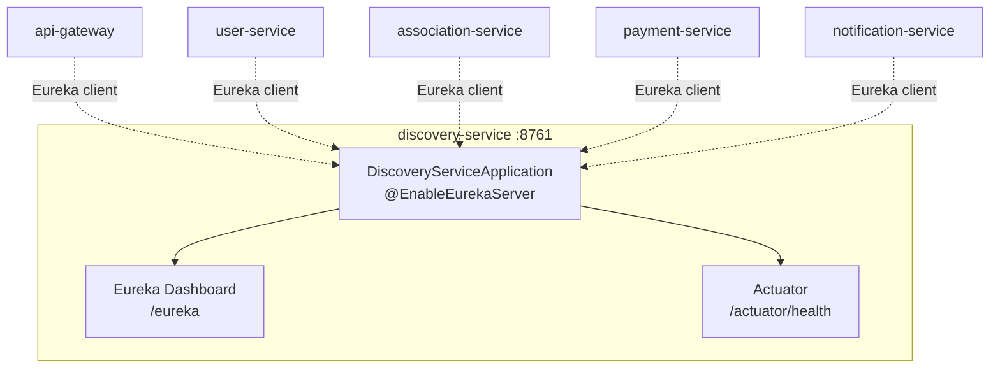
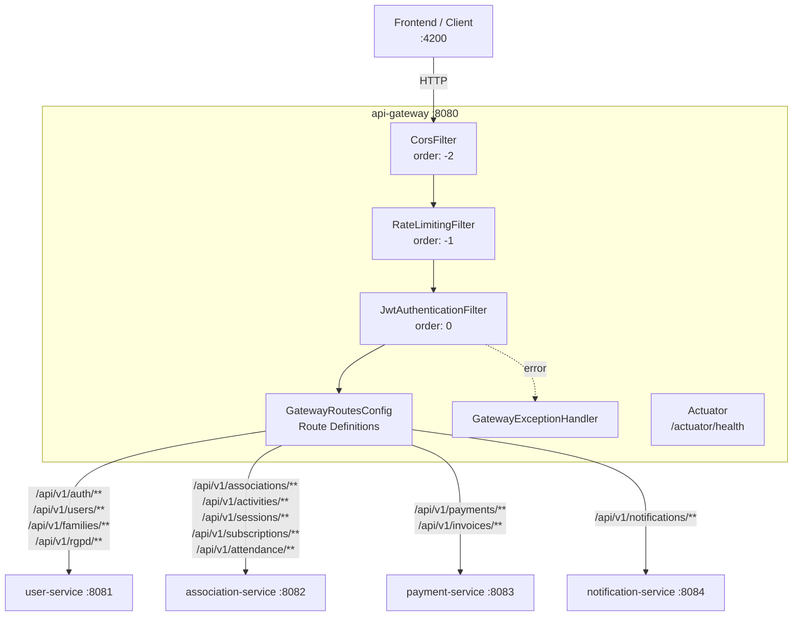
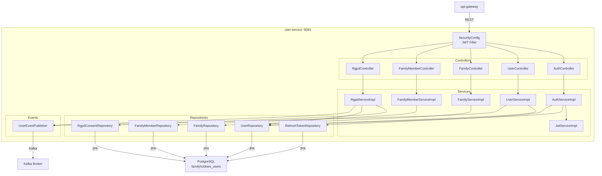
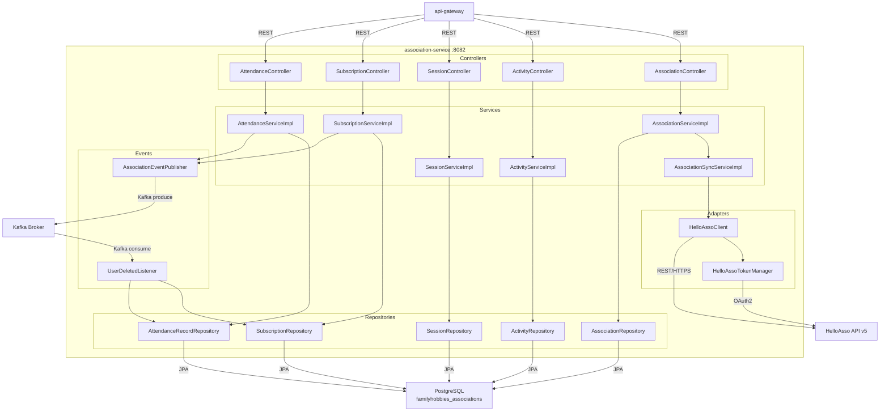
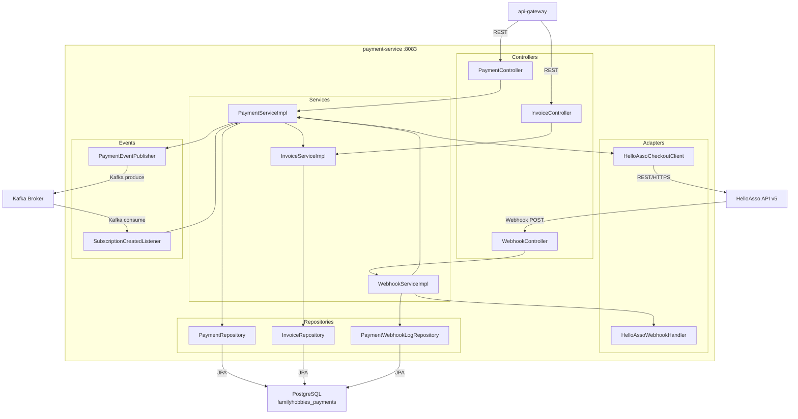
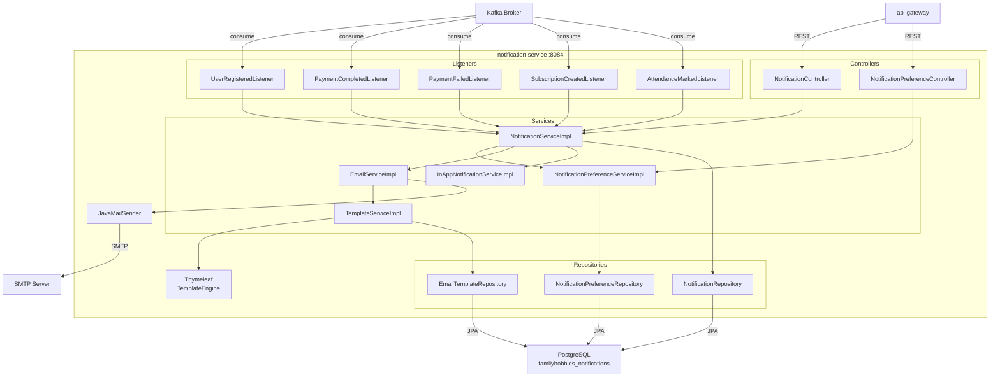

# Service Catalog — Family Hobbies Manager

> **Document**: 01-service-catalog.md
> **Version**: 1.0
> **Last updated**: 2026-02-23
> **Status**: Living document — updated with each service change

---

## Table of Contents

1. [Overview](#overview)
2. [Port Allocation Table](#port-allocation-table)
3. [Database Allocation Table](#database-allocation-table)
4. [Service Communication Matrix](#service-communication-matrix)
5. [Service Details](#service-details)
   - [discovery-service](#1-discovery-service)
   - [api-gateway](#2-api-gateway)
   - [user-service](#3-user-service)
   - [association-service](#4-association-service)
   - [payment-service](#5-payment-service)
   - [notification-service](#6-notification-service)
6. [Kafka Topic Registry](#kafka-topic-registry)
7. [Cross-Cutting Concerns](#cross-cutting-concerns)

---

## Overview

Family Hobbies Manager is a microservices-based application composed of **6 services**. The system enables families in France to discover associations (sport, dance, music, theater, etc.), register, manage subscriptions, track attendance, and handle payments through HelloAsso integration.

| Aspect              | Detail                                              |
|---------------------|-----------------------------------------------------|
| Architecture style  | Microservices with API Gateway                      |
| Service discovery   | Netflix Eureka (client-side discovery)              |
| API gateway         | Spring Cloud Gateway (reactive)                     |
| Messaging           | Apache Kafka (async inter-service events)           |
| Database strategy   | Database-per-service (PostgreSQL 16)                |
| Schema management   | Liquibase (XML changesets)                          |
| Security            | JWT (RS256), role-based (FAMILY / ASSOCIATION / ADMIN) |
| External API        | HelloAsso API v5 (OAuth2 client_credentials)        |
| Common library      | `backend/common/` — shared DTOs, events, exceptions |

---

## Port Allocation Table

| Service              | Port  | Protocol | Access Level         | Health Check              |
|----------------------|-------|----------|----------------------|---------------------------|
| discovery-service    | 8761  | HTTP     | Internal only        | `GET /actuator/health`    |
| api-gateway          | 8080  | HTTP     | Public (entry point) | `GET /actuator/health`    |
| user-service         | 8081  | HTTP     | Internal (via gateway) | `GET /actuator/health`  |
| association-service  | 8082  | HTTP     | Internal (via gateway) | `GET /actuator/health`  |
| payment-service      | 8083  | HTTP     | Internal (via gateway) | `GET /actuator/health`  |
| notification-service | 8084  | HTTP     | Internal (via gateway) | `GET /actuator/health`  |
| PostgreSQL           | 5432  | TCP      | Internal only        | `pg_isready`              |
| Apache Kafka         | 9092  | TCP      | Internal only        | Broker metadata request   |
| Zookeeper            | 2181  | TCP      | Internal only        | `ruok` four-letter command|

---

## Database Allocation Table

| Service              | Database Name                | Schema  | Migration Tool | Migration Path                                          |
|----------------------|------------------------------|---------|----------------|---------------------------------------------------------|
| discovery-service    | --                           | --      | --             | --                                                      |
| api-gateway          | --                           | --      | --             | --                                                      |
| user-service         | `familyhobbies_users`        | public  | Liquibase      | `backend/user-service/src/main/resources/db/changelog/` |
| association-service  | `familyhobbies_associations` | public  | Liquibase      | `backend/association-service/src/main/resources/db/changelog/` |
| payment-service      | `familyhobbies_payments`     | public  | Liquibase      | `backend/payment-service/src/main/resources/db/changelog/` |
| notification-service | `familyhobbies_notifications`| public  | Liquibase      | `backend/notification-service/src/main/resources/db/changelog/` |

---

## Service Communication Matrix

This matrix shows how each service communicates with others. Read rows as "source" and columns as "target".

| Source \ Target        | discovery-service | api-gateway | user-service | association-service | payment-service | notification-service | HelloAsso API |
|------------------------|:-----------------:|:-----------:|:------------:|:-------------------:|:---------------:|:--------------------:|:-------------:|
| **discovery-service**  | --                | --          | --           | --                  | --              | --                   | --            |
| **api-gateway**        | Eureka            | --          | REST         | REST                | REST            | REST                 | --            |
| **user-service**       | Eureka            | --          | --           | --                  | --              | Kafka                | --            |
| **association-service**| Eureka            | --          | --           | --                  | --              | Kafka                | REST (HTTPS)  |
| **payment-service**    | Eureka            | --          | --           | --                  | --              | Kafka                | REST (HTTPS)  |
| **notification-service**| Eureka           | --          | --           | --                  | --              | --                   | --            |

### Communication Details

| From                 | To                   | Protocol     | Purpose                                              |
|----------------------|----------------------|--------------|------------------------------------------------------|
| api-gateway          | discovery-service    | Eureka       | Service instance lookup for routing                  |
| api-gateway          | user-service         | REST (HTTP)  | Proxy auth, user, family, RGPD requests              |
| api-gateway          | association-service  | REST (HTTP)  | Proxy association, activity, session, subscription, attendance requests |
| api-gateway          | payment-service      | REST (HTTP)  | Proxy payment, invoice requests                      |
| api-gateway          | notification-service | REST (HTTP)  | Proxy notification preference and history requests   |
| user-service         | discovery-service    | Eureka       | Service registration                                 |
| user-service         | Kafka                | Kafka        | Publish `user.registered`, `user.deleted` events     |
| association-service  | discovery-service    | Eureka       | Service registration                                 |
| association-service  | HelloAsso API        | REST (HTTPS) | Directory search, org details, membership sync       |
| association-service  | Kafka                | Kafka        | Publish `subscription.created`, `subscription.cancelled`, `attendance.marked`; consume `user.deleted` |
| payment-service      | discovery-service    | Eureka       | Service registration                                 |
| payment-service      | HelloAsso API        | REST (HTTPS) | Checkout initiation, webhook validation              |
| payment-service      | Kafka                | Kafka        | Publish `payment.completed`, `payment.failed`; consume `subscription.created` |
| notification-service | discovery-service    | Eureka       | Service registration                                 |
| notification-service | Kafka                | Kafka        | Consume all domain events for notification dispatch  |

---

## Service Details

---

### 1. discovery-service

| Attribute            | Value                                                  |
|----------------------|--------------------------------------------------------|
| **Port**             | 8761                                                   |
| **Role**             | Eureka Service Registry                                |
| **Tech**             | Spring Cloud Netflix Eureka Server                     |
| **Database**         | None                                                   |
| **Dependencies**     | None (standalone, must start first)                    |
| **Startup order**    | 1 (all other services depend on it)                    |
| **Spring profile**   | `default`                                              |
| **Base package**     | `com.familyhobbies.discoveryservice`                   |
| **Repo path**        | `backend/discovery-service/`                           |

#### Spring Boot Starters and Dependencies

| Dependency                                  | Purpose                              |
|---------------------------------------------|--------------------------------------|
| `spring-cloud-starter-netflix-eureka-server` | Eureka server auto-configuration    |
| `spring-boot-starter-actuator`              | Health checks, metrics               |
| `spring-boot-starter-security`              | Secure Eureka dashboard (optional)   |

#### Configuration Properties (`application.yml`)

```yaml
server:
  port: 8761

spring:
  application:
    name: discovery-service

eureka:
  client:
    register-with-eureka: false
    fetch-registry: false
  server:
    enable-self-preservation: false
    eviction-interval-timer-in-ms: 5000

management:
  endpoints:
    web:
      exposure:
        include: health,info
  endpoint:
    health:
      show-details: always
```

#### Package Structure

```
com.familyhobbies.discoveryservice/
├── DiscoveryServiceApplication.java         # @EnableEurekaServer, main class
└── config/
    └── SecurityConfig.java                  # Dashboard access security (optional)
```

#### Component Diagram



---

### 2. api-gateway

| Attribute            | Value                                                  |
|----------------------|--------------------------------------------------------|
| **Port**             | 8080                                                   |
| **Role**             | Single entry point, JWT validation, routing, rate limiting, CORS |
| **Tech**             | Spring Cloud Gateway (reactive, WebFlux-based)         |
| **Database**         | None                                                   |
| **Dependencies**     | discovery-service (Eureka client)                      |
| **Startup order**    | 2 (after discovery-service)                            |
| **Spring profile**   | `default`                                              |
| **Base package**     | `com.familyhobbies.apigateway`                         |
| **Repo path**        | `backend/api-gateway/`                                 |

#### Spring Boot Starters and Dependencies

| Dependency                                     | Purpose                              |
|------------------------------------------------|--------------------------------------|
| `spring-cloud-starter-gateway`                 | Reactive gateway with route DSL      |
| `spring-cloud-starter-netflix-eureka-client`   | Service discovery for dynamic routing|
| `spring-boot-starter-actuator`                 | Health checks, gateway route info    |
| `spring-boot-starter-webflux`                  | Reactive web (included transitively) |
| `io.jsonwebtoken:jjwt-api`                     | JWT parsing and validation           |
| `io.jsonwebtoken:jjwt-impl`                    | JWT implementation                   |
| `io.jsonwebtoken:jjwt-jackson`                 | JWT JSON serialization               |
| `spring-cloud-starter-circuitbreaker-reactor-resilience4j` | Circuit breaker for routes |

#### Route Configuration

| Route Pattern               | Target Service       | Method(s)                | Auth Required |
|-----------------------------|----------------------|--------------------------|:-------------:|
| `/api/v1/auth/**`           | user-service         | POST                     | No            |
| `/api/v1/users/**`          | user-service         | GET, PUT, DELETE         | Yes           |
| `/api/v1/families/**`       | user-service         | GET, POST, PUT, DELETE   | Yes           |
| `/api/v1/rgpd/**`           | user-service         | GET, POST, DELETE        | Yes           |
| `/api/v1/associations/**`   | association-service  | GET, POST, PUT, DELETE   | Partial       |
| `/api/v1/activities/**`     | association-service  | GET, POST, PUT, DELETE   | Partial       |
| `/api/v1/sessions/**`       | association-service  | GET, POST, PUT, DELETE   | Yes           |
| `/api/v1/subscriptions/**`  | association-service  | GET, POST, PUT, DELETE   | Yes           |
| `/api/v1/attendance/**`     | association-service  | GET, POST, PUT           | Yes           |
| `/api/v1/payments/**`       | payment-service      | GET, POST                | Yes           |
| `/api/v1/invoices/**`       | payment-service      | GET                      | Yes           |
| `/api/v1/notifications/**`  | notification-service | GET, PUT                 | Yes           |

#### Gateway Filters

| Filter                    | Order | Purpose                                                       |
|---------------------------|:-----:|---------------------------------------------------------------|
| `CorsFilter`              | -2    | Handle CORS preflight and response headers                    |
| `RateLimitingFilter`      | -1    | Token bucket rate limiting per client IP                      |
| `JwtAuthenticationFilter` | 0     | Validate JWT, extract claims, forward X-User-Id / X-User-Roles |

#### Forwarded Headers

| Header         | Source                | Description                                |
|----------------|----------------------|--------------------------------------------|
| `X-User-Id`    | JWT `sub` claim      | Authenticated user's UUID                  |
| `X-User-Roles` | JWT `roles` claim   | Comma-separated roles (FAMILY, ASSOCIATION, ADMIN) |

#### Configuration Properties (`application.yml`)

```yaml
server:
  port: 8080

spring:
  application:
    name: api-gateway
  cloud:
    gateway:
      default-filters:
        - DedupeResponseHeader=Access-Control-Allow-Origin
      globalcors:
        cors-configurations:
          '[/**]':
            allowedOrigins: "http://localhost:4200"
            allowedMethods: "*"
            allowedHeaders: "*"
            allowCredentials: true

eureka:
  client:
    service-url:
      defaultZone: http://localhost:8761/eureka/
  instance:
    prefer-ip-address: true

jwt:
  secret: ${JWT_SECRET}

management:
  endpoints:
    web:
      exposure:
        include: health,info,gateway
  endpoint:
    health:
      show-details: always
    gateway:
      enabled: true
```

#### Package Structure

```
com.familyhobbies.apigateway/
├── ApiGatewayApplication.java
├── config/
│   ├── GatewayRoutesConfig.java              # Route definitions with predicates and filters
│   ├── CorsConfig.java                       # Global CORS configuration
│   └── RateLimitConfig.java                  # Rate limiting configuration
├── filter/
│   ├── JwtAuthenticationFilter.java          # JWT validation, header forwarding
│   ├── RateLimitingFilter.java               # Per-IP rate limiting
│   └── LoggingFilter.java                    # Request/response logging
├── exception/
│   └── GatewayExceptionHandler.java          # Global error handler for gateway errors
└── dto/
    └── ErrorResponse.java                    # Standardized error response body
```

#### Component Diagram



---

### 3. user-service

| Attribute            | Value                                                  |
|----------------------|--------------------------------------------------------|
| **Port**             | 8081                                                   |
| **Role**             | Authentication, user management, family management, RGPD compliance |
| **Tech**             | Spring Boot 3.2.x, Spring Security, Spring Data JPA, Liquibase |
| **Database**         | `familyhobbies_users` (PostgreSQL 16)                  |
| **Dependencies**     | discovery-service (Eureka client), Kafka broker         |
| **Startup order**    | 3 (after discovery-service and infrastructure)         |
| **Spring profile**   | `default`, `dev`, `test`                               |
| **Base package**     | `com.familyhobbies.userservice`                        |
| **Repo path**        | `backend/user-service/`                                |

#### Spring Boot Starters and Dependencies

| Dependency                                     | Purpose                              |
|------------------------------------------------|--------------------------------------|
| `spring-boot-starter-web`                      | REST API (Tomcat, Jackson)           |
| `spring-boot-starter-data-jpa`                 | JPA repositories, Hibernate          |
| `spring-boot-starter-security`                 | Authentication and authorization     |
| `spring-boot-starter-validation`               | Bean validation (`@Valid`)           |
| `spring-boot-starter-actuator`                 | Health checks, metrics               |
| `spring-cloud-starter-netflix-eureka-client`   | Eureka service registration          |
| `spring-kafka`                                 | Kafka producer for domain events     |
| `org.liquibase:liquibase-core`                 | Database schema migration            |
| `org.postgresql:postgresql`                    | PostgreSQL JDBC driver               |
| `io.jsonwebtoken:jjwt-api`                     | JWT token generation                 |
| `io.jsonwebtoken:jjwt-impl`                    | JWT implementation                   |
| `io.jsonwebtoken:jjwt-jackson`                 | JWT JSON serialization               |
| `org.mapstruct:mapstruct`                      | Entity-DTO mapping                   |
| `org.projectlombok:lombok`                     | Boilerplate reduction                |
| `com.familyhobbies:common`                     | Shared DTOs, events, exceptions      |

#### Entities

| Entity          | Table               | Description                                        |
|-----------------|---------------------|----------------------------------------------------|
| `User`          | `users`             | User account: email, password hash, roles, status  |
| `Family`        | `families`          | Family group: name, owner (user), creation date    |
| `FamilyMember`  | `family_members`    | Member within a family: name, birth date, relation |
| `RgpdConsent`   | `rgpd_consents`     | RGPD consent record: type, granted date, revoked   |
| `RefreshToken`  | `refresh_tokens`    | JWT refresh token: token string, expiry, user ref  |

#### Kafka Events Produced

| Topic                               | Event Class            | Trigger                        |
|-------------------------------------|------------------------|--------------------------------|
| `family-hobbies.user.registered`    | `UserRegisteredEvent`  | Successful user registration   |
| `family-hobbies.user.deleted`       | `UserDeletedEvent`     | RGPD data deletion or account removal |

#### Key API Endpoints

| Method | Endpoint                           | Auth     | Description                        |
|--------|-------------------------------------|----------|------------------------------------|
| POST   | `/api/v1/auth/register`            | Public   | Register new user account          |
| POST   | `/api/v1/auth/login`               | Public   | Authenticate and receive JWT       |
| POST   | `/api/v1/auth/refresh`             | Public   | Refresh access token               |
| POST   | `/api/v1/auth/logout`              | Bearer   | Invalidate refresh token           |
| GET    | `/api/v1/users/me`                 | Bearer   | Get current user profile           |
| PUT    | `/api/v1/users/me`                 | Bearer   | Update current user profile        |
| GET    | `/api/v1/users/{id}`               | ADMIN    | Get user by ID                     |
| DELETE | `/api/v1/users/{id}`               | ADMIN    | Delete user account                |
| GET    | `/api/v1/families`                 | Bearer   | List user's families               |
| POST   | `/api/v1/families`                 | Bearer   | Create new family                  |
| PUT    | `/api/v1/families/{id}`            | Bearer   | Update family details              |
| DELETE | `/api/v1/families/{id}`            | Bearer   | Delete family                      |
| GET    | `/api/v1/families/{id}/members`    | Bearer   | List family members                |
| POST   | `/api/v1/families/{id}/members`    | Bearer   | Add family member                  |
| PUT    | `/api/v1/families/{fid}/members/{mid}` | Bearer | Update family member           |
| DELETE | `/api/v1/families/{fid}/members/{mid}` | Bearer | Remove family member           |
| POST   | `/api/v1/rgpd/consent`             | Bearer   | Record RGPD consent                |
| GET    | `/api/v1/rgpd/data-export`         | Bearer   | Export all user data (RGPD Art.20) |
| DELETE | `/api/v1/rgpd/data-deletion`       | Bearer   | Request full data deletion (RGPD Art.17) |

#### Configuration Properties (`application.yml`)

```yaml
server:
  port: 8081

spring:
  application:
    name: user-service
  datasource:
    url: jdbc:postgresql://localhost:5432/familyhobbies_users
    username: ${DB_USERNAME:postgres}
    password: ${DB_PASSWORD:postgres}
    driver-class-name: org.postgresql.Driver
  jpa:
    hibernate:
      ddl-auto: validate
    show-sql: false
    properties:
      hibernate:
        dialect: org.hibernate.dialect.PostgreSQLDialect
  liquibase:
    change-log: classpath:db/changelog/db.changelog-master.xml
  kafka:
    bootstrap-servers: ${KAFKA_BOOTSTRAP_SERVERS:localhost:9092}
    producer:
      key-serializer: org.apache.kafka.common.serialization.StringSerializer
      value-serializer: org.springframework.kafka.support.serializer.JsonSerializer

eureka:
  client:
    service-url:
      defaultZone: http://localhost:8761/eureka/
  instance:
    prefer-ip-address: true

jwt:
  secret: ${JWT_SECRET}
  access-token-expiration-ms: 900000        # 15 minutes
  refresh-token-expiration-ms: 604800000    # 7 days

management:
  endpoints:
    web:
      exposure:
        include: health,info,liquibase
  endpoint:
    health:
      show-details: always
```

#### Package Structure

```
com.familyhobbies.userservice/
├── UserServiceApplication.java
├── config/
│   ├── SecurityConfig.java                  # Spring Security filter chain, password encoder
│   ├── JwtConfig.java                       # JWT properties binding
│   ├── KafkaProducerConfig.java             # Kafka producer factory and template
│   └── AuditConfig.java                     # JPA auditing configuration
├── controller/
│   ├── AuthController.java                  # /api/v1/auth endpoints
│   ├── UserController.java                  # /api/v1/users endpoints
│   ├── FamilyController.java                # /api/v1/families endpoints
│   ├── FamilyMemberController.java          # /api/v1/families/{id}/members endpoints
│   └── RgpdController.java                  # /api/v1/rgpd endpoints
├── dto/
│   ├── request/
│   │   ├── RegisterRequest.java
│   │   ├── LoginRequest.java
│   │   ├── RefreshTokenRequest.java
│   │   ├── UpdateUserRequest.java
│   │   ├── CreateFamilyRequest.java
│   │   ├── UpdateFamilyRequest.java
│   │   ├── AddFamilyMemberRequest.java
│   │   ├── UpdateFamilyMemberRequest.java
│   │   └── RgpdConsentRequest.java
│   └── response/
│       ├── AuthResponse.java
│       ├── UserResponse.java
│       ├── FamilyResponse.java
│       ├── FamilyMemberResponse.java
│       └── RgpdConsentResponse.java
├── entity/
│   ├── User.java
│   ├── Family.java
│   ├── FamilyMember.java
│   ├── RgpdConsent.java
│   └── RefreshToken.java
├── exception/
│   ├── UserNotFoundException.java
│   ├── FamilyNotFoundException.java
│   ├── EmailAlreadyExistsException.java
│   ├── InvalidTokenException.java
│   └── GlobalExceptionHandler.java
├── mapper/
│   ├── UserMapper.java
│   ├── FamilyMapper.java
│   └── FamilyMemberMapper.java
├── repository/
│   ├── UserRepository.java
│   ├── FamilyRepository.java
│   ├── FamilyMemberRepository.java
│   ├── RgpdConsentRepository.java
│   └── RefreshTokenRepository.java
├── service/
│   ├── AuthService.java
│   ├── UserService.java
│   ├── FamilyService.java
│   ├── FamilyMemberService.java
│   ├── RgpdService.java
│   ├── JwtService.java
│   └── impl/
│       ├── AuthServiceImpl.java
│       ├── UserServiceImpl.java
│       ├── FamilyServiceImpl.java
│       ├── FamilyMemberServiceImpl.java
│       ├── RgpdServiceImpl.java
│       └── JwtServiceImpl.java
└── event/
    └── publisher/
        ├── UserEventPublisher.java
        └── UserRegisteredEvent.java
```

#### Component Diagram



---

### 4. association-service

| Attribute            | Value                                                  |
|----------------------|--------------------------------------------------------|
| **Port**             | 8082                                                   |
| **Role**             | Association directory (HelloAsso proxy + local cache), activities, sessions, subscriptions, attendance tracking |
| **Tech**             | Spring Boot 3.2.x, Spring Data JPA, Liquibase, WebClient |
| **Database**         | `familyhobbies_associations` (PostgreSQL 16)           |
| **Dependencies**     | discovery-service (Eureka), Kafka broker, HelloAsso API |
| **Startup order**    | 3 (after discovery-service and infrastructure)         |
| **Spring profile**   | `default`, `dev`, `test`                               |
| **Base package**     | `com.familyhobbies.associationservice`                 |
| **Repo path**        | `backend/association-service/`                         |

#### Spring Boot Starters and Dependencies

| Dependency                                     | Purpose                              |
|------------------------------------------------|--------------------------------------|
| `spring-boot-starter-web`                      | REST API (Tomcat, Jackson)           |
| `spring-boot-starter-data-jpa`                 | JPA repositories, Hibernate          |
| `spring-boot-starter-validation`               | Bean validation (`@Valid`)           |
| `spring-boot-starter-actuator`                 | Health checks, metrics               |
| `spring-boot-starter-webflux`                  | WebClient for HelloAsso API calls    |
| `spring-cloud-starter-netflix-eureka-client`   | Eureka service registration          |
| `spring-kafka`                                 | Kafka producer and consumer          |
| `org.liquibase:liquibase-core`                 | Database schema migration            |
| `org.postgresql:postgresql`                    | PostgreSQL JDBC driver               |
| `org.mapstruct:mapstruct`                      | Entity-DTO mapping                   |
| `org.projectlombok:lombok`                     | Boilerplate reduction                |
| `com.familyhobbies:common`                     | Shared DTOs, events, exceptions      |

#### Entities

| Entity             | Table                 | Description                                           |
|--------------------|-----------------------|-------------------------------------------------------|
| `Association`      | `associations`        | Association record: name, slug, city, category, HelloAsso org ref, cached data |
| `Activity`         | `activities`          | Activity offered by an association: name, type, age range, description |
| `Session`          | `sessions`            | Scheduled session for an activity: date, time, location, instructor |
| `Subscription`     | `subscriptions`       | Family member's subscription to an activity: status, dates, payment ref |
| `AttendanceRecord` | `attendance_records`  | Attendance for a session: family member, session, present/absent, timestamp |

#### Kafka Events Produced

| Topic                                      | Event Class                  | Trigger                           |
|--------------------------------------------|------------------------------|-----------------------------------|
| `family-hobbies.subscription.created`      | `SubscriptionCreatedEvent`   | New subscription registered       |
| `family-hobbies.subscription.cancelled`    | `SubscriptionCancelledEvent` | Subscription cancelled            |
| `family-hobbies.attendance.marked`         | `AttendanceMarkedEvent`      | Attendance recorded for a session |

#### Kafka Events Consumed

| Topic                               | Event Class          | Handler                    | Action                            |
|-------------------------------------|----------------------|----------------------------|-----------------------------------|
| `family-hobbies.user.deleted`       | `UserDeletedEvent`   | `UserDeletedListener`      | Cascade delete subscriptions, attendance for the user's family members |

#### HelloAsso Integration Adapter

| Class                         | Purpose                                                  |
|-------------------------------|----------------------------------------------------------|
| `HelloAssoClient`             | WebClient calls to HelloAsso v5 REST API                |
| `HelloAssoTokenManager`       | OAuth2 client_credentials token lifecycle management     |
| `AssociationSyncService`      | Sync HelloAsso directory data into local cache           |

| HelloAsso Endpoint Used                       | Method | Purpose                            |
|-----------------------------------------------|--------|------------------------------------|
| `POST /v5/directory/organizations`            | POST   | Search association directory       |
| `GET /v5/organizations/{slug}`                | GET    | Fetch organization public profile  |
| `GET /v5/organizations/{slug}/forms`          | GET    | List available membership forms    |

#### Key API Endpoints

| Method | Endpoint                                      | Auth     | Description                          |
|--------|-----------------------------------------------|----------|--------------------------------------|
| GET    | `/api/v1/associations`                        | Public   | Search/list associations             |
| GET    | `/api/v1/associations/{id}`                   | Public   | Get association details              |
| POST   | `/api/v1/associations`                        | ASSOC/ADMIN | Create association record         |
| PUT    | `/api/v1/associations/{id}`                   | ASSOC/ADMIN | Update association                |
| GET    | `/api/v1/associations/{id}/activities`        | Public   | List activities for an association   |
| POST   | `/api/v1/activities`                          | ASSOC/ADMIN | Create activity                   |
| PUT    | `/api/v1/activities/{id}`                     | ASSOC/ADMIN | Update activity                   |
| DELETE | `/api/v1/activities/{id}`                     | ASSOC/ADMIN | Delete activity                   |
| GET    | `/api/v1/sessions`                            | Bearer   | List sessions (filterable)           |
| POST   | `/api/v1/sessions`                            | ASSOC/ADMIN | Create session                    |
| PUT    | `/api/v1/sessions/{id}`                       | ASSOC/ADMIN | Update session                    |
| DELETE | `/api/v1/sessions/{id}`                       | ASSOC/ADMIN | Delete session                    |
| GET    | `/api/v1/subscriptions`                       | Bearer   | List user's subscriptions            |
| POST   | `/api/v1/subscriptions`                       | Bearer   | Create subscription                  |
| PUT    | `/api/v1/subscriptions/{id}/cancel`           | Bearer   | Cancel subscription                  |
| GET    | `/api/v1/attendance/session/{sessionId}`      | Bearer   | Get attendance for a session         |
| POST   | `/api/v1/attendance`                          | ASSOC/ADMIN | Mark attendance                   |
| PUT    | `/api/v1/attendance/{id}`                     | ASSOC/ADMIN | Update attendance record          |

#### Configuration Properties (`application.yml`)

```yaml
server:
  port: 8082

spring:
  application:
    name: association-service
  datasource:
    url: jdbc:postgresql://localhost:5432/familyhobbies_associations
    username: ${DB_USERNAME:postgres}
    password: ${DB_PASSWORD:postgres}
    driver-class-name: org.postgresql.Driver
  jpa:
    hibernate:
      ddl-auto: validate
    show-sql: false
    properties:
      hibernate:
        dialect: org.hibernate.dialect.PostgreSQLDialect
  liquibase:
    change-log: classpath:db/changelog/db.changelog-master.xml
  kafka:
    bootstrap-servers: ${KAFKA_BOOTSTRAP_SERVERS:localhost:9092}
    producer:
      key-serializer: org.apache.kafka.common.serialization.StringSerializer
      value-serializer: org.springframework.kafka.support.serializer.JsonSerializer
    consumer:
      group-id: association-service
      auto-offset-reset: earliest
      key-deserializer: org.apache.kafka.common.serialization.StringDeserializer
      value-deserializer: org.springframework.kafka.support.serializer.JsonDeserializer
      properties:
        spring.json.trusted.packages: "com.familyhobbies.common.event"

eureka:
  client:
    service-url:
      defaultZone: http://localhost:8761/eureka/
  instance:
    prefer-ip-address: true

helloasso:
  base-url: ${HELLOASSO_BASE_URL:https://api.helloasso-sandbox.com/v5}
  client-id: ${HELLOASSO_CLIENT_ID}
  client-secret: ${HELLOASSO_CLIENT_SECRET}
  token-url: ${HELLOASSO_BASE_URL:https://api.helloasso-sandbox.com}/oauth2/token

management:
  endpoints:
    web:
      exposure:
        include: health,info,liquibase
  endpoint:
    health:
      show-details: always
```

#### Package Structure

```
com.familyhobbies.associationservice/
├── AssociationServiceApplication.java
├── config/
│   ├── WebClientConfig.java                 # WebClient bean for HelloAsso API calls
│   ├── KafkaConfig.java                     # Kafka producer and consumer configuration
│   ├── HelloAssoProperties.java             # @ConfigurationProperties for HelloAsso
│   └── AuditConfig.java                     # JPA auditing configuration
├── controller/
│   ├── AssociationController.java           # /api/v1/associations endpoints
│   ├── ActivityController.java              # /api/v1/activities endpoints
│   ├── SessionController.java               # /api/v1/sessions endpoints
│   ├── SubscriptionController.java          # /api/v1/subscriptions endpoints
│   └── AttendanceController.java            # /api/v1/attendance endpoints
├── dto/
│   ├── request/
│   │   ├── CreateAssociationRequest.java
│   │   ├── UpdateAssociationRequest.java
│   │   ├── CreateActivityRequest.java
│   │   ├── UpdateActivityRequest.java
│   │   ├── CreateSessionRequest.java
│   │   ├── UpdateSessionRequest.java
│   │   ├── CreateSubscriptionRequest.java
│   │   ├── MarkAttendanceRequest.java
│   │   └── AssociationSearchRequest.java
│   └── response/
│       ├── AssociationResponse.java
│       ├── ActivityResponse.java
│       ├── SessionResponse.java
│       ├── SubscriptionResponse.java
│       └── AttendanceResponse.java
├── entity/
│   ├── Association.java
│   ├── Activity.java
│   ├── Session.java
│   ├── Subscription.java
│   └── AttendanceRecord.java
├── exception/
│   ├── AssociationNotFoundException.java
│   ├── ActivityNotFoundException.java
│   ├── SessionNotFoundException.java
│   ├── SubscriptionNotFoundException.java
│   ├── HelloAssoApiException.java
│   └── GlobalExceptionHandler.java
├── mapper/
│   ├── AssociationMapper.java
│   ├── ActivityMapper.java
│   ├── SessionMapper.java
│   ├── SubscriptionMapper.java
│   └── AttendanceMapper.java
├── repository/
│   ├── AssociationRepository.java
│   ├── ActivityRepository.java
│   ├── SessionRepository.java
│   ├── SubscriptionRepository.java
│   └── AttendanceRecordRepository.java
├── service/
│   ├── AssociationService.java
│   ├── ActivityService.java
│   ├── SessionService.java
│   ├── SubscriptionService.java
│   ├── AttendanceService.java
│   ├── AssociationSyncService.java          # Sync HelloAsso data to local DB
│   └── impl/
│       ├── AssociationServiceImpl.java
│       ├── ActivityServiceImpl.java
│       ├── SessionServiceImpl.java
│       ├── SubscriptionServiceImpl.java
│       ├── AttendanceServiceImpl.java
│       └── AssociationSyncServiceImpl.java
├── adapter/
│   ├── HelloAssoClient.java                 # WebClient calls to HelloAsso v5
│   └── HelloAssoTokenManager.java           # OAuth2 token lifecycle management
└── event/
    ├── publisher/
    │   └── AssociationEventPublisher.java
    └── listener/
        └── UserDeletedListener.java          # Handles user.deleted cascade cleanup
```

#### Component Diagram



---

### 5. payment-service

| Attribute            | Value                                                  |
|----------------------|--------------------------------------------------------|
| **Port**             | 8083                                                   |
| **Role**             | HelloAsso Checkout integration, payment lifecycle, webhook processing, invoice generation |
| **Tech**             | Spring Boot 3.2.x, Spring Data JPA, Liquibase, WebClient |
| **Database**         | `familyhobbies_payments` (PostgreSQL 16)               |
| **Dependencies**     | discovery-service (Eureka), Kafka broker, HelloAsso API |
| **Startup order**    | 3 (after discovery-service and infrastructure)         |
| **Spring profile**   | `default`, `dev`, `test`                               |
| **Base package**     | `com.familyhobbies.paymentservice`                     |
| **Repo path**        | `backend/payment-service/`                             |

#### Spring Boot Starters and Dependencies

| Dependency                                     | Purpose                              |
|------------------------------------------------|--------------------------------------|
| `spring-boot-starter-web`                      | REST API (Tomcat, Jackson)           |
| `spring-boot-starter-data-jpa`                 | JPA repositories, Hibernate          |
| `spring-boot-starter-validation`               | Bean validation (`@Valid`)           |
| `spring-boot-starter-actuator`                 | Health checks, metrics               |
| `spring-boot-starter-webflux`                  | WebClient for HelloAsso API calls    |
| `spring-cloud-starter-netflix-eureka-client`   | Eureka service registration          |
| `spring-kafka`                                 | Kafka producer and consumer          |
| `org.liquibase:liquibase-core`                 | Database schema migration            |
| `org.postgresql:postgresql`                    | PostgreSQL JDBC driver               |
| `org.mapstruct:mapstruct`                      | Entity-DTO mapping                   |
| `org.projectlombok:lombok`                     | Boilerplate reduction                |
| `com.familyhobbies:common`                     | Shared DTOs, events, exceptions      |

#### Entities

| Entity              | Table                  | Description                                           |
|---------------------|------------------------|-------------------------------------------------------|
| `Payment`           | `payments`             | Payment record: amount, currency, status, HelloAsso checkout ref, subscription ref |
| `Invoice`           | `invoices`             | Generated invoice: number, date, line items, PDF path  |
| `PaymentWebhookLog` | `payment_webhook_logs` | Audit log of incoming HelloAsso webhooks: raw payload, processing status |

#### Kafka Events Produced

| Topic                                    | Event Class               | Trigger                             |
|------------------------------------------|---------------------------|-------------------------------------|
| `family-hobbies.payment.completed`       | `PaymentCompletedEvent`   | Payment confirmed by HelloAsso webhook |
| `family-hobbies.payment.failed`          | `PaymentFailedEvent`      | Payment failed or refunded          |

#### Kafka Events Consumed

| Topic                                    | Event Class                | Handler                        | Action                             |
|------------------------------------------|----------------------------|--------------------------------|------------------------------------|
| `family-hobbies.subscription.created`    | `SubscriptionCreatedEvent` | `SubscriptionCreatedListener`  | Initiate HelloAsso checkout session |

#### HelloAsso Integration Adapter

| Class                          | Purpose                                                 |
|--------------------------------|---------------------------------------------------------|
| `HelloAssoCheckoutClient`      | Initiate checkout sessions via HelloAsso API            |
| `HelloAssoWebhookHandler`      | Receive, validate, and process incoming webhooks        |

| HelloAsso Endpoint Used                             | Method | Purpose                              |
|-----------------------------------------------------|--------|--------------------------------------|
| `POST /v5/organizations/{slug}/checkout-intents`    | POST   | Initiate payment checkout session    |
| `GET /v5/organizations/{slug}/checkout-intents/{id}`| GET    | Retrieve checkout session status     |

#### Key API Endpoints

| Method | Endpoint                                      | Auth     | Description                          |
|--------|-----------------------------------------------|----------|--------------------------------------|
| GET    | `/api/v1/payments`                            | Bearer   | List user's payments                 |
| GET    | `/api/v1/payments/{id}`                       | Bearer   | Get payment details                  |
| POST   | `/api/v1/payments/checkout`                   | Bearer   | Initiate checkout for a subscription |
| POST   | `/api/v1/payments/webhook`                    | Public*  | HelloAsso webhook receiver           |
| GET    | `/api/v1/invoices`                            | Bearer   | List user's invoices                 |
| GET    | `/api/v1/invoices/{id}`                       | Bearer   | Get invoice details                  |
| GET    | `/api/v1/invoices/{id}/download`              | Bearer   | Download invoice PDF                 |

> *Webhook endpoint uses HelloAsso signature validation instead of JWT auth.

#### Configuration Properties (`application.yml`)

```yaml
server:
  port: 8083

spring:
  application:
    name: payment-service
  datasource:
    url: jdbc:postgresql://localhost:5432/familyhobbies_payments
    username: ${DB_USERNAME:postgres}
    password: ${DB_PASSWORD:postgres}
    driver-class-name: org.postgresql.Driver
  jpa:
    hibernate:
      ddl-auto: validate
    show-sql: false
    properties:
      hibernate:
        dialect: org.hibernate.dialect.PostgreSQLDialect
  liquibase:
    change-log: classpath:db/changelog/db.changelog-master.xml
  kafka:
    bootstrap-servers: ${KAFKA_BOOTSTRAP_SERVERS:localhost:9092}
    producer:
      key-serializer: org.apache.kafka.common.serialization.StringSerializer
      value-serializer: org.springframework.kafka.support.serializer.JsonSerializer
    consumer:
      group-id: payment-service
      auto-offset-reset: earliest
      key-deserializer: org.apache.kafka.common.serialization.StringDeserializer
      value-deserializer: org.springframework.kafka.support.serializer.JsonDeserializer
      properties:
        spring.json.trusted.packages: "com.familyhobbies.common.event"

eureka:
  client:
    service-url:
      defaultZone: http://localhost:8761/eureka/
  instance:
    prefer-ip-address: true

helloasso:
  base-url: ${HELLOASSO_BASE_URL:https://api.helloasso-sandbox.com/v5}
  client-id: ${HELLOASSO_CLIENT_ID}
  client-secret: ${HELLOASSO_CLIENT_SECRET}
  token-url: ${HELLOASSO_BASE_URL:https://api.helloasso-sandbox.com}/oauth2/token
  webhook-secret: ${HELLOASSO_WEBHOOK_SECRET}

invoice:
  storage-path: ${INVOICE_STORAGE_PATH:/var/data/invoices}
  number-prefix: FHM

management:
  endpoints:
    web:
      exposure:
        include: health,info,liquibase
  endpoint:
    health:
      show-details: always
```

#### Package Structure

```
com.familyhobbies.paymentservice/
├── PaymentServiceApplication.java
├── config/
│   ├── WebClientConfig.java                 # WebClient bean for HelloAsso API calls
│   ├── KafkaConfig.java                     # Kafka producer and consumer configuration
│   ├── HelloAssoProperties.java             # @ConfigurationProperties for HelloAsso
│   ├── InvoiceProperties.java               # @ConfigurationProperties for invoice generation
│   └── AuditConfig.java                     # JPA auditing configuration
├── controller/
│   ├── PaymentController.java               # /api/v1/payments endpoints
│   ├── InvoiceController.java               # /api/v1/invoices endpoints
│   └── WebhookController.java               # /api/v1/payments/webhook endpoint
├── dto/
│   ├── request/
│   │   ├── CheckoutRequest.java
│   │   └── WebhookPayload.java
│   └── response/
│       ├── PaymentResponse.java
│       ├── CheckoutResponse.java
│       └── InvoiceResponse.java
├── entity/
│   ├── Payment.java
│   ├── Invoice.java
│   └── PaymentWebhookLog.java
├── exception/
│   ├── PaymentNotFoundException.java
│   ├── InvoiceNotFoundException.java
│   ├── CheckoutInitiationException.java
│   ├── WebhookValidationException.java
│   └── GlobalExceptionHandler.java
├── mapper/
│   ├── PaymentMapper.java
│   └── InvoiceMapper.java
├── repository/
│   ├── PaymentRepository.java
│   ├── InvoiceRepository.java
│   └── PaymentWebhookLogRepository.java
├── service/
│   ├── PaymentService.java
│   ├── InvoiceService.java
│   ├── WebhookService.java
│   └── impl/
│       ├── PaymentServiceImpl.java
│       ├── InvoiceServiceImpl.java
│       └── WebhookServiceImpl.java
├── adapter/
│   ├── HelloAssoCheckoutClient.java         # Initiate checkout sessions
│   └── HelloAssoWebhookHandler.java         # Validate and process webhooks
└── event/
    ├── publisher/
    │   └── PaymentEventPublisher.java
    └── listener/
        └── SubscriptionCreatedListener.java  # Initiates checkout on new subscription
```

#### Component Diagram



---

### 6. notification-service

| Attribute            | Value                                                  |
|----------------------|--------------------------------------------------------|
| **Port**             | 8084                                                   |
| **Role**             | Multi-channel notifications (email, in-app), email templating, notification preference management |
| **Tech**             | Spring Boot 3.2.x, Spring Data JPA, Liquibase, Spring Mail, Thymeleaf |
| **Database**         | `familyhobbies_notifications` (PostgreSQL 16)          |
| **Dependencies**     | discovery-service (Eureka), Kafka broker, SMTP server  |
| **Startup order**    | 3 (after discovery-service and infrastructure)         |
| **Spring profile**   | `default`, `dev`, `test`                               |
| **Base package**     | `com.familyhobbies.notificationservice`                |
| **Repo path**        | `backend/notification-service/`                        |

#### Spring Boot Starters and Dependencies

| Dependency                                     | Purpose                              |
|------------------------------------------------|--------------------------------------|
| `spring-boot-starter-web`                      | REST API (Tomcat, Jackson)           |
| `spring-boot-starter-data-jpa`                 | JPA repositories, Hibernate          |
| `spring-boot-starter-validation`               | Bean validation (`@Valid`)           |
| `spring-boot-starter-actuator`                 | Health checks, metrics               |
| `spring-boot-starter-mail`                     | JavaMailSender for email dispatch    |
| `spring-boot-starter-thymeleaf`                | Email template rendering             |
| `spring-cloud-starter-netflix-eureka-client`   | Eureka service registration          |
| `spring-kafka`                                 | Kafka consumer for domain events     |
| `org.liquibase:liquibase-core`                 | Database schema migration            |
| `org.postgresql:postgresql`                    | PostgreSQL JDBC driver               |
| `org.mapstruct:mapstruct`                      | Entity-DTO mapping                   |
| `org.projectlombok:lombok`                     | Boilerplate reduction                |
| `com.familyhobbies:common`                     | Shared DTOs, events, exceptions      |

#### Entities

| Entity                   | Table                      | Description                                         |
|--------------------------|----------------------------|-----------------------------------------------------|
| `Notification`           | `notifications`            | Notification record: type, channel (email/in-app), recipient, status, content, sent timestamp |
| `EmailTemplate`          | `email_templates`          | Email template: name, subject template, body template (Thymeleaf), locale |
| `NotificationPreference` | `notification_preferences` | User preference: notification type, channel, enabled/disabled |

#### Kafka Events Consumed

| Topic                                      | Event Class                | Handler                           | Action                                 |
|--------------------------------------------|----------------------------|-----------------------------------|----------------------------------------|
| `family-hobbies.user.registered`           | `UserRegisteredEvent`      | `UserRegisteredListener`          | Send welcome email                     |
| `family-hobbies.payment.completed`         | `PaymentCompletedEvent`    | `PaymentCompletedListener`        | Send payment confirmation email        |
| `family-hobbies.payment.failed`            | `PaymentFailedEvent`       | `PaymentFailedListener`           | Send payment failure alert             |
| `family-hobbies.subscription.created`      | `SubscriptionCreatedEvent` | `SubscriptionCreatedListener`     | Send subscription confirmation email   |
| `family-hobbies.attendance.marked`         | `AttendanceMarkedEvent`    | `AttendanceMarkedListener`        | Send attendance summary (if preferred) |

#### Key API Endpoints

| Method | Endpoint                                      | Auth     | Description                             |
|--------|-----------------------------------------------|----------|-----------------------------------------|
| GET    | `/api/v1/notifications`                       | Bearer   | List user's notifications (paginated)   |
| GET    | `/api/v1/notifications/unread`                | Bearer   | Get unread notification count           |
| PUT    | `/api/v1/notifications/{id}/read`             | Bearer   | Mark notification as read               |
| PUT    | `/api/v1/notifications/read-all`              | Bearer   | Mark all notifications as read          |
| GET    | `/api/v1/notifications/preferences`           | Bearer   | Get user's notification preferences     |
| PUT    | `/api/v1/notifications/preferences`           | Bearer   | Update notification preferences         |

#### Email Templates

| Template Name              | Trigger Event            | Subject                                |
|----------------------------|--------------------------|----------------------------------------|
| `welcome`                  | User registered          | Bienvenue sur Family Hobbies Manager   |
| `payment-confirmation`     | Payment completed        | Confirmation de paiement               |
| `payment-failure`          | Payment failed           | Echec de paiement                      |
| `subscription-confirmation`| Subscription created     | Confirmation d'inscription             |
| `attendance-summary`       | Attendance marked        | Resume de presence                     |

#### Configuration Properties (`application.yml`)

```yaml
server:
  port: 8084

spring:
  application:
    name: notification-service
  datasource:
    url: jdbc:postgresql://localhost:5432/familyhobbies_notifications
    username: ${DB_USERNAME:postgres}
    password: ${DB_PASSWORD:postgres}
    driver-class-name: org.postgresql.Driver
  jpa:
    hibernate:
      ddl-auto: validate
    show-sql: false
    properties:
      hibernate:
        dialect: org.hibernate.dialect.PostgreSQLDialect
  liquibase:
    change-log: classpath:db/changelog/db.changelog-master.xml
  kafka:
    bootstrap-servers: ${KAFKA_BOOTSTRAP_SERVERS:localhost:9092}
    consumer:
      group-id: notification-service
      auto-offset-reset: earliest
      key-deserializer: org.apache.kafka.common.serialization.StringDeserializer
      value-deserializer: org.springframework.kafka.support.serializer.JsonDeserializer
      properties:
        spring.json.trusted.packages: "com.familyhobbies.common.event"
  mail:
    host: ${MAIL_HOST:smtp.gmail.com}
    port: ${MAIL_PORT:587}
    username: ${MAIL_USERNAME}
    password: ${MAIL_PASSWORD}
    properties:
      mail:
        smtp:
          auth: true
          starttls:
            enable: true
  thymeleaf:
    prefix: classpath:/templates/
    suffix: .html
    mode: HTML

eureka:
  client:
    service-url:
      defaultZone: http://localhost:8761/eureka/
  instance:
    prefer-ip-address: true

notification:
  from-address: ${NOTIFICATION_FROM:noreply@familyhobbies.fr}
  from-name: Family Hobbies Manager

management:
  endpoints:
    web:
      exposure:
        include: health,info,liquibase
  endpoint:
    health:
      show-details: always
```

#### Package Structure

```
com.familyhobbies.notificationservice/
├── NotificationServiceApplication.java
├── config/
│   ├── MailConfig.java                      # JavaMailSender bean configuration
│   ├── KafkaConsumerConfig.java             # Kafka consumer factory and listener config
│   ├── ThymeleafConfig.java                 # Template engine configuration
│   ├── NotificationProperties.java          # @ConfigurationProperties for notification settings
│   └── AuditConfig.java                     # JPA auditing configuration
├── controller/
│   ├── NotificationController.java          # /api/v1/notifications endpoints
│   └── NotificationPreferenceController.java # /api/v1/notifications/preferences endpoints
├── dto/
│   ├── request/
│   │   └── UpdatePreferencesRequest.java
│   └── response/
│       ├── NotificationResponse.java
│       ├── UnreadCountResponse.java
│       └── NotificationPreferenceResponse.java
├── entity/
│   ├── Notification.java
│   ├── EmailTemplate.java
│   └── NotificationPreference.java
├── exception/
│   ├── NotificationNotFoundException.java
│   ├── EmailSendException.java
│   ├── TemplateNotFoundException.java
│   └── GlobalExceptionHandler.java
├── mapper/
│   ├── NotificationMapper.java
│   └── NotificationPreferenceMapper.java
├── repository/
│   ├── NotificationRepository.java
│   ├── EmailTemplateRepository.java
│   └── NotificationPreferenceRepository.java
├── service/
│   ├── NotificationService.java
│   ├── EmailService.java
│   ├── InAppNotificationService.java
│   ├── TemplateService.java
│   ├── NotificationPreferenceService.java
│   └── impl/
│       ├── NotificationServiceImpl.java
│       ├── EmailServiceImpl.java
│       ├── InAppNotificationServiceImpl.java
│       ├── TemplateServiceImpl.java
│       └── NotificationPreferenceServiceImpl.java
└── event/
    └── listener/
        ├── UserRegisteredListener.java       # Welcome email on registration
        ├── PaymentCompletedListener.java     # Payment confirmation email
        ├── PaymentFailedListener.java        # Payment failure alert
        ├── SubscriptionCreatedListener.java  # Subscription confirmation email
        └── AttendanceMarkedListener.java     # Attendance summary notification
```

#### Component Diagram



---

## Kafka Topic Registry

Complete registry of all Kafka topics used in the system.

| Topic Name                                 | Producer             | Consumer(s)                        | Event Class                | Payload Key     |
|--------------------------------------------|----------------------|------------------------------------|----------------------------|-----------------|
| `family-hobbies.user.registered`           | user-service         | notification-service               | `UserRegisteredEvent`      | userId (UUID)   |
| `family-hobbies.user.deleted`              | user-service         | association-service                | `UserDeletedEvent`         | userId (UUID)   |
| `family-hobbies.subscription.created`      | association-service  | payment-service, notification-service | `SubscriptionCreatedEvent` | subscriptionId (UUID) |
| `family-hobbies.subscription.cancelled`    | association-service  | notification-service               | `SubscriptionCancelledEvent` | subscriptionId (UUID) |
| `family-hobbies.attendance.marked`         | association-service  | notification-service               | `AttendanceMarkedEvent`    | sessionId (UUID) |
| `family-hobbies.payment.completed`         | payment-service      | notification-service               | `PaymentCompletedEvent`    | paymentId (UUID) |
| `family-hobbies.payment.failed`            | payment-service      | notification-service               | `PaymentFailedEvent`       | paymentId (UUID) |

### Consumer Group IDs

| Consumer Group ID       | Service              | Topics Consumed                                               |
|-------------------------|----------------------|---------------------------------------------------------------|
| `association-service`   | association-service  | `user.deleted`                                                |
| `payment-service`       | payment-service      | `subscription.created`                                        |
| `notification-service`  | notification-service | `user.registered`, `subscription.created`, `subscription.cancelled`, `attendance.marked`, `payment.completed`, `payment.failed` |

---

## Cross-Cutting Concerns

### Shared Common Library (`backend/common/`)

The common library provides shared code used across all services.

| Package                                | Contents                                                 |
|----------------------------------------|----------------------------------------------------------|
| `com.familyhobbies.common.dto`         | Shared DTOs: `PageResponse`, `ErrorResponse`             |
| `com.familyhobbies.common.event`       | Kafka event classes: all `*Event` classes listed above    |
| `com.familyhobbies.common.exception`   | Base exceptions: `ResourceNotFoundException`, `BusinessException` |
| `com.familyhobbies.common.security`    | JWT utilities, `SecurityContextHelper`, role constants   |
| `com.familyhobbies.common.audit`       | `AuditableEntity` base class (createdAt, updatedAt, createdBy) |

### Startup Order

| Order | Service              | Depends On                        |
|:-----:|----------------------|-----------------------------------|
| 1     | PostgreSQL           | --                                |
| 2     | Apache Kafka         | Zookeeper                         |
| 3     | discovery-service    | --                                |
| 4     | api-gateway          | discovery-service                 |
| 5     | user-service         | discovery-service, PostgreSQL, Kafka |
| 5     | association-service  | discovery-service, PostgreSQL, Kafka |
| 5     | payment-service      | discovery-service, PostgreSQL, Kafka |
| 5     | notification-service | discovery-service, PostgreSQL, Kafka |

> Services at the same order level can start in parallel.

### Security Model

| Aspect            | Implementation                                           |
|-------------------|----------------------------------------------------------|
| Authentication    | JWT (access + refresh tokens)                            |
| Token generation  | user-service (AuthController)                            |
| Token validation  | api-gateway (JwtAuthenticationFilter)                    |
| Authorization     | Role-based (FAMILY, ASSOCIATION, ADMIN)                  |
| Header forwarding | `X-User-Id`, `X-User-Roles` from gateway to downstream  |
| CORS              | Configured at api-gateway level                          |
| Rate limiting     | Per-IP token bucket at api-gateway                       |
| Webhook auth      | HelloAsso signature validation (payment-service)         |

### Monitoring Endpoints

All services expose Spring Boot Actuator endpoints:

| Endpoint                  | Purpose                                   | Available On           |
|---------------------------|-------------------------------------------|------------------------|
| `/actuator/health`        | Service health status                     | All services           |
| `/actuator/info`          | Build and version info                    | All services           |
| `/actuator/liquibase`     | Migration status                          | Services with DB       |
| `/actuator/gateway`       | Gateway route listing                     | api-gateway only       |

---

> **End of Service Catalog**
> For architecture decision records, see `docs/architecture/02-adr/`.
> For API specifications, see `docs/openapi/`.
