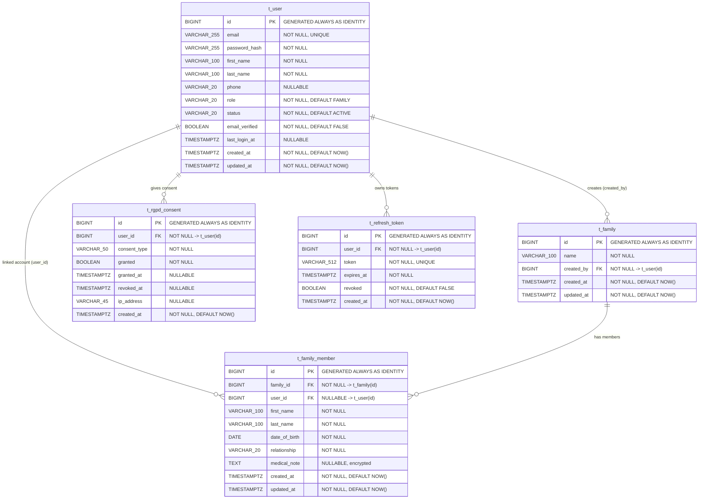
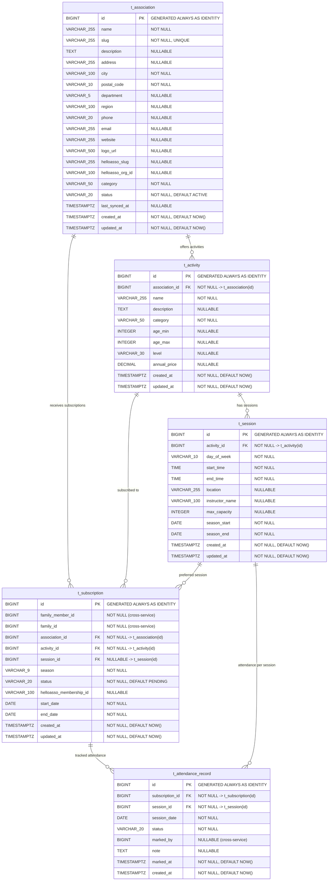
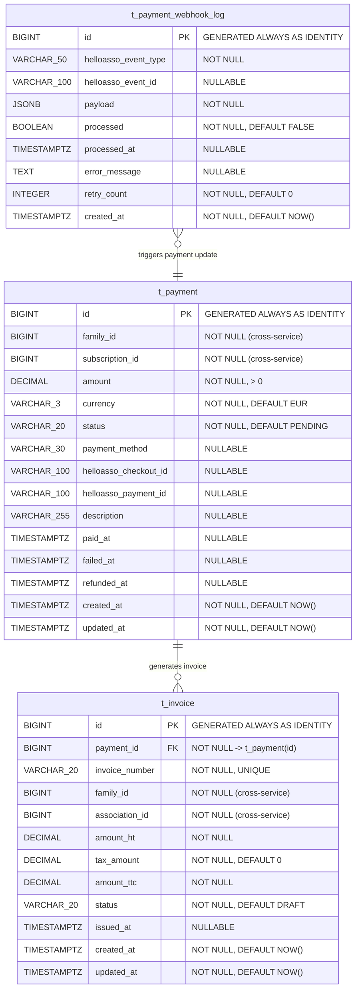
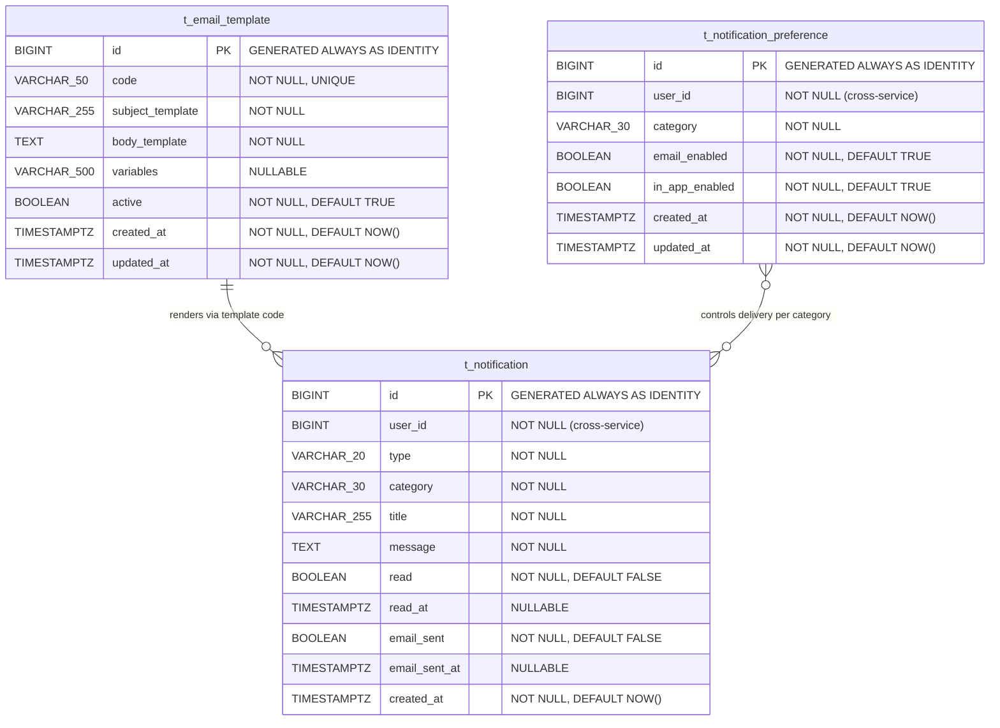
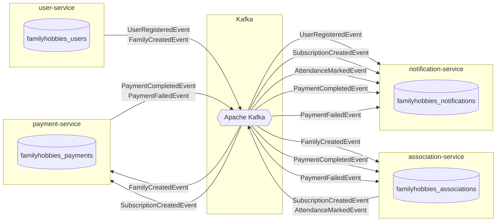
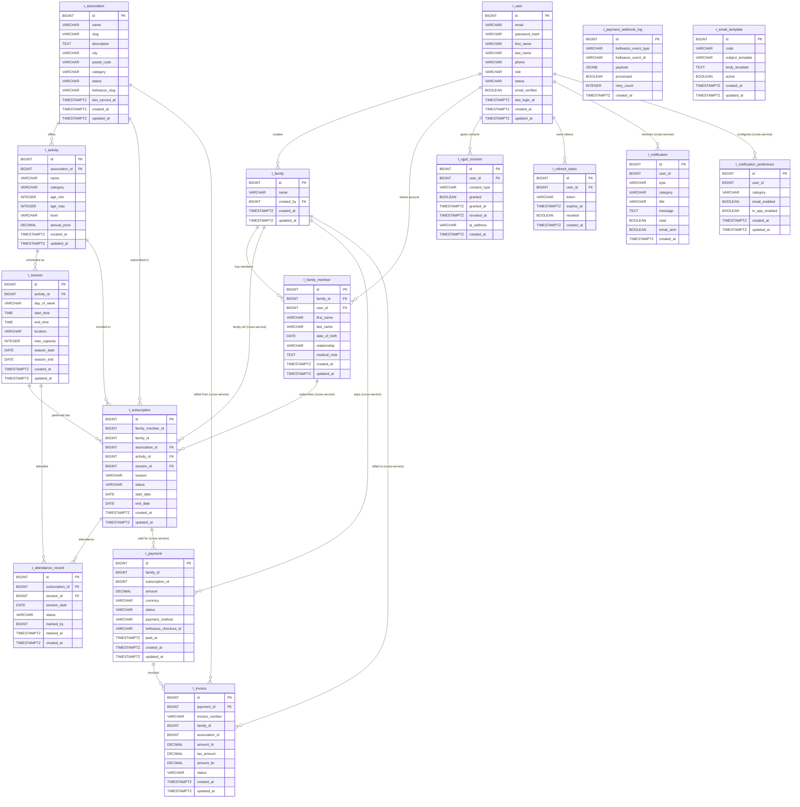

# 02 - Data Model

> **Family Hobbies Manager** -- Comprehensive Data Model Reference
> Last updated: 2026-02-23
> Status: **Authoritative** -- all Liquibase migrations MUST conform to this document.

---

## Table of Contents

1. [Overview](#1-overview)
2. [Database Allocation](#2-database-allocation)
3. [Naming Conventions](#3-naming-conventions)
4. [Service 1: user-service (familyhobbies_users)](#4-service-1-user-service-familyhobbies_users)
5. [Service 2: association-service (familyhobbies_associations)](#5-service-2-association-service-familyhobbies_associations)
6. [Service 3: payment-service (familyhobbies_payments)](#6-service-3-payment-service-familyhobbies_payments)
7. [Service 4: notification-service (familyhobbies_notifications)](#7-service-4-notification-service-familyhobbies_notifications)
8. [Cross-Service Reference Model](#8-cross-service-reference-model)
9. [Enum Reference](#9-enum-reference)
10. [Complete Database Statistics](#10-complete-database-statistics)
11. [Liquibase Migration Plan](#11-liquibase-migration-plan)

---

## 1. Overview

Family Hobbies Manager follows the **database-per-service** pattern. Each microservice owns its own PostgreSQL 16 database and is the sole reader/writer. Cross-service data references use **logical IDs** (not foreign keys) with eventual consistency guaranteed by **Apache Kafka** events.

All schema migrations are managed by **Liquibase** using XML changesets. Every table includes audit columns (`created_at`, `updated_at`) and uses `GENERATED ALWAYS AS IDENTITY` for primary keys.

**Key design decisions:**

- **BIGINT identity PKs** -- all primary keys are `BIGINT GENERATED ALWAYS AS IDENTITY` for consistency and scalability.
- **TIMESTAMPTZ everywhere** -- all timestamps use `TIMESTAMP WITH TIME ZONE` to avoid timezone ambiguity.
- **Enum-as-VARCHAR** -- enums are stored as `VARCHAR` with application-level validation rather than PostgreSQL `ENUM` types, allowing non-breaking additions without migrations.
- **Soft deletes via status** -- records use status columns (`ACTIVE`, `DELETED`, etc.) rather than physical deletion, supporting RGPD data retention requirements.
- **No cross-database foreign keys** -- inter-service references use plain `BIGINT` columns without FK constraints.

---

## 2. Database Allocation

| Database                       | Service                | Port | Owner Role              | Description                                                              |
|--------------------------------|------------------------|------|-------------------------|--------------------------------------------------------------------------|
| `familyhobbies_users`          | user-service           | 8081 | `fhm_users_app`         | Authentication, users, families, family members, RGPD consents, tokens   |
| `familyhobbies_associations`   | association-service    | 8082 | `fhm_associations_app`  | Associations, activities, sessions, subscriptions, attendance records     |
| `familyhobbies_payments`       | payment-service        | 8083 | `fhm_payments_app`      | Payments, invoices, HelloAsso webhook logs                               |
| `familyhobbies_notifications`  | notification-service   | 8084 | `fhm_notifications_app` | Notifications, email templates, user notification preferences            |

All databases run on PostgreSQL 16. Each database has a dedicated application role with minimal privileges (`SELECT`, `INSERT`, `UPDATE`, `DELETE` on owned tables; `USAGE`, `SELECT` on sequences). No `SUPERUSER` or `CREATEDB` privileges for application roles.

---

## 3. Naming Conventions

| Element              | Convention                          | Example                                    |
|----------------------|-------------------------------------|--------------------------------------------|
| Database             | `familyhobbies_{service}`           | `familyhobbies_users`                      |
| Table                | `t_{entity}`                        | `t_user`, `t_family`                       |
| Primary key          | `id`                                | `t_user.id`                                |
| Foreign key column   | `{referenced_entity}_id`            | `family_id`, `activity_id`                 |
| FK constraint        | `fk_{table}_{referenced}`           | `fk_family_member_family`                  |
| Unique constraint    | `uq_{table}_{columns}`             | `uq_user_email`                            |
| Index                | `idx_{table}_{columns}`            | `idx_user_email`                           |
| Composite index      | `idx_{table}_{col1}_{col2}`        | `idx_association_city_category`            |
| Check constraint     | `chk_{table}_{description}`        | `chk_session_time_range`                   |
| Sequence             | `t_{table}_id_seq` (auto)          | `t_user_id_seq`                            |

---

## 4. Service 1: user-service (familyhobbies_users)

**Schema:** `public`
**Tables:** 5
**Liquibase changelog:** `backend/user-service/src/main/resources/db/changelog/db.changelog-master.xml`

---

### 4.1 t_user

Stores all application user accounts. A user may be a family parent, an association manager, or a platform administrator.

| Column           | Type           | Nullable | Default      | Constraints                                      | Description                            |
|------------------|----------------|----------|--------------|--------------------------------------------------|----------------------------------------|
| `id`             | `BIGINT`       | NO       | IDENTITY     | `PK`                                             | User unique identifier                 |
| `email`          | `VARCHAR(255)` | NO       | --           | `NOT NULL`, `UNIQUE (uq_user_email)`             | Login email address                    |
| `password_hash`  | `VARCHAR(255)` | NO       | --           | `NOT NULL`                                       | BCrypt-hashed password (60 chars)      |
| `first_name`     | `VARCHAR(100)` | NO       | --           | `NOT NULL`                                       | User first name                        |
| `last_name`      | `VARCHAR(100)` | NO       | --           | `NOT NULL`                                       | User last name                         |
| `phone`          | `VARCHAR(20)`  | YES      | `NULL`       | --                                               | Phone number (French format)           |
| `role`           | `VARCHAR(20)`  | NO       | `'FAMILY'`   | `NOT NULL`, `DEFAULT 'FAMILY'`                   | Application role: FAMILY, ASSOCIATION, ADMIN |
| `status`         | `VARCHAR(20)`  | NO       | `'ACTIVE'`   | `NOT NULL`, `DEFAULT 'ACTIVE'`                   | Account status: ACTIVE, INACTIVE, SUSPENDED, DELETED |
| `email_verified` | `BOOLEAN`      | NO       | `FALSE`      | `NOT NULL`, `DEFAULT FALSE`                      | Whether the email address is verified  |
| `last_login_at`  | `TIMESTAMPTZ`  | YES      | `NULL`       | --                                               | Timestamp of last successful login     |
| `created_at`     | `TIMESTAMPTZ`  | NO       | `NOW()`      | `NOT NULL`, `DEFAULT NOW()`                      | Record creation timestamp              |
| `updated_at`     | `TIMESTAMPTZ`  | NO       | `NOW()`      | `NOT NULL`, `DEFAULT NOW()`                      | Last update timestamp                  |

**Constraints:**

| Name              | Type   | Columns    | Details                                  |
|-------------------|--------|------------|------------------------------------------|
| `pk_user`         | PK     | `id`       | `GENERATED ALWAYS AS IDENTITY`           |
| `uq_user_email`   | UNIQUE | `email`    | Ensures one account per email address    |

**Indexes:**

| Name              | Columns    | Type    | Purpose                                  |
|-------------------|------------|---------|------------------------------------------|
| `idx_user_email`  | `email`    | B-tree  | Fast lookup by email during login        |
| `idx_user_status` | `status`   | B-tree  | Filter active/inactive users             |

---

### 4.2 t_family

Represents a family group. Created by a user with the FAMILY role. A user can create one family, and that family groups together all family members (parents, children, others).

| Column       | Type           | Nullable | Default  | Constraints                                           | Description                               |
|--------------|----------------|----------|----------|-------------------------------------------------------|-------------------------------------------|
| `id`         | `BIGINT`       | NO       | IDENTITY | `PK`                                                  | Family unique identifier                  |
| `name`       | `VARCHAR(100)` | NO       | --       | `NOT NULL`                                            | Family display name (e.g., "Famille Dupont") |
| `created_by` | `BIGINT`       | NO       | --       | `NOT NULL`, `FK (fk_family_user) -> t_user(id)`      | User who created the family               |
| `created_at` | `TIMESTAMPTZ`  | NO       | `NOW()`  | `NOT NULL`, `DEFAULT NOW()`                           | Record creation timestamp                 |
| `updated_at` | `TIMESTAMPTZ`  | NO       | `NOW()`  | `NOT NULL`, `DEFAULT NOW()`                           | Last update timestamp                     |

**Constraints:**

| Name              | Type | Columns      | Details                                               |
|-------------------|------|--------------|-------------------------------------------------------|
| `pk_family`       | PK   | `id`         | `GENERATED ALWAYS AS IDENTITY`                        |
| `fk_family_user`  | FK   | `created_by` | References `t_user(id)`, `ON DELETE RESTRICT`         |

**Indexes:**

| Name                    | Columns      | Type   | Purpose                                  |
|-------------------------|--------------|--------|------------------------------------------|
| `idx_family_created_by` | `created_by` | B-tree | Find families by creator                 |

---

### 4.3 t_family_member

Represents an individual person within a family. May or may not have their own user account (e.g., young children do not). Each member can be subscribed to activities independently.

| Column         | Type           | Nullable | Default  | Constraints                                                        | Description                                              |
|----------------|----------------|----------|----------|--------------------------------------------------------------------|----------------------------------------------------------|
| `id`           | `BIGINT`       | NO       | IDENTITY | `PK`                                                               | Member unique identifier                                 |
| `family_id`    | `BIGINT`       | NO       | --       | `NOT NULL`, `FK (fk_family_member_family) -> t_family(id)`         | Parent family                                            |
| `user_id`      | `BIGINT`       | YES      | `NULL`   | `FK (fk_family_member_user) -> t_user(id)`                         | Linked user account (NULL for children without accounts) |
| `first_name`   | `VARCHAR(100)` | NO       | --       | `NOT NULL`                                                         | Member first name                                        |
| `last_name`    | `VARCHAR(100)` | NO       | --       | `NOT NULL`                                                         | Member last name                                         |
| `date_of_birth`| `DATE`         | NO       | --       | `NOT NULL`                                                         | Birth date (used for activity age eligibility checks)    |
| `relationship` | `VARCHAR(20)`  | NO       | --       | `NOT NULL`                                                         | Relationship type: PARENT, CHILD, OTHER                  |
| `medical_note` | `TEXT`         | YES      | `NULL`   | --                                                                 | Medical info for activities (encrypted at rest via pgcrypto or app-level) |
| `created_at`   | `TIMESTAMPTZ`  | NO       | `NOW()`  | `NOT NULL`, `DEFAULT NOW()`                                        | Record creation timestamp                                |
| `updated_at`   | `TIMESTAMPTZ`  | NO       | `NOW()`  | `NOT NULL`, `DEFAULT NOW()`                                        | Last update timestamp                                    |

**Constraints:**

| Name                       | Type | Columns     | Details                                        |
|----------------------------|------|-------------|------------------------------------------------|
| `pk_family_member`         | PK   | `id`        | `GENERATED ALWAYS AS IDENTITY`                 |
| `fk_family_member_family`  | FK   | `family_id` | References `t_family(id)`, `ON DELETE CASCADE` |
| `fk_family_member_user`    | FK   | `user_id`   | References `t_user(id)`, `ON DELETE SET NULL`  |

**Indexes:**

| Name                            | Columns     | Type   | Purpose                                   |
|---------------------------------|-------------|--------|-------------------------------------------|
| `idx_family_member_family_id`   | `family_id` | B-tree | List all members of a family              |
| `idx_family_member_user_id`     | `user_id`   | B-tree | Find member record by linked user account |

---

### 4.4 t_rgpd_consent

Tracks RGPD (GDPR) consent records per user. Every consent type is stored as an individual row, with timestamps for both granting and revoking. This table is append-aware: new consent actions create or update rows, and the full history can be reconstructed for audit.

| Column         | Type           | Nullable | Default  | Constraints                                                          | Description                                    |
|----------------|----------------|----------|----------|----------------------------------------------------------------------|------------------------------------------------|
| `id`           | `BIGINT`       | NO       | IDENTITY | `PK`                                                                 | Record unique identifier                       |
| `user_id`      | `BIGINT`       | NO       | --       | `NOT NULL`, `FK (fk_rgpd_consent_user) -> t_user(id)`               | User who gave/revoked consent                  |
| `consent_type` | `VARCHAR(50)`  | NO       | --       | `NOT NULL`                                                           | Consent category: DATA_PROCESSING, MARKETING_EMAIL, THIRD_PARTY_SHARING, ANALYTICS |
| `granted`      | `BOOLEAN`      | NO       | --       | `NOT NULL`                                                           | Whether consent is currently granted           |
| `granted_at`   | `TIMESTAMPTZ`  | YES      | `NULL`   | --                                                                   | Timestamp when consent was granted             |
| `revoked_at`   | `TIMESTAMPTZ`  | YES      | `NULL`   | --                                                                   | Timestamp when consent was revoked             |
| `ip_address`   | `VARCHAR(45)`  | YES      | `NULL`   | --                                                                   | IP address at time of consent action (IPv4/IPv6) |
| `created_at`   | `TIMESTAMPTZ`  | NO       | `NOW()`  | `NOT NULL`, `DEFAULT NOW()`                                          | Record creation timestamp                      |

**Constraints:**

| Name                            | Type   | Columns                    | Details                                           |
|---------------------------------|--------|----------------------------|---------------------------------------------------|
| `pk_rgpd_consent`               | PK     | `id`                       | `GENERATED ALWAYS AS IDENTITY`                    |
| `fk_rgpd_consent_user`          | FK     | `user_id`                  | References `t_user(id)`, `ON DELETE CASCADE`      |
| `uq_rgpd_consent_user_type`     | UNIQUE | `(user_id, consent_type)`  | One record per user per consent type              |

**Indexes:**

| Name                          | Columns                   | Type   | Purpose                                      |
|-------------------------------|---------------------------|--------|----------------------------------------------|
| `idx_rgpd_consent_user_id`    | `user_id`                 | B-tree | Retrieve all consents for a user             |

---

### 4.5 t_refresh_token

Stores opaque refresh tokens issued during authentication. Tokens are rotated on use and can be individually revoked. Expired or revoked tokens are periodically cleaned up by a scheduled job.

| Column       | Type           | Nullable | Default  | Constraints                                                        | Description                          |
|--------------|----------------|----------|----------|--------------------------------------------------------------------|--------------------------------------|
| `id`         | `BIGINT`       | NO       | IDENTITY | `PK`                                                               | Token record identifier              |
| `user_id`    | `BIGINT`       | NO       | --       | `NOT NULL`, `FK (fk_refresh_token_user) -> t_user(id)`             | Token owner                          |
| `token`      | `VARCHAR(512)` | NO       | --       | `NOT NULL`, `UNIQUE (uq_refresh_token)`                            | Opaque refresh token value           |
| `expires_at` | `TIMESTAMPTZ`  | NO       | --       | `NOT NULL`                                                         | Token expiration timestamp           |
| `revoked`    | `BOOLEAN`      | NO       | `FALSE`  | `NOT NULL`, `DEFAULT FALSE`                                        | Whether token has been revoked       |
| `created_at` | `TIMESTAMPTZ`  | NO       | `NOW()`  | `NOT NULL`, `DEFAULT NOW()`                                        | Token creation timestamp             |

**Constraints:**

| Name                     | Type   | Columns  | Details                                            |
|--------------------------|--------|----------|----------------------------------------------------|
| `pk_refresh_token`       | PK     | `id`     | `GENERATED ALWAYS AS IDENTITY`                     |
| `fk_refresh_token_user`  | FK     | `user_id`| References `t_user(id)`, `ON DELETE CASCADE`       |
| `uq_refresh_token`       | UNIQUE | `token`  | Ensures token uniqueness                           |

**Indexes:**

| Name                              | Columns      | Type   | Purpose                                        |
|-----------------------------------|--------------|--------|-------------------------------------------------|
| `idx_refresh_token_user_id`       | `user_id`    | B-tree | Find all tokens for a user (revocation)        |
| `idx_refresh_token_expires_at`    | `expires_at` | B-tree | Cleanup job: find expired tokens               |

---

### 4.6 user-service ER Diagram



---

## 5. Service 2: association-service (familyhobbies_associations)

**Schema:** `public`
**Tables:** 5
**Liquibase changelog:** `backend/association-service/src/main/resources/db/changelog/db.changelog-master.xml`

---

### 5.1 t_association

Stores associations (sports clubs, dance schools, music academies, etc.) sourced from HelloAsso or manually created. Acts as a local cache of HelloAsso organization data enriched with application-specific fields.

| Column              | Type           | Nullable | Default    | Constraints                                   | Description                                     |
|---------------------|----------------|----------|------------|-----------------------------------------------|-------------------------------------------------|
| `id`                | `BIGINT`       | NO       | IDENTITY   | `PK`                                          | Association unique identifier                   |
| `name`              | `VARCHAR(255)` | NO       | --         | `NOT NULL`                                    | Association official name                       |
| `slug`              | `VARCHAR(255)` | NO       | --         | `NOT NULL`, `UNIQUE (uq_association_slug)`    | URL-friendly identifier (lowercase, hyphens)    |
| `description`       | `TEXT`         | YES      | `NULL`     | --                                            | Association description                         |
| `address`           | `VARCHAR(255)` | YES      | `NULL`     | --                                            | Street address                                  |
| `city`              | `VARCHAR(100)` | NO       | --         | `NOT NULL`                                    | City name                                       |
| `postal_code`       | `VARCHAR(10)`  | NO       | --         | `NOT NULL`                                    | French postal code (5 digits)                   |
| `department`        | `VARCHAR(5)`   | YES      | `NULL`     | --                                            | French department code (e.g., "75", "69", "2A") |
| `region`            | `VARCHAR(100)` | YES      | `NULL`     | --                                            | Region name (e.g., "Ile-de-France")             |
| `phone`             | `VARCHAR(20)`  | YES      | `NULL`     | --                                            | Contact phone number                            |
| `email`             | `VARCHAR(255)` | YES      | `NULL`     | --                                            | Contact email address                           |
| `website`           | `VARCHAR(255)` | YES      | `NULL`     | --                                            | Website URL                                     |
| `logo_url`          | `VARCHAR(500)` | YES      | `NULL`     | --                                            | Logo image URL (external or CDN)                |
| `helloasso_slug`    | `VARCHAR(255)` | YES      | `NULL`     | --                                            | HelloAsso organization slug for API calls       |
| `helloasso_org_id`  | `VARCHAR(100)` | YES      | `NULL`     | --                                            | HelloAsso organization ID                       |
| `category`          | `VARCHAR(50)`  | NO       | --         | `NOT NULL`                                    | Association category: SPORT, DANCE, MUSIC, THEATER, ART, MARTIAL_ARTS, WELLNESS, OTHER |
| `status`            | `VARCHAR(20)`  | NO       | `'ACTIVE'` | `NOT NULL`, `DEFAULT 'ACTIVE'`                | Status: ACTIVE, INACTIVE, ARCHIVED              |
| `last_synced_at`    | `TIMESTAMPTZ`  | YES      | `NULL`     | --                                            | Last successful HelloAsso data sync timestamp   |
| `created_at`        | `TIMESTAMPTZ`  | NO       | `NOW()`    | `NOT NULL`, `DEFAULT NOW()`                   | Record creation timestamp                       |
| `updated_at`        | `TIMESTAMPTZ`  | NO       | `NOW()`    | `NOT NULL`, `DEFAULT NOW()`                   | Last update timestamp                           |

**Constraints:**

| Name                    | Type   | Columns  | Details                              |
|-------------------------|--------|----------|--------------------------------------|
| `pk_association`        | PK     | `id`     | `GENERATED ALWAYS AS IDENTITY`       |
| `uq_association_slug`   | UNIQUE | `slug`   | One association per slug             |

**Indexes:**

| Name                                | Columns              | Type   | Purpose                                            |
|-------------------------------------|----------------------|--------|----------------------------------------------------|
| `idx_association_city`              | `city`               | B-tree | Search associations by city                        |
| `idx_association_category`          | `category`           | B-tree | Filter associations by category                    |
| `idx_association_city_category`     | `(city, category)`   | B-tree | Combined city + category search (most common query)|
| `idx_association_postal_code`       | `postal_code`        | B-tree | Search by postal code                              |
| `idx_association_helloasso_slug`    | `helloasso_slug`     | B-tree | Lookup by HelloAsso slug during sync               |

---

### 5.2 t_activity

Represents a specific activity offered by an association (e.g., "Judo enfants 6-8 ans", "Piano classique adultes"). An association can offer many activities.

| Column           | Type            | Nullable | Default  | Constraints                                                   | Description                                    |
|------------------|-----------------|----------|----------|---------------------------------------------------------------|------------------------------------------------|
| `id`             | `BIGINT`        | NO       | IDENTITY | `PK`                                                          | Activity unique identifier                     |
| `association_id` | `BIGINT`        | NO       | --       | `NOT NULL`, `FK (fk_activity_association) -> t_association(id)`| Parent association                             |
| `name`           | `VARCHAR(255)`  | NO       | --       | `NOT NULL`                                                    | Activity name (e.g., "Judo enfants")           |
| `description`    | `TEXT`          | YES      | `NULL`   | --                                                            | Detailed activity description                  |
| `category`       | `VARCHAR(50)`   | NO       | --       | `NOT NULL`                                                    | Activity category: SPORT, DANCE, MUSIC, THEATER, ART, MARTIAL_ARTS, WELLNESS, OTHER |
| `age_min`        | `INTEGER`       | YES      | `NULL`   | --                                                            | Minimum age requirement (NULL = no minimum)    |
| `age_max`        | `INTEGER`       | YES      | `NULL`   | --                                                            | Maximum age requirement (NULL = no maximum)    |
| `level`          | `VARCHAR(30)`   | YES      | `NULL`   | --                                                            | Skill level: BEGINNER, INTERMEDIATE, ADVANCED, ALL_LEVELS |
| `annual_price`   | `DECIMAL(10,2)` | YES      | `NULL`   | --                                                            | Annual subscription price in EUR               |
| `created_at`     | `TIMESTAMPTZ`   | NO       | `NOW()`  | `NOT NULL`, `DEFAULT NOW()`                                   | Record creation timestamp                      |
| `updated_at`     | `TIMESTAMPTZ`   | NO       | `NOW()`  | `NOT NULL`, `DEFAULT NOW()`                                   | Last update timestamp                          |

**Constraints:**

| Name                      | Type | Columns          | Details                                                 |
|---------------------------|------|------------------|---------------------------------------------------------|
| `pk_activity`             | PK   | `id`             | `GENERATED ALWAYS AS IDENTITY`                          |
| `fk_activity_association` | FK   | `association_id` | References `t_association(id)`, `ON DELETE CASCADE`     |
| `chk_activity_age_range`  | CHK  | `(age_min, age_max)` | `age_min IS NULL OR age_max IS NULL OR age_min <= age_max` |

**Indexes:**

| Name                           | Columns          | Type   | Purpose                                      |
|--------------------------------|------------------|--------|----------------------------------------------|
| `idx_activity_association_id`  | `association_id` | B-tree | List all activities for an association        |
| `idx_activity_category`        | `category`       | B-tree | Filter activities by category                |

---

### 5.3 t_session

Represents a recurring weekly time slot for an activity. Sessions define when and where an activity takes place during a season.

| Column            | Type           | Nullable | Default  | Constraints                                               | Description                                         |
|-------------------|----------------|----------|----------|-----------------------------------------------------------|-----------------------------------------------------|
| `id`              | `BIGINT`       | NO       | IDENTITY | `PK`                                                      | Session unique identifier                           |
| `activity_id`     | `BIGINT`       | NO       | --       | `NOT NULL`, `FK (fk_session_activity) -> t_activity(id)`  | Parent activity                                     |
| `day_of_week`     | `VARCHAR(10)`  | NO       | --       | `NOT NULL`                                                | Day: MONDAY, TUESDAY, WEDNESDAY, THURSDAY, FRIDAY, SATURDAY, SUNDAY |
| `start_time`      | `TIME`         | NO       | --       | `NOT NULL`                                                | Session start time (local time)                     |
| `end_time`        | `TIME`         | NO       | --       | `NOT NULL`                                                | Session end time (local time)                       |
| `location`        | `VARCHAR(255)` | YES      | `NULL`   | --                                                        | Room, gym, studio, or venue name                    |
| `instructor_name` | `VARCHAR(100)` | YES      | `NULL`   | --                                                        | Instructor full name                                |
| `max_capacity`    | `INTEGER`      | YES      | `NULL`   | --                                                        | Maximum number of participants (NULL = unlimited)   |
| `season_start`    | `DATE`         | NO       | --       | `NOT NULL`                                                | Season start date (e.g., 2025-09-01)                |
| `season_end`      | `DATE`         | NO       | --       | `NOT NULL`                                                | Season end date (e.g., 2026-06-30)                  |
| `created_at`      | `TIMESTAMPTZ`  | NO       | `NOW()`  | `NOT NULL`, `DEFAULT NOW()`                               | Record creation timestamp                           |
| `updated_at`      | `TIMESTAMPTZ`  | NO       | `NOW()`  | `NOT NULL`, `DEFAULT NOW()`                               | Last update timestamp                               |

**Constraints:**

| Name                      | Type | Columns                  | Details                                                          |
|---------------------------|------|--------------------------|------------------------------------------------------------------|
| `pk_session`              | PK   | `id`                     | `GENERATED ALWAYS AS IDENTITY`                                   |
| `fk_session_activity`     | FK   | `activity_id`            | References `t_activity(id)`, `ON DELETE CASCADE`                 |
| `chk_session_time_range`  | CHK  | `(start_time, end_time)` | `start_time < end_time`                                          |
| `chk_session_season_range`| CHK  | `(season_start, season_end)` | `season_start < season_end`                                  |

**Indexes:**

| Name                          | Columns       | Type   | Purpose                                       |
|-------------------------------|---------------|--------|-----------------------------------------------|
| `idx_session_activity_id`     | `activity_id` | B-tree | List all sessions for an activity             |
| `idx_session_day_of_week`     | `day_of_week` | B-tree | Find sessions by day (schedule views)         |

---

### 5.4 t_subscription

Represents a family member's subscription (inscription) to a specific activity for a season. Links a family member (from user-service, cross-service reference) to an association's activity.

| Column                      | Type           | Nullable | Default     | Constraints                                                        | Description                                               |
|-----------------------------|----------------|----------|-------------|--------------------------------------------------------------------|-----------------------------------------------------------|
| `id`                        | `BIGINT`       | NO       | IDENTITY    | `PK`                                                               | Subscription unique identifier                            |
| `family_member_id`          | `BIGINT`       | NO       | --          | `NOT NULL`                                                         | Cross-service ref to `t_family_member.id` in user-service |
| `family_id`                 | `BIGINT`       | NO       | --          | `NOT NULL`                                                         | Cross-service ref to `t_family.id` in user-service        |
| `association_id`            | `BIGINT`       | NO       | --          | `NOT NULL`, `FK (fk_subscription_association) -> t_association(id)`| Target association                                        |
| `activity_id`               | `BIGINT`       | NO       | --          | `NOT NULL`, `FK (fk_subscription_activity) -> t_activity(id)`     | Target activity                                           |
| `session_id`                | `BIGINT`       | YES      | `NULL`      | `FK (fk_subscription_session) -> t_session(id)`                    | Preferred session (NULL for flexible scheduling)          |
| `season`                    | `VARCHAR(9)`   | NO       | --          | `NOT NULL`                                                         | Season identifier, format: "2025-2026"                    |
| `status`                    | `VARCHAR(20)`  | NO       | `'PENDING'` | `NOT NULL`, `DEFAULT 'PENDING'`                                    | Status: PENDING, ACTIVE, CANCELLED, EXPIRED, SUSPENDED    |
| `helloasso_membership_id`   | `VARCHAR(100)` | YES      | `NULL`      | --                                                                 | HelloAsso membership reference ID                         |
| `start_date`                | `DATE`         | NO       | --          | `NOT NULL`                                                         | Subscription start date                                   |
| `end_date`                  | `DATE`         | NO       | --          | `NOT NULL`                                                         | Subscription end date                                     |
| `created_at`                | `TIMESTAMPTZ`  | NO       | `NOW()`     | `NOT NULL`, `DEFAULT NOW()`                                        | Record creation timestamp                                 |
| `updated_at`                | `TIMESTAMPTZ`  | NO       | `NOW()`     | `NOT NULL`, `DEFAULT NOW()`                                        | Last update timestamp                                     |

**Constraints:**

| Name                                      | Type   | Columns                                     | Details                                                       |
|-------------------------------------------|--------|---------------------------------------------|---------------------------------------------------------------|
| `pk_subscription`                         | PK     | `id`                                        | `GENERATED ALWAYS AS IDENTITY`                                |
| `fk_subscription_association`             | FK     | `association_id`                            | References `t_association(id)`, `ON DELETE RESTRICT`           |
| `fk_subscription_activity`               | FK     | `activity_id`                               | References `t_activity(id)`, `ON DELETE RESTRICT`             |
| `fk_subscription_session`                | FK     | `session_id`                                | References `t_session(id)`, `ON DELETE SET NULL`              |
| `uq_subscription_member_activity_season` | UNIQUE | `(family_member_id, activity_id, season)`   | One subscription per member per activity per season           |
| `chk_subscription_date_range`            | CHK    | `(start_date, end_date)`                    | `start_date <= end_date`                                      |

**Indexes:**

| Name                                  | Columns             | Type   | Purpose                                               |
|---------------------------------------|---------------------|--------|-------------------------------------------------------|
| `idx_subscription_family_member_id`   | `family_member_id`  | B-tree | Find all subscriptions for a family member            |
| `idx_subscription_family_id`          | `family_id`         | B-tree | Dashboard: all subscriptions for a family             |
| `idx_subscription_status`             | `status`            | B-tree | Filter active/pending subscriptions                   |
| `idx_subscription_season`             | `season`            | B-tree | Filter by season                                      |
| `idx_subscription_association_id`     | `association_id`    | B-tree | List all subscriptions for an association             |

---

### 5.5 t_attendance_record

Tracks attendance for each family member at each session occurrence. Created when an instructor or parent marks attendance for a specific date.

| Column            | Type           | Nullable | Default  | Constraints                                                              | Description                                    |
|-------------------|----------------|----------|----------|--------------------------------------------------------------------------|------------------------------------------------|
| `id`              | `BIGINT`       | NO       | IDENTITY | `PK`                                                                     | Record unique identifier                       |
| `subscription_id` | `BIGINT`       | NO       | --       | `NOT NULL`, `FK (fk_attendance_subscription) -> t_subscription(id)`      | Linked subscription                            |
| `session_id`      | `BIGINT`       | NO       | --       | `NOT NULL`, `FK (fk_attendance_session) -> t_session(id)`                | Session that was attended                      |
| `session_date`    | `DATE`         | NO       | --       | `NOT NULL`                                                               | Actual date of the session occurrence          |
| `status`          | `VARCHAR(20)`  | NO       | --       | `NOT NULL`                                                               | Attendance status: PRESENT, ABSENT, EXCUSED, LATE |
| `marked_by`       | `BIGINT`       | YES      | `NULL`   | --                                                                       | Cross-service ref to user who marked attendance|
| `note`            | `TEXT`         | YES      | `NULL`   | --                                                                       | Optional note (e.g., reason for absence)       |
| `marked_at`       | `TIMESTAMPTZ`  | NO       | `NOW()`  | `NOT NULL`, `DEFAULT NOW()`                                              | When attendance was marked                     |
| `created_at`      | `TIMESTAMPTZ`  | NO       | `NOW()`  | `NOT NULL`, `DEFAULT NOW()`                                              | Record creation timestamp                      |

**Constraints:**

| Name                                         | Type   | Columns                                        | Details                                                    |
|----------------------------------------------|--------|-------------------------------------------------|------------------------------------------------------------|
| `pk_attendance_record`                       | PK     | `id`                                            | `GENERATED ALWAYS AS IDENTITY`                             |
| `fk_attendance_subscription`                 | FK     | `subscription_id`                               | References `t_subscription(id)`, `ON DELETE CASCADE`       |
| `fk_attendance_session`                      | FK     | `session_id`                                    | References `t_session(id)`, `ON DELETE CASCADE`            |
| `uq_attendance_subscription_session_date`    | UNIQUE | `(subscription_id, session_id, session_date)`   | One attendance record per subscription per session per date|

**Indexes:**

| Name                          | Columns          | Type   | Purpose                                           |
|-------------------------------|------------------|--------|---------------------------------------------------|
| `idx_attendance_session_date` | `session_date`   | B-tree | Query attendance for a specific date              |
| `idx_attendance_status`       | `status`         | B-tree | Filter by attendance status (absence reports)     |
| `idx_attendance_subscription` | `subscription_id`| B-tree | Attendance history for a subscription             |

---

### 5.6 association-service ER Diagram



---

## 6. Service 3: payment-service (familyhobbies_payments)

**Schema:** `public`
**Tables:** 3
**Liquibase changelog:** `backend/payment-service/src/main/resources/db/changelog/db.changelog-master.xml`

---

### 6.1 t_payment

Records every payment transaction. Payments are initiated via HelloAsso Checkout and tracked through their lifecycle from pending to completed/failed/refunded.

| Column                    | Type            | Nullable | Default     | Constraints                   | Description                                          |
|---------------------------|-----------------|----------|-------------|-------------------------------|------------------------------------------------------|
| `id`                      | `BIGINT`        | NO       | IDENTITY    | `PK`                         | Payment unique identifier                            |
| `family_id`               | `BIGINT`        | NO       | --          | `NOT NULL`                   | Cross-service ref to `t_family.id` in user-service   |
| `subscription_id`         | `BIGINT`        | NO       | --          | `NOT NULL`                   | Cross-service ref to `t_subscription.id` in association-service |
| `amount`                  | `DECIMAL(10,2)` | NO       | --          | `NOT NULL`                   | Payment amount in EUR                                |
| `currency`                | `VARCHAR(3)`    | NO       | `'EUR'`     | `NOT NULL`, `DEFAULT 'EUR'`  | ISO 4217 currency code                               |
| `status`                  | `VARCHAR(20)`   | NO       | `'PENDING'` | `NOT NULL`, `DEFAULT 'PENDING'` | Payment status: PENDING, AUTHORIZED, COMPLETED, FAILED, REFUNDED, PARTIALLY_REFUNDED |
| `payment_method`          | `VARCHAR(30)`   | YES      | `NULL`      | --                           | Method: CARD, SEPA, TRANSFER, CHECK                  |
| `helloasso_checkout_id`   | `VARCHAR(100)`  | YES      | `NULL`      | --                           | HelloAsso checkout session ID                        |
| `helloasso_payment_id`    | `VARCHAR(100)`  | YES      | `NULL`      | --                           | HelloAsso payment ID (received via webhook)          |
| `description`             | `VARCHAR(255)`  | YES      | `NULL`      | --                           | Payment description (e.g., "Inscription Judo 2025-2026") |
| `paid_at`                 | `TIMESTAMPTZ`   | YES      | `NULL`      | --                           | When payment was confirmed                           |
| `failed_at`               | `TIMESTAMPTZ`   | YES      | `NULL`      | --                           | When payment failed                                  |
| `refunded_at`             | `TIMESTAMPTZ`   | YES      | `NULL`      | --                           | When refund was processed                            |
| `created_at`              | `TIMESTAMPTZ`   | NO       | `NOW()`     | `NOT NULL`, `DEFAULT NOW()`  | Record creation timestamp                            |
| `updated_at`              | `TIMESTAMPTZ`   | NO       | `NOW()`     | `NOT NULL`, `DEFAULT NOW()`  | Last update timestamp                                |

**Constraints:**

| Name                | Type | Columns  | Details                                    |
|---------------------|------|----------|--------------------------------------------|
| `pk_payment`        | PK   | `id`     | `GENERATED ALWAYS AS IDENTITY`             |
| `chk_payment_amount`| CHK  | `amount` | `amount > 0`                               |

**Indexes:**

| Name                                  | Columns                 | Type   | Purpose                                          |
|---------------------------------------|-------------------------|--------|--------------------------------------------------|
| `idx_payment_family_id`               | `family_id`             | B-tree | Dashboard: all payments for a family             |
| `idx_payment_status`                  | `status`                | B-tree | Filter by payment status                         |
| `idx_payment_helloasso_checkout_id`   | `helloasso_checkout_id` | B-tree | Lookup payment by HelloAsso checkout ID (webhook)|
| `idx_payment_subscription_id`         | `subscription_id`       | B-tree | Find payment for a subscription                  |

---

### 6.2 t_invoice

Stores generated invoices linked to completed payments. Invoice numbers follow a sequential format for accounting compliance.

| Column           | Type            | Nullable | Default    | Constraints                                                 | Description                                            |
|------------------|-----------------|----------|------------|-------------------------------------------------------------|--------------------------------------------------------|
| `id`             | `BIGINT`        | NO       | IDENTITY   | `PK`                                                        | Invoice unique identifier                              |
| `payment_id`     | `BIGINT`        | NO       | --         | `NOT NULL`, `FK (fk_invoice_payment) -> t_payment(id)`      | Linked payment                                         |
| `invoice_number` | `VARCHAR(20)`   | NO       | --         | `NOT NULL`, `UNIQUE (uq_invoice_number)`                    | Format: FHM-YYYY-NNNNNN (e.g., FHM-2025-000001)       |
| `family_id`      | `BIGINT`        | NO       | --         | `NOT NULL`                                                  | Cross-service ref to `t_family.id` in user-service     |
| `association_id` | `BIGINT`        | NO       | --         | `NOT NULL`                                                  | Cross-service ref to `t_association.id` in association-service |
| `amount_ht`      | `DECIMAL(10,2)` | NO       | --         | `NOT NULL`                                                  | Amount before tax (hors taxes)                         |
| `tax_amount`     | `DECIMAL(10,2)` | NO       | `0`        | `NOT NULL`, `DEFAULT 0`                                     | Tax amount (most associations are tax-exempt: loi 1901)|
| `amount_ttc`     | `DECIMAL(10,2)` | NO       | --         | `NOT NULL`                                                  | Total amount including tax (toutes taxes comprises)    |
| `status`         | `VARCHAR(20)`   | NO       | `'DRAFT'`  | `NOT NULL`, `DEFAULT 'DRAFT'`                               | Invoice status: DRAFT, ISSUED, PAID, CANCELLED         |
| `issued_at`      | `TIMESTAMPTZ`   | YES      | `NULL`     | --                                                          | When invoice was issued                                |
| `created_at`     | `TIMESTAMPTZ`   | NO       | `NOW()`    | `NOT NULL`, `DEFAULT NOW()`                                 | Record creation timestamp                              |
| `updated_at`     | `TIMESTAMPTZ`   | NO       | `NOW()`    | `NOT NULL`, `DEFAULT NOW()`                                 | Last update timestamp                                  |

**Constraints:**

| Name                    | Type   | Columns          | Details                                              |
|-------------------------|--------|------------------|------------------------------------------------------|
| `pk_invoice`            | PK     | `id`             | `GENERATED ALWAYS AS IDENTITY`                       |
| `fk_invoice_payment`    | FK     | `payment_id`     | References `t_payment(id)`, `ON DELETE RESTRICT`     |
| `uq_invoice_number`     | UNIQUE | `invoice_number` | Unique invoice number for accounting                 |
| `chk_invoice_amounts`   | CHK    | `(amount_ht, tax_amount, amount_ttc)` | `amount_ht >= 0 AND tax_amount >= 0 AND amount_ttc = amount_ht + tax_amount` |

**Indexes:**

| Name                          | Columns          | Type   | Purpose                                     |
|-------------------------------|------------------|--------|---------------------------------------------|
| `idx_invoice_family_id`       | `family_id`      | B-tree | List all invoices for a family              |
| `idx_invoice_invoice_number`  | `invoice_number` | B-tree | Lookup by invoice number                    |
| `idx_invoice_payment_id`      | `payment_id`     | B-tree | Find invoice for a payment                  |

---

### 6.3 t_payment_webhook_log

Stores raw webhook payloads received from HelloAsso for auditing, debugging, and retry purposes. Every incoming webhook is logged before processing.

| Column                  | Type           | Nullable | Default  | Constraints                   | Description                                        |
|-------------------------|----------------|----------|----------|-------------------------------|----------------------------------------------------|
| `id`                    | `BIGINT`       | NO       | IDENTITY | `PK`                         | Log entry unique identifier                        |
| `helloasso_event_type`  | `VARCHAR(50)`  | NO       | --       | `NOT NULL`                   | HelloAsso event type: "Payment", "Order", "Refund" |
| `helloasso_event_id`    | `VARCHAR(100)` | YES      | `NULL`   | --                           | HelloAsso event reference ID                       |
| `payload`               | `JSONB`        | NO       | --       | `NOT NULL`                   | Raw webhook JSON payload (full request body)       |
| `processed`             | `BOOLEAN`      | NO       | `FALSE`  | `NOT NULL`, `DEFAULT FALSE`  | Whether webhook has been successfully processed    |
| `processed_at`          | `TIMESTAMPTZ`  | YES      | `NULL`   | --                           | When processing completed                          |
| `error_message`         | `TEXT`         | YES      | `NULL`   | --                           | Error message if processing failed                 |
| `retry_count`           | `INTEGER`      | NO       | `0`      | `NOT NULL`, `DEFAULT 0`      | Number of processing attempts                      |
| `created_at`            | `TIMESTAMPTZ`  | NO       | `NOW()`  | `NOT NULL`, `DEFAULT NOW()`  | When webhook was received                          |

**Constraints:**

| Name                      | Type | Columns  | Details                              |
|---------------------------|------|----------|--------------------------------------|
| `pk_payment_webhook_log`  | PK   | `id`     | `GENERATED ALWAYS AS IDENTITY`       |

**Indexes:**

| Name                                   | Columns                | Type   | Purpose                                              |
|----------------------------------------|------------------------|--------|------------------------------------------------------|
| `idx_webhook_log_processed`            | `processed`            | B-tree | Find unprocessed webhooks for retry                  |
| `idx_webhook_log_event_type`           | `helloasso_event_type` | B-tree | Filter by event type                                 |
| `idx_webhook_log_helloasso_event_id`   | `helloasso_event_id`   | B-tree | Idempotency check: find existing webhook by event ID |

---

### 6.4 payment-service ER Diagram



---

## 7. Service 4: notification-service (familyhobbies_notifications)

**Schema:** `public`
**Tables:** 3
**Liquibase changelog:** `backend/notification-service/src/main/resources/db/changelog/db.changelog-master.xml`

---

### 7.1 t_notification

Stores all notifications sent to users (email, in-app, SMS). Each notification is a single record regardless of delivery channel. Read status is tracked for in-app notifications.

| Column         | Type           | Nullable | Default  | Constraints                  | Description                                          |
|----------------|----------------|----------|----------|------------------------------|------------------------------------------------------|
| `id`           | `BIGINT`       | NO       | IDENTITY | `PK`                        | Notification unique identifier                       |
| `user_id`      | `BIGINT`       | NO       | --       | `NOT NULL`                  | Cross-service ref to `t_user.id` in user-service     |
| `type`         | `VARCHAR(20)`  | NO       | --       | `NOT NULL`                  | Delivery channel: EMAIL, IN_APP, SMS                 |
| `category`     | `VARCHAR(30)`  | NO       | --       | `NOT NULL`                  | Category: WELCOME, PAYMENT_SUCCESS, PAYMENT_FAILED, SUBSCRIPTION_CONFIRMED, ATTENDANCE_REMINDER, SYSTEM |
| `title`        | `VARCHAR(255)` | NO       | --       | `NOT NULL`                  | Notification title / subject                         |
| `message`      | `TEXT`         | NO       | --       | `NOT NULL`                  | Notification body (HTML for email, text for in-app)  |
| `read`         | `BOOLEAN`      | NO       | `FALSE`  | `NOT NULL`, `DEFAULT FALSE` | Whether notification was read (in-app only)          |
| `read_at`      | `TIMESTAMPTZ`  | YES      | `NULL`   | --                          | When the notification was read                       |
| `email_sent`   | `BOOLEAN`      | NO       | `FALSE`  | `NOT NULL`, `DEFAULT FALSE` | Whether email was sent successfully                  |
| `email_sent_at`| `TIMESTAMPTZ`  | YES      | `NULL`   | --                          | When the email was sent                              |
| `created_at`   | `TIMESTAMPTZ`  | NO       | `NOW()`  | `NOT NULL`, `DEFAULT NOW()` | Record creation timestamp                            |

**Constraints:**

| Name               | Type | Columns | Details                              |
|--------------------|------|---------|--------------------------------------|
| `pk_notification`  | PK   | `id`    | `GENERATED ALWAYS AS IDENTITY`       |

**Indexes:**

| Name                              | Columns            | Type   | Purpose                                            |
|-----------------------------------|--------------------|--------|----------------------------------------------------|
| `idx_notification_user_id`        | `user_id`          | B-tree | List all notifications for a user                  |
| `idx_notification_user_read`      | `(user_id, read)`  | B-tree | Unread notification count (in-app badge)           |
| `idx_notification_category`       | `category`         | B-tree | Filter notifications by category                   |

---

### 7.2 t_email_template

Stores Thymeleaf-based email templates. Templates are managed by administrators and used by the notification service to render personalized emails.

| Column             | Type           | Nullable | Default | Constraints                          | Description                                             |
|--------------------|----------------|----------|---------|--------------------------------------|---------------------------------------------------------|
| `id`               | `BIGINT`       | NO       | IDENTITY| `PK`                                 | Template unique identifier                              |
| `code`             | `VARCHAR(50)`  | NO       | --      | `NOT NULL`, `UNIQUE (uq_template_code)` | Template identifier code: WELCOME, PAYMENT_SUCCESS, etc. |
| `subject_template` | `VARCHAR(255)` | NO       | --      | `NOT NULL`                           | Thymeleaf subject template (e.g., "Bienvenue {{firstName}}!") |
| `body_template`    | `TEXT`         | NO       | --      | `NOT NULL`                           | Thymeleaf HTML body template                            |
| `variables`        | `VARCHAR(500)` | YES      | `NULL`  | --                                   | Comma-separated list of expected variables (documentation) |
| `active`           | `BOOLEAN`      | NO       | `TRUE`  | `NOT NULL`, `DEFAULT TRUE`           | Whether template is active and available for use        |
| `created_at`       | `TIMESTAMPTZ`  | NO       | `NOW()` | `NOT NULL`, `DEFAULT NOW()`          | Record creation timestamp                               |
| `updated_at`       | `TIMESTAMPTZ`  | NO       | `NOW()` | `NOT NULL`, `DEFAULT NOW()`          | Last update timestamp                                   |

**Constraints:**

| Name                | Type   | Columns | Details                              |
|---------------------|--------|---------|--------------------------------------|
| `pk_email_template` | PK     | `id`    | `GENERATED ALWAYS AS IDENTITY`       |
| `uq_template_code`  | UNIQUE | `code`  | One template per code                |

**Indexes:**

| Name                        | Columns  | Type   | Purpose                                 |
|-----------------------------|----------|--------|-----------------------------------------|
| `idx_email_template_code`   | `code`   | B-tree | Fast lookup by template code            |
| `idx_email_template_active` | `active` | B-tree | Filter active templates                 |

---

### 7.3 t_notification_preference

Stores per-user per-category notification preferences. Users can enable/disable email and in-app notifications independently for each category.

| Column           | Type           | Nullable | Default | Constraints                                                   | Description                                   |
|------------------|----------------|----------|---------|---------------------------------------------------------------|-----------------------------------------------|
| `id`             | `BIGINT`       | NO       | IDENTITY| `PK`                                                          | Preference record identifier                  |
| `user_id`        | `BIGINT`       | NO       | --      | `NOT NULL`                                                    | Cross-service ref to `t_user.id` in user-service |
| `category`       | `VARCHAR(30)`  | NO       | --      | `NOT NULL`                                                    | Notification category                         |
| `email_enabled`  | `BOOLEAN`      | NO       | `TRUE`  | `NOT NULL`, `DEFAULT TRUE`                                    | Whether email notifications are enabled       |
| `in_app_enabled` | `BOOLEAN`      | NO       | `TRUE`  | `NOT NULL`, `DEFAULT TRUE`                                    | Whether in-app notifications are enabled      |
| `created_at`     | `TIMESTAMPTZ`  | NO       | `NOW()` | `NOT NULL`, `DEFAULT NOW()`                                   | Record creation timestamp                     |
| `updated_at`     | `TIMESTAMPTZ`  | NO       | `NOW()` | `NOT NULL`, `DEFAULT NOW()`                                   | Last update timestamp                         |

**Constraints:**

| Name                                | Type   | Columns                 | Details                                       |
|-------------------------------------|--------|-------------------------|-----------------------------------------------|
| `pk_notification_preference`        | PK     | `id`                    | `GENERATED ALWAYS AS IDENTITY`                |
| `uq_notification_pref_user_category`| UNIQUE | `(user_id, category)`   | One preference per user per category          |

**Indexes:**

| Name                                | Columns    | Type   | Purpose                                      |
|-------------------------------------|------------|--------|----------------------------------------------|
| `idx_notification_pref_user_id`     | `user_id`  | B-tree | Retrieve all preferences for a user          |

---

### 7.4 notification-service ER Diagram



---

## 8. Cross-Service Reference Model

In the database-per-service pattern, services cannot use foreign keys to reference tables in other databases. Instead, services store **logical IDs** (plain `BIGINT` columns without FK constraints) and rely on **eventual consistency** through Apache Kafka events.

### 8.1 Cross-Service ID References

| Source Service       | Source Table          | Column                | References                                | Consistency Mechanism                  |
|----------------------|-----------------------|-----------------------|-------------------------------------------|----------------------------------------|
| association-service  | `t_subscription`      | `family_member_id`    | user-service `t_family_member.id`         | `UserRegisteredEvent` via Kafka        |
| association-service  | `t_subscription`      | `family_id`           | user-service `t_family.id`                | `UserRegisteredEvent` via Kafka        |
| association-service  | `t_attendance_record` | `marked_by`           | user-service `t_user.id`                  | JWT `X-User-Id` header from gateway   |
| payment-service      | `t_payment`           | `family_id`           | user-service `t_family.id`                | `SubscriptionCreatedEvent` via Kafka   |
| payment-service      | `t_payment`           | `subscription_id`     | association-service `t_subscription.id`   | `SubscriptionCreatedEvent` via Kafka   |
| payment-service      | `t_invoice`           | `family_id`           | user-service `t_family.id`                | Copied from `t_payment` at creation    |
| payment-service      | `t_invoice`           | `association_id`      | association-service `t_association.id`    | `SubscriptionCreatedEvent` via Kafka   |
| notification-service | `t_notification`      | `user_id`             | user-service `t_user.id`                  | Kafka events (all event types)         |
| notification-service | `t_notification_preference` | `user_id`        | user-service `t_user.id`                  | `UserRegisteredEvent` via Kafka        |

### 8.2 Kafka Events Driving Consistency

| Event                        | Producer             | Consumers                              | Data Propagated                                    |
|------------------------------|----------------------|----------------------------------------|----------------------------------------------------|
| `UserRegisteredEvent`        | user-service         | notification-service                   | `userId`, `email`, `firstName`, `lastName`, `role` |
| `FamilyCreatedEvent`         | user-service         | association-service, payment-service   | `familyId`, `userId`, `familyName`                 |
| `SubscriptionCreatedEvent`   | association-service  | payment-service, notification-service  | `subscriptionId`, `familyId`, `familyMemberId`, `activityId`, `associationId`, `amount` |
| `PaymentCompletedEvent`      | payment-service      | association-service, notification-service | `paymentId`, `subscriptionId`, `amount`, `status` |
| `PaymentFailedEvent`         | payment-service      | association-service, notification-service | `paymentId`, `subscriptionId`, `errorReason`      |
| `AttendanceMarkedEvent`      | association-service  | notification-service                   | `attendanceId`, `subscriptionId`, `status`, `sessionDate` |

### 8.3 Consistency Guarantees

- **Eventual consistency**: Cross-service data may be momentarily stale (typically < 2 seconds under normal load).
- **Idempotent consumers**: All Kafka consumers are idempotent -- reprocessing an event produces the same result.
- **Dead letter queues**: Failed event processing is retried 3 times before being sent to a dead letter topic for manual investigation.
- **No distributed transactions**: The system does not use two-phase commit or saga orchestration. Each service owns its own transactional boundary.
- **Compensating actions**: If a payment fails after a subscription was created, the `PaymentFailedEvent` triggers the association-service to update the subscription status to `SUSPENDED`.

### 8.4 Cross-Service Data Flow Diagram



---

## 9. Enum Reference

Complete list of all enum values used across the data model. All enums are stored as `VARCHAR` and validated at the application level (Java enums in the common library or service-specific enums).

### 9.1 user-service Enums

| Enum Name          | Column(s)                        | Values                                                                  |
|--------------------|----------------------------------|-------------------------------------------------------------------------|
| `UserRole`         | `t_user.role`                    | `FAMILY`, `ASSOCIATION`, `ADMIN`                                        |
| `UserStatus`       | `t_user.status`                  | `ACTIVE`, `INACTIVE`, `SUSPENDED`, `DELETED`                            |
| `Relationship`     | `t_family_member.relationship`   | `PARENT`, `CHILD`, `OTHER`                                              |
| `ConsentType`      | `t_rgpd_consent.consent_type`    | `DATA_PROCESSING`, `MARKETING_EMAIL`, `THIRD_PARTY_SHARING`, `ANALYTICS`|

### 9.2 association-service Enums

| Enum Name              | Column(s)                                          | Values                                                                                    |
|------------------------|----------------------------------------------------|-------------------------------------------------------------------------------------------|
| `AssociationCategory`  | `t_association.category`, `t_activity.category`    | `SPORT`, `DANCE`, `MUSIC`, `THEATER`, `ART`, `MARTIAL_ARTS`, `WELLNESS`, `OTHER`          |
| `AssociationStatus`    | `t_association.status`                             | `ACTIVE`, `INACTIVE`, `ARCHIVED`                                                          |
| `ActivityLevel`        | `t_activity.level`                                 | `BEGINNER`, `INTERMEDIATE`, `ADVANCED`, `ALL_LEVELS`                                      |
| `DayOfWeek`            | `t_session.day_of_week`                            | `MONDAY`, `TUESDAY`, `WEDNESDAY`, `THURSDAY`, `FRIDAY`, `SATURDAY`, `SUNDAY`              |
| `SubscriptionStatus`   | `t_subscription.status`                            | `PENDING`, `ACTIVE`, `CANCELLED`, `EXPIRED`, `SUSPENDED`                                  |
| `AttendanceStatus`     | `t_attendance_record.status`                       | `PRESENT`, `ABSENT`, `EXCUSED`, `LATE`                                                    |

### 9.3 payment-service Enums

| Enum Name             | Column(s)                     | Values                                                                      |
|-----------------------|-------------------------------|-----------------------------------------------------------------------------|
| `PaymentStatus`       | `t_payment.status`            | `PENDING`, `AUTHORIZED`, `COMPLETED`, `FAILED`, `REFUNDED`, `PARTIALLY_REFUNDED` |
| `PaymentMethod`       | `t_payment.payment_method`    | `CARD`, `SEPA`, `TRANSFER`, `CHECK`                                         |
| `InvoiceStatus`       | `t_invoice.status`            | `DRAFT`, `ISSUED`, `PAID`, `CANCELLED`                                      |
| `WebhookEventType`    | `t_payment_webhook_log.helloasso_event_type` | `Payment`, `Order`, `Refund`                                     |

### 9.4 notification-service Enums

| Enum Name                | Column(s)                                      | Values                                                                                                    |
|--------------------------|-------------------------------------------------|-----------------------------------------------------------------------------------------------------------|
| `NotificationType`       | `t_notification.type`                           | `EMAIL`, `IN_APP`, `SMS`                                                                                  |
| `NotificationCategory`   | `t_notification.category`, `t_notification_preference.category`, `t_email_template.code` | `WELCOME`, `PAYMENT_SUCCESS`, `PAYMENT_FAILED`, `SUBSCRIPTION_CONFIRMED`, `ATTENDANCE_REMINDER`, `SYSTEM` |

---

## 10. Complete Database Statistics

### 10.1 Table Count Summary

| Database                      | Service              | Table Count | Total Columns | Total Indexes | Total FKs | Total Unique Constraints |
|-------------------------------|----------------------|-------------|---------------|---------------|-----------|--------------------------|
| `familyhobbies_users`         | user-service         | 5           | 42            | 8             | 5         | 3                        |
| `familyhobbies_associations`  | association-service  | 5           | 62            | 14            | 6         | 2                        |
| `familyhobbies_payments`      | payment-service      | 3           | 35            | 10            | 1         | 1                        |
| `familyhobbies_notifications` | notification-service | 3           | 25            | 6             | 0         | 2                        |
| **TOTAL**                     | **4 services**       | **16**      | **164**       | **38**        | **12**    | **8**                    |

### 10.2 Estimated Row Growth (per year, moderate usage)

Estimates assume ~500 families, ~100 associations, ~2,000 family members, ~50 activities per association with weekly sessions over a 10-month season.

| Table                    | Service              | Year 1 Est. Rows | Year 3 Est. Rows | Growth Pattern         | Notes                                        |
|--------------------------|----------------------|-------------------|-------------------|------------------------|----------------------------------------------|
| `t_user`                 | user-service         | 1,000             | 5,000             | Linear                 | One per family parent + association managers  |
| `t_family`               | user-service         | 500               | 2,500             | Linear                 | One per family                               |
| `t_family_member`        | user-service         | 2,000             | 10,000            | Linear                 | ~4 members per family                        |
| `t_rgpd_consent`         | user-service         | 4,000             | 20,000            | Linear (4x users)      | ~4 consent types per user                    |
| `t_refresh_token`        | user-service         | 2,000             | 5,000             | Stable (with cleanup)  | Active tokens only; expired tokens purged    |
| `t_association`          | association-service  | 100               | 500               | Slow linear            | Grows as new associations are onboarded      |
| `t_activity`             | association-service  | 500               | 2,500             | Linear                 | ~5 activities per association                |
| `t_session`              | association-service  | 1,500             | 7,500             | Linear                 | ~3 sessions per activity                     |
| `t_subscription`         | association-service  | 3,000             | 15,000            | Seasonal (annual)      | ~1.5 subscriptions per family member         |
| `t_attendance_record`    | association-service  | 120,000           | 600,000           | High volume, seasonal  | ~40 sessions/year x 3,000 subscriptions      |
| `t_payment`              | payment-service      | 3,000             | 15,000            | Seasonal               | ~1 payment per subscription                  |
| `t_invoice`              | payment-service      | 3,000             | 15,000            | Seasonal               | ~1 invoice per completed payment             |
| `t_payment_webhook_log`  | payment-service      | 9,000             | 45,000            | Event-driven           | ~3 webhooks per payment (auth + confirm + receipt) |
| `t_notification`         | notification-service | 15,000            | 75,000            | High volume            | ~5 notifications per subscription lifecycle  |
| `t_email_template`       | notification-service | 10                | 20                | Very slow              | Admin-managed, rarely changes                |
| `t_notification_preference` | notification-service | 6,000          | 30,000            | Linear (6x users)      | ~6 categories per user                       |

### 10.3 Storage Estimates

| Database                      | Year 1 Est. Size | Year 3 Est. Size | Largest Table              | Notes                                  |
|-------------------------------|------------------|------------------|----------------------------|----------------------------------------|
| `familyhobbies_users`         | ~50 MB           | ~200 MB          | `t_rgpd_consent`           | Medical notes encrypted at rest        |
| `familyhobbies_associations`  | ~500 MB          | ~2.5 GB          | `t_attendance_record`      | High-volume attendance tracking        |
| `familyhobbies_payments`      | ~100 MB          | ~500 MB          | `t_payment_webhook_log`    | JSONB payloads are the main driver     |
| `familyhobbies_notifications` | ~200 MB          | ~1 GB            | `t_notification`           | TEXT message bodies                    |

---

## 11. Liquibase Migration Plan

All services use Liquibase for database schema management. Changesets follow a sequential numbering scheme per service.

### 11.1 Changelog Structure

Each service maintains its migrations under:

```
backend/{service-name}/src/main/resources/db/changelog/
    db.changelog-master.xml          # Master changelog (includes all changesets)
    changesets/
        001-create-{first-table}.xml
        002-create-{second-table}.xml
        ...
```

### 11.2 Changeset Plan: user-service

| Changeset ID | File                                  | Description                                        | Tables Affected        |
|--------------|---------------------------------------|----------------------------------------------------|------------------------|
| `001`        | `001-create-user-table.xml`           | Create `t_user` table with PK, columns, indexes   | `t_user`               |
| `002`        | `002-create-family-table.xml`         | Create `t_family` table with FK to `t_user`        | `t_family`             |
| `003`        | `003-create-family-member-table.xml`  | Create `t_family_member` with FKs                  | `t_family_member`      |
| `004`        | `004-create-rgpd-consent-table.xml`   | Create `t_rgpd_consent` with unique constraint     | `t_rgpd_consent`       |
| `005`        | `005-create-refresh-token-table.xml`  | Create `t_refresh_token` with unique token index   | `t_refresh_token`      |

### 11.3 Changeset Plan: association-service

| Changeset ID | File                                         | Description                                              | Tables Affected          |
|--------------|----------------------------------------------|----------------------------------------------------------|--------------------------|
| `001`        | `001-create-association-table.xml`            | Create `t_association` with all indexes                  | `t_association`          |
| `002`        | `002-create-activity-table.xml`               | Create `t_activity` with FK and check constraint         | `t_activity`             |
| `003`        | `003-create-session-table.xml`                | Create `t_session` with FK and check constraints         | `t_session`              |
| `004`        | `004-create-subscription-table.xml`           | Create `t_subscription` with FKs and unique constraint   | `t_subscription`         |
| `005`        | `005-create-attendance-record-table.xml`      | Create `t_attendance_record` with FKs and unique constraint | `t_attendance_record` |

### 11.4 Changeset Plan: payment-service

| Changeset ID | File                                           | Description                                        | Tables Affected            |
|--------------|-------------------------------------------------|----------------------------------------------------|----------------------------|
| `001`        | `001-create-payment-table.xml`                  | Create `t_payment` with check constraint and indexes | `t_payment`              |
| `002`        | `002-create-invoice-table.xml`                  | Create `t_invoice` with FK and check constraint    | `t_invoice`                |
| `003`        | `003-create-payment-webhook-log-table.xml`      | Create `t_payment_webhook_log` with indexes        | `t_payment_webhook_log`    |

### 11.5 Changeset Plan: notification-service

| Changeset ID | File                                              | Description                                          | Tables Affected               |
|--------------|---------------------------------------------------|------------------------------------------------------|-------------------------------|
| `001`        | `001-create-notification-table.xml`                | Create `t_notification` with indexes                 | `t_notification`              |
| `002`        | `002-create-email-template-table.xml`              | Create `t_email_template` with unique constraint     | `t_email_template`            |
| `003`        | `003-create-notification-preference-table.xml`     | Create `t_notification_preference` with unique constraint | `t_notification_preference` |
| `004`        | `004-seed-email-templates.xml`                     | Insert default email templates (WELCOME, PAYMENT_SUCCESS, etc.) | `t_email_template`    |

### 11.6 Liquibase Conventions

| Rule                           | Convention                                                                     |
|--------------------------------|--------------------------------------------------------------------------------|
| **Changeset ID format**        | `{NNN}` -- three-digit sequential number per service                           |
| **Author**                     | Developer's name or `system` for auto-generated                                |
| **Rollback**                   | Every changeset MUST include a `<rollback>` block                              |
| **Preconditions**              | Use `<preConditions onFail="MARK_RAN">` for idempotent execution               |
| **Context**                    | Use `context="prod"` or `context="dev"` for environment-specific changesets    |
| **One table per changeset**    | Each changeset creates or modifies exactly one table                           |
| **No data in schema changesets** | Data inserts (seeds) use separate changesets with `context="dev"` or `context="seed"` |

### 11.7 Constraint Naming: Liquibase vs JPA

Liquibase XML migrations use **explicit constraint names** following the project naming conventions:

| Constraint Type   | Naming Pattern                      | Example                          |
|-------------------|-------------------------------------|----------------------------------|
| Primary key       | `pk_{table}`                        | `pk_user`                        |
| Unique            | `uq_{table}_{column}`              | `uq_user_email`                  |
| Foreign key       | `fk_{table}_{referenced_table}`    | `fk_refresh_token_user`          |
| Index             | `idx_{table}_{column}`             | `idx_user_email`                 |
| Check             | `chk_{table}_{column}`             | `chk_payment_amount`             |

JPA entities use Hibernate defaults (`unique = true`, `@JoinColumn`) which auto-generate constraint names at validation time.

**Authoritative source**: Liquibase migrations define the schema and constraint names. Hibernate validates the schema (`ddl-auto: validate`) but does not enforce or check constraint names. No JPA annotation changes are needed to align with Liquibase constraint names.

---

## Appendix A: Full System ER Overview

This diagram shows the complete data model across all four services, including cross-service logical references (dashed lines).



---

## Appendix B: PostgreSQL Init Script Reference

The Docker Compose `init.sql` script creates all four databases and their application roles:

```sql
-- Create application roles
CREATE ROLE fhm_users_app WITH LOGIN PASSWORD '${USERS_DB_PASSWORD}';
CREATE ROLE fhm_associations_app WITH LOGIN PASSWORD '${ASSOCIATIONS_DB_PASSWORD}';
CREATE ROLE fhm_payments_app WITH LOGIN PASSWORD '${PAYMENTS_DB_PASSWORD}';
CREATE ROLE fhm_notifications_app WITH LOGIN PASSWORD '${NOTIFICATIONS_DB_PASSWORD}';

-- Create databases
CREATE DATABASE familyhobbies_users OWNER fhm_users_app;
CREATE DATABASE familyhobbies_associations OWNER fhm_associations_app;
CREATE DATABASE familyhobbies_payments OWNER fhm_payments_app;
CREATE DATABASE familyhobbies_notifications OWNER fhm_notifications_app;

-- Grant privileges
GRANT ALL PRIVILEGES ON DATABASE familyhobbies_users TO fhm_users_app;
GRANT ALL PRIVILEGES ON DATABASE familyhobbies_associations TO fhm_associations_app;
GRANT ALL PRIVILEGES ON DATABASE familyhobbies_payments TO fhm_payments_app;
GRANT ALL PRIVILEGES ON DATABASE familyhobbies_notifications TO fhm_notifications_app;
```

> **Note:** Actual passwords are injected via environment variables from `.env` or a secrets manager. The `init.sql` file in the `docker/` directory uses `psql` variable substitution.

---

*End of Data Model Document*
