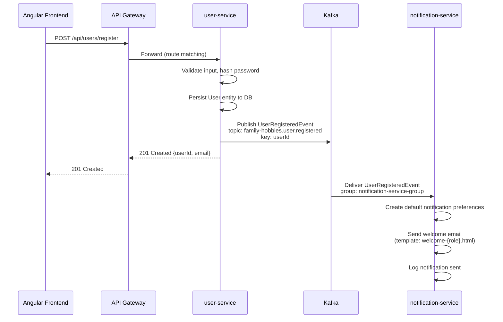
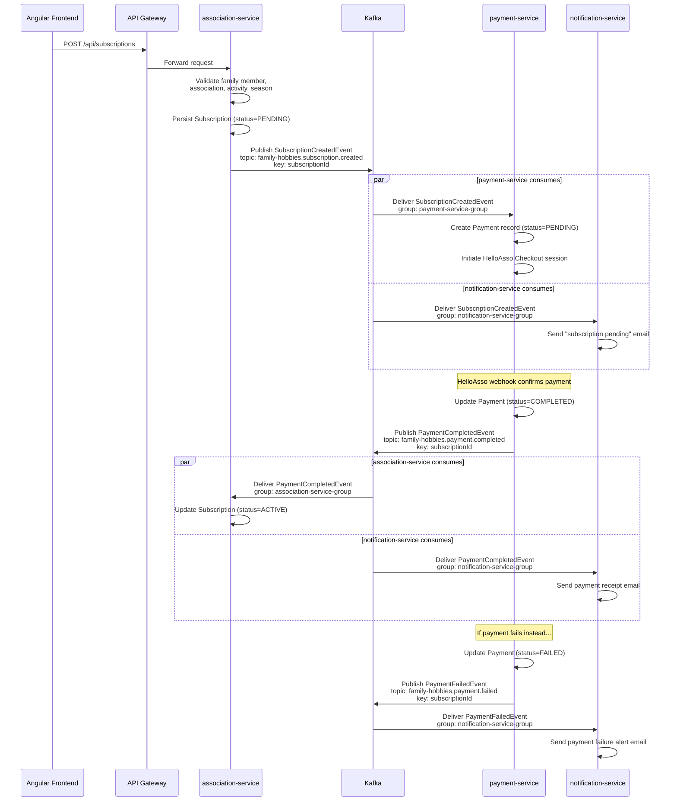
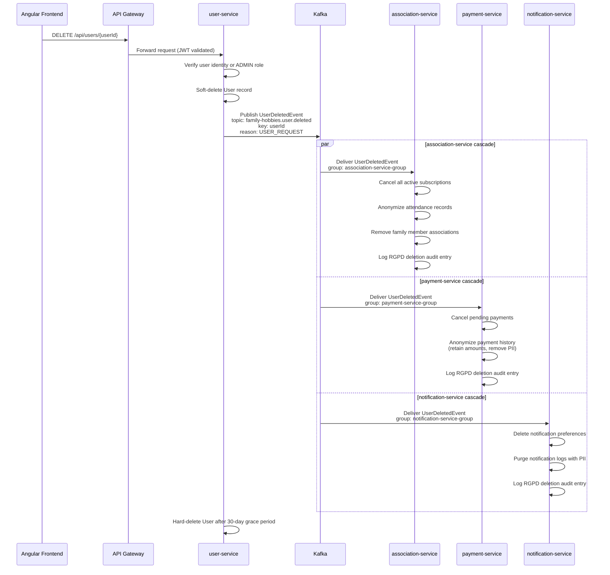
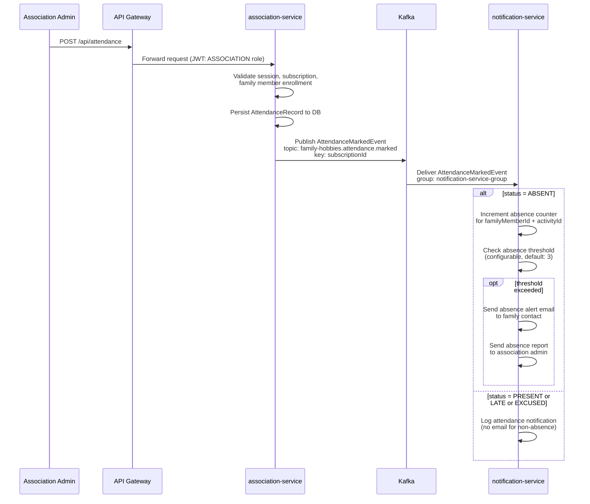

# 04 - Kafka Event Architecture

> Family Hobbies Manager -- Inter-service event-driven communication via Apache Kafka.

---

## Table of Contents

1. [Kafka Infrastructure](#1-kafka-infrastructure)
2. [Topic Registry](#2-topic-registry)
3. [Event Schemas](#3-event-schemas)
4. [Producer Configuration](#4-producer-configuration)
5. [Consumer Configuration](#5-consumer-configuration)
6. [Event Flow Diagrams](#6-event-flow-diagrams)
7. [Error Handling & Dead Letter Topics](#7-error-handling--dead-letter-topics)
8. [Kafka Docker Compose](#8-kafka-docker-compose)
9. [Consumer Group ID Table](#9-consumer-group-id-table)
10. [Topic Naming Convention](#10-topic-naming-convention)

---

## 1. Kafka Infrastructure

### Broker Topology

| Environment | Brokers | Replication Factor | Min ISR |
|---|---|---|---|
| Development (Docker) | 1 | 1 | 1 |
| Production | 3 (cluster) | 3 | 2 |

In development, a single Kafka broker runs inside Docker Compose alongside Zookeeper. The configuration is cluster-ready: switching to a multi-broker production setup requires only updating `bootstrap-servers` and replication settings -- no code changes.

### Spring Kafka Configuration

Every microservice that produces or consumes events includes the `spring-kafka` dependency and connects to the broker through `spring.kafka.bootstrap-servers`.

**Shared application.yml (per service):**

```yaml
spring:
  kafka:
    bootstrap-servers: ${KAFKA_BOOTSTRAP_SERVERS:localhost:9092}
    properties:
      # Allow schema evolution -- new fields are ignored by old consumers
      spring.json.trusted.packages: "com.familyhobbies.common.event"
```

### Serialization Strategy

| Direction | Serializer | Notes |
|---|---|---|
| Key | `org.apache.kafka.common.serialization.StringSerializer` | Always the entity ID as a string |
| Value (producer) | `org.springframework.kafka.support.serializer.JsonSerializer` | Converts event POJOs to JSON |
| Value (consumer) | `org.springframework.kafka.support.serializer.JsonDeserializer` | Trusted packages restrict deserialization to `com.familyhobbies.common.event` |

JSON serialization was chosen over Avro for simplicity in a portfolio project. The `trusted.packages` setting prevents arbitrary class deserialization (a security hardening measure).

### Consumer Group Strategy

Each consuming microservice uses **exactly one consumer group**, named `{service-name}-group`. This guarantees:

- Every service receives every event on the topics it subscribes to.
- Within a single service scaled to N instances, Kafka distributes partitions across instances (parallel processing without duplication).
- Consumer offsets are tracked per group, so each service progresses independently.

---

## 2. Topic Registry

| Topic Name | Producer | Consumer(s) | Partitions | Retention | Description |
|---|---|---|---|---|---|
| `family-hobbies.user.registered` | user-service | notification-service | 3 | 7d | New user account created |
| `family-hobbies.user.deleted` | user-service | association-service, payment-service, notification-service | 3 | 30d | User account deleted (RGPD) -- cascade cleanup |
| `family-hobbies.subscription.created` | association-service | payment-service, notification-service | 3 | 7d | New subscription pending payment |
| `family-hobbies.subscription.cancelled` | association-service | payment-service, notification-service | 3 | 7d | Subscription cancelled |
| `family-hobbies.payment.completed` | payment-service | association-service, notification-service | 3 | 7d | Payment confirmed |
| `family-hobbies.payment.failed` | payment-service | notification-service | 3 | 7d | Payment failed |
| `family-hobbies.attendance.marked` | association-service | notification-service | 3 | 3d | Attendance recorded |

**Retention rationale:**

- `user.deleted` keeps 30 days to allow late-starting consumers or replays during RGPD audit.
- `attendance.marked` keeps only 3 days because attendance data is immediately persisted by the consumer; the event is ephemeral.
- All other topics use the 7-day default, providing a comfortable replay window for incident recovery.

---

## 3. Event Schemas

All event classes live in `backend/common/src/main/java/com/familyhobbies/common/event/`. Every service depends on the `common` module, ensuring a single source of truth for event contracts.

### 3.1 UserRegisteredEvent

```java
package com.familyhobbies.common.event;

import java.time.Instant;

/**
 * Published by user-service when a new user account is successfully created.
 *
 * <p>Consumed by notification-service to send a welcome email and onboarding
 * instructions to the newly registered user.</p>
 *
 * <p>Topic: {@code family-hobbies.user.registered}</p>
 */
public class UserRegisteredEvent {

    /** Internal user ID (primary key in user-service DB). */
    private Long userId;

    /** User's email address -- used as the notification target. */
    private String email;

    /** User's first name -- used for email personalization. */
    private String firstName;

    /** User's last name -- used for email personalization. */
    private String lastName;

    /**
     * Assigned role at registration time.
     * One of: {@code "FAMILY"}, {@code "ASSOCIATION"}, {@code "ADMIN"}.
     */
    private String role;

    /** Timestamp when the account was persisted. */
    private Instant registeredAt;

    public UserRegisteredEvent() {
        // Default constructor required by Jackson deserialization
    }

    public UserRegisteredEvent(Long userId, String email, String firstName,
                               String lastName, String role, Instant registeredAt) {
        this.userId = userId;
        this.email = email;
        this.firstName = firstName;
        this.lastName = lastName;
        this.role = role;
        this.registeredAt = registeredAt;
    }

    public Long getUserId() {
        return userId;
    }

    public void setUserId(Long userId) {
        this.userId = userId;
    }

    public String getEmail() {
        return email;
    }

    public void setEmail(String email) {
        this.email = email;
    }

    public String getFirstName() {
        return firstName;
    }

    public void setFirstName(String firstName) {
        this.firstName = firstName;
    }

    public String getLastName() {
        return lastName;
    }

    public void setLastName(String lastName) {
        this.lastName = lastName;
    }

    public String getRole() {
        return role;
    }

    public void setRole(String role) {
        this.role = role;
    }

    public Instant getRegisteredAt() {
        return registeredAt;
    }

    public void setRegisteredAt(Instant registeredAt) {
        this.registeredAt = registeredAt;
    }

    @Override
    public String toString() {
        return "UserRegisteredEvent{" +
                "userId=" + userId +
                ", email='" + email + '\'' +
                ", firstName='" + firstName + '\'' +
                ", lastName='" + lastName + '\'' +
                ", role='" + role + '\'' +
                ", registeredAt=" + registeredAt +
                '}';
    }
}
```

### 3.2 UserDeletedEvent

```java
package com.familyhobbies.common.event;

import java.time.Instant;

/**
 * Published by user-service when a user account is permanently deleted.
 *
 * <p>This event triggers RGPD-compliant cascade deletion across all services:
 * association-service removes subscriptions and attendance records,
 * payment-service anonymizes payment history, and notification-service
 * purges notification preferences and logs.</p>
 *
 * <p>Topic: {@code family-hobbies.user.deleted}</p>
 * <p>Retention: 30 days (extended for RGPD audit trail).</p>
 */
public class UserDeletedEvent {

    /** Internal user ID to be purged from all services. */
    private Long userId;

    /** User's email -- included so downstream services can match on email if needed. */
    private String email;

    /** Timestamp when the deletion was executed. */
    private Instant deletedAt;

    /**
     * Reason for account deletion.
     * One of: {@code "USER_REQUEST"}, {@code "ADMIN_ACTION"}, {@code "RGPD_DELETION"}.
     */
    private String reason;

    public UserDeletedEvent() {
    }

    public UserDeletedEvent(Long userId, String email, Instant deletedAt, String reason) {
        this.userId = userId;
        this.email = email;
        this.deletedAt = deletedAt;
        this.reason = reason;
    }

    public Long getUserId() {
        return userId;
    }

    public void setUserId(Long userId) {
        this.userId = userId;
    }

    public String getEmail() {
        return email;
    }

    public void setEmail(String email) {
        this.email = email;
    }

    public Instant getDeletedAt() {
        return deletedAt;
    }

    public void setDeletedAt(Instant deletedAt) {
        this.deletedAt = deletedAt;
    }

    public String getReason() {
        return reason;
    }

    public void setReason(String reason) {
        this.reason = reason;
    }

    @Override
    public String toString() {
        return "UserDeletedEvent{" +
                "userId=" + userId +
                ", email='" + email + '\'' +
                ", deletedAt=" + deletedAt +
                ", reason='" + reason + '\'' +
                '}';
    }
}
```

### 3.3 SubscriptionCreatedEvent

```java
package com.familyhobbies.common.event;

import java.math.BigDecimal;
import java.time.Instant;

/**
 * Published by association-service when a family member subscribes to an activity.
 *
 * <p>Consumed by payment-service to initiate the payment flow (HelloAsso Checkout
 * or direct billing) and by notification-service to send a subscription confirmation
 * email to the family.</p>
 *
 * <p>Topic: {@code family-hobbies.subscription.created}</p>
 */
public class SubscriptionCreatedEvent {

    /** Internal subscription ID (primary key in association-service DB). */
    private Long subscriptionId;

    /** The family member who is subscribing to the activity. */
    private Long familyMemberId;

    /** The family that owns this subscription (for dashboard grouping). */
    private Long familyId;

    /** The target association offering the activity. */
    private Long associationId;

    /** The specific activity within the association. */
    private Long activityId;

    /**
     * Season identifier in format {@code "YYYY-YYYY"}, e.g. {@code "2025-2026"}.
     * Used by payment-service to associate the payment with the correct billing period.
     */
    private String season;

    /** Subscription fee amount. */
    private BigDecimal amount;

    /** Timestamp when the subscription was created. */
    private Instant createdAt;

    public SubscriptionCreatedEvent() {
    }

    public SubscriptionCreatedEvent(Long subscriptionId, Long familyMemberId, Long familyId,
                                    Long associationId, Long activityId, String season,
                                    BigDecimal amount, Instant createdAt) {
        this.subscriptionId = subscriptionId;
        this.familyMemberId = familyMemberId;
        this.familyId = familyId;
        this.associationId = associationId;
        this.activityId = activityId;
        this.season = season;
        this.amount = amount;
        this.createdAt = createdAt;
    }

    public Long getSubscriptionId() {
        return subscriptionId;
    }

    public void setSubscriptionId(Long subscriptionId) {
        this.subscriptionId = subscriptionId;
    }

    public Long getFamilyMemberId() {
        return familyMemberId;
    }

    public void setFamilyMemberId(Long familyMemberId) {
        this.familyMemberId = familyMemberId;
    }

    public Long getFamilyId() {
        return familyId;
    }

    public void setFamilyId(Long familyId) {
        this.familyId = familyId;
    }

    public Long getAssociationId() {
        return associationId;
    }

    public void setAssociationId(Long associationId) {
        this.associationId = associationId;
    }

    public Long getActivityId() {
        return activityId;
    }

    public void setActivityId(Long activityId) {
        this.activityId = activityId;
    }

    public String getSeason() {
        return season;
    }

    public void setSeason(String season) {
        this.season = season;
    }

    public BigDecimal getAmount() {
        return amount;
    }

    public void setAmount(BigDecimal amount) {
        this.amount = amount;
    }

    public Instant getCreatedAt() {
        return createdAt;
    }

    public void setCreatedAt(Instant createdAt) {
        this.createdAt = createdAt;
    }

    @Override
    public String toString() {
        return "SubscriptionCreatedEvent{" +
                "subscriptionId=" + subscriptionId +
                ", familyMemberId=" + familyMemberId +
                ", familyId=" + familyId +
                ", associationId=" + associationId +
                ", activityId=" + activityId +
                ", season='" + season + '\'' +
                ", amount=" + amount +
                ", createdAt=" + createdAt +
                '}';
    }
}
```

### 3.4 SubscriptionCancelledEvent

```java
package com.familyhobbies.common.event;

import java.time.Instant;

/**
 * Published by association-service when a subscription is cancelled.
 *
 * <p>Consumed by payment-service to halt any pending or recurring payments
 * and by notification-service to inform the family of the cancellation.</p>
 *
 * <p>Topic: {@code family-hobbies.subscription.cancelled}</p>
 */
public class SubscriptionCancelledEvent {

    /** Internal subscription ID being cancelled. */
    private Long subscriptionId;

    /** The family member whose subscription is cancelled. */
    private Long familyMemberId;

    /** The family owning this subscription. */
    private Long familyId;

    /**
     * Reason for cancellation.
     * One of: {@code "USER_REQUEST"}, {@code "NON_PAYMENT"}, {@code "ADMIN_ACTION"}.
     */
    private String reason;

    /** Timestamp when the cancellation was recorded. */
    private Instant cancelledAt;

    public SubscriptionCancelledEvent() {
    }

    public SubscriptionCancelledEvent(Long subscriptionId, Long familyMemberId,
                                      Long familyId, String reason, Instant cancelledAt) {
        this.subscriptionId = subscriptionId;
        this.familyMemberId = familyMemberId;
        this.familyId = familyId;
        this.reason = reason;
        this.cancelledAt = cancelledAt;
    }

    public Long getSubscriptionId() {
        return subscriptionId;
    }

    public void setSubscriptionId(Long subscriptionId) {
        this.subscriptionId = subscriptionId;
    }

    public Long getFamilyMemberId() {
        return familyMemberId;
    }

    public void setFamilyMemberId(Long familyMemberId) {
        this.familyMemberId = familyMemberId;
    }

    public Long getFamilyId() {
        return familyId;
    }

    public void setFamilyId(Long familyId) {
        this.familyId = familyId;
    }

    public String getReason() {
        return reason;
    }

    public void setReason(String reason) {
        this.reason = reason;
    }

    public Instant getCancelledAt() {
        return cancelledAt;
    }

    public void setCancelledAt(Instant cancelledAt) {
        this.cancelledAt = cancelledAt;
    }

    @Override
    public String toString() {
        return "SubscriptionCancelledEvent{" +
                "subscriptionId=" + subscriptionId +
                ", familyMemberId=" + familyMemberId +
                ", familyId=" + familyId +
                ", reason='" + reason + '\'' +
                ", cancelledAt=" + cancelledAt +
                '}';
    }
}
```

### 3.5 PaymentCompletedEvent

```java
package com.familyhobbies.common.event;

import java.math.BigDecimal;
import java.time.Instant;

/**
 * Published by payment-service when a payment is successfully processed.
 *
 * <p>Consumed by association-service to activate the subscription (mark it as
 * {@code ACTIVE}) and by notification-service to send a payment receipt to
 * the family.</p>
 *
 * <p>Topic: {@code family-hobbies.payment.completed}</p>
 */
public class PaymentCompletedEvent {

    /** Internal payment ID (primary key in payment-service DB). */
    private Long paymentId;

    /** The subscription this payment covers. */
    private Long subscriptionId;

    /** The family that made the payment. */
    private Long familyId;

    /** Amount paid. */
    private BigDecimal amount;

    /** ISO 4217 currency code, e.g. {@code "EUR"}. */
    private String currency;

    /**
     * Payment method used.
     * One of: {@code "CARD"}, {@code "SEPA"}, {@code "HELLOASSO_CHECKOUT"}.
     */
    private String paymentMethod;

    /** Timestamp when the payment was confirmed. */
    private Instant paidAt;

    public PaymentCompletedEvent() {
    }

    public PaymentCompletedEvent(Long paymentId, Long subscriptionId, Long familyId,
                                 BigDecimal amount, String currency, String paymentMethod,
                                 Instant paidAt) {
        this.paymentId = paymentId;
        this.subscriptionId = subscriptionId;
        this.familyId = familyId;
        this.amount = amount;
        this.currency = currency;
        this.paymentMethod = paymentMethod;
        this.paidAt = paidAt;
    }

    public Long getPaymentId() {
        return paymentId;
    }

    public void setPaymentId(Long paymentId) {
        this.paymentId = paymentId;
    }

    public Long getSubscriptionId() {
        return subscriptionId;
    }

    public void setSubscriptionId(Long subscriptionId) {
        this.subscriptionId = subscriptionId;
    }

    public Long getFamilyId() {
        return familyId;
    }

    public void setFamilyId(Long familyId) {
        this.familyId = familyId;
    }

    public BigDecimal getAmount() {
        return amount;
    }

    public void setAmount(BigDecimal amount) {
        this.amount = amount;
    }

    public String getCurrency() {
        return currency;
    }

    public void setCurrency(String currency) {
        this.currency = currency;
    }

    public String getPaymentMethod() {
        return paymentMethod;
    }

    public void setPaymentMethod(String paymentMethod) {
        this.paymentMethod = paymentMethod;
    }

    public Instant getPaidAt() {
        return paidAt;
    }

    public void setPaidAt(Instant paidAt) {
        this.paidAt = paidAt;
    }

    @Override
    public String toString() {
        return "PaymentCompletedEvent{" +
                "paymentId=" + paymentId +
                ", subscriptionId=" + subscriptionId +
                ", familyId=" + familyId +
                ", amount=" + amount +
                ", currency='" + currency + '\'' +
                ", paymentMethod='" + paymentMethod + '\'' +
                ", paidAt=" + paidAt +
                '}';
    }
}
```

### 3.6 PaymentFailedEvent

```java
package com.familyhobbies.common.event;

import java.math.BigDecimal;
import java.time.Instant;

/**
 * Published by payment-service when a payment attempt fails.
 *
 * <p>Consumed by notification-service to alert the family about the failure
 * and prompt them to retry or use an alternative payment method.</p>
 *
 * <p>Topic: {@code family-hobbies.payment.failed}</p>
 */
public class PaymentFailedEvent {

    /** Internal payment ID of the failed attempt. */
    private Long paymentId;

    /** The subscription that remains unpaid. */
    private Long subscriptionId;

    /** The family whose payment failed. */
    private Long familyId;

    /** Amount that was attempted. */
    private BigDecimal amount;

    /**
     * Human-readable failure reason from the payment provider.
     * Examples: {@code "INSUFFICIENT_FUNDS"}, {@code "CARD_EXPIRED"},
     * {@code "PROVIDER_TIMEOUT"}, {@code "SEPA_REJECTED"}.
     */
    private String failureReason;

    /** Timestamp when the failure was recorded. */
    private Instant failedAt;

    public PaymentFailedEvent() {
    }

    public PaymentFailedEvent(Long paymentId, Long subscriptionId, Long familyId,
                              BigDecimal amount, String failureReason, Instant failedAt) {
        this.paymentId = paymentId;
        this.subscriptionId = subscriptionId;
        this.familyId = familyId;
        this.amount = amount;
        this.failureReason = failureReason;
        this.failedAt = failedAt;
    }

    public Long getPaymentId() {
        return paymentId;
    }

    public void setPaymentId(Long paymentId) {
        this.paymentId = paymentId;
    }

    public Long getSubscriptionId() {
        return subscriptionId;
    }

    public void setSubscriptionId(Long subscriptionId) {
        this.subscriptionId = subscriptionId;
    }

    public Long getFamilyId() {
        return familyId;
    }

    public void setFamilyId(Long familyId) {
        this.familyId = familyId;
    }

    public BigDecimal getAmount() {
        return amount;
    }

    public void setAmount(BigDecimal amount) {
        this.amount = amount;
    }

    public String getFailureReason() {
        return failureReason;
    }

    public void setFailureReason(String failureReason) {
        this.failureReason = failureReason;
    }

    public Instant getFailedAt() {
        return failedAt;
    }

    public void setFailedAt(Instant failedAt) {
        this.failedAt = failedAt;
    }

    @Override
    public String toString() {
        return "PaymentFailedEvent{" +
                "paymentId=" + paymentId +
                ", subscriptionId=" + subscriptionId +
                ", familyId=" + familyId +
                ", amount=" + amount +
                ", failureReason='" + failureReason + '\'' +
                ", failedAt=" + failedAt +
                '}';
    }
}
```

### 3.7 AttendanceMarkedEvent

```java
package com.familyhobbies.common.event;

import java.time.Instant;
import java.time.LocalDate;

/**
 * Published by association-service when attendance is recorded for a session.
 *
 * <p>Consumed by notification-service to trigger absence alerts. When a family
 * member accumulates absences beyond a configurable threshold, the service
 * sends a notification to the family and optionally to the association admin.</p>
 *
 * <p>Topic: {@code family-hobbies.attendance.marked}</p>
 * <p>Retention: 3 days (short-lived, data is persisted immediately by consumer).</p>
 */
public class AttendanceMarkedEvent {

    /** Internal attendance record ID. */
    private Long attendanceId;

    /** The subscription under which this attendance is recorded. */
    private Long subscriptionId;

    /** The session (class/course occurrence) that was attended or missed. */
    private Long sessionId;

    /** The family member whose attendance is being recorded. */
    private Long familyMemberId;

    /** The calendar date of the session. */
    private LocalDate sessionDate;

    /**
     * Attendance status.
     * One of: {@code "PRESENT"}, {@code "ABSENT"}, {@code "EXCUSED"}, {@code "LATE"}.
     */
    private String status;

    /** Timestamp when the attendance was marked by the instructor or admin. */
    private Instant markedAt;

    public AttendanceMarkedEvent() {
    }

    public AttendanceMarkedEvent(Long attendanceId, Long subscriptionId, Long sessionId,
                                 Long familyMemberId, LocalDate sessionDate, String status,
                                 Instant markedAt) {
        this.attendanceId = attendanceId;
        this.subscriptionId = subscriptionId;
        this.sessionId = sessionId;
        this.familyMemberId = familyMemberId;
        this.sessionDate = sessionDate;
        this.status = status;
        this.markedAt = markedAt;
    }

    public Long getAttendanceId() {
        return attendanceId;
    }

    public void setAttendanceId(Long attendanceId) {
        this.attendanceId = attendanceId;
    }

    public Long getSubscriptionId() {
        return subscriptionId;
    }

    public void setSubscriptionId(Long subscriptionId) {
        this.subscriptionId = subscriptionId;
    }

    public Long getSessionId() {
        return sessionId;
    }

    public void setSessionId(Long sessionId) {
        this.sessionId = sessionId;
    }

    public Long getFamilyMemberId() {
        return familyMemberId;
    }

    public void setFamilyMemberId(Long familyMemberId) {
        this.familyMemberId = familyMemberId;
    }

    public LocalDate getSessionDate() {
        return sessionDate;
    }

    public void setSessionDate(LocalDate sessionDate) {
        this.sessionDate = sessionDate;
    }

    public String getStatus() {
        return status;
    }

    public void setStatus(String status) {
        this.status = status;
    }

    public Instant getMarkedAt() {
        return markedAt;
    }

    public void setMarkedAt(Instant markedAt) {
        this.markedAt = markedAt;
    }

    @Override
    public String toString() {
        return "AttendanceMarkedEvent{" +
                "attendanceId=" + attendanceId +
                ", subscriptionId=" + subscriptionId +
                ", sessionId=" + sessionId +
                ", familyMemberId=" + familyMemberId +
                ", sessionDate=" + sessionDate +
                ", status='" + status + '\'' +
                ", markedAt=" + markedAt +
                '}';
    }
}
```

---

## 4. Producer Configuration

### 4.1 Spring Kafka Producer -- application.yml

```yaml
# Example: user-service/src/main/resources/application.yml
spring:
  kafka:
    bootstrap-servers: ${KAFKA_BOOTSTRAP_SERVERS:localhost:9092}
    producer:
      # Unique client ID for broker-side logging and monitoring
      client-id: ${spring.application.name}-producer
      # String key serializer -- all message keys are entity IDs as strings
      key-serializer: org.apache.kafka.common.serialization.StringSerializer
      # JSON value serializer -- event POJOs are serialized to JSON
      value-serializer: org.springframework.kafka.support.serializer.JsonSerializer
      # Wait for leader + all in-sync replicas to acknowledge (strongest guarantee)
      acks: all
      # Retry transient broker errors up to 3 times
      retries: 3
      properties:
        # Add type information in the message header so consumers can deserialize
        spring.json.add.type.headers: true
        # Enable idempotent producer to prevent duplicate messages on retry
        enable.idempotence: true
```

### 4.2 Sample Publisher -- UserEventPublisher

```java
package com.familyhobbies.userservice.publisher;

import com.familyhobbies.common.event.UserDeletedEvent;
import com.familyhobbies.common.event.UserRegisteredEvent;
import org.slf4j.Logger;
import org.slf4j.LoggerFactory;
import org.springframework.kafka.core.KafkaTemplate;
import org.springframework.kafka.support.SendResult;
import org.springframework.stereotype.Component;

import java.util.concurrent.CompletableFuture;

/**
 * Publishes user domain events to Kafka.
 *
 * <p>Uses the user ID as the message key to ensure all events for the same user
 * land on the same partition, preserving ordering per user.</p>
 */
@Component
public class UserEventPublisher {

    private static final Logger log = LoggerFactory.getLogger(UserEventPublisher.class);

    private static final String TOPIC_USER_REGISTERED = "family-hobbies.user.registered";
    private static final String TOPIC_USER_DELETED = "family-hobbies.user.deleted";

    private final KafkaTemplate<String, Object> kafkaTemplate;

    public UserEventPublisher(KafkaTemplate<String, Object> kafkaTemplate) {
        this.kafkaTemplate = kafkaTemplate;
    }

    /**
     * Publishes a {@link UserRegisteredEvent} after a new account is persisted.
     *
     * @param event the registration event containing user details
     */
    public void publishUserRegistered(UserRegisteredEvent event) {
        String key = String.valueOf(event.getUserId());
        CompletableFuture<SendResult<String, Object>> future =
                kafkaTemplate.send(TOPIC_USER_REGISTERED, key, event);

        future.whenComplete((result, ex) -> {
            if (ex != null) {
                log.error("Failed to publish UserRegisteredEvent for userId={}: {}",
                        event.getUserId(), ex.getMessage(), ex);
            } else {
                log.info("Published UserRegisteredEvent for userId={} to partition={} offset={}",
                        event.getUserId(),
                        result.getRecordMetadata().partition(),
                        result.getRecordMetadata().offset());
            }
        });
    }

    /**
     * Publishes a {@link UserDeletedEvent} after a user account is deleted.
     *
     * @param event the deletion event triggering RGPD cascade cleanup
     */
    public void publishUserDeleted(UserDeletedEvent event) {
        String key = String.valueOf(event.getUserId());
        CompletableFuture<SendResult<String, Object>> future =
                kafkaTemplate.send(TOPIC_USER_DELETED, key, event);

        future.whenComplete((result, ex) -> {
            if (ex != null) {
                log.error("Failed to publish UserDeletedEvent for userId={}: {}",
                        event.getUserId(), ex.getMessage(), ex);
            } else {
                log.info("Published UserDeletedEvent for userId={} to partition={} offset={}",
                        event.getUserId(),
                        result.getRecordMetadata().partition(),
                        result.getRecordMetadata().offset());
            }
        });
    }
}
```

### 4.3 Sample Publisher -- SubscriptionEventPublisher

```java
package com.familyhobbies.associationservice.publisher;

import com.familyhobbies.common.event.AttendanceMarkedEvent;
import com.familyhobbies.common.event.SubscriptionCancelledEvent;
import com.familyhobbies.common.event.SubscriptionCreatedEvent;
import org.slf4j.Logger;
import org.slf4j.LoggerFactory;
import org.springframework.kafka.core.KafkaTemplate;
import org.springframework.kafka.support.SendResult;
import org.springframework.stereotype.Component;

import java.util.concurrent.CompletableFuture;

/**
 * Publishes subscription and attendance domain events to Kafka.
 *
 * <p>Message keys use the subscription ID to guarantee ordering for events
 * related to the same subscription (created -> cancelled, or attendance
 * within the same subscription).</p>
 */
@Component
public class SubscriptionEventPublisher {

    private static final Logger log = LoggerFactory.getLogger(SubscriptionEventPublisher.class);

    private static final String TOPIC_SUBSCRIPTION_CREATED = "family-hobbies.subscription.created";
    private static final String TOPIC_SUBSCRIPTION_CANCELLED = "family-hobbies.subscription.cancelled";
    private static final String TOPIC_ATTENDANCE_MARKED = "family-hobbies.attendance.marked";

    private final KafkaTemplate<String, Object> kafkaTemplate;

    public SubscriptionEventPublisher(KafkaTemplate<String, Object> kafkaTemplate) {
        this.kafkaTemplate = kafkaTemplate;
    }

    public void publishSubscriptionCreated(SubscriptionCreatedEvent event) {
        String key = String.valueOf(event.getSubscriptionId());
        CompletableFuture<SendResult<String, Object>> future =
                kafkaTemplate.send(TOPIC_SUBSCRIPTION_CREATED, key, event);

        future.whenComplete((result, ex) -> {
            if (ex != null) {
                log.error("Failed to publish SubscriptionCreatedEvent for subscriptionId={}: {}",
                        event.getSubscriptionId(), ex.getMessage(), ex);
            } else {
                log.info("Published SubscriptionCreatedEvent for subscriptionId={} to partition={} offset={}",
                        event.getSubscriptionId(),
                        result.getRecordMetadata().partition(),
                        result.getRecordMetadata().offset());
            }
        });
    }

    public void publishSubscriptionCancelled(SubscriptionCancelledEvent event) {
        String key = String.valueOf(event.getSubscriptionId());
        CompletableFuture<SendResult<String, Object>> future =
                kafkaTemplate.send(TOPIC_SUBSCRIPTION_CANCELLED, key, event);

        future.whenComplete((result, ex) -> {
            if (ex != null) {
                log.error("Failed to publish SubscriptionCancelledEvent for subscriptionId={}: {}",
                        event.getSubscriptionId(), ex.getMessage(), ex);
            } else {
                log.info("Published SubscriptionCancelledEvent for subscriptionId={}",
                        event.getSubscriptionId());
            }
        });
    }

    public void publishAttendanceMarked(AttendanceMarkedEvent event) {
        String key = String.valueOf(event.getSubscriptionId());
        CompletableFuture<SendResult<String, Object>> future =
                kafkaTemplate.send(TOPIC_ATTENDANCE_MARKED, key, event);

        future.whenComplete((result, ex) -> {
            if (ex != null) {
                log.error("Failed to publish AttendanceMarkedEvent for attendanceId={}: {}",
                        event.getAttendanceId(), ex.getMessage(), ex);
            } else {
                log.info("Published AttendanceMarkedEvent for attendanceId={} status={}",
                        event.getAttendanceId(), event.getStatus());
            }
        });
    }
}
```

### 4.4 Sample Publisher -- PaymentEventPublisher

```java
package com.familyhobbies.paymentservice.publisher;

import com.familyhobbies.common.event.PaymentCompletedEvent;
import com.familyhobbies.common.event.PaymentFailedEvent;
import org.slf4j.Logger;
import org.slf4j.LoggerFactory;
import org.springframework.kafka.core.KafkaTemplate;
import org.springframework.kafka.support.SendResult;
import org.springframework.stereotype.Component;

import java.util.concurrent.CompletableFuture;

/**
 * Publishes payment domain events to Kafka.
 *
 * <p>Message keys use the subscription ID (not payment ID) to ensure payment
 * events for the same subscription are ordered and land on the same partition
 * as the original SubscriptionCreatedEvent.</p>
 */
@Component
public class PaymentEventPublisher {

    private static final Logger log = LoggerFactory.getLogger(PaymentEventPublisher.class);

    private static final String TOPIC_PAYMENT_COMPLETED = "family-hobbies.payment.completed";
    private static final String TOPIC_PAYMENT_FAILED = "family-hobbies.payment.failed";

    private final KafkaTemplate<String, Object> kafkaTemplate;

    public PaymentEventPublisher(KafkaTemplate<String, Object> kafkaTemplate) {
        this.kafkaTemplate = kafkaTemplate;
    }

    public void publishPaymentCompleted(PaymentCompletedEvent event) {
        String key = String.valueOf(event.getSubscriptionId());
        CompletableFuture<SendResult<String, Object>> future =
                kafkaTemplate.send(TOPIC_PAYMENT_COMPLETED, key, event);

        future.whenComplete((result, ex) -> {
            if (ex != null) {
                log.error("Failed to publish PaymentCompletedEvent for paymentId={}: {}",
                        event.getPaymentId(), ex.getMessage(), ex);
            } else {
                log.info("Published PaymentCompletedEvent for paymentId={} subscriptionId={} amount={}",
                        event.getPaymentId(), event.getSubscriptionId(), event.getAmount());
            }
        });
    }

    public void publishPaymentFailed(PaymentFailedEvent event) {
        String key = String.valueOf(event.getSubscriptionId());
        CompletableFuture<SendResult<String, Object>> future =
                kafkaTemplate.send(TOPIC_PAYMENT_FAILED, key, event);

        future.whenComplete((result, ex) -> {
            if (ex != null) {
                log.error("Failed to publish PaymentFailedEvent for paymentId={}: {}",
                        event.getPaymentId(), ex.getMessage(), ex);
            } else {
                log.info("Published PaymentFailedEvent for paymentId={} reason={}",
                        event.getPaymentId(), event.getFailureReason());
            }
        });
    }
}
```

---

## 5. Consumer Configuration

### 5.1 Spring Kafka Consumer -- application.yml

```yaml
# Example: notification-service/src/main/resources/application.yml
spring:
  kafka:
    bootstrap-servers: ${KAFKA_BOOTSTRAP_SERVERS:localhost:9092}
    consumer:
      # Consumer group unique to this service
      group-id: notification-service-group
      # Unique client ID for broker-side logging
      client-id: ${spring.application.name}-consumer
      # String key deserializer
      key-deserializer: org.apache.kafka.common.serialization.StringDeserializer
      # JSON value deserializer
      value-deserializer: org.springframework.kafka.support.serializer.JsonDeserializer
      # Start from the earliest unread offset when the group first connects
      auto-offset-reset: earliest
      # Disable auto-commit; Spring Kafka manages offset commits after processing
      enable-auto-commit: false
      properties:
        # Only trust event classes from the common module
        spring.json.trusted.packages: "com.familyhobbies.common.event"
        # Use type headers to determine which class to deserialize into
        spring.json.use.type.headers: true
    listener:
      # Acknowledge after each record is processed (not after a batch)
      ack-mode: RECORD
      # Number of concurrent consumer threads per listener
      concurrency: 3
```

### 5.2 Kafka Consumer Factory Configuration

```java
package com.familyhobbies.notificationservice.config;

import com.familyhobbies.common.event.*;
import org.apache.kafka.clients.consumer.ConsumerConfig;
import org.apache.kafka.common.serialization.StringDeserializer;
import org.springframework.beans.factory.annotation.Value;
import org.springframework.context.annotation.Bean;
import org.springframework.context.annotation.Configuration;
import org.springframework.kafka.annotation.EnableKafka;
import org.springframework.kafka.config.ConcurrentKafkaListenerContainerFactory;
import org.springframework.kafka.core.ConsumerFactory;
import org.springframework.kafka.core.DefaultKafkaConsumerFactory;
import org.springframework.kafka.listener.DefaultErrorHandler;
import org.springframework.kafka.support.serializer.JsonDeserializer;
import org.springframework.util.backoff.ExponentialBackOff;

import java.util.HashMap;
import java.util.Map;

/**
 * Kafka consumer configuration for notification-service.
 *
 * <p>Configures JSON deserialization with trusted packages, error handling
 * with exponential backoff, and dead letter topic routing for poison messages.</p>
 */
@Configuration
@EnableKafka
public class KafkaConsumerConfig {

    @Value("${spring.kafka.bootstrap-servers}")
    private String bootstrapServers;

    @Value("${spring.kafka.consumer.group-id}")
    private String groupId;

    @Bean
    public ConsumerFactory<String, Object> consumerFactory() {
        Map<String, Object> props = new HashMap<>();
        props.put(ConsumerConfig.BOOTSTRAP_SERVERS_CONFIG, bootstrapServers);
        props.put(ConsumerConfig.GROUP_ID_CONFIG, groupId);
        props.put(ConsumerConfig.KEY_DESERIALIZER_CLASS_CONFIG, StringDeserializer.class);
        props.put(ConsumerConfig.VALUE_DESERIALIZER_CLASS_CONFIG, JsonDeserializer.class);
        props.put(ConsumerConfig.AUTO_OFFSET_RESET_CONFIG, "earliest");
        props.put(ConsumerConfig.ENABLE_AUTO_COMMIT_CONFIG, false);
        props.put(JsonDeserializer.TRUSTED_PACKAGES, "com.familyhobbies.common.event");
        props.put(JsonDeserializer.USE_TYPE_INFO_HEADERS, true);
        return new DefaultKafkaConsumerFactory<>(props);
    }

    @Bean
    public ConcurrentKafkaListenerContainerFactory<String, Object> kafkaListenerContainerFactory(
            ConsumerFactory<String, Object> consumerFactory,
            DefaultErrorHandler errorHandler) {
        ConcurrentKafkaListenerContainerFactory<String, Object> factory =
                new ConcurrentKafkaListenerContainerFactory<>();
        factory.setConsumerFactory(consumerFactory);
        factory.setConcurrency(3);
        factory.setCommonErrorHandler(errorHandler);
        return factory;
    }
}
```

### 5.3 Sample Listener -- UserEventListener (notification-service)

```java
package com.familyhobbies.notificationservice.listener;

import com.familyhobbies.common.event.UserDeletedEvent;
import com.familyhobbies.common.event.UserRegisteredEvent;
import com.familyhobbies.notificationservice.service.EmailService;
import com.familyhobbies.notificationservice.service.NotificationPreferenceService;
import org.slf4j.Logger;
import org.slf4j.LoggerFactory;
import org.springframework.kafka.annotation.KafkaListener;
import org.springframework.stereotype.Component;

/**
 * Listens for user domain events and triggers corresponding notifications.
 */
@Component
public class UserEventListener {

    private static final Logger log = LoggerFactory.getLogger(UserEventListener.class);

    private final EmailService emailService;
    private final NotificationPreferenceService preferenceService;

    public UserEventListener(EmailService emailService,
                             NotificationPreferenceService preferenceService) {
        this.emailService = emailService;
        this.preferenceService = preferenceService;
    }

    /**
     * Handles new user registration -- sends a welcome email with onboarding steps.
     *
     * @param event the user registration event
     */
    @KafkaListener(
            topics = "family-hobbies.user.registered",
            groupId = "notification-service-group",
            containerFactory = "kafkaListenerContainerFactory"
    )
    public void handleUserRegistered(UserRegisteredEvent event) {
        log.info("Received UserRegisteredEvent for userId={} email={}",
                event.getUserId(), event.getEmail());

        emailService.sendWelcomeEmail(
                event.getEmail(),
                event.getFirstName(),
                event.getLastName(),
                event.getRole()
        );

        preferenceService.createDefaultPreferences(event.getUserId(), event.getEmail());

        log.info("Welcome email sent and default preferences created for userId={}",
                event.getUserId());
    }

    /**
     * Handles user deletion -- purges notification preferences and logs (RGPD compliance).
     *
     * @param event the user deletion event
     */
    @KafkaListener(
            topics = "family-hobbies.user.deleted",
            groupId = "notification-service-group",
            containerFactory = "kafkaListenerContainerFactory"
    )
    public void handleUserDeleted(UserDeletedEvent event) {
        log.info("Received UserDeletedEvent for userId={} reason={}",
                event.getUserId(), event.getReason());

        preferenceService.deleteAllForUser(event.getUserId());

        log.info("RGPD cleanup completed in notification-service for userId={}",
                event.getUserId());
    }
}
```

### 5.4 Sample Listener -- SubscriptionEventListener (payment-service)

```java
package com.familyhobbies.paymentservice.listener;

import com.familyhobbies.common.event.SubscriptionCancelledEvent;
import com.familyhobbies.common.event.SubscriptionCreatedEvent;
import com.familyhobbies.paymentservice.service.PaymentService;
import org.slf4j.Logger;
import org.slf4j.LoggerFactory;
import org.springframework.kafka.annotation.KafkaListener;
import org.springframework.stereotype.Component;

/**
 * Listens for subscription events to initiate or cancel payment flows.
 */
@Component
public class SubscriptionEventListener {

    private static final Logger log = LoggerFactory.getLogger(SubscriptionEventListener.class);

    private final PaymentService paymentService;

    public SubscriptionEventListener(PaymentService paymentService) {
        this.paymentService = paymentService;
    }

    /**
     * Handles new subscription -- initiates payment flow via HelloAsso Checkout.
     *
     * @param event the subscription creation event
     */
    @KafkaListener(
            topics = "family-hobbies.subscription.created",
            groupId = "payment-service-group",
            containerFactory = "kafkaListenerContainerFactory"
    )
    public void handleSubscriptionCreated(SubscriptionCreatedEvent event) {
        log.info("Received SubscriptionCreatedEvent for subscriptionId={} amount={}",
                event.getSubscriptionId(), event.getAmount());

        paymentService.initiatePayment(
                event.getSubscriptionId(),
                event.getFamilyId(),
                event.getAmount(),
                event.getSeason()
        );
    }

    /**
     * Handles subscription cancellation -- cancels any pending payments.
     *
     * @param event the subscription cancellation event
     */
    @KafkaListener(
            topics = "family-hobbies.subscription.cancelled",
            groupId = "payment-service-group",
            containerFactory = "kafkaListenerContainerFactory"
    )
    public void handleSubscriptionCancelled(SubscriptionCancelledEvent event) {
        log.info("Received SubscriptionCancelledEvent for subscriptionId={} reason={}",
                event.getSubscriptionId(), event.getReason());

        paymentService.cancelPendingPayments(event.getSubscriptionId());
    }
}
```

### 5.5 Sample Listener -- PaymentEventListener (association-service)

```java
package com.familyhobbies.associationservice.listener;

import com.familyhobbies.common.event.PaymentCompletedEvent;
import com.familyhobbies.associationservice.service.SubscriptionService;
import org.slf4j.Logger;
import org.slf4j.LoggerFactory;
import org.springframework.kafka.annotation.KafkaListener;
import org.springframework.stereotype.Component;

/**
 * Listens for payment events to update subscription status.
 */
@Component
public class PaymentEventListener {

    private static final Logger log = LoggerFactory.getLogger(PaymentEventListener.class);

    private final SubscriptionService subscriptionService;

    public PaymentEventListener(SubscriptionService subscriptionService) {
        this.subscriptionService = subscriptionService;
    }

    /**
     * Handles payment completion -- activates the subscription.
     *
     * @param event the payment completion event
     */
    @KafkaListener(
            topics = "family-hobbies.payment.completed",
            groupId = "association-service-group",
            containerFactory = "kafkaListenerContainerFactory"
    )
    public void handlePaymentCompleted(PaymentCompletedEvent event) {
        log.info("Received PaymentCompletedEvent for subscriptionId={} paymentId={}",
                event.getSubscriptionId(), event.getPaymentId());

        subscriptionService.activateSubscription(
                event.getSubscriptionId(),
                event.getPaymentId(),
                event.getPaidAt()
        );

        log.info("Subscription {} activated after payment {}",
                event.getSubscriptionId(), event.getPaymentId());
    }
}
```

---

## 6. Event Flow Diagrams

### 6.1 User Registration Flow



### 6.2 Subscription + Payment Flow



### 6.3 RGPD Deletion Flow



### 6.4 Attendance Flow



---

## 7. Error Handling & Dead Letter Topics

### 7.1 Strategy Overview

When a consumer fails to process a message, the system follows this sequence:

1. **Retry** the message up to 3 times with exponential backoff (1s, 2s, 4s).
2. If all retries are exhausted, **route the message to a Dead Letter Topic (DLT)**.
3. A dedicated **DLT consumer** logs the failed message for monitoring and supports manual replay.

### 7.2 DLT Naming Convention

```
{original-topic}.DLT
```

| Original Topic | Dead Letter Topic |
|---|---|
| `family-hobbies.user.registered` | `family-hobbies.user.registered.DLT` |
| `family-hobbies.user.deleted` | `family-hobbies.user.deleted.DLT` |
| `family-hobbies.subscription.created` | `family-hobbies.subscription.created.DLT` |
| `family-hobbies.subscription.cancelled` | `family-hobbies.subscription.cancelled.DLT` |
| `family-hobbies.payment.completed` | `family-hobbies.payment.completed.DLT` |
| `family-hobbies.payment.failed` | `family-hobbies.payment.failed.DLT` |
| `family-hobbies.attendance.marked` | `family-hobbies.attendance.marked.DLT` |

### 7.3 Error Handler Configuration

```java
package com.familyhobbies.notificationservice.config;

import org.apache.kafka.clients.producer.ProducerConfig;
import org.apache.kafka.common.serialization.StringSerializer;
import org.springframework.beans.factory.annotation.Value;
import org.springframework.context.annotation.Bean;
import org.springframework.context.annotation.Configuration;
import org.springframework.kafka.core.DefaultKafkaProducerFactory;
import org.springframework.kafka.core.KafkaOperations;
import org.springframework.kafka.core.KafkaTemplate;
import org.springframework.kafka.core.ProducerFactory;
import org.springframework.kafka.listener.DeadLetterPublishingRecoverer;
import org.springframework.kafka.listener.DefaultErrorHandler;
import org.springframework.kafka.support.serializer.JsonSerializer;
import org.springframework.util.backoff.ExponentialBackOff;

import java.util.HashMap;
import java.util.Map;

/**
 * Configures Kafka error handling with retry + dead letter topic routing.
 *
 * <p>Retry policy: 3 attempts with exponential backoff (1s initial, 2x multiplier, 4s max).
 * After exhausting retries, the failed message is published to the corresponding DLT
 * with original headers preserved for debugging.</p>
 */
@Configuration
public class KafkaErrorHandlerConfig {

    @Value("${spring.kafka.bootstrap-servers}")
    private String bootstrapServers;

    /**
     * Producer factory used exclusively by the dead letter publisher.
     * Separate from the main producer to avoid cross-contamination of configs.
     */
    @Bean
    public ProducerFactory<String, Object> dltProducerFactory() {
        Map<String, Object> props = new HashMap<>();
        props.put(ProducerConfig.BOOTSTRAP_SERVERS_CONFIG, bootstrapServers);
        props.put(ProducerConfig.KEY_SERIALIZER_CLASS_CONFIG, StringSerializer.class);
        props.put(ProducerConfig.VALUE_SERIALIZER_CLASS_CONFIG, JsonSerializer.class);
        return new DefaultKafkaProducerFactory<>(props);
    }

    /**
     * KafkaTemplate for publishing failed messages to DLTs.
     */
    @Bean
    public KafkaTemplate<String, Object> dltKafkaTemplate(
            ProducerFactory<String, Object> dltProducerFactory) {
        return new KafkaTemplate<>(dltProducerFactory);
    }

    /**
     * Recoverer that publishes failed messages to {original-topic}.DLT.
     *
     * <p>Preserves original message headers (key, partition, offset, timestamp)
     * and adds exception information headers for debugging.</p>
     */
    @Bean
    public DeadLetterPublishingRecoverer deadLetterPublishingRecoverer(
            KafkaTemplate<String, Object> dltKafkaTemplate) {
        return new DeadLetterPublishingRecoverer(
                (KafkaOperations<?, ?>) dltKafkaTemplate,
                (record, ex) -> new org.apache.kafka.common.TopicPartition(
                        record.topic() + ".DLT", record.partition()
                )
        );
    }

    /**
     * Error handler with exponential backoff retry and dead letter recovery.
     *
     * <ul>
     *   <li>Initial interval: 1000ms (1 second)</li>
     *   <li>Multiplier: 2.0 (doubles each retry)</li>
     *   <li>Max interval: 4000ms (4 seconds)</li>
     *   <li>Max attempts: 3 (then route to DLT)</li>
     * </ul>
     */
    @Bean
    public DefaultErrorHandler errorHandler(
            DeadLetterPublishingRecoverer deadLetterPublishingRecoverer) {
        ExponentialBackOff backOff = new ExponentialBackOff();
        backOff.setInitialInterval(1000L);
        backOff.setMultiplier(2.0);
        backOff.setMaxInterval(4000L);
        backOff.setMaxElapsedTime(7000L); // 1s + 2s + 4s = 7s total

        DefaultErrorHandler errorHandler =
                new DefaultErrorHandler(deadLetterPublishingRecoverer, backOff);

        // Do not retry on deserialization errors -- they will never succeed
        errorHandler.addNotRetryableExceptions(
                org.apache.kafka.common.errors.SerializationException.class,
                org.springframework.messaging.converter.MessageConversionException.class
        );

        return errorHandler;
    }
}
```

### 7.4 DLT Consumer for Monitoring

```java
package com.familyhobbies.notificationservice.listener;

import org.apache.kafka.clients.consumer.ConsumerRecord;
import org.slf4j.Logger;
import org.slf4j.LoggerFactory;
import org.springframework.kafka.annotation.KafkaListener;
import org.springframework.stereotype.Component;

/**
 * Consumes messages from all Dead Letter Topics for monitoring and alerting.
 *
 * <p>In production, this would integrate with an alerting system (PagerDuty, Slack)
 * and persist failed messages to a database for manual replay via an admin endpoint.</p>
 */
@Component
public class DeadLetterListener {

    private static final Logger log = LoggerFactory.getLogger(DeadLetterListener.class);

    @KafkaListener(
            topics = {
                    "family-hobbies.user.registered.DLT",
                    "family-hobbies.user.deleted.DLT",
                    "family-hobbies.subscription.created.DLT",
                    "family-hobbies.subscription.cancelled.DLT",
                    "family-hobbies.payment.completed.DLT",
                    "family-hobbies.payment.failed.DLT",
                    "family-hobbies.attendance.marked.DLT"
            },
            groupId = "notification-service-dlt-group",
            containerFactory = "kafkaListenerContainerFactory"
    )
    public void handleDeadLetter(ConsumerRecord<String, Object> record) {
        log.error("DEAD LETTER received: topic={}, partition={}, offset={}, key={}, value={}",
                record.topic(),
                record.partition(),
                record.offset(),
                record.key(),
                record.value());

        // TODO: Persist to dead_letter_messages table for admin UI replay
        // TODO: Send alert to monitoring channel (Slack, PagerDuty)
    }
}
```

### 7.5 Error Handling application.yml Additions

```yaml
# Additional error handling properties for consumer services
spring:
  kafka:
    listener:
      # Do not shut down the container on errors -- let the error handler manage retries
      missing-topics-fatal: false
    consumer:
      properties:
        # Maximum time between polls before the broker considers the consumer dead
        # Set high enough to accommodate retry backoff (3 retries * 4s max = 12s)
        max.poll.interval.ms: 60000
        # Process one record at a time to simplify retry semantics
        max.poll.records: 10
```

---

## 8. Kafka Docker Compose

```yaml
# docker/docker-compose.yml (Kafka + Zookeeper section)

services:
  # --- Zookeeper ---
  zookeeper:
    image: confluentinc/cp-zookeeper:7.5.3
    container_name: fhm-zookeeper
    ports:
      - "2181:2181"
    environment:
      ZOOKEEPER_CLIENT_PORT: 2181
      ZOOKEEPER_TICK_TIME: 2000
      ZOOKEEPER_INIT_LIMIT: 5
      ZOOKEEPER_SYNC_LIMIT: 2
    volumes:
      - zookeeper-data:/var/lib/zookeeper/data
      - zookeeper-logs:/var/lib/zookeeper/log
    networks:
      - fhm-network
    healthcheck:
      test: ["CMD-SHELL", "echo ruok | nc localhost 2181 | grep imok"]
      interval: 10s
      timeout: 5s
      retries: 5

  # --- Kafka Broker ---
  kafka:
    image: confluentinc/cp-kafka:7.5.3
    container_name: fhm-kafka
    depends_on:
      zookeeper:
        condition: service_healthy
    ports:
      - "9092:9092"
      - "29092:29092"
    environment:
      KAFKA_BROKER_ID: 1
      KAFKA_ZOOKEEPER_CONNECT: zookeeper:2181
      # Dual listener: PLAINTEXT for inter-container, EXTERNAL for host machine
      KAFKA_LISTENER_SECURITY_PROTOCOL_MAP: PLAINTEXT:PLAINTEXT,EXTERNAL:PLAINTEXT
      KAFKA_ADVERTISED_LISTENERS: PLAINTEXT://kafka:29092,EXTERNAL://localhost:9092
      KAFKA_INTER_BROKER_LISTENER_NAME: PLAINTEXT
      # Replication factor = 1 for single-broker dev; set to 3 in production
      KAFKA_OFFSETS_TOPIC_REPLICATION_FACTOR: 1
      KAFKA_TRANSACTION_STATE_LOG_REPLICATION_FACTOR: 1
      KAFKA_TRANSACTION_STATE_LOG_MIN_ISR: 1
      # Default retention for new topics (7 days)
      KAFKA_LOG_RETENTION_HOURS: 168
      # Auto-create topics on first produce (dev convenience)
      KAFKA_AUTO_CREATE_TOPICS_ENABLE: "true"
      # Default partitions for auto-created topics
      KAFKA_NUM_PARTITIONS: 3
    volumes:
      - kafka-data:/var/lib/kafka/data
    networks:
      - fhm-network
    healthcheck:
      test: ["CMD-SHELL", "kafka-broker-api-versions --bootstrap-server localhost:9092"]
      interval: 15s
      timeout: 10s
      retries: 10
      start_period: 30s

  # --- Kafka Topic Initialization ---
  kafka-init:
    image: confluentinc/cp-kafka:7.5.3
    container_name: fhm-kafka-init
    depends_on:
      kafka:
        condition: service_healthy
    entrypoint: ["/bin/sh", "-c"]
    command: |
      "
      echo 'Creating Kafka topics...'

      kafka-topics --bootstrap-server kafka:29092 --create --if-not-exists \
        --topic family-hobbies.user.registered \
        --partitions 3 --replication-factor 1 \
        --config retention.ms=604800000

      kafka-topics --bootstrap-server kafka:29092 --create --if-not-exists \
        --topic family-hobbies.user.deleted \
        --partitions 3 --replication-factor 1 \
        --config retention.ms=2592000000

      kafka-topics --bootstrap-server kafka:29092 --create --if-not-exists \
        --topic family-hobbies.subscription.created \
        --partitions 3 --replication-factor 1 \
        --config retention.ms=604800000

      kafka-topics --bootstrap-server kafka:29092 --create --if-not-exists \
        --topic family-hobbies.subscription.cancelled \
        --partitions 3 --replication-factor 1 \
        --config retention.ms=604800000

      kafka-topics --bootstrap-server kafka:29092 --create --if-not-exists \
        --topic family-hobbies.payment.completed \
        --partitions 3 --replication-factor 1 \
        --config retention.ms=604800000

      kafka-topics --bootstrap-server kafka:29092 --create --if-not-exists \
        --topic family-hobbies.payment.failed \
        --partitions 3 --replication-factor 1 \
        --config retention.ms=604800000

      kafka-topics --bootstrap-server kafka:29092 --create --if-not-exists \
        --topic family-hobbies.attendance.marked \
        --partitions 3 --replication-factor 1 \
        --config retention.ms=259200000

      echo 'Creating Dead Letter Topics...'

      kafka-topics --bootstrap-server kafka:29092 --create --if-not-exists \
        --topic family-hobbies.user.registered.DLT \
        --partitions 1 --replication-factor 1 \
        --config retention.ms=2592000000

      kafka-topics --bootstrap-server kafka:29092 --create --if-not-exists \
        --topic family-hobbies.user.deleted.DLT \
        --partitions 1 --replication-factor 1 \
        --config retention.ms=2592000000

      kafka-topics --bootstrap-server kafka:29092 --create --if-not-exists \
        --topic family-hobbies.subscription.created.DLT \
        --partitions 1 --replication-factor 1 \
        --config retention.ms=2592000000

      kafka-topics --bootstrap-server kafka:29092 --create --if-not-exists \
        --topic family-hobbies.subscription.cancelled.DLT \
        --partitions 1 --replication-factor 1 \
        --config retention.ms=2592000000

      kafka-topics --bootstrap-server kafka:29092 --create --if-not-exists \
        --topic family-hobbies.payment.completed.DLT \
        --partitions 1 --replication-factor 1 \
        --config retention.ms=2592000000

      kafka-topics --bootstrap-server kafka:29092 --create --if-not-exists \
        --topic family-hobbies.payment.failed.DLT \
        --partitions 1 --replication-factor 1 \
        --config retention.ms=2592000000

      kafka-topics --bootstrap-server kafka:29092 --create --if-not-exists \
        --topic family-hobbies.attendance.marked.DLT \
        --partitions 1 --replication-factor 1 \
        --config retention.ms=2592000000

      echo 'All topics created successfully.'
      kafka-topics --bootstrap-server kafka:29092 --list
      "
    networks:
      - fhm-network

volumes:
  zookeeper-data:
  zookeeper-logs:
  kafka-data:

networks:
  fhm-network:
    driver: bridge
```

**Retention values (milliseconds):**

| Duration | Milliseconds |
|---|---|
| 3 days | 259,200,000 |
| 7 days | 604,800,000 |
| 30 days | 2,592,000,000 |

**Connection strings by context:**

| Context | Bootstrap Server |
|---|---|
| From host machine (IDE, tests) | `localhost:9092` |
| From Docker container (microservices) | `kafka:29092` |

---

## 9. Consumer Group ID Table

| Service | Group ID | Subscribed Topics |
|---|---|---|
| notification-service | `notification-service-group` | `family-hobbies.user.registered`<br/>`family-hobbies.user.deleted`<br/>`family-hobbies.subscription.created`<br/>`family-hobbies.subscription.cancelled`<br/>`family-hobbies.payment.completed`<br/>`family-hobbies.payment.failed`<br/>`family-hobbies.attendance.marked` |
| association-service | `association-service-group` | `family-hobbies.user.deleted`<br/>`family-hobbies.payment.completed` |
| payment-service | `payment-service-group` | `family-hobbies.subscription.created`<br/>`family-hobbies.subscription.cancelled`<br/>`family-hobbies.user.deleted` |

**Notes:**

- notification-service subscribes to **all 7 topics** because every domain event triggers a notification (email, in-app, or internal log).
- association-service listens for `user.deleted` to cascade-delete subscriptions and attendance, and for `payment.completed` to activate subscriptions.
- payment-service listens for `subscription.created` to initiate payment, `subscription.cancelled` to cancel pending payments, and `user.deleted` to anonymize payment records.
- user-service, api-gateway, and discovery-service do **not** consume any Kafka topics -- they are either pure producers or infrastructure services.

---

## 10. Topic Naming Convention

### Pattern

```
{app-prefix}.{domain}.{event-verb-past-tense}
```

### Components

| Component | Value | Description |
|---|---|---|
| **App prefix** | `family-hobbies` | Application-wide namespace, prevents collisions in shared Kafka clusters |
| **Domain** | `user`, `subscription`, `payment`, `attendance` | Matches the bounded context / service domain that owns the event |
| **Event** | `registered`, `deleted`, `created`, `cancelled`, `completed`, `failed`, `marked` | Past tense verb describing what happened (event sourcing convention) |

### Rules

1. **Always use past tense** for the event verb -- events represent facts that have already occurred.
2. **Use dots as separators** (not hyphens or underscores) -- this is the Kafka community convention and enables wildcard subscriptions with `family-hobbies.user.*` patterns in monitoring tools.
3. **The domain maps to the producing service** -- `user` events are owned by user-service, `subscription` and `attendance` events by association-service, `payment` events by payment-service.
4. **Dead Letter Topics** append `.DLT` to the original topic name.
5. **No versioning in topic names** for v1 -- if breaking schema changes are needed in the future, introduce `family-hobbies.v2.{domain}.{event}` topics and run parallel consumers during migration.

### Examples

```
family-hobbies.user.registered          -- user-service publishes when account created
family-hobbies.user.deleted             -- user-service publishes when account deleted
family-hobbies.subscription.created     -- association-service publishes on new subscription
family-hobbies.subscription.cancelled   -- association-service publishes on cancellation
family-hobbies.payment.completed        -- payment-service publishes on successful payment
family-hobbies.payment.failed           -- payment-service publishes on failed payment
family-hobbies.attendance.marked        -- association-service publishes on attendance record

family-hobbies.user.registered.DLT      -- dead letter for failed user.registered processing
```

---

## Appendix: Event Class Location in Repo

```
backend/common/src/main/java/com/familyhobbies/common/event/
    UserRegisteredEvent.java
    UserDeletedEvent.java
    SubscriptionCreatedEvent.java
    SubscriptionCancelledEvent.java
    PaymentCompletedEvent.java
    PaymentFailedEvent.java
    AttendanceMarkedEvent.java
```

All services depend on the `common` module via Maven:

```xml
<!-- In each service's pom.xml -->
<dependency>
    <groupId>com.familyhobbies</groupId>
    <artifactId>common</artifactId>
    <version>${project.version}</version>
</dependency>
```

This ensures a single source of truth for event contracts across all microservices.
