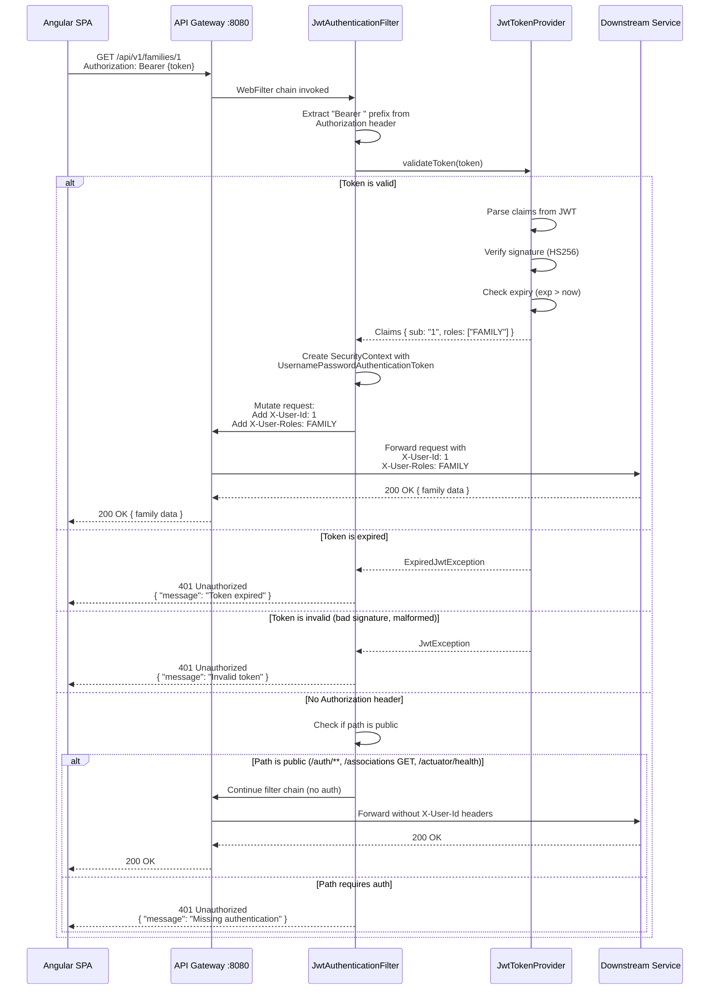
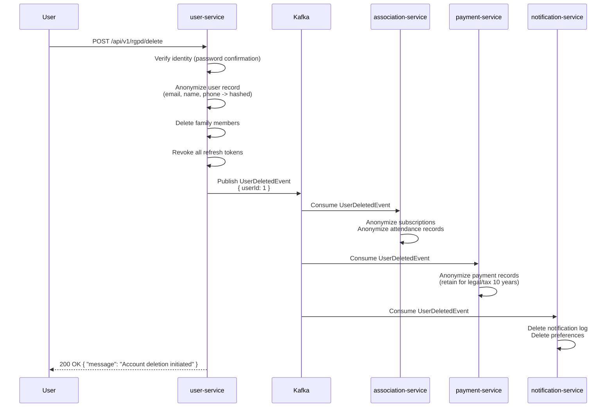
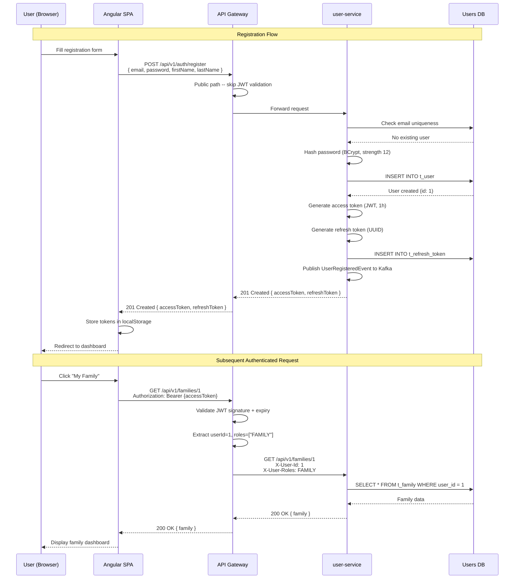
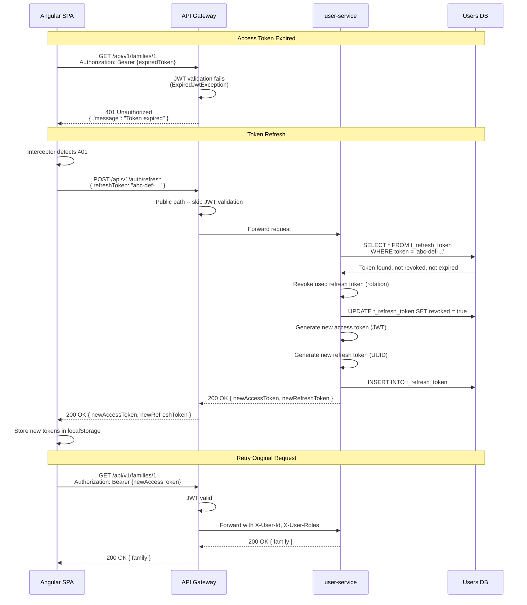
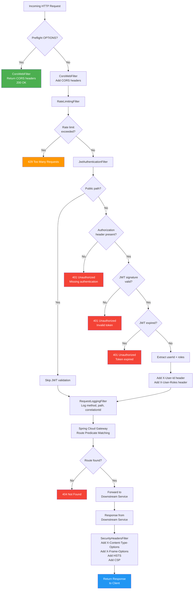
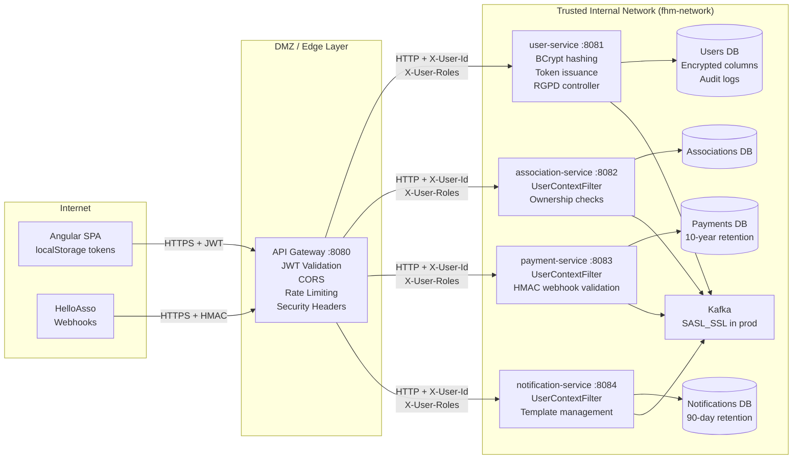

# 05 -- Security Architecture

> **Family Hobbies Manager** -- Multi-Association Management Platform
> Architecture Document Series | Document 5 of 12

---

## Table of Contents

1. [Authentication Strategy](#1-authentication-strategy)
2. [JWT Token Structure](#2-jwt-token-structure)
3. [Role-Based Access Control (RBAC)](#3-role-based-access-control-rbac)
4. [Gateway Security Flow](#4-gateway-security-flow)
5. [Spring Security Configuration](#5-spring-security-configuration)
6. [Downstream Service Security](#6-downstream-service-security)
7. [CORS Configuration](#7-cors-configuration)
8. [HelloAsso Webhook Security](#8-helloasso-webhook-security)
9. [RGPD Compliance Security Measures](#9-rgpd-compliance-security-measures)
10. [Security Headers](#10-security-headers)
11. [Secrets Management](#11-secrets-management)
12. [Security Diagrams](#12-security-diagrams)

---

## 1. Authentication Strategy

Family Hobbies Manager uses **JWT-based stateless authentication** implemented through Spring Security 6.
The user-service owns the authentication lifecycle; the api-gateway validates tokens on every request
and forwards trusted identity headers to downstream microservices.

### Token Pair Model

| Token | Type | Lifetime | Storage (Client) | Storage (Server) |
|----|----|----|----|-----|
| **Access token** | JWT (signed, compact) | 1 hour | `localStorage` | Not stored -- stateless validation via signature |
| **Refresh token** | Opaque UUID | 7 days | `localStorage` | Persisted in `t_refresh_token` table (user-service DB) |

### Access Token Details

- **Algorithm**: HS256 (HMAC-SHA256) in development; RS256 (RSA-SHA256) recommended for production
  with key rotation via JWKS endpoint.
- **Signed with**: A 256-bit secret key stored in environment variable `JWT_SECRET`.
- **Contains**: User identity, roles, and standard JWT claims (`iat`, `exp`, `sub`).
- **Validated at**: The API Gateway -- downstream services never re-validate the JWT signature.

### Refresh Token Details

- **Format**: Opaque `UUID.randomUUID()` string -- not a JWT, carries no claims.
- **Stored**: In the `t_refresh_token` table with `user_id`, `token`, `expires_at`, `revoked` columns.
- **Purpose**: Allows silent token renewal without re-authenticating. When the access token expires,
  the frontend sends the refresh token to `POST /api/v1/auth/refresh` and receives a new token pair.
- **Revocation**: On logout, the refresh token is marked as `revoked = true`. On password change,
  all refresh tokens for the user are revoked.

### Password Hashing

All passwords are hashed using **BCrypt** with a strength factor of **12**.

```java
@Bean
public PasswordEncoder passwordEncoder() {
    return new BCryptPasswordEncoder(12);
}
```

BCrypt strength 12 produces approximately 2^12 = 4096 hash iterations, balancing security against
authentication latency (approximately 250ms per hash on modern hardware).

### Token Storage Discussion -- localStorage vs HttpOnly Cookies

**Current implementation**: Tokens are stored in `localStorage` for simplicity during development
and portfolio demonstration.

| Approach | Pros | Cons |
|----|----|----|
| `localStorage` | Simple to implement; works with any API client; no CSRF concerns for API calls | Vulnerable to XSS (any injected script can read tokens) |
| `HttpOnly` cookie | Immune to XSS (JavaScript cannot access); automatic inclusion on requests | Requires CSRF protection (SameSite + double-submit token); more complex CORS setup; complicates mobile/non-browser clients |

**Production recommendation**: Migrate to `HttpOnly`, `Secure`, `SameSite=Strict` cookies for the
access token. Store the refresh token as a separate `HttpOnly` cookie with `Path=/api/v1/auth/refresh`
to limit its exposure. Add a CSRF double-submit cookie for state-changing requests.

---

## 2. JWT Token Structure

### Access Token Payload

```json
{
  "sub": "1",
  "email": "dupont@email.com",
  "roles": ["FAMILY"],
  "firstName": "Jean",
  "lastName": "Dupont",
  "iat": 1694780400,
  "exp": 1694784000
}
```

### Claim Descriptions

| Claim | Type | Description |
|----|----|----|
| `sub` | String | User ID (primary key from `t_user`). String type per JWT spec. |
| `email` | String | User email address -- used for display and audit correlation. |
| `roles` | String[] | Array of granted roles: `FAMILY`, `ASSOCIATION`, `ADMIN`. A user may hold multiple roles. |
| `firstName` | String | User first name -- used for frontend display without an extra API call. |
| `lastName` | String | User last name -- used for frontend display without an extra API call. |
| `iat` | Long | Issued-at timestamp (epoch seconds). |
| `exp` | Long | Expiration timestamp (epoch seconds). Set to `iat + 3600` (1 hour). |

### Full Token Structure (Three Parts)

```
Header (Base64URL):
{
  "alg": "HS256",
  "typ": "JWT"
}

Payload (Base64URL):
{
  "sub": "1",
  "email": "dupont@email.com",
  "roles": ["FAMILY"],
  "firstName": "Jean",
  "lastName": "Dupont",
  "iat": 1694780400,
  "exp": 1694784000
}

Signature:
HMACSHA256(
  base64UrlEncode(header) + "." + base64UrlEncode(payload),
  secret
)
```

### Refresh Token Structure (Database)

```sql
CREATE TABLE t_refresh_token (
    id          BIGINT GENERATED ALWAYS AS IDENTITY PRIMARY KEY,
    user_id     BIGINT NOT NULL,
    token       VARCHAR(255) NOT NULL,
    expires_at  TIMESTAMP WITH TIME ZONE NOT NULL,
    revoked     BOOLEAN NOT NULL DEFAULT FALSE,
    created_at  TIMESTAMP WITH TIME ZONE NOT NULL DEFAULT now(),
    CONSTRAINT fk_refresh_token_user FOREIGN KEY (user_id) REFERENCES t_user(id) ON DELETE CASCADE,
    CONSTRAINT uq_refresh_token_token UNIQUE (token)
);

CREATE INDEX idx_refresh_token_user_id ON t_refresh_token(user_id);
CREATE INDEX idx_refresh_token_token ON t_refresh_token(token);
```

---

## 3. Role-Based Access Control (RBAC)

### Role Definitions

| Role | Description | Target User | Permissions |
|----|----|----|----|
| `FAMILY` | Family user (parent/guardian) | Default role assigned at registration | Manage own family and members, browse association directory, create subscriptions, view own payments, receive notifications, mark attendance for own members |
| `ASSOCIATION` | Association manager | Assigned by admin or via HelloAsso association linking | All FAMILY permissions + view association subscriber lists, mark attendance for any member in their association, view payment reports for their association, manage sessions and courses |
| `ADMIN` | Platform administrator | Assigned manually in database or by another admin | Full CRUD on all entities, trigger HelloAsso sync, manage all users and roles, access RGPD tools (export, deletion), view platform-wide analytics, manage email templates |

### Endpoint Authorization Matrix

The following table defines which roles can access each API endpoint. **PUBLIC** means no
authentication is required. **HMAC** means the endpoint is secured via webhook signature
verification rather than JWT.

#### Authentication Endpoints (user-service)

| Endpoint | Method | FAMILY | ASSOCIATION | ADMIN | PUBLIC |
|----|----|----|----|----|-----|
| `/api/v1/auth/register` | POST | -- | -- | -- | YES |
| `/api/v1/auth/login` | POST | -- | -- | -- | YES |
| `/api/v1/auth/refresh` | POST | -- | -- | -- | YES |
| `/api/v1/auth/logout` | POST | YES | YES | YES | -- |
| `/api/v1/auth/forgot-password` | POST | -- | -- | -- | YES |
| `/api/v1/auth/reset-password` | POST | -- | -- | -- | YES |

#### User Endpoints (user-service)

| Endpoint | Method | FAMILY | ASSOCIATION | ADMIN | PUBLIC |
|----|----|----|----|----|-----|
| `/api/v1/users/me` | GET | YES | YES | YES | -- |
| `/api/v1/users/me` | PUT | YES | YES | YES | -- |
| `/api/v1/users/me` | DELETE | YES | YES | YES | -- |
| `/api/v1/users/{id}` | GET | -- | -- | YES | -- |
| `/api/v1/users` | GET | -- | -- | YES | -- |
| `/api/v1/users/{id}` | PUT | -- | -- | YES | -- |
| `/api/v1/users/{id}` | DELETE | -- | -- | YES | -- |
| `/api/v1/users/{id}/roles` | PATCH | -- | -- | YES | -- |

#### Family Endpoints (user-service)

| Endpoint | Method | FAMILY | ASSOCIATION | ADMIN | PUBLIC |
|----|----|----|----|----|-----|
| `/api/v1/families` | POST | YES | -- | YES | -- |
| `/api/v1/families/{id}` | GET | YES (own) | -- | YES | -- |
| `/api/v1/families/{id}` | PUT | YES (own) | -- | YES | -- |
| `/api/v1/families/{id}` | DELETE | YES (own) | -- | YES | -- |
| `/api/v1/families/{familyId}/members` | GET | YES (own) | -- | YES | -- |
| `/api/v1/families/{familyId}/members` | POST | YES (own) | -- | YES | -- |
| `/api/v1/families/{familyId}/members/{memberId}` | PUT | YES (own) | -- | YES | -- |
| `/api/v1/families/{familyId}/members/{memberId}` | DELETE | YES (own) | -- | YES | -- |

#### Association Endpoints (association-service)

| Endpoint | Method | FAMILY | ASSOCIATION | ADMIN | PUBLIC |
|----|----|----|----|----|-----|
| `/api/v1/associations` | GET | YES | YES | YES | YES |
| `/api/v1/associations/{id}` | GET | YES | YES | YES | YES |
| `/api/v1/associations/search` | POST | YES | YES | YES | YES |
| `/api/v1/associations/sync` | POST | -- | -- | YES | -- |
| `/api/v1/associations/{id}/activities` | GET | YES | YES | YES | YES |
| `/api/v1/associations/{id}/subscribers` | GET | -- | YES (own) | YES | -- |

#### Activity and Session Endpoints (association-service)

| Endpoint | Method | FAMILY | ASSOCIATION | ADMIN | PUBLIC |
|----|----|----|----|----|-----|
| `/api/v1/activities` | GET | YES | YES | YES | YES |
| `/api/v1/activities/{id}` | GET | YES | YES | YES | YES |
| `/api/v1/activities` | POST | -- | YES | YES | -- |
| `/api/v1/activities/{id}` | PUT | -- | YES (own) | YES | -- |
| `/api/v1/activities/{id}` | DELETE | -- | YES (own) | YES | -- |
| `/api/v1/activities/{id}/sessions` | GET | YES | YES | YES | -- |
| `/api/v1/sessions` | POST | -- | YES | YES | -- |
| `/api/v1/sessions/{id}` | GET | YES | YES | YES | -- |
| `/api/v1/sessions/{id}` | PUT | -- | YES (own) | YES | -- |
| `/api/v1/sessions/{id}` | DELETE | -- | YES (own) | YES | -- |

#### Subscription Endpoints (association-service)

| Endpoint | Method | FAMILY | ASSOCIATION | ADMIN | PUBLIC |
|----|----|----|----|----|-----|
| `/api/v1/subscriptions` | POST | YES | -- | YES | -- |
| `/api/v1/subscriptions/{id}` | GET | YES (own) | YES (own assoc) | YES | -- |
| `/api/v1/subscriptions/{id}/cancel` | POST | YES (own) | -- | YES | -- |
| `/api/v1/users/{userId}/subscriptions` | GET | YES (own) | -- | YES | -- |
| `/api/v1/associations/{id}/subscriptions` | GET | -- | YES (own) | YES | -- |

#### Attendance Endpoints (association-service)

| Endpoint | Method | FAMILY | ASSOCIATION | ADMIN | PUBLIC |
|----|----|----|----|----|-----|
| `/api/v1/attendance/mark` | POST | YES (own members) | YES (own assoc) | YES | -- |
| `/api/v1/attendance/unmark` | POST | YES (own members) | YES (own assoc) | YES | -- |
| `/api/v1/attendance/session/{sessionId}` | GET | -- | YES (own assoc) | YES | -- |
| `/api/v1/attendance/member/{memberId}` | GET | YES (own members) | YES (own assoc) | YES | -- |
| `/api/v1/attendance/report` | GET | -- | YES (own assoc) | YES | -- |

#### Payment Endpoints (payment-service)

| Endpoint | Method | FAMILY | ASSOCIATION | ADMIN | PUBLIC |
|----|----|----|----|----|-----|
| `/api/v1/payments/checkout` | POST | YES | -- | YES | -- |
| `/api/v1/payments/{id}` | GET | YES (own) | -- | YES | -- |
| `/api/v1/payments/user/{userId}` | GET | YES (own) | -- | YES | -- |
| `/api/v1/payments/{id}/refund` | POST | -- | -- | YES | -- |
| `/api/v1/payments/association/{id}/report` | GET | -- | YES (own) | YES | -- |
| `/api/v1/payments/webhook/helloasso` | POST | -- | -- | -- | YES (HMAC) |

#### Invoice Endpoints (payment-service)

| Endpoint | Method | FAMILY | ASSOCIATION | ADMIN | PUBLIC |
|----|----|----|----|----|-----|
| `/api/v1/invoices/{id}` | GET | YES (own) | -- | YES | -- |
| `/api/v1/invoices/{id}/download` | GET | YES (own) | -- | YES | -- |
| `/api/v1/invoices/user/{userId}` | GET | YES (own) | -- | YES | -- |

#### Notification Endpoints (notification-service)

| Endpoint | Method | FAMILY | ASSOCIATION | ADMIN | PUBLIC |
|----|----|----|----|----|-----|
| `/api/v1/notifications` | GET | YES (own) | YES (own) | YES | -- |
| `/api/v1/notifications/{id}/read` | PATCH | YES (own) | YES (own) | YES | -- |
| `/api/v1/notifications/read-all` | POST | YES (own) | YES (own) | YES | -- |
| `/api/v1/notifications/preferences` | GET | YES (own) | YES (own) | YES | -- |
| `/api/v1/notifications/preferences` | PUT | YES (own) | YES (own) | YES | -- |
| `/api/v1/notifications/templates` | GET | -- | -- | YES | -- |
| `/api/v1/notifications/templates` | POST | -- | -- | YES | -- |
| `/api/v1/notifications/templates/{id}` | PUT | -- | -- | YES | -- |

#### RGPD Endpoints (user-service)

| Endpoint | Method | FAMILY | ASSOCIATION | ADMIN | PUBLIC |
|----|----|----|----|----|-----|
| `/api/v1/rgpd/export` | POST | YES (own) | YES (own) | YES | -- |
| `/api/v1/rgpd/delete` | POST | YES (own) | YES (own) | YES | -- |
| `/api/v1/rgpd/consents` | GET | YES (own) | YES (own) | YES | -- |
| `/api/v1/rgpd/consents` | PUT | YES (own) | YES (own) | YES | -- |
| `/api/v1/rgpd/audit-log` | GET | -- | -- | YES | -- |

#### Health and Actuator Endpoints

| Endpoint | Method | FAMILY | ASSOCIATION | ADMIN | PUBLIC |
|----|----|----|----|----|-----|
| `/actuator/health` | GET | -- | -- | -- | YES |
| `/actuator/info` | GET | -- | -- | -- | YES |
| `/actuator/metrics` | GET | -- | -- | YES | -- |
| `/actuator/prometheus` | GET | -- | -- | YES | -- |

> **Note**: `YES (own)` means the role has access but only to resources belonging to the
> authenticated user, their family, or their association. This is enforced at the service layer
> via `UserContext` checks, not purely at the gateway level.

---

## 4. Gateway Security Flow

### Request Authentication Sequence



### Gateway Filter Chain Order

The API Gateway applies filters in the following order:

| Order | Filter | Responsibility |
|----|----|----|
| 1 | **CorsWebFilter** | Handle preflight OPTIONS requests and set CORS headers |
| 2 | **RateLimitingFilter** | Apply Resilience4j rate limiting (100 req/min per IP by default) |
| 3 | **JwtAuthenticationFilter** | Extract and validate JWT, set security context, add forwarding headers |
| 4 | **RequestLoggingFilter** | Log request method, path, correlation ID, and response status |
| 5 | **Spring Cloud Gateway Routing** | Route to downstream service based on path predicates |

### Trust Boundary

```
                    UNTRUSTED ZONE              |  TRUSTED ZONE (internal network)
                                                |
  Angular SPA  -->  API Gateway                 |  user-service
                    (JWT validated here)        |  association-service
                    (X-User-Id injected here)   |  payment-service
                                                |  notification-service
                                                |
               Internet / Public                |  Docker network (fhm-network)
```

Downstream services **trust the gateway unconditionally**. They read `X-User-Id` and `X-User-Roles`
headers without re-validating the JWT. This works because:

1. Services are only reachable via the Docker network (`fhm-network`), not exposed to the internet.
2. The gateway is the **only** entry point from the public internet.
3. In production (OpenShift), network policies enforce that services cannot be reached directly.

---

## 5. Spring Security Configuration

### 5.1 API Gateway -- SecurityConfig

The gateway uses **Spring WebFlux** (`@EnableWebFluxSecurity`) because Spring Cloud Gateway is
reactive by design.

```java
package com.familyhobbies.apigateway.config;

import com.familyhobbies.apigateway.security.JwtAuthenticationFilter;
import org.springframework.context.annotation.Bean;
import org.springframework.context.annotation.Configuration;
import org.springframework.http.HttpMethod;
import org.springframework.security.config.annotation.web.reactive.EnableWebFluxSecurity;
import org.springframework.security.config.web.server.SecurityWebFiltersOrder;
import org.springframework.security.config.web.server.ServerHttpSecurity;
import org.springframework.security.web.server.SecurityWebFilterChain;
import org.springframework.web.cors.CorsConfiguration;
import org.springframework.web.cors.reactive.CorsConfigurationSource;
import org.springframework.web.cors.reactive.UrlBasedCorsConfigurationSource;

import java.util.List;

@Configuration
@EnableWebFluxSecurity
public class SecurityConfig {

    private final JwtAuthenticationFilter jwtAuthenticationFilter;

    public SecurityConfig(JwtAuthenticationFilter jwtAuthenticationFilter) {
        this.jwtAuthenticationFilter = jwtAuthenticationFilter;
    }

    @Bean
    public SecurityWebFilterChain securityFilterChain(ServerHttpSecurity http) {
        return http
            // Disable CSRF -- stateless JWT-based API, no session cookies
            .csrf(ServerHttpSecurity.CsrfSpec::disable)

            // CORS -- allow Angular dev server and production origins
            .cors(cors -> cors.configurationSource(corsConfigurationSource()))

            // Disable form login and HTTP basic -- JWT only
            .formLogin(ServerHttpSecurity.FormLoginSpec::disable)
            .httpBasic(ServerHttpSecurity.HttpBasicSpec::disable)

            // Authorization rules
            .authorizeExchange(exchanges -> exchanges
                // Public endpoints -- no authentication required
                .pathMatchers("/api/v1/auth/**").permitAll()
                .pathMatchers(HttpMethod.GET, "/api/v1/associations/**").permitAll()
                .pathMatchers(HttpMethod.GET, "/api/v1/activities/**").permitAll()
                .pathMatchers(HttpMethod.POST, "/api/v1/associations/search").permitAll()
                .pathMatchers("/api/v1/payments/webhook/**").permitAll()
                .pathMatchers("/actuator/health", "/actuator/info").permitAll()

                // Admin-only endpoints
                .pathMatchers("/api/v1/users/**").hasRole("ADMIN")
                .pathMatchers(HttpMethod.POST, "/api/v1/associations/sync").hasRole("ADMIN")
                .pathMatchers("/api/v1/notifications/templates/**").hasRole("ADMIN")
                .pathMatchers("/actuator/metrics", "/actuator/prometheus").hasRole("ADMIN")
                .pathMatchers("/api/v1/rgpd/audit-log").hasRole("ADMIN")

                // Association manager endpoints
                .pathMatchers("/api/v1/associations/*/subscribers").hasAnyRole("ASSOCIATION", "ADMIN")
                .pathMatchers("/api/v1/attendance/report").hasAnyRole("ASSOCIATION", "ADMIN")
                .pathMatchers("/api/v1/payments/association/**").hasAnyRole("ASSOCIATION", "ADMIN")

                // All other endpoints require authentication (any role)
                .anyExchange().authenticated()
            )

            // Add JWT filter before the authentication filter
            .addFilterBefore(jwtAuthenticationFilter, SecurityWebFiltersOrder.AUTHENTICATION)

            .build();
    }

    @Bean
    public CorsConfigurationSource corsConfigurationSource() {
        CorsConfiguration config = new CorsConfiguration();
        config.setAllowedOrigins(List.of(
            "http://localhost:4200",       // Angular dev server
            "https://familyhobbies.fr"     // Production origin
        ));
        config.setAllowedMethods(List.of("GET", "POST", "PUT", "PATCH", "DELETE", "OPTIONS"));
        config.setAllowedHeaders(List.of("Authorization", "Content-Type", "X-Requested-With"));
        config.setExposedHeaders(List.of("X-Total-Count", "X-Correlation-Id"));
        config.setAllowCredentials(true);
        config.setMaxAge(3600L);

        UrlBasedCorsConfigurationSource source = new UrlBasedCorsConfigurationSource();
        source.registerCorsConfiguration("/api/**", config);
        return source;
    }
}
```

### 5.2 API Gateway -- JwtAuthenticationFilter

```java
package com.familyhobbies.apigateway.security;

import org.springframework.http.HttpHeaders;
import org.springframework.http.HttpStatus;
import org.springframework.http.server.reactive.ServerHttpRequest;
import org.springframework.stereotype.Component;
import org.springframework.web.server.ServerWebExchange;
import org.springframework.web.server.WebFilter;
import org.springframework.web.server.WebFilterChain;
import reactor.core.publisher.Mono;

import java.util.List;

@Component
public class JwtAuthenticationFilter implements WebFilter {

    private static final String BEARER_PREFIX = "Bearer ";
    private static final String HEADER_USER_ID = "X-User-Id";
    private static final String HEADER_USER_ROLES = "X-User-Roles";

    private final JwtTokenProvider jwtTokenProvider;
    private final List<String> publicPaths = List.of(
        "/api/v1/auth/",
        "/actuator/health",
        "/actuator/info",
        "/api/v1/payments/webhook/"
    );

    public JwtAuthenticationFilter(JwtTokenProvider jwtTokenProvider) {
        this.jwtTokenProvider = jwtTokenProvider;
    }

    @Override
    public Mono<Void> filter(ServerWebExchange exchange, WebFilterChain chain) {
        ServerHttpRequest request = exchange.getRequest();
        String path = request.getURI().getPath();

        // Skip authentication for public paths
        if (isPublicPath(path)) {
            return chain.filter(exchange);
        }

        // Extract Authorization header
        String authHeader = request.getHeaders().getFirst(HttpHeaders.AUTHORIZATION);

        if (authHeader == null || !authHeader.startsWith(BEARER_PREFIX)) {
            return unauthorizedResponse(exchange, "Missing or invalid Authorization header");
        }

        String token = authHeader.substring(BEARER_PREFIX.length());

        try {
            // Validate token and extract claims
            var claims = jwtTokenProvider.validateToken(token);
            String userId = claims.getSubject();
            String roles = String.join(",", jwtTokenProvider.getRolesFromToken(token));

            // Mutate request to add trusted headers for downstream services
            ServerHttpRequest mutatedRequest = request.mutate()
                .header(HEADER_USER_ID, userId)
                .header(HEADER_USER_ROLES, roles)
                .build();

            ServerWebExchange mutatedExchange = exchange.mutate()
                .request(mutatedRequest)
                .build();

            return chain.filter(mutatedExchange);

        } catch (io.jsonwebtoken.ExpiredJwtException e) {
            return unauthorizedResponse(exchange, "Token expired");
        } catch (io.jsonwebtoken.JwtException e) {
            return unauthorizedResponse(exchange, "Invalid token");
        }
    }

    private boolean isPublicPath(String path) {
        return publicPaths.stream().anyMatch(path::startsWith);
    }

    private Mono<Void> unauthorizedResponse(ServerWebExchange exchange, String message) {
        exchange.getResponse().setStatusCode(HttpStatus.UNAUTHORIZED);
        exchange.getResponse().getHeaders().add("Content-Type", "application/json");

        String body = String.format(
            "{\"status\":401,\"error\":\"Unauthorized\",\"message\":\"%s\",\"timestamp\":\"%s\",\"path\":\"%s\"}",
            message,
            java.time.Instant.now().toString(),
            exchange.getRequest().getURI().getPath()
        );

        byte[] bytes = body.getBytes(java.nio.charset.StandardCharsets.UTF_8);
        var buffer = exchange.getResponse().bufferFactory().wrap(bytes);
        return exchange.getResponse().writeWith(Mono.just(buffer));
    }
}
```

### 5.3 User Service -- JwtTokenProvider

```java
package com.familyhobbies.userservice.security;

import com.familyhobbies.userservice.entity.User;
import io.jsonwebtoken.Claims;
import io.jsonwebtoken.Jwts;
import io.jsonwebtoken.SignatureAlgorithm;
import io.jsonwebtoken.security.Keys;
import org.springframework.beans.factory.annotation.Value;
import org.springframework.stereotype.Component;

import javax.crypto.SecretKey;
import java.nio.charset.StandardCharsets;
import java.util.Date;
import java.util.List;
import java.util.UUID;

@Component
public class JwtTokenProvider {

    private static final long ACCESS_TOKEN_VALIDITY_MS = 3_600_000;   // 1 hour
    private static final long REFRESH_TOKEN_VALIDITY_MS = 604_800_000; // 7 days

    private final SecretKey signingKey;

    public JwtTokenProvider(@Value("${jwt.secret}") String secret) {
        this.signingKey = Keys.hmacShaKeyFor(secret.getBytes(StandardCharsets.UTF_8));
    }

    /**
     * Generate a signed JWT access token containing user identity and roles.
     */
    public String generateAccessToken(User user) {
        Date now = new Date();
        Date expiry = new Date(now.getTime() + ACCESS_TOKEN_VALIDITY_MS);

        return Jwts.builder()
            .setSubject(String.valueOf(user.getId()))
            .claim("email", user.getEmail())
            .claim("roles", user.getRoles().stream()
                .map(role -> role.getName().name())
                .toList())
            .claim("firstName", user.getFirstName())
            .claim("lastName", user.getLastName())
            .setIssuedAt(now)
            .setExpiration(expiry)
            .signWith(signingKey, SignatureAlgorithm.HS256)
            .compact();
    }

    /**
     * Generate an opaque refresh token (UUID).
     * The token itself carries no claims -- it is a lookup key into the database.
     */
    public String generateRefreshToken() {
        return UUID.randomUUID().toString();
    }

    /**
     * Validate the token signature and expiry. Returns claims if valid.
     * Throws ExpiredJwtException if expired, JwtException if invalid.
     */
    public Claims validateToken(String token) {
        return Jwts.parserBuilder()
            .setSigningKey(signingKey)
            .build()
            .parseClaimsJws(token)
            .getBody();
    }

    /**
     * Extract user ID from a validated token.
     */
    public Long getUserIdFromToken(String token) {
        Claims claims = validateToken(token);
        return Long.valueOf(claims.getSubject());
    }

    /**
     * Extract roles from a validated token.
     */
    @SuppressWarnings("unchecked")
    public List<String> getRolesFromToken(String token) {
        Claims claims = validateToken(token);
        return claims.get("roles", List.class);
    }

    /**
     * Calculate the refresh token expiry date from now.
     */
    public Date getRefreshTokenExpiry() {
        return new Date(System.currentTimeMillis() + REFRESH_TOKEN_VALIDITY_MS);
    }
}
```

### 5.4 User Service -- SecurityConfig

The user-service uses **Spring MVC** (servlet-based), not WebFlux.

```java
package com.familyhobbies.userservice.config;

import org.springframework.context.annotation.Bean;
import org.springframework.context.annotation.Configuration;
import org.springframework.http.HttpMethod;
import org.springframework.security.config.annotation.method.configuration.EnableMethodSecurity;
import org.springframework.security.config.annotation.web.builders.HttpSecurity;
import org.springframework.security.config.annotation.web.configuration.EnableWebSecurity;
import org.springframework.security.config.http.SessionCreationPolicy;
import org.springframework.security.crypto.bcrypt.BCryptPasswordEncoder;
import org.springframework.security.crypto.password.PasswordEncoder;
import org.springframework.security.web.SecurityFilterChain;
import org.springframework.security.web.authentication.UsernamePasswordAuthenticationFilter;

@Configuration
@EnableWebSecurity
@EnableMethodSecurity
public class SecurityConfig {

    private final UserContextFilter userContextFilter;

    public SecurityConfig(UserContextFilter userContextFilter) {
        this.userContextFilter = userContextFilter;
    }

    @Bean
    public SecurityFilterChain securityFilterChain(HttpSecurity http) throws Exception {
        return http
            // Stateless -- no sessions
            .sessionManagement(session ->
                session.sessionCreationPolicy(SessionCreationPolicy.STATELESS))

            // CSRF disabled -- behind gateway, no cookies
            .csrf(csrf -> csrf.disable())

            // No form login or HTTP basic
            .formLogin(form -> form.disable())
            .httpBasic(basic -> basic.disable())

            // Authorization rules (defense-in-depth, gateway also enforces)
            .authorizeHttpRequests(auth -> auth
                .requestMatchers("/api/v1/auth/**").permitAll()
                .requestMatchers("/actuator/health", "/actuator/info").permitAll()
                .anyRequest().authenticated()
            )

            // Extract user context from gateway headers
            .addFilterBefore(userContextFilter, UsernamePasswordAuthenticationFilter.class)

            .build();
    }

    @Bean
    public PasswordEncoder passwordEncoder() {
        return new BCryptPasswordEncoder(12);
    }
}
```

### 5.5 User Service -- AuthController

```java
package com.familyhobbies.userservice.controller;

import com.familyhobbies.userservice.dto.request.LoginRequest;
import com.familyhobbies.userservice.dto.request.RegisterRequest;
import com.familyhobbies.userservice.dto.request.RefreshTokenRequest;
import com.familyhobbies.userservice.dto.response.AuthResponse;
import com.familyhobbies.userservice.service.AuthService;
import jakarta.validation.Valid;
import org.springframework.http.HttpStatus;
import org.springframework.http.ResponseEntity;
import org.springframework.web.bind.annotation.*;

@RestController
@RequestMapping("/api/v1/auth")
public class AuthController {

    private final AuthService authService;

    public AuthController(AuthService authService) {
        this.authService = authService;
    }

    @PostMapping("/register")
    public ResponseEntity<AuthResponse> register(@Valid @RequestBody RegisterRequest request) {
        AuthResponse response = authService.register(request);
        return ResponseEntity.status(HttpStatus.CREATED).body(response);
    }

    @PostMapping("/login")
    public ResponseEntity<AuthResponse> login(@Valid @RequestBody LoginRequest request) {
        AuthResponse response = authService.login(request);
        return ResponseEntity.ok(response);
    }

    @PostMapping("/refresh")
    public ResponseEntity<AuthResponse> refresh(@Valid @RequestBody RefreshTokenRequest request) {
        AuthResponse response = authService.refreshToken(request);
        return ResponseEntity.ok(response);
    }

    @PostMapping("/logout")
    public ResponseEntity<Void> logout(@RequestHeader("X-User-Id") Long userId) {
        authService.logout(userId);
        return ResponseEntity.noContent().build();
    }
}
```

### 5.6 User Service -- AuthService

```java
package com.familyhobbies.userservice.service.impl;

import com.familyhobbies.common.event.UserRegisteredEvent;
import com.familyhobbies.userservice.dto.request.LoginRequest;
import com.familyhobbies.userservice.dto.request.RefreshTokenRequest;
import com.familyhobbies.userservice.dto.request.RegisterRequest;
import com.familyhobbies.userservice.dto.response.AuthResponse;
import com.familyhobbies.userservice.entity.RefreshToken;
import com.familyhobbies.userservice.entity.User;
import com.familyhobbies.userservice.exception.EmailAlreadyExistsException;
import com.familyhobbies.userservice.exception.InvalidCredentialsException;
import com.familyhobbies.userservice.exception.InvalidRefreshTokenException;
import com.familyhobbies.userservice.repository.RefreshTokenRepository;
import com.familyhobbies.userservice.repository.UserRepository;
import com.familyhobbies.userservice.security.JwtTokenProvider;
import com.familyhobbies.userservice.service.AuthService;
import com.familyhobbies.userservice.event.publisher.UserEventPublisher;
import org.springframework.security.crypto.password.PasswordEncoder;
import org.springframework.stereotype.Service;
import org.springframework.transaction.annotation.Transactional;

import java.time.Instant;

@Service
public class AuthServiceImpl implements AuthService {

    private final UserRepository userRepository;
    private final RefreshTokenRepository refreshTokenRepository;
    private final PasswordEncoder passwordEncoder;
    private final JwtTokenProvider jwtTokenProvider;
    private final UserEventPublisher userEventPublisher;

    public AuthServiceImpl(
            UserRepository userRepository,
            RefreshTokenRepository refreshTokenRepository,
            PasswordEncoder passwordEncoder,
            JwtTokenProvider jwtTokenProvider,
            UserEventPublisher userEventPublisher) {
        this.userRepository = userRepository;
        this.refreshTokenRepository = refreshTokenRepository;
        this.passwordEncoder = passwordEncoder;
        this.jwtTokenProvider = jwtTokenProvider;
        this.userEventPublisher = userEventPublisher;
    }

    @Override
    @Transactional
    public AuthResponse register(RegisterRequest request) {
        if (userRepository.existsByEmail(request.email())) {
            throw new EmailAlreadyExistsException(request.email());
        }

        User user = User.builder()
            .email(request.email())
            .firstName(request.firstName())
            .lastName(request.lastName())
            .passwordHash(passwordEncoder.encode(request.password()))
            .role(UserRole.FAMILY)
            .active(true)
            .build();

        user = userRepository.save(user);

        // Generate token pair
        String accessToken = jwtTokenProvider.generateAccessToken(user);
        String refreshToken = createRefreshToken(user);

        // Publish domain event
        userEventPublisher.publishUserRegistered(new UserRegisteredEvent(
            user.getId(),
            user.getEmail(),
            user.getFirstName(),
            user.getLastName(),
            Instant.now()
        ));

        return new AuthResponse(accessToken, refreshToken, "Bearer", 3600);
    }

    @Override
    @Transactional(readOnly = true)
    public AuthResponse login(LoginRequest request) {
        User user = userRepository.findByEmail(request.email())
            .orElseThrow(() -> new InvalidCredentialsException());

        if (!passwordEncoder.matches(request.password(), user.getPasswordHash())) {
            throw new InvalidCredentialsException();
        }

        if (!user.isActive()) {
            throw new InvalidCredentialsException();
        }

        String accessToken = jwtTokenProvider.generateAccessToken(user);
        String refreshToken = createRefreshToken(user);

        return new AuthResponse(accessToken, refreshToken, "Bearer", 3600);
    }

    @Override
    @Transactional
    public AuthResponse refreshToken(RefreshTokenRequest request) {
        RefreshToken stored = refreshTokenRepository.findByToken(request.refreshToken())
            .orElseThrow(() -> new InvalidRefreshTokenException());

        if (stored.isRevoked() || stored.getExpiresAt().isBefore(Instant.now())) {
            throw new InvalidRefreshTokenException();
        }

        // Revoke the used refresh token (rotation)
        stored.setRevoked(true);
        refreshTokenRepository.save(stored);

        // Issue new token pair
        User user = stored.getUser();
        String accessToken = jwtTokenProvider.generateAccessToken(user);
        String newRefreshToken = createRefreshToken(user);

        return new AuthResponse(accessToken, newRefreshToken, "Bearer", 3600);
    }

    @Override
    @Transactional
    public void logout(Long userId) {
        // Revoke all refresh tokens for this user
        refreshTokenRepository.revokeAllByUserId(userId);
    }

    private String createRefreshToken(User user) {
        String token = jwtTokenProvider.generateRefreshToken();

        RefreshToken refreshToken = RefreshToken.builder()
            .user(user)
            .token(token)
            .expiresAt(jwtTokenProvider.getRefreshTokenExpiry().toInstant())
            .revoked(false)
            .build();

        refreshTokenRepository.save(refreshToken);
        return token;
    }
}
```

---

## 6. Downstream Service Security

Downstream services (association-service, payment-service, notification-service) do **not** validate
JWT tokens. They trust that the API Gateway has already validated the token and read identity
information from the forwarded headers.

### 6.1 UserContextFilter

Each downstream service includes a `UserContextFilter` that extracts `X-User-Id` and `X-User-Roles`
from the incoming request headers and stores them in a `ThreadLocal` for the duration of the request.

```java
package com.familyhobbies.common.security;

import jakarta.servlet.FilterChain;
import jakarta.servlet.ServletException;
import jakarta.servlet.http.HttpServletRequest;
import jakarta.servlet.http.HttpServletResponse;
import org.springframework.security.authentication.UsernamePasswordAuthenticationToken;
import org.springframework.security.core.authority.SimpleGrantedAuthority;
import org.springframework.security.core.context.SecurityContextHolder;
import org.springframework.stereotype.Component;
import org.springframework.web.filter.OncePerRequestFilter;

import java.io.IOException;
import java.util.Arrays;
import java.util.Collections;
import java.util.List;

@Component
public class UserContextFilter extends OncePerRequestFilter {

    private static final String HEADER_USER_ID = "X-User-Id";
    private static final String HEADER_USER_ROLES = "X-User-Roles";

    @Override
    protected void doFilterInternal(
            HttpServletRequest request,
            HttpServletResponse response,
            FilterChain filterChain) throws ServletException, IOException {

        String userId = request.getHeader(HEADER_USER_ID);
        String roles = request.getHeader(HEADER_USER_ROLES);

        if (userId != null && roles != null) {
            // Parse roles into Spring Security authorities
            List<SimpleGrantedAuthority> authorities = Arrays.stream(roles.split(","))
                .map(String::trim)
                .map(role -> new SimpleGrantedAuthority("ROLE_" + role))
                .toList();

            // Set Spring SecurityContext so @PreAuthorize and hasRole() work
            var authentication = new UsernamePasswordAuthenticationToken(
                Long.valueOf(userId),   // principal = userId
                null,                   // credentials (not needed)
                authorities
            );
            SecurityContextHolder.getContext().setAuthentication(authentication);

            // Set ThreadLocal for business logic access
            UserContext.set(new UserContext(Long.valueOf(userId), parseRoles(roles)));
        }

        try {
            filterChain.doFilter(request, response);
        } finally {
            // Always clear ThreadLocal to prevent memory leaks
            UserContext.clear();
            SecurityContextHolder.clearContext();
        }
    }

    private List<String> parseRoles(String roles) {
        if (roles == null || roles.isBlank()) {
            return Collections.emptyList();
        }
        return Arrays.stream(roles.split(","))
            .map(String::trim)
            .toList();
    }
}
```

### 6.2 UserContext (ThreadLocal Holder)

```java
package com.familyhobbies.common.security;

import java.util.List;

public final class UserContext {

    private static final ThreadLocal<UserContext> CURRENT = new ThreadLocal<>();

    private final Long userId;
    private final List<String> roles;

    public UserContext(Long userId, List<String> roles) {
        this.userId = userId;
        this.roles = roles;
    }

    public static void set(UserContext context) {
        CURRENT.set(context);
    }

    public static UserContext get() {
        UserContext ctx = CURRENT.get();
        if (ctx == null) {
            throw new IllegalStateException("UserContext not set -- is UserContextFilter registered?");
        }
        return ctx;
    }

    public static void clear() {
        CURRENT.remove();
    }

    public Long getUserId() {
        return userId;
    }

    public List<String> getRoles() {
        return roles;
    }

    public boolean hasRole(String role) {
        return roles.contains(role);
    }

    public boolean isAdmin() {
        return hasRole("ADMIN");
    }
}
```

### 6.3 Using UserContext in Service Layer

```java
package com.familyhobbies.associationservice.service.impl;

import com.familyhobbies.common.security.UserContext;
import com.familyhobbies.associationservice.exception.AccessDeniedException;

@Service
public class SubscriptionServiceImpl implements SubscriptionService {

    @Override
    public SubscriptionResponse findSubscriptionById(Long subscriptionId) {
        Subscription subscription = subscriptionRepository.findById(subscriptionId)
            .orElseThrow(() -> new SubscriptionNotFoundException(subscriptionId));

        UserContext ctx = UserContext.get();

        // FAMILY users can only see their own subscriptions
        // ASSOCIATION users can see subscriptions for their association
        // ADMIN users can see any subscription
        if (!ctx.isAdmin()
                && !subscription.getUserId().equals(ctx.getUserId())
                && !ctx.hasRole("ASSOCIATION")) {
            throw new AccessDeniedException("You do not have access to this subscription");
        }

        return subscriptionMapper.toResponse(subscription);
    }
}
```

### 6.4 Downstream Service SecurityConfig (Shared Pattern)

All downstream services use the same security configuration pattern.

```java
package com.familyhobbies.associationservice.config;

import com.familyhobbies.common.security.UserContextFilter;
import org.springframework.context.annotation.Bean;
import org.springframework.context.annotation.Configuration;
import org.springframework.security.config.annotation.method.configuration.EnableMethodSecurity;
import org.springframework.security.config.annotation.web.builders.HttpSecurity;
import org.springframework.security.config.annotation.web.configuration.EnableWebSecurity;
import org.springframework.security.config.http.SessionCreationPolicy;
import org.springframework.security.web.SecurityFilterChain;
import org.springframework.security.web.authentication.UsernamePasswordAuthenticationFilter;

@Configuration
@EnableWebSecurity
@EnableMethodSecurity
public class SecurityConfig {

    private final UserContextFilter userContextFilter;

    public SecurityConfig(UserContextFilter userContextFilter) {
        this.userContextFilter = userContextFilter;
    }

    @Bean
    public SecurityFilterChain securityFilterChain(HttpSecurity http) throws Exception {
        return http
            .sessionManagement(session ->
                session.sessionCreationPolicy(SessionCreationPolicy.STATELESS))
            .csrf(csrf -> csrf.disable())
            .formLogin(form -> form.disable())
            .httpBasic(basic -> basic.disable())
            .authorizeHttpRequests(auth -> auth
                // Health check always accessible
                .requestMatchers("/actuator/health", "/actuator/info").permitAll()
                // Webhook endpoint (payment-service) -- secured via HMAC, not JWT
                .requestMatchers("/api/v1/payments/webhook/**").permitAll()
                // All other endpoints require X-User-Id header (set by gateway)
                .anyRequest().authenticated()
            )
            .addFilterBefore(userContextFilter, UsernamePasswordAuthenticationFilter.class)
            .build();
    }
}
```

---

## 7. CORS Configuration

Cross-Origin Resource Sharing is configured **only at the API Gateway** level. Downstream services
do not configure CORS because they are never accessed directly from a browser.

### Configuration Details

| Property | Development | Production |
|----|----|----|
| **Allowed Origins** | `http://localhost:4200` | `https://familyhobbies.fr`, `https://www.familyhobbies.fr` |
| **Allowed Methods** | GET, POST, PUT, PATCH, DELETE, OPTIONS | GET, POST, PUT, PATCH, DELETE, OPTIONS |
| **Allowed Headers** | Authorization, Content-Type, X-Requested-With | Authorization, Content-Type, X-Requested-With |
| **Exposed Headers** | X-Total-Count, X-Correlation-Id | X-Total-Count, X-Correlation-Id |
| **Allow Credentials** | true | true |
| **Max Age** | 3600 seconds (1 hour) | 3600 seconds (1 hour) |

### Externalized Configuration

```yaml
# application.yml (api-gateway)
cors:
  allowed-origins:
    - ${CORS_ALLOWED_ORIGIN:http://localhost:4200}
  allowed-methods:
    - GET
    - POST
    - PUT
    - PATCH
    - DELETE
    - OPTIONS
  allowed-headers:
    - Authorization
    - Content-Type
    - X-Requested-With
  exposed-headers:
    - X-Total-Count
    - X-Correlation-Id
  allow-credentials: true
  max-age: 3600
```

### Angular Proxy (Development Only)

During development, Angular CLI's proxy configuration can be used to avoid CORS entirely for local
testing.

```json
// proxy.conf.json
{
  "/api": {
    "target": "http://localhost:8080",
    "secure": false,
    "changeOrigin": true
  }
}
```

---

## 8. HelloAsso Webhook Security

HelloAsso sends payment event webhooks to `POST /api/v1/payments/webhook/helloasso`. These requests
do **not** carry a JWT -- they are authenticated via **HMAC-SHA256 signature verification**.

### Signature Verification Flow

1. HelloAsso computes `HMAC-SHA256(request_body, shared_secret)` and sends it in the
   `X-HelloAsso-Signature` header.
2. Our webhook handler computes the same HMAC using the locally stored shared secret.
3. If the signatures match, the request is authentic.
4. If they do not match, the request is rejected with `403 Forbidden`.

### Implementation

```java
package com.familyhobbies.paymentservice.adapter;

import com.familyhobbies.paymentservice.exception.InvalidWebhookSignatureException;
import org.springframework.beans.factory.annotation.Value;
import org.springframework.stereotype.Component;

import javax.crypto.Mac;
import javax.crypto.spec.SecretKeySpec;
import java.nio.charset.StandardCharsets;
import java.security.InvalidKeyException;
import java.security.NoSuchAlgorithmException;
import java.util.HexFormat;

@Component
public class HelloAssoWebhookHandler {

    private static final String HMAC_ALGORITHM = "HmacSHA256";
    private static final String SIGNATURE_HEADER = "X-HelloAsso-Signature";

    private final String webhookSecret;

    public HelloAssoWebhookHandler(
            @Value("${helloasso.webhook.secret}") String webhookSecret) {
        this.webhookSecret = webhookSecret;
    }

    /**
     * Validate the webhook signature. Throws InvalidWebhookSignatureException if invalid.
     */
    public void validateSignature(String receivedSignature, String requestBody) {
        if (receivedSignature == null || receivedSignature.isBlank()) {
            throw new InvalidWebhookSignatureException("Missing signature header");
        }

        String computedSignature = computeHmac(requestBody);

        // Constant-time comparison to prevent timing attacks
        if (!MessageDigest.isEqual(
                computedSignature.getBytes(StandardCharsets.UTF_8),
                receivedSignature.getBytes(StandardCharsets.UTF_8))) {
            throw new InvalidWebhookSignatureException("Signature mismatch");
        }
    }

    /**
     * Compute HMAC-SHA256 hex digest of the request body using the webhook secret.
     */
    private String computeHmac(String data) {
        try {
            Mac mac = Mac.getInstance(HMAC_ALGORITHM);
            SecretKeySpec keySpec = new SecretKeySpec(
                webhookSecret.getBytes(StandardCharsets.UTF_8),
                HMAC_ALGORITHM
            );
            mac.init(keySpec);
            byte[] rawHmac = mac.doFinal(data.getBytes(StandardCharsets.UTF_8));
            return HexFormat.of().formatHex(rawHmac);
        } catch (NoSuchAlgorithmException | InvalidKeyException e) {
            throw new RuntimeException("Failed to compute HMAC signature", e);
        }
    }
}
```

### Webhook Controller

```java
package com.familyhobbies.paymentservice.controller;

import com.familyhobbies.paymentservice.adapter.HelloAssoWebhookHandler;
import com.familyhobbies.paymentservice.service.PaymentService;
import org.springframework.http.ResponseEntity;
import org.springframework.web.bind.annotation.*;

@RestController
@RequestMapping("/api/v1/payments/webhook")
public class WebhookController {

    private final HelloAssoWebhookHandler webhookHandler;
    private final PaymentService paymentService;

    public WebhookController(
            HelloAssoWebhookHandler webhookHandler,
            PaymentService paymentService) {
        this.webhookHandler = webhookHandler;
        this.paymentService = paymentService;
    }

    @PostMapping("/helloasso")
    public ResponseEntity<Void> handleHelloAssoWebhook(
            @RequestHeader("X-HelloAsso-Signature") String signature,
            @RequestBody String rawBody) {

        // Step 1: Validate HMAC signature
        webhookHandler.validateSignature(signature, rawBody);

        // Step 2: Process the webhook event (idempotent)
        paymentService.processWebhook(rawBody);

        // Step 3: Return 200 to acknowledge receipt
        return ResponseEntity.ok().build();
    }
}
```

### Webhook Security Checklist

- [x] HMAC-SHA256 signature validation on every request
- [x] Constant-time signature comparison (prevents timing attacks)
- [x] Shared secret stored in environment variable, never in code
- [x] Raw request body used for signature computation (before JSON parsing)
- [x] Idempotent processing (duplicate webhooks are safe)
- [x] Webhook endpoint is public (no JWT) but HMAC-protected
- [x] 200 OK response returned promptly (processing is async where possible)

---

## 9. RGPD Compliance Security Measures

The Family Hobbies Manager processes personal data of French families and must comply with the
**Reglement General sur la Protection des Donnees (RGPD / GDPR)**. Security measures are built
into the architecture from the ground up.

### 9.1 Data Encryption

#### At Rest

| Layer | Mechanism | Scope |
|----|----|----|
| **Database level** | PostgreSQL Transparent Data Encryption (TDE) via `pgcrypto` extension | All databases |
| **Column level** | `pgp_sym_encrypt()` / `pgp_sym_decrypt()` for highly sensitive fields | `medical_note`, `phone_number`, `date_of_birth` |
| **Backup level** | Encrypted database backups using `pg_dump` with GPG encryption | All backup files |

#### Column-Level Encryption Example

```sql
-- Encrypting sensitive data
UPDATE t_family_member
SET medical_note = pgp_sym_encrypt('Allergic to peanuts', current_setting('app.encryption_key'))
WHERE id = 42;

-- Decrypting sensitive data
SELECT pgp_sym_decrypt(medical_note::bytea, current_setting('app.encryption_key'))
FROM t_family_member
WHERE id = 42;
```

#### In Transit

| Connection | Protocol | Certificate |
|----|----|----|
| Client to Gateway | HTTPS (TLS 1.2+) | Let's Encrypt or organizational CA |
| Gateway to Services | HTTP (internal Docker network) | Not encrypted (trusted network) |
| Services to PostgreSQL | SSL/TLS | PostgreSQL server certificate |
| Services to Kafka | SASL_SSL (production) | Kafka broker certificate |

### 9.2 Audit Logging

Every access to personal data is logged for regulatory compliance and incident investigation.

```java
package com.familyhobbies.common.audit;

import jakarta.persistence.*;
import java.time.Instant;

@Entity
@Table(name = "t_audit_log")
public class AuditLog {

    @Id
    @GeneratedValue(strategy = GenerationType.IDENTITY)
    private Long id;

    @Column(name = "user_id", nullable = false)
    private Long userId;

    @Column(name = "action", nullable = false, length = 50)
    @Enumerated(EnumType.STRING)
    private AuditAction action;

    @Column(name = "entity_type", nullable = false, length = 50)
    private String entityType;

    @Column(name = "entity_id", nullable = false)
    private Long entityId;

    @Column(name = "details", length = 2000)
    private String details;

    @Column(name = "ip_address", length = 45)
    private String ipAddress;

    @Column(name = "created_at", nullable = false)
    private Instant createdAt;
}

public enum AuditAction {
    CREATE, READ, UPDATE, DELETE, EXPORT, LOGIN, LOGOUT, CONSENT_GRANTED, CONSENT_REVOKED
}
```

### 9.3 Consent Management

Users must provide explicit consent before their data is processed. Consent records are stored
per purpose and are revocable at any time.

```java
@Entity
@Table(name = "t_consent")
public class Consent {

    @Id
    @GeneratedValue(strategy = GenerationType.IDENTITY)
    private Long id;

    @Column(name = "user_id", nullable = false)
    private Long userId;

    @Column(name = "purpose", nullable = false, length = 100)
    @Enumerated(EnumType.STRING)
    private ConsentPurpose purpose;

    @Column(name = "granted", nullable = false)
    private boolean granted;

    @Column(name = "granted_at")
    private Instant grantedAt;

    @Column(name = "revoked_at")
    private Instant revokedAt;

    @Column(name = "ip_address", length = 45)
    private String ipAddress;
}

public enum ConsentPurpose {
    DATA_PROCESSING,        // General data processing for service operation
    EMAIL_NOTIFICATIONS,    // Sending email notifications
    ANALYTICS,              // Usage analytics and improvement
    THIRD_PARTY_SHARING     // Sharing data with HelloAsso
}
```

### 9.4 Right to Data Export (Portability)

Users can request a full export of their personal data in JSON format via
`POST /api/v1/rgpd/export`.

```java
@Service
public class RgpdServiceImpl implements RgpdService {

    @Override
    @Transactional(readOnly = true)
    public RgpdExportResponse exportUserData(Long userId) {
        User user = userRepository.findById(userId)
            .orElseThrow(() -> new UserNotFoundException(userId));

        // Collect data from all services via synchronous API calls
        List<FamilyMember> members = familyMemberRepository.findByUserId(userId);
        // association-service and payment-service data fetched via REST clients

        RgpdExportResponse export = RgpdExportResponse.builder()
            .user(userMapper.toExportDto(user))
            .familyMembers(members.stream().map(memberMapper::toExportDto).toList())
            .exportedAt(Instant.now())
            .build();

        // Log the export action
        auditService.log(userId, AuditAction.EXPORT, "User", userId, "Full data export requested");

        return export;
    }
}
```

### 9.5 Right to Be Forgotten (Cascade Deletion)

When a user requests account deletion via `POST /api/v1/rgpd/delete`, the following cascade occurs:



**Important**: Payment records are anonymized (personal identifiers removed) but retained for the
legally required period (10 years for tax/accounting in France). The `UserDeletedEvent` carries only
the `userId` -- downstream services decide their own retention policy.

### 9.6 Data Retention Policies

| Entity | Retention Period | Action After Expiry |
|----|----|----|
| User account | Until deletion requested | Anonymize (hash PII) |
| Family members | Until parent deletes | Cascade delete with family |
| Subscriptions | 3 years after expiry | Anonymize user reference |
| Attendance records | 3 years | Anonymize member reference |
| Payment records | 10 years (legal requirement) | Anonymize, retain amounts |
| Invoices | 10 years (legal requirement) | Anonymize, retain financial data |
| Notifications | 90 days | Hard delete |
| Audit logs | 5 years | Archive then delete |
| Refresh tokens | 7 days (auto-expiry) | Hard delete on expiry |

A **Spring Batch job** (`DataRetentionJob`) runs weekly to enforce these policies automatically.

---

## 10. Security Headers

The API Gateway injects security headers on all responses to protect against common web attacks.

### Header Configuration

```java
package com.familyhobbies.apigateway.config;

import org.springframework.context.annotation.Bean;
import org.springframework.context.annotation.Configuration;
import org.springframework.web.server.WebFilter;
import reactor.core.publisher.Mono;

@Configuration
public class SecurityHeadersConfig {

    @Bean
    public WebFilter securityHeadersFilter() {
        return (exchange, chain) -> {
            exchange.getResponse().getHeaders().add(
                "X-Content-Type-Options", "nosniff");
            exchange.getResponse().getHeaders().add(
                "X-Frame-Options", "DENY");
            exchange.getResponse().getHeaders().add(
                "X-XSS-Protection", "0");
            exchange.getResponse().getHeaders().add(
                "Strict-Transport-Security", "max-age=31536000; includeSubDomains; preload");
            exchange.getResponse().getHeaders().add(
                "Content-Security-Policy",
                "default-src 'self'; script-src 'self'; style-src 'self' 'unsafe-inline'; "
                + "img-src 'self' data:; font-src 'self'; connect-src 'self' https://api.helloasso.com; "
                + "frame-ancestors 'none'; base-uri 'self'; form-action 'self'");
            exchange.getResponse().getHeaders().add(
                "Referrer-Policy", "strict-origin-when-cross-origin");
            exchange.getResponse().getHeaders().add(
                "Permissions-Policy", "camera=(), microphone=(), geolocation=()");

            return chain.filter(exchange);
        };
    }
}
```

### Header Descriptions

| Header | Value | Purpose |
|----|----|----|
| `X-Content-Type-Options` | `nosniff` | Prevents browsers from MIME-type sniffing. Forces the browser to use the declared `Content-Type`. Mitigates drive-by download attacks. |
| `X-Frame-Options` | `DENY` | Prevents the application from being embedded in an iframe. Mitigates clickjacking attacks. |
| `Strict-Transport-Security` | `max-age=31536000; includeSubDomains; preload` | Forces HTTPS for 1 year, including all subdomains. Eligible for HSTS preload list. Prevents protocol downgrade attacks. |
| `Content-Security-Policy` | (see above) | Defines allowed sources for scripts, styles, images, fonts, and connections. Mitigates XSS and data injection attacks. |
| `X-XSS-Protection` | `0` | Disabled (set to 0) because modern CSP is more effective. The legacy XSS auditor in older browsers could itself introduce vulnerabilities. |
| `Referrer-Policy` | `strict-origin-when-cross-origin` | Limits referrer information sent to external sites. Prevents leaking internal URLs. |
| `Permissions-Policy` | `camera=(), microphone=(), geolocation=()` | Disables browser APIs that the application does not need. Reduces attack surface. |

### Angular Security (Frontend)

The Angular frontend adds its own security measures:

```typescript
// app.config.ts -- Angular 17+ standalone configuration
import { provideHttpClient, withInterceptors } from '@angular/common/http';

export const appConfig: ApplicationConfig = {
  providers: [
    provideHttpClient(
      withInterceptors([jwtInterceptor, errorInterceptor])
    ),
    // Angular's built-in XSS protection via DomSanitizer is enabled by default
    // Interpolation binding ({{ }}) auto-escapes HTML
    // [innerHTML] is sanitized by Angular's DomSanitizer
  ]
};
```

---

## 11. Secrets Management

### Secret Inventory

| Secret | Description | Storage (Dev) | Storage (CI) | Storage (Prod) |
|----|----|----|----|-----|
| `JWT_SECRET` | HMAC-SHA256 signing key (min 256 bits) | `application.yml` (local profile) | GitHub Actions secret | OpenShift secret / Vault |
| `DB_PASSWORD` | PostgreSQL password per service | `.env` file (gitignored) | GitHub Actions secret | OpenShift secret / Vault |
| `HELLOASSO_CLIENT_ID` | HelloAsso OAuth2 client ID | `.env` file (gitignored) | GitHub Actions secret | OpenShift secret / Vault |
| `HELLOASSO_CLIENT_SECRET` | HelloAsso OAuth2 client secret | `.env` file (gitignored) | GitHub Actions secret | OpenShift secret / Vault |
| `HELLOASSO_WEBHOOK_SECRET` | HMAC shared secret for webhooks | `.env` file (gitignored) | GitHub Actions secret | OpenShift secret / Vault |
| `SMTP_USERNAME` | Email service username | `.env` file (gitignored) | GitHub Actions secret | OpenShift secret / Vault |
| `SMTP_PASSWORD` | Email service password | `.env` file (gitignored) | GitHub Actions secret | OpenShift secret / Vault |
| `KAFKA_USERNAME` | Kafka SASL username | N/A (no auth in dev) | N/A | OpenShift secret |
| `KAFKA_PASSWORD` | Kafka SASL password | N/A (no auth in dev) | N/A | OpenShift secret |
| `ENCRYPTION_KEY` | Column-level encryption key (pgcrypto) | `.env` file (gitignored) | GitHub Actions secret | OpenShift secret / Vault |

### Secret Injection Pattern

```yaml
# application.yml -- uses environment variables with defaults for local dev
jwt:
  secret: ${JWT_SECRET:default-dev-secret-that-is-at-least-256-bits-long-for-hmac-sha256}

spring:
  datasource:
    url: jdbc:postgresql://${DB_HOST:localhost}:${DB_PORT:5432}/${DB_NAME:familyhobbies_users}
    username: ${DB_USERNAME:postgres}
    password: ${DB_PASSWORD:postgres}

helloasso:
  client-id: ${HELLOASSO_CLIENT_ID:sandbox-client-id}
  client-secret: ${HELLOASSO_CLIENT_SECRET:sandbox-client-secret}
  webhook:
    secret: ${HELLOASSO_WEBHOOK_SECRET:dev-webhook-secret}

spring:
  mail:
    username: ${SMTP_USERNAME:}
    password: ${SMTP_PASSWORD:}
```

### Docker Compose Secret Injection

```yaml
# docker-compose.yml
services:
  user-service:
    image: family-hobbies/user-service:latest
    environment:
      - JWT_SECRET=${JWT_SECRET}
      - DB_HOST=postgres
      - DB_PORT=5432
      - DB_NAME=familyhobbies_users
      - DB_USERNAME=${DB_USERNAME}
      - DB_PASSWORD=${DB_PASSWORD}
    env_file:
      - .env.docker
```

### GitIgnore Rules for Secrets

```gitignore
# Secrets -- NEVER commit
.env
.env.*
!.env.example
*.pem
*.key
credentials.json
```

### .env.example (Committed as Template)

```bash
# Copy to .env.local and fill in real values
# NEVER commit .env.local

JWT_SECRET=replace-with-a-secure-256-bit-key
DB_USERNAME=postgres
DB_PASSWORD=replace-with-secure-password
HELLOASSO_CLIENT_ID=your-sandbox-client-id
HELLOASSO_CLIENT_SECRET=your-sandbox-client-secret
HELLOASSO_WEBHOOK_SECRET=your-webhook-secret
SMTP_USERNAME=your-smtp-username
SMTP_PASSWORD=your-smtp-password
```

---

## 12. Security Diagrams

### 12.1 Authentication Flow -- Register, Login, Use



### 12.2 Token Refresh Flow



### 12.3 Angular JWT Interceptor

```typescript
// jwt.interceptor.ts
import { HttpInterceptorFn, HttpErrorResponse } from '@angular/common/http';
import { inject } from '@angular/core';
import { AuthService } from '../services/auth.service';
import { catchError, switchMap, throwError } from 'rxjs';

export const jwtInterceptor: HttpInterceptorFn = (req, next) => {
  const authService = inject(AuthService);
  const token = authService.getAccessToken();

  // Skip auth header for public endpoints
  const publicPaths = ['/auth/login', '/auth/register', '/auth/refresh'];
  if (publicPaths.some(path => req.url.includes(path))) {
    return next(req);
  }

  // Add Authorization header if token exists
  if (token) {
    req = req.clone({
      setHeaders: { Authorization: `Bearer ${token}` }
    });
  }

  return next(req).pipe(
    catchError((error: HttpErrorResponse) => {
      if (error.status === 401 && !req.url.includes('/auth/refresh')) {
        // Attempt token refresh
        return authService.refreshToken().pipe(
          switchMap(response => {
            // Retry original request with new token
            const retryReq = req.clone({
              setHeaders: { Authorization: `Bearer ${response.accessToken}` }
            });
            return next(retryReq);
          }),
          catchError(refreshError => {
            // Refresh failed -- force logout
            authService.logout();
            return throwError(() => refreshError);
          })
        );
      }
      return throwError(() => error);
    })
  );
};
```

### 12.4 Gateway Filter Chain Diagram



### 12.5 Complete Security Architecture Overview



---

## OWASP Top 10 Mitigations

| OWASP Risk | Mitigation in Family Hobbies Manager |
|----|----|
| **A01 -- Broken Access Control** | RBAC at gateway + service-layer ownership checks via `UserContext`. Endpoint authorization matrix enforced. No direct object references without ownership validation. |
| **A02 -- Cryptographic Failures** | BCrypt (strength 12) for passwords. HMAC-SHA256 for webhooks. TLS in transit. Column-level encryption for PII. JWT signed with HS256 (RS256 in production). |
| **A03 -- Injection** | Spring Data JPA parameterized queries (no string concatenation). Input validation via `@Valid` + Jakarta Bean Validation. Angular auto-escapes interpolation bindings. |
| **A04 -- Insecure Design** | Threat modeling per service. Principle of least privilege for roles. Defense in depth (gateway + service security). Rate limiting. |
| **A05 -- Security Misconfiguration** | CSRF disabled intentionally (stateless API). Security headers enforced. Default credentials never used in production. Actuator endpoints restricted to ADMIN. |
| **A06 -- Vulnerable Components** | Dependabot alerts on GitHub. Spring Boot BOM manages transitive dependency versions. Regular dependency updates tracked in CI. |
| **A07 -- Identification and Authentication Failures** | BCrypt with high cost factor. Account lockout after N failed attempts (via Resilience4j rate limiter on login). Refresh token rotation. Secure token expiry policies. |
| **A08 -- Software and Data Integrity Failures** | HMAC signature validation for HelloAsso webhooks. Docker image signing in CI. Liquibase checksums for migration integrity. |
| **A09 -- Security Logging and Monitoring Failures** | Structured JSON logging with correlation IDs. Audit log for all PII access. Spring Boot Actuator metrics. Failed authentication attempts logged. |
| **A10 -- Server-Side Request Forgery (SSRF)** | HelloAsso adapter uses allowlisted base URLs only. No user-controlled URL parameters forwarded to backend HTTP clients. WebClient configured with connection timeouts. |

---

## Revision History

| Date | Version | Author | Changes |
|----|----|----|-----|
| 2026-02-23 | 1.0 | Architecture Team | Initial version -- full security architecture |
