# 06 -- HelloAsso Integration

> **Family Hobbies Manager** -- Multi-Association Management Platform
> Architecture Document Series | Document 6 of 12

---

## Table of Contents

1. [Integration Strategy -- Hybrid Approach](#1-integration-strategy----hybrid-approach)
2. [What HelloAsso Handles vs What We Handle](#2-what-helloasso-handles-vs-what-we-handle)
3. [HelloAsso API v5 Endpoints Used](#3-helloasso-api-v5-endpoints-used)
4. [OAuth2 Authentication Flow](#4-oauth2-authentication-flow)
5. [Adapter Pattern Implementation](#5-adapter-pattern-implementation)
6. [HelloAssoClient.java -- Full Implementation](#6-helloassoclientjava----full-implementation)
7. [Association Sync Service -- Data Caching Strategy](#7-association-sync-service----data-caching-strategy)
8. [Checkout Flow](#8-checkout-flow)
9. [Webhook Handling](#9-webhook-handling)
10. [Environment Configuration](#10-environment-configuration)
11. [Error Handling and Resilience](#11-error-handling-and-resilience)
12. [Testing HelloAsso Integration](#12-testing-helloasso-integration)

---

## 1. Integration Strategy -- Hybrid Approach

HelloAsso is the #1 French platform for association management, handling payments, memberships,
and events for over 350,000 associations across France. Family Hobbies Manager integrates with
HelloAsso API v5 to leverage its association directory, payment processing, and membership
management -- while adding significant value on top with family grouping, attendance tracking,
course scheduling, and cross-association dashboards that HelloAsso does not offer.

### The Three Pillars

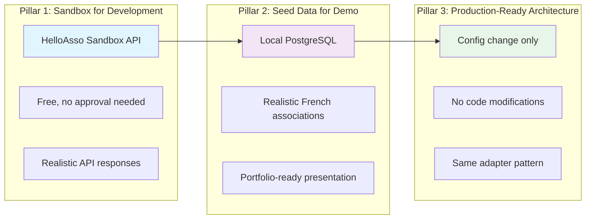

#### Pillar 1 -- Sandbox for Development

- **Base URL**: `https://api.helloasso-sandbox.com/v5`
- **Free access**: No HelloAsso approval required for sandbox usage
- **Full API parity**: Sandbox mirrors production API v5 behavior, endpoints, and response schemas
- **Test credentials**: Sandbox client_id and client_secret obtained from HelloAsso developer portal
- **Payment simulation**: Sandbox provides test card numbers for simulating checkout flows without
  real money movement

#### Pillar 2 -- Seed Data for Demo

- **Seeded associations**: Realistic French association data (names, cities, categories, activities)
  is inserted into the local `familyhobbies_associations` database via Liquibase seed changesets
- **Portfolio presentation**: The application can be demonstrated fully offline using seeded data,
  without requiring a live HelloAsso API connection
- **Seed data source**: Data is modeled after real French associations across sport, dance, music,
  theater, and other categories in cities such as Paris, Lyon, Marseille, Toulouse, Bordeaux, and Nantes

#### Pillar 3 -- Production-Ready Architecture

- **Switching to production** requires only two changes:
  1. Update `HELLOASSO_BASE_URL` from `https://api.helloasso-sandbox.com/v5` to `https://api.helloasso.com/v5`
  2. Replace sandbox credentials with production `HELLOASSO_CLIENT_ID` and `HELLOASSO_CLIENT_SECRET`
- **No code changes**: The adapter pattern ensures all HelloAsso interactions are behind environment-driven
  configuration. The same `HelloAssoClient`, `HelloAssoTokenManager`, `HelloAssoCheckoutClient`, and
  `HelloAssoWebhookHandler` classes work identically in sandbox and production.

---

## 2. What HelloAsso Handles vs What We Handle

The following matrix shows the clear division of responsibilities between HelloAsso (external platform)
and Family Hobbies Manager (our application). Our value-add is everything HelloAsso does **not** provide.

| Feature | HelloAsso | Our App | Details |
|----|:----:|:----:|-----|
| **Association directory** | YES (API search) | Local cache + search UX | HelloAsso provides `POST /directory/organizations`. We cache results in `t_association` and add a rich search UI with filters by city, postal code, category, and activity type. |
| **Organization profiles** | YES (API) | Enhanced with our data | HelloAsso returns basic org profiles via `GET /organizations/{slug}`. We enrich them with activities, sessions, ratings, and subscription counts from our local database. |
| **Payment processing** | YES (Checkout) | Orchestration + family grouping | HelloAsso handles the actual payment flow via checkout intents. We orchestrate the end-to-end lifecycle: initiate checkout, track status, link to subscriptions, and group by family. |
| **Membership forms** | YES | Subscription tracking + multi-assoc dashboard | HelloAsso manages adhesion and cotisation forms. We track which family member is subscribed to which association/activity and present a unified dashboard. |
| **Family grouping** | NO | **YES (core value-add)** | HelloAsso has no concept of families. We let parents create family groups, add members (children, spouse), and manage all their activities in one place. |
| **Attendance tracking** | NO | **YES (core value-add)** | HelloAsso does not track session attendance. We provide per-session attendance marking with present/absent/excused statuses, attendance rates, and absence threshold alerts. |
| **Course scheduling** | NO | **YES (core value-add)** | HelloAsso does not manage recurring session schedules. We provide session creation with recurrence patterns, calendar views, instructor assignment, and location management. |
| **Cross-association dashboard** | NO | **YES (core value-add)** | HelloAsso shows data per-organization only. We aggregate subscriptions, sessions, payments, and attendance across all associations a family belongs to into a single dashboard. |
| **Notification orchestration** | NO | **YES (Kafka-driven)** | HelloAsso sends webhooks for payment events only. We orchestrate multi-channel notifications (email, in-app) for registrations, payments, attendance, session reminders, and more -- all driven by Kafka events. |
| **RGPD compliance UI** | NO | **YES** | HelloAsso manages its own data obligations. We provide a full RGPD-compliant interface: data export (Art. 20), data deletion (Art. 17), consent management, and audit trails for all user data in our system. |

### Value Proposition Diagram

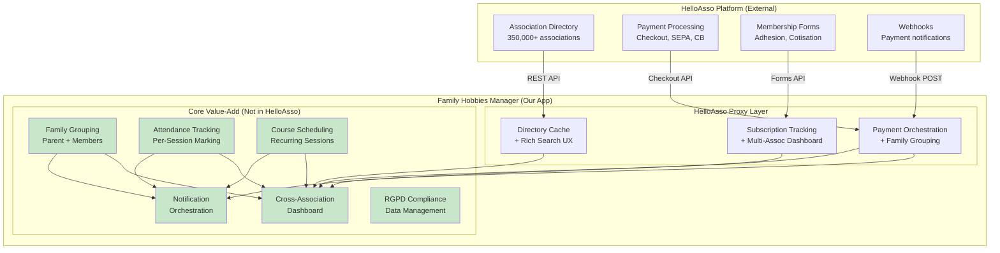

---

## 3. HelloAsso API v5 Endpoints Used

The following table lists every HelloAsso API v5 endpoint consumed by our application, the HTTP
method, which of our microservices calls it, and the purpose.

| Endpoint | Method | Service | Description |
|----|----|----|-----|
| `/oauth2/token` | POST | association-service, payment-service | Obtain OAuth2 access token using `client_credentials` grant type. Both services maintain their own token lifecycle via `HelloAssoTokenManager`. |
| `/v5/directory/organizations` | POST | association-service | Search the HelloAsso association directory. Accepts filters such as name, city, postal code, category. Returns paginated list of organizations. |
| `/v5/organizations/{slug}` | GET | association-service | Retrieve full public profile of a specific organization by its HelloAsso slug. Includes name, description, logo, location, fiscal information. |
| `/v5/organizations/{slug}/forms` | GET | association-service | List all forms (adhesion, event, membership, donation) published by an organization. Used to discover available subscription options. |
| `/v5/organizations/{slug}/forms/{formType}/{formSlug}` | GET | association-service | Retrieve details of a specific form, including pricing tiers, custom fields, and availability dates. |
| `/v5/organizations/{slug}/forms/{formType}/{formSlug}/payments` | GET | payment-service | Retrieve all payments received for a specific form. Used for reconciliation and payment history display. |
| `/v5/organizations/{slug}/checkout-intents` | POST | payment-service | Initiate a new checkout session. HelloAsso returns a `redirectUrl` where the user completes payment. |
| `/v5/organizations/{slug}/checkout-intents/{checkoutIntentId}` | GET | payment-service | Retrieve the status of a previously initiated checkout intent. Used for polling and status verification. |

### Request/Response Flow

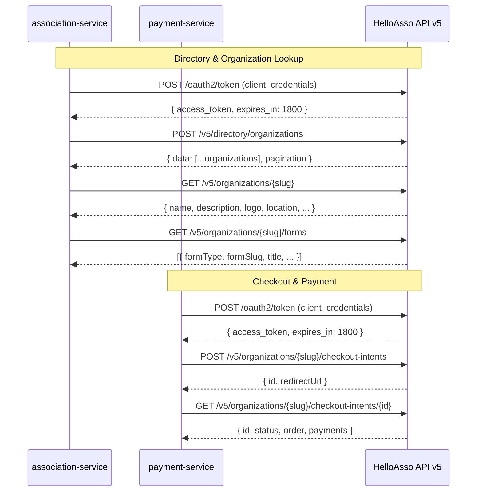

### HelloAsso API Response Structures

#### Directory Search Response

```json
{
  "data": [
    {
      "name": "Association Sportive de Lyon",
      "slug": "association-sportive-de-lyon",
      "city": "Lyon",
      "zipCode": "69001",
      "description": "Club multisport familial",
      "logo": "https://cdn.helloasso.com/img/logos/...",
      "category": "Sport",
      "createdDate": "2019-05-15T00:00:00+02:00",
      "updatedDate": "2025-11-20T14:30:00+01:00"
    }
  ],
  "pagination": {
    "pageSize": 20,
    "totalCount": 142,
    "pageIndex": 1,
    "totalPages": 8,
    "continuationToken": "abc123..."
  }
}
```

#### Checkout Intent Response

```json
{
  "id": 123456,
  "redirectUrl": "https://www.helloasso-sandbox.com/checkout/123456",
  "order": {
    "id": 789012,
    "formSlug": "adhesion-2025-2026",
    "formType": "Membership",
    "organizationSlug": "association-sportive-de-lyon"
  },
  "metadata": {
    "reference": "FHM-SUB-00042",
    "userId": "550e8400-e29b-41d4-a716-446655440000"
  }
}
```

---

## 4. OAuth2 Authentication Flow

HelloAsso API v5 uses the **OAuth2 `client_credentials`** grant type. This is a machine-to-machine
flow -- no user interaction is required for our backend services to authenticate with HelloAsso.

### Token Lifecycle

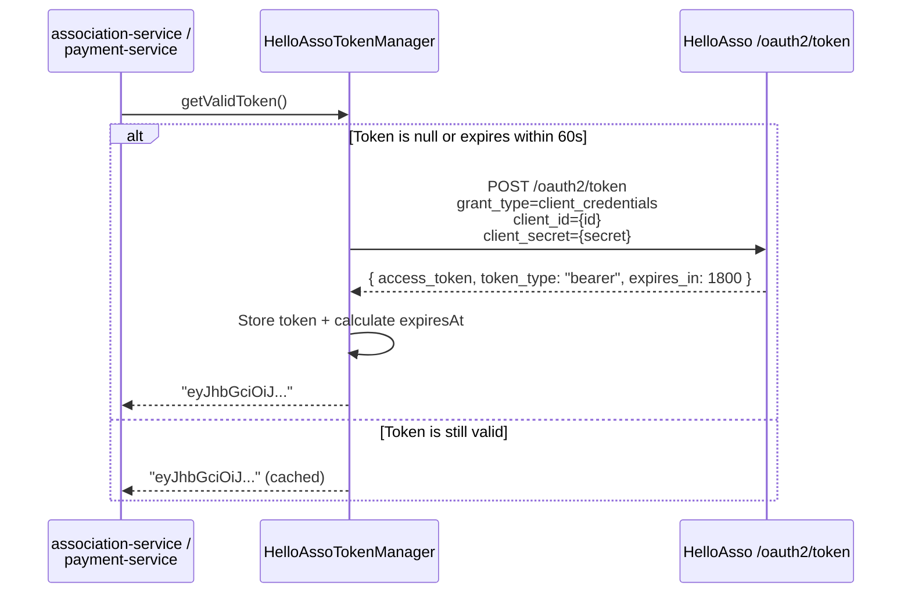

### Token Request Details

| Parameter | Value |
|----|-----|
| **Endpoint** | `{base_url}/oauth2/token` (base_url excludes `/v5`) |
| **Method** | `POST` |
| **Content-Type** | `application/x-www-form-urlencoded` |
| **grant_type** | `client_credentials` |
| **client_id** | From `HELLOASSO_CLIENT_ID` environment variable |
| **client_secret** | From `HELLOASSO_CLIENT_SECRET` environment variable |

### Token Response

```json
{
  "access_token": "eyJhbGciOiJSUzI1NiIsInR5cCI6IkpXVCJ9...",
  "token_type": "bearer",
  "expires_in": 1800
}
```

- **`expires_in`**: Token validity in seconds (1800 = 30 minutes)
- **Refresh strategy**: Token is refreshed **60 seconds before expiry** to avoid request failures
  during the refresh window
- **Storage**: Token is stored **in memory only** -- never persisted to database or filesystem

### HelloAssoTokenManager.java -- Full Implementation

```java
package com.familyhobbies.associationservice.adapter;

import com.familyhobbies.associationservice.config.HelloAssoProperties;
import com.familyhobbies.associationservice.exception.HelloAssoApiException;
import lombok.extern.slf4j.Slf4j;
import org.springframework.http.MediaType;
import org.springframework.stereotype.Component;
import org.springframework.web.reactive.function.BodyInserters;
import org.springframework.web.reactive.function.client.WebClient;
import reactor.core.publisher.Mono;

import java.time.Instant;

@Component
@Slf4j
public class HelloAssoTokenManager {

    private final WebClient tokenWebClient;
    private final HelloAssoProperties properties;

    private String accessToken;
    private Instant tokenExpiresAt;

    private static final int REFRESH_BUFFER_SECONDS = 60;

    public HelloAssoTokenManager(WebClient.Builder webClientBuilder,
                                  HelloAssoProperties properties) {
        this.properties = properties;
        this.tokenWebClient = webClientBuilder
                .baseUrl(properties.getTokenUrl())
                .build();
    }

    /**
     * Returns a valid OAuth2 access token, refreshing it if expired or about to expire.
     * Thread-safe via synchronized block.
     */
    public synchronized String getValidToken() {
        if (isTokenExpiredOrAboutToExpire()) {
            refreshToken();
        }
        return accessToken;
    }

    /**
     * Forces a token refresh. Called when a 401 is received from HelloAsso API,
     * indicating the token was revoked or invalidated server-side.
     */
    public synchronized void forceRefresh() {
        log.info("Forcing HelloAsso token refresh");
        refreshToken();
    }

    private boolean isTokenExpiredOrAboutToExpire() {
        return accessToken == null
                || tokenExpiresAt == null
                || Instant.now().isAfter(tokenExpiresAt.minusSeconds(REFRESH_BUFFER_SECONDS));
    }

    private void refreshToken() {
        log.debug("Refreshing HelloAsso OAuth2 token");

        HelloAssoTokenResponse response = tokenWebClient.post()
                .contentType(MediaType.APPLICATION_FORM_URLENCODED)
                .body(BodyInserters
                        .fromFormData("grant_type", "client_credentials")
                        .with("client_id", properties.getClientId())
                        .with("client_secret", properties.getClientSecret()))
                .retrieve()
                .onStatus(
                        status -> status.is4xxClientError() || status.is5xxServerError(),
                        clientResponse -> clientResponse.bodyToMono(String.class)
                                .flatMap(body -> Mono.error(new HelloAssoApiException(
                                        "Failed to obtain HelloAsso token: " + body)))
                )
                .bodyToMono(HelloAssoTokenResponse.class)
                .block();

        if (response == null || response.accessToken() == null) {
            throw new HelloAssoApiException("HelloAsso token response is null or missing access_token");
        }

        this.accessToken = response.accessToken();
        this.tokenExpiresAt = Instant.now().plusSeconds(response.expiresIn());

        log.info("HelloAsso token refreshed successfully, expires at {}", tokenExpiresAt);
    }

    /**
     * Internal record for deserializing the OAuth2 token response.
     */
    private record HelloAssoTokenResponse(
            @com.fasterxml.jackson.annotation.JsonProperty("access_token") String accessToken,
            @com.fasterxml.jackson.annotation.JsonProperty("token_type") String tokenType,
            @com.fasterxml.jackson.annotation.JsonProperty("expires_in") long expiresIn
    ) {}
}
```

### HelloAssoProperties.java -- Configuration Binding

```java
package com.familyhobbies.associationservice.config;

import lombok.Getter;
import lombok.Setter;
import org.springframework.boot.context.properties.ConfigurationProperties;
import org.springframework.stereotype.Component;
import org.springframework.validation.annotation.Validated;

import jakarta.validation.constraints.NotBlank;
import jakarta.validation.constraints.Positive;

@Component
@ConfigurationProperties(prefix = "helloasso")
@Validated
@Getter
@Setter
public class HelloAssoProperties {

    @NotBlank
    private String baseUrl;

    @NotBlank
    private String clientId;

    @NotBlank
    private String clientSecret;

    @NotBlank
    private String tokenUrl;

    private String webhookSecret;

    @Positive
    private int connectTimeout = 5000;

    @Positive
    private int readTimeout = 10000;
}
```

---

## 5. Adapter Pattern Implementation

All HelloAsso interactions are encapsulated in **adapter** classes. This isolates the business
logic in service classes from the details of the external API. The adapter pattern also makes
testing straightforward: integration tests replace adapters with mocks or WireMock stubs.

### Component Diagram

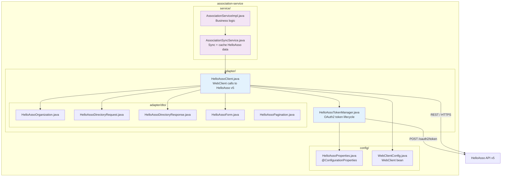

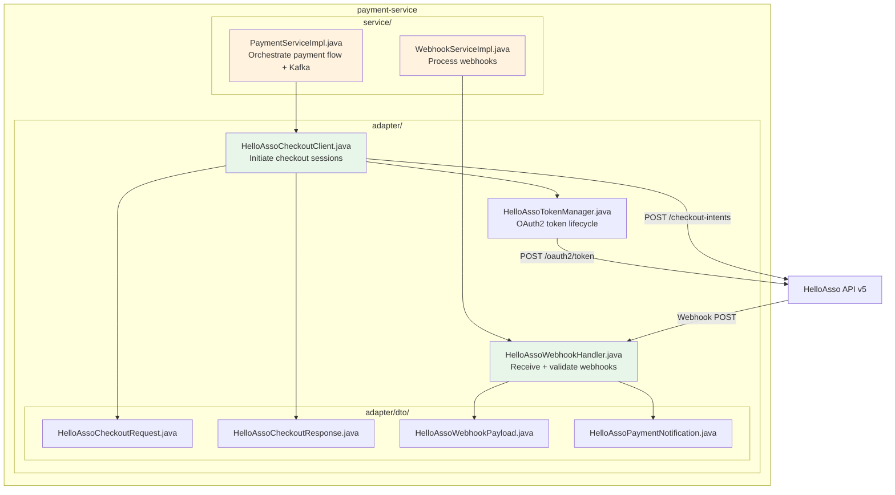

### File Structure

```
association-service/
  src/main/java/com/familyhobbies/associationservice/
  +-- adapter/
  |   +-- HelloAssoClient.java               <-- WebClient calls to HelloAsso v5
  |   +-- HelloAssoTokenManager.java         <-- OAuth2 token lifecycle
  |   +-- dto/
  |       +-- HelloAssoOrganization.java      <-- Maps HelloAsso org JSON response
  |       +-- HelloAssoDirectoryRequest.java  <-- Search request body
  |       +-- HelloAssoDirectoryResponse.java <-- Paginated search response
  |       +-- HelloAssoForm.java              <-- Form (adhesion/event) response
  |       +-- HelloAssoPagination.java        <-- Pagination metadata
  +-- service/
  |   +-- AssociationSyncService.java         <-- Sync + cache HelloAsso data locally
  |   +-- impl/
  |       +-- AssociationSyncServiceImpl.java
  +-- config/
      +-- HelloAssoProperties.java            <-- @ConfigurationProperties binding
      +-- WebClientConfig.java                <-- WebClient bean with timeouts

payment-service/
  src/main/java/com/familyhobbies/paymentservice/
  +-- adapter/
  |   +-- HelloAssoCheckoutClient.java        <-- Initiate checkout sessions
  |   +-- HelloAssoWebhookHandler.java        <-- Receive + validate webhooks
  |   +-- HelloAssoTokenManager.java          <-- OAuth2 token lifecycle (own instance)
  |   +-- dto/
  |       +-- HelloAssoCheckoutRequest.java   <-- Checkout initiation request
  |       +-- HelloAssoCheckoutResponse.java  <-- Checkout response with redirectUrl
  |       +-- HelloAssoWebhookPayload.java    <-- Incoming webhook payload
  |       +-- HelloAssoPaymentNotification.java <-- Payment event from webhook
  +-- service/
  |   +-- PaymentService.java
  |   +-- WebhookService.java
  |   +-- impl/
  |       +-- PaymentServiceImpl.java         <-- Orchestrate payment flow + Kafka
  |       +-- WebhookServiceImpl.java         <-- Process and dispatch webhooks
  +-- config/
      +-- HelloAssoProperties.java
      +-- WebClientConfig.java
```

### Adapter DTOs

#### HelloAssoOrganization.java

```java
package com.familyhobbies.associationservice.adapter.dto;

import com.fasterxml.jackson.annotation.JsonProperty;
import lombok.Builder;

import java.time.OffsetDateTime;

@Builder
public record HelloAssoOrganization(
        String name,
        String slug,
        String city,
        @JsonProperty("zipCode") String postalCode,
        String description,
        String logo,
        String category,
        @JsonProperty("createdDate") OffsetDateTime createdDate,
        @JsonProperty("updatedDate") OffsetDateTime updatedDate,
        String url,
        String type
) {}
```

#### HelloAssoDirectoryRequest.java

```java
package com.familyhobbies.associationservice.adapter.dto;

import com.fasterxml.jackson.annotation.JsonInclude;
import lombok.Builder;

@Builder
@JsonInclude(JsonInclude.Include.NON_NULL)
public record HelloAssoDirectoryRequest(
        String name,
        String city,
        String zipCode,
        String category,
        Integer pageSize,
        Integer pageIndex,
        String continuationToken
) {}
```

#### HelloAssoDirectoryResponse.java

```java
package com.familyhobbies.associationservice.adapter.dto;

import java.util.List;

public record HelloAssoDirectoryResponse(
        List<HelloAssoOrganization> data,
        HelloAssoPagination pagination
) {}
```

#### HelloAssoPagination.java

```java
package com.familyhobbies.associationservice.adapter.dto;

public record HelloAssoPagination(
        int pageSize,
        int totalCount,
        int pageIndex,
        int totalPages,
        String continuationToken
) {}
```

#### HelloAssoForm.java

```java
package com.familyhobbies.associationservice.adapter.dto;

import com.fasterxml.jackson.annotation.JsonProperty;
import lombok.Builder;

import java.time.OffsetDateTime;

@Builder
public record HelloAssoForm(
        @JsonProperty("formSlug") String slug,
        @JsonProperty("formType") String type,
        String title,
        String description,
        String state,
        @JsonProperty("startDate") OffsetDateTime startDate,
        @JsonProperty("endDate") OffsetDateTime endDate,
        String url
) {}
```

---

## 6. HelloAssoClient.java -- Full Implementation

The `HelloAssoClient` is the primary adapter for all HelloAsso API v5 calls made by the
`association-service`. It uses Spring WebFlux `WebClient` for non-blocking HTTP calls and
delegates token management to `HelloAssoTokenManager`.

```java
package com.familyhobbies.associationservice.adapter;

import com.familyhobbies.associationservice.adapter.dto.HelloAssoDirectoryRequest;
import com.familyhobbies.associationservice.adapter.dto.HelloAssoDirectoryResponse;
import com.familyhobbies.associationservice.adapter.dto.HelloAssoForm;
import com.familyhobbies.associationservice.adapter.dto.HelloAssoOrganization;
import com.familyhobbies.associationservice.config.HelloAssoProperties;
import com.familyhobbies.associationservice.exception.HelloAssoApiException;
import lombok.extern.slf4j.Slf4j;
import org.springframework.http.HttpHeaders;
import org.springframework.http.HttpStatusCode;
import org.springframework.stereotype.Component;
import org.springframework.web.reactive.function.client.ClientResponse;
import org.springframework.web.reactive.function.client.WebClient;
import reactor.core.publisher.Mono;

import java.util.List;

@Component
@Slf4j
public class HelloAssoClient {

    private final WebClient webClient;
    private final HelloAssoTokenManager tokenManager;

    public HelloAssoClient(WebClient.Builder webClientBuilder,
                            HelloAssoProperties properties,
                            HelloAssoTokenManager tokenManager) {
        this.tokenManager = tokenManager;
        this.webClient = webClientBuilder
                .baseUrl(properties.getBaseUrl())
                .defaultHeader(HttpHeaders.CONTENT_TYPE, "application/json")
                .build();
    }

    /**
     * Search the HelloAsso association directory.
     *
     * @param request Search criteria (name, city, zipCode, category, pagination)
     * @return Paginated list of organizations matching the criteria
     */
    public Mono<HelloAssoDirectoryResponse> searchOrganizations(HelloAssoDirectoryRequest request) {
        log.debug("Searching HelloAsso directory: name={}, city={}, category={}",
                request.name(), request.city(), request.category());

        return webClient.post()
                .uri("/directory/organizations")
                .header(HttpHeaders.AUTHORIZATION, "Bearer " + tokenManager.getValidToken())
                .bodyValue(request)
                .retrieve()
                .onStatus(HttpStatusCode::is4xxClientError, this::handle4xxError)
                .onStatus(HttpStatusCode::is5xxServerError, this::handle5xxError)
                .bodyToMono(HelloAssoDirectoryResponse.class)
                .doOnSuccess(response -> log.debug("HelloAsso directory returned {} results",
                        response != null && response.data() != null ? response.data().size() : 0))
                .doOnError(error -> log.error("HelloAsso directory search failed", error));
    }

    /**
     * Retrieve full details of a specific organization by its HelloAsso slug.
     *
     * @param slug The unique HelloAsso slug for the organization
     * @return Organization details
     */
    public Mono<HelloAssoOrganization> getOrganization(String slug) {
        log.debug("Fetching HelloAsso organization: slug={}", slug);

        return webClient.get()
                .uri("/organizations/{slug}", slug)
                .header(HttpHeaders.AUTHORIZATION, "Bearer " + tokenManager.getValidToken())
                .retrieve()
                .onStatus(HttpStatusCode::is4xxClientError, this::handle4xxError)
                .onStatus(HttpStatusCode::is5xxServerError, this::handle5xxError)
                .bodyToMono(HelloAssoOrganization.class)
                .doOnSuccess(org -> log.debug("Fetched organization: {}", org != null ? org.name() : "null"))
                .doOnError(error -> log.error("Failed to fetch organization: slug={}", slug, error));
    }

    /**
     * List all forms published by an organization.
     *
     * @param slug The unique HelloAsso slug for the organization
     * @return List of forms (adhesion, event, membership, donation)
     */
    public Mono<List<HelloAssoForm>> getOrganizationForms(String slug) {
        log.debug("Fetching forms for organization: slug={}", slug);

        return webClient.get()
                .uri("/organizations/{slug}/forms", slug)
                .header(HttpHeaders.AUTHORIZATION, "Bearer " + tokenManager.getValidToken())
                .retrieve()
                .onStatus(HttpStatusCode::is4xxClientError, this::handle4xxError)
                .onStatus(HttpStatusCode::is5xxServerError, this::handle5xxError)
                .bodyToFlux(HelloAssoForm.class)
                .collectList()
                .doOnSuccess(forms -> log.debug("Fetched {} forms for organization: {}",
                        forms != null ? forms.size() : 0, slug))
                .doOnError(error -> log.error("Failed to fetch forms: slug={}", slug, error));
    }

    /**
     * Retrieve details of a specific form.
     *
     * @param orgSlug  The organization slug
     * @param formType The form type (Membership, Event, Donation, etc.)
     * @param formSlug The form slug
     * @return Form details
     */
    public Mono<HelloAssoForm> getForm(String orgSlug, String formType, String formSlug) {
        log.debug("Fetching form: org={}, type={}, form={}", orgSlug, formType, formSlug);

        return webClient.get()
                .uri("/organizations/{orgSlug}/forms/{formType}/{formSlug}",
                        orgSlug, formType, formSlug)
                .header(HttpHeaders.AUTHORIZATION, "Bearer " + tokenManager.getValidToken())
                .retrieve()
                .onStatus(HttpStatusCode::is4xxClientError, this::handle4xxError)
                .onStatus(HttpStatusCode::is5xxServerError, this::handle5xxError)
                .bodyToMono(HelloAssoForm.class)
                .doOnError(error -> log.error("Failed to fetch form: org={}, type={}, form={}",
                        orgSlug, formType, formSlug, error));
    }

    // ---- Error Handling ----

    private Mono<? extends Throwable> handle4xxError(ClientResponse response) {
        return response.bodyToMono(String.class)
                .defaultIfEmpty("No response body")
                .flatMap(body -> {
                    log.warn("HelloAsso API 4xx error: status={}, body={}", response.statusCode(), body);
                    if (response.statusCode().value() == 401) {
                        log.info("Received 401 from HelloAsso -- forcing token refresh");
                        tokenManager.forceRefresh();
                        return Mono.error(new HelloAssoApiException(
                                "HelloAsso authentication failed (401). Token has been refreshed. " +
                                "Retry the request."));
                    }
                    return Mono.error(new HelloAssoApiException(
                            "HelloAsso API client error: " + response.statusCode() + " - " + body));
                });
    }

    private Mono<? extends Throwable> handle5xxError(ClientResponse response) {
        return response.bodyToMono(String.class)
                .defaultIfEmpty("No response body")
                .flatMap(body -> {
                    log.error("HelloAsso API 5xx error: status={}, body={}", response.statusCode(), body);
                    return Mono.error(new HelloAssoApiException(
                            "HelloAsso API server error: " + response.statusCode() + " - " + body));
                });
    }
}
```

### WebClientConfig.java

```java
package com.familyhobbies.associationservice.config;

import io.netty.channel.ChannelOption;
import io.netty.handler.timeout.ReadTimeoutHandler;
import io.netty.handler.timeout.WriteTimeoutHandler;
import org.springframework.context.annotation.Bean;
import org.springframework.context.annotation.Configuration;
import org.springframework.http.client.reactive.ReactorClientHttpConnector;
import org.springframework.web.reactive.function.client.ExchangeFilterFunction;
import org.springframework.web.reactive.function.client.WebClient;
import reactor.netty.http.client.HttpClient;

import java.time.Duration;
import java.util.concurrent.TimeUnit;

@Configuration
public class WebClientConfig {

    private final HelloAssoProperties properties;

    public WebClientConfig(HelloAssoProperties properties) {
        this.properties = properties;
    }

    @Bean
    public WebClient.Builder webClientBuilder() {
        HttpClient httpClient = HttpClient.create()
                .option(ChannelOption.CONNECT_TIMEOUT_MILLIS, properties.getConnectTimeout())
                .responseTimeout(Duration.ofMillis(properties.getReadTimeout()))
                .doOnConnected(conn -> conn
                        .addHandlerLast(new ReadTimeoutHandler(
                                properties.getReadTimeout(), TimeUnit.MILLISECONDS))
                        .addHandlerLast(new WriteTimeoutHandler(
                                properties.getReadTimeout(), TimeUnit.MILLISECONDS)));

        return WebClient.builder()
                .clientConnector(new ReactorClientHttpConnector(httpClient))
                .filter(logRequest())
                .filter(logResponse());
    }

    private ExchangeFilterFunction logRequest() {
        return ExchangeFilterFunction.ofRequestProcessor(request -> {
            org.slf4j.LoggerFactory.getLogger("HelloAssoHttpClient")
                    .debug("Request: {} {}", request.method(), request.url());
            return reactor.core.publisher.Mono.just(request);
        });
    }

    private ExchangeFilterFunction logResponse() {
        return ExchangeFilterFunction.ofResponseProcessor(response -> {
            org.slf4j.LoggerFactory.getLogger("HelloAssoHttpClient")
                    .debug("Response: status={}", response.statusCode());
            return reactor.core.publisher.Mono.just(response);
        });
    }
}
```

---

## 7. Association Sync Service -- Data Caching Strategy

The `AssociationSyncService` bridges HelloAsso directory data and our local database. It ensures
that association data is always available locally -- even when HelloAsso API is down -- while keeping
it reasonably fresh.

### Sync Strategy Overview

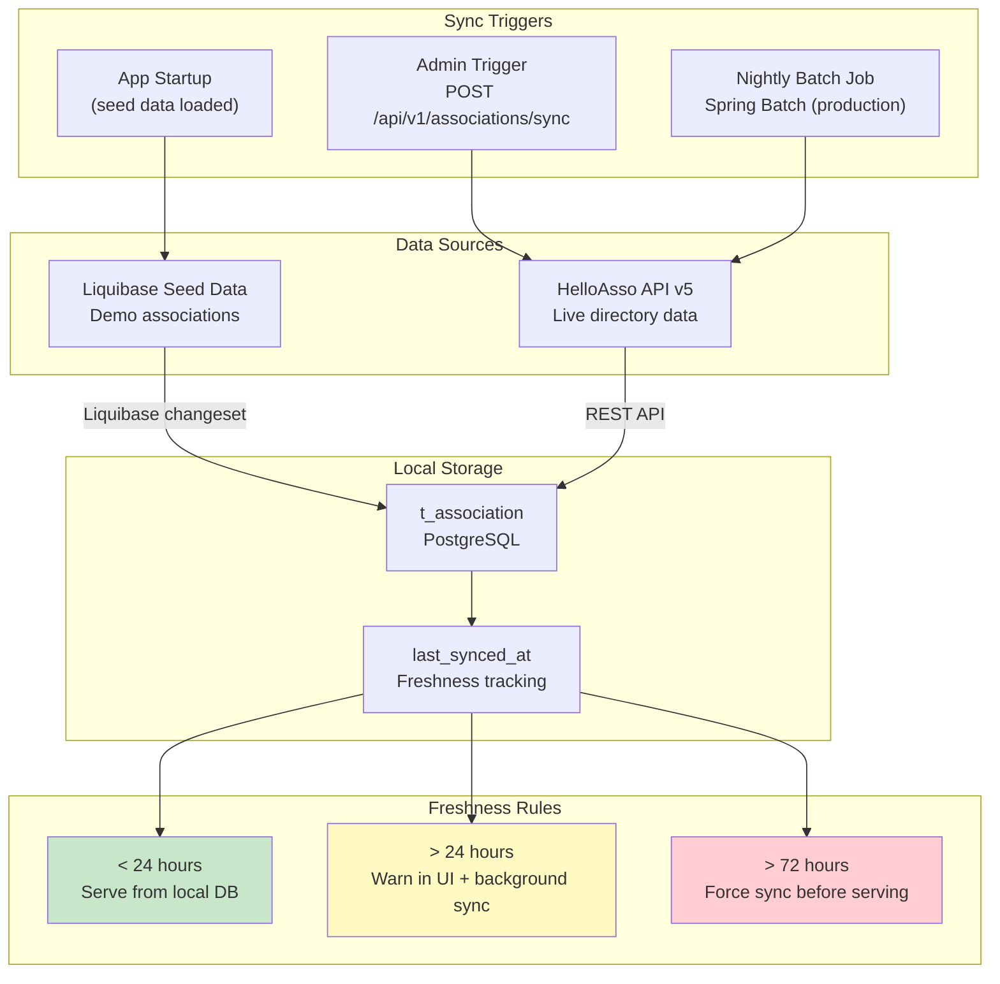

### Sync Modes

| Mode | Trigger | Source | Behavior |
|----|----|----|-----|
| **Seed on startup** | Application boot | Liquibase seed changeset | Inserts known French associations into `t_association` for demo and offline usage. Runs once (Liquibase idempotency). |
| **On-demand sync** | `POST /api/v1/associations/sync` | HelloAsso API | Admin-triggered full directory sync. Fetches all matching associations from HelloAsso and upserts into local DB. |
| **Nightly batch sync** | Spring Batch cron (production) | HelloAsso API | Scheduled job running at 02:00 AM. Fetches updated associations since last sync. Updates `last_synced_at`. |
| **On-read lazy sync** | User requests association details | HelloAsso API | If `last_synced_at` for a specific association is older than 24 hours, triggers a background refresh. |

### Database Schema for Sync Tracking

The `t_association` table includes columns to track HelloAsso sync metadata:

```sql
CREATE TABLE t_association (
    id              BIGINT GENERATED ALWAYS AS IDENTITY PRIMARY KEY,
    name            VARCHAR(255)    NOT NULL,
    slug            VARCHAR(255)    NOT NULL,
    helloasso_slug  VARCHAR(255),
    city            VARCHAR(100)    NOT NULL,
    postal_code     VARCHAR(10),
    department      VARCHAR(100),
    category        VARCHAR(50)     NOT NULL,
    description     TEXT,
    logo_url        VARCHAR(500),
    website_url     VARCHAR(500),
    email           VARCHAR(255),
    phone           VARCHAR(20),
    active          BOOLEAN         NOT NULL DEFAULT TRUE,
    synced_from_helloasso BOOLEAN   NOT NULL DEFAULT FALSE,
    last_synced_at  TIMESTAMP WITH TIME ZONE,
    helloasso_created_at TIMESTAMP WITH TIME ZONE,
    helloasso_updated_at TIMESTAMP WITH TIME ZONE,
    created_at      TIMESTAMP WITH TIME ZONE NOT NULL DEFAULT now(),
    updated_at      TIMESTAMP WITH TIME ZONE NOT NULL DEFAULT now(),

    CONSTRAINT uq_association_slug UNIQUE (slug),
    CONSTRAINT uq_association_helloasso_slug UNIQUE (helloasso_slug)
);

CREATE INDEX idx_association_city ON t_association(city);
CREATE INDEX idx_association_category ON t_association(category);
CREATE INDEX idx_association_city_category ON t_association(city, category);
CREATE INDEX idx_association_postal_code ON t_association(postal_code);
CREATE INDEX idx_association_last_synced ON t_association(last_synced_at);
```

### AssociationSyncServiceImpl.java

```java
package com.familyhobbies.associationservice.service.impl;

import com.familyhobbies.associationservice.adapter.HelloAssoClient;
import com.familyhobbies.associationservice.adapter.dto.HelloAssoDirectoryRequest;
import com.familyhobbies.associationservice.adapter.dto.HelloAssoDirectoryResponse;
import com.familyhobbies.associationservice.adapter.dto.HelloAssoOrganization;
import com.familyhobbies.associationservice.entity.Association;
import com.familyhobbies.associationservice.mapper.AssociationMapper;
import com.familyhobbies.associationservice.repository.AssociationRepository;
import com.familyhobbies.associationservice.service.AssociationSyncService;
import lombok.RequiredArgsConstructor;
import lombok.extern.slf4j.Slf4j;
import org.springframework.stereotype.Service;
import org.springframework.transaction.annotation.Transactional;

import java.time.Instant;
import java.time.temporal.ChronoUnit;
import java.util.List;
import java.util.Optional;

@Service
@RequiredArgsConstructor
@Slf4j
public class AssociationSyncServiceImpl implements AssociationSyncService {

    private final HelloAssoClient helloAssoClient;
    private final AssociationRepository associationRepository;
    private final AssociationMapper associationMapper;

    private static final int STALE_THRESHOLD_HOURS = 24;
    private static final int PAGE_SIZE = 20;

    /**
     * Full directory sync: fetches all pages from HelloAsso directory
     * and upserts into local database.
     */
    @Override
    @Transactional
    public int syncFullDirectory() {
        log.info("Starting full HelloAsso directory sync");
        int totalSynced = 0;
        String continuationToken = null;

        do {
            HelloAssoDirectoryRequest request = HelloAssoDirectoryRequest.builder()
                    .pageSize(PAGE_SIZE)
                    .continuationToken(continuationToken)
                    .build();

            HelloAssoDirectoryResponse response = helloAssoClient
                    .searchOrganizations(request)
                    .block();

            if (response == null || response.data() == null || response.data().isEmpty()) {
                break;
            }

            for (HelloAssoOrganization org : response.data()) {
                upsertAssociation(org);
                totalSynced++;
            }

            continuationToken = response.pagination() != null
                    ? response.pagination().continuationToken()
                    : null;

        } while (continuationToken != null);

        log.info("Full directory sync completed: {} associations synced", totalSynced);
        return totalSynced;
    }

    /**
     * Sync a single organization by its HelloAsso slug.
     * Called on-demand when a stale association is requested.
     */
    @Override
    @Transactional
    public Association syncOrganization(String helloassoSlug) {
        log.debug("Syncing single organization: slug={}", helloassoSlug);

        HelloAssoOrganization org = helloAssoClient
                .getOrganization(helloassoSlug)
                .block();

        if (org == null) {
            log.warn("Organization not found on HelloAsso: slug={}", helloassoSlug);
            return null;
        }

        return upsertAssociation(org);
    }

    /**
     * Check if an association's data is stale (older than STALE_THRESHOLD_HOURS).
     */
    @Override
    public boolean isStale(Association association) {
        if (!association.isSyncedFromHelloasso()) {
            return false;
        }
        if (association.getLastSyncedAt() == null) {
            return true;
        }
        return association.getLastSyncedAt()
                .isBefore(Instant.now().minus(STALE_THRESHOLD_HOURS, ChronoUnit.HOURS));
    }

    /**
     * Upsert: update existing association if found by helloasso_slug,
     * otherwise create a new one.
     */
    private Association upsertAssociation(HelloAssoOrganization org) {
        Optional<Association> existing = associationRepository
                .findByHelloassoSlug(org.slug());

        Association association;
        if (existing.isPresent()) {
            association = existing.get();
            associationMapper.updateFromHelloAsso(association, org);
        } else {
            association = associationMapper.fromHelloAsso(org);
        }

        association.setSyncedFromHelloasso(true);
        association.setLastSyncedAt(Instant.now());

        return associationRepository.save(association);
    }
}
```

### Seed Data Example (Liquibase)

```yaml
databaseChangeLog:
  - changeSet:
      id: 010-seed-demo-associations
      author: family-hobbies-team
      context: dev,demo
      comment: "Seed realistic French associations for portfolio demo"
      changes:
        - insert:
            tableName: t_association
            columns:
              - column: { name: name, value: "AS Lyon Multisport" }
              - column: { name: slug, value: "as-lyon-multisport" }
              - column: { name: helloasso_slug, value: "as-lyon-multisport" }
              - column: { name: city, value: "Lyon" }
              - column: { name: postal_code, value: "69001" }
              - column: { name: category, value: "SPORT" }
              - column: { name: description, value: "Club multisport familial proposant football, basketball, natation et gymnastique pour tous les ages." }
              - column: { name: active, valueBoolean: true }
              - column: { name: synced_from_helloasso, valueBoolean: false }
        - insert:
            tableName: t_association
            columns:
              - column: { name: name, value: "Ecole de Danse Classique de Paris" }
              - column: { name: slug, value: "ecole-danse-classique-paris" }
              - column: { name: helloasso_slug, value: "ecole-danse-classique-paris" }
              - column: { name: city, value: "Paris" }
              - column: { name: postal_code, value: "75004" }
              - column: { name: category, value: "DANSE" }
              - column: { name: description, value: "Cours de danse classique, modern jazz et contemporaine pour enfants et adultes." }
              - column: { name: active, valueBoolean: true }
              - column: { name: synced_from_helloasso, valueBoolean: false }
        - insert:
            tableName: t_association
            columns:
              - column: { name: name, value: "Conservatoire Municipal de Musique de Toulouse" }
              - column: { name: slug, value: "conservatoire-musique-toulouse" }
              - column: { name: helloasso_slug, value: "conservatoire-musique-toulouse" }
              - column: { name: city, value: "Toulouse" }
              - column: { name: postal_code, value: "31000" }
              - column: { name: category, value: "MUSIQUE" }
              - column: { name: description, value: "Enseignement musical tous niveaux: piano, violon, guitare, chant, eveil musical." }
              - column: { name: active, valueBoolean: true }
              - column: { name: synced_from_helloasso, valueBoolean: false }
        - insert:
            tableName: t_association
            columns:
              - column: { name: name, value: "Troupe de Theatre Les Planches de Marseille" }
              - column: { name: slug, value: "theatre-planches-marseille" }
              - column: { name: helloasso_slug, value: "theatre-planches-marseille" }
              - column: { name: city, value: "Marseille" }
              - column: { name: postal_code, value: "13001" }
              - column: { name: category, value: "THEATRE" }
              - column: { name: description, value: "Ateliers theatre pour enfants, adolescents et adultes. Improvisation, mise en scene, creation." }
              - column: { name: active, valueBoolean: true }
              - column: { name: synced_from_helloasso, valueBoolean: false }
        - insert:
            tableName: t_association
            columns:
              - column: { name: name, value: "Club Nautique de Bordeaux" }
              - column: { name: slug, value: "club-nautique-bordeaux" }
              - column: { name: helloasso_slug, value: "club-nautique-bordeaux" }
              - column: { name: city, value: "Bordeaux" }
              - column: { name: postal_code, value: "33000" }
              - column: { name: category, value: "SPORT" }
              - column: { name: description, value: "Voile, kayak, aviron et paddle pour toute la famille. Stages vacances et cours hebdomadaires." }
              - column: { name: active, valueBoolean: true }
              - column: { name: synced_from_helloasso, valueBoolean: false }
        - insert:
            tableName: t_association
            columns:
              - column: { name: name, value: "Atelier Arts Plastiques de Nantes" }
              - column: { name: slug, value: "atelier-arts-plastiques-nantes" }
              - column: { name: helloasso_slug, value: "atelier-arts-plastiques-nantes" }
              - column: { name: city, value: "Nantes" }
              - column: { name: postal_code, value: "44000" }
              - column: { name: category, value: "ART" }
              - column: { name: description, value: "Peinture, dessin, sculpture et poterie. Cours pour enfants des 6 ans et adultes tous niveaux." }
              - column: { name: active, valueBoolean: true }
              - column: { name: synced_from_helloasso, valueBoolean: false }
```

---

## 8. Checkout Flow

The checkout flow is the most complex integration point with HelloAsso. It involves the frontend,
payment-service, HelloAsso API, and asynchronous webhook processing.

### End-to-End Sequence Diagram

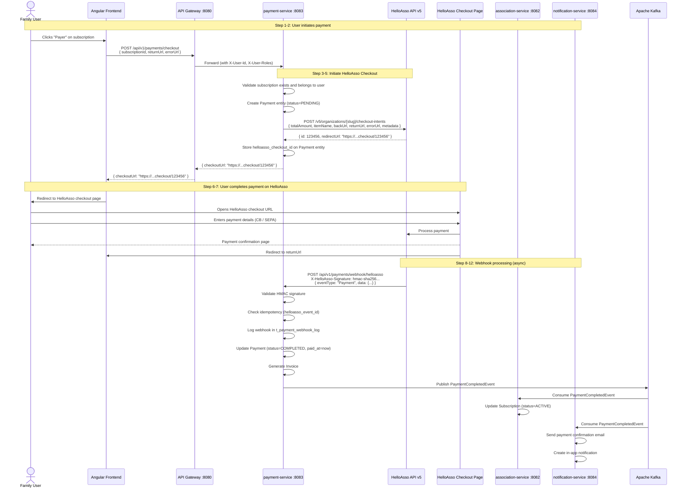

### Checkout Request to HelloAsso

```java
package com.familyhobbies.paymentservice.adapter.dto;

import com.fasterxml.jackson.annotation.JsonProperty;
import lombok.Builder;

import java.util.List;
import java.util.Map;

@Builder
public record HelloAssoCheckoutRequest(
        int totalAmount,             // Amount in cents (e.g., 15000 = 150.00 EUR)
        int initialAmount,           // Initial payment amount in cents
        @JsonProperty("itemName") String itemName,
        @JsonProperty("backUrl") String backUrl,       // URL if user clicks "back"
        @JsonProperty("returnUrl") String returnUrl,   // URL after successful payment
        @JsonProperty("errorUrl") String errorUrl,     // URL after failed payment
        @JsonProperty("containsDonation") boolean containsDonation,
        List<HelloAssoCheckoutPayer> payer,
        Map<String, String> metadata                   // Our reference data
) {}
```

### HelloAssoCheckoutClient.java

```java
package com.familyhobbies.paymentservice.adapter;

import com.familyhobbies.paymentservice.adapter.dto.HelloAssoCheckoutRequest;
import com.familyhobbies.paymentservice.adapter.dto.HelloAssoCheckoutResponse;
import com.familyhobbies.paymentservice.config.HelloAssoProperties;
import com.familyhobbies.paymentservice.exception.CheckoutInitiationException;
import lombok.extern.slf4j.Slf4j;
import org.springframework.http.HttpHeaders;
import org.springframework.http.HttpStatusCode;
import org.springframework.stereotype.Component;
import org.springframework.web.reactive.function.client.WebClient;
import reactor.core.publisher.Mono;

@Component
@Slf4j
public class HelloAssoCheckoutClient {

    private final WebClient webClient;
    private final HelloAssoTokenManager tokenManager;

    public HelloAssoCheckoutClient(WebClient.Builder webClientBuilder,
                                    HelloAssoProperties properties,
                                    HelloAssoTokenManager tokenManager) {
        this.tokenManager = tokenManager;
        this.webClient = webClientBuilder
                .baseUrl(properties.getBaseUrl())
                .build();
    }

    /**
     * Initiate a checkout session with HelloAsso.
     *
     * @param organizationSlug The HelloAsso organization slug
     * @param request          Checkout parameters (amount, item, URLs, metadata)
     * @return Checkout response containing the redirect URL
     */
    public Mono<HelloAssoCheckoutResponse> initiateCheckout(String organizationSlug,
                                                             HelloAssoCheckoutRequest request) {
        log.info("Initiating HelloAsso checkout: org={}, amount={} cents, item={}",
                organizationSlug, request.totalAmount(), request.itemName());

        return webClient.post()
                .uri("/organizations/{slug}/checkout-intents", organizationSlug)
                .header(HttpHeaders.AUTHORIZATION, "Bearer " + tokenManager.getValidToken())
                .bodyValue(request)
                .retrieve()
                .onStatus(HttpStatusCode::is4xxClientError, response ->
                        response.bodyToMono(String.class)
                                .flatMap(body -> Mono.error(new CheckoutInitiationException(
                                        "HelloAsso checkout initiation failed (4xx): " + body))))
                .onStatus(HttpStatusCode::is5xxServerError, response ->
                        response.bodyToMono(String.class)
                                .flatMap(body -> Mono.error(new CheckoutInitiationException(
                                        "HelloAsso checkout initiation failed (5xx): " + body))))
                .bodyToMono(HelloAssoCheckoutResponse.class)
                .doOnSuccess(resp -> log.info("Checkout initiated: id={}, redirectUrl={}",
                        resp.id(), resp.redirectUrl()))
                .doOnError(error -> log.error("Checkout initiation failed: org={}",
                        organizationSlug, error));
    }

    /**
     * Retrieve the status of a checkout intent.
     *
     * @param organizationSlug   The HelloAsso organization slug
     * @param checkoutIntentId   The checkout intent ID
     * @return Updated checkout intent with current status
     */
    public Mono<HelloAssoCheckoutResponse> getCheckoutStatus(String organizationSlug,
                                                              long checkoutIntentId) {
        return webClient.get()
                .uri("/organizations/{slug}/checkout-intents/{id}",
                        organizationSlug, checkoutIntentId)
                .header(HttpHeaders.AUTHORIZATION, "Bearer " + tokenManager.getValidToken())
                .retrieve()
                .bodyToMono(HelloAssoCheckoutResponse.class);
    }
}
```

### HelloAssoCheckoutResponse.java

```java
package com.familyhobbies.paymentservice.adapter.dto;

import com.fasterxml.jackson.annotation.JsonProperty;
import lombok.Builder;

import java.util.Map;

@Builder
public record HelloAssoCheckoutResponse(
        long id,
        @JsonProperty("redirectUrl") String redirectUrl,
        HelloAssoCheckoutOrder order,
        Map<String, String> metadata
) {

    public record HelloAssoCheckoutOrder(
            long id,
            @JsonProperty("formSlug") String formSlug,
            @JsonProperty("formType") String formType,
            @JsonProperty("organizationSlug") String organizationSlug
    ) {}
}
```

### Payment Entity Lifecycle

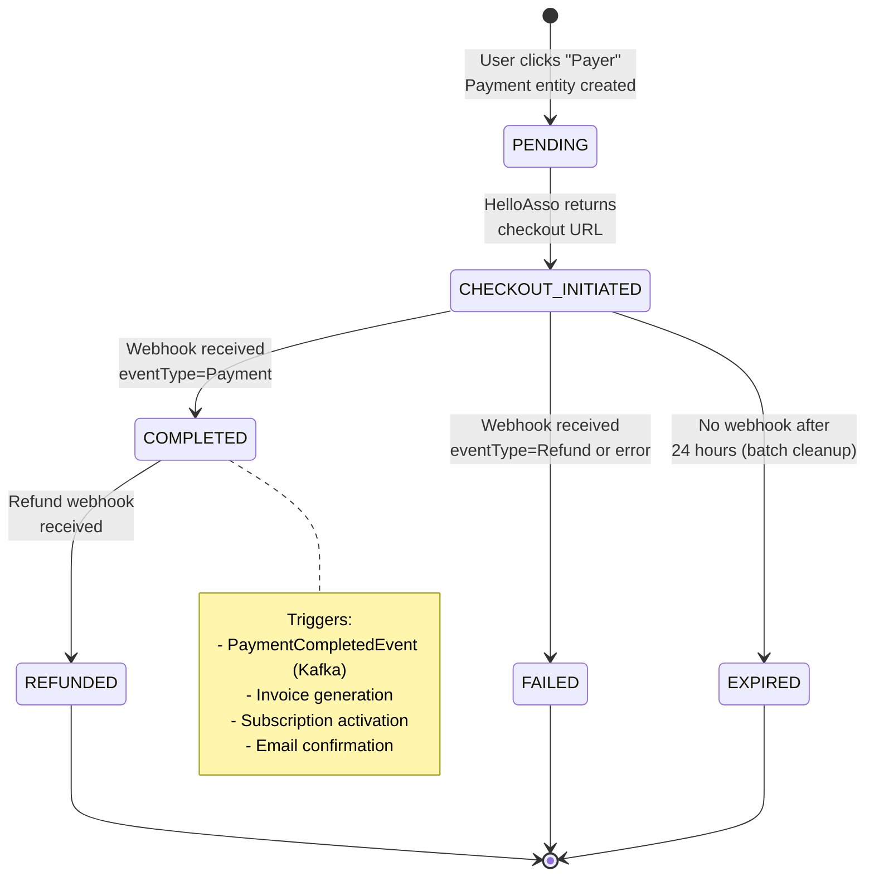

---

## 9. Webhook Handling

HelloAsso sends webhooks to our application when payment events occur. The webhook URL is
registered in the HelloAsso dashboard and points to our payment-service endpoint.

### Webhook Architecture

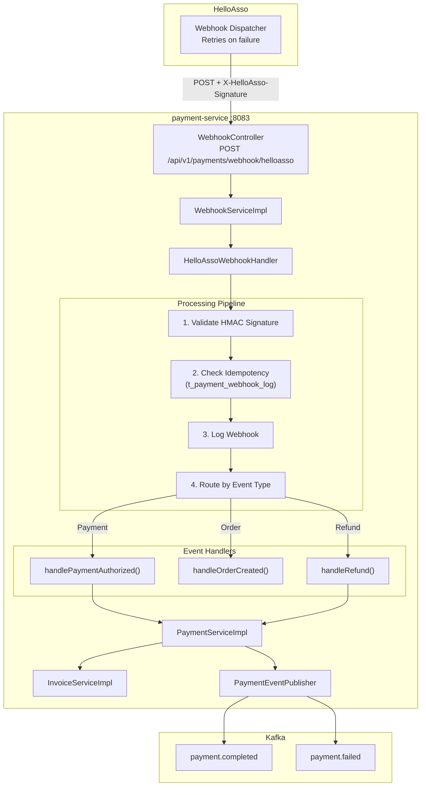

### Webhook Events Handled

| HelloAsso Event Type | Our Handler | Action |
|----|----|----|
| `Payment` | `handlePaymentAuthorized()` | Update Payment status to COMPLETED, generate invoice, publish `PaymentCompletedEvent` |
| `Order` | `handleOrderCreated()` | Log order creation, associate with Payment if not yet linked |
| `Refund` | `handleRefund()` | Update Payment status to REFUNDED, publish `PaymentFailedEvent`, notify user |

### Webhook Security -- HMAC Signature Validation

HelloAsso signs each webhook request with an HMAC-SHA256 signature using a shared secret.
The signature is sent in the `X-HelloAsso-Signature` header.

### HelloAssoWebhookHandler.java

```java
package com.familyhobbies.paymentservice.adapter;

import com.familyhobbies.paymentservice.adapter.dto.HelloAssoPaymentNotification;
import com.familyhobbies.paymentservice.adapter.dto.HelloAssoWebhookPayload;
import com.familyhobbies.paymentservice.config.HelloAssoProperties;
import com.familyhobbies.paymentservice.entity.PaymentWebhookLog;
import com.familyhobbies.paymentservice.exception.WebhookValidationException;
import com.familyhobbies.paymentservice.repository.PaymentWebhookLogRepository;
import com.familyhobbies.paymentservice.service.PaymentService;
import com.fasterxml.jackson.databind.ObjectMapper;
import lombok.RequiredArgsConstructor;
import lombok.extern.slf4j.Slf4j;
import org.springframework.stereotype.Component;

import javax.crypto.Mac;
import javax.crypto.spec.SecretKeySpec;
import java.nio.charset.StandardCharsets;
import java.security.InvalidKeyException;
import java.security.NoSuchAlgorithmException;
import java.time.Instant;
import java.util.Base64;

@Component
@RequiredArgsConstructor
@Slf4j
public class HelloAssoWebhookHandler {

    private final HelloAssoProperties properties;
    private final PaymentWebhookLogRepository webhookLogRepository;
    private final PaymentService paymentService;
    private final ObjectMapper objectMapper;

    private static final String HMAC_ALGORITHM = "HmacSHA256";

    /**
     * Main entry point for processing an incoming HelloAsso webhook.
     * Validates signature, checks idempotency, logs, and dispatches.
     */
    public void handleWebhook(String signature, String rawPayload,
                               HelloAssoWebhookPayload payload) {
        // Step 1: Validate HMAC signature
        validateSignature(signature, rawPayload);

        // Step 2: Idempotency check
        String eventId = payload.getEventId();
        if (isAlreadyProcessed(eventId)) {
            log.info("Webhook already processed, skipping: eventId={}", eventId);
            return;
        }

        // Step 3: Log the webhook
        logWebhook(eventId, payload.getEventType(), rawPayload);

        // Step 4: Route by event type
        log.info("Processing webhook: eventId={}, eventType={}", eventId, payload.getEventType());

        switch (payload.getEventType()) {
            case "Payment" -> handlePaymentAuthorized(payload);
            case "Order" -> handleOrderCreated(payload);
            case "Refund" -> handleRefund(payload);
            default -> log.warn("Unhandled webhook event type: {}", payload.getEventType());
        }

        // Step 5: Mark as processed
        markAsProcessed(eventId);
    }

    /**
     * Validate the HMAC-SHA256 signature from the X-HelloAsso-Signature header.
     */
    private void validateSignature(String signature, String rawPayload) {
        if (signature == null || signature.isBlank()) {
            throw new WebhookValidationException("Missing X-HelloAsso-Signature header");
        }

        try {
            Mac mac = Mac.getInstance(HMAC_ALGORITHM);
            SecretKeySpec secretKey = new SecretKeySpec(
                    properties.getWebhookSecret().getBytes(StandardCharsets.UTF_8),
                    HMAC_ALGORITHM
            );
            mac.init(secretKey);

            byte[] hmacBytes = mac.doFinal(rawPayload.getBytes(StandardCharsets.UTF_8));
            String computedSignature = Base64.getEncoder().encodeToString(hmacBytes);

            if (!computedSignature.equals(signature)) {
                log.warn("Webhook signature mismatch: expected={}, received={}", computedSignature, signature);
                throw new WebhookValidationException("Invalid webhook signature");
            }

            log.debug("Webhook signature validated successfully");

        } catch (NoSuchAlgorithmException | InvalidKeyException e) {
            throw new WebhookValidationException("Failed to compute HMAC signature", e);
        }
    }

    /**
     * Check if this webhook event has already been processed (idempotency).
     */
    private boolean isAlreadyProcessed(String eventId) {
        return webhookLogRepository.existsByHelloassoEventIdAndProcessed(eventId, true);
    }

    /**
     * Log the incoming webhook for audit and debugging.
     */
    private void logWebhook(String eventId, String eventType, String rawPayload) {
        PaymentWebhookLog logEntry = PaymentWebhookLog.builder()
                .helloassoEventId(eventId)
                .eventType(eventType)
                .rawPayload(rawPayload)
                .receivedAt(Instant.now())
                .processed(false)
                .build();
        webhookLogRepository.save(logEntry);
    }

    /**
     * Mark a webhook event as successfully processed.
     */
    private void markAsProcessed(String eventId) {
        webhookLogRepository.findByHelloassoEventId(eventId)
                .ifPresent(logEntry -> {
                    logEntry.setProcessed(true);
                    logEntry.setProcessedAt(Instant.now());
                    webhookLogRepository.save(logEntry);
                });
    }

    // ---- Event-Specific Handlers ----

    private void handlePaymentAuthorized(HelloAssoWebhookPayload payload) {
        log.info("Handling payment authorized: eventId={}", payload.getEventId());
        HelloAssoPaymentNotification paymentData = payload.getPaymentData();
        paymentService.completePayment(
                paymentData.getCheckoutIntentId(),
                paymentData.getAmount(),
                paymentData.getCurrency(),
                paymentData.getPayerEmail()
        );
    }

    private void handleOrderCreated(HelloAssoWebhookPayload payload) {
        log.info("Handling order created: eventId={}", payload.getEventId());
        // Log order association -- no action needed if payment webhook arrives
    }

    private void handleRefund(HelloAssoWebhookPayload payload) {
        log.info("Handling refund: eventId={}", payload.getEventId());
        HelloAssoPaymentNotification paymentData = payload.getPaymentData();
        paymentService.refundPayment(
                paymentData.getCheckoutIntentId(),
                paymentData.getAmount()
        );
    }
}
```

### HelloAssoWebhookPayload.java

```java
package com.familyhobbies.paymentservice.adapter.dto;

import com.fasterxml.jackson.annotation.JsonProperty;
import lombok.Getter;
import lombok.Setter;
import lombok.NoArgsConstructor;
import lombok.AllArgsConstructor;
import lombok.Builder;

@Getter
@Setter
@NoArgsConstructor
@AllArgsConstructor
@Builder
public class HelloAssoWebhookPayload {

    @JsonProperty("eventId")
    private String eventId;

    @JsonProperty("eventType")
    private String eventType;       // "Payment", "Order", "Refund"

    @JsonProperty("data")
    private HelloAssoPaymentNotification paymentData;

    @JsonProperty("metadata")
    private java.util.Map<String, String> metadata;
}
```

### HelloAssoPaymentNotification.java

```java
package com.familyhobbies.paymentservice.adapter.dto;

import com.fasterxml.jackson.annotation.JsonProperty;
import lombok.Getter;
import lombok.Setter;
import lombok.NoArgsConstructor;
import lombok.AllArgsConstructor;
import lombok.Builder;

import java.time.OffsetDateTime;

@Getter
@Setter
@NoArgsConstructor
@AllArgsConstructor
@Builder
public class HelloAssoPaymentNotification {

    @JsonProperty("id")
    private long id;

    @JsonProperty("checkoutIntentId")
    private long checkoutIntentId;

    @JsonProperty("amount")
    private int amount;                // Amount in cents

    @JsonProperty("currency")
    private String currency;           // "EUR"

    @JsonProperty("state")
    private String state;              // "Authorized", "Refused", "Refunded"

    @JsonProperty("payerEmail")
    private String payerEmail;

    @JsonProperty("payerFirstName")
    private String payerFirstName;

    @JsonProperty("payerLastName")
    private String payerLastName;

    @JsonProperty("date")
    private OffsetDateTime date;

    @JsonProperty("formSlug")
    private String formSlug;

    @JsonProperty("formType")
    private String formType;

    @JsonProperty("organizationSlug")
    private String organizationSlug;
}
```

### Webhook Database Schema

```sql
CREATE TABLE t_payment_webhook_log (
    id                  BIGINT GENERATED ALWAYS AS IDENTITY PRIMARY KEY,
    helloasso_event_id  VARCHAR(100)    NOT NULL,
    event_type          VARCHAR(50)     NOT NULL,
    raw_payload         TEXT            NOT NULL,
    processed           BOOLEAN         NOT NULL DEFAULT FALSE,
    received_at         TIMESTAMP WITH TIME ZONE NOT NULL,
    processed_at        TIMESTAMP WITH TIME ZONE,
    error_message       TEXT,
    created_at          TIMESTAMP WITH TIME ZONE NOT NULL DEFAULT now(),

    CONSTRAINT uq_webhook_log_event_id UNIQUE (helloasso_event_id)
);

CREATE INDEX idx_webhook_log_event_type ON t_payment_webhook_log(event_type);
CREATE INDEX idx_webhook_log_processed ON t_payment_webhook_log(processed);
```

### Webhook Retry Behavior

HelloAsso retries failed webhooks with the following schedule:

| Attempt | Delay | Total Elapsed |
|:----:|----|----|
| 1 | Immediate | 0 min |
| 2 | 5 minutes | 5 min |
| 3 | 30 minutes | 35 min |
| 4 | 2 hours | 2h 35min |
| 5 | 12 hours | 14h 35min |

Our webhook endpoint must return HTTP `200` within 10 seconds to signal successful receipt.
Any non-2xx response or timeout triggers a retry.

---

## 10. Environment Configuration

### Environment Matrix

| Environment | Base URL | Token URL | Credentials Source | Notes |
|----|----|----|----|-----|
| **Local dev** | `https://api.helloasso-sandbox.com/v5` | `https://api.helloasso-sandbox.com/oauth2/token` | `.env.local` file (gitignored) | Free sandbox, no approval needed. Test card numbers available. |
| **CI / Test** | Mocked (WireMock) | Mocked (WireMock) | N/A | No real API calls. WireMock stubs return predefined responses. |
| **Staging** | `https://api.helloasso-sandbox.com/v5` | `https://api.helloasso-sandbox.com/oauth2/token` | CI/CD secrets | Same sandbox as dev, but deployed to staging infrastructure. |
| **Production** | `https://api.helloasso.com/v5` | `https://api.helloasso.com/oauth2/token` | Secrets manager (Vault/AWS SM) | Requires HelloAsso production approval and contract. |

### application.yml (association-service)

```yaml
helloasso:
  base-url: ${HELLOASSO_BASE_URL:https://api.helloasso-sandbox.com/v5}
  token-url: ${HELLOASSO_TOKEN_URL:https://api.helloasso-sandbox.com/oauth2/token}
  client-id: ${HELLOASSO_CLIENT_ID}
  client-secret: ${HELLOASSO_CLIENT_SECRET}
  connect-timeout: 5000
  read-timeout: 10000
```

### application.yml (payment-service)

```yaml
helloasso:
  base-url: ${HELLOASSO_BASE_URL:https://api.helloasso-sandbox.com/v5}
  token-url: ${HELLOASSO_TOKEN_URL:https://api.helloasso-sandbox.com/oauth2/token}
  client-id: ${HELLOASSO_CLIENT_ID}
  client-secret: ${HELLOASSO_CLIENT_SECRET}
  webhook-secret: ${HELLOASSO_WEBHOOK_SECRET}
  connect-timeout: 5000
  read-timeout: 10000
```

### .env.local (gitignored)

```bash
# HelloAsso Sandbox Credentials
HELLOASSO_BASE_URL=https://api.helloasso-sandbox.com/v5
HELLOASSO_TOKEN_URL=https://api.helloasso-sandbox.com/oauth2/token
HELLOASSO_CLIENT_ID=your-sandbox-client-id
HELLOASSO_CLIENT_SECRET=your-sandbox-client-secret
HELLOASSO_WEBHOOK_SECRET=your-webhook-signing-secret
```

### Docker Compose Override

```yaml
services:
  association-service:
    environment:
      - HELLOASSO_BASE_URL=${HELLOASSO_BASE_URL}
      - HELLOASSO_TOKEN_URL=${HELLOASSO_TOKEN_URL}
      - HELLOASSO_CLIENT_ID=${HELLOASSO_CLIENT_ID}
      - HELLOASSO_CLIENT_SECRET=${HELLOASSO_CLIENT_SECRET}

  payment-service:
    environment:
      - HELLOASSO_BASE_URL=${HELLOASSO_BASE_URL}
      - HELLOASSO_TOKEN_URL=${HELLOASSO_TOKEN_URL}
      - HELLOASSO_CLIENT_ID=${HELLOASSO_CLIENT_ID}
      - HELLOASSO_CLIENT_SECRET=${HELLOASSO_CLIENT_SECRET}
      - HELLOASSO_WEBHOOK_SECRET=${HELLOASSO_WEBHOOK_SECRET}
```

### Switching from Sandbox to Production

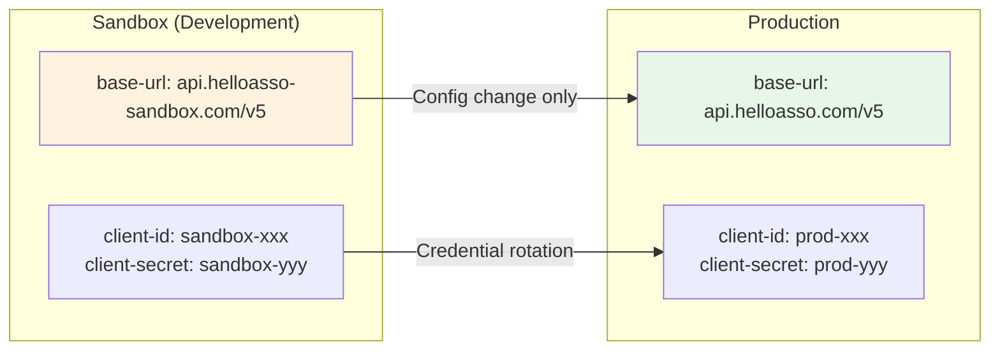

The switch requires **zero code changes**. Only environment variables differ.

---

## 11. Error Handling and Resilience

All HelloAsso API calls are protected by Resilience4j patterns to handle transient failures,
network issues, and HelloAsso service degradation gracefully.

### Resilience Architecture

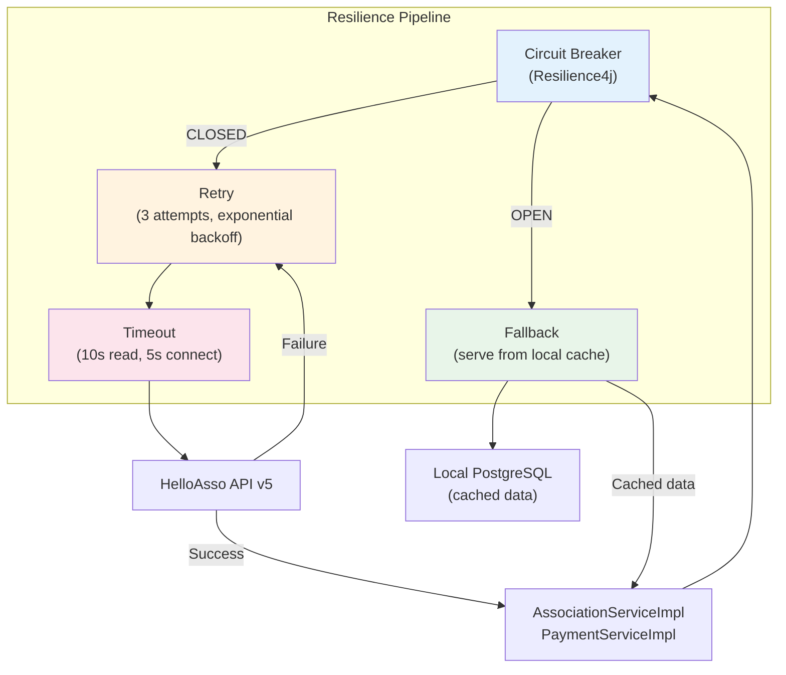

### Circuit Breaker Configuration

```java
package com.familyhobbies.associationservice.config;

import io.github.resilience4j.circuitbreaker.CircuitBreakerConfig;
import io.github.resilience4j.circuitbreaker.CircuitBreakerRegistry;
import io.github.resilience4j.retry.RetryConfig;
import io.github.resilience4j.retry.RetryRegistry;
import org.springframework.context.annotation.Bean;
import org.springframework.context.annotation.Configuration;

import java.time.Duration;

@Configuration
public class ResilienceConfig {

    /**
     * Circuit Breaker for HelloAsso API calls.
     *
     * - CLOSED:     Normal operation. Requests pass through.
     * - OPEN:       After 5 failures in 10 calls (50% failure rate), circuit opens.
     *               All requests are rejected for 30 seconds. Fallback is used.
     * - HALF_OPEN:  After 30 seconds, 3 test requests are allowed through.
     *               If they succeed, circuit closes. If they fail, circuit re-opens.
     */
    @Bean
    public CircuitBreakerRegistry circuitBreakerRegistry() {
        CircuitBreakerConfig config = CircuitBreakerConfig.custom()
                .failureRateThreshold(50)                     // Open at 50% failure rate
                .minimumNumberOfCalls(10)                     // Need at least 10 calls to evaluate
                .slidingWindowType(CircuitBreakerConfig.SlidingWindowType.COUNT_BASED)
                .slidingWindowSize(10)                        // Evaluate last 10 calls
                .waitDurationInOpenState(Duration.ofSeconds(30))  // Stay open for 30s
                .permittedNumberOfCallsInHalfOpenState(3)    // Allow 3 test calls in half-open
                .slowCallRateThreshold(80)                    // Consider 80% slow calls as failure
                .slowCallDurationThreshold(Duration.ofSeconds(5)) // Call is "slow" after 5s
                .recordExceptions(
                        com.familyhobbies.associationservice.exception.HelloAssoApiException.class,
                        org.springframework.web.reactive.function.client.WebClientRequestException.class,
                        java.util.concurrent.TimeoutException.class
                )
                .ignoreExceptions(
                        com.familyhobbies.associationservice.exception.AssociationNotFoundException.class
                )
                .build();

        return CircuitBreakerRegistry.of(config);
    }

    /**
     * Retry configuration for HelloAsso API calls.
     *
     * - Max 3 attempts (1 initial + 2 retries)
     * - Exponential backoff: 500ms, 1000ms, 2000ms
     * - Only retry on transient errors (5xx, timeouts, connection refused)
     */
    @Bean
    public RetryRegistry retryRegistry() {
        RetryConfig config = RetryConfig.custom()
                .maxAttempts(3)
                .waitDuration(Duration.ofMillis(500))
                .enableExponentialBackoff()
                .retryExceptions(
                        com.familyhobbies.associationservice.exception.HelloAssoApiException.class,
                        org.springframework.web.reactive.function.client.WebClientRequestException.class,
                        java.util.concurrent.TimeoutException.class,
                        java.net.ConnectException.class
                )
                .ignoreExceptions(
                        com.familyhobbies.paymentservice.exception.WebhookValidationException.class
                )
                .build();

        return RetryRegistry.of(config);
    }
}
```

### application.yml Resilience4j Configuration

```yaml
resilience4j:
  circuitbreaker:
    instances:
      helloasso-api:
        registerHealthIndicator: true
        slidingWindowSize: 10
        minimumNumberOfCalls: 10
        failureRateThreshold: 50
        waitDurationInOpenState: 30s
        permittedNumberOfCallsInHalfOpenState: 3
        slidingWindowType: COUNT_BASED
        slowCallRateThreshold: 80
        slowCallDurationThreshold: 5s
        recordExceptions:
          - com.familyhobbies.associationservice.exception.HelloAssoApiException
          - org.springframework.web.reactive.function.client.WebClientRequestException
          - java.util.concurrent.TimeoutException
  retry:
    instances:
      helloasso-api:
        maxAttempts: 3
        waitDuration: 500ms
        enableExponentialBackoff: true
        exponentialBackoffMultiplier: 2
        retryExceptions:
          - com.familyhobbies.associationservice.exception.HelloAssoApiException
          - org.springframework.web.reactive.function.client.WebClientRequestException
          - java.util.concurrent.TimeoutException
  timelimiter:
    instances:
      helloasso-api:
        timeoutDuration: 10s
        cancelRunningFuture: true
```

### Using Resilience4j Annotations

```java
package com.familyhobbies.associationservice.service.impl;

import io.github.resilience4j.circuitbreaker.annotation.CircuitBreaker;
import io.github.resilience4j.retry.annotation.Retry;
import io.github.resilience4j.timelimiter.annotation.TimeLimiter;
import lombok.extern.slf4j.Slf4j;

@Service
@RequiredArgsConstructor
@Slf4j
public class AssociationServiceImpl implements AssociationService {

    private final HelloAssoClient helloAssoClient;
    private final AssociationRepository associationRepository;

    private static final String HELLOASSO_CB = "helloasso-api";

    /**
     * Search associations from HelloAsso directory with circuit breaker protection.
     * Falls back to local database search when HelloAsso is unavailable.
     */
    @Override
    @CircuitBreaker(name = HELLOASSO_CB, fallbackMethod = "searchAssociationsFallback")
    @Retry(name = HELLOASSO_CB)
    @TimeLimiter(name = HELLOASSO_CB)
    public CompletableFuture<Page<AssociationResponse>> searchAssociations(
            AssociationSearchRequest request, Pageable pageable) {

        return CompletableFuture.supplyAsync(() -> {
            HelloAssoDirectoryRequest haRequest = HelloAssoDirectoryRequest.builder()
                    .name(request.name())
                    .city(request.city())
                    .zipCode(request.postalCode())
                    .category(request.category())
                    .pageSize(pageable.getPageSize())
                    .pageIndex(pageable.getPageNumber())
                    .build();

            HelloAssoDirectoryResponse response = helloAssoClient
                    .searchOrganizations(haRequest)
                    .block();

            // Map and return results
            return mapToPage(response, pageable);
        });
    }

    /**
     * Fallback: serve results from local database when HelloAsso is unavailable.
     * The circuit breaker triggers this method when:
     * - HelloAsso API returns errors (5xx)
     * - Network timeout occurs
     * - Circuit is in OPEN state
     */
    public CompletableFuture<Page<AssociationResponse>> searchAssociationsFallback(
            AssociationSearchRequest request, Pageable pageable, Throwable throwable) {

        log.warn("HelloAsso API unavailable, serving from local cache. Reason: {}",
                throwable.getMessage());

        return CompletableFuture.supplyAsync(() -> {
            Page<Association> localResults = associationRepository
                    .findByCityAndCategory(request.city(), request.category(), pageable);
            return localResults.map(associationMapper::toResponse);
        });
    }
}
```

### Error Response to Frontend

When HelloAsso integration fails and fallback is used, the response includes a header indicating
degraded mode:

```java
// In AssociationController.java
@GetMapping
public ResponseEntity<Page<AssociationResponse>> searchAssociations(
        @Valid AssociationSearchRequest request, Pageable pageable) {

    Page<AssociationResponse> results = associationService
            .searchAssociations(request, pageable).join();

    HttpHeaders headers = new HttpHeaders();
    if (circuitBreakerRegistry.circuitBreaker(HELLOASSO_CB).getState()
            != CircuitBreaker.State.CLOSED) {
        headers.add("X-Data-Source", "local-cache");
        headers.add("X-Cache-Warning", "HelloAsso API unavailable. Results may be stale.");
    }

    return ResponseEntity.ok().headers(headers).body(results);
}
```

---

## 12. Testing HelloAsso Integration

The HelloAsso integration is tested at three levels. **No real HelloAsso API calls are made in
any automated test.** All external interactions are mocked or stubbed.

### Test Pyramid

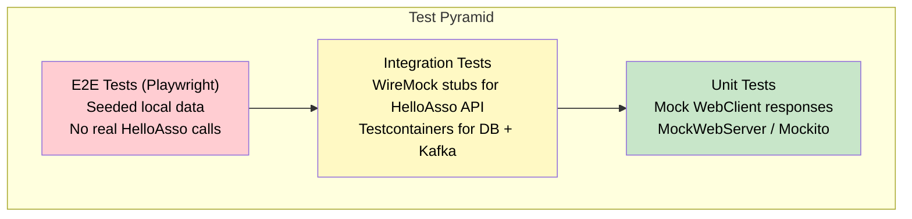

### Unit Tests -- MockWebServer

Unit tests use OkHttp `MockWebServer` to simulate HelloAsso API responses locally, without
any network calls.

```java
package com.familyhobbies.associationservice.adapter;

import com.familyhobbies.associationservice.adapter.dto.HelloAssoDirectoryRequest;
import com.familyhobbies.associationservice.adapter.dto.HelloAssoDirectoryResponse;
import com.familyhobbies.associationservice.config.HelloAssoProperties;
import okhttp3.mockwebserver.MockResponse;
import okhttp3.mockwebserver.MockWebServer;
import org.junit.jupiter.api.AfterEach;
import org.junit.jupiter.api.BeforeEach;
import org.junit.jupiter.api.Test;
import org.springframework.web.reactive.function.client.WebClient;

import java.io.IOException;

import static org.assertj.core.api.Assertions.assertThat;

class HelloAssoClientTest {

    private MockWebServer mockWebServer;
    private HelloAssoClient helloAssoClient;
    private HelloAssoTokenManager tokenManager;

    @BeforeEach
    void setUp() throws IOException {
        mockWebServer = new MockWebServer();
        mockWebServer.start();

        HelloAssoProperties properties = new HelloAssoProperties();
        properties.setBaseUrl(mockWebServer.url("/v5").toString());
        properties.setTokenUrl(mockWebServer.url("/oauth2/token").toString());
        properties.setClientId("test-client-id");
        properties.setClientSecret("test-client-secret");
        properties.setConnectTimeout(5000);
        properties.setReadTimeout(10000);

        // Enqueue token response
        mockWebServer.enqueue(new MockResponse()
                .setBody("""
                    {"access_token": "test-token", "token_type": "bearer", "expires_in": 1800}
                    """)
                .addHeader("Content-Type", "application/json"));

        tokenManager = new HelloAssoTokenManager(
                WebClient.builder(), properties);

        helloAssoClient = new HelloAssoClient(
                WebClient.builder(), properties, tokenManager);
    }

    @AfterEach
    void tearDown() throws IOException {
        mockWebServer.shutdown();
    }

    @Test
    void should_returnOrganizations_when_searchDirectorySucceeds() {
        // Arrange
        mockWebServer.enqueue(new MockResponse()
                .setBody("""
                    {
                        "data": [
                            {
                                "name": "AS Lyon Multisport",
                                "slug": "as-lyon-multisport",
                                "city": "Lyon",
                                "zipCode": "69001",
                                "category": "Sport"
                            }
                        ],
                        "pagination": {
                            "pageSize": 20,
                            "totalCount": 1,
                            "pageIndex": 1,
                            "totalPages": 1,
                            "continuationToken": null
                        }
                    }
                    """)
                .addHeader("Content-Type", "application/json"));

        HelloAssoDirectoryRequest request = HelloAssoDirectoryRequest.builder()
                .city("Lyon")
                .category("Sport")
                .pageSize(20)
                .build();

        // Act
        HelloAssoDirectoryResponse response = helloAssoClient
                .searchOrganizations(request)
                .block();

        // Assert
        assertThat(response).isNotNull();
        assertThat(response.data()).hasSize(1);
        assertThat(response.data().get(0).name()).isEqualTo("AS Lyon Multisport");
        assertThat(response.data().get(0).city()).isEqualTo("Lyon");
    }

    @Test
    void should_throwHelloAssoApiException_when_serverReturns500() {
        // Arrange
        mockWebServer.enqueue(new MockResponse()
                .setResponseCode(500)
                .setBody("Internal Server Error")
                .addHeader("Content-Type", "text/plain"));

        HelloAssoDirectoryRequest request = HelloAssoDirectoryRequest.builder()
                .city("Paris")
                .build();

        // Act & Assert
        org.junit.jupiter.api.Assertions.assertThrows(
                com.familyhobbies.associationservice.exception.HelloAssoApiException.class,
                () -> helloAssoClient.searchOrganizations(request).block()
        );
    }

    @Test
    void should_refreshTokenAndRetry_when_serverReturns401() {
        // Arrange: first call returns 401, second call after refresh succeeds
        mockWebServer.enqueue(new MockResponse()
                .setResponseCode(401)
                .setBody("Unauthorized"));

        // Token refresh response
        mockWebServer.enqueue(new MockResponse()
                .setBody("""
                    {"access_token": "new-token", "token_type": "bearer", "expires_in": 1800}
                    """)
                .addHeader("Content-Type", "application/json"));

        HelloAssoDirectoryRequest request = HelloAssoDirectoryRequest.builder()
                .city("Lyon")
                .build();

        // Act & Assert: Should throw but token manager should have been refreshed
        // The 401 handling triggers a token refresh for subsequent calls
        try {
            helloAssoClient.searchOrganizations(request).block();
        } catch (Exception e) {
            // Expected: first call fails with 401
        }

        // Verify token was force-refreshed by checking the token manager state
        String token = tokenManager.getValidToken();
        assertThat(token).isEqualTo("new-token");
    }
}
```

### Unit Tests -- Token Manager

```java
package com.familyhobbies.associationservice.adapter;

import com.familyhobbies.associationservice.config.HelloAssoProperties;
import okhttp3.mockwebserver.MockResponse;
import okhttp3.mockwebserver.MockWebServer;
import org.junit.jupiter.api.AfterEach;
import org.junit.jupiter.api.BeforeEach;
import org.junit.jupiter.api.Test;
import org.springframework.web.reactive.function.client.WebClient;

import java.io.IOException;

import static org.assertj.core.api.Assertions.assertThat;

class HelloAssoTokenManagerTest {

    private MockWebServer mockWebServer;
    private HelloAssoTokenManager tokenManager;

    @BeforeEach
    void setUp() throws IOException {
        mockWebServer = new MockWebServer();
        mockWebServer.start();

        HelloAssoProperties properties = new HelloAssoProperties();
        properties.setTokenUrl(mockWebServer.url("/oauth2/token").toString());
        properties.setClientId("test-id");
        properties.setClientSecret("test-secret");

        tokenManager = new HelloAssoTokenManager(
                WebClient.builder(), properties);
    }

    @AfterEach
    void tearDown() throws IOException {
        mockWebServer.shutdown();
    }

    @Test
    void should_obtainToken_when_calledFirstTime() {
        // Arrange
        mockWebServer.enqueue(new MockResponse()
                .setBody("""
                    {"access_token": "abc123", "token_type": "bearer", "expires_in": 1800}
                    """)
                .addHeader("Content-Type", "application/json"));

        // Act
        String token = tokenManager.getValidToken();

        // Assert
        assertThat(token).isEqualTo("abc123");
        assertThat(mockWebServer.getRequestCount()).isEqualTo(1);
    }

    @Test
    void should_returnCachedToken_when_tokenStillValid() {
        // Arrange
        mockWebServer.enqueue(new MockResponse()
                .setBody("""
                    {"access_token": "abc123", "token_type": "bearer", "expires_in": 1800}
                    """)
                .addHeader("Content-Type", "application/json"));

        // Act
        String token1 = tokenManager.getValidToken();
        String token2 = tokenManager.getValidToken();

        // Assert: only one HTTP call was made (token was cached)
        assertThat(token1).isEqualTo("abc123");
        assertThat(token2).isEqualTo("abc123");
        assertThat(mockWebServer.getRequestCount()).isEqualTo(1);
    }

    @Test
    void should_refreshToken_when_forceRefreshCalled() {
        // Arrange
        mockWebServer.enqueue(new MockResponse()
                .setBody("""
                    {"access_token": "old-token", "token_type": "bearer", "expires_in": 1800}
                    """)
                .addHeader("Content-Type", "application/json"));
        mockWebServer.enqueue(new MockResponse()
                .setBody("""
                    {"access_token": "new-token", "token_type": "bearer", "expires_in": 1800}
                    """)
                .addHeader("Content-Type", "application/json"));

        // Act
        String token1 = tokenManager.getValidToken();
        tokenManager.forceRefresh();
        String token2 = tokenManager.getValidToken();

        // Assert
        assertThat(token1).isEqualTo("old-token");
        assertThat(token2).isEqualTo("new-token");
        assertThat(mockWebServer.getRequestCount()).isEqualTo(2);
    }
}
```

### Integration Tests -- WireMock

Integration tests use WireMock to stub the entire HelloAsso API surface. These tests verify
the full Spring context, database persistence, and Kafka message production.

```java
package com.familyhobbies.associationservice;

import com.familyhobbies.associationservice.entity.Association;
import com.familyhobbies.associationservice.repository.AssociationRepository;
import com.familyhobbies.associationservice.service.AssociationSyncService;
import com.github.tomakehurst.wiremock.WireMockServer;
import com.github.tomakehurst.wiremock.client.WireMock;
import org.junit.jupiter.api.AfterAll;
import org.junit.jupiter.api.BeforeAll;
import org.junit.jupiter.api.Test;
import org.springframework.beans.factory.annotation.Autowired;
import org.springframework.boot.test.context.SpringBootTest;
import org.springframework.test.context.DynamicPropertyRegistry;
import org.springframework.test.context.DynamicPropertySource;
import org.testcontainers.containers.PostgreSQLContainer;
import org.testcontainers.junit.jupiter.Container;
import org.testcontainers.junit.jupiter.Testcontainers;

import java.util.List;

import static com.github.tomakehurst.wiremock.client.WireMock.*;
import static org.assertj.core.api.Assertions.assertThat;

@SpringBootTest
@Testcontainers
class AssociationSyncIntegrationTest {

    @Container
    static PostgreSQLContainer<?> postgres = new PostgreSQLContainer<>("postgres:16-alpine")
            .withDatabaseName("familyhobbies_associations_test")
            .withUsername("test")
            .withPassword("test");

    static WireMockServer wireMock;

    @Autowired
    private AssociationSyncService syncService;

    @Autowired
    private AssociationRepository associationRepository;

    @BeforeAll
    static void startWireMock() {
        wireMock = new WireMockServer(0); // Random port
        wireMock.start();
        WireMock.configureFor(wireMock.port());
    }

    @AfterAll
    static void stopWireMock() {
        wireMock.stop();
    }

    @DynamicPropertySource
    static void configureProperties(DynamicPropertyRegistry registry) {
        registry.add("spring.datasource.url", postgres::getJdbcUrl);
        registry.add("spring.datasource.username", postgres::getUsername);
        registry.add("spring.datasource.password", postgres::getPassword);
        registry.add("helloasso.base-url",
                () -> wireMock.baseUrl() + "/v5");
        registry.add("helloasso.token-url",
                () -> wireMock.baseUrl() + "/oauth2/token");
        registry.add("helloasso.client-id", () -> "test-client");
        registry.add("helloasso.client-secret", () -> "test-secret");
    }

    @Test
    void should_syncAssociationsToLocalDb_when_helloAssoReturnsData() {
        // Arrange: Stub OAuth2 token endpoint
        wireMock.stubFor(post(urlPathEqualTo("/oauth2/token"))
                .willReturn(aResponse()
                        .withStatus(200)
                        .withHeader("Content-Type", "application/json")
                        .withBody("""
                            {"access_token": "test-token", "token_type": "bearer", "expires_in": 1800}
                            """)));

        // Arrange: Stub directory search
        wireMock.stubFor(post(urlPathEqualTo("/v5/directory/organizations"))
                .willReturn(aResponse()
                        .withStatus(200)
                        .withHeader("Content-Type", "application/json")
                        .withBody("""
                            {
                                "data": [
                                    {
                                        "name": "Tennis Club de Nice",
                                        "slug": "tennis-club-nice",
                                        "city": "Nice",
                                        "zipCode": "06000",
                                        "category": "Sport",
                                        "description": "Club de tennis pour tous niveaux"
                                    }
                                ],
                                "pagination": {
                                    "pageSize": 20,
                                    "totalCount": 1,
                                    "pageIndex": 1,
                                    "totalPages": 1,
                                    "continuationToken": null
                                }
                            }
                            """)));

        // Act
        int synced = syncService.syncFullDirectory();

        // Assert
        assertThat(synced).isEqualTo(1);

        List<Association> associations = associationRepository.findAll();
        assertThat(associations).hasSize(1);
        assertThat(associations.get(0).getName()).isEqualTo("Tennis Club de Nice");
        assertThat(associations.get(0).getCity()).isEqualTo("Nice");
        assertThat(associations.get(0).isSyncedFromHelloasso()).isTrue();
        assertThat(associations.get(0).getLastSyncedAt()).isNotNull();
    }

    @Test
    void should_updateExistingAssociation_when_syncRunsAgain() {
        // Arrange: First sync
        wireMock.stubFor(post(urlPathEqualTo("/oauth2/token"))
                .willReturn(aResponse()
                        .withStatus(200)
                        .withHeader("Content-Type", "application/json")
                        .withBody("""
                            {"access_token": "test-token", "token_type": "bearer", "expires_in": 1800}
                            """)));

        wireMock.stubFor(post(urlPathEqualTo("/v5/directory/organizations"))
                .willReturn(aResponse()
                        .withStatus(200)
                        .withHeader("Content-Type", "application/json")
                        .withBody("""
                            {
                                "data": [{
                                    "name": "Club Updated Name",
                                    "slug": "tennis-club-nice",
                                    "city": "Nice",
                                    "zipCode": "06000",
                                    "category": "Sport",
                                    "description": "Updated description"
                                }],
                                "pagination": {"pageSize":20,"totalCount":1,"pageIndex":1,"totalPages":1,"continuationToken":null}
                            }
                            """)));

        // Act
        syncService.syncFullDirectory();

        // Assert: name and description should be updated, not duplicated
        List<Association> associations = associationRepository.findAll();
        assertThat(associations).hasSize(1); // Not 2 -- upsert, not insert
        assertThat(associations.get(0).getName()).isEqualTo("Club Updated Name");
        assertThat(associations.get(0).getDescription()).isEqualTo("Updated description");
    }
}
```

### Integration Tests -- Webhook Handling

```java
package com.familyhobbies.paymentservice;

import com.familyhobbies.paymentservice.entity.Payment;
import com.familyhobbies.paymentservice.entity.PaymentWebhookLog;
import com.familyhobbies.paymentservice.repository.PaymentRepository;
import com.familyhobbies.paymentservice.repository.PaymentWebhookLogRepository;
import org.junit.jupiter.api.Test;
import org.springframework.beans.factory.annotation.Autowired;
import org.springframework.boot.test.autoconfigure.web.servlet.AutoConfigureMockMvc;
import org.springframework.boot.test.context.SpringBootTest;
import org.springframework.http.MediaType;
import org.springframework.test.web.servlet.MockMvc;

import javax.crypto.Mac;
import javax.crypto.spec.SecretKeySpec;
import java.nio.charset.StandardCharsets;
import java.util.Base64;
import java.util.Optional;

import static org.assertj.core.api.Assertions.assertThat;
import static org.springframework.test.web.servlet.request.MockMvcRequestBuilders.post;
import static org.springframework.test.web.servlet.result.MockMvcResultMatchers.status;

@SpringBootTest
@AutoConfigureMockMvc
class WebhookControllerIntegrationTest {

    @Autowired
    private MockMvc mockMvc;

    @Autowired
    private PaymentRepository paymentRepository;

    @Autowired
    private PaymentWebhookLogRepository webhookLogRepository;

    private static final String WEBHOOK_SECRET = "test-webhook-secret";

    @Test
    void should_processPaymentWebhook_when_signatureIsValid() throws Exception {
        // Arrange: Create a pending payment
        Payment pendingPayment = Payment.builder()
                .helloassoCheckoutId(123456L)
                .status("CHECKOUT_INITIATED")
                .amountCents(15000)
                .currency("EUR")
                .build();
        paymentRepository.save(pendingPayment);

        String payload = """
            {
                "eventId": "evt-001",
                "eventType": "Payment",
                "data": {
                    "id": 789,
                    "checkoutIntentId": 123456,
                    "amount": 15000,
                    "currency": "EUR",
                    "state": "Authorized",
                    "payerEmail": "marie.dupont@example.com",
                    "date": "2026-02-23T10:00:00+01:00"
                }
            }
            """;

        String signature = computeHmacSignature(payload);

        // Act
        mockMvc.perform(post("/api/v1/payments/webhook/helloasso")
                        .contentType(MediaType.APPLICATION_JSON)
                        .header("X-HelloAsso-Signature", signature)
                        .content(payload))
                .andExpect(status().isOk());

        // Assert: Payment was updated
        Optional<Payment> updatedPayment = paymentRepository
                .findByHelloassoCheckoutId(123456L);
        assertThat(updatedPayment).isPresent();
        assertThat(updatedPayment.get().getStatus()).isEqualTo("COMPLETED");

        // Assert: Webhook was logged
        Optional<PaymentWebhookLog> log = webhookLogRepository
                .findByHelloassoEventId("evt-001");
        assertThat(log).isPresent();
        assertThat(log.get().isProcessed()).isTrue();
    }

    @Test
    void should_returnUnauthorized_when_signatureIsInvalid() throws Exception {
        String payload = """
            {"eventId": "evt-002", "eventType": "Payment", "data": {}}
            """;

        mockMvc.perform(post("/api/v1/payments/webhook/helloasso")
                        .contentType(MediaType.APPLICATION_JSON)
                        .header("X-HelloAsso-Signature", "invalid-signature")
                        .content(payload))
                .andExpect(status().isUnauthorized());
    }

    @Test
    void should_returnOk_when_webhookAlreadyProcessed() throws Exception {
        // Arrange: Insert already-processed webhook log
        PaymentWebhookLog existingLog = PaymentWebhookLog.builder()
                .helloassoEventId("evt-duplicate")
                .eventType("Payment")
                .rawPayload("{}")
                .processed(true)
                .build();
        webhookLogRepository.save(existingLog);

        String payload = """
            {"eventId": "evt-duplicate", "eventType": "Payment", "data": {}}
            """;
        String signature = computeHmacSignature(payload);

        // Act & Assert: Returns 200 but does not re-process
        mockMvc.perform(post("/api/v1/payments/webhook/helloasso")
                        .contentType(MediaType.APPLICATION_JSON)
                        .header("X-HelloAsso-Signature", signature)
                        .content(payload))
                .andExpect(status().isOk());
    }

    private String computeHmacSignature(String payload) throws Exception {
        Mac mac = Mac.getInstance("HmacSHA256");
        SecretKeySpec key = new SecretKeySpec(
                WEBHOOK_SECRET.getBytes(StandardCharsets.UTF_8), "HmacSHA256");
        mac.init(key);
        byte[] hmac = mac.doFinal(payload.getBytes(StandardCharsets.UTF_8));
        return Base64.getEncoder().encodeToString(hmac);
    }
}
```

### E2E Tests -- Playwright

E2E tests use seeded local data and never call the real HelloAsso API. The
`association-service` and `payment-service` run with WireMock stubs in the Docker Compose
test environment.

```typescript
// e2e/association-search.spec.ts
import { test, expect } from '@playwright/test';

test.describe('Association Search (HelloAsso Integration)', () => {

  test('user can search associations by city and see seeded results', async ({ page }) => {
    await page.goto('/associations');

    // Search for associations in Lyon
    await page.getByPlaceholder('Ville').fill('Lyon');
    await page.getByRole('button', { name: 'Rechercher' }).click();

    // Verify seeded association appears
    await expect(page.getByText('AS Lyon Multisport')).toBeVisible();
    await expect(page.getByText('Lyon')).toBeVisible();
    await expect(page.getByText('Sport')).toBeVisible();
  });

  test('user can view association details', async ({ page }) => {
    await page.goto('/associations');
    await page.getByPlaceholder('Ville').fill('Paris');
    await page.getByRole('button', { name: 'Rechercher' }).click();

    await page.getByText('Ecole de Danse Classique de Paris').click();

    await expect(page.getByRole('heading', { name: 'Ecole de Danse Classique de Paris' }))
      .toBeVisible();
    await expect(page.getByText('Danse')).toBeVisible();
    await expect(page.getByText('75004')).toBeVisible();
  });

  test('user sees stale data warning when HelloAsso is unavailable', async ({ page }) => {
    // This scenario uses a WireMock stub that returns 503 for HelloAsso calls,
    // causing the fallback to serve cached local data with a warning banner

    await page.goto('/associations');
    await page.getByPlaceholder('Ville').fill('Nantes');
    await page.getByRole('button', { name: 'Rechercher' }).click();

    // Results are shown from cache
    await expect(page.getByText('Atelier Arts Plastiques de Nantes')).toBeVisible();

    // Stale data warning should be visible
    await expect(page.getByText(/donnees en cache/i)).toBeVisible();
  });
});
```

```typescript
// e2e/payment-checkout.spec.ts
import { test, expect } from '@playwright/test';

test.describe('Payment Checkout Flow (HelloAsso Integration)', () => {

  test.beforeEach(async ({ page }) => {
    // Login as test family user
    await page.goto('/auth/login');
    await page.getByLabel('Email').fill('marie.dupont@test.com');
    await page.getByLabel('Mot de passe').fill('TestPassword123!');
    await page.getByRole('button', { name: 'Se connecter' }).click();
    await expect(page).toHaveURL('/dashboard');
  });

  test('user can initiate checkout for a subscription', async ({ page }) => {
    await page.goto('/subscriptions');

    // Find a pending subscription and click pay
    await page.getByRole('button', { name: 'Payer' }).first().click();

    // In test mode, the checkout URL is stubbed to redirect back to our app
    // The WireMock stub for /checkout-intents returns a mock redirect URL
    await expect(page.getByText(/paiement en cours/i)).toBeVisible();
  });

  test('user sees payment confirmation after successful checkout', async ({ page }) => {
    // Navigate to a subscription that has been marked as paid (via seeded webhook)
    await page.goto('/payments');

    await expect(page.getByText(/confirme/i)).toBeVisible();
    await expect(page.getByText('150,00')).toBeVisible();
  });
});
```

### Test Configuration Summary

| Test Layer | HelloAsso Mock | Database | Kafka | Framework |
|----|----|----|----|-----|
| **Unit tests** | MockWebServer (OkHttp) | None (mocked) | None (mocked) | JUnit 5 + Mockito |
| **Integration tests** | WireMock | Testcontainers (PostgreSQL 16) | Testcontainers (Kafka) | Spring Boot Test |
| **E2E tests** | WireMock (Docker container) | PostgreSQL (Docker) + seed data | Kafka (Docker) | Playwright |

---

## Revision History

| Date | Version | Author | Changes |
|----|----|----|-----|
| 2026-02-23 | 1.0 | Architecture Team | Initial version -- full HelloAsso integration design |
