# 07 - Batch Processing

> **Family Hobbies Manager** -- Multi-Association Management Platform
> Architecture Document Series | Document 7 of 12

---

## Table of Contents

1. [Spring Batch Overview](#1-spring-batch-overview)
2. [Batch Jobs Registry](#2-batch-jobs-registry)
   - [Job 1: HelloAsso Association Sync](#job-1-helloasso-association-sync-association-service)
   - [Job 2: Subscription Expiry Check](#job-2-subscription-expiry-check-association-service)
   - [Job 3: Attendance Report Generation](#job-3-attendance-report-generation-association-service)
   - [Job 4: Payment Reconciliation](#job-4-payment-reconciliation-payment-service)
   - [Job 5: RGPD Data Cleanup](#job-5-rgpd-data-cleanup-user-service)
   - [Job 6: Notification Cleanup](#job-6-notification-cleanup-notification-service)
3. [Batch Infrastructure per Service](#3-batch-infrastructure-per-service)
4. [Batch Admin Endpoints](#4-batch-admin-endpoints)
5. [Monitoring & Logging](#5-monitoring--logging)
6. [Error Handling](#6-error-handling)
7. [Government Enterprise Relevance](#7-government-enterprise-relevance)
8. [Architecture Diagrams](#8-architecture-diagrams)

---

## 1. Spring Batch Overview

Family Hobbies Manager uses **Spring Batch 5.1.x** (aligned with Spring Boot 3.2.x and Spring
Framework 6.1.x) for all scheduled data processing, external API synchronization, compliance
enforcement, and reporting workloads across the microservice fleet.

### Why Spring Batch

Spring Batch is the de facto standard for batch processing in the Java/Spring ecosystem. Enterprise
technology stacks explicitly require Spring Batch expertise. The batch layer in this project
demonstrates production-grade mastery of:

- **Chunk-oriented processing** with configurable commit intervals
- **Fault tolerance** via skip, retry, and restart policies
- **Job repository persistence** in PostgreSQL for auditable execution history
- **Partitioning and scaling** via `TaskExecutor`-based parallel step execution
- **Listener-driven observability** with structured logging and Micrometer metrics
- **Admin-triggered and CRON-scheduled** dual execution model

### Core Configuration

| Aspect | Configuration |
|---|---|
| Spring Batch version | 5.1.x (Boot 3.2 managed) |
| Job Repository | PostgreSQL-backed (each service owns its own `BATCH_*` tables) |
| Job Launcher | `SimpleJobLauncher` with async `ThreadPoolTaskExecutor` |
| Scheduling | `@Scheduled` CRON expressions or manual trigger via REST admin endpoint |
| Transaction Manager | `JpaTransactionManager` (same as service data source) |
| Schema Initialization | `spring.batch.jdbc.initialize-schema=always` |
| Auto-run on Startup | Disabled (`spring.batch.job.enabled=false`) |

### Shared Batch Configuration (per service)

```java
package com.familyhobbies.associationservice.batch.config;

import org.springframework.batch.core.configuration.annotation.EnableBatchProcessing;
import org.springframework.batch.core.launch.JobLauncher;
import org.springframework.batch.core.launch.support.TaskExecutorJobLauncher;
import org.springframework.batch.core.repository.JobRepository;
import org.springframework.context.annotation.Bean;
import org.springframework.context.annotation.Configuration;
import org.springframework.core.task.TaskExecutor;
import org.springframework.scheduling.annotation.EnableScheduling;
import org.springframework.scheduling.concurrent.ThreadPoolTaskExecutor;

@Configuration
@EnableBatchProcessing
@EnableScheduling
public class BatchConfig {

    /**
     * Async task executor for non-blocking job launches.
     * Sized for batch workloads: 2 core threads, 4 max, 10 queue capacity.
     * Each service tunes these values based on its job profile.
     */
    @Bean(name = "batchTaskExecutor")
    public TaskExecutor batchTaskExecutor() {
        ThreadPoolTaskExecutor executor = new ThreadPoolTaskExecutor();
        executor.setCorePoolSize(2);
        executor.setMaxPoolSize(4);
        executor.setQueueCapacity(10);
        executor.setThreadNamePrefix("batch-");
        executor.setWaitForTasksToCompleteOnShutdown(true);
        executor.setAwaitTerminationSeconds(60);
        executor.initialize();
        return executor;
    }

    /**
     * Async job launcher — allows REST endpoints to return immediately
     * while the job runs in a background thread.
     */
    @Bean
    public JobLauncher asyncJobLauncher(JobRepository jobRepository,
                                        TaskExecutor batchTaskExecutor) throws Exception {
        TaskExecutorJobLauncher launcher = new TaskExecutorJobLauncher();
        launcher.setJobRepository(jobRepository);
        launcher.setTaskExecutor(batchTaskExecutor);
        launcher.afterPropertiesSet();
        return launcher;
    }
}
```

### Dependency (per service `pom.xml`)

```xml
<!-- Spring Batch -->
<dependency>
    <groupId>org.springframework.boot</groupId>
    <artifactId>spring-boot-starter-batch</artifactId>
</dependency>

<!-- Spring Batch test utilities -->
<dependency>
    <groupId>org.springframework.batch</groupId>
    <artifactId>spring-batch-test</artifactId>
    <scope>test</scope>
</dependency>
```

---

## 2. Batch Jobs Registry

### Job 1: HelloAsso Association Sync (association-service)

| Property | Value |
|---|---|
| Job Name | `helloAssoSyncJob` |
| Service | association-service |
| Schedule | `0 0 2 * * *` (daily at 2:00 AM) |
| Manual Trigger | `POST /api/v1/admin/batch/sync-associations` |
| Description | Sync the full association directory from HelloAsso API to local database |
| Chunk Size | 50 |
| Expected Duration | 2-5 minutes (depends on HelloAsso directory size) |
| Skip Policy | Skip on `HelloAssoApiException`, max 10 skips per execution |
| Retry Policy | Retry on `WebClientResponseException.TooManyRequests`, max 3 retries, 5s exponential backoff |

**Step 1: `fetchOrganizationsStep`**

- **ItemReader**: `HelloAssoOrganizationReader` -- paginated REST calls to HelloAsso
  `POST /v5/directory/organizations` endpoint. Reads page by page (pageSize=50), stops when
  HelloAsso returns an empty page.
- **ItemProcessor**: `OrganizationSyncProcessor` -- maps HelloAsso `OrganizationDirectoryItem` DTO
  to the local `Association` JPA entity. Detects new organizations (INSERT), updated organizations
  (UPDATE based on `updatedDate`), and removed organizations (soft-delete if no longer in directory).
- **ItemWriter**: `AssociationBatchWriter` -- upserts into `t_association` table. Updates
  `last_synced_at` timestamp. Publishes `AssociationSyncedEvent` to Kafka for downstream consumers.

#### Job Configuration

```java
package com.familyhobbies.associationservice.batch.job;

import com.familyhobbies.associationservice.batch.listener.SyncJobListener;
import com.familyhobbies.associationservice.batch.processor.OrganizationSyncProcessor;
import com.familyhobbies.associationservice.batch.reader.HelloAssoOrganizationReader;
import com.familyhobbies.associationservice.batch.writer.AssociationBatchWriter;
import com.familyhobbies.associationservice.adapter.dto.HelloAssoOrganization;
import com.familyhobbies.associationservice.entity.Association;
import org.springframework.batch.core.Job;
import org.springframework.batch.core.Step;
import org.springframework.batch.core.job.builder.JobBuilder;
import org.springframework.batch.core.launch.support.RunIdIncrementer;
import org.springframework.batch.core.repository.JobRepository;
import org.springframework.batch.core.step.builder.StepBuilder;
import org.springframework.context.annotation.Bean;
import org.springframework.context.annotation.Configuration;
import org.springframework.transaction.PlatformTransactionManager;
import org.springframework.web.reactive.function.client.WebClientResponseException;

@Configuration
public class HelloAssoSyncJobConfig {

    private final HelloAssoOrganizationReader helloAssoOrganizationReader;
    private final OrganizationSyncProcessor organizationSyncProcessor;
    private final AssociationBatchWriter associationBatchWriter;
    private final SyncJobListener syncJobListener;

    public HelloAssoSyncJobConfig(HelloAssoOrganizationReader helloAssoOrganizationReader,
                                   OrganizationSyncProcessor organizationSyncProcessor,
                                   AssociationBatchWriter associationBatchWriter,
                                   SyncJobListener syncJobListener) {
        this.helloAssoOrganizationReader = helloAssoOrganizationReader;
        this.organizationSyncProcessor = organizationSyncProcessor;
        this.associationBatchWriter = associationBatchWriter;
        this.syncJobListener = syncJobListener;
    }

    @Bean
    public Job helloAssoSyncJob(JobRepository jobRepository, Step fetchOrganizationsStep) {
        return new JobBuilder("helloAssoSyncJob", jobRepository)
            .incrementer(new RunIdIncrementer())
            .start(fetchOrganizationsStep)
            .listener(syncJobListener)
            .build();
    }

    @Bean
    public Step fetchOrganizationsStep(JobRepository jobRepository,
                                        PlatformTransactionManager txManager) {
        return new StepBuilder("fetchOrganizationsStep", jobRepository)
            .<HelloAssoOrganization, Association>chunk(50, txManager)
            .reader(helloAssoOrganizationReader)
            .processor(organizationSyncProcessor)
            .writer(associationBatchWriter)
            .faultTolerant()
            .skip(HelloAssoApiException.class)
            .skipLimit(10)
            .retry(WebClientResponseException.TooManyRequests.class)
            .retryLimit(3)
            .listener(new ChunkLogListener())
            .build();
    }
}
```

#### ItemReader -- Paginated HelloAsso API Reader

```java
package com.familyhobbies.associationservice.batch.reader;

import com.familyhobbies.associationservice.adapter.HelloAssoClient;
import com.familyhobbies.associationservice.adapter.dto.HelloAssoOrganization;
import com.familyhobbies.associationservice.adapter.dto.HelloAssoDirectoryResponse;
import org.springframework.batch.item.ItemReader;
import org.springframework.stereotype.Component;

import java.util.LinkedList;
import java.util.Queue;

/**
 * Paginated reader for the HelloAsso organization directory.
 * Fetches pages of 50 organizations via the HelloAsso API and buffers them
 * in an internal queue. Returns null when all pages are exhausted (signals
 * end-of-data to Spring Batch).
 *
 * Thread safety: NOT thread-safe. Each step execution must use its own
 * reader instance (default Spring Batch behavior with step scope).
 */
@Component
public class HelloAssoOrganizationReader implements ItemReader<HelloAssoOrganization> {

    private final HelloAssoClient helloAssoClient;

    private int currentPage = 1;
    private static final int PAGE_SIZE = 50;
    private boolean exhausted = false;
    private final Queue<HelloAssoOrganization> buffer = new LinkedList<>();

    public HelloAssoOrganizationReader(HelloAssoClient helloAssoClient) {
        this.helloAssoClient = helloAssoClient;
    }

    @Override
    public HelloAssoOrganization read() {
        // Return buffered item if available
        if (!buffer.isEmpty()) {
            return buffer.poll();
        }

        // All pages consumed
        if (exhausted) {
            return null;
        }

        // Fetch next page from HelloAsso API
        HelloAssoDirectoryResponse response = helloAssoClient
            .fetchOrganizationDirectory(currentPage, PAGE_SIZE);

        if (response.getData() == null || response.getData().isEmpty()) {
            exhausted = true;
            return null;
        }

        buffer.addAll(response.getData());
        currentPage++;

        // Check if this was the last page
        if (response.getPagination().getTotalPages() <= currentPage - 1) {
            exhausted = true;
        }

        return buffer.poll();
    }
}
```

#### ItemProcessor -- Map and Detect Changes

```java
package com.familyhobbies.associationservice.batch.processor;

import com.familyhobbies.associationservice.adapter.dto.HelloAssoOrganization;
import com.familyhobbies.associationservice.entity.Association;
import com.familyhobbies.associationservice.repository.AssociationRepository;
import org.slf4j.Logger;
import org.slf4j.LoggerFactory;
import org.springframework.batch.item.ItemProcessor;
import org.springframework.stereotype.Component;

import java.time.LocalDateTime;
import java.util.Optional;

/**
 * Processes HelloAsso organization DTOs into Association entities.
 * Detects whether the organization is new or has been updated since the
 * last sync. Returns null for unchanged organizations (Spring Batch
 * convention: null = skip this item, do not pass to writer).
 */
@Component
public class OrganizationSyncProcessor
        implements ItemProcessor<HelloAssoOrganization, Association> {

    private static final Logger log = LoggerFactory.getLogger(OrganizationSyncProcessor.class);

    private final AssociationRepository associationRepository;

    public OrganizationSyncProcessor(AssociationRepository associationRepository) {
        this.associationRepository = associationRepository;
    }

    @Override
    public Association process(HelloAssoOrganization helloAssoOrg) {
        Optional<Association> existingOpt = associationRepository
            .findByHelloAssoSlug(helloAssoOrg.getSlug());

        if (existingOpt.isPresent()) {
            Association existing = existingOpt.get();

            // Skip if not modified since last sync
            if (existing.getLastSyncedAt() != null
                    && helloAssoOrg.getUpdatedDate() != null
                    && !helloAssoOrg.getUpdatedDate().isAfter(existing.getLastSyncedAt())) {
                return null; // No change -- skip
            }

            // Update existing entity
            mapFields(helloAssoOrg, existing);
            existing.setLastSyncedAt(LocalDateTime.now());
            log.debug("Updated association: slug={}", helloAssoOrg.getSlug());
            return existing;
        }

        // New association
        Association newAssociation = new Association();
        mapFields(helloAssoOrg, newAssociation);
        newAssociation.setHelloAssoSlug(helloAssoOrg.getSlug());
        newAssociation.setLastSyncedAt(LocalDateTime.now());
        newAssociation.setStatus("ACTIVE");
        log.info("New association discovered: slug={}, name={}",
            helloAssoOrg.getSlug(), helloAssoOrg.getName());
        return newAssociation;
    }

    private void mapFields(HelloAssoOrganization source, Association target) {
        target.setName(source.getName());
        target.setDescription(source.getDescription());
        target.setCity(source.getCity());
        target.setZipCode(source.getZipCode());
        target.setCategory(source.getCategory());
        target.setLogoUrl(source.getLogo());
        target.setHelloAssoUrl(source.getUrl());
        target.setHelloAssoOrgSlug(source.getSlug());
    }
}
```

#### ItemWriter -- Upsert and Publish Events

```java
package com.familyhobbies.associationservice.batch.writer;

import com.familyhobbies.associationservice.entity.Association;
import com.familyhobbies.associationservice.repository.AssociationRepository;
import com.familyhobbies.common.event.AssociationSyncedEvent;
import org.slf4j.Logger;
import org.slf4j.LoggerFactory;
import org.springframework.batch.item.Chunk;
import org.springframework.batch.item.ItemWriter;
import org.springframework.kafka.core.KafkaTemplate;
import org.springframework.stereotype.Component;

/**
 * Writes (upserts) Association entities to PostgreSQL and publishes
 * an AssociationSyncedEvent to Kafka for each persisted association.
 * The Kafka publish is fire-and-forget within the chunk transaction --
 * if the DB commit fails, the Kafka messages are effectively orphaned
 * but the outbox pattern could be added for strict consistency.
 */
@Component
public class AssociationBatchWriter implements ItemWriter<Association> {

    private static final Logger log = LoggerFactory.getLogger(AssociationBatchWriter.class);
    private static final String TOPIC = "association-synced-events";

    private final AssociationRepository associationRepository;
    private final KafkaTemplate<String, AssociationSyncedEvent> kafkaTemplate;

    public AssociationBatchWriter(AssociationRepository associationRepository,
                                   KafkaTemplate<String, AssociationSyncedEvent> kafkaTemplate) {
        this.associationRepository = associationRepository;
        this.kafkaTemplate = kafkaTemplate;
    }

    @Override
    public void write(Chunk<? extends Association> chunk) {
        var associations = associationRepository.saveAll(chunk.getItems());
        log.info("Batch wrote {} associations to database", associations.size());

        for (Association association : associations) {
            var event = new AssociationSyncedEvent(
                association.getId(),
                association.getHelloAssoSlug(),
                association.getName(),
                association.getStatus()
            );
            kafkaTemplate.send(TOPIC, association.getHelloAssoSlug(), event);
        }
    }
}
```

#### Job Listener -- Execution Logging

```java
package com.familyhobbies.associationservice.batch.listener;

import org.slf4j.Logger;
import org.slf4j.LoggerFactory;
import org.springframework.batch.core.BatchStatus;
import org.springframework.batch.core.JobExecution;
import org.springframework.batch.core.JobExecutionListener;
import org.springframework.stereotype.Component;

import java.time.Duration;

/**
 * Logs structured information at job start and end for observability.
 * Output is JSON-structured (via logback config) for ingestion by
 * Kibana, Graylog, or any ELK-compatible log aggregator.
 */
@Component
public class SyncJobListener implements JobExecutionListener {

    private static final Logger log = LoggerFactory.getLogger(SyncJobListener.class);

    @Override
    public void beforeJob(JobExecution jobExecution) {
        log.info("Batch job STARTED: jobName={}, jobId={}, parameters={}",
            jobExecution.getJobInstance().getJobName(),
            jobExecution.getJobId(),
            jobExecution.getJobParameters());
    }

    @Override
    public void afterJob(JobExecution jobExecution) {
        Duration duration = Duration.between(
            jobExecution.getStartTime(),
            jobExecution.getEndTime() != null ? jobExecution.getEndTime() : java.time.LocalDateTime.now()
        );

        long itemsRead = jobExecution.getStepExecutions().stream()
            .mapToLong(se -> se.getReadCount())
            .sum();
        long itemsWritten = jobExecution.getStepExecutions().stream()
            .mapToLong(se -> se.getWriteCount())
            .sum();
        long itemsSkipped = jobExecution.getStepExecutions().stream()
            .mapToLong(se -> se.getSkipCount())
            .sum();

        log.info("Batch job {}: jobName={}, jobId={}, duration={}, "
                + "itemsRead={}, itemsWritten={}, itemsSkipped={}",
            jobExecution.getStatus(),
            jobExecution.getJobInstance().getJobName(),
            jobExecution.getJobId(),
            duration,
            itemsRead,
            itemsWritten,
            itemsSkipped);

        if (jobExecution.getStatus() == BatchStatus.FAILED) {
            jobExecution.getAllFailureExceptions().forEach(ex ->
                log.error("Batch job failure: jobName={}, exception={}",
                    jobExecution.getJobInstance().getJobName(),
                    ex.getMessage(), ex));
        }
    }
}
```

#### Chunk Listener -- Per-Chunk Progress Logging

```java
package com.familyhobbies.associationservice.batch.listener;

import org.slf4j.Logger;
import org.slf4j.LoggerFactory;
import org.springframework.batch.core.ChunkListener;
import org.springframework.batch.core.scope.context.ChunkContext;

/**
 * Logs progress after each committed chunk. Useful for monitoring
 * long-running sync jobs and detecting slowdowns.
 */
public class ChunkLogListener implements ChunkListener {

    private static final Logger log = LoggerFactory.getLogger(ChunkLogListener.class);

    @Override
    public void afterChunk(ChunkContext context) {
        var stepExecution = context.getStepContext().getStepExecution();
        log.debug("Chunk committed: step={}, readCount={}, writeCount={}, commitCount={}",
            stepExecution.getStepName(),
            stepExecution.getReadCount(),
            stepExecution.getWriteCount(),
            stepExecution.getCommitCount());
    }

    @Override
    public void afterChunkError(ChunkContext context) {
        var stepExecution = context.getStepContext().getStepExecution();
        log.warn("Chunk error: step={}, rollbackCount={}",
            stepExecution.getStepName(),
            stepExecution.getRollbackCount());
    }
}
```

---

### Job 2: Subscription Expiry Check (association-service)

| Property | Value |
|---|---|
| Job Name | `subscriptionExpiryJob` |
| Service | association-service |
| Schedule | `0 0 6 * * *` (daily at 6:00 AM) |
| Manual Trigger | `POST /api/v1/admin/batch/subscription-expiry` |
| Description | Detect expired subscriptions, update status to EXPIRED, notify families via Kafka |
| Chunk Size | 100 |
| Expected Duration | < 1 minute |
| Skip Policy | None (all items must be processed) |
| Retry Policy | Retry on `DataAccessException`, max 2 retries |

**Step 1: `expireSubscriptionsStep`**

- **ItemReader**: `JpaPagingItemReader<Subscription>` -- queries all subscriptions whose `endDate`
  has passed while still in ACTIVE status.
- **ItemProcessor**: `SubscriptionExpiryProcessor` -- sets status to `EXPIRED`, builds a
  `SubscriptionCancelledEvent` with family and association context.
- **ItemWriter**: `SubscriptionExpiryWriter` -- persists the updated subscription and publishes
  the `SubscriptionCancelledEvent` to Kafka for notification-service to send emails.

#### Job Configuration

```java
package com.familyhobbies.associationservice.batch.job;

import com.familyhobbies.associationservice.entity.Subscription;
import com.familyhobbies.common.event.SubscriptionCancelledEvent;
import org.springframework.batch.core.Job;
import org.springframework.batch.core.Step;
import org.springframework.batch.core.job.builder.JobBuilder;
import org.springframework.batch.core.launch.support.RunIdIncrementer;
import org.springframework.batch.core.repository.JobRepository;
import org.springframework.batch.core.step.builder.StepBuilder;
import org.springframework.batch.item.database.JpaPagingItemReader;
import org.springframework.batch.item.database.builder.JpaPagingItemReaderBuilder;
import org.springframework.context.annotation.Bean;
import org.springframework.context.annotation.Configuration;
import org.springframework.dao.DataAccessException;
import org.springframework.transaction.PlatformTransactionManager;

import jakarta.persistence.EntityManagerFactory;

@Configuration
public class SubscriptionExpiryJobConfig {

    @Bean
    public Job subscriptionExpiryJob(JobRepository jobRepository,
                                      Step expireSubscriptionsStep) {
        return new JobBuilder("subscriptionExpiryJob", jobRepository)
            .incrementer(new RunIdIncrementer())
            .start(expireSubscriptionsStep)
            .listener(new GenericJobListener())
            .build();
    }

    @Bean
    public Step expireSubscriptionsStep(JobRepository jobRepository,
                                         PlatformTransactionManager txManager,
                                         JpaPagingItemReader<Subscription> expiredSubscriptionReader,
                                         SubscriptionExpiryProcessor processor,
                                         SubscriptionExpiryWriter writer) {
        return new StepBuilder("expireSubscriptionsStep", jobRepository)
            .<Subscription, SubscriptionCancelledEvent>chunk(100, txManager)
            .reader(expiredSubscriptionReader)
            .processor(processor)
            .writer(writer)
            .faultTolerant()
            .retry(DataAccessException.class)
            .retryLimit(2)
            .build();
    }

    @Bean
    public JpaPagingItemReader<Subscription> expiredSubscriptionReader(
            EntityManagerFactory entityManagerFactory) {
        return new JpaPagingItemReaderBuilder<Subscription>()
            .name("expiredSubscriptionReader")
            .entityManagerFactory(entityManagerFactory)
            .queryString(
                "SELECT s FROM Subscription s "
                + "WHERE s.endDate < CURRENT_DATE "
                + "AND s.status = 'ACTIVE' "
                + "ORDER BY s.endDate ASC")
            .pageSize(100)
            .build();
    }
}
```

#### Processor and Writer

```java
package com.familyhobbies.associationservice.batch.processor;

import com.familyhobbies.associationservice.entity.Subscription;
import com.familyhobbies.common.event.SubscriptionCancelledEvent;
import org.springframework.batch.item.ItemProcessor;
import org.springframework.stereotype.Component;

import java.time.LocalDateTime;

@Component
public class SubscriptionExpiryProcessor
        implements ItemProcessor<Subscription, SubscriptionCancelledEvent> {

    @Override
    public SubscriptionCancelledEvent process(Subscription subscription) {
        // Update entity status in place (will be saved by writer)
        subscription.setStatus("EXPIRED");
        subscription.setUpdatedAt(LocalDateTime.now());

        // Build event for notification-service
        return new SubscriptionCancelledEvent(
            subscription.getId(),
            subscription.getFamilyMemberId(),
            subscription.getAssociationId(),
            subscription.getAssociationName(),
            subscription.getEndDate(),
            "EXPIRED"
        );
    }
}
```

```java
package com.familyhobbies.associationservice.batch.writer;

import com.familyhobbies.associationservice.repository.SubscriptionRepository;
import com.familyhobbies.common.event.SubscriptionCancelledEvent;
import org.springframework.batch.item.Chunk;
import org.springframework.batch.item.ItemWriter;
import org.springframework.kafka.core.KafkaTemplate;
import org.springframework.stereotype.Component;

@Component
public class SubscriptionExpiryWriter implements ItemWriter<SubscriptionCancelledEvent> {

    private static final String TOPIC = "subscription-cancelled-events";

    private final SubscriptionRepository subscriptionRepository;
    private final KafkaTemplate<String, SubscriptionCancelledEvent> kafkaTemplate;

    public SubscriptionExpiryWriter(SubscriptionRepository subscriptionRepository,
                                     KafkaTemplate<String, SubscriptionCancelledEvent> kafkaTemplate) {
        this.subscriptionRepository = subscriptionRepository;
        this.kafkaTemplate = kafkaTemplate;
    }

    @Override
    public void write(Chunk<? extends SubscriptionCancelledEvent> chunk) {
        for (SubscriptionCancelledEvent event : chunk.getItems()) {
            // The subscription entity was mutated in the processor; JPA dirty checking
            // will flush the status change within this transaction.
            kafkaTemplate.send(TOPIC, String.valueOf(event.getSubscriptionId()), event);
        }
    }
}
```

---

### Job 3: Attendance Report Generation (association-service)

| Property | Value |
|---|---|
| Job Name | `attendanceReportJob` |
| Service | association-service |
| Schedule | `0 0 7 * * MON` (every Monday at 7:00 AM) |
| Manual Trigger | `POST /api/v1/admin/batch/attendance-report` |
| Description | Generate weekly attendance summary reports per association |
| Chunk Size | 20 |
| Expected Duration | 1-3 minutes |
| Skip Policy | Skip on `IllegalStateException`, max 5 |
| Retry Policy | None |

**Step 1: `generateReportsStep`**

- **ItemReader**: `JpaPagingItemReader<Association>` -- queries associations that have at least one
  active subscription with sessions in the previous week.
- **ItemProcessor**: `AttendanceReportProcessor` -- aggregates attendance records for the past 7
  days, calculates present %, absent %, and excused % per association. Builds an
  `AttendanceReportDTO` with per-session breakdowns.
- **ItemWriter**: `AttendanceReportWriter` -- persists the report as a JSON document in
  `t_attendance_report` and publishes an `AttendanceReportGeneratedEvent` to Kafka for
  notification-service to distribute to association managers.

#### Job Configuration

```java
package com.familyhobbies.associationservice.batch.job;

import com.familyhobbies.associationservice.batch.processor.AttendanceReportProcessor;
import com.familyhobbies.associationservice.batch.writer.AttendanceReportWriter;
import com.familyhobbies.associationservice.entity.Association;
import com.familyhobbies.associationservice.batch.dto.AttendanceReportDTO;
import org.springframework.batch.core.Job;
import org.springframework.batch.core.Step;
import org.springframework.batch.core.job.builder.JobBuilder;
import org.springframework.batch.core.launch.support.RunIdIncrementer;
import org.springframework.batch.core.repository.JobRepository;
import org.springframework.batch.core.step.builder.StepBuilder;
import org.springframework.batch.item.database.JpaPagingItemReader;
import org.springframework.batch.item.database.builder.JpaPagingItemReaderBuilder;
import org.springframework.context.annotation.Bean;
import org.springframework.context.annotation.Configuration;
import org.springframework.transaction.PlatformTransactionManager;

import jakarta.persistence.EntityManagerFactory;

@Configuration
public class AttendanceReportJobConfig {

    @Bean
    public Job attendanceReportJob(JobRepository jobRepository,
                                    Step generateReportsStep) {
        return new JobBuilder("attendanceReportJob", jobRepository)
            .incrementer(new RunIdIncrementer())
            .start(generateReportsStep)
            .listener(new GenericJobListener())
            .build();
    }

    @Bean
    public Step generateReportsStep(JobRepository jobRepository,
                                     PlatformTransactionManager txManager,
                                     JpaPagingItemReader<Association> activeAssociationReader,
                                     AttendanceReportProcessor processor,
                                     AttendanceReportWriter writer) {
        return new StepBuilder("generateReportsStep", jobRepository)
            .<Association, AttendanceReportDTO>chunk(20, txManager)
            .reader(activeAssociationReader)
            .processor(processor)
            .writer(writer)
            .faultTolerant()
            .skip(IllegalStateException.class)
            .skipLimit(5)
            .build();
    }

    @Bean
    public JpaPagingItemReader<Association> activeAssociationReader(
            EntityManagerFactory entityManagerFactory) {
        return new JpaPagingItemReaderBuilder<Association>()
            .name("activeAssociationReader")
            .entityManagerFactory(entityManagerFactory)
            .queryString(
                "SELECT DISTINCT a FROM Association a "
                + "JOIN a.subscriptions s "
                + "WHERE s.status = 'ACTIVE' "
                + "ORDER BY a.id")
            .pageSize(20)
            .build();
    }
}
```

#### Attendance Report Processor

```java
package com.familyhobbies.associationservice.batch.processor;

import com.familyhobbies.associationservice.batch.dto.AttendanceReportDTO;
import com.familyhobbies.associationservice.batch.dto.SessionAttendanceSummary;
import com.familyhobbies.associationservice.entity.Association;
import com.familyhobbies.associationservice.entity.AttendanceRecord;
import com.familyhobbies.associationservice.entity.Session;
import com.familyhobbies.associationservice.repository.AttendanceRecordRepository;
import com.familyhobbies.associationservice.repository.SessionRepository;
import org.springframework.batch.item.ItemProcessor;
import org.springframework.stereotype.Component;

import java.time.LocalDate;
import java.time.LocalDateTime;
import java.util.List;
import java.util.stream.Collectors;

@Component
public class AttendanceReportProcessor
        implements ItemProcessor<Association, AttendanceReportDTO> {

    private final SessionRepository sessionRepository;
    private final AttendanceRecordRepository attendanceRecordRepository;

    public AttendanceReportProcessor(SessionRepository sessionRepository,
                                      AttendanceRecordRepository attendanceRecordRepository) {
        this.sessionRepository = sessionRepository;
        this.attendanceRecordRepository = attendanceRecordRepository;
    }

    @Override
    public AttendanceReportDTO process(Association association) {
        LocalDate weekStart = LocalDate.now().minusDays(7);
        LocalDate weekEnd = LocalDate.now();

        List<Session> sessions = sessionRepository
            .findByAssociationIdAndDateBetween(association.getId(), weekStart, weekEnd);

        if (sessions.isEmpty()) {
            return null; // No sessions last week -- skip report
        }

        List<SessionAttendanceSummary> summaries = sessions.stream()
            .map(session -> buildSessionSummary(session))
            .collect(Collectors.toList());

        long totalExpected = summaries.stream()
            .mapToLong(SessionAttendanceSummary::getTotalExpected).sum();
        long totalPresent = summaries.stream()
            .mapToLong(SessionAttendanceSummary::getPresentCount).sum();
        long totalAbsent = summaries.stream()
            .mapToLong(SessionAttendanceSummary::getAbsentCount).sum();
        long totalExcused = summaries.stream()
            .mapToLong(SessionAttendanceSummary::getExcusedCount).sum();

        double presentPercent = totalExpected > 0
            ? (double) totalPresent / totalExpected * 100 : 0;
        double absentPercent = totalExpected > 0
            ? (double) totalAbsent / totalExpected * 100 : 0;
        double excusedPercent = totalExpected > 0
            ? (double) totalExcused / totalExpected * 100 : 0;

        return new AttendanceReportDTO(
            association.getId(),
            association.getName(),
            weekStart,
            weekEnd,
            summaries,
            presentPercent,
            absentPercent,
            excusedPercent,
            LocalDateTime.now()
        );
    }

    private SessionAttendanceSummary buildSessionSummary(Session session) {
        List<AttendanceRecord> records = attendanceRecordRepository
            .findBySessionId(session.getId());

        long present = records.stream()
            .filter(r -> "PRESENT".equals(r.getStatus())).count();
        long absent = records.stream()
            .filter(r -> "ABSENT".equals(r.getStatus())).count();
        long excused = records.stream()
            .filter(r -> "EXCUSED".equals(r.getStatus())).count();

        return new SessionAttendanceSummary(
            session.getId(),
            session.getName(),
            session.getDate(),
            records.size(),
            present,
            absent,
            excused
        );
    }
}
```

---

### Job 4: Payment Reconciliation (payment-service)

| Property | Value |
|---|---|
| Job Name | `paymentReconciliationJob` |
| Service | payment-service |
| Schedule | `0 0 3 * * *` (daily at 3:00 AM) |
| Manual Trigger | `POST /api/v1/admin/batch/payment-reconciliation` |
| Description | Reconcile pending payments with HelloAsso, detect stuck/failed payments |
| Chunk Size | 50 |
| Expected Duration | 1-5 minutes |
| Skip Policy | Skip on `HelloAssoApiException`, max 5 |
| Retry Policy | Retry on `WebClientResponseException.TooManyRequests`, max 3, backoff 5s |

**Step 1: `reconcilePendingPaymentsStep`**

- **ItemReader**: `JpaPagingItemReader<Payment>` -- queries payments stuck in PENDING status for
  more than 24 hours (`created_at < NOW() - INTERVAL '24 hours'`).
- **ItemProcessor**: `PaymentReconciliationProcessor` -- calls HelloAsso API to check the actual
  payment status. Maps the HelloAsso status to the local status (COMPLETED, FAILED, REFUNDED).
  Returns null if status is still genuinely pending (HelloAsso confirms pending).
- **ItemWriter**: `PaymentReconciliationWriter` -- updates the payment record, publishes
  `PaymentCompletedEvent` or `PaymentFailedEvent` to Kafka.

#### Job Configuration

```java
package com.familyhobbies.paymentservice.batch.job;

import com.familyhobbies.paymentservice.batch.processor.PaymentReconciliationProcessor;
import com.familyhobbies.paymentservice.batch.writer.PaymentReconciliationWriter;
import com.familyhobbies.paymentservice.entity.Payment;
import com.familyhobbies.paymentservice.batch.dto.ReconciledPayment;
import org.springframework.batch.core.Job;
import org.springframework.batch.core.Step;
import org.springframework.batch.core.job.builder.JobBuilder;
import org.springframework.batch.core.launch.support.RunIdIncrementer;
import org.springframework.batch.core.repository.JobRepository;
import org.springframework.batch.core.step.builder.StepBuilder;
import org.springframework.batch.item.database.JpaPagingItemReader;
import org.springframework.batch.item.database.builder.JpaPagingItemReaderBuilder;
import org.springframework.context.annotation.Bean;
import org.springframework.context.annotation.Configuration;
import org.springframework.transaction.PlatformTransactionManager;
import org.springframework.web.reactive.function.client.WebClientResponseException;

import jakarta.persistence.EntityManagerFactory;

@Configuration
public class PaymentReconciliationJobConfig {

    @Bean
    public Job paymentReconciliationJob(JobRepository jobRepository,
                                         Step reconcilePendingPaymentsStep) {
        return new JobBuilder("paymentReconciliationJob", jobRepository)
            .incrementer(new RunIdIncrementer())
            .start(reconcilePendingPaymentsStep)
            .listener(new GenericJobListener())
            .build();
    }

    @Bean
    public Step reconcilePendingPaymentsStep(JobRepository jobRepository,
                                              PlatformTransactionManager txManager,
                                              JpaPagingItemReader<Payment> pendingPaymentReader,
                                              PaymentReconciliationProcessor processor,
                                              PaymentReconciliationWriter writer) {
        return new StepBuilder("reconcilePendingPaymentsStep", jobRepository)
            .<Payment, ReconciledPayment>chunk(50, txManager)
            .reader(pendingPaymentReader)
            .processor(processor)
            .writer(writer)
            .faultTolerant()
            .skip(HelloAssoApiException.class)
            .skipLimit(5)
            .retry(WebClientResponseException.TooManyRequests.class)
            .retryLimit(3)
            .build();
    }

    @Bean
    public JpaPagingItemReader<Payment> pendingPaymentReader(
            EntityManagerFactory entityManagerFactory) {
        return new JpaPagingItemReaderBuilder<Payment>()
            .name("pendingPaymentReader")
            .entityManagerFactory(entityManagerFactory)
            .queryString(
                "SELECT p FROM Payment p "
                + "WHERE p.status = 'PENDING' "
                + "AND p.createdAt < :cutoff "
                + "ORDER BY p.createdAt ASC")
            .parameterValues(java.util.Map.of(
                "cutoff", java.time.LocalDateTime.now().minusHours(24)))
            .pageSize(50)
            .build();
    }
}
```

#### Payment Reconciliation Processor

```java
package com.familyhobbies.paymentservice.batch.processor;

import com.familyhobbies.paymentservice.adapter.HelloAssoCheckoutClient;
import com.familyhobbies.paymentservice.adapter.dto.HelloAssoPaymentStatus;
import com.familyhobbies.paymentservice.batch.dto.ReconciledPayment;
import com.familyhobbies.paymentservice.entity.Payment;
import org.slf4j.Logger;
import org.slf4j.LoggerFactory;
import org.springframework.batch.item.ItemProcessor;
import org.springframework.stereotype.Component;

import java.time.LocalDateTime;

/**
 * Checks each pending payment against the HelloAsso API to determine
 * its actual status. Maps HelloAsso payment states to local states.
 * Returns null if HelloAsso still reports the payment as pending
 * (no action needed yet).
 */
@Component
public class PaymentReconciliationProcessor
        implements ItemProcessor<Payment, ReconciledPayment> {

    private static final Logger log = LoggerFactory.getLogger(PaymentReconciliationProcessor.class);

    private final HelloAssoCheckoutClient helloAssoClient;

    public PaymentReconciliationProcessor(HelloAssoCheckoutClient helloAssoClient) {
        this.helloAssoClient = helloAssoClient;
    }

    @Override
    public ReconciledPayment process(Payment payment) {
        HelloAssoPaymentStatus helloAssoStatus = helloAssoClient
            .getPaymentStatus(payment.getHelloAssoPaymentId());

        String resolvedStatus = mapHelloAssoStatus(helloAssoStatus.getState());

        if ("PENDING".equals(resolvedStatus)) {
            // Still pending on HelloAsso side -- check if stuck too long
            if (payment.getCreatedAt().isBefore(LocalDateTime.now().minusHours(72))) {
                log.warn("Payment stuck for 72+ hours: paymentId={}, helloAssoId={}",
                    payment.getId(), payment.getHelloAssoPaymentId());
                resolvedStatus = "FAILED";
            } else {
                return null; // Still legitimately pending -- skip
            }
        }

        log.info("Reconciled payment: id={}, oldStatus=PENDING, newStatus={}",
            payment.getId(), resolvedStatus);

        return new ReconciledPayment(
            payment.getId(),
            payment.getHelloAssoPaymentId(),
            payment.getFamilyMemberId(),
            payment.getAssociationId(),
            payment.getAmount(),
            resolvedStatus,
            helloAssoStatus.getDate()
        );
    }

    private String mapHelloAssoStatus(String helloAssoState) {
        return switch (helloAssoState) {
            case "Authorized" -> "COMPLETED";
            case "Refused", "Canceled" -> "FAILED";
            case "Refunded", "Refunding" -> "REFUNDED";
            case "Pending" -> "PENDING";
            default -> {
                log.warn("Unknown HelloAsso payment state: {}", helloAssoState);
                yield "PENDING";
            }
        };
    }
}
```

#### Payment Reconciliation Writer

```java
package com.familyhobbies.paymentservice.batch.writer;

import com.familyhobbies.common.event.PaymentCompletedEvent;
import com.familyhobbies.common.event.PaymentFailedEvent;
import com.familyhobbies.paymentservice.batch.dto.ReconciledPayment;
import com.familyhobbies.paymentservice.entity.Payment;
import com.familyhobbies.paymentservice.repository.PaymentRepository;
import org.slf4j.Logger;
import org.slf4j.LoggerFactory;
import org.springframework.batch.item.Chunk;
import org.springframework.batch.item.ItemWriter;
import org.springframework.kafka.core.KafkaTemplate;
import org.springframework.stereotype.Component;

import java.time.LocalDateTime;

@Component
public class PaymentReconciliationWriter implements ItemWriter<ReconciledPayment> {

    private static final Logger log = LoggerFactory.getLogger(PaymentReconciliationWriter.class);

    private final PaymentRepository paymentRepository;
    private final KafkaTemplate<String, Object> kafkaTemplate;

    public PaymentReconciliationWriter(PaymentRepository paymentRepository,
                                        KafkaTemplate<String, Object> kafkaTemplate) {
        this.paymentRepository = paymentRepository;
        this.kafkaTemplate = kafkaTemplate;
    }

    @Override
    public void write(Chunk<? extends ReconciledPayment> chunk) {
        for (ReconciledPayment reconciled : chunk.getItems()) {
            Payment payment = paymentRepository.findById(reconciled.getPaymentId())
                .orElseThrow(() -> new IllegalStateException(
                    "Payment not found: " + reconciled.getPaymentId()));

            payment.setStatus(reconciled.getResolvedStatus());
            payment.setReconciledAt(LocalDateTime.now());
            payment.setUpdatedAt(LocalDateTime.now());
            paymentRepository.save(payment);

            publishEvent(reconciled);
        }
    }

    private void publishEvent(ReconciledPayment reconciled) {
        switch (reconciled.getResolvedStatus()) {
            case "COMPLETED" -> {
                var event = new PaymentCompletedEvent(
                    reconciled.getPaymentId(),
                    reconciled.getFamilyMemberId(),
                    reconciled.getAssociationId(),
                    reconciled.getAmount()
                );
                kafkaTemplate.send("payment-completed-events",
                    String.valueOf(reconciled.getPaymentId()), event);
            }
            case "FAILED" -> {
                var event = new PaymentFailedEvent(
                    reconciled.getPaymentId(),
                    reconciled.getFamilyMemberId(),
                    reconciled.getAssociationId(),
                    reconciled.getAmount(),
                    "Reconciliation: payment not authorized by HelloAsso"
                );
                kafkaTemplate.send("payment-failed-events",
                    String.valueOf(reconciled.getPaymentId()), event);
            }
            case "REFUNDED" -> log.info("Payment refunded during reconciliation: id={}",
                reconciled.getPaymentId());
            default -> log.warn("Unexpected reconciled status: {}",
                reconciled.getResolvedStatus());
        }
    }
}
```

---

### Job 5: RGPD Data Cleanup (user-service)

| Property | Value |
|---|---|
| Job Name | `rgpdDataCleanupJob` |
| Service | user-service |
| Schedule | `0 0 1 * * *` (daily at 1:00 AM) |
| Manual Trigger | `POST /api/v1/admin/batch/rgpd-cleanup` |
| Description | Anonymize PII for soft-deleted users past the 30-day retention period |
| Chunk Size | 50 |
| Expected Duration | < 1 minute |
| Skip Policy | None (RGPD compliance -- all items must be processed) |
| Retry Policy | Retry on `DataAccessException`, max 3 retries |

**Step 1: `purgeDeletedUsersStep`**

- **ItemReader**: `JpaPagingItemReader<User>` -- queries users in `DELETED` status whose
  `updatedAt` is older than 30 days (`NOW() - INTERVAL '30 days'`).
- **ItemProcessor**: `RgpdAnonymizationProcessor` -- replaces all PII fields with anonymized
  values: email becomes SHA-256 hash, first/last names become `"SUPPRIME"`, phone becomes null,
  address becomes null. Sets status to `ANONYMIZED`.
- **ItemWriter**: `RgpdCleanupWriter` -- saves the anonymized user record and writes an audit
  trail entry to `t_audit_log` for CNIL compliance.

#### Job Configuration

```java
package com.familyhobbies.userservice.batch.job;

import com.familyhobbies.userservice.entity.User;
import com.familyhobbies.userservice.batch.processor.RgpdAnonymizationProcessor;
import com.familyhobbies.userservice.batch.writer.RgpdCleanupWriter;
import org.springframework.batch.core.Job;
import org.springframework.batch.core.Step;
import org.springframework.batch.core.job.builder.JobBuilder;
import org.springframework.batch.core.launch.support.RunIdIncrementer;
import org.springframework.batch.core.repository.JobRepository;
import org.springframework.batch.core.step.builder.StepBuilder;
import org.springframework.batch.item.database.JpaPagingItemReader;
import org.springframework.batch.item.database.builder.JpaPagingItemReaderBuilder;
import org.springframework.context.annotation.Bean;
import org.springframework.context.annotation.Configuration;
import org.springframework.dao.DataAccessException;
import org.springframework.transaction.PlatformTransactionManager;

import jakarta.persistence.EntityManagerFactory;
import java.time.LocalDateTime;
import java.util.Map;

@Configuration
public class RgpdDataCleanupJobConfig {

    @Bean
    public Job rgpdDataCleanupJob(JobRepository jobRepository,
                                    Step purgeDeletedUsersStep) {
        return new JobBuilder("rgpdDataCleanupJob", jobRepository)
            .incrementer(new RunIdIncrementer())
            .start(purgeDeletedUsersStep)
            .listener(new GenericJobListener())
            .build();
    }

    @Bean
    public Step purgeDeletedUsersStep(JobRepository jobRepository,
                                       PlatformTransactionManager txManager,
                                       JpaPagingItemReader<User> deletedUserReader,
                                       RgpdAnonymizationProcessor processor,
                                       RgpdCleanupWriter writer) {
        return new StepBuilder("purgeDeletedUsersStep", jobRepository)
            .<User, User>chunk(50, txManager)
            .reader(deletedUserReader)
            .processor(processor)
            .writer(writer)
            .faultTolerant()
            .retry(DataAccessException.class)
            .retryLimit(3)
            .build();
    }

    @Bean
    public JpaPagingItemReader<User> deletedUserReader(
            EntityManagerFactory entityManagerFactory) {
        return new JpaPagingItemReaderBuilder<User>()
            .name("deletedUserReader")
            .entityManagerFactory(entityManagerFactory)
            .queryString(
                "SELECT u FROM User u "
                + "WHERE u.status = 'DELETED' "
                + "AND u.updatedAt < :retentionCutoff "
                + "ORDER BY u.updatedAt ASC")
            .parameterValues(Map.of(
                "retentionCutoff", LocalDateTime.now().minusDays(30)))
            .pageSize(50)
            .build();
    }
}
```

#### RGPD Anonymization Processor

```java
package com.familyhobbies.userservice.batch.processor;

import com.familyhobbies.userservice.entity.User;
import org.slf4j.Logger;
import org.slf4j.LoggerFactory;
import org.springframework.batch.item.ItemProcessor;
import org.springframework.stereotype.Component;

import java.nio.charset.StandardCharsets;
import java.security.MessageDigest;
import java.security.NoSuchAlgorithmException;
import java.time.LocalDateTime;
import java.util.HexFormat;

/**
 * Anonymizes PII (Personally Identifiable Information) for RGPD compliance.
 * After processing, the user record retains its ID for referential integrity
 * but all personal data is replaced with non-reversible values.
 *
 * This satisfies CNIL requirements for the right to erasure (droit a l'oubli)
 * while maintaining audit trail integrity.
 */
@Component
public class RgpdAnonymizationProcessor implements ItemProcessor<User, User> {

    private static final Logger log = LoggerFactory.getLogger(RgpdAnonymizationProcessor.class);
    private static final String ANONYMIZED_NAME = "SUPPRIME";
    private static final String ANONYMIZED_EMAIL_DOMAIN = "@anonymized.local";

    @Override
    public User process(User user) {
        log.info("Anonymizing user: id={}, deletedAt={}",
            user.getId(), user.getUpdatedAt());

        // Replace email with irreversible hash
        String emailHash = sha256(user.getEmail());
        user.setEmail(emailHash + ANONYMIZED_EMAIL_DOMAIN);

        // Replace personal identifiers
        user.setFirstName(ANONYMIZED_NAME);
        user.setLastName(ANONYMIZED_NAME);
        user.setPhone(null);
        user.setAddress(null);
        user.setCity(null);
        user.setZipCode(null);
        user.setDateOfBirth(null);

        // Clear authentication credentials
        user.setPasswordHash(null);
        user.setRefreshToken(null);

        // Update status
        user.setStatus("ANONYMIZED");
        user.setAnonymizedAt(LocalDateTime.now());
        user.setUpdatedAt(LocalDateTime.now());

        return user;
    }

    private String sha256(String input) {
        try {
            MessageDigest digest = MessageDigest.getInstance("SHA-256");
            byte[] hash = digest.digest(input.getBytes(StandardCharsets.UTF_8));
            return HexFormat.of().formatHex(hash);
        } catch (NoSuchAlgorithmException e) {
            throw new IllegalStateException("SHA-256 not available", e);
        }
    }
}
```

#### RGPD Cleanup Writer with Audit Trail

```java
package com.familyhobbies.userservice.batch.writer;

import com.familyhobbies.userservice.entity.AuditLog;
import com.familyhobbies.userservice.entity.User;
import com.familyhobbies.userservice.repository.AuditLogRepository;
import com.familyhobbies.userservice.repository.UserRepository;
import org.slf4j.Logger;
import org.slf4j.LoggerFactory;
import org.springframework.batch.item.Chunk;
import org.springframework.batch.item.ItemWriter;
import org.springframework.stereotype.Component;

import java.time.LocalDateTime;

/**
 * Persists anonymized user records and creates mandatory audit trail
 * entries for CNIL compliance. The audit log proves that data was
 * erased within the legally mandated retention period.
 */
@Component
public class RgpdCleanupWriter implements ItemWriter<User> {

    private static final Logger log = LoggerFactory.getLogger(RgpdCleanupWriter.class);

    private final UserRepository userRepository;
    private final AuditLogRepository auditLogRepository;

    public RgpdCleanupWriter(UserRepository userRepository,
                              AuditLogRepository auditLogRepository) {
        this.userRepository = userRepository;
        this.auditLogRepository = auditLogRepository;
    }

    @Override
    public void write(Chunk<? extends User> chunk) {
        var users = userRepository.saveAll(chunk.getItems());

        for (User user : users) {
            AuditLog auditEntry = new AuditLog();
            auditEntry.setAction("RGPD_ANONYMIZATION");
            auditEntry.setEntityType("USER");
            auditEntry.setEntityId(user.getId());
            auditEntry.setDescription(String.format(
                "User anonymized per RGPD retention policy. "
                + "Original deletion date: %s. Anonymized at: %s.",
                user.getUpdatedAt(), user.getAnonymizedAt()));
            auditEntry.setPerformedBy("SYSTEM_BATCH");
            auditEntry.setCreatedAt(LocalDateTime.now());

            auditLogRepository.save(auditEntry);
        }

        log.info("RGPD cleanup: anonymized {} users with audit trail", users.size());
    }
}
```

---

### Job 6: Notification Cleanup (notification-service)

| Property | Value |
|---|---|
| Job Name | `notificationCleanupJob` |
| Service | notification-service |
| Schedule | `0 0 4 * * SUN` (every Sunday at 4:00 AM) |
| Manual Trigger | `POST /api/v1/admin/batch/notification-cleanup` |
| Description | Archive and delete old read notifications older than 90 days |
| Chunk Size | 200 |
| Expected Duration | < 2 minutes |
| Skip Policy | None |
| Retry Policy | Retry on `DataAccessException`, max 2 retries |

**Step 1: `archiveOldNotificationsStep`**

- **ItemReader**: `JpaPagingItemReader<Notification>` -- queries notifications where
  `status = 'READ'` and `createdAt < NOW() - INTERVAL '90 days'`.
- **ItemProcessor**: `NotificationArchiveProcessor` -- creates an archive record with summary
  metadata (type, recipient, date) and marks the notification for deletion.
- **ItemWriter**: `NotificationCleanupWriter` -- inserts archive records into
  `t_notification_archive`, then deletes the original notifications from `t_notification`.

#### Job Configuration

```java
package com.familyhobbies.notificationservice.batch.job;

import com.familyhobbies.notificationservice.entity.Notification;
import com.familyhobbies.notificationservice.batch.dto.ArchivedNotification;
import com.familyhobbies.notificationservice.batch.processor.NotificationArchiveProcessor;
import com.familyhobbies.notificationservice.batch.writer.NotificationCleanupWriter;
import org.springframework.batch.core.Job;
import org.springframework.batch.core.Step;
import org.springframework.batch.core.job.builder.JobBuilder;
import org.springframework.batch.core.launch.support.RunIdIncrementer;
import org.springframework.batch.core.repository.JobRepository;
import org.springframework.batch.core.step.builder.StepBuilder;
import org.springframework.batch.item.database.JpaPagingItemReader;
import org.springframework.batch.item.database.builder.JpaPagingItemReaderBuilder;
import org.springframework.context.annotation.Bean;
import org.springframework.context.annotation.Configuration;
import org.springframework.dao.DataAccessException;
import org.springframework.transaction.PlatformTransactionManager;

import jakarta.persistence.EntityManagerFactory;
import java.time.LocalDateTime;
import java.util.Map;

@Configuration
public class NotificationCleanupJobConfig {

    @Bean
    public Job notificationCleanupJob(JobRepository jobRepository,
                                       Step archiveOldNotificationsStep) {
        return new JobBuilder("notificationCleanupJob", jobRepository)
            .incrementer(new RunIdIncrementer())
            .start(archiveOldNotificationsStep)
            .listener(new GenericJobListener())
            .build();
    }

    @Bean
    public Step archiveOldNotificationsStep(JobRepository jobRepository,
                                             PlatformTransactionManager txManager,
                                             JpaPagingItemReader<Notification> oldNotificationReader,
                                             NotificationArchiveProcessor processor,
                                             NotificationCleanupWriter writer) {
        return new StepBuilder("archiveOldNotificationsStep", jobRepository)
            .<Notification, ArchivedNotification>chunk(200, txManager)
            .reader(oldNotificationReader)
            .processor(processor)
            .writer(writer)
            .faultTolerant()
            .retry(DataAccessException.class)
            .retryLimit(2)
            .build();
    }

    @Bean
    public JpaPagingItemReader<Notification> oldNotificationReader(
            EntityManagerFactory entityManagerFactory) {
        return new JpaPagingItemReaderBuilder<Notification>()
            .name("oldNotificationReader")
            .entityManagerFactory(entityManagerFactory)
            .queryString(
                "SELECT n FROM Notification n "
                + "WHERE n.status = 'READ' "
                + "AND n.createdAt < :archiveCutoff "
                + "ORDER BY n.createdAt ASC")
            .parameterValues(Map.of(
                "archiveCutoff", LocalDateTime.now().minusDays(90)))
            .pageSize(200)
            .build();
    }
}
```

#### Notification Archive Processor and Writer

```java
package com.familyhobbies.notificationservice.batch.processor;

import com.familyhobbies.notificationservice.batch.dto.ArchivedNotification;
import com.familyhobbies.notificationservice.entity.Notification;
import org.springframework.batch.item.ItemProcessor;
import org.springframework.stereotype.Component;

import java.time.LocalDateTime;

@Component
public class NotificationArchiveProcessor
        implements ItemProcessor<Notification, ArchivedNotification> {

    @Override
    public ArchivedNotification process(Notification notification) {
        return new ArchivedNotification(
            notification.getId(),
            notification.getRecipientId(),
            notification.getType(),
            notification.getSubject(),
            notification.getCreatedAt(),
            notification.getReadAt(),
            LocalDateTime.now()
        );
    }
}
```

```java
package com.familyhobbies.notificationservice.batch.writer;

import com.familyhobbies.notificationservice.batch.dto.ArchivedNotification;
import com.familyhobbies.notificationservice.repository.NotificationArchiveRepository;
import com.familyhobbies.notificationservice.repository.NotificationRepository;
import org.slf4j.Logger;
import org.slf4j.LoggerFactory;
import org.springframework.batch.item.Chunk;
import org.springframework.batch.item.ItemWriter;
import org.springframework.stereotype.Component;

import java.util.stream.Collectors;

@Component
public class NotificationCleanupWriter implements ItemWriter<ArchivedNotification> {

    private static final Logger log = LoggerFactory.getLogger(NotificationCleanupWriter.class);

    private final NotificationArchiveRepository archiveRepository;
    private final NotificationRepository notificationRepository;

    public NotificationCleanupWriter(NotificationArchiveRepository archiveRepository,
                                      NotificationRepository notificationRepository) {
        this.archiveRepository = archiveRepository;
        this.notificationRepository = notificationRepository;
    }

    @Override
    public void write(Chunk<? extends ArchivedNotification> chunk) {
        // 1. Insert archive records
        archiveRepository.saveAll(chunk.getItems());

        // 2. Delete original notifications
        var idsToDelete = chunk.getItems().stream()
            .map(ArchivedNotification::getOriginalNotificationId)
            .collect(Collectors.toList());

        notificationRepository.deleteAllByIdInBatch(idsToDelete);

        log.info("Notification cleanup: archived and deleted {} notifications",
            chunk.getItems().size());
    }
}
```

---

## 3. Batch Infrastructure per Service

### application.yml Configuration

Each service that uses Spring Batch includes the following configuration block:

```yaml
spring:
  batch:
    jdbc:
      initialize-schema: always    # auto-creates BATCH_JOB_INSTANCE, BATCH_JOB_EXECUTION, etc.
    job:
      enabled: false               # NEVER auto-run jobs on startup -- CRON or REST only

  # Task scheduler for @Scheduled annotations
  task:
    scheduling:
      pool:
        size: 2                    # concurrent scheduled tasks
      thread-name-prefix: "sched-"
```

### BATCH_ Tables (auto-created per service database)

Each service database contains the standard Spring Batch metadata tables:

```
BATCH_JOB_INSTANCE          -- One row per unique (jobName + jobParameters) combination
BATCH_JOB_EXECUTION         -- One row per execution attempt of a job instance
BATCH_JOB_EXECUTION_PARAMS  -- Parameters passed to each execution
BATCH_STEP_EXECUTION        -- One row per step within an execution
BATCH_JOB_EXECUTION_SEQ     -- Sequence for job execution IDs
BATCH_JOB_SEQ               -- Sequence for job instance IDs
BATCH_STEP_EXECUTION_SEQ    -- Sequence for step execution IDs
```

These tables are managed entirely by Spring Batch and stored in the same PostgreSQL database
as the service's business data. This co-location simplifies transaction management since
batch metadata and business data participate in the same `JpaTransactionManager`.

### Package Structure (per service)

```
com.familyhobbies.{servicename}/
├── batch/
│   ├── config/
│   │   └── BatchConfig.java                 # DataSource, JobRepository, TaskExecutor
│   ├── job/
│   │   ├── HelloAssoSyncJobConfig.java      # Job + Step bean definitions
│   │   ├── SubscriptionExpiryJobConfig.java
│   │   └── AttendanceReportJobConfig.java
│   ├── reader/
│   │   └── HelloAssoOrganizationReader.java # Custom ItemReader implementations
│   ├── processor/
│   │   ├── OrganizationSyncProcessor.java   # ItemProcessor implementations
│   │   ├── SubscriptionExpiryProcessor.java
│   │   └── AttendanceReportProcessor.java
│   ├── writer/
│   │   ├── AssociationBatchWriter.java      # ItemWriter implementations
│   │   ├── SubscriptionExpiryWriter.java
│   │   └── AttendanceReportWriter.java
│   ├── dto/
│   │   ├── AttendanceReportDTO.java         # Batch-specific data transfer objects
│   │   ├── ReconciledPayment.java
│   │   └── ArchivedNotification.java
│   ├── listener/
│   │   ├── SyncJobListener.java             # Job-level listeners (log start/end, metrics)
│   │   ├── GenericJobListener.java          # Reusable listener for all jobs
│   │   └── ChunkLogListener.java            # Chunk-level progress listener
│   └── scheduler/
│       └── BatchScheduler.java              # @Scheduled CRON triggers for all jobs
```

### Batch Scheduler

```java
package com.familyhobbies.associationservice.batch.scheduler;

import org.slf4j.Logger;
import org.slf4j.LoggerFactory;
import org.springframework.batch.core.Job;
import org.springframework.batch.core.JobParametersBuilder;
import org.springframework.batch.core.launch.JobLauncher;
import org.springframework.beans.factory.annotation.Qualifier;
import org.springframework.scheduling.annotation.Scheduled;
import org.springframework.stereotype.Component;

import java.time.LocalDateTime;

/**
 * Centralized CRON scheduler for all batch jobs in this service.
 * Each method triggers a specific job with unique run parameters.
 * The RunIdIncrementer on each job ensures that re-runs always
 * create new instances (required for restartability).
 */
@Component
public class BatchScheduler {

    private static final Logger log = LoggerFactory.getLogger(BatchScheduler.class);

    private final JobLauncher asyncJobLauncher;
    private final Job helloAssoSyncJob;
    private final Job subscriptionExpiryJob;
    private final Job attendanceReportJob;

    public BatchScheduler(@Qualifier("asyncJobLauncher") JobLauncher asyncJobLauncher,
                           Job helloAssoSyncJob,
                           Job subscriptionExpiryJob,
                           Job attendanceReportJob) {
        this.asyncJobLauncher = asyncJobLauncher;
        this.helloAssoSyncJob = helloAssoSyncJob;
        this.subscriptionExpiryJob = subscriptionExpiryJob;
        this.attendanceReportJob = attendanceReportJob;
    }

    @Scheduled(cron = "0 0 2 * * *")  // Daily at 2 AM
    public void runHelloAssoSync() {
        launchJob(helloAssoSyncJob, "helloAssoSyncJob");
    }

    @Scheduled(cron = "0 0 6 * * *")  // Daily at 6 AM
    public void runSubscriptionExpiry() {
        launchJob(subscriptionExpiryJob, "subscriptionExpiryJob");
    }

    @Scheduled(cron = "0 0 7 * * MON")  // Weekly Monday 7 AM
    public void runAttendanceReport() {
        launchJob(attendanceReportJob, "attendanceReportJob");
    }

    private void launchJob(Job job, String jobName) {
        try {
            var params = new JobParametersBuilder()
                .addLocalDateTime("triggerTime", LocalDateTime.now())
                .addString("triggerSource", "CRON")
                .toJobParameters();

            var execution = asyncJobLauncher.run(job, params);
            log.info("Scheduled job launched: jobName={}, executionId={}, status={}",
                jobName, execution.getId(), execution.getStatus());
        } catch (Exception e) {
            log.error("Failed to launch scheduled job: jobName={}", jobName, e);
        }
    }
}
```

---

## 4. Batch Admin Endpoints

All batch admin endpoints require the `ADMIN` role and are accessible via the API Gateway.

### Batch Admin Controller (per service)

```java
package com.familyhobbies.associationservice.batch.controller;

import org.springframework.batch.core.Job;
import org.springframework.batch.core.JobExecution;
import org.springframework.batch.core.JobParametersBuilder;
import org.springframework.batch.core.explore.JobExplorer;
import org.springframework.batch.core.launch.JobLauncher;
import org.springframework.beans.factory.annotation.Qualifier;
import org.springframework.http.ResponseEntity;
import org.springframework.security.access.prepost.PreAuthorize;
import org.springframework.web.bind.annotation.*;

import java.time.LocalDateTime;
import java.util.HashMap;
import java.util.List;
import java.util.Map;

@RestController
@RequestMapping("/api/v1/admin/batch")
@PreAuthorize("hasRole('ADMIN')")
public class BatchAdminController {

    private final JobLauncher asyncJobLauncher;
    private final JobExplorer jobExplorer;
    private final Map<String, Job> jobRegistry;

    public BatchAdminController(@Qualifier("asyncJobLauncher") JobLauncher asyncJobLauncher,
                                 JobExplorer jobExplorer,
                                 List<Job> jobs) {
        this.asyncJobLauncher = asyncJobLauncher;
        this.jobExplorer = jobExplorer;
        this.jobRegistry = new HashMap<>();
        jobs.forEach(job -> jobRegistry.put(job.getName(), job));
    }

    /**
     * POST /api/v1/admin/batch/{jobName}/run
     * Manually trigger a batch job. Returns immediately with execution ID.
     */
    @PostMapping("/{jobName}/run")
    public ResponseEntity<Map<String, Object>> runJob(@PathVariable String jobName) {
        Job job = jobRegistry.get(jobName);
        if (job == null) {
            return ResponseEntity.badRequest().body(Map.of(
                "error", "Unknown job: " + jobName,
                "availableJobs", jobRegistry.keySet()
            ));
        }

        try {
            var params = new JobParametersBuilder()
                .addLocalDateTime("triggerTime", LocalDateTime.now())
                .addString("triggerSource", "REST_ADMIN")
                .toJobParameters();

            JobExecution execution = asyncJobLauncher.run(job, params);

            return ResponseEntity.accepted().body(Map.of(
                "jobName", jobName,
                "executionId", execution.getId(),
                "status", execution.getStatus().toString(),
                "startTime", execution.getStartTime() != null
                    ? execution.getStartTime().toString() : "pending"
            ));
        } catch (Exception e) {
            return ResponseEntity.internalServerError().body(Map.of(
                "error", "Failed to launch job: " + e.getMessage()
            ));
        }
    }

    /**
     * GET /api/v1/admin/batch/{jobName}/status
     * Get the last execution status for a named job.
     */
    @GetMapping("/{jobName}/status")
    public ResponseEntity<Map<String, Object>> getJobStatus(@PathVariable String jobName) {
        var instances = jobExplorer.findJobInstancesByJobName(jobName, 0, 1);
        if (instances.isEmpty()) {
            return ResponseEntity.ok(Map.of(
                "jobName", jobName,
                "status", "NEVER_RUN"
            ));
        }

        var executions = jobExplorer.getJobExecutions(instances.get(0));
        if (executions.isEmpty()) {
            return ResponseEntity.ok(Map.of(
                "jobName", jobName,
                "status", "NO_EXECUTIONS"
            ));
        }

        JobExecution latest = executions.get(0);
        long itemsRead = latest.getStepExecutions().stream()
            .mapToLong(se -> se.getReadCount()).sum();
        long itemsWritten = latest.getStepExecutions().stream()
            .mapToLong(se -> se.getWriteCount()).sum();
        long itemsSkipped = latest.getStepExecutions().stream()
            .mapToLong(se -> se.getSkipCount()).sum();

        return ResponseEntity.ok(Map.of(
            "jobName", jobName,
            "executionId", latest.getId(),
            "status", latest.getStatus().toString(),
            "startTime", latest.getStartTime() != null
                ? latest.getStartTime().toString() : "N/A",
            "endTime", latest.getEndTime() != null
                ? latest.getEndTime().toString() : "N/A",
            "itemsRead", itemsRead,
            "itemsWritten", itemsWritten,
            "itemsSkipped", itemsSkipped
        ));
    }

    /**
     * GET /api/v1/admin/batch/executions
     * List recent batch executions across all jobs in this service.
     */
    @GetMapping("/executions")
    public ResponseEntity<List<Map<String, Object>>> listRecentExecutions() {
        var result = jobRegistry.keySet().stream()
            .flatMap(jobName -> {
                var instances = jobExplorer.findJobInstancesByJobName(jobName, 0, 5);
                return instances.stream()
                    .flatMap(inst -> jobExplorer.getJobExecutions(inst).stream());
            })
            .sorted((a, b) -> {
                if (b.getStartTime() == null) return -1;
                if (a.getStartTime() == null) return 1;
                return b.getStartTime().compareTo(a.getStartTime());
            })
            .limit(20)
            .map(exec -> {
                Map<String, Object> entry = new HashMap<>();
                entry.put("jobName", exec.getJobInstance().getJobName());
                entry.put("executionId", exec.getId());
                entry.put("status", exec.getStatus().toString());
                entry.put("startTime", exec.getStartTime() != null
                    ? exec.getStartTime().toString() : "N/A");
                entry.put("endTime", exec.getEndTime() != null
                    ? exec.getEndTime().toString() : "N/A");
                return entry;
            })
            .toList();

        return ResponseEntity.ok(result);
    }
}
```

### Endpoint Summary

| Method | Path | Auth | Description |
|---|---|---|---|
| `POST` | `/api/v1/admin/batch/{jobName}/run` | `ADMIN` | Trigger a batch job manually. Returns `202 Accepted` with execution ID. |
| `GET` | `/api/v1/admin/batch/{jobName}/status` | `ADMIN` | Get the last execution status, item counts, start/end time. |
| `GET` | `/api/v1/admin/batch/executions` | `ADMIN` | List the 20 most recent batch executions across all jobs. |

### API Gateway Routing

```yaml
# api-gateway application.yml
spring:
  cloud:
    gateway:
      routes:
        - id: association-batch-admin
          uri: lb://association-service
          predicates:
            - Path=/api/v1/admin/batch/**
          filters:
            - RewritePath=/api/v1/admin/batch/(?<segment>.*), /api/v1/admin/batch/${segment}
            - name: JwtAuth
              args:
                requiredRole: ADMIN
```

---

## 5. Monitoring & Logging

### Spring Batch Metadata Tables

Spring Batch persists complete execution history in PostgreSQL. These tables are the source of
truth for job status, restartability, and audit:

| Table | Purpose |
|---|---|
| `BATCH_JOB_INSTANCE` | One row per unique (jobName, jobParameters) pair. Represents a logical job run. |
| `BATCH_JOB_EXECUTION` | One row per execution attempt. A failed job restarted creates a new execution row. |
| `BATCH_JOB_EXECUTION_PARAMS` | Parameters passed to each execution (trigger time, source, etc.). |
| `BATCH_STEP_EXECUTION` | Detailed metrics per step: read/write/skip counts, commit/rollback counts, status. |

### Custom JobExecutionListener Logging

Every job uses a `JobExecutionListener` (either `SyncJobListener` or `GenericJobListener`) that
logs structured data at job start and completion. Log output follows the structured JSON format
configured via Logback for ingestion by Kibana, Graylog, or any ELK-compatible aggregator:

```json
{
  "timestamp": "2025-09-15T02:00:00.123Z",
  "level": "INFO",
  "logger": "c.f.a.batch.listener.SyncJobListener",
  "thread": "batch-1",
  "jobName": "helloAssoSyncJob",
  "jobId": 42,
  "status": "STARTED",
  "message": "Batch job STARTED: jobName=helloAssoSyncJob, jobId=42"
}
```

```json
{
  "timestamp": "2025-09-15T02:02:15.456Z",
  "level": "INFO",
  "logger": "c.f.a.batch.listener.SyncJobListener",
  "thread": "batch-1",
  "jobName": "helloAssoSyncJob",
  "jobId": 42,
  "status": "COMPLETED",
  "itemsRead": 250,
  "itemsWritten": 248,
  "itemsSkipped": 2,
  "duration": "PT2M15S",
  "message": "Batch job COMPLETED: jobName=helloAssoSyncJob, duration=PT2M15S, read=250, written=248, skipped=2"
}
```

### Micrometer Metrics (Actuator)

Spring Batch 5.x automatically publishes metrics via Micrometer when `spring-boot-starter-actuator`
is present:

| Metric | Description |
|---|---|
| `spring.batch.job` (timer) | Duration per job execution, tagged by `name` and `status` |
| `spring.batch.job.active` (gauge) | Currently running jobs |
| `spring.batch.step` (timer) | Duration per step execution |
| `spring.batch.item.read` (counter) | Items read per step |
| `spring.batch.item.process` (counter) | Items processed per step |
| `spring.batch.chunk.write` (counter) | Items written per chunk |

These metrics are exposed at `/actuator/metrics` and can be scraped by Prometheus or visualized
in Grafana.

### Logback Configuration for Batch

```xml
<!-- logback-spring.xml (batch-specific appender) -->
<configuration>
    <appender name="BATCH_JSON" class="ch.qos.logback.core.ConsoleAppender">
        <encoder class="net.logstash.logback.encoder.LogstashEncoder">
            <fieldNames>
                <timestamp>timestamp</timestamp>
                <level>level</level>
                <logger>logger</logger>
                <thread>thread</thread>
                <message>message</message>
            </fieldNames>
        </encoder>
    </appender>

    <logger name="com.familyhobbies.associationservice.batch" level="INFO" additivity="false">
        <appender-ref ref="BATCH_JSON"/>
    </logger>
    <logger name="com.familyhobbies.paymentservice.batch" level="INFO" additivity="false">
        <appender-ref ref="BATCH_JSON"/>
    </logger>
    <logger name="com.familyhobbies.userservice.batch" level="INFO" additivity="false">
        <appender-ref ref="BATCH_JSON"/>
    </logger>
    <logger name="com.familyhobbies.notificationservice.batch" level="INFO" additivity="false">
        <appender-ref ref="BATCH_JSON"/>
    </logger>

    <!-- Spring Batch framework logging -->
    <logger name="org.springframework.batch" level="INFO"/>
</configuration>
```

---

## 6. Error Handling

### Skip Policy

The skip policy determines how the framework handles exceptions thrown during item processing.
Skippable exceptions are logged but do not abort the step -- processing continues with the
next item.

| Job | Skippable Exceptions | Skip Limit | Behavior |
|---|---|---|---|
| `helloAssoSyncJob` | `HelloAssoApiException` | 10 | Log failed org slug, continue sync |
| `attendanceReportJob` | `IllegalStateException` | 5 | Skip corrupted association data |
| `paymentReconciliationJob` | `HelloAssoApiException` | 5 | Log failed payment ID, continue |
| `subscriptionExpiryJob` | None | 0 | All items must be processed |
| `rgpdDataCleanupJob` | None | 0 | RGPD compliance -- no skipping allowed |
| `notificationCleanupJob` | None | 0 | All items must be processed |

### Custom Skip Listener

```java
package com.familyhobbies.associationservice.batch.listener;

import org.slf4j.Logger;
import org.slf4j.LoggerFactory;
import org.springframework.batch.core.SkipListener;
import org.springframework.stereotype.Component;

/**
 * Logs skipped items for post-execution review. Skipped items are
 * also written to a dedicated t_batch_skipped_item table for manual
 * investigation by administrators.
 */
@Component
public class BatchSkipListener<T, S> implements SkipListener<T, S> {

    private static final Logger log = LoggerFactory.getLogger(BatchSkipListener.class);

    @Override
    public void onSkipInRead(Throwable t) {
        log.warn("Item skipped during READ: exception={}", t.getMessage());
    }

    @Override
    public void onSkipInProcess(T item, Throwable t) {
        log.warn("Item skipped during PROCESS: item={}, exception={}",
            item, t.getMessage());
    }

    @Override
    public void onSkipInWrite(S item, Throwable t) {
        log.warn("Item skipped during WRITE: item={}, exception={}",
            item, t.getMessage());
    }
}
```

### Retry Policy

The retry policy handles transient failures that may succeed on a subsequent attempt:

| Job | Retryable Exceptions | Retry Limit | Backoff |
|---|---|---|---|
| `helloAssoSyncJob` | `WebClientResponseException.TooManyRequests` | 3 | 5s exponential |
| `paymentReconciliationJob` | `WebClientResponseException.TooManyRequests` | 3 | 5s exponential |
| `subscriptionExpiryJob` | `DataAccessException` | 2 | Default (1s) |
| `rgpdDataCleanupJob` | `DataAccessException` | 3 | Default (1s) |
| `notificationCleanupJob` | `DataAccessException` | 2 | Default (1s) |

### Custom Retry Listener

```java
package com.familyhobbies.associationservice.batch.listener;

import org.slf4j.Logger;
import org.slf4j.LoggerFactory;
import org.springframework.retry.RetryCallback;
import org.springframework.retry.RetryContext;
import org.springframework.retry.RetryListener;

public class BatchRetryListener implements RetryListener {

    private static final Logger log = LoggerFactory.getLogger(BatchRetryListener.class);

    @Override
    public <T, E extends Throwable> void onError(RetryContext context,
                                                   RetryCallback<T, E> callback,
                                                   Throwable throwable) {
        log.warn("Retry attempt {}/{}: exception={}",
            context.getRetryCount(),
            context.getAttribute("retryLimit"),
            throwable.getMessage());
    }
}
```

### Restart (Job Restartability)

Spring Batch natively supports restarting failed jobs from the last successful chunk. When a
job fails mid-execution:

1. The `BATCH_JOB_EXECUTION` table records status `FAILED` with the failure exception.
2. The `BATCH_STEP_EXECUTION` table records the exact commit count and read/write counts.
3. On restart, Spring Batch resumes from the last committed chunk (not from the beginning).
4. This is critical for long-running jobs like `helloAssoSyncJob` where re-processing all
   organizations would be wasteful and could hit API rate limits.

Restart is triggered by calling the same job with the same `JobParameters`. The `RunIdIncrementer`
ensures new runs always create new instances, while restarts reuse the existing instance.

### Dead Letter Table

Failed items that exceed the skip limit are logged to a dedicated table for manual review:

```sql
-- Liquibase changeset: add batch dead letter table
CREATE TABLE t_batch_dead_letter (
    id              BIGSERIAL PRIMARY KEY,
    job_name        VARCHAR(100) NOT NULL,
    step_name       VARCHAR(100) NOT NULL,
    execution_id    BIGINT NOT NULL,
    item_data       JSONB,
    exception_class VARCHAR(255) NOT NULL,
    exception_msg   TEXT,
    created_at      TIMESTAMP NOT NULL DEFAULT NOW()
);

CREATE INDEX idx_batch_dead_letter_job ON t_batch_dead_letter(job_name, created_at);
```

---

## 7. Government Enterprise Relevance

This section maps each batch job in Family Hobbies Manager to its equivalent pattern in government
enterprise production systems. Large-scale government systems process millions of declarations, payments, and compliance checks
via Spring Batch. The patterns demonstrated here are directly transferable.

### Mapping Table

| Our Batch Job | Government Enterprise Equivalent | Shared Patterns |
|---|---|---|
| **HelloAsso Association Sync** | External API data ingestion (DGFIP feeds, CPAM data, DSN imports) | Paginated REST reader, DTO-to-entity mapping, upsert logic, API rate-limit retry, fault-tolerant skip policy |
| **Subscription Expiry Check** | Cotisation status management, droit ouvert/ferme checks | JPA reader with date-based queries, status transitions, downstream event publishing for notification |
| **Attendance Report Generation** | Reporting and declarations (bilans sociaux, DSN mensuelles, declarations trimestrielles) | Aggregation processor, stats calculation, report persistence, scheduled weekly execution |
| **Payment Reconciliation** | Rapprochement bancaire, government payment matching (TEP, VLR), SEPA reconciliation | Cross-system status check, pending detection, stuck payment escalation, dual event publishing |
| **RGPD Data Cleanup** | CNIL compliance, data retention enforcement, droit a l'effacement | PII anonymization, hash-based pseudonymization, audit trail creation, zero-skip policy |
| **Notification Cleanup** | Archivage reglementaire, purge des notifications de relance | Archive-then-delete pattern, retention period enforcement, bulk deletion |

### Detailed Government Enterprise Pattern Alignment

**1. External Data Ingestion (HelloAsso Sync ~ DGFIP/CPAM/DSN)**

Government agencies ingest data from multiple external government systems (DGFIP for tax data, CPAM for
health insurance, DSN for employer declarations). The `helloAssoSyncJob` demonstrates the
identical pattern:

- Paginated reading from an external REST API with rate-limit awareness
- Mapping external DTOs to internal domain entities (schema translation)
- Upsert logic that handles new records, updates, and soft-deletes
- Skip policy for malformed records that should not abort the entire batch
- Retry policy for transient API failures (429 Too Many Requests)

**2. Status Management (Subscription Expiry ~ Cotisation Management)**

Government agencies manage the lifecycle of cotisations (employer contributions) with statuses like
`ouvert`, `ferme`, `suspendu`. The subscription expiry job mirrors this:

- Time-based status transitions (ACTIVE -> EXPIRED when end date passes)
- Downstream notification to affected parties via event publishing
- Batch processing of bulk status changes (hundreds/thousands per run)

**3. Reporting (Attendance Reports ~ Declarations)**

Government agencies generate periodic reports: monthly DSN summaries, quarterly declarations, annual
bilans. The attendance report job demonstrates:

- Aggregation of granular records into summary statistics
- Periodic scheduling (weekly, mirroring government monthly/quarterly cycles)
- Report persistence for historical access and audit

**4. Payment Reconciliation (~ Rapprochement Bancaire)**

Government agencies reconcile millions of payments against bank records and employer declarations. The
payment reconciliation job demonstrates:

- Cross-system status verification (local DB vs. external payment provider)
- Detection and escalation of stuck/orphaned payments
- Dual event publishing (completed vs. failed) for downstream processing
- Time-based query windows (24-hour/72-hour thresholds)

**5. RGPD Compliance (~ CNIL Data Retention)**

All French government agencies must comply with RGPD/CNIL regulations.
The RGPD cleanup job demonstrates:

- Irreversible PII anonymization (SHA-256 hash, not encryption)
- Configurable retention periods (30 days, matching CNIL recommendations)
- Mandatory audit trail for every anonymization action
- Zero-skip policy (compliance cannot be partial)

**6. Archival (Notification Cleanup ~ Archivage Reglementaire)**

Government agencies archive operational data per regulatory retention schedules. The notification cleanup
job demonstrates:

- Archive-before-delete pattern (no data loss)
- Configurable retention periods (90 days for notifications)
- Bulk operations with transactional safety

---

## 8. Architecture Diagrams

### Diagram 1: Spring Batch Job Execution Flow


### Diagram 2: Scheduling Architecture


### Diagram 3: HelloAsso Sync Job Flow (Detailed)


### Diagram 4: Daily Batch Schedule Timeline

```mermaid
gantt
    title Daily Batch Job Schedule (All Services)
    dateFormat HH:mm
    axisFormat %H:%M

    section user-service
    rgpdDataCleanupJob           :active, rgpd, 01:00, 15m

    section association-service
    helloAssoSyncJob             :active, sync, 02:00, 30m
    subscriptionExpiryJob        :active, expiry, 06:00, 10m
    attendanceReportJob (MON)    :crit, attend, 07:00, 20m

    section payment-service
    paymentReconciliationJob     :active, recon, 03:00, 15m

    section notification-service
    notificationCleanupJob (SUN) :crit, notif, 04:00, 10m
```



### Diagram 5: Batch Error Handling Decision Tree


---

> **Document**: 07-batch-processing.md
> **Version**: 1.0
> **Last updated**: 2026-02-23
> **Related**: [00-system-overview.md](00-system-overview.md) | [01-service-catalog.md](01-service-catalog.md)
