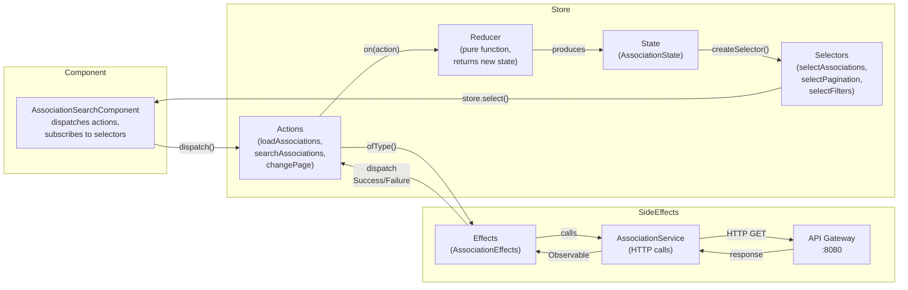
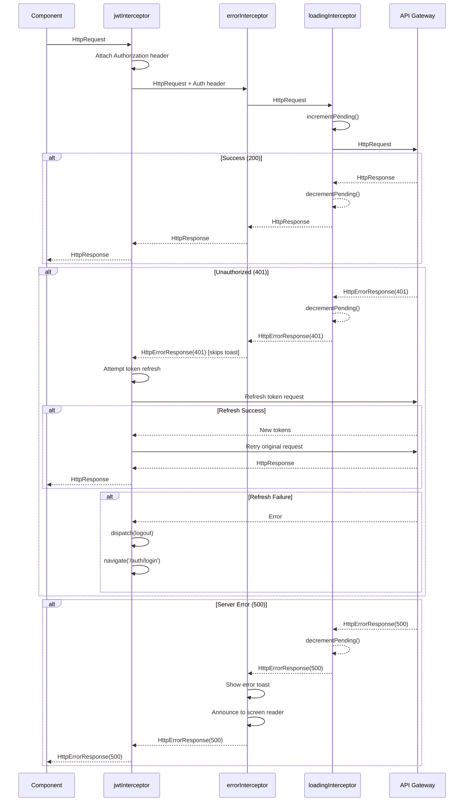

# 08 -- Frontend Architecture

> **Family Hobbies Manager** -- Angular 17+ Frontend SPA
> Architecture Document Series | Document 8 of 12

---

## Table of Contents

1. [Technology Stack](#1-technology-stack)
2. [Project Structure](#2-project-structure)
3. [Routing Architecture](#3-routing-architecture)
4. [NgRx State Management](#4-ngrx-state-management)
5. [RGAA Accessibility Compliance](#5-rgaa-accessibility-compliance)
6. [HTTP Interceptors](#6-http-interceptors)
7. [Angular Material Custom Theme](#7-angular-material-custom-theme)
8. [Key UI Screens](#8-key-ui-screens)
9. [Diagrams](#9-diagrams)

---

## 1. Technology Stack

| Technology | Version | Purpose |
|----|----|----|
| **Angular** | 17+ | SPA framework with standalone components, new control flow (`@if`, `@for`, `@switch`), signals |
| **Angular Material** | 17+ | UI component library following Material Design, built-in a11y support |
| **NgRx** | 17+ | Reactive state management -- Store, Effects, Selectors, Entity |
| **SCSS** | -- | CSS preprocessor with BEM methodology, theming, and responsive mixins |
| **Jest** | 29+ | Unit testing for components, services, pipes, guards, NgRx stores |
| **Playwright** | 1.40+ | Cross-browser end-to-end testing with Page Object Model |
| **Angular CDK** | 17+ | Accessibility utilities -- `a11y` module (FocusTrap, LiveAnnouncer, FocusMonitor), overlay, layout |
| **RxJS** | 7+ | Reactive programming for HTTP calls, store subscriptions, event streams |
| **TypeScript** | 5.3+ | Strict mode enabled, type-safe development across the entire frontend |
| **Nginx** | 1.25+ | Production static file server and reverse proxy to API Gateway |

---

## 2. Project Structure

```
frontend/
├── src/
│   ├── app/
│   │   ├── core/                          # Singleton services, guards, interceptors
│   │   │   ├── auth/
│   │   │   │   ├── auth.guard.ts
│   │   │   │   ├── role.guard.ts
│   │   │   │   ├── auth.service.ts
│   │   │   │   └── auth.model.ts
│   │   │   ├── interceptors/
│   │   │   │   ├── jwt.interceptor.ts
│   │   │   │   ├── error.interceptor.ts
│   │   │   │   └── loading.interceptor.ts
│   │   │   ├── services/
│   │   │   │   ├── api.service.ts          # Base HTTP service with typed methods
│   │   │   │   └── notification.service.ts # Toaster / snackbar service
│   │   │   └── models/
│   │   │       ├── user.model.ts
│   │   │       ├── api-response.model.ts
│   │   │       └── page.model.ts
│   │   ├── features/                       # Lazy-loaded feature modules
│   │   │   ├── auth/
│   │   │   │   ├── login/
│   │   │   │   │   ├── login.component.ts
│   │   │   │   │   ├── login.component.html
│   │   │   │   │   ├── login.component.scss
│   │   │   │   │   └── login.component.spec.ts
│   │   │   │   ├── register/
│   │   │   │   │   ├── register.component.ts
│   │   │   │   │   ├── register.component.html
│   │   │   │   │   ├── register.component.scss
│   │   │   │   │   └── register.component.spec.ts
│   │   │   │   ├── store/
│   │   │   │   │   ├── auth.actions.ts
│   │   │   │   │   ├── auth.reducer.ts
│   │   │   │   │   ├── auth.effects.ts
│   │   │   │   │   ├── auth.selectors.ts
│   │   │   │   │   └── auth.state.ts
│   │   │   │   └── auth.routes.ts
│   │   │   ├── dashboard/
│   │   │   │   ├── dashboard.component.ts
│   │   │   │   ├── dashboard.component.html
│   │   │   │   ├── dashboard.component.scss
│   │   │   │   ├── dashboard.component.spec.ts
│   │   │   │   ├── widgets/
│   │   │   │   │   ├── family-overview-widget.component.ts
│   │   │   │   │   ├── subscriptions-widget.component.ts
│   │   │   │   │   ├── upcoming-sessions-widget.component.ts
│   │   │   │   │   └── recent-payments-widget.component.ts
│   │   │   │   └── dashboard.routes.ts
│   │   │   ├── associations/
│   │   │   │   ├── association-search/
│   │   │   │   │   ├── association-search.component.ts
│   │   │   │   │   ├── association-search.component.html
│   │   │   │   │   ├── association-search.component.scss
│   │   │   │   │   └── association-search.component.spec.ts
│   │   │   │   ├── association-detail/
│   │   │   │   │   ├── association-detail.component.ts
│   │   │   │   │   ├── association-detail.component.html
│   │   │   │   │   ├── association-detail.component.scss
│   │   │   │   │   └── association-detail.component.spec.ts
│   │   │   │   ├── association-card/
│   │   │   │   │   ├── association-card.component.ts
│   │   │   │   │   ├── association-card.component.html
│   │   │   │   │   ├── association-card.component.scss
│   │   │   │   │   └── association-card.component.spec.ts
│   │   │   │   ├── store/
│   │   │   │   │   ├── association.actions.ts
│   │   │   │   │   ├── association.reducer.ts
│   │   │   │   │   ├── association.effects.ts
│   │   │   │   │   ├── association.selectors.ts
│   │   │   │   │   └── association.state.ts
│   │   │   │   ├── services/
│   │   │   │   │   └── association.service.ts
│   │   │   │   ├── models/
│   │   │   │   │   └── association.model.ts
│   │   │   │   └── associations.routes.ts
│   │   │   ├── family/
│   │   │   │   ├── family-dashboard/
│   │   │   │   │   ├── family-dashboard.component.ts
│   │   │   │   │   ├── family-dashboard.component.html
│   │   │   │   │   ├── family-dashboard.component.scss
│   │   │   │   │   └── family-dashboard.component.spec.ts
│   │   │   │   ├── family-member-form/
│   │   │   │   │   ├── family-member-form.component.ts
│   │   │   │   │   ├── family-member-form.component.html
│   │   │   │   │   ├── family-member-form.component.scss
│   │   │   │   │   └── family-member-form.component.spec.ts
│   │   │   │   ├── family-member-list/
│   │   │   │   │   ├── family-member-list.component.ts
│   │   │   │   │   ├── family-member-list.component.html
│   │   │   │   │   ├── family-member-list.component.scss
│   │   │   │   │   └── family-member-list.component.spec.ts
│   │   │   │   ├── store/
│   │   │   │   │   ├── family.actions.ts
│   │   │   │   │   ├── family.reducer.ts
│   │   │   │   │   ├── family.effects.ts
│   │   │   │   │   ├── family.selectors.ts
│   │   │   │   │   └── family.state.ts
│   │   │   │   ├── services/
│   │   │   │   │   └── family.service.ts
│   │   │   │   └── family.routes.ts
│   │   │   ├── subscriptions/
│   │   │   │   ├── subscription-list/
│   │   │   │   │   ├── subscription-list.component.ts
│   │   │   │   │   ├── subscription-list.component.html
│   │   │   │   │   ├── subscription-list.component.scss
│   │   │   │   │   └── subscription-list.component.spec.ts
│   │   │   │   ├── subscription-detail/
│   │   │   │   │   ├── subscription-detail.component.ts
│   │   │   │   │   ├── subscription-detail.component.html
│   │   │   │   │   ├── subscription-detail.component.scss
│   │   │   │   │   └── subscription-detail.component.spec.ts
│   │   │   │   ├── store/
│   │   │   │   │   ├── subscription.actions.ts
│   │   │   │   │   ├── subscription.reducer.ts
│   │   │   │   │   ├── subscription.effects.ts
│   │   │   │   │   ├── subscription.selectors.ts
│   │   │   │   │   └── subscription.state.ts
│   │   │   │   ├── services/
│   │   │   │   │   └── subscription.service.ts
│   │   │   │   └── subscriptions.routes.ts
│   │   │   ├── attendance/
│   │   │   │   ├── attendance-calendar/
│   │   │   │   │   ├── attendance-calendar.component.ts
│   │   │   │   │   ├── attendance-calendar.component.html
│   │   │   │   │   ├── attendance-calendar.component.scss
│   │   │   │   │   └── attendance-calendar.component.spec.ts
│   │   │   │   ├── attendance-mark/
│   │   │   │   │   ├── attendance-mark.component.ts
│   │   │   │   │   ├── attendance-mark.component.html
│   │   │   │   │   ├── attendance-mark.component.scss
│   │   │   │   │   └── attendance-mark.component.spec.ts
│   │   │   │   ├── store/
│   │   │   │   │   ├── attendance.actions.ts
│   │   │   │   │   ├── attendance.reducer.ts
│   │   │   │   │   ├── attendance.effects.ts
│   │   │   │   │   ├── attendance.selectors.ts
│   │   │   │   │   └── attendance.state.ts
│   │   │   │   ├── services/
│   │   │   │   │   └── attendance.service.ts
│   │   │   │   └── attendance.routes.ts
│   │   │   ├── payments/
│   │   │   │   ├── payment-list/
│   │   │   │   │   ├── payment-list.component.ts
│   │   │   │   │   ├── payment-list.component.html
│   │   │   │   │   ├── payment-list.component.scss
│   │   │   │   │   └── payment-list.component.spec.ts
│   │   │   │   ├── payment-detail/
│   │   │   │   │   ├── payment-detail.component.ts
│   │   │   │   │   ├── payment-detail.component.html
│   │   │   │   │   ├── payment-detail.component.scss
│   │   │   │   │   └── payment-detail.component.spec.ts
│   │   │   │   ├── invoice-download/
│   │   │   │   │   ├── invoice-download.component.ts
│   │   │   │   │   └── invoice-download.component.spec.ts
│   │   │   │   ├── store/
│   │   │   │   │   ├── payment.actions.ts
│   │   │   │   │   ├── payment.reducer.ts
│   │   │   │   │   ├── payment.effects.ts
│   │   │   │   │   ├── payment.selectors.ts
│   │   │   │   │   └── payment.state.ts
│   │   │   │   ├── services/
│   │   │   │   │   └── payment.service.ts
│   │   │   │   └── payments.routes.ts
│   │   │   └── notifications/
│   │   │       ├── notification-list/
│   │   │       │   ├── notification-list.component.ts
│   │   │       │   ├── notification-list.component.html
│   │   │       │   ├── notification-list.component.scss
│   │   │       │   └── notification-list.component.spec.ts
│   │   │       ├── notification-preferences/
│   │   │       │   ├── notification-preferences.component.ts
│   │   │       │   ├── notification-preferences.component.html
│   │   │       │   ├── notification-preferences.component.scss
│   │   │       │   └── notification-preferences.component.spec.ts
│   │   │       ├── store/
│   │   │       │   ├── notification.actions.ts
│   │   │       │   ├── notification.reducer.ts
│   │   │       │   ├── notification.effects.ts
│   │   │       │   ├── notification.selectors.ts
│   │   │       │   └── notification.state.ts
│   │   │       ├── services/
│   │   │       │   └── notification-api.service.ts
│   │   │       └── notifications.routes.ts
│   │   ├── shared/                          # Reusable components, pipes, directives
│   │   │   ├── components/
│   │   │   │   ├── confirm-dialog/
│   │   │   │   │   ├── confirm-dialog.component.ts
│   │   │   │   │   ├── confirm-dialog.component.html
│   │   │   │   │   ├── confirm-dialog.component.scss
│   │   │   │   │   └── confirm-dialog.component.spec.ts
│   │   │   │   ├── loading-spinner/
│   │   │   │   │   ├── loading-spinner.component.ts
│   │   │   │   │   ├── loading-spinner.component.html
│   │   │   │   │   └── loading-spinner.component.scss
│   │   │   │   ├── empty-state/
│   │   │   │   │   ├── empty-state.component.ts
│   │   │   │   │   ├── empty-state.component.html
│   │   │   │   │   └── empty-state.component.scss
│   │   │   │   ├── page-header/
│   │   │   │   │   ├── page-header.component.ts
│   │   │   │   │   ├── page-header.component.html
│   │   │   │   │   └── page-header.component.scss
│   │   │   │   └── data-table/
│   │   │   │       ├── data-table.component.ts
│   │   │   │       ├── data-table.component.html
│   │   │   │       ├── data-table.component.scss
│   │   │   │       └── data-table.component.spec.ts
│   │   │   ├── pipes/
│   │   │   │   ├── date-format.pipe.ts
│   │   │   │   ├── date-format.pipe.spec.ts
│   │   │   │   ├── truncate.pipe.ts
│   │   │   │   └── truncate.pipe.spec.ts
│   │   │   └── directives/
│   │   │       ├── role.directive.ts       # *appHasRole="'ADMIN'"
│   │   │       ├── role.directive.spec.ts
│   │   │       ├── autofocus.directive.ts
│   │   │       └── click-outside.directive.ts
│   │   ├── layout/
│   │   │   ├── header/
│   │   │   │   ├── header.component.ts
│   │   │   │   ├── header.component.html
│   │   │   │   └── header.component.scss
│   │   │   ├── sidebar/
│   │   │   │   ├── sidebar.component.ts
│   │   │   │   ├── sidebar.component.html
│   │   │   │   └── sidebar.component.scss
│   │   │   ├── footer/
│   │   │   │   ├── footer.component.ts
│   │   │   │   ├── footer.component.html
│   │   │   │   └── footer.component.scss
│   │   │   └── main-layout.component.ts
│   │   ├── app.component.ts
│   │   ├── app.component.html
│   │   ├── app.component.scss
│   │   ├── app.config.ts
│   │   └── app.routes.ts
│   ├── assets/
│   │   ├── i18n/
│   │   │   └── fr.json                     # French translations
│   │   └── images/
│   │       ├── logo.svg
│   │       ├── empty-state.svg
│   │       └── icons/
│   ├── environments/
│   │   ├── environment.ts
│   │   └── environment.prod.ts
│   ├── styles/
│   │   ├── _variables.scss
│   │   ├── _mixins.scss
│   │   ├── _typography.scss
│   │   ├── _accessibility.scss             # RGAA-specific styles
│   │   ├── _material-overrides.scss        # Angular Material theme overrides
│   │   └── styles.scss                     # Global entry point
│   └── index.html
├── e2e/                                     # Playwright tests
│   ├── fixtures/
│   │   ├── test-data.ts
│   │   └── auth-helpers.ts
│   ├── pages/                               # Page Object Model
│   │   ├── login.page.ts
│   │   ├── register.page.ts
│   │   ├── dashboard.page.ts
│   │   ├── association-search.page.ts
│   │   ├── family-management.page.ts
│   │   └── attendance-calendar.page.ts
│   └── specs/
│       ├── auth.spec.ts
│       ├── association-search.spec.ts
│       ├── family-management.spec.ts
│       ├── subscription-flow.spec.ts
│       ├── attendance-tracking.spec.ts
│       └── payment-checkout.spec.ts
├── jest.config.ts
├── playwright.config.ts
├── tsconfig.json
├── tsconfig.app.json
├── tsconfig.spec.json
└── angular.json
```

### Core / Features / Shared Responsibilities

| Layer | Scope | Singleton? | Content |
|----|----|----|-----|
| **core/** | Application-wide infrastructure | Yes -- provided in `root` | Auth guards, HTTP interceptors, base API service, global notification service, user model |
| **features/** | Domain-specific lazy-loaded modules | No -- each feature loads independently | Components, feature routes, NgRx stores, feature services, feature models |
| **shared/** | Reusable UI building blocks | No -- imported where needed | Confirm dialog, loading spinner, empty state, page header, data table, pipes, directives |
| **layout/** | Page chrome | Yes -- rendered once in `app.component` | Header (with nav and notifications badge), sidebar (responsive), footer |

---

## 3. Routing Architecture

### Application Bootstrap (`app.config.ts`)

```typescript
// app.config.ts
import { ApplicationConfig } from '@angular/core';
import { provideRouter, withComponentInputBinding } from '@angular/router';
import { provideHttpClient, withInterceptors } from '@angular/common/http';
import { provideAnimationsAsync } from '@angular/platform-browser/animations/async';
import { provideStore } from '@ngrx/store';
import { provideEffects } from '@ngrx/effects';
import { provideStoreDevtools } from '@ngrx/store-devtools';

import { routes } from './app.routes';
import { jwtInterceptor } from './core/interceptors/jwt.interceptor';
import { errorInterceptor } from './core/interceptors/error.interceptor';
import { loadingInterceptor } from './core/interceptors/loading.interceptor';
import { authReducer } from './features/auth/store/auth.reducer';
import { AuthEffects } from './features/auth/store/auth.effects';
import { environment } from '../environments/environment';

export const appConfig: ApplicationConfig = {
  providers: [
    provideRouter(routes, withComponentInputBinding()),
    provideHttpClient(
      withInterceptors([jwtInterceptor, errorInterceptor, loadingInterceptor])
    ),
    provideAnimationsAsync(),
    provideStore({ auth: authReducer }),
    provideEffects([AuthEffects]),
    provideStoreDevtools({
      maxAge: 25,
      logOnly: environment.production,
    }),
  ],
};
```

### Root Routes (`app.routes.ts`)

```typescript
// app.routes.ts
import { Routes } from '@angular/router';
import { authGuard } from './core/auth/auth.guard';
import { roleGuard } from './core/auth/role.guard';

export const routes: Routes = [
  {
    path: '',
    redirectTo: 'dashboard',
    pathMatch: 'full',
  },
  {
    path: 'auth',
    loadChildren: () =>
      import('./features/auth/auth.routes').then((m) => m.AUTH_ROUTES),
  },
  {
    path: 'dashboard',
    loadChildren: () =>
      import('./features/dashboard/dashboard.routes').then(
        (m) => m.DASHBOARD_ROUTES
      ),
    canActivate: [authGuard],
  },
  {
    path: 'associations',
    loadChildren: () =>
      import('./features/associations/associations.routes').then(
        (m) => m.ASSOCIATION_ROUTES
      ),
    // Public -- no guard. Anyone can browse the directory.
  },
  {
    path: 'family',
    loadChildren: () =>
      import('./features/family/family.routes').then((m) => m.FAMILY_ROUTES),
    canActivate: [authGuard, roleGuard],
    data: { roles: ['FAMILY', 'ADMIN'] },
  },
  {
    path: 'subscriptions',
    loadChildren: () =>
      import('./features/subscriptions/subscriptions.routes').then(
        (m) => m.SUBSCRIPTION_ROUTES
      ),
    canActivate: [authGuard],
  },
  {
    path: 'attendance',
    loadChildren: () =>
      import('./features/attendance/attendance.routes').then(
        (m) => m.ATTENDANCE_ROUTES
      ),
    canActivate: [authGuard, roleGuard],
    data: { roles: ['ASSOCIATION', 'ADMIN'] },
  },
  {
    path: 'payments',
    loadChildren: () =>
      import('./features/payments/payments.routes').then(
        (m) => m.PAYMENT_ROUTES
      ),
    canActivate: [authGuard],
  },
  {
    path: 'notifications',
    loadChildren: () =>
      import('./features/notifications/notifications.routes').then(
        (m) => m.NOTIFICATION_ROUTES
      ),
    canActivate: [authGuard],
  },
  {
    path: '**',
    redirectTo: 'dashboard',
  },
];
```

### Feature Routes

```typescript
// features/auth/auth.routes.ts
export const AUTH_ROUTES: Routes = [
  { path: 'login', component: LoginComponent, title: 'Connexion' },
  { path: 'register', component: RegisterComponent, title: 'Inscription' },
  { path: '', redirectTo: 'login', pathMatch: 'full' },
];

// features/dashboard/dashboard.routes.ts
export const DASHBOARD_ROUTES: Routes = [
  { path: '', component: DashboardComponent, title: 'Tableau de bord' },
];

// features/associations/associations.routes.ts
export const ASSOCIATION_ROUTES: Routes = [
  {
    path: '',
    component: AssociationSearchComponent,
    title: 'Rechercher des associations',
  },
  {
    path: ':id',
    component: AssociationDetailComponent,
    title: 'Detail association',
  },
];

// features/family/family.routes.ts
export const FAMILY_ROUTES: Routes = [
  { path: '', component: FamilyDashboardComponent, title: 'Ma famille' },
  {
    path: 'members/new',
    component: FamilyMemberFormComponent,
    title: 'Ajouter un membre',
  },
  {
    path: 'members/:id/edit',
    component: FamilyMemberFormComponent,
    title: 'Modifier un membre',
  },
];

// features/subscriptions/subscriptions.routes.ts
export const SUBSCRIPTION_ROUTES: Routes = [
  {
    path: '',
    component: SubscriptionListComponent,
    title: 'Mes inscriptions',
  },
  {
    path: ':id',
    component: SubscriptionDetailComponent,
    title: 'Detail inscription',
  },
];

// features/attendance/attendance.routes.ts
export const ATTENDANCE_ROUTES: Routes = [
  {
    path: '',
    component: AttendanceCalendarComponent,
    title: 'Calendrier de presence',
  },
  {
    path: 'mark/:sessionId',
    component: AttendanceMarkComponent,
    title: 'Marquer la presence',
  },
];

// features/payments/payments.routes.ts
export const PAYMENT_ROUTES: Routes = [
  { path: '', component: PaymentListComponent, title: 'Mes paiements' },
  { path: ':id', component: PaymentDetailComponent, title: 'Detail paiement' },
];

// features/notifications/notifications.routes.ts
export const NOTIFICATION_ROUTES: Routes = [
  {
    path: '',
    component: NotificationListComponent,
    title: 'Notifications',
  },
  {
    path: 'preferences',
    component: NotificationPreferencesComponent,
    title: 'Preferences de notification',
  },
];
```

### Guards

```typescript
// core/auth/auth.guard.ts
import { inject } from '@angular/core';
import { CanActivateFn, Router } from '@angular/router';
import { Store } from '@ngrx/store';
import { map, take } from 'rxjs/operators';
import { selectIsAuthenticated } from '../../features/auth/store/auth.selectors';

export const authGuard: CanActivateFn = () => {
  const store = inject(Store);
  const router = inject(Router);

  return store.select(selectIsAuthenticated).pipe(
    take(1),
    map((isAuthenticated) => {
      if (isAuthenticated) {
        return true;
      }
      return router.createUrlTree(['/auth/login']);
    })
  );
};

// core/auth/role.guard.ts
import { inject } from '@angular/core';
import { CanActivateFn, ActivatedRouteSnapshot, Router } from '@angular/router';
import { Store } from '@ngrx/store';
import { map, take } from 'rxjs/operators';
import { selectUserRoles } from '../../features/auth/store/auth.selectors';

export const roleGuard: CanActivateFn = (route: ActivatedRouteSnapshot) => {
  const store = inject(Store);
  const router = inject(Router);
  const requiredRoles: string[] = route.data['roles'] ?? [];

  return store.select(selectUserRoles).pipe(
    take(1),
    map((userRoles) => {
      const hasRole = requiredRoles.some((role) => userRoles.includes(role));
      if (hasRole) {
        return true;
      }
      return router.createUrlTree(['/dashboard']);
    })
  );
};
```

### Routing Summary Table

| Path | Feature Module | Guard(s) | Required Roles | Page Title |
|----|----|----|----|----|
| `/auth/login` | AuthModule | None | Public | Connexion |
| `/auth/register` | AuthModule | None | Public | Inscription |
| `/dashboard` | DashboardModule | `authGuard` | Any authenticated | Tableau de bord |
| `/associations` | AssociationModule | None | Public | Rechercher des associations |
| `/associations/:id` | AssociationModule | None | Public | Detail association |
| `/family` | FamilyModule | `authGuard`, `roleGuard` | FAMILY, ADMIN | Ma famille |
| `/family/members/new` | FamilyModule | `authGuard`, `roleGuard` | FAMILY, ADMIN | Ajouter un membre |
| `/family/members/:id/edit` | FamilyModule | `authGuard`, `roleGuard` | FAMILY, ADMIN | Modifier un membre |
| `/subscriptions` | SubscriptionModule | `authGuard` | Any authenticated | Mes inscriptions |
| `/subscriptions/:id` | SubscriptionModule | `authGuard` | Any authenticated | Detail inscription |
| `/attendance` | AttendanceModule | `authGuard`, `roleGuard` | ASSOCIATION, ADMIN | Calendrier de presence |
| `/attendance/mark/:sessionId` | AttendanceModule | `authGuard`, `roleGuard` | ASSOCIATION, ADMIN | Marquer la presence |
| `/payments` | PaymentModule | `authGuard` | Any authenticated | Mes paiements |
| `/payments/:id` | PaymentModule | `authGuard` | Any authenticated | Detail paiement |
| `/notifications` | NotificationModule | `authGuard` | Any authenticated | Notifications |
| `/notifications/preferences` | NotificationModule | `authGuard` | Any authenticated | Preferences de notification |

---

## 4. NgRx State Management

### 4.1 Global State Shape

```typescript
interface AppState {
  auth: AuthState;
  associations: AssociationState;
  family: FamilyState;
  subscriptions: SubscriptionState;
  attendance: AttendanceState;
  payments: PaymentState;
  notifications: NotificationState;
}
```

### 4.2 State Slice Definitions

```typescript
// AuthState -- always loaded (root store)
interface AuthState {
  user: User | null;
  token: string | null;
  refreshToken: string | null;
  isAuthenticated: boolean;
  loading: boolean;
  error: string | null;
}

// AssociationState -- loaded with associations feature
interface AssociationState {
  associations: Association[];
  selectedAssociation: Association | null;
  filters: AssociationFilters;
  pagination: Pagination;
  loading: boolean;
  error: string | null;
}

interface AssociationFilters {
  city: string | null;
  category: ActivityCategory | null;
  keyword: string | null;
}

interface Pagination {
  page: number;
  size: number;
  totalElements: number;
  totalPages: number;
}

// FamilyState -- loaded with family feature
interface FamilyState {
  family: Family | null;
  members: FamilyMember[];
  selectedMember: FamilyMember | null;
  loading: boolean;
  error: string | null;
}

// SubscriptionState -- loaded with subscriptions feature
interface SubscriptionState {
  subscriptions: Subscription[];
  selectedSubscription: Subscription | null;
  loading: boolean;
  error: string | null;
}

// AttendanceState -- loaded with attendance feature
interface AttendanceState {
  records: AttendanceRecord[];
  sessions: Session[];
  selectedSession: Session | null;
  weekOffset: number;
  loading: boolean;
  error: string | null;
}

// PaymentState -- loaded with payments feature
interface PaymentState {
  payments: Payment[];
  selectedPayment: Payment | null;
  invoices: Invoice[];
  loading: boolean;
  error: string | null;
}

// NotificationState -- loaded with notifications feature
interface NotificationState {
  notifications: Notification[];
  unreadCount: number;
  preferences: NotificationPreference[];
  loading: boolean;
  error: string | null;
}
```

### 4.3 Complete NgRx Implementation -- Associations Feature

Below is the full NgRx implementation for the associations feature, demonstrating the pattern applied across all features.

#### `association.state.ts`

```typescript
// features/associations/store/association.state.ts
import { Association, AssociationFilters, ActivityCategory } from '../models/association.model';

export interface AssociationState {
  associations: Association[];
  selectedAssociation: Association | null;
  filters: AssociationFilters;
  pagination: {
    page: number;
    size: number;
    totalElements: number;
    totalPages: number;
  };
  loading: boolean;
  error: string | null;
}

export const initialAssociationState: AssociationState = {
  associations: [],
  selectedAssociation: null,
  filters: {
    city: null,
    category: null,
    keyword: null,
  },
  pagination: {
    page: 0,
    size: 20,
    totalElements: 0,
    totalPages: 0,
  },
  loading: false,
  error: null,
};
```

#### `association.actions.ts`

```typescript
// features/associations/store/association.actions.ts
import { createActionGroup, emptyProps, props } from '@ngrx/store';
import {
  Association,
  AssociationFilters,
  ActivityCategory,
} from '../models/association.model';

export const AssociationActions = createActionGroup({
  source: 'Associations',
  events: {
    // Load paginated list
    'Load Associations': props<{ page: number; size: number }>(),
    'Load Associations Success': props<{
      associations: Association[];
      totalElements: number;
      totalPages: number;
    }>(),
    'Load Associations Failure': props<{ error: string }>(),

    // Search with filters
    'Search Associations': props<{ filters: AssociationFilters }>(),
    'Search Associations Success': props<{
      associations: Association[];
      totalElements: number;
      totalPages: number;
    }>(),
    'Search Associations Failure': props<{ error: string }>(),

    // Select single association
    'Select Association': props<{ id: number }>(),
    'Select Association Success': props<{ association: Association }>(),
    'Select Association Failure': props<{ error: string }>(),

    // Filter management
    'Set City Filter': props<{ city: string | null }>(),
    'Set Category Filter': props<{ category: ActivityCategory | null }>(),
    'Set Keyword Filter': props<{ keyword: string | null }>(),
    'Clear Filters': emptyProps(),

    // Pagination
    'Change Page': props<{ page: number }>(),

    // Clear selection
    'Clear Selection': emptyProps(),
  },
});
```

#### `association.reducer.ts`

```typescript
// features/associations/store/association.reducer.ts
import { createReducer, on } from '@ngrx/store';
import { AssociationActions } from './association.actions';
import { initialAssociationState } from './association.state';

export const associationReducer = createReducer(
  initialAssociationState,

  // Load associations
  on(AssociationActions.loadAssociations, (state, { page, size }) => ({
    ...state,
    loading: true,
    error: null,
    pagination: { ...state.pagination, page, size },
  })),

  on(
    AssociationActions.loadAssociationsSuccess,
    (state, { associations, totalElements, totalPages }) => ({
      ...state,
      associations,
      loading: false,
      error: null,
      pagination: { ...state.pagination, totalElements, totalPages },
    })
  ),

  on(AssociationActions.loadAssociationsFailure, (state, { error }) => ({
    ...state,
    loading: false,
    error,
  })),

  // Search associations
  on(AssociationActions.searchAssociations, (state, { filters }) => ({
    ...state,
    loading: true,
    error: null,
    filters,
    pagination: { ...state.pagination, page: 0 },
  })),

  on(
    AssociationActions.searchAssociationsSuccess,
    (state, { associations, totalElements, totalPages }) => ({
      ...state,
      associations,
      loading: false,
      error: null,
      pagination: { ...state.pagination, totalElements, totalPages },
    })
  ),

  on(AssociationActions.searchAssociationsFailure, (state, { error }) => ({
    ...state,
    loading: false,
    error,
  })),

  // Select association
  on(AssociationActions.selectAssociation, (state) => ({
    ...state,
    loading: true,
    error: null,
  })),

  on(
    AssociationActions.selectAssociationSuccess,
    (state, { association }) => ({
      ...state,
      selectedAssociation: association,
      loading: false,
      error: null,
    })
  ),

  on(AssociationActions.selectAssociationFailure, (state, { error }) => ({
    ...state,
    loading: false,
    error,
  })),

  // Filters
  on(AssociationActions.setCityFilter, (state, { city }) => ({
    ...state,
    filters: { ...state.filters, city },
  })),

  on(AssociationActions.setCategoryFilter, (state, { category }) => ({
    ...state,
    filters: { ...state.filters, category },
  })),

  on(AssociationActions.setKeywordFilter, (state, { keyword }) => ({
    ...state,
    filters: { ...state.filters, keyword },
  })),

  on(AssociationActions.clearFilters, (state) => ({
    ...state,
    filters: { city: null, category: null, keyword: null },
    pagination: { ...state.pagination, page: 0 },
  })),

  // Pagination
  on(AssociationActions.changePage, (state, { page }) => ({
    ...state,
    pagination: { ...state.pagination, page },
  })),

  // Clear selection
  on(AssociationActions.clearSelection, (state) => ({
    ...state,
    selectedAssociation: null,
  }))
);
```

#### `association.effects.ts`

```typescript
// features/associations/store/association.effects.ts
import { inject, Injectable } from '@angular/core';
import { Actions, createEffect, ofType } from '@ngrx/effects';
import { Store } from '@ngrx/store';
import { of } from 'rxjs';
import { catchError, map, switchMap, withLatestFrom } from 'rxjs/operators';
import { AssociationActions } from './association.actions';
import { selectAssociationFilters, selectPagination } from './association.selectors';
import { AssociationService } from '../services/association.service';

@Injectable()
export class AssociationEffects {
  private actions$ = inject(Actions);
  private store = inject(Store);
  private associationService = inject(AssociationService);

  loadAssociations$ = createEffect(() =>
    this.actions$.pipe(
      ofType(AssociationActions.loadAssociations),
      withLatestFrom(this.store.select(selectAssociationFilters)),
      switchMap(([{ page, size }, filters]) =>
        this.associationService.searchAssociations(filters, page, size).pipe(
          map((response) =>
            AssociationActions.loadAssociationsSuccess({
              associations: response.content,
              totalElements: response.totalElements,
              totalPages: response.totalPages,
            })
          ),
          catchError((error) =>
            of(
              AssociationActions.loadAssociationsFailure({
                error: error.message ?? 'Erreur lors du chargement des associations',
              })
            )
          )
        )
      )
    )
  );

  searchAssociations$ = createEffect(() =>
    this.actions$.pipe(
      ofType(AssociationActions.searchAssociations),
      withLatestFrom(this.store.select(selectPagination)),
      switchMap(([{ filters }, pagination]) =>
        this.associationService
          .searchAssociations(filters, 0, pagination.size)
          .pipe(
            map((response) =>
              AssociationActions.searchAssociationsSuccess({
                associations: response.content,
                totalElements: response.totalElements,
                totalPages: response.totalPages,
              })
            ),
            catchError((error) =>
              of(
                AssociationActions.searchAssociationsFailure({
                  error:
                    error.message ?? 'Erreur lors de la recherche des associations',
                })
              )
            )
          )
      )
    )
  );

  selectAssociation$ = createEffect(() =>
    this.actions$.pipe(
      ofType(AssociationActions.selectAssociation),
      switchMap(({ id }) =>
        this.associationService.getAssociationById(id).pipe(
          map((association) =>
            AssociationActions.selectAssociationSuccess({ association })
          ),
          catchError((error) =>
            of(
              AssociationActions.selectAssociationFailure({
                error: error.message ?? 'Association introuvable',
              })
            )
          )
        )
      )
    )
  );

  changePage$ = createEffect(() =>
    this.actions$.pipe(
      ofType(AssociationActions.changePage),
      withLatestFrom(
        this.store.select(selectAssociationFilters),
        this.store.select(selectPagination)
      ),
      switchMap(([{ page }, filters, pagination]) =>
        this.associationService
          .searchAssociations(filters, page, pagination.size)
          .pipe(
            map((response) =>
              AssociationActions.loadAssociationsSuccess({
                associations: response.content,
                totalElements: response.totalElements,
                totalPages: response.totalPages,
              })
            ),
            catchError((error) =>
              of(
                AssociationActions.loadAssociationsFailure({
                  error: error.message ?? 'Erreur lors du changement de page',
                })
              )
            )
          )
      )
    )
  );
}
```

#### `association.selectors.ts`

```typescript
// features/associations/store/association.selectors.ts
import { createFeatureSelector, createSelector } from '@ngrx/store';
import { AssociationState } from './association.state';

export const selectAssociationState =
  createFeatureSelector<AssociationState>('associations');

// List selectors
export const selectAssociations = createSelector(
  selectAssociationState,
  (state) => state.associations
);

export const selectAssociationsLoading = createSelector(
  selectAssociationState,
  (state) => state.loading
);

export const selectAssociationsError = createSelector(
  selectAssociationState,
  (state) => state.error
);

// Selected association
export const selectSelectedAssociation = createSelector(
  selectAssociationState,
  (state) => state.selectedAssociation
);

// Filters
export const selectAssociationFilters = createSelector(
  selectAssociationState,
  (state) => state.filters
);

export const selectHasActiveFilters = createSelector(
  selectAssociationFilters,
  (filters) =>
    filters.city !== null ||
    filters.category !== null ||
    filters.keyword !== null
);

// Pagination
export const selectPagination = createSelector(
  selectAssociationState,
  (state) => state.pagination
);

export const selectCurrentPage = createSelector(
  selectPagination,
  (pagination) => pagination.page
);

export const selectTotalPages = createSelector(
  selectPagination,
  (pagination) => pagination.totalPages
);

export const selectTotalElements = createSelector(
  selectPagination,
  (pagination) => pagination.totalElements
);

// Combined selectors for view models
export const selectAssociationSearchViewModel = createSelector(
  selectAssociations,
  selectAssociationsLoading,
  selectAssociationsError,
  selectAssociationFilters,
  selectPagination,
  (associations, loading, error, filters, pagination) => ({
    associations,
    loading,
    error,
    filters,
    pagination,
  })
);

export const selectAssociationDetailViewModel = createSelector(
  selectSelectedAssociation,
  selectAssociationsLoading,
  selectAssociationsError,
  (association, loading, error) => ({
    association,
    loading,
    error,
  })
);
```

#### Feature Service (`association.service.ts`)

```typescript
// features/associations/services/association.service.ts
import { Injectable, inject } from '@angular/core';
import { HttpClient, HttpParams } from '@angular/common/http';
import { Observable } from 'rxjs';
import { Association, AssociationFilters } from '../models/association.model';
import { PageResponse } from '../../../core/models/page.model';
import { environment } from '../../../../environments/environment';

@Injectable({ providedIn: 'root' })
export class AssociationService {
  private http = inject(HttpClient);
  private baseUrl = `${environment.apiUrl}/api/v1/associations`;

  searchAssociations(
    filters: AssociationFilters,
    page: number,
    size: number
  ): Observable<PageResponse<Association>> {
    let params = new HttpParams()
      .set('page', page.toString())
      .set('size', size.toString());

    if (filters.city) {
      params = params.set('city', filters.city);
    }
    if (filters.category) {
      params = params.set('category', filters.category);
    }
    if (filters.keyword) {
      params = params.set('keyword', filters.keyword);
    }

    return this.http.get<PageResponse<Association>>(this.baseUrl, { params });
  }

  getAssociationById(id: number): Observable<Association> {
    return this.http.get<Association>(`${this.baseUrl}/${id}`);
  }
}
```

#### Component Usage Example

```typescript
// features/associations/association-search/association-search.component.ts
import { Component, inject, OnInit } from '@angular/core';
import { CommonModule } from '@angular/common';
import { ReactiveFormsModule, FormBuilder, FormGroup } from '@angular/forms';
import { Store } from '@ngrx/store';
import { MatFormFieldModule } from '@angular/material/form-field';
import { MatInputModule } from '@angular/material/input';
import { MatSelectModule } from '@angular/material/select';
import { MatButtonModule } from '@angular/material/button';
import { MatPaginatorModule, PageEvent } from '@angular/material/paginator';
import { MatProgressSpinnerModule } from '@angular/material/progress-spinner';
import { LiveAnnouncer } from '@angular/cdk/a11y';

import { AssociationActions } from '../store/association.actions';
import { selectAssociationSearchViewModel } from '../store/association.selectors';
import { AssociationCardComponent } from '../association-card/association-card.component';
import { EmptyStateComponent } from '../../../shared/components/empty-state/empty-state.component';
import { PageHeaderComponent } from '../../../shared/components/page-header/page-header.component';

@Component({
  selector: 'app-association-search',
  standalone: true,
  imports: [
    CommonModule,
    ReactiveFormsModule,
    MatFormFieldModule,
    MatInputModule,
    MatSelectModule,
    MatButtonModule,
    MatPaginatorModule,
    MatProgressSpinnerModule,
    AssociationCardComponent,
    EmptyStateComponent,
    PageHeaderComponent,
  ],
  templateUrl: './association-search.component.html',
  styleUrl: './association-search.component.scss',
})
export class AssociationSearchComponent implements OnInit {
  private store = inject(Store);
  private fb = inject(FormBuilder);
  private liveAnnouncer = inject(LiveAnnouncer);

  vm$ = this.store.select(selectAssociationSearchViewModel);
  filterForm: FormGroup = this.fb.group({
    city: [''],
    category: [null],
    keyword: [''],
  });

  ngOnInit(): void {
    this.store.dispatch(
      AssociationActions.loadAssociations({ page: 0, size: 20 })
    );
  }

  onSearch(): void {
    const filters = this.filterForm.value;
    this.store.dispatch(AssociationActions.searchAssociations({ filters }));
    this.liveAnnouncer.announce('Recherche en cours...');
  }

  onClearFilters(): void {
    this.filterForm.reset();
    this.store.dispatch(AssociationActions.clearFilters());
    this.store.dispatch(
      AssociationActions.loadAssociations({ page: 0, size: 20 })
    );
    this.liveAnnouncer.announce('Filtres reinitialises');
  }

  onPageChange(event: PageEvent): void {
    this.store.dispatch(AssociationActions.changePage({ page: event.pageIndex }));
    this.liveAnnouncer.announce(
      `Page ${event.pageIndex + 1} de ${event.length}`
    );
  }
}
```

---

## 5. RGAA Accessibility Compliance

### 5.1 Overview

RGAA (Referentiel General d'Amelioration de l'Accessibilite) is the French government accessibility standard, equivalent to WCAG 2.1 AA. Compliance is **mandatory** for all public-facing government services and is a critical requirement in enterprise contexts.

This application targets **RGAA 4.1 conformity** across all user-facing screens.

### 5.2 RGAA Compliance Checklist

| RGAA Criterion | Requirement | Implementation |
|----|----|----|
| **1.1** Meaningful images have alt text | All images convey their meaning textually | All `` elements have descriptive `alt` attributes. All `<mat-icon>` elements have `aria-label` when used as interactive or informational elements. Decorative images use `alt=""` and `aria-hidden="true"`. |
| **1.2** Decorative images ignored by AT | Screen readers skip decorative content | Decorative icons and illustrations use `aria-hidden="true"` and empty `alt` attributes. |
| **3.1** Color contrast minimum 4.5:1 | Text is readable by users with low vision | Custom Angular Material theme uses AA-compliant palette. All foreground/background pairs validated with axe-core. Contrast ratios: body text 7.2:1, large text 5.1:1, interactive elements 4.8:1. |
| **3.2** Information not conveyed by color alone | Color-blind users receive equivalent information | Status indicators (active/inactive, present/absent) use both color and icon/text labels. Error states use red color **plus** `<mat-icon>error</mat-icon>` and text description. |
| **4.1** Media controls accessible | Video/audio has keyboard controls | N/A -- no media content in this application. |
| **7.1** Scripts accessible | All interactive elements keyboard-navigable | All custom components support Tab, Enter, Escape, Space, Arrow key navigation. Angular Material components are keyboard-accessible by default. Custom widgets use `@angular/cdk/a11y` FocusTrap and FocusMonitor. |
| **7.2** Focus visible | Users can see which element has focus | Custom focus styles with high-contrast outline (3px solid, `$fhm-focus-color`). Never `outline: none` without a replacement. `:focus-visible` used to avoid outline on mouse clicks. |
| **8.1** Valid HTML | HTML passes validation | Angular strict template checking enabled (`strictTemplates: true`). Semantic HTML5 elements used throughout. |
| **8.2** Page language specified | Screen readers use correct pronunciation | `<html lang="fr">` set in `index.html`. Dynamic content in French with proper `lang` attribute on any non-French text. |
| **8.6** Page title relevant | Each page has a unique, descriptive title | Angular `Title` service updates `<title>` on route change via `title` property in route config (e.g., `title: 'Rechercher des associations'`). |
| **9.1** Heading hierarchy | Headings follow logical order | Every page starts with `<h1>`. Subheadings follow `<h2>`, `<h3>` without skipping levels. Checked via axe-core linting rules. |
| **10.1** CSS does not disable content | Content visible without CSS | All content is in the DOM. No `display: none` on meaningful content (only on visually-hidden accessible labels). No content generated solely via CSS `::before`/`::after` for meaningful text. |
| **10.7** Focus order logical | Tab order matches visual order | DOM order matches visual layout. No `tabindex` values greater than 0. Focus management on route changes resets focus to `<main>`. |
| **11.1** Form labels | All inputs have associated labels | All `<mat-form-field>` components include `<mat-label>`. Standalone inputs use `aria-label` or `aria-labelledby`. Labels are always visible (no placeholder-only labeling). |
| **11.2** Form error messages | Errors are linked to their fields | `<mat-error>` elements within `<mat-form-field>` are automatically linked via `aria-describedby`. Custom validation messages use explicit `aria-describedby` referencing the error element `id`. |
| **11.10** Form error summary | Users are informed of all errors | On form submission failure, an error summary at the top of the form lists all errors with anchor links to the problematic fields. Summary is announced via `LiveAnnouncer`. |
| **12.1** Navigation landmarks | Page structure uses semantic regions | `<header>` (site header), `<nav>` (primary navigation), `<main>` (page content), `<aside>` (sidebar), `<footer>` (site footer). Each landmark has `aria-label` when multiple of the same type exist. |
| **12.7** Skip links | Users can bypass repetitive navigation | "Aller au contenu principal" skip link is the first focusable element in the DOM. Visually hidden until focused. |
| **13.1** RGAA conformity declaration | Conformity statement available | Accessibility statement page reachable from every page footer, declaring RGAA conformity level and contact for accessibility issues. |

### 5.3 Accessibility Implementation Patterns

#### Skip Link

```html
<!-- index.html or app.component.html -->
<a class="skip-link" href="#main-content">
  Aller au contenu principal
</a>

<app-header></app-header>
<nav aria-label="Navigation principale">
  <app-sidebar></app-sidebar>
</nav>
<main id="main-content" role="main" tabindex="-1">
  <router-outlet></router-outlet>
</main>
<app-footer></app-footer>
```

#### Focus Management on Route Changes

```typescript
// app.component.ts
import { Component, inject, ViewChild, ElementRef } from '@angular/core';
import { Router, NavigationEnd } from '@angular/router';
import { filter } from 'rxjs/operators';

@Component({
  selector: 'app-root',
  templateUrl: './app.component.html',
  styleUrl: './app.component.scss',
  standalone: true,
  imports: [RouterOutlet, HeaderComponent, SidebarComponent, FooterComponent],
})
export class AppComponent {
  @ViewChild('mainContent', { static: true })
  mainContent!: ElementRef<HTMLElement>;

  private router = inject(Router);

  constructor() {
    this.router.events
      .pipe(filter((event) => event instanceof NavigationEnd))
      .subscribe(() => {
        // Reset focus to main content on navigation for screen reader users
        this.mainContent.nativeElement.focus();
      });
  }
}
```

#### LiveAnnouncer for Dynamic Content

```typescript
// Used in components that update content dynamically
import { LiveAnnouncer } from '@angular/cdk/a11y';

@Component({ /* ... */ })
export class AttendanceMarkComponent {
  private liveAnnouncer = inject(LiveAnnouncer);

  onMarkPresent(memberName: string): void {
    // ... business logic ...
    this.liveAnnouncer.announce(
      `Presence de ${memberName} enregistree avec succes`,
      'polite'
    );
  }

  onMarkAbsent(memberName: string): void {
    // ... business logic ...
    this.liveAnnouncer.announce(
      `Absence de ${memberName} enregistree`,
      'polite'
    );
  }
}
```

#### FocusTrap for Modal Dialogs

```typescript
// shared/components/confirm-dialog/confirm-dialog.component.ts
import { Component, inject } from '@angular/core';
import { A11yModule } from '@angular/cdk/a11y';
import {
  MAT_DIALOG_DATA,
  MatDialogRef,
  MatDialogModule,
} from '@angular/material/dialog';

@Component({
  selector: 'app-confirm-dialog',
  standalone: true,
  imports: [MatDialogModule, A11yModule, MatButtonModule],
  template: `
    <div cdkTrapFocus cdkTrapFocusAutoCapture>
      <h2 mat-dialog-title id="dialog-title">{{ data.title }}</h2>
      <mat-dialog-content>
        <p id="dialog-description">{{ data.message }}</p>
      </mat-dialog-content>
      <mat-dialog-actions align="end">
        <button
          mat-button
          (click)="onCancel()"
          cdkFocusInitial
          aria-label="Annuler et fermer la boite de dialogue"
        >
          Annuler
        </button>
        <button
          mat-raised-button
          color="warn"
          (click)="onConfirm()"
          [attr.aria-label]="'Confirmer : ' + data.title"
        >
          Confirmer
        </button>
      </mat-dialog-actions>
    </div>
  `,
})
export class ConfirmDialogComponent {
  data = inject(MAT_DIALOG_DATA);
  dialogRef = inject(MatDialogRef<ConfirmDialogComponent>);

  onCancel(): void {
    this.dialogRef.close(false);
  }

  onConfirm(): void {
    this.dialogRef.close(true);
  }
}
```

#### Role Directive for Conditional Rendering

```typescript
// shared/directives/role.directive.ts
import {
  Directive,
  Input,
  TemplateRef,
  ViewContainerRef,
  inject,
  OnInit,
  OnDestroy,
} from '@angular/core';
import { Store } from '@ngrx/store';
import { Subscription } from 'rxjs';
import { selectUserRoles } from '../../features/auth/store/auth.selectors';

@Directive({
  selector: '[appHasRole]',
  standalone: true,
})
export class HasRoleDirective implements OnInit, OnDestroy {
  @Input('appHasRole') requiredRoles: string | string[] = [];

  private store = inject(Store);
  private templateRef = inject(TemplateRef<unknown>);
  private viewContainer = inject(ViewContainerRef);
  private subscription: Subscription | null = null;
  private isVisible = false;

  ngOnInit(): void {
    const roles = Array.isArray(this.requiredRoles)
      ? this.requiredRoles
      : [this.requiredRoles];

    this.subscription = this.store
      .select(selectUserRoles)
      .subscribe((userRoles) => {
        const hasRole = roles.some((role) => userRoles.includes(role));
        if (hasRole && !this.isVisible) {
          this.viewContainer.createEmbeddedView(this.templateRef);
          this.isVisible = true;
        } else if (!hasRole && this.isVisible) {
          this.viewContainer.clear();
          this.isVisible = false;
        }
      });
  }

  ngOnDestroy(): void {
    this.subscription?.unsubscribe();
  }
}
```

Usage:

```html
<button mat-raised-button *appHasRole="'ADMIN'" (click)="onDeleteUser()">
  Supprimer l'utilisateur
</button>

<section *appHasRole="['ASSOCIATION', 'ADMIN']">
  <app-attendance-mark></app-attendance-mark>
</section>
```

#### Keyboard Navigation on Custom Components

```typescript
// features/associations/association-card/association-card.component.ts
import { Component, Input, Output, EventEmitter, HostListener } from '@angular/core';
import { Association } from '../models/association.model';

@Component({
  selector: 'app-association-card',
  standalone: true,
  host: {
    role: 'article',
    tabindex: '0',
    '[attr.aria-label]': 'association.name + " - " + association.city',
  },
  templateUrl: './association-card.component.html',
  styleUrl: './association-card.component.scss',
})
export class AssociationCardComponent {
  @Input({ required: true }) association!: Association;
  @Output() selected = new EventEmitter<number>();

  @HostListener('keydown.enter')
  @HostListener('keydown.space', ['$event'])
  onActivate(event?: KeyboardEvent): void {
    event?.preventDefault();
    this.selected.emit(this.association.id);
  }
}
```

#### Accessible Form with Error Summary

```html
<!-- features/auth/register/register.component.html -->
<app-page-header title="Inscription" subtitle="Creez votre compte famille"></app-page-header>

<!-- Error summary - announced by screen readers on form submission failure -->
@if (formErrors.length > 0) {
  <div
    class="register__error-summary"
    role="alert"
    aria-labelledby="error-summary-title"
  >
    <h2 id="error-summary-title">
      <mat-icon aria-hidden="true">error</mat-icon>
      {{ formErrors.length }} erreur(s) a corriger
    </h2>
    <ul>
      @for (error of formErrors; track error.field) {
        <li>
          <a [href]="'#field-' + error.field">{{ error.message }}</a>
        </li>
      }
    </ul>
  </div>
}

<form
  [formGroup]="registerForm"
  (ngSubmit)="onSubmit()"
  novalidate
  aria-label="Formulaire d'inscription"
>
  <mat-form-field appearance="outline">
    <mat-label>Adresse email</mat-label>
    <input
      matInput
      formControlName="email"
      type="email"
      id="field-email"
      autocomplete="email"
      aria-required="true"
      [attr.aria-invalid]="registerForm.get('email')?.invalid && registerForm.get('email')?.touched"
      [attr.aria-describedby]="registerForm.get('email')?.errors ? 'email-error' : null"
    />
    <mat-error id="email-error">
      @if (registerForm.get('email')?.hasError('required')) {
        L'adresse email est obligatoire
      }
      @if (registerForm.get('email')?.hasError('email')) {
        Veuillez saisir une adresse email valide
      }
    </mat-error>
  </mat-form-field>

  <mat-form-field appearance="outline">
    <mat-label>Mot de passe</mat-label>
    <input
      matInput
      formControlName="password"
      [type]="hidePassword ? 'password' : 'text'"
      id="field-password"
      autocomplete="new-password"
      aria-required="true"
      [attr.aria-invalid]="registerForm.get('password')?.invalid && registerForm.get('password')?.touched"
      [attr.aria-describedby]="'password-hint ' + (registerForm.get('password')?.errors ? 'password-error' : '')"
    />
    <button
      mat-icon-button
      matSuffix
      type="button"
      (click)="hidePassword = !hidePassword"
      [attr.aria-label]="hidePassword ? 'Afficher le mot de passe' : 'Masquer le mot de passe'"
    >
      <mat-icon>{{ hidePassword ? 'visibility_off' : 'visibility' }}</mat-icon>
    </button>
    <mat-hint id="password-hint">Minimum 8 caracteres, une majuscule, un chiffre</mat-hint>
    <mat-error id="password-error">
      @if (registerForm.get('password')?.hasError('required')) {
        Le mot de passe est obligatoire
      }
      @if (registerForm.get('password')?.hasError('minlength')) {
        Le mot de passe doit contenir au moins 8 caracteres
      }
    </mat-error>
  </mat-form-field>

  <button
    mat-raised-button
    color="primary"
    type="submit"
    [disabled]="registerForm.invalid || loading"
    aria-label="Creer mon compte"
  >
    @if (loading) {
      <mat-spinner diameter="20" aria-label="Chargement en cours"></mat-spinner>
    } @else {
      Creer mon compte
    }
  </button>
</form>
```

### 5.4 Custom SCSS for RGAA

```scss
// styles/_accessibility.scss

// =========================================================
// Skip link - first focusable element in the DOM
// =========================================================
.skip-link {
  position: absolute;
  top: -100%;
  left: 0;
  z-index: 10000;
  padding: 12px 24px;
  background-color: var(--fhm-primary-900);
  color: #ffffff;
  font-size: 1rem;
  font-weight: 600;
  text-decoration: none;
  border-bottom-right-radius: 4px;
  transition: top 0.15s ease-in-out;

  &:focus {
    top: 0;
    outline: 3px solid var(--fhm-focus-color);
    outline-offset: 2px;
  }
}

// =========================================================
// Focus styles - visible and high-contrast
// =========================================================
:focus-visible {
  outline: 3px solid var(--fhm-focus-color, #1a73e8);
  outline-offset: 2px;
}

// Remove default outline only when :focus-visible is supported
:focus:not(:focus-visible) {
  outline: none;
}

// Enhanced focus for interactive elements within Angular Material
.mat-mdc-button:focus-visible,
.mat-mdc-icon-button:focus-visible,
.mat-mdc-fab:focus-visible,
.mat-mdc-mini-fab:focus-visible {
  outline: 3px solid var(--fhm-focus-color, #1a73e8);
  outline-offset: 2px;
}

.mat-mdc-form-field .mdc-text-field--focused {
  outline: 2px solid var(--fhm-focus-color, #1a73e8);
  outline-offset: 1px;
}

// =========================================================
// Visually hidden - for screen reader only content
// =========================================================
.sr-only {
  position: absolute;
  width: 1px;
  height: 1px;
  padding: 0;
  margin: -1px;
  overflow: hidden;
  clip: rect(0, 0, 0, 0);
  white-space: nowrap;
  border: 0;
}

// =========================================================
// High contrast mode support (Windows High Contrast)
// =========================================================
@media (forced-colors: active) {
  .mat-mdc-button,
  .mat-mdc-raised-button,
  .mat-mdc-outlined-button {
    border: 1px solid ButtonText;
  }

  .mat-mdc-card {
    border: 1px solid CanvasText;
  }

  .association-card--selected {
    border: 3px solid Highlight;
  }

  .attendance-mark__status--present {
    border: 2px solid Highlight;
  }

  .attendance-mark__status--absent {
    border: 2px solid LinkText;
  }

  :focus-visible {
    outline: 3px solid Highlight;
  }
}

// =========================================================
// Reduced motion - respect user preference
// =========================================================
@media (prefers-reduced-motion: reduce) {
  *,
  *::before,
  *::after {
    animation-duration: 0.01ms !important;
    animation-iteration-count: 1 !important;
    transition-duration: 0.01ms !important;
    scroll-behavior: auto !important;
  }

  .mat-ripple {
    display: none;
  }

  .mat-mdc-progress-spinner {
    animation-duration: 0.01ms !important;
  }
}

// =========================================================
// Error summary styles
// =========================================================
.register__error-summary,
[class*="__error-summary"] {
  border: 2px solid var(--fhm-warn-500);
  border-radius: 4px;
  padding: 16px;
  margin-bottom: 24px;
  background-color: var(--fhm-warn-50);

  h2 {
    display: flex;
    align-items: center;
    gap: 8px;
    color: var(--fhm-warn-700);
    font-size: 1.125rem;
    margin: 0 0 8px 0;
  }

  ul {
    margin: 0;
    padding-left: 20px;
  }

  a {
    color: var(--fhm-warn-700);
    text-decoration: underline;

    &:hover,
    &:focus {
      color: var(--fhm-warn-900);
    }
  }
}

// =========================================================
// Status indicators - never rely on color alone (RGAA 3.2)
// =========================================================
.status-badge {
  display: inline-flex;
  align-items: center;
  gap: 6px;
  padding: 4px 12px;
  border-radius: 16px;
  font-size: 0.875rem;
  font-weight: 500;

  &--active {
    background-color: var(--fhm-success-50);
    color: var(--fhm-success-700);
    border: 1px solid var(--fhm-success-200);

    &::before {
      content: "";
      display: inline-block;
      width: 8px;
      height: 8px;
      border-radius: 50%;
      background-color: var(--fhm-success-500);
    }
  }

  &--inactive {
    background-color: var(--fhm-neutral-100);
    color: var(--fhm-neutral-600);
    border: 1px solid var(--fhm-neutral-300);

    &::before {
      content: "";
      display: inline-block;
      width: 8px;
      height: 8px;
      border-radius: 50%;
      background-color: var(--fhm-neutral-400);
    }
  }

  &--present {
    background-color: var(--fhm-success-50);
    color: var(--fhm-success-700);
    border: 1px solid var(--fhm-success-200);
  }

  &--absent {
    background-color: var(--fhm-warn-50);
    color: var(--fhm-warn-700);
    border: 1px solid var(--fhm-warn-200);
  }
}
```

### 5.5 RGAA Testing Strategy

| Tool | Type | What It Checks |
|----|----|----|
| **axe-core** (via `jest-axe`) | Automated unit tests | ARIA attributes, color contrast, heading hierarchy, form labels, landmark roles |
| **Playwright + axe** | Automated E2E tests | Full-page accessibility audit after each critical user flow |
| **Manual keyboard testing** | Manual | Tab order, focus visibility, Enter/Space activation, Escape to close, Arrow key navigation |
| **NVDA / VoiceOver** | Manual screen reader | Content announced correctly, form instructions read, dynamic updates announced, landmark navigation works |
| **Tanaguru / RGAA audit tool** | Automated + manual | French-specific RGAA criterion validation |

Example automated accessibility test:

```typescript
// features/auth/login/login.component.spec.ts
import { axe, toHaveNoViolations } from 'jest-axe';

expect.extend(toHaveNoViolations);

describe('LoginComponent', () => {
  it('should have no accessibility violations', async () => {
    const fixture = TestBed.createComponent(LoginComponent);
    fixture.detectChanges();

    const results = await axe(fixture.nativeElement);
    expect(results).toHaveNoViolations();
  });
});
```

Example Playwright a11y check:

```typescript
// e2e/specs/auth.spec.ts
import { test, expect } from '@playwright/test';
import AxeBuilder from '@axe-core/playwright';

test('login page should have no a11y violations', async ({ page }) => {
  await page.goto('/auth/login');

  const accessibilityScanResults = await new AxeBuilder({ page })
    .withTags(['wcag2a', 'wcag2aa', 'wcag21aa'])
    .analyze();

  expect(accessibilityScanResults.violations).toEqual([]);
});
```

---

## 6. HTTP Interceptors

### 6.1 JWT Interceptor

Attaches the `Authorization: Bearer <token>` header to all API requests. Handles 401 responses by attempting a token refresh, and redirects to login if the refresh also fails.

```typescript
// core/interceptors/jwt.interceptor.ts
import { HttpInterceptorFn, HttpRequest, HttpHandlerFn, HttpErrorResponse } from '@angular/common/http';
import { inject } from '@angular/core';
import { Store } from '@ngrx/store';
import { Router } from '@angular/router';
import { catchError, switchMap, take, throwError } from 'rxjs';
import { selectToken, selectRefreshToken } from '../../features/auth/store/auth.selectors';
import { AuthActions } from '../../features/auth/store/auth.actions';
import { AuthService } from '../auth/auth.service';
import { environment } from '../../../environments/environment';

export const jwtInterceptor: HttpInterceptorFn = (req, next) => {
  const store = inject(Store);
  const router = inject(Router);
  const authService = inject(AuthService);

  // Skip auth header for public endpoints
  const publicPaths = ['/api/v1/auth/login', '/api/v1/auth/register', '/api/v1/auth/refresh'];
  const isPublic = publicPaths.some((path) => req.url.includes(path));

  if (isPublic || !req.url.startsWith(environment.apiUrl)) {
    return next(req);
  }

  let token: string | null = null;
  store
    .select(selectToken)
    .pipe(take(1))
    .subscribe((t) => (token = t));

  if (!token) {
    return next(req);
  }

  const authReq = addAuthHeader(req, token);

  return next(authReq).pipe(
    catchError((error: HttpErrorResponse) => {
      if (error.status === 401) {
        // Attempt token refresh
        let refreshToken: string | null = null;
        store
          .select(selectRefreshToken)
          .pipe(take(1))
          .subscribe((rt) => (refreshToken = rt));

        if (refreshToken) {
          return authService.refreshToken(refreshToken).pipe(
            switchMap((response) => {
              store.dispatch(
                AuthActions.refreshTokenSuccess({
                  token: response.accessToken,
                  refreshToken: response.refreshToken,
                })
              );
              const retryReq = addAuthHeader(req, response.accessToken);
              return next(retryReq);
            }),
            catchError((refreshError) => {
              // Refresh failed -- force logout
              store.dispatch(AuthActions.logout());
              router.navigate(['/auth/login']);
              return throwError(() => refreshError);
            })
          );
        }

        // No refresh token -- force logout
        store.dispatch(AuthActions.logout());
        router.navigate(['/auth/login']);
      }

      return throwError(() => error);
    })
  );
};

function addAuthHeader(req: HttpRequest<unknown>, token: string): HttpRequest<unknown> {
  return req.clone({
    setHeaders: {
      Authorization: `Bearer ${token}`,
    },
  });
}
```

### 6.2 Error Interceptor

Catches HTTP errors globally, displays user-friendly toast notifications, and logs errors for debugging. Does not handle 401 errors (handled by JWT interceptor).

```typescript
// core/interceptors/error.interceptor.ts
import { HttpInterceptorFn, HttpErrorResponse } from '@angular/common/http';
import { inject } from '@angular/core';
import { MatSnackBar } from '@angular/material/snack-bar';
import { LiveAnnouncer } from '@angular/cdk/a11y';
import { catchError, throwError } from 'rxjs';

interface ApiErrorResponse {
  status: number;
  error: string;
  message: string;
  timestamp: string;
  path: string;
}

const ERROR_MESSAGES: Record<number, string> = {
  0: 'Impossible de contacter le serveur. Verifiez votre connexion internet.',
  400: 'Requete invalide. Veuillez verifier les donnees saisies.',
  403: 'Acces refuse. Vous n\'avez pas les droits necessaires.',
  404: 'Ressource introuvable.',
  409: 'Conflit. Cette operation ne peut pas etre effectuee.',
  422: 'Donnees invalides. Veuillez corriger les erreurs.',
  429: 'Trop de requetes. Veuillez patienter avant de reessayer.',
  500: 'Erreur interne du serveur. Veuillez reessayer plus tard.',
  502: 'Service temporairement indisponible. Veuillez reessayer.',
  503: 'Service en maintenance. Veuillez reessayer plus tard.',
};

export const errorInterceptor: HttpInterceptorFn = (req, next) => {
  const snackBar = inject(MatSnackBar);
  const liveAnnouncer = inject(LiveAnnouncer);

  return next(req).pipe(
    catchError((error: HttpErrorResponse) => {
      // Skip 401 -- handled by JWT interceptor
      if (error.status === 401) {
        return throwError(() => error);
      }

      let message: string;

      if (error.error && typeof error.error === 'object' && 'message' in error.error) {
        // Use server-provided message
        message = (error.error as ApiErrorResponse).message;
      } else {
        // Use default message based on status code
        message = ERROR_MESSAGES[error.status] ?? 'Une erreur inattendue est survenue.';
      }

      // Display toast notification
      snackBar.open(message, 'Fermer', {
        duration: 6000,
        panelClass: ['snackbar--error'],
        horizontalPosition: 'center',
        verticalPosition: 'bottom',
      });

      // Announce error to screen readers
      liveAnnouncer.announce(`Erreur: ${message}`, 'assertive');

      // Log for debugging (not in production)
      console.error(`[HTTP Error] ${error.status} ${req.method} ${req.url}`, error);

      return throwError(() => error);
    })
  );
};
```

### 6.3 Loading Interceptor

Tracks in-flight HTTP requests and exposes a loading signal. Components can subscribe to the loading state to show/hide a global loading spinner.

```typescript
// core/interceptors/loading.interceptor.ts
import { HttpInterceptorFn } from '@angular/common/http';
import { inject } from '@angular/core';
import { finalize } from 'rxjs/operators';
import { LoadingService } from '../services/loading.service';

export const loadingInterceptor: HttpInterceptorFn = (req, next) => {
  const loadingService = inject(LoadingService);

  // Skip loading indicator for background requests
  if (req.headers.has('X-Skip-Loading')) {
    const cleanReq = req.clone({
      headers: req.headers.delete('X-Skip-Loading'),
    });
    return next(cleanReq);
  }

  loadingService.incrementPending();

  return next(req).pipe(
    finalize(() => {
      loadingService.decrementPending();
    })
  );
};

// core/services/loading.service.ts
import { Injectable, signal, computed } from '@angular/core';

@Injectable({ providedIn: 'root' })
export class LoadingService {
  private pendingRequests = signal(0);

  /** True when at least one HTTP request is in flight */
  readonly isLoading = computed(() => this.pendingRequests() > 0);

  incrementPending(): void {
    this.pendingRequests.update((count) => count + 1);
  }

  decrementPending(): void {
    this.pendingRequests.update((count) => Math.max(0, count - 1));
  }
}
```

Usage in the layout:

```html
<!-- layout/main-layout.component.html -->
<app-header></app-header>

@if (loadingService.isLoading()) {
  <div
    class="global-loading-bar"
    role="progressbar"
    aria-label="Chargement en cours"
    aria-valuetext="Chargement en cours"
  >
    <mat-progress-bar mode="indeterminate"></mat-progress-bar>
  </div>
}

<main id="main-content" role="main" tabindex="-1">
  <router-outlet></router-outlet>
</main>

<app-footer></app-footer>
```

### Interceptor Execution Order

| Order | Interceptor | Responsibility |
|:----:|----|-----|
| 1 | `jwtInterceptor` | Attach `Authorization` header, handle 401 refresh flow |
| 2 | `errorInterceptor` | Catch non-401 errors, display toast, announce to screen readers |
| 3 | `loadingInterceptor` | Track pending requests, expose `isLoading` signal |

---

## 7. Angular Material Custom Theme

### 7.1 Theme Definition

```scss
// styles/_variables.scss
@use '@angular/material' as mat;

// =========================================================
// Color palettes -- AA contrast compliant
// =========================================================
$fhm-primary: mat.define-palette(mat.$indigo-palette, 700, 300, 900);
$fhm-accent: mat.define-palette(mat.$teal-palette, 600, 200, 800);
$fhm-warn: mat.define-palette(mat.$red-palette, 700, 300, 900);

// =========================================================
// Typography -- legible at all sizes
// =========================================================
$fhm-typography: mat.define-typography-config(
  $font-family: '"Inter", "Roboto", "Helvetica Neue", Arial, sans-serif',
  $headline-1: mat.define-typography-level(2rem, 2.5rem, 700),
  $headline-2: mat.define-typography-level(1.5rem, 2rem, 600),
  $headline-3: mat.define-typography-level(1.25rem, 1.75rem, 600),
  $body-1: mat.define-typography-level(1rem, 1.5rem, 400),
  $body-2: mat.define-typography-level(0.875rem, 1.25rem, 400),
  $caption: mat.define-typography-level(0.75rem, 1rem, 400),
  $button: mat.define-typography-level(0.875rem, 1.25rem, 600),
);

// =========================================================
// Theme definition
// =========================================================
$fhm-theme: mat.define-light-theme((
  color: (
    primary: $fhm-primary,
    accent: $fhm-accent,
    warn: $fhm-warn,
  ),
  typography: $fhm-typography,
  density: 0,
));

// Dark theme (optional, for future use)
$fhm-dark-theme: mat.define-dark-theme((
  color: (
    primary: $fhm-primary,
    accent: $fhm-accent,
    warn: $fhm-warn,
  ),
  typography: $fhm-typography,
  density: 0,
));

// =========================================================
// Custom CSS variables for RGAA compliance
// =========================================================
:root {
  // Primary palette
  --fhm-primary-50: #e8eaf6;
  --fhm-primary-100: #c5cae9;
  --fhm-primary-500: #3f51b5;
  --fhm-primary-700: #303f9f;
  --fhm-primary-900: #1a237e;

  // Accent palette
  --fhm-accent-500: #009688;
  --fhm-accent-700: #00796b;

  // Warn palette
  --fhm-warn-50: #ffebee;
  --fhm-warn-200: #ef9a9a;
  --fhm-warn-500: #f44336;
  --fhm-warn-700: #d32f2f;
  --fhm-warn-900: #b71c1c;

  // Semantic colors
  --fhm-success-50: #e8f5e9;
  --fhm-success-200: #a5d6a7;
  --fhm-success-500: #4caf50;
  --fhm-success-700: #388e3c;

  --fhm-neutral-100: #f5f5f5;
  --fhm-neutral-300: #e0e0e0;
  --fhm-neutral-400: #bdbdbd;
  --fhm-neutral-600: #757575;

  // Focus color for a11y (high-contrast, visible on all backgrounds)
  --fhm-focus-color: #1a73e8;

  // Spacing scale
  --fhm-spacing-xs: 4px;
  --fhm-spacing-sm: 8px;
  --fhm-spacing-md: 16px;
  --fhm-spacing-lg: 24px;
  --fhm-spacing-xl: 32px;
  --fhm-spacing-xxl: 48px;

  // Breakpoints
  --fhm-breakpoint-sm: 600px;
  --fhm-breakpoint-md: 960px;
  --fhm-breakpoint-lg: 1280px;
  --fhm-breakpoint-xl: 1920px;
}
```

### 7.2 Global Styles Entry Point

```scss
// styles/styles.scss
@use '@angular/material' as mat;
@use 'variables' as vars;

// Include Angular Material core styles
@include mat.core();

// Apply the light theme globally
@include mat.all-component-themes(vars.$fhm-theme);

// Import project partials
@import 'typography';
@import 'accessibility';
@import 'material-overrides';
@import 'mixins';

// =========================================================
// Global reset and base styles
// =========================================================
*,
*::before,
*::after {
  box-sizing: border-box;
}

html {
  font-size: 100%; // 16px base -- never override this
  scroll-behavior: smooth;
}

body {
  margin: 0;
  font-family: 'Inter', 'Roboto', 'Helvetica Neue', Arial, sans-serif;
  line-height: 1.5;
  color: rgba(0, 0, 0, 0.87);
  background-color: #fafafa;
  -webkit-font-smoothing: antialiased;
  -moz-osx-font-smoothing: grayscale;
}

// Dark theme media query (future enhancement)
@media (prefers-color-scheme: dark) {
  // Will apply $fhm-dark-theme when dark mode is implemented
}
```

### 7.3 SCSS Mixins

```scss
// styles/_mixins.scss

// =========================================================
// Responsive breakpoints
// =========================================================
@mixin respond-to($breakpoint) {
  @if $breakpoint == 'sm' {
    @media (min-width: 600px) { @content; }
  } @else if $breakpoint == 'md' {
    @media (min-width: 960px) { @content; }
  } @else if $breakpoint == 'lg' {
    @media (min-width: 1280px) { @content; }
  } @else if $breakpoint == 'xl' {
    @media (min-width: 1920px) { @content; }
  }
}

// =========================================================
// Card elevation
// =========================================================
@mixin card-elevation($level: 1) {
  @if $level == 0 {
    box-shadow: none;
  } @else if $level == 1 {
    box-shadow: 0 2px 4px rgba(0, 0, 0, 0.1);
  } @else if $level == 2 {
    box-shadow: 0 4px 8px rgba(0, 0, 0, 0.12);
  } @else if $level == 3 {
    box-shadow: 0 8px 16px rgba(0, 0, 0, 0.14);
  }
}

// =========================================================
// Truncate text with ellipsis
// =========================================================
@mixin text-truncate($lines: 1) {
  @if $lines == 1 {
    overflow: hidden;
    text-overflow: ellipsis;
    white-space: nowrap;
  } @else {
    display: -webkit-box;
    -webkit-line-clamp: $lines;
    -webkit-box-orient: vertical;
    overflow: hidden;
  }
}

// =========================================================
// Grid layout for card grids
// =========================================================
@mixin card-grid($min-card-width: 300px, $gap: 24px) {
  display: grid;
  grid-template-columns: repeat(auto-fill, minmax($min-card-width, 1fr));
  gap: $gap;
}
```

### 7.4 Contrast Validation

| Element | Foreground | Background | Ratio | RGAA 3.1 |
|----|----|----|:----:|:----:|
| Body text | `rgba(0,0,0,0.87)` | `#fafafa` | 12.6:1 | Pass (AAA) |
| Primary button text | `#ffffff` | `#303f9f` | 7.2:1 | Pass (AAA) |
| Accent button text | `#ffffff` | `#00796b` | 5.1:1 | Pass (AA) |
| Error text | `#d32f2f` | `#ffffff` | 5.6:1 | Pass (AA) |
| Disabled text | `rgba(0,0,0,0.38)` | `#fafafa` | 3.8:1 | N/A (disabled) |
| Link text | `#303f9f` | `#fafafa` | 7.0:1 | Pass (AAA) |
| Placeholder text | `rgba(0,0,0,0.42)` | `#ffffff` | 4.6:1 | Pass (AA) |

---

## 8. Key UI Screens

### 8.1 Login / Register

**Login (`/auth/login`)**

- Centered card layout on a clean background
- `<mat-form-field>` for email and password with visible `<mat-label>`
- Password visibility toggle button with `aria-label`
- "Se connecter" primary button, disabled until form is valid
- "Creer un compte" text link below the form
- Error banner on invalid credentials with `role="alert"`
- Loading spinner replaces button text during authentication

**Register (`/auth/register`)**

- Same centered card layout as login
- Fields: prenom, nom, email, mot de passe, confirmation de mot de passe
- Inline validation errors via `<mat-error>` with `aria-describedby`
- Error summary at the top on submission failure (see Section 5.3)
- RGPD consent checkbox with link to privacy policy
- "Creer mon compte" primary button

### 8.2 Family Dashboard (`/dashboard`)

- Page title: "Tableau de bord"
- Responsive grid layout: 2 columns on desktop, 1 column on mobile
- Four widget cards:

| Widget | Content | Data Source |
|----|----|----|
| **Apercu famille** | Family name, number of members, member avatars/initials list | `FamilyState` |
| **Inscriptions actives** | Count of active subscriptions, list with association name and activity | `SubscriptionState` |
| **Prochaines seances** | Chronological list of next 5 sessions (date, time, activity, location) | `AttendanceState` |
| **Derniers paiements** | Last 3 payments with status badge, amount, and date | `PaymentState` |

- Each widget is a standalone `mat-card` with a `<mat-card-header>` and `aria-label`
- Widget content uses `@if` for loading state and `@if` for empty state
- "Voir tout" link in each widget header navigates to the full feature page

### 8.3 Association Search (`/associations`)

- Page title: "Rechercher des associations"
- Filter bar at top:
  - `<mat-form-field>` for city (text input with autocomplete)
  - `<mat-select>` for category (Sport, Danse, Musique, Theatre, Arts, Loisirs)
  - `<mat-form-field>` for keyword search
  - "Rechercher" primary button
  - "Reinitialiser" text button (visible when filters are active)
- Results area:
  - Result count announced via `aria-live="polite"`: "142 associations trouvees"
  - `@for` loop rendering `<app-association-card>` components in a CSS Grid
  - Each card: association name, city, category badge, short description (truncated), "Voir detail" link
  - Cards are focusable and activatable via Enter/Space
- Pagination:
  - `<mat-paginator>` at the bottom with French labels ("Elements par page", "1-20 de 142")
  - Page changes announced to screen readers via `LiveAnnouncer`
- Empty state:
  - `<app-empty-state>` component with illustration and "Aucune association trouvee" message

### 8.4 Association Detail (`/associations/:id`)

- Page title: Association name
- Back navigation link: "Retour a la recherche"
- Association header: name, city, postal code, category badge, description
- Tabs (using `<mat-tab-group>` with keyboard navigation):
  - **Informations**: full description, address, contact details, HelloAsso link
  - **Activites**: list of activities with name, type, age range, schedule summary
  - **Planning**: session calendar or list view with dates, times, and availability
- "S'inscrire" call-to-action button (visible for authenticated users, triggers subscription flow)

### 8.5 Family Management (`/family`)

- Page title: "Ma famille"
- Family info card: family name with edit button
- Member list:
  - `<mat-table>` or card list with columns: nom, prenom, date de naissance, lien de parente, actions
  - Action buttons: "Modifier" (pencil icon), "Supprimer" (trash icon with confirm dialog)
  - Each action button has an `aria-label` including the member name: `aria-label="Modifier Marie Dupont"`
- "Ajouter un membre" `<mat-fab>` button in bottom-right corner
- Member form (`/family/members/new` and `/family/members/:id/edit`):
  - Fields: prenom, nom, date de naissance (datepicker), lien de parente (select: parent, enfant, conjoint, autre)
  - "Enregistrer" and "Annuler" buttons
  - Return to family page on save or cancel

### 8.6 Subscription Management (`/subscriptions`)

- Page title: "Mes inscriptions"
- Filter toggle: "Actives" / "Toutes" (using `<mat-button-toggle-group>`)
- Subscription card list:
  - Association name, activity name, season, status badge (active/cancelled/expired), start date, member name
  - "Voir detail" link and "Annuler" button (with confirm dialog)
- Subscription detail (`/subscriptions/:id`):
  - Full subscription information
  - Payment history for this subscription
  - "Annuler l'inscription" button with confirmation

### 8.7 Attendance Calendar (`/attendance`)

- Page title: "Calendrier de presence"
- Week navigation: "Semaine precedente" / "Semaine suivante" buttons, current week label
- Weekly grid view:
  - Columns: Monday through Saturday
  - Rows: sessions for the week
  - Each cell: session time, activity name, attendance status indicator
- "Marquer la presence" link per session (navigates to `/attendance/mark/:sessionId`)
- Mark attendance page (`/attendance/mark/:sessionId`):
  - Session info header: activity, date, time, location
  - Member list with checkboxes for present/absent
  - "Enregistrer" button
  - Confirmation via `LiveAnnouncer`: "Presence enregistree pour la seance de Judo du 23/02/2026"

### 8.8 Payment History (`/payments`)

- Page title: "Mes paiements"
- `<mat-table>` with sortable columns: date, association, montant, statut, facture
- Status column uses `<span class="status-badge">` with icon + text (not color alone)
- Invoice column: "Telecharger" button/link for each payment with an invoice
- Payment detail (`/payments/:id`):
  - Full payment information: amount, date, status, payment method, HelloAsso reference
  - Invoice download button
  - Related subscription link

### 8.9 Notifications (`/notifications`)

- Page title: "Notifications"
- Notification list:
  - Each notification: icon by type, title, message preview (truncated), timestamp, read/unread indicator
  - Click to expand full message
  - "Tout marquer comme lu" button at the top
  - Unread count badge in the header nav (updates in real-time)
- Notification preferences (`/notifications/preferences`):
  - Table of notification types (email, in-app) with toggle switches
  - Notification types: inscription, paiement, presence, rappels de seance
  - "Enregistrer mes preferences" button

---

## 9. Diagrams

### 9.1 Component Tree

```mermaid
graph TB
    subgraph Root
        APP["AppComponent"]
    end

    subgraph Layout
        HEADER["HeaderComponent<br/>(nav, user menu, notification badge)"]
        SIDEBAR["SidebarComponent<br/>(responsive nav links)"]
        FOOTER["FooterComponent<br/>(a11y statement link)"]
        MAIN["&lt;main&gt; + RouterOutlet"]
    end

    subgraph Features
        AUTH["Auth Feature"]
        DASH["Dashboard Feature"]
        ASSOC["Associations Feature"]
        FAM["Family Feature"]
        SUB["Subscriptions Feature"]
        ATT["Attendance Feature"]
        PAY["Payments Feature"]
        NOTIF["Notifications Feature"]
    end

    subgraph Auth_Components [Auth]
        LOGIN["LoginComponent"]
        REGISTER["RegisterComponent"]
    end

    subgraph Dashboard_Components [Dashboard]
        DASHBOARD["DashboardComponent"]
        W1["FamilyOverviewWidget"]
        W2["SubscriptionsWidget"]
        W3["UpcomingSessionsWidget"]
        W4["RecentPaymentsWidget"]
    end

    subgraph Association_Components [Associations]
        SEARCH["AssociationSearchComponent"]
        DETAIL["AssociationDetailComponent"]
        CARD["AssociationCardComponent"]
    end

    subgraph Family_Components [Family]
        FAM_DASH["FamilyDashboardComponent"]
        FAM_FORM["FamilyMemberFormComponent"]
        FAM_LIST["FamilyMemberListComponent"]
    end

    subgraph Shared_Components [Shared]
        CONFIRM["ConfirmDialogComponent"]
        LOADING["LoadingSpinnerComponent"]
        EMPTY["EmptyStateComponent"]
        PAGEHEAD["PageHeaderComponent"]
        TABLE["DataTableComponent"]
    end

    APP --> HEADER
    APP --> SIDEBAR
    APP --> MAIN
    APP --> FOOTER

    MAIN -->|lazy| AUTH
    MAIN -->|lazy| DASH
    MAIN -->|lazy| ASSOC
    MAIN -->|lazy| FAM
    MAIN -->|lazy| SUB
    MAIN -->|lazy| ATT
    MAIN -->|lazy| PAY
    MAIN -->|lazy| NOTIF

    AUTH --> LOGIN
    AUTH --> REGISTER
    DASH --> DASHBOARD
    DASHBOARD --> W1 & W2 & W3 & W4
    ASSOC --> SEARCH
    ASSOC --> DETAIL
    SEARCH --> CARD
    FAM --> FAM_DASH
    FAM_DASH --> FAM_LIST
    FAM --> FAM_FORM

    SEARCH -.->|uses| PAGEHEAD
    SEARCH -.->|uses| EMPTY
    FAM_DASH -.->|uses| CONFIRM
    DETAIL -.->|uses| LOADING
```



### 9.2 NgRx Data Flow



### 9.3 Route Architecture

```mermaid
flowchart TB
    ROOT["/ (redirect to /dashboard)"]

    AUTH["/auth<br/>(public)"]
    LOGIN["/auth/login"]
    REG["/auth/register"]

    DASH["/dashboard<br/>authGuard"]

    ASSOC["/associations<br/>(public)"]
    ASSOC_DET["/associations/:id"]

    FAM["/family<br/>authGuard + roleGuard<br/>FAMILY, ADMIN"]
    FAM_NEW["/family/members/new"]
    FAM_EDIT["/family/members/:id/edit"]

    SUB["/subscriptions<br/>authGuard"]
    SUB_DET["/subscriptions/:id"]

    ATT["/attendance<br/>authGuard + roleGuard<br/>ASSOCIATION, ADMIN"]
    ATT_MARK["/attendance/mark/:sessionId"]

    PAY["/payments<br/>authGuard"]
    PAY_DET["/payments/:id"]

    NOTIF["/notifications<br/>authGuard"]
    NOTIF_PREF["/notifications/preferences"]

    WILD["/** (redirect to /dashboard)"]

    ROOT --> DASH

    AUTH --> LOGIN
    AUTH --> REG

    ASSOC --> ASSOC_DET

    FAM --> FAM_NEW
    FAM --> FAM_EDIT

    SUB --> SUB_DET

    ATT --> ATT_MARK

    PAY --> PAY_DET

    NOTIF --> NOTIF_PREF

    style AUTH fill:#e8f5e9,stroke:#4caf50
    style ASSOC fill:#e8f5e9,stroke:#4caf50
    style DASH fill:#e3f2fd,stroke:#2196f3
    style SUB fill:#e3f2fd,stroke:#2196f3
    style PAY fill:#e3f2fd,stroke:#2196f3
    style NOTIF fill:#e3f2fd,stroke:#2196f3
    style FAM fill:#fff3e0,stroke:#ff9800
    style ATT fill:#fff3e0,stroke:#ff9800
```



**Legend:**
- Green: Public routes (no authentication required)
- Blue: Authenticated routes (`authGuard` only)
- Orange: Role-restricted routes (`authGuard` + `roleGuard`)

### 9.4 Interceptor Pipeline



---

## Revision History

| Date | Version | Author | Changes |
|----|----|----|-----|
| 2026-02-23 | 1.0 | Architecture Team | Initial version -- full frontend architecture |
