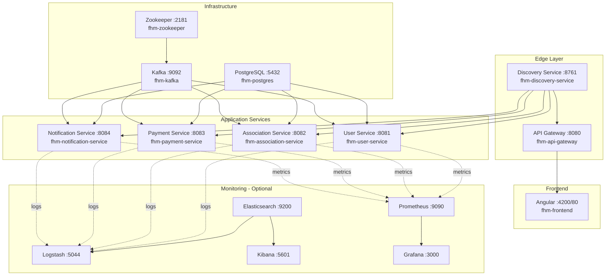
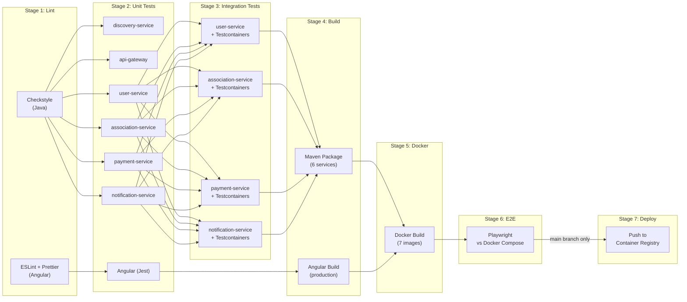
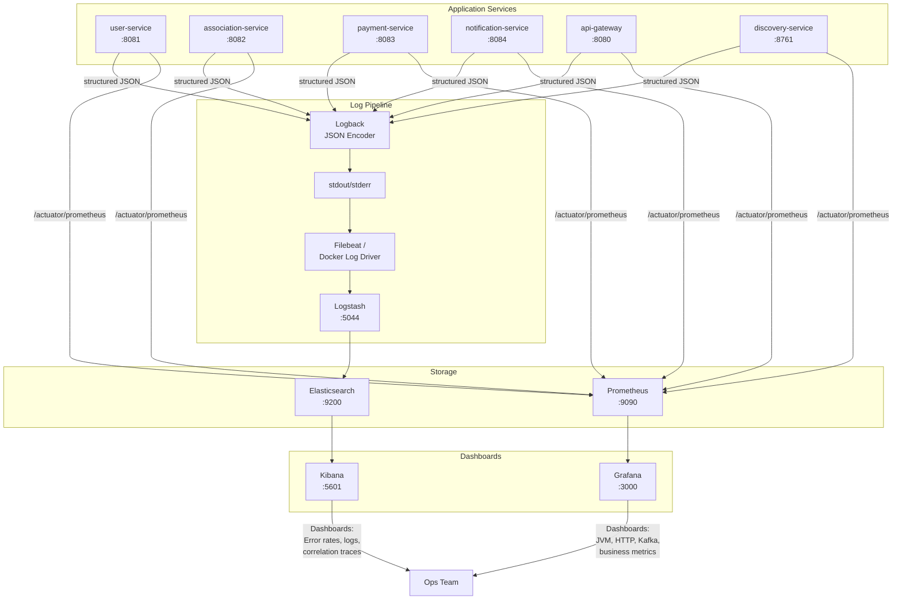

# 09 -- Infrastructure

> **Family Hobbies Manager** -- Docker, CI/CD, Monitoring, OpenShift Readiness
> Architecture Document Series | Document 9 of 12

---

## Table of Contents

1. [Docker Architecture](#1-docker-architecture)
   - [Docker Compose (Development)](#docker-compose-development)
   - [Database Initialization Script](#database-initialization-script)
   - [Dockerfile per Service (Multi-Stage Build)](#dockerfile-per-service-multi-stage-build)
   - [Frontend Dockerfile (Multi-Stage Build)](#frontend-dockerfile-multi-stage-build)
2. [CI/CD Pipeline (GitHub Actions)](#2-cicd-pipeline-github-actions)
   - [Pipeline Stages](#pipeline-stages)
   - [Complete Workflow](#complete-workflow)
   - [Transferability to GitLab CI / Jenkins](#transferability-to-gitlab-ci--jenkins)
3. [Monitoring Stack](#3-monitoring-stack)
   - [Structured Logging (Logback + JSON)](#structured-logging-logback--json)
   - [Health Endpoints (Spring Actuator)](#health-endpoints-spring-actuator)
   - [Monitoring Tools](#monitoring-tools)
   - [ELK Stack Docker Compose Addition](#elk-stack-docker-compose-addition)
   - [Key Dashboards to Create](#key-dashboards-to-create)
4. [OpenShift Readiness](#4-openshift-readiness)
   - [Container Security Hardening](#container-security-hardening)
   - [Health Probes](#health-probes)
   - [OpenShift Deployment YAML](#openshift-deployment-yaml)
5. [Environment Configuration Strategy](#5-environment-configuration-strategy)
6. [Development Commands Reference](#6-development-commands-reference)
7. [Port Allocation Summary](#7-port-allocation-summary)
8. [Mermaid Diagrams](#8-mermaid-diagrams)

---

## 1. Docker Architecture

### Docker Compose (Development)

The complete `docker-compose.yml` orchestrates all services, databases, and messaging infrastructure
for local development. A single `docker compose up -d` command brings the full platform online.

```yaml
version: '3.8'

services:

  # -----------------------------------------------------------------------
  # PostgreSQL -- single instance hosting 4 isolated databases
  # -----------------------------------------------------------------------
  postgres:
    image: postgres:16-alpine
    container_name: fhm-postgres
    ports:
      - "5432:5432"
    environment:
      POSTGRES_USER: fhm_admin
      POSTGRES_PASSWORD: fhm_secret
    volumes:
      - fhm-postgres-data:/var/lib/postgresql/data
      - ./docker/init-scripts/init-databases.sql:/docker-entrypoint-initdb.d/init.sql
    networks:
      - fhm-network
    healthcheck:
      test: ["CMD-SHELL", "pg_isready -U fhm_admin"]
      interval: 10s
      timeout: 5s
      retries: 5

  # -----------------------------------------------------------------------
  # Zookeeper -- Kafka cluster coordination
  # -----------------------------------------------------------------------
  zookeeper:
    image: confluentinc/cp-zookeeper:7.5.0
    container_name: fhm-zookeeper
    environment:
      ZOOKEEPER_CLIENT_PORT: 2181
      ZOOKEEPER_TICK_TIME: 2000
    volumes:
      - fhm-zookeeper-data:/var/lib/zookeeper/data
    networks:
      - fhm-network
    healthcheck:
      test: ["CMD", "echo", "ruok", "|", "nc", "localhost", "2181"]
      interval: 10s
      timeout: 5s
      retries: 5

  # -----------------------------------------------------------------------
  # Kafka -- event broker for inter-service communication
  # -----------------------------------------------------------------------
  kafka:
    image: confluentinc/cp-kafka:7.5.0
    container_name: fhm-kafka
    depends_on:
      zookeeper:
        condition: service_healthy
    ports:
      - "9092:9092"
    environment:
      KAFKA_BROKER_ID: 1
      KAFKA_ZOOKEEPER_CONNECT: zookeeper:2181
      KAFKA_ADVERTISED_LISTENERS: PLAINTEXT://kafka:29092,PLAINTEXT_HOST://localhost:9092
      KAFKA_LISTENER_SECURITY_PROTOCOL_MAP: PLAINTEXT:PLAINTEXT,PLAINTEXT_HOST:PLAINTEXT
      KAFKA_INTER_BROKER_LISTENER_NAME: PLAINTEXT
      KAFKA_OFFSETS_TOPIC_REPLICATION_FACTOR: 1
      KAFKA_AUTO_CREATE_TOPICS_ENABLE: 'true'
      KAFKA_GROUP_INITIAL_REBALANCE_DELAY_MS: 0
      KAFKA_CONFLUENT_LICENSE_TOPIC_REPLICATION_FACTOR: 1
      KAFKA_CONFLUENT_BALANCER_TOPIC_REPLICATION_FACTOR: 1
      KAFKA_TRANSACTION_STATE_LOG_MIN_ISR: 1
      KAFKA_TRANSACTION_STATE_LOG_REPLICATION_FACTOR: 1
    volumes:
      - fhm-kafka-data:/var/lib/kafka/data
    networks:
      - fhm-network
    healthcheck:
      test: ["CMD", "kafka-broker-api-versions", "--bootstrap-server", "localhost:9092"]
      interval: 15s
      timeout: 10s
      retries: 5

  # -----------------------------------------------------------------------
  # Discovery Service (Eureka) -- must start before all application services
  # -----------------------------------------------------------------------
  discovery-service:
    build:
      context: ./backend/discovery-service
      dockerfile: Dockerfile
    image: family-hobbies/discovery-service:latest
    container_name: fhm-discovery-service
    ports:
      - "8761:8761"
    networks:
      - fhm-network
    healthcheck:
      test: ["CMD", "curl", "-f", "http://localhost:8761/actuator/health"]
      interval: 30s
      timeout: 10s
      retries: 5
      start_period: 40s
    restart: unless-stopped

  # -----------------------------------------------------------------------
  # API Gateway -- single entry point, JWT validation, routing
  # -----------------------------------------------------------------------
  api-gateway:
    build:
      context: ./backend/api-gateway
      dockerfile: Dockerfile
    image: family-hobbies/api-gateway:latest
    container_name: fhm-api-gateway
    ports:
      - "8080:8080"
    depends_on:
      discovery-service:
        condition: service_healthy
    environment:
      EUREKA_CLIENT_SERVICE_URL_DEFAULTZONE: http://discovery-service:8761/eureka/
      JWT_SECRET: ${JWT_SECRET}
    networks:
      - fhm-network
    healthcheck:
      test: ["CMD", "curl", "-f", "http://localhost:8080/actuator/health"]
      interval: 30s
      timeout: 10s
      retries: 3
      start_period: 30s
    restart: unless-stopped

  # -----------------------------------------------------------------------
  # User Service -- auth, users, families, RGPD
  # -----------------------------------------------------------------------
  user-service:
    build:
      context: ./backend/user-service
      dockerfile: Dockerfile
    image: family-hobbies/user-service:latest
    container_name: fhm-user-service
    ports:
      - "8081:8081"
    depends_on:
      discovery-service:
        condition: service_healthy
      postgres:
        condition: service_healthy
      kafka:
        condition: service_healthy
    environment:
      SPRING_DATASOURCE_URL: jdbc:postgresql://postgres:5432/familyhobbies_users
      SPRING_DATASOURCE_USERNAME: fhm_admin
      SPRING_DATASOURCE_PASSWORD: fhm_secret
      SPRING_KAFKA_BOOTSTRAP_SERVERS: kafka:29092
      EUREKA_CLIENT_SERVICE_URL_DEFAULTZONE: http://discovery-service:8761/eureka/
      JWT_SECRET: ${JWT_SECRET}
      SPRING_PROFILES_ACTIVE: docker
    networks:
      - fhm-network
    healthcheck:
      test: ["CMD", "curl", "-f", "http://localhost:8081/actuator/health"]
      interval: 30s
      timeout: 10s
      retries: 3
      start_period: 60s
    restart: unless-stopped

  # -----------------------------------------------------------------------
  # Association Service -- HelloAsso directory proxy, activities, sessions,
  #                        subscriptions, attendance
  # -----------------------------------------------------------------------
  association-service:
    build:
      context: ./backend/association-service
      dockerfile: Dockerfile
    image: family-hobbies/association-service:latest
    container_name: fhm-association-service
    ports:
      - "8082:8082"
    depends_on:
      discovery-service:
        condition: service_healthy
      postgres:
        condition: service_healthy
      kafka:
        condition: service_healthy
    environment:
      SPRING_DATASOURCE_URL: jdbc:postgresql://postgres:5432/familyhobbies_associations
      SPRING_DATASOURCE_USERNAME: fhm_admin
      SPRING_DATASOURCE_PASSWORD: fhm_secret
      SPRING_KAFKA_BOOTSTRAP_SERVERS: kafka:29092
      EUREKA_CLIENT_SERVICE_URL_DEFAULTZONE: http://discovery-service:8761/eureka/
      HELLOASSO_BASE_URL: ${HELLOASSO_BASE_URL:-https://api.helloasso-sandbox.com/v5}
      HELLOASSO_CLIENT_ID: ${HELLOASSO_CLIENT_ID}
      HELLOASSO_CLIENT_SECRET: ${HELLOASSO_CLIENT_SECRET}
      SPRING_PROFILES_ACTIVE: docker
    networks:
      - fhm-network
    healthcheck:
      test: ["CMD", "curl", "-f", "http://localhost:8082/actuator/health"]
      interval: 30s
      timeout: 10s
      retries: 3
      start_period: 60s
    restart: unless-stopped

  # -----------------------------------------------------------------------
  # Payment Service -- HelloAsso checkout, webhooks, invoices
  # -----------------------------------------------------------------------
  payment-service:
    build:
      context: ./backend/payment-service
      dockerfile: Dockerfile
    image: family-hobbies/payment-service:latest
    container_name: fhm-payment-service
    ports:
      - "8083:8083"
    depends_on:
      discovery-service:
        condition: service_healthy
      postgres:
        condition: service_healthy
      kafka:
        condition: service_healthy
    environment:
      SPRING_DATASOURCE_URL: jdbc:postgresql://postgres:5432/familyhobbies_payments
      SPRING_DATASOURCE_USERNAME: fhm_admin
      SPRING_DATASOURCE_PASSWORD: fhm_secret
      SPRING_KAFKA_BOOTSTRAP_SERVERS: kafka:29092
      EUREKA_CLIENT_SERVICE_URL_DEFAULTZONE: http://discovery-service:8761/eureka/
      HELLOASSO_BASE_URL: ${HELLOASSO_BASE_URL:-https://api.helloasso-sandbox.com/v5}
      HELLOASSO_CLIENT_ID: ${HELLOASSO_CLIENT_ID}
      HELLOASSO_CLIENT_SECRET: ${HELLOASSO_CLIENT_SECRET}
      HELLOASSO_WEBHOOK_SECRET: ${HELLOASSO_WEBHOOK_SECRET}
      SPRING_PROFILES_ACTIVE: docker
    networks:
      - fhm-network
    healthcheck:
      test: ["CMD", "curl", "-f", "http://localhost:8083/actuator/health"]
      interval: 30s
      timeout: 10s
      retries: 3
      start_period: 60s
    restart: unless-stopped

  # -----------------------------------------------------------------------
  # Notification Service -- email dispatch, templates, Kafka listeners
  # -----------------------------------------------------------------------
  notification-service:
    build:
      context: ./backend/notification-service
      dockerfile: Dockerfile
    image: family-hobbies/notification-service:latest
    container_name: fhm-notification-service
    ports:
      - "8084:8084"
    depends_on:
      discovery-service:
        condition: service_healthy
      postgres:
        condition: service_healthy
      kafka:
        condition: service_healthy
    environment:
      SPRING_DATASOURCE_URL: jdbc:postgresql://postgres:5432/familyhobbies_notifications
      SPRING_DATASOURCE_USERNAME: fhm_admin
      SPRING_DATASOURCE_PASSWORD: fhm_secret
      SPRING_KAFKA_BOOTSTRAP_SERVERS: kafka:29092
      EUREKA_CLIENT_SERVICE_URL_DEFAULTZONE: http://discovery-service:8761/eureka/
      MAIL_HOST: ${MAIL_HOST:-smtp.gmail.com}
      MAIL_PORT: ${MAIL_PORT:-587}
      MAIL_USERNAME: ${MAIL_USERNAME}
      MAIL_PASSWORD: ${MAIL_PASSWORD}
      SPRING_PROFILES_ACTIVE: docker
    networks:
      - fhm-network
    healthcheck:
      test: ["CMD", "curl", "-f", "http://localhost:8084/actuator/health"]
      interval: 30s
      timeout: 10s
      retries: 3
      start_period: 60s
    restart: unless-stopped

  # -----------------------------------------------------------------------
  # Angular Frontend -- served via Nginx in production-like config
  # -----------------------------------------------------------------------
  frontend:
    build:
      context: ./frontend
      dockerfile: Dockerfile
    image: family-hobbies/frontend:latest
    container_name: fhm-frontend
    ports:
      - "4200:80"
    depends_on:
      - api-gateway
    networks:
      - fhm-network
    restart: unless-stopped

# -------------------------------------------------------------------------
# Named Volumes
# -------------------------------------------------------------------------
volumes:
  fhm-postgres-data:
    driver: local
  fhm-kafka-data:
    driver: local
  fhm-zookeeper-data:
    driver: local

# -------------------------------------------------------------------------
# Network
# -------------------------------------------------------------------------
networks:
  fhm-network:
    driver: bridge
    name: fhm-network
```

### Database Initialization Script

Located at `docker/init-scripts/init-databases.sql`. PostgreSQL executes this on first container
start to create all four service databases.

```sql
-- =============================================================================
-- Family Hobbies Manager -- Database Initialization
-- Creates one database per microservice (database-per-service pattern)
-- =============================================================================

CREATE DATABASE familyhobbies_users;
CREATE DATABASE familyhobbies_associations;
CREATE DATABASE familyhobbies_payments;
CREATE DATABASE familyhobbies_notifications;

-- Grant full access to the application user on each database
GRANT ALL PRIVILEGES ON DATABASE familyhobbies_users TO fhm_admin;
GRANT ALL PRIVILEGES ON DATABASE familyhobbies_associations TO fhm_admin;
GRANT ALL PRIVILEGES ON DATABASE familyhobbies_payments TO fhm_admin;
GRANT ALL PRIVILEGES ON DATABASE familyhobbies_notifications TO fhm_admin;
```

### Dockerfile per Service (Multi-Stage Build)

Every backend microservice uses the same multi-stage Dockerfile pattern. The build stage compiles
the application, and the run stage uses a minimal JRE image to keep the final image small and secure.

```dockerfile
# =============================================================================
# Stage 1: Build -- compile and package the Spring Boot application
# =============================================================================
FROM eclipse-temurin:17-jdk-alpine AS build

WORKDIR /app

# Copy Maven wrapper and POM first for dependency caching
COPY .mvn/ .mvn/
COPY mvnw pom.xml ./
RUN chmod +x mvnw && ./mvnw dependency:go-offline -B

# Copy source and build
COPY src/ src/
RUN ./mvnw clean package -DskipTests -B

# =============================================================================
# Stage 2: Run -- minimal runtime image
# =============================================================================
FROM eclipse-temurin:17-jre-alpine

# Security: run as non-root user (OpenShift compatible)
RUN addgroup -S appgroup && adduser -S appuser -G appgroup -u 1001
USER 1001

WORKDIR /app

# Copy the built artifact from the build stage
COPY --from=build /app/target/*.jar app.jar

# Expose the service port (overridden per service)
EXPOSE 8081

# JVM tuning for containerized environments
ENV JAVA_OPTS="-XX:+UseContainerSupport \
               -XX:MaxRAMPercentage=75.0 \
               -XX:InitialRAMPercentage=50.0 \
               -Djava.security.egd=file:/dev/./urandom"

ENTRYPOINT ["sh", "-c", "java $JAVA_OPTS -jar app.jar"]
```

**Per-service port overrides** are handled via the `EXPOSE` instruction and the
`server.port` Spring property. The Dockerfile template above is identical across services
except for the exposed port:

| Service              | EXPOSE | server.port |
|----------------------|--------|-------------|
| discovery-service    | 8761   | 8761        |
| api-gateway          | 8080   | 8080        |
| user-service         | 8081   | 8081        |
| association-service  | 8082   | 8082        |
| payment-service      | 8083   | 8083        |
| notification-service | 8084   | 8084        |

### Frontend Dockerfile (Multi-Stage Build)

The Angular frontend is built in a Node.js stage and served by Nginx in the final image.

```dockerfile
# =============================================================================
# Stage 1: Build -- compile Angular application
# =============================================================================
FROM node:20-alpine AS build

WORKDIR /app

# Copy dependency manifests first for layer caching
COPY package.json package-lock.json ./
RUN npm ci --prefer-offline

# Copy source and build for production
COPY . .
RUN npm run build -- --configuration production

# =============================================================================
# Stage 2: Serve -- Nginx static file server
# =============================================================================
FROM nginx:1.25-alpine

# Security: run as non-root user
RUN addgroup -S nginxgroup && adduser -S nginxuser -G nginxgroup -u 1001

# Copy built Angular assets
COPY --from=build /app/dist/frontend/browser /usr/share/nginx/html

# Copy custom Nginx configuration for SPA routing
COPY nginx.conf /etc/nginx/conf.d/default.conf

# Nginx needs to write to certain directories -- adjust permissions
RUN chown -R nginxuser:nginxgroup /var/cache/nginx \
    && chown -R nginxuser:nginxgroup /var/log/nginx \
    && chown -R nginxuser:nginxgroup /etc/nginx/conf.d \
    && touch /var/run/nginx.pid \
    && chown -R nginxuser:nginxgroup /var/run/nginx.pid

USER 1001

EXPOSE 80

CMD ["nginx", "-g", "daemon off;"]
```

**Nginx configuration** (`frontend/nginx.conf`):

```nginx
server {
    listen       80;
    server_name  localhost;

    root   /usr/share/nginx/html;
    index  index.html;

    # SPA fallback -- serve index.html for all routes
    location / {
        try_files $uri $uri/ /index.html;
    }

    # Proxy API calls to the gateway
    location /api/ {
        proxy_pass http://api-gateway:8080/api/;
        proxy_set_header Host $host;
        proxy_set_header X-Real-IP $remote_addr;
        proxy_set_header X-Forwarded-For $proxy_add_x_forwarded_for;
        proxy_set_header X-Forwarded-Proto $scheme;
    }

    # Cache static assets aggressively
    location ~* \.(js|css|png|jpg|jpeg|gif|ico|svg|woff|woff2|ttf|eot)$ {
        expires 1y;
        add_header Cache-Control "public, immutable";
    }

    # Security headers
    add_header X-Frame-Options "SAMEORIGIN" always;
    add_header X-Content-Type-Options "nosniff" always;
    add_header X-XSS-Protection "1; mode=block" always;
    add_header Referrer-Policy "strict-origin-when-cross-origin" always;

    # Gzip compression
    gzip on;
    gzip_types text/plain text/css application/json application/javascript text/xml application/xml text/javascript;
    gzip_min_length 1000;
}
```

---

## 2. CI/CD Pipeline (GitHub Actions)

### Pipeline Stages

The CI/CD pipeline enforces quality gates at every stage. A failure at any stage prevents
progression to subsequent stages.

| Stage | Purpose | Tools | Parallelism |
|-------|---------|-------|-------------|
| **1. Lint & Format** | Code style enforcement | Checkstyle (Java), ESLint + Prettier (Angular) | Parallel (backend / frontend) |
| **2. Unit Tests** | Isolated component tests | JUnit 5 (all services), Jest (frontend) | Matrix strategy (6 services + frontend) |
| **3. Integration Tests** | Cross-layer tests with real infra | Spring Boot Test + Testcontainers (PostgreSQL, Kafka) | Matrix strategy (4 data services) |
| **4. Build** | Compile and package all artifacts | Maven (backend), Angular CLI (frontend) | Matrix strategy |
| **5. Docker Build** | Build all container images | Docker Buildx with layer caching | Parallel |
| **6. E2E Tests** | Full user flow validation | Playwright against Docker Compose stack | Sequential |
| **7. Deploy** | Push images to registry (manual trigger) | Docker push to GHCR / DockerHub | Sequential |

### Complete Workflow

```yaml
# .github/workflows/ci.yml
name: CI/CD Pipeline

on:
  push:
    branches: [main, develop]
  pull_request:
    branches: [main, develop]

env:
  JAVA_VERSION: '17'
  NODE_VERSION: '20'
  REGISTRY: ghcr.io
  IMAGE_PREFIX: ghcr.io/${{ github.repository_owner }}/family-hobbies

jobs:

  # =========================================================================
  # Stage 1: Lint & Format
  # =========================================================================
  lint-backend:
    name: Lint -- Java (Checkstyle)
    runs-on: ubuntu-latest
    steps:
      - uses: actions/checkout@v4

      - name: Set up JDK 17
        uses: actions/setup-java@v4
        with:
          java-version: ${{ env.JAVA_VERSION }}
          distribution: temurin
          cache: maven

      - name: Run Checkstyle on all services
        run: |
          cd backend
          ./mvnw checkstyle:check -B

  lint-frontend:
    name: Lint -- Angular (ESLint + Prettier)
    runs-on: ubuntu-latest
    steps:
      - uses: actions/checkout@v4

      - name: Set up Node.js
        uses: actions/setup-node@v4
        with:
          node-version: ${{ env.NODE_VERSION }}
          cache: npm
          cache-dependency-path: frontend/package-lock.json

      - name: Install dependencies
        run: cd frontend && npm ci

      - name: Run ESLint
        run: cd frontend && npm run lint

      - name: Check Prettier formatting
        run: cd frontend && npx prettier --check "src/**/*.{ts,html,scss}"

  # =========================================================================
  # Stage 2: Unit Tests (matrix strategy for parallel execution)
  # =========================================================================
  unit-tests-backend:
    name: Unit Tests -- ${{ matrix.service }}
    needs: [lint-backend]
    runs-on: ubuntu-latest
    strategy:
      fail-fast: false
      matrix:
        service:
          - discovery-service
          - api-gateway
          - user-service
          - association-service
          - payment-service
          - notification-service
    steps:
      - uses: actions/checkout@v4

      - name: Set up JDK 17
        uses: actions/setup-java@v4
        with:
          java-version: ${{ env.JAVA_VERSION }}
          distribution: temurin
          cache: maven

      - name: Run unit tests for ${{ matrix.service }}
        run: |
          cd backend/${{ matrix.service }}
          ../mvnw test -B -Dtest='**/*Test.java' -DfailIfNoTests=false

      - name: Upload test results
        if: always()
        uses: actions/upload-artifact@v4
        with:
          name: test-results-${{ matrix.service }}
          path: backend/${{ matrix.service }}/target/surefire-reports/

      - name: Upload coverage report
        if: always()
        uses: actions/upload-artifact@v4
        with:
          name: coverage-${{ matrix.service }}
          path: backend/${{ matrix.service }}/target/site/jacoco/

  unit-tests-frontend:
    name: Unit Tests -- Angular (Jest)
    needs: [lint-frontend]
    runs-on: ubuntu-latest
    steps:
      - uses: actions/checkout@v4

      - name: Set up Node.js
        uses: actions/setup-node@v4
        with:
          node-version: ${{ env.NODE_VERSION }}
          cache: npm
          cache-dependency-path: frontend/package-lock.json

      - name: Install dependencies
        run: cd frontend && npm ci

      - name: Run Jest tests with coverage
        run: cd frontend && npm test -- --coverage --watchAll=false

      - name: Upload coverage report
        if: always()
        uses: actions/upload-artifact@v4
        with:
          name: coverage-frontend
          path: frontend/coverage/

  # =========================================================================
  # Stage 3: Integration Tests (services with databases and Kafka)
  # =========================================================================
  integration-tests:
    name: Integration Tests -- ${{ matrix.service }}
    needs: [unit-tests-backend]
    runs-on: ubuntu-latest
    strategy:
      fail-fast: false
      matrix:
        service:
          - user-service
          - association-service
          - payment-service
          - notification-service
    steps:
      - uses: actions/checkout@v4

      - name: Set up JDK 17
        uses: actions/setup-java@v4
        with:
          java-version: ${{ env.JAVA_VERSION }}
          distribution: temurin
          cache: maven

      - name: Run integration tests for ${{ matrix.service }}
        run: |
          cd backend/${{ matrix.service }}
          ../mvnw verify -B -Dtest='**/*IntegrationTest.java' -DfailIfNoTests=false
        env:
          TESTCONTAINERS_RYUK_DISABLED: false

      - name: Upload integration test results
        if: always()
        uses: actions/upload-artifact@v4
        with:
          name: integration-results-${{ matrix.service }}
          path: backend/${{ matrix.service }}/target/failsafe-reports/

  # =========================================================================
  # Stage 4: Build all artifacts
  # =========================================================================
  build-backend:
    name: Build -- ${{ matrix.service }}
    needs: [integration-tests]
    runs-on: ubuntu-latest
    strategy:
      fail-fast: true
      matrix:
        service:
          - discovery-service
          - api-gateway
          - user-service
          - association-service
          - payment-service
          - notification-service
    steps:
      - uses: actions/checkout@v4

      - name: Set up JDK 17
        uses: actions/setup-java@v4
        with:
          java-version: ${{ env.JAVA_VERSION }}
          distribution: temurin
          cache: maven

      - name: Build ${{ matrix.service }}
        run: |
          cd backend/${{ matrix.service }}
          ../mvnw clean package -DskipTests -B

      - name: Upload JAR artifact
        uses: actions/upload-artifact@v4
        with:
          name: jar-${{ matrix.service }}
          path: backend/${{ matrix.service }}/target/*.jar

  build-frontend:
    name: Build -- Angular
    needs: [unit-tests-frontend]
    runs-on: ubuntu-latest
    steps:
      - uses: actions/checkout@v4

      - name: Set up Node.js
        uses: actions/setup-node@v4
        with:
          node-version: ${{ env.NODE_VERSION }}
          cache: npm
          cache-dependency-path: frontend/package-lock.json

      - name: Install dependencies
        run: cd frontend && npm ci

      - name: Build Angular for production
        run: cd frontend && npm run build -- --configuration production

      - name: Upload dist artifact
        uses: actions/upload-artifact@v4
        with:
          name: dist-frontend
          path: frontend/dist/

  # =========================================================================
  # Stage 5: Docker Build
  # =========================================================================
  docker-build:
    name: Docker Build -- ${{ matrix.service }}
    needs: [build-backend, build-frontend]
    runs-on: ubuntu-latest
    strategy:
      fail-fast: false
      matrix:
        service:
          - discovery-service
          - api-gateway
          - user-service
          - association-service
          - payment-service
          - notification-service
          - frontend
    steps:
      - uses: actions/checkout@v4

      - name: Set up Docker Buildx
        uses: docker/setup-buildx-action@v3

      - name: Determine build context
        id: context
        run: |
          if [ "${{ matrix.service }}" = "frontend" ]; then
            echo "path=frontend" >> $GITHUB_OUTPUT
          else
            echo "path=backend/${{ matrix.service }}" >> $GITHUB_OUTPUT
          fi

      - name: Build Docker image
        uses: docker/build-push-action@v5
        with:
          context: ${{ steps.context.outputs.path }}
          push: false
          tags: ${{ env.IMAGE_PREFIX }}/${{ matrix.service }}:${{ github.sha }}
          cache-from: type=gha
          cache-to: type=gha,mode=max

  # =========================================================================
  # Stage 6: E2E Tests (Playwright against Docker Compose)
  # =========================================================================
  e2e-tests:
    name: E2E Tests -- Playwright
    needs: [docker-build]
    runs-on: ubuntu-latest
    steps:
      - uses: actions/checkout@v4

      - name: Start Docker Compose stack
        run: |
          docker compose up -d --build
          docker compose ps

      - name: Wait for services to be healthy
        run: |
          echo "Waiting for API Gateway health..."
          timeout 120 bash -c 'until curl -sf http://localhost:8080/actuator/health; do sleep 5; done'
          echo "Waiting for frontend..."
          timeout 60 bash -c 'until curl -sf http://localhost:4200; do sleep 5; done'

      - name: Set up Node.js
        uses: actions/setup-node@v4
        with:
          node-version: ${{ env.NODE_VERSION }}

      - name: Install Playwright
        run: |
          cd e2e
          npm ci
          npx playwright install --with-deps chromium

      - name: Run Playwright E2E tests
        run: cd e2e && npx playwright test
        env:
          BASE_URL: http://localhost:4200

      - name: Upload Playwright report
        if: always()
        uses: actions/upload-artifact@v4
        with:
          name: playwright-report
          path: e2e/playwright-report/

      - name: Tear down Docker Compose
        if: always()
        run: docker compose down -v

  # =========================================================================
  # Stage 7: Deploy (manual trigger only)
  # =========================================================================
  deploy:
    name: Deploy -- Push images to registry
    needs: [e2e-tests]
    runs-on: ubuntu-latest
    if: github.ref == 'refs/heads/main' && github.event_name == 'push'
    permissions:
      contents: read
      packages: write
    strategy:
      matrix:
        service:
          - discovery-service
          - api-gateway
          - user-service
          - association-service
          - payment-service
          - notification-service
          - frontend
    steps:
      - uses: actions/checkout@v4

      - name: Log in to GitHub Container Registry
        uses: docker/login-action@v3
        with:
          registry: ${{ env.REGISTRY }}
          username: ${{ github.actor }}
          password: ${{ secrets.GITHUB_TOKEN }}

      - name: Set up Docker Buildx
        uses: docker/setup-buildx-action@v3

      - name: Determine build context
        id: context
        run: |
          if [ "${{ matrix.service }}" = "frontend" ]; then
            echo "path=frontend" >> $GITHUB_OUTPUT
          else
            echo "path=backend/${{ matrix.service }}" >> $GITHUB_OUTPUT
          fi

      - name: Build and push Docker image
        uses: docker/build-push-action@v5
        with:
          context: ${{ steps.context.outputs.path }}
          push: true
          tags: |
            ${{ env.IMAGE_PREFIX }}/${{ matrix.service }}:${{ github.sha }}
            ${{ env.IMAGE_PREFIX }}/${{ matrix.service }}:latest
          cache-from: type=gha
          cache-to: type=gha,mode=max
```

### Transferability to GitLab CI / Jenkins

The pipeline is designed in YAML stages that map directly to equivalent constructs in
GitLab CI and Jenkins declarative pipelines. This is critical for enterprise alignment, where
GitLab CI and Jenkins are the standard CI/CD tools.

| Concept | GitHub Actions | GitLab CI Equivalent | Jenkins Declarative Equivalent |
|---------|----------------|----------------------|-------------------------------|
| Pipeline definition | `.github/workflows/ci.yml` | `.gitlab-ci.yml` | `Jenkinsfile` |
| Parallel jobs | `jobs:` (each job runs in parallel by default) | `stages:` + jobs within a stage | `pipeline { stages { stage { parallel { } } } }` |
| Runner image | `runs-on: ubuntu-latest` | `image: eclipse-temurin:17-jdk-alpine` | `agent { docker { image 'eclipse-temurin:17-jdk-alpine' } }` |
| Service containers | `services: postgres:16-alpine` | `services: [postgres:16-alpine]` | `docker.image('postgres:16-alpine').withRun(...)` |
| Dependency caching | `uses: actions/cache@v4` | `cache: { key: ..., paths: [.m2/] }` | `stash/unstash` or shared NFS volume |
| Secrets | `${{ secrets.JWT_SECRET }}` | `$JWT_SECRET` (CI/CD variables) | `credentials('jwt-secret')` |
| Matrix builds | `strategy: { matrix: { service: [...] } }` | `parallel: { matrix: [{ SERVICE: [...] }] }` | `matrix { axes { axis { ... } } }` |
| Conditional stages | `if: github.ref == 'refs/heads/main'` | `rules: [{ if: '$CI_COMMIT_BRANCH == "main"' }]` | `when { branch 'main' }` |
| Artifacts | `actions/upload-artifact@v4` | `artifacts: { paths: [...] }` | `archiveArtifacts` |
| Manual approval | `environment: { name: production }` | `when: manual` | `input { message "Deploy?" }` |

**GitLab CI equivalent snippet** (for reference):

```yaml
# .gitlab-ci.yml (condensed equivalent)
stages:
  - lint
  - test
  - build
  - docker
  - e2e
  - deploy

variables:
  MAVEN_OPTS: "-Dmaven.repo.local=.m2/repository"

cache:
  key: ${CI_COMMIT_REF_SLUG}
  paths:
    - .m2/repository/
    - frontend/node_modules/

lint:backend:
  stage: lint
  image: eclipse-temurin:17-jdk-alpine
  script:
    - cd backend && ./mvnw checkstyle:check -B

unit-tests:
  stage: test
  image: eclipse-temurin:17-jdk-alpine
  parallel:
    matrix:
      - SERVICE: [discovery-service, api-gateway, user-service, association-service, payment-service, notification-service]
  script:
    - cd backend/$SERVICE && ../mvnw test -B

integration-tests:
  stage: test
  image: eclipse-temurin:17-jdk-alpine
  services:
    - postgres:16-alpine
    - confluentinc/cp-kafka:7.5.0
  parallel:
    matrix:
      - SERVICE: [user-service, association-service, payment-service, notification-service]
  script:
    - cd backend/$SERVICE && ../mvnw verify -B

deploy:
  stage: deploy
  rules:
    - if: '$CI_COMMIT_BRANCH == "main"'
      when: manual
  script:
    - docker login -u $CI_REGISTRY_USER -p $CI_REGISTRY_PASSWORD $CI_REGISTRY
    - docker compose build
    - docker compose push
```

---

## 3. Monitoring Stack

### Structured Logging (Logback + JSON)

All backend services use Logback with the Logstash JSON encoder to produce structured log output.
This format is directly ingestible by ELK Stack, Graylog, or any JSON-aware log aggregator.

**Logback configuration** (`src/main/resources/logback-spring.xml`):

```xml
<?xml version="1.0" encoding="UTF-8"?>
<configuration>

    <springProperty scope="context" name="SERVICE_NAME" source="spring.application.name" />
    <springProperty scope="context" name="ACTIVE_PROFILE" source="spring.profiles.active" defaultValue="default" />

    <!-- Console appender for local development (human-readable) -->
    <springProfile name="default,dev">
        <appender name="CONSOLE" class="ch.qos.logback.core.ConsoleAppender">
            <encoder>
                <pattern>%d{yyyy-MM-dd HH:mm:ss.SSS} [%thread] %-5level %logger{36} - %msg%n</pattern>
            </encoder>
        </appender>
    </springProfile>

    <!-- JSON appender for Docker, CI, and production (structured) -->
    <springProfile name="docker,prod">
        <appender name="JSON" class="ch.qos.logback.core.ConsoleAppender">
            <encoder class="net.logstash.logback.encoder.LogstashEncoder">
                <customFields>
                    {"service":"${SERVICE_NAME}","environment":"${ACTIVE_PROFILE}"}
                </customFields>
                <fieldNames>
                    <timestamp>@timestamp</timestamp>
                    <version>[ignore]</version>
                </fieldNames>
                <includeMdcKeyName>correlationId</includeMdcKeyName>
                <includeMdcKeyName>userId</includeMdcKeyName>
                <includeMdcKeyName>traceId</includeMdcKeyName>
                <includeMdcKeyName>spanId</includeMdcKeyName>
            </encoder>
        </appender>
    </springProfile>

    <!-- Root logger -->
    <springProfile name="default,dev">
        <root level="INFO">
            <appender-ref ref="CONSOLE" />
        </root>
    </springProfile>

    <springProfile name="docker,prod">
        <root level="INFO">
            <appender-ref ref="JSON" />
        </root>
    </springProfile>

    <!-- Service-specific log levels -->
    <logger name="com.familyhobbies" level="DEBUG" />
    <logger name="org.springframework.web" level="INFO" />
    <logger name="org.hibernate.SQL" level="WARN" />
    <logger name="org.apache.kafka" level="WARN" />

</configuration>
```

**Example structured log output** (JSON):

```json
{
    "@timestamp": "2026-02-23T14:05:32.841Z",
    "level": "INFO",
    "logger_name": "com.familyhobbies.userservice.service.impl.AuthServiceImpl",
    "message": "User registered successfully",
    "thread_name": "http-nio-8081-exec-3",
    "service": "user-service",
    "environment": "docker",
    "correlationId": "a1b2c3d4-e5f6-7890-abcd-ef1234567890",
    "userId": "42",
    "traceId": "6ba7b810-9dad-11d1-80b4-00c04fd430c8",
    "spanId": "7c9e6679-7425-40de-944b"
}
```

### Health Endpoints (Spring Actuator)

Every service exposes standardized health, info, and metrics endpoints via Spring Boot Actuator.

| Service | Health URL | Metrics URL | Info URL |
|---------|-----------|-------------|----------|
| discovery-service | `http://localhost:8761/actuator/health` | `http://localhost:8761/actuator/metrics` | `http://localhost:8761/actuator/info` |
| api-gateway | `http://localhost:8080/actuator/health` | `http://localhost:8080/actuator/metrics` | `http://localhost:8080/actuator/info` |
| user-service | `http://localhost:8081/actuator/health` | `http://localhost:8081/actuator/metrics` | `http://localhost:8081/actuator/info` |
| association-service | `http://localhost:8082/actuator/health` | `http://localhost:8082/actuator/metrics` | `http://localhost:8082/actuator/info` |
| payment-service | `http://localhost:8083/actuator/health` | `http://localhost:8083/actuator/metrics` | `http://localhost:8083/actuator/info` |
| notification-service | `http://localhost:8084/actuator/health` | `http://localhost:8084/actuator/metrics` | `http://localhost:8084/actuator/info` |

**Health indicator components** (per service):

| Component | Checked By | Indicates |
|-----------|-----------|-----------|
| `db` | DataSourceHealthIndicator | PostgreSQL connection alive |
| `diskSpace` | DiskSpaceHealthIndicator | Sufficient disk space |
| `kafka` | KafkaHealthIndicator | Kafka broker reachable |
| `eureka` | EurekaHealthIndicator | Eureka server reachable |
| `mail` | MailHealthIndicator | SMTP server reachable (notification-service only) |

**Actuator configuration** (shared across services):

```yaml
management:
  endpoints:
    web:
      exposure:
        include: health,info,metrics,prometheus,liquibase
  endpoint:
    health:
      show-details: always
      show-components: always
      probes:
        enabled: true
  health:
    livenessState:
      enabled: true
    readinessState:
      enabled: true
  metrics:
    tags:
      application: ${spring.application.name}
    export:
      prometheus:
        enabled: true
```

### Monitoring Tools

Enterprise environments use Kibana and Graylog for log analysis. This project supports both via structured
JSON logging to stdout, which can be collected by any log shipper (Filebeat, Fluentd, GELF).

#### Micrometer + Prometheus (Metrics)

All services export Prometheus-compatible metrics via the `/actuator/prometheus` endpoint.
Key metrics collected by Micrometer:

| Metric Category | Example Metrics | Purpose |
|----------------|----------------|---------|
| JVM | `jvm_memory_used_bytes`, `jvm_gc_pause_seconds`, `jvm_threads_live_threads` | Memory, GC, and thread monitoring |
| HTTP | `http_server_requests_seconds_count`, `http_server_requests_seconds_sum` | Request counts, latencies per endpoint |
| Kafka | `kafka_consumer_records_consumed_total`, `kafka_consumer_fetch_manager_records_lag` | Consumer throughput and lag |
| Database | `hikaricp_connections_active`, `hikaricp_connections_pending` | Connection pool health |
| Custom | `fhm_user_registrations_total`, `fhm_payments_processed_total` | Business metrics |

### ELK Stack Docker Compose Addition

To add the full ELK (Elasticsearch, Logstash, Kibana) monitoring stack to the development
environment, append the following to `docker-compose.yml` or use a separate
`docker-compose.monitoring.yml` overlay.

```yaml
# docker-compose.monitoring.yml
# Usage: docker compose -f docker-compose.yml -f docker-compose.monitoring.yml up -d
version: '3.8'

services:

  # -----------------------------------------------------------------------
  # Elasticsearch -- log and metrics storage
  # -----------------------------------------------------------------------
  elasticsearch:
    image: docker.elastic.co/elasticsearch/elasticsearch:8.11.0
    container_name: fhm-elasticsearch
    environment:
      - discovery.type=single-node
      - xpack.security.enabled=false
      - "ES_JAVA_OPTS=-Xms512m -Xmx512m"
    ports:
      - "9200:9200"
    volumes:
      - fhm-elasticsearch-data:/usr/share/elasticsearch/data
    networks:
      - fhm-network
    healthcheck:
      test: ["CMD-SHELL", "curl -sf http://localhost:9200/_cluster/health || exit 1"]
      interval: 30s
      timeout: 10s
      retries: 5

  # -----------------------------------------------------------------------
  # Logstash -- log pipeline and transformation
  # -----------------------------------------------------------------------
  logstash:
    image: docker.elastic.co/logstash/logstash:8.11.0
    container_name: fhm-logstash
    depends_on:
      elasticsearch:
        condition: service_healthy
    ports:
      - "5044:5044"
      - "12201:12201/udp"
    volumes:
      - ./docker/logstash/pipeline/:/usr/share/logstash/pipeline/:ro
    networks:
      - fhm-network

  # -----------------------------------------------------------------------
  # Kibana -- log visualization and dashboards
  # -----------------------------------------------------------------------
  kibana:
    image: docker.elastic.co/kibana/kibana:8.11.0
    container_name: fhm-kibana
    depends_on:
      elasticsearch:
        condition: service_healthy
    ports:
      - "5601:5601"
    environment:
      ELASTICSEARCH_HOSTS: http://elasticsearch:9200
    networks:
      - fhm-network

  # -----------------------------------------------------------------------
  # Prometheus -- metrics collection
  # -----------------------------------------------------------------------
  prometheus:
    image: prom/prometheus:v2.48.0
    container_name: fhm-prometheus
    ports:
      - "9090:9090"
    volumes:
      - ./docker/prometheus/prometheus.yml:/etc/prometheus/prometheus.yml:ro
      - fhm-prometheus-data:/prometheus
    networks:
      - fhm-network
    command:
      - '--config.file=/etc/prometheus/prometheus.yml'
      - '--storage.tsdb.retention.time=7d'

  # -----------------------------------------------------------------------
  # Grafana -- metrics dashboards
  # -----------------------------------------------------------------------
  grafana:
    image: grafana/grafana:10.2.0
    container_name: fhm-grafana
    ports:
      - "3000:3000"
    environment:
      GF_SECURITY_ADMIN_USER: admin
      GF_SECURITY_ADMIN_PASSWORD: admin
    volumes:
      - fhm-grafana-data:/var/lib/grafana
      - ./docker/grafana/provisioning/:/etc/grafana/provisioning/:ro
    depends_on:
      - prometheus
    networks:
      - fhm-network

volumes:
  fhm-elasticsearch-data:
    driver: local
  fhm-prometheus-data:
    driver: local
  fhm-grafana-data:
    driver: local
```

**Prometheus scrape configuration** (`docker/prometheus/prometheus.yml`):

```yaml
global:
  scrape_interval: 15s
  evaluation_interval: 15s

scrape_configs:
  - job_name: 'discovery-service'
    metrics_path: /actuator/prometheus
    static_configs:
      - targets: ['discovery-service:8761']
        labels:
          service: discovery-service

  - job_name: 'api-gateway'
    metrics_path: /actuator/prometheus
    static_configs:
      - targets: ['api-gateway:8080']
        labels:
          service: api-gateway

  - job_name: 'user-service'
    metrics_path: /actuator/prometheus
    static_configs:
      - targets: ['user-service:8081']
        labels:
          service: user-service

  - job_name: 'association-service'
    metrics_path: /actuator/prometheus
    static_configs:
      - targets: ['association-service:8082']
        labels:
          service: association-service

  - job_name: 'payment-service'
    metrics_path: /actuator/prometheus
    static_configs:
      - targets: ['payment-service:8083']
        labels:
          service: payment-service

  - job_name: 'notification-service'
    metrics_path: /actuator/prometheus
    static_configs:
      - targets: ['notification-service:8084']
        labels:
          service: notification-service
```

**Logstash pipeline** (`docker/logstash/pipeline/logstash.conf`):

```ruby
input {
  # Accept JSON logs via TCP (from Filebeat or Docker log driver)
  tcp {
    port => 5044
    codec => json_lines
  }
  # Accept GELF input (for Graylog compatibility)
  gelf {
    port => 12201
    type => "docker"
  }
}

filter {
  if [service] {
    mutate {
      add_field => { "[@metadata][index_prefix]" => "fhm-%{service}" }
    }
  } else {
    mutate {
      add_field => { "[@metadata][index_prefix]" => "fhm-unknown" }
    }
  }
}

output {
  elasticsearch {
    hosts => ["elasticsearch:9200"]
    index => "%{[@metadata][index_prefix]}-%{+YYYY.MM.dd}"
  }
}
```

### Key Dashboards to Create

| # | Dashboard | Data Source | Key Panels |
|---|-----------|-----------|-----------|
| 1 | **Service Health Overview** | Prometheus | All 6 services UP/DOWN status, uptime counters, last restart timestamp |
| 2 | **API Response Times** | Prometheus | p50, p95, p99 latency per endpoint, request rate, error rate |
| 3 | **Kafka Consumer Lag** | Prometheus | Consumer lag per topic/group, message throughput, partition distribution |
| 4 | **Batch Job Execution** | Prometheus + Elasticsearch | Job success/failure counts, execution duration, last run timestamp |
| 5 | **Error Rate per Service** | Elasticsearch | 4xx/5xx error counts, error rate trends, top error types, stack trace viewer |
| 6 | **JVM Metrics** | Prometheus | Heap used/committed, GC pause times, thread count, class loading |
| 7 | **Database Connections** | Prometheus | HikariCP pool active/idle/pending, connection wait time, pool utilization |
| 8 | **Business Metrics** | Prometheus | User registrations/day, payments processed/day, active subscriptions, attendance rate |

---

## 4. OpenShift Readiness

The application is designed to be deployable to Red Hat OpenShift (or any Kubernetes-based platform)
with minimal configuration changes. The following measures ensure OpenShift compatibility.

### Container Security Hardening

All Dockerfiles follow OpenShift security best practices:

| Requirement | Implementation |
|-------------|---------------|
| **Non-root user** | All containers run as UID 1001 (`USER 1001`) |
| **Alpine base images** | `eclipse-temurin:17-jre-alpine` for Java, `nginx:1.25-alpine` for frontend |
| **No privilege escalation** | No `setuid`/`setgid` binaries in final image |
| **Read-only filesystem** | Application writes only to designated volumes |
| **Minimal attack surface** | Multi-stage builds exclude build tools, source code, and test dependencies |
| **No hardcoded secrets** | All credentials injected via environment variables or mounted Secrets |

**Final image sizes** (approximate):

| Image | Base | Approximate Size |
|-------|------|-----------------|
| Backend services | `eclipse-temurin:17-jre-alpine` | ~180 MB |
| Frontend | `nginx:1.25-alpine` | ~25 MB |

### Health Probes

OpenShift/Kubernetes uses three types of probes. All are served by Spring Boot Actuator.

| Probe | Actuator Endpoint | Purpose | Configuration |
|-------|------------------|---------|--------------|
| **Liveness** | `/actuator/health/liveness` | Is the JVM alive and not deadlocked? Restart container if failing. | `initialDelaySeconds: 60`, `periodSeconds: 10`, `failureThreshold: 3` |
| **Readiness** | `/actuator/health/readiness` | Can the service handle requests? Remove from load balancer if failing. | `initialDelaySeconds: 30`, `periodSeconds: 10`, `failureThreshold: 3` |
| **Startup** | `/actuator/health` | Has the service finished starting up? Prevent premature liveness checks. | `initialDelaySeconds: 0`, `periodSeconds: 5`, `failureThreshold: 24` |

### OpenShift Deployment YAML

The following is a complete OpenShift Deployment manifest for the `user-service`. Other services
follow the same pattern with adjusted names, ports, and ConfigMap references.

```yaml
# openshift/user-service/deployment.yaml
apiVersion: apps/v1
kind: Deployment
metadata:
  name: user-service
  namespace: family-hobbies
  labels:
    app: user-service
    app.kubernetes.io/name: user-service
    app.kubernetes.io/part-of: family-hobbies-manager
    app.kubernetes.io/component: backend
    app.kubernetes.io/version: "1.0.0"
spec:
  replicas: 2
  selector:
    matchLabels:
      app: user-service
  strategy:
    type: RollingUpdate
    rollingUpdate:
      maxUnavailable: 1
      maxSurge: 1
  template:
    metadata:
      labels:
        app: user-service
      annotations:
        prometheus.io/scrape: "true"
        prometheus.io/path: "/actuator/prometheus"
        prometheus.io/port: "8081"
    spec:
      serviceAccountName: fhm-service-account
      securityContext:
        runAsNonRoot: true
        runAsUser: 1001
        runAsGroup: 1001
        fsGroup: 1001
      containers:
        - name: user-service
          image: ghcr.io/octavieploye/family-hobbies/user-service:latest
          imagePullPolicy: Always
          ports:
            - containerPort: 8081
              name: http
              protocol: TCP
          env:
            - name: SPRING_PROFILES_ACTIVE
              value: "prod"
            - name: SPRING_DATASOURCE_URL
              valueFrom:
                configMapKeyRef:
                  name: user-service-config
                  key: datasource-url
            - name: SPRING_DATASOURCE_USERNAME
              valueFrom:
                secretKeyRef:
                  name: user-service-db-credentials
                  key: username
            - name: SPRING_DATASOURCE_PASSWORD
              valueFrom:
                secretKeyRef:
                  name: user-service-db-credentials
                  key: password
            - name: SPRING_KAFKA_BOOTSTRAP_SERVERS
              valueFrom:
                configMapKeyRef:
                  name: shared-infra-config
                  key: kafka-bootstrap-servers
            - name: EUREKA_CLIENT_SERVICE_URL_DEFAULTZONE
              valueFrom:
                configMapKeyRef:
                  name: shared-infra-config
                  key: eureka-url
            - name: JWT_SECRET
              valueFrom:
                secretKeyRef:
                  name: jwt-secret
                  key: secret
            - name: JAVA_OPTS
              value: "-XX:+UseContainerSupport -XX:MaxRAMPercentage=75.0"
          resources:
            requests:
              cpu: 250m
              memory: 512Mi
            limits:
              cpu: 1000m
              memory: 1Gi
          startupProbe:
            httpGet:
              path: /actuator/health
              port: http
            initialDelaySeconds: 0
            periodSeconds: 5
            failureThreshold: 24
          livenessProbe:
            httpGet:
              path: /actuator/health/liveness
              port: http
            initialDelaySeconds: 60
            periodSeconds: 10
            failureThreshold: 3
            timeoutSeconds: 5
          readinessProbe:
            httpGet:
              path: /actuator/health/readiness
              port: http
            initialDelaySeconds: 30
            periodSeconds: 10
            failureThreshold: 3
            timeoutSeconds: 5
      imagePullSecrets:
        - name: ghcr-pull-secret

---
# openshift/user-service/service.yaml
apiVersion: v1
kind: Service
metadata:
  name: user-service
  namespace: family-hobbies
  labels:
    app: user-service
spec:
  type: ClusterIP
  ports:
    - port: 8081
      targetPort: http
      protocol: TCP
      name: http
  selector:
    app: user-service

---
# openshift/user-service/configmap.yaml
apiVersion: v1
kind: ConfigMap
metadata:
  name: user-service-config
  namespace: family-hobbies
data:
  datasource-url: "jdbc:postgresql://postgres-service:5432/familyhobbies_users"

---
# openshift/shared/configmap.yaml
apiVersion: v1
kind: ConfigMap
metadata:
  name: shared-infra-config
  namespace: family-hobbies
data:
  kafka-bootstrap-servers: "kafka-service:9092"
  eureka-url: "http://discovery-service:8761/eureka/"

---
# openshift/user-service/secret.yaml (values base64-encoded, managed externally)
apiVersion: v1
kind: Secret
metadata:
  name: user-service-db-credentials
  namespace: family-hobbies
type: Opaque
data:
  username: ZmhtX2FkbWlu         # fhm_admin (base64)
  password: ZmhtX3NlY3JldA==     # fhm_secret (base64)

---
# openshift/shared/secret.yaml
apiVersion: v1
kind: Secret
metadata:
  name: jwt-secret
  namespace: family-hobbies
type: Opaque
data:
  secret: <base64-encoded-jwt-secret>
```

**Resource limits per service** (recommended for production):

| Service | CPU Request | CPU Limit | Memory Request | Memory Limit |
|---------|-----------|---------|--------------|------------|
| discovery-service | 100m | 500m | 256Mi | 512Mi |
| api-gateway | 250m | 1000m | 512Mi | 1Gi |
| user-service | 250m | 1000m | 512Mi | 1Gi |
| association-service | 250m | 1000m | 512Mi | 1Gi |
| payment-service | 250m | 1000m | 512Mi | 1Gi |
| notification-service | 250m | 1000m | 512Mi | 1Gi |
| frontend (Nginx) | 50m | 200m | 64Mi | 128Mi |

---

## 5. Environment Configuration Strategy

Configuration varies across four environments. The following table shows how each infrastructure
component is configured per environment.

| Environment | Config Source | Database | Kafka | HelloAsso | Secrets |
|-------------|-------------|----------|-------|-----------|---------|
| **Local (IDE)** | `application-local.yml` | `localhost:5432` | `localhost:9092` | Sandbox API | `.env.local` file |
| **Docker Compose** | Environment variables in `docker-compose.yml` | `postgres:5432` | `kafka:29092` | Sandbox API | `.env.docker` file |
| **CI/CD** | GitHub Secrets / GitLab CI variables | Testcontainers (ephemeral) | Testcontainers (ephemeral) | Mocked (no real calls) | CI secret store |
| **Production** | ConfigMap + Secret (OpenShift/K8s) | Managed PostgreSQL | Managed Kafka | Production API | External secrets manager |

**Spring profile activation per environment**:

| Environment | `SPRING_PROFILES_ACTIVE` | Effect |
|-------------|-------------------------|--------|
| Local (IDE) | `local` | Uses `application-local.yml`, human-readable logging, debug SQL |
| Docker Compose | `docker` | Uses Docker-internal hostnames, JSON structured logging |
| CI/CD | `test` | Uses Testcontainers, mocked external APIs |
| Production | `prod` | Strict validation, JSON logging, Prometheus metrics enabled, zero debug |

**Environment file template** (`.env.docker`):

```bash
# =============================================================================
# Family Hobbies Manager -- Docker Compose Environment Variables
# =============================================================================

# JWT
JWT_SECRET=your-256-bit-secret-key-here-for-development-only

# HelloAsso (Sandbox)
HELLOASSO_BASE_URL=https://api.helloasso-sandbox.com/v5
HELLOASSO_CLIENT_ID=your-sandbox-client-id
HELLOASSO_CLIENT_SECRET=your-sandbox-client-secret
HELLOASSO_WEBHOOK_SECRET=your-webhook-secret

# Email (development -- use MailHog or similar)
MAIL_HOST=mailhog
MAIL_PORT=1025
MAIL_USERNAME=
MAIL_PASSWORD=
```

---

## 6. Development Commands Reference

### Infrastructure Startup

```bash
# Start all infrastructure (PostgreSQL, Zookeeper, Kafka)
docker compose up -d postgres zookeeper kafka

# Wait for infrastructure health
docker compose ps  # verify all containers are healthy

# Start discovery service first (all other services depend on it)
cd backend/discovery-service && ../mvnw spring-boot:run -Dspring-boot.run.profiles=local

# Start API gateway (depends on discovery-service)
cd backend/api-gateway && ../mvnw spring-boot:run -Dspring-boot.run.profiles=local

# Start application services (can run in parallel)
cd backend/user-service && ../mvnw spring-boot:run -Dspring-boot.run.profiles=local
cd backend/association-service && ../mvnw spring-boot:run -Dspring-boot.run.profiles=local
cd backend/payment-service && ../mvnw spring-boot:run -Dspring-boot.run.profiles=local
cd backend/notification-service && ../mvnw spring-boot:run -Dspring-boot.run.profiles=local
```

### Frontend

```bash
# Install dependencies
cd frontend && npm install

# Start development server (proxied to API gateway at localhost:8080)
cd frontend && ng serve

# Build for production
cd frontend && npm run build -- --configuration production

# Run linting
cd frontend && npm run lint
```

### Testing

```bash
# Run unit tests for a single service
cd backend/user-service && ../mvnw test

# Run integration tests for a single service (requires Docker for Testcontainers)
cd backend/user-service && ../mvnw verify -Dtest='**/*IntegrationTest.java'

# Run all backend tests
cd backend && ./mvnw test

# Run frontend unit tests
cd frontend && npm test

# Run frontend tests with coverage
cd frontend && npm test -- --coverage --watchAll=false

# Run E2E tests (requires full Docker Compose stack running)
cd e2e && npx playwright test

# Run E2E tests with UI (headed mode)
cd e2e && npx playwright test --headed

# Run a specific E2E test file
cd e2e && npx playwright test auth.spec.ts
```

### Docker Operations

```bash
# Build all Docker images
docker compose build

# Build a single service image
docker compose build user-service

# Start the full stack
docker compose up -d

# Start the full stack with rebuild
docker compose up -d --build

# View logs for a specific service
docker compose logs -f user-service

# View logs for all services
docker compose logs -f

# Stop all services
docker compose down

# Stop all services and remove volumes (clean slate)
docker compose down -v

# Start with monitoring stack
docker compose -f docker-compose.yml -f docker-compose.monitoring.yml up -d

# Check service health
curl http://localhost:8080/actuator/health  # API Gateway
curl http://localhost:8761/actuator/health  # Eureka
curl http://localhost:8081/actuator/health  # User Service

# Access Eureka dashboard
open http://localhost:8761

# Access Kibana (if monitoring stack is running)
open http://localhost:5601

# Access Grafana (if monitoring stack is running)
open http://localhost:3000
```

### Database Operations

```bash
# Connect to a specific database
docker compose exec postgres psql -U fhm_admin -d familyhobbies_users

# List all databases
docker compose exec postgres psql -U fhm_admin -c '\l'

# Run Liquibase migrations manually
cd backend/user-service && ../mvnw liquibase:update

# Verify Liquibase migration status
cd backend/user-service && ../mvnw liquibase:status

# Rollback last migration
cd backend/user-service && ../mvnw liquibase:rollbackCount -Dliquibase.rollbackCount=1
```

---

## 7. Port Allocation Summary

Complete registry of all ports used in the platform, including infrastructure and optional
monitoring tools.

| Service / Tool | Port | Protocol | Network Access | Purpose |
|---------------|------|----------|---------------|---------|
| **PostgreSQL** | 5432 | TCP | Internal + localhost | Relational database (4 databases) |
| **Zookeeper** | 2181 | TCP | Internal only | Kafka cluster coordination |
| **Kafka (external)** | 9092 | TCP | localhost | Kafka broker (host access) |
| **Kafka (internal)** | 29092 | TCP | Internal only | Kafka broker (inter-container) |
| **Eureka Dashboard** | 8761 | HTTP | Internal + localhost | Service registry and dashboard |
| **API Gateway** | 8080 | HTTP | Public entry point | Request routing, JWT validation |
| **User Service** | 8081 | HTTP | Internal (via gateway) | Auth, users, families, RGPD |
| **Association Service** | 8082 | HTTP | Internal (via gateway) | Directory, activities, sessions, attendance |
| **Payment Service** | 8083 | HTTP | Internal (via gateway) | Checkout, webhooks, invoices |
| **Notification Service** | 8084 | HTTP | Internal (via gateway) | Email dispatch, templates |
| **Angular Frontend** | 4200 (dev) / 80 (Docker) | HTTP | Public | User interface |
| **Elasticsearch** | 9200 | HTTP | Internal + localhost | Log and metrics storage |
| **Logstash (Beats)** | 5044 | TCP | Internal only | Log ingestion (Filebeat) |
| **Logstash (GELF)** | 12201 | UDP | Internal only | Log ingestion (GELF/Graylog) |
| **Kibana** | 5601 | HTTP | localhost | Log visualization and dashboards |
| **Prometheus** | 9090 | HTTP | Internal + localhost | Metrics collection and querying |
| **Grafana** | 3000 | HTTP | localhost | Metrics dashboards and alerting |

---

## 8. Mermaid Diagrams

### Docker Compose Service Dependency Graph



### CI/CD Pipeline Stages Flow



### Monitoring Architecture



---

## Revision History

| Date | Version | Author | Changes |
|------|---------|--------|---------|
| 2026-02-23 | 1.0 | Architecture Team | Initial version -- Docker, CI/CD, monitoring, OpenShift readiness |
