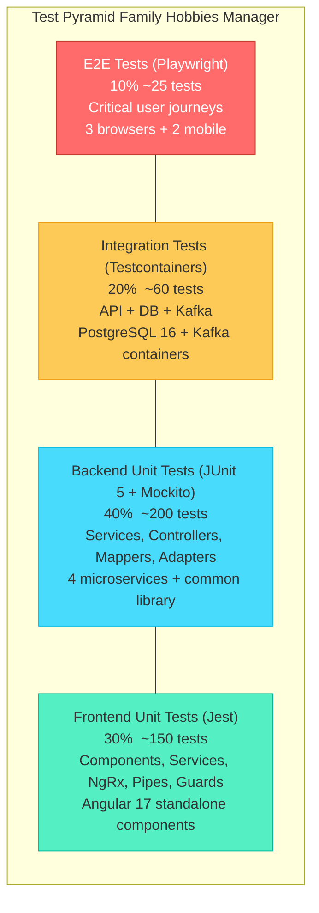
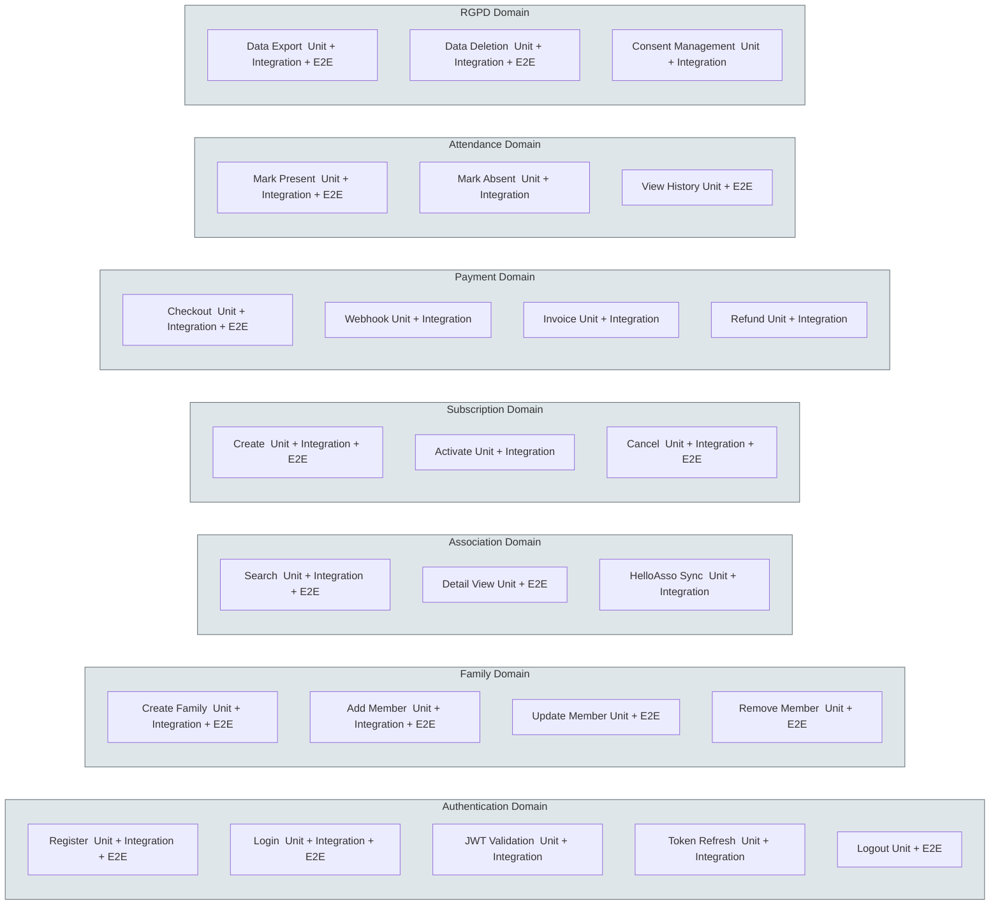

# 10 -- Testing Strategy

> **Family Hobbies Manager** -- Multi-Association Management Platform
> Architecture Document Series | Document 10 of 12

---

## Table of Contents

1. [Test Pyramid](#1-test-pyramid)
2. [Backend Unit Tests (JUnit 5 + Mockito)](#2-backend-unit-tests-junit-5--mockito)
3. [Backend Integration Tests (Spring Boot Test + Testcontainers)](#3-backend-integration-tests-spring-boot-test--testcontainers)
4. [Frontend Unit Tests (Jest)](#4-frontend-unit-tests-jest)
5. [E2E Tests (Playwright)](#5-e2e-tests-playwright)
6. [Test Data Strategy](#6-test-data-strategy)
7. [CI/CD Test Integration](#7-cicd-test-integration)
8. [Test Fixtures and Utilities](#8-test-fixtures-and-utilities)
9. [Diagrams](#9-diagrams)

---

## 1. Test Pyramid

The Family Hobbies Manager follows a strict test pyramid where the base layer provides the most
coverage and the fastest feedback loop, while higher layers validate increasingly broad slices of
the system at correspondingly lower volume.

```
              /\
             /  \
            / E2E \               <-- 10%  Playwright -- critical user journeys
           /  Tests \                 Browser-level, slow, expensive
          /----------\
         / Integration \          <-- 20%  Spring Boot Test + Testcontainers
        /    Tests      \             API + DB + Kafka, medium speed
       /----------------\
      /  Unit Tests       \       <-- 40%  JUnit 5 + Mockito -- backend business logic
     /   (JUnit 5)         \          Fast, isolated, mocked dependencies
    /----------------------\
   /    Unit Tests           \    <-- 30%  Jest -- frontend components + services
  /     (Jest)                \       Fast, JSDOM, mocked HTTP
 /--------------------------\
```

### Why This Distribution

| Layer | Percentage | Rationale |
|---|---|---|
| Backend Unit (JUnit 5) | 40% | Core business logic lives in Java services. Payment flows, subscription lifecycle, attendance marking, RGPD compliance -- all require thorough unit coverage. |
| Frontend Unit (Jest) | 30% | Angular standalone components, NgRx reducers/effects, services, pipes, and guards each require isolated validation. The SPA is the primary user interface. |
| Integration | 20% | Testcontainers verify that JPA repositories, Liquibase migrations, Kafka producers/consumers, and REST controllers work together with real PostgreSQL and Kafka instances. |
| E2E (Playwright) | 10% | Expensive browser tests are reserved for critical user journeys: auth flow, association search, family management, subscription, and payment checkout. |

### Enterprise Stack Alignment

This testing strategy explicitly demonstrates competency in every testing technology listed in
enterprise job requirements:

| Enterprise Requirement | Implementation in This Project |
|---|---|
| **JUnit** | JUnit 5 with Mockito for all backend service, controller, mapper, and adapter tests |
| **Jest** | Jest with `jest-preset-angular` for all Angular component, service, NgRx, pipe, and guard tests |
| **Playwright** | Playwright with Page Object Model for cross-browser E2E tests including mobile viewports |

---

## 2. Backend Unit Tests (JUnit 5 + Mockito)

### 2.1 Configuration

Every backend microservice inherits the `spring-boot-starter-test` dependency, which bundles
JUnit 5, Mockito, AssertJ, Hamcrest, and JSONPath.

```xml
<!-- backend/{service}/pom.xml -->
<dependency>
    <groupId>org.springframework.boot</groupId>
    <artifactId>spring-boot-starter-test</artifactId>
    <scope>test</scope>
</dependency>
```

For services that publish or consume Kafka events, the Kafka test dependency is also included:

```xml
<dependency>
    <groupId>org.springframework.kafka</groupId>
    <artifactId>spring-kafka-test</artifactId>
    <scope>test</scope>
</dependency>
```

For HelloAsso adapter tests, MockWebServer provides deterministic HTTP stubbing:

```xml
<dependency>
    <groupId>com.squareup.okhttp3</groupId>
    <artifactId>mockwebserver</artifactId>
    <scope>test</scope>
</dependency>
```

### 2.2 Test Naming Convention

All backend test methods follow the pattern:

```
should_{expectedResult}_when_{condition}
```

This convention makes test intent immediately readable in test reports and CI logs.

**Examples from each service:**

| Service | Test Method Name |
|---|---|
| user-service | `should_returnFamily_when_validFamilyId()` |
| user-service | `should_throwNotFoundException_when_userDoesNotExist()` |
| user-service | `should_rejectRegistration_when_emailAlreadyExists()` |
| association-service | `should_publishEvent_when_subscriptionCreated()` |
| association-service | `should_returnPagedAssociations_when_searchByCity()` |
| association-service | `should_markAttendance_when_sessionIsActive()` |
| payment-service | `should_updateStatus_when_paymentWebhookReceived()` |
| payment-service | `should_createInvoice_when_paymentCompleted()` |
| notification-service | `should_sendEmail_when_notificationCreated()` |
| notification-service | `should_skipNotification_when_userOptedOut()` |

### 2.3 Test Class Structure

Every unit test class uses `MockitoExtension` (not `SpringExtension`) to keep execution fast.
Spring context is never loaded for unit tests. Nested classes group tests by method under test.

```java
package com.familyhobbies.userservice.service;

import org.junit.jupiter.api.*;
import org.junit.jupiter.api.extension.ExtendWith;
import org.mockito.*;
import org.mockito.junit.jupiter.MockitoExtension;

import static org.assertj.core.api.Assertions.*;
import static org.mockito.ArgumentMatchers.*;
import static org.mockito.Mockito.*;

@ExtendWith(MockitoExtension.class)
class FamilyServiceImplTest {

    @Mock private FamilyRepository familyRepository;
    @Mock private FamilyMemberRepository memberRepository;
    @Mock private UserEventPublisher eventPublisher;

    @InjectMocks private FamilyServiceImpl familyService;

    @Nested
    @DisplayName("createFamily")
    class CreateFamily {

        @Test
        @DisplayName("should create family when valid request")
        void should_createFamily_when_validRequest() {
            // given
            CreateFamilyRequest request = new CreateFamilyRequest("Famille Dupont");
            Family savedFamily = TestDataFactory.familyEntity();
            when(familyRepository.save(any(Family.class))).thenReturn(savedFamily);

            // when
            FamilyResponse result = familyService.createFamily(request, 1L);

            // then
            assertThat(result.getName()).isEqualTo("Famille Dupont");
            verify(familyRepository).save(any(Family.class));
            verify(eventPublisher).publishFamilyCreated(any());
        }

        @Test
        @DisplayName("should throw exception when user already has family")
        void should_throwException_when_userAlreadyHasFamily() {
            // given
            when(familyRepository.existsByOwnerId(1L)).thenReturn(true);
            CreateFamilyRequest request = new CreateFamilyRequest("Famille Dupont");

            // when / then
            assertThatThrownBy(() -> familyService.createFamily(request, 1L))
                .isInstanceOf(BusinessException.class)
                .hasMessageContaining("already has a family");
            verify(familyRepository, never()).save(any());
        }
    }

    @Nested
    @DisplayName("addMember")
    class AddMember {

        @Test
        @DisplayName("should add member when family exists and member is valid")
        void should_addMember_when_familyExistsAndMemberIsValid() {
            // given
            Family family = TestDataFactory.familyEntity();
            when(familyRepository.findById(1L)).thenReturn(Optional.of(family));
            AddMemberRequest request = new AddMemberRequest("Marie", "Dupont",
                LocalDate.of(2015, 3, 12), MemberRole.CHILD);
            when(memberRepository.save(any())).thenReturn(TestDataFactory.memberEntity());

            // when
            FamilyMemberResponse result = familyService.addMember(1L, request, 1L);

            // then
            assertThat(result.getFirstName()).isEqualTo("Marie");
            assertThat(result.getRole()).isEqualTo(MemberRole.CHILD);
            verify(memberRepository).save(any(FamilyMember.class));
        }

        @Test
        @DisplayName("should throw not found when family does not exist")
        void should_throwNotFound_when_familyDoesNotExist() {
            // given
            when(familyRepository.findById(99L)).thenReturn(Optional.empty());
            AddMemberRequest request = new AddMemberRequest("Marie", "Dupont",
                LocalDate.of(2015, 3, 12), MemberRole.CHILD);

            // when / then
            assertThatThrownBy(() -> familyService.addMember(99L, request, 1L))
                .isInstanceOf(ResourceNotFoundException.class)
                .hasMessageContaining("Family not found");
        }
    }
}
```

### 2.4 What to Unit Test (Per Layer)

Each architectural layer has a distinct testing focus and mock boundary:

| Layer | What to Test | What to Mock | Example Test Class |
|---|---|---|---|
| **Service** | Business logic, validation rules, event publishing, error cases | Repository, external clients, event publisher | `FamilyServiceImplTest`, `SubscriptionServiceImplTest` |
| **Controller** | Request mapping, input validation, HTTP status codes, response body shape | Service layer | `FamilyControllerTest`, `AuthControllerTest` |
| **Mapper** | Entity-to-DTO conversion, DTO-to-entity conversion, null handling | Nothing (pure functions) | `UserMapperTest`, `AssociationMapperTest` |
| **Adapter** | External API call construction, response parsing, error mapping | WebClient via MockWebServer | `HelloAssoClientTest`, `HelloAssoCheckoutClientTest` |
| **Validator** | Custom constraint validation logic | Nothing (pure functions) | `PhoneNumberValidatorTest`, `PostalCodeValidatorTest` |
| **Event Publisher** | Kafka message construction, correct topic routing | KafkaTemplate | `UserEventPublisherTest`, `PaymentEventPublisherTest` |

#### Service Layer Test Example (association-service)

```java
@ExtendWith(MockitoExtension.class)
class SubscriptionServiceImplTest {

    @Mock private SubscriptionRepository subscriptionRepository;
    @Mock private ActivityRepository activityRepository;
    @Mock private SubscriptionEventPublisher eventPublisher;

    @InjectMocks private SubscriptionServiceImpl subscriptionService;

    @Nested
    @DisplayName("createSubscription")
    class CreateSubscription {

        @Test
        @DisplayName("should create subscription when activity has available slots")
        void should_createSubscription_when_activityHasAvailableSlots() {
            // given
            Activity activity = TestDataFactory.activityEntity();
            activity.setMaxParticipants(20);
            activity.setCurrentParticipants(15);
            when(activityRepository.findById(1L)).thenReturn(Optional.of(activity));

            CreateSubscriptionRequest request = new CreateSubscriptionRequest(1L, 1L, 42L);
            when(subscriptionRepository.save(any())).thenReturn(TestDataFactory.subscriptionEntity());

            // when
            SubscriptionResponse result = subscriptionService.createSubscription(request);

            // then
            assertThat(result.getStatus()).isEqualTo(SubscriptionStatus.PENDING_PAYMENT);
            verify(eventPublisher).publishSubscriptionCreated(any(SubscriptionCreatedEvent.class));
        }

        @Test
        @DisplayName("should reject subscription when activity is full")
        void should_rejectSubscription_when_activityIsFull() {
            // given
            Activity activity = TestDataFactory.activityEntity();
            activity.setMaxParticipants(20);
            activity.setCurrentParticipants(20);
            when(activityRepository.findById(1L)).thenReturn(Optional.of(activity));

            CreateSubscriptionRequest request = new CreateSubscriptionRequest(1L, 1L, 42L);

            // when / then
            assertThatThrownBy(() -> subscriptionService.createSubscription(request))
                .isInstanceOf(BusinessException.class)
                .hasMessageContaining("no available slots");
            verify(subscriptionRepository, never()).save(any());
            verify(eventPublisher, never()).publishSubscriptionCreated(any());
        }
    }
}
```

#### Controller Layer Test Example (user-service)

```java
@WebMvcTest(AuthController.class)
class AuthControllerTest {

    @Autowired private MockMvc mockMvc;
    @MockBean private AuthService authService;
    @Autowired private ObjectMapper objectMapper;

    @Test
    @DisplayName("should return 201 when registration is valid")
    void should_return201_when_registrationIsValid() throws Exception {
        // given
        RegisterRequest request = new RegisterRequest(
            "dupont@email.com", "SecureP@ss1", "Jean", "Dupont", null);
        UserResponse response = new UserResponse(1L, "dupont@email.com", "Jean", "Dupont");
        when(authService.register(any())).thenReturn(response);

        // when / then
        mockMvc.perform(post("/api/v1/auth/register")
                .contentType(MediaType.APPLICATION_JSON)
                .content(objectMapper.writeValueAsString(request)))
            .andExpect(status().isCreated())
            .andExpect(jsonPath("$.email").value("dupont@email.com"))
            .andExpect(jsonPath("$.firstName").value("Jean"));
    }

    @Test
    @DisplayName("should return 400 when email is missing")
    void should_return400_when_emailIsMissing() throws Exception {
        // given
        String invalidBody = """
            {"password": "SecureP@ss1", "firstName": "Jean", "lastName": "Dupont"}
            """;

        // when / then
        mockMvc.perform(post("/api/v1/auth/register")
                .contentType(MediaType.APPLICATION_JSON)
                .content(invalidBody))
            .andExpect(status().isBadRequest())
            .andExpect(jsonPath("$.errors").isNotEmpty());
    }

    @Test
    @DisplayName("should return 409 when email already exists")
    void should_return409_when_emailAlreadyExists() throws Exception {
        // given
        RegisterRequest request = new RegisterRequest(
            "existing@email.com", "SecureP@ss1", "Jean", "Dupont", null);
        when(authService.register(any()))
            .thenThrow(new ConflictException("Email already registered"));

        // when / then
        mockMvc.perform(post("/api/v1/auth/register")
                .contentType(MediaType.APPLICATION_JSON)
                .content(objectMapper.writeValueAsString(request)))
            .andExpect(status().isConflict())
            .andExpect(jsonPath("$.message").value("Email already registered"));
    }
}
```

#### Mapper Test Example (pure function, no mocks)

```java
class UserMapperTest {

    private final UserMapper mapper = new UserMapperImpl();

    @Test
    @DisplayName("should map user entity to response DTO")
    void should_mapUserEntityToResponse() {
        // given
        User user = TestDataFactory.userEntity();

        // when
        UserResponse response = mapper.toResponse(user);

        // then
        assertThat(response.id()).isEqualTo(user.getId());
        assertThat(response.email()).isEqualTo(user.getEmail());
        assertThat(response.firstName()).isEqualTo(user.getFirstName());
        assertThat(response.lastName()).isEqualTo(user.getLastName());
    }

    @Test
    @DisplayName("should map register request to entity")
    void should_mapRegisterRequestToEntity() {
        // given
        RegisterRequest request = new RegisterRequest(
            "dupont@email.com", "SecureP@ss1", "Jean", "Dupont", null);

        // when
        User entity = mapper.toEntity(request);

        // then
        assertThat(entity.getEmail()).isEqualTo("dupont@email.com");
        assertThat(entity.getFirstName()).isEqualTo("Jean");
        assertThat(entity.getId()).isNull(); // not yet persisted
    }

    @Test
    @DisplayName("should return null when entity is null")
    void should_returnNull_when_entityIsNull() {
        assertThat(mapper.toResponse(null)).isNull();
    }
}
```

#### Adapter Test Example (HelloAsso client with MockWebServer)

```java
class HelloAssoClientTest {

    private MockWebServer mockWebServer;
    private HelloAssoClient helloAssoClient;

    @BeforeEach
    void setUp() throws IOException {
        mockWebServer = new MockWebServer();
        mockWebServer.start();
        String baseUrl = mockWebServer.url("/v5").toString();
        WebClient webClient = WebClient.builder().baseUrl(baseUrl).build();
        helloAssoClient = new HelloAssoClient(webClient);
    }

    @AfterEach
    void tearDown() throws IOException {
        mockWebServer.shutdown();
    }

    @Test
    @DisplayName("should return organizations when search is successful")
    void should_returnOrganizations_when_searchIsSuccessful() {
        // given
        String responseBody = """
            {
              "data": [
                {"name": "AS Lyon Basket", "city": "Lyon", "slug": "as-lyon-basket"},
                {"name": "Lyon Danse", "city": "Lyon", "slug": "lyon-danse"}
              ],
              "pagination": {"totalCount": 2, "pageSize": 20, "pageIndex": 1}
            }
            """;
        mockWebServer.enqueue(new MockResponse()
            .setBody(responseBody)
            .setHeader("Content-Type", "application/json"));

        // when
        HelloAssoSearchResponse result = helloAssoClient.searchOrganizations("Lyon", 1, 20);

        // then
        assertThat(result.getData()).hasSize(2);
        assertThat(result.getData().get(0).getName()).isEqualTo("AS Lyon Basket");
        assertThat(result.getData().get(0).getCity()).isEqualTo("Lyon");
    }

    @Test
    @DisplayName("should throw exception when HelloAsso returns 500")
    void should_throwException_when_helloAssoReturns500() {
        // given
        mockWebServer.enqueue(new MockResponse().setResponseCode(500));

        // when / then
        assertThatThrownBy(() -> helloAssoClient.searchOrganizations("Lyon", 1, 20))
            .isInstanceOf(HelloAssoApiException.class)
            .hasMessageContaining("HelloAsso API error");
    }

    @Test
    @DisplayName("should throw exception when HelloAsso returns 429 rate limit")
    void should_throwException_when_helloAssoReturns429() {
        // given
        mockWebServer.enqueue(new MockResponse()
            .setResponseCode(429)
            .setHeader("Retry-After", "60"));

        // when / then
        assertThatThrownBy(() -> helloAssoClient.searchOrganizations("Lyon", 1, 20))
            .isInstanceOf(HelloAssoRateLimitException.class);
    }
}
```

### 2.5 Test Data Builders

A centralized `TestDataFactory` class provides reusable builders for every entity, DTO, and
event across the project. Each service has its own factory in the `test/` source set.

```java
package com.familyhobbies.userservice.testutil;

import com.familyhobbies.userservice.entity.*;
import com.familyhobbies.userservice.dto.*;
import com.familyhobbies.common.event.*;

import java.time.LocalDate;
import java.time.LocalDateTime;

/**
 * Centralized factory for test data.
 * All methods return reasonable defaults that can be customized via builder pattern.
 */
public class TestDataFactory {

    // ---- Entities ----

    public static User userEntity() {
        return User.builder()
            .id(1L)
            .email("dupont@email.com")
            .firstName("Jean")
            .lastName("Dupont")
            .passwordHash("$2a$10$hashedPasswordPlaceholder")
            .role(UserRole.FAMILY)
            .status(UserStatus.ACTIVE)
            .createdAt(LocalDateTime.of(2026, 1, 15, 10, 0))
            .updatedAt(LocalDateTime.of(2026, 1, 15, 10, 0))
            .build();
    }

    public static User userEntity(String email, String firstName, String lastName) {
        return User.builder()
            .id(null)
            .email(email)
            .firstName(firstName)
            .lastName(lastName)
            .role(UserRole.FAMILY)
            .status(UserStatus.ACTIVE)
            .build();
    }

    public static Family familyEntity() {
        return Family.builder()
            .id(1L)
            .name("Famille Dupont")
            .ownerId(1L)
            .createdAt(LocalDateTime.of(2026, 1, 15, 10, 0))
            .build();
    }

    public static FamilyMember memberEntity() {
        return FamilyMember.builder()
            .id(1L)
            .familyId(1L)
            .firstName("Marie")
            .lastName("Dupont")
            .dateOfBirth(LocalDate.of(2015, 3, 12))
            .role(MemberRole.CHILD)
            .build();
    }

    // ---- DTOs ----

    public static CreateFamilyRequest createFamilyRequest() {
        return new CreateFamilyRequest("Famille Dupont");
    }

    public static RegisterRequest registerRequest() {
        return new RegisterRequest(
            "dupont@email.com", "SecureP@ss1", "Jean", "Dupont", null);
    }

    public static LoginRequest loginRequest() {
        return new LoginRequest("dupont@email.com", "SecureP@ss1");
    }

    public static AddMemberRequest addMemberRequest() {
        return new AddMemberRequest(
            "Marie", "Dupont", LocalDate.of(2015, 3, 12), MemberRole.CHILD);
    }

    // ---- Events ----

    public static UserRegisteredEvent userRegisteredEvent() {
        return new UserRegisteredEvent(1L, "dupont@email.com", "Jean", "Dupont");
    }
}
```

**Association-service TestDataFactory (separate class):**

```java
package com.familyhobbies.associationservice.testutil;

public class TestDataFactory {

    public static Association associationEntity() {
        return Association.builder()
            .id(1L)
            .name("AS Lyon Basket")
            .slug("as-lyon-basket")
            .city("Lyon")
            .postalCode("69001")
            .category(AssociationCategory.SPORT)
            .description("Club de basketball a Lyon")
            .helloAssoUrl("https://www.helloasso.com/associations/as-lyon-basket")
            .status(AssociationStatus.ACTIVE)
            .build();
    }

    public static Activity activityEntity() {
        return Activity.builder()
            .id(1L)
            .associationId(1L)
            .name("Basketball Poussins")
            .category(ActivityCategory.SPORT)
            .ageMin(8)
            .ageMax(12)
            .maxParticipants(20)
            .currentParticipants(15)
            .seasonStart(LocalDate.of(2026, 9, 1))
            .seasonEnd(LocalDate.of(2027, 6, 30))
            .build();
    }

    public static Session sessionEntity() {
        return Session.builder()
            .id(1L)
            .activityId(1L)
            .dayOfWeek(DayOfWeek.WEDNESDAY)
            .startTime(LocalTime.of(14, 0))
            .endTime(LocalTime.of(16, 0))
            .location("Gymnase Municipal Lyon 1er")
            .build();
    }

    public static Subscription subscriptionEntity() {
        return Subscription.builder()
            .id(1L)
            .activityId(1L)
            .familyMemberId(1L)
            .familyId(1L)
            .status(SubscriptionStatus.PENDING_PAYMENT)
            .seasonYear("2026-2027")
            .build();
    }

    public static AttendanceRecord attendanceRecordEntity() {
        return AttendanceRecord.builder()
            .id(1L)
            .sessionId(1L)
            .subscriptionId(1L)
            .familyMemberId(1L)
            .sessionDate(LocalDate.of(2026, 9, 4))
            .status(AttendanceStatus.PRESENT)
            .markedBy(2L)
            .build();
    }
}
```

### 2.6 Coverage Targets Per Service

Coverage is measured by JaCoCo and enforced in the Maven build. Tests that fail coverage
thresholds break the CI pipeline.

| Service | Line Coverage Target | Branch Coverage Target | Critical Paths That Must Have 100% Coverage |
|---|---|---|---|
| **user-service** | 80%+ | 75%+ | Auth flow (register/login/refresh), family CRUD, RGPD data export and deletion |
| **association-service** | 80%+ | 75%+ | Subscription lifecycle (create/activate/cancel), attendance marking, HelloAsso sync |
| **payment-service** | 85%+ | 80%+ | Payment initiation, webhook processing, invoice generation, refund handling |
| **notification-service** | 75%+ | 70%+ | Template rendering, Kafka event consumption, user preference filtering |
| **common** | 90%+ | 85%+ | DTOs (serialization/deserialization), mappers, shared validators, event classes |

**JaCoCo Maven Plugin configuration:**

```xml
<plugin>
    <groupId>org.jacoco</groupId>
    <artifactId>jacoco-maven-plugin</artifactId>
    <version>0.8.11</version>
    <executions>
        <execution>
            <goals><goal>prepare-agent</goal></goals>
        </execution>
        <execution>
            <id>report</id>
            <phase>test</phase>
            <goals><goal>report</goal></goals>
        </execution>
        <execution>
            <id>check</id>
            <phase>verify</phase>
            <goals><goal>check</goal></goals>
            <configuration>
                <rules>
                    <rule>
                        <element>BUNDLE</element>
                        <limits>
                            <limit>
                                <counter>LINE</counter>
                                <value>COVEREDRATIO</value>
                                <minimum>0.80</minimum>
                            </limit>
                            <limit>
                                <counter>BRANCH</counter>
                                <value>COVEREDRATIO</value>
                                <minimum>0.75</minimum>
                            </limit>
                        </limits>
                    </rule>
                </rules>
            </configuration>
        </execution>
    </executions>
</plugin>
```

### 2.7 Unit Test Inventory Per Service

The following table lists every unit test class that exists or is planned for each service.

#### user-service

| Test Class | Layer | Methods Under Test |
|---|---|---|
| `AuthServiceImplTest` | Service | register, login, refreshToken, logout |
| `AuthControllerTest` | Controller | POST /register, POST /login, POST /refresh, POST /logout |
| `FamilyServiceImplTest` | Service | createFamily, getFamily, updateFamily, deleteFamily, addMember, removeMember |
| `FamilyControllerTest` | Controller | CRUD endpoints for families and members |
| `UserServiceImplTest` | Service | getProfile, updateProfile, changePassword, deactivate |
| `RgpdServiceImplTest` | Service | exportUserData, requestDeletion, getConsentHistory |
| `UserMapperTest` | Mapper | toResponse, toEntity, toEvent |
| `FamilyMapperTest` | Mapper | toResponse, toEntity |
| `JwtTokenProviderTest` | Security | generateToken, validateToken, extractUserId, extractRoles |
| `UserEventPublisherTest` | Event | publishUserRegistered, publishUserDeleted |

#### association-service

| Test Class | Layer | Methods Under Test |
|---|---|---|
| `AssociationServiceImplTest` | Service | search, getBySlug, syncFromHelloAsso, getByCity |
| `AssociationControllerTest` | Controller | GET /search, GET /{slug}, POST /sync |
| `ActivityServiceImplTest` | Service | getByAssociation, create, update, delete |
| `SessionServiceImplTest` | Service | getByActivity, create, update, cancel |
| `SubscriptionServiceImplTest` | Service | create, activate, cancel, getByFamily, getByActivity |
| `AttendanceServiceImplTest` | Service | markPresent, markAbsent, getBySession, getByMember |
| `AssociationSyncServiceTest` | Service | syncAll, syncBySlug, handleSyncFailure |
| `HelloAssoClientTest` | Adapter | searchOrganizations, getOrganization, error handling |
| `AssociationMapperTest` | Mapper | toResponse, toEntity, fromHelloAssoDto |
| `SubscriptionEventPublisherTest` | Event | publishSubscriptionCreated, publishSubscriptionCancelled |

#### payment-service

| Test Class | Layer | Methods Under Test |
|---|---|---|
| `PaymentServiceImplTest` | Service | initiateCheckout, processWebhook, getPaymentStatus, refund |
| `PaymentControllerTest` | Controller | POST /checkout, GET /status/{id}, POST /refund |
| `InvoiceServiceImplTest` | Service | generateInvoice, getInvoice, getInvoicesByFamily |
| `HelloAssoCheckoutClientTest` | Adapter | createCheckoutSession, getPaymentStatus |
| `HelloAssoWebhookHandlerTest` | Adapter | validateSignature, parsePayload, handlePaymentAuthorized |
| `PaymentMapperTest` | Mapper | toResponse, toEntity, toInvoice |
| `PaymentEventPublisherTest` | Event | publishPaymentCompleted, publishPaymentFailed |

#### notification-service

| Test Class | Layer | Methods Under Test |
|---|---|---|
| `NotificationServiceImplTest` | Service | create, markAsRead, getByUser, getUnreadCount |
| `EmailServiceImplTest` | Service | sendEmail, renderTemplate, resolveRecipient |
| `NotificationControllerTest` | Controller | GET /notifications, PATCH /read, GET /unread-count |
| `TemplateRendererTest` | Service | render with variables, render with locale, missing template |
| `UserPreferenceFilterTest` | Service | filter by channel, filter by category, filter by quiet hours |
| `KafkaEventListenerTest` | Event | onUserRegistered, onSubscriptionCreated, onPaymentCompleted, onPaymentFailed |
| `NotificationMapperTest` | Mapper | toResponse, toEntity |

---

## 3. Backend Integration Tests (Spring Boot Test + Testcontainers)

### 3.1 Configuration

Integration tests use `@SpringBootTest` with a real Spring context, Testcontainers for
PostgreSQL and Kafka, and `@DynamicPropertySource` to inject container connection details.

```java
package com.familyhobbies.userservice.integration;

import org.springframework.boot.test.context.SpringBootTest;
import org.springframework.boot.test.web.client.TestRestTemplate;
import org.springframework.test.context.DynamicPropertyRegistry;
import org.springframework.test.context.DynamicPropertySource;
import org.testcontainers.containers.PostgreSQLContainer;
import org.testcontainers.containers.KafkaContainer;
import org.testcontainers.junit.jupiter.Container;
import org.testcontainers.junit.jupiter.Testcontainers;
import org.testcontainers.utility.DockerImageName;

@SpringBootTest(webEnvironment = SpringBootTest.WebEnvironment.RANDOM_PORT)
@Testcontainers
class UserControllerIntegrationTest {

    @Container
    static PostgreSQLContainer<?> postgres = new PostgreSQLContainer<>("postgres:16-alpine")
        .withDatabaseName("familyhobbies_users_test")
        .withUsername("test")
        .withPassword("test");

    @Container
    static KafkaContainer kafka = new KafkaContainer(
        DockerImageName.parse("confluentinc/cp-kafka:7.5.0"));

    @DynamicPropertySource
    static void configureProperties(DynamicPropertyRegistry registry) {
        registry.add("spring.datasource.url", postgres::getJdbcUrl);
        registry.add("spring.datasource.username", postgres::getUsername);
        registry.add("spring.datasource.password", postgres::getPassword);
        registry.add("spring.kafka.bootstrap-servers", kafka::getBootstrapServers);
        registry.add("spring.liquibase.change-log",
            () -> "classpath:db/changelog/db.changelog-master.xml");
    }

    @Autowired private TestRestTemplate restTemplate;
    @Autowired private UserRepository userRepository;
}
```

### 3.2 Abstract Integration Test Base Class

To avoid repeating Testcontainers configuration, all integration tests extend a shared base class:

```java
package com.familyhobbies.userservice.integration;

@SpringBootTest(webEnvironment = SpringBootTest.WebEnvironment.RANDOM_PORT)
@Testcontainers
@ActiveProfiles("test")
public abstract class AbstractIntegrationTest {

    @Container
    static PostgreSQLContainer<?> postgres = new PostgreSQLContainer<>("postgres:16-alpine")
        .withDatabaseName("familyhobbies_users_test")
        .withUsername("test")
        .withPassword("test");

    @Container
    static KafkaContainer kafka = new KafkaContainer(
        DockerImageName.parse("confluentinc/cp-kafka:7.5.0"));

    @DynamicPropertySource
    static void configureProperties(DynamicPropertyRegistry registry) {
        registry.add("spring.datasource.url", postgres::getJdbcUrl);
        registry.add("spring.datasource.username", postgres::getUsername);
        registry.add("spring.datasource.password", postgres::getPassword);
        registry.add("spring.kafka.bootstrap-servers", kafka::getBootstrapServers);
    }

    @Autowired protected TestRestTemplate restTemplate;

    @BeforeEach
    void cleanDatabase(@Autowired JdbcTemplate jdbcTemplate) {
        // Clean all tables before each test for isolation
        jdbcTemplate.execute("TRUNCATE TABLE t_user CASCADE");
        jdbcTemplate.execute("TRUNCATE TABLE t_family CASCADE");
        jdbcTemplate.execute("TRUNCATE TABLE t_family_member CASCADE");
    }
}
```

### 3.3 What to Integration Test

| Scenario | Services Involved | What Is Validated |
|---|---|---|
| Full auth flow | user-service | Register -> Login -> Access protected endpoint -> Token refresh -> Logout |
| Family CRUD lifecycle | user-service | Create family -> Add members -> Update family name -> Remove member -> Delete family |
| Subscription lifecycle | association-service | Create subscription -> Process payment webhook -> Activate -> Cancel |
| Kafka event publishing | user-service, association-service, payment-service | Action triggers event -> Event appears on topic -> Correct payload shape |
| Kafka event consumption | notification-service | Event published to topic -> Consumer receives -> Notification created in DB |
| Liquibase migrations | All data services | All changesets apply cleanly on a fresh PostgreSQL 16 container |
| HelloAsso adapter (WireMock) | association-service, payment-service | WireMock stub -> Client call -> Correct DTO mapping -> Error handling |
| Attendance batch marking | association-service | Multiple attendance records -> Batch insert -> Correct session state |
| RGPD data export | user-service | Export endpoint returns all user data as JSON archive |
| RGPD data deletion | user-service | Deletion request -> Soft delete -> Kafka event -> Cascading anonymization |
| Payment webhook validation | payment-service | Valid signature -> Process -> Invalid signature -> Reject with 401 |
| Concurrent subscription | association-service | Two simultaneous subscriptions for last slot -> One succeeds, one fails |

### 3.4 Integration Test Examples

#### Full Auth Flow

```java
class AuthFlowIntegrationTest extends AbstractIntegrationTest {

    @Test
    void should_registerAndLogin_when_validCredentials() {
        // Step 1: Register
        RegisterRequest register = new RegisterRequest(
            "test@email.com", "SecureP@ss1", "Jean", "Dupont", null);
        ResponseEntity<UserResponse> registerResponse = restTemplate.postForEntity(
            "/api/v1/auth/register", register, UserResponse.class);

        assertThat(registerResponse.getStatusCode()).isEqualTo(HttpStatus.CREATED);
        assertThat(registerResponse.getBody().getEmail()).isEqualTo("test@email.com");

        // Step 2: Login
        LoginRequest login = new LoginRequest("test@email.com", "SecureP@ss1");
        ResponseEntity<AuthResponse> loginResponse = restTemplate.postForEntity(
            "/api/v1/auth/login", login, AuthResponse.class);

        assertThat(loginResponse.getStatusCode()).isEqualTo(HttpStatus.OK);
        assertThat(loginResponse.getBody().getAccessToken()).isNotBlank();
        assertThat(loginResponse.getBody().getRefreshToken()).isNotBlank();
        assertThat(loginResponse.getBody().getTokenType()).isEqualTo("Bearer");

        // Step 3: Access protected endpoint with token
        String token = loginResponse.getBody().getAccessToken();
        HttpHeaders headers = new HttpHeaders();
        headers.setBearerAuth(token);
        HttpEntity<Void> authRequest = new HttpEntity<>(headers);

        ResponseEntity<UserResponse> profileResponse = restTemplate.exchange(
            "/api/v1/users/me", HttpMethod.GET, authRequest, UserResponse.class);

        assertThat(profileResponse.getStatusCode()).isEqualTo(HttpStatus.OK);
        assertThat(profileResponse.getBody().getEmail()).isEqualTo("test@email.com");
    }

    @Test
    void should_returnUnauthorized_when_invalidCredentials() {
        // First register a user
        RegisterRequest register = new RegisterRequest(
            "test2@email.com", "SecureP@ss1", "Marie", "Martin", null);
        restTemplate.postForEntity("/api/v1/auth/register", register, UserResponse.class);

        // Attempt login with wrong password
        LoginRequest login = new LoginRequest("test2@email.com", "WrongPassword1!");
        ResponseEntity<ErrorResponse> response = restTemplate.postForEntity(
            "/api/v1/auth/login", login, ErrorResponse.class);

        assertThat(response.getStatusCode()).isEqualTo(HttpStatus.UNAUTHORIZED);
    }

    @Test
    void should_rejectDuplicateRegistration_when_emailAlreadyExists() {
        RegisterRequest request = new RegisterRequest(
            "duplicate@email.com", "SecureP@ss1", "Jean", "Dupont", null);
        restTemplate.postForEntity("/api/v1/auth/register", request, UserResponse.class);

        // Attempt second registration with same email
        ResponseEntity<ErrorResponse> response = restTemplate.postForEntity(
            "/api/v1/auth/register", request, ErrorResponse.class);

        assertThat(response.getStatusCode()).isEqualTo(HttpStatus.CONFLICT);
    }
}
```

#### Kafka Event Flow

```java
class KafkaEventFlowIntegrationTest extends AbstractIntegrationTest {

    @Autowired private KafkaTemplate<String, Object> kafkaTemplate;
    @Autowired private NotificationRepository notificationRepository;

    @Test
    void should_createNotification_when_userRegisteredEventReceived() throws Exception {
        // given -- publish event to Kafka topic
        UserRegisteredEvent event = new UserRegisteredEvent(
            1L, "dupont@email.com", "Jean", "Dupont");
        kafkaTemplate.send("user-events", String.valueOf(event.getUserId()), event).get();

        // when -- wait for consumer to process (with timeout)
        await().atMost(Duration.ofSeconds(10))
            .untilAsserted(() -> {
                List<Notification> notifications = notificationRepository
                    .findByUserId(1L);
                assertThat(notifications).isNotEmpty();
                assertThat(notifications.get(0).getType())
                    .isEqualTo(NotificationType.WELCOME);
                assertThat(notifications.get(0).getChannel())
                    .isEqualTo(NotificationChannel.EMAIL);
            });
    }
}
```

#### HelloAsso Adapter with WireMock

```java
@SpringBootTest(webEnvironment = SpringBootTest.WebEnvironment.RANDOM_PORT)
@Testcontainers
@AutoConfigureWireMock(port = 0)
class HelloAssoAdapterIntegrationTest {

    @DynamicPropertySource
    static void configure(DynamicPropertyRegistry registry) {
        registry.add("helloasso.base-url",
            () -> "http://localhost:${wiremock.server.port}/v5");
    }

    @Autowired private HelloAssoClient helloAssoClient;

    @Test
    void should_returnOrganizations_when_helloAssoRespondsSuccessfully() {
        // given
        stubFor(post(urlPathEqualTo("/v5/directory/organizations"))
            .willReturn(aResponse()
                .withStatus(200)
                .withHeader("Content-Type", "application/json")
                .withBody("""
                    {
                      "data": [
                        {"name": "AS Lyon Basket", "city": "Lyon", "slug": "as-lyon-basket"}
                      ],
                      "pagination": {"totalCount": 1, "pageSize": 20, "pageIndex": 1}
                    }
                    """)));

        // when
        HelloAssoSearchResponse result = helloAssoClient.searchOrganizations("Lyon", 1, 20);

        // then
        assertThat(result.getData()).hasSize(1);
        assertThat(result.getData().get(0).getCity()).isEqualTo("Lyon");
    }
}
```

#### Liquibase Migration Validation

```java
@Testcontainers
class LiquibaseMigrationIntegrationTest {

    @Container
    static PostgreSQLContainer<?> postgres = new PostgreSQLContainer<>("postgres:16-alpine")
        .withDatabaseName("familyhobbies_users_test");

    @Test
    void should_applyAllChangesets_when_databaseIsEmpty() {
        // given
        Liquibase liquibase = new Liquibase(
            "db/changelog/db.changelog-master.xml",
            new ClassLoaderResourceAccessor(),
            DatabaseFactory.getInstance().findCorrectDatabaseImplementation(
                new JdbcConnection(postgres.createConnection(""))));

        // when / then -- no exception means all changesets applied cleanly
        assertThatCode(() -> liquibase.update(new Contexts(), new LabelExpression()))
            .doesNotThrowAnyException();
    }

    @Test
    void should_haveExpectedTables_after_migration() throws Exception {
        // given -- run migrations
        // (same setup as above)

        // when
        Connection conn = postgres.createConnection("");
        DatabaseMetaData metaData = conn.getMetaData();
        ResultSet tables = metaData.getTables(null, "public", "t_%", new String[]{"TABLE"});

        // then
        List<String> tableNames = new ArrayList<>();
        while (tables.next()) {
            tableNames.add(tables.getString("TABLE_NAME"));
        }
        assertThat(tableNames).containsExactlyInAnyOrder(
            "t_user", "t_family", "t_family_member", "t_refresh_token", "t_rgpd_consent");
    }
}
```

### 3.5 Integration Test Maven Profile

Integration tests are separated from unit tests using a Maven profile so they can be run
independently in CI:

```xml
<profile>
    <id>integration-test</id>
    <build>
        <plugins>
            <plugin>
                <groupId>org.apache.maven.plugins</groupId>
                <artifactId>maven-failsafe-plugin</artifactId>
                <version>3.2.5</version>
                <executions>
                    <execution>
                        <goals>
                            <goal>integration-test</goal>
                            <goal>verify</goal>
                        </goals>
                    </execution>
                </executions>
                <configuration>
                    <includes>
                        <include>**/*IntegrationTest.java</include>
                    </includes>
                </configuration>
            </plugin>
        </plugins>
    </build>
</profile>
```

Run integration tests:

```bash
# Unit tests only (default)
./mvnw test

# Integration tests only
./mvnw verify -P integration-test

# Both
./mvnw verify -P integration-test
```

---

## 4. Frontend Unit Tests (Jest)

### 4.1 Configuration

The Angular frontend uses Jest (not Karma) for unit testing via `jest-preset-angular`.

**jest.config.ts:**

```typescript
import type { Config } from 'jest';

const config: Config = {
  preset: 'jest-preset-angular',
  setupFilesAfterSetup: ['<rootDir>/setup-jest.ts'],
  testPathIgnorePatterns: ['/node_modules/', '/e2e/'],
  moduleNameMapper: {
    '@app/(.*)': '<rootDir>/src/app/$1',
    '@env/(.*)': '<rootDir>/src/environments/$1',
    '@shared/(.*)': '<rootDir>/src/app/shared/$1',
  },
  collectCoverageFrom: [
    'src/app/**/*.ts',
    '!src/app/**/*.module.ts',
    '!src/app/**/*.routes.ts',
    '!src/app/**/index.ts',
    '!src/app/**/*.config.ts',
  ],
  coverageThreshold: {
    global: {
      branches: 70,
      functions: 75,
      lines: 80,
      statements: 80,
    },
  },
  coverageReporters: ['text', 'lcov', 'cobertura'],
};

export default config;
```

**setup-jest.ts:**

```typescript
import 'jest-preset-angular/setup-jest';
import '@angular/localize/init';

// Mock window.matchMedia for responsive tests
Object.defineProperty(window, 'matchMedia', {
  writable: true,
  value: jest.fn().mockImplementation(query => ({
    matches: false,
    media: query,
    onchange: null,
    addListener: jest.fn(),
    removeListener: jest.fn(),
    addEventListener: jest.fn(),
    removeEventListener: jest.fn(),
    dispatchEvent: jest.fn(),
  })),
});
```

### 4.2 What to Test

| Test Type | What to Validate | Mocking Strategy | Example |
|---|---|---|---|
| **Component** | Rendering, user interaction, @Input/@Output, template bindings | MockStore, mock services, mock child components | `AssociationCardComponent` displays name, city, category |
| **Service** | HTTP calls, data transformation, error handling | `HttpClientTestingModule` (`provideHttpClientTesting`) | `AssociationService.search()` returns paginated results |
| **NgRx Reducer** | State transitions for every action | None (pure functions) | `loadAssociationsSuccess` sets list and loading=false |
| **NgRx Effect** | Side effects: API calls dispatch correct success/failure actions | Mock services | `loadAssociations$` dispatches success on 200, failure on error |
| **NgRx Selector** | Derived state computation | None (pure functions) | `selectFilteredAssociations` filters by category |
| **Pipe** | Transformation logic | None (pure functions) | `DateFormatPipe` formats ISO date to French locale |
| **Guard** | Route protection, redirect logic | MockStore | `AuthGuard` redirects to /auth/login when unauthenticated |
| **Interceptor** | Token attachment, error handling, loading state | Mock handler | `JwtInterceptor` attaches Bearer token to outgoing requests |
| **Validator** | Custom form validation | None (pure functions) | `passwordStrength` validator rejects weak passwords |

### 4.3 Component Test Example

```typescript
import { ComponentFixture, TestBed } from '@angular/core/testing';
import { MockStore, provideMockStore } from '@ngrx/store/testing';
import { AssociationSearchComponent } from './association-search.component';
import { selectAssociationsLoading, selectAssociationsList } from '@app/store/association.selectors';
import { searchAssociations } from '@app/store/association.actions';
import { NoopAnimationsModule } from '@angular/platform-browser/animations';

describe('AssociationSearchComponent', () => {
  let component: AssociationSearchComponent;
  let fixture: ComponentFixture<AssociationSearchComponent>;
  let store: MockStore;

  const initialState = {
    associations: {
      list: [],
      loading: false,
      error: null,
      searchCriteria: { city: '', category: '' },
    },
  };

  beforeEach(async () => {
    await TestBed.configureTestingModule({
      imports: [AssociationSearchComponent, NoopAnimationsModule],
      providers: [provideMockStore({ initialState })],
    }).compileComponents();

    fixture = TestBed.createComponent(AssociationSearchComponent);
    component = fixture.componentInstance;
    store = TestBed.inject(MockStore);
    fixture.detectChanges();
  });

  it('should create the component', () => {
    expect(component).toBeTruthy();
  });

  it('should dispatch search action when form submitted', () => {
    const dispatchSpy = jest.spyOn(store, 'dispatch');
    component.searchForm.setValue({ city: 'Lyon', category: 'SPORT' });
    component.onSearch();

    expect(dispatchSpy).toHaveBeenCalledWith(
      searchAssociations({ city: 'Lyon', category: 'SPORT' })
    );
  });

  it('should display loading spinner when loading', () => {
    store.overrideSelector(selectAssociationsLoading, true);
    store.refreshState();
    fixture.detectChanges();

    const spinner = fixture.nativeElement.querySelector('app-loading-spinner');
    expect(spinner).toBeTruthy();
  });

  it('should display association cards when results are loaded', () => {
    store.overrideSelector(selectAssociationsList, [
      { id: 1, name: 'AS Lyon Basket', city: 'Lyon', category: 'SPORT' },
      { id: 2, name: 'Lyon Danse', city: 'Lyon', category: 'DANSE' },
    ]);
    store.overrideSelector(selectAssociationsLoading, false);
    store.refreshState();
    fixture.detectChanges();

    const cards = fixture.nativeElement.querySelectorAll('app-association-card');
    expect(cards.length).toBe(2);
  });

  it('should display empty state when no results found', () => {
    store.overrideSelector(selectAssociationsList, []);
    store.overrideSelector(selectAssociationsLoading, false);
    store.refreshState();
    fixture.detectChanges();

    const emptyState = fixture.nativeElement.querySelector('[data-testid="empty-state"]');
    expect(emptyState).toBeTruthy();
    expect(emptyState.textContent).toContain('Aucune association');
  });

  it('should disable submit button when form is invalid', () => {
    component.searchForm.setValue({ city: '', category: '' });
    fixture.detectChanges();

    const button = fixture.nativeElement.querySelector('[data-testid="search-button"]');
    expect(button.disabled).toBeTruthy();
  });
});
```

### 4.4 Service Test Example

```typescript
import { TestBed } from '@angular/core/testing';
import { provideHttpClient } from '@angular/common/http';
import { provideHttpClientTesting, HttpTestingController } from '@angular/common/http/testing';
import { AssociationService } from './association.service';
import { Association } from '@app/models/association.model';

describe('AssociationService', () => {
  let service: AssociationService;
  let httpMock: HttpTestingController;

  beforeEach(() => {
    TestBed.configureTestingModule({
      providers: [
        AssociationService,
        provideHttpClient(),
        provideHttpClientTesting(),
      ],
    });
    service = TestBed.inject(AssociationService);
    httpMock = TestBed.inject(HttpTestingController);
  });

  afterEach(() => {
    httpMock.verify(); // Ensure no outstanding requests
  });

  it('should return paginated associations when search succeeds', () => {
    const mockResponse = {
      content: [
        { id: 1, name: 'AS Lyon Basket', city: 'Lyon', category: 'SPORT' },
      ],
      totalElements: 1,
      totalPages: 1,
      number: 0,
    };

    service.search('Lyon', 'SPORT', 0, 20).subscribe(result => {
      expect(result.content).toHaveLength(1);
      expect(result.content[0].name).toBe('AS Lyon Basket');
      expect(result.totalElements).toBe(1);
    });

    const req = httpMock.expectOne(
      '/api/v1/associations/search?city=Lyon&category=SPORT&page=0&size=20'
    );
    expect(req.request.method).toBe('GET');
    req.flush(mockResponse);
  });

  it('should throw error when search fails with 500', () => {
    service.search('Lyon', 'SPORT', 0, 20).subscribe({
      next: () => fail('should have failed'),
      error: (error) => {
        expect(error.status).toBe(500);
      },
    });

    const req = httpMock.expectOne(
      '/api/v1/associations/search?city=Lyon&category=SPORT&page=0&size=20'
    );
    req.flush('Server error', { status: 500, statusText: 'Internal Server Error' });
  });
});
```

### 4.5 NgRx Reducer Test Example

```typescript
import { associationReducer, initialState } from './association.reducer';
import {
  loadAssociations,
  loadAssociationsSuccess,
  loadAssociationsFailure,
  searchAssociations,
} from './association.actions';

describe('AssociationReducer', () => {
  it('should return initial state when unknown action', () => {
    const action = { type: 'UNKNOWN' };
    const state = associationReducer(undefined, action);
    expect(state).toEqual(initialState);
  });

  it('should set loading to true on loadAssociations', () => {
    const action = loadAssociations();
    const state = associationReducer(initialState, action);

    expect(state.loading).toBe(true);
    expect(state.error).toBeNull();
  });

  it('should populate list on loadAssociationsSuccess', () => {
    const associations = [
      { id: 1, name: 'AS Lyon Basket', city: 'Lyon', category: 'SPORT' },
      { id: 2, name: 'Lyon Danse', city: 'Lyon', category: 'DANSE' },
    ];
    const action = loadAssociationsSuccess({ associations });
    const state = associationReducer({ ...initialState, loading: true }, action);

    expect(state.list).toEqual(associations);
    expect(state.loading).toBe(false);
    expect(state.error).toBeNull();
  });

  it('should set error on loadAssociationsFailure', () => {
    const error = 'Failed to load associations';
    const action = loadAssociationsFailure({ error });
    const state = associationReducer({ ...initialState, loading: true }, action);

    expect(state.loading).toBe(false);
    expect(state.error).toBe(error);
    expect(state.list).toEqual([]);
  });

  it('should set search criteria on searchAssociations', () => {
    const action = searchAssociations({ city: 'Lyon', category: 'SPORT' });
    const state = associationReducer(initialState, action);

    expect(state.loading).toBe(true);
    expect(state.searchCriteria).toEqual({ city: 'Lyon', category: 'SPORT' });
  });
});
```

### 4.6 NgRx Effect Test Example

```typescript
import { TestBed } from '@angular/core/testing';
import { provideMockActions } from '@ngrx/effects/testing';
import { Observable, of, throwError } from 'rxjs';
import { AssociationEffects } from './association.effects';
import { AssociationService } from '@app/services/association.service';
import {
  searchAssociations,
  loadAssociationsSuccess,
  loadAssociationsFailure,
} from './association.actions';

describe('AssociationEffects', () => {
  let effects: AssociationEffects;
  let actions$: Observable<any>;
  let associationService: jest.Mocked<AssociationService>;

  beforeEach(() => {
    const serviceMock = {
      search: jest.fn(),
    };

    TestBed.configureTestingModule({
      providers: [
        AssociationEffects,
        provideMockActions(() => actions$),
        { provide: AssociationService, useValue: serviceMock },
      ],
    });

    effects = TestBed.inject(AssociationEffects);
    associationService = TestBed.inject(AssociationService) as jest.Mocked<AssociationService>;
  });

  it('should dispatch loadAssociationsSuccess on successful search', (done) => {
    const associations = [
      { id: 1, name: 'AS Lyon Basket', city: 'Lyon', category: 'SPORT' },
    ];
    associationService.search.mockReturnValue(of({ content: associations }));
    actions$ = of(searchAssociations({ city: 'Lyon', category: 'SPORT' }));

    effects.loadAssociations$.subscribe(action => {
      expect(action).toEqual(loadAssociationsSuccess({ associations }));
      done();
    });
  });

  it('should dispatch loadAssociationsFailure on API error', (done) => {
    associationService.search.mockReturnValue(
      throwError(() => new Error('Network error'))
    );
    actions$ = of(searchAssociations({ city: 'Lyon', category: 'SPORT' }));

    effects.loadAssociations$.subscribe(action => {
      expect(action).toEqual(
        loadAssociationsFailure({ error: 'Failed to load associations' })
      );
      done();
    });
  });
});
```

### 4.7 Guard Test Example

```typescript
import { TestBed } from '@angular/core/testing';
import { Router } from '@angular/router';
import { MockStore, provideMockStore } from '@ngrx/store/testing';
import { AuthGuard } from './auth.guard';
import { selectIsAuthenticated } from '@app/store/auth.selectors';

describe('AuthGuard', () => {
  let guard: AuthGuard;
  let store: MockStore;
  let router: Router;

  beforeEach(() => {
    TestBed.configureTestingModule({
      providers: [
        AuthGuard,
        provideMockStore({ initialState: { auth: { isAuthenticated: false } } }),
        { provide: Router, useValue: { navigate: jest.fn() } },
      ],
    });

    guard = TestBed.inject(AuthGuard);
    store = TestBed.inject(MockStore);
    router = TestBed.inject(Router);
  });

  it('should allow access when user is authenticated', (done) => {
    store.overrideSelector(selectIsAuthenticated, true);

    guard.canActivate().subscribe(result => {
      expect(result).toBe(true);
      expect(router.navigate).not.toHaveBeenCalled();
      done();
    });
  });

  it('should redirect to login when user is not authenticated', (done) => {
    store.overrideSelector(selectIsAuthenticated, false);

    guard.canActivate().subscribe(result => {
      expect(result).toBe(false);
      expect(router.navigate).toHaveBeenCalledWith(['/auth/login']);
      done();
    });
  });
});
```

### 4.8 Pipe Test Example

```typescript
import { DateFormatPipe } from './date-format.pipe';

describe('DateFormatPipe', () => {
  let pipe: DateFormatPipe;

  beforeEach(() => {
    pipe = new DateFormatPipe();
  });

  it('should format ISO date to French locale', () => {
    expect(pipe.transform('2026-09-04')).toBe('04/09/2026');
  });

  it('should format ISO datetime to French locale with time', () => {
    expect(pipe.transform('2026-09-04T14:30:00', 'datetime')).toBe('04/09/2026 14:30');
  });

  it('should return empty string for null input', () => {
    expect(pipe.transform(null)).toBe('');
  });

  it('should return empty string for undefined input', () => {
    expect(pipe.transform(undefined)).toBe('');
  });

  it('should handle relative date format', () => {
    // Mock current date for deterministic test
    jest.useFakeTimers().setSystemTime(new Date('2026-09-05'));
    expect(pipe.transform('2026-09-04', 'relative')).toBe('Hier');
    jest.useRealTimers();
  });
});
```

### 4.9 Interceptor Test Example

```typescript
import { TestBed } from '@angular/core/testing';
import { provideHttpClient, withInterceptors, HTTP_INTERCEPTORS } from '@angular/common/http';
import { provideHttpClientTesting, HttpTestingController } from '@angular/common/http/testing';
import { HttpClient } from '@angular/common/http';
import { MockStore, provideMockStore } from '@ngrx/store/testing';
import { jwtInterceptor } from './jwt.interceptor';
import { selectAccessToken } from '@app/store/auth.selectors';

describe('JwtInterceptor', () => {
  let httpClient: HttpClient;
  let httpMock: HttpTestingController;
  let store: MockStore;

  beforeEach(() => {
    TestBed.configureTestingModule({
      providers: [
        provideHttpClient(withInterceptors([jwtInterceptor])),
        provideHttpClientTesting(),
        provideMockStore({ initialState: { auth: { accessToken: null } } }),
      ],
    });

    httpClient = TestBed.inject(HttpClient);
    httpMock = TestBed.inject(HttpTestingController);
    store = TestBed.inject(MockStore);
  });

  afterEach(() => {
    httpMock.verify();
  });

  it('should add Authorization header when token exists', () => {
    store.overrideSelector(selectAccessToken, 'test-jwt-token');

    httpClient.get('/api/v1/users/me').subscribe();

    const req = httpMock.expectOne('/api/v1/users/me');
    expect(req.request.headers.get('Authorization')).toBe('Bearer test-jwt-token');
    req.flush({});
  });

  it('should not add Authorization header when no token', () => {
    store.overrideSelector(selectAccessToken, null);

    httpClient.get('/api/v1/associations/search').subscribe();

    const req = httpMock.expectOne('/api/v1/associations/search');
    expect(req.request.headers.has('Authorization')).toBe(false);
    req.flush({});
  });

  it('should not add Authorization header for external URLs', () => {
    store.overrideSelector(selectAccessToken, 'test-jwt-token');

    httpClient.get('https://api.helloasso.com/v5/organizations').subscribe();

    const req = httpMock.expectOne('https://api.helloasso.com/v5/organizations');
    expect(req.request.headers.has('Authorization')).toBe(false);
    req.flush({});
  });
});
```

### 4.10 Frontend Test Inventory

| Feature Module | Test File | What Is Tested |
|---|---|---|
| **Auth** | `login.component.spec.ts` | Form validation, submit dispatches action, error display |
| **Auth** | `register.component.spec.ts` | Form validation, password strength, submit dispatches action |
| **Auth** | `auth.service.spec.ts` | HTTP calls for login/register/refresh/logout |
| **Auth** | `auth.reducer.spec.ts` | All auth state transitions |
| **Auth** | `auth.effects.spec.ts` | Login/register/logout side effects |
| **Auth** | `auth.guard.spec.ts` | Route protection and redirect logic |
| **Auth** | `jwt.interceptor.spec.ts` | Token attachment, external URL exclusion |
| **Association** | `association-search.component.spec.ts` | Search form, dispatch, loading, results display |
| **Association** | `association-card.component.spec.ts` | Input rendering, click emits output |
| **Association** | `association-detail.component.spec.ts` | Detail display, activity list, subscription button |
| **Association** | `association.service.spec.ts` | HTTP calls for search, getBySlug, getActivities |
| **Association** | `association.reducer.spec.ts` | State transitions |
| **Association** | `association.effects.spec.ts` | Search and detail load effects |
| **Family** | `family-dashboard.component.spec.ts` | Family info display, member list, subscription overview |
| **Family** | `add-member-dialog.component.spec.ts` | Form validation, submit, cancel |
| **Family** | `family.service.spec.ts` | HTTP calls for family CRUD |
| **Family** | `family.reducer.spec.ts` | State transitions |
| **Subscription** | `subscription-list.component.spec.ts` | List display, status badges, cancel button |
| **Subscription** | `subscription.service.spec.ts` | HTTP calls for create, cancel, getByFamily |
| **Payment** | `checkout.component.spec.ts` | Amount display, redirect to HelloAsso |
| **Payment** | `payment-history.component.spec.ts` | List display, invoice download |
| **Notification** | `notification-bell.component.spec.ts` | Unread count badge, dropdown toggle |
| **Notification** | `notification-list.component.spec.ts` | List display, mark as read |
| **Shared** | `date-format.pipe.spec.ts` | Date formatting edge cases |
| **Shared** | `loading-spinner.component.spec.ts` | Visibility based on input |
| **Shared** | `error-handler.interceptor.spec.ts` | 401 redirect, 500 error display, retry |
| **Shared** | `password-strength.validator.spec.ts` | Validation rules |

---

## 5. E2E Tests (Playwright)

### 5.1 Configuration

```typescript
// e2e/playwright.config.ts
import { defineConfig, devices } from '@playwright/test';

export default defineConfig({
  testDir: './specs',
  fullyParallel: true,
  forbidOnly: !!process.env.CI,
  retries: process.env.CI ? 2 : 0,
  workers: process.env.CI ? 1 : undefined,
  reporter: [
    ['html', { open: 'never' }],
    ['junit', { outputFile: 'results/e2e-results.xml' }],
  ],
  use: {
    baseURL: 'http://localhost:4200',
    screenshot: 'only-on-failure',
    video: 'retain-on-failure',
    trace: 'on-first-retry',
    locale: 'fr-FR',
    timezoneId: 'Europe/Paris',
  },
  projects: [
    {
      name: 'chromium',
      use: { ...devices['Desktop Chrome'] },
    },
    {
      name: 'firefox',
      use: { ...devices['Desktop Firefox'] },
    },
    {
      name: 'webkit',
      use: { ...devices['Desktop Safari'] },
    },
    {
      name: 'mobile-chrome',
      use: { ...devices['Pixel 5'] },
    },
    {
      name: 'mobile-safari',
      use: { ...devices['iPhone 13'] },
    },
  ],
  webServer: {
    command: 'ng serve',
    url: 'http://localhost:4200',
    reuseExistingServer: !process.env.CI,
    timeout: 120000,
  },
});
```

### 5.2 Directory Structure

```
e2e/
 playwright.config.ts
 specs/
    auth.spec.ts
    association-search.spec.ts
    association-detail.spec.ts
    family-management.spec.ts
    subscription-flow.spec.ts
    payment-checkout.spec.ts
    attendance-tracking.spec.ts
    notifications.spec.ts
    rgpd.spec.ts
    accessibility.spec.ts
 pages/
    login.page.ts
    register.page.ts
    dashboard.page.ts
    association-search.page.ts
    association-detail.page.ts
    family.page.ts
    subscription.page.ts
    checkout.page.ts
    attendance.page.ts
    notification.page.ts
 fixtures/
    auth.fixture.ts
    test-data.ts
    api-mocks.ts
 results/
     (generated HTML reports and screenshots)
```

### 5.3 Page Object Model

Every page object encapsulates selectors and user actions for a single page or component.
All selectors use `data-testid` attributes for resilience against CSS and layout changes.

#### LoginPage

```typescript
// e2e/pages/login.page.ts
import { Page, expect, Locator } from '@playwright/test';

export class LoginPage {
  readonly page: Page;
  readonly emailInput: Locator;
  readonly passwordInput: Locator;
  readonly submitButton: Locator;
  readonly errorMessage: Locator;
  readonly registerLink: Locator;

  constructor(page: Page) {
    this.page = page;
    this.emailInput = page.locator('[data-testid="email-input"]');
    this.passwordInput = page.locator('[data-testid="password-input"]');
    this.submitButton = page.locator('[data-testid="login-button"]');
    this.errorMessage = page.locator('[data-testid="error-message"]');
    this.registerLink = page.locator('[data-testid="register-link"]');
  }

  async goto() {
    await this.page.goto('/auth/login');
  }

  async fillEmail(email: string) {
    await this.emailInput.fill(email);
  }

  async fillPassword(password: string) {
    await this.passwordInput.fill(password);
  }

  async submit() {
    await this.submitButton.click();
  }

  async login(email: string, password: string) {
    await this.fillEmail(email);
    await this.fillPassword(password);
    await this.submit();
  }

  async expectDashboard() {
    await expect(this.page).toHaveURL('/dashboard');
  }

  async expectError(message: string) {
    await expect(this.errorMessage).toContainText(message);
  }

  async expectStillOnLoginPage() {
    await expect(this.page).toHaveURL(/\/auth\/login/);
  }
}
```

#### RegisterPage

```typescript
// e2e/pages/register.page.ts
import { Page, expect, Locator } from '@playwright/test';

export class RegisterPage {
  readonly page: Page;
  readonly emailInput: Locator;
  readonly passwordInput: Locator;
  readonly confirmPasswordInput: Locator;
  readonly firstNameInput: Locator;
  readonly lastNameInput: Locator;
  readonly submitButton: Locator;
  readonly successMessage: Locator;

  constructor(page: Page) {
    this.page = page;
    this.emailInput = page.locator('[data-testid="register-email"]');
    this.passwordInput = page.locator('[data-testid="register-password"]');
    this.confirmPasswordInput = page.locator('[data-testid="register-confirm-password"]');
    this.firstNameInput = page.locator('[data-testid="register-first-name"]');
    this.lastNameInput = page.locator('[data-testid="register-last-name"]');
    this.submitButton = page.locator('[data-testid="register-button"]');
    this.successMessage = page.locator('[data-testid="register-success"]');
  }

  async goto() {
    await this.page.goto('/auth/register');
  }

  async register(email: string, password: string, firstName: string, lastName: string) {
    await this.emailInput.fill(email);
    await this.passwordInput.fill(password);
    await this.confirmPasswordInput.fill(password);
    await this.firstNameInput.fill(firstName);
    await this.lastNameInput.fill(lastName);
    await this.submitButton.click();
  }

  async expectSuccess() {
    await expect(this.successMessage).toBeVisible();
  }
}
```

#### AssociationSearchPage

```typescript
// e2e/pages/association-search.page.ts
import { Page, expect, Locator } from '@playwright/test';

export class AssociationSearchPage {
  readonly page: Page;
  readonly cityInput: Locator;
  readonly categorySelect: Locator;
  readonly searchButton: Locator;
  readonly resultCardsLocator: Locator;
  readonly loadingSpinner: Locator;
  readonly emptyState: Locator;

  constructor(page: Page) {
    this.page = page;
    this.cityInput = page.locator('[data-testid="search-city"]');
    this.categorySelect = page.locator('[data-testid="search-category"]');
    this.searchButton = page.locator('[data-testid="search-button"]');
    this.resultCardsLocator = page.locator('[data-testid="association-card"]');
    this.loadingSpinner = page.locator('[data-testid="loading-spinner"]');
    this.emptyState = page.locator('[data-testid="empty-state"]');
  }

  async goto() {
    await this.page.goto('/associations/search');
  }

  async searchByCity(city: string) {
    await this.cityInput.fill(city);
  }

  async selectCategory(category: string) {
    await this.categorySelect.selectOption(category);
  }

  async submit() {
    await this.searchButton.click();
  }

  resultCards() {
    return this.resultCardsLocator;
  }

  firstCard() {
    return this.resultCardsLocator.first();
  }

  async expectResultCount(count: number) {
    await expect(this.resultCardsLocator).toHaveCount(count);
  }

  async expectLoading() {
    await expect(this.loadingSpinner).toBeVisible();
  }

  async expectNoResults() {
    await expect(this.emptyState).toBeVisible();
  }
}
```

### 5.4 Auth Fixture (Reusable Authenticated State)

```typescript
// e2e/fixtures/auth.fixture.ts
import { test as base, Page } from '@playwright/test';
import { LoginPage } from '../pages/login.page';

type AuthFixtures = {
  authenticatedPage: Page;
};

export const test = base.extend<AuthFixtures>({
  authenticatedPage: async ({ page }, use) => {
    const loginPage = new LoginPage(page);
    await loginPage.goto();
    await loginPage.login('test-family@email.com', 'SecureP@ss1');
    await loginPage.expectDashboard();
    await use(page);
  },
});

export { expect } from '@playwright/test';
```

### 5.5 E2E Test Scenarios

| Feature | Spec File | Test Name | Priority | Description |
|---|---|---|---|---|
| **Auth** | `auth.spec.ts` | user can register and login | P0 | Full registration, email verification, login, dashboard access |
| **Auth** | `auth.spec.ts` | login fails with wrong password | P0 | Invalid credentials show error, stay on login page |
| **Auth** | `auth.spec.ts` | user is redirected when not authenticated | P0 | Protected route redirects to login |
| **Auth** | `auth.spec.ts` | user can logout | P0 | Logout clears session, redirects to home |
| **Search** | `association-search.spec.ts` | user can search by city and see results | P0 | Enter city, submit, see matching association cards |
| **Search** | `association-search.spec.ts` | user can filter by category | P0 | Select category, verify filtered results |
| **Search** | `association-search.spec.ts` | empty search shows no results message | P1 | Search with no matches shows empty state |
| **Detail** | `association-detail.spec.ts` | user views association details and activities | P1 | Click card, see details page with activities list |
| **Detail** | `association-detail.spec.ts` | user sees activity schedule | P1 | Activity shows day, time, location |
| **Family** | `family-management.spec.ts` | user creates family and adds child member | P0 | Create family, add member with DOB, see member in list |
| **Family** | `family-management.spec.ts` | user edits family member | P1 | Update member name, verify change |
| **Family** | `family-management.spec.ts` | user removes family member | P1 | Remove member, confirm dialog, member gone |
| **Subscription** | `subscription-flow.spec.ts` | user subscribes child to activity | P0 | Select activity, select member, create subscription |
| **Subscription** | `subscription-flow.spec.ts` | user cancels subscription | P1 | Cancel subscription, confirm dialog, status updated |
| **Payment** | `payment-checkout.spec.ts` | user initiates checkout | P1 | Subscribe, redirect to HelloAsso mock, complete payment |
| **Payment** | `payment-checkout.spec.ts` | user views payment history | P1 | Navigate to payments, see list with statuses |
| **Attendance** | `attendance-tracking.spec.ts` | instructor marks attendance for session | P1 | Select session, mark members present/absent |
| **Attendance** | `attendance-tracking.spec.ts` | instructor views attendance history | P2 | See attendance records for past sessions |
| **Notification** | `notifications.spec.ts` | user views and reads notifications | P2 | Click bell, see list, mark as read, count decreases |
| **RGPD** | `rgpd.spec.ts` | user exports personal data | P1 | Request export, download JSON archive |
| **RGPD** | `rgpd.spec.ts` | user requests account deletion | P1 | Request deletion, confirm, account deactivated |
| **A11y** | `accessibility.spec.ts` | keyboard navigation through main flows | P0 | Tab through forms, Enter to submit, Escape to close dialogs |
| **A11y** | `accessibility.spec.ts` | screen reader landmarks and labels present | P0 | ARIA landmarks, form labels, alt text, live regions |
| **A11y** | `accessibility.spec.ts` | color contrast meets WCAG AA | P1 | Axe-core audit passes on all pages |

### 5.6 E2E Test Examples

#### Authentication Flow

```typescript
// e2e/specs/auth.spec.ts
import { test, expect } from '@playwright/test';
import { LoginPage } from '../pages/login.page';
import { RegisterPage } from '../pages/register.page';

test.describe('Authentication', () => {

  test('user can register and login', async ({ page }) => {
    // Register
    const registerPage = new RegisterPage(page);
    await registerPage.goto();
    await registerPage.register(
      'e2e-test@email.com', 'SecureP@ss1', 'Jean', 'Dupont');
    await registerPage.expectSuccess();

    // Login
    const loginPage = new LoginPage(page);
    await loginPage.goto();
    await loginPage.login('e2e-test@email.com', 'SecureP@ss1');
    await loginPage.expectDashboard();

    // Verify user info on dashboard
    await expect(page.locator('[data-testid="user-greeting"]'))
      .toContainText('Jean');
  });

  test('login fails with wrong password', async ({ page }) => {
    const loginPage = new LoginPage(page);
    await loginPage.goto();
    await loginPage.login('e2e-test@email.com', 'WrongPassword!');
    await loginPage.expectError('Identifiants invalides');
    await loginPage.expectStillOnLoginPage();
  });

  test('unauthenticated user is redirected to login', async ({ page }) => {
    await page.goto('/dashboard');
    await expect(page).toHaveURL(/\/auth\/login/);
  });

  test('user can logout', async ({ page }) => {
    // Login first
    const loginPage = new LoginPage(page);
    await loginPage.goto();
    await loginPage.login('e2e-test@email.com', 'SecureP@ss1');
    await loginPage.expectDashboard();

    // Logout
    await page.click('[data-testid="user-menu"]');
    await page.click('[data-testid="logout-button"]');

    await expect(page).toHaveURL('/');
    // Verify cannot access protected routes
    await page.goto('/dashboard');
    await expect(page).toHaveURL(/\/auth\/login/);
  });
});
```

#### Association Search

```typescript
// e2e/specs/association-search.spec.ts
import { test, expect } from '../fixtures/auth.fixture';
import { AssociationSearchPage } from '../pages/association-search.page';

test.describe('Association Search', () => {

  test('user can search associations by city and see results',
    async ({ authenticatedPage }) => {
    const searchPage = new AssociationSearchPage(authenticatedPage);
    await searchPage.goto();

    await searchPage.searchByCity('Lyon');
    await searchPage.selectCategory('SPORT');
    await searchPage.submit();

    // Verify results appear
    const cards = searchPage.resultCards();
    await expect(cards).toHaveCount(await cards.count());
    expect(await cards.count()).toBeGreaterThan(0);

    // Verify first card contains Lyon
    await expect(searchPage.firstCard().locator('.city')).toContainText('Lyon');
  });

  test('user can click association card to view details',
    async ({ authenticatedPage }) => {
    const searchPage = new AssociationSearchPage(authenticatedPage);
    await searchPage.goto();
    await searchPage.searchByCity('Lyon');
    await searchPage.submit();

    // Click first result
    await searchPage.firstCard().click();

    // Should navigate to detail page
    await expect(authenticatedPage).toHaveURL(/\/associations\/[a-z-]+/);
    await expect(authenticatedPage.locator('[data-testid="association-name"]'))
      .toBeVisible();
  });

  test('search with no results shows empty state',
    async ({ authenticatedPage }) => {
    const searchPage = new AssociationSearchPage(authenticatedPage);
    await searchPage.goto();
    await searchPage.searchByCity('VilleInexistante');
    await searchPage.submit();

    await searchPage.expectNoResults();
  });
});
```

#### Family Management

```typescript
// e2e/specs/family-management.spec.ts
import { test, expect } from '../fixtures/auth.fixture';

test.describe('Family Management', () => {

  test('user creates family and adds child member',
    async ({ authenticatedPage: page }) => {
    // Navigate to family section
    await page.click('[data-testid="nav-family"]');

    // Create family
    await page.click('[data-testid="create-family-button"]');
    await page.fill('[data-testid="family-name-input"]', 'Famille Dupont');
    await page.click('[data-testid="confirm-create-family"]');

    await expect(page.locator('[data-testid="family-name"]'))
      .toContainText('Famille Dupont');

    // Add child member
    await page.click('[data-testid="add-member-button"]');
    await page.fill('[data-testid="member-first-name"]', 'Marie');
    await page.fill('[data-testid="member-last-name"]', 'Dupont');
    await page.fill('[data-testid="member-dob"]', '2015-03-12');
    await page.selectOption('[data-testid="member-role"]', 'CHILD');
    await page.click('[data-testid="confirm-add-member"]');

    // Verify member appears in list
    const memberCards = page.locator('[data-testid="member-card"]');
    await expect(memberCards).toHaveCount(1);
    await expect(memberCards.first()).toContainText('Marie Dupont');
  });
});
```

#### Accessibility

```typescript
// e2e/specs/accessibility.spec.ts
import { test, expect } from '@playwright/test';
import AxeBuilder from '@axe-core/playwright';

test.describe('Accessibility (RGAA)', () => {

  test('login page meets WCAG AA standards', async ({ page }) => {
    await page.goto('/auth/login');

    const results = await new AxeBuilder({ page })
      .withTags(['wcag2a', 'wcag2aa'])
      .analyze();

    expect(results.violations).toEqual([]);
  });

  test('association search page meets WCAG AA standards',
    async ({ page }) => {
    await page.goto('/associations/search');

    const results = await new AxeBuilder({ page })
      .withTags(['wcag2a', 'wcag2aa'])
      .analyze();

    expect(results.violations).toEqual([]);
  });

  test('user can navigate login form with keyboard only', async ({ page }) => {
    await page.goto('/auth/login');

    // Tab to email field
    await page.keyboard.press('Tab');
    const activeElement1 = await page.evaluate(() =>
      document.activeElement?.getAttribute('data-testid'));
    expect(activeElement1).toBe('email-input');

    // Tab to password field
    await page.keyboard.press('Tab');
    const activeElement2 = await page.evaluate(() =>
      document.activeElement?.getAttribute('data-testid'));
    expect(activeElement2).toBe('password-input');

    // Tab to submit button
    await page.keyboard.press('Tab');
    const activeElement3 = await page.evaluate(() =>
      document.activeElement?.getAttribute('data-testid'));
    expect(activeElement3).toBe('login-button');
  });

  test('screen reader landmarks are present on main pages', async ({ page }) => {
    await page.goto('/');

    // Verify ARIA landmarks
    await expect(page.locator('header[role="banner"], header')).toBeVisible();
    await expect(page.locator('main[role="main"], main')).toBeVisible();
    await expect(page.locator('nav[role="navigation"], nav')).toBeVisible();

    // Verify form labels
    await page.goto('/auth/login');
    const emailInput = page.locator('[data-testid="email-input"]');
    const labelledBy = await emailInput.getAttribute('aria-labelledby');
    const ariaLabel = await emailInput.getAttribute('aria-label');
    const id = await emailInput.getAttribute('id');
    const hasLabel = labelledBy || ariaLabel ||
      (id && await page.locator(`label[for="${id}"]`).count() > 0);
    expect(hasLabel).toBeTruthy();
  });
});
```

---

## 6. Test Data Strategy

### 6.1 Per-Layer Data Strategy

| Test Layer | Data Source | Lifecycle | Isolation |
|---|---|---|---|
| **Unit tests** | In-memory builders (`TestDataFactory`) | Created per test, garbage collected | Complete -- no shared state |
| **Integration tests** | Liquibase migrations + `TRUNCATE` before each test | Container lifecycle | `TRUNCATE CASCADE` between tests |
| **Integration tests** | `@Sql` scripts for specific test scenarios | Loaded before test, cleaned after | Script-level |
| **E2E tests** | Docker Compose with seeded database | Container lifecycle | Full stack reset per suite |

### 6.2 Seed Data for E2E and Demo

The E2E seed dataset contains realistic French data for portfolio demonstrations:

**Associations (10):**

| Name | City | Category | Activities |
|---|---|---|---|
| AS Lyon Basket | Lyon | SPORT | Basketball Poussins (8-12), Basketball Ados (13-17) |
| Lyon Danse Academie | Lyon | DANSE | Danse Classique (6-10), Hip-Hop Juniors (10-15) |
| Conservatoire Lyon | Lyon | MUSIQUE | Piano Debutant (7-12), Guitare Ados (12-18) |
| Theatre du Parc | Lyon | THEATRE | Atelier Theatre Enfants (8-12) |
| Paris Football Club | Paris | SPORT | Football Ecole (6-10), Football Juniors (11-15) |
| Paris Arts du Spectacle | Paris | THEATRE | Impro Ados (13-18) |
| Marseille Natation | Marseille | SPORT | Natation Apprentissage (6-9), Natation Perfectionnement (10-14) |
| Marseille Musique | Marseille | MUSIQUE | Batterie Debutant (10-16) |
| Bordeaux Gymnastique | Bordeaux | SPORT | Gymnastique Eveil (4-6), Gymnastique Competition (7-12) |
| Nice Arts Creatifs | Nice | LOISIRS | Peinture Enfants (6-12) |

**Families (3):**

| Family | Members | Subscriptions |
|---|---|---|
| Famille Dupont | Jean (parent), Marie (12), Lucas (9) | Marie: Basketball + Danse Classique; Lucas: Piano |
| Famille Martin | Sophie (parent), Emma (14), Hugo (7) | Emma: Hip-Hop + Theatre; Hugo: Football Ecole |
| Famille Bernard | Pierre (parent), Lea (10) | Lea: Natation + Gymnastique |

**Seed script location:** `docker/seed/V999__seed_e2e_data.sql`

### 6.3 Test Data Cleanup Strategy

```
Unit tests       -->  No cleanup needed (in-memory, GC handles it)
Integration tests -->  @BeforeEach TRUNCATE CASCADE on all tables
E2E tests         -->  docker compose down && docker compose up (fresh containers)
```

---

## 7. CI/CD Test Integration

### 7.1 GitHub Actions Pipeline

Tests run in a multi-stage pipeline where each stage gates the next. Fast tests run first to
provide rapid feedback; expensive tests run only after cheaper tests pass.

```yaml
# .github/workflows/ci.yml
name: CI Pipeline

on:
  push:
    branches: [main, develop]
  pull_request:
    branches: [main, develop]

jobs:
  # ============================================================
  # STAGE 1: Backend Unit Tests (fastest feedback)
  # ============================================================
  unit-tests-backend:
    runs-on: ubuntu-latest
    strategy:
      matrix:
        service:
          - user-service
          - association-service
          - payment-service
          - notification-service
          - common
      fail-fast: false
    steps:
      - uses: actions/checkout@v4

      - name: Set up JDK 17
        uses: actions/setup-java@v4
        with:
          java-version: '17'
          distribution: 'temurin'
          cache: 'maven'

      - name: Run unit tests with coverage
        run: cd backend/${{ matrix.service }} && ./mvnw test jacoco:report

      - name: Check coverage threshold
        run: cd backend/${{ matrix.service }} && ./mvnw jacoco:check

      - name: Upload coverage report
        uses: actions/upload-artifact@v4
        with:
          name: coverage-${{ matrix.service }}
          path: backend/${{ matrix.service }}/target/site/jacoco/

  # ============================================================
  # STAGE 2: Frontend Unit Tests (parallel with backend)
  # ============================================================
  unit-tests-frontend:
    runs-on: ubuntu-latest
    steps:
      - uses: actions/checkout@v4

      - name: Set up Node.js 20
        uses: actions/setup-node@v4
        with:
          node-version: '20'
          cache: 'npm'
          cache-dependency-path: frontend/package-lock.json

      - name: Install dependencies
        run: cd frontend && npm ci

      - name: Run Jest tests with coverage
        run: cd frontend && npm test -- --coverage --ci --reporters=default --reporters=jest-junit
        env:
          JEST_JUNIT_OUTPUT_DIR: ./results
          JEST_JUNIT_OUTPUT_NAME: jest-results.xml

      - name: Upload coverage report
        uses: actions/upload-artifact@v4
        with:
          name: coverage-frontend
          path: frontend/coverage/

      - name: Upload test results
        uses: actions/upload-artifact@v4
        if: always()
        with:
          name: jest-results
          path: frontend/results/jest-results.xml

  # ============================================================
  # STAGE 3: Integration Tests (after unit tests pass)
  # ============================================================
  integration-tests:
    runs-on: ubuntu-latest
    needs: [unit-tests-backend]
    strategy:
      matrix:
        service:
          - user-service
          - association-service
          - payment-service
          - notification-service
      fail-fast: false
    steps:
      - uses: actions/checkout@v4

      - name: Set up JDK 17
        uses: actions/setup-java@v4
        with:
          java-version: '17'
          distribution: 'temurin'
          cache: 'maven'

      - name: Run integration tests (Testcontainers)
        run: cd backend/${{ matrix.service }} && ./mvnw verify -P integration-test

      - name: Upload test results
        uses: actions/upload-artifact@v4
        if: always()
        with:
          name: integration-results-${{ matrix.service }}
          path: backend/${{ matrix.service }}/target/failsafe-reports/

  # ============================================================
  # STAGE 4: E2E Tests (after integration tests pass)
  # ============================================================
  e2e-tests:
    runs-on: ubuntu-latest
    needs: [integration-tests, unit-tests-frontend]
    steps:
      - uses: actions/checkout@v4

      - name: Set up JDK 17
        uses: actions/setup-java@v4
        with:
          java-version: '17'
          distribution: 'temurin'

      - name: Set up Node.js 20
        uses: actions/setup-node@v4
        with:
          node-version: '20'

      - name: Start full stack with Docker Compose
        run: docker compose -f docker/docker-compose.yml -f docker/docker-compose.e2e.yml up -d --wait
        timeout-minutes: 5

      - name: Wait for services to be healthy
        run: |
          for port in 8080 8081 8082 8083 8084; do
            timeout 120 bash -c "until curl -sf http://localhost:$port/actuator/health; do sleep 2; done"
          done

      - name: Install Playwright browsers
        run: cd e2e && npm ci && npx playwright install --with-deps chromium firefox

      - name: Run Playwright tests
        run: cd e2e && npx playwright test
        env:
          BASE_URL: http://localhost:4200

      - name: Upload Playwright report
        uses: actions/upload-artifact@v4
        if: always()
        with:
          name: playwright-report
          path: e2e/results/

      - name: Upload failure screenshots
        uses: actions/upload-artifact@v4
        if: failure()
        with:
          name: playwright-screenshots
          path: e2e/test-results/

      - name: Stop Docker Compose
        if: always()
        run: docker compose -f docker/docker-compose.yml -f docker/docker-compose.e2e.yml down -v
```

### 7.2 Pipeline Stage Dependencies

```
unit-tests-backend 
                         > integration-tests 
unit-tests-frontend                         > e2e-tests
                                                 
                         
```

- **unit-tests-backend** and **unit-tests-frontend** run in parallel (no dependencies).
- **integration-tests** starts only after **unit-tests-backend** passes.
- **e2e-tests** starts only after both **integration-tests** and **unit-tests-frontend** pass.

### 7.3 Quality Gates

| Gate | Threshold | Blocks |
|---|---|---|
| Backend unit test pass rate | 100% | Integration tests |
| Backend line coverage | 80%+ per service (85%+ for payment-service) | Integration tests |
| Frontend unit test pass rate | 100% | E2E tests |
| Frontend line coverage | 80%+ | E2E tests |
| Integration test pass rate | 100% | E2E tests |
| E2E test pass rate | 100% (with 2 retries) | Merge to main |
| Axe-core accessibility audit | 0 violations (WCAG 2.1 AA) | Merge to main |

---

## 8. Test Fixtures and Utilities

### 8.1 JwtTestHelper

Generates valid and invalid JWT tokens for integration tests without requiring the full
authentication flow.

```java
package com.familyhobbies.common.testutil;

import io.jsonwebtoken.Jwts;
import io.jsonwebtoken.SignatureAlgorithm;
import io.jsonwebtoken.security.Keys;
import java.security.Key;
import java.util.Date;
import java.util.Map;

public class JwtTestHelper {

    private static final Key TEST_KEY = Keys.secretKeyFor(SignatureAlgorithm.HS256);
    private static final long EXPIRATION_MS = 3600000; // 1 hour

    /**
     * Generate a valid JWT token for testing.
     */
    public static String generateToken(Long userId, String email, String role) {
        return Jwts.builder()
            .setSubject(String.valueOf(userId))
            .addClaims(Map.of(
                "email", email,
                "role", role,
                "userId", userId
            ))
            .setIssuedAt(new Date())
            .setExpiration(new Date(System.currentTimeMillis() + EXPIRATION_MS))
            .signWith(TEST_KEY)
            .compact();
    }

    /**
     * Generate a token for a FAMILY role user (most common test case).
     */
    public static String familyToken(Long userId) {
        return generateToken(userId, "test-family@email.com", "FAMILY");
    }

    /**
     * Generate a token for an ASSOCIATION role user.
     */
    public static String associationToken(Long userId) {
        return generateToken(userId, "test-association@email.com", "ASSOCIATION");
    }

    /**
     * Generate a token for an ADMIN role user.
     */
    public static String adminToken(Long userId) {
        return generateToken(userId, "test-admin@email.com", "ADMIN");
    }

    /**
     * Generate an expired token (for testing 401 responses).
     */
    public static String expiredToken(Long userId) {
        return Jwts.builder()
            .setSubject(String.valueOf(userId))
            .addClaims(Map.of("role", "FAMILY"))
            .setIssuedAt(new Date(System.currentTimeMillis() - 7200000))
            .setExpiration(new Date(System.currentTimeMillis() - 3600000))
            .signWith(TEST_KEY)
            .compact();
    }

    /**
     * Generate a token with an invalid signature.
     */
    public static String invalidSignatureToken(Long userId) {
        Key otherKey = Keys.secretKeyFor(SignatureAlgorithm.HS256);
        return Jwts.builder()
            .setSubject(String.valueOf(userId))
            .addClaims(Map.of("role", "FAMILY"))
            .setIssuedAt(new Date())
            .setExpiration(new Date(System.currentTimeMillis() + EXPIRATION_MS))
            .signWith(otherKey)
            .compact();
    }

    /**
     * Return the test signing key for configuring the test security context.
     */
    public static Key getTestKey() {
        return TEST_KEY;
    }
}
```

### 8.2 KafkaTestHelper

Consumes and asserts Kafka messages in integration tests with timeout-based polling.

```java
package com.familyhobbies.common.testutil;

import org.apache.kafka.clients.consumer.ConsumerConfig;
import org.apache.kafka.clients.consumer.ConsumerRecords;
import org.apache.kafka.clients.consumer.KafkaConsumer;
import org.apache.kafka.common.serialization.StringDeserializer;
import org.springframework.kafka.support.serializer.JsonDeserializer;

import java.time.Duration;
import java.util.*;

public class KafkaTestHelper {

    private final String bootstrapServers;

    public KafkaTestHelper(String bootstrapServers) {
        this.bootstrapServers = bootstrapServers;
    }

    /**
     * Consume a single message from the given topic within the timeout period.
     * Returns null if no message is received.
     */
    public <T> T consumeOne(String topic, Class<T> eventClass, Duration timeout) {
        Properties props = new Properties();
        props.put(ConsumerConfig.BOOTSTRAP_SERVERS_CONFIG, bootstrapServers);
        props.put(ConsumerConfig.GROUP_ID_CONFIG, "test-" + UUID.randomUUID());
        props.put(ConsumerConfig.AUTO_OFFSET_RESET_CONFIG, "earliest");
        props.put(ConsumerConfig.KEY_DESERIALIZER_CLASS_CONFIG, StringDeserializer.class);
        props.put(ConsumerConfig.VALUE_DESERIALIZER_CLASS_CONFIG, JsonDeserializer.class);
        props.put(JsonDeserializer.TRUSTED_PACKAGES, "com.familyhobbies.common.event");

        try (KafkaConsumer<String, T> consumer = new KafkaConsumer<>(props)) {
            consumer.subscribe(Collections.singletonList(topic));
            ConsumerRecords<String, T> records = consumer.poll(timeout);
            if (records.isEmpty()) {
                return null;
            }
            return records.iterator().next().value();
        }
    }

    /**
     * Consume all messages from the given topic within the timeout period.
     */
    public <T> List<T> consumeAll(String topic, Class<T> eventClass, Duration timeout) {
        List<T> results = new ArrayList<>();
        Properties props = new Properties();
        props.put(ConsumerConfig.BOOTSTRAP_SERVERS_CONFIG, bootstrapServers);
        props.put(ConsumerConfig.GROUP_ID_CONFIG, "test-" + UUID.randomUUID());
        props.put(ConsumerConfig.AUTO_OFFSET_RESET_CONFIG, "earliest");
        props.put(ConsumerConfig.KEY_DESERIALIZER_CLASS_CONFIG, StringDeserializer.class);
        props.put(ConsumerConfig.VALUE_DESERIALIZER_CLASS_CONFIG, JsonDeserializer.class);
        props.put(JsonDeserializer.TRUSTED_PACKAGES, "com.familyhobbies.common.event");

        try (KafkaConsumer<String, T> consumer = new KafkaConsumer<>(props)) {
            consumer.subscribe(Collections.singletonList(topic));
            long deadline = System.currentTimeMillis() + timeout.toMillis();
            while (System.currentTimeMillis() < deadline) {
                ConsumerRecords<String, T> records = consumer.poll(Duration.ofMillis(500));
                records.forEach(record -> results.add(record.value()));
            }
        }
        return results;
    }

    /**
     * Assert that a message matching the predicate appears on the topic within timeout.
     */
    public <T> void assertEventPublished(
            String topic, Class<T> eventClass,
            java.util.function.Predicate<T> predicate, Duration timeout) {
        T event = consumeOne(topic, eventClass, timeout);
        if (event == null) {
            throw new AssertionError("No event received on topic '" + topic
                + "' within " + timeout);
        }
        if (!predicate.test(event)) {
            throw new AssertionError("Event received but did not match predicate: " + event);
        }
    }
}
```

### 8.3 WireMockHelper

Provides pre-configured WireMock stubs for HelloAsso API responses.

```java
package com.familyhobbies.common.testutil;

import static com.github.tomakehurst.wiremock.client.WireMock.*;

public class WireMockHelper {

    /**
     * Stub the HelloAsso organization search endpoint.
     */
    public static void stubOrganizationSearch(String city, int count) {
        StringBuilder data = new StringBuilder("[");
        for (int i = 0; i < count; i++) {
            if (i > 0) data.append(",");
            data.append(String.format("""
                {"name": "Association %d %s", "city": "%s", "slug": "association-%d-%s"}
                """, i + 1, city.toLowerCase(), city, i + 1, city.toLowerCase()));
        }
        data.append("]");

        stubFor(post(urlPathEqualTo("/v5/directory/organizations"))
            .withRequestBody(containing(city))
            .willReturn(aResponse()
                .withStatus(200)
                .withHeader("Content-Type", "application/json")
                .withBody(String.format("""
                    {
                      "data": %s,
                      "pagination": {"totalCount": %d, "pageSize": 20, "pageIndex": 1}
                    }
                    """, data, count))));
    }

    /**
     * Stub the HelloAsso organization detail endpoint.
     */
    public static void stubOrganizationDetail(String slug) {
        stubFor(get(urlPathEqualTo("/v5/organizations/" + slug))
            .willReturn(aResponse()
                .withStatus(200)
                .withHeader("Content-Type", "application/json")
                .withBody(String.format("""
                    {
                      "name": "%s",
                      "slug": "%s",
                      "city": "Lyon",
                      "zipCode": "69001",
                      "description": "Association locale",
                      "url": "https://www.helloasso.com/associations/%s"
                    }
                    """, slug.replace("-", " "), slug, slug))));
    }

    /**
     * Stub a HelloAsso checkout session creation.
     */
    public static void stubCheckoutCreation(String redirectUrl) {
        stubFor(post(urlPathMatching("/v5/organizations/.*/checkout"))
            .willReturn(aResponse()
                .withStatus(200)
                .withHeader("Content-Type", "application/json")
                .withBody(String.format("""
                    {
                      "id": 12345,
                      "redirectUrl": "%s",
                      "status": "PENDING"
                    }
                    """, redirectUrl))));
    }

    /**
     * Stub a HelloAsso API failure (500 error).
     */
    public static void stubServerError() {
        stubFor(any(anyUrl())
            .willReturn(aResponse()
                .withStatus(500)
                .withBody("""
                    {"message": "Internal Server Error"}
                    """)));
    }

    /**
     * Stub a HelloAsso rate limit response (429).
     */
    public static void stubRateLimit() {
        stubFor(any(anyUrl())
            .willReturn(aResponse()
                .withStatus(429)
                .withHeader("Retry-After", "60")));
    }

    /**
     * Stub the HelloAsso OAuth2 token endpoint.
     */
    public static void stubTokenEndpoint() {
        stubFor(post(urlPathEqualTo("/oauth2/token"))
            .willReturn(aResponse()
                .withStatus(200)
                .withHeader("Content-Type", "application/json")
                .withBody("""
                    {
                      "access_token": "test-access-token",
                      "token_type": "bearer",
                      "expires_in": 3600,
                      "refresh_token": "test-refresh-token"
                    }
                    """)));
    }
}
```

### 8.4 TestDataFactory Summary

Each microservice has its own `TestDataFactory` in the `testutil` package under the test
source set. The common library also has a shared factory for events and DTOs.

| Location | Factory Class | Contents |
|---|---|---|
| `backend/common/src/test/java/.../testutil/` | `CommonTestDataFactory` | Kafka events, shared DTOs, shared exception builders |
| `backend/user-service/src/test/java/.../testutil/` | `TestDataFactory` | User, Family, FamilyMember entities; Register/Login/CreateFamily requests |
| `backend/association-service/src/test/java/.../testutil/` | `TestDataFactory` | Association, Activity, Session, Subscription, AttendanceRecord entities; search/create requests |
| `backend/payment-service/src/test/java/.../testutil/` | `TestDataFactory` | Payment, Invoice entities; checkout requests, webhook payloads |
| `backend/notification-service/src/test/java/.../testutil/` | `TestDataFactory` | Notification, EmailTemplate entities; notification preferences |

### 8.5 Utility Location in Source Tree

```
backend/
 common/
    src/test/java/com/familyhobbies/common/testutil/
        JwtTestHelper.java
        KafkaTestHelper.java
        WireMockHelper.java
        CommonTestDataFactory.java
 user-service/
    src/test/java/com/familyhobbies/userservice/
        testutil/
           TestDataFactory.java
        service/
           FamilyServiceImplTest.java
           AuthServiceImplTest.java
           UserServiceImplTest.java
           RgpdServiceImplTest.java
        controller/
           AuthControllerTest.java
           FamilyControllerTest.java
        mapper/
           UserMapperTest.java
           FamilyMapperTest.java
        integration/
            AbstractIntegrationTest.java
            AuthFlowIntegrationTest.java
            FamilyCrudIntegrationTest.java
            LiquibaseMigrationIntegrationTest.java
 association-service/
    src/test/java/com/familyhobbies/associationservice/
        testutil/
           TestDataFactory.java
        service/
           AssociationServiceImplTest.java
           SubscriptionServiceImplTest.java
           AttendanceServiceImplTest.java
           AssociationSyncServiceTest.java
        controller/
           AssociationControllerTest.java
        adapter/
           HelloAssoClientTest.java
        integration/
            AbstractIntegrationTest.java
            SubscriptionLifecycleIntegrationTest.java
            HelloAssoAdapterIntegrationTest.java
 payment-service/
    src/test/java/com/familyhobbies/paymentservice/
        testutil/
           TestDataFactory.java
        service/
           PaymentServiceImplTest.java
           InvoiceServiceImplTest.java
        adapter/
           HelloAssoCheckoutClientTest.java
           HelloAssoWebhookHandlerTest.java
        integration/
            AbstractIntegrationTest.java
            PaymentFlowIntegrationTest.java
 notification-service/
     src/test/java/com/familyhobbies/notificationservice/
         testutil/
            TestDataFactory.java
         service/
            NotificationServiceImplTest.java
            EmailServiceImplTest.java
            TemplateRendererTest.java
         listener/
            KafkaEventListenerTest.java
         integration/
             AbstractIntegrationTest.java
             KafkaEventFlowIntegrationTest.java
```

---

## 9. Diagrams

### 9.1 Test Pyramid Visualization



### 9.2 CI/CD Test Pipeline Flow


### 9.3 Test Data Flow


### 9.4 Test Coverage by Business Domain



---

## Revision History

| Date | Version | Author | Changes |
|---|---|---|---|
| 2026-02-23 | 1.0 | Architecture Team | Initial version -- complete testing strategy |
