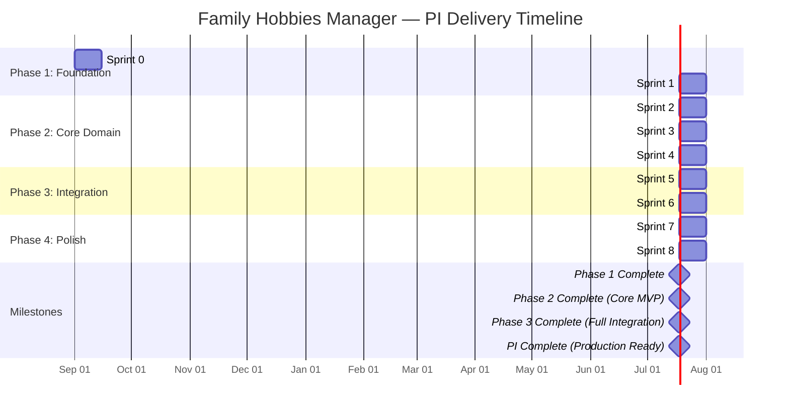
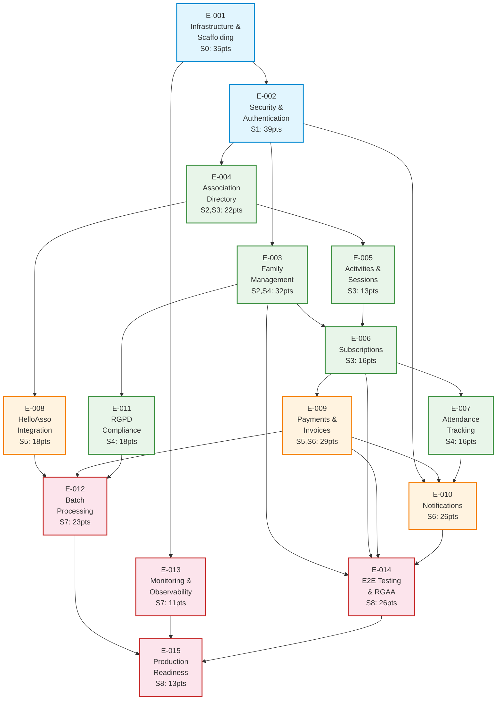
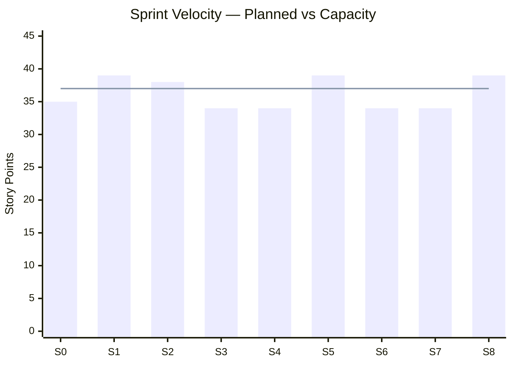
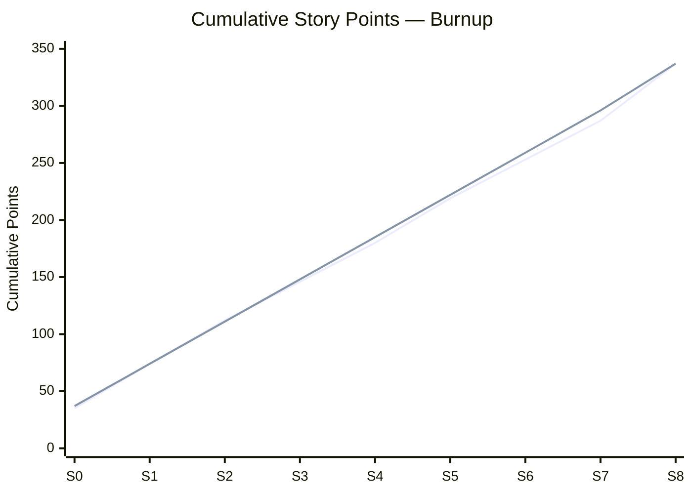
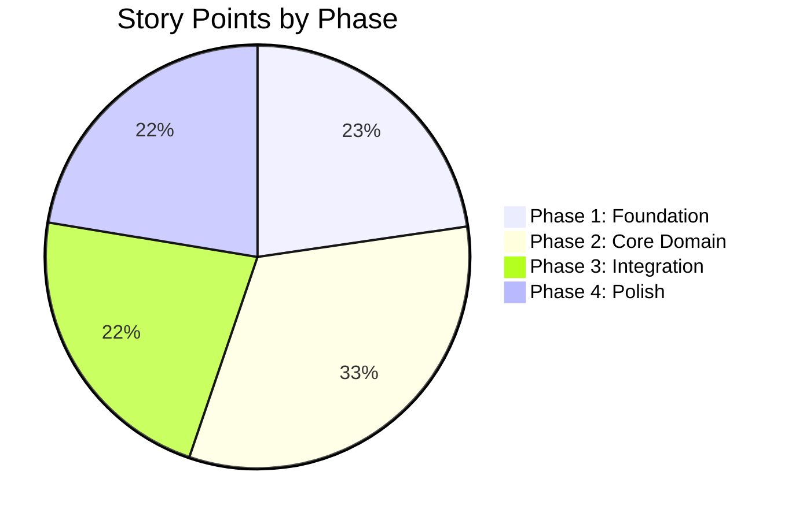

# 12 - Delivery Roadmap

> Family Hobbies Manager — SAFe Program Increment Delivery Plan
>
> This document defines the full delivery roadmap structured as a SAFe Program Increment (PI),
> broken down into sprints, epics, stories, and tasks with concrete estimates.
> It serves as the project management reference for demonstrating SAFe experience in an enterprise context.

---

## Table of Contents

1. [SAFe Program Increment Overview](#1-safe-program-increment-overview)
2. [Phase & Sprint Breakdown](#2-phase--sprint-breakdown)
3. [Epic Summary Table](#3-epic-summary-table)
4. [Velocity & Burndown](#4-velocity--burndown)
5. [Definition of Done (DoD)](#5-definition-of-done-dod)
6. [Definition of Ready (DoR)](#6-definition-of-ready-dor)
7. [Mermaid Diagrams](#7-mermaid-diagrams)
8. [Risk Register](#8-risk-register)

---

## 1. SAFe Program Increment Overview

### PI Structure

| Parameter              | Value                                                        |
|------------------------|--------------------------------------------------------------|
| **PI Duration**        | ~18 weeks (9 sprints across 4 phases)                        |
| **Sprint Duration**    | 2 weeks                                                      |
| **Team Size**          | 1 (solo developer — portfolio project simulating team velocity) |
| **Methodology**        | Scrum within SAFe framework                                  |
| **PI Planning**        | Performed upfront; refined at sprint boundaries              |
| **Innovation Sprint**  | Final sprint (S8) includes hardening, E2E, RGAA, docs        |

### Ceremonies

| Ceremony              | Cadence          | Duration   | Purpose                                                      |
|-----------------------|------------------|------------|--------------------------------------------------------------|
| PI Planning           | Once per PI      | 4 hours    | Define sprint goals, allocate stories, identify dependencies |
| Sprint Planning       | Start of sprint  | 1 hour     | Select stories from backlog, define tasks, commit to goal    |
| Daily Standup (self)  | Daily            | 15 minutes | Review progress, identify blockers, adjust plan              |
| Sprint Review         | End of sprint    | 30 minutes | Demo working software, validate acceptance criteria          |
| Sprint Retrospective  | End of sprint    | 30 minutes | Inspect process, identify improvements for next sprint       |
| Backlog Refinement    | Mid-sprint       | 30 minutes | Groom upcoming stories, clarify acceptance criteria          |
| System Demo           | End of phase     | 1 hour     | Demonstrate integrated features across all services          |

### SAFe Alignment

This project maps to a single **Agile Release Train (ART)** with one team. The PI encompasses
the full MVP delivery. In a real enterprise SAFe context, this would be one team's contribution
to a larger ART with shared PI objectives, dependencies managed via the Program Board, and
integration points synchronized across teams.

**SAFe Principles Applied:**

1. **Take an economic view** — P0 stories deliver maximum portfolio value first
2. **Apply systems thinking** — microservice architecture enables independent deployability
3. **Assume variability; preserve options** — adapter pattern isolates HelloAsso integration
4. **Build incrementally with fast, integrated learning cycles** — each sprint produces working software
5. **Base milestones on objective evaluation** — Definition of Done enforced per story
6. **Make value flow without interruptions** — Kafka events decouple services
7. **Apply cadence, synchronize with cross-domain planning** — 2-week sprint cadence
8. **Unlock the intrinsic motivation of knowledge workers** — solo developer owns end-to-end delivery

### Priority Levels

| Priority | Meaning                                                      |
|----------|--------------------------------------------------------------|
| **P0**   | Must-have for sprint goal. Sprint fails without it.          |
| **P1**   | Should-have. Delivers significant value. Deferred if blocked.|
| **P2**   | Nice-to-have. Deferred to next sprint if velocity is tight.  |

### Story Point Scale (Modified Fibonacci)

| Points | Complexity                                                    |
|--------|---------------------------------------------------------------|
| 1      | Trivial — config change, single-line fix                      |
| 2      | Small — simple CRUD, minor refactor                           |
| 3      | Medium — single entity with tests, straightforward feature    |
| 5      | Large — multi-layer feature (entity + service + controller + tests) |
| 8      | Extra-large — full feature slice (backend + frontend + Kafka + tests) |
| 13     | Epic-sized — should be split if possible, cross-cutting concern |

---

## 2. Phase & Sprint Breakdown

---

### Phase 1: Foundation (Sprint 0-1) — Weeks 1-4

**Phase Theme:** Infrastructure, scaffolding, CI/CD, shared library, security foundation

**Phase Objective:** All microservices running in Docker Compose, CI/CD pipeline green,
JWT authentication working end-to-end from Angular through API Gateway to downstream services.

**Phase Exit Criteria:**
- All 6 services start and register with Eureka
- Docker Compose environment fully operational (PostgreSQL, Kafka, Zookeeper, all services)
- CI/CD pipeline runs lint, test, build for all services
- User can register, login, and access protected endpoints with JWT

---

#### Sprint 0: Infrastructure & Project Setup

**Sprint Goal:** All infrastructure running, CI/CD pipeline operational, project scaffolded with common library ready for feature development.

**Sprint Duration:** Weeks 1-2

| ID     | Epic  | Story                                  | Tasks                                                                                                                                                                                                    | Acceptance Criteria                                                                                      | Priority | Points |
|--------|-------|----------------------------------------|----------------------------------------------------------------------------------------------------------------------------------------------------------------------------------------------------------|----------------------------------------------------------------------------------------------------------|----------|--------|
| S0-001 | Infra | Set up mono-repo structure             | Create folder structure: `backend/`, `frontend/`, `docker/`, `docs/`, `e2e/`, `.github/`. Create root `pom.xml` with modules. Create `.gitignore`, `.editorconfig`. Initialize git repo.                | Folder structure matches architecture doc. `git status` clean. All paths resolve.                        | P0       | 2      |
| S0-002 | Infra | Configure Docker Compose               | Write `docker/docker-compose.yml` with PostgreSQL 16, Kafka 3.x, Zookeeper. Write `docker/init-databases.sql` creating 4 databases (`familyhobbies_users`, `_associations`, `_payments`, `_notifications`). Add health checks. Write `.env.example`. Test `docker compose up`. | `docker compose up` starts all containers. All 4 databases created. Kafka broker reachable on port 9092. | P0       | 3      |
| S0-003 | Infra | Scaffold all 6 Spring Boot services    | Use Spring Initializr for each service. Configure `pom.xml` with correct dependencies (Web, JPA, Security, Eureka Client, Actuator, Liquibase, Kafka, etc.). Set up `application.yml` with profiles: `local`, `docker`, `test`. Create main application class per service. | All 6 services compile. `mvn clean package -DskipTests` succeeds for each. Profile-specific configs load correctly. | P0       | 5      |
| S0-004 | Infra | Configure Eureka discovery-service     | Implement `EurekaServerApplication.java` with `@EnableEurekaServer`. Configure `application.yml` with standalone mode. Configure all 5 other services as Eureka clients with `@EnableDiscoveryClient`. Set `eureka.instance.preferIpAddress=true` for Docker networking. | Eureka dashboard accessible at `:8761`. All 5 services visible in registry. Services resolve each other by name. | P0       | 3      |
| S0-005 | Infra | Configure API Gateway routes           | Define gateway routes in `api-gateway/application.yml`: `/api/auth/**` -> user-service, `/api/users/**` -> user-service, `/api/families/**` -> user-service, `/api/associations/**` -> association-service, `/api/payments/**` -> payment-service, `/api/notifications/**` -> notification-service. Configure load balancer with `lb://` URIs. Add route predicates and filters. Test routing to each downstream service with curl. | All routes resolve correctly. Gateway returns downstream service responses. 404 for unmapped paths.      | P0       | 3      |
| S0-006 | Infra | Scaffold Angular 17 frontend           | Run `ng new frontend --standalone --style=scss --routing`. Install Angular Material (`ng add @angular-material`). Install NgRx (`@ngrx/store`, `@ngrx/effects`, `@ngrx/entity`). Configure Jest (replace Karma). Create project structure: `src/app/core/` (guards, interceptors, services), `src/app/features/` (auth, dashboard, family, association, subscription, attendance, payment, notification, settings), `src/app/shared/` (components, directives, pipes, models). Configure `environment.ts` files. Configure `proxy.conf.json` for local API gateway. | `ng build` succeeds. `ng test` runs with Jest. Angular Material theme applied. Folder structure matches architecture. Proxy routes to `localhost:8080`. | P0       | 3      |
| S0-007 | CI/CD | Set up GitHub Actions pipeline         | Create `.github/workflows/ci.yml`. Stages: checkout -> setup Java 17 -> setup Node 18 -> Maven build (matrix: all 6 backend services) -> Angular lint + test + build -> Docker build verification. Configure caching for Maven (`~/.m2`) and npm (`~/.npm`). Add branch protection rules for `main`. Configure status checks. | Pipeline triggers on push/PR to main. All stages pass green. Matrix builds run in parallel. Cache hits on subsequent runs. | P0       | 5      |
| S0-008 | Infra | Implement backend/common library       | Create `backend/common/` Maven module. Implement: `BaseAuditEntity.java` (`@MappedSuperclass` with createdAt, updatedAt, createdBy, updatedBy). Exception classes: `BusinessException`, `ResourceNotFoundException`, `UnauthorizedException`, `ValidationException`, `HelloAssoApiException`. `ErrorResponse` DTO. Global `@RestControllerAdvice` exception handler. Kafka event base class `DomainEvent`. Shared DTOs: `PageResponse<T>`, `ApiResponse<T>`. JWT utility classes: `JwtConstants`, `SecurityHeaders`. | Common module compiles. All services can depend on it. Exception handler returns consistent error format. Base entity auto-populates audit fields. | P0       | 5      |
| S0-009 | Infra | Configure Liquibase per service        | Set up `db/changelog/db.changelog-master.yaml` for user-service, association-service, payment-service, notification-service. Create initial changeset `000-init.yaml` per service (empty, validates connectivity). Configure `spring.liquibase.*` properties per profile. Verify migrations run on startup against Docker PostgreSQL. | All 4 services start without Liquibase errors. `DATABASECHANGELOG` table created in each database. Changeset `000-init` recorded. | P0       | 3      |
| S0-010 | Infra | Configure Kafka infrastructure         | Create `KafkaConfig.java` per service with `ProducerFactory<String, Object>` and `ConsumerFactory<String, Object>`. Configure JSON serializer/deserializer with type mappings. Define topic constants in `common/KafkaTopics.java`: `user-events`, `subscription-events`, `payment-events`, `attendance-events`, `notification-events`, `helloasso-sync-events`, `rgpd-events`. Create `KafkaTopicConfig.java` with `NewTopic` beans. Verify producer/consumer connectivity with integration test. | Kafka topics created on startup. Producer can send test message. Consumer can receive test message. JSON serialization/deserialization works. | P1       | 3      |

**Sprint 0 Capacity & Commitment:**

| Metric               | Value    |
|-----------------------|----------|
| Available points      | ~35      |
| P0 committed          | 32       |
| P1 stretch            | 3        |
| **Total committed**   | **35**   |

**Sprint 0 Dependencies:** None (greenfield)

**Sprint 0 Risks:**
- Docker networking issues between services (mitigate: use Docker bridge network with explicit names)
- Spring Cloud version compatibility (mitigate: use Spring Cloud BOM 2023.0.x aligned with Boot 3.2.x)

---

#### Sprint 1: Common Library & Security Foundation

**Sprint Goal:** JWT authentication working end-to-end — user can register, login, receive tokens, and access protected endpoints through the gateway. Angular auth module complete with login/register forms, JWT interceptor, and route guards.

**Sprint Duration:** Weeks 3-4

| ID     | Epic     | Story                                    | Tasks                                                                                                                                                                                                                                                                         | Acceptance Criteria                                                                                                                                 | Priority | Points |
|--------|----------|------------------------------------------|-------------------------------------------------------------------------------------------------------------------------------------------------------------------------------------------------------------------------------------------------------------------------------|-----------------------------------------------------------------------------------------------------------------------------------------------------|----------|--------|
| S1-001 | Security | Implement JwtTokenProvider               | Create `JwtTokenProvider.java` in user-service. Methods: `generateAccessToken(userId, email, roles)` -> JWT with 15min expiry, `generateRefreshToken(userId)` -> JWT with 7d expiry, `validateToken(token)` -> boolean, `getUserIdFromToken(token)` -> Long, `getRolesFromToken(token)` -> `List<String>`. Use `io.jsonwebtoken:jjwt` library. Configure `jwt.secret`, `jwt.access-expiration`, `jwt.refresh-expiration` in `application.yml`. Write JUnit tests: valid token generation, expired token rejection, tampered token rejection, claims extraction. | All 5 methods work correctly. Tests pass. Secret externalized to config. Token format is `Bearer <jwt>`.                                            | P0       | 5      |
| S1-002 | Security | Implement user registration              | **Liquibase:** `001-create-user-table.yaml` (id, email, password_hash, first_name, last_name, phone, roles, status, created_at, updated_at), `002-create-refresh-token-table.yaml` (id, user_id FK, token, expires_at, revoked). **Entities:** `User.java` (JPA with `@Enumerated` for roles FAMILY/ASSOCIATION/ADMIN and status ACTIVE/INACTIVE/DELETED), `RefreshToken.java`. **DTOs:** `RegisterRequest` (email, password, firstName, lastName, phone), `AuthResponse` (accessToken, refreshToken, expiresIn, user). **Repository:** `UserRepository` (findByEmail, existsByEmail). **Service:** `UserServiceImpl.register()` — validate unique email, hash password with BCrypt, create user with FAMILY role, generate tokens, return AuthResponse. **Controller:** `AuthController` POST `/auth/register`. **Tests:** unit tests for service (happy path, duplicate email), integration test for controller. | POST `/auth/register` returns 201 with tokens. Duplicate email returns 409. Password stored as BCrypt hash. User persisted in DB. Liquibase migrations apply cleanly. | P0       | 8      |
| S1-003 | Security | Implement user login + refresh           | **DTOs:** `LoginRequest` (email, password). **Controller endpoints:** POST `/auth/login` — validate credentials, issue tokens, store refresh token. POST `/auth/refresh` — validate refresh token, issue new access token, rotate refresh token. POST `/auth/logout` — revoke refresh token. **Service methods:** `UserServiceImpl.login()`, `UserServiceImpl.refresh()`, `UserServiceImpl.logout()`. **Tests:** login happy path, wrong password (401), wrong email (401), refresh happy path, expired refresh token (401), revoked refresh token (401), logout revokes token. | Login returns tokens. Invalid credentials return 401. Refresh rotates tokens. Logout invalidates refresh token. All tests pass.                     | P0       | 5      |
| S1-004 | Security | Implement Gateway JWT filter             | Create `JwtAuthenticationFilter.java` implementing `WebFilter` in api-gateway. Logic: extract `Authorization: Bearer <token>` header, validate token using shared secret, extract userId and roles, set `X-User-Id` and `X-User-Roles` headers on downstream request, reject with 401 if invalid/expired/missing (except whitelisted paths). Create `SecurityConfig.java` with `SecurityWebFilterChain`: permit `/auth/**`, `/actuator/health`, require auth for all others. Configure whitelisted paths in `application.yml`. **Tests:** valid token passes through with headers, expired token returns 401, missing token returns 401, whitelisted paths pass without token. | Gateway validates JWT. Downstream services receive X-User-Id and X-User-Roles headers. Whitelisted paths bypass auth. 401 for invalid tokens.       | P0       | 5      |
| S1-005 | Security | Implement downstream UserContext filter  | Create in `backend/common/`: `UserContext.java` (userId, roles, email — ThreadLocal holder), `UserContextFilter.java` (servlet filter extracting X-User-Id and X-User-Roles headers into UserContext), `UserContextHolder.java` (static access to current user), `@CurrentUser` annotation for controller method parameters. Register filter in each downstream service auto-config. **Tests:** filter populates context from headers, context cleared after request, `@CurrentUser` resolves in controller. `@PreAuthorize("hasRole('ADMIN')")` works with UserContext roles. | UserContext available in all downstream services. `@CurrentUser` annotation works. `@PreAuthorize` evaluates roles from headers. ThreadLocal cleaned up after each request. | P0       | 3      |
| S1-006 | Security | Implement Angular auth module            | **Components:** `LoginComponent` (reactive form: email, password, validation, error display), `RegisterComponent` (reactive form: email, password, confirmPassword, firstName, lastName, phone, validation). **Service:** `AuthService` (login, register, refresh, logout, getToken, isAuthenticated). **Interceptor:** `jwt.interceptor.ts` — attach Bearer token to all API requests, handle 401 by attempting refresh, redirect to login if refresh fails. **Guard:** `auth.guard.ts` — redirect unauthenticated users to `/auth/login`. **NgRx:** `auth.actions.ts`, `auth.reducer.ts` (user, token, loading, error), `auth.effects.ts` (login$, register$, refresh$, logout$, init$ for token restoration from localStorage), `auth.selectors.ts`. **localStorage:** persist tokens, restore on app init. **Jest tests:** AuthService (mock HTTP), auth.reducer (state transitions), jwt.interceptor (token attachment, refresh flow), auth.guard (redirect logic). | User can register and login via forms. JWT attached to subsequent requests. 401 triggers silent refresh. Failed refresh redirects to login. Auth state persists across page reloads. All Jest tests pass. | P0       | 8      |
| S1-007 | Common   | Implement Kafka event classes            | Create in `backend/common/events/`: `DomainEvent.java` (abstract base: eventId UUID, eventType, timestamp, version), `UserRegisteredEvent.java` (userId, email, firstName, lastName), `UserDeletedEvent.java` (userId, deletionType SOFT/HARD), `SubscriptionCreatedEvent.java` (subscriptionId, userId, familyMemberId, activityId, associationId), `SubscriptionCancelledEvent.java` (subscriptionId, reason), `PaymentCompletedEvent.java` (paymentId, subscriptionId, amount, currency, helloAssoReference), `PaymentFailedEvent.java` (paymentId, subscriptionId, failureReason), `AttendanceMarkedEvent.java` (attendanceId, subscriptionId, sessionId, date, status PRESENT/ABSENT/EXCUSED). Configure `KafkaConfig` with JSON serializer type mappings for all events. **Tests:** serialization/deserialization round-trip for each event. | All 7 event classes compile, serialize, and deserialize correctly. Kafka type mappings configured. Tests pass.                                       | P1       | 3      |
| S1-008 | Security | Implement CORS configuration             | Configure CORS in API Gateway `SecurityConfig`: allow origins `http://localhost:4200` (dev), configurable via `app.cors.allowed-origins`. Allow methods GET, POST, PUT, DELETE, PATCH, OPTIONS. Allow headers Authorization, Content-Type, X-Requested-With. Expose headers X-User-Id. Max age 3600s. **Test:** Angular dev server can call gateway without CORS errors. Preflight OPTIONS returns correct headers. | Angular `ng serve` on :4200 can call gateway on :8080. No CORS errors in browser console. Preflight requests handled. Config externalizable for production. | P1       | 2      |

**Sprint 1 Capacity & Commitment:**

| Metric               | Value    |
|-----------------------|----------|
| Available points      | ~39      |
| P0 committed          | 34       |
| P1 stretch            | 5        |
| **Total committed**   | **39**   |

**Sprint 1 Dependencies:**
- S1-001 through S1-005 depend on S0-003, S0-008 (services scaffolded, common library exists)
- S1-006 depends on S0-006 (Angular scaffolded)
- S1-004 depends on S1-001 (JWT provider needed for gateway filter)

**Sprint 1 Risks:**
- JWT library version conflicts with Spring Boot 3.2 (mitigate: use jjwt 0.12.x which supports Java 17+)
- NgRx boilerplate slowing frontend velocity (mitigate: use createFeature() shorthand from NgRx 17)

---

### Phase 2: Core Domain (Sprint 2-4) — Weeks 5-10

**Phase Theme:** Family management, association directory, activities, sessions, subscriptions, attendance tracking

**Phase Objective:** Core business domain fully functional. A family can be created with members, search associations by location/category, view activities and sessions, subscribe members to activities, and track attendance. Dashboard shows aggregated family data.

**Phase Exit Criteria:**
- Family CRUD with member management working end-to-end
- Association search with filters (city, category, keyword) returning paginated results
- Activity and session browsing within associations
- Subscription lifecycle (create, view, cancel) with business rules enforced
- Attendance marking and tracking per session per member
- Dashboard with family overview, subscriptions, and upcoming sessions widgets

---

#### Sprint 2: Family Management + Association Directory

**Sprint Goal:** Families can be created with members and managed through the UI. Associations are searchable by city, category, and keyword with paginated results displayed in the Angular frontend.

**Sprint Duration:** Weeks 5-6

| ID     | Epic        | Story                                    | Tasks                                                                                                                                                                                                                                                                         | Acceptance Criteria                                                                                                                                 | Priority | Points |
|--------|-------------|------------------------------------------|-------------------------------------------------------------------------------------------------------------------------------------------------------------------------------------------------------------------------------------------------------------------------------|-----------------------------------------------------------------------------------------------------------------------------------------------------|----------|--------|
| S2-001 | Family      | Implement Family entity + CRUD           | **Liquibase:** `003-create-family-table.yaml` (id, name, user_id FK, created_at, updated_at), `004-create-family-member-table.yaml` (id, family_id FK, first_name, last_name, date_of_birth, relationship ENUM(SELF, SPOUSE, CHILD, OTHER), gender ENUM, medical_notes, created_at, updated_at). **Entities:** `Family.java` (`@OneToMany` members), `FamilyMember.java`. **Repositories:** `FamilyRepository` (findByUserId), `FamilyMemberRepository` (findByFamilyId). **DTOs:** `FamilyRequest`, `FamilyResponse`, `FamilyMemberRequest`, `FamilyMemberResponse`. **Service:** `FamilyServiceImpl` — createFamily (auto-link to authenticated user), getMyFamily, updateFamily, addMember, updateMember, removeMember (soft delete). **Controller:** `FamilyController` — POST `/families`, GET `/families/me`, PUT `/families/{id}`, POST `/families/{id}/members`, PUT `/families/{id}/members/{memberId}`, DELETE `/families/{id}/members/{memberId}`. **Authorization:** only family owner can modify. **Tests:** unit tests for service, integration tests for controller (happy path + authorization). | Family CRUD works. Members can be added/updated/removed. Only owner can modify. Proper validation (name required, DOB format). Liquibase migrations apply. All tests pass. | P0       | 8      |
| S2-002 | Family      | Implement Angular family feature         | **Components:** `FamilyDashboardComponent` (displays family name, member count, quick actions), `FamilyMemberFormComponent` (reactive form: firstName, lastName, dateOfBirth, relationship select, gender select, medicalNotes textarea — used for both add and edit), `FamilyMemberListComponent` (Material table with columns: name, age, relationship; edit/delete actions). **Service:** `FamilyService` (getMyFamily, createFamily, updateFamily, addMember, updateMember, removeMember). **NgRx:** `family.actions.ts`, `family.reducer.ts`, `family.effects.ts`, `family.selectors.ts`. **Routing:** `/family` (dashboard), `/family/members/new` (add form), `/family/members/:id/edit` (edit form). **Validation:** required fields, date format, age calculation from DOB. **Jest tests:** FamilyDashboardComponent (renders members), FamilyMemberFormComponent (validation, submit), FamilyService (HTTP calls), family.reducer (state transitions). | Family dashboard shows all members. Add/edit forms validate and submit. Delete shows confirmation dialog. NgRx state updates correctly. All Jest tests pass. | P0       | 8      |
| S2-003 | Association | Implement Association entity + search    | **Liquibase:** `001-create-association-table.yaml` (id, name, slug, description, category ENUM(SPORT, DANCE, MUSIC, THEATER, ART, MARTIAL_ARTS, WELLNESS, OTHER), city, postal_code, address, department, region, phone, email, website, logo_url, helloasso_slug, helloasso_org_id, is_active, last_synced_at, created_at, updated_at). **Entity:** `Association.java`. **Repository:** `AssociationRepository` — `findByFilters(city, category, keyword, Pageable)` using `@Query` with dynamic conditions, `findBySlug()`, `findByHelloassoSlug()`. **DTOs:** `AssociationSearchRequest` (city, category, keyword, page, size), `AssociationResponse`, `AssociationDetailResponse`. **Service:** `AssociationServiceImpl` — search with pagination, getById, getBySlug. **Controller:** `AssociationController` — GET `/associations` (search with query params), GET `/associations/{id}`, GET `/associations/slug/{slug}`. **Tests:** repository query tests (filter combinations), service tests, controller integration tests with pagination verification. | Search returns paginated results. Filters work individually and combined. Empty filters return all. Pagination metadata correct (totalElements, totalPages, page, size). Slug lookup works. All tests pass. | P0       | 8      |
| S2-004 | Association | Seed demo association data               | **Liquibase data changeset:** `010-seed-associations.yaml` with 20 realistic French associations: **Lyon** (5): AS Lyon Judo (MARTIAL_ARTS), Ecole de Danse du Rhone (DANCE), Lyon Sport Collectif (SPORT), Conservatoire de Lyon (MUSIC), Theatre des Celestins Atelier (THEATER). **Paris** (5): Paris Arts Martiaux (MARTIAL_ARTS), Studio Danse Republique (DANCE), Paris FC Academy (SPORT), Ecole de Musique de Paris 11 (MUSIC), Atelier Theatre Bastille (THEATER). **Marseille** (5): Marseille Karate Club (MARTIAL_ARTS), Danse Phocéenne (DANCE), OM Handball Academy (SPORT), Conservatoire de Marseille (MUSIC), Theatre du Lacydon (THEATER). **Toulouse** (3): Toulouse Escrime (SPORT), Rock'n'Roll Danse Toulouse (DANCE), Harmonie Occitane (MUSIC). **Nantes** (2): Nantes Yoga Collectif (WELLNESS), Beaux Arts Nantes Atelier (ART). Include realistic addresses, postal codes, descriptions, phone numbers, emails, websites. | 20 associations visible in search. Category filter returns correct subsets. City filter returns correct subsets. Data looks realistic for portfolio demo. | P0       | 3      |
| S2-005 | Association | Implement Angular association search     | **Components:** `AssociationSearchComponent` (search bar with keyword input, city autocomplete, category dropdown with all enum values, search button — uses reactive forms with debounce), `AssociationCardComponent` (Material card: logo placeholder, name, category chip, city, short description, "View Details" link), `AssociationListComponent` (grid of cards with Material paginator), `AssociationDetailComponent` (full association profile: name, category, description, address on map placeholder, contact info, link to activities). **Service:** `AssociationService` (search, getById, getBySlug). **NgRx:** `association.actions.ts`, `association.reducer.ts` (associations entity adapter, searchFilters, loading, error), `association.effects.ts` (search$, loadDetail$), `association.selectors.ts`. **Routing:** `/associations` (search + list), `/associations/:id` (detail). **UX:** loading spinner during search, empty state message ("No associations found"), responsive grid (1-3 columns). **Jest tests:** AssociationSearchComponent (filter changes trigger search), AssociationCardComponent (renders data), AssociationService (HTTP calls), association.reducer (state transitions). | Search page displays with filters. Keyword search filters results. Category dropdown filters correctly. City filter works. Pagination works. Card displays association info. Detail page shows full profile. Responsive layout. All Jest tests pass. | P0       | 8      |
| S2-006 | Family      | Implement UserRegisteredEvent publishing | **Producer:** In `UserServiceImpl.register()`, after successful user creation, publish `UserRegisteredEvent` to `user-events` topic via `KafkaTemplate`. Include userId, email, firstName, lastName. **Config:** Ensure `KafkaProducerConfig` is active in user-service. **Error handling:** log and continue if Kafka publish fails (registration should not fail due to Kafka). **Tests:** unit test verifying `KafkaTemplate.send()` called with correct event, integration test with `@EmbeddedKafka` verifying event published and consumed. | UserRegisteredEvent published on every successful registration. Event contains correct user data. Registration succeeds even if Kafka is down. Tests pass. | P1       | 3      |

**Sprint 2 Capacity & Commitment:**

| Metric               | Value    |
|-----------------------|----------|
| Available points      | ~38      |
| P0 committed          | 35       |
| P1 stretch            | 3        |
| **Total committed**   | **38**   |

**Sprint 2 Dependencies:**
- S2-001 depends on S1-002 (user entity exists for family FK)
- S2-002 depends on S1-006 (Angular auth module for authenticated state)
- S2-005 depends on S2-004 (seed data needed for meaningful search results)
- S2-006 depends on S1-007 (Kafka event classes defined)

**Sprint 2 Risks:**
- Complex JPA query for multi-filter search (mitigate: use Spring Data JPA Specifications or `@Query` with COALESCE)
- NgRx entity adapter learning curve (mitigate: follow official NgRx entity docs)

---

#### Sprint 3: Activities, Sessions & Subscriptions

**Sprint Goal:** Activities and sessions are visible within associations. Families can subscribe members to activities with business rules enforced (one subscription per member per activity per season). Dashboard shows subscriptions and upcoming sessions.

**Sprint Duration:** Weeks 7-8

| ID     | Epic         | Story                                       | Tasks                                                                                                                                                                                                                                                                         | Acceptance Criteria                                                                                                                                 | Priority | Points |
|--------|--------------|---------------------------------------------|-------------------------------------------------------------------------------------------------------------------------------------------------------------------------------------------------------------------------------------------------------------------------------|-----------------------------------------------------------------------------------------------------------------------------------------------------|----------|--------|
| S3-001 | Activity     | Implement Activity + Session entities       | **Liquibase:** `002-create-activity-table.yaml` (id, association_id FK, name, description, category ENUM, age_group_min, age_group_max, max_participants, season VARCHAR e.g. "2025-2026", price_cents, currency, created_at, updated_at), `003-create-session-table.yaml` (id, activity_id FK, day_of_week ENUM(MON-SUN), start_time TIME, end_time TIME, location, instructor_name, is_active, created_at, updated_at). **Entities:** `Activity.java` (`@ManyToOne` association, `@OneToMany` sessions), `Session.java` (`@ManyToOne` activity). **Repositories:** `ActivityRepository` (findByAssociationId, findByAssociationIdAndCategory), `SessionRepository` (findByActivityId, findByActivityIdAndDayOfWeek). **DTOs:** `ActivityResponse` (includes sessions), `SessionResponse`. **Service:** `ActivityServiceImpl` — getByAssociation, getById (with sessions), getSessionsByActivity. **Controller:** `ActivityController` — GET `/associations/{assocId}/activities`, GET `/activities/{id}`, GET `/activities/{id}/sessions`. **Tests:** repository tests, service tests, controller integration tests. | Activities load by association. Sessions load by activity. Pagination works for activities. Session schedule includes day, time, instructor. Tests pass. | P0       | 5      |
| S3-002 | Activity     | Seed demo activity + session data           | **Liquibase data changesets:** `011-seed-activities.yaml` — 2-3 activities per association (40+ total). Examples: AS Lyon Judo -> "Judo Enfants 6-10 ans" (Wed 14:00-15:30, Sat 10:00-11:30), "Judo Ados 11-15 ans" (Tue 17:00-18:30, Thu 17:00-18:30), "Judo Adultes" (Mon 19:00-20:30, Wed 19:00-20:30). `012-seed-sessions.yaml` — sessions per activity with realistic French instructor names, locations (gymnase, salle, studio). Include varied price ranges (150-500 EUR/year). | Activities appear in association detail. Sessions show schedule. Data looks realistic. Variety of days/times/instructors.                             | P0       | 3      |
| S3-003 | Subscription | Implement Subscription entity + lifecycle   | **Liquibase:** `004-create-subscription-table.yaml` (id, family_member_id, activity_id, session_id, association_id, season, status ENUM(PENDING, ACTIVE, CANCELLED, EXPIRED), payment_status ENUM(UNPAID, PAID, REFUNDED), subscribed_at, cancelled_at, expires_at, cancellation_reason, created_at, updated_at). **Entity:** `Subscription.java`. **Repository:** `SubscriptionRepository` (findByFamilyMemberId, findByActivityIdAndSeason, existsByFamilyMemberIdAndActivityIdAndSeason, countByActivityIdAndSeasonAndStatus). **DTOs:** `SubscriptionRequest` (familyMemberId, activityId, sessionId), `SubscriptionResponse`. **Service:** `SubscriptionServiceImpl` — create (validate: unique per member/activity/season, check max participants, set status PENDING), cancel (set CANCELLED + reason + timestamp), getByMember, getByFamily (aggregate across members). **Business rules:** cannot subscribe if already subscribed to same activity same season; cannot subscribe if max participants reached; cancel sets status but preserves record. **Kafka:** publish `SubscriptionCreatedEvent` on create, `SubscriptionCancelledEvent` on cancel. **Controller:** `SubscriptionController` — POST `/subscriptions`, GET `/subscriptions/me`, GET `/subscriptions/family/{familyId}`, PUT `/subscriptions/{id}/cancel`. **Tests:** unit tests for all business rules, integration tests for API, Kafka publish verification. | Subscription created with correct status. Duplicate subscription rejected (409). Max participants enforced. Cancel updates status. Kafka events published. API returns subscriptions by member and family. All tests pass. | P0       | 8      |
| S3-004 | Subscription | Implement Angular subscription feature      | **Components:** `SubscriptionListComponent` (Material table: member name, activity, association, session schedule, status chip, actions — grouped by family member), `SubscriptionDetailComponent` (full subscription info: member, activity detail, session schedule, status timeline, cancel button), `SubscribeFlowComponent` (multi-step flow: Step 1 — select family member from dropdown, Step 2 — confirm activity/session selection, Step 3 — review and confirm). **Service:** `SubscriptionService` (create, getMySubscriptions, getFamilySubscriptions, cancel). **NgRx:** `subscription.actions.ts`, `subscription.reducer.ts`, `subscription.effects.ts`, `subscription.selectors.ts`. **Routing:** `/subscriptions` (list), `/subscriptions/:id` (detail), `/subscribe/:activityId` (flow — linked from activity detail page). **UX:** status chips (PENDING=yellow, ACTIVE=green, CANCELLED=red, EXPIRED=grey), cancel confirmation dialog with reason input. **Jest tests:** SubscriptionListComponent (renders grouped data), SubscribeFlowComponent (step navigation, validation), SubscriptionService (HTTP), subscription.reducer. | Subscription list shows all family subscriptions grouped by member. Subscribe flow completes in 3 steps. Cancel shows confirmation. Status chips colored correctly. All Jest tests pass. | P0       | 8      |
| S3-005 | Activity     | Implement Angular activity/session views    | **Components:** `ActivityListComponent` (within association detail — shows activities as expandable cards with session schedule table inside), `ActivityDetailComponent` (full activity page: name, description, age range, price, season, list of sessions as schedule table, "Subscribe" button linking to subscribe flow, participant count / max). `SessionScheduleTableComponent` (shared component — Material table: day, time, instructor, location). **Integration:** link from `AssociationDetailComponent` to activity list, link from activity to subscribe flow. **Jest tests:** ActivityListComponent (renders activities), SessionScheduleTableComponent (renders schedule), ActivityDetailComponent (shows subscribe button). | Activities show within association detail. Expanding activity shows sessions. Activity detail page shows full info with subscribe button. Schedule table is reusable. Tests pass. | P1       | 5      |
| S3-006 | Dashboard    | Implement Angular dashboard                 | **Components:** `DashboardComponent` (main page after login — responsive grid of widgets), `FamilyOverviewWidget` (family name, member count, quick link to family page), `ActiveSubscriptionsWidget` (count of active subscriptions, list of top 3 with member name + activity, link to full list), `UpcomingSessionsWidget` (next 5 sessions this week — day, time, activity, member, location). **Service:** `DashboardService` (aggregates data from family, subscription, session APIs). **NgRx:** uses existing selectors from family and subscription stores. **Routing:** `/dashboard` (default after login). **UX:** Material cards for widgets, responsive grid (1 column mobile, 2-3 columns desktop), skeleton loaders while data loads, empty states for new users. **Jest tests:** DashboardComponent (renders widgets), each widget component (renders with mock data, handles empty state). | Dashboard loads after login. Widgets display correct data. Empty states show for new users. Responsive layout works. Tests pass.                     | P1       | 5      |

**Sprint 3 Capacity & Commitment:**

| Metric               | Value    |
|-----------------------|----------|
| Available points      | ~34      |
| P0 committed          | 24       |
| P1 stretch            | 10       |
| **Total committed**   | **34**   |

**Sprint 3 Dependencies:**
- S3-001 depends on S2-003 (association entity exists for FK)
- S3-003 depends on S3-001 (activity + session entities for subscription FK)
- S3-004 depends on S3-003 (subscription API) and S2-002 (family member selection)
- S3-006 depends on S2-002, S3-004 (family and subscription data for widgets)

**Sprint 3 Risks:**
- Multi-step subscribe flow complexity (mitigate: use Angular Material Stepper component)
- Dashboard data aggregation latency (mitigate: parallelize API calls with `forkJoin`)

---

#### Sprint 4: Attendance Tracking + RGPD

**Sprint Goal:** Attendance can be marked and tracked per session per member with a calendar view. RGPD compliance implemented with consent management, data export, and account deletion.

**Sprint Duration:** Weeks 9-10

| ID     | Epic       | Story                                      | Tasks                                                                                                                                                                                                                                                                         | Acceptance Criteria                                                                                                                                 | Priority | Points |
|--------|------------|--------------------------------------------|-------------------------------------------------------------------------------------------------------------------------------------------------------------------------------------------------------------------------------------------------------------------------------|-----------------------------------------------------------------------------------------------------------------------------------------------------|----------|--------|
| S4-001 | Attendance | Implement AttendanceRecord entity          | **Liquibase:** `005-create-attendance-record-table.yaml` (id, subscription_id FK, session_id FK, attendance_date DATE, status ENUM(PRESENT, ABSENT, EXCUSED), marked_by_user_id, notes, created_at, updated_at; UNIQUE constraint on (subscription_id, session_id, attendance_date)). **Entity:** `AttendanceRecord.java`. **Repository:** `AttendanceRecordRepository` — findBySubscriptionId, findBySessionIdAndAttendanceDate, findBySubscriptionIdAndAttendanceDateBetween, countBySubscriptionIdAndStatus. **DTOs:** `AttendanceMarkRequest` (subscriptionId, sessionId, date, status, notes), `AttendanceResponse`, `AttendanceSummaryResponse` (totalSessions, present, absent, excused, attendanceRate). **Service:** `AttendanceServiceImpl` — markAttendance (upsert: create or update), getBySession (all attendees for a session on a date), getByMemberSubscription (history), getSummary (calculate rates). **Controller:** `AttendanceController` — POST `/attendance/mark`, GET `/attendance/session/{sessionId}?date=`, GET `/attendance/subscription/{subscriptionId}`, GET `/attendance/subscription/{subscriptionId}/summary`. **Tests:** unique constraint enforcement, upsert logic, summary calculation, controller integration. | Attendance can be marked (create) and updated (change status). Duplicate date/session/subscription returns update (not error). Summary calculates correctly. API returns correct data. Tests pass. | P0       | 5      |
| S4-002 | Attendance | Implement Angular attendance feature       | **Components:** `AttendanceCalendarComponent` (weekly calendar view showing sessions as time blocks — clicking a session opens mark dialog; color-coded: green=present, red=absent, yellow=excused, grey=unmarked), `AttendanceMarkDialogComponent` (Material dialog: member name, session info, date, status radio buttons PRESENT/ABSENT/EXCUSED, notes textarea, save/cancel), `AttendanceHistoryComponent` (Material table: date, session, status chip, notes — filterable by date range and status), `AttendanceSummaryComponent` (donut chart or progress bars: attendance rate, present/absent/excused counts — shown in subscription detail). **Service:** `AttendanceService` (markAttendance, getBySession, getBySubscription, getSummary). **NgRx:** `attendance.actions.ts`, `attendance.reducer.ts`, `attendance.effects.ts`, `attendance.selectors.ts`. **Routing:** `/attendance` (calendar view), `/attendance/history/:subscriptionId` (history). **UX:** week navigation (prev/next week), today indicator, session time blocks sized proportionally. **Jest tests:** AttendanceCalendarComponent (renders week, click opens dialog), AttendanceMarkDialogComponent (form validation, submit), AttendanceSummaryComponent (renders chart), attendance.reducer. | Calendar shows weekly sessions. Clicking marks attendance via dialog. Status colors display correctly. History table filters work. Summary shows correct rates. Week navigation works. All Jest tests pass. | P0       | 8      |
| S4-003 | Attendance | Publish AttendanceMarkedEvent              | **Producer:** In `AttendanceServiceImpl.markAttendance()`, after successful save, publish `AttendanceMarkedEvent` to `attendance-events` topic. Include attendanceId, subscriptionId, sessionId, date, status. **Consumer stub:** In notification-service, create `AttendanceEventConsumer` with `@KafkaListener` — log event (full implementation in Sprint 6). **Tests:** Kafka publish verification, consumer receives event. | Event published on every mark. Consumer receives and logs event. Tests pass.                                                                         | P1       | 3      |
| S4-004 | RGPD       | Implement RGPD consent management          | **Liquibase:** `005-create-rgpd-consent-table.yaml` in user-service (id, user_id FK, consent_type ENUM(DATA_PROCESSING, MARKETING_EMAIL, ANALYTICS, THIRD_PARTY_SHARING), granted BOOLEAN, granted_at TIMESTAMP, revoked_at TIMESTAMP, ip_address, user_agent, created_at, updated_at; UNIQUE on (user_id, consent_type)). **Entity:** `RgpdConsent.java`. **Repository:** `RgpdConsentRepository` (findByUserId, findByUserIdAndConsentType). **DTOs:** `ConsentRequest` (consentType, granted), `ConsentResponse`, `ConsentStatusResponse` (map of all types with current status). **Service:** `RgpdConsentServiceImpl` — grantConsent (record IP/UA/timestamp), revokeConsent, getConsentStatus (all types for user), isConsentGranted. **Controller:** `RgpdController` — POST `/rgpd/consent`, GET `/rgpd/consent/me`, GET `/rgpd/consent/me/{type}`. **Audit:** all consent changes logged with timestamp, IP, user agent for legal compliance. **Tests:** grant/revoke lifecycle, audit fields populated, controller integration. | Consent can be granted and revoked. All consent types tracked. Audit trail includes IP and timestamp. Status endpoint shows all consent types. Tests pass. | P1       | 5      |
| S4-005 | RGPD       | Implement data export + deletion           | **Data export:** `RgpdDataExportService` — aggregates all user data from user-service (profile, family, consents). Calls association-service via REST for subscriptions and attendance. Returns JSON. Controller: POST `/rgpd/data-export` -> triggers async export, GET `/rgpd/data-export/{id}` -> download JSON. **Data deletion:** `RgpdDataDeletionService` — soft-delete user (status=DELETED), anonymize PII (email -> `deleted_<id>@anonymized.local`, name -> "Anonymized User"), publish `UserDeletedEvent` to Kafka. **Kafka cascade:** association-service consumer listens for `UserDeletedEvent` -> anonymize subscriptions and attendance records for that user's family members. **Controller:** POST `/rgpd/data-deletion` (requires password confirmation). **Tests:** export contains all user data, deletion anonymizes correctly, Kafka cascade works, password required for deletion. | Data export returns complete user data as JSON. Deletion anonymizes PII. Kafka event triggers cascade anonymization in other services. Password confirmation required. Tests pass. | P1       | 8      |
| S4-006 | RGPD       | Implement Angular RGPD settings            | **Components:** `SettingsPageComponent` (tabbed layout: Profile, Privacy, Account), `ConsentManagementComponent` (toggles for each consent type with description text explaining what each consent means, last updated timestamp), `DataExportComponent` (button "Export My Data" -> triggers export, download link when ready, loading state), `AccountDeletionComponent` (red zone: warning text, password input, confirmation checkbox "I understand this is irreversible", delete button — disabled until both fields filled). **Service:** `RgpdService` (getConsentStatus, updateConsent, requestExport, requestDeletion). **Routing:** `/settings` (tabbed), `/settings/privacy` (deep link). **UX:** consent toggles save immediately with snackbar confirmation, export shows progress, deletion has multi-step confirmation. **Jest tests:** ConsentManagementComponent (toggle updates), DataExportComponent (button states), AccountDeletionComponent (validation gates). | Settings page accessible. Consent toggles work. Export triggers and downloads. Deletion requires password + checkbox. All Jest tests pass.          | P2       | 5      |

**Sprint 4 Capacity & Commitment:**

| Metric               | Value    |
|-----------------------|----------|
| Available points      | ~34      |
| P0 committed          | 13       |
| P1 stretch            | 16       |
| P2 stretch            | 5        |
| **Total committed**   | **34**   |

**Sprint 4 Dependencies:**
- S4-001 depends on S3-003 (subscription entity for FK)
- S4-002 depends on S4-001 (attendance API)
- S4-003 depends on S1-007 (Kafka event classes)
- S4-005 depends on S4-004 (consent model exists)
- S4-006 depends on S4-004, S4-005 (RGPD APIs)

**Sprint 4 Risks:**
- Calendar component complexity (mitigate: use existing Angular calendar library or Material grid list)
- Cross-service data aggregation for RGPD export (mitigate: well-defined REST API contracts between services)
- RGPD cascade deletion timing (mitigate: async Kafka events with eventual consistency, idempotent consumers)

---

### Phase 3: Integration (Sprint 5-6) — Weeks 11-14

**Phase Theme:** HelloAsso API integration, payment processing, Kafka event orchestration, notification system

**Phase Objective:** HelloAsso directory sync operational (sandbox). Checkout payment flow working end-to-end with webhook handling. All Kafka events wired between services. Notification system delivering emails and in-app notifications.

**Phase Exit Criteria:**
- HelloAsso OAuth2 token management working with auto-refresh
- Association data syncs from HelloAsso API to local database
- Payment checkout flow redirects to HelloAsso and handles webhooks
- All 7 Kafka event types flowing between services
- Notifications delivered via email (templates) and visible in-app
- Invoice generation on payment completion

---

#### Sprint 5: HelloAsso Integration + Payments

**Sprint Goal:** HelloAsso directory sync working with sandbox API. Payment checkout flow functional with webhook handling for payment status updates. Kafka events published for payment lifecycle.

**Sprint Duration:** Weeks 11-12

| ID     | Epic      | Story                                         | Tasks                                                                                                                                                                                                                                                                         | Acceptance Criteria                                                                                                                                 | Priority | Points |
|--------|-----------|-----------------------------------------------|-------------------------------------------------------------------------------------------------------------------------------------------------------------------------------------------------------------------------------------------------------------------------------|-----------------------------------------------------------------------------------------------------------------------------------------------------|----------|--------|
| S5-001 | HelloAsso | Implement HelloAssoTokenManager               | **Class:** `HelloAssoTokenManager.java` in association-service adapter package. **OAuth2 flow:** POST to `{baseUrl}/oauth2/token` with `grant_type=client_credentials`, `client_id`, `client_secret`. **Token caching:** store access token in memory with expiry timestamp. **Auto-refresh:** refresh token 60 seconds before expiry. **WebClient config:** `HelloAssoWebClientConfig.java` — base URL from `helloasso.api.base-url`, SSL, timeouts (connect: 5s, read: 10s), retry policy (3 retries with exponential backoff). **Error handling:** `HelloAssoAuthException` on auth failure. **Config:** `helloasso.api.base-url`, `helloasso.api.client-id`, `helloasso.api.client-secret` in application.yml (resolved from env vars). **Tests:** `MockWebServer` tests for token request, token caching (second call does not hit API), token refresh on expiry, auth failure handling. | Token acquired on first API call. Cached for subsequent calls. Auto-refreshed before expiry. No credentials in code. Config externalized. Tests pass. | P0       | 5      |
| S5-002 | HelloAsso | Implement HelloAssoClient                     | **Class:** `HelloAssoClient.java` in association-service adapter package. **Methods:** `searchOrganizations(keyword, city, category, page, pageSize)` -> calls `POST /directory/organizations`, `getOrganization(slug)` -> calls `GET /organizations/{slug}`, `getOrganizationForms(slug, formType)` -> calls `GET /organizations/{slug}/forms/{formType}`. **Response mapping:** `HelloAssoOrganizationDto`, `HelloAssoFormDto` -> mapped to domain DTOs. **Resilience:** Resilience4j `@CircuitBreaker` (failureRateThreshold=50, waitDurationInOpenState=30s, slidingWindowSize=10), `@Retry` (maxAttempts=3, waitDuration=1s), `@TimeLimiter` (timeoutDuration=10s). **Fallback:** on circuit open, return cached data from local DB. **Logging:** log all API calls with request/response at DEBUG level, errors at WARN. **Tests:** `WireMock` integration tests for each endpoint, circuit breaker trigger test, fallback verification, error response handling (4xx, 5xx). | All 3 HelloAsso endpoints callable. Response mapped correctly. Circuit breaker opens after failures. Fallback returns cached data. Retry on transient errors. All tests pass. | P0       | 8      |
| S5-003 | HelloAsso | Implement AssociationSyncService              | **Class:** `AssociationSyncService.java` in association-service. **Sync logic:** call `HelloAssoClient.searchOrganizations()` with configurable parameters (city list, categories), map response to `Association` entities, upsert to DB (match on `helloasso_slug` — update if exists, create if new), set `last_synced_at` on each synced record. **Deduplication:** do not create duplicates based on slug. **Batch processing:** handle pagination from HelloAsso (follow `pagination.continuationToken`). **Admin endpoint:** POST `/admin/associations/sync` (ADMIN role required) — triggers manual sync, returns sync result (created, updated, unchanged counts). **Kafka:** publish `HelloAssoSyncCompletedEvent` with summary. **Config:** `helloasso.sync.cities`, `helloasso.sync.page-size` in application.yml. **Tests:** upsert logic (new creates, existing updates), pagination handling, admin endpoint authorization, sync result counts. | Manual sync creates/updates associations from HelloAsso. No duplicates created. Sync result returned with counts. Admin-only endpoint. last_synced_at updated. Tests pass. | P0       | 5      |
| S5-004 | Payment   | Implement Payment entity + checkout flow      | **Liquibase:** `001-create-payment-table.yaml` (id, subscription_id, user_id, amount_cents, currency, status ENUM(INITIATED, PENDING, COMPLETED, FAILED, REFUNDED), helloasso_checkout_id, helloasso_payment_id, payment_method, initiated_at, completed_at, failed_at, failure_reason, created_at, updated_at), `002-create-invoice-table.yaml` (id, payment_id FK, invoice_number UNIQUE, amount_cents, currency, issued_at, pdf_path, created_at), `003-create-webhook-log-table.yaml` (id, event_type, payload JSONB, helloasso_event_id UNIQUE, processed BOOLEAN, processed_at, error_message, received_at). **Entities:** `Payment.java`, `Invoice.java`, `WebhookLog.java`. **Adapter:** `HelloAssoCheckoutClient.java` — `initiateCheckout(subscriptionId, amount, returnUrl, errorUrl, webhookUrl)` -> POST to HelloAsso checkout API, returns checkout URL. **Service:** `PaymentServiceImpl` — `initiateCheckout()`: create Payment with INITIATED status, call HelloAssoCheckoutClient, update with checkout ID, return redirect URL. `getByUser()`, `getBySubscription()`. **Controller:** `PaymentController` — POST `/payments/checkout` (body: subscriptionId), GET `/payments/me`, GET `/payments/{id}`. **Tests:** checkout flow creates payment, HelloAsso client called, redirect URL returned, payment status correct, controller integration. | Checkout creates payment record. HelloAsso checkout initiated. Redirect URL returned. Payment queryable by user and subscription. Liquibase migrations apply. Tests pass. | P0       | 8      |
| S5-005 | Payment   | Implement webhook handler                     | **Handler:** `HelloAssoWebhookHandler.java` — receives webhook POST from HelloAsso. **Validation:** HMAC-SHA256 signature validation using webhook secret. **Idempotency:** check `helloasso_event_id` in `webhook_log` — skip if already processed. **Processing:** parse `eventType`: `Payment` (authorized) -> update Payment to COMPLETED, `Order` -> log, `Refund` -> update Payment to REFUNDED. **Kafka events:** publish `PaymentCompletedEvent` on success, `PaymentFailedEvent` on failure. **Webhook log:** save every incoming webhook (raw payload, event type, processed status) for audit trail. **Error handling:** return 200 to HelloAsso even on processing error (log error, mark webhook as failed in log). **Controller:** POST `/payments/webhook/helloasso` (no auth — validated by HMAC). **Security:** whitelist HelloAsso IP ranges (configurable), validate HMAC signature. **Tests:** valid webhook updates payment, duplicate webhook skipped (idempotent), invalid HMAC rejected (403), payment events published to Kafka, webhook log created. | Webhook updates payment status correctly. Duplicate webhooks handled idempotently. HMAC validation enforced. Kafka events published. Webhook log auditable. Returns 200 to HelloAsso. Tests pass. | P0       | 8      |
| S5-006 | Payment   | Implement Angular payment feature             | **Components:** `PaymentListComponent` (Material table: date, amount, subscription/activity name, status chip, actions — filterable by status), `PaymentDetailComponent` (full payment info: amount, status timeline, subscription link, invoice link if available, HelloAsso reference), `CheckoutRedirectComponent` (intermediate page: "Redirecting to payment..." with spinner, handles return URL from HelloAsso with success/error query params, shows result message). **Service:** `PaymentService` (initiateCheckout, getMyPayments, getById). **NgRx:** `payment.actions.ts`, `payment.reducer.ts`, `payment.effects.ts`, `payment.selectors.ts`. **Routing:** `/payments` (list), `/payments/:id` (detail), `/payments/checkout/redirect` (HelloAsso return handler). **UX:** status chips (INITIATED=blue, PENDING=yellow, COMPLETED=green, FAILED=red, REFUNDED=grey). **Jest tests:** PaymentListComponent (renders, filters), CheckoutRedirectComponent (handles return params), PaymentService (HTTP), payment.reducer. | Payment list shows all user payments. Checkout redirects to HelloAsso. Return handler shows success/error. Status chips correct. All Jest tests pass. | P1       | 5      |

**Sprint 5 Capacity & Commitment:**

| Metric               | Value    |
|-----------------------|----------|
| Available points      | ~39      |
| P0 committed          | 34       |
| P1 stretch            | 5        |
| **Total committed**   | **39**   |

**Sprint 5 Dependencies:**
- S5-001 depends on S0-010 (Kafka infra) — indirectly, for config patterns
- S5-002 depends on S5-001 (token manager for authenticated API calls)
- S5-003 depends on S5-002 (HelloAsso client for sync)
- S5-004 depends on S3-003 (subscription entity for payment FK)
- S5-005 depends on S5-004 (payment entity for webhook updates)
- S5-006 depends on S5-004 (payment API)

**Sprint 5 Risks:**
- HelloAsso sandbox API rate limits (mitigate: local caching, circuit breaker, configurable sync intervals)
- Webhook HMAC validation complexity (mitigate: HelloAsso documentation, WireMock for local testing)
- Checkout redirect flow browser compatibility (mitigate: server-side redirect with fallback link)

---

#### Sprint 6: Notifications + Kafka Event Wiring

**Sprint Goal:** All Kafka events flowing between services end-to-end. Notification system delivers emails using templates and surfaces in-app notifications with unread count. Invoice generation on payment completion.

**Sprint Duration:** Weeks 13-14

| ID     | Epic         | Story                                        | Tasks                                                                                                                                                                                                                                                                         | Acceptance Criteria                                                                                                                                 | Priority | Points |
|--------|--------------|----------------------------------------------|-------------------------------------------------------------------------------------------------------------------------------------------------------------------------------------------------------------------------------------------------------------------------------|-----------------------------------------------------------------------------------------------------------------------------------------------------|----------|--------|
| S6-001 | Notification | Implement Notification entities              | **Liquibase:** `001-create-notification-table.yaml` (id, user_id, type ENUM(WELCOME, PAYMENT_SUCCESS, PAYMENT_FAILED, SUBSCRIPTION_CONFIRMED, SUBSCRIPTION_CANCELLED, ATTENDANCE_REMINDER, DATA_EXPORT_READY, ACCOUNT_DELETED), title, message, read BOOLEAN DEFAULT false, read_at, channel ENUM(IN_APP, EMAIL, BOTH), reference_id, reference_type, created_at), `002-create-email-template-table.yaml` (id, template_code UNIQUE, subject_template, body_template TEXT, variables JSONB, is_active, created_at, updated_at), `003-create-notification-preference-table.yaml` (id, user_id FK, notification_type, email_enabled BOOLEAN DEFAULT true, in_app_enabled BOOLEAN DEFAULT true, created_at, updated_at; UNIQUE on (user_id, notification_type)). **Entities:** `Notification.java`, `EmailTemplate.java`, `NotificationPreference.java`. **Repositories:** `NotificationRepository` (findByUserIdOrderByCreatedAtDesc, countByUserIdAndReadFalse), `EmailTemplateRepository` (findByTemplateCode), `NotificationPreferenceRepository` (findByUserId, findByUserIdAndNotificationType). **Tests:** entity mapping, repository queries. | All 3 tables created. Entities map correctly. Repository queries return expected results. Tests pass.                                                | P0       | 5      |
| S6-002 | Notification | Implement Kafka consumers                    | **Consumers in notification-service:** `UserEventConsumer` (@KafkaListener on `user-events`) — on `UserRegisteredEvent`: create WELCOME notification, send welcome email. `SubscriptionEventConsumer` (@KafkaListener on `subscription-events`) — on `SubscriptionCreatedEvent`: create SUBSCRIPTION_CONFIRMED notification, send confirmation email; on `SubscriptionCancelledEvent`: create SUBSCRIPTION_CANCELLED notification. `PaymentEventConsumer` (@KafkaListener on `payment-events`) — on `PaymentCompletedEvent`: create PAYMENT_SUCCESS notification, send receipt email; on `PaymentFailedEvent`: create PAYMENT_FAILED notification, send failure email. `AttendanceEventConsumer` (@KafkaListener on `attendance-events`) — on `AttendanceMarkedEvent`: log (future: absence threshold notifications). `RgpdEventConsumer` (@KafkaListener on `rgpd-events`) — on `UserDeletedEvent`: clean up notifications for deleted user. **Email sending:** `EmailService` using Spring Mail + Thymeleaf templates. Resolve template variables from event data. **Preference check:** before sending, check `NotificationPreference` — respect email_enabled/in_app_enabled. **Error handling:** dead letter topic for failed processing, retry 3 times with backoff. **Tests:** each consumer unit test (verify notification created, email sent), integration tests with embedded Kafka. | All 7 event types consumed. Notifications created in DB. Emails sent via templates. Preferences respected. Failed events go to DLT. Tests pass.     | P0       | 8      |
| S6-003 | Notification | Implement notification API                   | **Controller:** `NotificationController` — GET `/notifications/me` (paginated, sorted by createdAt DESC), GET `/notifications/me/unread-count`, PUT `/notifications/{id}/read` (mark single as read), PUT `/notifications/read-all` (mark all as read for current user), GET `/notifications/preferences`, PUT `/notifications/preferences` (batch update preferences). **Service:** `NotificationServiceImpl` — getByUser (paginated), getUnreadCount, markAsRead, markAllAsRead, getPreferences, updatePreferences (upsert per type). **DTOs:** `NotificationResponse`, `UnreadCountResponse`, `NotificationPreferenceRequest`, `NotificationPreferenceResponse`. **Tests:** pagination, mark read updates timestamp, mark all read, preferences CRUD, controller integration. | Notifications returned paginated. Unread count accurate. Mark read works (single and all). Preferences saved and returned. Tests pass.              | P0       | 5      |
| S6-004 | Notification | Implement Angular notification feature       | **Components:** `NotificationBellComponent` (toolbar icon with badge showing unread count — click opens dropdown), `NotificationDropdownComponent` (Material menu: list of recent notifications, each with title/message/timestamp/read indicator, "Mark all read" button, "View all" link), `NotificationListPageComponent` (full page: Material table with all notifications, filter by type, mark read actions), `NotificationPreferencesComponent` (embedded in settings page: toggle matrix — rows=notification types, columns=email/in-app). **Service:** `NotificationService` (getMyNotifications, getUnreadCount, markAsRead, markAllAsRead, getPreferences, updatePreferences). **NgRx:** `notification.actions.ts`, `notification.reducer.ts`, `notification.effects.ts`, `notification.selectors.ts`. **Polling:** poll unread count every 30 seconds (or WebSocket in future). **Routing:** `/notifications` (list page). **UX:** bell icon in app toolbar (always visible), unread badge (red circle with count), notification items clickable (navigate to reference), animation on new notification. **Jest tests:** NotificationBellComponent (renders badge), NotificationDropdownComponent (renders list, mark read), NotificationPreferencesComponent (toggle updates), notification.reducer. | Bell icon shows unread count. Dropdown shows recent notifications. Full list page with filters. Preferences toggles work. Polling updates count. All Jest tests pass. | P0       | 5      |
| S6-005 | Notification | Seed email templates                         | **Liquibase data changeset:** `010-seed-email-templates.yaml` — templates with Thymeleaf syntax: **WELCOME** (subject: "Bienvenue sur Family Hobbies Manager!", body: personalized greeting with firstName, getting started guide), **PAYMENT_SUCCESS** (subject: "Paiement confirmé — {{activityName}}", body: amount, reference, activity details), **PAYMENT_FAILED** (subject: "Echec de paiement — {{activityName}}", body: reason, retry instructions), **SUBSCRIPTION_CONFIRMED** (subject: "Inscription confirmée — {{activityName}}", body: member name, activity, session schedule, association contact), **ATTENDANCE_REMINDER** (subject: "Rappel — Cours demain: {{activityName}}", body: session time, location, member name). All templates in French. Professional formatting with header/footer. | All 5 templates seeded. Template variables documented. French language. Professional layout. Templates render correctly with test data.              | P1       | 3      |
| S6-006 | Invoice      | Implement invoice generation                 | **Service:** `InvoiceService` — `generateInvoice(paymentId)`: triggered by `PaymentCompletedEvent` consumer in payment-service. Generate sequential invoice number (`FHM-2025-000001`). Create `Invoice` entity. **PDF generation:** using iText 7 (or OpenPDF). Template: company header, invoice number, date, family info, activity/subscription details, amount, payment method, legal mentions (TVA if applicable). Store PDF at `data/invoices/{invoiceNumber}.pdf`. **Controller:** GET `/invoices/{id}/download` — return PDF as `application/pdf`. GET `/invoices/me` — list user's invoices. **Kafka consumer:** `PaymentCompletedEventConsumer` in payment-service triggers invoice generation. **Tests:** invoice number sequential, PDF generated, download returns valid PDF, Kafka trigger works. | Invoice generated on payment completion. PDF downloadable. Invoice number sequential. Contains correct payment/subscription data. Tests pass.        | P1       | 5      |
| S6-007 | Payment      | Implement Angular invoice download           | **Components:** Add invoice section to `PaymentDetailComponent` — if invoice exists, show invoice number, date, download button. `InvoiceListComponent` — Material table in payments section: invoice number, date, amount, download action. **Service:** extend `PaymentService` with `getMyInvoices()`, `downloadInvoice(id)` (blob download). **UX:** download triggers browser save dialog, loading indicator during download. **Jest tests:** invoice section renders when invoice exists, download button triggers service call. | Invoice visible in payment detail. Download button works. Invoice list accessible from payments section. Tests pass.                                  | P2       | 3      |

**Sprint 6 Capacity & Commitment:**

| Metric               | Value    |
|-----------------------|----------|
| Available points      | ~34      |
| P0 committed          | 23       |
| P1 stretch            | 8        |
| P2 stretch            | 3        |
| **Total committed**   | **34**   |

**Sprint 6 Dependencies:**
- S6-001 through S6-004 are self-contained within notification-service + frontend
- S6-002 depends on ALL Kafka producer implementations from previous sprints (S2-006, S3-003, S4-003, S5-005)
- S6-005 depends on S6-001 (email template entity)
- S6-006 depends on S5-005 (payment completed event)
- S6-007 depends on S6-006 (invoice API)

**Sprint 6 Risks:**
- Kafka consumer ordering/retry complexity (mitigate: DLT pattern, idempotent processing)
- Email deliverability in development (mitigate: use Mailhog/MailDev container for local testing)
- PDF generation library compatibility (mitigate: use OpenPDF which is LGPL-friendly)

---

### Phase 4: Polish & Production Readiness (Sprint 7-8) — Weeks 15-18

**Phase Theme:** Batch processing, monitoring, observability, E2E tests, RGAA accessibility, production hardening

**Phase Objective:** Application production-ready with batch jobs for recurring tasks, structured logging, health monitoring, full E2E test coverage, RGAA accessibility compliance, and optimized Docker images.

**Phase Exit Criteria:**
- Batch jobs running on schedule (HelloAsso sync, subscription expiry, payment reconciliation, RGPD cleanup)
- Structured JSON logging with correlation IDs across all services
- Spring Actuator endpoints exposed with Prometheus metrics
- Playwright E2E test suite covering all critical flows
- RGAA accessibility compliance verified with axe-core
- Multi-stage Docker images optimized and production-ready
- Documentation complete and up-to-date

---

#### Sprint 7: Batch Processing + Monitoring

**Sprint Goal:** All batch jobs implemented and scheduled. Monitoring infrastructure operational with structured logging, health checks, and metrics exposure. ELK stack available for log aggregation.

**Sprint Duration:** Weeks 15-16

| ID     | Epic    | Story                                             | Tasks                                                                                                                                                                                                                                                                         | Acceptance Criteria                                                                                                                                 | Priority | Points |
|--------|---------|----------------------------------------------------|-------------------------------------------------------------------------------------------------------------------------------------------------------------------------------------------------------------------------------------------------------------------------------|-----------------------------------------------------------------------------------------------------------------------------------------------------|----------|--------|
| S7-001 | Batch   | Implement HelloAsso sync batch job                | **Config:** `HelloAssoSyncJobConfig.java` using Spring Batch. **Reader:** `HelloAssoItemReader` — paginated reads from HelloAsso API via `HelloAssoClient`. **Processor:** `HelloAssoItemProcessor` — map HelloAsso DTO to Association entity, skip unchanged records. **Writer:** `HelloAssoItemWriter` — upsert to DB. **Job:** configured with chunk size 50, skip policy for transient API errors. **Schedule:** CRON `0 0 2 * * *` (daily at 2 AM). **Admin trigger:** POST `/admin/batch/helloasso-sync` (ADMIN role). **Job metadata:** Spring Batch tables for execution history, status, step details. **Tests:** reader returns paginated data (mock API), processor transforms correctly, writer upserts, job completes successfully, skip policy handles errors. | Batch job syncs HelloAsso data daily. Skip policy handles API errors gracefully. Admin can trigger manually. Job history tracked. Tests pass.        | P0       | 8      |
| S7-002 | Batch   | Implement subscription expiry batch job           | **Config:** `SubscriptionExpiryJobConfig.java`. **Reader:** `JpaPagingItemReader` — query subscriptions where `status=ACTIVE AND expires_at < NOW()`. **Processor:** set `status=EXPIRED`, set `expired_at=NOW()`. **Writer:** `JpaItemWriter` — batch update. **Kafka:** publish `SubscriptionExpiredEvent` (new event type) for each expired subscription. **Schedule:** CRON `0 0 6 * * *` (daily at 6 AM). **Tests:** expired subscriptions detected, status updated, Kafka events published, non-expired subscriptions untouched. | Expired subscriptions detected and updated daily. Kafka events published per expiry. Non-expired untouched. Tests pass.                              | P0       | 5      |
| S7-003 | Batch   | Implement payment reconciliation batch job        | **Config:** `PaymentReconciliationJobConfig.java`. **Reader:** query payments where `status=INITIATED AND initiated_at < NOW() - 24h`. **Processor:** call `HelloAssoCheckoutClient.getCheckoutStatus(checkoutId)` for each, update payment status from HelloAsso response. **Writer:** batch update. **Kafka:** publish appropriate payment event based on resolved status. **Schedule:** CRON `0 0 8 * * *` (daily at 8 AM). **Error handling:** log and skip if HelloAsso API unavailable. **Tests:** stale payments reconciled, status updated from HelloAsso, API errors skipped gracefully. | Stale payments (>24h) reconciled with HelloAsso. Status updated. Errors handled gracefully. Tests pass.                                              | P1       | 5      |
| S7-004 | Batch   | Implement RGPD data cleanup batch job             | **Config:** `RgpdDataCleanupJobConfig.java`. **Reader:** query users where `status=DELETED AND updated_at < NOW() - 30 days` and data not yet fully anonymized. **Processor:** hard-anonymize all PII fields (replace with hashed values), generate audit log entry. **Writer:** batch update. **Cross-service:** call association-service and payment-service cleanup endpoints. **Schedule:** CRON `0 0 3 * * SUN` (weekly Sunday at 3 AM). **Audit:** `RgpdCleanupLog` entry with timestamp, user count processed, status. **Tests:** 30-day-old deleted users anonymized, recent deletions untouched, audit log created, cross-service cleanup triggered. | Old deleted users fully anonymized. 30-day retention respected. Audit log created. Cross-service cleanup works. Tests pass.                          | P1       | 5      |
| S7-005 | Monitor | Configure structured JSON logging                 | **Logback config:** `logback-spring.xml` per service with `LogstashEncoder` (from `logstash-logback-encoder` library). **Fields:** timestamp, level, logger, message, service_name, trace_id (from MDC), span_id, user_id (from UserContext), exception (stack trace). **MDC filter:** `MdcLoggingFilter` in common — set `traceId` (from `X-Request-Id` header or generated UUID), `userId` (from UserContext), `service` (from `spring.application.name`). **Profiles:** JSON in `docker` profile, console pattern in `local` profile. **Test:** verify JSON output format, MDC fields populated, trace ID propagated across services via gateway. | All services log JSON in Docker. Trace ID present in all log lines. Service name identifies source. MDC fields populated. Console pattern for local dev. | P0       | 3      |
| S7-006 | Monitor | Configure Spring Actuator metrics                 | **Config per service:** enable actuator endpoints: `health` (detailed), `info` (git info, build info), `metrics`, `prometheus`. **Custom health indicators:** `KafkaHealthIndicator` (broker reachable), `HelloAssoHealthIndicator` (API reachable — association-service only), `DatabaseHealthIndicator` (connection pool stats). **Micrometer meters:** custom counters for `api.requests.total`, `kafka.events.published`, `kafka.events.consumed`, `helloasso.api.calls`, `batch.jobs.completed`. **Security:** actuator endpoints accessible without auth on `/actuator/health`, auth required for others. **Tests:** health endpoint returns UP, Prometheus endpoint returns metrics, custom meters increment. | Actuator endpoints exposed. Health checks detailed. Prometheus metrics scraped. Custom counters increment. Security configured. Tests pass.          | P1       | 3      |
| S7-007 | Monitor | Add ELK stack to Docker Compose                  | **Docker Compose additions:** Elasticsearch 8.x (single node, `discovery.type=single-node`, xpack security disabled for dev), Logstash (pipeline: TCP input from services, filter for JSON parsing, Elasticsearch output), Kibana (connected to Elasticsearch, port 5601). **Service config:** each service logs to Logstash TCP appender (in docker profile). **Kibana dashboard:** create index pattern `family-hobbies-*`, saved search for errors, basic dashboard with: log volume over time, error rate by service, top 10 error messages. **Docker Compose profiles:** `--profile monitoring` to optionally include ELK. **Tests:** verify logs appear in Kibana, search by service name, search by trace ID, filter by log level. | ELK stack starts with `--profile monitoring`. Logs from all services appear in Kibana. Search by service/trace/level works. Basic dashboard visible. | P2       | 5      |

**Sprint 7 Capacity & Commitment:**

| Metric               | Value    |
|-----------------------|----------|
| Available points      | ~34      |
| P0 committed          | 16       |
| P1 stretch            | 13       |
| P2 stretch            | 5        |
| **Total committed**   | **34**   |

**Sprint 7 Dependencies:**
- S7-001 depends on S5-002 (HelloAsso client for batch reader)
- S7-002 depends on S3-003 (subscription entity with expiry)
- S7-003 depends on S5-004 (payment entity with HelloAsso checkout ID)
- S7-004 depends on S4-005 (RGPD deletion flow)
- S7-005 through S7-007 are independent of feature work

**Sprint 7 Risks:**
- Spring Batch table migration conflicts (mitigate: separate schema `batch_metadata` or let Spring Batch auto-create)
- ELK memory consumption in Docker (mitigate: limit Elasticsearch heap to 512MB, use Docker Compose profiles)
- HelloAsso rate limits on batch sync (mitigate: configurable chunk size, delay between API calls)

---

#### Sprint 8: E2E Tests + RGAA + Final Polish

**Sprint Goal:** Full E2E test coverage with Playwright. RGAA accessibility compliance verified and remediated. Docker images optimized for production. Documentation finalized.

**Sprint Duration:** Weeks 17-18

**Note:** This is the **Innovation & Planning (IP) sprint** in SAFe terminology — focused on hardening, testing, technical debt, and preparing for the next PI (or in this case, production readiness).

| ID     | Epic  | Story                                            | Tasks                                                                                                                                                                                                                                                                         | Acceptance Criteria                                                                                                                                 | Priority | Points |
|--------|-------|--------------------------------------------------|-------------------------------------------------------------------------------------------------------------------------------------------------------------------------------------------------------------------------------------------------------------------------------|-----------------------------------------------------------------------------------------------------------------------------------------------------|----------|--------|
| S8-001 | E2E   | Implement Playwright test suite                  | **Setup:** `e2e/playwright.config.ts` — base URL, browser matrix (Chromium, Firefox, WebKit), test directory, reporter (HTML). **Page Object Models:** `LoginPage`, `RegisterPage`, `DashboardPage`, `FamilyPage`, `AssociationSearchPage`, `AssociationDetailPage`, `SubscriptionPage`, `AttendancePage`, `PaymentPage`, `NotificationPage`, `SettingsPage`. **Test scenarios:** (1) `auth.spec.ts` — register new user, login, logout, invalid credentials error, token refresh (wait 15min or mock). (2) `family.spec.ts` — create family, add member, edit member, remove member. (3) `association-search.spec.ts` — search by keyword, filter by city, filter by category, pagination, empty results. (4) `subscription.spec.ts` — navigate to activity, subscribe member, view subscription list, cancel subscription. (5) `attendance.spec.ts` — open calendar, mark present, mark absent, verify history. (6) `payment.spec.ts` — initiate checkout, verify redirect, mock webhook, verify payment status. (7) `notification.spec.ts` — verify bell icon, open dropdown, mark read, view all. (8) `rgpd.spec.ts` — toggle consent, request export, verify download. **Docker test environment:** `docker-compose.e2e.yml` with all services, seeded data. **CI integration:** Playwright in GitHub Actions with artifact upload for failure screenshots. | All 8 test scenarios pass. POM pattern used. Tests run in CI. Failure screenshots captured. Cross-browser (Chromium minimum). Docker test environment starts and seeds. | P0       | 13     |
| S8-002 | RGAA  | Implement RGAA accessibility                     | **Audit:** run axe-core on all pages, document all violations. **Remediation by page:** (1) **All pages:** skip-to-content link, semantic HTML (`<main>`, `<nav>`, `<header>`, `<footer>`, `<section>`, `<article>`), lang attribute on `<html>`. (2) **Forms (login, register, family, subscription):** `<label>` linked to every input, `aria-required` on required fields, `aria-describedby` for validation errors, `aria-invalid` on error, fieldset/legend for radio groups. (3) **Tables (members, subscriptions, attendance, payments):** `<caption>`, `<th scope="col/row">`, `aria-sort` on sortable columns. (4) **Navigation:** `aria-current="page"` on active link, keyboard-navigable menu, focus trap in dialogs, visible focus indicators (2px solid outline). (5) **Color:** contrast ratio >=4.5:1 for text, >=3:1 for large text, status chips have text label (not color-only). (6) **Images:** alt text on all images (or `alt=""` for decorative). (7) **Dialogs (Material dialogs):** focus trapped, ESC closes, `role="dialog"`, `aria-labelledby`. (8) **Loading states:** `aria-live="polite"` on loading indicators, `aria-busy` on content areas. **axe-core integration:** add `@axe-core/playwright` to E2E tests for automated a11y checks on each page. | axe-core reports 0 critical/serious violations. All forms have proper labels. Tables have proper markup. Keyboard navigation works on all interactive elements. Focus management correct in dialogs. Contrast ratios compliant. | P0       | 8      |
| S8-003 | RGAA  | Playwright accessibility tests                   | **Test scenarios:** (1) `a11y-keyboard.spec.ts` — navigate entire app using only Tab/Shift+Tab/Enter/Space/Arrow keys. Verify every interactive element reachable. Verify focus visible on every element. Verify dialog focus trap. (2) `a11y-landmarks.spec.ts` — verify `<main>`, `<nav>`, `<header>`, `<footer>` on every page. Verify heading hierarchy (h1 -> h2 -> h3, no skips). (3) `a11y-forms.spec.ts` — verify all form inputs have visible labels. Verify error messages announced (aria-live). Verify required fields indicated. (4) `a11y-axe.spec.ts` — run axe-core on every page, assert 0 critical + 0 serious violations. **Thresholds:** fail build on critical/serious violations, warn on moderate. | Keyboard-only navigation verified. Landmark structure correct. Form labels present. axe-core clean on all pages. Tests run in CI.                    | P0       | 5      |
| S8-004 | Infra | Multi-stage Dockerfiles for all services         | **Backend Dockerfiles** (one template, per service): Stage 1 — `maven:3.9-eclipse-temurin-17` build stage (copy pom, download dependencies, copy source, `mvn package -DskipTests`). Stage 2 — `eclipse-temurin:17-jre-alpine` runtime stage (copy JAR, create non-root user `appuser`, expose port, `ENTRYPOINT ["java", "-jar"]`, health check with curl to actuator). **Frontend Dockerfile:** Stage 1 — `node:18-alpine` build stage (`npm ci`, `ng build --configuration=production`). Stage 2 — `nginx:1.25-alpine` (copy dist, copy `nginx.conf` with SPA routing, non-root). **Optimizations:** `.dockerignore` excluding `node_modules`, `target`, `.git`. Layer caching for dependencies (copy pom/package.json first). **Image sizes:** target <200MB for backend, <50MB for frontend. **Tests:** build all images, verify they start, verify health checks pass. | All Dockerfiles multi-stage. Non-root users. Alpine-based. Images under size targets. Health checks pass. No security warnings from Docker Scout.    | P1       | 5      |
| S8-005 | Infra | OpenShift deployment manifests                   | **Per service:** `DeploymentConfig` (replicas: 1, rolling strategy, resource limits: 512Mi memory / 500m CPU, readiness/liveness probes using actuator), `Service` (ClusterIP, port mapping), `Route` (edge TLS for gateway and frontend). **Shared:** `ConfigMap` per service (application.yml overrides), `Secret` (JWT secret, HelloAsso credentials, DB passwords — base64 encoded templates), `PersistentVolumeClaim` for PostgreSQL (5Gi). **Namespace:** `family-hobbies-dev`, `family-hobbies-prod`. **Kustomize:** base + overlays for dev/prod with environment-specific config. **Docs:** deployment guide with `oc apply` commands. | All manifests valid YAML. `oc apply --dry-run` succeeds. Resource limits defined. Probes configured. Secrets templated. Kustomize overlays work.    | P2       | 5      |
| S8-006 | Docs  | Final documentation                              | **README.md:** project overview, tech stack, quick start (Docker Compose), development setup, architecture overview with diagram link, API documentation link. **Architecture docs:** verify all docs in `docs/architecture/` are up-to-date with implementation. **API docs:** Swagger/OpenAPI annotations on all controllers, `springdoc-openapi` configured per service, consolidated spec at gateway. **Postman collection:** export all API endpoints with example requests/responses, environment variables for local/docker. **ADR updates:** review all Architecture Decision Records for accuracy. | README has clear quick start. Architecture docs match implementation. Swagger UI accessible per service. Postman collection importable and working.  | P1       | 3      |

**Sprint 8 Capacity & Commitment:**

| Metric               | Value    |
|-----------------------|----------|
| Available points      | ~39      |
| P0 committed          | 26       |
| P1 stretch            | 8        |
| P2 stretch            | 5        |
| **Total committed**   | **39**   |

**Sprint 8 Dependencies:**
- S8-001 depends on ALL previous sprints (tests all features)
- S8-002 depends on all Angular components from previous sprints
- S8-003 depends on S8-002 (a11y fixes applied before testing)
- S8-004 depends on all services being feature-complete
- S8-005 depends on S8-004 (Docker images for deployment)
- S8-006 depends on all implementation being finalized

**Sprint 8 Risks:**
- E2E test flakiness in CI (mitigate: retry policy, proper waits, Docker health checks before test start)
- RGAA remediation scope larger than estimated (mitigate: focus on critical/serious violations first, defer moderate)
- OpenShift manifest validation without cluster access (mitigate: use `oc` CLI dry-run, minikube for local validation)

---

## 3. Epic Summary Table

| Epic ID | Epic Name                       | Service(s)                                   | Sprints    | Stories | Total Points |
|---------|---------------------------------|----------------------------------------------|------------|---------|--------------|
| E-001   | Infrastructure & Scaffolding    | All                                          | S0         | 10      | 35           |
| E-002   | Security & Authentication       | user-service, api-gateway, common, frontend  | S1         | 8       | 39           |
| E-003   | Family Management               | user-service, frontend                       | S2, S4     | 5       | 32           |
| E-004   | Association Directory           | association-service, frontend                | S2, S3     | 4       | 22           |
| E-005   | Activities & Sessions           | association-service, frontend                | S3         | 3       | 13           |
| E-006   | Subscriptions                   | association-service, frontend                | S3         | 2       | 16           |
| E-007   | Attendance Tracking             | association-service, frontend                | S4         | 3       | 16           |
| E-008   | HelloAsso Integration           | association-service, payment-service         | S5         | 3       | 18           |
| E-009   | Payments & Invoices             | payment-service, frontend                    | S5, S6     | 5       | 29           |
| E-010   | Notifications                   | notification-service, frontend               | S6         | 5       | 26           |
| E-011   | RGPD Compliance                 | user-service, all, frontend                  | S4         | 3       | 18           |
| E-012   | Batch Processing                | association-service, payment-service, user-service | S7    | 4       | 23           |
| E-013   | Monitoring & Observability      | All                                          | S7         | 3       | 11           |
| E-014   | E2E Testing & RGAA             | frontend, e2e                                | S8         | 3       | 26           |
| E-015   | Production Readiness            | All                                          | S8         | 3       | 13           |
| **TOTAL** |                               |                                              | **S0-S8**  | **74**  | **~337**     |

---

## 4. Velocity & Burndown

### Velocity Plan

| Sprint | Phase                  | Planned Points | P0 Points | P1 Points | P2 Points |
|--------|------------------------|----------------|-----------|-----------|-----------|
| S0     | Foundation             | 35             | 32        | 3         | 0         |
| S1     | Foundation             | 39             | 34        | 5         | 0         |
| S2     | Core Domain            | 38             | 35        | 3         | 0         |
| S3     | Core Domain            | 34             | 24        | 10        | 0         |
| S4     | Core Domain            | 34             | 13        | 16        | 5         |
| S5     | Integration            | 39             | 34        | 5         | 0         |
| S6     | Integration            | 34             | 23        | 8         | 3         |
| S7     | Polish & Prod Ready    | 34             | 16        | 13        | 5         |
| S8     | Polish & Prod Ready    | 39             | 26        | 8         | 5         |
| **Total** |                     | **~337**       | **237**   | **71**    | **18**    |

### Estimated Velocity

- **Target velocity:** ~35 story points per sprint (solo developer)
- **Sustainable pace:** ~37 points/sprint (with buffer for unknowns)
- **P0 completion confidence:** HIGH (237 points / 9 sprints = ~26 P0 points/sprint — well within capacity)
- **Full backlog completion confidence:** MEDIUM (337 points / 9 sprints = ~37 points/sprint — tight but achievable)

### Burndown Projection

| Sprint End | Cumulative Planned | Cumulative Done (Optimistic) | Cumulative Done (Realistic) | Remaining |
|------------|--------------------|-----------------------------|---------------------------|-----------|
| S0         | 35                 | 35                          | 32                        | 302-305   |
| S1         | 74                 | 74                          | 68                        | 263-269   |
| S2         | 112                | 112                         | 105                       | 225-232   |
| S3         | 146                | 146                         | 137                       | 191-200   |
| S4         | 180                | 180                         | 168                       | 157-169   |
| S5         | 219                | 219                         | 204                       | 118-133   |
| S6         | 253                | 253                         | 236                       | 84-101    |
| S7         | 287                | 287                         | 268                       | 50-69     |
| S8         | 337                | 337                         | 310                       | 0-27      |

**Note:** Realistic projection accounts for ~7% velocity loss due to unknowns, context switching, and learning curve for new libraries. Any remaining P2 stories at PI end move to the backlog for the next PI.

### Buffer Strategy

- **10% time buffer:** built into each sprint (2 days per sprint reserved for spikes, debugging, refactoring)
- **P2 stories as flex:** P2 stories are explicitly deferrable without impacting sprint goals
- **Innovation sprint (S8):** includes technical debt reduction time alongside planned stories

---

## 5. Definition of Done (DoD)

Every story must satisfy ALL criteria before being marked as Done:

### Code Quality
- [ ] Code compiles without warnings
- [ ] All existing tests continue to pass (no regressions)
- [ ] New unit tests written with >= 80% line coverage for new code
- [ ] Integration tests for new API endpoints (controller layer)
- [ ] No new Checkstyle violations (backend) or ESLint violations (frontend)
- [ ] No TODO comments left in production code (move to backlog as stories)

### Database
- [ ] Liquibase migration applies cleanly from empty database
- [ ] Liquibase migration applies cleanly on top of previous migrations (incremental)
- [ ] Migration is idempotent (re-running does not fail)
- [ ] Rollback changeset defined for destructive changes

### API Contract
- [ ] Endpoint documented with Swagger/OpenAPI annotations
- [ ] Request/response DTOs have validation annotations (`@NotNull`, `@Size`, etc.)
- [ ] Error responses follow standard `ErrorResponse` format
- [ ] Pagination follows standard `PageResponse<T>` format

### Frontend
- [ ] Component renders correctly in Chrome, Firefox (minimum)
- [ ] Responsive layout works on mobile (360px), tablet (768px), desktop (1280px)
- [ ] Loading states implemented (spinner or skeleton)
- [ ] Error states implemented (user-friendly messages)
- [ ] Empty states implemented (meaningful message when no data)
- [ ] Jest tests pass with >= 80% coverage for new components

### Integration
- [ ] Feature works in Docker Compose environment (`docker compose up`)
- [ ] Inter-service communication verified (if applicable)
- [ ] Kafka events published and consumed correctly (if applicable)

### Review
- [ ] Self-review completed (code walkthrough, check for obvious issues)
- [ ] Commit follows repository commit format (see CLAUDE.md)
- [ ] No secrets or credentials in committed code

---

## 6. Definition of Ready (DoR)

A story is Ready for sprint planning when ALL criteria are met:

### Clarity
- [ ] Story has clear, unambiguous title
- [ ] Acceptance criteria are written and testable
- [ ] "Done" is objectively measurable (not subjective)

### Dependencies
- [ ] All blocking dependencies identified
- [ ] Blocking dependencies are Done or scheduled in a prior sprint
- [ ] External dependencies (APIs, libraries) are accessible

### Technical
- [ ] Technical approach defined (entities, endpoints, components)
- [ ] Database changeset number allocated (no conflicts with other stories)
- [ ] API contract agreed (request/response shapes)
- [ ] Test scenarios identified (happy path + edge cases)

### Estimation
- [ ] Story is estimated in story points
- [ ] Story is <= 13 points (if larger, split into smaller stories)
- [ ] Tasks are broken down within the story

---

## 7. Mermaid Diagrams

### 7.1 Gantt Chart — Sprint Timeline



### 7.2 Epic Dependency Graph



### 7.3 Sprint Velocity Chart



### 7.4 Cumulative Flow Diagram



### 7.5 Phase Breakdown Pie Chart



---

## 8. Risk Register

### Risk Matrix

| ID   | Risk                                              | Category    | Impact   | Probability | Risk Score | Mitigation Strategy                                                                                                   | Contingency Plan                                                      | Owner | Sprint Affected |
|------|---------------------------------------------------|-------------|----------|-------------|------------|-----------------------------------------------------------------------------------------------------------------------|-----------------------------------------------------------------------|-------|-----------------|
| R-001 | HelloAsso sandbox API changes or downtime         | Technical   | **HIGH** | LOW         | MEDIUM     | WireMock stubs for all HelloAsso endpoints. Adapter pattern isolates API changes to single class. Local cache fallback. | Switch to fully mocked mode. Use seeded data for portfolio demo.      | Dev   | S5, S7          |
| R-002 | Scope creep on features                           | Process     | MEDIUM   | **HIGH**    | **HIGH**   | Strict P0/P1/P2 prioritization. Sprint goal focuses on P0 only. P2 stories explicitly deferrable.                     | Defer P2 stories to backlog. Reduce scope of P1 stories.              | Dev   | All             |
| R-003 | Docker/Kafka complexity and environment issues    | Technical   | MEDIUM   | MEDIUM      | MEDIUM     | Proven Docker Compose templates. Testcontainers for CI (no Docker dependency in tests). Health checks on all services. | Simplify to direct HTTP calls if Kafka is blocking. Mock Kafka in tests. | Dev   | S0, S1          |
| R-004 | RGAA compliance gaps larger than estimated        | Compliance  | **HIGH** | MEDIUM      | **HIGH**   | axe-core automated checks from Sprint 2 onward (catch issues early). Angular Material has good a11y defaults.         | Focus on critical/serious violations. Defer moderate to next PI.      | Dev   | S8              |
| R-005 | Solo developer bottleneck / burnout               | People      | **HIGH** | **HIGH**    | **CRITICAL** | Focus on P0 stories. Sustainable pace (no overtime). 10% buffer per sprint. P2 stories as flex.                      | Reduce sprint scope. Extend PI duration by 1-2 sprints if needed.     | Dev   | All             |
| R-006 | Spring Cloud / Boot version incompatibility       | Technical   | MEDIUM   | LOW         | LOW        | Use Spring Cloud BOM 2023.0.x aligned with Boot 3.2.x. Pin all versions in parent POM.                               | Downgrade to last known working version combination.                  | Dev   | S0              |
| R-007 | JWT security vulnerabilities                      | Security    | **HIGH** | LOW         | MEDIUM     | Use well-maintained jjwt library. Follow OWASP JWT guidelines. Short access token expiry (15min).                     | Rotate JWT secret immediately. Invalidate all tokens.                 | Dev   | S1              |
| R-008 | Kafka message ordering / duplicate processing     | Technical   | MEDIUM   | MEDIUM      | MEDIUM     | Idempotent consumers (check event ID before processing). Single partition per topic (ordering guaranteed).             | Dead letter topic for failed messages. Manual reprocessing endpoint.  | Dev   | S6              |
| R-009 | E2E test flakiness in CI environment              | Quality     | MEDIUM   | **HIGH**    | **HIGH**   | Proper waits (not sleep). Docker health checks before test start. Retry policy (2 retries per test).                  | Run E2E locally for demo. Reduce browser matrix to Chromium only.     | Dev   | S8              |
| R-010 | Database migration conflicts                      | Technical   | MEDIUM   | LOW         | LOW        | Allocate changeset numbers per sprint. Sequential numbering within service. Verify migrations in CI.                  | Rebuild database from scratch (Liquibase handles full replay).        | Dev   | All             |
| R-011 | HelloAsso webhook HMAC validation                 | Integration | **HIGH** | MEDIUM      | **HIGH**   | Thorough WireMock testing. Follow HelloAsso webhook documentation exactly. Log all incoming webhooks for debugging.    | Temporarily disable HMAC validation in sandbox. Add manual trigger.   | Dev   | S5              |
| R-012 | PDF invoice generation library issues             | Technical   | LOW      | MEDIUM      | LOW        | Use OpenPDF (LGPL-friendly, well-maintained). Simple template — avoid complex layouts.                                | Generate HTML invoice instead of PDF. Add PDF later.                  | Dev   | S6              |
| R-013 | ELK stack resource consumption                    | Infrastructure | LOW   | MEDIUM      | LOW        | Docker Compose profiles (`--profile monitoring`). Limit Elasticsearch heap (512MB). Single node mode.                 | Remove ELK. Use file-based logging with grep for demo.                | Dev   | S7              |
| R-014 | OpenShift deployment without cluster access       | Infrastructure | LOW   | **HIGH**    | MEDIUM     | Use `oc` CLI dry-run for manifest validation. Test with Minikube locally. Kustomize for environment overlays.         | Provide Docker Compose as production deployment alternative.          | Dev   | S8              |

### Risk Score Matrix

```
              Impact
              LOW        MEDIUM      HIGH
Probability
HIGH          MEDIUM     HIGH        CRITICAL
MEDIUM        LOW        MEDIUM      HIGH
LOW           LOW        LOW         MEDIUM
```

### Top 3 Risks Requiring Active Monitoring

1. **R-005 (Solo developer bottleneck)** — CRITICAL. Monitor velocity per sprint. If velocity drops below 25 points for 2 consecutive sprints, trigger contingency (reduce scope, extend timeline).

2. **R-002 (Scope creep)** — HIGH. Review backlog at every sprint planning. Any new story must displace an existing P2 story. No net-new scope without explicit trade-off.

3. **R-009 (E2E test flakiness)** — HIGH. Start Playwright setup early (Sprint 7 spike if time allows). Use deterministic test data. Avoid time-dependent assertions.

---

## Appendix A: Story ID Convention

```
S{sprint}-{sequence}
```

- `S0-001` through `S0-010`: Sprint 0 stories
- `S1-001` through `S1-008`: Sprint 1 stories
- ...and so on through `S8-006`

Total: **74 stories** across 9 sprints.

## Appendix B: Sprint Calendar (Projected Dates)

| Sprint | Start Date  | End Date    | Phase                    |
|--------|-------------|-------------|--------------------------|
| S0     | 2025-09-01  | 2025-09-12  | Phase 1: Foundation      |
| S1     | 2025-09-15  | 2025-09-26  | Phase 1: Foundation      |
| S2     | 2025-09-29  | 2025-10-10  | Phase 2: Core Domain     |
| S3     | 2025-10-13  | 2025-10-24  | Phase 2: Core Domain     |
| S4     | 2025-10-27  | 2025-11-07  | Phase 2: Core Domain     |
| S5     | 2025-11-10  | 2025-11-21  | Phase 3: Integration     |
| S6     | 2025-11-24  | 2025-12-05  | Phase 3: Integration     |
| S7     | 2025-12-08  | 2025-12-19  | Phase 4: Polish          |
| S8     | 2026-01-05  | 2026-01-16  | Phase 4: Polish (IP)     |

**Note:** 2-week holiday break between S7 and S8 (Dec 22 - Jan 2).

## Appendix C: Technology Decisions per Sprint

| Sprint | New Technologies Introduced                                                    |
|--------|--------------------------------------------------------------------------------|
| S0     | Spring Boot 3.2, Spring Cloud 2023.0, PostgreSQL 16, Kafka 3.x, Angular 17, Docker Compose |
| S1     | jjwt (JWT), BCrypt, NgRx, Angular Material, Jest                               |
| S2     | Spring Data JPA Specifications, Angular reactive forms                         |
| S3     | Angular Material Stepper, forkJoin                                              |
| S4     | Calendar UI component, Angular Material Dialog                                  |
| S5     | Resilience4j, WireMock, MockWebServer, OAuth2 client_credentials               |
| S6     | Spring Mail, Thymeleaf (email templates), OpenPDF/iText                        |
| S7     | Spring Batch, Logstash Logback Encoder, Micrometer/Prometheus, ELK             |
| S8     | Playwright, @axe-core/playwright, Kustomize                                    |
