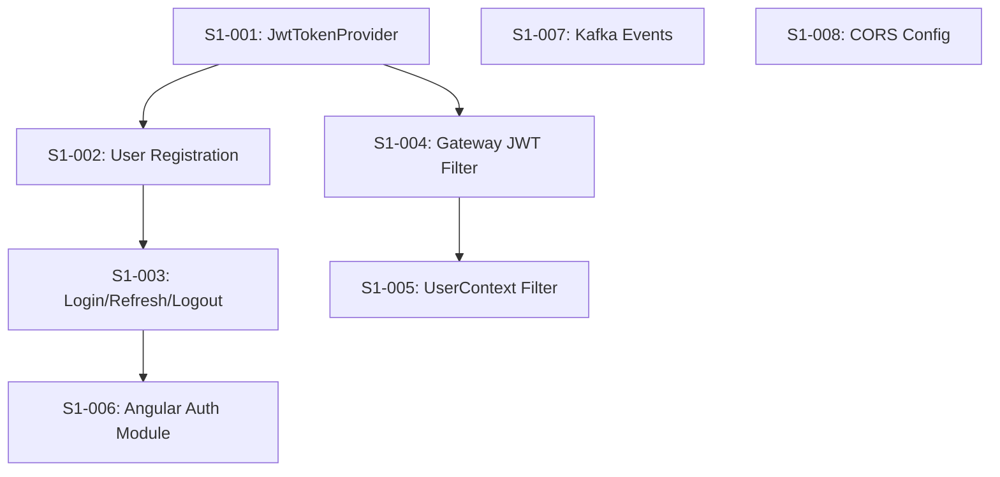

# Phase 1 / Sprint 1: Security & Authentication

> **Sprint Duration**: Weeks 3-4
> **Points**: 39
> **Priority**: P0 (34 pts), P1 (5 pts)

---

## Sprint Goal

JWT authentication working end-to-end -- user can register, login, receive tokens, and access
protected endpoints through the gateway. Angular auth module complete.

---

## Prerequisites

Sprint 0 complete (all 8 stories: S0-001 through S0-008).

Specifically:
- Parent POM builds all modules (`mvn validate` succeeds)
- Error-handling module passes 44 tests
- Common library compiles (BaseAuditEntity, SecurityHeaders, JwtConstants available)
- Docker Compose runs PostgreSQL (`familyhobbies_users` database exists)
- Discovery-service starts Eureka on port 8761
- API Gateway routes requests on port 8080
- User-service scaffold starts on port 8081 with Liquibase connectivity

---

## Dependency Map



**Build order**: S1-001 -> S1-002 -> S1-003 -> S1-004 -> S1-005 -> S1-006 -> S1-007, S1-008

---

## Stories

---

### Story S1-001: Implement JwtTokenProvider

**Points**: 5 | **Priority**: P0 | **Epic**: Security

#### Context

The JwtTokenProvider is the core security building block. It generates signed JWT access tokens
and opaque refresh tokens in the user-service, and validates JWT signatures in the api-gateway.
Every subsequent authentication story depends on this class existing and working correctly.

The user-service version is the full-featured provider: it generates access tokens with claims
(sub, email, roles, firstName, lastName), generates opaque refresh tokens (UUID), validates
tokens, and extracts claims. The api-gateway version is simpler: it only validates tokens and
extracts roles (it never generates tokens).

Both use the JJWT library (version 0.12.5) with HS256 (HMAC-SHA256) signing. The signing key
is a 256-bit secret loaded from the `jwt.secret` property in `application.yml`.

#### Tasks

| # | Task | File Path | What To Create | How To Verify |
|---|------|-----------|---------------|---------------|
| 1 | Add jjwt to parent POM dependencyManagement | `backend/pom.xml` | 3 jjwt artifacts (api, impl, jackson) | `mvn validate` succeeds |
| 2 | Add spring-boot-starter-security + jjwt to user-service POM | `backend/user-service/pom.xml` | Security + JWT dependencies | `mvn validate -pl user-service` |
| 3 | Add spring-boot-starter-security + jjwt to api-gateway POM | `backend/api-gateway/pom.xml` | Security + JWT dependencies | `mvn validate -pl api-gateway` |
| 4 | Create JwtTokenProvider in user-service | `...userservice/security/JwtTokenProvider.java` | Full JWT provider (generate + validate) | Compiles |
| 5 | Create JwtTokenProvider in api-gateway | `...apigateway/security/JwtTokenProvider.java` | Validate-only JWT provider | Compiles |
| 6 | Add jwt.secret to user-service application.yml | `...user-service/.../application.yml` | JWT secret property | Config loads |
| 7 | Add jwt.secret to api-gateway application.yml | `...api-gateway/.../application.yml` | JWT secret property | Config loads |

**File path prefix (user-service)**: `backend/user-service/src/main/java/com/familyhobbies/userservice/`
**File path prefix (api-gateway)**: `backend/api-gateway/src/main/java/com/familyhobbies/apigateway/`

---

#### Task 1 Detail: Add jjwt to Parent POM dependencyManagement

**What**: Add three JJWT 0.12.5 artifacts to the parent POM `<dependencyManagement>` section. The `jjwt-api` artifact is the compile-time API. The `jjwt-impl` and `jjwt-jackson` artifacts are runtime dependencies that provide the implementation and JSON serialization.

**Where**: `backend/pom.xml`

**Why**: Centralizing the JJWT version in the parent POM ensures all modules use the same version. Child modules declare the dependency without specifying a version.

**Content**: Add the following inside the existing `<dependencyManagement><dependencies>` block, after the existing `common` artifact declaration:

```xml
            <!-- JJWT (JSON Web Token) -->
            <dependency>
                <groupId>io.jsonwebtoken</groupId>
                <artifactId>jjwt-api</artifactId>
                <version>0.12.5</version>
            </dependency>
            <dependency>
                <groupId>io.jsonwebtoken</groupId>
                <artifactId>jjwt-impl</artifactId>
                <version>0.12.5</version>
                <scope>runtime</scope>
            </dependency>
            <dependency>
                <groupId>io.jsonwebtoken</groupId>
                <artifactId>jjwt-jackson</artifactId>
                <version>0.12.5</version>
                <scope>runtime</scope>
            </dependency>
```

The full `<dependencyManagement>` block in `backend/pom.xml` should now look like this:

```xml
    <dependencyManagement>
        <dependencies>
            <dependency>
                <groupId>org.springframework.cloud</groupId>
                <artifactId>spring-cloud-dependencies</artifactId>
                <version>${spring-cloud.version}</version>
                <type>pom</type>
                <scope>import</scope>
            </dependency>
            <dependency>
                <groupId>com.familyhobbies</groupId>
                <artifactId>error-handling</artifactId>
                <version>${project.version}</version>
            </dependency>
            <dependency>
                <groupId>com.familyhobbies</groupId>
                <artifactId>common</artifactId>
                <version>${project.version}</version>
            </dependency>
            <!-- JJWT (JSON Web Token) -->
            <dependency>
                <groupId>io.jsonwebtoken</groupId>
                <artifactId>jjwt-api</artifactId>
                <version>0.12.5</version>
            </dependency>
            <dependency>
                <groupId>io.jsonwebtoken</groupId>
                <artifactId>jjwt-impl</artifactId>
                <version>0.12.5</version>
                <scope>runtime</scope>
            </dependency>
            <dependency>
                <groupId>io.jsonwebtoken</groupId>
                <artifactId>jjwt-jackson</artifactId>
                <version>0.12.5</version>
                <scope>runtime</scope>
            </dependency>
        </dependencies>
    </dependencyManagement>
```

**Verify**:

```bash
cd backend && mvn validate
# Expected: BUILD SUCCESS (POM syntax valid, all modules recognized)
```

---

#### Task 2 Detail: Add spring-boot-starter-security + jjwt to User-Service POM

**What**: Add Spring Security starter and three JJWT artifacts to the user-service POM.

**Where**: `backend/user-service/pom.xml`

**Why**: User-service needs Spring Security for the SecurityFilterChain (permit/deny rules, password encoding) and JJWT for generating and validating JWT tokens during authentication.

**Content**: Add the following inside the existing `<dependencies>` block in `backend/user-service/pom.xml`, after the `spring-boot-starter-actuator` dependency:

```xml
        <!-- Security -->
        <dependency>
            <groupId>org.springframework.boot</groupId>
            <artifactId>spring-boot-starter-security</artifactId>
        </dependency>

        <!-- JWT -->
        <dependency>
            <groupId>io.jsonwebtoken</groupId>
            <artifactId>jjwt-api</artifactId>
        </dependency>
        <dependency>
            <groupId>io.jsonwebtoken</groupId>
            <artifactId>jjwt-impl</artifactId>
            <scope>runtime</scope>
        </dependency>
        <dependency>
            <groupId>io.jsonwebtoken</groupId>
            <artifactId>jjwt-jackson</artifactId>
            <scope>runtime</scope>
        </dependency>
```

Also add spring-security-test for integration tests, inside the `<dependencies>` block near the existing test dependency:

```xml
        <dependency>
            <groupId>org.springframework.security</groupId>
            <artifactId>spring-security-test</artifactId>
            <scope>test</scope>
        </dependency>
```

**Verify**:

```bash
cd backend && mvn validate -pl user-service
# Expected: BUILD SUCCESS
```

---

#### Task 3 Detail: Add spring-boot-starter-security + jjwt to API Gateway POM

**What**: Add Spring Security starter and three JJWT artifacts to the api-gateway POM.

**Where**: `backend/api-gateway/pom.xml`

**Why**: The gateway needs Spring Security for WebFlux-based security rules (`@EnableWebFluxSecurity`) and JJWT for validating JWT tokens on every inbound request. NOTE: The gateway uses Spring Cloud Gateway which is reactive (WebFlux). Adding `spring-boot-starter-security` automatically enables WebFlux security because the gateway already has `spring-cloud-starter-gateway` which pulls in WebFlux. You do NOT need `spring-boot-starter-security` plus a separate WebFlux dependency -- Spring Boot auto-detects WebFlux on the classpath.

**Content**: Add the following inside the existing `<dependencies>` block in `backend/api-gateway/pom.xml`:

```xml
        <!-- Security (auto-detects WebFlux for reactive security) -->
        <dependency>
            <groupId>org.springframework.boot</groupId>
            <artifactId>spring-boot-starter-security</artifactId>
        </dependency>

        <!-- JWT -->
        <dependency>
            <groupId>io.jsonwebtoken</groupId>
            <artifactId>jjwt-api</artifactId>
        </dependency>
        <dependency>
            <groupId>io.jsonwebtoken</groupId>
            <artifactId>jjwt-impl</artifactId>
            <scope>runtime</scope>
        </dependency>
        <dependency>
            <groupId>io.jsonwebtoken</groupId>
            <artifactId>jjwt-jackson</artifactId>
            <scope>runtime</scope>
        </dependency>
```

**Verify**:

```bash
cd backend && mvn validate -pl api-gateway
# Expected: BUILD SUCCESS
```

---

#### Task 4 Detail: Create JwtTokenProvider in User-Service

**What**: Full-featured JWT provider that generates access tokens with claims, generates opaque refresh tokens, validates tokens, and extracts claims. This is the authoritative token issuer for the entire platform.

**Where**: `backend/user-service/src/main/java/com/familyhobbies/userservice/security/JwtTokenProvider.java`

**Why**: Every authentication operation (register, login, refresh) calls this class to issue tokens. The access token contains the user's identity and roles as JWT claims. The refresh token is a random UUID stored in the database.

**Content**:

```java
package com.familyhobbies.userservice.security;

import com.familyhobbies.userservice.entity.User;
import io.jsonwebtoken.Claims;
import io.jsonwebtoken.Jwts;
import io.jsonwebtoken.SignatureAlgorithm;
import io.jsonwebtoken.security.Keys;
import org.springframework.beans.factory.annotation.Value;
import org.springframework.stereotype.Component;

import javax.crypto.SecretKey;
import java.nio.charset.StandardCharsets;
import java.util.Date;
import java.util.List;
import java.util.UUID;

@Component
public class JwtTokenProvider {

    private static final long ACCESS_TOKEN_VALIDITY_MS = 3_600_000;    // 1 hour
    private static final long REFRESH_TOKEN_VALIDITY_MS = 604_800_000; // 7 days

    private final SecretKey signingKey;

    public JwtTokenProvider(@Value("${jwt.secret}") String secret) {
        this.signingKey = Keys.hmacShaKeyFor(secret.getBytes(StandardCharsets.UTF_8));
    }

    /**
     * Generate a signed JWT access token containing user identity and roles.
     *
     * Claims included:
     * - sub: user ID (as string per JWT spec)
     * - email: user email address
     * - roles: list of role names (e.g., ["FAMILY"])
     * - firstName: user first name
     * - lastName: user last name
     * - iat: issued-at timestamp
     * - exp: expiration timestamp (iat + 1 hour)
     */
    public String generateAccessToken(User user) {
        Date now = new Date();
        Date expiry = new Date(now.getTime() + ACCESS_TOKEN_VALIDITY_MS);

        return Jwts.builder()
            .setSubject(String.valueOf(user.getId()))
            .claim("email", user.getEmail())
            .claim("roles", List.of(user.getRole().name()))
            .claim("firstName", user.getFirstName())
            .claim("lastName", user.getLastName())
            .setIssuedAt(now)
            .setExpiration(expiry)
            .signWith(signingKey, SignatureAlgorithm.HS256)
            .compact();
    }

    /**
     * Generate an opaque refresh token (UUID).
     * The token itself carries no claims -- it is a lookup key into the database.
     */
    public String generateRefreshToken() {
        return UUID.randomUUID().toString();
    }

    /**
     * Validate the token signature and expiry. Returns claims if valid.
     * Throws ExpiredJwtException if expired, JwtException if invalid.
     */
    public Claims validateToken(String token) {
        return Jwts.parserBuilder()
            .setSigningKey(signingKey)
            .build()
            .parseClaimsJws(token)
            .getBody();
    }

    /**
     * Extract user ID from a validated token.
     */
    public Long getUserIdFromToken(String token) {
        Claims claims = validateToken(token);
        return Long.valueOf(claims.getSubject());
    }

    /**
     * Extract roles from a validated token.
     */
    @SuppressWarnings("unchecked")
    public List<String> getRolesFromToken(String token) {
        Claims claims = validateToken(token);
        return claims.get("roles", List.class);
    }

    /**
     * Calculate the refresh token expiry date from now.
     */
    public Date getRefreshTokenExpiry() {
        return new Date(System.currentTimeMillis() + REFRESH_TOKEN_VALIDITY_MS);
    }
}
```

**Important implementation notes**:
- The `generateAccessToken` method uses `List.of(user.getRole().name())` (not `user.getRoles()`) because the User entity has a single `role` field (not a collection). The 05-security-architecture.md reference shows `user.getRoles()` which assumes a many-to-many relationship, but our data model (02-data-model.md section 4.1) defines `role` as a single `VARCHAR(20)` column. We wrap it in a list because the JWT `roles` claim is always an array for forward compatibility.
- The signing key must be at least 256 bits (32 bytes) for HS256. The development default secret in `application.yml` satisfies this requirement.

**Verify**:

```bash
cd backend && mvn compile -pl user-service -q
# Expected: compiles without error
```

---

#### Task 5 Detail: Create JwtTokenProvider in API Gateway

**What**: Simplified JWT provider for the gateway. It only validates tokens and extracts claims -- it never generates tokens. The gateway uses this to verify incoming requests before forwarding them to downstream services.

**Where**: `backend/api-gateway/src/main/java/com/familyhobbies/apigateway/security/JwtTokenProvider.java`

**Why**: The gateway must validate every JWT on inbound requests and extract the userId and roles to inject as `X-User-Id` and `X-User-Roles` headers. It does not need token generation because only the user-service issues tokens.

**Content**:

```java
package com.familyhobbies.apigateway.security;

import io.jsonwebtoken.Claims;
import io.jsonwebtoken.Jwts;
import io.jsonwebtoken.security.Keys;
import org.springframework.beans.factory.annotation.Value;
import org.springframework.stereotype.Component;

import javax.crypto.SecretKey;
import java.nio.charset.StandardCharsets;
import java.util.List;

@Component
public class JwtTokenProvider {

    private final SecretKey signingKey;

    public JwtTokenProvider(@Value("${jwt.secret}") String secret) {
        this.signingKey = Keys.hmacShaKeyFor(secret.getBytes(StandardCharsets.UTF_8));
    }

    /**
     * Validate the token signature and expiry. Returns claims if valid.
     * Throws ExpiredJwtException if expired, JwtException if invalid.
     */
    public Claims validateToken(String token) {
        return Jwts.parserBuilder()
            .setSigningKey(signingKey)
            .build()
            .parseClaimsJws(token)
            .getBody();
    }

    /**
     * Extract roles from a validated token.
     */
    @SuppressWarnings("unchecked")
    public List<String> getRolesFromToken(String token) {
        Claims claims = validateToken(token);
        return claims.get("roles", List.class);
    }
}
```

**Verify**:

```bash
cd backend && mvn compile -pl api-gateway -q
# Expected: compiles without error
```

---

#### Task 6 Detail: Add jwt.secret to User-Service application.yml

**What**: Add the `jwt.secret` property to user-service configuration. This is the HMAC-SHA256 signing key used to sign and verify JWT tokens.

**Where**: `backend/user-service/src/main/resources/application.yml`

**Why**: The JwtTokenProvider constructor reads `@Value("${jwt.secret}")`. Without this property, Spring fails to create the bean and the application does not start.

**Content**: Add the following block at the end of the existing `application.yml`:

```yaml
jwt:
  secret: ${JWT_SECRET:default-dev-secret-that-is-at-least-256-bits-long-for-hmac-sha256}
```

The `${JWT_SECRET:...}` syntax means: read the `JWT_SECRET` environment variable; if not set, use the default value. The default is only for local development. In production, `JWT_SECRET` is set via a secrets manager.

The default value is exactly 73 characters (584 bits), which exceeds the 256-bit minimum for HS256.

**Verify**:

```bash
grep "jwt:" backend/user-service/src/main/resources/application.yml
# Expected: "jwt:" line visible
```

---

#### Task 7 Detail: Add jwt.secret to API Gateway application.yml

**What**: Add the `jwt.secret` property to api-gateway configuration. MUST use the same secret value as user-service -- otherwise tokens signed by user-service will fail validation at the gateway.

**Where**: `backend/api-gateway/src/main/resources/application.yml`

**Why**: The gateway's JwtTokenProvider uses this secret to verify incoming tokens. If it differs from the user-service secret, every token validation fails with a signature mismatch.

**Content**: Add the following block at the end of the existing `application.yml`:

```yaml
jwt:
  secret: ${JWT_SECRET:default-dev-secret-that-is-at-least-256-bits-long-for-hmac-sha256}
```

**Verify**:

```bash
grep "jwt:" backend/api-gateway/src/main/resources/application.yml
# Expected: "jwt:" line visible
```

---

#### Failing Tests (TDD Contract)

Write these tests FIRST, before implementing (they should already pass after Task 4 since this is the implementation story, but the discipline is: tests define the contract).

**Test File**: `backend/user-service/src/test/java/com/familyhobbies/userservice/security/JwtTokenProviderTest.java`

```java
package com.familyhobbies.userservice.security;

import com.familyhobbies.userservice.entity.User;
import com.familyhobbies.userservice.entity.UserRole;
import com.familyhobbies.userservice.entity.UserStatus;
import io.jsonwebtoken.Claims;
import io.jsonwebtoken.ExpiredJwtException;
import io.jsonwebtoken.Jwts;
import io.jsonwebtoken.SignatureAlgorithm;
import io.jsonwebtoken.security.Keys;
import org.junit.jupiter.api.BeforeEach;
import org.junit.jupiter.api.Test;

import javax.crypto.SecretKey;
import java.nio.charset.StandardCharsets;
import java.util.Date;
import java.util.List;

import static org.junit.jupiter.api.Assertions.*;

class JwtTokenProviderTest {

    private static final String TEST_SECRET =
        "test-secret-key-that-is-at-least-256-bits-long-for-hmac-sha256-signing";

    private JwtTokenProvider jwtTokenProvider;
    private User testUser;

    @BeforeEach
    void setUp() {
        jwtTokenProvider = new JwtTokenProvider(TEST_SECRET);

        testUser = User.builder()
            .id(1L)
            .email("dupont@email.com")
            .firstName("Jean")
            .lastName("Dupont")
            .passwordHash("$2a$12$hashedpassword")
            .role(UserRole.FAMILY)
            .status(UserStatus.ACTIVE)
            .emailVerified(false)
            .build();
    }

    @Test
    void shouldGenerateValidAccessToken() {
        String token = jwtTokenProvider.generateAccessToken(testUser);

        assertNotNull(token, "Access token must not be null");
        assertFalse(token.isBlank(), "Access token must not be blank");

        // A JWT has three parts separated by dots
        String[] parts = token.split("\\.");
        assertEquals(3, parts.length, "JWT must have 3 parts (header.payload.signature)");
    }

    @Test
    void accessTokenShouldContainCorrectClaims() {
        String token = jwtTokenProvider.generateAccessToken(testUser);
        Claims claims = jwtTokenProvider.validateToken(token);

        assertEquals("1", claims.getSubject(), "Subject must be user ID as string");
        assertEquals("dupont@email.com", claims.get("email", String.class));
        assertEquals("Jean", claims.get("firstName", String.class));
        assertEquals("Dupont", claims.get("lastName", String.class));

        @SuppressWarnings("unchecked")
        List<String> roles = claims.get("roles", List.class);
        assertNotNull(roles, "Roles claim must exist");
        assertEquals(1, roles.size());
        assertEquals("FAMILY", roles.get(0));

        assertNotNull(claims.getIssuedAt(), "iat claim must exist");
        assertNotNull(claims.getExpiration(), "exp claim must exist");

        // Expiration should be approximately 1 hour from now
        long diffMs = claims.getExpiration().getTime() - claims.getIssuedAt().getTime();
        assertEquals(3_600_000, diffMs, "Access token validity must be 1 hour (3600000 ms)");
    }

    @Test
    void shouldValidateValidToken() {
        String token = jwtTokenProvider.generateAccessToken(testUser);

        Claims claims = jwtTokenProvider.validateToken(token);

        assertNotNull(claims, "Claims must not be null for a valid token");
        assertEquals("1", claims.getSubject());
    }

    @Test
    void shouldRejectExpiredToken() {
        // Create a token that expired 1 hour ago
        SecretKey key = Keys.hmacShaKeyFor(TEST_SECRET.getBytes(StandardCharsets.UTF_8));
        Date pastDate = new Date(System.currentTimeMillis() - 7_200_000); // 2 hours ago
        Date expiredDate = new Date(System.currentTimeMillis() - 3_600_000); // 1 hour ago

        String expiredToken = Jwts.builder()
            .setSubject("1")
            .setIssuedAt(pastDate)
            .setExpiration(expiredDate)
            .signWith(key, SignatureAlgorithm.HS256)
            .compact();

        assertThrows(ExpiredJwtException.class,
            () -> jwtTokenProvider.validateToken(expiredToken),
            "Expired token must throw ExpiredJwtException");
    }

    @Test
    void shouldRejectTamperedToken() {
        String token = jwtTokenProvider.generateAccessToken(testUser);

        // Tamper with the token by changing the last character of the signature
        char lastChar = token.charAt(token.length() - 1);
        char tamperedChar = (lastChar == 'a') ? 'b' : 'a';
        String tamperedToken = token.substring(0, token.length() - 1) + tamperedChar;

        assertThrows(io.jsonwebtoken.JwtException.class,
            () -> jwtTokenProvider.validateToken(tamperedToken),
            "Tampered token must throw JwtException");
    }

    @Test
    void shouldExtractUserIdFromToken() {
        String token = jwtTokenProvider.generateAccessToken(testUser);

        Long userId = jwtTokenProvider.getUserIdFromToken(token);

        assertEquals(1L, userId, "Extracted user ID must match the user's ID");
    }

    @Test
    void shouldExtractRolesFromToken() {
        String token = jwtTokenProvider.generateAccessToken(testUser);

        List<String> roles = jwtTokenProvider.getRolesFromToken(token);

        assertNotNull(roles);
        assertEquals(1, roles.size());
        assertEquals("FAMILY", roles.get(0));
    }

    @Test
    void shouldGenerateUniqueRefreshTokens() {
        String token1 = jwtTokenProvider.generateRefreshToken();
        String token2 = jwtTokenProvider.generateRefreshToken();
        String token3 = jwtTokenProvider.generateRefreshToken();

        assertNotNull(token1);
        assertNotNull(token2);
        assertNotNull(token3);

        // All three must be different
        assertNotEquals(token1, token2, "Refresh tokens must be unique");
        assertNotEquals(token2, token3, "Refresh tokens must be unique");
        assertNotEquals(token1, token3, "Refresh tokens must be unique");

        // Each must be a valid UUID format (8-4-4-4-12 hex digits)
        assertTrue(token1.matches(
            "[0-9a-f]{8}-[0-9a-f]{4}-[0-9a-f]{4}-[0-9a-f]{4}-[0-9a-f]{12}"),
            "Refresh token must be UUID format");
    }
}
```

**Run tests**:

```bash
cd backend/user-service && mvn test -Dtest=JwtTokenProviderTest
# Expected: 8 tests run, 8 pass, 0 fail
```

---

### Story S1-002: Implement User Registration

**Points**: 8 | **Priority**: P0 | **Epic**: Security

#### Context

User registration is the first real business feature. A new user submits their email, password,
first name, and last name. The system checks that the email is not already taken, hashes the
password with BCrypt (strength 12), saves the user with FAMILY role and ACTIVE status, generates
an access token and refresh token, saves the refresh token in the database, and returns both
tokens to the caller.

This story requires creating the database tables (Liquibase migrations), JPA entities,
repositories, request/response DTOs, the AuthService interface and implementation, the
AuthController, and the user-service SecurityConfig.

The t_user and t_refresh_token table schemas are defined in `docs/architecture/02-data-model.md`
sections 4.1 and 4.5. The auth endpoint contracts are defined in
`docs/architecture/03-api-contracts.md` section 7.1. The SecurityConfig is defined in
`docs/architecture/05-security-architecture.md` section 5.4.

#### Tasks

| # | Task | File Path | What To Create | How To Verify |
|---|------|-----------|---------------|---------------|
| 1 | Create Liquibase 001-create-user-table.yaml | `...db/changelog/changes/001-create-user-table.yaml` | t_user table with all columns and indexes | `mvn liquibase:update` or service startup |
| 2 | Create Liquibase 002-create-refresh-token-table.yaml | `...db/changelog/changes/002-create-refresh-token-table.yaml` | t_refresh_token table with FK to t_user | `mvn liquibase:update` or service startup |
| 3 | Update db.changelog-master.yaml | `...db/changelog/db.changelog-master.yaml` | Include both new changesets | Liquibase runs all 3 changesets |
| 4 | Create UserRole enum | `...userservice/entity/UserRole.java` | Enum with FAMILY, ASSOCIATION, ADMIN | Compiles |
| 5 | Create UserStatus enum | `...userservice/entity/UserStatus.java` | Enum with ACTIVE, INACTIVE, SUSPENDED, DELETED | Compiles |
| 6 | Create User entity | `...userservice/entity/User.java` | JPA entity mapping t_user | Compiles |
| 7 | Create RefreshToken entity | `...userservice/entity/RefreshToken.java` | JPA entity mapping t_refresh_token | Compiles |
| 8 | Create UserRepository | `...userservice/repository/UserRepository.java` | Spring Data JPA repo with findByEmail, existsByEmail | Compiles |
| 9 | Create RefreshTokenRepository | `...userservice/repository/RefreshTokenRepository.java` | Spring Data JPA repo with findByToken, revokeAllByUserId | Compiles |
| 10 | Create RegisterRequest record | `...userservice/dto/request/RegisterRequest.java` | Validated registration DTO | Compiles |
| 11 | Create AuthResponse record | `...userservice/dto/response/AuthResponse.java` | Token response DTO | Compiles |
| 12 | Create AuthService interface | `...userservice/service/AuthService.java` | Service interface | Compiles |
| 13 | Create AuthServiceImpl (register only) | `...userservice/service/impl/AuthServiceImpl.java` | Register method implementation | Compiles |
| 14 | Create AuthController (register only) | `...userservice/controller/AuthController.java` | POST /api/v1/auth/register | Compiles |
| 15 | Create SecurityConfig | `...userservice/config/SecurityConfig.java` | Spring Security filter chain + BCrypt | Compiles |

**File path prefix**: `backend/user-service/src/main/java/com/familyhobbies/userservice/`
**Resources path prefix**: `backend/user-service/src/main/resources/`

---

#### Task 1 Detail: Create Liquibase 001-create-user-table.yaml

**What**: Liquibase changeset that creates the `t_user` table with all columns, constraints, and indexes as defined in the data model document (02-data-model.md section 4.1).

**Where**: `backend/user-service/src/main/resources/db/changelog/changes/001-create-user-table.yaml`

**Why**: The User entity cannot be persisted without this table. Hibernate is configured with `ddl-auto: validate`, meaning it validates the schema against the entity but does NOT create tables. Liquibase is responsible for all DDL.

**Content**:

```yaml
databaseChangeLog:
  - changeSet:
      id: 001-create-user-table
      author: family-hobbies-team
      comment: "Creates t_user table for authentication and user management"
      changes:
        - createTable:
            tableName: t_user
            columns:
              - column:
                  name: id
                  type: BIGINT
                  autoIncrement: true
                  constraints:
                    primaryKey: true
                    primaryKeyName: pk_user
                    nullable: false
              - column:
                  name: email
                  type: VARCHAR(255)
                  constraints:
                    nullable: false
                    unique: true
                    uniqueConstraintName: uq_user_email
              - column:
                  name: password_hash
                  type: VARCHAR(255)
                  constraints:
                    nullable: false
              - column:
                  name: first_name
                  type: VARCHAR(100)
                  constraints:
                    nullable: false
              - column:
                  name: last_name
                  type: VARCHAR(100)
                  constraints:
                    nullable: false
              - column:
                  name: phone
                  type: VARCHAR(20)
                  constraints:
                    nullable: true
              - column:
                  name: role
                  type: VARCHAR(20)
                  defaultValue: "FAMILY"
                  constraints:
                    nullable: false
              - column:
                  name: status
                  type: VARCHAR(20)
                  defaultValue: "ACTIVE"
                  constraints:
                    nullable: false
              - column:
                  name: email_verified
                  type: BOOLEAN
                  defaultValueBoolean: false
                  constraints:
                    nullable: false
              - column:
                  name: last_login_at
                  type: TIMESTAMP WITH TIME ZONE
                  constraints:
                    nullable: true
              - column:
                  name: created_at
                  type: TIMESTAMP WITH TIME ZONE
                  defaultValueComputed: NOW()
                  constraints:
                    nullable: false
              - column:
                  name: updated_at
                  type: TIMESTAMP WITH TIME ZONE
                  defaultValueComputed: NOW()
                  constraints:
                    nullable: false

        - createIndex:
            tableName: t_user
            indexName: idx_user_email
            columns:
              - column:
                  name: email

        - createIndex:
            tableName: t_user
            indexName: idx_user_status
            columns:
              - column:
                  name: status
```

**Verify**:

```bash
# Start PostgreSQL if not running
cd docker && docker compose up -d
sleep 5

# Start user-service (Liquibase runs on startup)
cd backend/user-service && mvn spring-boot:run &
sleep 15

# Check table was created
docker exec fhm-postgres psql -U fhm_admin -d familyhobbies_users \
  -c "\d t_user"
# Expected: table columns listed (id, email, password_hash, first_name, ...)

# Check indexes
docker exec fhm-postgres psql -U fhm_admin -d familyhobbies_users \
  -c "SELECT indexname FROM pg_indexes WHERE tablename = 't_user'"
# Expected: pk_user, uq_user_email, idx_user_email, idx_user_status

# Stop user-service
kill %1
```

---

#### Task 2 Detail: Create Liquibase 002-create-refresh-token-table.yaml

**What**: Liquibase changeset that creates the `t_refresh_token` table with foreign key to `t_user`, unique constraint on token, and indexes as defined in the data model document (02-data-model.md section 4.5).

**Where**: `backend/user-service/src/main/resources/db/changelog/changes/002-create-refresh-token-table.yaml`

**Why**: The RefreshToken entity stores opaque refresh tokens. Without this table, the login and refresh flows cannot persist tokens.

**Content**:

```yaml
databaseChangeLog:
  - changeSet:
      id: 002-create-refresh-token-table
      author: family-hobbies-team
      comment: "Creates t_refresh_token table for JWT refresh token persistence"
      changes:
        - createTable:
            tableName: t_refresh_token
            columns:
              - column:
                  name: id
                  type: BIGINT
                  autoIncrement: true
                  constraints:
                    primaryKey: true
                    primaryKeyName: pk_refresh_token
                    nullable: false
              - column:
                  name: user_id
                  type: BIGINT
                  constraints:
                    nullable: false
              - column:
                  name: token
                  type: VARCHAR(512)
                  constraints:
                    nullable: false
                    unique: true
                    uniqueConstraintName: uq_refresh_token
              - column:
                  name: expires_at
                  type: TIMESTAMP WITH TIME ZONE
                  constraints:
                    nullable: false
              - column:
                  name: revoked
                  type: BOOLEAN
                  defaultValueBoolean: false
                  constraints:
                    nullable: false
              - column:
                  name: created_at
                  type: TIMESTAMP WITH TIME ZONE
                  defaultValueComputed: NOW()
                  constraints:
                    nullable: false

        - addForeignKeyConstraint:
            baseTableName: t_refresh_token
            baseColumnNames: user_id
            constraintName: fk_refresh_token_user
            referencedTableName: t_user
            referencedColumnNames: id
            onDelete: CASCADE

        - createIndex:
            tableName: t_refresh_token
            indexName: idx_refresh_token_user_id
            columns:
              - column:
                  name: user_id

        - createIndex:
            tableName: t_refresh_token
            indexName: idx_refresh_token_expires_at
            columns:
              - column:
                  name: expires_at
```

**Verify**:

```bash
# With PostgreSQL running and user-service started:
docker exec fhm-postgres psql -U fhm_admin -d familyhobbies_users \
  -c "\d t_refresh_token"
# Expected: table columns listed (id, user_id, token, expires_at, revoked, created_at)

docker exec fhm-postgres psql -U fhm_admin -d familyhobbies_users \
  -c "SELECT indexname FROM pg_indexes WHERE tablename = 't_refresh_token'"
# Expected: pk_refresh_token, uq_refresh_token, idx_refresh_token_user_id, idx_refresh_token_expires_at
```

---

#### Task 3 Detail: Update db.changelog-master.yaml

**What**: Add the two new changeset files to the master changelog so Liquibase executes them in order.

**Where**: `backend/user-service/src/main/resources/db/changelog/db.changelog-master.yaml`

**Why**: Liquibase only runs changesets listed in the master changelog. Without this update, the new tables are never created.

**Content**: Replace the entire file with:

```yaml
databaseChangeLog:
  - include:
      file: db/changelog/changes/000-init.yaml
  - include:
      file: db/changelog/changes/001-create-user-table.yaml
  - include:
      file: db/changelog/changes/002-create-refresh-token-table.yaml
```

**Verify**:

```bash
cd backend/user-service && mvn spring-boot:run &
sleep 15

docker exec fhm-postgres psql -U fhm_admin -d familyhobbies_users \
  -c "SELECT id, filename FROM databasechangelog ORDER BY orderexecuted"
# Expected: three rows: 000-init, 001-create-user-table, 002-create-refresh-token-table

kill %1
```

---

#### Task 4 Detail: Create UserRole Enum

**What**: Enum representing the three application roles a user can hold.

**Where**: `backend/user-service/src/main/java/com/familyhobbies/userservice/entity/UserRole.java`

**Why**: The User entity's `role` field uses this enum. Stored as a string in the database (`@Enumerated(EnumType.STRING)`), so the enum value names must exactly match the database values: FAMILY, ASSOCIATION, ADMIN.

**Content**:

```java
package com.familyhobbies.userservice.entity;

public enum UserRole {

    /**
     * Family user (parent/guardian). Default role assigned at registration.
     * Can manage own family and members, browse associations, create subscriptions.
     */
    FAMILY,

    /**
     * Association manager. Can view subscriber lists, mark attendance,
     * view payment reports for their association, manage sessions and courses.
     */
    ASSOCIATION,

    /**
     * Platform administrator. Full CRUD on all entities, trigger syncs,
     * manage all users and roles, access RGPD tools.
     */
    ADMIN
}
```

**Verify**:

```bash
cd backend && mvn compile -pl user-service -q
# Expected: compiles without error
```

---

#### Task 5 Detail: Create UserStatus Enum

**What**: Enum representing the four account status values.

**Where**: `backend/user-service/src/main/java/com/familyhobbies/userservice/entity/UserStatus.java`

**Why**: The User entity's `status` field uses this enum. Soft-delete is implemented via the DELETED status rather than physical row deletion, supporting RGPD data retention requirements.

**Content**:

```java
package com.familyhobbies.userservice.entity;

public enum UserStatus {

    /**
     * Account is active and fully functional.
     * Default status assigned at registration.
     */
    ACTIVE,

    /**
     * Account is temporarily inactive (e.g., user requested pause).
     * Cannot log in, but data is retained.
     */
    INACTIVE,

    /**
     * Account is suspended by an administrator.
     * Cannot log in, pending investigation or user action.
     */
    SUSPENDED,

    /**
     * Account has been soft-deleted (RGPD right-to-be-forgotten).
     * Personal data is anonymized, account cannot be used.
     */
    DELETED
}
```

**Verify**:

```bash
cd backend && mvn compile -pl user-service -q
# Expected: compiles without error
```

---

#### Task 6 Detail: Create User Entity

**What**: JPA entity mapped to the `t_user` table. Contains all 12 columns from the data model. NOTE: User does NOT extend BaseAuditEntity from common because `t_user` has its own `created_at` and `updated_at` columns with specific defaults, and does not have `created_by`/`updated_by` columns (which BaseAuditEntity provides). Uses Lombok `@Builder`, `@Getter`, `@Setter`, `@NoArgsConstructor`, `@AllArgsConstructor`.

**Where**: `backend/user-service/src/main/java/com/familyhobbies/userservice/entity/User.java`

**Why**: This is the primary entity for user management. Every authentication and user management operation depends on this entity.

**Content**:

```java
package com.familyhobbies.userservice.entity;

import jakarta.persistence.Column;
import jakarta.persistence.Entity;
import jakarta.persistence.EnumType;
import jakarta.persistence.Enumerated;
import jakarta.persistence.GeneratedValue;
import jakarta.persistence.GenerationType;
import jakarta.persistence.Id;
import jakarta.persistence.Table;
import lombok.AllArgsConstructor;
import lombok.Builder;
import lombok.Getter;
import lombok.NoArgsConstructor;
import lombok.Setter;

import java.time.Instant;

@Entity
@Table(name = "t_user")
@Getter
@Setter
@NoArgsConstructor
@AllArgsConstructor
@Builder
public class User {

    @Id
    @GeneratedValue(strategy = GenerationType.IDENTITY)
    private Long id;

    @Column(name = "email", nullable = false, unique = true, length = 255)
    private String email;

    @Column(name = "password_hash", nullable = false, length = 255)
    private String passwordHash;

    @Column(name = "first_name", nullable = false, length = 100)
    private String firstName;

    @Column(name = "last_name", nullable = false, length = 100)
    private String lastName;

    @Column(name = "phone", length = 20)
    private String phone;

    @Enumerated(EnumType.STRING)
    @Column(name = "role", nullable = false, length = 20)
    @Builder.Default
    private UserRole role = UserRole.FAMILY;

    @Enumerated(EnumType.STRING)
    @Column(name = "status", nullable = false, length = 20)
    @Builder.Default
    private UserStatus status = UserStatus.ACTIVE;

    @Column(name = "email_verified", nullable = false)
    @Builder.Default
    private boolean emailVerified = false;

    @Column(name = "last_login_at")
    private Instant lastLoginAt;

    @Column(name = "created_at", nullable = false, updatable = false)
    @Builder.Default
    private Instant createdAt = Instant.now();

    @Column(name = "updated_at", nullable = false)
    @Builder.Default
    private Instant updatedAt = Instant.now();

    /**
     * Check if the user account is active (can log in).
     */
    public boolean isActive() {
        return this.status == UserStatus.ACTIVE;
    }
}
```

**Important implementation notes**:
- `@Builder.Default` is used for `role`, `status`, `emailVerified`, `createdAt`, and `updatedAt` so that the builder uses the specified defaults rather than null/0/false.
- The `isActive()` method is used by the login flow to verify the user can authenticate.
- `createdAt` has `updatable = false` to prevent accidental modification after creation.

**Verify**:

```bash
cd backend && mvn compile -pl user-service -q
# Expected: compiles without error
```

---

#### Task 7 Detail: Create RefreshToken Entity

**What**: JPA entity mapped to the `t_refresh_token` table. Contains the opaque token, expiry, revocation flag, and a many-to-one relationship to User.

**Where**: `backend/user-service/src/main/java/com/familyhobbies/userservice/entity/RefreshToken.java`

**Why**: Refresh tokens are stored in the database for validation, rotation, and revocation. The entity links each token to its owning user.

**Content**:

```java
package com.familyhobbies.userservice.entity;

import jakarta.persistence.Column;
import jakarta.persistence.Entity;
import jakarta.persistence.FetchType;
import jakarta.persistence.GeneratedValue;
import jakarta.persistence.GenerationType;
import jakarta.persistence.Id;
import jakarta.persistence.JoinColumn;
import jakarta.persistence.ManyToOne;
import jakarta.persistence.Table;
import lombok.AllArgsConstructor;
import lombok.Builder;
import lombok.Getter;
import lombok.NoArgsConstructor;
import lombok.Setter;

import java.time.Instant;

@Entity
@Table(name = "t_refresh_token")
@Getter
@Setter
@NoArgsConstructor
@AllArgsConstructor
@Builder
public class RefreshToken {

    @Id
    @GeneratedValue(strategy = GenerationType.IDENTITY)
    private Long id;

    @ManyToOne(fetch = FetchType.LAZY)
    @JoinColumn(name = "user_id", nullable = false)
    private User user;

    @Column(name = "token", nullable = false, unique = true, length = 512)
    private String token;

    @Column(name = "expires_at", nullable = false)
    private Instant expiresAt;

    @Column(name = "revoked", nullable = false)
    @Builder.Default
    private boolean revoked = false;

    @Column(name = "created_at", nullable = false, updatable = false)
    @Builder.Default
    private Instant createdAt = Instant.now();
}
```

**Important implementation notes**:
- `@ManyToOne(fetch = FetchType.LAZY)` -- the User is loaded on demand, not eagerly, to avoid N+1 queries when querying refresh tokens.
- The `expiresAt` field stores the Instant when this refresh token becomes invalid (7 days from creation).

**Verify**:

```bash
cd backend && mvn compile -pl user-service -q
# Expected: compiles without error
```

---

#### Task 8 Detail: Create UserRepository

**What**: Spring Data JPA repository interface for the User entity. Provides two custom query methods beyond the standard CRUD operations.

**Where**: `backend/user-service/src/main/java/com/familyhobbies/userservice/repository/UserRepository.java`

**Why**: `findByEmail` is used during login (find user by their email address). `existsByEmail` is used during registration (check if email is already taken, without loading the full entity).

**Content**:

```java
package com.familyhobbies.userservice.repository;

import com.familyhobbies.userservice.entity.User;
import org.springframework.data.jpa.repository.JpaRepository;
import org.springframework.stereotype.Repository;

import java.util.Optional;

@Repository
public interface UserRepository extends JpaRepository<User, Long> {

    /**
     * Find a user by their email address.
     * Used during login to load the user for credential verification.
     *
     * @param email the email address to search for
     * @return Optional containing the user if found, empty otherwise
     */
    Optional<User> findByEmail(String email);

    /**
     * Check if a user with the given email address already exists.
     * Used during registration to enforce email uniqueness at the application level
     * (in addition to the database unique constraint).
     *
     * @param email the email address to check
     * @return true if a user with this email exists, false otherwise
     */
    boolean existsByEmail(String email);
}
```

**Verify**:

```bash
cd backend && mvn compile -pl user-service -q
# Expected: compiles without error
```

---

#### Task 9 Detail: Create RefreshTokenRepository

**What**: Spring Data JPA repository interface for the RefreshToken entity. Provides a custom query method to find by token value and a modifying query to revoke all tokens for a user.

**Where**: `backend/user-service/src/main/java/com/familyhobbies/userservice/repository/RefreshTokenRepository.java`

**Why**: `findByToken` is used during the refresh flow (look up the stored token by its value). `revokeAllByUserId` is used during logout (invalidate all refresh tokens for the user).

**Content**:

```java
package com.familyhobbies.userservice.repository;

import com.familyhobbies.userservice.entity.RefreshToken;
import org.springframework.data.jpa.repository.JpaRepository;
import org.springframework.data.jpa.repository.Modifying;
import org.springframework.data.jpa.repository.Query;
import org.springframework.data.repository.query.Param;
import org.springframework.stereotype.Repository;

import java.util.Optional;

@Repository
public interface RefreshTokenRepository extends JpaRepository<RefreshToken, Long> {

    /**
     * Find a refresh token by its token value.
     * Used during the refresh flow to validate and rotate tokens.
     *
     * @param token the opaque refresh token string (UUID)
     * @return Optional containing the RefreshToken entity if found, empty otherwise
     */
    Optional<RefreshToken> findByToken(String token);

    /**
     * Revoke all non-revoked refresh tokens for a given user.
     * Sets revoked = true for all tokens where user_id matches and revoked is currently false.
     * Used during logout to invalidate all active sessions.
     *
     * @param userId the user ID whose tokens should be revoked
     */
    @Modifying
    @Query("UPDATE RefreshToken rt SET rt.revoked = true WHERE rt.user.id = :userId AND rt.revoked = false")
    void revokeAllByUserId(@Param("userId") Long userId);
}
```

**Important implementation notes**:
- The `@Modifying` annotation tells Spring Data that this is an UPDATE (not a SELECT) query.
- The `@Query` uses JPQL (not native SQL) -- it references `RefreshToken` (entity name) and `rt.user.id` (entity relationship), not table/column names.
- The calling method must be annotated with `@Transactional` for the `@Modifying` query to execute.

**Verify**:

```bash
cd backend && mvn compile -pl user-service -q
# Expected: compiles without error
```

---

#### Task 10 Detail: Create RegisterRequest Record

**What**: Java record representing the registration request body. Uses Jakarta Bean Validation annotations to enforce input constraints. Validation is triggered by `@Valid` on the controller parameter.

**Where**: `backend/user-service/src/main/java/com/familyhobbies/userservice/dto/request/RegisterRequest.java`

**Why**: Incoming JSON is deserialized into this record. Validation annotations ensure the request is well-formed before it reaches the service layer. Invalid requests return 400 Bad Request with field-level error details.

**Content**:

```java
package com.familyhobbies.userservice.dto.request;

import jakarta.validation.constraints.Email;
import jakarta.validation.constraints.NotBlank;
import jakarta.validation.constraints.Size;

public record RegisterRequest(

    @NotBlank(message = "Email is required")
    @Email(message = "Email must be a valid email address")
    @Size(max = 255, message = "Email must not exceed 255 characters")
    String email,

    @NotBlank(message = "Password is required")
    @Size(min = 8, max = 100, message = "Password must be between 8 and 100 characters")
    String password,

    @NotBlank(message = "First name is required")
    @Size(max = 100, message = "First name must not exceed 100 characters")
    String firstName,

    @NotBlank(message = "Last name is required")
    @Size(max = 100, message = "Last name must not exceed 100 characters")
    String lastName,

    @Size(max = 20, message = "Phone must not exceed 20 characters")
    String phone
) {}
```

**Important implementation notes**:
- `phone` does not have `@NotBlank` because it is optional (nullable in the database).
- The password validation here enforces minimum length. Additional complexity rules (uppercase, lowercase, digit, special char) can be added with a custom `@Pattern` annotation in a future story.

**Verify**:

```bash
cd backend && mvn compile -pl user-service -q
# Expected: compiles without error
```

---

#### Task 11 Detail: Create AuthResponse Record

**What**: Java record representing the authentication response body. Returned after successful registration, login, and token refresh. Contains the access token, refresh token, token type, and expiry duration.

**Where**: `backend/user-service/src/main/java/com/familyhobbies/userservice/dto/response/AuthResponse.java`

**Why**: This is the standard authentication response shape defined in the API contracts (03-api-contracts.md section 7.1). The frontend parses this to store tokens and schedule refresh.

**Content**:

```java
package com.familyhobbies.userservice.dto.response;

public record AuthResponse(

    /**
     * JWT access token. Valid for 1 hour.
     * Include in Authorization header as: Bearer {accessToken}
     */
    String accessToken,

    /**
     * Opaque refresh token (UUID). Valid for 7 days.
     * Send to POST /api/v1/auth/refresh to obtain a new token pair.
     */
    String refreshToken,

    /**
     * Token type. Always "Bearer".
     */
    String tokenType,

    /**
     * Access token lifetime in seconds. Always 3600 (1 hour).
     */
    long expiresIn
) {}
```

**Verify**:

```bash
cd backend && mvn compile -pl user-service -q
# Expected: compiles without error
```

---

#### Task 12 Detail: Create AuthService Interface

**What**: Service interface that defines the authentication contract. Implementation is provided by AuthServiceImpl.

**Where**: `backend/user-service/src/main/java/com/familyhobbies/userservice/service/AuthService.java`

**Why**: Coding to an interface enables testing with mocks and supports future alternative implementations. The controller depends on this interface, not the implementation.

**Content**:

```java
package com.familyhobbies.userservice.service;

import com.familyhobbies.userservice.dto.request.LoginRequest;
import com.familyhobbies.userservice.dto.request.RefreshTokenRequest;
import com.familyhobbies.userservice.dto.request.RegisterRequest;
import com.familyhobbies.userservice.dto.response.AuthResponse;

public interface AuthService {

    /**
     * Register a new user account.
     * Creates the user with FAMILY role and ACTIVE status,
     * hashes the password, generates token pair, saves refresh token.
     *
     * @param request registration details (email, password, firstName, lastName, phone)
     * @return AuthResponse with access token and refresh token
     * @throws ConflictException if email is already registered
     */
    AuthResponse register(RegisterRequest request);

    /**
     * Authenticate a user with email and password.
     * Verifies credentials, generates token pair, saves refresh token.
     *
     * @param request login credentials (email, password)
     * @return AuthResponse with access token and refresh token
     * @throws UnauthorizedException if credentials are invalid or account is inactive
     */
    AuthResponse login(LoginRequest request);

    /**
     * Refresh an expired access token using a valid refresh token.
     * Implements token rotation: the used refresh token is revoked.
     *
     * @param request the refresh token to exchange
     * @return AuthResponse with new access token and new refresh token
     * @throws UnauthorizedException if refresh token is invalid, expired, or revoked
     */
    AuthResponse refreshToken(RefreshTokenRequest request);

    /**
     * Log out a user by revoking all their refresh tokens.
     *
     * @param userId the ID of the user to log out
     */
    void logout(Long userId);
}
```

**Important implementation notes**:
- The `login`, `refreshToken`, and `logout` methods are declared here but implemented in Story S1-003. For now, only `register` is implemented.
- The `LoginRequest` and `RefreshTokenRequest` DTOs are created in Story S1-003. For this story, you can temporarily comment out the `login` and `refreshToken` method signatures, OR create empty placeholder DTOs. The recommended approach is to create the DTOs now (Task 10 of S1-003 creates them, but you can create stubs here to avoid compilation errors).

**Verify**:

```bash
cd backend && mvn compile -pl user-service -q
# Expected: compiles without error (may need stub DTOs)
```

---

#### Task 13 Detail: Create AuthServiceImpl (Register Method)

**What**: Implementation of the AuthService interface. In this story, only the `register()` method is fully implemented. The `login()`, `refreshToken()`, and `logout()` methods throw `UnsupportedOperationException` as placeholders until Story S1-003.

**Where**: `backend/user-service/src/main/java/com/familyhobbies/userservice/service/impl/AuthServiceImpl.java`

**Why**: This is the core business logic for user registration. It orchestrates the complete flow: uniqueness check, password hashing, user creation, token generation, and token persistence.

**Content**:

```java
package com.familyhobbies.userservice.service.impl;

import com.familyhobbies.errorhandling.exception.web.ConflictException;
import com.familyhobbies.errorhandling.exception.web.UnauthorizedException;
import com.familyhobbies.userservice.dto.request.LoginRequest;
import com.familyhobbies.userservice.dto.request.RefreshTokenRequest;
import com.familyhobbies.userservice.dto.request.RegisterRequest;
import com.familyhobbies.userservice.dto.response.AuthResponse;
import com.familyhobbies.userservice.entity.RefreshToken;
import com.familyhobbies.userservice.entity.User;
import com.familyhobbies.userservice.entity.UserRole;
import com.familyhobbies.userservice.entity.UserStatus;
import com.familyhobbies.userservice.repository.RefreshTokenRepository;
import com.familyhobbies.userservice.repository.UserRepository;
import com.familyhobbies.userservice.security.JwtTokenProvider;
import com.familyhobbies.userservice.service.AuthService;
import org.springframework.security.crypto.password.PasswordEncoder;
import org.springframework.stereotype.Service;
import org.springframework.transaction.annotation.Transactional;

import java.time.Instant;

@Service
public class AuthServiceImpl implements AuthService {

    private final UserRepository userRepository;
    private final RefreshTokenRepository refreshTokenRepository;
    private final PasswordEncoder passwordEncoder;
    private final JwtTokenProvider jwtTokenProvider;

    public AuthServiceImpl(
            UserRepository userRepository,
            RefreshTokenRepository refreshTokenRepository,
            PasswordEncoder passwordEncoder,
            JwtTokenProvider jwtTokenProvider) {
        this.userRepository = userRepository;
        this.refreshTokenRepository = refreshTokenRepository;
        this.passwordEncoder = passwordEncoder;
        this.jwtTokenProvider = jwtTokenProvider;
    }

    @Override
    @Transactional
    public AuthResponse register(RegisterRequest request) {
        // Step 1: Check email uniqueness
        if (userRepository.existsByEmail(request.email())) {
            throw new ConflictException("Email already registered: " + request.email());
        }

        // Step 2: Create user with hashed password
        User user = User.builder()
            .email(request.email())
            .passwordHash(passwordEncoder.encode(request.password()))
            .firstName(request.firstName())
            .lastName(request.lastName())
            .phone(request.phone())
            .role(UserRole.FAMILY)
            .status(UserStatus.ACTIVE)
            .emailVerified(false)
            .build();

        user = userRepository.save(user);

        // Step 3: Generate token pair
        String accessToken = jwtTokenProvider.generateAccessToken(user);
        String refreshTokenValue = createAndSaveRefreshToken(user);

        // Step 4: Return auth response
        return new AuthResponse(accessToken, refreshTokenValue, "Bearer", 3600);
    }

    @Override
    @Transactional
    public AuthResponse login(LoginRequest request) {
        // Implemented in Story S1-003
        throw new UnsupportedOperationException("Login not yet implemented -- see Story S1-003");
    }

    @Override
    @Transactional
    public AuthResponse refreshToken(RefreshTokenRequest request) {
        // Implemented in Story S1-003
        throw new UnsupportedOperationException("Token refresh not yet implemented -- see Story S1-003");
    }

    @Override
    @Transactional
    public void logout(Long userId) {
        // Implemented in Story S1-003
        throw new UnsupportedOperationException("Logout not yet implemented -- see Story S1-003");
    }

    /**
     * Generate a refresh token, save it to the database, and return the token string.
     */
    private String createAndSaveRefreshToken(User user) {
        String tokenValue = jwtTokenProvider.generateRefreshToken();

        RefreshToken refreshToken = RefreshToken.builder()
            .user(user)
            .token(tokenValue)
            .expiresAt(jwtTokenProvider.getRefreshTokenExpiry().toInstant())
            .revoked(false)
            .build();

        refreshTokenRepository.save(refreshToken);
        return tokenValue;
    }
}
```

**Important implementation notes**:
- The `ConflictException` is from the error-handling module (`com.familyhobbies.errorhandling.exception.web.ConflictException`). It maps to HTTP 409.
- `passwordEncoder.encode(request.password())` uses BCrypt with strength 12 (configured in SecurityConfig, Task 15).
- `createAndSaveRefreshToken` is a private helper method reused by register, login, and refresh flows.
- The `login`, `refreshToken`, and `logout` methods are stubbed with `UnsupportedOperationException` so the class compiles. They are fully implemented in Story S1-003.

**Verify**:

```bash
cd backend && mvn compile -pl user-service -q
# Expected: compiles without error
```

---

#### Task 14 Detail: Create AuthController (Register Endpoint)

**What**: REST controller exposing the `POST /api/v1/auth/register` endpoint. Returns 201 Created with the AuthResponse body on success. Validation is triggered by `@Valid` on the request body.

**Where**: `backend/user-service/src/main/java/com/familyhobbies/userservice/controller/AuthController.java`

**Why**: This is the HTTP entry point for user registration. The controller delegates to AuthService and maps the result to the appropriate HTTP response.

**Content**:

```java
package com.familyhobbies.userservice.controller;

import com.familyhobbies.userservice.dto.request.RegisterRequest;
import com.familyhobbies.userservice.dto.response.AuthResponse;
import com.familyhobbies.userservice.service.AuthService;
import jakarta.validation.Valid;
import org.springframework.http.HttpStatus;
import org.springframework.http.ResponseEntity;
import org.springframework.web.bind.annotation.PostMapping;
import org.springframework.web.bind.annotation.RequestBody;
import org.springframework.web.bind.annotation.RequestMapping;
import org.springframework.web.bind.annotation.RestController;

@RestController
@RequestMapping("/api/v1/auth")
public class AuthController {

    private final AuthService authService;

    public AuthController(AuthService authService) {
        this.authService = authService;
    }

    /**
     * Register a new user account.
     *
     * POST /api/v1/auth/register
     *
     * Public endpoint -- no authentication required.
     * Returns 201 with access token and refresh token on success.
     * Returns 400 if request validation fails.
     * Returns 409 if email is already registered.
     */
    @PostMapping("/register")
    public ResponseEntity<AuthResponse> register(@Valid @RequestBody RegisterRequest request) {
        AuthResponse response = authService.register(request);
        return ResponseEntity.status(HttpStatus.CREATED).body(response);
    }
}
```

**Important implementation notes**:
- `@Valid` triggers Jakarta Bean Validation on the RegisterRequest. If validation fails, Spring throws `MethodArgumentNotValidException`, which is caught by the `GlobalExceptionHandler` from the error-handling module and returns a 400 response with field-level errors.
- The login, refresh, and logout endpoints are added in Story S1-003.
- The controller uses constructor injection (not `@Autowired` field injection) for testability.

**Verify**:

```bash
cd backend && mvn compile -pl user-service -q
# Expected: compiles without error
```

---

#### Task 15 Detail: Create User-Service SecurityConfig

**What**: Spring Security configuration for the user-service. Configures HTTP security rules (which endpoints are public vs. authenticated), stateless sessions, CSRF disabled, and the BCrypt password encoder bean.

**Where**: `backend/user-service/src/main/java/com/familyhobbies/userservice/config/SecurityConfig.java`

**Why**: Without this configuration, Spring Security's default behavior blocks all endpoints and shows a login form. This config permits the auth endpoints, disables sessions (stateless JWT), and provides the PasswordEncoder used by AuthServiceImpl.

**Content**:

```java
package com.familyhobbies.userservice.config;

import org.springframework.context.annotation.Bean;
import org.springframework.context.annotation.Configuration;
import org.springframework.security.config.annotation.method.configuration.EnableMethodSecurity;
import org.springframework.security.config.annotation.web.builders.HttpSecurity;
import org.springframework.security.config.annotation.web.configuration.EnableWebSecurity;
import org.springframework.security.config.http.SessionCreationPolicy;
import org.springframework.security.crypto.bcrypt.BCryptPasswordEncoder;
import org.springframework.security.crypto.password.PasswordEncoder;
import org.springframework.security.web.SecurityFilterChain;

@Configuration
@EnableWebSecurity
@EnableMethodSecurity
public class SecurityConfig {

    @Bean
    public SecurityFilterChain securityFilterChain(HttpSecurity http) throws Exception {
        return http
            // Stateless -- no HTTP sessions
            .sessionManagement(session ->
                session.sessionCreationPolicy(SessionCreationPolicy.STATELESS))

            // CSRF disabled -- stateless JWT-based API behind gateway, no session cookies
            .csrf(csrf -> csrf.disable())

            // No form login or HTTP basic authentication
            .formLogin(form -> form.disable())
            .httpBasic(basic -> basic.disable())

            // Authorization rules (defense-in-depth -- gateway also enforces these)
            .authorizeHttpRequests(auth -> auth
                // Public endpoints
                .requestMatchers("/api/v1/auth/**").permitAll()
                .requestMatchers("/actuator/health", "/actuator/info").permitAll()
                // All other endpoints require authentication
                .anyRequest().authenticated()
            )

            .build();
    }

    /**
     * BCrypt password encoder with strength 12.
     * Strength 12 produces approximately 4096 hash iterations.
     * This provides strong security while keeping authentication latency
     * under 300ms on modern hardware.
     */
    @Bean
    public PasswordEncoder passwordEncoder() {
        return new BCryptPasswordEncoder(12);
    }
}
```

**Important implementation notes**:
- This is a simplified version compared to 05-security-architecture.md section 5.4. The full version includes `UserContextFilter` which is added in Story S1-005. For now, the SecurityConfig does not reference `UserContextFilter` because it does not exist yet.
- `@EnableMethodSecurity` enables `@PreAuthorize` annotations on service methods for fine-grained access control (used in later stories).
- `SessionCreationPolicy.STATELESS` tells Spring Security not to create or use HTTP sessions. Each request is independently authenticated.

**Verify**:

```bash
cd backend && mvn compile -pl user-service -q
# Expected: compiles without error
```

---

#### Failing Tests (TDD Contract)

These tests verify the full registration flow end-to-end using Spring Boot's `@SpringBootTest` with a real database (Testcontainers can be used, or an in-memory H2 if PostgreSQL is not available in CI). The tests below use `@SpringBootTest` with `WebEnvironment.RANDOM_PORT` and `TestRestTemplate` for full integration testing.

For these tests to run, you need to add the H2 test dependency to the user-service POM (for tests that run without PostgreSQL):

```xml
        <!-- Test database (H2 for integration tests without PostgreSQL) -->
        <dependency>
            <groupId>com.h2database</groupId>
            <artifactId>h2</artifactId>
            <scope>test</scope>
        </dependency>
```

And create a test configuration file:

**File**: `backend/user-service/src/test/resources/application-test.yml`

```yaml
spring:
  datasource:
    url: jdbc:h2:mem:testdb;MODE=PostgreSQL;DATABASE_TO_LOWER=TRUE
    username: sa
    password:
    driver-class-name: org.h2.Driver
  jpa:
    hibernate:
      ddl-auto: create-drop
    properties:
      hibernate:
        dialect: org.hibernate.dialect.H2Dialect
  liquibase:
    enabled: false

jwt:
  secret: test-secret-key-that-is-at-least-256-bits-long-for-hmac-sha256-signing

eureka:
  client:
    enabled: false
```

**Test File**: `backend/user-service/src/test/java/com/familyhobbies/userservice/controller/UserRegistrationTest.java`

```java
package com.familyhobbies.userservice.controller;

import com.familyhobbies.userservice.dto.request.RegisterRequest;
import com.familyhobbies.userservice.dto.response.AuthResponse;
import com.familyhobbies.userservice.entity.User;
import com.familyhobbies.userservice.repository.RefreshTokenRepository;
import com.familyhobbies.userservice.repository.UserRepository;
import org.junit.jupiter.api.BeforeEach;
import org.junit.jupiter.api.Test;
import org.springframework.beans.factory.annotation.Autowired;
import org.springframework.boot.test.context.SpringBootTest;
import org.springframework.boot.test.web.client.TestRestTemplate;
import org.springframework.http.HttpEntity;
import org.springframework.http.HttpHeaders;
import org.springframework.http.HttpStatus;
import org.springframework.http.MediaType;
import org.springframework.http.ResponseEntity;
import org.springframework.security.crypto.password.PasswordEncoder;
import org.springframework.test.context.ActiveProfiles;

import java.util.Optional;

import static org.junit.jupiter.api.Assertions.*;

@SpringBootTest(webEnvironment = SpringBootTest.WebEnvironment.RANDOM_PORT)
@ActiveProfiles("test")
class UserRegistrationTest {

    @Autowired
    private TestRestTemplate restTemplate;

    @Autowired
    private UserRepository userRepository;

    @Autowired
    private RefreshTokenRepository refreshTokenRepository;

    @Autowired
    private PasswordEncoder passwordEncoder;

    @BeforeEach
    void setUp() {
        refreshTokenRepository.deleteAll();
        userRepository.deleteAll();
    }

    @Test
    void register_shouldReturn201WithTokens() {
        RegisterRequest request = new RegisterRequest(
            "dupont@email.com", "SecureP@ss1", "Jean", "Dupont", "+33612345678");

        ResponseEntity<AuthResponse> response = restTemplate.postForEntity(
            "/api/v1/auth/register", request, AuthResponse.class);

        assertEquals(HttpStatus.CREATED, response.getStatusCode(),
            "Registration must return 201 Created");

        AuthResponse body = response.getBody();
        assertNotNull(body, "Response body must not be null");
        assertNotNull(body.accessToken(), "Access token must not be null");
        assertNotNull(body.refreshToken(), "Refresh token must not be null");
        assertEquals("Bearer", body.tokenType(), "Token type must be Bearer");
        assertEquals(3600, body.expiresIn(), "Expiry must be 3600 seconds");

        // Access token must be a valid JWT (3 parts separated by dots)
        String[] parts = body.accessToken().split("\\.");
        assertEquals(3, parts.length, "Access token must be a valid JWT");
    }

    @Test
    void register_duplicateEmail_shouldReturn409() {
        RegisterRequest request = new RegisterRequest(
            "dupont@email.com", "SecureP@ss1", "Jean", "Dupont", null);

        // First registration -- should succeed
        restTemplate.postForEntity("/api/v1/auth/register", request, AuthResponse.class);

        // Second registration with same email -- should fail
        ResponseEntity<String> response = restTemplate.postForEntity(
            "/api/v1/auth/register", request, String.class);

        assertEquals(HttpStatus.CONFLICT, response.getStatusCode(),
            "Duplicate email registration must return 409 Conflict");
    }

    @Test
    void register_invalidEmail_shouldReturn400() {
        RegisterRequest request = new RegisterRequest(
            "not-an-email", "SecureP@ss1", "Jean", "Dupont", null);

        ResponseEntity<String> response = restTemplate.postForEntity(
            "/api/v1/auth/register", request, String.class);

        assertEquals(HttpStatus.BAD_REQUEST, response.getStatusCode(),
            "Invalid email must return 400 Bad Request");
    }

    @Test
    void register_blankPassword_shouldReturn400() {
        RegisterRequest request = new RegisterRequest(
            "dupont@email.com", "", "Jean", "Dupont", null);

        ResponseEntity<String> response = restTemplate.postForEntity(
            "/api/v1/auth/register", request, String.class);

        assertEquals(HttpStatus.BAD_REQUEST, response.getStatusCode(),
            "Blank password must return 400 Bad Request");
    }

    @Test
    void register_shouldHashPassword() {
        RegisterRequest request = new RegisterRequest(
            "dupont@email.com", "SecureP@ss1", "Jean", "Dupont", null);

        restTemplate.postForEntity("/api/v1/auth/register", request, AuthResponse.class);

        Optional<User> savedUser = userRepository.findByEmail("dupont@email.com");
        assertTrue(savedUser.isPresent(), "User must be saved in database");

        User user = savedUser.get();
        // Password must NOT be stored in plain text
        assertNotEquals("SecureP@ss1", user.getPasswordHash(),
            "Password must not be stored in plain text");
        // Password must be verifiable with BCrypt
        assertTrue(passwordEncoder.matches("SecureP@ss1", user.getPasswordHash()),
            "Stored hash must match the original password via BCrypt");
        // BCrypt hash always starts with $2a$ (or $2b$)
        assertTrue(user.getPasswordHash().startsWith("$2a$"),
            "Password hash must be BCrypt format");
    }

    @Test
    void register_shouldAssignFamilyRole() {
        RegisterRequest request = new RegisterRequest(
            "dupont@email.com", "SecureP@ss1", "Jean", "Dupont", null);

        restTemplate.postForEntity("/api/v1/auth/register", request, AuthResponse.class);

        Optional<User> savedUser = userRepository.findByEmail("dupont@email.com");
        assertTrue(savedUser.isPresent(), "User must be saved in database");

        User user = savedUser.get();
        assertEquals(com.familyhobbies.userservice.entity.UserRole.FAMILY, user.getRole(),
            "New user must have FAMILY role");
        assertEquals(com.familyhobbies.userservice.entity.UserStatus.ACTIVE, user.getStatus(),
            "New user must have ACTIVE status");
        assertFalse(user.isEmailVerified(),
            "New user must have emailVerified = false");
    }

    @Test
    void register_shouldSaveRefreshTokenInDb() {
        RegisterRequest request = new RegisterRequest(
            "dupont@email.com", "SecureP@ss1", "Jean", "Dupont", null);

        ResponseEntity<AuthResponse> response = restTemplate.postForEntity(
            "/api/v1/auth/register", request, AuthResponse.class);

        AuthResponse body = response.getBody();
        assertNotNull(body, "Response body must not be null");

        // The refresh token returned in the response must exist in the database
        var storedToken = refreshTokenRepository.findByToken(body.refreshToken());
        assertTrue(storedToken.isPresent(),
            "Refresh token must be saved in the database");

        var token = storedToken.get();
        assertFalse(token.isRevoked(),
            "New refresh token must not be revoked");
        assertNotNull(token.getExpiresAt(),
            "Refresh token must have an expiry date");
        assertTrue(token.getExpiresAt().isAfter(java.time.Instant.now()),
            "Refresh token expiry must be in the future");
    }
}
```

**Run tests**:

```bash
cd backend/user-service && mvn test -Dtest=UserRegistrationTest
# Expected: 7 tests run, 7 pass, 0 fail
```

---

### Story S1-003: Implement Login, Refresh, and Logout

**Points**: 5 | **Priority**: P0 | **Epic**: Security

#### Context

With registration complete (S1-002), this story implements the remaining three authentication
flows: login, token refresh, and logout.

**Login** (`POST /api/v1/auth/login`): The user provides email and password. The system looks up
the user by email, verifies the password with BCrypt, checks that the account is active, generates
a new token pair, saves the refresh token, updates `last_login_at`, and returns the tokens.

**Refresh** (`POST /api/v1/auth/refresh`): The client sends an expired access token's companion
refresh token. The system looks up the refresh token in the database, verifies it is not revoked
and not expired, revokes the used token (token rotation), generates a new token pair, and returns
the new tokens. Token rotation prevents replay attacks with stolen refresh tokens.

**Logout** (`POST /api/v1/auth/logout`): The client sends the request with the `X-User-Id` header
(injected by the gateway). The system revokes all refresh tokens for that user, effectively
invalidating all sessions.

#### Tasks

| # | Task | File Path | What To Create | How To Verify |
|---|------|-----------|---------------|---------------|
| 1 | Create LoginRequest record | `...dto/request/LoginRequest.java` | Validated login DTO | Compiles |
| 2 | Create RefreshTokenRequest record | `...dto/request/RefreshTokenRequest.java` | Validated refresh DTO | Compiles |
| 3 | Implement AuthServiceImpl.login() | `...service/impl/AuthServiceImpl.java` | Login business logic | Compiles |
| 4 | Implement AuthServiceImpl.refreshToken() | `...service/impl/AuthServiceImpl.java` | Refresh business logic | Compiles |
| 5 | Implement AuthServiceImpl.logout() | `...service/impl/AuthServiceImpl.java` | Logout business logic | Compiles |
| 6 | Add login, refresh, logout endpoints to AuthController | `...controller/AuthController.java` | 3 new POST endpoints | Compiles |

**File path prefix**: `backend/user-service/src/main/java/com/familyhobbies/userservice/`

---

#### Task 1 Detail: Create LoginRequest Record

**What**: Java record representing the login request body. Requires email and password, both non-blank.

**Where**: `backend/user-service/src/main/java/com/familyhobbies/userservice/dto/request/LoginRequest.java`

**Why**: Incoming login JSON is deserialized into this record. Validation ensures both fields are present before reaching the service layer.

**Content**:

```java
package com.familyhobbies.userservice.dto.request;

import jakarta.validation.constraints.NotBlank;

public record LoginRequest(

    @NotBlank(message = "Email is required")
    String email,

    @NotBlank(message = "Password is required")
    String password
) {}
```

**Verify**:

```bash
cd backend && mvn compile -pl user-service -q
# Expected: compiles without error
```

---

#### Task 2 Detail: Create RefreshTokenRequest Record

**What**: Java record representing the token refresh request body. Contains the opaque refresh token string.

**Where**: `backend/user-service/src/main/java/com/familyhobbies/userservice/dto/request/RefreshTokenRequest.java`

**Why**: The client sends the refresh token to obtain a new access token when the current one expires.

**Content**:

```java
package com.familyhobbies.userservice.dto.request;

import jakarta.validation.constraints.NotBlank;

public record RefreshTokenRequest(

    @NotBlank(message = "Refresh token is required")
    String refreshToken
) {}
```

**Verify**:

```bash
cd backend && mvn compile -pl user-service -q
# Expected: compiles without error
```

---

#### Task 3 Detail: Implement AuthServiceImpl.login()

**What**: Replace the `UnsupportedOperationException` stub in `login()` with the full implementation.

**Where**: `backend/user-service/src/main/java/com/familyhobbies/userservice/service/impl/AuthServiceImpl.java`

**Why**: Login is the most frequently used authentication operation. The implementation must follow a secure pattern: find user, verify password, check status, generate tokens.

**Content**: Replace the existing `login()` method with:

```java
    @Override
    @Transactional
    public AuthResponse login(LoginRequest request) {
        // Step 1: Find user by email
        User user = userRepository.findByEmail(request.email())
            .orElseThrow(() -> new UnauthorizedException("Invalid credentials"));

        // Step 2: Verify password with BCrypt
        if (!passwordEncoder.matches(request.password(), user.getPasswordHash())) {
            throw new UnauthorizedException("Invalid credentials");
        }

        // Step 3: Check account is active
        if (!user.isActive()) {
            throw new UnauthorizedException("Invalid credentials");
        }

        // Step 4: Update last login timestamp
        user.setLastLoginAt(java.time.Instant.now());
        user.setUpdatedAt(java.time.Instant.now());
        userRepository.save(user);

        // Step 5: Generate token pair
        String accessToken = jwtTokenProvider.generateAccessToken(user);
        String refreshTokenValue = createAndSaveRefreshToken(user);

        return new AuthResponse(accessToken, refreshTokenValue, "Bearer", 3600);
    }
```

**Important implementation notes**:
- The error message for all three failure cases (unknown email, wrong password, inactive account) is the same generic "Invalid credentials". This prevents attackers from enumerating valid email addresses by observing different error messages.
- `last_login_at` is updated on every successful login for analytics and security monitoring.

**Verify**:

```bash
cd backend && mvn compile -pl user-service -q
# Expected: compiles without error
```

---

#### Task 4 Detail: Implement AuthServiceImpl.refreshToken()

**What**: Replace the `UnsupportedOperationException` stub in `refreshToken()` with the full implementation. Implements refresh token rotation -- the used token is revoked and a new token pair is issued.

**Where**: `backend/user-service/src/main/java/com/familyhobbies/userservice/service/impl/AuthServiceImpl.java`

**Why**: Token refresh allows the frontend to silently renew access tokens without forcing the user to re-authenticate. Token rotation (revoking the used refresh token) prevents replay attacks.

**Content**: Replace the existing `refreshToken()` method with:

```java
    @Override
    @Transactional
    public AuthResponse refreshToken(RefreshTokenRequest request) {
        // Step 1: Find refresh token in database
        RefreshToken storedToken = refreshTokenRepository.findByToken(request.refreshToken())
            .orElseThrow(() -> new UnauthorizedException("Invalid refresh token"));

        // Step 2: Check token is not revoked
        if (storedToken.isRevoked()) {
            throw new UnauthorizedException("Refresh token has been revoked");
        }

        // Step 3: Check token is not expired
        if (storedToken.getExpiresAt().isBefore(java.time.Instant.now())) {
            throw new UnauthorizedException("Refresh token has expired");
        }

        // Step 4: Revoke the used refresh token (rotation)
        storedToken.setRevoked(true);
        refreshTokenRepository.save(storedToken);

        // Step 5: Generate new token pair
        User user = storedToken.getUser();
        String accessToken = jwtTokenProvider.generateAccessToken(user);
        String newRefreshTokenValue = createAndSaveRefreshToken(user);

        return new AuthResponse(accessToken, newRefreshTokenValue, "Bearer", 3600);
    }
```

**Important implementation notes**:
- After revoking the used token and issuing a new one, the old refresh token can never be used again. If an attacker intercepts a refresh token and tries to use it after the legitimate user has already used it, they get "Refresh token has been revoked".
- The `storedToken.getUser()` call triggers a lazy load of the User entity. This is fine because we are inside a `@Transactional` method, so the Hibernate session is open.

**Verify**:

```bash
cd backend && mvn compile -pl user-service -q
# Expected: compiles without error
```

---

#### Task 5 Detail: Implement AuthServiceImpl.logout()

**What**: Replace the `UnsupportedOperationException` stub in `logout()` with the full implementation. Revokes all refresh tokens for the given user.

**Where**: `backend/user-service/src/main/java/com/familyhobbies/userservice/service/impl/AuthServiceImpl.java`

**Why**: Logout invalidates all sessions for the user by revoking every refresh token. The access token remains valid until it expires (up to 1 hour), but no new tokens can be obtained.

**Content**: Replace the existing `logout()` method with:

```java
    @Override
    @Transactional
    public void logout(Long userId) {
        refreshTokenRepository.revokeAllByUserId(userId);
    }
```

**Verify**:

```bash
cd backend && mvn compile -pl user-service -q
# Expected: compiles without error
```

---

#### Task 6 Detail: Add Login, Refresh, Logout Endpoints to AuthController

**What**: Add three new POST endpoints to the existing AuthController: login, refresh, and logout.

**Where**: `backend/user-service/src/main/java/com/familyhobbies/userservice/controller/AuthController.java`

**Why**: These are the HTTP entry points for the three remaining authentication flows. Each delegates to AuthService.

**Content**: Add these methods to the existing `AuthController` class, after the `register()` method. Also add the necessary imports.

Add these imports at the top of the file:

```java
import com.familyhobbies.userservice.dto.request.LoginRequest;
import com.familyhobbies.userservice.dto.request.RefreshTokenRequest;
import org.springframework.web.bind.annotation.RequestHeader;
```

Add these methods inside the `AuthController` class:

```java
    /**
     * Authenticate a user and return a token pair.
     *
     * POST /api/v1/auth/login
     *
     * Public endpoint -- no authentication required.
     * Returns 200 with access token and refresh token on success.
     * Returns 401 if credentials are invalid or account is inactive.
     */
    @PostMapping("/login")
    public ResponseEntity<AuthResponse> login(@Valid @RequestBody LoginRequest request) {
        AuthResponse response = authService.login(request);
        return ResponseEntity.ok(response);
    }

    /**
     * Refresh an expired access token using a valid refresh token.
     * Implements token rotation: the used refresh token is revoked.
     *
     * POST /api/v1/auth/refresh
     *
     * Public endpoint -- no JWT required (the access token is expired).
     * Returns 200 with new access token and new refresh token on success.
     * Returns 401 if refresh token is invalid, expired, or revoked.
     */
    @PostMapping("/refresh")
    public ResponseEntity<AuthResponse> refresh(@Valid @RequestBody RefreshTokenRequest request) {
        AuthResponse response = authService.refreshToken(request);
        return ResponseEntity.ok(response);
    }

    /**
     * Log out a user by revoking all their refresh tokens.
     *
     * POST /api/v1/auth/logout
     *
     * Authenticated endpoint -- requires X-User-Id header (injected by gateway).
     * Returns 204 No Content on success.
     */
    @PostMapping("/logout")
    public ResponseEntity<Void> logout(@RequestHeader("X-User-Id") Long userId) {
        authService.logout(userId);
        return ResponseEntity.noContent().build();
    }
```

The complete `AuthController` class after this task should look like:

```java
package com.familyhobbies.userservice.controller;

import com.familyhobbies.userservice.dto.request.LoginRequest;
import com.familyhobbies.userservice.dto.request.RefreshTokenRequest;
import com.familyhobbies.userservice.dto.request.RegisterRequest;
import com.familyhobbies.userservice.dto.response.AuthResponse;
import com.familyhobbies.userservice.service.AuthService;
import jakarta.validation.Valid;
import org.springframework.http.HttpStatus;
import org.springframework.http.ResponseEntity;
import org.springframework.web.bind.annotation.PostMapping;
import org.springframework.web.bind.annotation.RequestBody;
import org.springframework.web.bind.annotation.RequestHeader;
import org.springframework.web.bind.annotation.RequestMapping;
import org.springframework.web.bind.annotation.RestController;

@RestController
@RequestMapping("/api/v1/auth")
public class AuthController {

    private final AuthService authService;

    public AuthController(AuthService authService) {
        this.authService = authService;
    }

    @PostMapping("/register")
    public ResponseEntity<AuthResponse> register(@Valid @RequestBody RegisterRequest request) {
        AuthResponse response = authService.register(request);
        return ResponseEntity.status(HttpStatus.CREATED).body(response);
    }

    @PostMapping("/login")
    public ResponseEntity<AuthResponse> login(@Valid @RequestBody LoginRequest request) {
        AuthResponse response = authService.login(request);
        return ResponseEntity.ok(response);
    }

    @PostMapping("/refresh")
    public ResponseEntity<AuthResponse> refresh(@Valid @RequestBody RefreshTokenRequest request) {
        AuthResponse response = authService.refreshToken(request);
        return ResponseEntity.ok(response);
    }

    @PostMapping("/logout")
    public ResponseEntity<Void> logout(@RequestHeader("X-User-Id") Long userId) {
        authService.logout(userId);
        return ResponseEntity.noContent().build();
    }
}
```

**Verify**:

```bash
cd backend && mvn compile -pl user-service -q
# Expected: compiles without error
```

---

#### Failing Tests (TDD Contract)

**Test File**: `backend/user-service/src/test/java/com/familyhobbies/userservice/controller/AuthFlowTest.java`

```java
package com.familyhobbies.userservice.controller;

import com.familyhobbies.userservice.dto.request.LoginRequest;
import com.familyhobbies.userservice.dto.request.RefreshTokenRequest;
import com.familyhobbies.userservice.dto.request.RegisterRequest;
import com.familyhobbies.userservice.dto.response.AuthResponse;
import com.familyhobbies.userservice.entity.RefreshToken;
import com.familyhobbies.userservice.entity.User;
import com.familyhobbies.userservice.entity.UserRole;
import com.familyhobbies.userservice.entity.UserStatus;
import com.familyhobbies.userservice.repository.RefreshTokenRepository;
import com.familyhobbies.userservice.repository.UserRepository;
import org.junit.jupiter.api.BeforeEach;
import org.junit.jupiter.api.Test;
import org.springframework.beans.factory.annotation.Autowired;
import org.springframework.boot.test.context.SpringBootTest;
import org.springframework.boot.test.web.client.TestRestTemplate;
import org.springframework.http.HttpEntity;
import org.springframework.http.HttpHeaders;
import org.springframework.http.HttpMethod;
import org.springframework.http.HttpStatus;
import org.springframework.http.ResponseEntity;
import org.springframework.security.crypto.password.PasswordEncoder;
import org.springframework.test.context.ActiveProfiles;

import java.time.Instant;
import java.time.temporal.ChronoUnit;
import java.util.Optional;

import static org.junit.jupiter.api.Assertions.*;

@SpringBootTest(webEnvironment = SpringBootTest.WebEnvironment.RANDOM_PORT)
@ActiveProfiles("test")
class AuthFlowTest {

    @Autowired
    private TestRestTemplate restTemplate;

    @Autowired
    private UserRepository userRepository;

    @Autowired
    private RefreshTokenRepository refreshTokenRepository;

    @Autowired
    private PasswordEncoder passwordEncoder;

    private User existingUser;

    @BeforeEach
    void setUp() {
        refreshTokenRepository.deleteAll();
        userRepository.deleteAll();

        // Create an existing user for login tests
        existingUser = User.builder()
            .email("dupont@email.com")
            .passwordHash(passwordEncoder.encode("SecureP@ss1"))
            .firstName("Jean")
            .lastName("Dupont")
            .role(UserRole.FAMILY)
            .status(UserStatus.ACTIVE)
            .emailVerified(false)
            .build();
        existingUser = userRepository.save(existingUser);
    }

    // ==================== LOGIN TESTS ====================

    @Test
    void login_validCredentials_shouldReturn200WithTokens() {
        LoginRequest request = new LoginRequest("dupont@email.com", "SecureP@ss1");

        ResponseEntity<AuthResponse> response = restTemplate.postForEntity(
            "/api/v1/auth/login", request, AuthResponse.class);

        assertEquals(HttpStatus.OK, response.getStatusCode(),
            "Login with valid credentials must return 200 OK");

        AuthResponse body = response.getBody();
        assertNotNull(body, "Response body must not be null");
        assertNotNull(body.accessToken(), "Access token must not be null");
        assertNotNull(body.refreshToken(), "Refresh token must not be null");
        assertEquals("Bearer", body.tokenType());
        assertEquals(3600, body.expiresIn());

        // Access token must be a valid JWT
        String[] parts = body.accessToken().split("\\.");
        assertEquals(3, parts.length, "Access token must be a valid JWT");
    }

    @Test
    void login_wrongPassword_shouldReturn401() {
        LoginRequest request = new LoginRequest("dupont@email.com", "WrongPassword1!");

        ResponseEntity<String> response = restTemplate.postForEntity(
            "/api/v1/auth/login", request, String.class);

        assertEquals(HttpStatus.UNAUTHORIZED, response.getStatusCode(),
            "Wrong password must return 401 Unauthorized");
    }

    @Test
    void login_unknownEmail_shouldReturn401() {
        LoginRequest request = new LoginRequest("unknown@email.com", "SecureP@ss1");

        ResponseEntity<String> response = restTemplate.postForEntity(
            "/api/v1/auth/login", request, String.class);

        assertEquals(HttpStatus.UNAUTHORIZED, response.getStatusCode(),
            "Unknown email must return 401 Unauthorized");
    }

    @Test
    void login_inactiveUser_shouldReturn401() {
        // Set the user to INACTIVE
        existingUser.setStatus(UserStatus.INACTIVE);
        userRepository.save(existingUser);

        LoginRequest request = new LoginRequest("dupont@email.com", "SecureP@ss1");

        ResponseEntity<String> response = restTemplate.postForEntity(
            "/api/v1/auth/login", request, String.class);

        assertEquals(HttpStatus.UNAUTHORIZED, response.getStatusCode(),
            "Inactive user must return 401 Unauthorized");
    }

    // ==================== REFRESH TESTS ====================

    @Test
    void refresh_validToken_shouldReturn200WithNewTokens() {
        // First, login to get a valid refresh token
        LoginRequest loginRequest = new LoginRequest("dupont@email.com", "SecureP@ss1");
        ResponseEntity<AuthResponse> loginResponse = restTemplate.postForEntity(
            "/api/v1/auth/login", loginRequest, AuthResponse.class);

        AuthResponse loginBody = loginResponse.getBody();
        assertNotNull(loginBody);

        // Now refresh the token
        RefreshTokenRequest refreshRequest = new RefreshTokenRequest(loginBody.refreshToken());
        ResponseEntity<AuthResponse> refreshResponse = restTemplate.postForEntity(
            "/api/v1/auth/refresh", refreshRequest, AuthResponse.class);

        assertEquals(HttpStatus.OK, refreshResponse.getStatusCode(),
            "Valid refresh must return 200 OK");

        AuthResponse refreshBody = refreshResponse.getBody();
        assertNotNull(refreshBody);
        assertNotNull(refreshBody.accessToken());
        assertNotNull(refreshBody.refreshToken());

        // New tokens must be different from the old ones
        assertNotEquals(loginBody.accessToken(), refreshBody.accessToken(),
            "New access token must be different from old one");
        assertNotEquals(loginBody.refreshToken(), refreshBody.refreshToken(),
            "New refresh token must be different from old one (rotation)");
    }

    @Test
    void refresh_revokedToken_shouldReturn401() {
        // Login to get a refresh token
        LoginRequest loginRequest = new LoginRequest("dupont@email.com", "SecureP@ss1");
        ResponseEntity<AuthResponse> loginResponse = restTemplate.postForEntity(
            "/api/v1/auth/login", loginRequest, AuthResponse.class);

        AuthResponse loginBody = loginResponse.getBody();
        assertNotNull(loginBody);

        // Manually revoke the token in the database
        Optional<RefreshToken> storedToken = refreshTokenRepository.findByToken(loginBody.refreshToken());
        assertTrue(storedToken.isPresent());
        RefreshToken token = storedToken.get();
        token.setRevoked(true);
        refreshTokenRepository.save(token);

        // Try to use the revoked token
        RefreshTokenRequest refreshRequest = new RefreshTokenRequest(loginBody.refreshToken());
        ResponseEntity<String> response = restTemplate.postForEntity(
            "/api/v1/auth/refresh", refreshRequest, String.class);

        assertEquals(HttpStatus.UNAUTHORIZED, response.getStatusCode(),
            "Revoked refresh token must return 401 Unauthorized");
    }

    @Test
    void refresh_expiredToken_shouldReturn401() {
        // Create a refresh token that is already expired
        RefreshToken expiredToken = RefreshToken.builder()
            .user(existingUser)
            .token("expired-token-value-for-testing")
            .expiresAt(Instant.now().minus(1, ChronoUnit.HOURS))
            .revoked(false)
            .build();
        refreshTokenRepository.save(expiredToken);

        RefreshTokenRequest refreshRequest = new RefreshTokenRequest("expired-token-value-for-testing");
        ResponseEntity<String> response = restTemplate.postForEntity(
            "/api/v1/auth/refresh", refreshRequest, String.class);

        assertEquals(HttpStatus.UNAUTHORIZED, response.getStatusCode(),
            "Expired refresh token must return 401 Unauthorized");
    }

    @Test
    void refresh_shouldRotateToken() {
        // Login to get a refresh token
        LoginRequest loginRequest = new LoginRequest("dupont@email.com", "SecureP@ss1");
        ResponseEntity<AuthResponse> loginResponse = restTemplate.postForEntity(
            "/api/v1/auth/login", loginRequest, AuthResponse.class);

        AuthResponse loginBody = loginResponse.getBody();
        assertNotNull(loginBody);
        String originalRefreshToken = loginBody.refreshToken();

        // Refresh the token
        RefreshTokenRequest refreshRequest = new RefreshTokenRequest(originalRefreshToken);
        restTemplate.postForEntity("/api/v1/auth/refresh", refreshRequest, AuthResponse.class);

        // The original refresh token must now be revoked in the database
        Optional<RefreshToken> originalToken = refreshTokenRepository.findByToken(originalRefreshToken);
        assertTrue(originalToken.isPresent(),
            "Original refresh token must still exist in database");
        assertTrue(originalToken.get().isRevoked(),
            "Original refresh token must be revoked after rotation");
    }

    // ==================== LOGOUT TESTS ====================

    @Test
    void logout_shouldRevokeAllRefreshTokens() {
        // Login twice to create two refresh tokens
        LoginRequest loginRequest = new LoginRequest("dupont@email.com", "SecureP@ss1");
        ResponseEntity<AuthResponse> loginResponse1 = restTemplate.postForEntity(
            "/api/v1/auth/login", loginRequest, AuthResponse.class);
        ResponseEntity<AuthResponse> loginResponse2 = restTemplate.postForEntity(
            "/api/v1/auth/login", loginRequest, AuthResponse.class);

        assertNotNull(loginResponse1.getBody());
        assertNotNull(loginResponse2.getBody());

        // Logout -- send X-User-Id header
        HttpHeaders headers = new HttpHeaders();
        headers.set("X-User-Id", String.valueOf(existingUser.getId()));
        HttpEntity<Void> logoutRequest = new HttpEntity<>(headers);

        ResponseEntity<Void> logoutResponse = restTemplate.exchange(
            "/api/v1/auth/logout", HttpMethod.POST, logoutRequest, Void.class);

        assertEquals(HttpStatus.NO_CONTENT, logoutResponse.getStatusCode(),
            "Logout must return 204 No Content");

        // Both refresh tokens must now be revoked
        Optional<RefreshToken> token1 = refreshTokenRepository.findByToken(
            loginResponse1.getBody().refreshToken());
        Optional<RefreshToken> token2 = refreshTokenRepository.findByToken(
            loginResponse2.getBody().refreshToken());

        assertTrue(token1.isPresent());
        assertTrue(token2.isPresent());
        assertTrue(token1.get().isRevoked(),
            "First refresh token must be revoked after logout");
        assertTrue(token2.get().isRevoked(),
            "Second refresh token must be revoked after logout");
    }
}
```

**Run tests**:

```bash
cd backend/user-service && mvn test -Dtest=AuthFlowTest
# Expected: 9 tests run, 9 pass, 0 fail
```

---

## Sprint Verification Checklist (Stories S1-001 through S1-003)

Run these commands in order to verify these three stories are complete:

```bash
# 1. Docker PostgreSQL running
cd docker && docker compose up -d
docker compose ps
# Expected: fhm-postgres running (healthy)

# 2. Parent POM builds all modules
cd backend && mvn clean package -DskipTests
# Expected: BUILD SUCCESS for all modules

# 3. JwtTokenProvider unit tests pass
cd backend/user-service && mvn test -Dtest=JwtTokenProviderTest
# Expected: 8 tests run, 8 pass, 0 fail

# 4. Registration integration tests pass
cd backend/user-service && mvn test -Dtest=UserRegistrationTest
# Expected: 7 tests run, 7 pass, 0 fail

# 5. Auth flow integration tests pass
cd backend/user-service && mvn test -Dtest=AuthFlowTest
# Expected: 9 tests run, 9 pass, 0 fail

# 6. Start discovery-service
cd backend/discovery-service && mvn spring-boot:run &
sleep 10

# 7. Start user-service (Liquibase creates t_user and t_refresh_token)
cd backend/user-service && mvn spring-boot:run &
sleep 15

# 8. Verify tables were created
docker exec fhm-postgres psql -U fhm_admin -d familyhobbies_users \
  -c "\dt"
# Expected: t_user and t_refresh_token listed

# 9. Test registration endpoint manually
curl -s -X POST http://localhost:8081/api/v1/auth/register \
  -H "Content-Type: application/json" \
  -d '{"email":"test@test.com","password":"SecureP@ss1","firstName":"Test","lastName":"User"}' \
  | python3 -m json.tool
# Expected: 201 with accessToken, refreshToken, tokenType, expiresIn

# 10. Test login endpoint manually
curl -s -X POST http://localhost:8081/api/v1/auth/login \
  -H "Content-Type: application/json" \
  -d '{"email":"test@test.com","password":"SecureP@ss1"}' \
  | python3 -m json.tool
# Expected: 200 with accessToken, refreshToken, tokenType, expiresIn

# 11. Cleanup
kill %1 %2
cd docker && docker compose down
```
