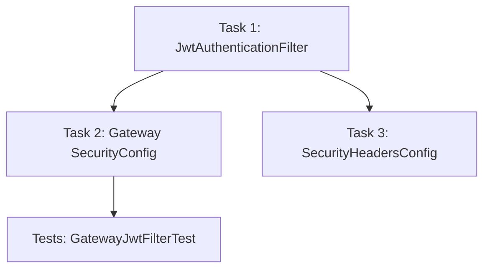
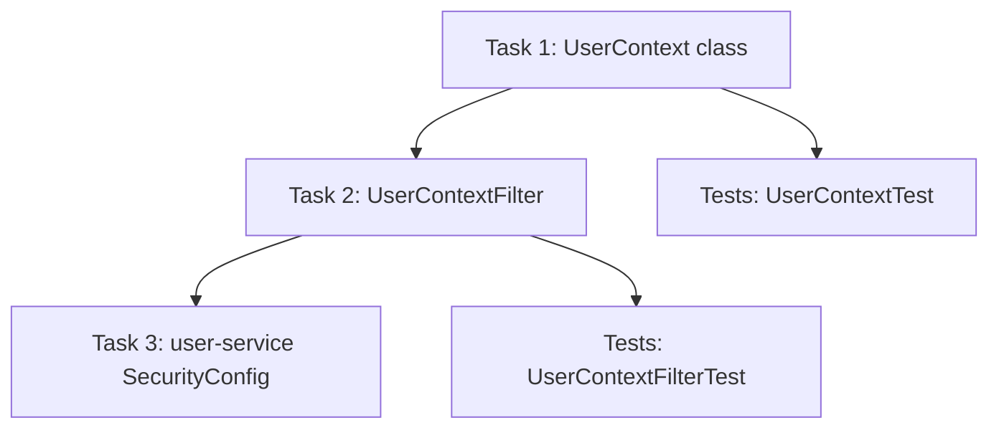

## Stories (continued)

---

### Story S1-004: Implement Gateway JWT Authentication Filter (5 points, P0)

**Points**: 5 | **Priority**: P0 | **Epic**: Security

#### Context

The API Gateway is the single trust boundary for the entire platform. Every non-public request
must carry a valid JWT in the `Authorization: Bearer <token>` header. The gateway validates
the token's signature and expiry, extracts `userId` and `roles` from the JWT claims, and
forwards them as `X-User-Id` and `X-User-Roles` headers to downstream services. Downstream
services NEVER re-validate the JWT -- they trust the gateway unconditionally.

This story creates three components:

1. **JwtAuthenticationFilter** -- a reactive `WebFilter` that intercepts every request, validates
   the JWT, and mutates the request to add trusted identity headers.
2. **Gateway SecurityConfig** -- the `@EnableWebFluxSecurity` configuration that defines public
   paths, role-based access rules, CORS, and wires the JWT filter into the security chain.
3. **SecurityHeadersConfig** -- a `WebFilter` that adds HTTP security headers (HSTS,
   X-Content-Type-Options, CSP, etc.) to every response.

The API Gateway uses **Spring WebFlux** (reactive stack) because Spring Cloud Gateway is built
on Project Reactor. This means all security components use reactive types (`Mono<Void>`,
`ServerWebExchange`, `WebFilter`) instead of the servlet-based types used in downstream services.

See `docs/architecture/05-security-architecture.md` sections 4, 5.1, and 5.2 for the full
specification.

#### Dependency Map



**Build order**: Task 1 (filter) --> Task 2 (security config wires the filter) --> Task 3 (headers) --> Tests

#### Tasks

| # | Task | File Path | What To Create | How To Verify |
|---|------|-----------|---------------|---------------|
| 1 | Create JwtAuthenticationFilter | `backend/api-gateway/src/main/java/com/familyhobbies/apigateway/security/JwtAuthenticationFilter.java` | WebFilter with JWT validation | Compiles |
| 2 | Create Gateway SecurityConfig | `backend/api-gateway/src/main/java/com/familyhobbies/apigateway/config/SecurityConfig.java` | @EnableWebFluxSecurity with route rules | Compiles |
| 3 | Create SecurityHeadersConfig | `backend/api-gateway/src/main/java/com/familyhobbies/apigateway/config/SecurityHeadersConfig.java` | WebFilter adding security headers | Compiles |

---

#### Task 1 Detail: Create JwtAuthenticationFilter

**What**: A reactive `WebFilter` implementation that intercepts every HTTP request at the API
Gateway level, checks if the path is public (skip authentication) or protected (require a
valid JWT), extracts identity claims from the token, and mutates the outgoing request to
include `X-User-Id` and `X-User-Roles` headers for downstream services.

**Where**: `backend/api-gateway/src/main/java/com/familyhobbies/apigateway/security/JwtAuthenticationFilter.java`

**Why**: This is the single point of JWT validation in the entire system. Without this filter,
any request could reach downstream services without authentication. The filter ensures that:
- Public paths (login, register, health checks, webhooks) pass through without a token.
- Protected paths without a token receive a `401 Unauthorized` JSON response.
- Expired tokens receive a `401` with `"Token expired"` message.
- Invalid tokens (bad signature, malformed) receive a `401` with `"Invalid token"` message.
- Valid tokens have their claims extracted and forwarded as trusted headers.

**Key design decisions**:
- Implements `org.springframework.web.server.WebFilter` (reactive), NOT `jakarta.servlet.Filter`.
- Uses `ServerWebExchange.mutate()` to add headers -- reactive exchanges are immutable.
- Returns `Mono<Void>` for error responses by writing directly to `ServerHttpResponse`.
- The `publicPaths` list uses prefix matching (`path.startsWith(...)`) so that all sub-paths
  under `/api/v1/auth/` are public.

**Content**:

```java
package com.familyhobbies.apigateway.security;

import org.springframework.http.HttpHeaders;
import org.springframework.http.HttpStatus;
import org.springframework.http.server.reactive.ServerHttpRequest;
import org.springframework.stereotype.Component;
import org.springframework.web.server.ServerWebExchange;
import org.springframework.web.server.WebFilter;
import org.springframework.web.server.WebFilterChain;
import reactor.core.publisher.Mono;

import java.nio.charset.StandardCharsets;
import java.time.Instant;
import java.util.List;

/**
 * Reactive WebFilter that validates JWT tokens on every non-public request.
 *
 * Responsibilities:
 * 1. Check if the request path is public (skip authentication).
 * 2. Extract the Bearer token from the Authorization header.
 * 3. Validate the token signature and expiry via JwtTokenProvider.
 * 4. Extract userId and roles from token claims.
 * 5. Mutate the request to add X-User-Id and X-User-Roles headers.
 * 6. Return 401 JSON error for expired, invalid, or missing tokens.
 *
 * This filter runs BEFORE Spring Security's authentication filter
 * (SecurityWebFiltersOrder.AUTHENTICATION) so that the security context
 * is populated before authorization rules are evaluated.
 */
@Component
public class JwtAuthenticationFilter implements WebFilter {

    private static final String BEARER_PREFIX = "Bearer ";
    private static final String HEADER_USER_ID = "X-User-Id";
    private static final String HEADER_USER_ROLES = "X-User-Roles";

    private final JwtTokenProvider jwtTokenProvider;

    /**
     * Public paths that do not require JWT authentication.
     * Matching is prefix-based: any path starting with one of these values is public.
     *
     * - /api/v1/auth/      -- login, register, refresh, forgot-password, reset-password
     * - /actuator/health    -- health check (used by Docker, Eureka, load balancers)
     * - /actuator/info      -- application info (non-sensitive)
     * - /api/v1/payments/webhook/ -- HelloAsso webhooks (authenticated via HMAC, not JWT)
     */
    private final List<String> publicPaths = List.of(
        "/api/v1/auth/",
        "/actuator/health",
        "/actuator/info",
        "/api/v1/payments/webhook/"
    );

    public JwtAuthenticationFilter(JwtTokenProvider jwtTokenProvider) {
        this.jwtTokenProvider = jwtTokenProvider;
    }

    @Override
    public Mono<Void> filter(ServerWebExchange exchange, WebFilterChain chain) {
        ServerHttpRequest request = exchange.getRequest();
        String path = request.getURI().getPath();

        // Step 1: Skip authentication for public paths
        if (isPublicPath(path)) {
            return chain.filter(exchange);
        }

        // Step 2: Extract Authorization header
        String authHeader = request.getHeaders().getFirst(HttpHeaders.AUTHORIZATION);

        if (authHeader == null || !authHeader.startsWith(BEARER_PREFIX)) {
            return unauthorizedResponse(exchange, "Missing or invalid Authorization header");
        }

        // Step 3: Extract the token (everything after "Bearer ")
        String token = authHeader.substring(BEARER_PREFIX.length());

        try {
            // Step 4: Validate token and extract claims
            var claims = jwtTokenProvider.validateToken(token);
            String userId = claims.getSubject();
            String roles = String.join(",", jwtTokenProvider.getRolesFromToken(token));

            // Step 5: Mutate request to add trusted headers for downstream services
            ServerHttpRequest mutatedRequest = request.mutate()
                .header(HEADER_USER_ID, userId)
                .header(HEADER_USER_ROLES, roles)
                .build();

            ServerWebExchange mutatedExchange = exchange.mutate()
                .request(mutatedRequest)
                .build();

            return chain.filter(mutatedExchange);

        } catch (io.jsonwebtoken.ExpiredJwtException e) {
            // Step 6a: Token has expired -- client should use refresh token
            return unauthorizedResponse(exchange, "Token expired");
        } catch (io.jsonwebtoken.JwtException e) {
            // Step 6b: Token is malformed, wrong signature, or otherwise invalid
            return unauthorizedResponse(exchange, "Invalid token");
        }
    }

    /**
     * Check if the given path matches any of the public path prefixes.
     * Uses String.startsWith() for prefix matching.
     */
    private boolean isPublicPath(String path) {
        return publicPaths.stream().anyMatch(path::startsWith);
    }

    /**
     * Build a 401 Unauthorized JSON response.
     * Writes directly to the response body using Reactor's Mono.
     * The JSON shape matches the ErrorResponse format used by GlobalExceptionHandler
     * so that the frontend can parse errors consistently.
     */
    private Mono<Void> unauthorizedResponse(ServerWebExchange exchange, String message) {
        exchange.getResponse().setStatusCode(HttpStatus.UNAUTHORIZED);
        exchange.getResponse().getHeaders().add("Content-Type", "application/json");

        String body = String.format(
            "{\"status\":401,\"error\":\"Unauthorized\",\"message\":\"%s\",\"timestamp\":\"%s\",\"path\":\"%s\"}",
            message,
            Instant.now().toString(),
            exchange.getRequest().getURI().getPath()
        );

        byte[] bytes = body.getBytes(StandardCharsets.UTF_8);
        var buffer = exchange.getResponse().bufferFactory().wrap(bytes);
        return exchange.getResponse().writeWith(Mono.just(buffer));
    }
}
```

**Verify**:

```bash
cd backend && mvn compile -pl api-gateway -q
# Expected: compiles without error
```

---

#### Task 2 Detail: Create Gateway SecurityConfig

**What**: Spring Security configuration for the API Gateway using `@EnableWebFluxSecurity`.
Defines which paths are public, which require specific roles, and which just require any
authenticated user. Also configures CORS and wires the `JwtAuthenticationFilter` into the
security filter chain.

**Where**: `backend/api-gateway/src/main/java/com/familyhobbies/apigateway/config/SecurityConfig.java`

**Why**: Without this configuration, Spring Security defaults to form-based login and session
management, which is completely wrong for a stateless JWT-based API gateway. This config:
- **Disables CSRF** because the API is stateless (no cookies, no sessions). CSRF protection
  is only needed when cookies carry authentication.
- **Disables form login and HTTP basic** because authentication is done via JWT in the
  Authorization header.
- **Defines public paths** so that unauthenticated users can register, login, browse
  associations, and access health endpoints.
- **Defines admin-only paths** for user management, sync triggers, and notification templates.
- **Defines association-only paths** for subscriber lists, attendance reports, and payment
  reports.
- **Configures CORS** to allow the Angular dev server (`http://localhost:4200`) and production
  origin to make cross-origin requests.

**Key design decisions**:
- Uses `ServerHttpSecurity` (reactive), NOT `HttpSecurity` (servlet).
- Uses `.authorizeExchange()` (reactive), NOT `.authorizeHttpRequests()` (servlet).
- Uses `SecurityWebFiltersOrder.AUTHENTICATION` to position the JWT filter before Spring
  Security's built-in authentication processing.
- The `CorsConfigurationSource` bean uses the reactive variant from
  `org.springframework.web.cors.reactive`.

**Content**:

```java
package com.familyhobbies.apigateway.config;

import com.familyhobbies.apigateway.security.JwtAuthenticationFilter;
import org.springframework.context.annotation.Bean;
import org.springframework.context.annotation.Configuration;
import org.springframework.http.HttpMethod;
import org.springframework.security.config.annotation.web.reactive.EnableWebFluxSecurity;
import org.springframework.security.config.web.server.SecurityWebFiltersOrder;
import org.springframework.security.config.web.server.ServerHttpSecurity;
import org.springframework.security.web.server.SecurityWebFilterChain;
import org.springframework.web.cors.CorsConfiguration;
import org.springframework.web.cors.reactive.CorsConfigurationSource;
import org.springframework.web.cors.reactive.UrlBasedCorsConfigurationSource;

import java.util.List;

/**
 * Spring Security configuration for the API Gateway (reactive stack).
 *
 * This is the ONLY place where JWT validation and route-level authorization
 * are configured. Downstream services do NOT duplicate these rules -- they
 * trust the gateway to have already validated the token and enforced access
 * control at the route level.
 *
 * Authorization layers:
 * 1. Gateway SecurityConfig (this class) -- route-level rules (permitAll, hasRole, authenticated)
 * 2. JwtAuthenticationFilter -- token validation and header injection
 * 3. Downstream service SecurityConfig -- defense-in-depth (requires authenticated context)
 * 4. Downstream service layer -- ownership checks via UserContext
 */
@Configuration
@EnableWebFluxSecurity
public class SecurityConfig {

    private final JwtAuthenticationFilter jwtAuthenticationFilter;

    public SecurityConfig(JwtAuthenticationFilter jwtAuthenticationFilter) {
        this.jwtAuthenticationFilter = jwtAuthenticationFilter;
    }

    @Bean
    public SecurityWebFilterChain securityFilterChain(ServerHttpSecurity http) {
        return http
            // ---------------------------------------------------------------
            // CSRF: disabled because this is a stateless JWT-based API.
            // No cookies are used for authentication, so CSRF is not a risk.
            // ---------------------------------------------------------------
            .csrf(ServerHttpSecurity.CsrfSpec::disable)

            // ---------------------------------------------------------------
            // CORS: allow Angular dev server and production origin.
            // Configured via corsConfigurationSource() bean below.
            // ---------------------------------------------------------------
            .cors(cors -> cors.configurationSource(corsConfigurationSource()))

            // ---------------------------------------------------------------
            // Disable form login and HTTP basic -- JWT only.
            // ---------------------------------------------------------------
            .formLogin(ServerHttpSecurity.FormLoginSpec::disable)
            .httpBasic(ServerHttpSecurity.HttpBasicSpec::disable)

            // ---------------------------------------------------------------
            // Authorization rules -- evaluated AFTER JwtAuthenticationFilter
            // has populated the SecurityContext.
            // ---------------------------------------------------------------
            .authorizeExchange(exchanges -> exchanges

                // ---- PUBLIC ENDPOINTS (no authentication required) ----

                // Auth endpoints: register, login, refresh, forgot-password, reset-password
                .pathMatchers("/api/v1/auth/**").permitAll()

                // Association directory: anyone can browse associations and activities
                .pathMatchers(HttpMethod.GET, "/api/v1/associations/**").permitAll()
                .pathMatchers(HttpMethod.GET, "/api/v1/activities/**").permitAll()

                // Association search: POST because search criteria are in the body
                .pathMatchers(HttpMethod.POST, "/api/v1/associations/search").permitAll()

                // HelloAsso webhook: secured via HMAC signature, not JWT
                .pathMatchers("/api/v1/payments/webhook/**").permitAll()

                // Actuator health/info: used by Docker, Eureka, load balancers
                .pathMatchers("/actuator/health", "/actuator/info").permitAll()

                // ---- ADMIN-ONLY ENDPOINTS ----

                // User management (list, get by id, update, delete, role changes)
                .pathMatchers("/api/v1/users/**").hasRole("ADMIN")

                // HelloAsso sync trigger (manual cache refresh)
                .pathMatchers(HttpMethod.POST, "/api/v1/associations/sync").hasRole("ADMIN")

                // Notification template management
                .pathMatchers("/api/v1/notifications/templates/**").hasRole("ADMIN")

                // Actuator metrics (Prometheus, detailed metrics)
                .pathMatchers("/actuator/metrics", "/actuator/prometheus").hasRole("ADMIN")

                // RGPD audit log (admin reviews all data access logs)
                .pathMatchers("/api/v1/rgpd/audit-log").hasRole("ADMIN")

                // ---- ASSOCIATION MANAGER ENDPOINTS ----

                // Subscriber lists for a specific association
                .pathMatchers("/api/v1/associations/*/subscribers").hasAnyRole("ASSOCIATION", "ADMIN")

                // Attendance reports (aggregated view)
                .pathMatchers("/api/v1/attendance/report").hasAnyRole("ASSOCIATION", "ADMIN")

                // Payment reports per association
                .pathMatchers("/api/v1/payments/association/**").hasAnyRole("ASSOCIATION", "ADMIN")

                // ---- ALL OTHER ENDPOINTS: require any authenticated user ----
                .anyExchange().authenticated()
            )

            // ---------------------------------------------------------------
            // Wire JwtAuthenticationFilter BEFORE the built-in authentication
            // filter so that the SecurityContext is populated before
            // authorization rules are evaluated.
            // ---------------------------------------------------------------
            .addFilterBefore(jwtAuthenticationFilter, SecurityWebFiltersOrder.AUTHENTICATION)

            .build();
    }

    /**
     * CORS configuration source.
     *
     * Allows the Angular dev server (localhost:4200) and production domain
     * to make cross-origin requests to the API Gateway.
     *
     * Applied to all /api/** paths. Non-API paths (actuator) do not need CORS
     * because they are not called from the browser.
     */
    @Bean
    public CorsConfigurationSource corsConfigurationSource() {
        CorsConfiguration config = new CorsConfiguration();

        // Allowed origins -- Angular dev server + production
        config.setAllowedOrigins(List.of(
            "http://localhost:4200",       // Angular dev server
            "https://familyhobbies.fr"     // Production origin
        ));

        // Allowed HTTP methods
        config.setAllowedMethods(List.of(
            "GET", "POST", "PUT", "PATCH", "DELETE", "OPTIONS"
        ));

        // Allowed request headers
        config.setAllowedHeaders(List.of(
            "Authorization",       // JWT token
            "Content-Type",        // application/json
            "X-Requested-With"     // AJAX marker
        ));

        // Headers exposed to the browser (readable via JavaScript)
        config.setExposedHeaders(List.of(
            "X-Total-Count",       // Pagination: total number of items
            "X-Correlation-Id"     // Request tracing
        ));

        // Allow credentials (cookies, authorization headers)
        config.setAllowCredentials(true);

        // Cache preflight response for 1 hour
        config.setMaxAge(3600L);

        UrlBasedCorsConfigurationSource source = new UrlBasedCorsConfigurationSource();
        source.registerCorsConfiguration("/api/**", config);
        return source;
    }
}
```

**Verify**:

```bash
cd backend && mvn compile -pl api-gateway -q
# Expected: compiles without error
```

---

#### Task 3 Detail: Create SecurityHeadersConfig

**What**: A reactive `WebFilter` bean that adds HTTP security headers to every response
returned by the API Gateway. These headers instruct browsers to enable security features
that mitigate common web attacks.

**Where**: `backend/api-gateway/src/main/java/com/familyhobbies/apigateway/config/SecurityHeadersConfig.java`

**Why**: Without these headers, browsers use default behavior that may be insecure:
- Without `X-Content-Type-Options: nosniff`, browsers may execute JavaScript disguised as
  another MIME type (MIME-sniffing attack).
- Without `X-Frame-Options: DENY`, the application could be embedded in a malicious iframe
  (clickjacking attack).
- Without `Strict-Transport-Security`, browsers may accept HTTP downgrade (protocol downgrade
  attack).
- Without `Content-Security-Policy`, any injected script can execute (XSS attack).
- Without `Referrer-Policy`, full URLs (including query parameters with tokens) may leak to
  external sites.
- Without `Permissions-Policy`, browser APIs the application does not need (camera, microphone,
  geolocation) remain available to potential attackers.

**Header reference**:

| Header | Value | Mitigates |
|--------|-------|-----------|
| `X-Content-Type-Options` | `nosniff` | MIME-type sniffing |
| `X-Frame-Options` | `DENY` | Clickjacking |
| `X-XSS-Protection` | `0` | Legacy XSS auditor (disabled -- CSP is better) |
| `Strict-Transport-Security` | `max-age=31536000; includeSubDomains; preload` | Protocol downgrade |
| `Content-Security-Policy` | (see code) | XSS, data injection |
| `Referrer-Policy` | `strict-origin-when-cross-origin` | URL leakage to external sites |
| `Permissions-Policy` | `camera=(), microphone=(), geolocation=()` | Unnecessary browser APIs |

**Content**:

```java
package com.familyhobbies.apigateway.config;

import org.springframework.context.annotation.Bean;
import org.springframework.context.annotation.Configuration;
import org.springframework.web.server.WebFilter;

/**
 * Adds HTTP security headers to every response returned by the API Gateway.
 *
 * These headers are set at the gateway level so that downstream services
 * do not need to configure them individually. All responses pass through
 * the gateway, so all responses get these headers.
 *
 * See docs/architecture/05-security-architecture.md section 10 for the
 * full specification and header descriptions.
 */
@Configuration
public class SecurityHeadersConfig {

    @Bean
    public WebFilter securityHeadersFilter() {
        return (exchange, chain) -> {
            // Prevent MIME-type sniffing -- browser must use declared Content-Type
            exchange.getResponse().getHeaders().add(
                "X-Content-Type-Options", "nosniff");

            // Prevent embedding in iframes -- mitigates clickjacking
            exchange.getResponse().getHeaders().add(
                "X-Frame-Options", "DENY");

            // Disable legacy XSS auditor -- modern CSP is more effective
            // and the legacy auditor can itself introduce vulnerabilities
            exchange.getResponse().getHeaders().add(
                "X-XSS-Protection", "0");

            // Force HTTPS for 1 year, including subdomains, eligible for preload
            exchange.getResponse().getHeaders().add(
                "Strict-Transport-Security",
                "max-age=31536000; includeSubDomains; preload");

            // Content Security Policy -- restrict allowed sources for all content types
            exchange.getResponse().getHeaders().add(
                "Content-Security-Policy",
                "default-src 'self'; "
                + "script-src 'self'; "
                + "style-src 'self' 'unsafe-inline'; "
                + "img-src 'self' data:; "
                + "font-src 'self'; "
                + "connect-src 'self' https://api.helloasso.com; "
                + "frame-ancestors 'none'; "
                + "base-uri 'self'; "
                + "form-action 'self'");

            // Limit referrer information sent to external sites
            exchange.getResponse().getHeaders().add(
                "Referrer-Policy", "strict-origin-when-cross-origin");

            // Disable browser APIs the application does not need
            exchange.getResponse().getHeaders().add(
                "Permissions-Policy", "camera=(), microphone=(), geolocation=()");

            return chain.filter(exchange);
        };
    }
}
```

**Verify**:

```bash
cd backend && mvn compile -pl api-gateway -q
# Expected: compiles without error
```

---

#### Failing Tests -- GatewayJwtFilterTest (TDD Contract)

**What**: Unit tests for `JwtAuthenticationFilter` using Spring WebFlux test utilities. These
tests verify the five critical behaviors of the filter:
1. Valid tokens forward with correct headers.
2. Expired tokens return 401 with "Token expired".
3. Invalid tokens return 401 with "Invalid token".
4. Missing auth headers on protected paths return 401.
5. Public paths bypass authentication entirely.

**Where**: `backend/api-gateway/src/test/java/com/familyhobbies/apigateway/security/JwtAuthenticationFilterTest.java`

**Why**: The JWT filter is the single trust boundary for the entire platform. If it has a bug
(for example, letting expired tokens through, or failing to add headers), the consequences
are catastrophic:
- An expired token passing through means a user who should be logged out still has access.
- Missing X-User-Id headers mean downstream services cannot identify the user.
- Public paths being blocked means users cannot register or login.

These tests use `MockServerWebExchange` to simulate HTTP requests without starting a full
server. The `JwtTokenProvider` is mocked so that tests do not depend on real JWT signing keys.

**Testing strategy**:
- `JwtTokenProvider` is mocked using Mockito.
- `MockServerWebExchange` creates fake reactive HTTP requests.
- A simple `WebFilterChain` stub captures the mutated exchange to verify headers.
- Assertions check HTTP status codes and response body JSON content.

**Content**:

```java
package com.familyhobbies.apigateway.security;

import io.jsonwebtoken.Claims;
import io.jsonwebtoken.ExpiredJwtException;
import io.jsonwebtoken.JwtException;
import io.jsonwebtoken.impl.DefaultClaims;
import org.junit.jupiter.api.BeforeEach;
import org.junit.jupiter.api.Test;
import org.junit.jupiter.api.extension.ExtendWith;
import org.mockito.Mock;
import org.mockito.junit.jupiter.MockitoExtension;
import org.springframework.http.HttpHeaders;
import org.springframework.http.HttpStatus;
import org.springframework.mock.http.server.reactive.MockServerHttpRequest;
import org.springframework.mock.web.server.MockServerWebExchange;
import org.springframework.web.server.WebFilterChain;
import reactor.core.publisher.Mono;

import java.util.List;
import java.util.concurrent.atomic.AtomicReference;

import static org.junit.jupiter.api.Assertions.*;
import static org.mockito.ArgumentMatchers.anyString;
import static org.mockito.Mockito.*;

/**
 * Unit tests for JwtAuthenticationFilter.
 *
 * These tests verify the five critical behaviors:
 * 1. Valid token -> forward with X-User-Id and X-User-Roles headers
 * 2. Expired token -> 401 with "Token expired"
 * 3. Invalid token -> 401 with "Invalid token"
 * 4. Missing Authorization header on protected path -> 401
 * 5. Public path -> bypass authentication (no token needed)
 *
 * Uses MockServerWebExchange (Spring WebFlux test utility) and Mockito
 * to mock JwtTokenProvider.
 */
@ExtendWith(MockitoExtension.class)
class JwtAuthenticationFilterTest {

    @Mock
    private JwtTokenProvider jwtTokenProvider;

    private JwtAuthenticationFilter filter;

    @BeforeEach
    void setUp() {
        filter = new JwtAuthenticationFilter(jwtTokenProvider);
    }

    /**
     * Test 1: A valid JWT token should result in the request being forwarded
     * to the next filter in the chain with X-User-Id and X-User-Roles headers
     * added to the mutated request.
     *
     * Setup:
     * - Request path: /api/v1/families/1 (protected)
     * - Authorization header: Bearer valid-token
     * - JwtTokenProvider.validateToken() returns claims with sub="42"
     * - JwtTokenProvider.getRolesFromToken() returns ["FAMILY"]
     *
     * Expected:
     * - The filter chain is invoked (request is forwarded)
     * - The mutated request has X-User-Id: 42
     * - The mutated request has X-User-Roles: FAMILY
     */
    @Test
    void validToken_shouldForwardRequestWithUserHeaders() {
        // Arrange: create a request with a valid Bearer token
        MockServerHttpRequest request = MockServerHttpRequest
            .get("/api/v1/families/1")
            .header(HttpHeaders.AUTHORIZATION, "Bearer valid-token")
            .build();
        MockServerWebExchange exchange = MockServerWebExchange.from(request);

        // Mock JwtTokenProvider to return valid claims
        Claims claims = new DefaultClaims();
        claims.setSubject("42");
        when(jwtTokenProvider.validateToken("valid-token")).thenReturn(claims);
        when(jwtTokenProvider.getRolesFromToken("valid-token")).thenReturn(List.of("FAMILY"));

        // Capture the mutated exchange passed to the next filter
        AtomicReference<MockServerWebExchange> capturedExchange = new AtomicReference<>();
        WebFilterChain chain = filterExchange -> {
            // We need to capture the exchange that is passed down the chain.
            // Since MockServerWebExchange does not support mutate() returning
            // another MockServerWebExchange, we verify via the token provider calls.
            return Mono.empty();
        };

        // Act
        filter.filter(exchange, chain).block();

        // Assert: verify that validateToken and getRolesFromToken were called
        verify(jwtTokenProvider).validateToken("valid-token");
        verify(jwtTokenProvider).getRolesFromToken("valid-token");

        // The filter should NOT have set a 401 status
        assertNotEquals(HttpStatus.UNAUTHORIZED, exchange.getResponse().getStatusCode());
    }

    /**
     * Test 2: An expired JWT token should return a 401 Unauthorized response
     * with a JSON body containing "Token expired".
     *
     * Setup:
     * - Request path: /api/v1/families/1 (protected)
     * - Authorization header: Bearer expired-token
     * - JwtTokenProvider.validateToken() throws ExpiredJwtException
     *
     * Expected:
     * - HTTP status: 401
     * - Response body contains "Token expired"
     * - The filter chain is NOT invoked (request is blocked)
     */
    @Test
    void expiredToken_shouldReturn401() {
        // Arrange
        MockServerHttpRequest request = MockServerHttpRequest
            .get("/api/v1/families/1")
            .header(HttpHeaders.AUTHORIZATION, "Bearer expired-token")
            .build();
        MockServerWebExchange exchange = MockServerWebExchange.from(request);

        // Mock JwtTokenProvider to throw ExpiredJwtException
        when(jwtTokenProvider.validateToken("expired-token"))
            .thenThrow(new ExpiredJwtException(null, null, "Token has expired"));

        // The chain should never be called
        WebFilterChain chain = filterExchange -> {
            fail("Filter chain should not be invoked for expired tokens");
            return Mono.empty();
        };

        // Act
        filter.filter(exchange, chain).block();

        // Assert
        assertEquals(HttpStatus.UNAUTHORIZED, exchange.getResponse().getStatusCode());
    }

    /**
     * Test 3: An invalid JWT token (bad signature, malformed) should return
     * a 401 Unauthorized response with "Invalid token".
     *
     * Setup:
     * - Request path: /api/v1/families/1 (protected)
     * - Authorization header: Bearer invalid-token
     * - JwtTokenProvider.validateToken() throws JwtException
     *
     * Expected:
     * - HTTP status: 401
     * - Response body contains "Invalid token"
     * - The filter chain is NOT invoked
     */
    @Test
    void invalidToken_shouldReturn401() {
        // Arrange
        MockServerHttpRequest request = MockServerHttpRequest
            .get("/api/v1/families/1")
            .header(HttpHeaders.AUTHORIZATION, "Bearer invalid-token")
            .build();
        MockServerWebExchange exchange = MockServerWebExchange.from(request);

        // Mock JwtTokenProvider to throw JwtException (bad signature)
        when(jwtTokenProvider.validateToken("invalid-token"))
            .thenThrow(new JwtException("Invalid JWT signature"));

        WebFilterChain chain = filterExchange -> {
            fail("Filter chain should not be invoked for invalid tokens");
            return Mono.empty();
        };

        // Act
        filter.filter(exchange, chain).block();

        // Assert
        assertEquals(HttpStatus.UNAUTHORIZED, exchange.getResponse().getStatusCode());
    }

    /**
     * Test 4: A request to a protected path without an Authorization header
     * should return a 401 Unauthorized response.
     *
     * Setup:
     * - Request path: /api/v1/families/1 (protected)
     * - No Authorization header
     *
     * Expected:
     * - HTTP status: 401
     * - Response body contains "Missing or invalid Authorization header"
     * - JwtTokenProvider is never called
     * - The filter chain is NOT invoked
     */
    @Test
    void missingAuthHeader_shouldReturn401ForProtectedPath() {
        // Arrange: no Authorization header
        MockServerHttpRequest request = MockServerHttpRequest
            .get("/api/v1/families/1")
            .build();
        MockServerWebExchange exchange = MockServerWebExchange.from(request);

        WebFilterChain chain = filterExchange -> {
            fail("Filter chain should not be invoked when Authorization header is missing");
            return Mono.empty();
        };

        // Act
        filter.filter(exchange, chain).block();

        // Assert
        assertEquals(HttpStatus.UNAUTHORIZED, exchange.getResponse().getStatusCode());

        // Verify JwtTokenProvider was never called
        verifyNoInteractions(jwtTokenProvider);
    }

    /**
     * Test 5: A request to a public path should bypass authentication entirely.
     * No token is needed, no validation occurs, the request passes through.
     *
     * Setup:
     * - Request path: /api/v1/auth/login (public)
     * - No Authorization header
     *
     * Expected:
     * - The filter chain IS invoked (request passes through)
     * - JwtTokenProvider is never called
     * - No 401 status is set
     */
    @Test
    void publicPath_shouldBypassAuthentication() {
        // Arrange: public path, no token
        MockServerHttpRequest request = MockServerHttpRequest
            .post("/api/v1/auth/login")
            .build();
        MockServerWebExchange exchange = MockServerWebExchange.from(request);

        // Track whether chain.filter() was called
        AtomicReference<Boolean> chainCalled = new AtomicReference<>(false);
        WebFilterChain chain = filterExchange -> {
            chainCalled.set(true);
            return Mono.empty();
        };

        // Act
        filter.filter(exchange, chain).block();

        // Assert: chain was invoked (request passed through)
        assertTrue(chainCalled.get(), "Filter chain should be invoked for public paths");

        // JwtTokenProvider should never be called for public paths
        verifyNoInteractions(jwtTokenProvider);

        // No error status should be set
        assertNotEquals(HttpStatus.UNAUTHORIZED, exchange.getResponse().getStatusCode());
    }
}
```

**Verify**:

```bash
cd backend && mvn test -pl api-gateway -Dtest=JwtAuthenticationFilterTest
# Expected: 5 tests run, 5 pass (after implementation is complete)
# Before implementation: 5 tests run, 5 FAIL (TDD red phase)
```

---

### Story S1-005: Implement Downstream UserContext Filter (3 points, P0)

**Points**: 3 | **Priority**: P0 | **Epic**: Security

#### Context

Downstream services (user-service, association-service, payment-service, notification-service)
trust the API Gateway. They NEVER validate JWT tokens themselves. Instead, they read the
`X-User-Id` and `X-User-Roles` headers that the gateway's `JwtAuthenticationFilter` injected
after successful JWT validation.

The `UserContextFilter` runs as a servlet filter in each downstream service. It:
1. Reads `X-User-Id` and `X-User-Roles` from the incoming request headers.
2. Parses the roles into Spring Security `SimpleGrantedAuthority` objects (with `ROLE_` prefix).
3. Sets the Spring `SecurityContext` with a `UsernamePasswordAuthenticationToken` so that
   `@PreAuthorize`, `hasRole()`, and `hasAnyRole()` annotations work correctly.
4. Sets a `ThreadLocal`-based `UserContext` so that service-layer code can call
   `UserContext.get().getUserId()` to identify the current user.
5. ALWAYS clears both contexts in a `finally` block to prevent ThreadLocal memory leaks.

This code lives in the **common library** (`backend/common/`) so that all downstream services
get it automatically by depending on common. Each service only needs to wire the filter in
its own `SecurityConfig`.

**Important architectural distinction**:
- The API Gateway uses **Spring WebFlux** (reactive) -- `WebFilter`, `ServerWebExchange`, `Mono<Void>`.
- Downstream services use **Spring MVC** (servlet) -- `OncePerRequestFilter`, `HttpServletRequest`, `FilterChain`.
- These are different filter APIs. Do NOT mix them.

See `docs/architecture/05-security-architecture.md` sections 6.1 and 6.2 for the full
specification.

#### Dependency Map



**Build order**: Task 1 (UserContext) --> Task 2 (UserContextFilter uses UserContext) --> Task 3 (SecurityConfig wires the filter) --> Tests

#### Tasks

| # | Task | File Path | What To Create | How To Verify |
|---|------|-----------|---------------|---------------|
| 1 | Create UserContext | `backend/common/src/main/java/com/familyhobbies/common/security/UserContext.java` | ThreadLocal holder | Compiles |
| 2 | Create UserContextFilter | `backend/common/src/main/java/com/familyhobbies/common/security/UserContextFilter.java` | OncePerRequestFilter | Compiles |
| 3 | Update user-service SecurityConfig | `backend/user-service/src/main/java/com/familyhobbies/userservice/config/SecurityConfig.java` | Wire UserContextFilter | Compiles |

---

#### Task 1 Detail: Create UserContext

**What**: A `ThreadLocal`-based holder that stores the current user's identity (userId and
roles) for the duration of a single HTTP request. Service-layer code uses
`UserContext.get().getUserId()` to identify the current user without any dependency on
JWT libraries or HTTP request objects.

**Where**: `backend/common/src/main/java/com/familyhobbies/common/security/UserContext.java`

**Why**: Without UserContext, every service method that needs the current user's identity
would have to accept `HttpServletRequest` as a parameter and manually parse headers. This
creates tight coupling between business logic and the HTTP layer. UserContext provides a clean
abstraction:
- Service code calls `UserContext.get().getUserId()` -- no HTTP dependency.
- Service code calls `UserContext.get().hasRole("ADMIN")` -- no Spring Security dependency.
- The `ThreadLocal` ensures thread safety -- each request gets its own context.
- The `clear()` method (called in `finally` block by UserContextFilter) prevents memory leaks
  in servlet containers that reuse threads.

**Key design decisions**:
- `UserContext` is a `final` class -- it is not meant to be subclassed.
- The `ThreadLocal` is `private static final` -- one instance shared across all threads, but
  each thread sees its own value.
- `get()` throws `IllegalStateException` if the context was not set -- this catches bugs early
  where a service endpoint is called without going through the filter.
- `roles` is a `List<String>` (not a `Set`) to preserve order, though order is not semantically
  important.
- `isAdmin()` is a convenience method that checks `hasRole("ADMIN")`.

**Content**:

```java
package com.familyhobbies.common.security;

import java.util.List;

/**
 * ThreadLocal holder for the current user's identity.
 *
 * Set by UserContextFilter at the start of each request.
 * Cleared by UserContextFilter in a finally block after the request completes.
 *
 * Usage in service layer:
 *   UserContext ctx = UserContext.get();
 *   Long userId = ctx.getUserId();
 *   boolean isAdmin = ctx.isAdmin();
 *   boolean canManageAssociation = ctx.hasRole("ASSOCIATION");
 *
 * NEVER create a UserContext directly in business code -- it should only
 * be created by UserContextFilter based on gateway-injected headers.
 */
public final class UserContext {

    private static final ThreadLocal<UserContext> CURRENT = new ThreadLocal<>();

    private final Long userId;
    private final List<String> roles;

    public UserContext(Long userId, List<String> roles) {
        this.userId = userId;
        this.roles = roles;
    }

    /**
     * Store the UserContext for the current thread.
     * Called by UserContextFilter at the start of each request.
     */
    public static void set(UserContext context) {
        CURRENT.set(context);
    }

    /**
     * Retrieve the UserContext for the current thread.
     * Throws IllegalStateException if not set -- this means the request
     * did not go through UserContextFilter, which is a configuration bug.
     */
    public static UserContext get() {
        UserContext ctx = CURRENT.get();
        if (ctx == null) {
            throw new IllegalStateException(
                "UserContext not set -- is UserContextFilter registered?");
        }
        return ctx;
    }

    /**
     * Remove the UserContext from the current thread.
     * MUST be called in a finally block to prevent ThreadLocal memory leaks
     * in servlet containers that reuse threads via thread pools.
     */
    public static void clear() {
        CURRENT.remove();
    }

    /**
     * Get the authenticated user's ID (primary key from t_user table).
     */
    public Long getUserId() {
        return userId;
    }

    /**
     * Get the authenticated user's roles (e.g., ["FAMILY"], ["FAMILY", "ADMIN"]).
     */
    public List<String> getRoles() {
        return roles;
    }

    /**
     * Check if the current user has a specific role.
     * Role names do NOT include the "ROLE_" prefix -- that prefix is only
     * used internally by Spring Security's GrantedAuthority system.
     *
     * Example: hasRole("ADMIN") checks if "ADMIN" is in the roles list.
     */
    public boolean hasRole(String role) {
        return roles.contains(role);
    }

    /**
     * Convenience method: check if the current user is an admin.
     * Equivalent to hasRole("ADMIN").
     */
    public boolean isAdmin() {
        return hasRole("ADMIN");
    }
}
```

**Verify**:

```bash
cd backend && mvn compile -pl common -q
# Expected: compiles without error
```

---

#### Task 2 Detail: Create UserContextFilter

**What**: A servlet-based `OncePerRequestFilter` that extracts `X-User-Id` and `X-User-Roles`
headers from incoming requests and populates both the Spring `SecurityContext` and the
`ThreadLocal`-based `UserContext`.

**Where**: `backend/common/src/main/java/com/familyhobbies/common/security/UserContextFilter.java`

**Why**: Downstream services need two things from the authenticated user:
1. **Spring SecurityContext** -- so that `@PreAuthorize("hasRole('ADMIN')")` and
   `SecurityContextHolder.getContext().getAuthentication()` work correctly.
2. **UserContext ThreadLocal** -- so that service-layer business logic can call
   `UserContext.get().getUserId()` without depending on Spring Security or HTTP APIs.

The filter bridges the gap between the gateway's header injection and the downstream service's
security and business logic layers.

**Key design decisions**:
- Extends `OncePerRequestFilter` (servlet) because downstream services use Spring MVC.
- Only populates the context when BOTH `X-User-Id` and `X-User-Roles` headers are present.
  If headers are missing (e.g., a public endpoint that the gateway forwarded without
  authentication), the context is not set and the request proceeds without authentication.
- Roles are prefixed with `ROLE_` when creating `SimpleGrantedAuthority` objects because
  Spring Security's `hasRole("ADMIN")` internally checks for `ROLE_ADMIN`.
- The `finally` block ALWAYS clears both `UserContext` and `SecurityContextHolder` to prevent
  ThreadLocal memory leaks in thread-pool-based servlet containers.

**Content**:

```java
package com.familyhobbies.common.security;

import jakarta.servlet.FilterChain;
import jakarta.servlet.ServletException;
import jakarta.servlet.http.HttpServletRequest;
import jakarta.servlet.http.HttpServletResponse;
import org.springframework.security.authentication.UsernamePasswordAuthenticationToken;
import org.springframework.security.core.authority.SimpleGrantedAuthority;
import org.springframework.security.core.context.SecurityContextHolder;
import org.springframework.stereotype.Component;
import org.springframework.web.filter.OncePerRequestFilter;

import java.io.IOException;
import java.util.Arrays;
import java.util.Collections;
import java.util.List;

/**
 * Servlet filter that extracts user identity from gateway-injected headers
 * and populates both Spring SecurityContext and ThreadLocal UserContext.
 *
 * This filter is registered in every downstream service's SecurityConfig
 * BEFORE UsernamePasswordAuthenticationFilter so that the security context
 * is populated before Spring Security's authorization checks.
 *
 * Header contract (set by API Gateway's JwtAuthenticationFilter):
 * - X-User-Id: the authenticated user's ID (string representation of Long)
 * - X-User-Roles: comma-separated role names (e.g., "FAMILY" or "FAMILY,ADMIN")
 *
 * If both headers are present, the filter:
 * 1. Parses roles into SimpleGrantedAuthority list (with ROLE_ prefix)
 * 2. Creates UsernamePasswordAuthenticationToken and sets SecurityContext
 * 3. Creates UserContext and sets ThreadLocal
 *
 * If either header is missing, the filter passes the request through without
 * setting any context (the endpoint may be public, or the gateway may have
 * already rejected the request).
 *
 * The finally block ALWAYS clears both contexts to prevent memory leaks.
 */
@Component
public class UserContextFilter extends OncePerRequestFilter {

    private static final String HEADER_USER_ID = "X-User-Id";
    private static final String HEADER_USER_ROLES = "X-User-Roles";

    @Override
    protected void doFilterInternal(
            HttpServletRequest request,
            HttpServletResponse response,
            FilterChain filterChain) throws ServletException, IOException {

        String userId = request.getHeader(HEADER_USER_ID);
        String roles = request.getHeader(HEADER_USER_ROLES);

        if (userId != null && roles != null) {
            // Step 1: Parse roles into Spring Security authorities
            // Spring Security's hasRole("ADMIN") checks for "ROLE_ADMIN",
            // so we must add the "ROLE_" prefix here.
            List<SimpleGrantedAuthority> authorities = Arrays.stream(roles.split(","))
                .map(String::trim)
                .map(role -> new SimpleGrantedAuthority("ROLE_" + role))
                .toList();

            // Step 2: Set Spring SecurityContext
            // principal = userId (Long), credentials = null (not needed),
            // authorities = parsed roles
            var authentication = new UsernamePasswordAuthenticationToken(
                Long.valueOf(userId),   // principal = userId
                null,                   // credentials (not needed -- gateway already validated JWT)
                authorities
            );
            SecurityContextHolder.getContext().setAuthentication(authentication);

            // Step 3: Set ThreadLocal UserContext for business logic access
            UserContext.set(new UserContext(Long.valueOf(userId), parseRoles(roles)));
        }

        try {
            // Step 4: Continue the filter chain (invoke the next filter or the servlet)
            filterChain.doFilter(request, response);
        } finally {
            // Step 5: ALWAYS clear both contexts to prevent ThreadLocal memory leaks.
            // Servlet containers reuse threads from a thread pool. If we do not clear
            // the ThreadLocal, a subsequent request on the same thread could see stale
            // user data from a previous request.
            UserContext.clear();
            SecurityContextHolder.clearContext();
        }
    }

    /**
     * Parse a comma-separated roles string into a List of role names.
     * Returns an empty list if the input is null or blank.
     *
     * Example: "FAMILY,ADMIN" -> ["FAMILY", "ADMIN"]
     */
    private List<String> parseRoles(String roles) {
        if (roles == null || roles.isBlank()) {
            return Collections.emptyList();
        }
        return Arrays.stream(roles.split(","))
            .map(String::trim)
            .toList();
    }
}
```

**Verify**:

```bash
cd backend && mvn compile -pl common -q
# Expected: compiles without error
```

---

#### Task 3 Detail: Update user-service SecurityConfig

**What**: Spring Security configuration for user-service using `@EnableWebSecurity` (servlet
stack). Wires the `UserContextFilter` into the security filter chain, configures stateless
session management, and defines endpoint access rules.

**Where**: `backend/user-service/src/main/java/com/familyhobbies/userservice/config/SecurityConfig.java`

**Why**: Without this configuration, user-service would use Spring Security's default behavior
(form login, sessions, CSRF), which is wrong for a stateless microservice behind a JWT gateway.
This config:
- **Stateless session management** -- no `JSESSIONID` cookie is created.
- **CSRF disabled** -- user-service is behind the gateway and does not use cookies.
- **Auth endpoints are public** -- `/api/v1/auth/**` must be accessible without authentication
  because users need to register and login before they have a token.
- **Actuator health/info are public** -- used by Docker health checks and Eureka.
- **All other endpoints require authentication** -- the `UserContextFilter` must have
  populated the SecurityContext from gateway headers.
- **UserContextFilter is positioned BEFORE UsernamePasswordAuthenticationFilter** -- this
  ensures the SecurityContext is populated before Spring Security evaluates authorization rules.
- **BCryptPasswordEncoder(12)** -- used for hashing passwords during registration and
  verifying during login. Strength 12 provides approximately 250ms hash time.

**Key design decisions**:
- User-service is the ONLY downstream service that has a `PasswordEncoder` bean because it
  is the ONLY service that handles passwords.
- `@EnableMethodSecurity` enables `@PreAuthorize` annotations at the method level for
  fine-grained access control in controllers and services.
- The filter import is `com.familyhobbies.common.security.UserContextFilter` from the common
  library, NOT a local class.

**Content**:

```java
package com.familyhobbies.userservice.config;

import com.familyhobbies.common.security.UserContextFilter;
import org.springframework.context.annotation.Bean;
import org.springframework.context.annotation.Configuration;
import org.springframework.security.config.annotation.method.configuration.EnableMethodSecurity;
import org.springframework.security.config.annotation.web.builders.HttpSecurity;
import org.springframework.security.config.annotation.web.configuration.EnableWebSecurity;
import org.springframework.security.config.http.SessionCreationPolicy;
import org.springframework.security.crypto.bcrypt.BCryptPasswordEncoder;
import org.springframework.security.crypto.password.PasswordEncoder;
import org.springframework.security.web.SecurityFilterChain;
import org.springframework.security.web.authentication.UsernamePasswordAuthenticationFilter;

/**
 * Spring Security configuration for user-service (servlet stack).
 *
 * user-service is behind the API Gateway which has already validated
 * the JWT token. This SecurityConfig provides defense-in-depth by
 * requiring authentication for non-public endpoints and wiring the
 * UserContextFilter to populate the SecurityContext from gateway headers.
 *
 * user-service is unique among downstream services because it:
 * 1. Has auth endpoints (/api/v1/auth/**) that are public.
 * 2. Needs a PasswordEncoder for registration and login.
 * 3. Contains the JwtTokenProvider that generates tokens.
 */
@Configuration
@EnableWebSecurity
@EnableMethodSecurity
public class SecurityConfig {

    private final UserContextFilter userContextFilter;

    public SecurityConfig(UserContextFilter userContextFilter) {
        this.userContextFilter = userContextFilter;
    }

    @Bean
    public SecurityFilterChain securityFilterChain(HttpSecurity http) throws Exception {
        return http
            // ---------------------------------------------------------------
            // Stateless session management -- no JSESSIONID cookie.
            // Each request is independently authenticated via gateway headers.
            // ---------------------------------------------------------------
            .sessionManagement(session ->
                session.sessionCreationPolicy(SessionCreationPolicy.STATELESS))

            // ---------------------------------------------------------------
            // CSRF disabled -- user-service is behind the gateway and uses
            // JWT authentication (no cookies), so CSRF is not applicable.
            // ---------------------------------------------------------------
            .csrf(csrf -> csrf.disable())

            // ---------------------------------------------------------------
            // Disable form login and HTTP basic -- not used in microservices.
            // ---------------------------------------------------------------
            .formLogin(form -> form.disable())
            .httpBasic(basic -> basic.disable())

            // ---------------------------------------------------------------
            // Authorization rules (defense-in-depth).
            // The gateway also enforces these rules, but we repeat them here
            // to protect against misconfiguration at the gateway level.
            // ---------------------------------------------------------------
            .authorizeHttpRequests(auth -> auth
                // Auth endpoints are public -- users register and login here
                .requestMatchers("/api/v1/auth/**").permitAll()

                // Actuator health/info -- used by Docker and Eureka
                .requestMatchers("/actuator/health", "/actuator/info").permitAll()

                // All other endpoints require authentication
                .anyRequest().authenticated()
            )

            // ---------------------------------------------------------------
            // Wire UserContextFilter BEFORE UsernamePasswordAuthenticationFilter.
            // This ensures the SecurityContext is populated from gateway headers
            // before Spring Security evaluates authorization rules.
            // ---------------------------------------------------------------
            .addFilterBefore(userContextFilter, UsernamePasswordAuthenticationFilter.class)

            .build();
    }

    /**
     * Password encoder using BCrypt with strength 12.
     *
     * Strength 12 means 2^12 = 4096 hash iterations, producing approximately
     * 250ms hash time on modern hardware. This balances security (resistant to
     * brute-force attacks) against user experience (login latency).
     *
     * This bean is ONLY needed in user-service because it is the only service
     * that handles password hashing (registration) and verification (login).
     */
    @Bean
    public PasswordEncoder passwordEncoder() {
        return new BCryptPasswordEncoder(12);
    }
}
```

**Verify**:

```bash
cd backend && mvn compile -pl user-service -q
# Expected: compiles without error
```

---

#### Failing Tests -- UserContextFilterTest (TDD Contract)

**What**: Unit tests for `UserContextFilter` using Spring MVC test utilities
(`MockHttpServletRequest`, `MockHttpServletResponse`, `MockFilterChain`). These tests verify
the five critical behaviors of the filter.

**Where**: `backend/common/src/test/java/com/familyhobbies/common/security/UserContextFilterTest.java`

**Why**: The UserContextFilter is the foundation of all downstream security. If it has a bug:
- Missing `ROLE_` prefix means `@PreAuthorize("hasRole('ADMIN')")` silently fails -- admin
  endpoints become inaccessible even to admins.
- Not clearing ThreadLocal means user A's request could see user B's identity on the same
  thread -- a critical security vulnerability.
- Not setting SecurityContext means all `authenticated()` rules fail -- every non-public
  endpoint returns 403.

These tests use `MockHttpServletRequest` (not a real HTTP server) for fast, isolated unit
testing. The filter is tested in isolation without Spring Boot context loading.

**Testing strategy**:
- Create `MockHttpServletRequest` with controlled headers.
- Create `MockHttpServletResponse` and `MockFilterChain`.
- Call `filter.doFilter(request, response, chain)` directly.
- Inside `MockFilterChain`, capture `SecurityContextHolder` and `UserContext` state.
- After the filter completes, verify that contexts are cleared.

**Content**:

```java
package com.familyhobbies.common.security;

import jakarta.servlet.FilterChain;
import jakarta.servlet.ServletException;
import org.junit.jupiter.api.BeforeEach;
import org.junit.jupiter.api.Test;
import org.springframework.mock.web.MockFilterChain;
import org.springframework.mock.web.MockHttpServletRequest;
import org.springframework.mock.web.MockHttpServletResponse;
import org.springframework.security.core.context.SecurityContextHolder;

import java.io.IOException;
import java.util.concurrent.atomic.AtomicReference;

import static org.junit.jupiter.api.Assertions.*;

/**
 * Unit tests for UserContextFilter.
 *
 * These tests verify:
 * 1. UserContext is populated from X-User-Id and X-User-Roles headers.
 * 2. Spring SecurityContext is set with correct authorities (ROLE_ prefix).
 * 3. Both contexts are cleared after the request completes.
 * 4. Missing headers result in no context being set.
 * 5. Multiple comma-separated roles are parsed correctly.
 *
 * Uses MockHttpServletRequest/Response (Spring Test utilities) for
 * fast, isolated unit testing without starting a server.
 */
class UserContextFilterTest {

    private UserContextFilter filter;
    private MockHttpServletRequest request;
    private MockHttpServletResponse response;

    @BeforeEach
    void setUp() {
        filter = new UserContextFilter();
        request = new MockHttpServletRequest();
        response = new MockHttpServletResponse();

        // Ensure clean state before each test
        SecurityContextHolder.clearContext();
        UserContext.clear();
    }

    /**
     * Test 1: When X-User-Id and X-User-Roles headers are present, the filter
     * should populate UserContext with the correct userId and roles.
     *
     * Setup:
     * - X-User-Id: 1
     * - X-User-Roles: FAMILY
     *
     * Expected:
     * - Inside the filter chain, UserContext.get().getUserId() returns 1
     * - Inside the filter chain, UserContext.get().getRoles() contains "FAMILY"
     */
    @Test
    void shouldPopulateUserContextFromHeaders() throws ServletException, IOException {
        // Arrange
        request.addHeader("X-User-Id", "1");
        request.addHeader("X-User-Roles", "FAMILY");

        // Capture UserContext inside the filter chain (before cleanup)
        AtomicReference<Long> capturedUserId = new AtomicReference<>();
        AtomicReference<java.util.List<String>> capturedRoles = new AtomicReference<>();

        FilterChain chain = (req, res) -> {
            UserContext ctx = UserContext.get();
            capturedUserId.set(ctx.getUserId());
            capturedRoles.set(ctx.getRoles());
        };

        // Act
        filter.doFilter(request, response, chain);

        // Assert
        assertEquals(1L, capturedUserId.get());
        assertNotNull(capturedRoles.get());
        assertEquals(1, capturedRoles.get().size());
        assertTrue(capturedRoles.get().contains("FAMILY"));
    }

    /**
     * Test 2: The filter should set Spring SecurityContext with an authentication
     * token that has the correct authorities. Authorities must have the ROLE_
     * prefix because Spring Security's hasRole("ADMIN") checks for "ROLE_ADMIN".
     *
     * Setup:
     * - X-User-Id: 42
     * - X-User-Roles: ADMIN
     *
     * Expected:
     * - SecurityContextHolder has a non-null authentication
     * - Authentication principal is 42 (Long)
     * - Authentication authorities contain "ROLE_ADMIN"
     */
    @Test
    void shouldSetSpringSecurityContext() throws ServletException, IOException {
        // Arrange
        request.addHeader("X-User-Id", "42");
        request.addHeader("X-User-Roles", "ADMIN");

        // Capture SecurityContext inside the filter chain
        AtomicReference<Object> capturedPrincipal = new AtomicReference<>();
        AtomicReference<java.util.Collection<?>> capturedAuthorities = new AtomicReference<>();

        FilterChain chain = (req, res) -> {
            var auth = SecurityContextHolder.getContext().getAuthentication();
            assertNotNull(auth, "Authentication should be set in SecurityContext");
            capturedPrincipal.set(auth.getPrincipal());
            capturedAuthorities.set(auth.getAuthorities());
        };

        // Act
        filter.doFilter(request, response, chain);

        // Assert
        assertEquals(42L, capturedPrincipal.get());
        assertNotNull(capturedAuthorities.get());

        boolean hasAdminRole = capturedAuthorities.get().stream()
            .anyMatch(a -> a.toString().equals("ROLE_ADMIN"));
        assertTrue(hasAdminRole, "Authorities should contain ROLE_ADMIN");
    }

    /**
     * Test 3: After doFilter completes, both UserContext (ThreadLocal) and
     * SecurityContextHolder must be cleared. This prevents memory leaks and
     * cross-request data contamination in thread-pool-based servlet containers.
     *
     * Setup:
     * - X-User-Id: 1
     * - X-User-Roles: FAMILY
     *
     * Expected:
     * - After filter.doFilter() returns, UserContext.get() throws IllegalStateException
     * - After filter.doFilter() returns, SecurityContextHolder.getContext().getAuthentication() is null
     */
    @Test
    void shouldClearContextAfterRequest() throws ServletException, IOException {
        // Arrange
        request.addHeader("X-User-Id", "1");
        request.addHeader("X-User-Roles", "FAMILY");

        FilterChain chain = (req, res) -> {
            // Verify context IS set during the request
            assertNotNull(UserContext.get());
            assertNotNull(SecurityContextHolder.getContext().getAuthentication());
        };

        // Act
        filter.doFilter(request, response, chain);

        // Assert: contexts are cleared AFTER doFilter returns
        assertThrows(IllegalStateException.class, UserContext::get,
            "UserContext should be cleared after request");
        assertNull(SecurityContextHolder.getContext().getAuthentication(),
            "SecurityContext should be cleared after request");
    }

    /**
     * Test 4: When X-User-Id and X-User-Roles headers are missing, the filter
     * should NOT set any context. The request should proceed without authentication.
     * This is the normal case for public endpoints (e.g., /api/v1/auth/login)
     * where the gateway forwards the request without injecting headers.
     *
     * Setup:
     * - No X-User-Id header
     * - No X-User-Roles header
     *
     * Expected:
     * - Inside the filter chain, SecurityContextHolder has no authentication
     * - Inside the filter chain, UserContext.get() throws IllegalStateException
     * - The request proceeds (filter chain is invoked)
     */
    @Test
    void missingHeaders_shouldNotSetContext() throws ServletException, IOException {
        // Arrange: no headers set on request

        AtomicReference<Boolean> chainCalled = new AtomicReference<>(false);

        FilterChain chain = (req, res) -> {
            chainCalled.set(true);

            // SecurityContext should not have authentication
            assertNull(SecurityContextHolder.getContext().getAuthentication(),
                "SecurityContext should not be set when headers are missing");

            // UserContext should not be set
            assertThrows(IllegalStateException.class, UserContext::get,
                "UserContext should not be set when headers are missing");
        };

        // Act
        filter.doFilter(request, response, chain);

        // Assert: chain was called (request proceeded)
        assertTrue(chainCalled.get(), "Filter chain should be invoked even without headers");
    }

    /**
     * Test 5: When X-User-Roles contains multiple comma-separated roles, all
     * roles should be parsed correctly into both UserContext and SecurityContext.
     *
     * Setup:
     * - X-User-Id: 99
     * - X-User-Roles: FAMILY,ADMIN
     *
     * Expected:
     * - UserContext has roles ["FAMILY", "ADMIN"]
     * - SecurityContext has authorities [ROLE_FAMILY, ROLE_ADMIN]
     */
    @Test
    void multipleRoles_shouldParseCorrectly() throws ServletException, IOException {
        // Arrange
        request.addHeader("X-User-Id", "99");
        request.addHeader("X-User-Roles", "FAMILY,ADMIN");

        AtomicReference<java.util.List<String>> capturedRoles = new AtomicReference<>();
        AtomicReference<java.util.Collection<?>> capturedAuthorities = new AtomicReference<>();

        FilterChain chain = (req, res) -> {
            UserContext ctx = UserContext.get();
            capturedRoles.set(ctx.getRoles());

            var auth = SecurityContextHolder.getContext().getAuthentication();
            capturedAuthorities.set(auth.getAuthorities());
        };

        // Act
        filter.doFilter(request, response, chain);

        // Assert: UserContext has both roles
        assertNotNull(capturedRoles.get());
        assertEquals(2, capturedRoles.get().size());
        assertTrue(capturedRoles.get().contains("FAMILY"));
        assertTrue(capturedRoles.get().contains("ADMIN"));

        // Assert: SecurityContext has both authorities with ROLE_ prefix
        assertNotNull(capturedAuthorities.get());
        assertEquals(2, capturedAuthorities.get().size());

        boolean hasFamilyRole = capturedAuthorities.get().stream()
            .anyMatch(a -> a.toString().equals("ROLE_FAMILY"));
        boolean hasAdminRole = capturedAuthorities.get().stream()
            .anyMatch(a -> a.toString().equals("ROLE_ADMIN"));
        assertTrue(hasFamilyRole, "Should have ROLE_FAMILY authority");
        assertTrue(hasAdminRole, "Should have ROLE_ADMIN authority");
    }
}
```

**Verify**:

```bash
cd backend && mvn test -pl common -Dtest=UserContextFilterTest
# Expected: 5 tests run, 5 pass (after implementation is complete)
# Before implementation: 5 tests run, 5 FAIL (TDD red phase)
```

---

#### Failing Tests -- UserContextTest (TDD Contract)

**What**: Unit tests for the `UserContext` class itself, verifying its ThreadLocal behavior,
accessor methods, and edge cases.

**Where**: `backend/common/src/test/java/com/familyhobbies/common/security/UserContextTest.java`

**Why**: UserContext is the identity API used by all service-layer code. If `getUserId()`
returns the wrong value, ownership checks fail. If `isAdmin()` returns a false positive,
non-admin users get admin access. If `clear()` does not actually remove the ThreadLocal,
user identity leaks across requests.

**Content**:

```java
package com.familyhobbies.common.security;

import org.junit.jupiter.api.AfterEach;
import org.junit.jupiter.api.Test;

import java.util.List;

import static org.junit.jupiter.api.Assertions.*;

/**
 * Unit tests for UserContext ThreadLocal holder.
 *
 * These tests verify:
 * 1. set() and get() store and retrieve the correct UserContext.
 * 2. get() throws IllegalStateException when context is not set.
 * 3. clear() removes the context from the ThreadLocal.
 * 4. hasRole() returns correct boolean for role membership.
 * 5. isAdmin() returns true only when "ADMIN" role is present.
 */
class UserContextTest {

    @AfterEach
    void tearDown() {
        // Always clean up ThreadLocal after each test
        UserContext.clear();
    }

    /**
     * Test 1: After calling UserContext.set(), UserContext.get() should return
     * the same context with the correct userId and roles.
     */
    @Test
    void shouldStoreAndRetrieveUserContext() {
        // Arrange
        UserContext context = new UserContext(42L, List.of("FAMILY"));

        // Act
        UserContext.set(context);
        UserContext retrieved = UserContext.get();

        // Assert
        assertNotNull(retrieved);
        assertEquals(42L, retrieved.getUserId());
        assertEquals(1, retrieved.getRoles().size());
        assertEquals("FAMILY", retrieved.getRoles().get(0));
    }

    /**
     * Test 2: Calling UserContext.get() without a prior set() should throw
     * IllegalStateException. This catches configuration bugs where a service
     * endpoint is called without going through UserContextFilter.
     */
    @Test
    void getShouldThrowIfNotSet() {
        // Act & Assert
        IllegalStateException exception = assertThrows(
            IllegalStateException.class,
            UserContext::get
        );

        // Verify the message helps developers debug the issue
        assertTrue(exception.getMessage().contains("UserContext not set"),
            "Exception message should indicate that UserContext was not set");
    }

    /**
     * Test 3: After calling UserContext.clear(), a subsequent get() should throw
     * IllegalStateException. This verifies that the ThreadLocal is properly
     * removed, preventing memory leaks and cross-request data contamination.
     */
    @Test
    void clearShouldRemoveContext() {
        // Arrange: set a context
        UserContext.set(new UserContext(1L, List.of("FAMILY")));

        // Verify it is set
        assertNotNull(UserContext.get());

        // Act: clear the context
        UserContext.clear();

        // Assert: get() throws because context was cleared
        assertThrows(IllegalStateException.class, UserContext::get);
    }

    /**
     * Test 4: hasRole() should return true when the role is in the user's role
     * list, and false when it is not.
     */
    @Test
    void hasRoleShouldReturnCorrectly() {
        // Arrange
        UserContext.set(new UserContext(1L, List.of("FAMILY", "ASSOCIATION")));
        UserContext ctx = UserContext.get();

        // Assert
        assertTrue(ctx.hasRole("FAMILY"), "Should have FAMILY role");
        assertTrue(ctx.hasRole("ASSOCIATION"), "Should have ASSOCIATION role");
        assertFalse(ctx.hasRole("ADMIN"), "Should NOT have ADMIN role");
        assertFalse(ctx.hasRole("UNKNOWN"), "Should NOT have UNKNOWN role");
    }

    /**
     * Test 5: isAdmin() should return true only when "ADMIN" is in the roles list.
     * A user with only "FAMILY" role should not be identified as admin.
     */
    @Test
    void isAdminShouldReturnTrueForAdmin() {
        // Test 1: non-admin user
        UserContext.set(new UserContext(1L, List.of("FAMILY")));
        assertFalse(UserContext.get().isAdmin(), "FAMILY user should not be admin");
        UserContext.clear();

        // Test 2: admin user
        UserContext.set(new UserContext(2L, List.of("ADMIN")));
        assertTrue(UserContext.get().isAdmin(), "ADMIN user should be admin");
        UserContext.clear();

        // Test 3: user with multiple roles including ADMIN
        UserContext.set(new UserContext(3L, List.of("FAMILY", "ADMIN")));
        assertTrue(UserContext.get().isAdmin(),
            "User with FAMILY and ADMIN roles should be admin");
    }
}
```

**Verify**:

```bash
cd backend && mvn test -pl common -Dtest=UserContextTest
# Expected: 5 tests run, 5 pass (after implementation is complete)
# Before implementation: 5 tests run, 5 FAIL (TDD red phase)
```

---

## Sprint 1 Security Verification Checklist (Stories S1-004 and S1-005)

Run these commands in order to verify both stories are complete:

```bash
# 1. Common library compiles (includes UserContext and UserContextFilter)
cd backend && mvn compile -pl common -q
# Expected: BUILD SUCCESS

# 2. API Gateway compiles (includes JwtAuthenticationFilter, SecurityConfig, SecurityHeadersConfig)
cd backend && mvn compile -pl api-gateway -q
# Expected: BUILD SUCCESS

# 3. User service compiles (includes SecurityConfig with UserContextFilter wired)
cd backend && mvn compile -pl user-service -q
# Expected: BUILD SUCCESS

# 4. UserContext tests pass
cd backend && mvn test -pl common -Dtest=UserContextTest
# Expected: Tests run: 5, Failures: 0, Errors: 0

# 5. UserContextFilter tests pass
cd backend && mvn test -pl common -Dtest=UserContextFilterTest
# Expected: Tests run: 5, Failures: 0, Errors: 0

# 6. JwtAuthenticationFilter tests pass
cd backend && mvn test -pl api-gateway -Dtest=JwtAuthenticationFilterTest
# Expected: Tests run: 5, Failures: 0, Errors: 0

# 7. Full build with all tests
cd backend && mvn clean test
# Expected: BUILD SUCCESS, all tests pass
```
