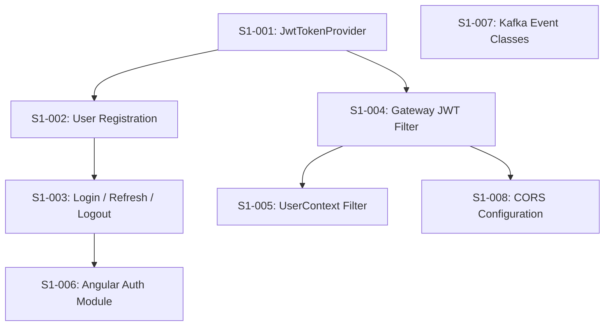

> **DEPRECATED** — This file is superseded by `sprint-1-security.md` (the single authoritative Sprint 1 document).
> Do NOT use this file for implementation. It contains outdated JJWT versions, wrong Liquibase formats, and deprecated API patterns.
> Kept for historical reference only.

---

# Phase 1 / Sprint 1: Security & Authentication

> **Sprint Duration**: Weeks 3-4
> **Points**: 39
> **Priority**: P0 (34 pts) + P1 stretch (5 pts)

---

## Sprint Goal

JWT authentication working end-to-end -- user can register, login, receive tokens,
and access protected endpoints through the API Gateway. Angular auth module complete
with login/register forms, JWT interceptor, and route guards.

---

## Prerequisites

Sprint 0 complete:
- [ ] Parent POM builds all modules
- [ ] Error-handling module: 44 tests pass
- [ ] Common library compiles (BaseAuditEntity, JwtConstants, SecurityHeaders)
- [ ] Docker Compose runs PostgreSQL
- [ ] Discovery-service: Eureka dashboard accessible
- [ ] API Gateway: starts and routes to user-service
- [ ] User-service scaffold: starts, connects to DB, Liquibase runs

---

## Dependency Map



**Build order**: S1-001 -> S1-002 -> S1-003 -> S1-004 -> S1-005 -> S1-006 -> S1-007 -> S1-008

---

## Stories

---

### Story S1-001: Implement JwtTokenProvider

**Points**: 5 | **Priority**: P0 | **Epic**: Security

#### Context

JWT is the authentication mechanism for the entire platform. The user-service needs a provider
that GENERATES tokens (access + refresh). The api-gateway needs a provider that VALIDATES tokens
and extracts claims. Both share the same HS256 secret key. The `jjwt` library (version 0.12.5)
handles JWT creation, signing, and parsing.

#### Tasks

| # | Task | File Path | What To Create | How To Verify |
|---|------|-----------|---------------|---------------|
| 1 | Add jjwt 0.12.5 to parent POM dependencyManagement | `backend/pom.xml` | jjwt-api, jjwt-impl, jjwt-jackson managed deps | `mvn validate` succeeds |
| 2 | Add spring-boot-starter-security + jjwt to user-service POM | `backend/user-service/pom.xml` | Security + JWT dependencies | `mvn validate -pl user-service` |
| 3 | Add spring-boot-starter-security + jjwt + spring-security reactive to api-gateway POM | `backend/api-gateway/pom.xml` | Reactive security + JWT dependencies | `mvn validate -pl api-gateway` |
| 4 | Create JwtTokenProvider in user-service | `backend/user-service/src/main/java/com/familyhobbies/userservice/security/JwtTokenProvider.java` | Full token generation + validation | Compiles |
| 5 | Create JwtTokenProvider in api-gateway (validation only) | `backend/api-gateway/src/main/java/com/familyhobbies/apigateway/security/JwtTokenProvider.java` | Validation-only provider | Compiles |
| 6 | Add jwt.secret to user-service application.yml | `backend/user-service/src/main/resources/application.yml` | JWT secret config property | Property resolves |
| 7 | Add jwt.secret to api-gateway application.yml | `backend/api-gateway/src/main/resources/application.yml` | JWT secret config property | Property resolves |

---

#### Task 1 Detail: Add jjwt 0.12.5 to Parent POM dependencyManagement

**What**: Add jjwt-api, jjwt-impl, and jjwt-jackson to the parent POM `<dependencyManagement>` section so all child modules can reference them without specifying versions.

**Where**: `backend/pom.xml`

**Why**: Centralizing dependency versions in the parent POM prevents version conflicts between user-service and api-gateway. Both modules need the same jjwt version to share JWT secrets and parsing logic.

**Content** (add inside the existing `<dependencyManagement><dependencies>` block, after the MapStruct entries):

```xml
            <!-- JJWT (JSON Web Token) -->
            <dependency>
                <groupId>io.jsonwebtoken</groupId>
                <artifactId>jjwt-api</artifactId>
                <version>0.12.5</version>
            </dependency>
            <dependency>
                <groupId>io.jsonwebtoken</groupId>
                <artifactId>jjwt-impl</artifactId>
                <version>0.12.5</version>
                <scope>runtime</scope>
            </dependency>
            <dependency>
                <groupId>io.jsonwebtoken</groupId>
                <artifactId>jjwt-jackson</artifactId>
                <version>0.12.5</version>
                <scope>runtime</scope>
            </dependency>
```

**Verify**:

```bash
cd backend && mvn validate
# Expected: BUILD SUCCESS (POM syntax valid, jjwt artifacts declared)
```

---

#### Task 2 Detail: Add spring-boot-starter-security + jjwt to user-service POM

**What**: Add Spring Security and jjwt dependencies to the user-service module POM.

**Where**: `backend/user-service/pom.xml`

**Why**: user-service needs Spring Security for BCryptPasswordEncoder and SecurityFilterChain configuration. It needs jjwt to generate and validate JWT access tokens.

**Content** (add inside the `<dependencies>` block):

```xml
        <!-- Spring Security -->
        <dependency>
            <groupId>org.springframework.boot</groupId>
            <artifactId>spring-boot-starter-security</artifactId>
        </dependency>

        <!-- JWT -->
        <dependency>
            <groupId>io.jsonwebtoken</groupId>
            <artifactId>jjwt-api</artifactId>
        </dependency>
        <dependency>
            <groupId>io.jsonwebtoken</groupId>
            <artifactId>jjwt-impl</artifactId>
            <scope>runtime</scope>
        </dependency>
        <dependency>
            <groupId>io.jsonwebtoken</groupId>
            <artifactId>jjwt-jackson</artifactId>
            <scope>runtime</scope>
        </dependency>

        <!-- Spring Security Test -->
        <dependency>
            <groupId>org.springframework.security</groupId>
            <artifactId>spring-security-test</artifactId>
            <scope>test</scope>
        </dependency>
```

**Verify**:

```bash
cd backend && mvn validate -pl user-service
# Expected: BUILD SUCCESS
```

---

#### Task 3 Detail: Add spring-boot-starter-security + jjwt + spring-security reactive to api-gateway POM

**What**: Add reactive Spring Security and jjwt dependencies to the api-gateway module POM.

**Where**: `backend/api-gateway/pom.xml`

**Why**: The API Gateway is built on Spring Cloud Gateway (WebFlux-based), so it needs the reactive security starter (`spring-boot-starter-security` with WebFlux auto-detects reactive mode). It needs jjwt to validate JWT tokens and extract claims before forwarding to downstream services.

**Content** (add inside the `<dependencies>` block):

```xml
        <!-- Spring Security (reactive -- auto-detected because gateway is WebFlux) -->
        <dependency>
            <groupId>org.springframework.boot</groupId>
            <artifactId>spring-boot-starter-security</artifactId>
        </dependency>

        <!-- JWT -->
        <dependency>
            <groupId>io.jsonwebtoken</groupId>
            <artifactId>jjwt-api</artifactId>
        </dependency>
        <dependency>
            <groupId>io.jsonwebtoken</groupId>
            <artifactId>jjwt-impl</artifactId>
            <scope>runtime</scope>
        </dependency>
        <dependency>
            <groupId>io.jsonwebtoken</groupId>
            <artifactId>jjwt-jackson</artifactId>
            <scope>runtime</scope>
        </dependency>
```

**Verify**:

```bash
cd backend && mvn validate -pl api-gateway
# Expected: BUILD SUCCESS
```

---

#### Task 4 Detail: Create JwtTokenProvider in user-service

**What**: Full-featured JWT provider that generates access tokens (signed JWT), generates refresh tokens (UUID), validates tokens, and extracts claims. This is the authoritative token issuer for the platform.

**Where**: `backend/user-service/src/main/java/com/familyhobbies/userservice/security/JwtTokenProvider.java`

**Why**: Every authentication flow (register, login, refresh) needs this class to create the token pair returned to the client. The access token contains user identity and roles as JWT claims. The refresh token is an opaque UUID stored in the database.

**Content**:

```java
package com.familyhobbies.userservice.security;

import com.familyhobbies.userservice.entity.User;
import io.jsonwebtoken.Claims;
import io.jsonwebtoken.Jwts;
import io.jsonwebtoken.security.Keys;
import org.springframework.beans.factory.annotation.Value;
import org.springframework.stereotype.Component;

import javax.crypto.SecretKey;
import java.nio.charset.StandardCharsets;
import java.util.Date;
import java.util.List;
import java.util.UUID;

@Component
public class JwtTokenProvider {

    private static final long ACCESS_TOKEN_VALIDITY_MS = 3_600_000;    // 1 hour
    private static final long REFRESH_TOKEN_VALIDITY_MS = 604_800_000; // 7 days

    private final SecretKey signingKey;

    public JwtTokenProvider(@Value("${jwt.secret}") String secret) {
        this.signingKey = Keys.hmacShaKeyFor(secret.getBytes(StandardCharsets.UTF_8));
    }

    /**
     * Generate a signed JWT access token containing user identity and roles.
     */
    public String generateAccessToken(User user) {
        Date now = new Date();
        Date expiry = new Date(now.getTime() + ACCESS_TOKEN_VALIDITY_MS);

        return Jwts.builder()
            .subject(String.valueOf(user.getId()))
            .claim("email", user.getEmail())
            .claim("roles", List.of(user.getRole().name()))
            .claim("firstName", user.getFirstName())
            .claim("lastName", user.getLastName())
            .issuedAt(now)
            .expiration(expiry)
            .signWith(signingKey)
            .compact();
    }

    /**
     * Generate an opaque refresh token (UUID).
     * The token itself carries no claims -- it is a lookup key into the database.
     */
    public String generateRefreshToken() {
        return UUID.randomUUID().toString();
    }

    /**
     * Validate the token signature and expiry. Returns claims if valid.
     * Throws ExpiredJwtException if expired, JwtException if invalid.
     */
    public Claims validateToken(String token) {
        return Jwts.parser()
            .verifyWith(signingKey)
            .build()
            .parseSignedClaims(token)
            .getPayload();
    }

    /**
     * Extract user ID from a validated token.
     */
    public Long getUserIdFromToken(String token) {
        Claims claims = validateToken(token);
        return Long.valueOf(claims.getSubject());
    }

    /**
     * Extract roles from a validated token.
     */
    @SuppressWarnings("unchecked")
    public List<String> getRolesFromToken(String token) {
        Claims claims = validateToken(token);
        return claims.get("roles", List.class);
    }

    /**
     * Calculate the refresh token expiry date from now.
     */
    public Date getRefreshTokenExpiry() {
        return new Date(System.currentTimeMillis() + REFRESH_TOKEN_VALIDITY_MS);
    }
}
```

**Verify**:

```bash
cd backend && mvn compile -pl user-service -q
# Expected: compiles without error
```

---

#### Task 5 Detail: Create JwtTokenProvider in api-gateway (validation only)

**What**: Simplified JWT provider that only validates tokens and extracts claims. Does NOT generate tokens -- that is the user-service's responsibility.

**Where**: `backend/api-gateway/src/main/java/com/familyhobbies/apigateway/security/JwtTokenProvider.java`

**Why**: The gateway filter needs to verify incoming JWTs and extract userId/roles before forwarding requests. It shares the same HS256 secret as user-service but has no need for token generation methods.

**Content**:

```java
package com.familyhobbies.apigateway.security;

import io.jsonwebtoken.Claims;
import io.jsonwebtoken.Jwts;
import io.jsonwebtoken.security.Keys;
import org.springframework.beans.factory.annotation.Value;
import org.springframework.stereotype.Component;

import javax.crypto.SecretKey;
import java.nio.charset.StandardCharsets;
import java.util.List;

@Component
public class JwtTokenProvider {

    private final SecretKey signingKey;

    public JwtTokenProvider(@Value("${jwt.secret}") String secret) {
        this.signingKey = Keys.hmacShaKeyFor(secret.getBytes(StandardCharsets.UTF_8));
    }

    /**
     * Validate the token signature and expiry. Returns claims if valid.
     * Throws ExpiredJwtException if expired, JwtException if invalid.
     */
    public Claims validateToken(String token) {
        return Jwts.parser()
            .verifyWith(signingKey)
            .build()
            .parseSignedClaims(token)
            .getPayload();
    }

    /**
     * Extract roles from a validated token.
     */
    @SuppressWarnings("unchecked")
    public List<String> getRolesFromToken(String token) {
        Claims claims = validateToken(token);
        return claims.get("roles", List.class);
    }
}
```

**Verify**:

```bash
cd backend && mvn compile -pl api-gateway -q
# Expected: compiles without error
```

---

#### Task 6 Detail: Add jwt.secret to user-service application.yml

**What**: Add the JWT secret property to user-service configuration.

**Where**: `backend/user-service/src/main/resources/application.yml`

**Why**: The `JwtTokenProvider` reads `@Value("${jwt.secret}")` at startup. Without this property, Spring will fail to inject the value and the application will not start.

**Content** (add at root level of the YAML file, after existing config):

```yaml
jwt:
  secret: ${JWT_SECRET:default-dev-secret-that-is-at-least-256-bits-long-for-hmac-sha256-signing}
```

**Verify**:

```bash
grep "jwt:" backend/user-service/src/main/resources/application.yml
# Expected: "jwt:" line found
```

---

#### Task 7 Detail: Add jwt.secret to api-gateway application.yml

**What**: Add the JWT secret property to api-gateway configuration.

**Where**: `backend/api-gateway/src/main/resources/application.yml`

**Why**: The gateway's `JwtTokenProvider` uses the same secret to validate tokens. Both services MUST use the same value or tokens generated by user-service will fail validation at the gateway.

**Content** (add at root level of the YAML file, after existing config):

```yaml
jwt:
  secret: ${JWT_SECRET:default-dev-secret-that-is-at-least-256-bits-long-for-hmac-sha256-signing}
```

**Verify**:

```bash
grep "jwt:" backend/api-gateway/src/main/resources/application.yml
# Expected: "jwt:" line found
```

---

#### Failing Tests (TDD Contract)

**Test File**: `backend/user-service/src/test/java/com/familyhobbies/userservice/security/JwtTokenProviderTest.java`

```java
package com.familyhobbies.userservice.security;

import com.familyhobbies.userservice.entity.User;
import com.familyhobbies.userservice.entity.UserRole;
import com.familyhobbies.userservice.entity.UserStatus;
import io.jsonwebtoken.Claims;
import io.jsonwebtoken.ExpiredJwtException;
import io.jsonwebtoken.JwtException;
import io.jsonwebtoken.Jwts;
import io.jsonwebtoken.security.Keys;
import org.junit.jupiter.api.BeforeEach;
import org.junit.jupiter.api.Test;

import javax.crypto.SecretKey;
import java.nio.charset.StandardCharsets;
import java.util.Date;
import java.util.List;

import static org.junit.jupiter.api.Assertions.*;

class JwtTokenProviderTest {

    private static final String TEST_SECRET =
        "test-secret-key-that-is-at-least-256-bits-long-for-hs256-algorithm-validation";

    private JwtTokenProvider jwtTokenProvider;
    private User testUser;

    @BeforeEach
    void setUp() {
        jwtTokenProvider = new JwtTokenProvider(TEST_SECRET);

        testUser = User.builder()
            .id(1L)
            .email("dupont@email.com")
            .firstName("Jean")
            .lastName("Dupont")
            .role(UserRole.FAMILY)
            .status(UserStatus.ACTIVE)
            .build();
    }

    @Test
    void generateAccessToken_shouldCreateValidJwt() {
        String token = jwtTokenProvider.generateAccessToken(testUser);

        assertNotNull(token);
        assertFalse(token.isEmpty());
        // JWT has three parts separated by dots
        assertEquals(3, token.split("\\.").length);
    }

    @Test
    void generateAccessToken_shouldContainCorrectClaims() {
        String token = jwtTokenProvider.generateAccessToken(testUser);
        Claims claims = jwtTokenProvider.validateToken(token);

        assertEquals("1", claims.getSubject());
        assertEquals("dupont@email.com", claims.get("email", String.class));
        assertEquals("Jean", claims.get("firstName", String.class));
        assertEquals("Dupont", claims.get("lastName", String.class));

        @SuppressWarnings("unchecked")
        List<String> roles = claims.get("roles", List.class);
        assertNotNull(roles);
        assertTrue(roles.contains("FAMILY"));
    }

    @Test
    void validateToken_shouldReturnClaimsForValidToken() {
        String token = jwtTokenProvider.generateAccessToken(testUser);

        Claims claims = jwtTokenProvider.validateToken(token);

        assertNotNull(claims);
        assertEquals("1", claims.getSubject());
        assertNotNull(claims.getIssuedAt());
        assertNotNull(claims.getExpiration());
        assertTrue(claims.getExpiration().after(new Date()));
    }

    @Test
    void validateToken_shouldThrowExpiredJwtExceptionForExpiredToken() {
        // Create a token that is already expired by using a secret key directly
        SecretKey key = Keys.hmacShaKeyFor(TEST_SECRET.getBytes(StandardCharsets.UTF_8));
        Date pastDate = new Date(System.currentTimeMillis() - 10_000);

        String expiredToken = Jwts.builder()
            .subject("1")
            .issuedAt(new Date(System.currentTimeMillis() - 20_000))
            .expiration(pastDate)
            .signWith(key)
            .compact();

        assertThrows(ExpiredJwtException.class,
            () -> jwtTokenProvider.validateToken(expiredToken));
    }

    @Test
    void validateToken_shouldThrowJwtExceptionForTamperedToken() {
        String token = jwtTokenProvider.generateAccessToken(testUser);

        // Tamper with the token by modifying a character in the signature
        String tamperedToken = token.substring(0, token.length() - 5) + "XXXXX";

        assertThrows(JwtException.class,
            () -> jwtTokenProvider.validateToken(tamperedToken));
    }

    @Test
    void getUserIdFromToken_shouldExtractCorrectId() {
        String token = jwtTokenProvider.generateAccessToken(testUser);

        Long userId = jwtTokenProvider.getUserIdFromToken(token);

        assertEquals(1L, userId);
    }

    @Test
    void getRolesFromToken_shouldExtractCorrectRoles() {
        String token = jwtTokenProvider.generateAccessToken(testUser);

        List<String> roles = jwtTokenProvider.getRolesFromToken(token);

        assertNotNull(roles);
        assertEquals(1, roles.size());
        assertEquals("FAMILY", roles.get(0));
    }

    @Test
    void generateRefreshToken_shouldReturnUniqueUuidStrings() {
        String token1 = jwtTokenProvider.generateRefreshToken();
        String token2 = jwtTokenProvider.generateRefreshToken();

        assertNotNull(token1);
        assertNotNull(token2);
        assertNotEquals(token1, token2);

        // Verify UUID format (8-4-4-4-12 hex characters)
        assertTrue(token1.matches(
            "^[0-9a-f]{8}-[0-9a-f]{4}-[0-9a-f]{4}-[0-9a-f]{4}-[0-9a-f]{12}$"));
        assertTrue(token2.matches(
            "^[0-9a-f]{8}-[0-9a-f]{4}-[0-9a-f]{4}-[0-9a-f]{4}-[0-9a-f]{12}$"));
    }
}
```

**Run tests**:

```bash
cd backend/user-service && mvn test -Dtest=JwtTokenProviderTest
# Expected (before implementation): 8 tests, all RED (compile errors — User entity not yet created)
# Expected (after S1-001 + S1-002 entities): 8 tests, all GREEN
```

---

### Story S1-002: Implement User Registration

**Points**: 8 | **Priority**: P0 | **Epic**: Security

#### Context

User registration is the first real feature of the platform. A user submits their email and
password, the password is hashed with BCrypt (strength 12), the user is stored in `t_user` with
the default role `FAMILY`, and the system returns a JWT access token + opaque refresh token.
This story requires Liquibase migrations to create the `t_user` and `t_refresh_token` tables.

#### Tasks

| # | Task | File Path | What To Create | How To Verify |
|---|------|-----------|---------------|---------------|
| 1 | Create Liquibase changeset 001-create-user-table | `backend/user-service/src/main/resources/db/changelog/changes/001-create-user-table.yaml` | t_user table migration | Liquibase runs |
| 2 | Create Liquibase changeset 002-create-refresh-token-table | `backend/user-service/src/main/resources/db/changelog/changes/002-create-refresh-token-table.yaml` | t_refresh_token table migration | Liquibase runs |
| 3 | Update db.changelog-master.yaml | `backend/user-service/src/main/resources/db/changelog/db.changelog-master.yaml` | Include both new changesets | Liquibase runs all |
| 4 | Create UserRole enum | `backend/user-service/src/main/java/com/familyhobbies/userservice/entity/UserRole.java` | FAMILY, ASSOCIATION, ADMIN | Compiles |
| 5 | Create UserStatus enum | `backend/user-service/src/main/java/com/familyhobbies/userservice/entity/UserStatus.java` | ACTIVE, INACTIVE, SUSPENDED, DELETED | Compiles |
| 6 | Create User JPA entity | `backend/user-service/src/main/java/com/familyhobbies/userservice/entity/User.java` | JPA entity mapping to t_user | Compiles |
| 7 | Create RefreshToken JPA entity | `backend/user-service/src/main/java/com/familyhobbies/userservice/entity/RefreshToken.java` | JPA entity mapping to t_refresh_token | Compiles |
| 8 | Create UserRepository | `backend/user-service/src/main/java/com/familyhobbies/userservice/repository/UserRepository.java` | findByEmail, existsByEmail | Compiles |
| 9 | Create RefreshTokenRepository | `backend/user-service/src/main/java/com/familyhobbies/userservice/repository/RefreshTokenRepository.java` | findByToken, revokeAllByUserId | Compiles |
| 10 | Create RegisterRequest record | `backend/user-service/src/main/java/com/familyhobbies/userservice/dto/request/RegisterRequest.java` | Jakarta validation annotations | Compiles |
| 11 | Create AuthResponse record | `backend/user-service/src/main/java/com/familyhobbies/userservice/dto/response/AuthResponse.java` | Token response DTO | Compiles |
| 12 | Create AuthService interface | `backend/user-service/src/main/java/com/familyhobbies/userservice/service/AuthService.java` | Service contract | Compiles |
| 13 | Create AuthServiceImpl | `backend/user-service/src/main/java/com/familyhobbies/userservice/service/impl/AuthServiceImpl.java` | register() method only | Compiles |
| 14 | Create AuthController | `backend/user-service/src/main/java/com/familyhobbies/userservice/controller/AuthController.java` | POST /api/v1/auth/register | Compiles |
| 15 | Create user-service SecurityConfig | `backend/user-service/src/main/java/com/familyhobbies/userservice/config/SecurityConfig.java` | Spring Security configuration | Compiles |

---

#### Task 1 Detail: Create Liquibase changeset 001-create-user-table.yaml

**What**: Liquibase changeset that creates the `t_user` table with all columns, constraints, and indexes as defined in the data model (02-data-model.md section 4.1).

**Where**: `backend/user-service/src/main/resources/db/changelog/changes/001-create-user-table.yaml`

**Why**: The `t_user` table is the foundation for all authentication. Without it, no user can register or log in. The schema matches the data model document exactly.

**Content**:

```yaml
databaseChangeLog:
  - changeSet:
      id: 001-create-user-table
      author: family-hobbies-team
      comment: "Creates the t_user table for authentication and user profiles"
      changes:
        - createTable:
            tableName: t_user
            columns:
              - column:
                  name: id
                  type: BIGINT
                  autoIncrement: true
                  constraints:
                    primaryKey: true
                    primaryKeyName: pk_user
                    nullable: false
              - column:
                  name: email
                  type: VARCHAR(255)
                  constraints:
                    nullable: false
                    unique: true
                    uniqueConstraintName: uq_user_email
              - column:
                  name: password_hash
                  type: VARCHAR(255)
                  constraints:
                    nullable: false
              - column:
                  name: first_name
                  type: VARCHAR(100)
                  constraints:
                    nullable: false
              - column:
                  name: last_name
                  type: VARCHAR(100)
                  constraints:
                    nullable: false
              - column:
                  name: phone
                  type: VARCHAR(20)
                  constraints:
                    nullable: true
              - column:
                  name: role
                  type: VARCHAR(20)
                  defaultValue: "FAMILY"
                  constraints:
                    nullable: false
              - column:
                  name: status
                  type: VARCHAR(20)
                  defaultValue: "ACTIVE"
                  constraints:
                    nullable: false
              - column:
                  name: email_verified
                  type: BOOLEAN
                  defaultValueBoolean: false
                  constraints:
                    nullable: false
              - column:
                  name: last_login_at
                  type: TIMESTAMP WITH TIME ZONE
                  constraints:
                    nullable: true
              - column:
                  name: created_at
                  type: TIMESTAMP WITH TIME ZONE
                  defaultValueComputed: NOW()
                  constraints:
                    nullable: false
              - column:
                  name: updated_at
                  type: TIMESTAMP WITH TIME ZONE
                  defaultValueComputed: NOW()
                  constraints:
                    nullable: false

        - createIndex:
            indexName: idx_user_email
            tableName: t_user
            columns:
              - column:
                  name: email

        - createIndex:
            indexName: idx_user_status
            tableName: t_user
            columns:
              - column:
                  name: status
```

**Verify**:

```bash
cd docker && docker compose up -d
sleep 5
cd ../backend/user-service && mvn spring-boot:run &
sleep 15
docker exec fhm-postgres psql -U fhm_admin -d familyhobbies_users \
  -c "\d t_user"
# Expected: table description showing all 12 columns
kill %1
```

---

#### Task 2 Detail: Create Liquibase changeset 002-create-refresh-token-table.yaml

**What**: Liquibase changeset that creates the `t_refresh_token` table with foreign key to `t_user`, unique constraint on `token`, and indexes.

**Where**: `backend/user-service/src/main/resources/db/changelog/changes/002-create-refresh-token-table.yaml`

**Why**: Refresh tokens enable silent token renewal. They are stored in the database so they can be individually revoked (on logout) or bulk-revoked (on password change). The schema matches 02-data-model.md section 4.5.

**Content**:

```yaml
databaseChangeLog:
  - changeSet:
      id: 002-create-refresh-token-table
      author: family-hobbies-team
      comment: "Creates the t_refresh_token table for JWT refresh token storage"
      changes:
        - createTable:
            tableName: t_refresh_token
            columns:
              - column:
                  name: id
                  type: BIGINT
                  autoIncrement: true
                  constraints:
                    primaryKey: true
                    primaryKeyName: pk_refresh_token
                    nullable: false
              - column:
                  name: user_id
                  type: BIGINT
                  constraints:
                    nullable: false
                    foreignKeyName: fk_refresh_token_user
                    references: t_user(id)
                    deleteCascade: true
              - column:
                  name: token
                  type: VARCHAR(512)
                  constraints:
                    nullable: false
                    unique: true
                    uniqueConstraintName: uq_refresh_token
              - column:
                  name: expires_at
                  type: TIMESTAMP WITH TIME ZONE
                  constraints:
                    nullable: false
              - column:
                  name: revoked
                  type: BOOLEAN
                  defaultValueBoolean: false
                  constraints:
                    nullable: false
              - column:
                  name: created_at
                  type: TIMESTAMP WITH TIME ZONE
                  defaultValueComputed: NOW()
                  constraints:
                    nullable: false

        - createIndex:
            indexName: idx_refresh_token_user_id
            tableName: t_refresh_token
            columns:
              - column:
                  name: user_id

        - createIndex:
            indexName: idx_refresh_token_expires_at
            tableName: t_refresh_token
            columns:
              - column:
                  name: expires_at
```

**Verify**:

```bash
docker exec fhm-postgres psql -U fhm_admin -d familyhobbies_users \
  -c "\d t_refresh_token"
# Expected: table description showing all 6 columns with FK to t_user
```

---

#### Task 3 Detail: Update db.changelog-master.yaml

**What**: Add the two new changesets to the master changelog so Liquibase executes them in order.

**Where**: `backend/user-service/src/main/resources/db/changelog/db.changelog-master.yaml`

**Why**: Liquibase only runs changesets that are included in the master changelog. Order matters -- `t_user` must be created before `t_refresh_token` because of the foreign key reference.

**Content**:

```yaml
databaseChangeLog:
  - include:
      file: db/changelog/changes/000-init.yaml
  - include:
      file: db/changelog/changes/001-create-user-table.yaml
  - include:
      file: db/changelog/changes/002-create-refresh-token-table.yaml
```

**Verify**:

```bash
cd backend/user-service && mvn spring-boot:run &
sleep 15
docker exec fhm-postgres psql -U fhm_admin -d familyhobbies_users \
  -c "SELECT id, filename FROM databasechangelog ORDER BY orderexecuted"
# Expected: 3 rows — 000-init, 001-create-user-table, 002-create-refresh-token-table
kill %1
```

---

#### Task 4 Detail: Create UserRole Enum

**What**: Java enum defining the three application roles: FAMILY, ASSOCIATION, ADMIN.

**Where**: `backend/user-service/src/main/java/com/familyhobbies/userservice/entity/UserRole.java`

**Why**: Used by the User entity with `@Enumerated(EnumType.STRING)` to map the `role` VARCHAR column. Also used by JwtTokenProvider to include the role in token claims.

**Content**:

```java
package com.familyhobbies.userservice.entity;

public enum UserRole {
    FAMILY,
    ASSOCIATION,
    ADMIN
}
```

**Verify**:

```bash
cd backend && mvn compile -pl user-service -q
# Expected: compiles without error
```

---

#### Task 5 Detail: Create UserStatus Enum

**What**: Java enum defining user account statuses: ACTIVE, INACTIVE, SUSPENDED, DELETED.

**Where**: `backend/user-service/src/main/java/com/familyhobbies/userservice/entity/UserStatus.java`

**Why**: Maps to the `status` VARCHAR column in `t_user`. Used to check if a user is allowed to log in (only ACTIVE users can authenticate).

**Content**:

```java
package com.familyhobbies.userservice.entity;

public enum UserStatus {
    ACTIVE,
    INACTIVE,
    SUSPENDED,
    DELETED
}
```

**Verify**:

```bash
cd backend && mvn compile -pl user-service -q
# Expected: compiles without error
```

---

#### Task 6 Detail: Create User JPA Entity

**What**: JPA entity mapping to `t_user`. Uses Lombok `@Builder`, `@Getter`, `@Setter`. Uses `@Enumerated(EnumType.STRING)` for role and status columns. Does NOT extend `BaseAuditEntity` because `t_user` has its own `created_at`/`updated_at` columns with database-level defaults (and does not use `created_by`/`updated_by` audit columns).

**Where**: `backend/user-service/src/main/java/com/familyhobbies/userservice/entity/User.java`

**Why**: The User entity is the central model for authentication. Every auth operation (register, login, refresh, logout) reads or writes this entity.

**Content**:

```java
package com.familyhobbies.userservice.entity;

import jakarta.persistence.Column;
import jakarta.persistence.Entity;
import jakarta.persistence.EnumType;
import jakarta.persistence.Enumerated;
import jakarta.persistence.GeneratedValue;
import jakarta.persistence.GenerationType;
import jakarta.persistence.Id;
import jakarta.persistence.Table;
import lombok.AllArgsConstructor;
import lombok.Builder;
import lombok.Getter;
import lombok.NoArgsConstructor;
import lombok.Setter;

import java.time.Instant;

@Entity
@Table(name = "t_user")
@Getter
@Setter
@Builder
@NoArgsConstructor
@AllArgsConstructor
public class User {

    @Id
    @GeneratedValue(strategy = GenerationType.IDENTITY)
    private Long id;

    @Column(name = "email", nullable = false, unique = true, length = 255)
    private String email;

    @Column(name = "password_hash", nullable = false, length = 255)
    private String passwordHash;

    @Column(name = "first_name", nullable = false, length = 100)
    private String firstName;

    @Column(name = "last_name", nullable = false, length = 100)
    private String lastName;

    @Column(name = "phone", length = 20)
    private String phone;

    @Enumerated(EnumType.STRING)
    @Column(name = "role", nullable = false, length = 20)
    @Builder.Default
    private UserRole role = UserRole.FAMILY;

    @Enumerated(EnumType.STRING)
    @Column(name = "status", nullable = false, length = 20)
    @Builder.Default
    private UserStatus status = UserStatus.ACTIVE;

    @Column(name = "email_verified", nullable = false)
    @Builder.Default
    private boolean emailVerified = false;

    @Column(name = "last_login_at")
    private Instant lastLoginAt;

    @Column(name = "created_at", nullable = false, updatable = false)
    @Builder.Default
    private Instant createdAt = Instant.now();

    @Column(name = "updated_at", nullable = false)
    @Builder.Default
    private Instant updatedAt = Instant.now();
}
```

**Verify**:

```bash
cd backend && mvn compile -pl user-service -q
# Expected: compiles without error
```

---

#### Task 7 Detail: Create RefreshToken JPA Entity

**What**: JPA entity mapping to `t_refresh_token`. Has a `@ManyToOne` relationship to `User` via the `user_id` foreign key.

**Where**: `backend/user-service/src/main/java/com/familyhobbies/userservice/entity/RefreshToken.java`

**Why**: Refresh tokens are persisted so they can be individually revoked (rotation on use, bulk revocation on logout).

**Content**:

```java
package com.familyhobbies.userservice.entity;

import jakarta.persistence.Column;
import jakarta.persistence.Entity;
import jakarta.persistence.FetchType;
import jakarta.persistence.GeneratedValue;
import jakarta.persistence.GenerationType;
import jakarta.persistence.Id;
import jakarta.persistence.JoinColumn;
import jakarta.persistence.ManyToOne;
import jakarta.persistence.Table;
import lombok.AllArgsConstructor;
import lombok.Builder;
import lombok.Getter;
import lombok.NoArgsConstructor;
import lombok.Setter;

import java.time.Instant;

@Entity
@Table(name = "t_refresh_token")
@Getter
@Setter
@Builder
@NoArgsConstructor
@AllArgsConstructor
public class RefreshToken {

    @Id
    @GeneratedValue(strategy = GenerationType.IDENTITY)
    private Long id;

    @ManyToOne(fetch = FetchType.LAZY)
    @JoinColumn(name = "user_id", nullable = false)
    private User user;

    @Column(name = "token", nullable = false, unique = true, length = 512)
    private String token;

    @Column(name = "expires_at", nullable = false)
    private Instant expiresAt;

    @Column(name = "revoked", nullable = false)
    @Builder.Default
    private boolean revoked = false;

    @Column(name = "created_at", nullable = false, updatable = false)
    @Builder.Default
    private Instant createdAt = Instant.now();
}
```

**Verify**:

```bash
cd backend && mvn compile -pl user-service -q
# Expected: compiles without error
```

---

#### Task 8 Detail: Create UserRepository

**What**: Spring Data JPA repository for the `User` entity with custom query methods.

**Where**: `backend/user-service/src/main/java/com/familyhobbies/userservice/repository/UserRepository.java`

**Why**: `findByEmail` is used during login to look up the user by their email address. `existsByEmail` is used during registration to check for duplicate emails before inserting.

**Content**:

```java
package com.familyhobbies.userservice.repository;

import com.familyhobbies.userservice.entity.User;
import org.springframework.data.jpa.repository.JpaRepository;
import org.springframework.stereotype.Repository;

import java.util.Optional;

@Repository
public interface UserRepository extends JpaRepository<User, Long> {

    Optional<User> findByEmail(String email);

    boolean existsByEmail(String email);
}
```

**Verify**:

```bash
cd backend && mvn compile -pl user-service -q
# Expected: compiles without error
```

---

#### Task 9 Detail: Create RefreshTokenRepository

**What**: Spring Data JPA repository for the `RefreshToken` entity with a custom `@Modifying` query to revoke all tokens for a user.

**Where**: `backend/user-service/src/main/java/com/familyhobbies/userservice/repository/RefreshTokenRepository.java`

**Why**: `findByToken` is used during the refresh flow to locate the stored token. `revokeAllByUserId` is used during logout to invalidate all refresh tokens for a user in a single query.

**Content**:

```java
package com.familyhobbies.userservice.repository;

import com.familyhobbies.userservice.entity.RefreshToken;
import org.springframework.data.jpa.repository.JpaRepository;
import org.springframework.data.jpa.repository.Modifying;
import org.springframework.data.jpa.repository.Query;
import org.springframework.data.repository.query.Param;
import org.springframework.stereotype.Repository;

import java.util.Optional;

@Repository
public interface RefreshTokenRepository extends JpaRepository<RefreshToken, Long> {

    Optional<RefreshToken> findByToken(String token);

    @Modifying
    @Query("UPDATE RefreshToken rt SET rt.revoked = true WHERE rt.user.id = :userId AND rt.revoked = false")
    int revokeAllByUserId(@Param("userId") Long userId);
}
```

**Verify**:

```bash
cd backend && mvn compile -pl user-service -q
# Expected: compiles without error
```

---

#### Task 10 Detail: Create RegisterRequest Record

**What**: Java record serving as the request DTO for user registration. Uses Jakarta Bean Validation annotations to enforce input rules.

**Where**: `backend/user-service/src/main/java/com/familyhobbies/userservice/dto/request/RegisterRequest.java`

**Why**: Records are immutable and concise -- ideal for DTOs. The validation annotations are enforced by Spring's `@Valid` annotation in the controller, returning 400 with field-level errors if any constraint is violated.

**Content**:

```java
package com.familyhobbies.userservice.dto.request;

import jakarta.validation.constraints.Email;
import jakarta.validation.constraints.NotBlank;
import jakarta.validation.constraints.Size;

public record RegisterRequest(
    @NotBlank(message = "Email is required")
    @Email(message = "Email must be a valid email address")
    @Size(max = 255, message = "Email must not exceed 255 characters")
    String email,

    @NotBlank(message = "Password is required")
    @Size(min = 8, max = 100, message = "Password must be between 8 and 100 characters")
    String password,

    @NotBlank(message = "First name is required")
    @Size(max = 100, message = "First name must not exceed 100 characters")
    String firstName,

    @NotBlank(message = "Last name is required")
    @Size(max = 100, message = "Last name must not exceed 100 characters")
    String lastName,

    @Size(max = 20, message = "Phone must not exceed 20 characters")
    String phone
) {}
```

**Verify**:

```bash
cd backend && mvn compile -pl user-service -q
# Expected: compiles without error
```

---

#### Task 11 Detail: Create AuthResponse Record

**What**: Java record serving as the response DTO for all authentication endpoints (register, login, refresh). Contains the access token, refresh token, token type, and expiry.

**Where**: `backend/user-service/src/main/java/com/familyhobbies/userservice/dto/response/AuthResponse.java`

**Why**: Provides a consistent response shape for all auth endpoints. The frontend parses this to extract tokens for storage and the `expiresIn` field to schedule token refresh.

**Content**:

```java
package com.familyhobbies.userservice.dto.response;

public record AuthResponse(
    String accessToken,
    String refreshToken,
    String tokenType,
    long expiresIn
) {}
```

**Verify**:

```bash
cd backend && mvn compile -pl user-service -q
# Expected: compiles without error
```

---

#### Task 12 Detail: Create AuthService Interface

**What**: Service interface defining the authentication contract: register, login, refreshToken, logout.

**Where**: `backend/user-service/src/main/java/com/familyhobbies/userservice/service/AuthService.java`

**Why**: Coding to an interface allows unit testing with mocks and future alternative implementations. The controller depends on this interface, not the implementation.

**Content**:

```java
package com.familyhobbies.userservice.service;

import com.familyhobbies.userservice.dto.request.LoginRequest;
import com.familyhobbies.userservice.dto.request.RefreshTokenRequest;
import com.familyhobbies.userservice.dto.request.RegisterRequest;
import com.familyhobbies.userservice.dto.response.AuthResponse;

public interface AuthService {

    AuthResponse register(RegisterRequest request);

    AuthResponse login(LoginRequest request);

    AuthResponse refreshToken(RefreshTokenRequest request);

    void logout(Long userId);
}
```

**Verify**:

```bash
cd backend && mvn compile -pl user-service -q
# Expected: compiles without error
```

---

#### Task 13 Detail: Create AuthServiceImpl (register only)

**What**: Implementation of `AuthService` with the `register()` method. Login, refresh, and logout are stubbed and implemented in S1-003. Does NOT include Kafka event publishing -- that comes in S1-007.

**Where**: `backend/user-service/src/main/java/com/familyhobbies/userservice/service/impl/AuthServiceImpl.java`

**Why**: The register method validates email uniqueness, hashes the password with BCrypt, creates the user with FAMILY role, generates a token pair, stores the refresh token, and returns the AuthResponse.

**Content**:

```java
package com.familyhobbies.userservice.service.impl;

import com.familyhobbies.errorhandling.exception.web.ConflictException;
import com.familyhobbies.userservice.dto.request.LoginRequest;
import com.familyhobbies.userservice.dto.request.RefreshTokenRequest;
import com.familyhobbies.userservice.dto.request.RegisterRequest;
import com.familyhobbies.userservice.dto.response.AuthResponse;
import com.familyhobbies.userservice.entity.RefreshToken;
import com.familyhobbies.userservice.entity.User;
import com.familyhobbies.userservice.entity.UserRole;
import com.familyhobbies.userservice.entity.UserStatus;
import com.familyhobbies.userservice.repository.RefreshTokenRepository;
import com.familyhobbies.userservice.repository.UserRepository;
import com.familyhobbies.userservice.security.JwtTokenProvider;
import com.familyhobbies.userservice.service.AuthService;
import org.springframework.security.crypto.password.PasswordEncoder;
import org.springframework.stereotype.Service;
import org.springframework.transaction.annotation.Transactional;

@Service
public class AuthServiceImpl implements AuthService {

    private final UserRepository userRepository;
    private final RefreshTokenRepository refreshTokenRepository;
    private final PasswordEncoder passwordEncoder;
    private final JwtTokenProvider jwtTokenProvider;

    public AuthServiceImpl(
            UserRepository userRepository,
            RefreshTokenRepository refreshTokenRepository,
            PasswordEncoder passwordEncoder,
            JwtTokenProvider jwtTokenProvider) {
        this.userRepository = userRepository;
        this.refreshTokenRepository = refreshTokenRepository;
        this.passwordEncoder = passwordEncoder;
        this.jwtTokenProvider = jwtTokenProvider;
    }

    @Override
    @Transactional
    public AuthResponse register(RegisterRequest request) {
        if (userRepository.existsByEmail(request.email())) {
            throw new ConflictException("Email already registered: " + request.email());
        }

        User user = User.builder()
            .email(request.email())
            .passwordHash(passwordEncoder.encode(request.password()))
            .firstName(request.firstName())
            .lastName(request.lastName())
            .phone(request.phone())
            .role(UserRole.FAMILY)
            .status(UserStatus.ACTIVE)
            .emailVerified(false)
            .build();

        user = userRepository.save(user);

        String accessToken = jwtTokenProvider.generateAccessToken(user);
        String refreshToken = createRefreshToken(user);

        return new AuthResponse(accessToken, refreshToken, "Bearer", 3600);
    }

    @Override
    @Transactional(readOnly = true)
    public AuthResponse login(LoginRequest request) {
        // Implemented in S1-003
        throw new UnsupportedOperationException("Login not yet implemented — see S1-003");
    }

    @Override
    @Transactional
    public AuthResponse refreshToken(RefreshTokenRequest request) {
        // Implemented in S1-003
        throw new UnsupportedOperationException("Refresh not yet implemented — see S1-003");
    }

    @Override
    @Transactional
    public void logout(Long userId) {
        // Implemented in S1-003
        throw new UnsupportedOperationException("Logout not yet implemented — see S1-003");
    }

    private String createRefreshToken(User user) {
        String token = jwtTokenProvider.generateRefreshToken();

        RefreshToken refreshToken = RefreshToken.builder()
            .user(user)
            .token(token)
            .expiresAt(jwtTokenProvider.getRefreshTokenExpiry().toInstant())
            .revoked(false)
            .build();

        refreshTokenRepository.save(refreshToken);
        return token;
    }
}
```

**Verify**:

```bash
cd backend && mvn compile -pl user-service -q
# Expected: compiles without error
```

---

#### Task 14 Detail: Create AuthController

**What**: REST controller exposing `POST /api/v1/auth/register`. Login, refresh, and logout endpoints are added in S1-003.

**Where**: `backend/user-service/src/main/java/com/familyhobbies/userservice/controller/AuthController.java`

**Why**: This is the entry point for the registration flow. The `@Valid` annotation triggers Jakarta Bean Validation on the `RegisterRequest`. The `@RequestMapping("/api/v1/auth")` prefix matches the gateway route predicate.

**Content**:

```java
package com.familyhobbies.userservice.controller;

import com.familyhobbies.userservice.dto.request.RegisterRequest;
import com.familyhobbies.userservice.dto.response.AuthResponse;
import com.familyhobbies.userservice.service.AuthService;
import jakarta.validation.Valid;
import org.springframework.http.HttpStatus;
import org.springframework.http.ResponseEntity;
import org.springframework.web.bind.annotation.PostMapping;
import org.springframework.web.bind.annotation.RequestBody;
import org.springframework.web.bind.annotation.RequestMapping;
import org.springframework.web.bind.annotation.RestController;

@RestController
@RequestMapping("/api/v1/auth")
public class AuthController {

    private final AuthService authService;

    public AuthController(AuthService authService) {
        this.authService = authService;
    }

    @PostMapping("/register")
    public ResponseEntity<AuthResponse> register(@Valid @RequestBody RegisterRequest request) {
        AuthResponse response = authService.register(request);
        return ResponseEntity.status(HttpStatus.CREATED).body(response);
    }
}
```

**Verify**:

```bash
cd backend && mvn compile -pl user-service -q
# Expected: compiles without error
```

---

#### Task 15 Detail: Create user-service SecurityConfig

**What**: Spring Security configuration for user-service. Permits all `/auth/**` and `/actuator/health` endpoints. All other endpoints require authentication. Uses BCryptPasswordEncoder with strength 12. Stateless sessions. CSRF disabled.

**Where**: `backend/user-service/src/main/java/com/familyhobbies/userservice/config/SecurityConfig.java`

**Why**: Without this configuration, Spring Security's defaults would require authentication for ALL endpoints, including `/auth/register` and `/auth/login`, which must be public. The BCryptPasswordEncoder bean is used by AuthServiceImpl to hash passwords.

**Content**:

```java
package com.familyhobbies.userservice.config;

import org.springframework.context.annotation.Bean;
import org.springframework.context.annotation.Configuration;
import org.springframework.security.config.annotation.method.configuration.EnableMethodSecurity;
import org.springframework.security.config.annotation.web.builders.HttpSecurity;
import org.springframework.security.config.annotation.web.configuration.EnableWebSecurity;
import org.springframework.security.config.http.SessionCreationPolicy;
import org.springframework.security.crypto.bcrypt.BCryptPasswordEncoder;
import org.springframework.security.crypto.password.PasswordEncoder;
import org.springframework.security.web.SecurityFilterChain;

@Configuration
@EnableWebSecurity
@EnableMethodSecurity
public class SecurityConfig {

    @Bean
    public SecurityFilterChain securityFilterChain(HttpSecurity http) throws Exception {
        return http
            // Stateless -- no sessions
            .sessionManagement(session ->
                session.sessionCreationPolicy(SessionCreationPolicy.STATELESS))

            // CSRF disabled -- behind gateway, stateless JWT API
            .csrf(csrf -> csrf.disable())

            // No form login or HTTP basic
            .formLogin(form -> form.disable())
            .httpBasic(basic -> basic.disable())

            // Authorization rules (defense-in-depth, gateway also enforces)
            .authorizeHttpRequests(auth -> auth
                .requestMatchers("/api/v1/auth/**").permitAll()
                .requestMatchers("/actuator/health", "/actuator/info").permitAll()
                .anyRequest().authenticated()
            )

            .build();
    }

    @Bean
    public PasswordEncoder passwordEncoder() {
        return new BCryptPasswordEncoder(12);
    }
}
```

**Verify**:

```bash
cd backend && mvn compile -pl user-service -q
# Expected: compiles without error
```

---

#### Failing Tests (TDD Contract)

**Test File 1**: `backend/user-service/src/test/java/com/familyhobbies/userservice/service/AuthServiceRegistrationTest.java`

```java
package com.familyhobbies.userservice.service;

import com.familyhobbies.errorhandling.exception.web.ConflictException;
import com.familyhobbies.userservice.dto.request.RegisterRequest;
import com.familyhobbies.userservice.dto.response.AuthResponse;
import com.familyhobbies.userservice.entity.RefreshToken;
import com.familyhobbies.userservice.entity.User;
import com.familyhobbies.userservice.entity.UserRole;
import com.familyhobbies.userservice.repository.RefreshTokenRepository;
import com.familyhobbies.userservice.repository.UserRepository;
import com.familyhobbies.userservice.security.JwtTokenProvider;
import com.familyhobbies.userservice.service.impl.AuthServiceImpl;
import org.junit.jupiter.api.BeforeEach;
import org.junit.jupiter.api.Test;
import org.junit.jupiter.api.extension.ExtendWith;
import org.mockito.ArgumentCaptor;
import org.mockito.Mock;
import org.mockito.junit.jupiter.MockitoExtension;
import org.springframework.security.crypto.password.PasswordEncoder;

import java.util.Date;

import static org.junit.jupiter.api.Assertions.*;
import static org.mockito.ArgumentMatchers.any;
import static org.mockito.ArgumentMatchers.anyString;
import static org.mockito.Mockito.*;

@ExtendWith(MockitoExtension.class)
class AuthServiceRegistrationTest {

    @Mock
    private UserRepository userRepository;

    @Mock
    private RefreshTokenRepository refreshTokenRepository;

    @Mock
    private PasswordEncoder passwordEncoder;

    @Mock
    private JwtTokenProvider jwtTokenProvider;

    private AuthServiceImpl authService;

    @BeforeEach
    void setUp() {
        authService = new AuthServiceImpl(
            userRepository,
            refreshTokenRepository,
            passwordEncoder,
            jwtTokenProvider
        );
    }

    @Test
    void register_happyPath_shouldReturnAuthResponseWithTokens() {
        // Arrange
        RegisterRequest request = new RegisterRequest(
            "dupont@email.com", "SecureP@ss1", "Jean", "Dupont", null);

        when(userRepository.existsByEmail("dupont@email.com")).thenReturn(false);
        when(passwordEncoder.encode("SecureP@ss1")).thenReturn("$2a$12$hashedpassword");
        when(userRepository.save(any(User.class))).thenAnswer(invocation -> {
            User user = invocation.getArgument(0);
            user.setId(1L);
            return user;
        });
        when(jwtTokenProvider.generateAccessToken(any(User.class)))
            .thenReturn("mock-access-token");
        when(jwtTokenProvider.generateRefreshToken()).thenReturn("mock-refresh-token");
        when(jwtTokenProvider.getRefreshTokenExpiry())
            .thenReturn(new Date(System.currentTimeMillis() + 604_800_000));
        when(refreshTokenRepository.save(any(RefreshToken.class)))
            .thenAnswer(invocation -> invocation.getArgument(0));

        // Act
        AuthResponse response = authService.register(request);

        // Assert
        assertNotNull(response);
        assertEquals("mock-access-token", response.accessToken());
        assertEquals("mock-refresh-token", response.refreshToken());
        assertEquals("Bearer", response.tokenType());
        assertEquals(3600, response.expiresIn());
    }

    @Test
    void register_withDuplicateEmail_shouldThrowConflictException() {
        // Arrange
        RegisterRequest request = new RegisterRequest(
            "existing@email.com", "SecureP@ss1", "Jean", "Dupont", null);
        when(userRepository.existsByEmail("existing@email.com")).thenReturn(true);

        // Act & Assert
        ConflictException exception = assertThrows(ConflictException.class,
            () -> authService.register(request));
        assertTrue(exception.getMessage().contains("existing@email.com"));
        verify(userRepository, never()).save(any());
    }

    @Test
    void register_shouldStoreBCryptHashedPassword_notPlaintext() {
        // Arrange
        RegisterRequest request = new RegisterRequest(
            "dupont@email.com", "SecureP@ss1", "Jean", "Dupont", null);
        when(userRepository.existsByEmail(anyString())).thenReturn(false);
        when(passwordEncoder.encode("SecureP@ss1")).thenReturn("$2a$12$encodedHash");
        when(userRepository.save(any(User.class))).thenAnswer(invocation -> {
            User user = invocation.getArgument(0);
            user.setId(1L);
            return user;
        });
        when(jwtTokenProvider.generateAccessToken(any(User.class))).thenReturn("token");
        when(jwtTokenProvider.generateRefreshToken()).thenReturn("refresh");
        when(jwtTokenProvider.getRefreshTokenExpiry())
            .thenReturn(new Date(System.currentTimeMillis() + 604_800_000));
        when(refreshTokenRepository.save(any(RefreshToken.class)))
            .thenAnswer(invocation -> invocation.getArgument(0));

        // Act
        authService.register(request);

        // Assert
        ArgumentCaptor<User> userCaptor = ArgumentCaptor.forClass(User.class);
        verify(userRepository).save(userCaptor.capture());
        User savedUser = userCaptor.getValue();
        assertEquals("$2a$12$encodedHash", savedUser.getPasswordHash());
        assertNotEquals("SecureP@ss1", savedUser.getPasswordHash());
    }

    @Test
    void register_shouldAssignFamilyRoleByDefault() {
        // Arrange
        RegisterRequest request = new RegisterRequest(
            "dupont@email.com", "SecureP@ss1", "Jean", "Dupont", null);
        when(userRepository.existsByEmail(anyString())).thenReturn(false);
        when(passwordEncoder.encode(anyString())).thenReturn("$2a$12$hash");
        when(userRepository.save(any(User.class))).thenAnswer(invocation -> {
            User user = invocation.getArgument(0);
            user.setId(1L);
            return user;
        });
        when(jwtTokenProvider.generateAccessToken(any(User.class))).thenReturn("token");
        when(jwtTokenProvider.generateRefreshToken()).thenReturn("refresh");
        when(jwtTokenProvider.getRefreshTokenExpiry())
            .thenReturn(new Date(System.currentTimeMillis() + 604_800_000));
        when(refreshTokenRepository.save(any(RefreshToken.class)))
            .thenAnswer(invocation -> invocation.getArgument(0));

        // Act
        authService.register(request);

        // Assert
        ArgumentCaptor<User> userCaptor = ArgumentCaptor.forClass(User.class);
        verify(userRepository).save(userCaptor.capture());
        assertEquals(UserRole.FAMILY, userCaptor.getValue().getRole());
    }

    @Test
    void register_shouldCreateRefreshTokenInDatabase() {
        // Arrange
        RegisterRequest request = new RegisterRequest(
            "dupont@email.com", "SecureP@ss1", "Jean", "Dupont", null);
        when(userRepository.existsByEmail(anyString())).thenReturn(false);
        when(passwordEncoder.encode(anyString())).thenReturn("$2a$12$hash");
        when(userRepository.save(any(User.class))).thenAnswer(invocation -> {
            User user = invocation.getArgument(0);
            user.setId(1L);
            return user;
        });
        when(jwtTokenProvider.generateAccessToken(any(User.class))).thenReturn("token");
        when(jwtTokenProvider.generateRefreshToken()).thenReturn("uuid-refresh-token");
        when(jwtTokenProvider.getRefreshTokenExpiry())
            .thenReturn(new Date(System.currentTimeMillis() + 604_800_000));
        when(refreshTokenRepository.save(any(RefreshToken.class)))
            .thenAnswer(invocation -> invocation.getArgument(0));

        // Act
        authService.register(request);

        // Assert
        ArgumentCaptor<RefreshToken> tokenCaptor = ArgumentCaptor.forClass(RefreshToken.class);
        verify(refreshTokenRepository).save(tokenCaptor.capture());
        RefreshToken savedToken = tokenCaptor.getValue();
        assertEquals("uuid-refresh-token", savedToken.getToken());
        assertNotNull(savedToken.getExpiresAt());
        assertFalse(savedToken.isRevoked());
        assertNotNull(savedToken.getUser());
    }
}
```

**Test File 2**: `backend/user-service/src/test/java/com/familyhobbies/userservice/controller/AuthControllerRegisterTest.java`

```java
package com.familyhobbies.userservice.controller;

import com.familyhobbies.errorhandling.exception.web.ConflictException;
import com.familyhobbies.userservice.config.SecurityConfig;
import com.familyhobbies.userservice.dto.response.AuthResponse;
import com.familyhobbies.userservice.service.AuthService;
import com.fasterxml.jackson.databind.ObjectMapper;
import org.junit.jupiter.api.Test;
import org.springframework.beans.factory.annotation.Autowired;
import org.springframework.boot.test.autoconfigure.web.servlet.WebMvcTest;
import org.springframework.boot.test.mock.bean.MockBean;
import org.springframework.context.annotation.Import;
import org.springframework.http.MediaType;
import org.springframework.test.web.servlet.MockMvc;

import java.util.Map;

import static org.mockito.ArgumentMatchers.any;
import static org.mockito.Mockito.when;
import static org.springframework.test.web.servlet.request.MockMvcRequestBuilders.post;
import static org.springframework.test.web.servlet.result.MockMvcResultMatchers.*;

@WebMvcTest(AuthController.class)
@Import(SecurityConfig.class)
class AuthControllerRegisterTest {

    @Autowired
    private MockMvc mockMvc;

    @Autowired
    private ObjectMapper objectMapper;

    @MockBean
    private AuthService authService;

    @Test
    void postRegister_shouldReturn201WithTokens() throws Exception {
        // Arrange
        AuthResponse response = new AuthResponse(
            "access-token", "refresh-token", "Bearer", 3600);
        when(authService.register(any())).thenReturn(response);

        Map<String, String> request = Map.of(
            "email", "dupont@email.com",
            "password", "SecureP@ss1",
            "firstName", "Jean",
            "lastName", "Dupont"
        );

        // Act & Assert
        mockMvc.perform(post("/api/v1/auth/register")
                .contentType(MediaType.APPLICATION_JSON)
                .content(objectMapper.writeValueAsString(request)))
            .andExpect(status().isCreated())
            .andExpect(jsonPath("$.accessToken").value("access-token"))
            .andExpect(jsonPath("$.refreshToken").value("refresh-token"))
            .andExpect(jsonPath("$.tokenType").value("Bearer"))
            .andExpect(jsonPath("$.expiresIn").value(3600));
    }

    @Test
    void postRegister_withDuplicateEmail_shouldReturn409() throws Exception {
        // Arrange
        when(authService.register(any()))
            .thenThrow(new ConflictException("Email already registered: dupont@email.com"));

        Map<String, String> request = Map.of(
            "email", "dupont@email.com",
            "password", "SecureP@ss1",
            "firstName", "Jean",
            "lastName", "Dupont"
        );

        // Act & Assert
        mockMvc.perform(post("/api/v1/auth/register")
                .contentType(MediaType.APPLICATION_JSON)
                .content(objectMapper.writeValueAsString(request)))
            .andExpect(status().isConflict());
    }

    @Test
    void postRegister_withMissingFields_shouldReturn400WithValidationDetails() throws Exception {
        // Arrange — empty JSON body, all required fields missing
        Map<String, String> request = Map.of();

        // Act & Assert
        mockMvc.perform(post("/api/v1/auth/register")
                .contentType(MediaType.APPLICATION_JSON)
                .content(objectMapper.writeValueAsString(request)))
            .andExpect(status().isBadRequest());
    }

    @Test
    void postRegister_withInvalidEmailFormat_shouldReturn400() throws Exception {
        // Arrange
        Map<String, String> request = Map.of(
            "email", "not-an-email",
            "password", "SecureP@ss1",
            "firstName", "Jean",
            "lastName", "Dupont"
        );

        // Act & Assert
        mockMvc.perform(post("/api/v1/auth/register")
                .contentType(MediaType.APPLICATION_JSON)
                .content(objectMapper.writeValueAsString(request)))
            .andExpect(status().isBadRequest());
    }
}
```

**Run all S1-002 tests**:

```bash
cd backend/user-service && mvn test -Dtest="AuthServiceRegistrationTest,AuthControllerRegisterTest"
# Expected (after implementation): 9 tests run, 9 pass, 0 fail
```

---

### Story S1-003: Implement Login, Refresh, and Logout

**Points**: 5 | **Priority**: P0 | **Epic**: Security

#### Context

This story completes the authentication lifecycle. Login validates credentials against BCrypt
hashes and returns a token pair. Refresh performs token rotation -- the used refresh token is
revoked and a new pair is issued. Logout revokes all refresh tokens for a user, effectively
invalidating their sessions.

#### Tasks

| # | Task | File Path | What To Create | How To Verify |
|---|------|-----------|---------------|---------------|
| 1 | Create LoginRequest record | `backend/user-service/src/main/java/com/familyhobbies/userservice/dto/request/LoginRequest.java` | Login DTO with validation | Compiles |
| 2 | Create RefreshTokenRequest record | `backend/user-service/src/main/java/com/familyhobbies/userservice/dto/request/RefreshTokenRequest.java` | Refresh DTO with validation | Compiles |
| 3 | Implement AuthServiceImpl.login() | `backend/user-service/src/main/java/com/familyhobbies/userservice/service/impl/AuthServiceImpl.java` | Full login logic | Tests pass |
| 4 | Implement AuthServiceImpl.refreshToken() | (same file) | Full refresh logic with rotation | Tests pass |
| 5 | Implement AuthServiceImpl.logout() | (same file) | Revoke all refresh tokens | Tests pass |
| 6 | Add login/refresh/logout endpoints to AuthController | `backend/user-service/src/main/java/com/familyhobbies/userservice/controller/AuthController.java` | Three new POST endpoints | Compiles |

---

#### Task 1 Detail: Create LoginRequest Record

**What**: Java record for the login request body with Jakarta validation.

**Where**: `backend/user-service/src/main/java/com/familyhobbies/userservice/dto/request/LoginRequest.java`

**Why**: Validates that both email and password are present before the service layer processes the request.

**Content**:

```java
package com.familyhobbies.userservice.dto.request;

import jakarta.validation.constraints.Email;
import jakarta.validation.constraints.NotBlank;

public record LoginRequest(
    @NotBlank(message = "Email is required")
    @Email(message = "Email must be a valid email address")
    String email,

    @NotBlank(message = "Password is required")
    String password
) {}
```

**Verify**:

```bash
cd backend && mvn compile -pl user-service -q
# Expected: compiles without error
```

---

#### Task 2 Detail: Create RefreshTokenRequest Record

**What**: Java record for the refresh token request body with validation.

**Where**: `backend/user-service/src/main/java/com/familyhobbies/userservice/dto/request/RefreshTokenRequest.java`

**Why**: The frontend sends the opaque refresh token string to obtain a new token pair.

**Content**:

```java
package com.familyhobbies.userservice.dto.request;

import jakarta.validation.constraints.NotBlank;

public record RefreshTokenRequest(
    @NotBlank(message = "Refresh token is required")
    String refreshToken
) {}
```

**Verify**:

```bash
cd backend && mvn compile -pl user-service -q
# Expected: compiles without error
```

---

#### Task 3 Detail: Implement AuthServiceImpl.login()

**What**: Replace the `login()` stub with full implementation: find user by email, verify BCrypt password, check user is active, generate token pair, store refresh token.

**Where**: `backend/user-service/src/main/java/com/familyhobbies/userservice/service/impl/AuthServiceImpl.java`

**Why**: Login is the primary authentication flow. The method must return the same `AuthResponse` shape as register so the frontend handles both identically.

**Content** (replace the `login()` method in `AuthServiceImpl`):

```java
    @Override
    @Transactional
    public AuthResponse login(LoginRequest request) {
        User user = userRepository.findByEmail(request.email())
            .orElseThrow(() -> new UnauthorizedException("Invalid email or password"));

        if (!passwordEncoder.matches(request.password(), user.getPasswordHash())) {
            throw new UnauthorizedException("Invalid email or password");
        }

        if (user.getStatus() != UserStatus.ACTIVE) {
            throw new UnauthorizedException("Account is not active");
        }

        user.setLastLoginAt(java.time.Instant.now());
        userRepository.save(user);

        String accessToken = jwtTokenProvider.generateAccessToken(user);
        String refreshToken = createRefreshToken(user);

        return new AuthResponse(accessToken, refreshToken, "Bearer", 3600);
    }
```

**Note**: Add the following import at the top of the file:

```java
import com.familyhobbies.errorhandling.exception.web.UnauthorizedException;
```

**Verify**:

```bash
cd backend && mvn compile -pl user-service -q
# Expected: compiles without error
```

---

#### Task 4 Detail: Implement AuthServiceImpl.refreshToken()

**What**: Replace the `refreshToken()` stub with full implementation: find stored token, check not revoked or expired, revoke the used token (rotation), issue a new pair.

**Where**: `backend/user-service/src/main/java/com/familyhobbies/userservice/service/impl/AuthServiceImpl.java`

**Why**: Refresh token rotation prevents replay attacks. When a refresh token is used, it is immediately revoked. If an attacker tries to use a stolen token that has already been rotated, the request fails.

**Content** (replace the `refreshToken()` method in `AuthServiceImpl`):

```java
    @Override
    @Transactional
    public AuthResponse refreshToken(RefreshTokenRequest request) {
        RefreshToken stored = refreshTokenRepository.findByToken(request.refreshToken())
            .orElseThrow(() -> new UnauthorizedException("Invalid refresh token"));

        if (stored.isRevoked()) {
            throw new UnauthorizedException("Refresh token has been revoked");
        }

        if (stored.getExpiresAt().isBefore(java.time.Instant.now())) {
            throw new UnauthorizedException("Refresh token has expired");
        }

        // Revoke the used refresh token (rotation)
        stored.setRevoked(true);
        refreshTokenRepository.save(stored);

        // Issue new token pair
        User user = stored.getUser();
        String accessToken = jwtTokenProvider.generateAccessToken(user);
        String newRefreshToken = createRefreshToken(user);

        return new AuthResponse(accessToken, newRefreshToken, "Bearer", 3600);
    }
```

**Verify**:

```bash
cd backend && mvn compile -pl user-service -q
# Expected: compiles without error
```

---

#### Task 5 Detail: Implement AuthServiceImpl.logout()

**What**: Replace the `logout()` stub with implementation that revokes all refresh tokens for the specified user.

**Where**: `backend/user-service/src/main/java/com/familyhobbies/userservice/service/impl/AuthServiceImpl.java`

**Why**: On logout, all active sessions for the user must be invalidated. Since access tokens are stateless and short-lived (1 hour), revoking all refresh tokens ensures no new access tokens can be obtained.

**Content** (replace the `logout()` method in `AuthServiceImpl`):

```java
    @Override
    @Transactional
    public void logout(Long userId) {
        refreshTokenRepository.revokeAllByUserId(userId);
    }
```

**Verify**:

```bash
cd backend && mvn compile -pl user-service -q
# Expected: compiles without error
```

---

#### Task 6 Detail: Add login/refresh/logout Endpoints to AuthController

**What**: Add three new POST endpoints to the existing `AuthController`: `/login`, `/refresh`, `/logout`.

**Where**: `backend/user-service/src/main/java/com/familyhobbies/userservice/controller/AuthController.java`

**Why**: These endpoints complete the auth API surface. Login and refresh are public (no JWT required). Logout requires the `X-User-Id` header, which the gateway injects after validating the JWT.

**Content** (add these methods to the existing `AuthController` class, and add necessary imports):

Add these imports at the top of the file:

```java
import com.familyhobbies.userservice.dto.request.LoginRequest;
import com.familyhobbies.userservice.dto.request.RefreshTokenRequest;
import org.springframework.web.bind.annotation.RequestHeader;
```

Add these methods inside the `AuthController` class:

```java
    @PostMapping("/login")
    public ResponseEntity<AuthResponse> login(@Valid @RequestBody LoginRequest request) {
        AuthResponse response = authService.login(request);
        return ResponseEntity.ok(response);
    }

    @PostMapping("/refresh")
    public ResponseEntity<AuthResponse> refresh(@Valid @RequestBody RefreshTokenRequest request) {
        AuthResponse response = authService.refreshToken(request);
        return ResponseEntity.ok(response);
    }

    @PostMapping("/logout")
    public ResponseEntity<Void> logout(@RequestHeader("X-User-Id") Long userId) {
        authService.logout(userId);
        return ResponseEntity.noContent().build();
    }
```

**Verify**:

```bash
cd backend && mvn compile -pl user-service -q
# Expected: compiles without error
```

---

#### Failing Tests (TDD Contract)

**Test File 1**: `backend/user-service/src/test/java/com/familyhobbies/userservice/service/AuthServiceLoginTest.java`

```java
package com.familyhobbies.userservice.service;

import com.familyhobbies.errorhandling.exception.web.UnauthorizedException;
import com.familyhobbies.userservice.dto.request.LoginRequest;
import com.familyhobbies.userservice.dto.request.RefreshTokenRequest;
import com.familyhobbies.userservice.dto.response.AuthResponse;
import com.familyhobbies.userservice.entity.RefreshToken;
import com.familyhobbies.userservice.entity.User;
import com.familyhobbies.userservice.entity.UserRole;
import com.familyhobbies.userservice.entity.UserStatus;
import com.familyhobbies.userservice.repository.RefreshTokenRepository;
import com.familyhobbies.userservice.repository.UserRepository;
import com.familyhobbies.userservice.security.JwtTokenProvider;
import com.familyhobbies.userservice.service.impl.AuthServiceImpl;
import org.junit.jupiter.api.BeforeEach;
import org.junit.jupiter.api.Test;
import org.junit.jupiter.api.extension.ExtendWith;
import org.mockito.Mock;
import org.mockito.junit.jupiter.MockitoExtension;
import org.springframework.security.crypto.password.PasswordEncoder;

import java.time.Instant;
import java.time.temporal.ChronoUnit;
import java.util.Date;
import java.util.Optional;

import static org.junit.jupiter.api.Assertions.*;
import static org.mockito.ArgumentMatchers.any;
import static org.mockito.ArgumentMatchers.anyString;
import static org.mockito.Mockito.*;

@ExtendWith(MockitoExtension.class)
class AuthServiceLoginTest {

    @Mock
    private UserRepository userRepository;

    @Mock
    private RefreshTokenRepository refreshTokenRepository;

    @Mock
    private PasswordEncoder passwordEncoder;

    @Mock
    private JwtTokenProvider jwtTokenProvider;

    private AuthServiceImpl authService;
    private User testUser;

    @BeforeEach
    void setUp() {
        authService = new AuthServiceImpl(
            userRepository,
            refreshTokenRepository,
            passwordEncoder,
            jwtTokenProvider
        );

        testUser = User.builder()
            .id(1L)
            .email("dupont@email.com")
            .passwordHash("$2a$12$hashedpassword")
            .firstName("Jean")
            .lastName("Dupont")
            .role(UserRole.FAMILY)
            .status(UserStatus.ACTIVE)
            .build();
    }

    @Test
    void login_happyPath_shouldReturnAuthResponse() {
        // Arrange
        LoginRequest request = new LoginRequest("dupont@email.com", "SecureP@ss1");
        when(userRepository.findByEmail("dupont@email.com")).thenReturn(Optional.of(testUser));
        when(passwordEncoder.matches("SecureP@ss1", "$2a$12$hashedpassword")).thenReturn(true);
        when(userRepository.save(any(User.class))).thenReturn(testUser);
        when(jwtTokenProvider.generateAccessToken(any(User.class))).thenReturn("access-token");
        when(jwtTokenProvider.generateRefreshToken()).thenReturn("refresh-token");
        when(jwtTokenProvider.getRefreshTokenExpiry())
            .thenReturn(new Date(System.currentTimeMillis() + 604_800_000));
        when(refreshTokenRepository.save(any(RefreshToken.class)))
            .thenAnswer(invocation -> invocation.getArgument(0));

        // Act
        AuthResponse response = authService.login(request);

        // Assert
        assertNotNull(response);
        assertEquals("access-token", response.accessToken());
        assertEquals("refresh-token", response.refreshToken());
        assertEquals("Bearer", response.tokenType());
        assertEquals(3600, response.expiresIn());
    }

    @Test
    void login_wrongPassword_shouldThrowUnauthorizedException() {
        // Arrange
        LoginRequest request = new LoginRequest("dupont@email.com", "WrongPassword");
        when(userRepository.findByEmail("dupont@email.com")).thenReturn(Optional.of(testUser));
        when(passwordEncoder.matches("WrongPassword", "$2a$12$hashedpassword")).thenReturn(false);

        // Act & Assert
        assertThrows(UnauthorizedException.class, () -> authService.login(request));
    }

    @Test
    void login_unknownEmail_shouldThrowUnauthorizedException() {
        // Arrange
        LoginRequest request = new LoginRequest("unknown@email.com", "SecureP@ss1");
        when(userRepository.findByEmail("unknown@email.com")).thenReturn(Optional.empty());

        // Act & Assert
        assertThrows(UnauthorizedException.class, () -> authService.login(request));
    }

    @Test
    void login_inactiveUser_shouldThrowUnauthorizedException() {
        // Arrange
        testUser.setStatus(UserStatus.SUSPENDED);
        LoginRequest request = new LoginRequest("dupont@email.com", "SecureP@ss1");
        when(userRepository.findByEmail("dupont@email.com")).thenReturn(Optional.of(testUser));
        when(passwordEncoder.matches("SecureP@ss1", "$2a$12$hashedpassword")).thenReturn(true);

        // Act & Assert
        assertThrows(UnauthorizedException.class, () -> authService.login(request));
    }

    @Test
    void refreshToken_happyPath_shouldReturnNewTokenPair() {
        // Arrange
        RefreshToken storedToken = RefreshToken.builder()
            .id(1L)
            .user(testUser)
            .token("old-refresh-token")
            .expiresAt(Instant.now().plus(7, ChronoUnit.DAYS))
            .revoked(false)
            .build();

        RefreshTokenRequest request = new RefreshTokenRequest("old-refresh-token");
        when(refreshTokenRepository.findByToken("old-refresh-token"))
            .thenReturn(Optional.of(storedToken));
        when(refreshTokenRepository.save(any(RefreshToken.class)))
            .thenAnswer(invocation -> invocation.getArgument(0));
        when(jwtTokenProvider.generateAccessToken(any(User.class))).thenReturn("new-access-token");
        when(jwtTokenProvider.generateRefreshToken()).thenReturn("new-refresh-token");
        when(jwtTokenProvider.getRefreshTokenExpiry())
            .thenReturn(new Date(System.currentTimeMillis() + 604_800_000));

        // Act
        AuthResponse response = authService.refreshToken(request);

        // Assert
        assertNotNull(response);
        assertEquals("new-access-token", response.accessToken());
        assertEquals("new-refresh-token", response.refreshToken());
        assertTrue(storedToken.isRevoked(), "Old refresh token should be revoked");
    }

    @Test
    void refreshToken_withRevokedToken_shouldThrowUnauthorizedException() {
        // Arrange
        RefreshToken revokedToken = RefreshToken.builder()
            .id(1L)
            .user(testUser)
            .token("revoked-token")
            .expiresAt(Instant.now().plus(7, ChronoUnit.DAYS))
            .revoked(true)
            .build();

        RefreshTokenRequest request = new RefreshTokenRequest("revoked-token");
        when(refreshTokenRepository.findByToken("revoked-token"))
            .thenReturn(Optional.of(revokedToken));

        // Act & Assert
        assertThrows(UnauthorizedException.class, () -> authService.refreshToken(request));
    }

    @Test
    void refreshToken_withExpiredToken_shouldThrowUnauthorizedException() {
        // Arrange
        RefreshToken expiredToken = RefreshToken.builder()
            .id(1L)
            .user(testUser)
            .token("expired-token")
            .expiresAt(Instant.now().minus(1, ChronoUnit.DAYS))
            .revoked(false)
            .build();

        RefreshTokenRequest request = new RefreshTokenRequest("expired-token");
        when(refreshTokenRepository.findByToken("expired-token"))
            .thenReturn(Optional.of(expiredToken));

        // Act & Assert
        assertThrows(UnauthorizedException.class, () -> authService.refreshToken(request));
    }

    @Test
    void logout_shouldRevokeAllTokensForUser() {
        // Arrange
        when(refreshTokenRepository.revokeAllByUserId(1L)).thenReturn(3);

        // Act
        authService.logout(1L);

        // Assert
        verify(refreshTokenRepository).revokeAllByUserId(1L);
    }
}
```

**Test File 2**: `backend/user-service/src/test/java/com/familyhobbies/userservice/controller/AuthControllerLoginTest.java`

```java
package com.familyhobbies.userservice.controller;

import com.familyhobbies.errorhandling.exception.web.UnauthorizedException;
import com.familyhobbies.userservice.config.SecurityConfig;
import com.familyhobbies.userservice.dto.response.AuthResponse;
import com.familyhobbies.userservice.service.AuthService;
import com.fasterxml.jackson.databind.ObjectMapper;
import org.junit.jupiter.api.Test;
import org.springframework.beans.factory.annotation.Autowired;
import org.springframework.boot.test.autoconfigure.web.servlet.WebMvcTest;
import org.springframework.boot.test.mock.bean.MockBean;
import org.springframework.context.annotation.Import;
import org.springframework.http.MediaType;
import org.springframework.test.web.servlet.MockMvc;

import java.util.Map;

import static org.mockito.ArgumentMatchers.any;
import static org.mockito.Mockito.doNothing;
import static org.mockito.Mockito.when;
import static org.springframework.test.web.servlet.request.MockMvcRequestBuilders.post;
import static org.springframework.test.web.servlet.result.MockMvcResultMatchers.*;

@WebMvcTest(AuthController.class)
@Import(SecurityConfig.class)
class AuthControllerLoginTest {

    @Autowired
    private MockMvc mockMvc;

    @Autowired
    private ObjectMapper objectMapper;

    @MockBean
    private AuthService authService;

    @Test
    void postLogin_shouldReturn200WithTokens() throws Exception {
        // Arrange
        AuthResponse response = new AuthResponse(
            "access-token", "refresh-token", "Bearer", 3600);
        when(authService.login(any())).thenReturn(response);

        Map<String, String> request = Map.of(
            "email", "dupont@email.com",
            "password", "SecureP@ss1"
        );

        // Act & Assert
        mockMvc.perform(post("/api/v1/auth/login")
                .contentType(MediaType.APPLICATION_JSON)
                .content(objectMapper.writeValueAsString(request)))
            .andExpect(status().isOk())
            .andExpect(jsonPath("$.accessToken").value("access-token"))
            .andExpect(jsonPath("$.refreshToken").value("refresh-token"))
            .andExpect(jsonPath("$.tokenType").value("Bearer"))
            .andExpect(jsonPath("$.expiresIn").value(3600));
    }

    @Test
    void postLogin_badCredentials_shouldReturn401() throws Exception {
        // Arrange
        when(authService.login(any()))
            .thenThrow(new UnauthorizedException("Invalid email or password"));

        Map<String, String> request = Map.of(
            "email", "dupont@email.com",
            "password", "WrongPassword"
        );

        // Act & Assert
        mockMvc.perform(post("/api/v1/auth/login")
                .contentType(MediaType.APPLICATION_JSON)
                .content(objectMapper.writeValueAsString(request)))
            .andExpect(status().isUnauthorized());
    }

    @Test
    void postRefresh_shouldReturn200WithNewTokens() throws Exception {
        // Arrange
        AuthResponse response = new AuthResponse(
            "new-access-token", "new-refresh-token", "Bearer", 3600);
        when(authService.refreshToken(any())).thenReturn(response);

        Map<String, String> request = Map.of("refreshToken", "old-refresh-token");

        // Act & Assert
        mockMvc.perform(post("/api/v1/auth/refresh")
                .contentType(MediaType.APPLICATION_JSON)
                .content(objectMapper.writeValueAsString(request)))
            .andExpect(status().isOk())
            .andExpect(jsonPath("$.accessToken").value("new-access-token"))
            .andExpect(jsonPath("$.refreshToken").value("new-refresh-token"));
    }

    @Test
    void postRefresh_invalidToken_shouldReturn401() throws Exception {
        // Arrange
        when(authService.refreshToken(any()))
            .thenThrow(new UnauthorizedException("Invalid refresh token"));

        Map<String, String> request = Map.of("refreshToken", "invalid-token");

        // Act & Assert
        mockMvc.perform(post("/api/v1/auth/refresh")
                .contentType(MediaType.APPLICATION_JSON)
                .content(objectMapper.writeValueAsString(request)))
            .andExpect(status().isUnauthorized());
    }

    @Test
    void postLogout_shouldReturn204() throws Exception {
        // Arrange
        doNothing().when(authService).logout(1L);

        // Act & Assert
        mockMvc.perform(post("/api/v1/auth/logout")
                .header("X-User-Id", "1"))
            .andExpect(status().isNoContent());
    }
}
```

**Run all S1-003 tests**:

```bash
cd backend/user-service && mvn test -Dtest="AuthServiceLoginTest,AuthControllerLoginTest"
# Expected (after implementation): 13 tests run, 13 pass, 0 fail
```

---
