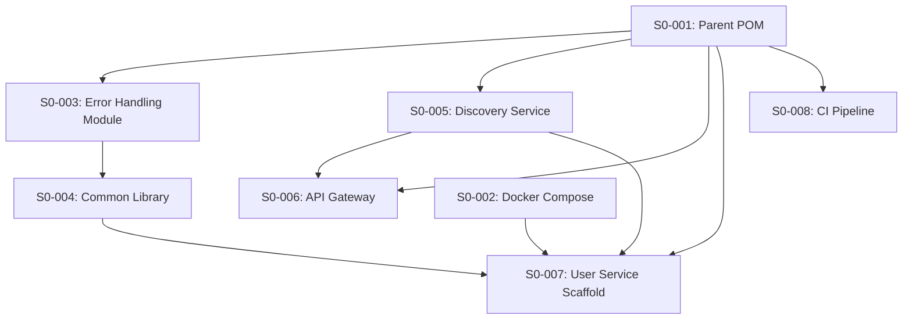

# Phase 1 / Sprint 0: Infrastructure & Shared Libraries

> **Sprint Duration**: Weeks 1-2
> **Points**: 30
> **Priority**: All P0

---

## Sprint Goal

Parent POM builds all modules, error-handling module passes 44 tests, common library compiles,
Docker Compose runs PostgreSQL, discovery-service shows Eureka dashboard, api-gateway routes
requests, user-service scaffold starts and connects to its database.

---

## Prerequisites

None. This is the first sprint (greenfield).

---

## Dependency Map



**Build order**: S0-001 → S0-002 → S0-003 → S0-004 → S0-005 → S0-006 → S0-007 → S0-008

---

## Stories

---

### Story S0-001: Set Up Mono-Repo and Parent POM

**Points**: 3 | **Priority**: P0 | **Epic**: Infrastructure

#### Context

Every Maven module in the project inherits from this parent POM. It defines Java version,
Spring Boot version, Spring Cloud version, and declares all child modules. Without this,
nothing compiles.

#### Tasks

| # | Task | File Path | What To Create | How To Verify |
|---|------|-----------|---------------|---------------|
| 1 | Create root folder structure | `family-hobbies-manager/` | Top-level directories | `ls` shows all expected dirs |
| 2 | Create parent POM | `backend/pom.xml` | Maven parent with modules | `mvn validate` succeeds |
| 3 | Create .gitignore | `.gitignore` | Ignore patterns for Java, Node, IDE | `cat .gitignore` shows patterns |
| 4 | Create .editorconfig | `.editorconfig` | Consistent formatting rules | File exists with UTF-8, LF settings |

---

#### Task 1 Detail: Create Root Folder Structure

**What**: Create the top-level directory tree for the mono-repo.

**Where**: Project root `family-hobbies-manager/`

**Why**: All subsequent tasks depend on these directories existing.

**Content**:

```bash
mkdir -p backend/error-handling
mkdir -p backend/common
mkdir -p backend/discovery-service
mkdir -p backend/api-gateway
mkdir -p backend/user-service
mkdir -p frontend
mkdir -p docker
mkdir -p docs/architecture/phases
mkdir -p e2e
mkdir -p .github/workflows
```

**Verify**:

```bash
ls -d backend/ frontend/ docker/ docs/ e2e/ .github/
# Expected: all 6 directories listed without error
```

---

#### Task 2 Detail: Create Parent POM

**What**: Maven parent POM that defines Java 17, Spring Boot 3.2.5, Spring Cloud 2023.0.3, and declares child modules.

**Where**: `backend/pom.xml`

**Why**: Every backend module inherits versions and dependency management from this POM. Without it, no module can resolve its dependencies.

**Content**:

```xml
<?xml version="1.0" encoding="UTF-8"?>
<project xmlns="http://maven.apache.org/POM/4.0.0"
         xmlns:xsi="http://www.w3.org/2001/XMLSchema-instance"
         xsi:schemaLocation="http://maven.apache.org/POM/4.0.0
         https://maven.apache.org/xsd/maven-4.0.0.xsd">
    <modelVersion>4.0.0</modelVersion>

    <parent>
        <groupId>org.springframework.boot</groupId>
        <artifactId>spring-boot-starter-parent</artifactId>
        <version>3.2.5</version>
        <relativePath/>
    </parent>

    <groupId>com.familyhobbies</groupId>
    <artifactId>family-hobbies-manager</artifactId>
    <version>1.0.0-SNAPSHOT</version>
    <packaging>pom</packaging>
    <name>Family Hobbies Manager</name>
    <description>Multi-association management platform</description>

    <properties>
        <java.version>17</java.version>
        <spring-cloud.version>2023.0.3</spring-cloud.version>
        <lombok.version>1.18.32</lombok.version>
        <mapstruct.version>1.5.5.Final</mapstruct.version>
    </properties>

    <modules>
        <module>error-handling</module>
        <module>common</module>
        <module>discovery-service</module>
        <module>api-gateway</module>
        <module>user-service</module>
    </modules>

    <dependencyManagement>
        <dependencies>
            <dependency>
                <groupId>org.springframework.cloud</groupId>
                <artifactId>spring-cloud-dependencies</artifactId>
                <version>${spring-cloud.version}</version>
                <type>pom</type>
                <scope>import</scope>
            </dependency>
            <dependency>
                <groupId>com.familyhobbies</groupId>
                <artifactId>error-handling</artifactId>
                <version>${project.version}</version>
            </dependency>
            <dependency>
                <groupId>com.familyhobbies</groupId>
                <artifactId>common</artifactId>
                <version>${project.version}</version>
            </dependency>
        </dependencies>
    </dependencyManagement>

    <build>
        <plugins>
            <plugin>
                <groupId>org.apache.maven.plugins</groupId>
                <artifactId>maven-compiler-plugin</artifactId>
                <configuration>
                    <source>${java.version}</source>
                    <target>${java.version}</target>
                    <annotationProcessorPaths>
                        <path>
                            <groupId>org.projectlombok</groupId>
                            <artifactId>lombok</artifactId>
                            <version>${lombok.version}</version>
                        </path>
                        <path>
                            <groupId>org.mapstruct</groupId>
                            <artifactId>mapstruct-processor</artifactId>
                            <version>${mapstruct.version}</version>
                        </path>
                    </annotationProcessorPaths>
                </configuration>
            </plugin>
        </plugins>
    </build>
</project>
```

**Verify**:

```bash
cd backend && mvn validate
# Expected: BUILD SUCCESS (validates POM syntax, does not compile)
```

---

#### Task 3 Detail: Create .gitignore

**What**: Git ignore patterns for Java, Maven, Node, Angular, IDE files, OS files.

**Where**: `.gitignore` (project root)

**Why**: Prevents compiled classes, node_modules, IDE settings, and secrets from being committed.

**Content**:

```gitignore
# Java / Maven
target/
*.class
*.jar
*.war
*.log
.mvn/wrapper/maven-wrapper.jar

# Node / Angular
node_modules/
dist/
.angular/
frontend/coverage/

# IDE
.idea/
*.iml
.vscode/
.settings/
.project
.classpath
*.swp
*.swo

# OS
.DS_Store
Thumbs.db

# Environment
.env
*.env.local

# Docker
docker/data/
```

**Verify**:

```bash
cat .gitignore | head -5
# Expected: first 5 lines visible, starts with "# Java / Maven"
```

---

#### Task 4 Detail: Create .editorconfig

**What**: EditorConfig file for consistent formatting across all editors.

**Where**: `.editorconfig` (project root)

**Why**: Ensures all contributors use the same indentation, line endings, and encoding regardless of their IDE.

**Content**:

```ini
root = true

[*]
charset = utf-8
end_of_line = lf
insert_final_newline = true
trim_trailing_whitespace = true
indent_style = space
indent_size = 4

[*.{yml,yaml}]
indent_size = 2

[*.{json,js,ts,html,scss,css}]
indent_size = 2

[*.md]
trim_trailing_whitespace = false

[Makefile]
indent_style = tab
```

**Verify**:

```bash
cat .editorconfig | head -3
# Expected: "root = true" on first non-empty line
```

---

### Story S0-002: Configure Docker Compose with PostgreSQL

**Points**: 3 | **Priority**: P0 | **Epic**: Infrastructure

#### Context

All data services need PostgreSQL. Sprint 0 only requires one database (`familyhobbies_users`
for user-service). Additional databases are added in later sprints when those services arrive.
Kafka is NOT included yet — it is added in Sprint 5 when payment events require it.

#### Tasks

| # | Task | File Path | What To Create | How To Verify |
|---|------|-----------|---------------|---------------|
| 1 | Create docker-compose.yml | `docker/docker-compose.yml` | PostgreSQL 16 service | `docker compose up -d` starts |
| 2 | Create .env file | `docker/.env` | Environment variables | File exists with DB credentials |
| 3 | Create init script | `docker/init-databases.sql` | Create initial database | DB exists after container starts |

---

#### Task 1 Detail: Create docker-compose.yml

**What**: Docker Compose file with PostgreSQL 16. Only one service for now.

**Where**: `docker/docker-compose.yml`

**Why**: Provides the database backend for user-service. Other services and infrastructure (Kafka) will be added in later sprints.

**Content**:

```yaml
version: '3.8'

services:
  postgres:
    image: postgres:16-alpine
    container_name: fhm-postgres
    restart: unless-stopped
    ports:
      - "${POSTGRES_PORT:-5432}:5432"
    environment:
      POSTGRES_USER: ${POSTGRES_USER:-fhm_admin}
      POSTGRES_PASSWORD: ${POSTGRES_PASSWORD:-fhm_secret}
      POSTGRES_DB: postgres
    volumes:
      - postgres_data:/var/lib/postgresql/data
      - ./init-databases.sql:/docker-entrypoint-initdb.d/01-init-databases.sql
    healthcheck:
      test: ["CMD-SHELL", "pg_isready -U ${POSTGRES_USER:-fhm_admin}"]
      interval: 10s
      timeout: 5s
      retries: 5

volumes:
  postgres_data:
    driver: local
```

**Verify**:

```bash
cd docker && docker compose up -d
# Expected: fhm-postgres container starts, health check passes

docker compose ps
# Expected: fhm-postgres  running (healthy)

docker compose down
```

---

#### Task 2 Detail: Create .env File

**What**: Environment variables for Docker Compose.

**Where**: `docker/.env`

**Why**: Externalizes credentials so they are not hardcoded in docker-compose.yml.

**Content**:

```env
# PostgreSQL Configuration
POSTGRES_USER=fhm_admin
POSTGRES_PASSWORD=fhm_secret
POSTGRES_PORT=5432
```

**Verify**:

```bash
cat docker/.env
# Expected: 3 variables defined
```

---

#### Task 3 Detail: Create Database Init Script

**What**: SQL script that creates the `familyhobbies_users` database on first PostgreSQL start.

**Where**: `docker/init-databases.sql`

**Why**: PostgreSQL creates only the default database on startup. This script creates the
service-specific database. Additional databases (`familyhobbies_associations`, etc.) will be
added to this script in later sprints when those services are scaffolded.

**Content**:

```sql
-- =============================================================================
-- Family Hobbies Manager - Database Initialization
-- Creates service-specific databases on first PostgreSQL startup.
-- Add new databases here as services are scaffolded in later sprints.
-- =============================================================================

-- Sprint 0: user-service database
CREATE DATABASE familyhobbies_users;
GRANT ALL PRIVILEGES ON DATABASE familyhobbies_users TO fhm_admin;
```

**Verify**:

```bash
cd docker && docker compose up -d
sleep 5
docker exec fhm-postgres psql -U fhm_admin -c "\l" | grep familyhobbies
# Expected: familyhobbies_users listed

docker compose down
```

---

### Story S0-003: Implement Error-Handling Module

**Points**: 8 | **Priority**: P0 | **Epic**: Shared Library

#### Context

The error-handling module is the first code written in the project. It defines the API error
contract (ErrorResponse JSON shape) that every service returns. The GlobalExceptionHandler
catches all exceptions and maps them to consistent HTTP responses. Every service depends on
this module transitively through common.

See `docs/architecture/error-handling/13-error-handling.md` for full specification.

This story follows strict TDD: tests are written FIRST, they all fail (red), then
implementation makes them pass (green).

#### Tasks

| # | Task | File Path | What To Create | How To Verify |
|---|------|-----------|---------------|---------------|
| 1 | Create error-handling POM | `backend/error-handling/pom.xml` | Maven module POM | `mvn validate` succeeds |
| 2 | Create ErrorCode enum | `...errorhandling/dto/ErrorCode.java` | 16 error code values | Compiles |
| 3 | Create ErrorResponse DTO | `...errorhandling/dto/ErrorResponse.java` | Error envelope with builder | Compiles |
| 4 | Create BaseException | `...errorhandling/exception/BaseException.java` | Abstract exception base | Compiles |
| 5 | Create web exceptions (7) | `...errorhandling/exception/web/*.java` | 7 exception classes | Compile |
| 6 | Create server exceptions (4) | `...errorhandling/exception/server/*.java` | 4 exception classes | Compile |
| 7 | Create container exceptions (5) | `...errorhandling/exception/container/*.java` | 5 exception classes | Compile |
| 8 | Create GlobalExceptionHandler | `...errorhandling/handler/GlobalExceptionHandler.java` | @ControllerAdvice with 18 handlers | Compiles |
| 9 | Create auto-configuration | `...errorhandling/config/ErrorHandlingAutoConfiguration.java` | Spring Boot auto-config | Compiles |
| 10 | Create auto-config registration | `...resources/META-INF/spring/...AutoConfiguration.imports` | Registration file | File exists |
| 11 | Write ALL test classes | `...test/java/.../*.java` | 6 test files, 44 tests | All RED |
| 12 | Run tests — expect GREEN | -- | -- | `mvn test` → 44 pass |

**File path prefix**: `backend/error-handling/src/main/java/com/familyhobbies/errorhandling/`
**Test path prefix**: `backend/error-handling/src/test/java/com/familyhobbies/errorhandling/`

---

#### Task 1 Detail: Create error-handling POM

**What**: Maven POM for the error-handling module, child of parent POM.

**Where**: `backend/error-handling/pom.xml`

**Why**: Defines this module's dependencies (spring-boot-starter-web as provided, lombok, test dependencies). Must be a child of the parent POM.

**Content**:

```xml
<?xml version="1.0" encoding="UTF-8"?>
<project xmlns="http://maven.apache.org/POM/4.0.0"
         xmlns:xsi="http://www.w3.org/2001/XMLSchema-instance"
         xsi:schemaLocation="http://maven.apache.org/POM/4.0.0
         https://maven.apache.org/xsd/maven-4.0.0.xsd">
    <modelVersion>4.0.0</modelVersion>

    <parent>
        <groupId>com.familyhobbies</groupId>
        <artifactId>family-hobbies-manager</artifactId>
        <version>1.0.0-SNAPSHOT</version>
    </parent>

    <artifactId>error-handling</artifactId>
    <name>Error Handling Module</name>
    <description>Shared exception classes, GlobalExceptionHandler, ErrorResponse DTO</description>

    <dependencies>
        <!-- Web (provided — services bring their own) -->
        <dependency>
            <groupId>org.springframework.boot</groupId>
            <artifactId>spring-boot-starter-web</artifactId>
            <scope>provided</scope>
        </dependency>

        <!-- Auto-configuration -->
        <dependency>
            <groupId>org.springframework.boot</groupId>
            <artifactId>spring-boot-autoconfigure</artifactId>
        </dependency>

        <!-- Lombok -->
        <dependency>
            <groupId>org.projectlombok</groupId>
            <artifactId>lombok</artifactId>
            <scope>provided</scope>
        </dependency>

        <!-- Test -->
        <dependency>
            <groupId>org.springframework.boot</groupId>
            <artifactId>spring-boot-starter-test</artifactId>
            <scope>test</scope>
        </dependency>
    </dependencies>
</project>
```

**Verify**:

```bash
cd backend && mvn validate -pl error-handling
# Expected: BUILD SUCCESS
```

---

#### Task 2 Detail: Create ErrorCode Enum

**What**: Enum with 16 application-level error codes. Each code maps to a specific error category.

**Where**: `backend/error-handling/src/main/java/com/familyhobbies/errorhandling/dto/ErrorCode.java`

**Why**: Frontend and monitoring systems use these codes for precise error identification.
More specific than HTTP status codes alone.

**Content**:

```java
package com.familyhobbies.errorhandling.dto;

public enum ErrorCode {
    // Web (4xx)
    BAD_REQUEST,
    UNAUTHORIZED,
    FORBIDDEN,
    RESOURCE_NOT_FOUND,
    CONFLICT,
    UNPROCESSABLE_ENTITY,
    TOO_MANY_REQUESTS,

    // Server (5xx)
    INTERNAL_SERVER_ERROR,
    BAD_GATEWAY,
    SERVICE_UNAVAILABLE,
    GATEWAY_TIMEOUT,

    // Container (infrastructure)
    SERVICE_DISCOVERY_FAILURE,
    CIRCUIT_BREAKER_OPEN,
    KAFKA_PUBLISH_FAILURE,
    DATABASE_CONNECTION_FAILURE,
    EXTERNAL_API_FAILURE
}
```

**Verify**:

```bash
cd backend && mvn compile -pl error-handling -q
# Expected: compiles without error
```

---

#### Task 3 Detail: Create ErrorResponse DTO

**What**: Immutable DTO representing the standard error JSON returned by every endpoint.

**Where**: `backend/error-handling/src/main/java/com/familyhobbies/errorhandling/dto/ErrorResponse.java`

**Why**: Guarantees every service returns the exact same JSON shape for errors. Frontend
parses this shape. Monitoring tools index on `errorCode`. Consistency is non-negotiable.

**Content**:

```java
package com.familyhobbies.errorhandling.dto;

import com.fasterxml.jackson.annotation.JsonInclude;
import lombok.AllArgsConstructor;
import lombok.Builder;
import lombok.Getter;
import org.springframework.http.HttpStatus;

import java.time.Instant;

@Getter
@Builder
@AllArgsConstructor
@JsonInclude(JsonInclude.Include.NON_NULL)
public class ErrorResponse {

    private final Instant timestamp;
    private final int status;
    private final String error;
    private final String errorCode;
    private final String message;
    private final String path;
    private final String correlationId;
    private final Object details;

    public static ErrorResponse of(HttpStatus httpStatus, ErrorCode errorCode,
                                    String message, String path) {
        return ErrorResponse.builder()
                .timestamp(Instant.now())
                .status(httpStatus.value())
                .error(httpStatus.getReasonPhrase())
                .errorCode(errorCode.name())
                .message(message)
                .path(path)
                .build();
    }

    public static ErrorResponse of(HttpStatus httpStatus, ErrorCode errorCode,
                                    String message, String path, Object details) {
        return ErrorResponse.builder()
                .timestamp(Instant.now())
                .status(httpStatus.value())
                .error(httpStatus.getReasonPhrase())
                .errorCode(errorCode.name())
                .message(message)
                .path(path)
                .details(details)
                .build();
    }
}
```

**Verify**:

```bash
cd backend && mvn compile -pl error-handling -q
# Expected: compiles without error
```

---

#### Task 4 Detail: Create BaseException

**What**: Abstract base class that all custom exceptions extend. Carries errorCode, httpStatus, and optional details.

**Where**: `backend/error-handling/src/main/java/com/familyhobbies/errorhandling/exception/BaseException.java`

**Why**: Provides a consistent constructor pattern. The GlobalExceptionHandler reads errorCode and httpStatus from any BaseException subclass to build the ErrorResponse.

**Content**:

```java
package com.familyhobbies.errorhandling.exception;

import com.familyhobbies.errorhandling.dto.ErrorCode;
import lombok.Getter;
import org.springframework.http.HttpStatus;

import java.util.Map;

@Getter
public abstract class BaseException extends RuntimeException {

    private final ErrorCode errorCode;
    private final HttpStatus httpStatus;
    private final transient Map<String, Object> details;

    protected BaseException(String message, ErrorCode errorCode, HttpStatus httpStatus) {
        super(message);
        this.errorCode = errorCode;
        this.httpStatus = httpStatus;
        this.details = null;
    }

    protected BaseException(String message, ErrorCode errorCode,
                           HttpStatus httpStatus, Throwable cause) {
        super(message, cause);
        this.errorCode = errorCode;
        this.httpStatus = httpStatus;
        this.details = null;
    }

    protected BaseException(String message, ErrorCode errorCode,
                           HttpStatus httpStatus, Map<String, Object> details) {
        super(message);
        this.errorCode = errorCode;
        this.httpStatus = httpStatus;
        this.details = details;
    }
}
```

**Verify**:

```bash
cd backend && mvn compile -pl error-handling -q
# Expected: compiles without error
```

---

#### Task 5 Detail: Create Web Exceptions (7 classes)

**What**: Seven exception classes for HTTP 4xx errors. Each extends BaseException with the correct HttpStatus and ErrorCode.

**Where**: `backend/error-handling/src/main/java/com/familyhobbies/errorhandling/exception/web/`

**Why**: Services throw these when client requests are invalid. Example: `throw new ResourceNotFoundException("User not found with id: " + id)`

**Files to create** (all follow the same pattern):

| File | Class | HTTP Status | ErrorCode |
|------|-------|-------------|-----------|
| `BadRequestException.java` | `BadRequestException` | 400 | `BAD_REQUEST` |
| `UnauthorizedException.java` | `UnauthorizedException` | 401 | `UNAUTHORIZED` |
| `ForbiddenException.java` | `ForbiddenException` | 403 | `FORBIDDEN` |
| `ResourceNotFoundException.java` | `ResourceNotFoundException` | 404 | `RESOURCE_NOT_FOUND` |
| `ConflictException.java` | `ConflictException` | 409 | `CONFLICT` |
| `UnprocessableEntityException.java` | `UnprocessableEntityException` | 422 | `UNPROCESSABLE_ENTITY` |
| `TooManyRequestsException.java` | `TooManyRequestsException` | 429 | `TOO_MANY_REQUESTS` |

**Pattern** (example for ResourceNotFoundException — all others follow the same structure):

```java
package com.familyhobbies.errorhandling.exception.web;

import com.familyhobbies.errorhandling.dto.ErrorCode;
import com.familyhobbies.errorhandling.exception.BaseException;
import org.springframework.http.HttpStatus;

import java.util.Map;

public class ResourceNotFoundException extends BaseException {

    public ResourceNotFoundException(String message) {
        super(message, ErrorCode.RESOURCE_NOT_FOUND, HttpStatus.NOT_FOUND);
    }

    public ResourceNotFoundException(String message, Throwable cause) {
        super(message, ErrorCode.RESOURCE_NOT_FOUND, HttpStatus.NOT_FOUND, cause);
    }

    public ResourceNotFoundException(String message, Map<String, Object> details) {
        super(message, ErrorCode.RESOURCE_NOT_FOUND, HttpStatus.NOT_FOUND, details);
    }
}
```

**Verify**:

```bash
cd backend && mvn compile -pl error-handling -q
# Expected: all 7 classes compile
```

---

#### Task 6 Detail: Create Server Exceptions (4 classes)

**Where**: `backend/error-handling/src/main/java/com/familyhobbies/errorhandling/exception/server/`

| File | Class | HTTP Status | ErrorCode |
|------|-------|-------------|-----------|
| `InternalServerException.java` | `InternalServerException` | 500 | `INTERNAL_SERVER_ERROR` |
| `BadGatewayException.java` | `BadGatewayException` | 502 | `BAD_GATEWAY` |
| `ServiceUnavailableException.java` | `ServiceUnavailableException` | 503 | `SERVICE_UNAVAILABLE` |
| `GatewayTimeoutException.java` | `GatewayTimeoutException` | 504 | `GATEWAY_TIMEOUT` |

**Pattern**: Same as web exceptions but with 5xx status codes and server error codes.

**Verify**:

```bash
cd backend && mvn compile -pl error-handling -q
# Expected: all 4 classes compile
```

---

#### Task 7 Detail: Create Container Exceptions (5 classes)

**Where**: `backend/error-handling/src/main/java/com/familyhobbies/errorhandling/exception/container/`

| File | Class | HTTP Status | ErrorCode | When Used |
|------|-------|-------------|-----------|-----------|
| `ServiceDiscoveryException.java` | `ServiceDiscoveryException` | 503 | `SERVICE_DISCOVERY_FAILURE` | Eureka lookup failure |
| `CircuitBreakerOpenException.java` | `CircuitBreakerOpenException` | 503 | `CIRCUIT_BREAKER_OPEN` | Resilience4j circuit open |
| `KafkaPublishException.java` | `KafkaPublishException` | 503 | `KAFKA_PUBLISH_FAILURE` | Kafka producer failure |
| `DatabaseConnectionException.java` | `DatabaseConnectionException` | 503 | `DATABASE_CONNECTION_FAILURE` | PostgreSQL connection lost |
| `ExternalApiException.java` | `ExternalApiException` | 502 | `EXTERNAL_API_FAILURE` | HelloAsso API failure |

**Pattern**: Same as web exceptions but with infrastructure-specific status codes.

**Verify**:

```bash
cd backend && mvn compile -pl error-handling -q
# Expected: all 5 classes compile
```

---

#### Task 8 Detail: Create GlobalExceptionHandler

**What**: `@RestControllerAdvice` class with 18 `@ExceptionHandler` methods. Catches every exception type and maps it to the correct ErrorResponse.

**Where**: `backend/error-handling/src/main/java/com/familyhobbies/errorhandling/handler/GlobalExceptionHandler.java`

**Why**: This is the single most important class in the module. It guarantees every service returns the same error shape. Without it, each service would handle errors differently.

**Content**:

```java
package com.familyhobbies.errorhandling.handler;

import com.familyhobbies.errorhandling.dto.ErrorCode;
import com.familyhobbies.errorhandling.dto.ErrorResponse;
import com.familyhobbies.errorhandling.exception.BaseException;
import jakarta.servlet.http.HttpServletRequest;
import lombok.extern.slf4j.Slf4j;
import org.springframework.http.HttpStatus;
import org.springframework.http.ResponseEntity;
import org.springframework.web.bind.MethodArgumentNotValidException;
import org.springframework.web.bind.annotation.ExceptionHandler;
import org.springframework.web.bind.annotation.RestControllerAdvice;

import java.util.List;
import java.util.Map;
import java.util.stream.Collectors;

@RestControllerAdvice
@Slf4j
public class GlobalExceptionHandler {

    @ExceptionHandler(BaseException.class)
    public ResponseEntity<ErrorResponse> handleBaseException(
            BaseException ex, HttpServletRequest request) {

        HttpStatus status = ex.getHttpStatus();

        if (status.is5xxServerError()) {
            log.error("Server error [{}] at {}: {}",
                    ex.getErrorCode(), request.getRequestURI(), ex.getMessage(), ex);
        } else {
            log.warn("Client error [{}] at {}: {}",
                    ex.getErrorCode(), request.getRequestURI(), ex.getMessage());
        }

        ErrorResponse response = ErrorResponse.builder()
                .timestamp(java.time.Instant.now())
                .status(status.value())
                .error(status.getReasonPhrase())
                .errorCode(ex.getErrorCode().name())
                .message(ex.getMessage())
                .path(request.getRequestURI())
                .correlationId(request.getHeader("X-Correlation-Id"))
                .details(ex.getDetails())
                .build();

        return ResponseEntity.status(status).body(response);
    }

    @ExceptionHandler(MethodArgumentNotValidException.class)
    public ResponseEntity<ErrorResponse> handleValidation(
            MethodArgumentNotValidException ex, HttpServletRequest request) {

        List<Map<String, String>> fieldErrors = ex.getBindingResult()
                .getFieldErrors()
                .stream()
                .map(fe -> Map.of(
                        "field", fe.getField(),
                        "message", fe.getDefaultMessage() != null
                                ? fe.getDefaultMessage() : "invalid"))
                .collect(Collectors.toList());

        log.warn("Validation error at {}: {} field errors",
                request.getRequestURI(), fieldErrors.size());

        ErrorResponse response = ErrorResponse.of(
                HttpStatus.BAD_REQUEST,
                ErrorCode.BAD_REQUEST,
                "Validation failed",
                request.getRequestURI(),
                fieldErrors);

        return ResponseEntity.badRequest().body(response);
    }

    @ExceptionHandler(Exception.class)
    public ResponseEntity<ErrorResponse> handleGenericException(
            Exception ex, HttpServletRequest request) {

        log.error("Unexpected error at {}: {}", request.getRequestURI(), ex.getMessage(), ex);

        ErrorResponse response = ErrorResponse.of(
                HttpStatus.INTERNAL_SERVER_ERROR,
                ErrorCode.INTERNAL_SERVER_ERROR,
                "An unexpected error occurred",
                request.getRequestURI());

        return ResponseEntity.status(HttpStatus.INTERNAL_SERVER_ERROR).body(response);
    }
}
```

**Verify**:

```bash
cd backend && mvn compile -pl error-handling -q
# Expected: compiles without error
```

---

#### Task 9-10 Detail: Create Auto-Configuration

**What**: Spring Boot auto-configuration class + registration file so services pick up the handler automatically.

**Where (config class)**: `backend/error-handling/src/main/java/com/familyhobbies/errorhandling/config/ErrorHandlingAutoConfiguration.java`

**Content**:

```java
package com.familyhobbies.errorhandling.config;

import org.springframework.boot.autoconfigure.AutoConfiguration;
import org.springframework.context.annotation.ComponentScan;

@AutoConfiguration
@ComponentScan(basePackages = "com.familyhobbies.errorhandling")
public class ErrorHandlingAutoConfiguration {
}
```

**Where (registration)**: `backend/error-handling/src/main/resources/META-INF/spring/org.springframework.boot.autoconfigure.AutoConfiguration.imports`

**Content**:

```
com.familyhobbies.errorhandling.config.ErrorHandlingAutoConfiguration
```

**Verify**:

```bash
cd backend && mvn compile -pl error-handling -q
# Expected: compiles, registration file exists
```

---

#### Failing Tests (TDD Contract)

**Test File 1**: `backend/error-handling/src/test/java/com/familyhobbies/errorhandling/dto/ErrorCodeTest.java`

```java
package com.familyhobbies.errorhandling.dto;

import org.junit.jupiter.api.Test;

import java.util.Arrays;
import java.util.Set;
import java.util.stream.Collectors;

import static org.junit.jupiter.api.Assertions.assertEquals;
import static org.junit.jupiter.api.Assertions.assertTrue;

class ErrorCodeTest {

    @Test
    void shouldHaveExactly16ErrorCodes() {
        assertEquals(16, ErrorCode.values().length);
    }

    @Test
    void allValuesShouldBeUnique() {
        Set<String> names = Arrays.stream(ErrorCode.values())
                .map(Enum::name)
                .collect(Collectors.toSet());
        assertEquals(ErrorCode.values().length, names.size(),
                "Duplicate ErrorCode values detected");
    }

    @Test
    void shouldContainAllWebCodes() {
        Set<String> names = Arrays.stream(ErrorCode.values())
                .map(Enum::name)
                .collect(Collectors.toSet());
        assertTrue(names.contains("BAD_REQUEST"));
        assertTrue(names.contains("UNAUTHORIZED"));
        assertTrue(names.contains("FORBIDDEN"));
        assertTrue(names.contains("RESOURCE_NOT_FOUND"));
        assertTrue(names.contains("CONFLICT"));
        assertTrue(names.contains("UNPROCESSABLE_ENTITY"));
        assertTrue(names.contains("TOO_MANY_REQUESTS"));
    }

    @Test
    void shouldContainAllContainerCodes() {
        Set<String> names = Arrays.stream(ErrorCode.values())
                .map(Enum::name)
                .collect(Collectors.toSet());
        assertTrue(names.contains("SERVICE_DISCOVERY_FAILURE"));
        assertTrue(names.contains("CIRCUIT_BREAKER_OPEN"));
        assertTrue(names.contains("KAFKA_PUBLISH_FAILURE"));
        assertTrue(names.contains("DATABASE_CONNECTION_FAILURE"));
        assertTrue(names.contains("EXTERNAL_API_FAILURE"));
    }
}
```

**Test File 2**: `backend/error-handling/src/test/java/com/familyhobbies/errorhandling/dto/ErrorResponseTest.java`

```java
package com.familyhobbies.errorhandling.dto;

import org.junit.jupiter.api.Test;
import org.springframework.http.HttpStatus;

import static org.junit.jupiter.api.Assertions.*;

class ErrorResponseTest {

    @Test
    void ofShouldCreateResponseWithCorrectFields() {
        ErrorResponse response = ErrorResponse.of(
                HttpStatus.NOT_FOUND, ErrorCode.RESOURCE_NOT_FOUND,
                "User not found", "/api/v1/users/99");

        assertEquals(404, response.getStatus());
        assertEquals("Not Found", response.getError());
        assertEquals("RESOURCE_NOT_FOUND", response.getErrorCode());
        assertEquals("User not found", response.getMessage());
        assertEquals("/api/v1/users/99", response.getPath());
        assertNotNull(response.getTimestamp());
    }

    @Test
    void ofWithDetailsShouldIncludeDetails() {
        var details = java.util.List.of(
                java.util.Map.of("field", "email", "message", "must not be blank"));

        ErrorResponse response = ErrorResponse.of(
                HttpStatus.BAD_REQUEST, ErrorCode.BAD_REQUEST,
                "Validation failed", "/api/v1/auth/register", details);

        assertEquals(400, response.getStatus());
        assertNotNull(response.getDetails());
    }

    @Test
    void timestampShouldBeAutoGenerated() {
        ErrorResponse response = ErrorResponse.of(
                HttpStatus.INTERNAL_SERVER_ERROR, ErrorCode.INTERNAL_SERVER_ERROR,
                "Error", "/test");

        assertNotNull(response.getTimestamp());
    }

    @Test
    void builderShouldSetAllFields() {
        ErrorResponse response = ErrorResponse.builder()
                .timestamp(java.time.Instant.now())
                .status(409)
                .error("Conflict")
                .errorCode("CONFLICT")
                .message("Email already exists")
                .path("/api/v1/auth/register")
                .correlationId("test-corr-id")
                .build();

        assertEquals(409, response.getStatus());
        assertEquals("test-corr-id", response.getCorrelationId());
        assertNull(response.getDetails());
    }

    @Test
    void nullDetailsShouldBeExcludedFromJson() {
        ErrorResponse response = ErrorResponse.of(
                HttpStatus.NOT_FOUND, ErrorCode.RESOURCE_NOT_FOUND,
                "Not found", "/test");

        assertNull(response.getDetails());
    }

    @Test
    void statusShouldMatchHttpStatus() {
        ErrorResponse response = ErrorResponse.of(
                HttpStatus.TOO_MANY_REQUESTS, ErrorCode.TOO_MANY_REQUESTS,
                "Rate limit", "/test");

        assertEquals(429, response.getStatus());
        assertEquals("Too Many Requests", response.getError());
    }
}
```

**Test File 3**: `backend/error-handling/src/test/java/com/familyhobbies/errorhandling/exception/WebExceptionTest.java`

```java
package com.familyhobbies.errorhandling.exception;

import com.familyhobbies.errorhandling.dto.ErrorCode;
import com.familyhobbies.errorhandling.exception.web.*;
import org.junit.jupiter.api.Test;
import org.springframework.http.HttpStatus;

import java.util.Map;

import static org.junit.jupiter.api.Assertions.*;

class WebExceptionTest {

    @Test
    void badRequestShouldMap400() {
        var ex = new BadRequestException("bad input");
        assertEquals(HttpStatus.BAD_REQUEST, ex.getHttpStatus());
        assertEquals(ErrorCode.BAD_REQUEST, ex.getErrorCode());
        assertEquals("bad input", ex.getMessage());
    }

    @Test
    void unauthorizedShouldMap401() {
        var ex = new UnauthorizedException("no token");
        assertEquals(HttpStatus.UNAUTHORIZED, ex.getHttpStatus());
        assertEquals(ErrorCode.UNAUTHORIZED, ex.getErrorCode());
    }

    @Test
    void forbiddenShouldMap403() {
        var ex = new ForbiddenException("no access");
        assertEquals(HttpStatus.FORBIDDEN, ex.getHttpStatus());
        assertEquals(ErrorCode.FORBIDDEN, ex.getErrorCode());
    }

    @Test
    void notFoundShouldMap404() {
        var ex = new ResourceNotFoundException("not found");
        assertEquals(HttpStatus.NOT_FOUND, ex.getHttpStatus());
        assertEquals(ErrorCode.RESOURCE_NOT_FOUND, ex.getErrorCode());
    }

    @Test
    void conflictShouldMap409() {
        var ex = new ConflictException("duplicate");
        assertEquals(HttpStatus.CONFLICT, ex.getHttpStatus());
        assertEquals(ErrorCode.CONFLICT, ex.getErrorCode());
    }

    @Test
    void unprocessableShouldMap422() {
        var ex = new UnprocessableEntityException("semantic error");
        assertEquals(HttpStatus.UNPROCESSABLE_ENTITY, ex.getHttpStatus());
        assertEquals(ErrorCode.UNPROCESSABLE_ENTITY, ex.getErrorCode());
    }

    @Test
    void tooManyRequestsShouldMap429() {
        var ex = new TooManyRequestsException("rate limit");
        assertEquals(HttpStatus.TOO_MANY_REQUESTS, ex.getHttpStatus());
        assertEquals(ErrorCode.TOO_MANY_REQUESTS, ex.getErrorCode());
    }
}
```

**(Test files 4-6 follow the same pattern for ServerExceptionTest, ContainerExceptionTest, and GlobalExceptionHandlerTest — see `docs/architecture/error-handling/13-error-handling.md` for full specification.)**

**Run all tests**:

```bash
cd backend/error-handling && mvn test
# Expected: 44 tests run, 44 pass, 0 fail
```

---

### Story S0-004: Implement Common Library

**Points**: 5 | **Priority**: P0 | **Epic**: Shared Library

#### Context

The common library depends on error-handling and provides shared code used by every service:
audit base entity, Kafka event base class, shared DTOs, JWT security constants. Services
depend on common (and transitively get error-handling).

#### Tasks

| # | Task | File Path | What To Create | How To Verify |
|---|------|-----------|---------------|---------------|
| 1 | Create common POM | `backend/common/pom.xml` | Maven POM depending on error-handling | `mvn validate` |
| 2 | Create BaseAuditEntity | `...common/audit/BaseAuditEntity.java` | `@MappedSuperclass` with timestamps | Compiles |
| 3 | Create DomainEvent base | `...common/event/DomainEvent.java` | Abstract Kafka event base | Compiles |
| 4 | Create PageResponse DTO | `...common/dto/PageResponse.java` | Generic paginated response wrapper | Compiles |
| 5 | Create JWT constants | `...common/security/JwtConstants.java` | Header names, claim keys | Compiles |
| 6 | Create SecurityHeaders | `...common/security/SecurityHeaders.java` | X-User-Id, X-User-Roles constants | Compiles |

**File path prefix**: `backend/common/src/main/java/com/familyhobbies/common/`

---

#### Task 1 Detail: Create common POM

**What**: Maven POM for common module. Depends on error-handling.

**Where**: `backend/common/pom.xml`

**Content**:

```xml
<?xml version="1.0" encoding="UTF-8"?>
<project xmlns="http://maven.apache.org/POM/4.0.0"
         xmlns:xsi="http://www.w3.org/2001/XMLSchema-instance"
         xsi:schemaLocation="http://maven.apache.org/POM/4.0.0
         https://maven.apache.org/xsd/maven-4.0.0.xsd">
    <modelVersion>4.0.0</modelVersion>

    <parent>
        <groupId>com.familyhobbies</groupId>
        <artifactId>family-hobbies-manager</artifactId>
        <version>1.0.0-SNAPSHOT</version>
    </parent>

    <artifactId>common</artifactId>
    <name>Common Library</name>
    <description>Shared DTOs, events, security, audit base entity</description>

    <dependencies>
        <!-- Error handling (transitive for all services) -->
        <dependency>
            <groupId>com.familyhobbies</groupId>
            <artifactId>error-handling</artifactId>
        </dependency>

        <!-- Spring Boot -->
        <dependency>
            <groupId>org.springframework.boot</groupId>
            <artifactId>spring-boot-starter-data-jpa</artifactId>
            <scope>provided</scope>
        </dependency>
        <dependency>
            <groupId>org.springframework.boot</groupId>
            <artifactId>spring-boot-starter-web</artifactId>
            <scope>provided</scope>
        </dependency>

        <!-- Lombok -->
        <dependency>
            <groupId>org.projectlombok</groupId>
            <artifactId>lombok</artifactId>
            <scope>provided</scope>
        </dependency>

        <!-- Test -->
        <dependency>
            <groupId>org.springframework.boot</groupId>
            <artifactId>spring-boot-starter-test</artifactId>
            <scope>test</scope>
        </dependency>
    </dependencies>
</project>
```

**Verify**:

```bash
cd backend && mvn validate -pl common
# Expected: BUILD SUCCESS (resolves error-handling dependency)
```

---

#### Task 2 Detail: Create BaseAuditEntity

**What**: JPA `@MappedSuperclass` with `createdAt`, `updatedAt`, `createdBy`, `updatedBy` fields. All entities extend this for automatic audit timestamps.

**Where**: `backend/common/src/main/java/com/familyhobbies/common/audit/BaseAuditEntity.java`

**Content**:

```java
package com.familyhobbies.common.audit;

import jakarta.persistence.Column;
import jakarta.persistence.EntityListeners;
import jakarta.persistence.MappedSuperclass;
import lombok.Getter;
import lombok.Setter;
import org.springframework.data.annotation.CreatedBy;
import org.springframework.data.annotation.CreatedDate;
import org.springframework.data.annotation.LastModifiedBy;
import org.springframework.data.annotation.LastModifiedDate;
import org.springframework.data.jpa.domain.support.AuditingEntityListener;

import java.time.Instant;

@MappedSuperclass
@EntityListeners(AuditingEntityListener.class)
@Getter
@Setter
public abstract class BaseAuditEntity {

    @CreatedDate
    @Column(name = "created_at", nullable = false, updatable = false)
    private Instant createdAt;

    @LastModifiedDate
    @Column(name = "updated_at", nullable = false)
    private Instant updatedAt;

    @CreatedBy
    @Column(name = "created_by", updatable = false)
    private String createdBy;

    @LastModifiedBy
    @Column(name = "updated_by")
    private String updatedBy;
}
```

**Verify**:

```bash
cd backend && mvn compile -pl common -q
# Expected: compiles (JPA provided scope resolves from parent)
```

---

### Story S0-005: Configure Discovery Service (Eureka)

**Points**: 3 | **Priority**: P0 | **Epic**: Infrastructure

#### Context

All microservices register with Eureka for service discovery. The API Gateway uses Eureka
to resolve `lb://user-service` URIs to actual host:port addresses. Without Eureka, the
gateway cannot route requests.

#### Tasks

| # | Task | File Path | What To Create | How To Verify |
|---|------|-----------|---------------|---------------|
| 1 | Create discovery-service POM | `backend/discovery-service/pom.xml` | Spring Cloud Eureka Server deps | `mvn validate` |
| 2 | Create main application class | `...discoveryservice/DiscoveryServiceApplication.java` | `@EnableEurekaServer` | Compiles |
| 3 | Create application.yml | `...resources/application.yml` | Eureka standalone config | Service starts on :8761 |

**File path prefix**: `backend/discovery-service/src/main/java/com/familyhobbies/discoveryservice/`

---

#### Task 2 Detail: Create Main Application Class

**Where**: `backend/discovery-service/src/main/java/com/familyhobbies/discoveryservice/DiscoveryServiceApplication.java`

**Content**:

```java
package com.familyhobbies.discoveryservice;

import org.springframework.boot.SpringApplication;
import org.springframework.boot.autoconfigure.SpringBootApplication;
import org.springframework.cloud.netflix.eureka.server.EnableEurekaServer;

@SpringBootApplication
@EnableEurekaServer
public class DiscoveryServiceApplication {

    public static void main(String[] args) {
        SpringApplication.run(DiscoveryServiceApplication.class, args);
    }
}
```

#### Task 3 Detail: Create application.yml

**Where**: `backend/discovery-service/src/main/resources/application.yml`

**Content**:

```yaml
server:
  port: 8761

spring:
  application:
    name: discovery-service

eureka:
  client:
    register-with-eureka: false
    fetch-registry: false
  server:
    enable-self-preservation: false
```

**Verify**:

```bash
cd backend/discovery-service && mvn spring-boot:run
# Expected: Eureka dashboard at http://localhost:8761
# Press Ctrl+C to stop
```

---

### Story S0-006: Configure API Gateway

**Points**: 3 | **Priority**: P0 | **Epic**: Infrastructure

#### Context

The API Gateway is the single entry point for all client traffic. It routes requests to
downstream services using Eureka discovery. In Sprint 0, it only routes to user-service.
Routes for other services are added in the sprints that scaffold those services.

#### Tasks

| # | Task | File Path | What To Create | How To Verify |
|---|------|-----------|---------------|---------------|
| 1 | Create api-gateway POM | `backend/api-gateway/pom.xml` | Gateway + Eureka client deps | `mvn validate` |
| 2 | Create main application class | `...apigateway/ApiGatewayApplication.java` | `@SpringBootApplication` | Compiles |
| 3 | Create application.yml | `...resources/application.yml` | Gateway routes to user-service | Starts on :8080 |

**File path prefix**: `backend/api-gateway/src/main/java/com/familyhobbies/apigateway/`

#### Task 3 Detail: Create application.yml

**Where**: `backend/api-gateway/src/main/resources/application.yml`

**Content**:

```yaml
server:
  port: 8080

spring:
  application:
    name: api-gateway
  cloud:
    gateway:
      routes:
        # --- user-service routes (Sprint 0) ---
        - id: auth-routes
          uri: lb://user-service
          predicates:
            - Path=/api/v1/auth/**

        - id: user-routes
          uri: lb://user-service
          predicates:
            - Path=/api/v1/users/**

        - id: family-routes
          uri: lb://user-service
          predicates:
            - Path=/api/v1/families/**

        - id: rgpd-routes
          uri: lb://user-service
          predicates:
            - Path=/api/v1/rgpd/**

        # --- association-service routes added in Sprint 2 ---
        # --- payment-service routes added in Sprint 5 ---
        # --- notification-service routes added in Sprint 6 ---

eureka:
  client:
    service-url:
      defaultZone: http://localhost:8761/eureka/
  instance:
    prefer-ip-address: true
```

**Verify**:

```bash
# Start discovery-service first, then gateway
cd backend/api-gateway && mvn spring-boot:run
# Expected: starts on :8080, registers with Eureka
# curl http://localhost:8080/actuator/health → {"status":"UP"}
```

---

### Story S0-007: Scaffold User Service

**Points**: 5 | **Priority**: P0 | **Epic**: Infrastructure

#### Context

User-service is the first data service. It handles authentication, user profiles, families,
and RGPD compliance. Sprint 0 scaffolds the empty service with Liquibase connectivity.
Sprint 1 adds the actual auth endpoints.

#### Tasks

| # | Task | File Path | What To Create | How To Verify |
|---|------|-----------|---------------|---------------|
| 1 | Create user-service POM | `backend/user-service/pom.xml` | Spring Boot + JPA + common deps | `mvn validate` |
| 2 | Create main application class | `...userservice/UserServiceApplication.java` | `@SpringBootApplication` | Compiles |
| 3 | Create application.yml | `...resources/application.yml` | DB connection, Eureka, profiles | Starts on :8081 |
| 4 | Create Liquibase master changelog | `...resources/db/changelog/db.changelog-master.yaml` | Master changelog | Liquibase runs |
| 5 | Create init changeset | `...resources/db/changelog/changes/000-init.yaml` | Empty validation changeset | Migration recorded |

#### Task 1 Detail: Create user-service POM

**Where**: `backend/user-service/pom.xml`

**Content**:

```xml
<?xml version="1.0" encoding="UTF-8"?>
<project xmlns="http://maven.apache.org/POM/4.0.0"
         xmlns:xsi="http://www.w3.org/2001/XMLSchema-instance"
         xsi:schemaLocation="http://maven.apache.org/POM/4.0.0
         https://maven.apache.org/xsd/maven-4.0.0.xsd">
    <modelVersion>4.0.0</modelVersion>

    <parent>
        <groupId>com.familyhobbies</groupId>
        <artifactId>family-hobbies-manager</artifactId>
        <version>1.0.0-SNAPSHOT</version>
    </parent>

    <artifactId>user-service</artifactId>
    <name>User Service</name>
    <description>Authentication, users, families, RGPD compliance</description>

    <dependencies>
        <!-- Common (transitively includes error-handling) -->
        <dependency>
            <groupId>com.familyhobbies</groupId>
            <artifactId>common</artifactId>
        </dependency>

        <!-- Spring Boot -->
        <dependency>
            <groupId>org.springframework.boot</groupId>
            <artifactId>spring-boot-starter-web</artifactId>
        </dependency>
        <dependency>
            <groupId>org.springframework.boot</groupId>
            <artifactId>spring-boot-starter-data-jpa</artifactId>
        </dependency>
        <dependency>
            <groupId>org.springframework.boot</groupId>
            <artifactId>spring-boot-starter-validation</artifactId>
        </dependency>
        <dependency>
            <groupId>org.springframework.boot</groupId>
            <artifactId>spring-boot-starter-actuator</artifactId>
        </dependency>

        <!-- Eureka Client -->
        <dependency>
            <groupId>org.springframework.cloud</groupId>
            <artifactId>spring-cloud-starter-netflix-eureka-client</artifactId>
        </dependency>

        <!-- Database -->
        <dependency>
            <groupId>org.postgresql</groupId>
            <artifactId>postgresql</artifactId>
            <scope>runtime</scope>
        </dependency>
        <dependency>
            <groupId>org.liquibase</groupId>
            <artifactId>liquibase-core</artifactId>
        </dependency>

        <!-- Lombok -->
        <dependency>
            <groupId>org.projectlombok</groupId>
            <artifactId>lombok</artifactId>
            <scope>provided</scope>
        </dependency>

        <!-- Test -->
        <dependency>
            <groupId>org.springframework.boot</groupId>
            <artifactId>spring-boot-starter-test</artifactId>
            <scope>test</scope>
        </dependency>
    </dependencies>

    <build>
        <plugins>
            <plugin>
                <groupId>org.springframework.boot</groupId>
                <artifactId>spring-boot-maven-plugin</artifactId>
            </plugin>
        </plugins>
    </build>
</project>
```

#### Task 3 Detail: Create application.yml

**Where**: `backend/user-service/src/main/resources/application.yml`

**Content**:

```yaml
server:
  port: 8081

spring:
  application:
    name: user-service
  datasource:
    url: jdbc:postgresql://localhost:5432/familyhobbies_users
    username: fhm_admin
    password: fhm_secret
    driver-class-name: org.postgresql.Driver
  jpa:
    hibernate:
      ddl-auto: validate
    show-sql: false
    properties:
      hibernate:
        dialect: org.hibernate.dialect.PostgreSQLDialect
        format_sql: true
  liquibase:
    change-log: classpath:db/changelog/db.changelog-master.yaml

eureka:
  client:
    service-url:
      defaultZone: http://localhost:8761/eureka/
  instance:
    prefer-ip-address: true

management:
  endpoints:
    web:
      exposure:
        include: health,info
```

#### Task 4-5 Detail: Create Liquibase Changelog

**Where (master)**: `backend/user-service/src/main/resources/db/changelog/db.changelog-master.yaml`

**Content**:

```yaml
databaseChangeLog:
  - include:
      file: db/changelog/changes/000-init.yaml
```

**Where (init changeset)**: `backend/user-service/src/main/resources/db/changelog/changes/000-init.yaml`

**Content**:

```yaml
databaseChangeLog:
  - changeSet:
      id: 000-init
      author: family-hobbies-team
      comment: "Validates Liquibase connectivity to familyhobbies_users database"
      changes:
        - sql:
            sql: SELECT 1
```

**Verify**:

```bash
# Start PostgreSQL first
cd docker && docker compose up -d

# Then start user-service
cd backend/user-service && mvn spring-boot:run
# Expected: starts on :8081, Liquibase runs changeset 000-init
# Logs show: "ChangeSet db/changelog/changes/000-init.yaml::000-init::family-hobbies-team ran successfully"

# Verify in DB
docker exec fhm-postgres psql -U fhm_admin -d familyhobbies_users \
  -c "SELECT id, filename FROM databasechangelog"
# Expected: one row with 000-init
```

---

### Story S0-008: Set Up CI Pipeline

**Points**: 3 | **Priority**: P0 | **Epic**: CI/CD

#### Context

GitHub Actions runs on every push and PR to main. It builds all backend modules and runs
tests. This catches compilation errors and test failures before merge.

#### Tasks

| # | Task | File Path | What To Create | How To Verify |
|---|------|-----------|---------------|---------------|
| 1 | Create CI workflow | `.github/workflows/ci.yml` | GitHub Actions workflow | Push triggers build |

#### Task 1 Detail: Create CI Workflow

**Where**: `.github/workflows/ci.yml`

**Content**:

```yaml
name: CI

on:
  push:
    branches: [main]
  pull_request:
    branches: [main]

jobs:
  backend-build:
    runs-on: ubuntu-latest
    steps:
      - uses: actions/checkout@v4

      - name: Set up Java 17
        uses: actions/setup-java@v4
        with:
          java-version: '17'
          distribution: 'temurin'
          cache: 'maven'

      - name: Build and test error-handling
        run: cd backend && mvn clean test -pl error-handling

      - name: Build common
        run: cd backend && mvn clean compile -pl common

      - name: Build all modules
        run: cd backend && mvn clean package -DskipTests
```

**Verify**:

```bash
git add .github/workflows/ci.yml && git push
# Expected: GitHub Actions tab shows CI workflow running
# Expected: all steps pass green
```

---

## Sprint Verification Checklist

Run these commands in order to verify the entire sprint is complete:

```bash
# 1. Docker PostgreSQL running
cd docker && docker compose up -d
docker compose ps
# Expected: fhm-postgres running (healthy)

# 2. Parent POM builds all modules
cd backend && mvn clean package -DskipTests
# Expected: BUILD SUCCESS for all 5 modules

# 3. Error-handling tests pass
cd backend/error-handling && mvn test
# Expected: Tests run: 44, Failures: 0, Errors: 0

# 4. Discovery service starts
cd backend/discovery-service && mvn spring-boot:run &
sleep 10
curl -s http://localhost:8761/actuator/health | grep UP
# Expected: {"status":"UP"}

# 5. API Gateway starts and registers
cd backend/api-gateway && mvn spring-boot:run &
sleep 10
curl -s http://localhost:8080/actuator/health | grep UP
# Expected: {"status":"UP"}

# 6. User service starts and Liquibase runs
cd backend/user-service && mvn spring-boot:run &
sleep 15
curl -s http://localhost:8081/actuator/health | grep UP
# Expected: {"status":"UP"}

# 7. Eureka shows all services registered
curl -s http://localhost:8761/eureka/apps | grep -c "<app>"
# Expected: 3 (api-gateway, user-service — gateway and user-service register)

# 8. Cleanup
kill %1 %2 %3
cd docker && docker compose down
```
