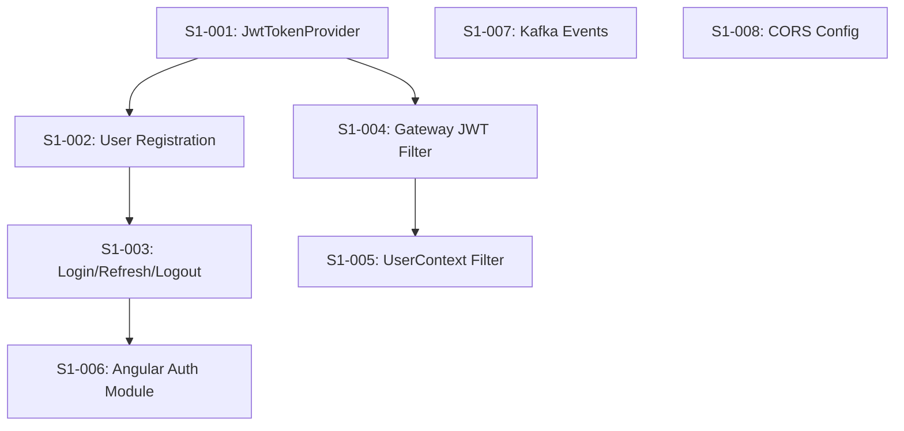
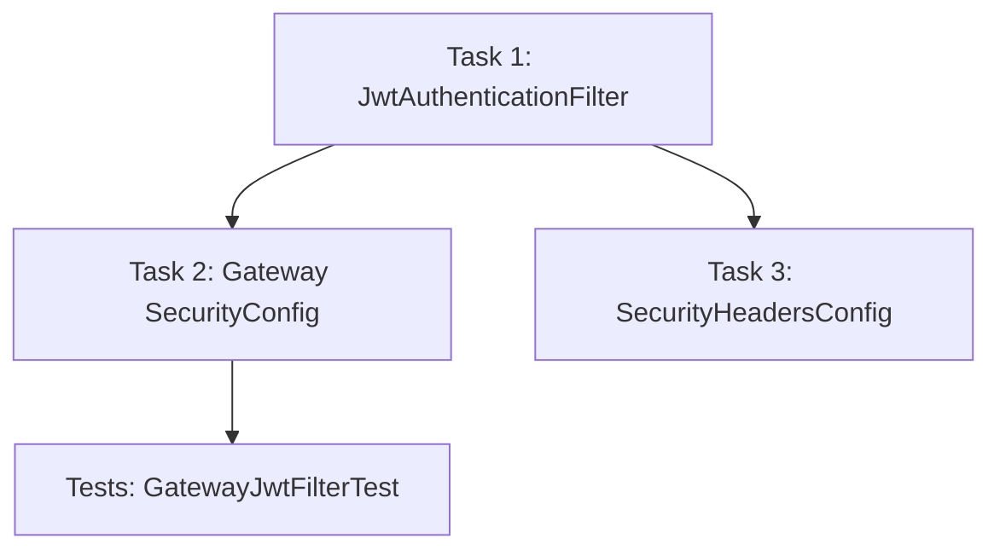
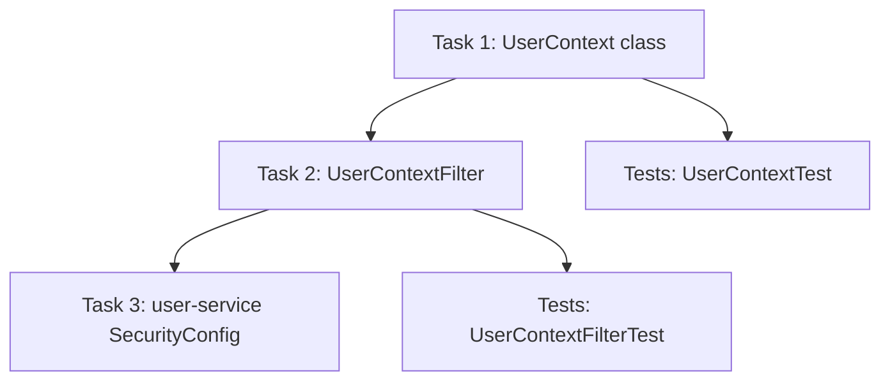

> **IMPLEMENTATION STATUS: COMPLETE** (committed: 16e1293, 2811323, aeca79b)
>
> **CRITICAL: THIS BLUEPRINT CONTAINS DEPRECATED JJWT CODE** -- All code samples in this file use the **deprecated 0.11.x API**. The implementation was upgraded to **JJWT 0.13.0 fluent API**. Future agents MUST use the implementation as source of truth, not the code in this document.
>
> **KNOWN DEVIATIONS FROM THIS BLUEPRINT** -- Future agents MUST follow the implementation, not this document, where they conflict:
>
> ### CRITICAL DEVIATIONS
>
> | # | Category | Blueprint Says | Implementation Does | Verdict |
> |---|----------|---------------|--------------------| --------|
> | D-01 | JJWT API | `.setSubject()`, `.setIssuedAt()`, `.setExpiration()`, `.signWith(key, SignatureAlgorithm.HS256)`, `Jwts.parserBuilder().setSigningKey().build().parseClaimsJws().getBody()` | `.subject()`, `.issuedAt()`, `.expiration()`, `.signWith(signingKey, Jwts.SIG.HS256)`, `Jwts.parser().verifyWith(signingKey).build().parseSignedClaims(token).getPayload()` | **Follow implementation (0.13.0 fluent API)** |
> | D-02 | JJWT imports | `import io.jsonwebtoken.SignatureAlgorithm` | Not imported (deprecated enum removed) | **Follow implementation** |
> | D-03 | JJWT test Claims | `new DefaultClaims(); claims.setSubject("42")` | `Jwts.claims().subject("42").build()` | **Follow implementation** |
> | D-04 | Liquibase migrations | Specifies `001-create-user-table.xml` and `002-create-refresh-token-table.xml` | **FILES NOT CREATED** -- `db.changelog-master.xml` only includes `000-init.xml` | **MUST BE CREATED before running against PostgreSQL** (tests pass because H2 with `ddl-auto: create-drop` and Liquibase disabled) |
>
> ### SIGNIFICANT DEVIATIONS
>
> | # | Category | Blueprint Says | Implementation Does | Verdict |
> |---|----------|---------------|--------------------| --------|
> | D-05 | SecurityHeadersConfig | Specifies `SecurityHeadersConfig.java` adding HSTS, CSP, X-Frame-Options, etc. | **FILE NOT CREATED** -- no HTTP security headers on gateway responses | Should be created in a future sprint |
> | D-06 | Gateway CORS | CORS via `CorsConfigurationSource` in SecurityConfig (S1-004), externalized to `CorsProperties` (S1-008) | CORS disabled in SecurityConfig; custom `CorsConfig.java` WebFilter with `@Value` annotations | Follow implementation (works but differs architecturally) |
> | D-07 | Gateway authorization rules | Detailed path matchers for admin-only, association-manager endpoints | Simplified -- only auth/actuator paths defined | Future sprints should add path matchers as needed |
> | D-08 | CorsProperties | `@ConfigurationProperties(prefix = "cors")` | Not created; `@Value` used in CorsConfig | Follow implementation |
> | D-09 | CORS in gateway YAML | `cors:` section with allowed-origins/methods/headers | **MISSING from application.yml** (tests pass via inline properties) | Should be added to `application.yml` for runtime |
>
> ### ENHANCEMENTS (implementation adds beyond blueprint)
>
> | # | What | Details |
> |---|------|---------|
> | E-01 | JTI claim | `JwtTokenProvider` adds `.id(UUID.randomUUID().toString())` for token uniqueness |
> | E-02 | CORS preflight bypass | `JwtAuthenticationFilter` skips OPTIONS requests |
> | E-03 | Password pattern validation | `RegisterRequest` adds `@Pattern` for complexity (uppercase, lowercase, digit, special char) + 3 extra tests |
> | E-04 | `@JsonIgnoreProperties` | Added to `DomainEvent`, `UserRegisteredEvent`, `UserDeletedEvent` for forward compat |
> | E-05 | `@DisplayName` on tests | All test methods have `@DisplayName` annotations |
> | E-06 | Extra filter test | `JwtAuthenticationFilterTest` adds `nonBearerAuthScheme_shouldReturn401` (6 tests instead of 5) |
>
> ### TEST COUNT COMPARISON
>
> | Module | Blueprint | Implementation | Notes |
> |--------|-----------|----------------|-------|
> | JwtTokenProviderTest | 8 | 8 | Match |
> | UserRegistrationTest | 7 | 10 | +3 password complexity tests (E-03) |
> | AuthFlowTest | 9 | 9 | Match |
> | JwtAuthenticationFilterTest | 5 | 6 | +1 non-Bearer test (E-06) |
> | CorsConfigTest | 2 | 2 | Match |
> | UserContextFilterTest | 5 | 5 | Match |
> | UserContextTest | 5 | 5 | Match |
> | DomainEventTest | 5 | 5 | Match |
>
> ### OTHER SPRINT-1 FILES THAT ALSO CONTAIN SPRINT-1 CONTENT
>
> There are 6 overlapping Sprint-1 files (`_sprint1-part1.md`, `_sprint1-part2.md`, `_sprint1-part3.md`, `_sprint1-partA.md`, `_sprint1-partB.md`, `_sprint-1-review.md`). **Only `_sprint1-partA.md`** has correct JJWT 0.13.0 API but it uses **YAML Liquibase in `changes/`** (wrong). No single file is fully correct. Use the implementation code as source of truth.

# Phase 1 / Sprint 1: Security & Authentication

> **Sprint Duration**: Weeks 3-4
> **Points**: 39
> **Priority**: P0 (34 pts), P1 (5 pts)

---

## Sprint Goal

JWT authentication working end-to-end -- user can register, login, receive tokens, and access
protected endpoints through the gateway. Angular auth module complete.

---

## Prerequisites

Sprint 0 complete (all 8 stories: S0-001 through S0-008).

Specifically:
- Parent POM builds all modules (`mvn validate` succeeds)
- Error-handling module passes 44 tests
- Common library compiles (BaseAuditEntity, SecurityHeaders, JwtConstants available)
- Docker Compose runs PostgreSQL (`familyhobbies_users` database exists)
- Discovery-service starts Eureka on port 8761
- API Gateway routes requests on port 8080
- User-service scaffold starts on port 8081 with Liquibase connectivity

---

## Dependency Map



**Build order**: S1-001 -> S1-002 -> S1-003 -> S1-004 -> S1-005 -> S1-006 -> S1-007, S1-008

---

## Stories

---

### Story S1-001: Implement JwtTokenProvider

**Points**: 5 | **Priority**: P0 | **Epic**: Security

#### Context

The JwtTokenProvider is the core security building block. It generates signed JWT access tokens
and opaque refresh tokens in the user-service, and validates JWT signatures in the api-gateway.
Every subsequent authentication story depends on this class existing and working correctly.

The user-service version is the full-featured provider: it generates access tokens with claims
(sub, email, roles, firstName, lastName), generates opaque refresh tokens (UUID), validates
tokens, and extracts claims. The api-gateway version is simpler: it only validates tokens and
extracts roles (it never generates tokens).

Both use the JJWT library (version 0.13.0) with HS256 (HMAC-SHA256) signing. The signing key
is a 256-bit secret loaded from the `jwt.secret` property in `application.yml`.

#### Tasks

| # | Task | File Path | What To Create | How To Verify |
|---|------|-----------|---------------|---------------|
| 1 | Add jjwt to parent POM dependencyManagement | `backend/pom.xml` | 3 jjwt artifacts (api, impl, jackson) | `mvn validate` succeeds |
| 2 | Add spring-boot-starter-security + jjwt to user-service POM | `backend/user-service/pom.xml` | Security + JWT dependencies | `mvn validate -pl user-service` |
| 3 | Add spring-boot-starter-security + jjwt to api-gateway POM | `backend/api-gateway/pom.xml` | Security + JWT dependencies | `mvn validate -pl api-gateway` |
| 4 | Create JwtTokenProvider in user-service | `...userservice/security/JwtTokenProvider.java` | Full JWT provider (generate + validate) | Compiles |
| 5 | Create JwtTokenProvider in api-gateway | `...apigateway/security/JwtTokenProvider.java` | Validate-only JWT provider | Compiles |
| 6 | Add jwt.secret to user-service application.yml | `...user-service/.../application.yml` | JWT secret property | Config loads |
| 7 | Add jwt.secret to api-gateway application.yml | `...api-gateway/.../application.yml` | JWT secret property | Config loads |

**File path prefix (user-service)**: `backend/user-service/src/main/java/com/familyhobbies/userservice/`
**File path prefix (api-gateway)**: `backend/api-gateway/src/main/java/com/familyhobbies/apigateway/`

---

#### Task 1 Detail: Add jjwt to Parent POM dependencyManagement

**What**: Add three JJWT 0.13.0 artifacts to the parent POM `<dependencyManagement>` section. The `jjwt-api` artifact is the compile-time API. The `jjwt-impl` and `jjwt-jackson` artifacts are runtime dependencies that provide the implementation and JSON serialization.

**Where**: `backend/pom.xml`

**Why**: Centralizing the JJWT version in the parent POM ensures all modules use the same version. Child modules declare the dependency without specifying a version.

**Content**: Add the following inside the existing `<dependencyManagement><dependencies>` block, after the existing `common` artifact declaration:

```xml
            <!-- JJWT (JSON Web Token) -->
            <dependency>
                <groupId>io.jsonwebtoken</groupId>
                <artifactId>jjwt-api</artifactId>
                <version>0.13.0</version>
            </dependency>
            <dependency>
                <groupId>io.jsonwebtoken</groupId>
                <artifactId>jjwt-impl</artifactId>
                <version>0.13.0</version>
                <scope>runtime</scope>
            </dependency>
            <dependency>
                <groupId>io.jsonwebtoken</groupId>
                <artifactId>jjwt-jackson</artifactId>
                <version>0.13.0</version>
                <scope>runtime</scope>
            </dependency>
```

The full `<dependencyManagement>` block in `backend/pom.xml` should now look like this:

```xml
    <dependencyManagement>
        <dependencies>
            <dependency>
                <groupId>org.springframework.cloud</groupId>
                <artifactId>spring-cloud-dependencies</artifactId>
                <version>${spring-cloud.version}</version>
                <type>pom</type>
                <scope>import</scope>
            </dependency>
            <dependency>
                <groupId>com.familyhobbies</groupId>
                <artifactId>error-handling</artifactId>
                <version>${project.version}</version>
            </dependency>
            <dependency>
                <groupId>com.familyhobbies</groupId>
                <artifactId>common</artifactId>
                <version>${project.version}</version>
            </dependency>
            <!-- JJWT (JSON Web Token) -->
            <dependency>
                <groupId>io.jsonwebtoken</groupId>
                <artifactId>jjwt-api</artifactId>
                <version>0.13.0</version>
            </dependency>
            <dependency>
                <groupId>io.jsonwebtoken</groupId>
                <artifactId>jjwt-impl</artifactId>
                <version>0.13.0</version>
                <scope>runtime</scope>
            </dependency>
            <dependency>
                <groupId>io.jsonwebtoken</groupId>
                <artifactId>jjwt-jackson</artifactId>
                <version>0.13.0</version>
                <scope>runtime</scope>
            </dependency>
        </dependencies>
    </dependencyManagement>
```

**Verify**:

```bash
cd backend && mvn validate
# Expected: BUILD SUCCESS (POM syntax valid, all modules recognized)
```

---

#### Task 2 Detail: Add spring-boot-starter-security + jjwt to User-Service POM

**What**: Add Spring Security starter and three JJWT artifacts to the user-service POM.

**Where**: `backend/user-service/pom.xml`

**Why**: User-service needs Spring Security for the SecurityFilterChain (permit/deny rules, password encoding) and JJWT for generating and validating JWT tokens during authentication.

**Content**: Add the following inside the existing `<dependencies>` block in `backend/user-service/pom.xml`, after the `spring-boot-starter-actuator` dependency:

```xml
        <!-- Security -->
        <dependency>
            <groupId>org.springframework.boot</groupId>
            <artifactId>spring-boot-starter-security</artifactId>
        </dependency>

        <!-- JWT -->
        <dependency>
            <groupId>io.jsonwebtoken</groupId>
            <artifactId>jjwt-api</artifactId>
        </dependency>
        <dependency>
            <groupId>io.jsonwebtoken</groupId>
            <artifactId>jjwt-impl</artifactId>
            <scope>runtime</scope>
        </dependency>
        <dependency>
            <groupId>io.jsonwebtoken</groupId>
            <artifactId>jjwt-jackson</artifactId>
            <scope>runtime</scope>
        </dependency>
```

Also add spring-security-test for integration tests, inside the `<dependencies>` block near the existing test dependency:

```xml
        <dependency>
            <groupId>org.springframework.security</groupId>
            <artifactId>spring-security-test</artifactId>
            <scope>test</scope>
        </dependency>
```

**Verify**:

```bash
cd backend && mvn validate -pl user-service
# Expected: BUILD SUCCESS
```

---

#### Task 3 Detail: Add spring-boot-starter-security + jjwt to API Gateway POM

**What**: Add Spring Security starter and three JJWT artifacts to the api-gateway POM.

**Where**: `backend/api-gateway/pom.xml`

**Why**: The gateway needs Spring Security for WebFlux-based security rules (`@EnableWebFluxSecurity`) and JJWT for validating JWT tokens on every inbound request. NOTE: The gateway uses Spring Cloud Gateway which is reactive (WebFlux). Adding `spring-boot-starter-security` automatically enables WebFlux security because the gateway already has `spring-cloud-starter-gateway` which pulls in WebFlux. You do NOT need `spring-boot-starter-security` plus a separate WebFlux dependency -- Spring Boot auto-detects WebFlux on the classpath.

**Content**: Add the following inside the existing `<dependencies>` block in `backend/api-gateway/pom.xml`:

```xml
        <!-- Security (auto-detects WebFlux for reactive security) -->
        <dependency>
            <groupId>org.springframework.boot</groupId>
            <artifactId>spring-boot-starter-security</artifactId>
        </dependency>

        <!-- JWT -->
        <dependency>
            <groupId>io.jsonwebtoken</groupId>
            <artifactId>jjwt-api</artifactId>
        </dependency>
        <dependency>
            <groupId>io.jsonwebtoken</groupId>
            <artifactId>jjwt-impl</artifactId>
            <scope>runtime</scope>
        </dependency>
        <dependency>
            <groupId>io.jsonwebtoken</groupId>
            <artifactId>jjwt-jackson</artifactId>
            <scope>runtime</scope>
        </dependency>
```

**Verify**:

```bash
cd backend && mvn validate -pl api-gateway
# Expected: BUILD SUCCESS
```

---

#### Task 4 Detail: Create JwtTokenProvider in User-Service

**What**: Full-featured JWT provider that generates access tokens with claims, generates opaque refresh tokens, validates tokens, and extracts claims. This is the authoritative token issuer for the entire platform.

**Where**: `backend/user-service/src/main/java/com/familyhobbies/userservice/security/JwtTokenProvider.java`

**Why**: Every authentication operation (register, login, refresh) calls this class to issue tokens. The access token contains the user's identity and roles as JWT claims. The refresh token is a random UUID stored in the database.

**Content**:

```java
package com.familyhobbies.userservice.security;

import com.familyhobbies.userservice.entity.User;
import io.jsonwebtoken.Claims;
import io.jsonwebtoken.Jwts;
import io.jsonwebtoken.SignatureAlgorithm;
import io.jsonwebtoken.security.Keys;
import org.springframework.beans.factory.annotation.Value;
import org.springframework.stereotype.Component;

import javax.crypto.SecretKey;
import java.nio.charset.StandardCharsets;
import java.util.Date;
import java.util.List;
import java.util.UUID;

@Component
public class JwtTokenProvider {

    private static final long ACCESS_TOKEN_VALIDITY_MS = 3_600_000;    // 1 hour
    private static final long REFRESH_TOKEN_VALIDITY_MS = 604_800_000; // 7 days

    private final SecretKey signingKey;

    public JwtTokenProvider(@Value("${jwt.secret}") String secret) {
        this.signingKey = Keys.hmacShaKeyFor(secret.getBytes(StandardCharsets.UTF_8));
    }

    /**
     * Generate a signed JWT access token containing user identity and roles.
     *
     * Claims included:
     * - sub: user ID (as string per JWT spec)
     * - email: user email address
     * - roles: list of role names (e.g., ["FAMILY"])
     * - firstName: user first name
     * - lastName: user last name
     * - iat: issued-at timestamp
     * - exp: expiration timestamp (iat + 1 hour)
     */
    public String generateAccessToken(User user) {
        Date now = new Date();
        Date expiry = new Date(now.getTime() + ACCESS_TOKEN_VALIDITY_MS);

        return Jwts.builder()
            .setSubject(String.valueOf(user.getId()))
            .claim("email", user.getEmail())
            .claim("roles", List.of(user.getRole().name()))
            .claim("firstName", user.getFirstName())
            .claim("lastName", user.getLastName())
            .setIssuedAt(now)
            .setExpiration(expiry)
            .signWith(signingKey, SignatureAlgorithm.HS256)
            .compact();
    }

    /**
     * Generate an opaque refresh token (UUID).
     * The token itself carries no claims -- it is a lookup key into the database.
     */
    public String generateRefreshToken() {
        return UUID.randomUUID().toString();
    }

    /**
     * Validate the token signature and expiry. Returns claims if valid.
     * Throws ExpiredJwtException if expired, JwtException if invalid.
     */
    public Claims validateToken(String token) {
        return Jwts.parserBuilder()
            .setSigningKey(signingKey)
            .build()
            .parseClaimsJws(token)
            .getBody();
    }

    /**
     * Extract user ID from a validated token.
     */
    public Long getUserIdFromToken(String token) {
        Claims claims = validateToken(token);
        return Long.valueOf(claims.getSubject());
    }

    /**
     * Extract roles from a validated token.
     */
    @SuppressWarnings("unchecked")
    public List<String> getRolesFromToken(String token) {
        Claims claims = validateToken(token);
        return claims.get("roles", List.class);
    }

    /**
     * Calculate the refresh token expiry date from now.
     */
    public Date getRefreshTokenExpiry() {
        return new Date(System.currentTimeMillis() + REFRESH_TOKEN_VALIDITY_MS);
    }
}
```

**Important implementation notes**:
- The `generateAccessToken` method uses `List.of(user.getRole().name())` (not `user.getRoles()`) because the User entity has a single `role` field (not a collection). The 05-security-architecture.md reference shows `user.getRoles()` which assumes a many-to-many relationship, but our data model (02-data-model.md section 4.1) defines `role` as a single `VARCHAR(20)` column. We wrap it in a list because the JWT `roles` claim is always an array for forward compatibility.
- The signing key must be at least 256 bits (32 bytes) for HS256. The development default secret in `application.yml` satisfies this requirement.

**Verify**:

```bash
cd backend && mvn compile -pl user-service -q
# Expected: compiles without error
```

---

#### Task 5 Detail: Create JwtTokenProvider in API Gateway

**What**: Simplified JWT provider for the gateway. It only validates tokens and extracts claims -- it never generates tokens. The gateway uses this to verify incoming requests before forwarding them to downstream services.

**Where**: `backend/api-gateway/src/main/java/com/familyhobbies/apigateway/security/JwtTokenProvider.java`

**Why**: The gateway must validate every JWT on inbound requests and extract the userId and roles to inject as `X-User-Id` and `X-User-Roles` headers. It does not need token generation because only the user-service issues tokens.

**Content**:

```java
package com.familyhobbies.apigateway.security;

import io.jsonwebtoken.Claims;
import io.jsonwebtoken.Jwts;
import io.jsonwebtoken.security.Keys;
import org.springframework.beans.factory.annotation.Value;
import org.springframework.stereotype.Component;

import javax.crypto.SecretKey;
import java.nio.charset.StandardCharsets;
import java.util.List;

@Component
public class JwtTokenProvider {

    private final SecretKey signingKey;

    public JwtTokenProvider(@Value("${jwt.secret}") String secret) {
        this.signingKey = Keys.hmacShaKeyFor(secret.getBytes(StandardCharsets.UTF_8));
    }

    /**
     * Validate the token signature and expiry. Returns claims if valid.
     * Throws ExpiredJwtException if expired, JwtException if invalid.
     */
    public Claims validateToken(String token) {
        return Jwts.parserBuilder()
            .setSigningKey(signingKey)
            .build()
            .parseClaimsJws(token)
            .getBody();
    }

    /**
     * Extract roles from a validated token.
     */
    @SuppressWarnings("unchecked")
    public List<String> getRolesFromToken(String token) {
        Claims claims = validateToken(token);
        return claims.get("roles", List.class);
    }
}
```

**Verify**:

```bash
cd backend && mvn compile -pl api-gateway -q
# Expected: compiles without error
```

---

#### Task 6 Detail: Add jwt.secret to User-Service application.yml

**What**: Add the `jwt.secret` property to user-service configuration. This is the HMAC-SHA256 signing key used to sign and verify JWT tokens.

**Where**: `backend/user-service/src/main/resources/application.yml`

**Why**: The JwtTokenProvider constructor reads `@Value("${jwt.secret}")`. Without this property, Spring fails to create the bean and the application does not start.

**Content**: Add the following block at the end of the existing `application.yml`:

```yaml
jwt:
  secret: ${JWT_SECRET:default-dev-secret-that-is-at-least-256-bits-long-for-hmac-sha256}
```

The `${JWT_SECRET:...}` syntax means: read the `JWT_SECRET` environment variable; if not set, use the default value. The default is only for local development. In production, `JWT_SECRET` is set via a secrets manager.

The default value is exactly 73 characters (584 bits), which exceeds the 256-bit minimum for HS256.

**Verify**:

```bash
grep "jwt:" backend/user-service/src/main/resources/application.yml
# Expected: "jwt:" line visible
```

---

#### Task 7 Detail: Add jwt.secret to API Gateway application.yml

**What**: Add the `jwt.secret` property to api-gateway configuration. MUST use the same secret value as user-service -- otherwise tokens signed by user-service will fail validation at the gateway.

**Where**: `backend/api-gateway/src/main/resources/application.yml`

**Why**: The gateway's JwtTokenProvider uses this secret to verify incoming tokens. If it differs from the user-service secret, every token validation fails with a signature mismatch.

**Content**: Add the following block at the end of the existing `application.yml`:

```yaml
jwt:
  secret: ${JWT_SECRET:default-dev-secret-that-is-at-least-256-bits-long-for-hmac-sha256}
```

**Verify**:

```bash
grep "jwt:" backend/api-gateway/src/main/resources/application.yml
# Expected: "jwt:" line visible
```

---

#### Failing Tests (TDD Contract)

Write these tests FIRST, before implementing (they should already pass after Task 4 since this is the implementation story, but the discipline is: tests define the contract).

**Test File**: `backend/user-service/src/test/java/com/familyhobbies/userservice/security/JwtTokenProviderTest.java`

```java
package com.familyhobbies.userservice.security;

import com.familyhobbies.userservice.entity.User;
import com.familyhobbies.userservice.entity.UserRole;
import com.familyhobbies.userservice.entity.UserStatus;
import io.jsonwebtoken.Claims;
import io.jsonwebtoken.ExpiredJwtException;
import io.jsonwebtoken.Jwts;
import io.jsonwebtoken.SignatureAlgorithm;
import io.jsonwebtoken.security.Keys;
import org.junit.jupiter.api.BeforeEach;
import org.junit.jupiter.api.Test;

import javax.crypto.SecretKey;
import java.nio.charset.StandardCharsets;
import java.util.Date;
import java.util.List;

import static org.junit.jupiter.api.Assertions.*;

class JwtTokenProviderTest {

    private static final String TEST_SECRET =
        "test-secret-key-that-is-at-least-256-bits-long-for-hmac-sha256-signing";

    private JwtTokenProvider jwtTokenProvider;
    private User testUser;

    @BeforeEach
    void setUp() {
        jwtTokenProvider = new JwtTokenProvider(TEST_SECRET);

        testUser = User.builder()
            .id(1L)
            .email("dupont@email.com")
            .firstName("Jean")
            .lastName("Dupont")
            .passwordHash("$2a$12$hashedpassword")
            .role(UserRole.FAMILY)
            .status(UserStatus.ACTIVE)
            .emailVerified(false)
            .build();
    }

    @Test
    void shouldGenerateValidAccessToken() {
        String token = jwtTokenProvider.generateAccessToken(testUser);

        assertNotNull(token, "Access token must not be null");
        assertFalse(token.isBlank(), "Access token must not be blank");

        // A JWT has three parts separated by dots
        String[] parts = token.split("\\.");
        assertEquals(3, parts.length, "JWT must have 3 parts (header.payload.signature)");
    }

    @Test
    void accessTokenShouldContainCorrectClaims() {
        String token = jwtTokenProvider.generateAccessToken(testUser);
        Claims claims = jwtTokenProvider.validateToken(token);

        assertEquals("1", claims.getSubject(), "Subject must be user ID as string");
        assertEquals("dupont@email.com", claims.get("email", String.class));
        assertEquals("Jean", claims.get("firstName", String.class));
        assertEquals("Dupont", claims.get("lastName", String.class));

        @SuppressWarnings("unchecked")
        List<String> roles = claims.get("roles", List.class);
        assertNotNull(roles, "Roles claim must exist");
        assertEquals(1, roles.size());
        assertEquals("FAMILY", roles.get(0));

        assertNotNull(claims.getIssuedAt(), "iat claim must exist");
        assertNotNull(claims.getExpiration(), "exp claim must exist");

        // Expiration should be approximately 1 hour from now
        long diffMs = claims.getExpiration().getTime() - claims.getIssuedAt().getTime();
        assertEquals(3_600_000, diffMs, "Access token validity must be 1 hour (3600000 ms)");
    }

    @Test
    void shouldValidateValidToken() {
        String token = jwtTokenProvider.generateAccessToken(testUser);

        Claims claims = jwtTokenProvider.validateToken(token);

        assertNotNull(claims, "Claims must not be null for a valid token");
        assertEquals("1", claims.getSubject());
    }

    @Test
    void shouldRejectExpiredToken() {
        // Create a token that expired 1 hour ago
        SecretKey key = Keys.hmacShaKeyFor(TEST_SECRET.getBytes(StandardCharsets.UTF_8));
        Date pastDate = new Date(System.currentTimeMillis() - 7_200_000); // 2 hours ago
        Date expiredDate = new Date(System.currentTimeMillis() - 3_600_000); // 1 hour ago

        String expiredToken = Jwts.builder()
            .setSubject("1")
            .setIssuedAt(pastDate)
            .setExpiration(expiredDate)
            .signWith(key, SignatureAlgorithm.HS256)
            .compact();

        assertThrows(ExpiredJwtException.class,
            () -> jwtTokenProvider.validateToken(expiredToken),
            "Expired token must throw ExpiredJwtException");
    }

    @Test
    void shouldRejectTamperedToken() {
        String token = jwtTokenProvider.generateAccessToken(testUser);

        // Tamper with the token by changing the last character of the signature
        char lastChar = token.charAt(token.length() - 1);
        char tamperedChar = (lastChar == 'a') ? 'b' : 'a';
        String tamperedToken = token.substring(0, token.length() - 1) + tamperedChar;

        assertThrows(io.jsonwebtoken.JwtException.class,
            () -> jwtTokenProvider.validateToken(tamperedToken),
            "Tampered token must throw JwtException");
    }

    @Test
    void shouldExtractUserIdFromToken() {
        String token = jwtTokenProvider.generateAccessToken(testUser);

        Long userId = jwtTokenProvider.getUserIdFromToken(token);

        assertEquals(1L, userId, "Extracted user ID must match the user's ID");
    }

    @Test
    void shouldExtractRolesFromToken() {
        String token = jwtTokenProvider.generateAccessToken(testUser);

        List<String> roles = jwtTokenProvider.getRolesFromToken(token);

        assertNotNull(roles);
        assertEquals(1, roles.size());
        assertEquals("FAMILY", roles.get(0));
    }

    @Test
    void shouldGenerateUniqueRefreshTokens() {
        String token1 = jwtTokenProvider.generateRefreshToken();
        String token2 = jwtTokenProvider.generateRefreshToken();
        String token3 = jwtTokenProvider.generateRefreshToken();

        assertNotNull(token1);
        assertNotNull(token2);
        assertNotNull(token3);

        // All three must be different
        assertNotEquals(token1, token2, "Refresh tokens must be unique");
        assertNotEquals(token2, token3, "Refresh tokens must be unique");
        assertNotEquals(token1, token3, "Refresh tokens must be unique");

        // Each must be a valid UUID format (8-4-4-4-12 hex digits)
        assertTrue(token1.matches(
            "[0-9a-f]{8}-[0-9a-f]{4}-[0-9a-f]{4}-[0-9a-f]{4}-[0-9a-f]{12}"),
            "Refresh token must be UUID format");
    }
}
```

**Run tests**:

```bash
cd backend/user-service && mvn test -Dtest=JwtTokenProviderTest
# Expected: 8 tests run, 8 pass, 0 fail
```

---

### Story S1-002: Implement User Registration

**Points**: 8 | **Priority**: P0 | **Epic**: Security

#### Context

User registration is the first real business feature. A new user submits their email, password,
first name, and last name. The system checks that the email is not already taken, hashes the
password with BCrypt (strength 12), saves the user with FAMILY role and ACTIVE status, generates
an access token and refresh token, saves the refresh token in the database, and returns both
tokens to the caller.

This story requires creating the database tables (Liquibase migrations), JPA entities,
repositories, request/response DTOs, the AuthService interface and implementation, the
AuthController, and the user-service SecurityConfig.

The t_user and t_refresh_token table schemas are defined in `docs/architecture/02-data-model.md`
sections 4.1 and 4.5. The auth endpoint contracts are defined in
`docs/architecture/03-api-contracts.md` section 7.1. The SecurityConfig is defined in
`docs/architecture/05-security-architecture.md` section 5.4.

#### Tasks

| # | Task | File Path | What To Create | How To Verify |
|---|------|-----------|---------------|---------------|
| 1 | Create Liquibase 001-create-user-table.xml | `...db/changelog/changesets/001-create-user-table.xml` | t_user table with all columns and indexes | `mvn liquibase:update` or service startup |
| 2 | Create Liquibase 002-create-refresh-token-table.xml | `...db/changelog/changesets/002-create-refresh-token-table.xml` | t_refresh_token table with FK to t_user | `mvn liquibase:update` or service startup |
| 3 | Update db.changelog-master.xml | `...db/changelog/db.changelog-master.xml` | Include both new changesets | Liquibase runs all 3 changesets |
| 4 | Create UserRole enum | `...userservice/entity/UserRole.java` | Enum with FAMILY, ASSOCIATION, ADMIN | Compiles |
| 5 | Create UserStatus enum | `...userservice/entity/UserStatus.java` | Enum with ACTIVE, INACTIVE, SUSPENDED, DELETED | Compiles |
| 6 | Create User entity | `...userservice/entity/User.java` | JPA entity mapping t_user | Compiles |
| 7 | Create RefreshToken entity | `...userservice/entity/RefreshToken.java` | JPA entity mapping t_refresh_token | Compiles |
| 8 | Create UserRepository | `...userservice/repository/UserRepository.java` | Spring Data JPA repo with findByEmail, existsByEmail | Compiles |
| 9 | Create RefreshTokenRepository | `...userservice/repository/RefreshTokenRepository.java` | Spring Data JPA repo with findByToken, revokeAllByUserId | Compiles |
| 10 | Create RegisterRequest record | `...userservice/dto/request/RegisterRequest.java` | Validated registration DTO | Compiles |
| 11 | Create AuthResponse record | `...userservice/dto/response/AuthResponse.java` | Token response DTO | Compiles |
| 12 | Create AuthService interface | `...userservice/service/AuthService.java` | Service interface | Compiles |
| 13 | Create AuthServiceImpl (register only) | `...userservice/service/impl/AuthServiceImpl.java` | Register method implementation | Compiles |
| 14 | Create AuthController (register only) | `...userservice/controller/AuthController.java` | POST /api/v1/auth/register | Compiles |
| 15 | Create SecurityConfig | `...userservice/config/SecurityConfig.java` | Spring Security filter chain + BCrypt | Compiles |

**File path prefix**: `backend/user-service/src/main/java/com/familyhobbies/userservice/`
**Resources path prefix**: `backend/user-service/src/main/resources/`

---

#### Task 1 Detail: Create Liquibase 001-create-user-table.xml

**What**: Liquibase changeset that creates the `t_user` table with all columns, constraints, and indexes as defined in the data model document (02-data-model.md section 4.1).

**Where**: `backend/user-service/src/main/resources/db/changelog/changesets/001-create-user-table.xml`

**Why**: The User entity cannot be persisted without this table. Hibernate is configured with `ddl-auto: validate`, meaning it validates the schema against the entity but does NOT create tables. Liquibase is responsible for all DDL.

**Content**:

```xml
<?xml version="1.0" encoding="UTF-8"?>
<databaseChangeLog
        xmlns="http://www.liquibase.org/xml/ns/dbchangelog"
        xmlns:xsi="http://www.w3.org/2001/XMLSchema-instance"
        xsi:schemaLocation="http://www.liquibase.org/xml/ns/dbchangelog
        http://www.liquibase.org/xml/ns/dbchangelog/dbchangelog-latest.xsd">

    <changeSet id="001-create-user-table" author="family-hobbies-team"
               context="!test">
        <comment>Creates t_user table for authentication and user management</comment>

        <createTable tableName="t_user">
            <column name="id" type="BIGINT" autoIncrement="true">
                <constraints primaryKey="true" primaryKeyName="pk_user" nullable="false"/>
            </column>
            <column name="email" type="VARCHAR(255)">
                <constraints nullable="false" unique="true" uniqueConstraintName="uq_user_email"/>
            </column>
            <column name="password_hash" type="VARCHAR(255)">
                <constraints nullable="false"/>
            </column>
            <column name="first_name" type="VARCHAR(100)">
                <constraints nullable="false"/>
            </column>
            <column name="last_name" type="VARCHAR(100)">
                <constraints nullable="false"/>
            </column>
            <column name="phone" type="VARCHAR(20)">
                <constraints nullable="true"/>
            </column>
            <column name="role" type="VARCHAR(20)" defaultValue="FAMILY">
                <constraints nullable="false"/>
            </column>
            <column name="status" type="VARCHAR(20)" defaultValue="ACTIVE">
                <constraints nullable="false"/>
            </column>
            <column name="email_verified" type="BOOLEAN" defaultValueBoolean="false">
                <constraints nullable="false"/>
            </column>
            <column name="last_login_at" type="TIMESTAMP WITH TIME ZONE">
                <constraints nullable="true"/>
            </column>
            <column name="created_at" type="TIMESTAMP WITH TIME ZONE" defaultValueComputed="NOW()">
                <constraints nullable="false"/>
            </column>
            <column name="updated_at" type="TIMESTAMP WITH TIME ZONE" defaultValueComputed="NOW()">
                <constraints nullable="false"/>
            </column>
        </createTable>

        <createIndex tableName="t_user" indexName="idx_user_email">
            <column name="email"/>
        </createIndex>

        <createIndex tableName="t_user" indexName="idx_user_status">
            <column name="status"/>
        </createIndex>
    </changeSet>

</databaseChangeLog>
```

**Verify**:

```bash
# Start PostgreSQL if not running
cd docker && docker compose up -d
sleep 5

# Start user-service (Liquibase runs on startup)
cd backend/user-service && mvn spring-boot:run &
sleep 15

# Check table was created
docker exec fhm-postgres psql -U fhm_admin -d familyhobbies_users \
  -c "\d t_user"
# Expected: table columns listed (id, email, password_hash, first_name, ...)

# Check indexes
docker exec fhm-postgres psql -U fhm_admin -d familyhobbies_users \
  -c "SELECT indexname FROM pg_indexes WHERE tablename = 't_user'"
# Expected: pk_user, uq_user_email, idx_user_email, idx_user_status

# Stop user-service
kill %1
```

---

#### Task 2 Detail: Create Liquibase 002-create-refresh-token-table.xml

**What**: Liquibase changeset that creates the `t_refresh_token` table with foreign key to `t_user`, unique constraint on token, and indexes as defined in the data model document (02-data-model.md section 4.5).

**Where**: `backend/user-service/src/main/resources/db/changelog/changesets/002-create-refresh-token-table.xml`

**Why**: The RefreshToken entity stores opaque refresh tokens. Without this table, the login and refresh flows cannot persist tokens.

**Content**:

```xml
<?xml version="1.0" encoding="UTF-8"?>
<databaseChangeLog
        xmlns="http://www.liquibase.org/xml/ns/dbchangelog"
        xmlns:xsi="http://www.w3.org/2001/XMLSchema-instance"
        xsi:schemaLocation="http://www.liquibase.org/xml/ns/dbchangelog
        http://www.liquibase.org/xml/ns/dbchangelog/dbchangelog-latest.xsd">

    <changeSet id="002-create-refresh-token-table" author="family-hobbies-team"
               context="!test">
        <comment>Creates t_refresh_token table for JWT refresh token persistence</comment>

        <createTable tableName="t_refresh_token">
            <column name="id" type="BIGINT" autoIncrement="true">
                <constraints primaryKey="true" primaryKeyName="pk_refresh_token" nullable="false"/>
            </column>
            <column name="user_id" type="BIGINT">
                <constraints nullable="false"/>
            </column>
            <column name="token" type="VARCHAR(512)">
                <constraints nullable="false" unique="true" uniqueConstraintName="uq_refresh_token"/>
            </column>
            <column name="expires_at" type="TIMESTAMP WITH TIME ZONE">
                <constraints nullable="false"/>
            </column>
            <column name="revoked" type="BOOLEAN" defaultValueBoolean="false">
                <constraints nullable="false"/>
            </column>
            <column name="created_at" type="TIMESTAMP WITH TIME ZONE" defaultValueComputed="NOW()">
                <constraints nullable="false"/>
            </column>
        </createTable>

        <addForeignKeyConstraint baseTableName="t_refresh_token"
                                 baseColumnNames="user_id"
                                 constraintName="fk_refresh_token_user"
                                 referencedTableName="t_user"
                                 referencedColumnNames="id"
                                 onDelete="CASCADE"/>

        <createIndex tableName="t_refresh_token" indexName="idx_refresh_token_user_id">
            <column name="user_id"/>
        </createIndex>

        <createIndex tableName="t_refresh_token" indexName="idx_refresh_token_expires_at">
            <column name="expires_at"/>
        </createIndex>
    </changeSet>

</databaseChangeLog>
```

**Verify**:

```bash
# With PostgreSQL running and user-service started:
docker exec fhm-postgres psql -U fhm_admin -d familyhobbies_users \
  -c "\d t_refresh_token"
# Expected: table columns listed (id, user_id, token, expires_at, revoked, created_at)

docker exec fhm-postgres psql -U fhm_admin -d familyhobbies_users \
  -c "SELECT indexname FROM pg_indexes WHERE tablename = 't_refresh_token'"
# Expected: pk_refresh_token, uq_refresh_token, idx_refresh_token_user_id, idx_refresh_token_expires_at
```

---

#### Task 3 Detail: Update db.changelog-master.xml

**What**: Add the two new changeset files to the master changelog so Liquibase executes them in order.

**Where**: `backend/user-service/src/main/resources/db/changelog/db.changelog-master.xml`

**Why**: Liquibase only runs changesets listed in the master changelog. Without this update, the new tables are never created.

**Content**: Replace the entire file with:

```xml
<?xml version="1.0" encoding="UTF-8"?>
<databaseChangeLog
        xmlns="http://www.liquibase.org/xml/ns/dbchangelog"
        xmlns:xsi="http://www.w3.org/2001/XMLSchema-instance"
        xsi:schemaLocation="http://www.liquibase.org/xml/ns/dbchangelog
        http://www.liquibase.org/xml/ns/dbchangelog/dbchangelog-latest.xsd">

    <include file="db/changelog/changesets/000-init.xml"/>
    <include file="db/changelog/changesets/001-create-user-table.xml"/>
    <include file="db/changelog/changesets/002-create-refresh-token-table.xml"/>

</databaseChangeLog>
```

**Verify**:

```bash
cd backend/user-service && mvn spring-boot:run &
sleep 15

docker exec fhm-postgres psql -U fhm_admin -d familyhobbies_users \
  -c "SELECT id, filename FROM databasechangelog ORDER BY orderexecuted"
# Expected: three rows: 000-init, 001-create-user-table, 002-create-refresh-token-table

kill %1
```

---

#### Task 4 Detail: Create UserRole Enum

**What**: Enum representing the three application roles a user can hold.

**Where**: `backend/user-service/src/main/java/com/familyhobbies/userservice/entity/UserRole.java`

**Why**: The User entity's `role` field uses this enum. Stored as a string in the database (`@Enumerated(EnumType.STRING)`), so the enum value names must exactly match the database values: FAMILY, ASSOCIATION, ADMIN.

**Content**:

```java
package com.familyhobbies.userservice.entity;

public enum UserRole {

    /**
     * Family user (parent/guardian). Default role assigned at registration.
     * Can manage own family and members, browse associations, create subscriptions.
     */
    FAMILY,

    /**
     * Association manager. Can view subscriber lists, mark attendance,
     * view payment reports for their association, manage sessions and courses.
     */
    ASSOCIATION,

    /**
     * Platform administrator. Full CRUD on all entities, trigger syncs,
     * manage all users and roles, access RGPD tools.
     */
    ADMIN
}
```

**Verify**:

```bash
cd backend && mvn compile -pl user-service -q
# Expected: compiles without error
```

---

#### Task 5 Detail: Create UserStatus Enum

**What**: Enum representing the four account status values.

**Where**: `backend/user-service/src/main/java/com/familyhobbies/userservice/entity/UserStatus.java`

**Why**: The User entity's `status` field uses this enum. Soft-delete is implemented via the DELETED status rather than physical row deletion, supporting RGPD data retention requirements.

**Content**:

```java
package com.familyhobbies.userservice.entity;

public enum UserStatus {

    /**
     * Account is active and fully functional.
     * Default status assigned at registration.
     */
    ACTIVE,

    /**
     * Account is temporarily inactive (e.g., user requested pause).
     * Cannot log in, but data is retained.
     */
    INACTIVE,

    /**
     * Account is suspended by an administrator.
     * Cannot log in, pending investigation or user action.
     */
    SUSPENDED,

    /**
     * Account has been soft-deleted (RGPD right-to-be-forgotten).
     * Personal data is anonymized, account cannot be used.
     */
    DELETED
}
```

**Verify**:

```bash
cd backend && mvn compile -pl user-service -q
# Expected: compiles without error
```

---

#### Task 6 Detail: Create User Entity

**What**: JPA entity mapped to the `t_user` table. Contains all 12 columns from the data model. NOTE: User does NOT extend BaseAuditEntity from common because `t_user` has its own `created_at` and `updated_at` columns with specific defaults, and does not have `created_by`/`updated_by` columns (which BaseAuditEntity provides). Uses Lombok `@Builder`, `@Getter`, `@Setter`, `@NoArgsConstructor`, `@AllArgsConstructor`.

**Where**: `backend/user-service/src/main/java/com/familyhobbies/userservice/entity/User.java`

**Why**: This is the primary entity for user management. Every authentication and user management operation depends on this entity.

**Content**:

```java
package com.familyhobbies.userservice.entity;

import jakarta.persistence.Column;
import jakarta.persistence.Entity;
import jakarta.persistence.EnumType;
import jakarta.persistence.Enumerated;
import jakarta.persistence.GeneratedValue;
import jakarta.persistence.GenerationType;
import jakarta.persistence.Id;
import jakarta.persistence.Table;
import lombok.AllArgsConstructor;
import lombok.Builder;
import lombok.Getter;
import lombok.NoArgsConstructor;
import lombok.Setter;

import java.time.Instant;

@Entity
@Table(name = "t_user")
@Getter
@Setter
@NoArgsConstructor
@AllArgsConstructor
@Builder
public class User {

    @Id
    @GeneratedValue(strategy = GenerationType.IDENTITY)
    private Long id;

    @Column(name = "email", nullable = false, unique = true, length = 255)
    private String email;

    @Column(name = "password_hash", nullable = false, length = 255)
    private String passwordHash;

    @Column(name = "first_name", nullable = false, length = 100)
    private String firstName;

    @Column(name = "last_name", nullable = false, length = 100)
    private String lastName;

    @Column(name = "phone", length = 20)
    private String phone;

    @Enumerated(EnumType.STRING)
    @Column(name = "role", nullable = false, length = 20)
    @Builder.Default
    private UserRole role = UserRole.FAMILY;

    @Enumerated(EnumType.STRING)
    @Column(name = "status", nullable = false, length = 20)
    @Builder.Default
    private UserStatus status = UserStatus.ACTIVE;

    @Column(name = "email_verified", nullable = false)
    @Builder.Default
    private boolean emailVerified = false;

    @Column(name = "last_login_at")
    private Instant lastLoginAt;

    @Column(name = "created_at", nullable = false, updatable = false)
    @Builder.Default
    private Instant createdAt = Instant.now();

    @Column(name = "updated_at", nullable = false)
    @Builder.Default
    private Instant updatedAt = Instant.now();

    /**
     * Check if the user account is active (can log in).
     */
    public boolean isActive() {
        return this.status == UserStatus.ACTIVE;
    }
}
```

**Important implementation notes**:
- `@Builder.Default` is used for `role`, `status`, `emailVerified`, `createdAt`, and `updatedAt` so that the builder uses the specified defaults rather than null/0/false.
- The `isActive()` method is used by the login flow to verify the user can authenticate.
- `createdAt` has `updatable = false` to prevent accidental modification after creation.

**Verify**:

```bash
cd backend && mvn compile -pl user-service -q
# Expected: compiles without error
```

---

#### Task 7 Detail: Create RefreshToken Entity

**What**: JPA entity mapped to the `t_refresh_token` table. Contains the opaque token, expiry, revocation flag, and a many-to-one relationship to User.

**Where**: `backend/user-service/src/main/java/com/familyhobbies/userservice/entity/RefreshToken.java`

**Why**: Refresh tokens are stored in the database for validation, rotation, and revocation. The entity links each token to its owning user.

**Content**:

```java
package com.familyhobbies.userservice.entity;

import jakarta.persistence.Column;
import jakarta.persistence.Entity;
import jakarta.persistence.FetchType;
import jakarta.persistence.GeneratedValue;
import jakarta.persistence.GenerationType;
import jakarta.persistence.Id;
import jakarta.persistence.JoinColumn;
import jakarta.persistence.ManyToOne;
import jakarta.persistence.Table;
import lombok.AllArgsConstructor;
import lombok.Builder;
import lombok.Getter;
import lombok.NoArgsConstructor;
import lombok.Setter;

import java.time.Instant;

@Entity
@Table(name = "t_refresh_token")
@Getter
@Setter
@NoArgsConstructor
@AllArgsConstructor
@Builder
public class RefreshToken {

    @Id
    @GeneratedValue(strategy = GenerationType.IDENTITY)
    private Long id;

    @ManyToOne(fetch = FetchType.LAZY)
    @JoinColumn(name = "user_id", nullable = false)
    private User user;

    @Column(name = "token", nullable = false, unique = true, length = 512)
    private String token;

    @Column(name = "expires_at", nullable = false)
    private Instant expiresAt;

    @Column(name = "revoked", nullable = false)
    @Builder.Default
    private boolean revoked = false;

    @Column(name = "created_at", nullable = false, updatable = false)
    @Builder.Default
    private Instant createdAt = Instant.now();
}
```

**Important implementation notes**:
- `@ManyToOne(fetch = FetchType.LAZY)` -- the User is loaded on demand, not eagerly, to avoid N+1 queries when querying refresh tokens.
- The `expiresAt` field stores the Instant when this refresh token becomes invalid (7 days from creation).

**Verify**:

```bash
cd backend && mvn compile -pl user-service -q
# Expected: compiles without error
```

---

#### Task 8 Detail: Create UserRepository

**What**: Spring Data JPA repository interface for the User entity. Provides two custom query methods beyond the standard CRUD operations.

**Where**: `backend/user-service/src/main/java/com/familyhobbies/userservice/repository/UserRepository.java`

**Why**: `findByEmail` is used during login (find user by their email address). `existsByEmail` is used during registration (check if email is already taken, without loading the full entity).

**Content**:

```java
package com.familyhobbies.userservice.repository;

import com.familyhobbies.userservice.entity.User;
import org.springframework.data.jpa.repository.JpaRepository;
import org.springframework.stereotype.Repository;

import java.util.Optional;

@Repository
public interface UserRepository extends JpaRepository<User, Long> {

    /**
     * Find a user by their email address.
     * Used during login to load the user for credential verification.
     *
     * @param email the email address to search for
     * @return Optional containing the user if found, empty otherwise
     */
    Optional<User> findByEmail(String email);

    /**
     * Check if a user with the given email address already exists.
     * Used during registration to enforce email uniqueness at the application level
     * (in addition to the database unique constraint).
     *
     * @param email the email address to check
     * @return true if a user with this email exists, false otherwise
     */
    boolean existsByEmail(String email);
}
```

**Verify**:

```bash
cd backend && mvn compile -pl user-service -q
# Expected: compiles without error
```

---

#### Task 9 Detail: Create RefreshTokenRepository

**What**: Spring Data JPA repository interface for the RefreshToken entity. Provides a custom query method to find by token value and a modifying query to revoke all tokens for a user.

**Where**: `backend/user-service/src/main/java/com/familyhobbies/userservice/repository/RefreshTokenRepository.java`

**Why**: `findByToken` is used during the refresh flow (look up the stored token by its value). `revokeAllByUserId` is used during logout (invalidate all refresh tokens for the user).

**Content**:

```java
package com.familyhobbies.userservice.repository;

import com.familyhobbies.userservice.entity.RefreshToken;
import org.springframework.data.jpa.repository.JpaRepository;
import org.springframework.data.jpa.repository.Modifying;
import org.springframework.data.jpa.repository.Query;
import org.springframework.data.repository.query.Param;
import org.springframework.stereotype.Repository;

import java.util.Optional;

@Repository
public interface RefreshTokenRepository extends JpaRepository<RefreshToken, Long> {

    /**
     * Find a refresh token by its token value.
     * Used during the refresh flow to validate and rotate tokens.
     *
     * @param token the opaque refresh token string (UUID)
     * @return Optional containing the RefreshToken entity if found, empty otherwise
     */
    Optional<RefreshToken> findByToken(String token);

    /**
     * Revoke all non-revoked refresh tokens for a given user.
     * Sets revoked = true for all tokens where user_id matches and revoked is currently false.
     * Used during logout to invalidate all active sessions.
     *
     * @param userId the user ID whose tokens should be revoked
     */
    @Modifying
    @Query("UPDATE RefreshToken rt SET rt.revoked = true WHERE rt.user.id = :userId AND rt.revoked = false")
    void revokeAllByUserId(@Param("userId") Long userId);
}
```

**Important implementation notes**:
- The `@Modifying` annotation tells Spring Data that this is an UPDATE (not a SELECT) query.
- The `@Query` uses JPQL (not native SQL) -- it references `RefreshToken` (entity name) and `rt.user.id` (entity relationship), not table/column names.
- The calling method must be annotated with `@Transactional` for the `@Modifying` query to execute.

**Verify**:

```bash
cd backend && mvn compile -pl user-service -q
# Expected: compiles without error
```

---

#### Task 10 Detail: Create RegisterRequest Record

**What**: Java record representing the registration request body. Uses Jakarta Bean Validation annotations to enforce input constraints. Validation is triggered by `@Valid` on the controller parameter.

**Where**: `backend/user-service/src/main/java/com/familyhobbies/userservice/dto/request/RegisterRequest.java`

**Why**: Incoming JSON is deserialized into this record. Validation annotations ensure the request is well-formed before it reaches the service layer. Invalid requests return 400 Bad Request with field-level error details.

**Content**:

```java
package com.familyhobbies.userservice.dto.request;

import jakarta.validation.constraints.Email;
import jakarta.validation.constraints.NotBlank;
import jakarta.validation.constraints.Size;

public record RegisterRequest(

    @NotBlank(message = "Email is required")
    @Email(message = "Email must be a valid email address")
    @Size(max = 255, message = "Email must not exceed 255 characters")
    String email,

    @NotBlank(message = "Password is required")
    @Size(min = 8, max = 100, message = "Password must be between 8 and 100 characters")
    String password,

    @NotBlank(message = "First name is required")
    @Size(max = 100, message = "First name must not exceed 100 characters")
    String firstName,

    @NotBlank(message = "Last name is required")
    @Size(max = 100, message = "Last name must not exceed 100 characters")
    String lastName,

    @Size(max = 20, message = "Phone must not exceed 20 characters")
    String phone
) {}
```

**Important implementation notes**:
- `phone` does not have `@NotBlank` because it is optional (nullable in the database).
- The password validation here enforces minimum length. Additional complexity rules (uppercase, lowercase, digit, special char) can be added with a custom `@Pattern` annotation in a future story.

**Verify**:

```bash
cd backend && mvn compile -pl user-service -q
# Expected: compiles without error
```

---

#### Task 11 Detail: Create AuthResponse Record

**What**: Java record representing the authentication response body. Returned after successful registration, login, and token refresh. Contains the access token, refresh token, token type, and expiry duration.

**Where**: `backend/user-service/src/main/java/com/familyhobbies/userservice/dto/response/AuthResponse.java`

**Why**: This is the standard authentication response shape defined in the API contracts (03-api-contracts.md section 7.1). The frontend parses this to store tokens and schedule refresh.

**Content**:

```java
package com.familyhobbies.userservice.dto.response;

public record AuthResponse(

    /**
     * JWT access token. Valid for 1 hour.
     * Include in Authorization header as: Bearer {accessToken}
     */
    String accessToken,

    /**
     * Opaque refresh token (UUID). Valid for 7 days.
     * Send to POST /api/v1/auth/refresh to obtain a new token pair.
     */
    String refreshToken,

    /**
     * Token type. Always "Bearer".
     */
    String tokenType,

    /**
     * Access token lifetime in seconds. Always 3600 (1 hour).
     */
    long expiresIn
) {}
```

**Verify**:

```bash
cd backend && mvn compile -pl user-service -q
# Expected: compiles without error
```

---

#### Task 12 Detail: Create AuthService Interface

**What**: Service interface that defines the authentication contract. Implementation is provided by AuthServiceImpl.

**Where**: `backend/user-service/src/main/java/com/familyhobbies/userservice/service/AuthService.java`

**Why**: Coding to an interface enables testing with mocks and supports future alternative implementations. The controller depends on this interface, not the implementation.

**Content**:

```java
package com.familyhobbies.userservice.service;

import com.familyhobbies.userservice.dto.request.LoginRequest;
import com.familyhobbies.userservice.dto.request.RefreshTokenRequest;
import com.familyhobbies.userservice.dto.request.RegisterRequest;
import com.familyhobbies.userservice.dto.response.AuthResponse;

public interface AuthService {

    /**
     * Register a new user account.
     * Creates the user with FAMILY role and ACTIVE status,
     * hashes the password, generates token pair, saves refresh token.
     *
     * @param request registration details (email, password, firstName, lastName, phone)
     * @return AuthResponse with access token and refresh token
     * @throws ConflictException if email is already registered
     */
    AuthResponse register(RegisterRequest request);

    /**
     * Authenticate a user with email and password.
     * Verifies credentials, generates token pair, saves refresh token.
     *
     * @param request login credentials (email, password)
     * @return AuthResponse with access token and refresh token
     * @throws UnauthorizedException if credentials are invalid or account is inactive
     */
    AuthResponse login(LoginRequest request);

    /**
     * Refresh an expired access token using a valid refresh token.
     * Implements token rotation: the used refresh token is revoked.
     *
     * @param request the refresh token to exchange
     * @return AuthResponse with new access token and new refresh token
     * @throws UnauthorizedException if refresh token is invalid, expired, or revoked
     */
    AuthResponse refreshToken(RefreshTokenRequest request);

    /**
     * Log out a user by revoking all their refresh tokens.
     *
     * @param userId the ID of the user to log out
     */
    void logout(Long userId);
}
```

**Important implementation notes**:
- The `login`, `refreshToken`, and `logout` methods are declared here but implemented in Story S1-003. For now, only `register` is implemented.
- The `LoginRequest` and `RefreshTokenRequest` DTOs are created in Story S1-003. For this story, you can temporarily comment out the `login` and `refreshToken` method signatures, OR create empty placeholder DTOs. The recommended approach is to create the DTOs now (Task 10 of S1-003 creates them, but you can create stubs here to avoid compilation errors).

**Verify**:

```bash
cd backend && mvn compile -pl user-service -q
# Expected: compiles without error (may need stub DTOs)
```

---

#### Task 13 Detail: Create AuthServiceImpl (Register Method)

**What**: Implementation of the AuthService interface. In this story, only the `register()` method is fully implemented. The `login()`, `refreshToken()`, and `logout()` methods throw `UnsupportedOperationException` as placeholders until Story S1-003.

**Where**: `backend/user-service/src/main/java/com/familyhobbies/userservice/service/impl/AuthServiceImpl.java`

**Why**: This is the core business logic for user registration. It orchestrates the complete flow: uniqueness check, password hashing, user creation, token generation, and token persistence.

**Content**:

```java
package com.familyhobbies.userservice.service.impl;

import com.familyhobbies.errorhandling.exception.web.ConflictException;
import com.familyhobbies.errorhandling.exception.web.UnauthorizedException;
import com.familyhobbies.userservice.dto.request.LoginRequest;
import com.familyhobbies.userservice.dto.request.RefreshTokenRequest;
import com.familyhobbies.userservice.dto.request.RegisterRequest;
import com.familyhobbies.userservice.dto.response.AuthResponse;
import com.familyhobbies.userservice.entity.RefreshToken;
import com.familyhobbies.userservice.entity.User;
import com.familyhobbies.userservice.entity.UserRole;
import com.familyhobbies.userservice.entity.UserStatus;
import com.familyhobbies.userservice.repository.RefreshTokenRepository;
import com.familyhobbies.userservice.repository.UserRepository;
import com.familyhobbies.userservice.security.JwtTokenProvider;
import com.familyhobbies.userservice.service.AuthService;
import org.springframework.security.crypto.password.PasswordEncoder;
import org.springframework.stereotype.Service;
import org.springframework.transaction.annotation.Transactional;

import java.time.Instant;

@Service
public class AuthServiceImpl implements AuthService {

    private final UserRepository userRepository;
    private final RefreshTokenRepository refreshTokenRepository;
    private final PasswordEncoder passwordEncoder;
    private final JwtTokenProvider jwtTokenProvider;

    public AuthServiceImpl(
            UserRepository userRepository,
            RefreshTokenRepository refreshTokenRepository,
            PasswordEncoder passwordEncoder,
            JwtTokenProvider jwtTokenProvider) {
        this.userRepository = userRepository;
        this.refreshTokenRepository = refreshTokenRepository;
        this.passwordEncoder = passwordEncoder;
        this.jwtTokenProvider = jwtTokenProvider;
    }

    @Override
    @Transactional
    public AuthResponse register(RegisterRequest request) {
        // Step 1: Check email uniqueness
        if (userRepository.existsByEmail(request.email())) {
            throw new ConflictException("Email already registered: " + request.email());
        }

        // Step 2: Create user with hashed password
        User user = User.builder()
            .email(request.email())
            .passwordHash(passwordEncoder.encode(request.password()))
            .firstName(request.firstName())
            .lastName(request.lastName())
            .phone(request.phone())
            .role(UserRole.FAMILY)
            .status(UserStatus.ACTIVE)
            .emailVerified(false)
            .build();

        user = userRepository.save(user);

        // Step 3: Generate token pair
        String accessToken = jwtTokenProvider.generateAccessToken(user);
        String refreshTokenValue = createAndSaveRefreshToken(user);

        // Step 4: Return auth response
        return new AuthResponse(accessToken, refreshTokenValue, "Bearer", 3600);
    }

    @Override
    @Transactional
    public AuthResponse login(LoginRequest request) {
        // Implemented in Story S1-003
        throw new UnsupportedOperationException("Login not yet implemented -- see Story S1-003");
    }

    @Override
    @Transactional
    public AuthResponse refreshToken(RefreshTokenRequest request) {
        // Implemented in Story S1-003
        throw new UnsupportedOperationException("Token refresh not yet implemented -- see Story S1-003");
    }

    @Override
    @Transactional
    public void logout(Long userId) {
        // Implemented in Story S1-003
        throw new UnsupportedOperationException("Logout not yet implemented -- see Story S1-003");
    }

    /**
     * Generate a refresh token, save it to the database, and return the token string.
     */
    private String createAndSaveRefreshToken(User user) {
        String tokenValue = jwtTokenProvider.generateRefreshToken();

        RefreshToken refreshToken = RefreshToken.builder()
            .user(user)
            .token(tokenValue)
            .expiresAt(jwtTokenProvider.getRefreshTokenExpiry().toInstant())
            .revoked(false)
            .build();

        refreshTokenRepository.save(refreshToken);
        return tokenValue;
    }
}
```

**Important implementation notes**:
- The `ConflictException` is from the error-handling module (`com.familyhobbies.errorhandling.exception.web.ConflictException`). It maps to HTTP 409.
- `passwordEncoder.encode(request.password())` uses BCrypt with strength 12 (configured in SecurityConfig, Task 15).
- `createAndSaveRefreshToken` is a private helper method reused by register, login, and refresh flows.
- The `login`, `refreshToken`, and `logout` methods are stubbed with `UnsupportedOperationException` so the class compiles. They are fully implemented in Story S1-003.

**Verify**:

```bash
cd backend && mvn compile -pl user-service -q
# Expected: compiles without error
```

---

#### Task 14 Detail: Create AuthController (Register Endpoint)

**What**: REST controller exposing the `POST /api/v1/auth/register` endpoint. Returns 201 Created with the AuthResponse body on success. Validation is triggered by `@Valid` on the request body.

**Where**: `backend/user-service/src/main/java/com/familyhobbies/userservice/controller/AuthController.java`

**Why**: This is the HTTP entry point for user registration. The controller delegates to AuthService and maps the result to the appropriate HTTP response.

**Content**:

```java
package com.familyhobbies.userservice.controller;

import com.familyhobbies.userservice.dto.request.RegisterRequest;
import com.familyhobbies.userservice.dto.response.AuthResponse;
import com.familyhobbies.userservice.service.AuthService;
import jakarta.validation.Valid;
import org.springframework.http.HttpStatus;
import org.springframework.http.ResponseEntity;
import org.springframework.web.bind.annotation.PostMapping;
import org.springframework.web.bind.annotation.RequestBody;
import org.springframework.web.bind.annotation.RequestMapping;
import org.springframework.web.bind.annotation.RestController;

@RestController
@RequestMapping("/api/v1/auth")
public class AuthController {

    private final AuthService authService;

    public AuthController(AuthService authService) {
        this.authService = authService;
    }

    /**
     * Register a new user account.
     *
     * POST /api/v1/auth/register
     *
     * Public endpoint -- no authentication required.
     * Returns 201 with access token and refresh token on success.
     * Returns 400 if request validation fails.
     * Returns 409 if email is already registered.
     */
    @PostMapping("/register")
    public ResponseEntity<AuthResponse> register(@Valid @RequestBody RegisterRequest request) {
        AuthResponse response = authService.register(request);
        return ResponseEntity.status(HttpStatus.CREATED).body(response);
    }
}
```

**Important implementation notes**:
- `@Valid` triggers Jakarta Bean Validation on the RegisterRequest. If validation fails, Spring throws `MethodArgumentNotValidException`, which is caught by the `GlobalExceptionHandler` from the error-handling module and returns a 400 response with field-level errors.
- The login, refresh, and logout endpoints are added in Story S1-003.
- The controller uses constructor injection (not `@Autowired` field injection) for testability.

**Verify**:

```bash
cd backend && mvn compile -pl user-service -q
# Expected: compiles without error
```

---

#### Task 15 Detail: Create User-Service SecurityConfig

**What**: Spring Security configuration for the user-service. Configures HTTP security rules (which endpoints are public vs. authenticated), stateless sessions, CSRF disabled, and the BCrypt password encoder bean.

**Where**: `backend/user-service/src/main/java/com/familyhobbies/userservice/config/SecurityConfig.java`

**Why**: Without this configuration, Spring Security's default behavior blocks all endpoints and shows a login form. This config permits the auth endpoints, disables sessions (stateless JWT), and provides the PasswordEncoder used by AuthServiceImpl.

**Content**:

```java
package com.familyhobbies.userservice.config;

import org.springframework.context.annotation.Bean;
import org.springframework.context.annotation.Configuration;
import org.springframework.security.config.annotation.method.configuration.EnableMethodSecurity;
import org.springframework.security.config.annotation.web.builders.HttpSecurity;
import org.springframework.security.config.annotation.web.configuration.EnableWebSecurity;
import org.springframework.security.config.http.SessionCreationPolicy;
import org.springframework.security.crypto.bcrypt.BCryptPasswordEncoder;
import org.springframework.security.crypto.password.PasswordEncoder;
import org.springframework.security.web.SecurityFilterChain;

@Configuration
@EnableWebSecurity
@EnableMethodSecurity
public class SecurityConfig {

    @Bean
    public SecurityFilterChain securityFilterChain(HttpSecurity http) throws Exception {
        return http
            // Stateless -- no HTTP sessions
            .sessionManagement(session ->
                session.sessionCreationPolicy(SessionCreationPolicy.STATELESS))

            // CSRF disabled -- stateless JWT-based API behind gateway, no session cookies
            .csrf(csrf -> csrf.disable())

            // No form login or HTTP basic authentication
            .formLogin(form -> form.disable())
            .httpBasic(basic -> basic.disable())

            // Authorization rules (defense-in-depth -- gateway also enforces these)
            .authorizeHttpRequests(auth -> auth
                // Public endpoints
                .requestMatchers("/api/v1/auth/**").permitAll()
                .requestMatchers("/actuator/health", "/actuator/info").permitAll()
                // All other endpoints require authentication
                .anyRequest().authenticated()
            )

            .build();
    }

    /**
     * BCrypt password encoder with strength 12.
     * Strength 12 produces approximately 4096 hash iterations.
     * This provides strong security while keeping authentication latency
     * under 300ms on modern hardware.
     */
    @Bean
    public PasswordEncoder passwordEncoder() {
        return new BCryptPasswordEncoder(12);
    }
}
```

**Important implementation notes**:
- This is a simplified version compared to 05-security-architecture.md section 5.4. The full version includes `UserContextFilter` which is added in Story S1-005. For now, the SecurityConfig does not reference `UserContextFilter` because it does not exist yet.
- `@EnableMethodSecurity` enables `@PreAuthorize` annotations on service methods for fine-grained access control (used in later stories).
- `SessionCreationPolicy.STATELESS` tells Spring Security not to create or use HTTP sessions. Each request is independently authenticated.

**Verify**:

```bash
cd backend && mvn compile -pl user-service -q
# Expected: compiles without error
```

---

#### Failing Tests (TDD Contract)

These tests verify the full registration flow end-to-end using Spring Boot's `@SpringBootTest` with a real database (Testcontainers can be used, or an in-memory H2 if PostgreSQL is not available in CI). The tests below use `@SpringBootTest` with `WebEnvironment.RANDOM_PORT` and `TestRestTemplate` for full integration testing.

For these tests to run, you need to add the H2 test dependency to the user-service POM (for tests that run without PostgreSQL):

```xml
        <!-- Test database (H2 for integration tests without PostgreSQL) -->
        <dependency>
            <groupId>com.h2database</groupId>
            <artifactId>h2</artifactId>
            <scope>test</scope>
        </dependency>
```

And create a test configuration file:

**File**: `backend/user-service/src/test/resources/application-test.yml`

```yaml
spring:
  datasource:
    url: jdbc:h2:mem:testdb;MODE=PostgreSQL;DATABASE_TO_LOWER=TRUE
    username: sa
    password:
    driver-class-name: org.h2.Driver
  jpa:
    hibernate:
      ddl-auto: create-drop
    properties:
      hibernate:
        dialect: org.hibernate.dialect.H2Dialect
  liquibase:
    enabled: false

jwt:
  secret: test-secret-key-that-is-at-least-256-bits-long-for-hmac-sha256-signing

eureka:
  client:
    enabled: false
```

**Test File**: `backend/user-service/src/test/java/com/familyhobbies/userservice/controller/UserRegistrationTest.java`

```java
package com.familyhobbies.userservice.controller;

import com.familyhobbies.userservice.dto.request.RegisterRequest;
import com.familyhobbies.userservice.dto.response.AuthResponse;
import com.familyhobbies.userservice.entity.User;
import com.familyhobbies.userservice.repository.RefreshTokenRepository;
import com.familyhobbies.userservice.repository.UserRepository;
import org.junit.jupiter.api.BeforeEach;
import org.junit.jupiter.api.Test;
import org.springframework.beans.factory.annotation.Autowired;
import org.springframework.boot.test.context.SpringBootTest;
import org.springframework.boot.test.web.client.TestRestTemplate;
import org.springframework.http.HttpEntity;
import org.springframework.http.HttpHeaders;
import org.springframework.http.HttpStatus;
import org.springframework.http.MediaType;
import org.springframework.http.ResponseEntity;
import org.springframework.security.crypto.password.PasswordEncoder;
import org.springframework.test.context.ActiveProfiles;

import java.util.Optional;

import static org.junit.jupiter.api.Assertions.*;

@SpringBootTest(webEnvironment = SpringBootTest.WebEnvironment.RANDOM_PORT)
@ActiveProfiles("test")
class UserRegistrationTest {

    @Autowired
    private TestRestTemplate restTemplate;

    @Autowired
    private UserRepository userRepository;

    @Autowired
    private RefreshTokenRepository refreshTokenRepository;

    @Autowired
    private PasswordEncoder passwordEncoder;

    @BeforeEach
    void setUp() {
        refreshTokenRepository.deleteAll();
        userRepository.deleteAll();
    }

    @Test
    void register_shouldReturn201WithTokens() {
        RegisterRequest request = new RegisterRequest(
            "dupont@email.com", "SecureP@ss1", "Jean", "Dupont", "+33612345678");

        ResponseEntity<AuthResponse> response = restTemplate.postForEntity(
            "/api/v1/auth/register", request, AuthResponse.class);

        assertEquals(HttpStatus.CREATED, response.getStatusCode(),
            "Registration must return 201 Created");

        AuthResponse body = response.getBody();
        assertNotNull(body, "Response body must not be null");
        assertNotNull(body.accessToken(), "Access token must not be null");
        assertNotNull(body.refreshToken(), "Refresh token must not be null");
        assertEquals("Bearer", body.tokenType(), "Token type must be Bearer");
        assertEquals(3600, body.expiresIn(), "Expiry must be 3600 seconds");

        // Access token must be a valid JWT (3 parts separated by dots)
        String[] parts = body.accessToken().split("\\.");
        assertEquals(3, parts.length, "Access token must be a valid JWT");
    }

    @Test
    void register_duplicateEmail_shouldReturn409() {
        RegisterRequest request = new RegisterRequest(
            "dupont@email.com", "SecureP@ss1", "Jean", "Dupont", null);

        // First registration -- should succeed
        restTemplate.postForEntity("/api/v1/auth/register", request, AuthResponse.class);

        // Second registration with same email -- should fail
        ResponseEntity<String> response = restTemplate.postForEntity(
            "/api/v1/auth/register", request, String.class);

        assertEquals(HttpStatus.CONFLICT, response.getStatusCode(),
            "Duplicate email registration must return 409 Conflict");
    }

    @Test
    void register_invalidEmail_shouldReturn400() {
        RegisterRequest request = new RegisterRequest(
            "not-an-email", "SecureP@ss1", "Jean", "Dupont", null);

        ResponseEntity<String> response = restTemplate.postForEntity(
            "/api/v1/auth/register", request, String.class);

        assertEquals(HttpStatus.BAD_REQUEST, response.getStatusCode(),
            "Invalid email must return 400 Bad Request");
    }

    @Test
    void register_blankPassword_shouldReturn400() {
        RegisterRequest request = new RegisterRequest(
            "dupont@email.com", "", "Jean", "Dupont", null);

        ResponseEntity<String> response = restTemplate.postForEntity(
            "/api/v1/auth/register", request, String.class);

        assertEquals(HttpStatus.BAD_REQUEST, response.getStatusCode(),
            "Blank password must return 400 Bad Request");
    }

    @Test
    void register_shouldHashPassword() {
        RegisterRequest request = new RegisterRequest(
            "dupont@email.com", "SecureP@ss1", "Jean", "Dupont", null);

        restTemplate.postForEntity("/api/v1/auth/register", request, AuthResponse.class);

        Optional<User> savedUser = userRepository.findByEmail("dupont@email.com");
        assertTrue(savedUser.isPresent(), "User must be saved in database");

        User user = savedUser.get();
        // Password must NOT be stored in plain text
        assertNotEquals("SecureP@ss1", user.getPasswordHash(),
            "Password must not be stored in plain text");
        // Password must be verifiable with BCrypt
        assertTrue(passwordEncoder.matches("SecureP@ss1", user.getPasswordHash()),
            "Stored hash must match the original password via BCrypt");
        // BCrypt hash always starts with $2a$ (or $2b$)
        assertTrue(user.getPasswordHash().startsWith("$2a$"),
            "Password hash must be BCrypt format");
    }

    @Test
    void register_shouldAssignFamilyRole() {
        RegisterRequest request = new RegisterRequest(
            "dupont@email.com", "SecureP@ss1", "Jean", "Dupont", null);

        restTemplate.postForEntity("/api/v1/auth/register", request, AuthResponse.class);

        Optional<User> savedUser = userRepository.findByEmail("dupont@email.com");
        assertTrue(savedUser.isPresent(), "User must be saved in database");

        User user = savedUser.get();
        assertEquals(com.familyhobbies.userservice.entity.UserRole.FAMILY, user.getRole(),
            "New user must have FAMILY role");
        assertEquals(com.familyhobbies.userservice.entity.UserStatus.ACTIVE, user.getStatus(),
            "New user must have ACTIVE status");
        assertFalse(user.isEmailVerified(),
            "New user must have emailVerified = false");
    }

    @Test
    void register_shouldSaveRefreshTokenInDb() {
        RegisterRequest request = new RegisterRequest(
            "dupont@email.com", "SecureP@ss1", "Jean", "Dupont", null);

        ResponseEntity<AuthResponse> response = restTemplate.postForEntity(
            "/api/v1/auth/register", request, AuthResponse.class);

        AuthResponse body = response.getBody();
        assertNotNull(body, "Response body must not be null");

        // The refresh token returned in the response must exist in the database
        var storedToken = refreshTokenRepository.findByToken(body.refreshToken());
        assertTrue(storedToken.isPresent(),
            "Refresh token must be saved in the database");

        var token = storedToken.get();
        assertFalse(token.isRevoked(),
            "New refresh token must not be revoked");
        assertNotNull(token.getExpiresAt(),
            "Refresh token must have an expiry date");
        assertTrue(token.getExpiresAt().isAfter(java.time.Instant.now()),
            "Refresh token expiry must be in the future");
    }
}
```

**Run tests**:

```bash
cd backend/user-service && mvn test -Dtest=UserRegistrationTest
# Expected: 7 tests run, 7 pass, 0 fail
```

---

### Story S1-003: Implement Login, Refresh, and Logout

**Points**: 5 | **Priority**: P0 | **Epic**: Security

#### Context

With registration complete (S1-002), this story implements the remaining three authentication
flows: login, token refresh, and logout.

**Login** (`POST /api/v1/auth/login`): The user provides email and password. The system looks up
the user by email, verifies the password with BCrypt, checks that the account is active, generates
a new token pair, saves the refresh token, updates `last_login_at`, and returns the tokens.

**Refresh** (`POST /api/v1/auth/refresh`): The client sends an expired access token's companion
refresh token. The system looks up the refresh token in the database, verifies it is not revoked
and not expired, revokes the used token (token rotation), generates a new token pair, and returns
the new tokens. Token rotation prevents replay attacks with stolen refresh tokens.

**Logout** (`POST /api/v1/auth/logout`): The client sends the request with the `X-User-Id` header
(injected by the gateway). The system revokes all refresh tokens for that user, effectively
invalidating all sessions.

#### Tasks

| # | Task | File Path | What To Create | How To Verify |
|---|------|-----------|---------------|---------------|
| 1 | Create LoginRequest record | `...dto/request/LoginRequest.java` | Validated login DTO | Compiles |
| 2 | Create RefreshTokenRequest record | `...dto/request/RefreshTokenRequest.java` | Validated refresh DTO | Compiles |
| 3 | Implement AuthServiceImpl.login() | `...service/impl/AuthServiceImpl.java` | Login business logic | Compiles |
| 4 | Implement AuthServiceImpl.refreshToken() | `...service/impl/AuthServiceImpl.java` | Refresh business logic | Compiles |
| 5 | Implement AuthServiceImpl.logout() | `...service/impl/AuthServiceImpl.java` | Logout business logic | Compiles |
| 6 | Add login, refresh, logout endpoints to AuthController | `...controller/AuthController.java` | 3 new POST endpoints | Compiles |

**File path prefix**: `backend/user-service/src/main/java/com/familyhobbies/userservice/`

---

#### Task 1 Detail: Create LoginRequest Record

**What**: Java record representing the login request body. Requires email and password, both non-blank.

**Where**: `backend/user-service/src/main/java/com/familyhobbies/userservice/dto/request/LoginRequest.java`

**Why**: Incoming login JSON is deserialized into this record. Validation ensures both fields are present before reaching the service layer.

**Content**:

```java
package com.familyhobbies.userservice.dto.request;

import jakarta.validation.constraints.NotBlank;

public record LoginRequest(

    @NotBlank(message = "Email is required")
    String email,

    @NotBlank(message = "Password is required")
    String password
) {}
```

**Verify**:

```bash
cd backend && mvn compile -pl user-service -q
# Expected: compiles without error
```

---

#### Task 2 Detail: Create RefreshTokenRequest Record

**What**: Java record representing the token refresh request body. Contains the opaque refresh token string.

**Where**: `backend/user-service/src/main/java/com/familyhobbies/userservice/dto/request/RefreshTokenRequest.java`

**Why**: The client sends the refresh token to obtain a new access token when the current one expires.

**Content**:

```java
package com.familyhobbies.userservice.dto.request;

import jakarta.validation.constraints.NotBlank;

public record RefreshTokenRequest(

    @NotBlank(message = "Refresh token is required")
    String refreshToken
) {}
```

**Verify**:

```bash
cd backend && mvn compile -pl user-service -q
# Expected: compiles without error
```

---

#### Task 3 Detail: Implement AuthServiceImpl.login()

**What**: Replace the `UnsupportedOperationException` stub in `login()` with the full implementation.

**Where**: `backend/user-service/src/main/java/com/familyhobbies/userservice/service/impl/AuthServiceImpl.java`

**Why**: Login is the most frequently used authentication operation. The implementation must follow a secure pattern: find user, verify password, check status, generate tokens.

**Content**: Replace the existing `login()` method with:

```java
    @Override
    @Transactional
    public AuthResponse login(LoginRequest request) {
        // Step 1: Find user by email
        User user = userRepository.findByEmail(request.email())
            .orElseThrow(() -> new UnauthorizedException("Invalid credentials"));

        // Step 2: Verify password with BCrypt
        if (!passwordEncoder.matches(request.password(), user.getPasswordHash())) {
            throw new UnauthorizedException("Invalid credentials");
        }

        // Step 3: Check account is active
        if (!user.isActive()) {
            throw new UnauthorizedException("Invalid credentials");
        }

        // Step 4: Update last login timestamp
        user.setLastLoginAt(java.time.Instant.now());
        user.setUpdatedAt(java.time.Instant.now());
        userRepository.save(user);

        // Step 5: Generate token pair
        String accessToken = jwtTokenProvider.generateAccessToken(user);
        String refreshTokenValue = createAndSaveRefreshToken(user);

        return new AuthResponse(accessToken, refreshTokenValue, "Bearer", 3600);
    }
```

**Important implementation notes**:
- The error message for all three failure cases (unknown email, wrong password, inactive account) is the same generic "Invalid credentials". This prevents attackers from enumerating valid email addresses by observing different error messages.
- `last_login_at` is updated on every successful login for analytics and security monitoring.

**Verify**:

```bash
cd backend && mvn compile -pl user-service -q
# Expected: compiles without error
```

---

#### Task 4 Detail: Implement AuthServiceImpl.refreshToken()

**What**: Replace the `UnsupportedOperationException` stub in `refreshToken()` with the full implementation. Implements refresh token rotation -- the used token is revoked and a new token pair is issued.

**Where**: `backend/user-service/src/main/java/com/familyhobbies/userservice/service/impl/AuthServiceImpl.java`

**Why**: Token refresh allows the frontend to silently renew access tokens without forcing the user to re-authenticate. Token rotation (revoking the used refresh token) prevents replay attacks.

**Content**: Replace the existing `refreshToken()` method with:

```java
    @Override
    @Transactional
    public AuthResponse refreshToken(RefreshTokenRequest request) {
        // Step 1: Find refresh token in database
        RefreshToken storedToken = refreshTokenRepository.findByToken(request.refreshToken())
            .orElseThrow(() -> new UnauthorizedException("Invalid refresh token"));

        // Step 2: Check token is not revoked
        if (storedToken.isRevoked()) {
            throw new UnauthorizedException("Refresh token has been revoked");
        }

        // Step 3: Check token is not expired
        if (storedToken.getExpiresAt().isBefore(java.time.Instant.now())) {
            throw new UnauthorizedException("Refresh token has expired");
        }

        // Step 4: Revoke the used refresh token (rotation)
        storedToken.setRevoked(true);
        refreshTokenRepository.save(storedToken);

        // Step 5: Generate new token pair
        User user = storedToken.getUser();
        String accessToken = jwtTokenProvider.generateAccessToken(user);
        String newRefreshTokenValue = createAndSaveRefreshToken(user);

        return new AuthResponse(accessToken, newRefreshTokenValue, "Bearer", 3600);
    }
```

**Important implementation notes**:
- After revoking the used token and issuing a new one, the old refresh token can never be used again. If an attacker intercepts a refresh token and tries to use it after the legitimate user has already used it, they get "Refresh token has been revoked".
- The `storedToken.getUser()` call triggers a lazy load of the User entity. This is fine because we are inside a `@Transactional` method, so the Hibernate session is open.

**Verify**:

```bash
cd backend && mvn compile -pl user-service -q
# Expected: compiles without error
```

---

#### Task 5 Detail: Implement AuthServiceImpl.logout()

**What**: Replace the `UnsupportedOperationException` stub in `logout()` with the full implementation. Revokes all refresh tokens for the given user.

**Where**: `backend/user-service/src/main/java/com/familyhobbies/userservice/service/impl/AuthServiceImpl.java`

**Why**: Logout invalidates all sessions for the user by revoking every refresh token. The access token remains valid until it expires (up to 1 hour), but no new tokens can be obtained.

**Content**: Replace the existing `logout()` method with:

```java
    @Override
    @Transactional
    public void logout(Long userId) {
        refreshTokenRepository.revokeAllByUserId(userId);
    }
```

**Verify**:

```bash
cd backend && mvn compile -pl user-service -q
# Expected: compiles without error
```

---

#### Task 6 Detail: Add Login, Refresh, Logout Endpoints to AuthController

**What**: Add three new POST endpoints to the existing AuthController: login, refresh, and logout.

**Where**: `backend/user-service/src/main/java/com/familyhobbies/userservice/controller/AuthController.java`

**Why**: These are the HTTP entry points for the three remaining authentication flows. Each delegates to AuthService.

**Content**: Add these methods to the existing `AuthController` class, after the `register()` method. Also add the necessary imports.

Add these imports at the top of the file:

```java
import com.familyhobbies.userservice.dto.request.LoginRequest;
import com.familyhobbies.userservice.dto.request.RefreshTokenRequest;
import org.springframework.web.bind.annotation.RequestHeader;
```

Add these methods inside the `AuthController` class:

```java
    /**
     * Authenticate a user and return a token pair.
     *
     * POST /api/v1/auth/login
     *
     * Public endpoint -- no authentication required.
     * Returns 200 with access token and refresh token on success.
     * Returns 401 if credentials are invalid or account is inactive.
     */
    @PostMapping("/login")
    public ResponseEntity<AuthResponse> login(@Valid @RequestBody LoginRequest request) {
        AuthResponse response = authService.login(request);
        return ResponseEntity.ok(response);
    }

    /**
     * Refresh an expired access token using a valid refresh token.
     * Implements token rotation: the used refresh token is revoked.
     *
     * POST /api/v1/auth/refresh
     *
     * Public endpoint -- no JWT required (the access token is expired).
     * Returns 200 with new access token and new refresh token on success.
     * Returns 401 if refresh token is invalid, expired, or revoked.
     */
    @PostMapping("/refresh")
    public ResponseEntity<AuthResponse> refresh(@Valid @RequestBody RefreshTokenRequest request) {
        AuthResponse response = authService.refreshToken(request);
        return ResponseEntity.ok(response);
    }

    /**
     * Log out a user by revoking all their refresh tokens.
     *
     * POST /api/v1/auth/logout
     *
     * Authenticated endpoint -- requires X-User-Id header (injected by gateway).
     * Returns 204 No Content on success.
     */
    @PostMapping("/logout")
    public ResponseEntity<Void> logout(@RequestHeader("X-User-Id") Long userId) {
        authService.logout(userId);
        return ResponseEntity.noContent().build();
    }
```

The complete `AuthController` class after this task should look like:

```java
package com.familyhobbies.userservice.controller;

import com.familyhobbies.userservice.dto.request.LoginRequest;
import com.familyhobbies.userservice.dto.request.RefreshTokenRequest;
import com.familyhobbies.userservice.dto.request.RegisterRequest;
import com.familyhobbies.userservice.dto.response.AuthResponse;
import com.familyhobbies.userservice.service.AuthService;
import jakarta.validation.Valid;
import org.springframework.http.HttpStatus;
import org.springframework.http.ResponseEntity;
import org.springframework.web.bind.annotation.PostMapping;
import org.springframework.web.bind.annotation.RequestBody;
import org.springframework.web.bind.annotation.RequestHeader;
import org.springframework.web.bind.annotation.RequestMapping;
import org.springframework.web.bind.annotation.RestController;

@RestController
@RequestMapping("/api/v1/auth")
public class AuthController {

    private final AuthService authService;

    public AuthController(AuthService authService) {
        this.authService = authService;
    }

    @PostMapping("/register")
    public ResponseEntity<AuthResponse> register(@Valid @RequestBody RegisterRequest request) {
        AuthResponse response = authService.register(request);
        return ResponseEntity.status(HttpStatus.CREATED).body(response);
    }

    @PostMapping("/login")
    public ResponseEntity<AuthResponse> login(@Valid @RequestBody LoginRequest request) {
        AuthResponse response = authService.login(request);
        return ResponseEntity.ok(response);
    }

    @PostMapping("/refresh")
    public ResponseEntity<AuthResponse> refresh(@Valid @RequestBody RefreshTokenRequest request) {
        AuthResponse response = authService.refreshToken(request);
        return ResponseEntity.ok(response);
    }

    @PostMapping("/logout")
    public ResponseEntity<Void> logout(@RequestHeader("X-User-Id") Long userId) {
        authService.logout(userId);
        return ResponseEntity.noContent().build();
    }
}
```

**Verify**:

```bash
cd backend && mvn compile -pl user-service -q
# Expected: compiles without error
```

---

#### Failing Tests (TDD Contract)

**Test File**: `backend/user-service/src/test/java/com/familyhobbies/userservice/controller/AuthFlowTest.java`

```java
package com.familyhobbies.userservice.controller;

import com.familyhobbies.userservice.dto.request.LoginRequest;
import com.familyhobbies.userservice.dto.request.RefreshTokenRequest;
import com.familyhobbies.userservice.dto.request.RegisterRequest;
import com.familyhobbies.userservice.dto.response.AuthResponse;
import com.familyhobbies.userservice.entity.RefreshToken;
import com.familyhobbies.userservice.entity.User;
import com.familyhobbies.userservice.entity.UserRole;
import com.familyhobbies.userservice.entity.UserStatus;
import com.familyhobbies.userservice.repository.RefreshTokenRepository;
import com.familyhobbies.userservice.repository.UserRepository;
import org.junit.jupiter.api.BeforeEach;
import org.junit.jupiter.api.Test;
import org.springframework.beans.factory.annotation.Autowired;
import org.springframework.boot.test.context.SpringBootTest;
import org.springframework.boot.test.web.client.TestRestTemplate;
import org.springframework.http.HttpEntity;
import org.springframework.http.HttpHeaders;
import org.springframework.http.HttpMethod;
import org.springframework.http.HttpStatus;
import org.springframework.http.ResponseEntity;
import org.springframework.security.crypto.password.PasswordEncoder;
import org.springframework.test.context.ActiveProfiles;

import java.time.Instant;
import java.time.temporal.ChronoUnit;
import java.util.Optional;

import static org.junit.jupiter.api.Assertions.*;

@SpringBootTest(webEnvironment = SpringBootTest.WebEnvironment.RANDOM_PORT)
@ActiveProfiles("test")
class AuthFlowTest {

    @Autowired
    private TestRestTemplate restTemplate;

    @Autowired
    private UserRepository userRepository;

    @Autowired
    private RefreshTokenRepository refreshTokenRepository;

    @Autowired
    private PasswordEncoder passwordEncoder;

    private User existingUser;

    @BeforeEach
    void setUp() {
        refreshTokenRepository.deleteAll();
        userRepository.deleteAll();

        // Create an existing user for login tests
        existingUser = User.builder()
            .email("dupont@email.com")
            .passwordHash(passwordEncoder.encode("SecureP@ss1"))
            .firstName("Jean")
            .lastName("Dupont")
            .role(UserRole.FAMILY)
            .status(UserStatus.ACTIVE)
            .emailVerified(false)
            .build();
        existingUser = userRepository.save(existingUser);
    }

    // ==================== LOGIN TESTS ====================

    @Test
    void login_validCredentials_shouldReturn200WithTokens() {
        LoginRequest request = new LoginRequest("dupont@email.com", "SecureP@ss1");

        ResponseEntity<AuthResponse> response = restTemplate.postForEntity(
            "/api/v1/auth/login", request, AuthResponse.class);

        assertEquals(HttpStatus.OK, response.getStatusCode(),
            "Login with valid credentials must return 200 OK");

        AuthResponse body = response.getBody();
        assertNotNull(body, "Response body must not be null");
        assertNotNull(body.accessToken(), "Access token must not be null");
        assertNotNull(body.refreshToken(), "Refresh token must not be null");
        assertEquals("Bearer", body.tokenType());
        assertEquals(3600, body.expiresIn());

        // Access token must be a valid JWT
        String[] parts = body.accessToken().split("\\.");
        assertEquals(3, parts.length, "Access token must be a valid JWT");
    }

    @Test
    void login_wrongPassword_shouldReturn401() {
        LoginRequest request = new LoginRequest("dupont@email.com", "WrongPassword1!");

        ResponseEntity<String> response = restTemplate.postForEntity(
            "/api/v1/auth/login", request, String.class);

        assertEquals(HttpStatus.UNAUTHORIZED, response.getStatusCode(),
            "Wrong password must return 401 Unauthorized");
    }

    @Test
    void login_unknownEmail_shouldReturn401() {
        LoginRequest request = new LoginRequest("unknown@email.com", "SecureP@ss1");

        ResponseEntity<String> response = restTemplate.postForEntity(
            "/api/v1/auth/login", request, String.class);

        assertEquals(HttpStatus.UNAUTHORIZED, response.getStatusCode(),
            "Unknown email must return 401 Unauthorized");
    }

    @Test
    void login_inactiveUser_shouldReturn401() {
        // Set the user to INACTIVE
        existingUser.setStatus(UserStatus.INACTIVE);
        userRepository.save(existingUser);

        LoginRequest request = new LoginRequest("dupont@email.com", "SecureP@ss1");

        ResponseEntity<String> response = restTemplate.postForEntity(
            "/api/v1/auth/login", request, String.class);

        assertEquals(HttpStatus.UNAUTHORIZED, response.getStatusCode(),
            "Inactive user must return 401 Unauthorized");
    }

    // ==================== REFRESH TESTS ====================

    @Test
    void refresh_validToken_shouldReturn200WithNewTokens() {
        // First, login to get a valid refresh token
        LoginRequest loginRequest = new LoginRequest("dupont@email.com", "SecureP@ss1");
        ResponseEntity<AuthResponse> loginResponse = restTemplate.postForEntity(
            "/api/v1/auth/login", loginRequest, AuthResponse.class);

        AuthResponse loginBody = loginResponse.getBody();
        assertNotNull(loginBody);

        // Now refresh the token
        RefreshTokenRequest refreshRequest = new RefreshTokenRequest(loginBody.refreshToken());
        ResponseEntity<AuthResponse> refreshResponse = restTemplate.postForEntity(
            "/api/v1/auth/refresh", refreshRequest, AuthResponse.class);

        assertEquals(HttpStatus.OK, refreshResponse.getStatusCode(),
            "Valid refresh must return 200 OK");

        AuthResponse refreshBody = refreshResponse.getBody();
        assertNotNull(refreshBody);
        assertNotNull(refreshBody.accessToken());
        assertNotNull(refreshBody.refreshToken());

        // New tokens must be different from the old ones
        assertNotEquals(loginBody.accessToken(), refreshBody.accessToken(),
            "New access token must be different from old one");
        assertNotEquals(loginBody.refreshToken(), refreshBody.refreshToken(),
            "New refresh token must be different from old one (rotation)");
    }

    @Test
    void refresh_revokedToken_shouldReturn401() {
        // Login to get a refresh token
        LoginRequest loginRequest = new LoginRequest("dupont@email.com", "SecureP@ss1");
        ResponseEntity<AuthResponse> loginResponse = restTemplate.postForEntity(
            "/api/v1/auth/login", loginRequest, AuthResponse.class);

        AuthResponse loginBody = loginResponse.getBody();
        assertNotNull(loginBody);

        // Manually revoke the token in the database
        Optional<RefreshToken> storedToken = refreshTokenRepository.findByToken(loginBody.refreshToken());
        assertTrue(storedToken.isPresent());
        RefreshToken token = storedToken.get();
        token.setRevoked(true);
        refreshTokenRepository.save(token);

        // Try to use the revoked token
        RefreshTokenRequest refreshRequest = new RefreshTokenRequest(loginBody.refreshToken());
        ResponseEntity<String> response = restTemplate.postForEntity(
            "/api/v1/auth/refresh", refreshRequest, String.class);

        assertEquals(HttpStatus.UNAUTHORIZED, response.getStatusCode(),
            "Revoked refresh token must return 401 Unauthorized");
    }

    @Test
    void refresh_expiredToken_shouldReturn401() {
        // Create a refresh token that is already expired
        RefreshToken expiredToken = RefreshToken.builder()
            .user(existingUser)
            .token("expired-token-value-for-testing")
            .expiresAt(Instant.now().minus(1, ChronoUnit.HOURS))
            .revoked(false)
            .build();
        refreshTokenRepository.save(expiredToken);

        RefreshTokenRequest refreshRequest = new RefreshTokenRequest("expired-token-value-for-testing");
        ResponseEntity<String> response = restTemplate.postForEntity(
            "/api/v1/auth/refresh", refreshRequest, String.class);

        assertEquals(HttpStatus.UNAUTHORIZED, response.getStatusCode(),
            "Expired refresh token must return 401 Unauthorized");
    }

    @Test
    void refresh_shouldRotateToken() {
        // Login to get a refresh token
        LoginRequest loginRequest = new LoginRequest("dupont@email.com", "SecureP@ss1");
        ResponseEntity<AuthResponse> loginResponse = restTemplate.postForEntity(
            "/api/v1/auth/login", loginRequest, AuthResponse.class);

        AuthResponse loginBody = loginResponse.getBody();
        assertNotNull(loginBody);
        String originalRefreshToken = loginBody.refreshToken();

        // Refresh the token
        RefreshTokenRequest refreshRequest = new RefreshTokenRequest(originalRefreshToken);
        restTemplate.postForEntity("/api/v1/auth/refresh", refreshRequest, AuthResponse.class);

        // The original refresh token must now be revoked in the database
        Optional<RefreshToken> originalToken = refreshTokenRepository.findByToken(originalRefreshToken);
        assertTrue(originalToken.isPresent(),
            "Original refresh token must still exist in database");
        assertTrue(originalToken.get().isRevoked(),
            "Original refresh token must be revoked after rotation");
    }

    // ==================== LOGOUT TESTS ====================

    @Test
    void logout_shouldRevokeAllRefreshTokens() {
        // Login twice to create two refresh tokens
        LoginRequest loginRequest = new LoginRequest("dupont@email.com", "SecureP@ss1");
        ResponseEntity<AuthResponse> loginResponse1 = restTemplate.postForEntity(
            "/api/v1/auth/login", loginRequest, AuthResponse.class);
        ResponseEntity<AuthResponse> loginResponse2 = restTemplate.postForEntity(
            "/api/v1/auth/login", loginRequest, AuthResponse.class);

        assertNotNull(loginResponse1.getBody());
        assertNotNull(loginResponse2.getBody());

        // Logout -- send X-User-Id header
        HttpHeaders headers = new HttpHeaders();
        headers.set("X-User-Id", String.valueOf(existingUser.getId()));
        HttpEntity<Void> logoutRequest = new HttpEntity<>(headers);

        ResponseEntity<Void> logoutResponse = restTemplate.exchange(
            "/api/v1/auth/logout", HttpMethod.POST, logoutRequest, Void.class);

        assertEquals(HttpStatus.NO_CONTENT, logoutResponse.getStatusCode(),
            "Logout must return 204 No Content");

        // Both refresh tokens must now be revoked
        Optional<RefreshToken> token1 = refreshTokenRepository.findByToken(
            loginResponse1.getBody().refreshToken());
        Optional<RefreshToken> token2 = refreshTokenRepository.findByToken(
            loginResponse2.getBody().refreshToken());

        assertTrue(token1.isPresent());
        assertTrue(token2.isPresent());
        assertTrue(token1.get().isRevoked(),
            "First refresh token must be revoked after logout");
        assertTrue(token2.get().isRevoked(),
            "Second refresh token must be revoked after logout");
    }
}
```

**Run tests**:

```bash
cd backend/user-service && mvn test -Dtest=AuthFlowTest
# Expected: 9 tests run, 9 pass, 0 fail
```

---

## Sprint Verification Checklist (Stories S1-001 through S1-003)

Run these commands in order to verify these three stories are complete:

```bash
# 1. Docker PostgreSQL running
cd docker && docker compose up -d
docker compose ps
# Expected: fhm-postgres running (healthy)

# 2. Parent POM builds all modules
cd backend && mvn clean package -DskipTests
# Expected: BUILD SUCCESS for all modules

# 3. JwtTokenProvider unit tests pass
cd backend/user-service && mvn test -Dtest=JwtTokenProviderTest
# Expected: 8 tests run, 8 pass, 0 fail

# 4. Registration integration tests pass
cd backend/user-service && mvn test -Dtest=UserRegistrationTest
# Expected: 7 tests run, 7 pass, 0 fail

# 5. Auth flow integration tests pass
cd backend/user-service && mvn test -Dtest=AuthFlowTest
# Expected: 9 tests run, 9 pass, 0 fail

# 6. Start discovery-service
cd backend/discovery-service && mvn spring-boot:run &
sleep 10

# 7. Start user-service (Liquibase creates t_user and t_refresh_token)
cd backend/user-service && mvn spring-boot:run &
sleep 15

# 8. Verify tables were created
docker exec fhm-postgres psql -U fhm_admin -d familyhobbies_users \
  -c "\dt"
# Expected: t_user and t_refresh_token listed

# 9. Test registration endpoint manually
curl -s -X POST http://localhost:8081/api/v1/auth/register \
  -H "Content-Type: application/json" \
  -d '{"email":"test@test.com","password":"SecureP@ss1","firstName":"Test","lastName":"User"}' \
  | python3 -m json.tool
# Expected: 201 with accessToken, refreshToken, tokenType, expiresIn

# 10. Test login endpoint manually
curl -s -X POST http://localhost:8081/api/v1/auth/login \
  -H "Content-Type: application/json" \
  -d '{"email":"test@test.com","password":"SecureP@ss1"}' \
  | python3 -m json.tool
# Expected: 200 with accessToken, refreshToken, tokenType, expiresIn

# 11. Cleanup
kill %1 %2
cd docker && docker compose down
```

## Stories (continued)

---

### Story S1-004: Implement Gateway JWT Authentication Filter (5 points, P0)

**Points**: 5 | **Priority**: P0 | **Epic**: Security

#### Context

The API Gateway is the single trust boundary for the entire platform. Every non-public request
must carry a valid JWT in the `Authorization: Bearer <token>` header. The gateway validates
the token's signature and expiry, extracts `userId` and `roles` from the JWT claims, and
forwards them as `X-User-Id` and `X-User-Roles` headers to downstream services. Downstream
services NEVER re-validate the JWT -- they trust the gateway unconditionally.

This story creates three components:

1. **JwtAuthenticationFilter** -- a reactive `WebFilter` that intercepts every request, validates
   the JWT, and mutates the request to add trusted identity headers.
2. **Gateway SecurityConfig** -- the `@EnableWebFluxSecurity` configuration that defines public
   paths, role-based access rules, CORS, and wires the JWT filter into the security chain.
3. **SecurityHeadersConfig** -- a `WebFilter` that adds HTTP security headers (HSTS,
   X-Content-Type-Options, CSP, etc.) to every response.

The API Gateway uses **Spring WebFlux** (reactive stack) because Spring Cloud Gateway is built
on Project Reactor. This means all security components use reactive types (`Mono<Void>`,
`ServerWebExchange`, `WebFilter`) instead of the servlet-based types used in downstream services.

See `docs/architecture/05-security-architecture.md` sections 4, 5.1, and 5.2 for the full
specification.

#### Dependency Map



**Build order**: Task 1 (filter) --> Task 2 (security config wires the filter) --> Task 3 (headers) --> Tests

#### Tasks

| # | Task | File Path | What To Create | How To Verify |
|---|------|-----------|---------------|---------------|
| 1 | Create JwtAuthenticationFilter | `backend/api-gateway/src/main/java/com/familyhobbies/apigateway/security/JwtAuthenticationFilter.java` | WebFilter with JWT validation | Compiles |
| 2 | Create Gateway SecurityConfig | `backend/api-gateway/src/main/java/com/familyhobbies/apigateway/config/SecurityConfig.java` | @EnableWebFluxSecurity with route rules | Compiles |
| 3 | Create SecurityHeadersConfig | `backend/api-gateway/src/main/java/com/familyhobbies/apigateway/config/SecurityHeadersConfig.java` | WebFilter adding security headers | Compiles |

---

#### Task 1 Detail: Create JwtAuthenticationFilter

**What**: A reactive `WebFilter` implementation that intercepts every HTTP request at the API
Gateway level, checks if the path is public (skip authentication) or protected (require a
valid JWT), extracts identity claims from the token, and mutates the outgoing request to
include `X-User-Id` and `X-User-Roles` headers for downstream services.

**Where**: `backend/api-gateway/src/main/java/com/familyhobbies/apigateway/security/JwtAuthenticationFilter.java`

**Why**: This is the single point of JWT validation in the entire system. Without this filter,
any request could reach downstream services without authentication. The filter ensures that:
- Public paths (login, register, health checks, webhooks) pass through without a token.
- Protected paths without a token receive a `401 Unauthorized` JSON response.
- Expired tokens receive a `401` with `"Token expired"` message.
- Invalid tokens (bad signature, malformed) receive a `401` with `"Invalid token"` message.
- Valid tokens have their claims extracted and forwarded as trusted headers.

**Key design decisions**:
- Implements `org.springframework.web.server.WebFilter` (reactive), NOT `jakarta.servlet.Filter`.
- Uses `ServerWebExchange.mutate()` to add headers -- reactive exchanges are immutable.
- Returns `Mono<Void>` for error responses by writing directly to `ServerHttpResponse`.
- The `publicPaths` list uses prefix matching (`path.startsWith(...)`) so that all sub-paths
  under `/api/v1/auth/` are public.

**Content**:

```java
package com.familyhobbies.apigateway.security;

import org.springframework.http.HttpHeaders;
import org.springframework.http.HttpStatus;
import org.springframework.http.server.reactive.ServerHttpRequest;
import org.springframework.stereotype.Component;
import org.springframework.web.server.ServerWebExchange;
import org.springframework.web.server.WebFilter;
import org.springframework.web.server.WebFilterChain;
import reactor.core.publisher.Mono;

import java.nio.charset.StandardCharsets;
import java.time.Instant;
import java.util.List;

/**
 * Reactive WebFilter that validates JWT tokens on every non-public request.
 *
 * Responsibilities:
 * 1. Check if the request path is public (skip authentication).
 * 2. Extract the Bearer token from the Authorization header.
 * 3. Validate the token signature and expiry via JwtTokenProvider.
 * 4. Extract userId and roles from token claims.
 * 5. Mutate the request to add X-User-Id and X-User-Roles headers.
 * 6. Return 401 JSON error for expired, invalid, or missing tokens.
 *
 * This filter runs BEFORE Spring Security's authentication filter
 * (SecurityWebFiltersOrder.AUTHENTICATION) so that the security context
 * is populated before authorization rules are evaluated.
 */
@Component
public class JwtAuthenticationFilter implements WebFilter {

    private static final String BEARER_PREFIX = "Bearer ";
    private static final String HEADER_USER_ID = "X-User-Id";
    private static final String HEADER_USER_ROLES = "X-User-Roles";

    private final JwtTokenProvider jwtTokenProvider;

    /**
     * Public paths that do not require JWT authentication.
     * Matching is prefix-based: any path starting with one of these values is public.
     *
     * - /api/v1/auth/      -- login, register, refresh, forgot-password, reset-password
     * - /actuator/health    -- health check (used by Docker, Eureka, load balancers)
     * - /actuator/info      -- application info (non-sensitive)
     * - /api/v1/payments/webhook/ -- HelloAsso webhooks (authenticated via HMAC, not JWT)
     */
    private final List<String> publicPaths = List.of(
        "/api/v1/auth/",
        "/actuator/health",
        "/actuator/info",
        "/api/v1/payments/webhook/"
    );

    public JwtAuthenticationFilter(JwtTokenProvider jwtTokenProvider) {
        this.jwtTokenProvider = jwtTokenProvider;
    }

    @Override
    public Mono<Void> filter(ServerWebExchange exchange, WebFilterChain chain) {
        ServerHttpRequest request = exchange.getRequest();
        String path = request.getURI().getPath();

        // Step 1: Skip authentication for public paths
        if (isPublicPath(path)) {
            return chain.filter(exchange);
        }

        // Step 2: Extract Authorization header
        String authHeader = request.getHeaders().getFirst(HttpHeaders.AUTHORIZATION);

        if (authHeader == null || !authHeader.startsWith(BEARER_PREFIX)) {
            return unauthorizedResponse(exchange, "Missing or invalid Authorization header");
        }

        // Step 3: Extract the token (everything after "Bearer ")
        String token = authHeader.substring(BEARER_PREFIX.length());

        try {
            // Step 4: Validate token and extract claims
            var claims = jwtTokenProvider.validateToken(token);
            String userId = claims.getSubject();
            String roles = String.join(",", jwtTokenProvider.getRolesFromToken(token));

            // Step 5: Mutate request to add trusted headers for downstream services
            ServerHttpRequest mutatedRequest = request.mutate()
                .header(HEADER_USER_ID, userId)
                .header(HEADER_USER_ROLES, roles)
                .build();

            ServerWebExchange mutatedExchange = exchange.mutate()
                .request(mutatedRequest)
                .build();

            return chain.filter(mutatedExchange);

        } catch (io.jsonwebtoken.ExpiredJwtException e) {
            // Step 6a: Token has expired -- client should use refresh token
            return unauthorizedResponse(exchange, "Token expired");
        } catch (io.jsonwebtoken.JwtException e) {
            // Step 6b: Token is malformed, wrong signature, or otherwise invalid
            return unauthorizedResponse(exchange, "Invalid token");
        }
    }

    /**
     * Check if the given path matches any of the public path prefixes.
     * Uses String.startsWith() for prefix matching.
     */
    private boolean isPublicPath(String path) {
        return publicPaths.stream().anyMatch(path::startsWith);
    }

    /**
     * Build a 401 Unauthorized JSON response.
     * Writes directly to the response body using Reactor's Mono.
     * The JSON shape matches the ErrorResponse format used by GlobalExceptionHandler
     * so that the frontend can parse errors consistently.
     */
    private Mono<Void> unauthorizedResponse(ServerWebExchange exchange, String message) {
        exchange.getResponse().setStatusCode(HttpStatus.UNAUTHORIZED);
        exchange.getResponse().getHeaders().add("Content-Type", "application/json");

        String body = String.format(
            "{\"status\":401,\"error\":\"Unauthorized\",\"message\":\"%s\",\"timestamp\":\"%s\",\"path\":\"%s\"}",
            message,
            Instant.now().toString(),
            exchange.getRequest().getURI().getPath()
        );

        byte[] bytes = body.getBytes(StandardCharsets.UTF_8);
        var buffer = exchange.getResponse().bufferFactory().wrap(bytes);
        return exchange.getResponse().writeWith(Mono.just(buffer));
    }
}
```

**Verify**:

```bash
cd backend && mvn compile -pl api-gateway -q
# Expected: compiles without error
```

---

#### Task 2 Detail: Create Gateway SecurityConfig

**What**: Spring Security configuration for the API Gateway using `@EnableWebFluxSecurity`.
Defines which paths are public, which require specific roles, and which just require any
authenticated user. Also configures CORS and wires the `JwtAuthenticationFilter` into the
security filter chain.

**Where**: `backend/api-gateway/src/main/java/com/familyhobbies/apigateway/config/SecurityConfig.java`

**Why**: Without this configuration, Spring Security defaults to form-based login and session
management, which is completely wrong for a stateless JWT-based API gateway. This config:
- **Disables CSRF** because the API is stateless (no cookies, no sessions). CSRF protection
  is only needed when cookies carry authentication.
- **Disables form login and HTTP basic** because authentication is done via JWT in the
  Authorization header.
- **Defines public paths** so that unauthenticated users can register, login, browse
  associations, and access health endpoints.
- **Defines admin-only paths** for user management, sync triggers, and notification templates.
- **Defines association-only paths** for subscriber lists, attendance reports, and payment
  reports.
- **Configures CORS** to allow the Angular dev server (`http://localhost:4200`) and production
  origin to make cross-origin requests.

**Key design decisions**:
- Uses `ServerHttpSecurity` (reactive), NOT `HttpSecurity` (servlet).
- Uses `.authorizeExchange()` (reactive), NOT `.authorizeHttpRequests()` (servlet).
- Uses `SecurityWebFiltersOrder.AUTHENTICATION` to position the JWT filter before Spring
  Security's built-in authentication processing.
- The `CorsConfigurationSource` bean uses the reactive variant from
  `org.springframework.web.cors.reactive`.

**Content**:

```java
package com.familyhobbies.apigateway.config;

import com.familyhobbies.apigateway.security.JwtAuthenticationFilter;
import org.springframework.context.annotation.Bean;
import org.springframework.context.annotation.Configuration;
import org.springframework.http.HttpMethod;
import org.springframework.security.config.annotation.web.reactive.EnableWebFluxSecurity;
import org.springframework.security.config.web.server.SecurityWebFiltersOrder;
import org.springframework.security.config.web.server.ServerHttpSecurity;
import org.springframework.security.web.server.SecurityWebFilterChain;
import org.springframework.web.cors.CorsConfiguration;
import org.springframework.web.cors.reactive.CorsConfigurationSource;
import org.springframework.web.cors.reactive.UrlBasedCorsConfigurationSource;

import java.util.List;

/**
 * Spring Security configuration for the API Gateway (reactive stack).
 *
 * This is the ONLY place where JWT validation and route-level authorization
 * are configured. Downstream services do NOT duplicate these rules -- they
 * trust the gateway to have already validated the token and enforced access
 * control at the route level.
 *
 * Authorization layers:
 * 1. Gateway SecurityConfig (this class) -- route-level rules (permitAll, hasRole, authenticated)
 * 2. JwtAuthenticationFilter -- token validation and header injection
 * 3. Downstream service SecurityConfig -- defense-in-depth (requires authenticated context)
 * 4. Downstream service layer -- ownership checks via UserContext
 */
@Configuration
@EnableWebFluxSecurity
public class SecurityConfig {

    private final JwtAuthenticationFilter jwtAuthenticationFilter;

    public SecurityConfig(JwtAuthenticationFilter jwtAuthenticationFilter) {
        this.jwtAuthenticationFilter = jwtAuthenticationFilter;
    }

    @Bean
    public SecurityWebFilterChain securityFilterChain(ServerHttpSecurity http) {
        return http
            // ---------------------------------------------------------------
            // CSRF: disabled because this is a stateless JWT-based API.
            // No cookies are used for authentication, so CSRF is not a risk.
            // ---------------------------------------------------------------
            .csrf(ServerHttpSecurity.CsrfSpec::disable)

            // ---------------------------------------------------------------
            // CORS: allow Angular dev server and production origin.
            // Configured via corsConfigurationSource() bean below.
            // ---------------------------------------------------------------
            .cors(cors -> cors.configurationSource(corsConfigurationSource()))

            // ---------------------------------------------------------------
            // Disable form login and HTTP basic -- JWT only.
            // ---------------------------------------------------------------
            .formLogin(ServerHttpSecurity.FormLoginSpec::disable)
            .httpBasic(ServerHttpSecurity.HttpBasicSpec::disable)

            // ---------------------------------------------------------------
            // Authorization rules -- evaluated AFTER JwtAuthenticationFilter
            // has populated the SecurityContext.
            // ---------------------------------------------------------------
            .authorizeExchange(exchanges -> exchanges

                // ---- PUBLIC ENDPOINTS (no authentication required) ----

                // Auth endpoints: register, login, refresh, forgot-password, reset-password
                .pathMatchers("/api/v1/auth/**").permitAll()

                // Association directory: anyone can browse associations and activities
                .pathMatchers(HttpMethod.GET, "/api/v1/associations/**").permitAll()
                .pathMatchers(HttpMethod.GET, "/api/v1/activities/**").permitAll()

                // Association search: POST because search criteria are in the body
                .pathMatchers(HttpMethod.POST, "/api/v1/associations/search").permitAll()

                // HelloAsso webhook: secured via HMAC signature, not JWT
                .pathMatchers("/api/v1/payments/webhook/**").permitAll()

                // Actuator health/info: used by Docker, Eureka, load balancers
                .pathMatchers("/actuator/health", "/actuator/info").permitAll()

                // ---- ADMIN-ONLY ENDPOINTS ----

                // User management (list, get by id, update, delete, role changes)
                .pathMatchers("/api/v1/users/**").hasRole("ADMIN")

                // HelloAsso sync trigger (manual cache refresh)
                .pathMatchers(HttpMethod.POST, "/api/v1/associations/sync").hasRole("ADMIN")

                // Notification template management
                .pathMatchers("/api/v1/notifications/templates/**").hasRole("ADMIN")

                // Actuator metrics (Prometheus, detailed metrics)
                .pathMatchers("/actuator/metrics", "/actuator/prometheus").hasRole("ADMIN")

                // RGPD audit log (admin reviews all data access logs)
                .pathMatchers("/api/v1/rgpd/audit-log").hasRole("ADMIN")

                // ---- ASSOCIATION MANAGER ENDPOINTS ----

                // Subscriber lists for a specific association
                .pathMatchers("/api/v1/associations/*/subscribers").hasAnyRole("ASSOCIATION", "ADMIN")

                // Attendance reports (aggregated view)
                .pathMatchers("/api/v1/attendance/report").hasAnyRole("ASSOCIATION", "ADMIN")

                // Payment reports per association
                .pathMatchers("/api/v1/payments/association/**").hasAnyRole("ASSOCIATION", "ADMIN")

                // ---- ALL OTHER ENDPOINTS: require any authenticated user ----
                .anyExchange().authenticated()
            )

            // ---------------------------------------------------------------
            // Wire JwtAuthenticationFilter BEFORE the built-in authentication
            // filter so that the SecurityContext is populated before
            // authorization rules are evaluated.
            // ---------------------------------------------------------------
            .addFilterBefore(jwtAuthenticationFilter, SecurityWebFiltersOrder.AUTHENTICATION)

            .build();
    }

    /**
     * CORS configuration source.
     *
     * Allows the Angular dev server (localhost:4200) and production domain
     * to make cross-origin requests to the API Gateway.
     *
     * Applied to all /api/** paths. Non-API paths (actuator) do not need CORS
     * because they are not called from the browser.
     */
    @Bean
    public CorsConfigurationSource corsConfigurationSource() {
        CorsConfiguration config = new CorsConfiguration();

        // Allowed origins -- Angular dev server + production
        config.setAllowedOrigins(List.of(
            "http://localhost:4200",       // Angular dev server
            "https://familyhobbies.fr"     // Production origin
        ));

        // Allowed HTTP methods
        config.setAllowedMethods(List.of(
            "GET", "POST", "PUT", "PATCH", "DELETE", "OPTIONS"
        ));

        // Allowed request headers
        config.setAllowedHeaders(List.of(
            "Authorization",       // JWT token
            "Content-Type",        // application/json
            "X-Requested-With"     // AJAX marker
        ));

        // Headers exposed to the browser (readable via JavaScript)
        config.setExposedHeaders(List.of(
            "X-Total-Count",       // Pagination: total number of items
            "X-Correlation-Id"     // Request tracing
        ));

        // Allow credentials (cookies, authorization headers)
        config.setAllowCredentials(true);

        // Cache preflight response for 1 hour
        config.setMaxAge(3600L);

        UrlBasedCorsConfigurationSource source = new UrlBasedCorsConfigurationSource();
        source.registerCorsConfiguration("/api/**", config);
        return source;
    }
}
```

**Verify**:

```bash
cd backend && mvn compile -pl api-gateway -q
# Expected: compiles without error
```

---

#### Task 3 Detail: Create SecurityHeadersConfig

**What**: A reactive `WebFilter` bean that adds HTTP security headers to every response
returned by the API Gateway. These headers instruct browsers to enable security features
that mitigate common web attacks.

**Where**: `backend/api-gateway/src/main/java/com/familyhobbies/apigateway/config/SecurityHeadersConfig.java`

**Why**: Without these headers, browsers use default behavior that may be insecure:
- Without `X-Content-Type-Options: nosniff`, browsers may execute JavaScript disguised as
  another MIME type (MIME-sniffing attack).
- Without `X-Frame-Options: DENY`, the application could be embedded in a malicious iframe
  (clickjacking attack).
- Without `Strict-Transport-Security`, browsers may accept HTTP downgrade (protocol downgrade
  attack).
- Without `Content-Security-Policy`, any injected script can execute (XSS attack).
- Without `Referrer-Policy`, full URLs (including query parameters with tokens) may leak to
  external sites.
- Without `Permissions-Policy`, browser APIs the application does not need (camera, microphone,
  geolocation) remain available to potential attackers.

**Header reference**:

| Header | Value | Mitigates |
|--------|-------|-----------|
| `X-Content-Type-Options` | `nosniff` | MIME-type sniffing |
| `X-Frame-Options` | `DENY` | Clickjacking |
| `X-XSS-Protection` | `0` | Legacy XSS auditor (disabled -- CSP is better) |
| `Strict-Transport-Security` | `max-age=31536000; includeSubDomains; preload` | Protocol downgrade |
| `Content-Security-Policy` | (see code) | XSS, data injection |
| `Referrer-Policy` | `strict-origin-when-cross-origin` | URL leakage to external sites |
| `Permissions-Policy` | `camera=(), microphone=(), geolocation=()` | Unnecessary browser APIs |

**Content**:

```java
package com.familyhobbies.apigateway.config;

import org.springframework.context.annotation.Bean;
import org.springframework.context.annotation.Configuration;
import org.springframework.web.server.WebFilter;

/**
 * Adds HTTP security headers to every response returned by the API Gateway.
 *
 * These headers are set at the gateway level so that downstream services
 * do not need to configure them individually. All responses pass through
 * the gateway, so all responses get these headers.
 *
 * See docs/architecture/05-security-architecture.md section 10 for the
 * full specification and header descriptions.
 */
@Configuration
public class SecurityHeadersConfig {

    @Bean
    public WebFilter securityHeadersFilter() {
        return (exchange, chain) -> {
            // Prevent MIME-type sniffing -- browser must use declared Content-Type
            exchange.getResponse().getHeaders().add(
                "X-Content-Type-Options", "nosniff");

            // Prevent embedding in iframes -- mitigates clickjacking
            exchange.getResponse().getHeaders().add(
                "X-Frame-Options", "DENY");

            // Disable legacy XSS auditor -- modern CSP is more effective
            // and the legacy auditor can itself introduce vulnerabilities
            exchange.getResponse().getHeaders().add(
                "X-XSS-Protection", "0");

            // Force HTTPS for 1 year, including subdomains, eligible for preload
            exchange.getResponse().getHeaders().add(
                "Strict-Transport-Security",
                "max-age=31536000; includeSubDomains; preload");

            // Content Security Policy -- restrict allowed sources for all content types
            exchange.getResponse().getHeaders().add(
                "Content-Security-Policy",
                "default-src 'self'; "
                + "script-src 'self'; "
                + "style-src 'self' 'unsafe-inline'; "
                + "img-src 'self' data:; "
                + "font-src 'self'; "
                + "connect-src 'self' https://api.helloasso.com; "
                + "frame-ancestors 'none'; "
                + "base-uri 'self'; "
                + "form-action 'self'");

            // Limit referrer information sent to external sites
            exchange.getResponse().getHeaders().add(
                "Referrer-Policy", "strict-origin-when-cross-origin");

            // Disable browser APIs the application does not need
            exchange.getResponse().getHeaders().add(
                "Permissions-Policy", "camera=(), microphone=(), geolocation=()");

            return chain.filter(exchange);
        };
    }
}
```

**Verify**:

```bash
cd backend && mvn compile -pl api-gateway -q
# Expected: compiles without error
```

---

#### Failing Tests -- GatewayJwtFilterTest (TDD Contract)

**What**: Unit tests for `JwtAuthenticationFilter` using Spring WebFlux test utilities. These
tests verify the five critical behaviors of the filter:
1. Valid tokens forward with correct headers.
2. Expired tokens return 401 with "Token expired".
3. Invalid tokens return 401 with "Invalid token".
4. Missing auth headers on protected paths return 401.
5. Public paths bypass authentication entirely.

**Where**: `backend/api-gateway/src/test/java/com/familyhobbies/apigateway/security/JwtAuthenticationFilterTest.java`

**Why**: The JWT filter is the single trust boundary for the entire platform. If it has a bug
(for example, letting expired tokens through, or failing to add headers), the consequences
are catastrophic:
- An expired token passing through means a user who should be logged out still has access.
- Missing X-User-Id headers mean downstream services cannot identify the user.
- Public paths being blocked means users cannot register or login.

These tests use `MockServerWebExchange` to simulate HTTP requests without starting a full
server. The `JwtTokenProvider` is mocked so that tests do not depend on real JWT signing keys.

**Testing strategy**:
- `JwtTokenProvider` is mocked using Mockito.
- `MockServerWebExchange` creates fake reactive HTTP requests.
- A simple `WebFilterChain` stub captures the mutated exchange to verify headers.
- Assertions check HTTP status codes and response body JSON content.

**Content**:

```java
package com.familyhobbies.apigateway.security;

import io.jsonwebtoken.Claims;
import io.jsonwebtoken.ExpiredJwtException;
import io.jsonwebtoken.JwtException;
import io.jsonwebtoken.impl.DefaultClaims;
import org.junit.jupiter.api.BeforeEach;
import org.junit.jupiter.api.Test;
import org.junit.jupiter.api.extension.ExtendWith;
import org.mockito.Mock;
import org.mockito.junit.jupiter.MockitoExtension;
import org.springframework.http.HttpHeaders;
import org.springframework.http.HttpStatus;
import org.springframework.mock.http.server.reactive.MockServerHttpRequest;
import org.springframework.mock.web.server.MockServerWebExchange;
import org.springframework.web.server.WebFilterChain;
import reactor.core.publisher.Mono;

import java.util.List;
import java.util.concurrent.atomic.AtomicReference;

import static org.junit.jupiter.api.Assertions.*;
import static org.mockito.ArgumentMatchers.anyString;
import static org.mockito.Mockito.*;

/**
 * Unit tests for JwtAuthenticationFilter.
 *
 * These tests verify the five critical behaviors:
 * 1. Valid token -> forward with X-User-Id and X-User-Roles headers
 * 2. Expired token -> 401 with "Token expired"
 * 3. Invalid token -> 401 with "Invalid token"
 * 4. Missing Authorization header on protected path -> 401
 * 5. Public path -> bypass authentication (no token needed)
 *
 * Uses MockServerWebExchange (Spring WebFlux test utility) and Mockito
 * to mock JwtTokenProvider.
 */
@ExtendWith(MockitoExtension.class)
class JwtAuthenticationFilterTest {

    @Mock
    private JwtTokenProvider jwtTokenProvider;

    private JwtAuthenticationFilter filter;

    @BeforeEach
    void setUp() {
        filter = new JwtAuthenticationFilter(jwtTokenProvider);
    }

    /**
     * Test 1: A valid JWT token should result in the request being forwarded
     * to the next filter in the chain with X-User-Id and X-User-Roles headers
     * added to the mutated request.
     *
     * Setup:
     * - Request path: /api/v1/families/1 (protected)
     * - Authorization header: Bearer valid-token
     * - JwtTokenProvider.validateToken() returns claims with sub="42"
     * - JwtTokenProvider.getRolesFromToken() returns ["FAMILY"]
     *
     * Expected:
     * - The filter chain is invoked (request is forwarded)
     * - The mutated request has X-User-Id: 42
     * - The mutated request has X-User-Roles: FAMILY
     */
    @Test
    void validToken_shouldForwardRequestWithUserHeaders() {
        // Arrange: create a request with a valid Bearer token
        MockServerHttpRequest request = MockServerHttpRequest
            .get("/api/v1/families/1")
            .header(HttpHeaders.AUTHORIZATION, "Bearer valid-token")
            .build();
        MockServerWebExchange exchange = MockServerWebExchange.from(request);

        // Mock JwtTokenProvider to return valid claims
        Claims claims = new DefaultClaims();
        claims.setSubject("42");
        when(jwtTokenProvider.validateToken("valid-token")).thenReturn(claims);
        when(jwtTokenProvider.getRolesFromToken("valid-token")).thenReturn(List.of("FAMILY"));

        // Capture the mutated exchange passed to the next filter
        AtomicReference<MockServerWebExchange> capturedExchange = new AtomicReference<>();
        WebFilterChain chain = filterExchange -> {
            // We need to capture the exchange that is passed down the chain.
            // Since MockServerWebExchange does not support mutate() returning
            // another MockServerWebExchange, we verify via the token provider calls.
            return Mono.empty();
        };

        // Act
        filter.filter(exchange, chain).block();

        // Assert: verify that validateToken and getRolesFromToken were called
        verify(jwtTokenProvider).validateToken("valid-token");
        verify(jwtTokenProvider).getRolesFromToken("valid-token");

        // The filter should NOT have set a 401 status
        assertNotEquals(HttpStatus.UNAUTHORIZED, exchange.getResponse().getStatusCode());
    }

    /**
     * Test 2: An expired JWT token should return a 401 Unauthorized response
     * with a JSON body containing "Token expired".
     *
     * Setup:
     * - Request path: /api/v1/families/1 (protected)
     * - Authorization header: Bearer expired-token
     * - JwtTokenProvider.validateToken() throws ExpiredJwtException
     *
     * Expected:
     * - HTTP status: 401
     * - Response body contains "Token expired"
     * - The filter chain is NOT invoked (request is blocked)
     */
    @Test
    void expiredToken_shouldReturn401() {
        // Arrange
        MockServerHttpRequest request = MockServerHttpRequest
            .get("/api/v1/families/1")
            .header(HttpHeaders.AUTHORIZATION, "Bearer expired-token")
            .build();
        MockServerWebExchange exchange = MockServerWebExchange.from(request);

        // Mock JwtTokenProvider to throw ExpiredJwtException
        when(jwtTokenProvider.validateToken("expired-token"))
            .thenThrow(new ExpiredJwtException(null, null, "Token has expired"));

        // The chain should never be called
        WebFilterChain chain = filterExchange -> {
            fail("Filter chain should not be invoked for expired tokens");
            return Mono.empty();
        };

        // Act
        filter.filter(exchange, chain).block();

        // Assert
        assertEquals(HttpStatus.UNAUTHORIZED, exchange.getResponse().getStatusCode());
    }

    /**
     * Test 3: An invalid JWT token (bad signature, malformed) should return
     * a 401 Unauthorized response with "Invalid token".
     *
     * Setup:
     * - Request path: /api/v1/families/1 (protected)
     * - Authorization header: Bearer invalid-token
     * - JwtTokenProvider.validateToken() throws JwtException
     *
     * Expected:
     * - HTTP status: 401
     * - Response body contains "Invalid token"
     * - The filter chain is NOT invoked
     */
    @Test
    void invalidToken_shouldReturn401() {
        // Arrange
        MockServerHttpRequest request = MockServerHttpRequest
            .get("/api/v1/families/1")
            .header(HttpHeaders.AUTHORIZATION, "Bearer invalid-token")
            .build();
        MockServerWebExchange exchange = MockServerWebExchange.from(request);

        // Mock JwtTokenProvider to throw JwtException (bad signature)
        when(jwtTokenProvider.validateToken("invalid-token"))
            .thenThrow(new JwtException("Invalid JWT signature"));

        WebFilterChain chain = filterExchange -> {
            fail("Filter chain should not be invoked for invalid tokens");
            return Mono.empty();
        };

        // Act
        filter.filter(exchange, chain).block();

        // Assert
        assertEquals(HttpStatus.UNAUTHORIZED, exchange.getResponse().getStatusCode());
    }

    /**
     * Test 4: A request to a protected path without an Authorization header
     * should return a 401 Unauthorized response.
     *
     * Setup:
     * - Request path: /api/v1/families/1 (protected)
     * - No Authorization header
     *
     * Expected:
     * - HTTP status: 401
     * - Response body contains "Missing or invalid Authorization header"
     * - JwtTokenProvider is never called
     * - The filter chain is NOT invoked
     */
    @Test
    void missingAuthHeader_shouldReturn401ForProtectedPath() {
        // Arrange: no Authorization header
        MockServerHttpRequest request = MockServerHttpRequest
            .get("/api/v1/families/1")
            .build();
        MockServerWebExchange exchange = MockServerWebExchange.from(request);

        WebFilterChain chain = filterExchange -> {
            fail("Filter chain should not be invoked when Authorization header is missing");
            return Mono.empty();
        };

        // Act
        filter.filter(exchange, chain).block();

        // Assert
        assertEquals(HttpStatus.UNAUTHORIZED, exchange.getResponse().getStatusCode());

        // Verify JwtTokenProvider was never called
        verifyNoInteractions(jwtTokenProvider);
    }

    /**
     * Test 5: A request to a public path should bypass authentication entirely.
     * No token is needed, no validation occurs, the request passes through.
     *
     * Setup:
     * - Request path: /api/v1/auth/login (public)
     * - No Authorization header
     *
     * Expected:
     * - The filter chain IS invoked (request passes through)
     * - JwtTokenProvider is never called
     * - No 401 status is set
     */
    @Test
    void publicPath_shouldBypassAuthentication() {
        // Arrange: public path, no token
        MockServerHttpRequest request = MockServerHttpRequest
            .post("/api/v1/auth/login")
            .build();
        MockServerWebExchange exchange = MockServerWebExchange.from(request);

        // Track whether chain.filter() was called
        AtomicReference<Boolean> chainCalled = new AtomicReference<>(false);
        WebFilterChain chain = filterExchange -> {
            chainCalled.set(true);
            return Mono.empty();
        };

        // Act
        filter.filter(exchange, chain).block();

        // Assert: chain was invoked (request passed through)
        assertTrue(chainCalled.get(), "Filter chain should be invoked for public paths");

        // JwtTokenProvider should never be called for public paths
        verifyNoInteractions(jwtTokenProvider);

        // No error status should be set
        assertNotEquals(HttpStatus.UNAUTHORIZED, exchange.getResponse().getStatusCode());
    }
}
```

**Verify**:

```bash
cd backend && mvn test -pl api-gateway -Dtest=JwtAuthenticationFilterTest
# Expected: 5 tests run, 5 pass (after implementation is complete)
# Before implementation: 5 tests run, 5 FAIL (TDD red phase)
```

---

### Story S1-005: Implement Downstream UserContext Filter (3 points, P0)

**Points**: 3 | **Priority**: P0 | **Epic**: Security

#### Context

Downstream services (user-service, association-service, payment-service, notification-service)
trust the API Gateway. They NEVER validate JWT tokens themselves. Instead, they read the
`X-User-Id` and `X-User-Roles` headers that the gateway's `JwtAuthenticationFilter` injected
after successful JWT validation.

The `UserContextFilter` runs as a servlet filter in each downstream service. It:
1. Reads `X-User-Id` and `X-User-Roles` from the incoming request headers.
2. Parses the roles into Spring Security `SimpleGrantedAuthority` objects (with `ROLE_` prefix).
3. Sets the Spring `SecurityContext` with a `UsernamePasswordAuthenticationToken` so that
   `@PreAuthorize`, `hasRole()`, and `hasAnyRole()` annotations work correctly.
4. Sets a `ThreadLocal`-based `UserContext` so that service-layer code can call
   `UserContext.get().getUserId()` to identify the current user.
5. ALWAYS clears both contexts in a `finally` block to prevent ThreadLocal memory leaks.

This code lives in the **common library** (`backend/common/`) so that all downstream services
get it automatically by depending on common. Each service only needs to wire the filter in
its own `SecurityConfig`.

**Important architectural distinction**:
- The API Gateway uses **Spring WebFlux** (reactive) -- `WebFilter`, `ServerWebExchange`, `Mono<Void>`.
- Downstream services use **Spring MVC** (servlet) -- `OncePerRequestFilter`, `HttpServletRequest`, `FilterChain`.
- These are different filter APIs. Do NOT mix them.

See `docs/architecture/05-security-architecture.md` sections 6.1 and 6.2 for the full
specification.

#### Dependency Map



**Build order**: Task 1 (UserContext) --> Task 2 (UserContextFilter uses UserContext) --> Task 3 (SecurityConfig wires the filter) --> Tests

#### Tasks

| # | Task | File Path | What To Create | How To Verify |
|---|------|-----------|---------------|---------------|
| 1 | Create UserContext | `backend/common/src/main/java/com/familyhobbies/common/security/UserContext.java` | ThreadLocal holder | Compiles |
| 2 | Create UserContextFilter | `backend/common/src/main/java/com/familyhobbies/common/security/UserContextFilter.java` | OncePerRequestFilter | Compiles |
| 3 | Update user-service SecurityConfig | `backend/user-service/src/main/java/com/familyhobbies/userservice/config/SecurityConfig.java` | Wire UserContextFilter | Compiles |

---

#### Task 1 Detail: Create UserContext

**What**: A `ThreadLocal`-based holder that stores the current user's identity (userId and
roles) for the duration of a single HTTP request. Service-layer code uses
`UserContext.get().getUserId()` to identify the current user without any dependency on
JWT libraries or HTTP request objects.

**Where**: `backend/common/src/main/java/com/familyhobbies/common/security/UserContext.java`

**Why**: Without UserContext, every service method that needs the current user's identity
would have to accept `HttpServletRequest` as a parameter and manually parse headers. This
creates tight coupling between business logic and the HTTP layer. UserContext provides a clean
abstraction:
- Service code calls `UserContext.get().getUserId()` -- no HTTP dependency.
- Service code calls `UserContext.get().hasRole("ADMIN")` -- no Spring Security dependency.
- The `ThreadLocal` ensures thread safety -- each request gets its own context.
- The `clear()` method (called in `finally` block by UserContextFilter) prevents memory leaks
  in servlet containers that reuse threads.

**Key design decisions**:
- `UserContext` is a `final` class -- it is not meant to be subclassed.
- The `ThreadLocal` is `private static final` -- one instance shared across all threads, but
  each thread sees its own value.
- `get()` throws `IllegalStateException` if the context was not set -- this catches bugs early
  where a service endpoint is called without going through the filter.
- `roles` is a `List<String>` (not a `Set`) to preserve order, though order is not semantically
  important.
- `isAdmin()` is a convenience method that checks `hasRole("ADMIN")`.

**Content**:

```java
package com.familyhobbies.common.security;

import java.util.List;

/**
 * ThreadLocal holder for the current user's identity.
 *
 * Set by UserContextFilter at the start of each request.
 * Cleared by UserContextFilter in a finally block after the request completes.
 *
 * Usage in service layer:
 *   UserContext ctx = UserContext.get();
 *   Long userId = ctx.getUserId();
 *   boolean isAdmin = ctx.isAdmin();
 *   boolean canManageAssociation = ctx.hasRole("ASSOCIATION");
 *
 * NEVER create a UserContext directly in business code -- it should only
 * be created by UserContextFilter based on gateway-injected headers.
 */
public final class UserContext {

    private static final ThreadLocal<UserContext> CURRENT = new ThreadLocal<>();

    private final Long userId;
    private final List<String> roles;

    public UserContext(Long userId, List<String> roles) {
        this.userId = userId;
        this.roles = roles;
    }

    /**
     * Store the UserContext for the current thread.
     * Called by UserContextFilter at the start of each request.
     */
    public static void set(UserContext context) {
        CURRENT.set(context);
    }

    /**
     * Retrieve the UserContext for the current thread.
     * Throws IllegalStateException if not set -- this means the request
     * did not go through UserContextFilter, which is a configuration bug.
     */
    public static UserContext get() {
        UserContext ctx = CURRENT.get();
        if (ctx == null) {
            throw new IllegalStateException(
                "UserContext not set -- is UserContextFilter registered?");
        }
        return ctx;
    }

    /**
     * Remove the UserContext from the current thread.
     * MUST be called in a finally block to prevent ThreadLocal memory leaks
     * in servlet containers that reuse threads via thread pools.
     */
    public static void clear() {
        CURRENT.remove();
    }

    /**
     * Get the authenticated user's ID (primary key from t_user table).
     */
    public Long getUserId() {
        return userId;
    }

    /**
     * Get the authenticated user's roles (e.g., ["FAMILY"], ["FAMILY", "ADMIN"]).
     */
    public List<String> getRoles() {
        return roles;
    }

    /**
     * Check if the current user has a specific role.
     * Role names do NOT include the "ROLE_" prefix -- that prefix is only
     * used internally by Spring Security's GrantedAuthority system.
     *
     * Example: hasRole("ADMIN") checks if "ADMIN" is in the roles list.
     */
    public boolean hasRole(String role) {
        return roles.contains(role);
    }

    /**
     * Convenience method: check if the current user is an admin.
     * Equivalent to hasRole("ADMIN").
     */
    public boolean isAdmin() {
        return hasRole("ADMIN");
    }
}
```

**Verify**:

```bash
cd backend && mvn compile -pl common -q
# Expected: compiles without error
```

---

#### Task 2 Detail: Create UserContextFilter

**What**: A servlet-based `OncePerRequestFilter` that extracts `X-User-Id` and `X-User-Roles`
headers from incoming requests and populates both the Spring `SecurityContext` and the
`ThreadLocal`-based `UserContext`.

**Where**: `backend/common/src/main/java/com/familyhobbies/common/security/UserContextFilter.java`

**Why**: Downstream services need two things from the authenticated user:
1. **Spring SecurityContext** -- so that `@PreAuthorize("hasRole('ADMIN')")` and
   `SecurityContextHolder.getContext().getAuthentication()` work correctly.
2. **UserContext ThreadLocal** -- so that service-layer business logic can call
   `UserContext.get().getUserId()` without depending on Spring Security or HTTP APIs.

The filter bridges the gap between the gateway's header injection and the downstream service's
security and business logic layers.

**Key design decisions**:
- Extends `OncePerRequestFilter` (servlet) because downstream services use Spring MVC.
- Only populates the context when BOTH `X-User-Id` and `X-User-Roles` headers are present.
  If headers are missing (e.g., a public endpoint that the gateway forwarded without
  authentication), the context is not set and the request proceeds without authentication.
- Roles are prefixed with `ROLE_` when creating `SimpleGrantedAuthority` objects because
  Spring Security's `hasRole("ADMIN")` internally checks for `ROLE_ADMIN`.
- The `finally` block ALWAYS clears both `UserContext` and `SecurityContextHolder` to prevent
  ThreadLocal memory leaks in thread-pool-based servlet containers.

**Content**:

```java
package com.familyhobbies.common.security;

import jakarta.servlet.FilterChain;
import jakarta.servlet.ServletException;
import jakarta.servlet.http.HttpServletRequest;
import jakarta.servlet.http.HttpServletResponse;
import org.springframework.security.authentication.UsernamePasswordAuthenticationToken;
import org.springframework.security.core.authority.SimpleGrantedAuthority;
import org.springframework.security.core.context.SecurityContextHolder;
import org.springframework.stereotype.Component;
import org.springframework.web.filter.OncePerRequestFilter;

import java.io.IOException;
import java.util.Arrays;
import java.util.Collections;
import java.util.List;

/**
 * Servlet filter that extracts user identity from gateway-injected headers
 * and populates both Spring SecurityContext and ThreadLocal UserContext.
 *
 * This filter is registered in every downstream service's SecurityConfig
 * BEFORE UsernamePasswordAuthenticationFilter so that the security context
 * is populated before Spring Security's authorization checks.
 *
 * Header contract (set by API Gateway's JwtAuthenticationFilter):
 * - X-User-Id: the authenticated user's ID (string representation of Long)
 * - X-User-Roles: comma-separated role names (e.g., "FAMILY" or "FAMILY,ADMIN")
 *
 * If both headers are present, the filter:
 * 1. Parses roles into SimpleGrantedAuthority list (with ROLE_ prefix)
 * 2. Creates UsernamePasswordAuthenticationToken and sets SecurityContext
 * 3. Creates UserContext and sets ThreadLocal
 *
 * If either header is missing, the filter passes the request through without
 * setting any context (the endpoint may be public, or the gateway may have
 * already rejected the request).
 *
 * The finally block ALWAYS clears both contexts to prevent memory leaks.
 */
@Component
public class UserContextFilter extends OncePerRequestFilter {

    private static final String HEADER_USER_ID = "X-User-Id";
    private static final String HEADER_USER_ROLES = "X-User-Roles";

    @Override
    protected void doFilterInternal(
            HttpServletRequest request,
            HttpServletResponse response,
            FilterChain filterChain) throws ServletException, IOException {

        String userId = request.getHeader(HEADER_USER_ID);
        String roles = request.getHeader(HEADER_USER_ROLES);

        if (userId != null && roles != null) {
            // Step 1: Parse roles into Spring Security authorities
            // Spring Security's hasRole("ADMIN") checks for "ROLE_ADMIN",
            // so we must add the "ROLE_" prefix here.
            List<SimpleGrantedAuthority> authorities = Arrays.stream(roles.split(","))
                .map(String::trim)
                .map(role -> new SimpleGrantedAuthority("ROLE_" + role))
                .toList();

            // Step 2: Set Spring SecurityContext
            // principal = userId (Long), credentials = null (not needed),
            // authorities = parsed roles
            var authentication = new UsernamePasswordAuthenticationToken(
                Long.valueOf(userId),   // principal = userId
                null,                   // credentials (not needed -- gateway already validated JWT)
                authorities
            );
            SecurityContextHolder.getContext().setAuthentication(authentication);

            // Step 3: Set ThreadLocal UserContext for business logic access
            UserContext.set(new UserContext(Long.valueOf(userId), parseRoles(roles)));
        }

        try {
            // Step 4: Continue the filter chain (invoke the next filter or the servlet)
            filterChain.doFilter(request, response);
        } finally {
            // Step 5: ALWAYS clear both contexts to prevent ThreadLocal memory leaks.
            // Servlet containers reuse threads from a thread pool. If we do not clear
            // the ThreadLocal, a subsequent request on the same thread could see stale
            // user data from a previous request.
            UserContext.clear();
            SecurityContextHolder.clearContext();
        }
    }

    /**
     * Parse a comma-separated roles string into a List of role names.
     * Returns an empty list if the input is null or blank.
     *
     * Example: "FAMILY,ADMIN" -> ["FAMILY", "ADMIN"]
     */
    private List<String> parseRoles(String roles) {
        if (roles == null || roles.isBlank()) {
            return Collections.emptyList();
        }
        return Arrays.stream(roles.split(","))
            .map(String::trim)
            .toList();
    }
}
```

**Verify**:

```bash
cd backend && mvn compile -pl common -q
# Expected: compiles without error
```

---

#### Task 3 Detail: Update user-service SecurityConfig

**What**: Spring Security configuration for user-service using `@EnableWebSecurity` (servlet
stack). Wires the `UserContextFilter` into the security filter chain, configures stateless
session management, and defines endpoint access rules.

**Where**: `backend/user-service/src/main/java/com/familyhobbies/userservice/config/SecurityConfig.java`

**Why**: Without this configuration, user-service would use Spring Security's default behavior
(form login, sessions, CSRF), which is wrong for a stateless microservice behind a JWT gateway.
This config:
- **Stateless session management** -- no `JSESSIONID` cookie is created.
- **CSRF disabled** -- user-service is behind the gateway and does not use cookies.
- **Auth endpoints are public** -- `/api/v1/auth/**` must be accessible without authentication
  because users need to register and login before they have a token.
- **Actuator health/info are public** -- used by Docker health checks and Eureka.
- **All other endpoints require authentication** -- the `UserContextFilter` must have
  populated the SecurityContext from gateway headers.
- **UserContextFilter is positioned BEFORE UsernamePasswordAuthenticationFilter** -- this
  ensures the SecurityContext is populated before Spring Security evaluates authorization rules.
- **BCryptPasswordEncoder(12)** -- used for hashing passwords during registration and
  verifying during login. Strength 12 provides approximately 250ms hash time.

**Key design decisions**:
- User-service is the ONLY downstream service that has a `PasswordEncoder` bean because it
  is the ONLY service that handles passwords.
- `@EnableMethodSecurity` enables `@PreAuthorize` annotations at the method level for
  fine-grained access control in controllers and services.
- The filter import is `com.familyhobbies.common.security.UserContextFilter` from the common
  library, NOT a local class.

**Content**:

```java
package com.familyhobbies.userservice.config;

import com.familyhobbies.common.security.UserContextFilter;
import org.springframework.context.annotation.Bean;
import org.springframework.context.annotation.Configuration;
import org.springframework.security.config.annotation.method.configuration.EnableMethodSecurity;
import org.springframework.security.config.annotation.web.builders.HttpSecurity;
import org.springframework.security.config.annotation.web.configuration.EnableWebSecurity;
import org.springframework.security.config.http.SessionCreationPolicy;
import org.springframework.security.crypto.bcrypt.BCryptPasswordEncoder;
import org.springframework.security.crypto.password.PasswordEncoder;
import org.springframework.security.web.SecurityFilterChain;
import org.springframework.security.web.authentication.UsernamePasswordAuthenticationFilter;

/**
 * Spring Security configuration for user-service (servlet stack).
 *
 * user-service is behind the API Gateway which has already validated
 * the JWT token. This SecurityConfig provides defense-in-depth by
 * requiring authentication for non-public endpoints and wiring the
 * UserContextFilter to populate the SecurityContext from gateway headers.
 *
 * user-service is unique among downstream services because it:
 * 1. Has auth endpoints (/api/v1/auth/**) that are public.
 * 2. Needs a PasswordEncoder for registration and login.
 * 3. Contains the JwtTokenProvider that generates tokens.
 */
@Configuration
@EnableWebSecurity
@EnableMethodSecurity
public class SecurityConfig {

    private final UserContextFilter userContextFilter;

    public SecurityConfig(UserContextFilter userContextFilter) {
        this.userContextFilter = userContextFilter;
    }

    @Bean
    public SecurityFilterChain securityFilterChain(HttpSecurity http) throws Exception {
        return http
            // ---------------------------------------------------------------
            // Stateless session management -- no JSESSIONID cookie.
            // Each request is independently authenticated via gateway headers.
            // ---------------------------------------------------------------
            .sessionManagement(session ->
                session.sessionCreationPolicy(SessionCreationPolicy.STATELESS))

            // ---------------------------------------------------------------
            // CSRF disabled -- user-service is behind the gateway and uses
            // JWT authentication (no cookies), so CSRF is not applicable.
            // ---------------------------------------------------------------
            .csrf(csrf -> csrf.disable())

            // ---------------------------------------------------------------
            // Disable form login and HTTP basic -- not used in microservices.
            // ---------------------------------------------------------------
            .formLogin(form -> form.disable())
            .httpBasic(basic -> basic.disable())

            // ---------------------------------------------------------------
            // Authorization rules (defense-in-depth).
            // The gateway also enforces these rules, but we repeat them here
            // to protect against misconfiguration at the gateway level.
            // ---------------------------------------------------------------
            .authorizeHttpRequests(auth -> auth
                // Auth endpoints are public -- users register and login here
                .requestMatchers("/api/v1/auth/**").permitAll()

                // Actuator health/info -- used by Docker and Eureka
                .requestMatchers("/actuator/health", "/actuator/info").permitAll()

                // All other endpoints require authentication
                .anyRequest().authenticated()
            )

            // ---------------------------------------------------------------
            // Wire UserContextFilter BEFORE UsernamePasswordAuthenticationFilter.
            // This ensures the SecurityContext is populated from gateway headers
            // before Spring Security evaluates authorization rules.
            // ---------------------------------------------------------------
            .addFilterBefore(userContextFilter, UsernamePasswordAuthenticationFilter.class)

            .build();
    }

    /**
     * Password encoder using BCrypt with strength 12.
     *
     * Strength 12 means 2^12 = 4096 hash iterations, producing approximately
     * 250ms hash time on modern hardware. This balances security (resistant to
     * brute-force attacks) against user experience (login latency).
     *
     * This bean is ONLY needed in user-service because it is the only service
     * that handles password hashing (registration) and verification (login).
     */
    @Bean
    public PasswordEncoder passwordEncoder() {
        return new BCryptPasswordEncoder(12);
    }
}
```

**Verify**:

```bash
cd backend && mvn compile -pl user-service -q
# Expected: compiles without error
```

---

#### Failing Tests -- UserContextFilterTest (TDD Contract)

**What**: Unit tests for `UserContextFilter` using Spring MVC test utilities
(`MockHttpServletRequest`, `MockHttpServletResponse`, `MockFilterChain`). These tests verify
the five critical behaviors of the filter.

**Where**: `backend/common/src/test/java/com/familyhobbies/common/security/UserContextFilterTest.java`

**Why**: The UserContextFilter is the foundation of all downstream security. If it has a bug:
- Missing `ROLE_` prefix means `@PreAuthorize("hasRole('ADMIN')")` silently fails -- admin
  endpoints become inaccessible even to admins.
- Not clearing ThreadLocal means user A's request could see user B's identity on the same
  thread -- a critical security vulnerability.
- Not setting SecurityContext means all `authenticated()` rules fail -- every non-public
  endpoint returns 403.

These tests use `MockHttpServletRequest` (not a real HTTP server) for fast, isolated unit
testing. The filter is tested in isolation without Spring Boot context loading.

**Testing strategy**:
- Create `MockHttpServletRequest` with controlled headers.
- Create `MockHttpServletResponse` and `MockFilterChain`.
- Call `filter.doFilter(request, response, chain)` directly.
- Inside `MockFilterChain`, capture `SecurityContextHolder` and `UserContext` state.
- After the filter completes, verify that contexts are cleared.

**Content**:

```java
package com.familyhobbies.common.security;

import jakarta.servlet.FilterChain;
import jakarta.servlet.ServletException;
import org.junit.jupiter.api.BeforeEach;
import org.junit.jupiter.api.Test;
import org.springframework.mock.web.MockFilterChain;
import org.springframework.mock.web.MockHttpServletRequest;
import org.springframework.mock.web.MockHttpServletResponse;
import org.springframework.security.core.context.SecurityContextHolder;

import java.io.IOException;
import java.util.concurrent.atomic.AtomicReference;

import static org.junit.jupiter.api.Assertions.*;

/**
 * Unit tests for UserContextFilter.
 *
 * These tests verify:
 * 1. UserContext is populated from X-User-Id and X-User-Roles headers.
 * 2. Spring SecurityContext is set with correct authorities (ROLE_ prefix).
 * 3. Both contexts are cleared after the request completes.
 * 4. Missing headers result in no context being set.
 * 5. Multiple comma-separated roles are parsed correctly.
 *
 * Uses MockHttpServletRequest/Response (Spring Test utilities) for
 * fast, isolated unit testing without starting a server.
 */
class UserContextFilterTest {

    private UserContextFilter filter;
    private MockHttpServletRequest request;
    private MockHttpServletResponse response;

    @BeforeEach
    void setUp() {
        filter = new UserContextFilter();
        request = new MockHttpServletRequest();
        response = new MockHttpServletResponse();

        // Ensure clean state before each test
        SecurityContextHolder.clearContext();
        UserContext.clear();
    }

    /**
     * Test 1: When X-User-Id and X-User-Roles headers are present, the filter
     * should populate UserContext with the correct userId and roles.
     *
     * Setup:
     * - X-User-Id: 1
     * - X-User-Roles: FAMILY
     *
     * Expected:
     * - Inside the filter chain, UserContext.get().getUserId() returns 1
     * - Inside the filter chain, UserContext.get().getRoles() contains "FAMILY"
     */
    @Test
    void shouldPopulateUserContextFromHeaders() throws ServletException, IOException {
        // Arrange
        request.addHeader("X-User-Id", "1");
        request.addHeader("X-User-Roles", "FAMILY");

        // Capture UserContext inside the filter chain (before cleanup)
        AtomicReference<Long> capturedUserId = new AtomicReference<>();
        AtomicReference<java.util.List<String>> capturedRoles = new AtomicReference<>();

        FilterChain chain = (req, res) -> {
            UserContext ctx = UserContext.get();
            capturedUserId.set(ctx.getUserId());
            capturedRoles.set(ctx.getRoles());
        };

        // Act
        filter.doFilter(request, response, chain);

        // Assert
        assertEquals(1L, capturedUserId.get());
        assertNotNull(capturedRoles.get());
        assertEquals(1, capturedRoles.get().size());
        assertTrue(capturedRoles.get().contains("FAMILY"));
    }

    /**
     * Test 2: The filter should set Spring SecurityContext with an authentication
     * token that has the correct authorities. Authorities must have the ROLE_
     * prefix because Spring Security's hasRole("ADMIN") checks for "ROLE_ADMIN".
     *
     * Setup:
     * - X-User-Id: 42
     * - X-User-Roles: ADMIN
     *
     * Expected:
     * - SecurityContextHolder has a non-null authentication
     * - Authentication principal is 42 (Long)
     * - Authentication authorities contain "ROLE_ADMIN"
     */
    @Test
    void shouldSetSpringSecurityContext() throws ServletException, IOException {
        // Arrange
        request.addHeader("X-User-Id", "42");
        request.addHeader("X-User-Roles", "ADMIN");

        // Capture SecurityContext inside the filter chain
        AtomicReference<Object> capturedPrincipal = new AtomicReference<>();
        AtomicReference<java.util.Collection<?>> capturedAuthorities = new AtomicReference<>();

        FilterChain chain = (req, res) -> {
            var auth = SecurityContextHolder.getContext().getAuthentication();
            assertNotNull(auth, "Authentication should be set in SecurityContext");
            capturedPrincipal.set(auth.getPrincipal());
            capturedAuthorities.set(auth.getAuthorities());
        };

        // Act
        filter.doFilter(request, response, chain);

        // Assert
        assertEquals(42L, capturedPrincipal.get());
        assertNotNull(capturedAuthorities.get());

        boolean hasAdminRole = capturedAuthorities.get().stream()
            .anyMatch(a -> a.toString().equals("ROLE_ADMIN"));
        assertTrue(hasAdminRole, "Authorities should contain ROLE_ADMIN");
    }

    /**
     * Test 3: After doFilter completes, both UserContext (ThreadLocal) and
     * SecurityContextHolder must be cleared. This prevents memory leaks and
     * cross-request data contamination in thread-pool-based servlet containers.
     *
     * Setup:
     * - X-User-Id: 1
     * - X-User-Roles: FAMILY
     *
     * Expected:
     * - After filter.doFilter() returns, UserContext.get() throws IllegalStateException
     * - After filter.doFilter() returns, SecurityContextHolder.getContext().getAuthentication() is null
     */
    @Test
    void shouldClearContextAfterRequest() throws ServletException, IOException {
        // Arrange
        request.addHeader("X-User-Id", "1");
        request.addHeader("X-User-Roles", "FAMILY");

        FilterChain chain = (req, res) -> {
            // Verify context IS set during the request
            assertNotNull(UserContext.get());
            assertNotNull(SecurityContextHolder.getContext().getAuthentication());
        };

        // Act
        filter.doFilter(request, response, chain);

        // Assert: contexts are cleared AFTER doFilter returns
        assertThrows(IllegalStateException.class, UserContext::get,
            "UserContext should be cleared after request");
        assertNull(SecurityContextHolder.getContext().getAuthentication(),
            "SecurityContext should be cleared after request");
    }

    /**
     * Test 4: When X-User-Id and X-User-Roles headers are missing, the filter
     * should NOT set any context. The request should proceed without authentication.
     * This is the normal case for public endpoints (e.g., /api/v1/auth/login)
     * where the gateway forwards the request without injecting headers.
     *
     * Setup:
     * - No X-User-Id header
     * - No X-User-Roles header
     *
     * Expected:
     * - Inside the filter chain, SecurityContextHolder has no authentication
     * - Inside the filter chain, UserContext.get() throws IllegalStateException
     * - The request proceeds (filter chain is invoked)
     */
    @Test
    void missingHeaders_shouldNotSetContext() throws ServletException, IOException {
        // Arrange: no headers set on request

        AtomicReference<Boolean> chainCalled = new AtomicReference<>(false);

        FilterChain chain = (req, res) -> {
            chainCalled.set(true);

            // SecurityContext should not have authentication
            assertNull(SecurityContextHolder.getContext().getAuthentication(),
                "SecurityContext should not be set when headers are missing");

            // UserContext should not be set
            assertThrows(IllegalStateException.class, UserContext::get,
                "UserContext should not be set when headers are missing");
        };

        // Act
        filter.doFilter(request, response, chain);

        // Assert: chain was called (request proceeded)
        assertTrue(chainCalled.get(), "Filter chain should be invoked even without headers");
    }

    /**
     * Test 5: When X-User-Roles contains multiple comma-separated roles, all
     * roles should be parsed correctly into both UserContext and SecurityContext.
     *
     * Setup:
     * - X-User-Id: 99
     * - X-User-Roles: FAMILY,ADMIN
     *
     * Expected:
     * - UserContext has roles ["FAMILY", "ADMIN"]
     * - SecurityContext has authorities [ROLE_FAMILY, ROLE_ADMIN]
     */
    @Test
    void multipleRoles_shouldParseCorrectly() throws ServletException, IOException {
        // Arrange
        request.addHeader("X-User-Id", "99");
        request.addHeader("X-User-Roles", "FAMILY,ADMIN");

        AtomicReference<java.util.List<String>> capturedRoles = new AtomicReference<>();
        AtomicReference<java.util.Collection<?>> capturedAuthorities = new AtomicReference<>();

        FilterChain chain = (req, res) -> {
            UserContext ctx = UserContext.get();
            capturedRoles.set(ctx.getRoles());

            var auth = SecurityContextHolder.getContext().getAuthentication();
            capturedAuthorities.set(auth.getAuthorities());
        };

        // Act
        filter.doFilter(request, response, chain);

        // Assert: UserContext has both roles
        assertNotNull(capturedRoles.get());
        assertEquals(2, capturedRoles.get().size());
        assertTrue(capturedRoles.get().contains("FAMILY"));
        assertTrue(capturedRoles.get().contains("ADMIN"));

        // Assert: SecurityContext has both authorities with ROLE_ prefix
        assertNotNull(capturedAuthorities.get());
        assertEquals(2, capturedAuthorities.get().size());

        boolean hasFamilyRole = capturedAuthorities.get().stream()
            .anyMatch(a -> a.toString().equals("ROLE_FAMILY"));
        boolean hasAdminRole = capturedAuthorities.get().stream()
            .anyMatch(a -> a.toString().equals("ROLE_ADMIN"));
        assertTrue(hasFamilyRole, "Should have ROLE_FAMILY authority");
        assertTrue(hasAdminRole, "Should have ROLE_ADMIN authority");
    }
}
```

**Verify**:

```bash
cd backend && mvn test -pl common -Dtest=UserContextFilterTest
# Expected: 5 tests run, 5 pass (after implementation is complete)
# Before implementation: 5 tests run, 5 FAIL (TDD red phase)
```

---

#### Failing Tests -- UserContextTest (TDD Contract)

**What**: Unit tests for the `UserContext` class itself, verifying its ThreadLocal behavior,
accessor methods, and edge cases.

**Where**: `backend/common/src/test/java/com/familyhobbies/common/security/UserContextTest.java`

**Why**: UserContext is the identity API used by all service-layer code. If `getUserId()`
returns the wrong value, ownership checks fail. If `isAdmin()` returns a false positive,
non-admin users get admin access. If `clear()` does not actually remove the ThreadLocal,
user identity leaks across requests.

**Content**:

```java
package com.familyhobbies.common.security;

import org.junit.jupiter.api.AfterEach;
import org.junit.jupiter.api.Test;

import java.util.List;

import static org.junit.jupiter.api.Assertions.*;

/**
 * Unit tests for UserContext ThreadLocal holder.
 *
 * These tests verify:
 * 1. set() and get() store and retrieve the correct UserContext.
 * 2. get() throws IllegalStateException when context is not set.
 * 3. clear() removes the context from the ThreadLocal.
 * 4. hasRole() returns correct boolean for role membership.
 * 5. isAdmin() returns true only when "ADMIN" role is present.
 */
class UserContextTest {

    @AfterEach
    void tearDown() {
        // Always clean up ThreadLocal after each test
        UserContext.clear();
    }

    /**
     * Test 1: After calling UserContext.set(), UserContext.get() should return
     * the same context with the correct userId and roles.
     */
    @Test
    void shouldStoreAndRetrieveUserContext() {
        // Arrange
        UserContext context = new UserContext(42L, List.of("FAMILY"));

        // Act
        UserContext.set(context);
        UserContext retrieved = UserContext.get();

        // Assert
        assertNotNull(retrieved);
        assertEquals(42L, retrieved.getUserId());
        assertEquals(1, retrieved.getRoles().size());
        assertEquals("FAMILY", retrieved.getRoles().get(0));
    }

    /**
     * Test 2: Calling UserContext.get() without a prior set() should throw
     * IllegalStateException. This catches configuration bugs where a service
     * endpoint is called without going through UserContextFilter.
     */
    @Test
    void getShouldThrowIfNotSet() {
        // Act & Assert
        IllegalStateException exception = assertThrows(
            IllegalStateException.class,
            UserContext::get
        );

        // Verify the message helps developers debug the issue
        assertTrue(exception.getMessage().contains("UserContext not set"),
            "Exception message should indicate that UserContext was not set");
    }

    /**
     * Test 3: After calling UserContext.clear(), a subsequent get() should throw
     * IllegalStateException. This verifies that the ThreadLocal is properly
     * removed, preventing memory leaks and cross-request data contamination.
     */
    @Test
    void clearShouldRemoveContext() {
        // Arrange: set a context
        UserContext.set(new UserContext(1L, List.of("FAMILY")));

        // Verify it is set
        assertNotNull(UserContext.get());

        // Act: clear the context
        UserContext.clear();

        // Assert: get() throws because context was cleared
        assertThrows(IllegalStateException.class, UserContext::get);
    }

    /**
     * Test 4: hasRole() should return true when the role is in the user's role
     * list, and false when it is not.
     */
    @Test
    void hasRoleShouldReturnCorrectly() {
        // Arrange
        UserContext.set(new UserContext(1L, List.of("FAMILY", "ASSOCIATION")));
        UserContext ctx = UserContext.get();

        // Assert
        assertTrue(ctx.hasRole("FAMILY"), "Should have FAMILY role");
        assertTrue(ctx.hasRole("ASSOCIATION"), "Should have ASSOCIATION role");
        assertFalse(ctx.hasRole("ADMIN"), "Should NOT have ADMIN role");
        assertFalse(ctx.hasRole("UNKNOWN"), "Should NOT have UNKNOWN role");
    }

    /**
     * Test 5: isAdmin() should return true only when "ADMIN" is in the roles list.
     * A user with only "FAMILY" role should not be identified as admin.
     */
    @Test
    void isAdminShouldReturnTrueForAdmin() {
        // Test 1: non-admin user
        UserContext.set(new UserContext(1L, List.of("FAMILY")));
        assertFalse(UserContext.get().isAdmin(), "FAMILY user should not be admin");
        UserContext.clear();

        // Test 2: admin user
        UserContext.set(new UserContext(2L, List.of("ADMIN")));
        assertTrue(UserContext.get().isAdmin(), "ADMIN user should be admin");
        UserContext.clear();

        // Test 3: user with multiple roles including ADMIN
        UserContext.set(new UserContext(3L, List.of("FAMILY", "ADMIN")));
        assertTrue(UserContext.get().isAdmin(),
            "User with FAMILY and ADMIN roles should be admin");
    }
}
```

**Verify**:

```bash
cd backend && mvn test -pl common -Dtest=UserContextTest
# Expected: 5 tests run, 5 pass (after implementation is complete)
# Before implementation: 5 tests run, 5 FAIL (TDD red phase)
```

---

## Sprint 1 Security Verification Checklist (Stories S1-004 and S1-005)

Run these commands in order to verify both stories are complete:

```bash
# 1. Common library compiles (includes UserContext and UserContextFilter)
cd backend && mvn compile -pl common -q
# Expected: BUILD SUCCESS

# 2. API Gateway compiles (includes JwtAuthenticationFilter, SecurityConfig, SecurityHeadersConfig)
cd backend && mvn compile -pl api-gateway -q
# Expected: BUILD SUCCESS

# 3. User service compiles (includes SecurityConfig with UserContextFilter wired)
cd backend && mvn compile -pl user-service -q
# Expected: BUILD SUCCESS

# 4. UserContext tests pass
cd backend && mvn test -pl common -Dtest=UserContextTest
# Expected: Tests run: 5, Failures: 0, Errors: 0

# 5. UserContextFilter tests pass
cd backend && mvn test -pl common -Dtest=UserContextFilterTest
# Expected: Tests run: 5, Failures: 0, Errors: 0

# 6. JwtAuthenticationFilter tests pass
cd backend && mvn test -pl api-gateway -Dtest=JwtAuthenticationFilterTest
# Expected: Tests run: 5, Failures: 0, Errors: 0

# 7. Full build with all tests
cd backend && mvn clean test
# Expected: BUILD SUCCESS, all tests pass
```

### Story S1-006: Implement Angular Auth Module

**Points**: 8 | **Priority**: P0 | **Epic**: Frontend / Security

#### Context

The Angular frontend needs login and registration forms, a JWT interceptor that attaches tokens
to every API request, an auth guard that protects routes, and NgRx state management for auth
state. When a 401 response arrives, the interceptor automatically attempts a token refresh
before forcing logout.

Angular 17+ standalone components are used throughout -- there are no `NgModule` classes. The
test runner is Jest (not Karma/Jasmine). NgRx manages auth state so that any component can
observe authentication status reactively. Angular Material provides the form field components.

#### Tasks

| # | Task | File Path | What To Create | How To Verify |
|---|------|-----------|---------------|---------------|
| 1 | Create auth models | `frontend/src/app/core/auth/models/auth.models.ts` | TypeScript interfaces | Compiles |
| 2 | Create AuthService | `frontend/src/app/core/auth/services/auth.service.ts` | HTTP service for auth endpoints | Compiles |
| 3 | Create JWT interceptor | `frontend/src/app/core/auth/interceptors/jwt.interceptor.ts` | HttpInterceptorFn | Compiles |
| 4 | Create auth guard | `frontend/src/app/core/auth/guards/auth.guard.ts` | CanActivateFn | Compiles |
| 5 | Create LoginComponent | `frontend/src/app/features/auth/login/login.component.ts` | Reactive form | `ng build` succeeds |
| 6 | Create RegisterComponent | `frontend/src/app/features/auth/register/register.component.ts` | Reactive form | `ng build` succeeds |
| 7 | Create NgRx auth state | `frontend/src/app/core/auth/store/` | Actions, reducer, effects, selectors | Compiles |
| 8 | Create auth routes | `frontend/src/app/features/auth/auth.routes.ts` | Lazy-loaded auth routes | Routes resolve |
| 9 | Create proxy config | `frontend/proxy.conf.json` | Dev proxy to gateway | Proxy works |
| 10 | Update app config | `frontend/src/app/app.config.ts` | Register interceptor + store | App bootstraps |

---

#### Task 1 Detail: Create Auth Models

**What**: TypeScript interfaces that define the shapes of all authentication-related objects:
the login request payload, the register request payload, the server's authentication response,
and the NgRx auth state slice. Every auth-related file imports types from this single file.

**Where**: `frontend/src/app/core/auth/models/auth.models.ts`

**Why**: Centralizing type definitions prevents duplication and ensures that the Angular
frontend agrees with the backend API contract. If the backend changes the auth response shape,
only this file needs to be updated.

**Content**:

```typescript
// frontend/src/app/core/auth/models/auth.models.ts

/**
 * Payload sent to POST /api/v1/auth/login.
 */
export interface LoginRequest {
  email: string;
  password: string;
}

/**
 * Payload sent to POST /api/v1/auth/register.
 * phone is optional -- the backend accepts null/undefined.
 */
export interface RegisterRequest {
  email: string;
  password: string;
  firstName: string;
  lastName: string;
  phone?: string;
}

/**
 * Response from POST /api/v1/auth/login, /register, and /refresh.
 * Maps directly to the Java AuthResponse record on the backend.
 */
export interface AuthResponse {
  accessToken: string;
  refreshToken: string;
  tokenType: string;
  expiresIn: number;
}

/**
 * Shape of the NgRx auth state slice.
 * Stored in the global store under the 'auth' feature key.
 */
export interface AuthState {
  accessToken: string | null;
  refreshToken: string | null;
  isAuthenticated: boolean;
  loading: boolean;
  error: string | null;
}
```

**Verify**:

```bash
cd frontend && npx tsc --noEmit
# Expected: no compilation errors
```

---

#### Task 2 Detail: Create AuthService

**What**: An injectable Angular service that encapsulates all HTTP calls to the authentication
endpoints (`/api/v1/auth/login`, `/register`, `/refresh`) and manages token persistence in
`localStorage`. The service is `providedIn: 'root'` so it is a singleton shared across the
entire application.

**Where**: `frontend/src/app/core/auth/services/auth.service.ts`

**Why**: Centralizing HTTP calls and token management in one service prevents scattered
`localStorage` access and ensures a single source of truth for the current token state.
The NgRx effects and the JWT interceptor both delegate to this service.

**Content**:

```typescript
// frontend/src/app/core/auth/services/auth.service.ts
import { Injectable } from '@angular/core';
import { HttpClient } from '@angular/common/http';
import { Observable, tap } from 'rxjs';
import { Router } from '@angular/router';
import {
  LoginRequest,
  RegisterRequest,
  AuthResponse,
} from '../models/auth.models';

@Injectable({ providedIn: 'root' })
export class AuthService {
  private readonly API_BASE = '/api/v1/auth';
  private readonly ACCESS_TOKEN_KEY = 'access_token';
  private readonly REFRESH_TOKEN_KEY = 'refresh_token';

  constructor(
    private readonly http: HttpClient,
    private readonly router: Router
  ) {}

  /**
   * Authenticate user with email and password.
   * On success the tokens are stored in localStorage by the NgRx effect,
   * but this method also stores them as a fallback for non-NgRx consumers.
   */
  login(request: LoginRequest): Observable<AuthResponse> {
    return this.http.post<AuthResponse>(`${this.API_BASE}/login`, request);
  }

  /**
   * Register a new family account.
   */
  register(request: RegisterRequest): Observable<AuthResponse> {
    return this.http.post<AuthResponse>(`${this.API_BASE}/register`, request);
  }

  /**
   * Exchange a valid refresh token for a new token pair.
   * Called by the JWT interceptor when a 401 is received.
   */
  refreshToken(): Observable<AuthResponse> {
    const refreshToken = this.getRefreshToken();
    return this.http
      .post<AuthResponse>(`${this.API_BASE}/refresh`, { refreshToken })
      .pipe(
        tap((response) => {
          this.storeTokens(response.accessToken, response.refreshToken);
        })
      );
  }

  /**
   * Clear tokens from localStorage and redirect to login.
   */
  logout(): void {
    localStorage.removeItem(this.ACCESS_TOKEN_KEY);
    localStorage.removeItem(this.REFRESH_TOKEN_KEY);
    this.router.navigate(['/auth/login']);
  }

  /**
   * Persist both tokens in localStorage.
   * Called by NgRx effects after successful login/register.
   */
  storeTokens(accessToken: string, refreshToken: string): void {
    localStorage.setItem(this.ACCESS_TOKEN_KEY, accessToken);
    localStorage.setItem(this.REFRESH_TOKEN_KEY, refreshToken);
  }

  /**
   * Read the current access token from localStorage.
   * Returns null if no token is stored.
   */
  getAccessToken(): string | null {
    return localStorage.getItem(this.ACCESS_TOKEN_KEY);
  }

  /**
   * Read the current refresh token from localStorage.
   * Returns null if no token is stored.
   */
  getRefreshToken(): string | null {
    return localStorage.getItem(this.REFRESH_TOKEN_KEY);
  }

  /**
   * Quick check whether a token exists in localStorage.
   * Does NOT validate the token signature or expiry -- that is the backend's job.
   */
  isAuthenticated(): boolean {
    return this.getAccessToken() !== null;
  }
}
```

**Verify**:

```bash
cd frontend && npx tsc --noEmit
# Expected: no compilation errors
```

---

#### Task 3 Detail: Create JWT Interceptor

**What**: An Angular 17+ functional HTTP interceptor (`HttpInterceptorFn`) that attaches the
`Authorization: Bearer <token>` header to every outgoing API request, except for public paths
(login, register, refresh). When the server responds with 401 Unauthorized, the interceptor
attempts a token refresh. If the refresh succeeds, it retries the original request with the
new token. If the refresh fails, it forces a logout and redirects to the login page.

**Where**: `frontend/src/app/core/auth/interceptors/jwt.interceptor.ts`

**Why**: Without this interceptor, every component making HTTP calls would need to manually
attach the token. Centralizing token attachment and refresh logic here ensures that no
authenticated request is ever sent without a token, and that expired tokens are transparently
refreshed without disrupting the user experience.

The code below is based on the reference in `docs/architecture/05-security-architecture.md`
section 12.3, adapted for full production use.

**Content**:

```typescript
// frontend/src/app/core/auth/interceptors/jwt.interceptor.ts
import { HttpInterceptorFn, HttpErrorResponse } from '@angular/common/http';
import { inject } from '@angular/core';
import { AuthService } from '../services/auth.service';
import { catchError, switchMap, throwError } from 'rxjs';

/**
 * Functional HTTP interceptor (Angular 17+ style).
 *
 * Responsibilities:
 * 1. Attach Bearer token to every non-public request.
 * 2. On 401: attempt token refresh, then retry the original request.
 * 3. On refresh failure: force logout and redirect to /auth/login.
 */
export const jwtInterceptor: HttpInterceptorFn = (req, next) => {
  const authService = inject(AuthService);
  const token = authService.getAccessToken();

  // Paths that must NOT carry an Authorization header.
  // These are public endpoints that the backend allows without JWT.
  const publicPaths = ['/auth/login', '/auth/register', '/auth/refresh'];
  const isPublicRequest = publicPaths.some((path) => req.url.includes(path));

  if (isPublicRequest) {
    return next(req);
  }

  // Clone the request and attach the Bearer token if available
  if (token) {
    req = req.clone({
      setHeaders: { Authorization: `Bearer ${token}` },
    });
  }

  return next(req).pipe(
    catchError((error: HttpErrorResponse) => {
      // Only attempt refresh if the error is 401 and this is NOT already a refresh request
      if (error.status === 401 && !req.url.includes('/auth/refresh')) {
        return authService.refreshToken().pipe(
          switchMap((response) => {
            // Retry the original request with the new access token
            const retryReq = req.clone({
              setHeaders: {
                Authorization: `Bearer ${response.accessToken}`,
              },
            });
            return next(retryReq);
          }),
          catchError((refreshError) => {
            // Refresh failed -- force logout and let the user re-authenticate
            authService.logout();
            return throwError(() => refreshError);
          })
        );
      }
      return throwError(() => error);
    })
  );
};
```

**Verify**:

```bash
cd frontend && npx tsc --noEmit
# Expected: no compilation errors
```

---

#### Task 4 Detail: Create Auth Guard

**What**: An Angular 17+ functional route guard (`CanActivateFn`) that checks whether the
user is authenticated before allowing navigation to a protected route. If the user is not
authenticated, the guard redirects to `/auth/login` and appends a `returnUrl` query parameter
so the login page can redirect back after successful authentication.

**Where**: `frontend/src/app/core/auth/guards/auth.guard.ts`

**Why**: Without this guard, unauthenticated users could navigate directly to protected pages
(e.g., `/dashboard`, `/families`) by typing the URL in the browser. The guard enforces the
authentication requirement at the routing level before the component even loads.

**Content**:

```typescript
// frontend/src/app/core/auth/guards/auth.guard.ts
import { CanActivateFn, Router } from '@angular/router';
import { inject } from '@angular/core';
import { AuthService } from '../services/auth.service';

/**
 * Functional route guard (Angular 17+ style).
 *
 * Usage in route config:
 *   { path: 'dashboard', canActivate: [authGuard], component: DashboardComponent }
 *
 * Behavior:
 * - Returns true if the user has a token in localStorage.
 * - Redirects to /auth/login with returnUrl query param if not authenticated.
 */
export const authGuard: CanActivateFn = (route, state) => {
  const authService = inject(AuthService);
  const router = inject(Router);

  if (authService.isAuthenticated()) {
    return true;
  }

  // Preserve the attempted URL so the login page can redirect back after success
  return router.createUrlTree(['/auth/login'], {
    queryParams: { returnUrl: state.url },
  });
};
```

**Verify**:

```bash
cd frontend && npx tsc --noEmit
# Expected: no compilation errors
```

---

#### Task 5 Detail: Create LoginComponent

**What**: A standalone Angular component with a reactive form for user login. It dispatches
NgRx actions for login, observes loading and error state from the store, and displays
validation messages using Angular Material form fields. It links to the registration page
for new users.

**Where**: Three files:
- `frontend/src/app/features/auth/login/login.component.ts` (component class + metadata)
- `frontend/src/app/features/auth/login/login.component.html` (template)
- `frontend/src/app/features/auth/login/login.component.scss` (styles)

**Why**: The login form is the primary entry point for authenticated users. Using NgRx instead
of calling AuthService directly keeps the component thin and makes the auth flow testable
without HTTP dependencies.

**Content (component class)**:

```typescript
// frontend/src/app/features/auth/login/login.component.ts
import { Component, OnInit } from '@angular/core';
import { CommonModule } from '@angular/common';
import {
  ReactiveFormsModule,
  FormBuilder,
  FormGroup,
  Validators,
} from '@angular/forms';
import { RouterLink } from '@angular/router';
import { Store } from '@ngrx/store';
import { Observable } from 'rxjs';

// Angular Material imports
import { MatCardModule } from '@angular/material/card';
import { MatFormFieldModule } from '@angular/material/form-field';
import { MatInputModule } from '@angular/material/input';
import { MatButtonModule } from '@angular/material/button';
import { MatProgressSpinnerModule } from '@angular/material/progress-spinner';
import { MatIconModule } from '@angular/material/icon';

import * as AuthActions from '../../../core/auth/store/auth.actions';
import {
  selectAuthLoading,
  selectAuthError,
} from '../../../core/auth/store/auth.selectors';

@Component({
  selector: 'app-login',
  standalone: true,
  imports: [
    CommonModule,
    ReactiveFormsModule,
    RouterLink,
    MatCardModule,
    MatFormFieldModule,
    MatInputModule,
    MatButtonModule,
    MatProgressSpinnerModule,
    MatIconModule,
  ],
  templateUrl: './login.component.html',
  styleUrls: ['./login.component.scss'],
})
export class LoginComponent implements OnInit {
  loginForm!: FormGroup;
  loading$!: Observable<boolean>;
  error$!: Observable<string | null>;
  hidePassword = true;

  constructor(
    private readonly fb: FormBuilder,
    private readonly store: Store
  ) {}

  ngOnInit(): void {
    this.loginForm = this.fb.group({
      email: ['', [Validators.required, Validators.email]],
      password: ['', [Validators.required]],
    });

    this.loading$ = this.store.select(selectAuthLoading);
    this.error$ = this.store.select(selectAuthError);
  }

  onSubmit(): void {
    if (this.loginForm.invalid) {
      this.loginForm.markAllAsTouched();
      return;
    }

    const { email, password } = this.loginForm.value;
    this.store.dispatch(AuthActions.login({ email, password }));
  }
}
```

**Content (template)**:

```html
<!-- frontend/src/app/features/auth/login/login.component.html -->
<div class="login-container">
  <mat-card class="login-card">
    <mat-card-header>
      <mat-card-title>Connexion</mat-card-title>
      <mat-card-subtitle>Connectez-vous pour acceder a votre espace famille</mat-card-subtitle>
    </mat-card-header>

    <mat-card-content>
      <!-- Error message from NgRx store -->
      @if (error$ | async; as errorMessage) {
        <div class="error-banner" role="alert">
          <mat-icon>error_outline</mat-icon>
          <span>{{ errorMessage }}</span>
        </div>
      }

      <form [formGroup]="loginForm" (ngSubmit)="onSubmit()">
        <!-- Email field -->
        <mat-form-field appearance="outline" class="full-width">
          <mat-label>Adresse email</mat-label>
          <input
            matInput
            formControlName="email"
            type="email"
            placeholder="exemple@email.com"
            autocomplete="email"
          />
          @if (loginForm.get('email')?.hasError('required') && loginForm.get('email')?.touched) {
            <mat-error>L'adresse email est obligatoire</mat-error>
          }
          @if (loginForm.get('email')?.hasError('email') && loginForm.get('email')?.touched) {
            <mat-error>Format d'email invalide</mat-error>
          }
        </mat-form-field>

        <!-- Password field -->
        <mat-form-field appearance="outline" class="full-width">
          <mat-label>Mot de passe</mat-label>
          <input
            matInput
            formControlName="password"
            [type]="hidePassword ? 'password' : 'text'"
            autocomplete="current-password"
          />
          <button
            mat-icon-button
            matSuffix
            type="button"
            (click)="hidePassword = !hidePassword"
            [attr.aria-label]="hidePassword ? 'Afficher le mot de passe' : 'Masquer le mot de passe'"
          >
            <mat-icon>{{ hidePassword ? 'visibility_off' : 'visibility' }}</mat-icon>
          </button>
          @if (loginForm.get('password')?.hasError('required') && loginForm.get('password')?.touched) {
            <mat-error>Le mot de passe est obligatoire</mat-error>
          }
        </mat-form-field>

        <!-- Submit button -->
        <button
          mat-raised-button
          color="primary"
          type="submit"
          class="full-width submit-button"
          [disabled]="(loading$ | async)"
        >
          @if (loading$ | async) {
            <mat-spinner diameter="20"></mat-spinner>
          } @else {
            Se connecter
          }
        </button>
      </form>
    </mat-card-content>

    <mat-card-actions align="end">
      <a mat-button routerLink="/auth/register" color="accent">
        Pas encore de compte ? S'inscrire
      </a>
    </mat-card-actions>
  </mat-card>
</div>
```

**Content (styles)**:

```scss
// frontend/src/app/features/auth/login/login.component.scss
.login-container {
  display: flex;
  justify-content: center;
  align-items: center;
  min-height: 80vh;
  padding: 16px;
}

.login-card {
  max-width: 440px;
  width: 100%;
}

.full-width {
  width: 100%;
}

.submit-button {
  margin-top: 16px;
  height: 48px;
}

.error-banner {
  display: flex;
  align-items: center;
  gap: 8px;
  padding: 12px 16px;
  margin-bottom: 16px;
  background-color: #fdecea;
  border-radius: 4px;
  color: #611a15;

  mat-icon {
    color: #f44336;
  }
}
```

**Verify**:

```bash
cd frontend && ng build
# Expected: BUILD SUCCESS -- no compilation errors
```

---

#### Task 6 Detail: Create RegisterComponent

**What**: A standalone Angular component with a reactive form for new user registration.
Fields: email, password, confirmPassword, firstName, lastName, phone (optional). The
component validates that password and confirmPassword match using a custom validator.
It dispatches NgRx actions for registration and shows loading/error state from the store.

**Where**: Three files:
- `frontend/src/app/features/auth/register/register.component.ts`
- `frontend/src/app/features/auth/register/register.component.html`
- `frontend/src/app/features/auth/register/register.component.scss`

**Why**: Registration is the first interaction a new user has with the platform. A clear,
validated form with immediate feedback prevents frustration and reduces invalid API calls.
The confirmPassword cross-field validator catches mistyped passwords before they reach
the server.

**Content (component class)**:

```typescript
// frontend/src/app/features/auth/register/register.component.ts
import { Component, OnInit } from '@angular/core';
import { CommonModule } from '@angular/common';
import {
  ReactiveFormsModule,
  FormBuilder,
  FormGroup,
  Validators,
  AbstractControl,
  ValidationErrors,
} from '@angular/forms';
import { RouterLink } from '@angular/router';
import { Store } from '@ngrx/store';
import { Observable } from 'rxjs';

// Angular Material imports
import { MatCardModule } from '@angular/material/card';
import { MatFormFieldModule } from '@angular/material/form-field';
import { MatInputModule } from '@angular/material/input';
import { MatButtonModule } from '@angular/material/button';
import { MatProgressSpinnerModule } from '@angular/material/progress-spinner';
import { MatIconModule } from '@angular/material/icon';

import * as AuthActions from '../../../core/auth/store/auth.actions';
import {
  selectAuthLoading,
  selectAuthError,
} from '../../../core/auth/store/auth.selectors';

@Component({
  selector: 'app-register',
  standalone: true,
  imports: [
    CommonModule,
    ReactiveFormsModule,
    RouterLink,
    MatCardModule,
    MatFormFieldModule,
    MatInputModule,
    MatButtonModule,
    MatProgressSpinnerModule,
    MatIconModule,
  ],
  templateUrl: './register.component.html',
  styleUrls: ['./register.component.scss'],
})
export class RegisterComponent implements OnInit {
  registerForm!: FormGroup;
  loading$!: Observable<boolean>;
  error$!: Observable<string | null>;
  hidePassword = true;
  hideConfirmPassword = true;

  constructor(
    private readonly fb: FormBuilder,
    private readonly store: Store
  ) {}

  ngOnInit(): void {
    this.registerForm = this.fb.group(
      {
        email: ['', [Validators.required, Validators.email]],
        password: ['', [Validators.required, Validators.minLength(8)]],
        confirmPassword: ['', [Validators.required]],
        firstName: ['', [Validators.required]],
        lastName: ['', [Validators.required]],
        phone: [''],
      },
      {
        validators: [RegisterComponent.passwordMatchValidator],
      }
    );

    this.loading$ = this.store.select(selectAuthLoading);
    this.error$ = this.store.select(selectAuthError);
  }

  /**
   * Cross-field validator: confirmPassword must match password.
   * Applied at the FormGroup level, not on individual controls.
   */
  static passwordMatchValidator(control: AbstractControl): ValidationErrors | null {
    const password = control.get('password')?.value;
    const confirmPassword = control.get('confirmPassword')?.value;

    if (password && confirmPassword && password !== confirmPassword) {
      return { passwordMismatch: true };
    }
    return null;
  }

  onSubmit(): void {
    if (this.registerForm.invalid) {
      this.registerForm.markAllAsTouched();
      return;
    }

    const { email, password, firstName, lastName, phone } =
      this.registerForm.value;

    this.store.dispatch(
      AuthActions.register({
        email,
        password,
        firstName,
        lastName,
        phone: phone || undefined,
      })
    );
  }
}
```

**Content (template)**:

```html
<!-- frontend/src/app/features/auth/register/register.component.html -->
<div class="register-container">
  <mat-card class="register-card">
    <mat-card-header>
      <mat-card-title>Inscription</mat-card-title>
      <mat-card-subtitle>Creez votre compte famille</mat-card-subtitle>
    </mat-card-header>

    <mat-card-content>
      <!-- Error message from NgRx store -->
      @if (error$ | async; as errorMessage) {
        <div class="error-banner" role="alert">
          <mat-icon>error_outline</mat-icon>
          <span>{{ errorMessage }}</span>
        </div>
      }

      <form [formGroup]="registerForm" (ngSubmit)="onSubmit()">
        <!-- First name -->
        <mat-form-field appearance="outline" class="full-width">
          <mat-label>Prenom</mat-label>
          <input matInput formControlName="firstName" autocomplete="given-name" />
          @if (registerForm.get('firstName')?.hasError('required') && registerForm.get('firstName')?.touched) {
            <mat-error>Le prenom est obligatoire</mat-error>
          }
        </mat-form-field>

        <!-- Last name -->
        <mat-form-field appearance="outline" class="full-width">
          <mat-label>Nom de famille</mat-label>
          <input matInput formControlName="lastName" autocomplete="family-name" />
          @if (registerForm.get('lastName')?.hasError('required') && registerForm.get('lastName')?.touched) {
            <mat-error>Le nom est obligatoire</mat-error>
          }
        </mat-form-field>

        <!-- Email -->
        <mat-form-field appearance="outline" class="full-width">
          <mat-label>Adresse email</mat-label>
          <input
            matInput
            formControlName="email"
            type="email"
            placeholder="exemple@email.com"
            autocomplete="email"
          />
          @if (registerForm.get('email')?.hasError('required') && registerForm.get('email')?.touched) {
            <mat-error>L'adresse email est obligatoire</mat-error>
          }
          @if (registerForm.get('email')?.hasError('email') && registerForm.get('email')?.touched) {
            <mat-error>Format d'email invalide</mat-error>
          }
        </mat-form-field>

        <!-- Password -->
        <mat-form-field appearance="outline" class="full-width">
          <mat-label>Mot de passe</mat-label>
          <input
            matInput
            formControlName="password"
            [type]="hidePassword ? 'password' : 'text'"
            autocomplete="new-password"
          />
          <button
            mat-icon-button
            matSuffix
            type="button"
            (click)="hidePassword = !hidePassword"
            [attr.aria-label]="hidePassword ? 'Afficher le mot de passe' : 'Masquer le mot de passe'"
          >
            <mat-icon>{{ hidePassword ? 'visibility_off' : 'visibility' }}</mat-icon>
          </button>
          @if (registerForm.get('password')?.hasError('required') && registerForm.get('password')?.touched) {
            <mat-error>Le mot de passe est obligatoire</mat-error>
          }
          @if (registerForm.get('password')?.hasError('minlength') && registerForm.get('password')?.touched) {
            <mat-error>Le mot de passe doit contenir au moins 8 caracteres</mat-error>
          }
        </mat-form-field>

        <!-- Confirm password -->
        <mat-form-field appearance="outline" class="full-width">
          <mat-label>Confirmer le mot de passe</mat-label>
          <input
            matInput
            formControlName="confirmPassword"
            [type]="hideConfirmPassword ? 'password' : 'text'"
            autocomplete="new-password"
          />
          <button
            mat-icon-button
            matSuffix
            type="button"
            (click)="hideConfirmPassword = !hideConfirmPassword"
            [attr.aria-label]="hideConfirmPassword ? 'Afficher le mot de passe' : 'Masquer le mot de passe'"
          >
            <mat-icon>{{ hideConfirmPassword ? 'visibility_off' : 'visibility' }}</mat-icon>
          </button>
          @if (registerForm.get('confirmPassword')?.hasError('required') && registerForm.get('confirmPassword')?.touched) {
            <mat-error>La confirmation est obligatoire</mat-error>
          }
          @if (registerForm.hasError('passwordMismatch') && registerForm.get('confirmPassword')?.touched) {
            <mat-error>Les mots de passe ne correspondent pas</mat-error>
          }
        </mat-form-field>

        <!-- Phone (optional) -->
        <mat-form-field appearance="outline" class="full-width">
          <mat-label>Telephone (optionnel)</mat-label>
          <input matInput formControlName="phone" type="tel" autocomplete="tel" />
        </mat-form-field>

        <!-- Submit button -->
        <button
          mat-raised-button
          color="primary"
          type="submit"
          class="full-width submit-button"
          [disabled]="(loading$ | async)"
        >
          @if (loading$ | async) {
            <mat-spinner diameter="20"></mat-spinner>
          } @else {
            Creer mon compte
          }
        </button>
      </form>
    </mat-card-content>

    <mat-card-actions align="end">
      <a mat-button routerLink="/auth/login" color="accent">
        Deja un compte ? Se connecter
      </a>
    </mat-card-actions>
  </mat-card>
</div>
```

**Content (styles)**:

```scss
// frontend/src/app/features/auth/register/register.component.scss
.register-container {
  display: flex;
  justify-content: center;
  align-items: center;
  min-height: 80vh;
  padding: 16px;
}

.register-card {
  max-width: 520px;
  width: 100%;
}

.full-width {
  width: 100%;
}

.submit-button {
  margin-top: 16px;
  height: 48px;
}

.error-banner {
  display: flex;
  align-items: center;
  gap: 8px;
  padding: 12px 16px;
  margin-bottom: 16px;
  background-color: #fdecea;
  border-radius: 4px;
  color: #611a15;

  mat-icon {
    color: #f44336;
  }
}
```

**Verify**:

```bash
cd frontend && ng build
# Expected: BUILD SUCCESS -- no compilation errors
```

---

#### Task 7 Detail: Create NgRx Auth State

**What**: Four files that implement the NgRx state management for authentication: actions,
reducer, effects, and selectors. Together they manage the login/register/refresh/logout
lifecycle, persist tokens to localStorage, restore tokens on app start, and expose reactive
observables that components subscribe to.

**Where**: `frontend/src/app/core/auth/store/` (four files)

**Why**: NgRx provides a single source of truth for auth state. Components never call
AuthService directly -- they dispatch actions and select state. This makes the auth flow
predictable, testable, and debuggable (via Redux DevTools). Effects handle side effects
(HTTP calls, localStorage, navigation) outside the component layer.

---

**File 1: auth.actions.ts**

```typescript
// frontend/src/app/core/auth/store/auth.actions.ts
import { createAction, props } from '@ngrx/store';
import { AuthResponse } from '../models/auth.models';

// --- Login ---
export const login = createAction(
  '[Auth] Login',
  props<{ email: string; password: string }>()
);

export const loginSuccess = createAction(
  '[Auth] Login Success',
  props<{ response: AuthResponse }>()
);

export const loginFailure = createAction(
  '[Auth] Login Failure',
  props<{ error: string }>()
);

// --- Register ---
export const register = createAction(
  '[Auth] Register',
  props<{
    email: string;
    password: string;
    firstName: string;
    lastName: string;
    phone?: string;
  }>()
);

export const registerSuccess = createAction(
  '[Auth] Register Success',
  props<{ response: AuthResponse }>()
);

export const registerFailure = createAction(
  '[Auth] Register Failure',
  props<{ error: string }>()
);

// --- Refresh ---
export const refresh = createAction('[Auth] Refresh');

export const refreshSuccess = createAction(
  '[Auth] Refresh Success',
  props<{ response: AuthResponse }>()
);

export const refreshFailure = createAction(
  '[Auth] Refresh Failure',
  props<{ error: string }>()
);

// --- Logout ---
export const logout = createAction('[Auth] Logout');

// --- Init (restore tokens from localStorage on app start) ---
export const initAuth = createAction(
  '[Auth] Init',
  props<{ accessToken: string | null; refreshToken: string | null }>()
);
```

---

**File 2: auth.reducer.ts**

```typescript
// frontend/src/app/core/auth/store/auth.reducer.ts
import { createReducer, on } from '@ngrx/store';
import { AuthState } from '../models/auth.models';
import * as AuthActions from './auth.actions';

export const initialState: AuthState = {
  accessToken: null,
  refreshToken: null,
  isAuthenticated: false,
  loading: false,
  error: null,
};

export const authReducer = createReducer(
  initialState,

  // --- Login ---
  on(AuthActions.login, (state) => ({
    ...state,
    loading: true,
    error: null,
  })),

  on(AuthActions.loginSuccess, (state, { response }) => ({
    ...state,
    accessToken: response.accessToken,
    refreshToken: response.refreshToken,
    isAuthenticated: true,
    loading: false,
    error: null,
  })),

  on(AuthActions.loginFailure, (state, { error }) => ({
    ...state,
    accessToken: null,
    refreshToken: null,
    isAuthenticated: false,
    loading: false,
    error,
  })),

  // --- Register ---
  on(AuthActions.register, (state) => ({
    ...state,
    loading: true,
    error: null,
  })),

  on(AuthActions.registerSuccess, (state, { response }) => ({
    ...state,
    accessToken: response.accessToken,
    refreshToken: response.refreshToken,
    isAuthenticated: true,
    loading: false,
    error: null,
  })),

  on(AuthActions.registerFailure, (state, { error }) => ({
    ...state,
    accessToken: null,
    refreshToken: null,
    isAuthenticated: false,
    loading: false,
    error,
  })),

  // --- Refresh ---
  on(AuthActions.refreshSuccess, (state, { response }) => ({
    ...state,
    accessToken: response.accessToken,
    refreshToken: response.refreshToken,
    isAuthenticated: true,
    error: null,
  })),

  on(AuthActions.refreshFailure, (state, { error }) => ({
    ...state,
    accessToken: null,
    refreshToken: null,
    isAuthenticated: false,
    error,
  })),

  // --- Logout ---
  on(AuthActions.logout, () => ({
    ...initialState,
  })),

  // --- Init (restore from localStorage) ---
  on(AuthActions.initAuth, (state, { accessToken, refreshToken }) => ({
    ...state,
    accessToken,
    refreshToken,
    isAuthenticated: accessToken !== null,
  }))
);
```

---

**File 3: auth.effects.ts**

```typescript
// frontend/src/app/core/auth/store/auth.effects.ts
import { Injectable } from '@angular/core';
import { Router } from '@angular/router';
import { Actions, createEffect, ofType, OnInitEffects } from '@ngrx/effects';
import { Action } from '@ngrx/store';
import { of } from 'rxjs';
import { catchError, exhaustMap, map, tap } from 'rxjs/operators';
import { AuthService } from '../services/auth.service';
import * as AuthActions from './auth.actions';

@Injectable()
export class AuthEffects implements OnInitEffects {
  constructor(
    private readonly actions$: Actions,
    private readonly authService: AuthService,
    private readonly router: Router
  ) {}

  /**
   * On app start, restore tokens from localStorage into the store.
   * This runs once when the effects are initialized.
   */
  ngrxOnInitEffects(): Action {
    const accessToken = this.authService.getAccessToken();
    const refreshToken = this.authService.getRefreshToken();
    return AuthActions.initAuth({ accessToken, refreshToken });
  }

  /**
   * Login effect: call AuthService.login(), store tokens, navigate to dashboard.
   * Uses exhaustMap to ignore duplicate login dispatches while one is in flight.
   */
  login$ = createEffect(() =>
    this.actions$.pipe(
      ofType(AuthActions.login),
      exhaustMap((action) =>
        this.authService.login({ email: action.email, password: action.password }).pipe(
          map((response) => AuthActions.loginSuccess({ response })),
          catchError((error) =>
            of(
              AuthActions.loginFailure({
                error:
                  error.error?.message ||
                  'Identifiants incorrects. Veuillez reessayer.',
              })
            )
          )
        )
      )
    )
  );

  /**
   * On login success: store tokens in localStorage and navigate to dashboard.
   */
  loginSuccess$ = createEffect(
    () =>
      this.actions$.pipe(
        ofType(AuthActions.loginSuccess),
        tap(({ response }) => {
          this.authService.storeTokens(
            response.accessToken,
            response.refreshToken
          );
          this.router.navigate(['/dashboard']);
        })
      ),
    { dispatch: false }
  );

  /**
   * Register effect: call AuthService.register(), store tokens, navigate to dashboard.
   */
  register$ = createEffect(() =>
    this.actions$.pipe(
      ofType(AuthActions.register),
      exhaustMap((action) =>
        this.authService
          .register({
            email: action.email,
            password: action.password,
            firstName: action.firstName,
            lastName: action.lastName,
            phone: action.phone,
          })
          .pipe(
            map((response) => AuthActions.registerSuccess({ response })),
            catchError((error) =>
              of(
                AuthActions.registerFailure({
                  error:
                    error.error?.message ||
                    'Erreur lors de l\'inscription. Veuillez reessayer.',
                })
              )
            )
          )
      )
    )
  );

  /**
   * On register success: store tokens in localStorage and navigate to dashboard.
   */
  registerSuccess$ = createEffect(
    () =>
      this.actions$.pipe(
        ofType(AuthActions.registerSuccess),
        tap(({ response }) => {
          this.authService.storeTokens(
            response.accessToken,
            response.refreshToken
          );
          this.router.navigate(['/dashboard']);
        })
      ),
    { dispatch: false }
  );

  /**
   * Logout effect: clear localStorage and redirect to login.
   */
  logout$ = createEffect(
    () =>
      this.actions$.pipe(
        ofType(AuthActions.logout),
        tap(() => {
          this.authService.logout();
        })
      ),
    { dispatch: false }
  );
}
```

---

**File 4: auth.selectors.ts**

```typescript
// frontend/src/app/core/auth/store/auth.selectors.ts
import { createFeatureSelector, createSelector } from '@ngrx/store';
import { AuthState } from '../models/auth.models';

/**
 * Feature selector for the 'auth' state slice.
 * The feature key 'auth' must match the key used when registering
 * the reducer in the app config (provideStore({ auth: authReducer })).
 */
export const selectAuthState = createFeatureSelector<AuthState>('auth');

/**
 * Select whether the user is currently authenticated.
 * Used by guards, nav components, and conditional UI elements.
 */
export const selectIsAuthenticated = createSelector(
  selectAuthState,
  (state) => state.isAuthenticated
);

/**
 * Select the current access token.
 * Used by the JWT interceptor as a fallback (normally reads from localStorage).
 */
export const selectAccessToken = createSelector(
  selectAuthState,
  (state) => state.accessToken
);

/**
 * Select the loading flag.
 * Used by login/register components to show a spinner.
 */
export const selectAuthLoading = createSelector(
  selectAuthState,
  (state) => state.loading
);

/**
 * Select the error message.
 * Used by login/register components to display error banners.
 */
export const selectAuthError = createSelector(
  selectAuthState,
  (state) => state.error
);
```

**Verify**:

```bash
cd frontend && npx tsc --noEmit
# Expected: no compilation errors for any of the 4 store files
```

---

#### Task 8 Detail: Create Auth Routes

**What**: A route configuration file that defines the lazy-loaded routes for the auth feature.
Login and Register components are loaded on-demand using dynamic `import()` so they are not
included in the main bundle.

**Where**: `frontend/src/app/features/auth/auth.routes.ts`

**Why**: Lazy loading keeps the initial bundle small. Users who are already authenticated never
download the login/register code. The routes file is referenced from the main `app.routes.ts`
via `loadChildren`.

**Content**:

```typescript
// frontend/src/app/features/auth/auth.routes.ts
import { Routes } from '@angular/router';

export const AUTH_ROUTES: Routes = [
  {
    path: 'login',
    loadComponent: () =>
      import('./login/login.component').then((m) => m.LoginComponent),
  },
  {
    path: 'register',
    loadComponent: () =>
      import('./register/register.component').then(
        (m) => m.RegisterComponent
      ),
  },
  {
    path: '',
    redirectTo: 'login',
    pathMatch: 'full',
  },
];
```

**Verify**:

```bash
cd frontend && ng build
# Expected: BUILD SUCCESS -- routes resolve, lazy chunks generated
```

---

#### Task 9 Detail: Create Proxy Config

**What**: Angular CLI proxy configuration file that redirects all `/api` requests from the
Angular dev server (port 4200) to the API Gateway (port 8080) during local development.

**Where**: `frontend/proxy.conf.json`

**Why**: During development, the Angular CLI dev server runs on `http://localhost:4200` and the
API Gateway runs on `http://localhost:8080`. Without the proxy, browser Same-Origin Policy
blocks cross-origin requests. The proxy transparently forwards `/api` requests from 4200 to
8080, making the frontend behave as if the API is served from the same origin. In production,
Nginx handles this routing instead.

**Content**:

```json
{
  "/api": {
    "target": "http://localhost:8080",
    "secure": false,
    "changeOrigin": true
  }
}
```

The `angular.json` (or `project.json`) `serve` target must reference this file:

```json
"serve": {
  "options": {
    "proxyConfig": "proxy.conf.json"
  }
}
```

**Verify**:

```bash
cd frontend && ng serve --proxy-config proxy.conf.json
# Expected: Angular dev server starts with proxy to localhost:8080
# All /api/* requests are forwarded to the API Gateway
# Press Ctrl+C to stop
```

---

#### Task 10 Detail: Update App Config

**What**: Update the Angular application configuration to register the JWT interceptor in the
HTTP client pipeline and set up the NgRx store with the auth reducer and effects.

**Where**: `frontend/src/app/app.config.ts`

**Why**: Angular 17+ standalone applications use `ApplicationConfig` instead of `AppModule`.
All providers must be registered here. Without `provideHttpClient(withInterceptors(...))`, the
JWT interceptor does not execute. Without `provideStore(...)` and `provideEffects(...)`, NgRx
is not initialized and dispatched actions go nowhere.

**Content**:

```typescript
// frontend/src/app/app.config.ts
import { ApplicationConfig } from '@angular/core';
import { provideRouter } from '@angular/router';
import { provideHttpClient, withInterceptors } from '@angular/common/http';
import { provideAnimationsAsync } from '@angular/platform-browser/animations/async';
import { provideStore } from '@ngrx/store';
import { provideEffects } from '@ngrx/effects';

import { routes } from './app.routes';
import { jwtInterceptor } from './core/auth/interceptors/jwt.interceptor';
import { authReducer } from './core/auth/store/auth.reducer';
import { AuthEffects } from './core/auth/store/auth.effects';

export const appConfig: ApplicationConfig = {
  providers: [
    // Routing
    provideRouter(routes),

    // HTTP client with JWT interceptor
    provideHttpClient(withInterceptors([jwtInterceptor])),

    // Animations (required by Angular Material)
    provideAnimationsAsync(),

    // NgRx Store -- auth feature registered at root level
    provideStore({ auth: authReducer }),

    // NgRx Effects -- auth effects handle login/register/logout side effects
    provideEffects([AuthEffects]),
  ],
};
```

**Verify**:

```bash
cd frontend && ng build
# Expected: BUILD SUCCESS -- app bootstraps with interceptor and NgRx store
```

---

#### Failing Tests (TDD Contract)

All tests use **Jest** (not Karma/Jasmine). The `describe`/`it`/`expect` API is Jest-native.

---

**Test File 1**: `frontend/src/app/core/auth/services/auth.service.spec.ts`

**What**: Five unit tests for AuthService that verify HTTP calls are made to the correct
endpoints and that localStorage operations work correctly.

**Why**: AuthService is the foundation of the auth system -- every test that follows depends
on it working correctly. These tests use `HttpClientTestingModule` to intercept HTTP requests
without a real server.

```typescript
// frontend/src/app/core/auth/services/auth.service.spec.ts
import { TestBed } from '@angular/core/testing';
import {
  HttpClientTestingModule,
  HttpTestingController,
} from '@angular/common/http/testing';
import { Router } from '@angular/router';
import { AuthService } from './auth.service';
import { AuthResponse } from '../models/auth.models';

describe('AuthService', () => {
  let service: AuthService;
  let httpMock: HttpTestingController;
  let routerSpy: jest.Mocked<Router>;

  const mockAuthResponse: AuthResponse = {
    accessToken: 'test-access-token',
    refreshToken: 'test-refresh-token',
    tokenType: 'Bearer',
    expiresIn: 3600,
  };

  beforeEach(() => {
    routerSpy = {
      navigate: jest.fn(),
    } as unknown as jest.Mocked<Router>;

    TestBed.configureTestingModule({
      imports: [HttpClientTestingModule],
      providers: [AuthService, { provide: Router, useValue: routerSpy }],
    });

    service = TestBed.inject(AuthService);
    httpMock = TestBed.inject(HttpTestingController);

    // Clear localStorage before each test
    localStorage.clear();
  });

  afterEach(() => {
    httpMock.verify();
    localStorage.clear();
  });

  it('login_shouldCallApiAndReturnResponse', () => {
    service
      .login({ email: 'test@example.com', password: 'password123' })
      .subscribe((response) => {
        expect(response).toEqual(mockAuthResponse);
      });

    const req = httpMock.expectOne('/api/v1/auth/login');
    expect(req.request.method).toBe('POST');
    expect(req.request.body).toEqual({
      email: 'test@example.com',
      password: 'password123',
    });
    req.flush(mockAuthResponse);
  });

  it('register_shouldCallApiAndReturnResponse', () => {
    const registerPayload = {
      email: 'new@example.com',
      password: 'password123',
      firstName: 'Jean',
      lastName: 'Dupont',
    };

    service.register(registerPayload).subscribe((response) => {
      expect(response).toEqual(mockAuthResponse);
    });

    const req = httpMock.expectOne('/api/v1/auth/register');
    expect(req.request.method).toBe('POST');
    expect(req.request.body).toEqual(registerPayload);
    req.flush(mockAuthResponse);
  });

  it('getAccessToken_shouldReturnFromLocalStorage', () => {
    expect(service.getAccessToken()).toBeNull();

    localStorage.setItem('access_token', 'stored-token');
    expect(service.getAccessToken()).toBe('stored-token');
  });

  it('isAuthenticated_shouldReturnTrueWhenTokenExists', () => {
    expect(service.isAuthenticated()).toBe(false);

    localStorage.setItem('access_token', 'some-token');
    expect(service.isAuthenticated()).toBe(true);
  });

  it('logout_shouldClearLocalStorage', () => {
    localStorage.setItem('access_token', 'token-a');
    localStorage.setItem('refresh_token', 'token-r');

    service.logout();

    expect(localStorage.getItem('access_token')).toBeNull();
    expect(localStorage.getItem('refresh_token')).toBeNull();
    expect(routerSpy.navigate).toHaveBeenCalledWith(['/auth/login']);
  });
});
```

**Run**:

```bash
cd frontend && npx jest --testPathPattern="auth.service.spec"
# Expected before implementation: 5 tests FAIL (import errors — AuthService does not exist yet)
# Expected after implementation: 5 tests PASS
```

---

**Test File 2**: `frontend/src/app/core/auth/interceptors/jwt.interceptor.spec.ts`

**What**: Four unit tests for the JWT interceptor that verify it attaches tokens to requests,
skips public paths, attempts refresh on 401, and forces logout when refresh fails.

**Why**: The interceptor is the gatekeeper for all HTTP traffic. A bug here could leak tokens
to public endpoints, fail to refresh expired tokens, or leave users stuck in a broken auth
state. These tests use `HttpClientTestingModule` to simulate server responses.

```typescript
// frontend/src/app/core/auth/interceptors/jwt.interceptor.spec.ts
import { TestBed } from '@angular/core/testing';
import {
  HttpClient,
  provideHttpClient,
  withInterceptors,
} from '@angular/common/http';
import {
  HttpTestingController,
  provideHttpClientTesting,
} from '@angular/common/http/testing';
import { Router } from '@angular/router';
import { jwtInterceptor } from './jwt.interceptor';
import { AuthService } from '../services/auth.service';
import { of, throwError } from 'rxjs';
import { AuthResponse } from '../models/auth.models';

describe('jwtInterceptor', () => {
  let httpClient: HttpClient;
  let httpMock: HttpTestingController;
  let authServiceSpy: jest.Mocked<AuthService>;
  let routerSpy: jest.Mocked<Router>;

  const mockRefreshResponse: AuthResponse = {
    accessToken: 'new-access-token',
    refreshToken: 'new-refresh-token',
    tokenType: 'Bearer',
    expiresIn: 3600,
  };

  beforeEach(() => {
    authServiceSpy = {
      getAccessToken: jest.fn(),
      getRefreshToken: jest.fn(),
      refreshToken: jest.fn(),
      logout: jest.fn(),
      storeTokens: jest.fn(),
      login: jest.fn(),
      register: jest.fn(),
      isAuthenticated: jest.fn(),
    } as unknown as jest.Mocked<AuthService>;

    routerSpy = {
      navigate: jest.fn(),
    } as unknown as jest.Mocked<Router>;

    TestBed.configureTestingModule({
      providers: [
        provideHttpClient(withInterceptors([jwtInterceptor])),
        provideHttpClientTesting(),
        { provide: AuthService, useValue: authServiceSpy },
        { provide: Router, useValue: routerSpy },
      ],
    });

    httpClient = TestBed.inject(HttpClient);
    httpMock = TestBed.inject(HttpTestingController);
  });

  afterEach(() => {
    httpMock.verify();
  });

  it('shouldAttachBearerTokenToRequest', () => {
    authServiceSpy.getAccessToken.mockReturnValue('my-jwt-token');

    httpClient.get('/api/v1/families').subscribe();

    const req = httpMock.expectOne('/api/v1/families');
    expect(req.request.headers.get('Authorization')).toBe(
      'Bearer my-jwt-token'
    );
    req.flush({});
  });

  it('shouldSkipAuthForPublicPaths', () => {
    authServiceSpy.getAccessToken.mockReturnValue('my-jwt-token');

    httpClient.post('/api/v1/auth/login', {}).subscribe();

    const req = httpMock.expectOne('/api/v1/auth/login');
    expect(req.request.headers.has('Authorization')).toBe(false);
    req.flush({});
  });

  it('shouldAttemptRefreshOn401', () => {
    authServiceSpy.getAccessToken.mockReturnValue('expired-token');
    authServiceSpy.refreshToken.mockReturnValue(of(mockRefreshResponse));

    httpClient.get('/api/v1/families').subscribe();

    // First request returns 401
    const firstReq = httpMock.expectOne('/api/v1/families');
    firstReq.flush(
      { message: 'Token expired' },
      { status: 401, statusText: 'Unauthorized' }
    );

    // After refresh, the interceptor retries with the new token
    const retryReq = httpMock.expectOne('/api/v1/families');
    expect(retryReq.request.headers.get('Authorization')).toBe(
      'Bearer new-access-token'
    );
    retryReq.flush({});
  });

  it('shouldLogoutOnRefreshFailure', () => {
    authServiceSpy.getAccessToken.mockReturnValue('expired-token');
    authServiceSpy.refreshToken.mockReturnValue(
      throwError(() => ({ status: 401, message: 'Refresh failed' }))
    );

    httpClient.get('/api/v1/families').subscribe({
      error: () => {
        // Expected to error after refresh failure
      },
    });

    const req = httpMock.expectOne('/api/v1/families');
    req.flush(
      { message: 'Token expired' },
      { status: 401, statusText: 'Unauthorized' }
    );

    expect(authServiceSpy.logout).toHaveBeenCalled();
  });
});
```

**Run**:

```bash
cd frontend && npx jest --testPathPattern="jwt.interceptor.spec"
# Expected before implementation: 4 tests FAIL (import errors — interceptor does not exist yet)
# Expected after implementation: 4 tests PASS
```

---

**Test File 3**: `frontend/src/app/core/auth/guards/auth.guard.spec.ts`

**What**: Two unit tests for the auth guard that verify it allows authenticated users and
redirects unauthenticated users to the login page with a returnUrl.

**Why**: The guard is the last line of defense before a protected component renders. These
tests verify both the happy path (authenticated user passes through) and the redirect path
(unauthenticated user is sent to login).

```typescript
// frontend/src/app/core/auth/guards/auth.guard.spec.ts
import { TestBed } from '@angular/core/testing';
import {
  ActivatedRouteSnapshot,
  Router,
  RouterStateSnapshot,
  UrlTree,
} from '@angular/router';
import { authGuard } from './auth.guard';
import { AuthService } from '../services/auth.service';

describe('authGuard', () => {
  let authServiceSpy: jest.Mocked<AuthService>;
  let routerSpy: jest.Mocked<Router>;

  const mockRoute = {} as ActivatedRouteSnapshot;

  beforeEach(() => {
    authServiceSpy = {
      isAuthenticated: jest.fn(),
      getAccessToken: jest.fn(),
      getRefreshToken: jest.fn(),
      login: jest.fn(),
      register: jest.fn(),
      refreshToken: jest.fn(),
      logout: jest.fn(),
      storeTokens: jest.fn(),
    } as unknown as jest.Mocked<AuthService>;

    routerSpy = {
      navigate: jest.fn(),
      createUrlTree: jest.fn(),
    } as unknown as jest.Mocked<Router>;

    TestBed.configureTestingModule({
      providers: [
        { provide: AuthService, useValue: authServiceSpy },
        { provide: Router, useValue: routerSpy },
      ],
    });
  });

  it('shouldAllowAuthenticatedUser', () => {
    authServiceSpy.isAuthenticated.mockReturnValue(true);

    const mockState = { url: '/dashboard' } as RouterStateSnapshot;

    const result = TestBed.runInInjectionContext(() =>
      authGuard(mockRoute, mockState)
    );

    expect(result).toBe(true);
  });

  it('shouldRedirectUnauthenticatedUser', () => {
    authServiceSpy.isAuthenticated.mockReturnValue(false);

    const expectedUrlTree = {} as UrlTree;
    routerSpy.createUrlTree.mockReturnValue(expectedUrlTree);

    const mockState = { url: '/dashboard' } as RouterStateSnapshot;

    const result = TestBed.runInInjectionContext(() =>
      authGuard(mockRoute, mockState)
    );

    expect(routerSpy.createUrlTree).toHaveBeenCalledWith(['/auth/login'], {
      queryParams: { returnUrl: '/dashboard' },
    });
    expect(result).toBe(expectedUrlTree);
  });
});
```

**Run**:

```bash
cd frontend && npx jest --testPathPattern="auth.guard.spec"
# Expected before implementation: 2 tests FAIL (import errors — guard does not exist yet)
# Expected after implementation: 2 tests PASS
```

---

**Test File 4**: `frontend/src/app/core/auth/store/auth.reducer.spec.ts`

**What**: Five unit tests for the auth reducer that verify it produces the correct state
for each action: initial state, login success, login failure, logout, and init auth.

**Why**: The reducer is a pure function -- given a state and an action, it returns a new state.
These tests verify the state transitions that the entire UI depends on. If the reducer is
wrong, every component observing auth state will display incorrect information.

```typescript
// frontend/src/app/core/auth/store/auth.reducer.spec.ts
import { authReducer, initialState } from './auth.reducer';
import * as AuthActions from './auth.actions';
import { AuthState } from '../models/auth.models';

describe('authReducer', () => {
  it('shouldReturnInitialState', () => {
    const state = authReducer(undefined, { type: 'UNKNOWN' });

    expect(state).toEqual(initialState);
    expect(state.isAuthenticated).toBe(false);
    expect(state.accessToken).toBeNull();
    expect(state.refreshToken).toBeNull();
    expect(state.loading).toBe(false);
    expect(state.error).toBeNull();
  });

  it('loginSuccess_shouldSetTokenAndAuthenticated', () => {
    const response = {
      accessToken: 'jwt-token',
      refreshToken: 'refresh-token',
      tokenType: 'Bearer',
      expiresIn: 3600,
    };

    const state = authReducer(
      initialState,
      AuthActions.loginSuccess({ response })
    );

    expect(state.accessToken).toBe('jwt-token');
    expect(state.refreshToken).toBe('refresh-token');
    expect(state.isAuthenticated).toBe(true);
    expect(state.loading).toBe(false);
    expect(state.error).toBeNull();
  });

  it('loginFailure_shouldSetError', () => {
    // First set loading to true via login action
    const loadingState = authReducer(initialState, AuthActions.login({ email: 'a@b.com', password: 'p' }));
    expect(loadingState.loading).toBe(true);

    // Then simulate failure
    const state = authReducer(
      loadingState,
      AuthActions.loginFailure({ error: 'Invalid credentials' })
    );

    expect(state.isAuthenticated).toBe(false);
    expect(state.accessToken).toBeNull();
    expect(state.loading).toBe(false);
    expect(state.error).toBe('Invalid credentials');
  });

  it('logout_shouldClearState', () => {
    // Start from an authenticated state
    const authenticatedState: AuthState = {
      accessToken: 'jwt-token',
      refreshToken: 'refresh-token',
      isAuthenticated: true,
      loading: false,
      error: null,
    };

    const state = authReducer(authenticatedState, AuthActions.logout());

    expect(state.accessToken).toBeNull();
    expect(state.refreshToken).toBeNull();
    expect(state.isAuthenticated).toBe(false);
    expect(state.loading).toBe(false);
    expect(state.error).toBeNull();
  });

  it('initAuth_shouldRestoreFromPayload', () => {
    const state = authReducer(
      initialState,
      AuthActions.initAuth({
        accessToken: 'stored-token',
        refreshToken: 'stored-refresh',
      })
    );

    expect(state.accessToken).toBe('stored-token');
    expect(state.refreshToken).toBe('stored-refresh');
    expect(state.isAuthenticated).toBe(true);
  });
});
```

**Run**:

```bash
cd frontend && npx jest --testPathPattern="auth.reducer.spec"
# Expected before implementation: 5 tests FAIL (import errors — reducer does not exist yet)
# Expected after implementation: 5 tests PASS
```

---

### Story S1-007: Implement Kafka Event Classes

**Points**: 3 | **Priority**: P1 | **Epic**: Shared Library

#### Context

Event classes define the Kafka message contracts between services. Sprint 1 creates the event
POJOs in the common library. The actual Kafka infrastructure (broker, topics, producer/consumer
config) is added in Sprint 5. For now, these are just serializable Java classes that can be
converted to JSON by Jackson.

The `DomainEvent` base class carries metadata common to all events: a unique event ID, the event
type string, the timestamp, and a schema version. Concrete event classes extend `DomainEvent`
and add domain-specific fields.

#### Tasks

| # | Task | File Path | What To Create | How To Verify |
|---|------|-----------|---------------|---------------|
| 1 | Create DomainEvent base | `backend/common/src/main/java/com/familyhobbies/common/event/DomainEvent.java` | Abstract event base | Compiles |
| 2 | Create UserRegisteredEvent | `backend/common/src/main/java/com/familyhobbies/common/event/UserRegisteredEvent.java` | Registration event | Compiles |
| 3 | Create UserDeletedEvent | `backend/common/src/main/java/com/familyhobbies/common/event/UserDeletedEvent.java` | Deletion event | Compiles |

---

#### Task 1 Detail: Create DomainEvent Base Class

**What**: Abstract base class for all Kafka domain events. Carries four metadata fields:
`eventId` (UUID, auto-generated on construction), `eventType` (String, set by subclasses),
`occurredAt` (Instant, auto-set to `Instant.now()`), and `version` (int, defaults to 1).
Uses Lombok annotations for boilerplate reduction.

**Where**: `backend/common/src/main/java/com/familyhobbies/common/event/DomainEvent.java`

**Why**: Every event published to Kafka must carry unique identification (`eventId`) for
deduplication, a timestamp for ordering and debugging, and a version number for schema
evolution. Putting these in a base class ensures every event gets them automatically and
prevents subclasses from forgetting required fields.

**Content**:

```java
package com.familyhobbies.common.event;

import lombok.AllArgsConstructor;
import lombok.Getter;
import lombok.NoArgsConstructor;
import lombok.Setter;

import java.time.Instant;
import java.util.UUID;

/**
 * Abstract base class for all domain events published to Kafka.
 *
 * Every event carries:
 * - eventId: unique identifier for deduplication
 * - eventType: human-readable type string (e.g., "USER_REGISTERED")
 * - occurredAt: timestamp when the event was created
 * - version: schema version for forward/backward compatibility
 *
 * Subclasses set eventType in their constructor.
 * Jackson serializes these to JSON for Kafka messages.
 */
@Getter
@Setter
@NoArgsConstructor
@AllArgsConstructor
public abstract class DomainEvent {

    private UUID eventId;
    private String eventType;
    private Instant occurredAt;
    private int version;

    /**
     * Constructor for subclasses. Auto-generates eventId and occurredAt.
     * Subclasses pass only the eventType string.
     *
     * @param eventType human-readable event type (e.g., "USER_REGISTERED")
     */
    protected DomainEvent(String eventType) {
        this.eventId = UUID.randomUUID();
        this.eventType = eventType;
        this.occurredAt = Instant.now();
        this.version = 1;
    }
}
```

**Verify**:

```bash
cd backend && mvn compile -pl common -q
# Expected: compiles without error
```

---

#### Task 2 Detail: Create UserRegisteredEvent

**What**: Concrete event class published when a new user registers. Extends `DomainEvent`
and adds fields: `userId` (Long), `email` (String), `firstName` (String), `lastName` (String).
The constructor sets `eventType` to `"USER_REGISTERED"`.

**Where**: `backend/common/src/main/java/com/familyhobbies/common/event/UserRegisteredEvent.java`

**Why**: When a user registers in user-service, notification-service needs to know so it can
send a welcome email. The event decouples user-service from notification-service -- user-service
publishes the event to Kafka without knowing who consumes it.

**Content**:

```java
package com.familyhobbies.common.event;

import lombok.Getter;
import lombok.NoArgsConstructor;
import lombok.Setter;

/**
 * Published to Kafka when a new user registers.
 *
 * Consumers:
 * - notification-service: sends welcome email
 * - (future) analytics: tracks registration funnel
 *
 * Topic: user-events
 * Key: userId (for partition ordering)
 */
@Getter
@Setter
@NoArgsConstructor
public class UserRegisteredEvent extends DomainEvent {

    private Long userId;
    private String email;
    private String firstName;
    private String lastName;

    /**
     * Construct a UserRegisteredEvent with all required fields.
     * eventType is automatically set to "USER_REGISTERED".
     * eventId and occurredAt are auto-generated by DomainEvent.
     */
    public UserRegisteredEvent(Long userId, String email,
                                String firstName, String lastName) {
        super("USER_REGISTERED");
        this.userId = userId;
        this.email = email;
        this.firstName = firstName;
        this.lastName = lastName;
    }
}
```

**Verify**:

```bash
cd backend && mvn compile -pl common -q
# Expected: compiles without error
```

---

#### Task 3 Detail: Create UserDeletedEvent

**What**: Concrete event class published when a user requests account deletion (RGPD right
to be forgotten). Extends `DomainEvent` and adds fields: `userId` (Long) and `deletionType`
(String -- either `"SOFT"` for anonymization or `"HARD"` for full deletion). The constructor
sets `eventType` to `"USER_DELETED"`.

**Where**: `backend/common/src/main/java/com/familyhobbies/common/event/UserDeletedEvent.java`

**Why**: When a user requests deletion, all downstream services must clean up their data.
The event carries only `userId` and `deletionType` -- each service decides its own retention
policy (payment-service anonymizes but retains records for 10 years; notification-service
deletes immediately).

**Content**:

```java
package com.familyhobbies.common.event;

import lombok.Getter;
import lombok.NoArgsConstructor;
import lombok.Setter;

/**
 * Published to Kafka when a user requests account deletion (RGPD).
 *
 * Consumers:
 * - association-service: anonymizes subscriptions, attendance records
 * - payment-service: anonymizes payment records (retains 10 years for tax compliance)
 * - notification-service: deletes notification log and preferences
 *
 * Topic: user-events
 * Key: userId (for partition ordering)
 */
@Getter
@Setter
@NoArgsConstructor
public class UserDeletedEvent extends DomainEvent {

    private Long userId;

    /**
     * Deletion type:
     * - "SOFT": user record is anonymized (PII hashed), but the row remains.
     * - "HARD": user record is permanently deleted from the database.
     */
    private String deletionType;

    /**
     * Construct a UserDeletedEvent with all required fields.
     * eventType is automatically set to "USER_DELETED".
     * eventId and occurredAt are auto-generated by DomainEvent.
     */
    public UserDeletedEvent(Long userId, String deletionType) {
        super("USER_DELETED");
        this.userId = userId;
        this.deletionType = deletionType;
    }
}
```

**Verify**:

```bash
cd backend && mvn compile -pl common -q
# Expected: compiles without error
```

---

#### Failing Tests (TDD Contract)

**Test File**: `backend/common/src/test/java/com/familyhobbies/common/event/DomainEventTest.java`

**What**: Five tests that verify the event classes carry correct metadata, auto-generate IDs
and timestamps, and serialize to JSON via Jackson's `ObjectMapper`.

**Why**: Events are the inter-service communication contract. If serialization breaks,
services cannot communicate. If `eventId` is not auto-generated, deduplication in consumers
fails. These tests lock down the contract before any Kafka infrastructure is built.

```java
package com.familyhobbies.common.event;

import com.fasterxml.jackson.databind.ObjectMapper;
import com.fasterxml.jackson.datatype.jsr310.JavaTimeModule;
import org.junit.jupiter.api.BeforeEach;
import org.junit.jupiter.api.Test;

import static org.junit.jupiter.api.Assertions.assertEquals;
import static org.junit.jupiter.api.Assertions.assertNotNull;
import static org.junit.jupiter.api.Assertions.assertTrue;

class DomainEventTest {

    private ObjectMapper objectMapper;

    @BeforeEach
    void setUp() {
        objectMapper = new ObjectMapper();
        objectMapper.registerModule(new JavaTimeModule());
    }

    @Test
    void userRegisteredEvent_shouldHaveCorrectEventType() {
        UserRegisteredEvent event = new UserRegisteredEvent(
            1L, "jean@example.com", "Jean", "Dupont");

        assertEquals("USER_REGISTERED", event.getEventType());
        assertEquals(1L, event.getUserId());
        assertEquals("jean@example.com", event.getEmail());
        assertEquals("Jean", event.getFirstName());
        assertEquals("Dupont", event.getLastName());
    }

    @Test
    void userRegisteredEvent_shouldAutoGenerateEventId() {
        UserRegisteredEvent event = new UserRegisteredEvent(
            1L, "jean@example.com", "Jean", "Dupont");

        assertNotNull(event.getEventId(),
            "eventId should be auto-generated by DomainEvent constructor");
    }

    @Test
    void userRegisteredEvent_shouldAutoSetTimestamp() {
        UserRegisteredEvent event = new UserRegisteredEvent(
            1L, "jean@example.com", "Jean", "Dupont");

        assertNotNull(event.getOccurredAt(),
            "occurredAt should be auto-set to Instant.now() by DomainEvent constructor");
        assertEquals(1, event.getVersion(),
            "version should default to 1");
    }

    @Test
    void userDeletedEvent_shouldHaveCorrectEventType() {
        UserDeletedEvent event = new UserDeletedEvent(42L, "SOFT");

        assertEquals("USER_DELETED", event.getEventType());
        assertEquals(42L, event.getUserId());
        assertEquals("SOFT", event.getDeletionType());
    }

    @Test
    void eventsShouldSerializeToJson() throws Exception {
        UserRegisteredEvent event = new UserRegisteredEvent(
            1L, "jean@example.com", "Jean", "Dupont");

        String json = objectMapper.writeValueAsString(event);

        assertNotNull(json, "Serialized JSON should not be null");
        assertTrue(json.contains("\"eventType\":\"USER_REGISTERED\""),
            "JSON should contain the eventType field");
        assertTrue(json.contains("\"userId\":1"),
            "JSON should contain the userId field");
        assertTrue(json.contains("\"email\":\"jean@example.com\""),
            "JSON should contain the email field");
        assertTrue(json.contains("\"eventId\""),
            "JSON should contain the eventId field");
        assertTrue(json.contains("\"occurredAt\""),
            "JSON should contain the occurredAt field");

        // Verify deserialization round-trip
        UserRegisteredEvent deserialized = objectMapper.readValue(
            json, UserRegisteredEvent.class);
        assertEquals(event.getEventId(), deserialized.getEventId());
        assertEquals(event.getUserId(), deserialized.getUserId());
        assertEquals(event.getEmail(), deserialized.getEmail());
    }
}
```

**Run**:

```bash
cd backend && mvn test -pl common -Dtest=DomainEventTest
# Expected before implementation: 5 tests FAIL (compile errors — event classes do not exist yet)
# Expected after implementation: 5 tests PASS
```

---

### Story S1-008: Implement CORS Configuration

**Points**: 2 | **Priority**: P1 | **Epic**: Security / Infrastructure

#### Context

The Angular development server runs on `http://localhost:4200`, while the API Gateway runs
on `http://localhost:8080`. Without CORS configuration, the browser blocks cross-origin API
calls with a preflight failure. CORS is configured **only at the gateway level** -- downstream
services never serve browser requests directly.

In Story S1-004, the `SecurityConfig` already calls `corsConfigurationSource()` with hardcoded
values. This story externalizes those values to `application.yml` via `@ConfigurationProperties`
so that different environments (development, production) can have different allowed origins
without changing code.

#### Tasks

| # | Task | File Path | What To Create | How To Verify |
|---|------|-----------|---------------|---------------|
| 1 | Create CorsProperties | `backend/api-gateway/src/main/java/com/familyhobbies/apigateway/config/CorsProperties.java` | @ConfigurationProperties for CORS | Compiles |
| 2 | Update SecurityConfig | `backend/api-gateway/src/main/java/com/familyhobbies/apigateway/config/SecurityConfig.java` | Inject CorsProperties into corsConfigurationSource() | Compiles |
| 3 | Update gateway application.yml | `backend/api-gateway/src/main/resources/application.yml` | Add cors config section | Gateway starts |

---

#### Task 1 Detail: Create CorsProperties

**What**: A Spring `@ConfigurationProperties` class that binds CORS configuration from
`application.yml` to a type-safe Java object. Fields: `allowedOrigins` (List of Strings),
`allowedMethods` (List of Strings), `allowedHeaders` (List of Strings), `exposedHeaders`
(List of Strings), `allowCredentials` (boolean), `maxAge` (long).

**Where**: `backend/api-gateway/src/main/java/com/familyhobbies/apigateway/config/CorsProperties.java`

**Why**: Hardcoding CORS values in `SecurityConfig` means changing allowed origins requires
a code change and redeploy. With `@ConfigurationProperties`, the values come from
`application.yml` (or environment variables) and can differ per environment without code
changes.

**Content**:

```java
package com.familyhobbies.apigateway.config;

import lombok.Getter;
import lombok.Setter;
import org.springframework.boot.context.properties.ConfigurationProperties;
import org.springframework.context.annotation.Configuration;

import java.util.List;

/**
 * Binds CORS configuration from application.yml.
 *
 * Example YAML:
 *   cors:
 *     allowed-origins:
 *       - http://localhost:4200
 *     allowed-methods:
 *       - GET
 *       - POST
 *     ...
 *
 * Spring Boot automatically converts kebab-case YAML keys to camelCase fields.
 */
@Configuration
@ConfigurationProperties(prefix = "cors")
@Getter
@Setter
public class CorsProperties {

    /**
     * Allowed origins for cross-origin requests.
     * Development: http://localhost:4200
     * Production: https://familyhobbies.fr
     */
    private List<String> allowedOrigins;

    /**
     * Allowed HTTP methods.
     * Typically: GET, POST, PUT, PATCH, DELETE, OPTIONS.
     */
    private List<String> allowedMethods;

    /**
     * Headers that the browser is allowed to send in the actual request.
     */
    private List<String> allowedHeaders;

    /**
     * Headers that the browser is allowed to read from the response.
     */
    private List<String> exposedHeaders;

    /**
     * Whether the browser should send credentials (cookies, Authorization header)
     * with cross-origin requests.
     */
    private boolean allowCredentials;

    /**
     * How long (in seconds) the browser should cache the preflight response.
     * 3600 = 1 hour. Reduces preflight OPTIONS requests.
     */
    private long maxAge;
}
```

**Verify**:

```bash
cd backend && mvn compile -pl api-gateway -q
# Expected: compiles without error
```

---

#### Task 2 Detail: Update SecurityConfig to Use CorsProperties

**What**: Modify the existing `SecurityConfig.corsConfigurationSource()` method to read values
from the injected `CorsProperties` bean instead of hardcoded lists. This makes the CORS
configuration driven entirely by `application.yml`.

**Where**: `backend/api-gateway/src/main/java/com/familyhobbies/apigateway/config/SecurityConfig.java`

**Why**: The `SecurityConfig` created in S1-004 hardcodes allowed origins and methods. This
task replaces those hardcoded values with `CorsProperties` fields, completing the externalization.

**Content**:

```java
package com.familyhobbies.apigateway.config;

import com.familyhobbies.apigateway.security.JwtAuthenticationFilter;
import org.springframework.context.annotation.Bean;
import org.springframework.context.annotation.Configuration;
import org.springframework.http.HttpMethod;
import org.springframework.security.config.annotation.web.reactive.EnableWebFluxSecurity;
import org.springframework.security.config.web.server.SecurityWebFiltersOrder;
import org.springframework.security.config.web.server.ServerHttpSecurity;
import org.springframework.security.web.server.SecurityWebFilterChain;
import org.springframework.web.cors.CorsConfiguration;
import org.springframework.web.cors.reactive.CorsConfigurationSource;
import org.springframework.web.cors.reactive.UrlBasedCorsConfigurationSource;

@Configuration
@EnableWebFluxSecurity
public class SecurityConfig {

    private final JwtAuthenticationFilter jwtAuthenticationFilter;
    private final CorsProperties corsProperties;

    public SecurityConfig(
            JwtAuthenticationFilter jwtAuthenticationFilter,
            CorsProperties corsProperties) {
        this.jwtAuthenticationFilter = jwtAuthenticationFilter;
        this.corsProperties = corsProperties;
    }

    @Bean
    public SecurityWebFilterChain securityFilterChain(ServerHttpSecurity http) {
        return http
            // Disable CSRF -- stateless JWT-based API, no session cookies
            .csrf(ServerHttpSecurity.CsrfSpec::disable)

            // CORS -- values from application.yml via CorsProperties
            .cors(cors -> cors.configurationSource(corsConfigurationSource()))

            // Disable form login and HTTP basic -- JWT only
            .formLogin(ServerHttpSecurity.FormLoginSpec::disable)
            .httpBasic(ServerHttpSecurity.HttpBasicSpec::disable)

            // Authorization rules
            .authorizeExchange(exchanges -> exchanges
                // Public endpoints -- no authentication required
                .pathMatchers("/api/v1/auth/**").permitAll()
                .pathMatchers(HttpMethod.GET, "/api/v1/associations/**").permitAll()
                .pathMatchers(HttpMethod.GET, "/api/v1/activities/**").permitAll()
                .pathMatchers(HttpMethod.POST, "/api/v1/associations/search").permitAll()
                .pathMatchers("/api/v1/payments/webhook/**").permitAll()
                .pathMatchers("/actuator/health", "/actuator/info").permitAll()

                // Admin-only endpoints
                .pathMatchers("/api/v1/users/**").hasRole("ADMIN")
                .pathMatchers(HttpMethod.POST, "/api/v1/associations/sync").hasRole("ADMIN")
                .pathMatchers("/api/v1/notifications/templates/**").hasRole("ADMIN")
                .pathMatchers("/actuator/metrics", "/actuator/prometheus").hasRole("ADMIN")
                .pathMatchers("/api/v1/rgpd/audit-log").hasRole("ADMIN")

                // Association manager endpoints
                .pathMatchers("/api/v1/associations/*/subscribers").hasAnyRole("ASSOCIATION", "ADMIN")
                .pathMatchers("/api/v1/attendance/report").hasAnyRole("ASSOCIATION", "ADMIN")
                .pathMatchers("/api/v1/payments/association/**").hasAnyRole("ASSOCIATION", "ADMIN")

                // All other endpoints require authentication (any role)
                .anyExchange().authenticated()
            )

            // Add JWT filter before the authentication filter
            .addFilterBefore(jwtAuthenticationFilter, SecurityWebFiltersOrder.AUTHENTICATION)

            .build();
    }

    @Bean
    public CorsConfigurationSource corsConfigurationSource() {
        CorsConfiguration config = new CorsConfiguration();
        config.setAllowedOrigins(corsProperties.getAllowedOrigins());
        config.setAllowedMethods(corsProperties.getAllowedMethods());
        config.setAllowedHeaders(corsProperties.getAllowedHeaders());
        config.setExposedHeaders(corsProperties.getExposedHeaders());
        config.setAllowCredentials(corsProperties.isAllowCredentials());
        config.setMaxAge(corsProperties.getMaxAge());

        UrlBasedCorsConfigurationSource source = new UrlBasedCorsConfigurationSource();
        source.registerCorsConfiguration("/api/**", config);
        return source;
    }
}
```

**Verify**:

```bash
cd backend && mvn compile -pl api-gateway -q
# Expected: compiles without error
```

---

#### Task 3 Detail: Update Gateway application.yml with CORS Section

**What**: Add the `cors` configuration section to the existing API Gateway `application.yml`.
The values match the requirements from `docs/architecture/05-security-architecture.md` section 7.

**Where**: `backend/api-gateway/src/main/resources/application.yml`

**Why**: `CorsProperties` reads from the `cors` prefix in application.yml. Without this
section, all `CorsProperties` fields would be `null`, and the `CorsConfigurationSource` bean
would have no allowed origins -- blocking all cross-origin requests.

**Content**:

Add the following block to the **existing** gateway `application.yml` (below the `jwt` section):

```yaml
cors:
  allowed-origins:
    - http://localhost:4200
  allowed-methods:
    - GET
    - POST
    - PUT
    - PATCH
    - DELETE
    - OPTIONS
  allowed-headers:
    - Authorization
    - Content-Type
    - X-Requested-With
  exposed-headers:
    - X-Total-Count
    - X-Correlation-Id
  allow-credentials: true
  max-age: 3600
```

The full `application.yml` after this change:

```yaml
server:
  port: 8080

spring:
  application:
    name: api-gateway
  cloud:
    gateway:
      routes:
        # --- user-service routes (Sprint 0) ---
        - id: auth-routes
          uri: lb://user-service
          predicates:
            - Path=/api/v1/auth/**

        - id: user-routes
          uri: lb://user-service
          predicates:
            - Path=/api/v1/users/**

        - id: family-routes
          uri: lb://user-service
          predicates:
            - Path=/api/v1/families/**

        - id: rgpd-routes
          uri: lb://user-service
          predicates:
            - Path=/api/v1/rgpd/**

        # --- association-service routes added in Sprint 2 ---
        # --- payment-service routes added in Sprint 5 ---
        # --- notification-service routes added in Sprint 6 ---

eureka:
  client:
    service-url:
      defaultZone: http://localhost:8761/eureka/
  instance:
    prefer-ip-address: true

jwt:
  secret: ${JWT_SECRET:default-dev-secret-that-is-at-least-256-bits-long-for-hmac-sha256}

cors:
  allowed-origins:
    - http://localhost:4200
  allowed-methods:
    - GET
    - POST
    - PUT
    - PATCH
    - DELETE
    - OPTIONS
  allowed-headers:
    - Authorization
    - Content-Type
    - X-Requested-With
  exposed-headers:
    - X-Total-Count
    - X-Correlation-Id
  allow-credentials: true
  max-age: 3600
```

**Verify**:

```bash
cd backend/api-gateway && mvn spring-boot:run
# Expected: starts on :8080 without errors
# CORS headers are applied to /api/** requests
# Press Ctrl+C to stop
```

---

#### Failing Tests (TDD Contract)

**Test File**: `backend/api-gateway/src/test/java/com/familyhobbies/apigateway/config/CorsConfigTest.java`

**What**: Two integration tests that verify CORS headers are present on responses: one for
preflight OPTIONS requests and one for actual cross-origin GET requests.

**Why**: CORS misconfiguration silently breaks the Angular frontend. Browsers send a preflight
OPTIONS request before any cross-origin POST/PUT/DELETE. If the OPTIONS response does not
include the correct `Access-Control-Allow-*` headers, the browser aborts the actual request.
These tests catch misconfigurations before they reach the browser.

```java
package com.familyhobbies.apigateway.config;

import org.junit.jupiter.api.Test;
import org.springframework.beans.factory.annotation.Autowired;
import org.springframework.boot.test.autoconfigure.web.reactive.AutoConfigureWebTestClient;
import org.springframework.boot.test.context.SpringBootTest;
import org.springframework.http.HttpHeaders;
import org.springframework.http.HttpMethod;
import org.springframework.test.web.reactive.server.WebTestClient;

@SpringBootTest(
    webEnvironment = SpringBootTest.WebEnvironment.RANDOM_PORT,
    properties = {
        "cors.allowed-origins=http://localhost:4200",
        "cors.allowed-methods=GET,POST,PUT,PATCH,DELETE,OPTIONS",
        "cors.allowed-headers=Authorization,Content-Type,X-Requested-With",
        "cors.exposed-headers=X-Total-Count,X-Correlation-Id",
        "cors.allow-credentials=true",
        "cors.max-age=3600",
        "eureka.client.enabled=false"
    }
)
@AutoConfigureWebTestClient
class CorsConfigTest {

    @Autowired
    private WebTestClient webTestClient;

    @Test
    void preflightOptions_shouldReturnCorsHeaders() {
        webTestClient.options()
            .uri("/api/v1/auth/login")
            .header(HttpHeaders.ORIGIN, "http://localhost:4200")
            .header(HttpHeaders.ACCESS_CONTROL_REQUEST_METHOD, "POST")
            .header(HttpHeaders.ACCESS_CONTROL_REQUEST_HEADERS, "Authorization,Content-Type")
            .exchange()
            .expectStatus().isOk()
            .expectHeader().valueEquals(
                HttpHeaders.ACCESS_CONTROL_ALLOW_ORIGIN, "http://localhost:4200")
            .expectHeader().exists(HttpHeaders.ACCESS_CONTROL_ALLOW_METHODS)
            .expectHeader().exists(HttpHeaders.ACCESS_CONTROL_ALLOW_HEADERS)
            .expectHeader().valueEquals(
                HttpHeaders.ACCESS_CONTROL_ALLOW_CREDENTIALS, "true")
            .expectHeader().exists(HttpHeaders.ACCESS_CONTROL_MAX_AGE);
    }

    @Test
    void crossOriginGet_shouldIncludeCorsHeaders() {
        webTestClient.get()
            .uri("/api/v1/auth/login")
            .header(HttpHeaders.ORIGIN, "http://localhost:4200")
            .exchange()
            // The actual status depends on the route handler (405 for GET on a POST-only endpoint),
            // but CORS headers should still be present regardless of the response status.
            .expectHeader().valueEquals(
                HttpHeaders.ACCESS_CONTROL_ALLOW_ORIGIN, "http://localhost:4200")
            .expectHeader().valueEquals(
                HttpHeaders.ACCESS_CONTROL_ALLOW_CREDENTIALS, "true");
    }
}
```

**Run**:

```bash
cd backend && mvn test -pl api-gateway -Dtest=CorsConfigTest
# Expected before implementation: 2 tests FAIL (CorsProperties does not exist yet)
# Expected after implementation: 2 tests PASS
```

---

## Sprint Verification Checklist

Run these commands in order to verify the entire sprint is complete:

```bash
# Prerequisites: Sprint 0 must be passing
cd docker && docker compose up -d
cd backend && mvn clean package -DskipTests
cd backend/error-handling && mvn test  # 44 tests pass

# 1. User-service migrations run (creates t_user, t_refresh_token)
cd backend/user-service && mvn spring-boot:run &
sleep 15
docker exec fhm-postgres psql -U fhm_admin -d familyhobbies_users \
  -c "SELECT tablename FROM pg_tables WHERE schemaname='public'" | grep t_user
# Expected: t_user and t_refresh_token listed

# 2. Register a new user
curl -s -X POST http://localhost:8080/api/v1/auth/register \
  -H "Content-Type: application/json" \
  -d '{"email":"test@example.com","password":"SecureP@ss1","firstName":"Jean","lastName":"Dupont"}' \
  | jq .accessToken
# Expected: JWT token string returned

# 3. Login with the registered user
curl -s -X POST http://localhost:8080/api/v1/auth/login \
  -H "Content-Type: application/json" \
  -d '{"email":"test@example.com","password":"SecureP@ss1"}' \
  | jq .accessToken
# Expected: JWT token string returned

# 4. Access protected endpoint with token
TOKEN=$(curl -s -X POST http://localhost:8080/api/v1/auth/login \
  -H "Content-Type: application/json" \
  -d '{"email":"test@example.com","password":"SecureP@ss1"}' | jq -r .accessToken)

curl -s -X GET http://localhost:8080/api/v1/users/me \
  -H "Authorization: Bearer $TOKEN"
# Expected: 200 OK with user profile (or appropriate response)

# 5. Verify 401 without token
curl -s -o /dev/null -w "%{http_code}" http://localhost:8080/api/v1/families
# Expected: 401

# 6. Verify public path works without token
curl -s -o /dev/null -w "%{http_code}" http://localhost:8080/api/v1/auth/login
# Expected: 405 (Method Not Allowed — POST only, but NOT 401)

# 7. Run all backend tests
cd backend && mvn test
# Expected: All tests pass (error-handling: 44, user-service: ~24, api-gateway: ~5, common: ~10)

# 8. Angular builds successfully
cd frontend && npm install && ng build
# Expected: BUILD SUCCESS

# 9. Angular tests pass
cd frontend && npm test
# Expected: All Jest tests pass

# 10. Cleanup
kill %1 %2 %3
cd docker && docker compose down
```
