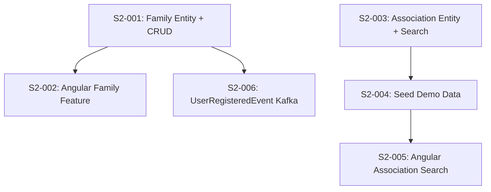

# Phase 2 / Sprint 2: Family Management + Association Directory

> **Sprint Duration**: Weeks 5-6
> **Points**: ~38 (35 P0 + 3 P1)
> **Priority**: All P0 except S2-006 (P1)

> **Codebase Conventions**: See `docs/phases/CONVENTIONS.md` for authoritative conventions.
> Key conventions for this sprint: entities in `entity/` package, DTOs in `dto/request/` + `dto/response/`, DTOs as Java records, events extend `DomainEvent` with constructor pattern.

---

## Sprint Goal

Families can be created with members and managed through the UI. Associations are searchable by
city, category, and keyword with paginated results displayed in the Angular frontend.

---

## Prerequisites

- Phase 1 complete (Sprint 0 + Sprint 1)
- Docker PostgreSQL running with `familyhobbies_users` database
- Parent POM builds all modules: `mvn clean package -DskipTests`
- user-service running with JWT authentication (register, login, refresh)
- Angular app with auth module (login/register forms, JWT interceptor)
- Kafka event classes defined in common module (`UserRegisteredEvent`)
- Discovery-service (Eureka) and API Gateway running

---

## Dependency Map



**Build order**: S2-001 → S2-002 (parallel with S2-003 → S2-004 → S2-005) → S2-006

---

## Stories

---

### Story S2-001: Implement Family Entity + CRUD

**Points**: 8 | **Priority**: P0 | **Epic**: Family

#### Context

Families are the core domain concept. A user creates a family and adds members (children, spouse,
etc.). Each member can later be subscribed to activities independently. This story creates the
Family and FamilyMember entities in user-service, Liquibase migrations, DTOs, service layer with
authorization, and REST controller. Without this, no family management is possible.

#### Tasks

| # | Task | File Path | What To Create | How To Verify |
|---|------|-----------|---------------|---------------|
| 1 | Liquibase: create family table | `backend/user-service/src/main/resources/db/changelog/changesets/003-create-family-table.xml` | t_family DDL | `docker exec` SQL check |
| 2 | Liquibase: create family_member table | `backend/user-service/src/main/resources/db/changelog/changesets/004-create-family-member-table.xml` | t_family_member DDL | `docker exec` SQL check |
| 3 | Update changelog master | `backend/user-service/src/main/resources/db/changelog/db.changelog-master.xml` | Include new changesets | Service starts without errors |
| 4 | Create Relationship enum | `backend/user-service/src/main/java/com/familyhobbies/userservice/entity/enums/Relationship.java` | PARENT, CHILD, SPOUSE, SIBLING, OTHER | Compiles |
| 5 | Create Family entity | `backend/user-service/src/main/java/com/familyhobbies/userservice/entity/Family.java` | JPA entity | Compiles |
| 6 | Create FamilyMember entity | `backend/user-service/src/main/java/com/familyhobbies/userservice/entity/FamilyMember.java` | JPA entity | Compiles |
| 7 | Create FamilyRepository | `backend/user-service/src/main/java/com/familyhobbies/userservice/repository/FamilyRepository.java` | JpaRepository | Compiles |
| 8 | Create FamilyMemberRepository | `backend/user-service/src/main/java/com/familyhobbies/userservice/repository/FamilyMemberRepository.java` | JpaRepository | Compiles |
| 9 | Create FamilyRequest DTO | `backend/user-service/src/main/java/com/familyhobbies/userservice/dto/request/FamilyRequest.java` | Validated request | Compiles |
| 10 | Create FamilyResponse DTO | `backend/user-service/src/main/java/com/familyhobbies/userservice/dto/response/FamilyResponse.java` | Response shape | Compiles |
| 11 | Create FamilyMemberRequest DTO | `backend/user-service/src/main/java/com/familyhobbies/userservice/dto/request/FamilyMemberRequest.java` | Validated request | Compiles |
| 12 | Create FamilyMemberResponse DTO | `backend/user-service/src/main/java/com/familyhobbies/userservice/dto/response/FamilyMemberResponse.java` | Response with computed age | Compiles |
| 13 | Create FamilyService interface | `backend/user-service/src/main/java/com/familyhobbies/userservice/service/FamilyService.java` | Service contract | Compiles |
| 14 | Create FamilyServiceImpl | `backend/user-service/src/main/java/com/familyhobbies/userservice/service/FamilyServiceImpl.java` | Full implementation | Tests pass |
| 15 | Create FamilyController | `backend/user-service/src/main/java/com/familyhobbies/userservice/controller/FamilyController.java` | REST controller | Integration tests pass |
| 16 | Register gateway route | `backend/api-gateway/src/main/resources/application.yml` | Route families → user-service | curl through gateway |

---

#### Task 1 Detail: Liquibase — Create Family Table

**What**: Liquibase changeset creating `t_family` table with PK, name, created_by FK, timestamps.

**Where**: `backend/user-service/src/main/resources/db/changelog/changesets/003-create-family-table.xml`

**Why**: The family table stores family groups. Each family is created by a user (FK to t_user). This must exist before family_member table (FK dependency).

**Content**:

```xml
<?xml version="1.0" encoding="UTF-8"?>
<databaseChangeLog
        xmlns="http://www.liquibase.org/xml/ns/dbchangelog"
        xmlns:xsi="http://www.w3.org/2001/XMLSchema-instance"
        xsi:schemaLocation="http://www.liquibase.org/xml/ns/dbchangelog
        https://www.liquibase.org/xml/ns/dbchangelog/dbchangelog-latest.xsd">

    <changeSet id="003-create-family-table" author="family-hobbies-team">
        <createTable tableName="t_family">
            <column name="id" type="BIGINT" autoIncrement="true">
                <constraints primaryKey="true" primaryKeyName="pk_family" nullable="false"/>
            </column>
            <column name="name" type="VARCHAR(100)">
                <constraints nullable="false"/>
            </column>
            <column name="created_by" type="BIGINT">
                <constraints nullable="false"/>
            </column>
            <column name="created_at" type="TIMESTAMPTZ" defaultValueComputed="NOW()">
                <constraints nullable="false"/>
            </column>
            <column name="updated_at" type="TIMESTAMPTZ" defaultValueComputed="NOW()">
                <constraints nullable="false"/>
            </column>
        </createTable>

        <addForeignKeyConstraint baseTableName="t_family"
                                 baseColumnNames="created_by"
                                 referencedTableName="t_user"
                                 referencedColumnNames="id"
                                 constraintName="fk_family_user"
                                 onDelete="RESTRICT"/>

        <createIndex tableName="t_family" indexName="idx_family_created_by">
            <column name="created_by"/>
        </createIndex>
    </changeSet>

</databaseChangeLog>
```

**Verify**:

```bash
cd backend/user-service && mvn spring-boot:run &
sleep 15
docker exec fhm-postgres psql -U fhm_admin -d familyhobbies_users \
  -c "\d t_family"
# Expected: table with columns id, name, created_by, created_at, updated_at
kill %1
```

---

#### Task 2 Detail: Liquibase — Create Family Member Table

**What**: Liquibase changeset creating `t_family_member` with FK to t_family and t_user.

**Where**: `backend/user-service/src/main/resources/db/changelog/changesets/004-create-family-member-table.xml`

**Why**: Family members are individuals within a family. They may or may not have user accounts (children don't). Each member can be subscribed to activities independently.

**Content**:

```xml
<?xml version="1.0" encoding="UTF-8"?>
<databaseChangeLog
        xmlns="http://www.liquibase.org/xml/ns/dbchangelog"
        xmlns:xsi="http://www.w3.org/2001/XMLSchema-instance"
        xsi:schemaLocation="http://www.liquibase.org/xml/ns/dbchangelog
        https://www.liquibase.org/xml/ns/dbchangelog/dbchangelog-latest.xsd">

    <changeSet id="004-create-family-member-table" author="family-hobbies-team">
        <createTable tableName="t_family_member">
            <column name="id" type="BIGINT" autoIncrement="true">
                <constraints primaryKey="true" primaryKeyName="pk_family_member" nullable="false"/>
            </column>
            <column name="family_id" type="BIGINT">
                <constraints nullable="false"/>
            </column>
            <column name="user_id" type="BIGINT">
                <constraints nullable="true"/>
            </column>
            <column name="first_name" type="VARCHAR(100)">
                <constraints nullable="false"/>
            </column>
            <column name="last_name" type="VARCHAR(100)">
                <constraints nullable="false"/>
            </column>
            <column name="date_of_birth" type="DATE">
                <constraints nullable="false"/>
            </column>
            <column name="relationship" type="VARCHAR(20)">
                <constraints nullable="false"/>
            </column>
            <column name="medical_note" type="TEXT">
                <constraints nullable="true"/>
            </column>
            <column name="created_at" type="TIMESTAMPTZ" defaultValueComputed="NOW()">
                <constraints nullable="false"/>
            </column>
            <column name="updated_at" type="TIMESTAMPTZ" defaultValueComputed="NOW()">
                <constraints nullable="false"/>
            </column>
        </createTable>

        <addForeignKeyConstraint baseTableName="t_family_member"
                                 baseColumnNames="family_id"
                                 referencedTableName="t_family"
                                 referencedColumnNames="id"
                                 constraintName="fk_family_member_family"
                                 onDelete="CASCADE"/>

        <addForeignKeyConstraint baseTableName="t_family_member"
                                 baseColumnNames="user_id"
                                 referencedTableName="t_user"
                                 referencedColumnNames="id"
                                 constraintName="fk_family_member_user"
                                 onDelete="SET NULL"/>

        <createIndex tableName="t_family_member" indexName="idx_family_member_family_id">
            <column name="family_id"/>
        </createIndex>

        <createIndex tableName="t_family_member" indexName="idx_family_member_user_id">
            <column name="user_id"/>
        </createIndex>
    </changeSet>

</databaseChangeLog>
```

**Verify**:

```bash
docker exec fhm-postgres psql -U fhm_admin -d familyhobbies_users \
  -c "\d t_family_member"
# Expected: table with all columns, FK constraints visible
```

---

#### Task 3 Detail: Update Changelog Master

**What**: Add changeset includes for 003 and 004 to the master changelog.

**Where**: `backend/user-service/src/main/resources/db/changelog/db.changelog-master.xml`

**Why**: Liquibase only runs changesets referenced from the master changelog. Without this, migrations won't execute.

**Content** — append to existing file:

```xml
    <include file="changesets/003-create-family-table.xml" relativeToChangelogFile="true"/>
    <include file="changesets/004-create-family-member-table.xml" relativeToChangelogFile="true"/>
```

**Verify**:

```bash
cd backend/user-service && mvn spring-boot:run &
sleep 15
docker exec fhm-postgres psql -U fhm_admin -d familyhobbies_users \
  -c "SELECT id, filename FROM databasechangelog WHERE id LIKE '003%' OR id LIKE '004%'"
# Expected: two rows for 003-create-family-table and 004-create-family-member-table
kill %1
```

---

#### Task 4 Detail: Create Relationship Enum

**What**: Java enum for family member relationship types.

**Where**: `backend/user-service/src/main/java/com/familyhobbies/userservice/entity/enums/Relationship.java`

**Why**: Used in FamilyMember entity and validated in DTOs. Defines allowed relationship values.

**Content**:

```java
package com.familyhobbies.userservice.entity.enums;

public enum Relationship {
    PARENT,
    CHILD,
    SPOUSE,
    SIBLING,
    OTHER
}
```

**Verify**:

```bash
cd backend && mvn compile -pl user-service -q
# Expected: BUILD SUCCESS
```

---

#### Task 5 Detail: Create Family Entity

**What**: JPA entity mapped to `t_family`.

**Where**: `backend/user-service/src/main/java/com/familyhobbies/userservice/entity/Family.java`

**Why**: Core domain entity. A family groups members together and is linked to the user who created it.

**Content**:

```java
package com.familyhobbies.userservice.model;

import jakarta.persistence.*;
import lombok.*;
import org.hibernate.annotations.CreationTimestamp;
import org.hibernate.annotations.UpdateTimestamp;

import java.time.Instant;
import java.util.ArrayList;
import java.util.List;

@Entity
@Table(name = "t_family")
@Getter
@Setter
@NoArgsConstructor
@AllArgsConstructor
@Builder
public class Family {

    @Id
    @GeneratedValue(strategy = GenerationType.IDENTITY)
    private Long id;

    @Column(name = "name", nullable = false, length = 100)
    private String name;

    @Column(name = "created_by", nullable = false)
    private Long createdBy;

    @OneToMany(mappedBy = "family", cascade = CascadeType.ALL, orphanRemoval = true, fetch = FetchType.LAZY)
    @Builder.Default
    private List<FamilyMember> members = new ArrayList<>();

    @CreationTimestamp
    @Column(name = "created_at", nullable = false, updatable = false)
    private Instant createdAt;

    @UpdateTimestamp
    @Column(name = "updated_at", nullable = false)
    private Instant updatedAt;
}
```

**Verify**:

```bash
cd backend && mvn compile -pl user-service -q
# Expected: BUILD SUCCESS
```

---

#### Task 6 Detail: Create FamilyMember Entity

**What**: JPA entity mapped to `t_family_member`.

**Where**: `backend/user-service/src/main/java/com/familyhobbies/userservice/entity/FamilyMember.java`

**Why**: Represents an individual person in a family. Tracks name, DOB, relationship, and optional medical notes.

**Content**:

```java
package com.familyhobbies.userservice.model;

import com.familyhobbies.userservice.entity.enums.Relationship;
import jakarta.persistence.*;
import lombok.*;
import org.hibernate.annotations.CreationTimestamp;
import org.hibernate.annotations.UpdateTimestamp;

import java.time.Instant;
import java.time.LocalDate;

@Entity
@Table(name = "t_family_member")
@Getter
@Setter
@NoArgsConstructor
@AllArgsConstructor
@Builder
public class FamilyMember {

    @Id
    @GeneratedValue(strategy = GenerationType.IDENTITY)
    private Long id;

    @ManyToOne(fetch = FetchType.LAZY)
    @JoinColumn(name = "family_id", nullable = false)
    private Family family;

    @Column(name = "user_id")
    private Long userId;

    @Column(name = "first_name", nullable = false, length = 100)
    private String firstName;

    @Column(name = "last_name", nullable = false, length = 100)
    private String lastName;

    @Column(name = "date_of_birth", nullable = false)
    private LocalDate dateOfBirth;

    @Enumerated(EnumType.STRING)
    @Column(name = "relationship", nullable = false, length = 20)
    private Relationship relationship;

    @Column(name = "medical_note", columnDefinition = "TEXT")
    private String medicalNote;

    @CreationTimestamp
    @Column(name = "created_at", nullable = false, updatable = false)
    private Instant createdAt;

    @UpdateTimestamp
    @Column(name = "updated_at", nullable = false)
    private Instant updatedAt;
}
```

**Verify**:

```bash
cd backend && mvn compile -pl user-service -q
# Expected: BUILD SUCCESS
```

---

#### Task 7 Detail: Create FamilyRepository

**What**: Spring Data JPA repository for Family entity.

**Where**: `backend/user-service/src/main/java/com/familyhobbies/userservice/repository/FamilyRepository.java`

**Why**: Provides data access for families. `findByCreatedBy` is the primary query — each user can have at most one family.

**Content**:

```java
package com.familyhobbies.userservice.repository;

import com.familyhobbies.userservice.entity.Family;
import org.springframework.data.jpa.repository.JpaRepository;
import org.springframework.stereotype.Repository;

import java.util.Optional;

@Repository
public interface FamilyRepository extends JpaRepository<Family, Long> {

    Optional<Family> findByCreatedBy(Long userId);

    boolean existsByCreatedBy(Long userId);
}
```

**Verify**:

```bash
cd backend && mvn compile -pl user-service -q
# Expected: BUILD SUCCESS
```

---

#### Task 8 Detail: Create FamilyMemberRepository

**What**: Spring Data JPA repository for FamilyMember entity.

**Where**: `backend/user-service/src/main/java/com/familyhobbies/userservice/repository/FamilyMemberRepository.java`

**Why**: Provides data access for family members. `findByFamilyId` lists all members of a family.

**Content**:

```java
package com.familyhobbies.userservice.repository;

import com.familyhobbies.userservice.entity.FamilyMember;
import org.springframework.data.jpa.repository.JpaRepository;
import org.springframework.stereotype.Repository;

import java.util.List;

@Repository
public interface FamilyMemberRepository extends JpaRepository<FamilyMember, Long> {

    List<FamilyMember> findByFamilyId(Long familyId);
}
```

**Verify**:

```bash
cd backend && mvn compile -pl user-service -q
# Expected: BUILD SUCCESS
```

---

#### Task 9 Detail: Create FamilyRequest DTO

**What**: Request DTO for creating/updating a family.

**Where**: `backend/user-service/src/main/java/com/familyhobbies/userservice/dto/request/FamilyRequest.java`

**Why**: Validates incoming JSON. Name is required, max 100 chars.

**Content**:

```java
package com.familyhobbies.userservice.dto.request;

import jakarta.validation.constraints.NotBlank;
import jakarta.validation.constraints.Size;

public record FamilyRequest(
    @NotBlank(message = "Family name is required")
    @Size(max = 100, message = "Family name must not exceed 100 characters")
    String name
) {}
```

**Verify**:

```bash
cd backend && mvn compile -pl user-service -q
```

---

#### Task 10 Detail: Create FamilyResponse DTO

**What**: Response DTO for family data including members list.

**Where**: `backend/user-service/src/main/java/com/familyhobbies/userservice/dto/response/FamilyResponse.java`

**Content**:

```java
package com.familyhobbies.userservice.dto.response;

import java.time.Instant;
import java.util.List;

public record FamilyResponse(
    Long id,
    String name,
    Long createdBy,
    List<FamilyMemberResponse> members,
    Instant createdAt,
    Instant updatedAt
) {}
```

**Verify**:

```bash
cd backend && mvn compile -pl user-service -q
```

---

#### Task 11 Detail: Create FamilyMemberRequest DTO

**What**: Request DTO for adding/updating a family member.

**Where**: `backend/user-service/src/main/java/com/familyhobbies/userservice/dto/request/FamilyMemberRequest.java`

**Content**:

```java
package com.familyhobbies.userservice.dto.request;

import com.familyhobbies.userservice.entity.enums.Relationship;
import jakarta.validation.constraints.NotBlank;
import jakarta.validation.constraints.NotNull;
import jakarta.validation.constraints.Past;
import jakarta.validation.constraints.Size;

import java.time.LocalDate;

public record FamilyMemberRequest(
    @NotBlank(message = "First name is required")
    @Size(max = 100, message = "First name must not exceed 100 characters")
    String firstName,

    @NotBlank(message = "Last name is required")
    @Size(max = 100, message = "Last name must not exceed 100 characters")
    String lastName,

    @NotNull(message = "Date of birth is required")
    @Past(message = "Date of birth must be in the past")
    LocalDate dateOfBirth,

    @NotNull(message = "Relationship is required")
    Relationship relationship,

    @Size(max = 500, message = "Medical note must not exceed 500 characters")
    String medicalNote
) {}
```

**Verify**:

```bash
cd backend && mvn compile -pl user-service -q
```

---

#### Task 12 Detail: Create FamilyMemberResponse DTO

**What**: Response DTO with computed age field.

**Where**: `backend/user-service/src/main/java/com/familyhobbies/userservice/dto/response/FamilyMemberResponse.java`

**Content**:

```java
package com.familyhobbies.userservice.dto.response;

import java.time.Instant;
import java.time.LocalDate;

public record FamilyMemberResponse(
    Long id,
    Long familyId,
    String firstName,
    String lastName,
    LocalDate dateOfBirth,
    Integer age,
    String relationship,
    String medicalNote,
    Instant createdAt,
    Instant updatedAt
) {}
```

**Verify**:

```bash
cd backend && mvn compile -pl user-service -q
```

---

#### Task 13 Detail: Create FamilyService Interface

**What**: Service contract defining family business operations.

**Where**: `backend/user-service/src/main/java/com/familyhobbies/userservice/service/FamilyService.java`

**Content**:

```java
package com.familyhobbies.userservice.service;

import com.familyhobbies.userservice.dto.request.*;
import com.familyhobbies.userservice.dto.response.*;

public interface FamilyService {

    FamilyResponse createFamily(Long userId, FamilyRequest request);

    FamilyResponse getMyFamily(Long userId);

    FamilyResponse getFamilyById(Long familyId, Long userId);

    FamilyResponse updateFamily(Long familyId, Long userId, FamilyRequest request);

    FamilyMemberResponse addMember(Long familyId, Long userId, FamilyMemberRequest request);

    FamilyMemberResponse updateMember(Long familyId, Long memberId, Long userId, FamilyMemberRequest request);

    void removeMember(Long familyId, Long memberId, Long userId);
}
```

**Verify**:

```bash
cd backend && mvn compile -pl user-service -q
```

---

#### Task 14 Detail: Create FamilyServiceImpl

**What**: Full service implementation with authorization checks and business logic.

**Where**: `backend/user-service/src/main/java/com/familyhobbies/userservice/service/FamilyServiceImpl.java`

**Why**: Implements all family CRUD operations. Authorization: only the family creator can modify. Business rules: one family per user, member removal checks no active subscriptions (future sprint).

**Content**:

```java
package com.familyhobbies.userservice.service;

import com.familyhobbies.errorhandling.exception.web.ConflictException;
import com.familyhobbies.errorhandling.exception.web.ForbiddenException;
import com.familyhobbies.errorhandling.exception.web.ResourceNotFoundException;
import com.familyhobbies.userservice.dto.request.*;
import com.familyhobbies.userservice.dto.response.*;
import com.familyhobbies.userservice.entity.Family;
import com.familyhobbies.userservice.entity.FamilyMember;
import com.familyhobbies.userservice.repository.FamilyMemberRepository;
import com.familyhobbies.userservice.repository.FamilyRepository;
import lombok.RequiredArgsConstructor;
import lombok.extern.slf4j.Slf4j;
import org.springframework.stereotype.Service;
import org.springframework.transaction.annotation.Transactional;

import java.time.LocalDate;
import java.time.Period;
import java.util.List;
import java.util.stream.Collectors;

@Service
@RequiredArgsConstructor
@Slf4j
@Transactional
public class FamilyServiceImpl implements FamilyService {

    private final FamilyRepository familyRepository;
    private final FamilyMemberRepository familyMemberRepository;

    @Override
    public FamilyResponse createFamily(Long userId, FamilyRequest request) {
        if (familyRepository.existsByCreatedBy(userId)) {
            throw new ConflictException("User already belongs to a family");
        }

        Family family = Family.builder()
                .name(request.name())
                .createdBy(userId)
                .build();

        Family saved = familyRepository.save(family);
        log.info("Family created: id={}, name={}, userId={}", saved.getId(), saved.getName(), userId);
        return mapToFamilyResponse(saved);
    }

    @Override
    @Transactional(readOnly = true)
    public FamilyResponse getMyFamily(Long userId) {
        Family family = familyRepository.findByCreatedBy(userId)
                .orElseThrow(() -> new ResourceNotFoundException("Family not found for user"));
        return mapToFamilyResponse(family);
    }

    @Override
    @Transactional(readOnly = true)
    public FamilyResponse getFamilyById(Long familyId, Long userId) {
        Family family = findFamilyOrThrow(familyId);
        verifyOwnership(family, userId);
        return mapToFamilyResponse(family);
    }

    @Override
    public FamilyResponse updateFamily(Long familyId, Long userId, FamilyRequest request) {
        Family family = findFamilyOrThrow(familyId);
        verifyOwnership(family, userId);

        family.setName(request.name());
        Family saved = familyRepository.save(family);
        log.info("Family updated: id={}, newName={}", saved.getId(), saved.getName());
        return mapToFamilyResponse(saved);
    }

    @Override
    public FamilyMemberResponse addMember(Long familyId, Long userId, FamilyMemberRequest request) {
        Family family = findFamilyOrThrow(familyId);
        verifyOwnership(family, userId);

        FamilyMember member = FamilyMember.builder()
                .family(family)
                .firstName(request.firstName())
                .lastName(request.lastName())
                .dateOfBirth(request.dateOfBirth())
                .relationship(request.relationship())
                .medicalNote(request.medicalNote())
                .build();

        FamilyMember saved = familyMemberRepository.save(member);
        log.info("Member added: id={}, familyId={}, name={} {}",
                saved.getId(), familyId, saved.getFirstName(), saved.getLastName());
        return mapToMemberResponse(saved);
    }

    @Override
    public FamilyMemberResponse updateMember(Long familyId, Long memberId, Long userId,
                                              FamilyMemberRequest request) {
        Family family = findFamilyOrThrow(familyId);
        verifyOwnership(family, userId);

        FamilyMember member = familyMemberRepository.findById(memberId)
                .orElseThrow(() -> new ResourceNotFoundException("Family member not found"));

        if (!member.getFamily().getId().equals(familyId)) {
            throw new ResourceNotFoundException("Member does not belong to this family");
        }

        member.setFirstName(request.firstName());
        member.setLastName(request.lastName());
        member.setDateOfBirth(request.dateOfBirth());
        member.setRelationship(request.relationship());
        member.setMedicalNote(request.medicalNote());

        FamilyMember saved = familyMemberRepository.save(member);
        log.info("Member updated: id={}, familyId={}", saved.getId(), familyId);
        return mapToMemberResponse(saved);
    }

    @Override
    public void removeMember(Long familyId, Long memberId, Long userId) {
        Family family = findFamilyOrThrow(familyId);
        verifyOwnership(family, userId);

        FamilyMember member = familyMemberRepository.findById(memberId)
                .orElseThrow(() -> new ResourceNotFoundException("Family member not found"));

        if (!member.getFamily().getId().equals(familyId)) {
            throw new ResourceNotFoundException("Member does not belong to this family");
        }

        familyMemberRepository.delete(member);
        log.info("Member removed: id={}, familyId={}", memberId, familyId);
    }

    private Family findFamilyOrThrow(Long familyId) {
        return familyRepository.findById(familyId)
                .orElseThrow(() -> new ResourceNotFoundException("Family not found"));
    }

    private void verifyOwnership(Family family, Long userId) {
        if (!family.getCreatedBy().equals(userId)) {
            throw new ForbiddenException("You do not have permission to access this family");
        }
    }

    private FamilyResponse mapToFamilyResponse(Family family) {
        List<FamilyMemberResponse> memberResponses = family.getMembers().stream()
                .map(this::mapToMemberResponse)
                .collect(Collectors.toList());

        return new FamilyResponse(
                family.getId(),
                family.getName(),
                family.getCreatedBy(),
                memberResponses,
                family.getCreatedAt(),
                family.getUpdatedAt());
    }

    private FamilyMemberResponse mapToMemberResponse(FamilyMember member) {
        return new FamilyMemberResponse(
                member.getId(),
                member.getFamily().getId(),
                member.getFirstName(),
                member.getLastName(),
                member.getDateOfBirth(),
                calculateAge(member.getDateOfBirth()),
                member.getRelationship().name(),
                member.getMedicalNote(),
                member.getCreatedAt(),
                member.getUpdatedAt());
    }

    private Integer calculateAge(LocalDate dateOfBirth) {
        if (dateOfBirth == null) return null;
        return Period.between(dateOfBirth, LocalDate.now()).getYears();
    }
}
```

**Verify**:

```bash
cd backend && mvn compile -pl user-service -q
# Expected: BUILD SUCCESS
```

---

#### Task 15 Detail: Create FamilyController

**What**: REST controller exposing all family management endpoints.

**Where**: `backend/user-service/src/main/java/com/familyhobbies/userservice/controller/FamilyController.java`

**Why**: Maps HTTP requests to service methods. Uses `X-User-Id` header (forwarded by API Gateway after JWT validation) for authentication context.

**Content**:

```java
package com.familyhobbies.userservice.controller;

import com.familyhobbies.userservice.dto.request.*;
import com.familyhobbies.userservice.dto.response.*;
import com.familyhobbies.userservice.service.FamilyService;
import jakarta.validation.Valid;
import lombok.RequiredArgsConstructor;
import org.springframework.http.HttpStatus;
import org.springframework.http.ResponseEntity;
import org.springframework.web.bind.annotation.*;

import java.net.URI;

@RestController
@RequestMapping("/api/v1/families")
@RequiredArgsConstructor
public class FamilyController {

    private final FamilyService familyService;

    @PostMapping
    public ResponseEntity<FamilyResponse> createFamily(
            @RequestHeader("X-User-Id") Long userId,
            @Valid @RequestBody FamilyRequest request) {

        FamilyResponse response = familyService.createFamily(userId, request);
        return ResponseEntity
                .created(URI.create("/api/v1/families/" + response.id()))
                .body(response);
    }

    @GetMapping("/me")
    public ResponseEntity<FamilyResponse> getMyFamily(
            @RequestHeader("X-User-Id") Long userId) {

        return ResponseEntity.ok(familyService.getMyFamily(userId));
    }

    @GetMapping("/{id}")
    public ResponseEntity<FamilyResponse> getFamilyById(
            @PathVariable Long id,
            @RequestHeader("X-User-Id") Long userId) {

        return ResponseEntity.ok(familyService.getFamilyById(id, userId));
    }

    @PutMapping("/{id}")
    public ResponseEntity<FamilyResponse> updateFamily(
            @PathVariable Long id,
            @RequestHeader("X-User-Id") Long userId,
            @Valid @RequestBody FamilyRequest request) {

        return ResponseEntity.ok(familyService.updateFamily(id, userId, request));
    }

    @PostMapping("/{familyId}/members")
    public ResponseEntity<FamilyMemberResponse> addMember(
            @PathVariable Long familyId,
            @RequestHeader("X-User-Id") Long userId,
            @Valid @RequestBody FamilyMemberRequest request) {

        FamilyMemberResponse response = familyService.addMember(familyId, userId, request);
        return ResponseEntity
                .created(URI.create("/api/v1/families/" + familyId + "/members/" + response.id()))
                .body(response);
    }

    @GetMapping("/{familyId}/members")
    public ResponseEntity<?> getMembers(
            @PathVariable Long familyId,
            @RequestHeader("X-User-Id") Long userId) {

        FamilyResponse family = familyService.getFamilyById(familyId, userId);
        return ResponseEntity.ok(family.members());
    }

    @PutMapping("/{familyId}/members/{memberId}")
    public ResponseEntity<FamilyMemberResponse> updateMember(
            @PathVariable Long familyId,
            @PathVariable Long memberId,
            @RequestHeader("X-User-Id") Long userId,
            @Valid @RequestBody FamilyMemberRequest request) {

        return ResponseEntity.ok(familyService.updateMember(familyId, memberId, userId, request));
    }

    @DeleteMapping("/{familyId}/members/{memberId}")
    @ResponseStatus(HttpStatus.NO_CONTENT)
    public void removeMember(
            @PathVariable Long familyId,
            @PathVariable Long memberId,
            @RequestHeader("X-User-Id") Long userId) {

        familyService.removeMember(familyId, memberId, userId);
    }
}
```

**Verify**:

```bash
cd backend && mvn compile -pl user-service -q
# Expected: BUILD SUCCESS
```

---

#### Task 16 Detail: Register Gateway Route

**What**: Add route for `/api/v1/families/**` to API Gateway configuration.

**Where**: `backend/api-gateway/src/main/resources/application.yml`

**Why**: The API Gateway must know how to route family requests to user-service. This route uses the existing Eureka-based service discovery.

**Content** — add to existing `spring.cloud.gateway.routes` list:

```yaml
        - id: family-route
          uri: lb://user-service
          predicates:
            - Path=/api/v1/families/**
```

**Verify**:

```bash
# Start all services, then:
curl -s -X POST http://localhost:8080/api/v1/families \
  -H "Authorization: Bearer $TOKEN" \
  -H 'Content-Type: application/json' \
  -d '{"name":"Famille Test"}' | jq '.id'
# Expected: numeric ID (routed through gateway to user-service)
```

---

#### Failing Tests (TDD Contract)

**Test File 1**: `backend/user-service/src/test/java/com/familyhobbies/userservice/service/FamilyServiceImplTest.java`

```java
package com.familyhobbies.userservice.service;

import com.familyhobbies.errorhandling.exception.web.ConflictException;
import com.familyhobbies.errorhandling.exception.web.ForbiddenException;
import com.familyhobbies.errorhandling.exception.web.ResourceNotFoundException;
import com.familyhobbies.userservice.dto.request.*;
import com.familyhobbies.userservice.dto.response.*;
import com.familyhobbies.userservice.entity.Family;
import com.familyhobbies.userservice.entity.FamilyMember;
import com.familyhobbies.userservice.entity.enums.Relationship;
import com.familyhobbies.userservice.repository.FamilyMemberRepository;
import com.familyhobbies.userservice.repository.FamilyRepository;
import org.junit.jupiter.api.BeforeEach;
import org.junit.jupiter.api.DisplayName;
import org.junit.jupiter.api.Nested;
import org.junit.jupiter.api.Test;
import org.junit.jupiter.api.extension.ExtendWith;
import org.mockito.InjectMocks;
import org.mockito.Mock;
import org.mockito.junit.jupiter.MockitoExtension;

import java.time.Instant;
import java.time.LocalDate;
import java.util.ArrayList;
import java.util.Optional;

import static org.assertj.core.api.Assertions.*;
import static org.mockito.ArgumentMatchers.any;
import static org.mockito.Mockito.*;

@ExtendWith(MockitoExtension.class)
@DisplayName("FamilyServiceImpl Unit Tests")
class FamilyServiceImplTest {

    @Mock
    private FamilyRepository familyRepository;

    @Mock
    private FamilyMemberRepository familyMemberRepository;

    @InjectMocks
    private FamilyServiceImpl familyService;

    private Family testFamily;
    private FamilyMember testMember;

    @BeforeEach
    void setUp() {
        testFamily = Family.builder()
                .id(1L)
                .name("Famille Dupont")
                .createdBy(10L)
                .members(new ArrayList<>())
                .createdAt(Instant.now())
                .updatedAt(Instant.now())
                .build();

        testMember = FamilyMember.builder()
                .id(100L)
                .family(testFamily)
                .firstName("Lucas")
                .lastName("Dupont")
                .dateOfBirth(LocalDate.of(2015, 3, 20))
                .relationship(Relationship.CHILD)
                .createdAt(Instant.now())
                .updatedAt(Instant.now())
                .build();
    }

    @Nested
    @DisplayName("createFamily")
    class CreateFamily {

        @Test
        @DisplayName("should create family for user without existing family")
        void shouldCreateFamily() {
            when(familyRepository.existsByCreatedBy(10L)).thenReturn(false);
            when(familyRepository.save(any(Family.class))).thenReturn(testFamily);

            FamilyResponse response = familyService.createFamily(10L,
                    new FamilyRequest("Famille Dupont"));

            assertThat(response.name()).isEqualTo("Famille Dupont");
            assertThat(response.createdBy()).isEqualTo(10L);
            verify(familyRepository).save(any(Family.class));
        }

        @Test
        @DisplayName("should throw ConflictException when user already has a family")
        void shouldThrowConflictWhenDuplicate() {
            when(familyRepository.existsByCreatedBy(10L)).thenReturn(true);

            assertThatThrownBy(() -> familyService.createFamily(10L,
                    new FamilyRequest("Famille Dupont")))
                    .isInstanceOf(ConflictException.class);

            verify(familyRepository, never()).save(any());
        }
    }

    @Nested
    @DisplayName("getMyFamily")
    class GetMyFamily {

        @Test
        @DisplayName("should return family for authenticated user")
        void shouldReturnFamily() {
            when(familyRepository.findByCreatedBy(10L)).thenReturn(Optional.of(testFamily));

            FamilyResponse response = familyService.getMyFamily(10L);

            assertThat(response.getId()).isEqualTo(1L);
            assertThat(response.getName()).isEqualTo("Famille Dupont");
        }

        @Test
        @DisplayName("should throw ResourceNotFoundException when no family")
        void shouldThrowNotFound() {
            when(familyRepository.findByCreatedBy(10L)).thenReturn(Optional.empty());

            assertThatThrownBy(() -> familyService.getMyFamily(10L))
                    .isInstanceOf(ResourceNotFoundException.class);
        }
    }

    @Nested
    @DisplayName("addMember")
    class AddMember {

        @Test
        @DisplayName("should add member to family")
        void shouldAddMember() {
            when(familyRepository.findById(1L)).thenReturn(Optional.of(testFamily));
            when(familyMemberRepository.save(any(FamilyMember.class))).thenReturn(testMember);

            FamilyMemberRequest request = new FamilyMemberRequest(
                    "Lucas", "Dupont",
                    LocalDate.of(2015, 3, 20),
                    Relationship.CHILD, null);

            FamilyMemberResponse response = familyService.addMember(1L, 10L, request);

            assertThat(response.firstName()).isEqualTo("Lucas");
            assertThat(response.relationship()).isEqualTo("CHILD");
            verify(familyMemberRepository).save(any(FamilyMember.class));
        }

        @Test
        @DisplayName("should throw ForbiddenException when not owner")
        void shouldThrowForbiddenWhenNotOwner() {
            when(familyRepository.findById(1L)).thenReturn(Optional.of(testFamily));

            assertThatThrownBy(() -> familyService.addMember(1L, 999L,
                    new FamilyMemberRequest("X", "Y",
                            LocalDate.of(2015, 1, 1),
                            Relationship.CHILD, null)))
                    .isInstanceOf(ForbiddenException.class);
        }
    }

    @Nested
    @DisplayName("updateMember")
    class UpdateMember {

        @Test
        @DisplayName("should throw ResourceNotFoundException when member not found")
        void shouldThrowNotFoundForMember() {
            when(familyRepository.findById(1L)).thenReturn(Optional.of(testFamily));
            when(familyMemberRepository.findById(999L)).thenReturn(Optional.empty());

            assertThatThrownBy(() -> familyService.updateMember(1L, 999L, 10L,
                    new FamilyMemberRequest("X", "Y",
                            LocalDate.of(2015, 1, 1),
                            Relationship.CHILD, null)))
                    .isInstanceOf(ResourceNotFoundException.class);
        }
    }

    @Nested
    @DisplayName("removeMember")
    class RemoveMember {

        @Test
        @DisplayName("should remove member from family")
        void shouldRemoveMember() {
            testFamily.getMembers().add(testMember);
            when(familyRepository.findById(1L)).thenReturn(Optional.of(testFamily));
            when(familyMemberRepository.findById(100L)).thenReturn(Optional.of(testMember));

            familyService.removeMember(1L, 100L, 10L);

            verify(familyMemberRepository).delete(testMember);
        }
    }
}
```

**Test File 2**: `backend/user-service/src/test/java/com/familyhobbies/userservice/controller/FamilyControllerIntegrationTest.java`

```java
package com.familyhobbies.userservice.controller;

import com.familyhobbies.userservice.dto.request.*;
import com.familyhobbies.userservice.dto.response.*;
import com.familyhobbies.userservice.service.FamilyService;
import com.fasterxml.jackson.databind.ObjectMapper;
import org.junit.jupiter.api.DisplayName;
import org.junit.jupiter.api.Test;
import org.springframework.beans.factory.annotation.Autowired;
import org.springframework.boot.test.autoconfigure.web.servlet.WebMvcTest;
import org.springframework.boot.test.mock.bean.MockBean;
import org.springframework.http.MediaType;
import org.springframework.test.web.servlet.MockMvc;

import java.time.Instant;
import java.time.LocalDate;
import java.util.List;

import static org.mockito.ArgumentMatchers.*;
import static org.mockito.Mockito.when;
import static org.springframework.test.web.servlet.request.MockMvcRequestBuilders.*;
import static org.springframework.test.web.servlet.result.MockMvcResultMatchers.*;

@WebMvcTest(FamilyController.class)
@DisplayName("FamilyController Integration Tests")
class FamilyControllerIntegrationTest {

    @Autowired
    private MockMvc mockMvc;

    @Autowired
    private ObjectMapper objectMapper;

    @MockBean
    private FamilyService familyService;

    @Test
    @DisplayName("POST /api/v1/families should return 201 Created")
    void createFamily_shouldReturn201() throws Exception {
        FamilyResponse response = new FamilyResponse(
                1L, "Famille Dupont", 10L,
                List.of(),
                Instant.now(), Instant.now());

        when(familyService.createFamily(eq(10L), any(FamilyRequest.class))).thenReturn(response);

        mockMvc.perform(post("/api/v1/families")
                        .header("X-User-Id", "10")
                        .contentType(MediaType.APPLICATION_JSON)
                        .content("{\"name\":\"Famille Dupont\"}"))
                .andExpect(status().isCreated())
                .andExpect(jsonPath("$.id").value(1))
                .andExpect(jsonPath("$.name").value("Famille Dupont"))
                .andExpect(header().string("Location", "/api/v1/families/1"));
    }

    @Test
    @DisplayName("GET /api/v1/families/me should return 200 OK")
    void getMyFamily_shouldReturn200() throws Exception {
        FamilyMemberResponse member = new FamilyMemberResponse(
                100L, 1L, "Lucas", "Dupont",
                LocalDate.of(2015, 3, 20), 10, "CHILD",
                null, Instant.now(), null);

        FamilyResponse response = new FamilyResponse(
                1L, "Famille Dupont", 10L,
                List.of(member),
                Instant.now(), Instant.now());

        when(familyService.getMyFamily(10L)).thenReturn(response);

        mockMvc.perform(get("/api/v1/families/me")
                        .header("X-User-Id", "10"))
                .andExpect(status().isOk())
                .andExpect(jsonPath("$.name").value("Famille Dupont"))
                .andExpect(jsonPath("$.members[0].firstName").value("Lucas"));
    }

    @Test
    @DisplayName("POST /api/v1/families/{id}/members should return 201 Created")
    void addMember_shouldReturn201() throws Exception {
        FamilyMemberResponse response = new FamilyMemberResponse(
                100L, 1L, "Lucas", "Dupont",
                LocalDate.of(2015, 3, 20), 10, "CHILD",
                null, Instant.now(), null);

        when(familyService.addMember(eq(1L), eq(10L), any(FamilyMemberRequest.class)))
                .thenReturn(response);

        String body = objectMapper.writeValueAsString(new FamilyMemberRequest(
                "Lucas", "Dupont",
                LocalDate.of(2015, 3, 20),
                com.familyhobbies.userservice.entity.enums.Relationship.CHILD, null));

        mockMvc.perform(post("/api/v1/families/1/members")
                        .header("X-User-Id", "10")
                        .contentType(MediaType.APPLICATION_JSON)
                        .content(body))
                .andExpect(status().isCreated())
                .andExpect(jsonPath("$.firstName").value("Lucas"))
                .andExpect(header().exists("Location"));
    }

    @Test
    @DisplayName("DELETE /api/v1/families/{id}/members/{memberId} should return 204")
    void removeMember_shouldReturn204() throws Exception {
        mockMvc.perform(delete("/api/v1/families/1/members/100")
                        .header("X-User-Id", "10"))
                .andExpect(status().isNoContent());
    }

    @Test
    @DisplayName("POST /api/v1/families with blank name should return 400")
    void createFamily_blankName_shouldReturn400() throws Exception {
        mockMvc.perform(post("/api/v1/families")
                        .header("X-User-Id", "10")
                        .contentType(MediaType.APPLICATION_JSON)
                        .content("{\"name\":\"\"}"))
                .andExpect(status().isBadRequest());
    }
}
```

---

### Story S2-002: Implement Angular Family Feature

**Points**: 8 | **Priority**: P0 | **Epic**: Family

#### Context

The Angular frontend needs a family management feature so users can view their family, add/edit
members, and manage family data. This story creates the complete Angular feature module with
NgRx state management, reactive forms, Material UI components, and lazy-loaded routing.

#### Tasks

| # | Task | File Path | What To Create | How To Verify |
|---|------|-----------|---------------|---------------|
| 1 | Create family models | `frontend/src/app/features/family/models/family.model.ts` | TypeScript interfaces | Compiles |
| 2 | Create FamilyService | `frontend/src/app/features/family/services/family.service.ts` | HTTP service | Compiles |
| 3 | Create NgRx actions | `frontend/src/app/features/family/store/family.actions.ts` | Action group | Compiles |
| 4 | Create NgRx reducer | `frontend/src/app/features/family/store/family.reducer.ts` | State + reducer | Compiles |
| 5 | Create NgRx effects | `frontend/src/app/features/family/store/family.effects.ts` | Side effects | Compiles |
| 6 | Create NgRx selectors | `frontend/src/app/features/family/store/family.selectors.ts` | Selectors | Compiles |
| 7 | Create FamilyDashboardComponent | `frontend/src/app/features/family/components/family-dashboard/family-dashboard.component.ts` | Dashboard view | `ng build` |
| 8 | Create FamilyMemberFormComponent | `frontend/src/app/features/family/components/family-member-form/family-member-form.component.ts` | Reactive form | `ng build` |
| 9 | Create FamilyMemberListComponent | `frontend/src/app/features/family/components/family-member-list/family-member-list.component.ts` | Material table | `ng build` |
| 10 | Create family routes | `frontend/src/app/features/family/family.routes.ts` | Lazy routes | `ng build` |
| 11 | Register in app routes | `frontend/src/app/app.routes.ts` | Add lazy family route | `ng build` |

---

#### Task 1 Detail: Create Family Models

**What**: TypeScript interfaces for Family and FamilyMember domain objects.

**Where**: `frontend/src/app/features/family/models/family.model.ts`

**Why**: Type-safe interfaces used across the entire feature — service, store, and components.

**Content**:

```typescript
export interface Family {
  id: number;
  name: string;
  createdBy: number;
  members: FamilyMember[];
  createdAt: string;
  updatedAt: string;
}

export interface FamilyMember {
  id: number;
  familyId: number;
  firstName: string;
  lastName: string;
  dateOfBirth: string;
  age: number;
  relationship: string;
  medicalNote?: string;
  createdAt: string;
  updatedAt?: string;
}

export interface FamilyRequest {
  name: string;
}

export interface FamilyMemberRequest {
  firstName: string;
  lastName: string;
  dateOfBirth: string;
  relationship: string;
  medicalNote?: string;
}
```

**Verify**:

```bash
cd frontend && npx ng build 2>&1 | tail -3
# Expected: Build successful
```

---

#### Task 2 Detail: Create FamilyService

**What**: Angular HTTP service for family API calls.

**Where**: `frontend/src/app/features/family/services/family.service.ts`

**Content**:

```typescript
import { Injectable } from '@angular/core';
import { HttpClient } from '@angular/common/http';
import { Observable } from 'rxjs';
import { Family, FamilyMember, FamilyRequest, FamilyMemberRequest } from '../models/family.model';
import { environment } from '../../../../environments/environment';

@Injectable({ providedIn: 'root' })
export class FamilyService {
  private readonly baseUrl = `${environment.apiUrl}/api/v1/families`;

  constructor(private readonly http: HttpClient) {}

  getMyFamily(): Observable<Family> {
    return this.http.get<Family>(`${this.baseUrl}/me`);
  }

  createFamily(request: FamilyRequest): Observable<Family> {
    return this.http.post<Family>(this.baseUrl, request);
  }

  updateFamily(familyId: number, request: FamilyRequest): Observable<Family> {
    return this.http.put<Family>(`${this.baseUrl}/${familyId}`, request);
  }

  addMember(familyId: number, request: FamilyMemberRequest): Observable<FamilyMember> {
    return this.http.post<FamilyMember>(`${this.baseUrl}/${familyId}/members`, request);
  }

  updateMember(familyId: number, memberId: number, request: FamilyMemberRequest): Observable<FamilyMember> {
    return this.http.put<FamilyMember>(`${this.baseUrl}/${familyId}/members/${memberId}`, request);
  }

  removeMember(familyId: number, memberId: number): Observable<void> {
    return this.http.delete<void>(`${this.baseUrl}/${familyId}/members/${memberId}`);
  }
}
```

**Verify**:

```bash
cd frontend && npx ng build 2>&1 | tail -3
```

---

#### Task 3 Detail: Create NgRx Actions

**What**: NgRx action group for family state management.

**Where**: `frontend/src/app/features/family/store/family.actions.ts`

**Content**:

```typescript
import { createActionGroup, emptyProps, props } from '@ngrx/store';
import { Family, FamilyMember, FamilyRequest, FamilyMemberRequest } from '../models/family.model';

export const FamilyActions = createActionGroup({
  source: 'Family',
  events: {
    'Load Family': emptyProps(),
    'Load Family Success': props<{ family: Family }>(),
    'Load Family Failure': props<{ error: string }>(),

    'Create Family': props<{ request: FamilyRequest }>(),
    'Create Family Success': props<{ family: Family }>(),
    'Create Family Failure': props<{ error: string }>(),

    'Update Family': props<{ familyId: number; request: FamilyRequest }>(),
    'Update Family Success': props<{ family: Family }>(),
    'Update Family Failure': props<{ error: string }>(),

    'Add Member': props<{ familyId: number; request: FamilyMemberRequest }>(),
    'Add Member Success': props<{ member: FamilyMember }>(),
    'Add Member Failure': props<{ error: string }>(),

    'Update Member': props<{ familyId: number; memberId: number; request: FamilyMemberRequest }>(),
    'Update Member Success': props<{ member: FamilyMember }>(),
    'Update Member Failure': props<{ error: string }>(),

    'Remove Member': props<{ familyId: number; memberId: number }>(),
    'Remove Member Success': props<{ memberId: number }>(),
    'Remove Member Failure': props<{ error: string }>(),

    'Clear Error': emptyProps(),
  },
});
```

**Verify**:

```bash
cd frontend && npx ng build 2>&1 | tail -3
```

---

#### Task 4 Detail: Create NgRx Reducer

**What**: Family state definition and reducer with state transitions.

**Where**: `frontend/src/app/features/family/store/family.reducer.ts`

**Content**:

```typescript
import { createFeature, createReducer, on } from '@ngrx/store';
import { Family } from '../models/family.model';
import { FamilyActions } from './family.actions';

export interface FamilyState {
  family: Family | null;
  loading: boolean;
  error: string | null;
}

export const initialFamilyState: FamilyState = {
  family: null,
  loading: false,
  error: null,
};

export const familyReducer = createReducer(
  initialFamilyState,

  on(FamilyActions.loadFamily, FamilyActions.createFamily, FamilyActions.updateFamily,
     FamilyActions.addMember, FamilyActions.updateMember, FamilyActions.removeMember,
     (state) => ({ ...state, loading: true, error: null })),

  on(FamilyActions.loadFamilySuccess, FamilyActions.createFamilySuccess,
     FamilyActions.updateFamilySuccess,
     (state, { family }) => ({ ...state, family, loading: false, error: null })),

  on(FamilyActions.addMemberSuccess, (state, { member }) => ({
    ...state,
    family: state.family
      ? { ...state.family, members: [...state.family.members, member] }
      : null,
    loading: false,
    error: null,
  })),

  on(FamilyActions.updateMemberSuccess, (state, { member }) => ({
    ...state,
    family: state.family
      ? {
          ...state.family,
          members: state.family.members.map((m) => (m.id === member.id ? member : m)),
        }
      : null,
    loading: false,
    error: null,
  })),

  on(FamilyActions.removeMemberSuccess, (state, { memberId }) => ({
    ...state,
    family: state.family
      ? {
          ...state.family,
          members: state.family.members.filter((m) => m.id !== memberId),
        }
      : null,
    loading: false,
    error: null,
  })),

  on(FamilyActions.loadFamilyFailure, FamilyActions.createFamilyFailure,
     FamilyActions.updateFamilyFailure, FamilyActions.addMemberFailure,
     FamilyActions.updateMemberFailure, FamilyActions.removeMemberFailure,
     (state, { error }) => ({ ...state, loading: false, error })),

  on(FamilyActions.clearError, (state) => ({ ...state, error: null })),
);

export const familyFeature = createFeature({
  name: 'family',
  reducer: familyReducer,
});
```

**Verify**:

```bash
cd frontend && npx ng build 2>&1 | tail -3
```

---

#### Task 5 Detail: Create NgRx Effects

**What**: Side effects for family API calls.

**Where**: `frontend/src/app/features/family/store/family.effects.ts`

**Content**:

```typescript
import { Injectable } from '@angular/core';
import { Actions, createEffect, ofType } from '@ngrx/effects';
import { of } from 'rxjs';
import { catchError, map, switchMap } from 'rxjs/operators';
import { FamilyActions } from './family.actions';
import { FamilyService } from '../services/family.service';

@Injectable()
export class FamilyEffects {
  constructor(
    private readonly actions$: Actions,
    private readonly familyService: FamilyService
  ) {}

  loadFamily$ = createEffect(() =>
    this.actions$.pipe(
      ofType(FamilyActions.loadFamily),
      switchMap(() =>
        this.familyService.getMyFamily().pipe(
          map((family) => FamilyActions.loadFamilySuccess({ family })),
          catchError((error) => of(FamilyActions.loadFamilyFailure({ error: error.message })))
        )
      )
    )
  );

  createFamily$ = createEffect(() =>
    this.actions$.pipe(
      ofType(FamilyActions.createFamily),
      switchMap(({ request }) =>
        this.familyService.createFamily(request).pipe(
          map((family) => FamilyActions.createFamilySuccess({ family })),
          catchError((error) => of(FamilyActions.createFamilyFailure({ error: error.message })))
        )
      )
    )
  );

  updateFamily$ = createEffect(() =>
    this.actions$.pipe(
      ofType(FamilyActions.updateFamily),
      switchMap(({ familyId, request }) =>
        this.familyService.updateFamily(familyId, request).pipe(
          map((family) => FamilyActions.updateFamilySuccess({ family })),
          catchError((error) => of(FamilyActions.updateFamilyFailure({ error: error.message })))
        )
      )
    )
  );

  addMember$ = createEffect(() =>
    this.actions$.pipe(
      ofType(FamilyActions.addMember),
      switchMap(({ familyId, request }) =>
        this.familyService.addMember(familyId, request).pipe(
          map((member) => FamilyActions.addMemberSuccess({ member })),
          catchError((error) => of(FamilyActions.addMemberFailure({ error: error.message })))
        )
      )
    )
  );

  updateMember$ = createEffect(() =>
    this.actions$.pipe(
      ofType(FamilyActions.updateMember),
      switchMap(({ familyId, memberId, request }) =>
        this.familyService.updateMember(familyId, memberId, request).pipe(
          map((member) => FamilyActions.updateMemberSuccess({ member })),
          catchError((error) => of(FamilyActions.updateMemberFailure({ error: error.message })))
        )
      )
    )
  );

  removeMember$ = createEffect(() =>
    this.actions$.pipe(
      ofType(FamilyActions.removeMember),
      switchMap(({ familyId, memberId }) =>
        this.familyService.removeMember(familyId, memberId).pipe(
          map(() => FamilyActions.removeMemberSuccess({ memberId })),
          catchError((error) => of(FamilyActions.removeMemberFailure({ error: error.message })))
        )
      )
    )
  );
}
```

**Verify**:

```bash
cd frontend && npx ng build 2>&1 | tail -3
```

---

#### Task 6 Detail: Create NgRx Selectors

**Where**: `frontend/src/app/features/family/store/family.selectors.ts`

**Content**:

```typescript
import { familyFeature } from './family.reducer';

export const {
  selectFamily,
  selectLoading: selectFamilyLoading,
  selectError: selectFamilyError,
} = familyFeature;

import { createSelector } from '@ngrx/store';

export const selectFamilyMembers = createSelector(
  selectFamily,
  (family) => family?.members ?? []
);

export const selectMemberCount = createSelector(
  selectFamilyMembers,
  (members) => members.length
);
```

**Verify**:

```bash
cd frontend && npx ng build 2>&1 | tail -3
```

---

#### Tasks 7-9 Detail: Angular Components

**Task 7 — FamilyDashboardComponent**

**Where**: `frontend/src/app/features/family/components/family-dashboard/family-dashboard.component.ts`

**Content**:

```typescript
import { Component, OnInit } from '@angular/core';
import { CommonModule } from '@angular/common';
import { RouterLink } from '@angular/router';
import { MatCardModule } from '@angular/material/card';
import { MatButtonModule } from '@angular/material/button';
import { MatIconModule } from '@angular/material/icon';
import { MatProgressSpinnerModule } from '@angular/material/progress-spinner';
import { Store } from '@ngrx/store';
import { Observable } from 'rxjs';
import { FamilyActions } from '../../store/family.actions';
import { selectFamily, selectFamilyLoading, selectFamilyError } from '../../store/family.selectors';
import { Family } from '../../models/family.model';
import { FamilyMemberListComponent } from '../family-member-list/family-member-list.component';

@Component({
  selector: 'app-family-dashboard',
  standalone: true,
  imports: [CommonModule, RouterLink, MatCardModule, MatButtonModule, MatIconModule,
            MatProgressSpinnerModule, FamilyMemberListComponent],
  template: `
    <div class="family-dashboard">
      @if (loading$ | async) {
        <mat-spinner diameter="48"></mat-spinner>
      } @else if (family$ | async; as family) {
        <mat-card>
          <mat-card-header>
            <mat-card-title>{{ family.name }}</mat-card-title>
            <mat-card-subtitle>{{ family.members.length }} membre(s)</mat-card-subtitle>
          </mat-card-header>
          <mat-card-content>
            <app-family-member-list [members]="family.members" [familyId]="family.id" />
          </mat-card-content>
          <mat-card-actions>
            <a mat-raised-button color="primary" [routerLink]="['/family/members/new']">
              <mat-icon>person_add</mat-icon> Ajouter un membre
            </a>
          </mat-card-actions>
        </mat-card>
      } @else {
        <mat-card>
          <mat-card-content>
            <p>Vous n'avez pas encore de famille.</p>
            <button mat-raised-button color="primary" (click)="createFamily()">
              Creer ma famille
            </button>
          </mat-card-content>
        </mat-card>
      }
    </div>
  `,
  styles: [`.family-dashboard { max-width: 800px; margin: 24px auto; padding: 0 16px; }`],
})
export class FamilyDashboardComponent implements OnInit {
  family$: Observable<Family | null>;
  loading$: Observable<boolean>;

  constructor(private readonly store: Store) {
    this.family$ = this.store.select(selectFamily);
    this.loading$ = this.store.select(selectFamilyLoading);
  }

  ngOnInit(): void {
    this.store.dispatch(FamilyActions.loadFamily());
  }

  createFamily(): void {
    const name = prompt('Nom de la famille:');
    if (name) {
      this.store.dispatch(FamilyActions.createFamily({ request: { name } }));
    }
  }
}
```

---

**Task 8 — FamilyMemberFormComponent**

**Where**: `frontend/src/app/features/family/components/family-member-form/family-member-form.component.ts`

**Content**:

```typescript
import { Component, OnInit } from '@angular/core';
import { CommonModule } from '@angular/common';
import { ReactiveFormsModule, FormBuilder, FormGroup, Validators } from '@angular/forms';
import { ActivatedRoute, Router } from '@angular/router';
import { MatFormFieldModule } from '@angular/material/form-field';
import { MatInputModule } from '@angular/material/input';
import { MatSelectModule } from '@angular/material/select';
import { MatButtonModule } from '@angular/material/button';
import { MatDatepickerModule } from '@angular/material/datepicker';
import { MatNativeDateModule } from '@angular/material/core';
import { Store } from '@ngrx/store';
import { FamilyActions } from '../../store/family.actions';
import { selectFamily } from '../../store/family.selectors';

@Component({
  selector: 'app-family-member-form',
  standalone: true,
  imports: [CommonModule, ReactiveFormsModule, MatFormFieldModule, MatInputModule,
            MatSelectModule, MatButtonModule, MatDatepickerModule, MatNativeDateModule],
  template: `
    <div class="member-form-page">
      <h2>{{ isEditMode ? 'Modifier' : 'Ajouter' }} un membre</h2>
      <form [formGroup]="memberForm" (ngSubmit)="onSubmit()">
        <mat-form-field appearance="outline">
          <mat-label>Prenom</mat-label>
          <input matInput formControlName="firstName" />
        </mat-form-field>

        <mat-form-field appearance="outline">
          <mat-label>Nom</mat-label>
          <input matInput formControlName="lastName" />
        </mat-form-field>

        <mat-form-field appearance="outline">
          <mat-label>Date de naissance</mat-label>
          <input matInput [matDatepicker]="picker" formControlName="dateOfBirth" />
          <mat-datepicker-toggle matSuffix [for]="picker"></mat-datepicker-toggle>
          <mat-datepicker #picker></mat-datepicker>
        </mat-form-field>

        <mat-form-field appearance="outline">
          <mat-label>Lien de parente</mat-label>
          <mat-select formControlName="relationship">
            <mat-option value="PARENT">Parent</mat-option>
            <mat-option value="CHILD">Enfant</mat-option>
            <mat-option value="SPOUSE">Conjoint(e)</mat-option>
            <mat-option value="SIBLING">Frere/Soeur</mat-option>
            <mat-option value="OTHER">Autre</mat-option>
          </mat-select>
        </mat-form-field>

        <mat-form-field appearance="outline">
          <mat-label>Notes medicales</mat-label>
          <textarea matInput formControlName="medicalNote" rows="3"></textarea>
        </mat-form-field>

        <button mat-raised-button color="primary" type="submit" [disabled]="memberForm.invalid">
          {{ isEditMode ? 'Mettre a jour' : 'Ajouter' }}
        </button>
      </form>
    </div>
  `,
  styles: [`
    .member-form-page { max-width: 600px; margin: 24px auto; padding: 0 16px; }
    form { display: flex; flex-direction: column; gap: 8px; }
  `],
})
export class FamilyMemberFormComponent implements OnInit {
  memberForm!: FormGroup;
  isEditMode = false;
  familyId: number | null = null;
  memberId: number | null = null;

  constructor(
    private readonly fb: FormBuilder,
    private readonly store: Store,
    private readonly route: ActivatedRoute,
    private readonly router: Router
  ) {}

  ngOnInit(): void {
    this.memberForm = this.fb.group({
      firstName: ['', [Validators.required, Validators.maxLength(100)]],
      lastName: ['', [Validators.required, Validators.maxLength(100)]],
      dateOfBirth: [null, Validators.required],
      relationship: [null, Validators.required],
      medicalNote: ['', Validators.maxLength(500)],
    });

    this.memberId = this.route.snapshot.paramMap.has('id')
      ? Number(this.route.snapshot.paramMap.get('id'))
      : null;
    this.isEditMode = this.memberId !== null;

    this.store.select(selectFamily).subscribe((family) => {
      if (family) {
        this.familyId = family.id;
        if (this.isEditMode && this.memberId) {
          const member = family.members.find((m) => m.id === this.memberId);
          if (member) {
            this.memberForm.patchValue({
              firstName: member.firstName,
              lastName: member.lastName,
              dateOfBirth: new Date(member.dateOfBirth),
              relationship: member.relationship,
              medicalNote: member.medicalNote || '',
            });
          }
        }
      }
    });
  }

  onSubmit(): void {
    if (this.memberForm.invalid || !this.familyId) return;

    const value = this.memberForm.value;
    const dateStr = value.dateOfBirth instanceof Date
      ? value.dateOfBirth.toISOString().split('T')[0]
      : value.dateOfBirth;

    const request = {
      firstName: value.firstName,
      lastName: value.lastName,
      dateOfBirth: dateStr,
      relationship: value.relationship,
      medicalNote: value.medicalNote || undefined,
    };

    if (this.isEditMode && this.memberId) {
      this.store.dispatch(FamilyActions.updateMember({
        familyId: this.familyId, memberId: this.memberId, request,
      }));
    } else {
      this.store.dispatch(FamilyActions.addMember({ familyId: this.familyId, request }));
    }
    this.router.navigate(['/family']);
  }
}
```

---

**Task 9 — FamilyMemberListComponent**

**Where**: `frontend/src/app/features/family/components/family-member-list/family-member-list.component.ts`

**Content**:

```typescript
import { Component, Input } from '@angular/core';
import { CommonModule } from '@angular/common';
import { RouterLink } from '@angular/router';
import { MatTableModule } from '@angular/material/table';
import { MatButtonModule } from '@angular/material/button';
import { MatIconModule } from '@angular/material/icon';
import { Store } from '@ngrx/store';
import { FamilyActions } from '../../store/family.actions';
import { FamilyMember } from '../../models/family.model';

@Component({
  selector: 'app-family-member-list',
  standalone: true,
  imports: [CommonModule, RouterLink, MatTableModule, MatButtonModule, MatIconModule],
  template: `
    <table mat-table [dataSource]="members" class="member-table">
      <ng-container matColumnDef="name">
        <th mat-header-cell *matHeaderCellDef>Nom</th>
        <td mat-cell *matCellDef="let m">{{ m.firstName }} {{ m.lastName }}</td>
      </ng-container>
      <ng-container matColumnDef="age">
        <th mat-header-cell *matHeaderCellDef>Age</th>
        <td mat-cell *matCellDef="let m">{{ m.age }} ans</td>
      </ng-container>
      <ng-container matColumnDef="relationship">
        <th mat-header-cell *matHeaderCellDef>Lien</th>
        <td mat-cell *matCellDef="let m">{{ m.relationship }}</td>
      </ng-container>
      <ng-container matColumnDef="actions">
        <th mat-header-cell *matHeaderCellDef>Actions</th>
        <td mat-cell *matCellDef="let m">
          <a mat-icon-button [routerLink]="['/family/members', m.id, 'edit']">
            <mat-icon>edit</mat-icon>
          </a>
          <button mat-icon-button color="warn" (click)="deleteMember(m.id)">
            <mat-icon>delete</mat-icon>
          </button>
        </td>
      </ng-container>
      <tr mat-header-row *matHeaderRowDef="displayedColumns"></tr>
      <tr mat-row *matRowDef="let row; columns: displayedColumns"></tr>
    </table>
  `,
  styles: [`.member-table { width: 100%; }`],
})
export class FamilyMemberListComponent {
  @Input() members: FamilyMember[] = [];
  @Input() familyId!: number;
  displayedColumns = ['name', 'age', 'relationship', 'actions'];

  constructor(private readonly store: Store) {}

  deleteMember(memberId: number): void {
    if (confirm('Supprimer ce membre ?')) {
      this.store.dispatch(FamilyActions.removeMember({ familyId: this.familyId, memberId }));
    }
  }
}
```

---

#### Task 10 Detail: Create Family Routes

**Where**: `frontend/src/app/features/family/family.routes.ts`

**Content**:

```typescript
import { Routes } from '@angular/router';
import { provideState } from '@ngrx/store';
import { provideEffects } from '@ngrx/effects';
import { familyFeature } from './store/family.reducer';
import { FamilyEffects } from './store/family.effects';

export const FAMILY_ROUTES: Routes = [
  {
    path: '',
    providers: [provideState(familyFeature), provideEffects(FamilyEffects)],
    children: [
      {
        path: '',
        loadComponent: () =>
          import('./components/family-dashboard/family-dashboard.component').then(
            (m) => m.FamilyDashboardComponent
          ),
        title: 'Ma famille',
      },
      {
        path: 'members/new',
        loadComponent: () =>
          import('./components/family-member-form/family-member-form.component').then(
            (m) => m.FamilyMemberFormComponent
          ),
        title: 'Ajouter un membre',
      },
      {
        path: 'members/:id/edit',
        loadComponent: () =>
          import('./components/family-member-form/family-member-form.component').then(
            (m) => m.FamilyMemberFormComponent
          ),
        title: 'Modifier un membre',
      },
    ],
  },
];
```

---

#### Task 11 Detail: Register in App Routes

**Where**: `frontend/src/app/app.routes.ts`

**Content** — add to existing routes array:

```typescript
{
  path: 'family',
  loadChildren: () =>
    import('./features/family/family.routes').then((m) => m.FAMILY_ROUTES),
},
```

---

#### Failing Tests

**Test File 1**: `frontend/src/app/features/family/services/family.service.spec.ts`

```typescript
import { TestBed } from '@angular/core/testing';
import { HttpClientTestingModule, HttpTestingController } from '@angular/common/http/testing';
import { FamilyService } from './family.service';
import { environment } from '../../../../environments/environment';

describe('FamilyService', () => {
  let service: FamilyService;
  let httpMock: HttpTestingController;
  const baseUrl = `${environment.apiUrl}/api/v1/families`;

  beforeEach(() => {
    TestBed.configureTestingModule({
      imports: [HttpClientTestingModule],
      providers: [FamilyService],
    });
    service = TestBed.inject(FamilyService);
    httpMock = TestBed.inject(HttpTestingController);
  });

  afterEach(() => httpMock.verify());

  it('should call GET /families/me', () => {
    service.getMyFamily().subscribe();
    const req = httpMock.expectOne(`${baseUrl}/me`);
    expect(req.request.method).toBe('GET');
    req.flush({ id: 1, name: 'Test', members: [] });
  });

  it('should call POST /families', () => {
    service.createFamily({ name: 'Famille Test' }).subscribe();
    const req = httpMock.expectOne(baseUrl);
    expect(req.request.method).toBe('POST');
    expect(req.request.body).toEqual({ name: 'Famille Test' });
    req.flush({ id: 1, name: 'Famille Test', members: [] });
  });

  it('should call POST /families/{id}/members', () => {
    const request = { firstName: 'Jean', lastName: 'Test', dateOfBirth: '2015-01-01', relationship: 'CHILD' };
    service.addMember(1, request).subscribe();
    const req = httpMock.expectOne(`${baseUrl}/1/members`);
    expect(req.request.method).toBe('POST');
    req.flush({ id: 100, familyId: 1, ...request });
  });

  it('should call DELETE /families/{id}/members/{memberId}', () => {
    service.removeMember(1, 100).subscribe();
    const req = httpMock.expectOne(`${baseUrl}/1/members/100`);
    expect(req.request.method).toBe('DELETE');
    req.flush(null);
  });
});
```

**Test File 2**: `frontend/src/app/features/family/store/family.reducer.spec.ts`

```typescript
import { familyReducer, initialFamilyState, FamilyState } from './family.reducer';
import { FamilyActions } from './family.actions';
import { Family, FamilyMember } from '../models/family.model';

describe('Family Reducer', () => {
  const mockFamily: Family = {
    id: 1, name: 'Famille Dupont', createdBy: 10, members: [],
    createdAt: '2026-01-01T00:00:00Z', updatedAt: '2026-01-01T00:00:00Z',
  };
  const mockMember: FamilyMember = {
    id: 100, familyId: 1, firstName: 'Lucas', lastName: 'Dupont',
    dateOfBirth: '2015-03-20', age: 10, relationship: 'CHILD',
    createdAt: '2026-01-01T00:00:00Z',
  };

  it('should return initial state for unknown action', () => {
    const state = familyReducer(initialFamilyState, { type: 'Unknown' });
    expect(state).toBe(initialFamilyState);
  });

  it('should set loading on loadFamily', () => {
    const state = familyReducer(initialFamilyState, FamilyActions.loadFamily());
    expect(state.loading).toBe(true);
    expect(state.error).toBeNull();
  });

  it('should set family on loadFamilySuccess', () => {
    const state = familyReducer(initialFamilyState, FamilyActions.loadFamilySuccess({ family: mockFamily }));
    expect(state.family).toEqual(mockFamily);
    expect(state.loading).toBe(false);
  });

  it('should set error on loadFamilyFailure', () => {
    const state = familyReducer(initialFamilyState, FamilyActions.loadFamilyFailure({ error: 'fail' }));
    expect(state.error).toBe('fail');
    expect(state.loading).toBe(false);
  });

  it('should add member on addMemberSuccess', () => {
    const withFamily: FamilyState = { family: { ...mockFamily, members: [] }, loading: true, error: null };
    const state = familyReducer(withFamily, FamilyActions.addMemberSuccess({ member: mockMember }));
    expect(state.family?.members).toHaveLength(1);
    expect(state.family?.members[0].firstName).toBe('Lucas');
  });

  it('should remove member on removeMemberSuccess', () => {
    const withMember: FamilyState = { family: { ...mockFamily, members: [mockMember] }, loading: true, error: null };
    const state = familyReducer(withMember, FamilyActions.removeMemberSuccess({ memberId: 100 }));
    expect(state.family?.members).toHaveLength(0);
  });

  it('should update member on updateMemberSuccess', () => {
    const updated = { ...mockMember, firstName: 'Updated' };
    const withMember: FamilyState = { family: { ...mockFamily, members: [mockMember] }, loading: true, error: null };
    const state = familyReducer(withMember, FamilyActions.updateMemberSuccess({ member: updated }));
    expect(state.family?.members[0].firstName).toBe('Updated');
  });
});
```

---

### Story S2-003: Implement Association Entity + Search

**Points**: 8 | **Priority**: P0 | **Epic**: Association

#### Context

This story scaffolds the **association-service** microservice from scratch and implements the
association search feature. Associations are the core directory — families discover associations
by searching with city, category, and keyword filters. The service uses JPA Specifications for
dynamic multi-filter queries and returns Spring Page responses for pagination. This is a new
microservice with its own database (`familyhobbies_associations`), Eureka registration, and
gateway route.

#### Tasks

| # | Task | File Path | What To Create | How To Verify |
|---|------|-----------|---------------|---------------|
| 1 | Scaffold pom.xml | `backend/association-service/pom.xml` | Maven module | `mvn compile` |
| 2 | Add to parent POM | `backend/pom.xml` | Add module | `mvn validate` |
| 3 | Create application.yml | `backend/association-service/src/main/resources/application.yml` | Config | Service starts |
| 4 | Create main class | `backend/association-service/src/main/java/com/familyhobbies/associationservice/AssociationServiceApplication.java` | Spring Boot app | Service starts |
| 5 | Add DB to Docker init | `docker/init-databases.sql` | CREATE DATABASE | `docker exec` check |
| 6 | Liquibase: association table | `backend/association-service/src/main/resources/db/changelog/changesets/001-create-association-table.xml` | t_association DDL | Migration runs |
| 7 | Create changelog master | `backend/association-service/src/main/resources/db/changelog/db.changelog-master.xml` | Include changeset | Service starts |
| 8 | Create AssociationCategory enum | `backend/association-service/src/main/java/com/familyhobbies/associationservice/entity/enums/AssociationCategory.java` | Enum | Compiles |
| 9 | Create AssociationStatus enum | `backend/association-service/src/main/java/com/familyhobbies/associationservice/entity/enums/AssociationStatus.java` | Enum | Compiles |
| 10 | Create Association entity | `backend/association-service/src/main/java/com/familyhobbies/associationservice/entity/Association.java` | JPA entity | Compiles |
| 11 | Create AssociationRepository | `backend/association-service/src/main/java/com/familyhobbies/associationservice/repository/AssociationRepository.java` | JpaRepository + Spec | Compiles |
| 12 | Create AssociationSpecification | `backend/association-service/src/main/java/com/familyhobbies/associationservice/repository/AssociationSpecification.java` | Dynamic query | Compiles |
| 13 | Create DTOs | `backend/association-service/src/main/java/com/familyhobbies/associationservice/dto/request/` + `dto/response/` | Search, Response, Detail | Compiles |
| 14 | Create AssociationService | `backend/association-service/src/main/java/com/familyhobbies/associationservice/service/AssociationServiceImpl.java` | Service impl | Tests pass |
| 15 | Create AssociationController | `backend/association-service/src/main/java/com/familyhobbies/associationservice/controller/AssociationController.java` | REST controller | Integration tests |
| 16 | Register gateway route | `backend/api-gateway/src/main/resources/application.yml` | Route associations | curl through gateway |

---

#### Task 1 Detail: Scaffold association-service pom.xml

**What**: Maven module POM for the new association-service microservice.

**Where**: `backend/association-service/pom.xml`

**Why**: This is a brand-new microservice. The POM declares all dependencies: Spring Boot web, JPA, Liquibase, PostgreSQL, Eureka client, common module, and test dependencies.

**Content**:

```xml
<?xml version="1.0" encoding="UTF-8"?>
<project xmlns="http://maven.apache.org/POM/4.0.0"
         xmlns:xsi="http://www.w3.org/2001/XMLSchema-instance"
         xsi:schemaLocation="http://maven.apache.org/POM/4.0.0
         https://maven.apache.org/xsd/maven-4.0.0.xsd">
    <modelVersion>4.0.0</modelVersion>

    <parent>
        <groupId>com.familyhobbies</groupId>
        <artifactId>family-hobbies-manager-backend</artifactId>
        <version>0.1.0-SNAPSHOT</version>
    </parent>

    <artifactId>association-service</artifactId>
    <name>Association Service</name>
    <description>Association directory, activities, sessions, subscriptions, attendance</description>

    <dependencies>
        <!-- Spring Boot -->
        <dependency>
            <groupId>org.springframework.boot</groupId>
            <artifactId>spring-boot-starter-web</artifactId>
        </dependency>
        <dependency>
            <groupId>org.springframework.boot</groupId>
            <artifactId>spring-boot-starter-data-jpa</artifactId>
        </dependency>
        <dependency>
            <groupId>org.springframework.boot</groupId>
            <artifactId>spring-boot-starter-validation</artifactId>
        </dependency>
        <dependency>
            <groupId>org.springframework.boot</groupId>
            <artifactId>spring-boot-starter-actuator</artifactId>
        </dependency>

        <!-- Spring Cloud -->
        <dependency>
            <groupId>org.springframework.cloud</groupId>
            <artifactId>spring-cloud-starter-netflix-eureka-client</artifactId>
        </dependency>

        <!-- Database -->
        <dependency>
            <groupId>org.postgresql</groupId>
            <artifactId>postgresql</artifactId>
            <scope>runtime</scope>
        </dependency>
        <dependency>
            <groupId>org.liquibase</groupId>
            <artifactId>liquibase-core</artifactId>
        </dependency>

        <!-- Internal modules -->
        <dependency>
            <groupId>com.familyhobbies</groupId>
            <artifactId>common</artifactId>
        </dependency>

        <!-- Lombok -->
        <dependency>
            <groupId>org.projectlombok</groupId>
            <artifactId>lombok</artifactId>
            <optional>true</optional>
        </dependency>

        <!-- Test -->
        <dependency>
            <groupId>org.springframework.boot</groupId>
            <artifactId>spring-boot-starter-test</artifactId>
            <scope>test</scope>
        </dependency>
        <dependency>
            <groupId>com.h2database</groupId>
            <artifactId>h2</artifactId>
            <scope>test</scope>
        </dependency>
    </dependencies>

    <build>
        <plugins>
            <plugin>
                <groupId>org.springframework.boot</groupId>
                <artifactId>spring-boot-maven-plugin</artifactId>
                <configuration>
                    <excludes>
                        <exclude>
                            <groupId>org.projectlombok</groupId>
                            <artifactId>lombok</artifactId>
                        </exclude>
                    </excludes>
                </configuration>
            </plugin>
        </plugins>
    </build>
</project>
```

**Verify**:

```bash
cd backend/association-service && mvn compile -q
# Expected: BUILD SUCCESS
```

---

#### Task 2 Detail: Add to Parent POM

**What**: Register association-service as a module in the parent POM.

**Where**: `backend/pom.xml`

**Content** — add to `<modules>` list:

```xml
        <module>association-service</module>
```

**Verify**:

```bash
cd backend && mvn validate
# Expected: BUILD SUCCESS — all modules recognized
```

---

#### Task 3 Detail: Create application.yml

**What**: Spring Boot configuration for association-service.

**Where**: `backend/association-service/src/main/resources/application.yml`

**Content**:

```yaml
server:
  port: 8082

spring:
  application:
    name: association-service
  datasource:
    url: jdbc:postgresql://${DB_HOST:localhost}:${DB_PORT:5432}/familyhobbies_associations
    username: ${DB_USER:fhm_admin}
    password: ${DB_PASSWORD:fhm_secret}
    driver-class-name: org.postgresql.Driver
  jpa:
    hibernate:
      ddl-auto: none
    show-sql: false
    properties:
      hibernate:
        dialect: org.hibernate.dialect.PostgreSQLDialect
  liquibase:
    change-log: classpath:db/changelog/db.changelog-master.xml

eureka:
  client:
    service-url:
      defaultZone: ${EUREKA_URL:http://localhost:8761/eureka/}
  instance:
    prefer-ip-address: true

management:
  endpoints:
    web:
      exposure:
        include: health,info
```

**Verify**:

```bash
cd backend/association-service && mvn spring-boot:run &
sleep 15
curl -s http://localhost:8082/actuator/health | grep UP
kill %1
```

---

#### Task 4 Detail: Create Main Application Class

**Where**: `backend/association-service/src/main/java/com/familyhobbies/associationservice/AssociationServiceApplication.java`

**Content**:

```java
package com.familyhobbies.associationservice;

import org.springframework.boot.SpringApplication;
import org.springframework.boot.autoconfigure.SpringBootApplication;
import org.springframework.cloud.client.discovery.EnableDiscoveryClient;

@SpringBootApplication
@EnableDiscoveryClient
public class AssociationServiceApplication {

    public static void main(String[] args) {
        SpringApplication.run(AssociationServiceApplication.class, args);
    }
}
```

**Verify**:

```bash
cd backend && mvn compile -pl association-service -q
```

---

#### Task 5 Detail: Add Association DB to Docker Init

**What**: Add `familyhobbies_associations` database to the Docker PostgreSQL init script.

**Where**: `docker/init-databases.sql`

**Content** — append:

```sql
CREATE DATABASE familyhobbies_associations OWNER fhm_admin;
GRANT ALL PRIVILEGES ON DATABASE familyhobbies_associations TO fhm_admin;
```

**Verify**:

```bash
cd docker && docker compose down -v && docker compose up -d
sleep 5
docker exec fhm-postgres psql -U fhm_admin -l | grep familyhobbies_associations
# Expected: familyhobbies_associations listed
```

---

#### Task 6 Detail: Liquibase — Create Association Table

**What**: Full DDL for `t_association` with all columns and indexes.

**Where**: `backend/association-service/src/main/resources/db/changelog/changesets/001-create-association-table.xml`

**Content**:

```xml
<?xml version="1.0" encoding="UTF-8"?>
<databaseChangeLog
        xmlns="http://www.liquibase.org/xml/ns/dbchangelog"
        xmlns:xsi="http://www.w3.org/2001/XMLSchema-instance"
        xsi:schemaLocation="http://www.liquibase.org/xml/ns/dbchangelog
        https://www.liquibase.org/xml/ns/dbchangelog/dbchangelog-latest.xsd">

    <changeSet id="001-create-association-table" author="family-hobbies-team">
        <createTable tableName="t_association">
            <column name="id" type="BIGINT" autoIncrement="true">
                <constraints primaryKey="true" primaryKeyName="pk_association" nullable="false"/>
            </column>
            <column name="name" type="VARCHAR(255)">
                <constraints nullable="false"/>
            </column>
            <column name="slug" type="VARCHAR(255)">
                <constraints nullable="false" unique="true" uniqueConstraintName="uq_association_slug"/>
            </column>
            <column name="description" type="TEXT"/>
            <column name="address" type="VARCHAR(255)"/>
            <column name="city" type="VARCHAR(100)">
                <constraints nullable="false"/>
            </column>
            <column name="postal_code" type="VARCHAR(10)">
                <constraints nullable="false"/>
            </column>
            <column name="department" type="VARCHAR(5)"/>
            <column name="region" type="VARCHAR(100)"/>
            <column name="phone" type="VARCHAR(20)"/>
            <column name="email" type="VARCHAR(255)"/>
            <column name="website" type="VARCHAR(255)"/>
            <column name="logo_url" type="VARCHAR(500)"/>
            <column name="helloasso_slug" type="VARCHAR(255)"/>
            <column name="helloasso_org_id" type="VARCHAR(100)"/>
            <column name="category" type="VARCHAR(50)">
                <constraints nullable="false"/>
            </column>
            <column name="status" type="VARCHAR(20)" defaultValue="ACTIVE">
                <constraints nullable="false"/>
            </column>
            <column name="last_synced_at" type="TIMESTAMPTZ"/>
            <column name="created_at" type="TIMESTAMPTZ" defaultValueComputed="NOW()">
                <constraints nullable="false"/>
            </column>
            <column name="updated_at" type="TIMESTAMPTZ" defaultValueComputed="NOW()">
                <constraints nullable="false"/>
            </column>
        </createTable>

        <createIndex tableName="t_association" indexName="idx_association_city">
            <column name="city"/>
        </createIndex>

        <createIndex tableName="t_association" indexName="idx_association_category">
            <column name="category"/>
        </createIndex>

        <createIndex tableName="t_association" indexName="idx_association_city_category">
            <column name="city"/>
            <column name="category"/>
        </createIndex>

        <createIndex tableName="t_association" indexName="idx_association_postal_code">
            <column name="postal_code"/>
        </createIndex>

        <createIndex tableName="t_association" indexName="idx_association_helloasso_slug">
            <column name="helloasso_slug"/>
        </createIndex>
    </changeSet>

</databaseChangeLog>
```

**Verify**:

```bash
docker exec fhm-postgres psql -U fhm_admin -d familyhobbies_associations \
  -c "\d t_association"
# Expected: table with all 20 columns, indexes listed
```

---

#### Task 7 Detail: Create Changelog Master

**Where**: `backend/association-service/src/main/resources/db/changelog/db.changelog-master.xml`

**Content**:

```xml
<?xml version="1.0" encoding="UTF-8"?>
<databaseChangeLog
        xmlns="http://www.liquibase.org/xml/ns/dbchangelog"
        xmlns:xsi="http://www.w3.org/2001/XMLSchema-instance"
        xsi:schemaLocation="http://www.liquibase.org/xml/ns/dbchangelog
        https://www.liquibase.org/xml/ns/dbchangelog/dbchangelog-latest.xsd">

    <include file="changesets/001-create-association-table.xml" relativeToChangelogFile="true"/>

</databaseChangeLog>
```

---

#### Tasks 8-9 Detail: Create Enums

**Task 8 — AssociationCategory**

**Where**: `backend/association-service/src/main/java/com/familyhobbies/associationservice/entity/enums/AssociationCategory.java`

```java
package com.familyhobbies.associationservice.entity.enums;

public enum AssociationCategory {
    SPORT,
    DANCE,
    MUSIC,
    THEATER,
    ART,
    MARTIAL_ARTS,
    WELLNESS,
    OTHER
}
```

**Task 9 — AssociationStatus**

**Where**: `backend/association-service/src/main/java/com/familyhobbies/associationservice/entity/enums/AssociationStatus.java`

```java
package com.familyhobbies.associationservice.entity.enums;

public enum AssociationStatus {
    ACTIVE,
    INACTIVE,
    ARCHIVED
}
```

---

#### Task 10 Detail: Create Association Entity

**Where**: `backend/association-service/src/main/java/com/familyhobbies/associationservice/entity/Association.java`

**Content**:

```java
package com.familyhobbies.associationservice.model;

import com.familyhobbies.associationservice.entity.enums.AssociationCategory;
import com.familyhobbies.associationservice.entity.enums.AssociationStatus;
import jakarta.persistence.*;
import lombok.*;
import org.hibernate.annotations.CreationTimestamp;
import org.hibernate.annotations.UpdateTimestamp;

import java.time.Instant;

@Entity
@Table(name = "t_association")
@Getter
@Setter
@NoArgsConstructor
@AllArgsConstructor
@Builder
public class Association {

    @Id
    @GeneratedValue(strategy = GenerationType.IDENTITY)
    private Long id;

    @Column(nullable = false, length = 255)
    private String name;

    @Column(nullable = false, unique = true, length = 255)
    private String slug;

    @Column(columnDefinition = "TEXT")
    private String description;

    @Column(length = 255)
    private String address;

    @Column(nullable = false, length = 100)
    private String city;

    @Column(name = "postal_code", nullable = false, length = 10)
    private String postalCode;

    @Column(length = 5)
    private String department;

    @Column(length = 100)
    private String region;

    @Column(length = 20)
    private String phone;

    @Column(length = 255)
    private String email;

    @Column(length = 255)
    private String website;

    @Column(name = "logo_url", length = 500)
    private String logoUrl;

    @Column(name = "helloasso_slug", length = 255)
    private String helloassoSlug;

    @Column(name = "helloasso_org_id", length = 100)
    private String helloassoOrgId;

    @Enumerated(EnumType.STRING)
    @Column(nullable = false, length = 50)
    private AssociationCategory category;

    @Enumerated(EnumType.STRING)
    @Column(nullable = false, length = 20)
    @Builder.Default
    private AssociationStatus status = AssociationStatus.ACTIVE;

    @Column(name = "last_synced_at")
    private Instant lastSyncedAt;

    @CreationTimestamp
    @Column(name = "created_at", nullable = false, updatable = false)
    private Instant createdAt;

    @UpdateTimestamp
    @Column(name = "updated_at", nullable = false)
    private Instant updatedAt;
}
```

---

#### Task 11 Detail: Create AssociationRepository

**Where**: `backend/association-service/src/main/java/com/familyhobbies/associationservice/repository/AssociationRepository.java`

**Content**:

```java
package com.familyhobbies.associationservice.repository;

import com.familyhobbies.associationservice.entity.Association;
import org.springframework.data.jpa.repository.JpaRepository;
import org.springframework.data.jpa.repository.JpaSpecificationExecutor;
import org.springframework.stereotype.Repository;

import java.util.Optional;

@Repository
public interface AssociationRepository extends JpaRepository<Association, Long>,
        JpaSpecificationExecutor<Association> {

    Optional<Association> findBySlug(String slug);

    Optional<Association> findByHelloassoSlug(String helloassoSlug);
}
```

---

#### Task 12 Detail: Create AssociationSpecification

**What**: JPA Specification for dynamic multi-filter search queries.

**Where**: `backend/association-service/src/main/java/com/familyhobbies/associationservice/repository/AssociationSpecification.java`

**Why**: Users can search by any combination of filters. JPA Specifications build dynamic WHERE clauses at runtime, avoiding N! separate query methods. Only ACTIVE associations are returned.

**Content**:

```java
package com.familyhobbies.associationservice.repository;

import com.familyhobbies.associationservice.dto.request.AssociationSearchRequest;
import com.familyhobbies.associationservice.entity.Association;
import com.familyhobbies.associationservice.entity.enums.AssociationStatus;
import jakarta.persistence.criteria.Predicate;
import org.springframework.data.jpa.domain.Specification;

import java.util.ArrayList;
import java.util.List;

public class AssociationSpecification {

    private AssociationSpecification() {}

    public static Specification<Association> withFilters(AssociationSearchRequest request) {
        return (root, query, cb) -> {
            List<Predicate> predicates = new ArrayList<>();

            // Always filter for ACTIVE only
            predicates.add(cb.equal(root.get("status"), AssociationStatus.ACTIVE));

            if (request.city() != null && !request.city().isBlank()) {
                predicates.add(cb.equal(
                        cb.lower(root.get("city")),
                        request.city().toLowerCase().trim()));
            }

            if (request.postalCode() != null && !request.postalCode().isBlank()) {
                predicates.add(cb.equal(root.get("postalCode"), request.postalCode().trim()));
            }

            if (request.department() != null && !request.department().isBlank()) {
                predicates.add(cb.equal(root.get("department"), request.department().trim()));
            }

            if (request.category() != null) {
                predicates.add(cb.equal(root.get("category"), request.category()));
            }

            if (request.search() != null && !request.search().isBlank()) {
                String pattern = "%" + request.search().toLowerCase().trim() + "%";
                predicates.add(cb.or(
                        cb.like(cb.lower(root.get("name")), pattern),
                        cb.like(cb.lower(root.get("description")), pattern)));
            }

            return cb.and(predicates.toArray(new Predicate[0]));
        };
    }
}
```

---

#### Task 13 Detail: Create DTOs

**AssociationSearchRequest**

**Where**: `backend/association-service/src/main/java/com/familyhobbies/associationservice/dto/request/AssociationSearchRequest.java`

```java
package com.familyhobbies.associationservice.dto.request;

import com.familyhobbies.associationservice.entity.enums.AssociationCategory;

public record AssociationSearchRequest(
    String search,
    String city,
    String postalCode,
    String department,
    AssociationCategory category
) {}
```

**AssociationResponse** (list/card view)

**Where**: `backend/association-service/src/main/java/com/familyhobbies/associationservice/dto/response/AssociationResponse.java`

```java
package com.familyhobbies.associationservice.dto.response;

public record AssociationResponse(
    Long id,
    String name,
    String slug,
    String city,
    String postalCode,
    String department,
    String category,
    String logoUrl,
    String status,
    int activityCount,
    int memberCount
) {}
```

**AssociationDetailResponse** (full detail view)

**Where**: `backend/association-service/src/main/java/com/familyhobbies/associationservice/dto/response/AssociationDetailResponse.java`

```java
package com.familyhobbies.associationservice.dto.response;

import java.time.Instant;

public record AssociationDetailResponse(
    Long id,
    String name,
    String slug,
    String description,
    String address,
    String city,
    String postalCode,
    String department,
    String region,
    String phone,
    String email,
    String website,
    String logoUrl,
    String category,
    String status,
    String helloassoSlug,
    Instant createdAt,
    Instant updatedAt
) {}
```

---

#### Task 14 Detail: Create AssociationServiceImpl

**Where**: `backend/association-service/src/main/java/com/familyhobbies/associationservice/service/AssociationServiceImpl.java`

**Content**:

```java
package com.familyhobbies.associationservice.service;

import com.familyhobbies.associationservice.dto.request.*;
import com.familyhobbies.associationservice.dto.response.*;
import com.familyhobbies.associationservice.entity.Association;
import com.familyhobbies.associationservice.repository.AssociationRepository;
import com.familyhobbies.associationservice.repository.AssociationSpecification;
import com.familyhobbies.errorhandling.exception.web.ResourceNotFoundException;
import lombok.RequiredArgsConstructor;
import lombok.extern.slf4j.Slf4j;
import org.springframework.data.domain.Page;
import org.springframework.data.domain.Pageable;
import org.springframework.stereotype.Service;
import org.springframework.transaction.annotation.Transactional;

@Service
@RequiredArgsConstructor
@Slf4j
@Transactional(readOnly = true)
public class AssociationServiceImpl implements AssociationService {

    private final AssociationRepository associationRepository;

    @Override
    public Page<AssociationResponse> search(AssociationSearchRequest request, Pageable pageable) {
        return associationRepository
                .findAll(AssociationSpecification.withFilters(request), pageable)
                .map(this::mapToResponse);
    }

    @Override
    public AssociationDetailResponse getById(Long id) {
        Association association = associationRepository.findById(id)
                .orElseThrow(() -> new ResourceNotFoundException("Association not found"));
        return mapToDetailResponse(association);
    }

    @Override
    public AssociationDetailResponse getBySlug(String slug) {
        Association association = associationRepository.findBySlug(slug)
                .orElseThrow(() -> new ResourceNotFoundException("Association not found"));
        return mapToDetailResponse(association);
    }

    private AssociationResponse mapToResponse(Association a) {
        return new AssociationResponse(
                a.getId(),
                a.getName(),
                a.getSlug(),
                a.getCity(),
                a.getPostalCode(),
                a.getDepartment(),
                a.getCategory().name(),
                a.getLogoUrl(),
                a.getStatus().name(),
                0, // activityCount — populated in Sprint 3
                0  // memberCount — populated later
        );
    }

    private AssociationDetailResponse mapToDetailResponse(Association a) {
        return new AssociationDetailResponse(
                a.getId(),
                a.getName(),
                a.getSlug(),
                a.getDescription(),
                a.getAddress(),
                a.getCity(),
                a.getPostalCode(),
                a.getDepartment(),
                a.getRegion(),
                a.getPhone(),
                a.getEmail(),
                a.getWebsite(),
                a.getLogoUrl(),
                a.getCategory().name(),
                a.getStatus().name(),
                a.getHelloassoSlug(),
                a.getCreatedAt(),
                a.getUpdatedAt());
    }
}
```

**AssociationService interface**:

**Where**: `backend/association-service/src/main/java/com/familyhobbies/associationservice/service/AssociationService.java`

```java
package com.familyhobbies.associationservice.service;

import com.familyhobbies.associationservice.dto.request.*;
import com.familyhobbies.associationservice.dto.response.*;
import org.springframework.data.domain.Page;
import org.springframework.data.domain.Pageable;

public interface AssociationService {
    Page<AssociationResponse> search(AssociationSearchRequest request, Pageable pageable);
    AssociationDetailResponse getById(Long id);
    AssociationDetailResponse getBySlug(String slug);
}
```

---

#### Task 15 Detail: Create AssociationController

**Where**: `backend/association-service/src/main/java/com/familyhobbies/associationservice/controller/AssociationController.java`

**Content**:

```java
package com.familyhobbies.associationservice.controller;

import com.familyhobbies.associationservice.dto.request.*;
import com.familyhobbies.associationservice.dto.response.*;
import com.familyhobbies.associationservice.entity.enums.AssociationCategory;
import com.familyhobbies.associationservice.service.AssociationService;
import lombok.RequiredArgsConstructor;
import org.springframework.data.domain.Page;
import org.springframework.data.domain.PageRequest;
import org.springframework.data.domain.Pageable;
import org.springframework.data.domain.Sort;
import org.springframework.http.ResponseEntity;
import org.springframework.web.bind.annotation.*;

@RestController
@RequestMapping("/api/v1/associations")
@RequiredArgsConstructor
public class AssociationController {

    private final AssociationService associationService;

    @GetMapping
    public ResponseEntity<Page<AssociationResponse>> search(
            @RequestParam(required = false) String search,
            @RequestParam(required = false) String city,
            @RequestParam(required = false) String postalCode,
            @RequestParam(required = false) String department,
            @RequestParam(required = false) AssociationCategory category,
            @RequestParam(defaultValue = "0") int page,
            @RequestParam(defaultValue = "20") int size,
            @RequestParam(defaultValue = "name,asc") String sort) {

        AssociationSearchRequest request = new AssociationSearchRequest(
                search, city, postalCode, department, category);

        String[] sortParts = sort.split(",");
        Sort sortObj = Sort.by(Sort.Direction.fromString(sortParts.length > 1 ? sortParts[1] : "asc"),
                sortParts[0]);
        Pageable pageable = PageRequest.of(page, Math.min(size, 100), sortObj);

        return ResponseEntity.ok(associationService.search(request, pageable));
    }

    @GetMapping("/{id}")
    public ResponseEntity<AssociationDetailResponse> getById(@PathVariable Long id) {
        return ResponseEntity.ok(associationService.getById(id));
    }

    @GetMapping("/slug/{slug}")
    public ResponseEntity<AssociationDetailResponse> getBySlug(@PathVariable String slug) {
        return ResponseEntity.ok(associationService.getBySlug(slug));
    }
}
```

---

#### Task 16 Detail: Register Gateway Route

**Content** — add to `spring.cloud.gateway.routes` in `backend/api-gateway/src/main/resources/application.yml`:

```yaml
        - id: association-route
          uri: lb://association-service
          predicates:
            - Path=/api/v1/associations/**
```

---

#### Failing Tests

**Test File 1**: `backend/association-service/src/test/java/com/familyhobbies/associationservice/service/AssociationServiceImplTest.java`

```java
package com.familyhobbies.associationservice.service;

import com.familyhobbies.associationservice.dto.request.*;
import com.familyhobbies.associationservice.dto.response.*;
import com.familyhobbies.associationservice.entity.Association;
import com.familyhobbies.associationservice.entity.enums.AssociationCategory;
import com.familyhobbies.associationservice.entity.enums.AssociationStatus;
import com.familyhobbies.associationservice.repository.AssociationRepository;
import com.familyhobbies.errorhandling.exception.web.ResourceNotFoundException;
import org.junit.jupiter.api.DisplayName;
import org.junit.jupiter.api.Test;
import org.junit.jupiter.api.extension.ExtendWith;
import org.mockito.InjectMocks;
import org.mockito.Mock;
import org.mockito.junit.jupiter.MockitoExtension;
import org.springframework.data.domain.Page;
import org.springframework.data.domain.PageImpl;
import org.springframework.data.domain.PageRequest;
import org.springframework.data.jpa.domain.Specification;

import java.util.List;
import java.util.Optional;

import static org.assertj.core.api.Assertions.*;
import static org.mockito.ArgumentMatchers.any;
import static org.mockito.Mockito.when;

@ExtendWith(MockitoExtension.class)
@DisplayName("AssociationServiceImpl Unit Tests")
class AssociationServiceImplTest {

    @Mock
    private AssociationRepository associationRepository;

    @InjectMocks
    private AssociationServiceImpl associationService;

    private Association buildAssociation(Long id, String name, String city, AssociationCategory cat) {
        return Association.builder()
                .id(id).name(name).slug(name.toLowerCase().replace(" ", "-"))
                .city(city).postalCode("69001").category(cat)
                .status(AssociationStatus.ACTIVE).build();
    }

    @Test
    @DisplayName("search should return paginated results")
    void search_shouldReturnPage() {
        Association a = buildAssociation(1L, "AS Lyon Judo", "Lyon", AssociationCategory.MARTIAL_ARTS);
        Page<Association> page = new PageImpl<>(List.of(a));
        when(associationRepository.findAll(any(Specification.class), any(PageRequest.class)))
                .thenReturn(page);

        Page<AssociationResponse> result = associationService.search(
                new AssociationSearchRequest(null, "Lyon", null, null, null),
                PageRequest.of(0, 20));

        assertThat(result.getTotalElements()).isEqualTo(1);
        assertThat(result.getContent().get(0).getName()).isEqualTo("AS Lyon Judo");
    }

    @Test
    @DisplayName("getById should return detail for existing association")
    void getById_shouldReturnDetail() {
        Association a = buildAssociation(1L, "AS Lyon Judo", "Lyon", AssociationCategory.MARTIAL_ARTS);
        a.setDescription("Club de judo");
        when(associationRepository.findById(1L)).thenReturn(Optional.of(a));

        AssociationDetailResponse result = associationService.getById(1L);

        assertThat(result.getName()).isEqualTo("AS Lyon Judo");
        assertThat(result.getDescription()).isEqualTo("Club de judo");
    }

    @Test
    @DisplayName("getById should throw ResourceNotFoundException for missing association")
    void getById_shouldThrowNotFound() {
        when(associationRepository.findById(999L)).thenReturn(Optional.empty());

        assertThatThrownBy(() -> associationService.getById(999L))
                .isInstanceOf(ResourceNotFoundException.class);
    }

    @Test
    @DisplayName("getBySlug should return detail for existing slug")
    void getBySlug_shouldReturnDetail() {
        Association a = buildAssociation(1L, "AS Lyon Judo", "Lyon", AssociationCategory.MARTIAL_ARTS);
        when(associationRepository.findBySlug("as-lyon-judo")).thenReturn(Optional.of(a));

        AssociationDetailResponse result = associationService.getBySlug("as-lyon-judo");

        assertThat(result.getSlug()).isEqualTo("as-lyon-judo");
    }
}
```

**Test File 2**: `backend/association-service/src/test/java/com/familyhobbies/associationservice/controller/AssociationControllerIntegrationTest.java`

```java
package com.familyhobbies.associationservice.controller;

import com.familyhobbies.associationservice.dto.request.*;
import com.familyhobbies.associationservice.dto.response.*;
import com.familyhobbies.associationservice.service.AssociationService;
import com.familyhobbies.errorhandling.exception.web.ResourceNotFoundException;
import org.junit.jupiter.api.DisplayName;
import org.junit.jupiter.api.Test;
import org.springframework.beans.factory.annotation.Autowired;
import org.springframework.boot.test.autoconfigure.web.servlet.WebMvcTest;
import org.springframework.boot.test.mock.bean.MockBean;
import org.springframework.data.domain.Page;
import org.springframework.data.domain.PageImpl;
import org.springframework.test.web.servlet.MockMvc;

import java.util.List;

import static org.mockito.ArgumentMatchers.any;
import static org.mockito.Mockito.when;
import static org.springframework.test.web.servlet.request.MockMvcRequestBuilders.get;
import static org.springframework.test.web.servlet.result.MockMvcResultMatchers.*;

@WebMvcTest(AssociationController.class)
@DisplayName("AssociationController Integration Tests")
class AssociationControllerIntegrationTest {

    @Autowired
    private MockMvc mockMvc;

    @MockBean
    private AssociationService associationService;

    @Test
    @DisplayName("GET /api/v1/associations should return 200 with paginated results")
    void search_shouldReturn200() throws Exception {
        AssociationResponse resp = new AssociationResponse(
                1L, "AS Lyon Judo", "as-lyon-judo",
                "Lyon", "69001", null, "MARTIAL_ARTS", null, "ACTIVE", 0, 0);
        Page<AssociationResponse> page = new PageImpl<>(List.of(resp));
        when(associationService.search(any(), any())).thenReturn(page);

        mockMvc.perform(get("/api/v1/associations")
                        .header("X-User-Id", "1")
                        .header("X-User-Roles", "FAMILY"))
                .andExpect(status().isOk())
                .andExpect(jsonPath("$.content[0].name").value("AS Lyon Judo"))
                .andExpect(jsonPath("$.totalElements").value(1));
    }

    @Test
    @DisplayName("GET /api/v1/associations?city=Lyon should filter by city")
    void search_withCity_shouldFilter() throws Exception {
        Page<AssociationResponse> page = new PageImpl<>(List.of());
        when(associationService.search(any(), any())).thenReturn(page);

        mockMvc.perform(get("/api/v1/associations").param("city", "Lyon")
                        .header("X-User-Id", "1")
                        .header("X-User-Roles", "FAMILY"))
                .andExpect(status().isOk());
    }

    @Test
    @DisplayName("GET /api/v1/associations/{id} should return 200")
    void getById_shouldReturn200() throws Exception {
        AssociationDetailResponse detail = new AssociationDetailResponse(
                1L, "AS Lyon Judo", "as-lyon-judo", null, null,
                "Lyon", "69001", null, null, null, null, null, null,
                "MARTIAL_ARTS", "ACTIVE", null, null, null);
        when(associationService.getById(1L)).thenReturn(detail);

        mockMvc.perform(get("/api/v1/associations/1")
                        .header("X-User-Id", "1")
                        .header("X-User-Roles", "FAMILY"))
                .andExpect(status().isOk())
                .andExpect(jsonPath("$.name").value("AS Lyon Judo"));
    }

    @Test
    @DisplayName("GET /api/v1/associations/{id} should return 404 for missing")
    void getById_shouldReturn404() throws Exception {
        when(associationService.getById(999L)).thenThrow(new ResourceNotFoundException("Not found"));

        mockMvc.perform(get("/api/v1/associations/999")
                        .header("X-User-Id", "1")
                        .header("X-User-Roles", "FAMILY"))
                .andExpect(status().isNotFound());
    }
}
```

---

### Story S2-004: Seed Demo Association Data

**Points**: 3 | **Priority**: P0 | **Epic**: Association

#### Context

The portfolio demo needs realistic data to showcase the search feature. This story inserts 20
French associations across 5 cities with diverse categories. The data must look realistic for
portfolio reviewers — real French city names, postal codes, addresses, and descriptions in French.

#### Tasks

| # | Task | File Path | What To Create | How To Verify |
|---|------|-----------|---------------|---------------|
| 1 | Liquibase seed data | `backend/association-service/src/main/resources/db/changelog/changesets/010-seed-associations.xml` | 20 INSERT rows | `SELECT count(*) = 20` |
| 2 | Update changelog master | `backend/association-service/src/main/resources/db/changelog/db.changelog-master.xml` | Include 010 | Data visible |

---

#### Task 1 Detail: Liquibase Seed Data

**What**: Liquibase changeset inserting 20 realistic French associations.

**Where**: `backend/association-service/src/main/resources/db/changelog/changesets/010-seed-associations.xml`

**Why**: Without seed data, the search feature returns empty results. Portfolio reviewers need to see realistic data to evaluate the application's value.

**Content**:

```xml
<?xml version="1.0" encoding="UTF-8"?>
<databaseChangeLog
        xmlns="http://www.liquibase.org/xml/ns/dbchangelog"
        xmlns:xsi="http://www.w3.org/2001/XMLSchema-instance"
        xsi:schemaLocation="http://www.liquibase.org/xml/ns/dbchangelog
        https://www.liquibase.org/xml/ns/dbchangelog/dbchangelog-latest.xsd">

    <changeSet id="010-seed-associations" author="family-hobbies-team" context="!test">

        <!-- LYON (5) -->
        <insert tableName="t_association">
            <column name="name" value="AS Lyon Judo"/>
            <column name="slug" value="as-lyon-judo"/>
            <column name="description" value="Club de judo affilie a la FFJDA. Cours pour enfants des 4 ans et adultes. Judo, jujitsu et self-defense."/>
            <column name="address" value="12 Rue des Sports"/>
            <column name="city" value="Lyon"/>
            <column name="postal_code" value="69001"/>
            <column name="department" value="69"/>
            <column name="region" value="Auvergne-Rhone-Alpes"/>
            <column name="phone" value="+33478120001"/>
            <column name="email" value="contact@as-lyon-judo.fr"/>
            <column name="website" value="https://www.as-lyon-judo.fr"/>
            <column name="category" value="MARTIAL_ARTS"/>
            <column name="status" value="ACTIVE"/>
        </insert>

        <insert tableName="t_association">
            <column name="name" value="Ecole de Danse du Rhone"/>
            <column name="slug" value="ecole-de-danse-du-rhone"/>
            <column name="description" value="Ecole de danse proposant classique, contemporain, jazz et hip-hop. Tous niveaux, de l'eveil a la competition."/>
            <column name="address" value="45 Rue de la Republique"/>
            <column name="city" value="Lyon"/>
            <column name="postal_code" value="69002"/>
            <column name="department" value="69"/>
            <column name="region" value="Auvergne-Rhone-Alpes"/>
            <column name="phone" value="+33478120002"/>
            <column name="email" value="contact@danse-rhone.fr"/>
            <column name="website" value="https://www.danse-rhone.fr"/>
            <column name="category" value="DANCE"/>
            <column name="status" value="ACTIVE"/>
        </insert>

        <insert tableName="t_association">
            <column name="name" value="Lyon Sport Collectif"/>
            <column name="slug" value="lyon-sport-collectif"/>
            <column name="description" value="Association multisport : football, basketball, handball et volleyball. Entrainements et competitions pour jeunes et adultes."/>
            <column name="address" value="8 Avenue Jean Jaures"/>
            <column name="city" value="Lyon"/>
            <column name="postal_code" value="69007"/>
            <column name="department" value="69"/>
            <column name="region" value="Auvergne-Rhone-Alpes"/>
            <column name="phone" value="+33478120003"/>
            <column name="email" value="contact@lyon-sport-collectif.fr"/>
            <column name="category" value="SPORT"/>
            <column name="status" value="ACTIVE"/>
        </insert>

        <insert tableName="t_association">
            <column name="name" value="Conservatoire de Lyon"/>
            <column name="slug" value="conservatoire-de-lyon"/>
            <column name="description" value="Conservatoire municipal de musique. Piano, violon, guitare, chant, solfege. Cursus diplômant et cours loisirs."/>
            <column name="address" value="4 Montee du Gourguillon"/>
            <column name="city" value="Lyon"/>
            <column name="postal_code" value="69005"/>
            <column name="department" value="69"/>
            <column name="region" value="Auvergne-Rhone-Alpes"/>
            <column name="phone" value="+33478120004"/>
            <column name="email" value="contact@conservatoire-lyon.fr"/>
            <column name="website" value="https://www.conservatoire-lyon.fr"/>
            <column name="category" value="MUSIC"/>
            <column name="status" value="ACTIVE"/>
        </insert>

        <insert tableName="t_association">
            <column name="name" value="Theatre des Celestins Atelier"/>
            <column name="slug" value="theatre-des-celestins-atelier"/>
            <column name="description" value="Ateliers theatre pour amateurs. Improvisation, mise en scene, expression corporelle. Spectacles de fin d'annee."/>
            <column name="address" value="4 Rue Charles Dullin"/>
            <column name="city" value="Lyon"/>
            <column name="postal_code" value="69002"/>
            <column name="department" value="69"/>
            <column name="region" value="Auvergne-Rhone-Alpes"/>
            <column name="phone" value="+33478120005"/>
            <column name="email" value="contact@celestins-atelier.fr"/>
            <column name="category" value="THEATER"/>
            <column name="status" value="ACTIVE"/>
        </insert>

        <!-- PARIS (5) -->
        <insert tableName="t_association">
            <column name="name" value="Paris Arts Martiaux"/>
            <column name="slug" value="paris-arts-martiaux"/>
            <column name="description" value="Club d'arts martiaux au coeur de Paris. Karate, taekwondo, kung-fu. Tous ages et niveaux."/>
            <column name="address" value="22 Rue du Faubourg Saint-Antoine"/>
            <column name="city" value="Paris"/>
            <column name="postal_code" value="75011"/>
            <column name="department" value="75"/>
            <column name="region" value="Ile-de-France"/>
            <column name="phone" value="+33142120001"/>
            <column name="email" value="contact@paris-arts-martiaux.fr"/>
            <column name="category" value="MARTIAL_ARTS"/>
            <column name="status" value="ACTIVE"/>
        </insert>

        <insert tableName="t_association">
            <column name="name" value="Studio Danse Republique"/>
            <column name="slug" value="studio-danse-republique"/>
            <column name="description" value="Studio de danse contemporaine et modern jazz. Cours reguliers, stages et ateliers choregraphiques."/>
            <column name="address" value="15 Boulevard Voltaire"/>
            <column name="city" value="Paris"/>
            <column name="postal_code" value="75011"/>
            <column name="department" value="75"/>
            <column name="region" value="Ile-de-France"/>
            <column name="phone" value="+33142120002"/>
            <column name="email" value="contact@studio-danse-republique.fr"/>
            <column name="category" value="DANCE"/>
            <column name="status" value="ACTIVE"/>
        </insert>

        <insert tableName="t_association">
            <column name="name" value="Paris FC Academy"/>
            <column name="slug" value="paris-fc-academy"/>
            <column name="description" value="Ecole de football pour jeunes de 6 a 18 ans. Entrainements techniques, tactiques et matchs le week-end."/>
            <column name="address" value="Stade Charlety, 99 Boulevard Kellermann"/>
            <column name="city" value="Paris"/>
            <column name="postal_code" value="75013"/>
            <column name="department" value="75"/>
            <column name="region" value="Ile-de-France"/>
            <column name="phone" value="+33142120003"/>
            <column name="email" value="contact@paris-fc-academy.fr"/>
            <column name="website" value="https://www.paris-fc-academy.fr"/>
            <column name="category" value="SPORT"/>
            <column name="status" value="ACTIVE"/>
        </insert>

        <insert tableName="t_association">
            <column name="name" value="Ecole de Musique de Paris 11"/>
            <column name="slug" value="ecole-de-musique-paris-11"/>
            <column name="description" value="Ecole de musique associative. Guitare, batterie, basse, chant, MAO. Ambiance conviviale et scene ouverte mensuelle."/>
            <column name="address" value="33 Rue de la Roquette"/>
            <column name="city" value="Paris"/>
            <column name="postal_code" value="75011"/>
            <column name="department" value="75"/>
            <column name="region" value="Ile-de-France"/>
            <column name="phone" value="+33142120004"/>
            <column name="email" value="contact@musique-paris11.fr"/>
            <column name="category" value="MUSIC"/>
            <column name="status" value="ACTIVE"/>
        </insert>

        <insert tableName="t_association">
            <column name="name" value="Atelier Theatre Bastille"/>
            <column name="slug" value="atelier-theatre-bastille"/>
            <column name="description" value="Compagnie de theatre amateur. Cours d'art dramatique, improvisation et creation collective. Representation annuelle."/>
            <column name="address" value="5 Passage Thierre"/>
            <column name="city" value="Paris"/>
            <column name="postal_code" value="75011"/>
            <column name="department" value="75"/>
            <column name="region" value="Ile-de-France"/>
            <column name="phone" value="+33142120005"/>
            <column name="email" value="contact@theatre-bastille.fr"/>
            <column name="category" value="THEATER"/>
            <column name="status" value="ACTIVE"/>
        </insert>

        <!-- MARSEILLE (5) -->
        <insert tableName="t_association">
            <column name="name" value="Marseille Karate Club"/>
            <column name="slug" value="marseille-karate-club"/>
            <column name="description" value="Club de karate Shotokan. Cours enfants, adolescents et adultes. Preparation aux passages de grades et competitions."/>
            <column name="address" value="18 Boulevard de la Liberation"/>
            <column name="city" value="Marseille"/>
            <column name="postal_code" value="13001"/>
            <column name="department" value="13"/>
            <column name="region" value="Provence-Alpes-Cote d'Azur"/>
            <column name="phone" value="+33491120001"/>
            <column name="email" value="contact@marseille-karate.fr"/>
            <column name="category" value="MARTIAL_ARTS"/>
            <column name="status" value="ACTIVE"/>
        </insert>

        <insert tableName="t_association">
            <column name="name" value="Danse Phoceenne"/>
            <column name="slug" value="danse-phoceenne"/>
            <column name="description" value="Association de danse orientale, flamenco et salsa. Cours debutants a confirmes dans une ambiance chaleureuse."/>
            <column name="address" value="7 Rue du Petit Puits"/>
            <column name="city" value="Marseille"/>
            <column name="postal_code" value="13002"/>
            <column name="department" value="13"/>
            <column name="region" value="Provence-Alpes-Cote d'Azur"/>
            <column name="phone" value="+33491120002"/>
            <column name="email" value="contact@danse-phoceenne.fr"/>
            <column name="category" value="DANCE"/>
            <column name="status" value="ACTIVE"/>
        </insert>

        <insert tableName="t_association">
            <column name="name" value="OM Handball Academy"/>
            <column name="slug" value="om-handball-academy"/>
            <column name="description" value="Ecole de handball pour jeunes et seniors. Entrainements au gymnase, matchs en championnat departemental."/>
            <column name="address" value="Stade Vallier, 33 Boulevard Rabatau"/>
            <column name="city" value="Marseille"/>
            <column name="postal_code" value="13008"/>
            <column name="department" value="13"/>
            <column name="region" value="Provence-Alpes-Cote d'Azur"/>
            <column name="phone" value="+33491120003"/>
            <column name="email" value="contact@om-handball.fr"/>
            <column name="category" value="SPORT"/>
            <column name="status" value="ACTIVE"/>
        </insert>

        <insert tableName="t_association">
            <column name="name" value="Conservatoire de Marseille"/>
            <column name="slug" value="conservatoire-de-marseille"/>
            <column name="description" value="Conservatoire a rayonnement regional. Musique classique, jazz et musiques actuelles. Cursus diplômant reconnu par l'Etat."/>
            <column name="address" value="2 Place Auguste Carli"/>
            <column name="city" value="Marseille"/>
            <column name="postal_code" value="13001"/>
            <column name="department" value="13"/>
            <column name="region" value="Provence-Alpes-Cote d'Azur"/>
            <column name="phone" value="+33491120004"/>
            <column name="email" value="contact@conservatoire-marseille.fr"/>
            <column name="website" value="https://www.conservatoire-marseille.fr"/>
            <column name="category" value="MUSIC"/>
            <column name="status" value="ACTIVE"/>
        </insert>

        <insert tableName="t_association">
            <column name="name" value="Theatre du Lacydon"/>
            <column name="slug" value="theatre-du-lacydon"/>
            <column name="description" value="Troupe de theatre amateur et ateliers d'expression scenique. Comedies, drames et theatre d'improvisation."/>
            <column name="address" value="14 Quai du Port"/>
            <column name="city" value="Marseille"/>
            <column name="postal_code" value="13002"/>
            <column name="department" value="13"/>
            <column name="region" value="Provence-Alpes-Cote d'Azur"/>
            <column name="phone" value="+33491120005"/>
            <column name="email" value="contact@theatre-lacydon.fr"/>
            <column name="category" value="THEATER"/>
            <column name="status" value="ACTIVE"/>
        </insert>

        <!-- TOULOUSE (3) -->
        <insert tableName="t_association">
            <column name="name" value="Toulouse Escrime"/>
            <column name="slug" value="toulouse-escrime"/>
            <column name="description" value="Club d'escrime. Fleuret, epee et sabre. Cours pour enfants des 7 ans, adolescents et adultes. Preparation aux competitions."/>
            <column name="address" value="25 Allee Charles de Fitte"/>
            <column name="city" value="Toulouse"/>
            <column name="postal_code" value="31300"/>
            <column name="department" value="31"/>
            <column name="region" value="Occitanie"/>
            <column name="phone" value="+33561120001"/>
            <column name="email" value="contact@toulouse-escrime.fr"/>
            <column name="category" value="SPORT"/>
            <column name="status" value="ACTIVE"/>
        </insert>

        <insert tableName="t_association">
            <column name="name" value="Rock n Roll Danse Toulouse"/>
            <column name="slug" value="rock-n-roll-danse-toulouse"/>
            <column name="description" value="Association de rock'n'roll et danses de salon. Cours en couple et solo, soirees dansantes mensuelles."/>
            <column name="address" value="10 Rue Bayard"/>
            <column name="city" value="Toulouse"/>
            <column name="postal_code" value="31000"/>
            <column name="department" value="31"/>
            <column name="region" value="Occitanie"/>
            <column name="phone" value="+33561120002"/>
            <column name="email" value="contact@rnr-danse-toulouse.fr"/>
            <column name="category" value="DANCE"/>
            <column name="status" value="ACTIVE"/>
        </insert>

        <insert tableName="t_association">
            <column name="name" value="Harmonie Occitane"/>
            <column name="slug" value="harmonie-occitane"/>
            <column name="description" value="Orchestre d'harmonie amateur. Cuivres, bois, percussions. Concerts publics et animations municipales."/>
            <column name="address" value="3 Place du Capitole"/>
            <column name="city" value="Toulouse"/>
            <column name="postal_code" value="31000"/>
            <column name="department" value="31"/>
            <column name="region" value="Occitanie"/>
            <column name="phone" value="+33561120003"/>
            <column name="email" value="contact@harmonie-occitane.fr"/>
            <column name="category" value="MUSIC"/>
            <column name="status" value="ACTIVE"/>
        </insert>

        <!-- NANTES (2) -->
        <insert tableName="t_association">
            <column name="name" value="Nantes Yoga Collectif"/>
            <column name="slug" value="nantes-yoga-collectif"/>
            <column name="description" value="Collectif de yoga. Hatha, vinyasa, yin et meditation. Cours en salle et en plein air au Jardin des Plantes."/>
            <column name="address" value="20 Rue de Strasbourg"/>
            <column name="city" value="Nantes"/>
            <column name="postal_code" value="44000"/>
            <column name="department" value="44"/>
            <column name="region" value="Pays de la Loire"/>
            <column name="phone" value="+33240120001"/>
            <column name="email" value="contact@nantes-yoga.fr"/>
            <column name="category" value="WELLNESS"/>
            <column name="status" value="ACTIVE"/>
        </insert>

        <insert tableName="t_association">
            <column name="name" value="Beaux Arts Nantes Atelier"/>
            <column name="slug" value="beaux-arts-nantes-atelier"/>
            <column name="description" value="Ateliers de dessin, peinture, sculpture et arts plastiques. Adultes et enfants. Expositions collectives annuelles."/>
            <column name="address" value="13 Rue Premion"/>
            <column name="city" value="Nantes"/>
            <column name="postal_code" value="44000"/>
            <column name="department" value="44"/>
            <column name="region" value="Pays de la Loire"/>
            <column name="phone" value="+33240120002"/>
            <column name="email" value="contact@beaux-arts-nantes.fr"/>
            <column name="category" value="ART"/>
            <column name="status" value="ACTIVE"/>
        </insert>

    </changeSet>

</databaseChangeLog>
```

**Verify**:

```bash
docker exec fhm-postgres psql -U fhm_admin -d familyhobbies_associations \
  -c "SELECT count(*) FROM t_association"
# Expected: 20

docker exec fhm-postgres psql -U fhm_admin -d familyhobbies_associations \
  -c "SELECT city, count(*) FROM t_association GROUP BY city ORDER BY count(*) DESC"
# Expected: Lyon 5, Paris 5, Marseille 5, Toulouse 3, Nantes 2
```

---

#### Task 2 Detail: Update Changelog Master

**Where**: `backend/association-service/src/main/resources/db/changelog/db.changelog-master.xml`

**Content** — append:

```xml
    <include file="changesets/010-seed-associations.xml" relativeToChangelogFile="true"/>
```

---

### Story S2-005: Implement Angular Association Search

**Points**: 8 | **Priority**: P0 | **Epic**: Association

#### Context

Users need to discover associations. This story creates the Angular association search feature
with filters (keyword, city, category), a responsive card grid, pagination, and a detail page.
NgRx manages state. The search component uses debounced reactive form inputs.

#### Tasks

| # | Task | File Path | What To Create | How To Verify |
|---|------|-----------|---------------|---------------|
| 1 | Create models | `frontend/src/app/features/associations/models/association.model.ts` | TypeScript interfaces | Compiles |
| 2 | Create AssociationService | `frontend/src/app/features/associations/services/association.service.ts` | HTTP service | Compiles |
| 3 | Create NgRx actions | `frontend/src/app/features/associations/store/association.actions.ts` | Actions | Compiles |
| 4 | Create NgRx reducer | `frontend/src/app/features/associations/store/association.reducer.ts` | State + reducer | Compiles |
| 5 | Create NgRx effects | `frontend/src/app/features/associations/store/association.effects.ts` | Effects | Compiles |
| 6 | Create NgRx selectors | `frontend/src/app/features/associations/store/association.selectors.ts` | Selectors | Compiles |
| 7 | Create AssociationSearchComponent | `frontend/src/app/features/associations/components/association-search/association-search.component.ts` | Search filters | `ng build` |
| 8 | Create AssociationCardComponent | `frontend/src/app/features/associations/components/association-card/association-card.component.ts` | Material card | `ng build` |
| 9 | Create AssociationListComponent | `frontend/src/app/features/associations/components/association-list/association-list.component.ts` | Card grid + paginator | `ng build` |
| 10 | Create AssociationDetailComponent | `frontend/src/app/features/associations/components/association-detail/association-detail.component.ts` | Full profile page | `ng build` |
| 11 | Create routes | `frontend/src/app/features/associations/association.routes.ts` | Lazy routes | `ng build` |
| 12 | Register in app routes | `frontend/src/app/app.routes.ts` | Add association route | `ng build` |

---

#### Task 1 Detail: Create Association Models

**Where**: `frontend/src/app/features/associations/models/association.model.ts`

**Content**:

```typescript
export type AssociationCategory =
  | 'SPORT' | 'DANCE' | 'MUSIC' | 'THEATER'
  | 'ART' | 'MARTIAL_ARTS' | 'WELLNESS' | 'OTHER';

export const ASSOCIATION_CATEGORIES: { value: AssociationCategory; label: string }[] = [
  { value: 'SPORT', label: 'Sport' },
  { value: 'DANCE', label: 'Danse' },
  { value: 'MUSIC', label: 'Musique' },
  { value: 'THEATER', label: 'Theatre' },
  { value: 'ART', label: 'Arts plastiques' },
  { value: 'MARTIAL_ARTS', label: 'Arts martiaux' },
  { value: 'WELLNESS', label: 'Bien-etre' },
  { value: 'OTHER', label: 'Autre' },
];

export interface Association {
  id: number;
  name: string;
  slug: string;
  city: string;
  postalCode: string;
  department: string;
  category: string;
  logoUrl: string | null;
  status: string;
  activityCount: number;
  memberCount: number;
}

export interface AssociationDetail {
  id: number;
  name: string;
  slug: string;
  description: string | null;
  address: string | null;
  city: string;
  postalCode: string;
  department: string | null;
  region: string | null;
  phone: string | null;
  email: string | null;
  website: string | null;
  logoUrl: string | null;
  category: string;
  status: string;
  helloassoSlug: string | null;
  activities: ActivitySummary[];
  createdAt: string;
  updatedAt: string;
}

export interface ActivitySummary {
  id: number;
  name: string;
  description: string | null;
  ageMin: number | null;
  ageMax: number | null;
  annualFee: number | null;
  sessionCount: number;
}

export interface AssociationSearchFilters {
  search?: string;
  city?: string;
  postalCode?: string;
  category?: AssociationCategory | null;
  page?: number;
  size?: number;
  sort?: string;
}

export interface PaginatedResponse<T> {
  content: T[];
  totalElements: number;
  totalPages: number;
  size: number;
  number: number;
  first: boolean;
  last: boolean;
  numberOfElements: number;
  empty: boolean;
}
```

---

#### Task 2 Detail: Create AssociationService

**Where**: `frontend/src/app/features/associations/services/association.service.ts`

**Content**:

```typescript
import { Injectable } from '@angular/core';
import { HttpClient, HttpParams } from '@angular/common/http';
import { Observable } from 'rxjs';
import { Association, AssociationDetail, AssociationSearchFilters, PaginatedResponse } from '../models/association.model';
import { environment } from '../../../../environments/environment';

@Injectable({ providedIn: 'root' })
export class AssociationService {
  private readonly baseUrl = `${environment.apiUrl}/api/v1/associations`;

  constructor(private readonly http: HttpClient) {}

  search(filters: AssociationSearchFilters): Observable<PaginatedResponse<Association>> {
    let params = new HttpParams();
    if (filters.search?.trim()) params = params.set('search', filters.search.trim());
    if (filters.city?.trim()) params = params.set('city', filters.city.trim());
    if (filters.postalCode?.trim()) params = params.set('postalCode', filters.postalCode.trim());
    if (filters.category) params = params.set('category', filters.category);
    if (filters.page !== undefined) params = params.set('page', filters.page.toString());
    if (filters.size !== undefined) params = params.set('size', filters.size.toString());
    if (filters.sort) params = params.set('sort', filters.sort);
    return this.http.get<PaginatedResponse<Association>>(this.baseUrl, { params });
  }

  getById(id: number): Observable<AssociationDetail> {
    return this.http.get<AssociationDetail>(`${this.baseUrl}/${id}`);
  }

  getBySlug(slug: string): Observable<AssociationDetail> {
    return this.http.get<AssociationDetail>(`${this.baseUrl}/slug/${slug}`);
  }
}
```

---

#### Task 3 Detail: Create NgRx Actions

**Where**: `frontend/src/app/features/associations/store/association.actions.ts`

**Content**:

```typescript
import { createActionGroup, emptyProps, props } from '@ngrx/store';
import { Association, AssociationDetail, AssociationSearchFilters, PaginatedResponse } from '../models/association.model';

export const AssociationActions = createActionGroup({
  source: 'Association',
  events: {
    'Search Associations': props<{ filters: AssociationSearchFilters }>(),
    'Search Associations Success': props<{ response: PaginatedResponse<Association> }>(),
    'Search Associations Failure': props<{ error: string }>(),

    'Load Association Detail': props<{ id: number }>(),
    'Load Association Detail Success': props<{ detail: AssociationDetail }>(),
    'Load Association Detail Failure': props<{ error: string }>(),

    'Update Filters': props<{ filters: Partial<AssociationSearchFilters> }>(),
    'Reset Filters': emptyProps(),
    'Change Page': props<{ page: number; size: number }>(),
  },
});
```

---

#### Task 4 Detail: Create NgRx Reducer

**Where**: `frontend/src/app/features/associations/store/association.reducer.ts`

**Content**:

```typescript
import { createEntityAdapter, EntityAdapter, EntityState } from '@ngrx/entity';
import { createFeature, createReducer, on } from '@ngrx/store';
import { Association, AssociationDetail, AssociationSearchFilters } from '../models/association.model';
import { AssociationActions } from './association.actions';

export interface AssociationState extends EntityState<Association> {
  filters: AssociationSearchFilters;
  totalElements: number;
  totalPages: number;
  currentPage: number;
  pageSize: number;
  loading: boolean;
  error: string | null;
  selectedDetail: AssociationDetail | null;
  detailLoading: boolean;
}

export const adapter: EntityAdapter<Association> = createEntityAdapter<Association>();

const defaultFilters: AssociationSearchFilters = {
  search: '', city: '', postalCode: '', category: null,
  page: 0, size: 20, sort: 'name,asc',
};

export const initialState: AssociationState = adapter.getInitialState({
  filters: { ...defaultFilters },
  totalElements: 0, totalPages: 0, currentPage: 0, pageSize: 20,
  loading: false, error: null,
  selectedDetail: null, detailLoading: false,
});

export const associationFeature = createFeature({
  name: 'associations',
  reducer: createReducer(
    initialState,
    on(AssociationActions.searchAssociations, (state, { filters }) => ({
      ...state, loading: true, error: null,
      filters: { ...state.filters, ...filters },
    })),
    on(AssociationActions.searchAssociationsSuccess, (state, { response }) =>
      adapter.setAll(response.content, {
        ...state, loading: false, error: null,
        totalElements: response.totalElements, totalPages: response.totalPages,
        currentPage: response.number, pageSize: response.size,
      })
    ),
    on(AssociationActions.searchAssociationsFailure, (state, { error }) => ({
      ...state, loading: false, error,
    })),
    on(AssociationActions.loadAssociationDetail, (state) => ({
      ...state, detailLoading: true, error: null,
    })),
    on(AssociationActions.loadAssociationDetailSuccess, (state, { detail }) => ({
      ...state, selectedDetail: detail, detailLoading: false, error: null,
    })),
    on(AssociationActions.loadAssociationDetailFailure, (state, { error }) => ({
      ...state, detailLoading: false, error,
    })),
    on(AssociationActions.updateFilters, (state, { filters }) => ({
      ...state, filters: { ...state.filters, ...filters, page: 0 },
    })),
    on(AssociationActions.resetFilters, (state) => ({
      ...state, filters: { ...defaultFilters },
    })),
    on(AssociationActions.changePage, (state, { page, size }) => ({
      ...state, filters: { ...state.filters, page, size },
    })),
  ),
});
```

---

#### Task 5 Detail: Create NgRx Effects

**Where**: `frontend/src/app/features/associations/store/association.effects.ts`

**Content**:

```typescript
import { Injectable } from '@angular/core';
import { Actions, createEffect, ofType } from '@ngrx/effects';
import { Store } from '@ngrx/store';
import { of } from 'rxjs';
import { catchError, debounceTime, map, switchMap, withLatestFrom } from 'rxjs/operators';
import { AssociationActions } from './association.actions';
import { AssociationService } from '../services/association.service';
import { associationFeature } from './association.reducer';

@Injectable()
export class AssociationEffects {
  constructor(
    private readonly actions$: Actions,
    private readonly associationService: AssociationService,
    private readonly store: Store
  ) {}

  search$ = createEffect(() =>
    this.actions$.pipe(
      ofType(AssociationActions.searchAssociations),
      switchMap(({ filters }) =>
        this.associationService.search(filters).pipe(
          map((response) => AssociationActions.searchAssociationsSuccess({ response })),
          catchError((error) => of(AssociationActions.searchAssociationsFailure({ error: error.message })))
        )
      )
    )
  );

  updateFilters$ = createEffect(() =>
    this.actions$.pipe(
      ofType(AssociationActions.updateFilters, AssociationActions.resetFilters, AssociationActions.changePage),
      debounceTime(100),
      withLatestFrom(this.store.select(associationFeature.selectFilters)),
      map(([, filters]) => AssociationActions.searchAssociations({ filters }))
    )
  );

  loadDetail$ = createEffect(() =>
    this.actions$.pipe(
      ofType(AssociationActions.loadAssociationDetail),
      switchMap(({ id }) =>
        this.associationService.getById(id).pipe(
          map((detail) => AssociationActions.loadAssociationDetailSuccess({ detail })),
          catchError((error) => of(AssociationActions.loadAssociationDetailFailure({ error: error.message })))
        )
      )
    )
  );
}
```

---

#### Task 6 Detail: Create NgRx Selectors

**Where**: `frontend/src/app/features/associations/store/association.selectors.ts`

**Content**:

```typescript
import { createSelector } from '@ngrx/store';
import { adapter, associationFeature } from './association.reducer';

const { selectAll } = adapter.getSelectors();

export const selectAssociationState = associationFeature.selectAssociationsState;

export const selectAllAssociations = createSelector(selectAssociationState, selectAll);
export const selectAssociationsLoading = associationFeature.selectLoading;
export const selectAssociationsError = associationFeature.selectError;
export const selectAssociationDetail = associationFeature.selectSelectedDetail;
export const selectAssociationDetailLoading = associationFeature.selectDetailLoading;

export const selectPaginationInfo = createSelector(selectAssociationState, (state) => ({
  totalElements: state.totalElements,
  totalPages: state.totalPages,
  currentPage: state.currentPage,
  pageSize: state.pageSize,
}));

export const selectHasResults = createSelector(
  selectAllAssociations,
  (associations) => associations.length > 0
);
```

---

#### Tasks 7-10 Detail: Angular Components

**Task 7 — AssociationSearchComponent**

**Where**: `frontend/src/app/features/associations/components/association-search/association-search.component.ts`

**Content**:

```typescript
import { Component, OnDestroy, OnInit } from '@angular/core';
import { CommonModule } from '@angular/common';
import { ReactiveFormsModule, FormBuilder, FormGroup } from '@angular/forms';
import { MatFormFieldModule } from '@angular/material/form-field';
import { MatInputModule } from '@angular/material/input';
import { MatSelectModule } from '@angular/material/select';
import { MatButtonModule } from '@angular/material/button';
import { MatIconModule } from '@angular/material/icon';
import { Store } from '@ngrx/store';
import { Subject, debounceTime, distinctUntilChanged, takeUntil } from 'rxjs';
import { AssociationActions } from '../../store/association.actions';
import { ASSOCIATION_CATEGORIES, AssociationCategory } from '../../models/association.model';

@Component({
  selector: 'app-association-search',
  standalone: true,
  imports: [CommonModule, ReactiveFormsModule, MatFormFieldModule, MatInputModule,
            MatSelectModule, MatButtonModule, MatIconModule],
  template: `
    <form [formGroup]="filterForm" class="association-search">
      <mat-form-field appearance="outline" class="search-field">
        <mat-label>Rechercher</mat-label>
        <input matInput formControlName="search" placeholder="Nom, activite..." />
        <mat-icon matSuffix>search</mat-icon>
      </mat-form-field>
      <div class="filter-row">
        <mat-form-field appearance="outline" class="filter-field">
          <mat-label>Ville</mat-label>
          <input matInput formControlName="city" placeholder="Lyon, Paris..." />
        </mat-form-field>
        <mat-form-field appearance="outline" class="filter-field">
          <mat-label>Categorie</mat-label>
          <mat-select formControlName="category">
            <mat-option [value]="null">Toutes</mat-option>
            @for (cat of categories; track cat.value) {
              <mat-option [value]="cat.value">{{ cat.label }}</mat-option>
            }
          </mat-select>
        </mat-form-field>
        <button mat-stroked-button type="button" (click)="resetFilters()">
          <mat-icon>clear</mat-icon> Reinitialiser
        </button>
      </div>
    </form>
  `,
  styles: [`
    .association-search { padding: 16px 0; }
    .search-field { width: 100%; }
    .filter-row { display: flex; gap: 16px; flex-wrap: wrap; align-items: center; }
    .filter-field { flex: 1; min-width: 200px; }
  `],
})
export class AssociationSearchComponent implements OnInit, OnDestroy {
  filterForm!: FormGroup;
  categories = ASSOCIATION_CATEGORIES;
  private readonly destroy$ = new Subject<void>();

  constructor(private readonly fb: FormBuilder, private readonly store: Store) {}

  ngOnInit(): void {
    this.filterForm = this.fb.group({
      search: [''], city: [''], category: [null as AssociationCategory | null],
    });

    this.filterForm.get('search')!.valueChanges.pipe(
      debounceTime(300), distinctUntilChanged(), takeUntil(this.destroy$)
    ).subscribe(() => this.dispatchFilters());

    this.filterForm.get('city')!.valueChanges.pipe(
      debounceTime(300), distinctUntilChanged(), takeUntil(this.destroy$)
    ).subscribe(() => this.dispatchFilters());

    this.filterForm.get('category')!.valueChanges.pipe(
      distinctUntilChanged(), takeUntil(this.destroy$)
    ).subscribe(() => this.dispatchFilters());
  }

  ngOnDestroy(): void { this.destroy$.next(); this.destroy$.complete(); }

  resetFilters(): void {
    this.filterForm.reset({ search: '', city: '', category: null });
    this.store.dispatch(AssociationActions.resetFilters());
  }

  private dispatchFilters(): void {
    const v = this.filterForm.value;
    this.store.dispatch(AssociationActions.updateFilters({
      filters: { search: v.search || '', city: v.city || '', category: v.category || null },
    }));
  }
}
```

---

**Task 8 — AssociationCardComponent**

**Where**: `frontend/src/app/features/associations/components/association-card/association-card.component.ts`

**Content**:

```typescript
import { Component, Input } from '@angular/core';
import { CommonModule } from '@angular/common';
import { RouterLink } from '@angular/router';
import { MatCardModule } from '@angular/material/card';
import { MatChipsModule } from '@angular/material/chips';
import { MatIconModule } from '@angular/material/icon';
import { MatButtonModule } from '@angular/material/button';
import { Association, ASSOCIATION_CATEGORIES } from '../../models/association.model';

@Component({
  selector: 'app-association-card',
  standalone: true,
  imports: [CommonModule, RouterLink, MatCardModule, MatChipsModule, MatIconModule, MatButtonModule],
  template: `
    <mat-card class="card" [routerLink]="['/associations', association.id]">
      <mat-card-header>
        <mat-card-title>{{ association.name }}</mat-card-title>
        <mat-card-subtitle>
          <mat-icon class="icon-sm">location_on</mat-icon>
          {{ association.city }} ({{ association.postalCode }})
        </mat-card-subtitle>
      </mat-card-header>
      <mat-card-content>
        <mat-chip-set><mat-chip>{{ getCategoryLabel(association.category) }}</mat-chip></mat-chip-set>
        <div class="stats">
          <span>{{ association.activityCount }} activite(s)</span>
        </div>
      </mat-card-content>
      <mat-card-actions align="end">
        <button mat-button color="primary">Voir les details <mat-icon>arrow_forward</mat-icon></button>
      </mat-card-actions>
    </mat-card>
  `,
  styles: [`
    .card { cursor: pointer; height: 100%; transition: transform 0.2s; }
    .card:hover { transform: translateY(-4px); }
    .icon-sm { font-size: 16px; width: 16px; height: 16px; vertical-align: middle; }
    .stats { margin-top: 8px; font-size: 14px; color: #666; }
  `],
})
export class AssociationCardComponent {
  @Input({ required: true }) association!: Association;
  private categoryMap = new Map(ASSOCIATION_CATEGORIES.map(c => [c.value, c.label]));
  getCategoryLabel(cat: string): string { return this.categoryMap.get(cat as any) || cat; }
}
```

---

**Task 9 — AssociationListComponent**

**Where**: `frontend/src/app/features/associations/components/association-list/association-list.component.ts`

**Content**:

```typescript
import { Component, OnInit } from '@angular/core';
import { CommonModule } from '@angular/common';
import { MatPaginatorModule, PageEvent } from '@angular/material/paginator';
import { MatProgressSpinnerModule } from '@angular/material/progress-spinner';
import { MatIconModule } from '@angular/material/icon';
import { Store } from '@ngrx/store';
import { Observable } from 'rxjs';
import { AssociationActions } from '../../store/association.actions';
import { selectAllAssociations, selectAssociationsLoading, selectAssociationsError,
         selectPaginationInfo, selectHasResults } from '../../store/association.selectors';
import { Association } from '../../models/association.model';
import { AssociationSearchComponent } from '../association-search/association-search.component';
import { AssociationCardComponent } from '../association-card/association-card.component';

@Component({
  selector: 'app-association-list',
  standalone: true,
  imports: [CommonModule, MatPaginatorModule, MatProgressSpinnerModule, MatIconModule,
            AssociationSearchComponent, AssociationCardComponent],
  template: `
    <div class="list-page">
      <h1>Trouver une association</h1>
      <app-association-search />
      @if (loading$ | async) {
        <div class="center"><mat-spinner diameter="48"></mat-spinner></div>
      } @else if (hasResults$ | async) {
        <div class="grid">
          @for (a of associations$ | async; track a.id) {
            <app-association-card [association]="a" />
          }
        </div>
        @if (pagination$ | async; as p) {
          <mat-paginator [length]="p.totalElements" [pageSize]="p.pageSize"
            [pageIndex]="p.currentPage" [pageSizeOptions]="[10,20,50]"
            (page)="onPageChange($event)" showFirstLastButtons />
        }
      } @else {
        <div class="center"><mat-icon>search_off</mat-icon><p>Aucune association trouvee.</p></div>
      }
    </div>
  `,
  styles: [`
    .list-page { max-width: 1200px; margin: 0 auto; padding: 24px; }
    .grid { display: grid; grid-template-columns: repeat(auto-fill, minmax(340px, 1fr)); gap: 24px; margin: 24px 0; }
    .center { display: flex; flex-direction: column; align-items: center; padding: 48px 0; }
  `],
})
export class AssociationListComponent implements OnInit {
  associations$: Observable<Association[]>;
  loading$: Observable<boolean>;
  error$: Observable<string | null>;
  pagination$: Observable<any>;
  hasResults$: Observable<boolean>;

  constructor(private readonly store: Store) {
    this.associations$ = this.store.select(selectAllAssociations);
    this.loading$ = this.store.select(selectAssociationsLoading);
    this.error$ = this.store.select(selectAssociationsError);
    this.pagination$ = this.store.select(selectPaginationInfo);
    this.hasResults$ = this.store.select(selectHasResults);
  }

  ngOnInit(): void {
    this.store.dispatch(AssociationActions.searchAssociations({ filters: { page: 0, size: 20 } }));
  }

  onPageChange(event: PageEvent): void {
    this.store.dispatch(AssociationActions.changePage({ page: event.pageIndex, size: event.pageSize }));
  }
}
```

---

**Task 10 — AssociationDetailComponent**

**Where**: `frontend/src/app/features/associations/components/association-detail/association-detail.component.ts`

**Content**:

```typescript
import { Component, OnInit } from '@angular/core';
import { CommonModule } from '@angular/common';
import { ActivatedRoute, RouterLink } from '@angular/router';
import { MatCardModule } from '@angular/material/card';
import { MatChipsModule } from '@angular/material/chips';
import { MatIconModule } from '@angular/material/icon';
import { MatButtonModule } from '@angular/material/button';
import { MatDividerModule } from '@angular/material/divider';
import { MatProgressSpinnerModule } from '@angular/material/progress-spinner';
import { Store } from '@ngrx/store';
import { Observable } from 'rxjs';
import { AssociationActions } from '../../store/association.actions';
import { selectAssociationDetail, selectAssociationDetailLoading } from '../../store/association.selectors';
import { AssociationDetail, ASSOCIATION_CATEGORIES } from '../../models/association.model';

@Component({
  selector: 'app-association-detail',
  standalone: true,
  imports: [CommonModule, RouterLink, MatCardModule, MatChipsModule, MatIconModule,
            MatButtonModule, MatDividerModule, MatProgressSpinnerModule],
  template: `
    <div class="detail-page">
      <a mat-button routerLink="/associations"><mat-icon>arrow_back</mat-icon> Retour</a>
      @if (loading$ | async) {
        <div class="center"><mat-spinner diameter="48"></mat-spinner></div>
      } @else if (detail$ | async; as d) {
        <mat-card>
          <mat-card-header>
            <mat-card-title>{{ d.name }}</mat-card-title>
            <mat-card-subtitle>
              <mat-chip-set><mat-chip>{{ getCategoryLabel(d.category) }}</mat-chip></mat-chip-set>
            </mat-card-subtitle>
          </mat-card-header>
          <mat-divider />
          <mat-card-content>
            @if (d.description) { <section><h3>Description</h3><p>{{ d.description }}</p></section> }
            <section>
              <h3>Coordonnees</h3>
              @if (d.address) { <p><mat-icon>home</mat-icon> {{ d.address }}</p> }
              <p><mat-icon>location_on</mat-icon> {{ d.city }} {{ d.postalCode }}</p>
              @if (d.phone) { <p><mat-icon>phone</mat-icon> {{ d.phone }}</p> }
              @if (d.email) { <p><mat-icon>email</mat-icon> {{ d.email }}</p> }
              @if (d.website) { <p><mat-icon>language</mat-icon> <a [href]="d.website" target="_blank">{{ d.website }}</a></p> }
            </section>
          </mat-card-content>
        </mat-card>
      }
    </div>
  `,
  styles: [`
    .detail-page { max-width: 900px; margin: 0 auto; padding: 24px; }
    .center { display: flex; justify-content: center; padding: 48px 0; }
    section { margin: 24px 0; }
    section h3 { margin-bottom: 8px; }
    section p { display: flex; align-items: center; gap: 8px; margin: 4px 0; }
  `],
})
export class AssociationDetailComponent implements OnInit {
  detail$: Observable<AssociationDetail | null>;
  loading$: Observable<boolean>;
  private categoryMap = new Map(ASSOCIATION_CATEGORIES.map(c => [c.value, c.label]));

  constructor(private readonly route: ActivatedRoute, private readonly store: Store) {
    this.detail$ = this.store.select(selectAssociationDetail);
    this.loading$ = this.store.select(selectAssociationDetailLoading);
  }

  ngOnInit(): void {
    const id = Number(this.route.snapshot.paramMap.get('id'));
    if (id) this.store.dispatch(AssociationActions.loadAssociationDetail({ id }));
  }

  getCategoryLabel(cat: string): string { return this.categoryMap.get(cat as any) || cat; }
}
```

---

#### Task 11 Detail: Create Association Routes

**Where**: `frontend/src/app/features/associations/association.routes.ts`

**Content**:

```typescript
import { Routes } from '@angular/router';
import { provideState } from '@ngrx/store';
import { provideEffects } from '@ngrx/effects';
import { associationFeature } from './store/association.reducer';
import { AssociationEffects } from './store/association.effects';

export const ASSOCIATION_ROUTES: Routes = [
  {
    path: '',
    providers: [provideState(associationFeature), provideEffects(AssociationEffects)],
    children: [
      {
        path: '',
        loadComponent: () =>
          import('./components/association-list/association-list.component').then(m => m.AssociationListComponent),
        title: 'Rechercher une association',
      },
      {
        path: ':id',
        loadComponent: () =>
          import('./components/association-detail/association-detail.component').then(m => m.AssociationDetailComponent),
        title: 'Detail association',
      },
    ],
  },
];
```

---

#### Task 12 Detail: Register in App Routes

**Content** — add to `frontend/src/app/app.routes.ts`:

```typescript
{
  path: 'associations',
  loadChildren: () =>
    import('./features/associations/association.routes').then(m => m.ASSOCIATION_ROUTES),
},
```

---

#### Failing Tests

**Test File 1**: `frontend/src/app/features/associations/services/association.service.spec.ts`

```typescript
import { TestBed } from '@angular/core/testing';
import { HttpClientTestingModule, HttpTestingController } from '@angular/common/http/testing';
import { AssociationService } from './association.service';
import { environment } from '../../../../environments/environment';

describe('AssociationService', () => {
  let service: AssociationService;
  let httpMock: HttpTestingController;
  const baseUrl = `${environment.apiUrl}/api/v1/associations`;

  beforeEach(() => {
    TestBed.configureTestingModule({ imports: [HttpClientTestingModule], providers: [AssociationService] });
    service = TestBed.inject(AssociationService);
    httpMock = TestBed.inject(HttpTestingController);
  });

  afterEach(() => httpMock.verify());

  it('should call GET /associations with no params when filters empty', () => {
    service.search({}).subscribe();
    const req = httpMock.expectOne(baseUrl);
    expect(req.request.method).toBe('GET');
    req.flush({ content: [], totalElements: 0, totalPages: 0, size: 20, number: 0, first: true, last: true, numberOfElements: 0, empty: true });
  });

  it('should include city and category as query params', () => {
    service.search({ city: 'Lyon', category: 'SPORT' }).subscribe();
    const req = httpMock.expectOne(r => r.url === baseUrl && r.params.get('city') === 'Lyon' && r.params.get('category') === 'SPORT');
    expect(req.request.method).toBe('GET');
    req.flush({ content: [], totalElements: 0, totalPages: 0, size: 20, number: 0, first: true, last: true, numberOfElements: 0, empty: true });
  });

  it('should call GET /associations/{id}', () => {
    service.getById(1).subscribe();
    const req = httpMock.expectOne(`${baseUrl}/1`);
    expect(req.request.method).toBe('GET');
    req.flush({ id: 1, name: 'Test', activities: [] });
  });
});
```

**Test File 2**: `frontend/src/app/features/associations/store/association.reducer.spec.ts`

```typescript
import { AssociationActions } from './association.actions';
import { associationFeature, initialState } from './association.reducer';

describe('Association Reducer', () => {
  const reducer = associationFeature.reducer;

  it('should return initial state', () => {
    const state = reducer(undefined, { type: 'unknown' });
    expect(state).toEqual(initialState);
  });

  it('should set loading on searchAssociations', () => {
    const state = reducer(initialState, AssociationActions.searchAssociations({ filters: { city: 'Lyon' } }));
    expect(state.loading).toBe(true);
    expect(state.filters.city).toBe('Lyon');
  });

  it('should set associations on searchAssociationsSuccess', () => {
    const response = {
      content: [{ id: 1, name: 'Test', slug: 'test', city: 'Lyon', postalCode: '69001', department: '69', category: 'SPORT', logoUrl: null, status: 'ACTIVE', activityCount: 0, memberCount: 0 }],
      totalElements: 1, totalPages: 1, size: 20, number: 0, first: true, last: true, numberOfElements: 1, empty: false,
    };
    const state = reducer(initialState, AssociationActions.searchAssociationsSuccess({ response }));
    expect(state.loading).toBe(false);
    expect(state.ids.length).toBe(1);
    expect(state.totalElements).toBe(1);
  });

  it('should set error on failure', () => {
    const state = reducer(initialState, AssociationActions.searchAssociationsFailure({ error: 'fail' }));
    expect(state.loading).toBe(false);
    expect(state.error).toBe('fail');
  });

  it('should reset page to 0 on updateFilters', () => {
    const withPage = { ...initialState, filters: { ...initialState.filters, page: 3 } };
    const state = reducer(withPage, AssociationActions.updateFilters({ filters: { city: 'Paris' } }));
    expect(state.filters.city).toBe('Paris');
    expect(state.filters.page).toBe(0);
  });

  it('should reset filters on resetFilters', () => {
    const modified = { ...initialState, filters: { ...initialState.filters, city: 'Lyon', page: 5 } };
    const state = reducer(modified, AssociationActions.resetFilters());
    expect(state.filters.city).toBe('');
    expect(state.filters.page).toBe(0);
  });
});
```

---

### Story S2-006: Implement UserRegisteredEvent Publishing

**Points**: 3 | **Priority**: P1 | **Epic**: Family

#### Context

When a user registers, downstream services (notification-service) need to be notified. The
user-service publishes a `UserRegisteredEvent` to Kafka after successful registration. This is
a P1 stretch goal because notification-service doesn't exist yet, but establishing the
producer-side contract now ensures it's ready when Sprint 6 arrives. The publisher catches
exceptions — registration must succeed even if Kafka is temporarily unavailable.

#### Tasks

| # | Task | File Path | What To Create | How To Verify |
|---|------|-----------|---------------|---------------|
| 1 | Add spring-kafka dependency | `backend/user-service/pom.xml` | spring-kafka + test dep | `mvn compile` |
| 2 | Create KafkaProducerConfig | `backend/user-service/src/main/java/com/familyhobbies/userservice/config/KafkaProducerConfig.java` | KafkaTemplate bean | Compiles |
| 3 | Add Kafka to application.yml | `backend/user-service/src/main/resources/application.yml` | bootstrap-servers config | Service starts |
| 4 | Create UserEventPublisher | `backend/user-service/src/main/java/com/familyhobbies/userservice/event/UserEventPublisher.java` | Fire-and-forget publisher | Tests pass |
| 5 | Wire into AuthServiceImpl | `backend/user-service/src/main/java/com/familyhobbies/userservice/service/impl/AuthServiceImpl.java` | Publish after save | Tests pass |

---

#### Task 1 Detail: Add spring-kafka Dependency

**Where**: `backend/user-service/pom.xml`

**Content** — add inside `<dependencies>`:

```xml
        <dependency>
            <groupId>org.springframework.kafka</groupId>
            <artifactId>spring-kafka</artifactId>
        </dependency>
        <dependency>
            <groupId>org.springframework.kafka</groupId>
            <artifactId>spring-kafka-test</artifactId>
            <scope>test</scope>
        </dependency>
```

**Verify**:

```bash
cd backend/user-service && mvn compile -q
# Expected: BUILD SUCCESS
```

---

#### Task 2 Detail: Create KafkaProducerConfig

**Where**: `backend/user-service/src/main/java/com/familyhobbies/userservice/config/KafkaProducerConfig.java`

**Content**:

```java
package com.familyhobbies.userservice.config;

import org.apache.kafka.clients.producer.ProducerConfig;
import org.apache.kafka.common.serialization.StringSerializer;
import org.springframework.beans.factory.annotation.Value;
import org.springframework.context.annotation.Bean;
import org.springframework.context.annotation.Configuration;
import org.springframework.kafka.core.DefaultKafkaProducerFactory;
import org.springframework.kafka.core.KafkaTemplate;
import org.springframework.kafka.core.ProducerFactory;
import org.springframework.kafka.support.serializer.JsonSerializer;

import java.util.HashMap;
import java.util.Map;

@Configuration
public class KafkaProducerConfig {

    @Value("${spring.kafka.bootstrap-servers}")
    private String bootstrapServers;

    @Bean
    public ProducerFactory<String, Object> producerFactory() {
        Map<String, Object> config = new HashMap<>();
        config.put(ProducerConfig.BOOTSTRAP_SERVERS_CONFIG, bootstrapServers);
        config.put(ProducerConfig.KEY_SERIALIZER_CLASS_CONFIG, StringSerializer.class);
        config.put(ProducerConfig.VALUE_SERIALIZER_CLASS_CONFIG, JsonSerializer.class);
        config.put(ProducerConfig.ACKS_CONFIG, "all");
        config.put(ProducerConfig.RETRIES_CONFIG, 3);
        config.put(ProducerConfig.RETRY_BACKOFF_MS_CONFIG, 1000);
        return new DefaultKafkaProducerFactory<>(config);
    }

    @Bean
    public KafkaTemplate<String, Object> kafkaTemplate() {
        return new KafkaTemplate<>(producerFactory());
    }
}
```

---

#### Task 3 Detail: Add Kafka to application.yml

**Where**: `backend/user-service/src/main/resources/application.yml`

**Content** — merge into existing `spring:` block:

```yaml
spring:
  kafka:
    bootstrap-servers: ${KAFKA_BOOTSTRAP_SERVERS:localhost:9092}
    properties:
      spring.json.trusted.packages: "com.familyhobbies.common.event"
```

---

#### Task 4 Detail: Create UserEventPublisher

**Where**: `backend/user-service/src/main/java/com/familyhobbies/userservice/event/UserEventPublisher.java`

**Why**: Encapsulates Kafka publishing in a dedicated component (SRP). Catches exceptions — user registration must never fail due to Kafka. Fire-and-forget with async callback logging.

**Content**:

```java
package com.familyhobbies.userservice.event;

import com.familyhobbies.common.event.UserRegisteredEvent;
import lombok.RequiredArgsConstructor;
import lombok.extern.slf4j.Slf4j;
import org.springframework.kafka.core.KafkaTemplate;
import org.springframework.kafka.support.SendResult;
import org.springframework.stereotype.Component;

import java.util.concurrent.CompletableFuture;

@Component
@RequiredArgsConstructor
@Slf4j
public class UserEventPublisher {

    private static final String USER_REGISTERED_TOPIC = "family-hobbies.user.registered";

    private final KafkaTemplate<String, Object> kafkaTemplate;

    public void publishUserRegistered(UserRegisteredEvent event) {
        try {
            CompletableFuture<SendResult<String, Object>> future =
                    kafkaTemplate.send(USER_REGISTERED_TOPIC, String.valueOf(event.getUserId()), event);

            future.whenComplete((result, ex) -> {
                if (ex != null) {
                    log.error("Failed to publish UserRegisteredEvent for userId={}: {}",
                            event.getUserId(), ex.getMessage(), ex);
                } else {
                    log.info("Published UserRegisteredEvent for userId={} to partition={} offset={}",
                            event.getUserId(),
                            result.getRecordMetadata().partition(),
                            result.getRecordMetadata().offset());
                }
            });
        } catch (Exception ex) {
            log.error("Failed to publish UserRegisteredEvent for userId={}: {}",
                    event.getUserId(), ex.getMessage(), ex);
            // Do NOT rethrow — registration must succeed even if Kafka is down
        }
    }
}
```

---

#### Task 5 Detail: Wire Publisher into AuthServiceImpl

**Where**: `backend/user-service/src/main/java/com/familyhobbies/userservice/service/impl/AuthServiceImpl.java`

**What**: Inject `UserEventPublisher`, call `publishUserRegistered()` after successful user save.

**Content** — modifications:

Add imports:

```java
import com.familyhobbies.userservice.event.UserEventPublisher;
import com.familyhobbies.common.event.UserRegisteredEvent;
```

Add field (class uses `@RequiredArgsConstructor`):

```java
    private final UserEventPublisher userEventPublisher;
```

Add after `User savedUser = userRepository.save(user);` in `register()`:

```java
        // Publish registration event to Kafka (fire-and-forget)
        UserRegisteredEvent event = new UserRegisteredEvent(
                savedUser.getId(),
                savedUser.getEmail(),
                savedUser.getFirstName(),
                savedUser.getLastName());
        userEventPublisher.publishUserRegistered(event);
```

**Verify**:

```bash
cd backend/user-service && mvn compile -q && mvn test
# Expected: BUILD SUCCESS, all tests pass
```

---

#### Failing Tests

**Test File 1**: `backend/user-service/src/test/java/com/familyhobbies/userservice/event/UserEventPublisherTest.java`

```java
package com.familyhobbies.userservice.event;

import com.familyhobbies.common.event.UserRegisteredEvent;
import org.junit.jupiter.api.BeforeEach;
import org.junit.jupiter.api.DisplayName;
import org.junit.jupiter.api.Test;
import org.junit.jupiter.api.extension.ExtendWith;
import org.mockito.ArgumentCaptor;
import org.mockito.InjectMocks;
import org.mockito.Mock;
import org.mockito.junit.jupiter.MockitoExtension;
import org.springframework.kafka.core.KafkaTemplate;
import org.springframework.kafka.support.SendResult;

import java.util.concurrent.CompletableFuture;

import static org.assertj.core.api.Assertions.assertThat;
import static org.assertj.core.api.Assertions.assertThatNoException;
import static org.mockito.ArgumentMatchers.any;
import static org.mockito.ArgumentMatchers.anyString;
import static org.mockito.Mockito.verify;
import static org.mockito.Mockito.when;

@ExtendWith(MockitoExtension.class)
@DisplayName("UserEventPublisher Unit Tests")
class UserEventPublisherTest {

    @Mock
    private KafkaTemplate<String, Object> kafkaTemplate;

    @InjectMocks
    private UserEventPublisher publisher;

    private UserRegisteredEvent testEvent;

    @BeforeEach
    void setUp() {
        testEvent = new UserRegisteredEvent(
                42L, "test@example.com", "Jean", "Dupont");
    }

    @Test
    @DisplayName("should send to correct topic with userId as key")
    void shouldSendToCorrectTopic() {
        CompletableFuture<SendResult<String, Object>> future = new CompletableFuture<>();
        future.complete(null);
        when(kafkaTemplate.send(anyString(), anyString(), any())).thenReturn(future);

        publisher.publishUserRegistered(testEvent);

        ArgumentCaptor<String> topicCaptor = ArgumentCaptor.forClass(String.class);
        ArgumentCaptor<String> keyCaptor = ArgumentCaptor.forClass(String.class);
        verify(kafkaTemplate).send(topicCaptor.capture(), keyCaptor.capture(), any());

        assertThat(topicCaptor.getValue()).isEqualTo("family-hobbies.user.registered");
        assertThat(keyCaptor.getValue()).isEqualTo("42");
    }

    @Test
    @DisplayName("should not throw when KafkaTemplate throws synchronously")
    void shouldNotThrowOnKafkaFailure() {
        when(kafkaTemplate.send(anyString(), anyString(), any()))
                .thenThrow(new RuntimeException("Kafka unreachable"));

        assertThatNoException().isThrownBy(() -> publisher.publishUserRegistered(testEvent));
    }

    @Test
    @DisplayName("should not throw when future completes exceptionally")
    void shouldNotThrowOnAsyncFailure() {
        CompletableFuture<SendResult<String, Object>> future = new CompletableFuture<>();
        future.completeExceptionally(new RuntimeException("Async failure"));
        when(kafkaTemplate.send(anyString(), anyString(), any())).thenReturn(future);

        assertThatNoException().isThrownBy(() -> publisher.publishUserRegistered(testEvent));
    }
}
```

**Test File 2**: `backend/user-service/src/test/java/com/familyhobbies/userservice/service/AuthServiceImplKafkaTest.java`

```java
package com.familyhobbies.userservice.service;

import com.familyhobbies.common.event.UserRegisteredEvent;
import com.familyhobbies.userservice.dto.request.RegisterRequest;
import com.familyhobbies.userservice.event.UserEventPublisher;
import com.familyhobbies.userservice.entity.User;
import com.familyhobbies.userservice.repository.UserRepository;
import org.junit.jupiter.api.DisplayName;
import org.junit.jupiter.api.Test;
import org.junit.jupiter.api.extension.ExtendWith;
import org.mockito.ArgumentCaptor;
import org.mockito.InjectMocks;
import org.mockito.Mock;
import org.mockito.junit.jupiter.MockitoExtension;
import org.springframework.security.crypto.password.PasswordEncoder;

import static org.assertj.core.api.Assertions.*;
import static org.mockito.ArgumentMatchers.any;
import static org.mockito.Mockito.*;

@ExtendWith(MockitoExtension.class)
@DisplayName("AuthServiceImpl Kafka Publishing Tests")
class AuthServiceImplKafkaTest {

    @Mock private UserRepository userRepository;
    @Mock private PasswordEncoder passwordEncoder;
    @Mock private UserEventPublisher userEventPublisher;
    @InjectMocks private AuthServiceImpl authService;

    @Test
    @DisplayName("register should publish UserRegisteredEvent after save")
    void register_shouldPublishEvent() {
        when(userRepository.existsByEmail(any())).thenReturn(false);
        when(passwordEncoder.encode(any())).thenReturn("encoded");
        User saved = User.builder().id(99L).email("test@test.com")
                .firstName("Marie").lastName("Martin").passwordHash("encoded").build();
        when(userRepository.save(any())).thenReturn(saved);

        authService.register(RegisterRequest.builder()
                .email("test@test.com").password("Pass123!")
                .firstName("Marie").lastName("Martin").build());

        ArgumentCaptor<UserRegisteredEvent> captor = ArgumentCaptor.forClass(UserRegisteredEvent.class);
        verify(userEventPublisher).publishUserRegistered(captor.capture());
        assertThat(captor.getValue().getUserId()).isEqualTo(99L);
        assertThat(captor.getValue().getEmail()).isEqualTo("test@test.com");
    }

    @Test
    @DisplayName("register should succeed even if Kafka fails")
    void register_shouldSucceedEvenIfKafkaFails() {
        when(userRepository.existsByEmail(any())).thenReturn(false);
        when(passwordEncoder.encode(any())).thenReturn("encoded");
        User saved = User.builder().id(99L).email("test@test.com")
                .firstName("Marie").lastName("Martin").passwordHash("encoded").build();
        when(userRepository.save(any())).thenReturn(saved);
        doThrow(new RuntimeException("Kafka down")).when(userEventPublisher).publishUserRegistered(any());

        assertThatNoException().isThrownBy(() ->
                authService.register(RegisterRequest.builder()
                        .email("test@test.com").password("Pass123!")
                        .firstName("Marie").lastName("Martin").build()));
    }
}
```

**Test File 3**: `backend/user-service/src/test/java/com/familyhobbies/userservice/event/UserRegisteredEventIntegrationTest.java`

```java
package com.familyhobbies.userservice.event;

import com.familyhobbies.common.event.UserRegisteredEvent;
import com.familyhobbies.userservice.config.KafkaProducerConfig;
import org.apache.kafka.clients.consumer.Consumer;
import org.apache.kafka.clients.consumer.ConsumerConfig;
import org.apache.kafka.clients.consumer.ConsumerRecord;
import org.apache.kafka.clients.consumer.ConsumerRecords;
import org.apache.kafka.common.serialization.StringDeserializer;
import org.junit.jupiter.api.AfterEach;
import org.junit.jupiter.api.BeforeEach;
import org.junit.jupiter.api.DisplayName;
import org.junit.jupiter.api.Test;
import org.springframework.beans.factory.annotation.Autowired;
import org.springframework.boot.test.context.SpringBootTest;
import org.springframework.kafka.core.DefaultKafkaConsumerFactory;
import org.springframework.kafka.support.serializer.JsonDeserializer;
import org.springframework.kafka.test.EmbeddedKafkaBroker;
import org.springframework.kafka.test.context.EmbeddedKafka;
import org.springframework.kafka.test.utils.KafkaTestUtils;
import org.springframework.test.annotation.DirtiesContext;
import org.springframework.test.context.ActiveProfiles;

import java.time.Duration;
import java.util.Map;

import static org.assertj.core.api.Assertions.assertThat;

@SpringBootTest(
        classes = {KafkaProducerConfig.class, UserEventPublisher.class},
        properties = {
                "spring.kafka.bootstrap-servers=${spring.embedded.kafka.brokers}",
                "spring.kafka.properties.spring.json.trusted.packages=com.familyhobbies.common.event"
        }
)
@EmbeddedKafka(partitions = 3, topics = {"family-hobbies.user.registered"},
        brokerProperties = {"listeners=PLAINTEXT://localhost:0", "port=0"})
@ActiveProfiles("test")
@DirtiesContext(classMode = DirtiesContext.ClassMode.AFTER_CLASS)
@DisplayName("UserRegisteredEvent Integration Tests")
class UserRegisteredEventIntegrationTest {

    @Autowired private EmbeddedKafkaBroker embeddedKafkaBroker;
    @Autowired private UserEventPublisher userEventPublisher;
    private Consumer<String, UserRegisteredEvent> consumer;

    @BeforeEach
    void setUp() {
        Map<String, Object> props = KafkaTestUtils.consumerProps("test-group", "true", embeddedKafkaBroker);
        props.put(ConsumerConfig.AUTO_OFFSET_RESET_CONFIG, "earliest");
        props.put(ConsumerConfig.KEY_DESERIALIZER_CLASS_CONFIG, StringDeserializer.class);
        props.put(ConsumerConfig.VALUE_DESERIALIZER_CLASS_CONFIG, JsonDeserializer.class);
        props.put(JsonDeserializer.TRUSTED_PACKAGES, "com.familyhobbies.common.event");
        props.put(JsonDeserializer.VALUE_DEFAULT_TYPE, UserRegisteredEvent.class.getName());
        consumer = new DefaultKafkaConsumerFactory<String, UserRegisteredEvent>(props).createConsumer();
        embeddedKafkaBroker.consumeFromAnEmbeddedTopic(consumer, "family-hobbies.user.registered");
    }

    @AfterEach
    void tearDown() { if (consumer != null) consumer.close(); }

    @Test
    @DisplayName("should publish and consume UserRegisteredEvent with correct data")
    void shouldPublishAndConsumeEvent() {
        UserRegisteredEvent event = new UserRegisteredEvent(
                7L, "pierre@test.com", "Pierre", "Durand");

        userEventPublisher.publishUserRegistered(event);

        ConsumerRecords<String, UserRegisteredEvent> records =
                KafkaTestUtils.getRecords(consumer, Duration.ofSeconds(10));
        assertThat(records.count()).isGreaterThanOrEqualTo(1);

        ConsumerRecord<String, UserRegisteredEvent> record = records.iterator().next();
        assertThat(record.key()).isEqualTo("7");
        assertThat(record.topic()).isEqualTo("family-hobbies.user.registered");
        assertThat(record.value().getEmail()).isEqualTo("pierre@test.com");
    }
}
```

---

## Sprint Verification Checklist

Run these commands in order to verify the entire sprint is complete:

```bash
# 1. Docker PostgreSQL running (with both databases)
cd docker && docker compose up -d
docker compose ps
# Expected: fhm-postgres running (healthy)

# 2. Verify both databases exist
docker exec fhm-postgres psql -U fhm_admin -d familyhobbies_users -c "\dt t_family*"
# Expected: t_family, t_family_member tables listed

docker exec fhm-postgres psql -U fhm_admin -d familyhobbies_associations -c "\dt t_association"
# Expected: t_association table listed

# 3. Parent POM builds all modules (now includes association-service)
cd backend && mvn clean package -DskipTests
# Expected: BUILD SUCCESS for all 6 modules

# 4. user-service starts and family migrations run
cd backend/user-service && mvn spring-boot:run &
sleep 15
curl -s http://localhost:8081/actuator/health | grep UP
# Expected: {"status":"UP"}

# 5. Verify family tables exist
docker exec fhm-postgres psql -U fhm_admin -d familyhobbies_users \
  -c "SELECT tablename FROM pg_tables WHERE tablename LIKE 't_family%'"
# Expected: t_family, t_family_member

# 6. association-service starts and migrations + seed data run
cd backend/association-service && mvn spring-boot:run &
sleep 15
curl -s http://localhost:8082/actuator/health | grep UP
# Expected: {"status":"UP"}

# 7. Verify 20 seeded associations
docker exec fhm-postgres psql -U fhm_admin -d familyhobbies_associations \
  -c "SELECT count(*) FROM t_association"
# Expected: 20

# 8. Test association search API
curl -s "http://localhost:8082/api/v1/associations?city=Lyon" | jq '.totalElements'
# Expected: 5

curl -s "http://localhost:8082/api/v1/associations?category=SPORT" | jq '.totalElements'
# Expected: 4

# 9. Test family API (requires JWT)
TOKEN=$(curl -s -X POST http://localhost:8081/api/v1/auth/login \
  -H 'Content-Type: application/json' \
  -d '{"email":"test@example.com","password":"Test123!"}' | jq -r '.accessToken')

curl -s -X POST http://localhost:8081/api/v1/families \
  -H "Authorization: Bearer $TOKEN" \
  -H 'Content-Type: application/json' \
  -d '{"name":"Famille Test"}' | jq '.id'
# Expected: numeric ID

# 10. user-service tests pass
cd backend/user-service && mvn test
# Expected: Tests run: XX, Failures: 0, Errors: 0

# 11. association-service tests pass
cd backend/association-service && mvn test
# Expected: Tests run: XX, Failures: 0, Errors: 0

# 12. Frontend builds
cd frontend && npm install && ng build
# Expected: Build successful

# 13. Frontend tests pass
cd frontend && npm test -- --watchAll=false
# Expected: All tests pass

# 14. Eureka shows all services registered
curl -s http://localhost:8761/eureka/apps | grep -c "<app>"
# Expected: at least 3 (gateway, user-service, association-service)

# 15. Cleanup
kill %1 %2 %3 %4
cd docker && docker compose down
```
