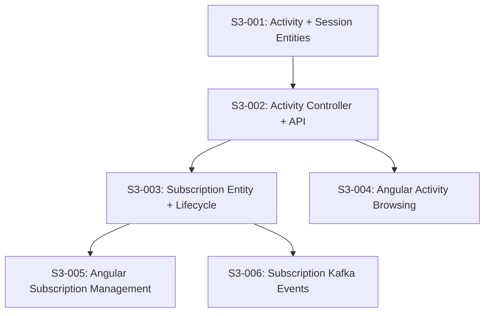

# Phase 2 / Sprint 3: Activities, Sessions & Subscriptions

> **Sprint Duration**: Weeks 7-8
> **Points**: ~34 (31 P0 + 3 P1)
> **Priority**: All P0 except S3-006 (P1)

> **Codebase Conventions**: See `docs/phases/CONVENTIONS.md` for authoritative conventions.
> Key conventions for this sprint: entities in `entity/` package, DTOs in `dto/request/` + `dto/response/`, DTOs as Java records, events extend `DomainEvent` with constructor pattern.

---

## Sprint Goal

Associations can define activities and sessions. Family members can subscribe to activities and view their active subscriptions. The Angular frontend provides activity browsing within associations and a subscription management view.

---

## Prerequisites

- Sprint 2 complete — Family CRUD, Association search, seed data all working
- Docker PostgreSQL running with `familyhobbies_associations` database
- association-service running with Association entity, search, and HelloAsso sync
- user-service running with Family/FamilyMember CRUD
- Kafka event classes already defined in common module: `SubscriptionCreatedEvent`, `SubscriptionCancelledEvent`
- API Gateway routing association-service endpoints

---

## Dependency Map



**Build order**: S3-001 → S3-002 → (S3-003 + S3-004 in parallel) → S3-005 → S3-006

---

## Stories

---

### Story S3-001: Implement Activity + Session Entities & Migrations

**Points**: 8 | **Priority**: P0 | **Epic**: Activities

#### Context

Activities are what associations offer (e.g., "Natation enfants", "Cours de piano"). Each activity has recurring sessions (e.g., "Mardi 18h-19h"). Activities belong to an association and have a category, age range, and capacity. Sessions define the schedule. These entities live in `association-service` alongside the existing Association entity, using the `familyhobbies_associations` database.

#### Tasks

| # | Task | File Path | What To Create | How To Verify |
|---|------|-----------|---------------|---------------|
| 1 | Liquibase: create activity table | `backend/association-service/src/main/resources/db/changelog/changesets/002-create-activity-table.xml` | t_activity DDL with FK to t_association | `docker exec` SQL check |
| 2 | Liquibase: create session table | `backend/association-service/src/main/resources/db/changelog/changesets/003-create-session-table.xml` | t_session DDL with FK to t_activity | `docker exec` SQL check |
| 3 | Update changelog master | `backend/association-service/src/main/resources/db/changelog/db.changelog-master.xml` | Include changesets 002, 003 | Service starts without errors |
| 4 | Create ActivityLevel enum | `backend/association-service/src/main/java/com/familyhobbies/associationservice/entity/enums/ActivityLevel.java` | BEGINNER, INTERMEDIATE, ADVANCED, ALL_LEVELS | Compiles |
| 5 | Create ActivityStatus enum | `backend/association-service/src/main/java/com/familyhobbies/associationservice/entity/enums/ActivityStatus.java` | ACTIVE, SUSPENDED, CANCELLED, COMPLETED | Compiles |
| 6 | Create DayOfWeekEnum enum | `backend/association-service/src/main/java/com/familyhobbies/associationservice/entity/enums/DayOfWeekEnum.java` | MONDAY through SUNDAY | Compiles |
| 7 | Create Activity entity | `backend/association-service/src/main/java/com/familyhobbies/associationservice/entity/Activity.java` | JPA entity mapped to t_activity | Compiles |
| 8 | Create Session entity | `backend/association-service/src/main/java/com/familyhobbies/associationservice/entity/Session.java` | JPA entity mapped to t_session | Compiles |
| 9 | Create ActivityRepository | `backend/association-service/src/main/java/com/familyhobbies/associationservice/repository/ActivityRepository.java` | JpaRepository + custom queries | Compiles |
| 10 | Create SessionRepository | `backend/association-service/src/main/java/com/familyhobbies/associationservice/repository/SessionRepository.java` | JpaRepository + custom queries | Compiles |
| 11 | Write unit tests for entities | `backend/association-service/src/test/java/.../entity/ActivityTest.java`, `SessionTest.java` | Entity field mapping tests | Tests pass |

---

#### Task 1 Detail: Liquibase — Create Activity Table

**What**: Liquibase changeset creating `t_activity` table.

**Where**: `backend/association-service/src/main/resources/db/changelog/changesets/002-create-activity-table.xml`

**Why**: Activities are the core offerings of an association. Each activity belongs to one association and defines what family members can subscribe to.

**Schema**:

| Column | Type | Constraints | Notes |
|--------|------|-------------|-------|
| id | BIGSERIAL | PK, NOT NULL | Auto-increment |
| association_id | BIGINT | FK → t_association(id), NOT NULL | Owner association |
| name | VARCHAR(200) | NOT NULL | e.g., "Natation enfants 6-10 ans" |
| description | TEXT | nullable | Detailed description |
| category | VARCHAR(50) | NOT NULL | Matches AssociationCategory values |
| level | VARCHAR(20) | NOT NULL, DEFAULT 'ALL_LEVELS' | BEGINNER, INTERMEDIATE, ADVANCED, ALL_LEVELS |
| min_age | INTEGER | nullable | Minimum age for registration |
| max_age | INTEGER | nullable | Maximum age for registration |
| max_capacity | INTEGER | nullable | Max participants per session |
| price_cents | INTEGER | NOT NULL, DEFAULT 0 | Price in euro cents (avoids float) |
| season_start | DATE | nullable | Season start date |
| season_end | DATE | nullable | Season end date |
| status | VARCHAR(20) | NOT NULL, DEFAULT 'ACTIVE' | ACTIVE, SUSPENDED, CANCELLED, COMPLETED |
| created_at | TIMESTAMPTZ | NOT NULL, DEFAULT NOW() | |
| updated_at | TIMESTAMPTZ | NOT NULL, DEFAULT NOW() | |

**Indexes**: `idx_activity_association_id`, `idx_activity_category`, `idx_activity_status`
**Check constraints**: `chk_activity_level`, `chk_activity_status`

---

#### Task 2 Detail: Liquibase — Create Session Table

**What**: Liquibase changeset creating `t_session` table.

**Where**: `backend/association-service/src/main/resources/db/changelog/changesets/003-create-session-table.xml`

**Why**: Sessions define the recurring schedule for an activity (e.g., "Mardi 18h-19h, Salle B"). Attendance is tracked per session.

**Schema**:

| Column | Type | Constraints | Notes |
|--------|------|-------------|-------|
| id | BIGSERIAL | PK, NOT NULL | Auto-increment |
| activity_id | BIGINT | FK → t_activity(id), NOT NULL, ON DELETE CASCADE | Parent activity |
| day_of_week | VARCHAR(10) | NOT NULL | MONDAY..SUNDAY |
| start_time | TIME | NOT NULL | e.g., 18:00 |
| end_time | TIME | NOT NULL | e.g., 19:00 |
| location | VARCHAR(200) | nullable | Room/venue name |
| instructor_name | VARCHAR(100) | nullable | Instructor name |
| max_capacity | INTEGER | nullable | Session-level override (nullable → falls back to activity) |
| active | BOOLEAN | NOT NULL, DEFAULT TRUE | Can be deactivated without deleting |
| created_at | TIMESTAMPTZ | NOT NULL, DEFAULT NOW() | |
| updated_at | TIMESTAMPTZ | NOT NULL, DEFAULT NOW() | |

**Indexes**: `idx_session_activity_id`, `idx_session_day_of_week`

---

#### Task 7 Detail: Activity Entity

**What**: JPA entity mapped to `t_activity`.

**Where**: `backend/association-service/src/main/java/com/familyhobbies/associationservice/entity/Activity.java`

**Key fields**:
- `Long id` — PK
- `Association association` — ManyToOne LAZY
- `String name` — NOT NULL
- `String description` — nullable
- `AssociationCategory category` — reuses existing enum
- `ActivityLevel level` — enum, default ALL_LEVELS
- `Integer minAge`, `Integer maxAge` — nullable age range
- `Integer maxCapacity` — nullable
- `Integer priceCents` — NOT NULL, price in euro cents
- `LocalDate seasonStart`, `LocalDate seasonEnd` — nullable
- `ActivityStatus status` — enum, default ACTIVE
- `List<Session> sessions` — OneToMany, LAZY, cascade ALL, orphanRemoval
- `Instant createdAt`, `Instant updatedAt` — timestamps

**Conventions**: Lombok `@Builder`, `@Getter`, `@Setter`, `@NoArgsConstructor`, `@AllArgsConstructor`. Table name `t_activity`.

---

#### Task 8 Detail: Session Entity

**What**: JPA entity mapped to `t_session`.

**Where**: `backend/association-service/src/main/java/com/familyhobbies/associationservice/entity/Session.java`

**Key fields**:
- `Long id` — PK
- `Activity activity` — ManyToOne LAZY
- `DayOfWeekEnum dayOfWeek` — enum
- `LocalTime startTime`, `LocalTime endTime` — NOT NULL
- `String location` — nullable
- `String instructorName` — nullable
- `Integer maxCapacity` — nullable (session-level override)
- `boolean active` — default true
- `Instant createdAt`, `Instant updatedAt` — timestamps

---

#### Task 9 Detail: ActivityRepository

**Custom methods**:
```java
Page<Activity> findByAssociation_IdAndStatus(Long associationId, ActivityStatus status, Pageable pageable);
Page<Activity> findByAssociation_Id(Long associationId, Pageable pageable);
List<Activity> findByAssociation_IdAndStatusOrderByNameAsc(Long associationId, ActivityStatus status);
Optional<Activity> findByIdAndAssociation_Id(Long id, Long associationId);
```

#### Task 10 Detail: SessionRepository

**Custom methods**:
```java
List<Session> findByActivity_IdAndActiveTrue(Long activityId);
List<Session> findByActivity_Id(Long activityId);
Optional<Session> findByIdAndActivity_Id(Long id, Long activityId);
List<Session> findByDayOfWeekAndActiveTrue(DayOfWeekEnum dayOfWeek);
```

---

### Story S3-002: Activity & Session Controller + API

**Points**: 6 | **Priority**: P0 | **Epic**: Activities

#### Context

Exposes REST endpoints for browsing activities within an association and their sessions. Activities are public (anyone can browse what an association offers), but creating/updating activities requires ADMIN or ASSOCIATION role.

#### Tasks

| # | Task | File Path | What To Create | How To Verify |
|---|------|-----------|---------------|---------------|
| 1 | Create ActivitySearchRequest DTO | `backend/association-service/src/main/java/.../dto/request/ActivitySearchRequest.java` | Record with optional category, level, minAge, maxAge filters | Compiles |
| 2 | Create ActivityRequest DTO | `backend/association-service/src/main/java/.../dto/request/ActivityRequest.java` | Validated record for create/update | Compiles |
| 3 | Create SessionRequest DTO | `backend/association-service/src/main/java/.../dto/request/SessionRequest.java` | Validated record for create/update | Compiles |
| 4 | Create ActivityResponse DTO | `backend/association-service/src/main/java/.../dto/response/ActivityResponse.java` | Summary response record | Compiles |
| 5 | Create ActivityDetailResponse DTO | `backend/association-service/src/main/java/.../dto/response/ActivityDetailResponse.java` | Full detail with embedded sessions | Compiles |
| 6 | Create SessionResponse DTO | `backend/association-service/src/main/java/.../dto/response/SessionResponse.java` | Session detail record | Compiles |
| 7 | Create ActivityMapper | `backend/association-service/src/main/java/.../mapper/ActivityMapper.java` | Manual mapper (entity ↔ DTO) | Compiles |
| 8 | Create ActivityService interface | `backend/association-service/src/main/java/.../service/ActivityService.java` | Service contract | Compiles |
| 9 | Create ActivityServiceImpl | `backend/association-service/src/main/java/.../service/impl/ActivityServiceImpl.java` | Full implementation | Tests pass |
| 10 | Create ActivityController | `backend/association-service/src/main/java/.../controller/ActivityController.java` | REST controller | Integration tests pass |
| 11 | Add gateway routes | `backend/api-gateway/src/main/resources/application.yml` | Routes for activities + sessions | curl through gateway |
| 12 | Write unit tests | `backend/association-service/src/test/java/.../service/impl/ActivityServiceImplTest.java` | Service layer tests | Tests pass |
| 13 | Write integration tests | `backend/association-service/src/test/java/.../controller/ActivityControllerIntegrationTest.java` | Controller + DB tests | Tests pass |

---

#### REST Endpoints (ActivityController)

**Path prefix**: `/api/v1/associations/{associationId}/activities`

| Method | Path | Auth | Description |
|--------|------|------|-------------|
| GET | `/` | Public | List activities for association (paginated, filterable) |
| GET | `/{activityId}` | Public | Get activity detail with sessions |
| POST | `/` | ADMIN, ASSOCIATION | Create activity |
| PUT | `/{activityId}` | ADMIN, ASSOCIATION | Update activity |
| DELETE | `/{activityId}` | ADMIN | Soft-delete (set status → CANCELLED) |
| GET | `/{activityId}/sessions` | Public | List sessions for activity |
| POST | `/{activityId}/sessions` | ADMIN, ASSOCIATION | Add session to activity |
| PUT | `/{activityId}/sessions/{sessionId}` | ADMIN, ASSOCIATION | Update session |
| DELETE | `/{activityId}/sessions/{sessionId}` | ADMIN | Deactivate session (set active → false) |

#### DTO Details

**ActivityRequest** (record):
```java
@NotBlank @Size(max=200) String name
String description                           // nullable
@NotNull AssociationCategory category
ActivityLevel level                          // nullable, default ALL_LEVELS
Integer minAge                               // nullable
Integer maxAge                               // nullable
Integer maxCapacity                          // nullable
@NotNull @Min(0) Integer priceCents
LocalDate seasonStart                        // nullable
LocalDate seasonEnd                          // nullable
```

**SessionRequest** (record):
```java
@NotNull DayOfWeekEnum dayOfWeek
@NotNull LocalTime startTime
@NotNull LocalTime endTime
@Size(max=200) String location               // nullable
@Size(max=100) String instructorName          // nullable
Integer maxCapacity                           // nullable
```

**ActivityResponse** (record — list view):
```java
Long id, String name, AssociationCategory category, ActivityLevel level,
Integer minAge, Integer maxAge, Integer priceCents, ActivityStatus status,
int sessionCount
```

**ActivityDetailResponse** (record — detail view):
```java
Long id, Long associationId, String associationName, String name, String description,
AssociationCategory category, ActivityLevel level, Integer minAge, Integer maxAge,
Integer maxCapacity, Integer priceCents, LocalDate seasonStart, LocalDate seasonEnd,
ActivityStatus status, List<SessionResponse> sessions, Instant createdAt, Instant updatedAt
```

**SessionResponse** (record):
```java
Long id, Long activityId, DayOfWeekEnum dayOfWeek, LocalTime startTime, LocalTime endTime,
String location, String instructorName, Integer maxCapacity, boolean active
```

---

### Story S3-003: Subscription Entity & Lifecycle

**Points**: 8 | **Priority**: P0 | **Epic**: Subscriptions

#### Context

A subscription links a family member to an activity. It tracks the lifecycle: PENDING → ACTIVE → EXPIRED/CANCELLED. Subscriptions live in `association-service` because they are tightly coupled with activities. A family member cannot subscribe twice to the same activity. Subscriptions publish Kafka events for notification-service and payment-service.

#### Tasks

| # | Task | File Path | What To Create | How To Verify |
|---|------|-----------|---------------|---------------|
| 1 | Liquibase: create subscription table | `backend/association-service/src/main/resources/db/changelog/changesets/004-create-subscription-table.xml` | t_subscription DDL | `docker exec` SQL check |
| 2 | Update changelog master | `backend/association-service/src/main/resources/db/changelog/db.changelog-master.xml` | Include changeset 004 | Service starts |
| 3 | Create SubscriptionStatus enum | `backend/association-service/src/main/java/.../entity/enums/SubscriptionStatus.java` | PENDING, ACTIVE, EXPIRED, CANCELLED | Compiles |
| 4 | Create SubscriptionType enum | `backend/association-service/src/main/java/.../entity/enums/SubscriptionType.java` | ADHESION, COTISATION | Compiles |
| 5 | Create Subscription entity | `backend/association-service/src/main/java/.../entity/Subscription.java` | JPA entity | Compiles |
| 6 | Create SubscriptionRepository | `backend/association-service/src/main/java/.../repository/SubscriptionRepository.java` | JpaRepository + custom queries | Compiles |
| 7 | Create SubscriptionRequest DTO | `backend/association-service/src/main/java/.../dto/request/SubscriptionRequest.java` | Validated request record | Compiles |
| 8 | Create SubscriptionResponse DTO | `backend/association-service/src/main/java/.../dto/response/SubscriptionResponse.java` | Response record | Compiles |
| 9 | Create SubscriptionMapper | `backend/association-service/src/main/java/.../mapper/SubscriptionMapper.java` | Manual mapper | Compiles |
| 10 | Create SubscriptionService interface | `backend/association-service/src/main/java/.../service/SubscriptionService.java` | Service contract | Compiles |
| 11 | Create SubscriptionServiceImpl | `backend/association-service/src/main/java/.../service/impl/SubscriptionServiceImpl.java` | Full implementation with business rules | Tests pass |
| 12 | Create SubscriptionController | `backend/association-service/src/main/java/.../controller/SubscriptionController.java` | REST controller | Integration tests pass |
| 13 | Add gateway routes | `backend/api-gateway/src/main/resources/application.yml` | Routes for subscriptions | curl through gateway |
| 14 | Write service unit tests | `backend/association-service/src/test/java/.../service/impl/SubscriptionServiceImplTest.java` | Business rule tests | Tests pass |
| 15 | Write controller integration tests | `backend/association-service/src/test/java/.../controller/SubscriptionControllerIntegrationTest.java` | API tests | Tests pass |

---

#### Subscription Table Schema

| Column | Type | Constraints | Notes |
|--------|------|-------------|-------|
| id | BIGSERIAL | PK, NOT NULL | |
| activity_id | BIGINT | FK → t_activity(id), NOT NULL | Activity subscribed to |
| family_member_id | BIGINT | NOT NULL | FK reference to user-service t_family_member (cross-service, no DB FK) |
| family_id | BIGINT | NOT NULL | FK reference to user-service t_family (cross-service, no DB FK) |
| user_id | BIGINT | NOT NULL | The user who initiated the subscription |
| subscription_type | VARCHAR(20) | NOT NULL | ADHESION, COTISATION |
| status | VARCHAR(20) | NOT NULL, DEFAULT 'PENDING' | PENDING, ACTIVE, EXPIRED, CANCELLED |
| start_date | DATE | NOT NULL | |
| end_date | DATE | nullable | null = ongoing until cancelled |
| cancellation_reason | TEXT | nullable | |
| cancelled_at | TIMESTAMPTZ | nullable | |
| created_at | TIMESTAMPTZ | NOT NULL, DEFAULT NOW() | |
| updated_at | TIMESTAMPTZ | NOT NULL, DEFAULT NOW() | |

**Indexes**: `idx_subscription_activity`, `idx_subscription_member`, `idx_subscription_family`, `idx_subscription_status`
**Unique constraint**: `uq_subscription_member_activity` on (family_member_id, activity_id, status) WHERE status IN ('PENDING', 'ACTIVE') — prevents duplicate active subscriptions

---

#### REST Endpoints (SubscriptionController)

**Path prefix**: `/api/v1/subscriptions`

| Method | Path | Auth | Description |
|--------|------|------|-------------|
| POST | `/` | FAMILY | Create subscription (subscribe member to activity) |
| GET | `/family/{familyId}` | FAMILY (owner) | List subscriptions for a family |
| GET | `/member/{memberId}` | FAMILY (owner) | List subscriptions for a member |
| GET | `/{subscriptionId}` | FAMILY (owner) | Get subscription detail |
| PUT | `/{subscriptionId}/cancel` | FAMILY (owner) | Cancel subscription |
| PUT | `/{subscriptionId}/activate` | ADMIN | Activate pending subscription |

#### Business Rules

1. **No duplicate active subscriptions**: A family member cannot have two PENDING or ACTIVE subscriptions for the same activity
2. **Age validation**: If activity defines minAge/maxAge, member's age must be within range
3. **Activity must be ACTIVE**: Cannot subscribe to CANCELLED or COMPLETED activities
4. **Only owner can view/cancel**: The user who created the subscription (matched via X-User-Id header) can view and cancel
5. **Cancellation sets status**: Sets status → CANCELLED, fills cancellationReason and cancelledAt
6. **Cross-service IDs**: familyMemberId and familyId are stored as plain BIGINT (no FK constraint to user-service DB). Validation happens at the API level.

---

#### DTO Details

**SubscriptionRequest** (record):
```java
@NotNull Long activityId
@NotNull Long familyMemberId
@NotNull Long familyId
@NotNull SubscriptionType subscriptionType
@NotNull LocalDate startDate
LocalDate endDate                            // nullable
```

**SubscriptionResponse** (record):
```java
Long id, Long activityId, String activityName, String associationName,
Long familyMemberId, String memberFirstName, String memberLastName,
Long familyId, Long userId, SubscriptionType subscriptionType,
SubscriptionStatus status, LocalDate startDate, LocalDate endDate,
String cancellationReason, Instant cancelledAt, Instant createdAt, Instant updatedAt
```

**Note**: `activityName`, `associationName`, `memberFirstName`, `memberLastName` are denormalized in the response for display convenience. The mapper joins Activity → Association for names. Member names are stored in the subscription record or fetched from user-service (design decision: store at creation time to avoid cross-service calls at read time).

---

### Story S3-004: Angular Activity Browsing Feature

**Points**: 5 | **Priority**: P0 | **Epic**: Activities (Frontend)

#### Context

Users can browse activities within an association. This adds an "Activités" section to the association detail page and a dedicated activity list/detail view. Uses Angular Material components, NgRx store, and follows the established pattern from association and family features.

#### Tasks

| # | Task | File Path | What To Create | How To Verify |
|---|------|-----------|---------------|---------------|
| 1 | Create activity models | `frontend/src/app/shared/models/activity.model.ts` | TypeScript interfaces matching backend DTOs | Compiles |
| 2 | Create activity service | `frontend/src/app/features/activities/services/activity.service.ts` | HTTP service for activity endpoints | Compiles |
| 3 | Create NgRx actions | `frontend/src/app/features/activities/store/activity.actions.ts` | Load activities, load detail actions | Compiles |
| 4 | Create NgRx reducer | `frontend/src/app/features/activities/store/activity.reducer.ts` | State management | Compiles |
| 5 | Create NgRx effects | `frontend/src/app/features/activities/store/activity.effects.ts` | Functional effects | Compiles |
| 6 | Create NgRx selectors | `frontend/src/app/features/activities/store/activity.selectors.ts` | State selectors | Compiles |
| 7 | Create activity-list component | `frontend/src/app/features/activities/components/activity-list/` | Grid of activity cards within association | `ng serve` renders |
| 8 | Create activity-detail component | `frontend/src/app/features/activities/components/activity-detail/` | Detail view with session schedule | `ng serve` renders |
| 9 | Create activity-card component | `frontend/src/app/features/activities/components/activity-card/` | Reusable Material card | `ng serve` renders |
| 10 | Create activity routes | `frontend/src/app/features/activities/activities.routes.ts` | Lazy-loaded routes | Navigation works |
| 11 | Register routes in app.routes.ts | `frontend/src/app/app.routes.ts` | Add `/activities` route | Navigation works |
| 12 | Write service tests | `frontend/src/app/features/activities/services/activity.service.spec.ts` | HTTP mock tests | Tests pass |
| 13 | Write reducer tests | `frontend/src/app/features/activities/store/activity.reducer.spec.ts` | State transition tests | Tests pass |
| 14 | Write component tests | `.spec.ts` files for list, detail, card components | Component rendering tests | Tests pass |

---

#### Angular Model: `activity.model.ts`

```typescript
export interface Activity {
  id: number;
  name: string;
  category: string;
  level: string;
  minAge: number | null;
  maxAge: number | null;
  priceCents: number;
  status: string;
  sessionCount: number;
}

export interface ActivityDetail {
  id: number;
  associationId: number;
  associationName: string;
  name: string;
  description: string | null;
  category: string;
  level: string;
  minAge: number | null;
  maxAge: number | null;
  maxCapacity: number | null;
  priceCents: number;
  seasonStart: string | null;
  seasonEnd: string | null;
  status: string;
  sessions: Session[];
  createdAt: string;
  updatedAt: string;
}

export interface Session {
  id: number;
  activityId: number;
  dayOfWeek: string;
  startTime: string;
  endTime: string;
  location: string | null;
  instructorName: string | null;
  maxCapacity: number | null;
  active: boolean;
}

export interface ActivitySearchRequest {
  associationId: number;
  category?: string;
  level?: string;
  page?: number;
  size?: number;
}
```

#### Routes

```
/associations/:associationId/activities     → ActivityListComponent (public)
/associations/:associationId/activities/:id → ActivityDetailComponent (public)
```

---

### Story S3-005: Angular Subscription Management Feature

**Points**: 5 | **Priority**: P0 | **Epic**: Subscriptions (Frontend)

#### Context

Authenticated users can subscribe family members to activities and manage their subscriptions. This adds a "Mes inscriptions" view accessible from the family dashboard and a "S'inscrire" button on activity detail pages.

#### Tasks

| # | Task | File Path | What To Create | How To Verify |
|---|------|-----------|---------------|---------------|
| 1 | Create subscription models | `frontend/src/app/shared/models/subscription.model.ts` | TypeScript interfaces | Compiles |
| 2 | Create subscription service | `frontend/src/app/features/subscriptions/services/subscription.service.ts` | HTTP service | Compiles |
| 3 | Create NgRx store | `frontend/src/app/features/subscriptions/store/` | actions, reducer, effects, selectors, state | Compiles |
| 4 | Create subscription-list component | `frontend/src/app/features/subscriptions/components/subscription-list/` | Table view with status badges | `ng serve` renders |
| 5 | Create subscribe-dialog component | `frontend/src/app/features/subscriptions/components/subscribe-dialog/` | Material dialog for subscribing a member | `ng serve` renders |
| 6 | Create subscription routes | `frontend/src/app/features/subscriptions/subscriptions.routes.ts` | Lazy-loaded routes | Navigation works |
| 7 | Register routes in app.routes.ts | `frontend/src/app/app.routes.ts` | Add `/subscriptions` route | Navigation works |
| 8 | Add "S'inscrire" button | `frontend/src/app/features/activities/components/activity-detail/` | Subscribe button on activity detail page | Button renders |
| 9 | Write service tests | `.spec.ts` | HTTP mock tests | Tests pass |
| 10 | Write reducer tests | `.spec.ts` | State transition tests | Tests pass |
| 11 | Write component tests | `.spec.ts` for list and dialog | Component rendering tests | Tests pass |

---

#### Angular Model: `subscription.model.ts`

```typescript
export type SubscriptionStatus = 'PENDING' | 'ACTIVE' | 'EXPIRED' | 'CANCELLED';
export type SubscriptionType = 'ADHESION' | 'COTISATION';

export interface Subscription {
  id: number;
  activityId: number;
  activityName: string;
  associationName: string;
  familyMemberId: number;
  memberFirstName: string;
  memberLastName: string;
  familyId: number;
  userId: number;
  subscriptionType: SubscriptionType;
  status: SubscriptionStatus;
  startDate: string;
  endDate: string | null;
  cancellationReason: string | null;
  cancelledAt: string | null;
  createdAt: string;
  updatedAt: string;
}

export interface SubscriptionRequest {
  activityId: number;
  familyMemberId: number;
  familyId: number;
  subscriptionType: SubscriptionType;
  startDate: string;
  endDate?: string;
}

export const SUBSCRIPTION_STATUS_CONFIG: Record<SubscriptionStatus, { label: string; color: string }> = {
  PENDING: { label: 'En attente', color: 'warn' },
  ACTIVE: { label: 'Active', color: 'primary' },
  EXPIRED: { label: 'Expirée', color: 'accent' },
  CANCELLED: { label: 'Annulée', color: '' },
};
```

#### Routes

```
/subscriptions  → SubscriptionListComponent (auth protected)
```

---

### Story S3-006: Subscription Kafka Events

**Points**: 3 | **Priority**: P1 | **Epic**: Events

#### Context

When a subscription is created or cancelled, the association-service publishes Kafka events that notification-service already listens to (`SubscriptionEventConsumer`). This story wires the event publishing from `SubscriptionServiceImpl` using the existing `SubscriptionCreatedEvent` and `SubscriptionCancelledEvent` classes from the common module.

#### Tasks

| # | Task | File Path | What To Create | How To Verify |
|---|------|-----------|---------------|---------------|
| 1 | Create SubscriptionEventPublisher | `backend/association-service/src/main/java/.../event/SubscriptionEventPublisher.java` | Kafka event publisher (fire-and-forget pattern) | Compiles |
| 2 | Wire publisher in SubscriptionServiceImpl | `backend/association-service/src/main/java/.../service/impl/SubscriptionServiceImpl.java` | Publish events on create/cancel | Tests pass |
| 3 | Add Kafka config to application.yml | `backend/association-service/src/main/resources/application.yml` | Producer config for subscription topics | Service starts |
| 4 | Write publisher unit tests | `backend/association-service/src/test/java/.../event/SubscriptionEventPublisherTest.java` | Verify Kafka send calls | Tests pass |
| 5 | Write integration tests | Verify end-to-end event flow | Subscription creation → event published | Tests pass |

---

#### Kafka Topics

| Event | Topic | Producer | Consumer |
|-------|-------|----------|----------|
| SubscriptionCreatedEvent | `family-hobbies.subscription.created` | association-service | notification-service (SubscriptionEventConsumer) |
| SubscriptionCancelledEvent | `family-hobbies.subscription.cancelled` | association-service | notification-service (SubscriptionEventConsumer) |

#### SubscriptionEventPublisher Pattern

Follow existing `UserEventPublisher` pattern from user-service:
- Fire-and-forget: errors logged, never thrown
- `@Component` with `KafkaTemplate<String, Object>`
- Use `subscriptionId.toString()` as Kafka key for partition affinity

---

## Seed Data for Activities (extend existing 010-seed)

**Where**: `backend/association-service/src/main/resources/db/changelog/changesets/011-seed-activities.xml`

Seed 2-3 activities per seeded association (from 010-seed-associations.xml), with 1-2 sessions per activity. This provides realistic demo data for the portfolio.

**Example**:
- Lyon Natation Metropole → "Natation enfants 6-10 ans" (Mardi 17h-18h, Jeudi 17h-18h), "Natation adultes" (Lundi 19h-20h)
- Ecole de Danse Presqu'ile → "Danse classique débutant" (Mercredi 14h-15h30), "Modern jazz ados" (Samedi 10h-11h30)

---

## Test Summary

| Test file | Type | Count (approx) |
|-----------|------|----------------|
| ActivityTest.java | Unit | 6 |
| SessionTest.java | Unit | 4 |
| ActivityServiceImplTest.java | Unit | 12 |
| ActivityControllerIntegrationTest.java | Integration | 10 |
| SubscriptionServiceImplTest.java | Unit | 14 |
| SubscriptionControllerIntegrationTest.java | Integration | 8 |
| SubscriptionEventPublisherTest.java | Unit | 4 |
| activity.service.spec.ts | Unit | 6 |
| activity.reducer.spec.ts | Unit | 8 |
| activity-list.component.spec.ts | Unit | 4 |
| activity-detail.component.spec.ts | Unit | 4 |
| subscription.service.spec.ts | Unit | 6 |
| subscription.reducer.spec.ts | Unit | 8 |
| subscription-list.component.spec.ts | Unit | 4 |
| subscribe-dialog.component.spec.ts | Unit | 4 |
| **Total** | | **~102** |

---

## Definition of Done

- [ ] Activity and Session entities with Liquibase migrations — service starts without errors
- [ ] Activity CRUD API with public search and role-based create/update/delete
- [ ] Subscription lifecycle (create, activate, cancel) with business rules enforced
- [ ] No duplicate active subscriptions for same member + activity
- [ ] Age validation against activity min/max age
- [ ] Angular activity browsing with search/filter and detail view
- [ ] Angular subscription management with subscribe dialog and list view
- [ ] Kafka events published on subscription create/cancel
- [ ] Seed data for activities and sessions
- [ ] All unit and integration tests passing (~102 new tests)
- [ ] Gateway routes configured for activities and subscriptions
