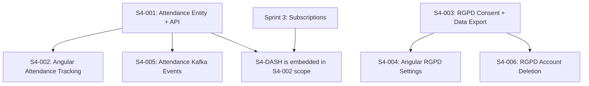

# Phase 2 / Sprint 4: Attendance Tracking, RGPD & Dashboard

> **Sprint Duration**: Weeks 9-10
> **Points**: ~34 (28 P0 + 6 P1)
> **Priority**: All P0 except S4-005 and S4-006 (P1)

> **Codebase Conventions**: See `docs/phases/CONVENTIONS.md` for authoritative conventions.
> Key conventions for this sprint: entities in `entity/` package, DTOs in `dto/request/` + `dto/response/`, DTOs as Java records, events extend `DomainEvent` with constructor pattern.

---

## Sprint Goal

Attendance can be marked and tracked per session per family member. RGPD compliance is implemented (consent management, data export, account deletion). A dashboard provides a family overview with subscriptions, upcoming sessions, and recent activity.

---

## Prerequisites

- Sprint 3 complete — Activity/Session entities, Subscription lifecycle, all tests passing
- Activity CRUD endpoints working via API Gateway
- Subscription create/cancel with Kafka events working
- Angular activity browsing and subscription management features deployed
- Kafka event class already defined in common module: `AttendanceMarkedEvent`
- notification-service already has `AttendanceEventConsumer` listening for events

---

## Dependency Map



**Build order**: S4-001 → S4-002 (includes dashboard) | S4-003 → S4-004 → S4-006 | S4-005 (independent after S4-001)

---

## Stories

---

### Story S4-001: Attendance Entity + API

**Points**: 8 | **Priority**: P0 | **Epic**: Attendance

#### Context

Attendance tracks which family members were present, absent, or excused for each session occurrence. Unlike sessions (which define the schedule), attendance records are per-date per-member per-session. This is a key value-add feature over HelloAsso — HelloAsso does not offer attendance tracking.

Attendance lives in `association-service` alongside Session and Activity entities.

#### Tasks

| # | Task | File Path | What To Create | How To Verify |
|---|------|-----------|---------------|---------------|
| 1 | Liquibase: create attendance table | `backend/association-service/src/main/resources/db/changelog/changesets/005-create-attendance-table.xml` | t_attendance DDL | `docker exec` SQL check |
| 2 | Update changelog master | `backend/association-service/src/main/resources/db/changelog/db.changelog-master.xml` | Include changeset 005 | Service starts |
| 3 | Create AttendanceStatus enum | `backend/association-service/src/main/java/.../entity/enums/AttendanceStatus.java` | PRESENT, ABSENT, EXCUSED, LATE | Compiles |
| 4 | Create Attendance entity | `backend/association-service/src/main/java/.../entity/Attendance.java` | JPA entity mapped to t_attendance | Compiles |
| 5 | Create AttendanceRepository | `backend/association-service/src/main/java/.../repository/AttendanceRepository.java` | JpaRepository + custom queries | Compiles |
| 6 | Create MarkAttendanceRequest DTO | `backend/association-service/src/main/java/.../dto/request/MarkAttendanceRequest.java` | Validated request record | Compiles |
| 7 | Create BulkAttendanceRequest DTO | `backend/association-service/src/main/java/.../dto/request/BulkAttendanceRequest.java` | List of attendance marks for a session | Compiles |
| 8 | Create AttendanceResponse DTO | `backend/association-service/src/main/java/.../dto/response/AttendanceResponse.java` | Response record | Compiles |
| 9 | Create AttendanceSummaryResponse DTO | `backend/association-service/src/main/java/.../dto/response/AttendanceSummaryResponse.java` | Aggregated stats | Compiles |
| 10 | Create AttendanceMapper | `backend/association-service/src/main/java/.../mapper/AttendanceMapper.java` | Manual mapper | Compiles |
| 11 | Create AttendanceService interface | `backend/association-service/src/main/java/.../service/AttendanceService.java` | Service contract | Compiles |
| 12 | Create AttendanceServiceImpl | `backend/association-service/src/main/java/.../service/impl/AttendanceServiceImpl.java` | Full implementation | Tests pass |
| 13 | Create AttendanceController | `backend/association-service/src/main/java/.../controller/AttendanceController.java` | REST controller | Integration tests pass |
| 14 | Add gateway routes | `backend/api-gateway/src/main/resources/application.yml` | Routes for attendance | curl through gateway |
| 15 | Write service unit tests | `backend/association-service/src/test/java/.../service/impl/AttendanceServiceImplTest.java` | Business rule tests | Tests pass |
| 16 | Write controller integration tests | `backend/association-service/src/test/java/.../controller/AttendanceControllerIntegrationTest.java` | API tests | Tests pass |

---

#### Attendance Table Schema

| Column | Type | Constraints | Notes |
|--------|------|-------------|-------|
| id | BIGSERIAL | PK, NOT NULL | |
| session_id | BIGINT | FK → t_session(id), NOT NULL | Which session occurrence |
| family_member_id | BIGINT | NOT NULL | Cross-service reference to user-service |
| subscription_id | BIGINT | FK → t_subscription(id), NOT NULL | Must have active subscription |
| session_date | DATE | NOT NULL | The specific date this session occurred |
| status | VARCHAR(10) | NOT NULL | PRESENT, ABSENT, EXCUSED, LATE |
| note | TEXT | nullable | Optional note (e.g., reason for absence) |
| marked_by | BIGINT | NOT NULL | User ID who marked attendance |
| created_at | TIMESTAMPTZ | NOT NULL, DEFAULT NOW() | |
| updated_at | TIMESTAMPTZ | NOT NULL, DEFAULT NOW() | |

**Indexes**: `idx_attendance_session_date` (session_id, session_date), `idx_attendance_member`, `idx_attendance_subscription`
**Unique constraint**: `uq_attendance_session_member_date` on (session_id, family_member_id, session_date) — one record per member per session per date

---

#### REST Endpoints (AttendanceController)

**Path prefix**: `/api/v1/attendance`

| Method | Path | Auth | Description |
|--------|------|------|-------------|
| POST | `/` | FAMILY | Mark single attendance |
| POST | `/bulk` | FAMILY, ASSOCIATION | Bulk mark attendance for a session (all members at once) |
| GET | `/session/{sessionId}` | FAMILY | Get attendance for a session on a specific date (query param `date`) |
| GET | `/member/{memberId}` | FAMILY (owner) | Get attendance history for a member |
| GET | `/member/{memberId}/summary` | FAMILY (owner) | Get attendance summary (present/absent/excused counts) |
| GET | `/subscription/{subscriptionId}` | FAMILY (owner) | Get attendance for a subscription |
| PUT | `/{attendanceId}` | FAMILY | Update attendance status |

#### Business Rules

1. **Active subscription required**: Cannot mark attendance without an ACTIVE subscription for the member on that activity
2. **No duplicate records**: One attendance record per member per session per date (unique constraint)
3. **Session must be active**: Cannot mark attendance on a deactivated session
4. **Date validation**: session_date must not be in the future
5. **Owner verification**: Only the family owner (via X-User-Id) can view/mark attendance for their family members

---

#### DTO Details

**MarkAttendanceRequest** (record):
```java
@NotNull Long sessionId
@NotNull Long familyMemberId
@NotNull Long subscriptionId
@NotNull LocalDate sessionDate
@NotNull AttendanceStatus status
@Size(max=500) String note                   // nullable
```

**BulkAttendanceRequest** (record):
```java
@NotNull Long sessionId
@NotNull LocalDate sessionDate
@NotEmpty List<AttendanceMark> marks
```

**AttendanceMark** (record — nested in BulkAttendanceRequest):
```java
@NotNull Long familyMemberId
@NotNull Long subscriptionId
@NotNull AttendanceStatus status
String note                                  // nullable
```

**AttendanceResponse** (record):
```java
Long id, Long sessionId, Long familyMemberId, String memberFirstName, String memberLastName,
Long subscriptionId, LocalDate sessionDate, AttendanceStatus status, String note,
Long markedBy, Instant createdAt, Instant updatedAt
```

**AttendanceSummaryResponse** (record):
```java
Long familyMemberId, String memberFirstName, String memberLastName,
int totalSessions, int presentCount, int absentCount, int excusedCount, int lateCount,
double attendanceRate                        // presentCount / totalSessions * 100
```

---

### Story S4-002: Angular Attendance Tracking + Dashboard

**Points**: 8 | **Priority**: P0 | **Epic**: Attendance + Dashboard (Frontend)

#### Context

Adds attendance tracking UI and a family dashboard. The dashboard aggregates data from subscriptions, activities, and attendance into a single overview page — this is the landing page for authenticated users and a key portfolio feature showing cross-service data aggregation.

#### Tasks

| # | Task | File Path | What To Create | How To Verify |
|---|------|-----------|---------------|---------------|
| 1 | Create attendance models | `frontend/src/app/shared/models/attendance.model.ts` | TypeScript interfaces | Compiles |
| 2 | Create attendance service | `frontend/src/app/features/attendance/services/attendance.service.ts` | HTTP service | Compiles |
| 3 | Create NgRx store | `frontend/src/app/features/attendance/store/` | actions, reducer, effects, selectors, state | Compiles |
| 4 | Create attendance-sheet component | `frontend/src/app/features/attendance/components/attendance-sheet/` | Spreadsheet-style grid: rows=members, columns=dates | `ng serve` renders |
| 5 | Create attendance-summary component | `frontend/src/app/features/attendance/components/attendance-summary/` | Stats cards (present/absent/rate) | `ng serve` renders |
| 6 | Create attendance-history component | `frontend/src/app/features/attendance/components/attendance-history/` | Timeline for a single member | `ng serve` renders |
| 7 | Create attendance routes | `frontend/src/app/features/attendance/attendance.routes.ts` | Lazy-loaded routes | Navigation works |
| 8 | Create dashboard models | `frontend/src/app/shared/models/dashboard.model.ts` | Aggregated dashboard interfaces | Compiles |
| 9 | Create dashboard service | `frontend/src/app/features/dashboard/services/dashboard.service.ts` | Aggregation service (calls multiple endpoints) | Compiles |
| 10 | Create dashboard component | `frontend/src/app/features/dashboard/components/dashboard/dashboard.component.ts` | Main dashboard with widgets | `ng serve` renders |
| 11 | Create upcoming-sessions widget | `frontend/src/app/features/dashboard/components/upcoming-sessions/` | Next 7 days sessions | `ng serve` renders |
| 12 | Create subscriptions-overview widget | `frontend/src/app/features/dashboard/components/subscriptions-overview/` | Active subscriptions summary | `ng serve` renders |
| 13 | Create attendance-overview widget | `frontend/src/app/features/dashboard/components/attendance-overview/` | Attendance rate per member | `ng serve` renders |
| 14 | Create dashboard routes | `frontend/src/app/features/dashboard/dashboard.routes.ts` | Lazy-loaded routes | Navigation works |
| 15 | Register routes in app.routes.ts | `frontend/src/app/app.routes.ts` | Add `/attendance` and `/dashboard` routes, redirect auth users to `/dashboard` | Navigation works |
| 16 | Write service tests | `.spec.ts` for attendance + dashboard services | HTTP mock tests | Tests pass |
| 17 | Write reducer tests | `.spec.ts` for attendance store | State transition tests | Tests pass |
| 18 | Write component tests | `.spec.ts` for all 6 components + 3 widgets | Component rendering tests | Tests pass |

---

#### Angular Model: `attendance.model.ts`

```typescript
export type AttendanceStatus = 'PRESENT' | 'ABSENT' | 'EXCUSED' | 'LATE';

export interface Attendance {
  id: number;
  sessionId: number;
  familyMemberId: number;
  memberFirstName: string;
  memberLastName: string;
  subscriptionId: number;
  sessionDate: string;
  status: AttendanceStatus;
  note: string | null;
  markedBy: number;
  createdAt: string;
  updatedAt: string;
}

export interface AttendanceMark {
  familyMemberId: number;
  subscriptionId: number;
  status: AttendanceStatus;
  note?: string;
}

export interface BulkAttendanceRequest {
  sessionId: number;
  sessionDate: string;
  marks: AttendanceMark[];
}

export interface AttendanceSummary {
  familyMemberId: number;
  memberFirstName: string;
  memberLastName: string;
  totalSessions: number;
  presentCount: number;
  absentCount: number;
  excusedCount: number;
  lateCount: number;
  attendanceRate: number;
}

export const ATTENDANCE_STATUS_CONFIG: Record<AttendanceStatus, { label: string; color: string; icon: string }> = {
  PRESENT: { label: 'Présent', color: '#4caf50', icon: 'check_circle' },
  ABSENT: { label: 'Absent', color: '#f44336', icon: 'cancel' },
  EXCUSED: { label: 'Excusé', color: '#ff9800', icon: 'info' },
  LATE: { label: 'En retard', color: '#2196f3', icon: 'schedule' },
};
```

#### Angular Model: `dashboard.model.ts`

```typescript
export interface DashboardData {
  familyName: string;
  memberCount: number;
  activeSubscriptions: SubscriptionSummary[];
  upcomingSessions: UpcomingSession[];
  attendanceOverview: MemberAttendance[];
  recentNotifications: number;
}

export interface SubscriptionSummary {
  subscriptionId: number;
  memberName: string;
  activityName: string;
  associationName: string;
  status: string;
  startDate: string;
}

export interface UpcomingSession {
  sessionId: number;
  activityName: string;
  associationName: string;
  dayOfWeek: string;
  startTime: string;
  endTime: string;
  location: string | null;
  memberNames: string[];
}

export interface MemberAttendance {
  memberId: number;
  memberName: string;
  attendanceRate: number;
  totalSessions: number;
}
```

#### Routes

```
/attendance                             → AttendanceSheetComponent (auth protected)
/attendance/member/:memberId            → AttendanceHistoryComponent (auth protected)
/attendance/member/:memberId/summary    → AttendanceSummaryComponent (auth protected)
/dashboard                              → DashboardComponent (auth protected, default for logged-in users)
```

#### Dashboard Design

The dashboard is a **responsive grid of Material cards** showing:

1. **Famille** card — family name, member count, link to /family
2. **Inscriptions actives** card — list of active subscriptions with activity name + association, link to /subscriptions
3. **Prochaines séances** card — next 7 days sessions with day, time, activity name, members enrolled
4. **Présence** card — attendance rate per member as progress bars, link to /attendance

The dashboard service aggregates data from:
- `GET /api/v1/families/me` (family info)
- `GET /api/v1/subscriptions/family/{familyId}` (active subscriptions)
- `GET /api/v1/attendance/member/{memberId}/summary` (per member)

---

### Story S4-003: RGPD Consent Management + Data Export

**Points**: 5 | **Priority**: P0 | **Epic**: RGPD

#### Context

French law (RGPD/GDPR) requires explicit consent tracking, data portability (export), and right to access. This story adds a `ConsentRecord` entity to `user-service` that tracks when and what users consented to, plus a data export endpoint that returns all user data as JSON.

#### Tasks

| # | Task | File Path | What To Create | How To Verify |
|---|------|-----------|---------------|---------------|
| 1 | Liquibase: create consent_record table | `backend/user-service/src/main/resources/db/changelog/changesets/005-create-consent-record-table.xml` | t_consent_record DDL | `docker exec` SQL check |
| 2 | Update changelog master | `backend/user-service/src/main/resources/db/changelog/db.changelog-master.xml` | Include changeset 005 | Service starts |
| 3 | Create ConsentType enum | `backend/user-service/src/main/java/.../entity/enums/ConsentType.java` | TERMS_OF_SERVICE, DATA_PROCESSING, MARKETING_EMAIL, THIRD_PARTY_SHARING | Compiles |
| 4 | Create ConsentRecord entity | `backend/user-service/src/main/java/.../entity/ConsentRecord.java` | JPA entity | Compiles |
| 5 | Create ConsentRecordRepository | `backend/user-service/src/main/java/.../repository/ConsentRecordRepository.java` | JpaRepository + custom queries | Compiles |
| 6 | Create ConsentRequest DTO | `backend/user-service/src/main/java/.../dto/request/ConsentRequest.java` | Validated request record | Compiles |
| 7 | Create ConsentResponse DTO | `backend/user-service/src/main/java/.../dto/response/ConsentResponse.java` | Response record | Compiles |
| 8 | Create UserDataExportResponse DTO | `backend/user-service/src/main/java/.../dto/response/UserDataExportResponse.java` | Full user data export shape | Compiles |
| 9 | Create RgpdService interface | `backend/user-service/src/main/java/.../service/RgpdService.java` | Service contract | Compiles |
| 10 | Create RgpdServiceImpl | `backend/user-service/src/main/java/.../service/impl/RgpdServiceImpl.java` | Consent + export implementation | Tests pass |
| 11 | Create RgpdController | `backend/user-service/src/main/java/.../controller/RgpdController.java` | REST controller | Integration tests pass |
| 12 | Add gateway routes | `backend/api-gateway/src/main/resources/application.yml` | Routes for RGPD endpoints | curl through gateway |
| 13 | Write service unit tests | `backend/user-service/src/test/java/.../service/impl/RgpdServiceImplTest.java` | Consent + export tests | Tests pass |
| 14 | Write controller integration tests | `backend/user-service/src/test/java/.../controller/RgpdControllerIntegrationTest.java` | API tests | Tests pass |

---

#### Consent Record Table Schema

| Column | Type | Constraints | Notes |
|--------|------|-------------|-------|
| id | BIGSERIAL | PK, NOT NULL | |
| user_id | BIGINT | FK → t_user(id), NOT NULL | User who consented |
| consent_type | VARCHAR(30) | NOT NULL | TERMS_OF_SERVICE, DATA_PROCESSING, etc. |
| granted | BOOLEAN | NOT NULL | true = consented, false = revoked |
| ip_address | VARCHAR(45) | nullable | IPv4 or IPv6 address at time of consent |
| user_agent | VARCHAR(500) | nullable | Browser/device info |
| version | VARCHAR(20) | NOT NULL, DEFAULT '1.0' | Version of the consent text |
| consented_at | TIMESTAMPTZ | NOT NULL, DEFAULT NOW() | When consent was given/revoked |
| created_at | TIMESTAMPTZ | NOT NULL, DEFAULT NOW() | |

**Indexes**: `idx_consent_user_id`, `idx_consent_type_user` (consent_type, user_id)

**Design note**: Each consent change creates a new record (append-only audit trail). We never update existing records — this provides a full history of consent changes.

---

#### REST Endpoints (RgpdController)

**Path prefix**: `/api/v1/rgpd`

| Method | Path | Auth | Description |
|--------|------|------|-------------|
| POST | `/consent` | FAMILY | Record a consent decision |
| GET | `/consent` | FAMILY | Get current consent status for all types |
| GET | `/consent/history` | FAMILY | Get full consent audit trail |
| GET | `/export` | FAMILY | Export all user data as JSON (RGPD data portability) |

#### Business Rules

1. **Append-only**: Each consent action creates a new record (never updates)
2. **Current status**: Determined by the most recent record per consent_type
3. **Required consents**: TERMS_OF_SERVICE and DATA_PROCESSING must be granted for account to remain active
4. **Data export**: Returns user profile, family, members, and consent history in a single JSON response

---

#### DTO Details

**ConsentRequest** (record):
```java
@NotNull ConsentType consentType
@NotNull Boolean granted
String ipAddress                             // nullable, extracted from request if not provided
String userAgent                             // nullable, extracted from request if not provided
```

**ConsentResponse** (record):
```java
Long id, Long userId, ConsentType consentType, boolean granted,
String version, Instant consentedAt
```

**UserDataExportResponse** (record):
```java
// User profile
Long userId, String email, String firstName, String lastName, String phone,
String role, String status, Instant createdAt, Instant lastLoginAt,
// Family data
FamilyExport family,
// Consent history
List<ConsentResponse> consentHistory,
// Export metadata
Instant exportedAt
```

**FamilyExport** (record — nested):
```java
Long familyId, String familyName,
List<FamilyMemberExport> members
```

**FamilyMemberExport** (record — nested):
```java
Long memberId, String firstName, String lastName, LocalDate dateOfBirth,
String relationship
```

---

### Story S4-004: Angular RGPD Settings Page

**Points**: 3 | **Priority**: P0 | **Epic**: RGPD (Frontend)

#### Context

Users need a settings page to manage their RGPD consents, view their data, and request data export. This is a legal requirement and a portfolio feature demonstrating RGPD awareness.

#### Tasks

| # | Task | File Path | What To Create | How To Verify |
|---|------|-----------|---------------|---------------|
| 1 | Create RGPD models | `frontend/src/app/shared/models/rgpd.model.ts` | TypeScript interfaces | Compiles |
| 2 | Create RGPD service | `frontend/src/app/features/settings/services/rgpd.service.ts` | HTTP service | Compiles |
| 3 | Create consent-management component | `frontend/src/app/features/settings/components/consent-management/` | Toggle switches for each consent type | `ng serve` renders |
| 4 | Create data-export component | `frontend/src/app/features/settings/components/data-export/` | Export button + JSON viewer | `ng serve` renders |
| 5 | Create settings-page component | `frontend/src/app/features/settings/components/settings-page/` | Parent page with tabs (Consentements, Mes données, Supprimer) | `ng serve` renders |
| 6 | Create settings routes | `frontend/src/app/features/settings/settings.routes.ts` | Lazy-loaded routes | Navigation works |
| 7 | Register routes in app.routes.ts | `frontend/src/app/app.routes.ts` | Add `/settings` route | Navigation works |
| 8 | Write service tests | `.spec.ts` | HTTP mock tests | Tests pass |
| 9 | Write component tests | `.spec.ts` for all 3 components | Component rendering tests | Tests pass |

---

#### Angular Model: `rgpd.model.ts`

```typescript
export type ConsentType = 'TERMS_OF_SERVICE' | 'DATA_PROCESSING' | 'MARKETING_EMAIL' | 'THIRD_PARTY_SHARING';

export interface ConsentStatus {
  consentType: ConsentType;
  granted: boolean;
  version: string;
  consentedAt: string;
}

export interface ConsentRequest {
  consentType: ConsentType;
  granted: boolean;
}

export interface UserDataExport {
  userId: number;
  email: string;
  firstName: string;
  lastName: string;
  phone: string | null;
  role: string;
  status: string;
  createdAt: string;
  lastLoginAt: string | null;
  family: FamilyExport | null;
  consentHistory: ConsentStatus[];
  exportedAt: string;
}

export interface FamilyExport {
  familyId: number;
  familyName: string;
  members: FamilyMemberExport[];
}

export interface FamilyMemberExport {
  memberId: number;
  firstName: string;
  lastName: string;
  dateOfBirth: string | null;
  relationship: string;
}

export const CONSENT_LABELS: Record<ConsentType, { label: string; description: string; required: boolean }> = {
  TERMS_OF_SERVICE: {
    label: "Conditions d'utilisation",
    description: "J'accepte les conditions générales d'utilisation de la plateforme.",
    required: true,
  },
  DATA_PROCESSING: {
    label: 'Traitement des données',
    description: "J'autorise le traitement de mes données personnelles conformément à la politique de confidentialité.",
    required: true,
  },
  MARKETING_EMAIL: {
    label: 'Emails marketing',
    description: "J'accepte de recevoir des communications marketing par email.",
    required: false,
  },
  THIRD_PARTY_SHARING: {
    label: 'Partage avec des tiers',
    description: "J'autorise le partage de mes données avec les associations partenaires.",
    required: false,
  },
};
```

#### Routes

```
/settings               → SettingsPageComponent (auth protected)
```

The settings page uses **Material tabs**:
- Tab 1: **Consentements** — toggle switches per consent type with descriptions in French
- Tab 2: **Mes données** — data export button, JSON preview in a Material expansion panel
- Tab 3: **Supprimer mon compte** — account deletion (S4-006)

---

### Story S4-005: Attendance Kafka Events

**Points**: 3 | **Priority**: P1 | **Epic**: Events

#### Context

When attendance is marked, the association-service publishes an `AttendanceMarkedEvent` to Kafka. The notification-service already has an `AttendanceEventConsumer` ready to consume this event and send attendance confirmations.

#### Tasks

| # | Task | File Path | What To Create | How To Verify |
|---|------|-----------|---------------|---------------|
| 1 | Create AttendanceEventPublisher | `backend/association-service/src/main/java/.../event/AttendanceEventPublisher.java` | Kafka publisher (fire-and-forget) | Compiles |
| 2 | Wire publisher in AttendanceServiceImpl | `backend/association-service/src/main/java/.../service/impl/AttendanceServiceImpl.java` | Publish event on markAttendance | Tests pass |
| 3 | Add Kafka topic config | `backend/association-service/src/main/resources/application.yml` | Topic name for attendance events | Service starts |
| 4 | Write publisher unit tests | `backend/association-service/src/test/java/.../event/AttendanceEventPublisherTest.java` | Verify Kafka send | Tests pass |

---

#### Kafka Topic

| Event | Topic | Producer | Consumer |
|-------|-------|----------|----------|
| AttendanceMarkedEvent | `family-hobbies.attendance.marked` | association-service | notification-service (AttendanceEventConsumer) |

Follow existing `UserEventPublisher` and `SubscriptionEventPublisher` patterns:
- Fire-and-forget, errors logged
- `attendanceId.toString()` as Kafka key

---

### Story S4-006: RGPD Account Deletion

**Points**: 3 | **Priority**: P1 | **Epic**: RGPD

#### Context

Users have the right to delete their account (RGPD right to erasure). This must cascade through all services: user-service deletes user data, then publishes a `UserDeletedEvent` that other services consume to clean up related data. The existing `UserDeletedEvent` class in common module already supports a `deletionType` field.

#### Tasks

| # | Task | File Path | What To Create | How To Verify |
|---|------|-----------|---------------|---------------|
| 1 | Add deleteAccount to RgpdService | `backend/user-service/src/main/java/.../service/impl/RgpdServiceImpl.java` | Account deletion logic | Tests pass |
| 2 | Add DELETE endpoint to RgpdController | `backend/user-service/src/main/java/.../controller/RgpdController.java` | `DELETE /api/v1/rgpd/account` | Integration tests pass |
| 3 | Publish UserDeletedEvent | `backend/user-service/src/main/java/.../event/UserEventPublisher.java` | Add publishUserDeleted method | Tests pass |
| 4 | Create DeletionConfirmationRequest DTO | `backend/user-service/src/main/java/.../dto/request/DeletionConfirmationRequest.java` | Password confirmation + reason | Compiles |
| 5 | Add Angular deletion UI | `frontend/src/app/features/settings/components/account-deletion/` | Confirmation dialog with password re-entry | `ng serve` renders |
| 6 | Write unit tests | Backend + frontend tests | Deletion flow tests | Tests pass |

---

#### Account Deletion Flow

1. **User confirms**: Enters password + optional reason in confirmation dialog
2. **Backend validates**: Verifies password with BCrypt
3. **Soft delete**: Sets `UserStatus.DELETED`, anonymizes email (`deleted_<id>@removed.local`), clears firstName/lastName/phone
4. **Revoke tokens**: Revokes all refresh tokens
5. **Publish event**: `UserDeletedEvent` with `deletionType = USER_REQUESTED`
6. **Cascading consumers** (future sprint or notification-service): other services can listen and clean up

#### REST Endpoint

| Method | Path | Auth | Description |
|--------|------|------|-------------|
| DELETE | `/api/v1/rgpd/account` | FAMILY | Delete user account (requires password confirmation) |

#### DeletionConfirmationRequest (record):
```java
@NotBlank String password                    // Current password for confirmation
String reason                                // nullable, optional deletion reason
```

**Important**: This is a soft delete — data is anonymized, not physically removed. This satisfies RGPD while preserving referential integrity across services.

---

## Test Summary

| Test file | Type | Count (approx) |
|-----------|------|----------------|
| AttendanceServiceImplTest.java | Unit | 14 |
| AttendanceControllerIntegrationTest.java | Integration | 10 |
| AttendanceEventPublisherTest.java | Unit | 4 |
| RgpdServiceImplTest.java | Unit | 12 |
| RgpdControllerIntegrationTest.java | Integration | 8 |
| attendance.service.spec.ts | Unit | 6 |
| attendance.reducer.spec.ts | Unit | 8 |
| attendance-sheet.component.spec.ts | Unit | 4 |
| attendance-summary.component.spec.ts | Unit | 4 |
| attendance-history.component.spec.ts | Unit | 4 |
| dashboard.component.spec.ts | Unit | 4 |
| upcoming-sessions.component.spec.ts | Unit | 3 |
| subscriptions-overview.component.spec.ts | Unit | 3 |
| attendance-overview.component.spec.ts | Unit | 3 |
| dashboard.service.spec.ts | Unit | 4 |
| rgpd.service.spec.ts | Unit | 4 |
| consent-management.component.spec.ts | Unit | 4 |
| data-export.component.spec.ts | Unit | 3 |
| settings-page.component.spec.ts | Unit | 3 |
| account-deletion.component.spec.ts | Unit | 3 |
| **Total** | | **~108** |

---

## Definition of Done

- [ ] Attendance entity with Liquibase migration — service starts without errors
- [ ] Attendance marking (single + bulk) with business rules enforced
- [ ] Active subscription required for attendance
- [ ] No duplicate attendance per member per session per date
- [ ] Attendance summary with present/absent/excused/late counts and rate
- [ ] Angular attendance tracking with sheet view, summary, and history
- [ ] Dashboard with family overview, active subscriptions, upcoming sessions, attendance rates
- [ ] Dashboard is default landing page for authenticated users
- [ ] ConsentRecord entity with append-only audit trail
- [ ] RGPD consent management (grant/revoke per type)
- [ ] RGPD data export returning full user data as JSON
- [ ] RGPD account deletion with soft delete + data anonymization + UserDeletedEvent
- [ ] Angular settings page with consent toggles, data export, and account deletion
- [ ] Kafka events published on attendance marking
- [ ] All unit and integration tests passing (~108 new tests)
- [ ] Gateway routes configured for attendance, RGPD, dashboard, and settings

---

## Phase 2 Completion Summary

At the end of Sprint 4, Phase 2 exit criteria are met:

| Criterion | Sprint | Status |
|-----------|--------|--------|
| Family CRUD with member management | Sprint 2 ✅ | Done |
| Association search with filters | Sprint 2 ✅ | Done |
| Activity and session browsing | Sprint 3 | This plan |
| Subscription lifecycle | Sprint 3 | This plan |
| Attendance marking and tracking | Sprint 4 | This plan |
| RGPD consent, data export, account deletion | Sprint 4 | This plan |
| Dashboard with overview widgets | Sprint 4 | This plan |
| All tests passing | Sprint 4 | This plan |

**Cumulative test target after Phase 2**: ~449 (current) + ~102 (Sprint 3) + ~108 (Sprint 4) ≈ **~659 tests**
