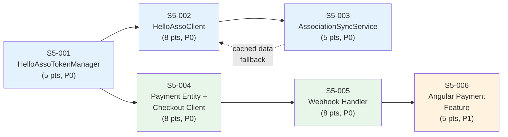

# Phase 3 / Sprint 5: HelloAsso Integration + Payments

> Points: ~39 | Stories: 6 | Sprint 5 of Phase 3

> **Codebase Conventions**: See `docs/phases/CONVENTIONS.md` for authoritative conventions.

### Prerequisites

Before starting Sprint 5 implementation:

1. **Parent POM modules**: `association-service` and `payment-service` must be added as `<module>` entries in the parent POM (`backend/pom.xml`):
   ```xml
   <modules>
     <!-- existing modules -->
     <module>association-service</module>
     <module>payment-service</module>
   </modules>
   ```

2. **HelloAsso shared components**: `HelloAssoTokenManager` and `HelloAssoProperties` should live in the `common` module (shared across `association-service` and `payment-service`), NOT duplicated in each service.

3. **Kafka topic naming**: All Kafka topics must follow the `family-hobbies.<domain>.<event>` naming pattern.

---

## Sprint Goal

Establish a fully functional HelloAsso API v5 integration layer in `association-service` with OAuth2 token management, resilient API client with circuit breaker, and bidirectional association data synchronization -- enabling all downstream payment and subscription features.

## Prerequisites

- [ ] Sprint 0 infrastructure is up (Docker Compose, Kafka broker, PostgreSQL, Eureka)
- [ ] `association-service` skeleton exists with Spring Boot 3.2.x, connects to `familyhobbies_associations` DB
- [ ] `t_association` table exists (Liquibase migration from Phase 2)
- [ ] `error-handling` module is published and available as a dependency
- [ ] `common` module is published (depends on `error-handling`)
- [ ] `HELLOASSO_CLIENT_ID` and `HELLOASSO_CLIENT_SECRET` env vars are set (sandbox credentials)
- [ ] `spring-boot-starter-webflux` dependency is available for WebClient
- [ ] `resilience4j-spring-boot3` dependency is available for circuit breaker / retry

## Dependency Map



## Stories Overview

| Story | Title | Points | Priority | Service(s) | File |
|-------|-------|--------|----------|------------|------|
| S5-001 | Implement HelloAssoTokenManager | 5 | P0 | association-service | [S5-001](./S5-001-helloasso-token-manager.md) |
| S5-002 | Implement HelloAssoClient | 8 | P0 | association-service | [S5-002](./S5-002-helloasso-client.md) |
| S5-003 | Implement AssociationSyncService | 5 | P0 | association-service | [S5-003](./S5-003-association-sync-service.md) |
| S5-004 | Payment Entity + HelloAssoCheckoutClient | 8 | P0 | payment-service | [S5-004](./S5-004-payment-entity-checkout.md) |
| S5-005 | HelloAsso Webhook Handler | 8 | P0 | payment-service | [S5-005](./S5-005-webhook-handler.md) |
| S5-006 | Angular Payment Feature | 5 | P1 | frontend | [S5-006](./S5-006-angular-payment-feature.md) |

## File Index

- [S5-001: HelloAssoTokenManager](./S5-001-helloasso-token-manager.md) -- OAuth2 token lifecycle
- [S5-002: HelloAssoClient](./S5-002-helloasso-client.md) -- Resilient API client with circuit breaker
- [S5-002: HelloAssoClient Tests](./S5-002-helloasso-client-tests.md) -- WireMock integration + circuit breaker tests
- [S5-003: AssociationSyncService](./S5-003-association-sync-service.md) -- Directory sync + admin endpoint
- [S5-003: AssociationSyncService Tests](./S5-003-association-sync-service-tests.md) -- Sync logic + admin endpoint tests
- [S5-004: Payment Entity + Checkout Client](./S5-004-payment-entity-checkout.md) -- Payment entity, Liquibase migrations, HelloAssoCheckoutClient, PaymentService
- [S5-004: Payment Entity + Checkout Client Tests](./S5-004-payment-entity-checkout-tests.md) -- PaymentServiceImpl, HelloAssoCheckoutClient, PaymentMapper tests
- [S5-005: Webhook Handler](./S5-005-webhook-handler.md) -- HMAC validation, idempotency, webhook processing, Kafka events
- [S5-005: Webhook Handler Tests](./S5-005-webhook-handler-tests.md) -- WebhookSignatureValidator, HelloAssoWebhookHandler, PaymentEventPublisher tests
- [S5-006: Angular Payment Feature](./S5-006-angular-payment-feature.md) -- Payment models, NgRx store, PaymentService, routing
- [S5-006: Angular Payment Feature Components](./S5-006-angular-payment-feature-components.md) -- PaymentListComponent, PaymentDetailComponent, CheckoutRedirectComponent, SCSS styles
- [S5-006: Angular Payment Feature Tests](./S5-006-angular-payment-feature-tests.md) -- Jest specs: PaymentListComponent, CheckoutRedirectComponent, PaymentService, payment.reducer
- [Sprint 5 Verification Checklist](./_verification.md) -- 32-step verification across all 6 stories

---

## Architecture Reminder

```
association-service/
  src/main/java/com/familyhobbies/associationservice/
  +-- adapter/
  |   +-- HelloAssoClient.java              (S5-002)
  |   +-- HelloAssoTokenManager.java        (S5-001)
  |   +-- dto/
  |       +-- HelloAssoOrganization.java     (S5-002)
  |       +-- HelloAssoDirectoryRequest.java (S5-002)
  |       +-- HelloAssoDirectoryResponse.java(S5-002)
  |       +-- HelloAssoForm.java             (S5-002)
  |       +-- HelloAssoPagination.java       (S5-002)
  +-- service/
  |   +-- AssociationSyncService.java        (S5-003, interface)
  |   +-- impl/
  |       +-- AssociationSyncServiceImpl.java(S5-003)
  +-- controller/
  |   +-- AdminSyncController.java           (S5-003)
  +-- config/
  |   +-- HelloAssoProperties.java           (S5-001)
  |   +-- WebClientConfig.java               (S5-001)
  |   +-- Resilience4jConfig.java            (S5-002)
  +-- dto/
  |   +-- response/
  |       +-- SyncResultResponse.java        (S5-003)
  +-- mapper/
      +-- AssociationMapper.java             (S5-003)
```

Dependency chain: `error-handling` <- `common` <- `association-service`

```
payment-service/
  src/main/java/com/familyhobbies/paymentservice/
  +-- adapter/
  |   +-- HelloAssoCheckoutClient.java         (S5-004)
  |   +-- HelloAssoWebhookHandler.java         (S5-005)
  +-- config/
  |   +-- HelloAssoProperties.java             (S5-004)
  |   +-- WebClientConfig.java                 (S5-004)
  |   +-- SecurityConfig.java                  (S5-004)
  +-- controller/
  |   +-- PaymentController.java               (S5-004)
  |   +-- WebhookController.java               (S5-005)
  +-- dto/
  |   +-- request/
  |   |   +-- CheckoutRequest.java             (S5-004)
  |   |   +-- HelloAssoWebhookPayload.java     (S5-005)
  |   +-- response/
  |       +-- CheckoutResponse.java            (S5-004)
  |       +-- PaymentResponse.java             (S5-004)
  |       +-- WebhookAckResponse.java          (S5-005)
  +-- entity/
  |   +-- Payment.java                         (S5-004)
  |   +-- Invoice.java                         (S5-004)
  |   +-- PaymentWebhookLog.java               (S5-005)
  +-- enums/
  |   +-- PaymentStatus.java                   (S5-004)
  |   +-- PaymentMethod.java                   (S5-004)
  |   +-- InvoiceStatus.java                   (S5-004)
  |   +-- WebhookEventType.java                (S5-005)
  +-- event/
  |   +-- publisher/
  |       +-- PaymentEventPublisher.java       (S5-005)
  +-- mapper/
  |   +-- PaymentMapper.java                   (S5-004)
  +-- repository/
  |   +-- PaymentRepository.java               (S5-004)
  |   +-- InvoiceRepository.java               (S5-004)
  |   +-- PaymentWebhookLogRepository.java     (S5-005)
  +-- security/
  |   +-- WebhookSignatureValidator.java       (S5-005)
  +-- service/
      +-- PaymentService.java                  (S5-004, interface)
      +-- impl/
          +-- PaymentServiceImpl.java          (S5-004)
```

Dependency chain: `error-handling` <- `common` <- `payment-service`

```
frontend/
  src/app/
  +-- shared/
  |   +-- models/
  |       +-- payment.model.ts                    (S5-006, enums + interfaces + status config)
  +-- features/
  |   +-- payments/
  |       +-- services/
  |       |   +-- payment.service.ts              (S5-006, HttpClient: checkout, getById, getMyPayments)
  |       +-- store/
  |       |   +-- payment.state.ts                (S5-006, PaymentState interface + initialState)
  |       |   +-- payment.actions.ts              (S5-006, createActionGroup: load, checkout, filter)
  |       |   +-- payment.reducer.ts              (S5-006, pure reducer for all payment actions)
  |       |   +-- payment.effects.ts              (S5-006, side effects: API calls + checkout redirect)
  |       |   +-- payment.selectors.ts            (S5-006, memoized selectors)
  |       +-- components/
  |       |   +-- payment-list/
  |       |   |   +-- payment-list.component.ts   (S5-006, Material table + filters + pagination)
  |       |   |   +-- payment-list.component.html
  |       |   |   +-- payment-list.component.scss
  |       |   |   +-- payment-list.component.spec.ts
  |       |   +-- payment-detail/
  |       |   |   +-- payment-detail.component.ts (S5-006, full payment info + status timeline)
  |       |   |   +-- payment-detail.component.html
  |       |   |   +-- payment-detail.component.scss
  |       |   |   +-- payment-detail.component.spec.ts
  |       |   +-- checkout-redirect/
  |       |       +-- checkout-redirect.component.ts  (S5-006, HelloAsso return handler)
  |       |       +-- checkout-redirect.component.html
  |       |       +-- checkout-redirect.component.scss
  |       |       +-- checkout-redirect.component.spec.ts
  |       +-- payments.routes.ts                  (S5-006, lazy-loaded routes: /payments/*)
  +-- core/
      +-- error-handling/                         (pre-existing, consumed by S5-006)
          +-- models/
          |   +-- api-error.model.ts
          |   +-- error-code.enum.ts
          +-- handlers/
          |   +-- http-error.handler.ts
          |   +-- global-error.handler.ts
          +-- interceptors/
              +-- error.interceptor.ts
```

Dependency chain: `error-handling (core)` <- `payment.model (shared)` <- `payment feature (features/payments)`
