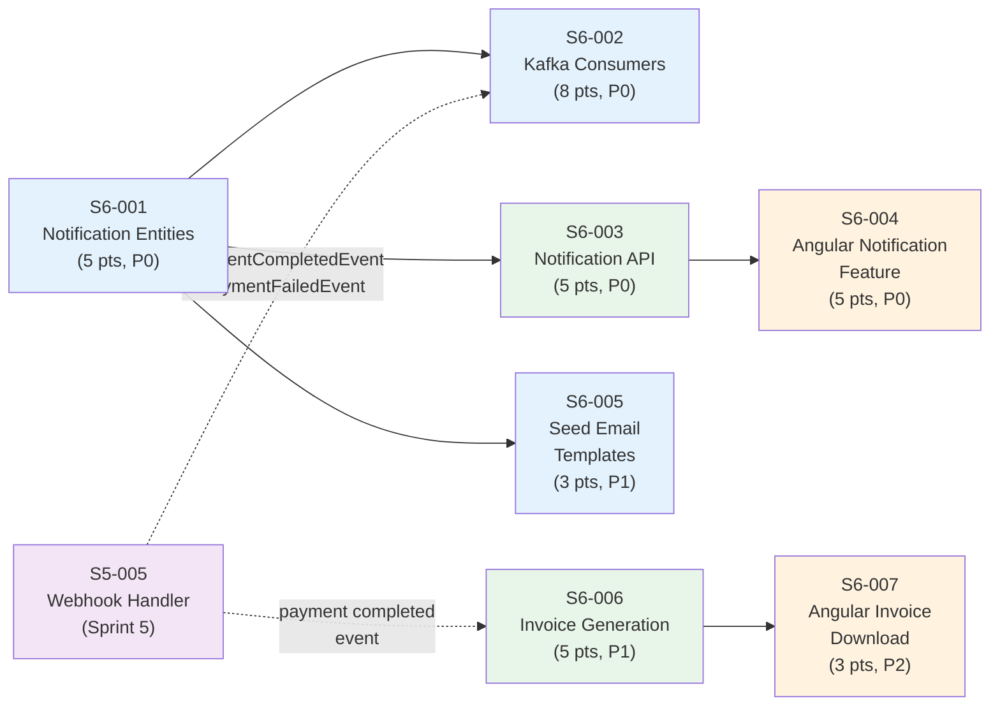

# Phase 3 / Sprint 6: Notifications + Kafka Integration

> Points: ~34 | Stories: 7 | Sprint 6 of Phase 3

---

## Sprint Goal

All Kafka events flowing between services end-to-end. Notification system delivers emails using templates and surfaces in-app notifications with unread count. Invoice generation on payment completion.

## Prerequisites

- [ ] Sprint 0 infrastructure is up (Docker Compose, Kafka broker, PostgreSQL, Eureka)
- [ ] Sprint 5 payment-service completed (HelloAsso integration, Kafka event producers)
- [ ] Kafka event producers implemented: S2-006 (user events), S3-003 (subscription events), S4-003 (attendance events), S5-005 (payment events)
- [ ] `notification-service` skeleton exists with Spring Boot 3.2.x, connects to `familyhobbies_notifications` DB
- [ ] `familyhobbies_notifications` PostgreSQL database created (Docker init script)
- [ ] `error-handling` module is published and available as a dependency
- [ ] `common` module is published (depends on `error-handling`, includes all Kafka event classes)
- [ ] Spring Mail + Thymeleaf dependencies available in `notification-service` pom.xml
- [ ] Kafka broker running on `localhost:9092` (Docker Compose)
- [ ] SMTP server configured (MailHog for development: `localhost:1025`)

## Dependency Map



## Stories Overview

| Story | Title | Points | Priority | Service(s) | File |
|-------|-------|--------|----------|------------|------|
| S6-001 | Implement Notification entities | 5 | P0 | notification-service | [S6-001](./S6-001-notification-entities.md) |
| S6-002 | Implement Kafka consumers | 8 | P0 | notification-service | [S6-002](./S6-002-kafka-consumers.md) |
| S6-003 | Implement notification API | 5 | P0 | notification-service | [S6-003](./S6-003-notification-api.md) |
| S6-004 | Implement Angular notification feature | 5 | P0 | frontend | [S6-004](./S6-004-angular-notification-feature.md) |
| S6-005 | Seed email templates | 3 | P1 | notification-service | [S6-005](./S6-005-seed-email-templates.md) |
| S6-006 | Implement invoice generation | 5 | P1 | payment-service | [S6-006](./S6-006-invoice-generation.md) |
| S6-007 | Implement Angular invoice download | 3 | P2 | frontend | [S6-007](./S6-007-angular-invoice-download.md) |

## File Index

- [S6-001: Notification Entities](./S6-001-notification-entities.md) -- Liquibase migrations, JPA entities, enums, repositories
- [S6-001: Notification Entities Tests](./S6-001-notification-entities-tests.md) -- Entity, enum, and repository TDD tests
- [S6-002: Kafka Consumers](./S6-002-kafka-consumers.md) -- KafkaConsumerConfig, event consumers, EmailService, NotificationCreationService
- [S6-002: Kafka Consumers Tests](./S6-002-kafka-consumers-tests.md) -- TDD contract tests for all consumers, EmailService, NotificationCreationService
- [S6-003: Notification API](./S6-003-notification-api.md) -- NotificationController, DTOs, NotificationMapper, NotificationService/Impl
- [S6-003: Notification API Tests](./S6-003-notification-api-tests.md) -- TDD contract tests for mapper, service, and controller
- [S6-004: Angular Notification Feature](./S6-004-angular-notification-feature.md) -- NotificationBellComponent, NotificationDropdownComponent, NotificationListPageComponent, NotificationPreferencesComponent, NotificationService, NgRx store
- [S6-004: Angular Notification Feature Tests](./S6-004-angular-notification-feature-tests.md) -- TDD Jest tests for service, reducer, bell, dropdown, list, preferences (36 tests)
- [S6-005: Seed Email Templates](./S6-005-seed-email-templates.md) -- Liquibase seed data, French Thymeleaf templates
- [S6-006: Invoice Generation](./S6-006-invoice-generation.md) -- InvoiceController, DTOs, InvoiceMapper, InvoiceService/Impl, InvoicePdfGenerator, Kafka consumer
- [S6-006: Invoice Generation Tests](./S6-006-invoice-generation-tests.md) -- TDD contract tests for mapper, number generator, service, consumer, and controller
- [S6-007: Angular Invoice Download](./S6-007-angular-invoice-download.md) -- InvoiceListComponent, InvoiceSectionComponent, InvoiceService, blob download
- [S6-007: Angular Invoice Download Tests](./S6-007-angular-invoice-download-tests.md) -- TDD Jest tests for service, list, section components (14 tests)
- [Sprint 6 Verification Checklist](./_verification.md) -- Full verification for all 7 stories: prerequisites, build, migrations, tests, integration, frontend, E2E

---

## Architecture Reminder

```
notification-service/
  src/main/java/com/familyhobbies/notificationservice/
  +-- config/
  |   +-- KafkaConsumerConfig.java              (S6-002)
  |   +-- MailConfig.java                       (S6-002)
  +-- controller/
  |   +-- NotificationController.java           (S6-003 -- Agent E)
  +-- dto/
  |   +-- request/
  |   |   +-- NotificationPreferenceRequest.java  (S6-003 -- Agent E)
  |   +-- response/
  |       +-- NotificationResponse.java           (S6-003 -- Agent E)
  |       +-- UnreadCountResponse.java            (S6-003 -- Agent E)
  |       +-- NotificationPreferenceResponse.java (S6-003 -- Agent E)
  +-- entity/
  |   +-- Notification.java                     (S6-001)
  |   +-- EmailTemplate.java                    (S6-001)
  |   +-- NotificationPreference.java           (S6-001)
  +-- enums/
  |   +-- NotificationType.java                 (S6-001)
  |   +-- NotificationCategory.java             (S6-001)
  +-- listener/
  |   +-- UserEventConsumer.java                (S6-002)
  |   +-- SubscriptionEventConsumer.java        (S6-002)
  |   +-- PaymentEventConsumer.java             (S6-002)
  |   +-- AttendanceEventConsumer.java          (S6-002)
  +-- mapper/
  |   +-- NotificationMapper.java               (S6-003 -- Agent E)
  +-- repository/
  |   +-- NotificationRepository.java           (S6-001)
  |   +-- EmailTemplateRepository.java          (S6-001)
  |   +-- NotificationPreferenceRepository.java (S6-001)
  +-- service/
  |   +-- EmailService.java                     (S6-002, interface)
  |   +-- NotificationService.java              (S6-003 -- Agent E, interface)
  |   +-- NotificationCreationService.java      (S6-002, interface)
  |   +-- impl/
  |       +-- EmailServiceImpl.java             (S6-002)
  |       +-- NotificationServiceImpl.java      (S6-003 -- Agent E)
  |       +-- NotificationCreationServiceImpl.java (S6-002)
  +-- security/                                 (future)
```

Dependency chain: `error-handling` <- `common` <- `notification-service`

```
src/main/resources/
  +-- db/changelog/
  |   +-- db.changelog-master.xml              (includes all changesets)
  |   +-- changesets/
  |       +-- 001-create-notification-table.xml        (S6-001)
  |       +-- 002-create-email-template-table.xml      (S6-001)
  |       +-- 003-create-notification-preference-table.xml (S6-001)
  |       +-- 004-seed-email-templates.xml             (S6-005)
  +-- application.yml                           (S6-002, Kafka + Mail config)
```

### Payment Service -- Invoice Architecture (S6-006)

```
payment-service/
  src/main/java/com/familyhobbies/paymentservice/
  +-- adapter/
  |   +-- HelloAssoCheckoutClient.java          (S5-004)
  |   +-- HelloAssoWebhookHandler.java          (S5-005)
  |   +-- InvoicePdfGenerator.java              (S6-006 -- Agent E)
  +-- controller/
  |   +-- PaymentController.java                (S5-004)
  |   +-- WebhookController.java                (S5-005)
  |   +-- InvoiceController.java                (S6-006 -- Agent E)
  +-- dto/
  |   +-- request/
  |   |   +-- CheckoutRequest.java              (S5-004)
  |   |   +-- HelloAssoWebhookPayload.java      (S5-005)
  |   +-- response/
  |       +-- CheckoutResponse.java             (S5-004)
  |       +-- PaymentResponse.java              (S5-004)
  |       +-- InvoiceResponse.java              (S6-006 -- Agent E)
  |       +-- InvoiceSummaryResponse.java        (S6-006 -- Agent E)
  |       +-- LineItemResponse.java              (S6-006 -- Agent E)
  +-- entity/
  |   +-- Payment.java                          (S5-004)
  |   +-- Invoice.java                          (S5-004, extended S6-006)
  |   +-- PaymentWebhookLog.java                (S5-005)
  +-- enums/
  |   +-- PaymentStatus.java                    (S5-004)
  |   +-- PaymentMethod.java                    (S5-004)
  |   +-- InvoiceStatus.java                    (S5-004)
  |   +-- WebhookEventType.java                 (S5-005)
  +-- event/publisher/
  |   +-- PaymentEventPublisher.java            (S5-005)
  +-- listener/
  |   +-- PaymentCompletedEventConsumer.java     (S6-006 -- Agent E)
  +-- mapper/
  |   +-- PaymentMapper.java                    (S5-004)
  |   +-- InvoiceMapper.java                    (S6-006 -- Agent E)
  +-- repository/
  |   +-- PaymentRepository.java                (S5-004)
  |   +-- InvoiceRepository.java                (S5-004, extended S6-006)
  |   +-- PaymentWebhookLogRepository.java      (S5-005)
  +-- service/
  |   +-- PaymentService.java                   (S5-004, interface)
  |   +-- InvoiceService.java                   (S6-006 -- Agent E, interface)
  |   +-- InvoiceNumberGenerator.java           (S6-006 -- Agent E)
  |   +-- impl/
  |       +-- PaymentServiceImpl.java           (S5-004)
  |       +-- InvoiceServiceImpl.java           (S6-006 -- Agent E)
```

Dependency chain: `error-handling` <- `common` <- `payment-service`

```
src/main/resources/
  +-- db/changelog/
  |   +-- db.changelog-master.xml                   (includes all changesets)
  |   +-- changesets/
  |       +-- 001-create-payment-table.xml           (S5-004)
  |       +-- 002-create-invoice-table.xml           (S5-004)
  |       +-- 003-create-payment-webhook-log-table.xml (S5-005)
  |       +-- 004-alter-invoice-add-columns.xml      (S6-006 -- Agent E)
  |       +-- 005-create-invoice-number-sequence.xml  (S6-006 -- Agent E)
  +-- application.yml                                 (S5-004, Kafka + DB config)
```

### Frontend -- Notification Feature Architecture (S6-004)

```
frontend/src/app/
+-- shared/models/
|   +-- notification.model.ts                          (S6-004 -- Agent F)
+-- features/notifications/
    +-- services/
    |   +-- notification.service.ts                    (S6-004 -- Agent F)
    |   +-- notification.service.spec.ts               (S6-004 -- Agent F)
    +-- store/
    |   +-- notification.state.ts                      (S6-004 -- Agent F)
    |   +-- notification.actions.ts                    (S6-004 -- Agent F)
    |   +-- notification.reducer.ts                    (S6-004 -- Agent F)
    |   +-- notification.reducer.spec.ts               (S6-004 -- Agent F)
    |   +-- notification.selectors.ts                  (S6-004 -- Agent F)
    |   +-- notification.effects.ts                    (S6-004 -- Agent F)
    +-- components/
    |   +-- notification-bell/
    |   |   +-- notification-bell.component.ts         (S6-004 -- Agent F)
    |   |   +-- notification-bell.component.html       (S6-004 -- Agent F)
    |   |   +-- notification-bell.component.scss       (S6-004 -- Agent F)
    |   |   +-- notification-bell.component.spec.ts    (S6-004 -- Agent F)
    |   +-- notification-dropdown/
    |   |   +-- notification-dropdown.component.ts     (S6-004 -- Agent F)
    |   |   +-- notification-dropdown.component.html   (S6-004 -- Agent F)
    |   |   +-- notification-dropdown.component.scss   (S6-004 -- Agent F)
    |   |   +-- notification-dropdown.component.spec.ts (S6-004 -- Agent F)
    |   +-- notification-preferences/
    |       +-- notification-preferences.component.ts  (S6-004 -- Agent F)
    |       +-- notification-preferences.component.html (S6-004 -- Agent F)
    |       +-- notification-preferences.component.scss (S6-004 -- Agent F)
    |       +-- notification-preferences.component.spec.ts (S6-004 -- Agent F)
    +-- pages/
    |   +-- notification-list/
    |       +-- notification-list.component.ts         (S6-004 -- Agent F)
    |       +-- notification-list.component.html       (S6-004 -- Agent F)
    |       +-- notification-list.component.scss       (S6-004 -- Agent F)
    |       +-- notification-list.component.spec.ts    (S6-004 -- Agent F)
    +-- notifications.routes.ts                        (S6-004 -- Agent F)
```

### Frontend -- Invoice Feature Architecture (S6-007)

```
frontend/src/app/
+-- shared/models/
|   +-- invoice.model.ts                               (S6-007 -- Agent F)
+-- features/invoices/
    +-- services/
    |   +-- invoice.service.ts                         (S6-007 -- Agent F)
    |   +-- invoice.service.spec.ts                    (S6-007 -- Agent F)
    +-- components/
    |   +-- invoice-section/
    |       +-- invoice-section.component.ts           (S6-007 -- Agent F)
    |       +-- invoice-section.component.html         (S6-007 -- Agent F)
    |       +-- invoice-section.component.scss         (S6-007 -- Agent F)
    |       +-- invoice-section.component.spec.ts      (S6-007 -- Agent F)
    +-- pages/
    |   +-- invoice-list/
    |       +-- invoice-list.component.ts              (S6-007 -- Agent F)
    |       +-- invoice-list.component.html            (S6-007 -- Agent F)
    |       +-- invoice-list.component.scss            (S6-007 -- Agent F)
    |       +-- invoice-list.component.spec.ts         (S6-007 -- Agent F)
    +-- invoices.routes.ts                             (S6-007 -- Agent F)
```
