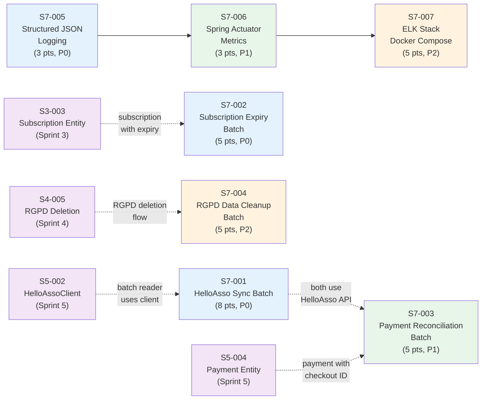

# Phase 4 / Sprint 7: Batch Processing + Monitoring

> **Codebase Conventions**: See `docs/phases/CONVENTIONS.md` for authoritative conventions.
> Key conventions for this sprint: Spring Batch 5.x (no @EnableBatchProcessing), Instant timestamps, Liquibase-managed batch schema, camelCase MDC keys.

> Points: ~34 | Stories: 7 | Sprint 7 of Phase 4

---

## Sprint Goal

All batch jobs implemented and scheduled. Monitoring infrastructure operational with structured logging, health checks, and metrics exposure. ELK stack available for log aggregation. Each batch job follows the Spring Batch 5.x chunk-oriented pattern with fault tolerance, listener-driven observability, and dual execution mode (CRON schedule + admin REST trigger). The monitoring chain (structured logging, Actuator metrics, ELK) provides full observability from application logs through to Kibana dashboards.

## Prerequisites

- [ ] Sprint 0 infrastructure is up (Docker Compose, Kafka broker, PostgreSQL, Eureka)
- [ ] All Phase 1 sprints complete (Sprint 0 infrastructure, Sprint 1 security)
- [ ] All Phase 2 sprints complete (Sprint 2 family/associations, Sprint 3 subscriptions, Sprint 4 attendance/RGPD)
- [ ] All Phase 3 sprints complete (Sprint 5 HelloAsso payments, Sprint 6 notifications/Kafka)
- [ ] `error-handling` module is published and available as a dependency
- [ ] `common` module is published (depends on `error-handling`, includes all Kafka event classes)
- [ ] `association-service` fully operational with `HelloAssoClient` (S5-002), `AssociationSyncService` (S5-003), subscription entities (S3-003)
- [ ] `payment-service` fully operational with payment entities and HelloAsso checkout ID (S5-004)
- [ ] `user-service` fully operational with RGPD deletion flow (S4-005)
- [ ] Spring Batch dependency added to each service that runs batch jobs:
  ```xml
  <dependency>
      <groupId>org.springframework.boot</groupId>
      <artifactId>spring-boot-starter-batch</artifactId>
  </dependency>
  <dependency>
      <groupId>org.springframework.batch</groupId>
      <artifactId>spring-batch-test</artifactId>
      <scope>test</scope>
  </dependency>
  ```
- [ ] PostgreSQL databases exist for all services (`familyhobbies_associations`, `familyhobbies_payments`, `familyhobbies_users`, `familyhobbies_notifications`)
- [ ] Kafka broker running on `localhost:9092` (Docker Compose)
- [ ] `HELLOASSO_CLIENT_ID` and `HELLOASSO_CLIENT_SECRET` env vars set (sandbox credentials)

## Dependency Map



### Dependency Notes

- **S7-001 through S7-004** are independent batch jobs that can be developed in parallel.
- **S7-001 and S7-003** both interact with HelloAsso API; S7-001 should be completed first so its patterns (reader, skip policy) can be reused.
- **S7-005, S7-006, S7-007** form a monitoring chain and must be implemented sequentially: structured logging feeds metrics, metrics feed ELK dashboards.
- **S7-005 through S7-007** are independent of all feature/batch work and can be developed in parallel with S7-001 through S7-004.

## Stories Overview

| Story | Title | Points | Priority | Service(s) | Depends On | File |
|-------|-------|--------|----------|------------|------------|------|
| S7-001 | HelloAsso Sync Batch Job | 8 | P0 | association-service | S5-002 (HelloAssoClient) | [S7-001](./S7-001-helloasso-sync-batch.md) |
| S7-002 | Subscription Expiry Batch Job | 5 | P0 | association-service | S3-003 (Subscription entity) | [S7-002](./S7-002-subscription-expiry-batch.md) |
| S7-003 | Payment Reconciliation Batch Job | 5 | P1 | payment-service | S5-004 (Payment entity) | [S7-003](./S7-003-payment-reconciliation-batch.md) |
| S7-004 | RGPD Data Cleanup Batch Job | 5 | P2 | user-service | S4-005 (RGPD deletion flow) | [S7-004](./S7-004-rgpd-data-cleanup-batch.md) |
| S7-005 | Structured JSON Logging | 3 | P0 | all services | -- | [S7-005](./S7-005-structured-json-logging.md) |
| S7-006 | Spring Actuator Metrics | 3 | P1 | all services | S7-005 | [S7-006](./S7-006-actuator-metrics.md) |
| S7-007 | ELK Stack Docker Compose | 5 | P2 | infrastructure | S7-006 | [S7-007](./S7-007-elk-stack-docker.md) |

## File Index

### Story Files
- [S7-001: HelloAsso Sync Batch Job](./S7-001-helloasso-sync-batch.md) -- Spring Batch job config, paginated reader, processor, writer, skip policy, scheduler, admin endpoint
- [S7-002: Subscription Expiry Batch Job](./S7-002-subscription-expiry-batch.md) -- JPA reader, expiry processor, writer, Kafka event, job listener
- [S7-003: Payment Reconciliation Batch Job](./S7-003-payment-reconciliation-batch.md) -- Stale payment reader, HelloAsso reconciliation processor, writer, Kafka events, admin endpoint
- [S7-004: RGPD Data Cleanup Batch Job](./S7-004-rgpd-cleanup-batch.md) -- Deletion request reader, anonymization processor, writer, audit log, cross-service Kafka cleanup
- [S7-005: Structured JSON Logging](./S7-005-structured-json-logging.md) -- logstash-logback-encoder, MdcLoggingFilter, logback-spring.xml per service
- [S7-006: Spring Actuator Metrics](./S7-006-spring-actuator-metrics.md) -- Health indicators (Kafka, DB, HelloAsso), Prometheus endpoint, custom Micrometer counters
- [S7-007: ELK Stack Docker Compose](./S7-007-elk-stack-docker.md) -- Elasticsearch, Logstash, Kibana with Docker Compose monitoring profile

### Companion Files
- [S7-003 Tests Companion](./S7-003-payment-reconciliation-batch-tests.md) -- JUnit 5 test classes for payment reconciliation batch (6 test files, ~30 test cases)

### Verification
- [Sprint 7 Verification Checklist](./_verification.md) -- End-to-end verification commands for all 7 stories

---

## Architecture Reminder

### Batch Package Structure (association-service)

```
association-service/
  src/main/java/com/familyhobbies/associationservice/
  +-- batch/
  |   +-- config/
  |   |   +-- BatchConfig.java                    (shared: async launcher, @EnableScheduling)
  |   |   +-- HelloAssoSyncJobConfig.java         (S7-001)
  |   |   +-- BatchSchedulerConfig.java           (S7-001)
  |   |   +-- SubscriptionExpiryJobConfig.java    (S7-002)
  |   +-- reader/
  |   |   +-- HelloAssoItemReader.java            (S7-001)
  |   +-- processor/
  |   |   +-- HelloAssoItemProcessor.java         (S7-001)
  |   |   +-- SubscriptionExpiryProcessor.java    (S7-002)
  |   +-- writer/
  |   |   +-- HelloAssoItemWriter.java            (S7-001)
  |   |   +-- SubscriptionExpiryWriter.java       (S7-002)
  |   +-- policy/
  |   |   +-- HelloAssoSkipPolicy.java            (S7-001)
  |   +-- listener/
  |       +-- SyncJobListener.java                (S7-001)
  |       +-- SubscriptionExpiryJobListener.java  (S7-002)
  +-- controller/
  |   +-- AdminBatchController.java               (S7-001, extended by S7-002)
  +-- adapter/
  |   +-- HelloAssoClient.java                    (pre-existing S5-002)
  |   +-- HelloAssoTokenManager.java              (pre-existing S5-001)
  +-- entity/
  |   +-- Association.java                        (pre-existing)
  |   +-- Subscription.java                       (pre-existing S3-003)
  +-- repository/
      +-- AssociationRepository.java              (pre-existing)
      +-- SubscriptionRepository.java             (pre-existing S3-003)
```

### Batch Package Structure (payment-service)

```
payment-service/
  src/main/java/com/familyhobbies/paymentservice/
  +-- batch/
  |   +-- config/
  |   |   +-- BatchConfig.java                        (shared: async launcher, @EnableScheduling)
  |   |   +-- PaymentReconciliationJobConfig.java     (S7-003)
  |   +-- reader/
  |   |   +-- UnreconciledPaymentReader.java          (S7-003)
  |   +-- processor/
  |   |   +-- PaymentReconciliationProcessor.java     (S7-003)
  |   +-- writer/
  |   |   +-- PaymentReconciliationWriter.java        (S7-003)
  |   +-- listener/
  |       +-- ReconciliationJobListener.java          (S7-003)
  +-- controller/
      +-- AdminBatchController.java                   (S7-003)
```

### Batch Package Structure (user-service)

```
user-service/
  src/main/java/com/familyhobbies/userservice/
  +-- batch/
  |   +-- config/
  |   |   +-- BatchConfig.java                        (shared: async launcher, @EnableScheduling)
  |   |   +-- RgpdCleanupJobConfig.java               (S7-004)
  |   +-- reader/
  |   |   +-- DeletionRequestReader.java              (S7-004)
  |   +-- processor/
  |   |   +-- RgpdCleanupProcessor.java               (S7-004)
  |   +-- writer/
  |   |   +-- RgpdCleanupWriter.java                  (S7-004)
  |   +-- listener/
  |       +-- RgpdCleanupJobListener.java             (S7-004)
  +-- controller/
      +-- AdminBatchController.java                   (S7-004)
```

### Monitoring Package Structure (all services)

```
{service}/
  src/main/resources/
  +-- logback-spring.xml                              (S7-005)
  +-- application.yml                                 (S7-006: actuator config)

docker/
  +-- elk/
  |   +-- docker-compose.elk.yml                      (S7-007)
  |   +-- elasticsearch/
  |   |   +-- elasticsearch.yml                       (S7-007)
  |   +-- logstash/
  |   |   +-- logstash.conf                           (S7-007)
  |   |   +-- pipeline/                               (S7-007)
  |   +-- kibana/
  |       +-- kibana.yml                              (S7-007)
```

### Shared Batch Configuration Pattern

Every service that runs batch jobs includes this shared `BatchConfig.java`:

```java
package com.familyhobbies.{servicename}.batch.config;

import org.springframework.batch.core.launch.JobLauncher;
import org.springframework.batch.core.launch.support.TaskExecutorJobLauncher;
import org.springframework.batch.core.repository.JobRepository;
import org.springframework.context.annotation.Bean;
import org.springframework.context.annotation.Configuration;
import org.springframework.core.task.TaskExecutor;
import org.springframework.scheduling.annotation.EnableScheduling;
import org.springframework.scheduling.concurrent.ThreadPoolTaskExecutor;

/**
 * Convention: Spring Boot 3.2 / Spring Batch 5.x -- do NOT use @EnableBatchProcessing
 * as it disables auto-configuration. Let Spring Boot auto-configure JobRepository
 * and PlatformTransactionManager beans.
 */
@Configuration
@EnableScheduling
public class BatchConfig {

    @Bean(name = "batchTaskExecutor")
    public TaskExecutor batchTaskExecutor() {
        ThreadPoolTaskExecutor executor = new ThreadPoolTaskExecutor();
        executor.setCorePoolSize(2);
        executor.setMaxPoolSize(4);
        executor.setQueueCapacity(10);
        executor.setThreadNamePrefix("batch-");
        executor.setWaitForTasksToCompleteOnShutdown(true);
        executor.setAwaitTerminationSeconds(60);
        executor.initialize();
        return executor;
    }

    @Bean
    public JobLauncher asyncJobLauncher(JobRepository jobRepository,
                                        TaskExecutor batchTaskExecutor) throws Exception {
        TaskExecutorJobLauncher launcher = new TaskExecutorJobLauncher();
        launcher.setJobRepository(jobRepository);
        launcher.setTaskExecutor(batchTaskExecutor);
        launcher.afterPropertiesSet();
        return launcher;
    }
}
```

### Spring Batch application.yml (per service)

```yaml
spring:
  batch:
    jdbc:
      initialize-schema: never     # Batch schema managed by Liquibase -- do NOT use 'always'
    job:
      enabled: false               # Do not auto-run jobs on startup
```

Dependency chain: `error-handling` <- `common` <- `{each service}`
