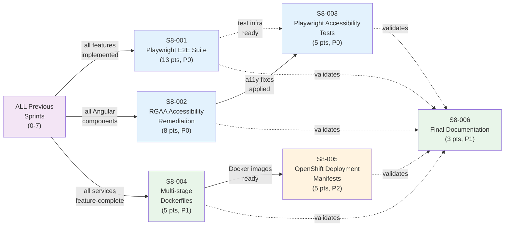

# Phase 4 / Sprint 8: E2E Tests + RGAA + Final Polish

> Points: ~39 | Stories: 6 | Sprint 8 of Phase 4

---

## Sprint Goal

Full E2E test coverage with Playwright. RGAA accessibility compliance verified and remediated. Docker images optimized for production. Documentation finalized.

> **Note**: This is the Innovation & Planning (IP) sprint -- focused on hardening, testing, technical debt, and production readiness. No new features are introduced. Every story hardens or validates work from previous sprints.

## Prerequisites

- [ ] Sprint 0 infrastructure is up (Docker Compose, Kafka broker, PostgreSQL, Eureka)
- [ ] Sprint 1 discovery-service + api-gateway deployed and healthy
- [ ] Sprint 2 user-service feature-complete (auth, users, families, RGPD)
- [ ] Sprint 3 association-service feature-complete (activities, sessions, subscriptions)
- [ ] Sprint 4 attendance tracking feature-complete (calendar, marking, history)
- [ ] Sprint 5 HelloAsso integration feature-complete (token, client, sync, payments, webhooks)
- [ ] Sprint 6 notifications + Kafka feature-complete (consumers, email, in-app, invoices)
- [ ] Sprint 7 batch jobs + monitoring feature-complete (sync batch, expiry, reconciliation, RGPD cleanup)
- [ ] All Angular feature modules implemented and unit-tested (auth, dashboard, families, associations, subscriptions, attendance, payments, notifications, settings)
- [ ] All backend microservices compile and pass unit tests
- [ ] All Liquibase migrations run without error
- [ ] Docker Compose starts all services and front-end without manual intervention
- [ ] Node.js 18+ and npm available on CI runners
- [ ] Playwright CLI available (`npx playwright install`)

## Dependency Map



## Stories Overview

| Story | Title | Points | Priority | Service(s) | File |
|-------|-------|--------|----------|------------|------|
| S8-001 | Implement Playwright E2E test suite | 13 | P0 | e2e / frontend | [S8-001](./S8-001-playwright-e2e-suite.md) |
| S8-002 | RGAA accessibility remediation | 8 | P0 | frontend | [S8-002](./S8-002-rgaa-accessibility.md) |
| S8-003 | Playwright accessibility tests | 5 | P0 | e2e / frontend | [S8-003](./S8-003-playwright-accessibility-tests.md) |
| S8-004 | Multi-stage Dockerfiles | 5 | P1 | all backend services / frontend | [S8-004](./S8-004-multi-stage-dockerfiles.md) |
| S8-005 | OpenShift deployment manifests | 5 | P2 | infrastructure | [S8-005](./S8-005-openshift-manifests.md) |
| S8-006 | Final documentation | 3 | P1 | docs | [S8-006](./S8-006-final-documentation.md) |

## File Index

- [S8-001: Playwright E2E Suite](./S8-001-playwright-e2e-suite.md) -- Playwright config, Page Object Models, docker-compose.e2e.yml, CI workflow, helpers, fixtures
- [S8-001: Playwright E2E Test Specs](./S8-001-playwright-e2e-suite-tests.md) -- All 8 E2E test spec files (auth, family, association-search, subscription, attendance, payment, notification, rgpd) -- 85 tests
- [S8-002: RGAA Accessibility Remediation](./S8-002-rgaa-accessibility.md) -- Skip-to-content, landmarks, form a11y, tables, keyboard nav, color contrast, focus indicator, dialog focus, loading states
- [S8-002: RGAA Accessibility Tests](./S8-002-rgaa-accessibility-tests.md) -- Jest unit tests for a11y components (skip-to-content, focus-indicator, confirm-dialog, loading-spinner, empty-state, error-message) -- 34 tests
- [S8-003: Playwright Accessibility Tests](./S8-003-playwright-accessibility-tests.md) -- Keyboard navigation, landmarks, form a11y, axe-core scans across all pages
- [S8-004: Multi-stage Dockerfiles](./S8-004-multi-stage-dockerfiles.md) -- Multi-stage Dockerfiles for all 6 backend services + frontend, nginx.conf, .dockerignore, build/verify scripts
- [S8-005: OpenShift Deployment Manifests](./S8-005-openshift-manifests.md) -- Kustomize base + overlays (dev/prod), Deployments, Services, Routes, ConfigMaps, Secrets, PostgreSQL StatefulSet, Kafka StatefulSet, deployment guide
- [S8-006: Final Documentation](./S8-006-final-documentation.md) -- Portfolio-grade README, Springdoc OpenAPI config, Swagger annotations, Postman collection (34 requests), Postman environments (local/docker), ADR review
- [Verification Checklist](./_verification.md) -- Comprehensive verification covering all 6 stories + end-to-end smoke test + production readiness checklist

---

## Architecture Reminder

### E2E Test Architecture (S8-001 + S8-003)

```
e2e/
  +-- playwright.config.ts                       (S8-001)
  +-- package.json                               (S8-001)
  +-- tsconfig.json                              (S8-001)
  +-- pages/
  |   +-- login.page.ts                          (S8-001)
  |   +-- register.page.ts                       (S8-001)
  |   +-- dashboard.page.ts                      (S8-001)
  |   +-- family.page.ts                         (S8-001)
  |   +-- association-search.page.ts             (S8-001)
  |   +-- association-detail.page.ts             (S8-001)
  |   +-- subscription.page.ts                   (S8-001)
  |   +-- attendance.page.ts                     (S8-001)
  |   +-- payment.page.ts                        (S8-001)
  |   +-- notification.page.ts                   (S8-001)
  |   +-- settings.page.ts                       (S8-001)
  +-- specs/
  |   +-- auth.spec.ts                           (S8-001)
  |   +-- family.spec.ts                         (S8-001)
  |   +-- association-search.spec.ts             (S8-001)
  |   +-- subscription.spec.ts                   (S8-001)
  |   +-- attendance.spec.ts                     (S8-001)
  |   +-- payment.spec.ts                        (S8-001)
  |   +-- notification.spec.ts                   (S8-001)
  |   +-- rgpd.spec.ts                           (S8-001)
  |   +-- a11y/
  |       +-- a11y-keyboard.spec.ts              (S8-003)
  |       +-- a11y-landmarks.spec.ts             (S8-003)
  |       +-- a11y-forms.spec.ts                 (S8-003)
  |       +-- a11y-axe.spec.ts                   (S8-003)
  +-- fixtures/
  |   +-- test-data.ts                           (S8-001)
  +-- helpers/
      +-- api-helper.ts                          (S8-001)
      +-- auth-helper.ts                         (S8-001)
      +-- a11y-helper.ts                         (S8-003)

docker/
  +-- docker-compose.e2e.yml                     (S8-001)

.github/workflows/
  +-- e2e-tests.yml                              (S8-001)
```

### Service Ports

| Service | Port |
|---------|------|
| api-gateway | 8080 |
| frontend | 4200 |
| user-service | 8081 |
| association-service | 8082 |
| payment-service | 8083 |
| notification-service | 8084 |
| discovery-service | 8761 |

### Angular Routes (tested by E2E)

| Route | Feature |
|-------|---------|
| `/auth/login` | User login |
| `/auth/register` | User registration |
| `/dashboard` | Family dashboard |
| `/families` | Family management |
| `/families/:id` | Family detail |
| `/associations/search` | Association search |
| `/associations/:id` | Association detail |
| `/subscriptions` | Subscription list |
| `/attendance` | Attendance calendar |
| `/payments` | Payment list |
| `/payments/:id` | Payment detail |
| `/notifications` | Notification list |
| `/settings` | User settings / RGPD |
